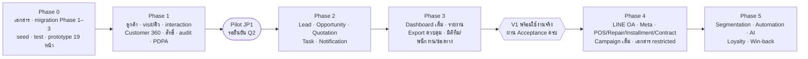

# Requirement Review (PRD + BRD) — JAUN CRM · Customer 360

**ระบบ:** JAUN CRM · Customer 360
**องค์กร:** JAUN — JAUNPHONE (สาขา JP1–JP4 · ทีมออนไลน์ส่วนกลาง JPON) · JAUN POWER MONEY
**วันที่จัดทำ:** 16 ก.ย. 2569
**ฐานอ้างอิง:** `docs/00-brief/CANONICAL.md` **v2.2** (16 ก.ย. 2569 · รวมข้อตัดสินข้อ 19 · D48–D51 · Q26–Q30) · ชื่อตาราง/คอลัมน์/trigger ตาม `supabase/migrations/0001–0009` (CANONICAL ข้อ 19.1) · บรีฟต้นฉบับ `docs/00-brief/REQUIREMENT.md` (A1–A45 · B1–B27) · mockup A/B ในโฟลเดอร์ `UX:UI/`
**ครอบคลุมเอกสารตาม A45:** #01 Product Requirement Document · #02 Business Requirement
**เอกสารคู่กัน:** `docs/01-requirement/user-flows.md` (A45 #04 Workflow)

> **หลักการอ่านเอกสารนี้**
> - เอกสารนี้ **ไม่ตั้งค่าใหม่** ทุกรหัส ป้าย สูตร และตัวเลขมาจาก CANONICAL · ค่าที่ CANONICAL ไม่มีเขียนว่า "รอยืนยัน"
> - ที่ใดที่บรีฟหรือ mockup ไม่ตรงกับ CANONICAL ให้ถือ CANONICAL และอ้างเลขการตัดสินใจ `Dxx` (CANONICAL ข้อ 16)
> - **"หมายเหตุผู้เขียน"** คือการตีความเมื่อ CANONICAL กำกวมหรือไม่ครอบคลุม ทุกข้อมีรหัส `AN-xx` และรวมไว้ใน [ภาคผนวก ก](#ภาคผนวก-ก--หมายเหตุผู้เขียน) เพื่อให้เจ้าของโครงการยืนยัน · `user-flows.md` ใช้รหัสชุดเดียวกัน · ข้อที่ CANONICAL v2.2 ตัดสินแล้วถูกแทนด้วยการอ้างเลขข้อของ CANONICAL (รายการเลข AN ที่ปิดแล้วอยู่ในภาคผนวก ก.2)
> - ตัวเลขตัวอย่างทั้งหมดเป็น **ข้อมูลสมมติของ seed** ณ "ตอนนี้" = 11 ก.ย. 2569 10:24 น. · P = "30 วันล่าสุด" = [13 ส.ค. 2569, 12 ก.ย. 2569) (CANONICAL ข้อ 13)

---

## สารบัญ

1. [ปัญหา เป้าหมาย และตัวชี้วัดความสำเร็จ](#1-ปัญหา-เป้าหมาย-และตัวชี้วัดความสำเร็จ)
2. [ขอบเขตตาม Phase](#2-ขอบเขตตาม-phase)
3. [ผู้ใช้ บทบาท และงานที่ต้องทำให้สำเร็จ](#3-ผู้ใช้-บทบาท-และงานที่ต้องทำให้สำเร็จ-jobs-to-be-done)
4. [ตารางตรวจย้อน A1–A45 · B1–B27](#4-ตารางตรวจย้อน-traceability-a1a45--b1b27)
5. [คำถาม Acceptance ของ V1](#5-คำถาม-acceptance-ของ-v1-a44--b27)
6. [ความต้องการที่ไม่ใช่ฟังก์ชัน](#6-ความต้องการที่ไม่ใช่ฟังก์ชัน-non-functional-requirements)
7. [สรุปการตัดสินใจสำคัญ](#7-สรุปการตัดสินใจสำคัญ)
8. [ความเสี่ยงและการลดความเสี่ยง](#8-ความเสี่ยงและการลดความเสี่ยง)
9. [คำถามที่ยังค้าง Q1–Q30](#9-คำถามที่ยังค้าง-q1q30)
- [ภาคผนวก ก — หมายเหตุผู้เขียน](#ภาคผนวก-ก--หมายเหตุผู้เขียน)

---

## 1. ปัญหา เป้าหมาย และตัวชี้วัดความสำเร็จ

### 1.1 บริบทธุรกิจ

| หัวข้อ | ข้อเท็จจริง (CANONICAL) |
|---|---|
| องค์กร | `JAUN` องค์กรเดียวใน V1 · business unit `JAUNPHONE` (ค้าปลีก iPhone/อุปกรณ์ · รับซื้อ · เทิร์น · ซ่อม) และ `JPM` JAUN POWER MONEY (ผ่อนชำระ · V1 เชื่อมผ่าน transaction ref เท่านั้น · รอยืนยัน Q17) (ข้อ 2) |
| หน่วยที่ให้บริการ | สาขา `JP1` `JP2` `JP3` `JP4` (`store`) · `JPON` ทีมออนไลน์ส่วนกลาง (`online_team` · รอยืนยัน Q3) (ข้อ 2) |
| ช่องทางติดต่อ | `WALK_IN` `LINE` `FACEBOOK` `INSTAGRAM` `TIKTOK` `PHONE` `WEBSITE` — สด (`is_live`) เฉพาะ `WALK_IN` `PHONE` (ข้อ 5.1) |
| ขนาดข้อมูลอ้างอิง (seed) | ลูกค้า `ACTIVE` 14,962 · ผู้มาติดต่อใน P 3,125 · Leads 892 · Opportunities 368 · ปิดการขาย 215 · ยอดขาย ฿3,332,700 (ข้อ 13.0 · 13.1) — ใช้เป็นลำดับขนาดสำหรับออกแบบ ไม่ใช่ปริมาณจริงของ production (ปริมาณจริง รอยืนยัน) |
| ผู้ใช้ | 8 บทบาท (ข้อ 7) · บัญชีตัวอย่าง 14 บัญชี (ข้อ 13.5) |

### 1.2 ปัญหาที่ระบบต้องแก้

| # | ปัญหา | หลักฐานในบรีฟ | สิ่งที่ระบบทำ (CANONICAL) |
|---|---|---|---|
| P1 | ถามว่า "เดือนนี้มีลูกค้ากี่คน" แล้วตอบไม่ได้ เพราะคำว่า "ลูกค้า" ไม่มีนิยามกลาง | A2 · B1 · B2 | นิยามที่นับได้จากฐานข้อมูลทุกคำ (ข้อ 3.1) · KPI มีรหัสและสูตรเดียว (ข้อ 12) |
| P2 | คนที่เดินเข้าร้านแต่ไม่ให้ชื่อไม่ถูกนับ ตัวเลข traffic ผิดตั้งแต่ต้น | A4 · B6 | visit เกิดเมื่อกด "รับเข้าคิว"/"เริ่มให้บริการ" แม้ยังไม่รู้ตัวตน (ข้อ 3.3 ข้อ 2) |
| P3 | ลูกค้าออนไลน์กับหน้าร้านอยู่คนละฐาน | A5 · B7 | ลูกค้าหนึ่งคนหนึ่ง record · visit ตารางเดียวทุกช่องทาง (D1 · ข้อ 3.3) |
| P4 | สถานะ/เหตุผล/ช่องทางพิมพ์อิสระ วิเคราะห์ไม่ได้ | A7 · A14 · B15 | ENUM สำหรับสถานะ (ข้อ 4) · Master Data `ref.*` ห้ามพิมพ์อิสระ (ข้อ 5) |
| P5 | ไม่รู้ว่าใครต้องติดตามใคร เมื่อไร และงานค้างของทีม | A9 · B9 | lead/opportunity ที่เปิดต้องมี next action (CHECK) · task ซิงก์อัตโนมัติ · แจ้งเตือนและยกระดับ (ข้อ 4.4 · 4.7 · 11) |
| P6 | ข้อมูลซ้ำ ไม่ครบ | A13 · A40 · B14 | ตรวจซ้ำก่อนสร้าง · ศูนย์คุณภาพข้อมูล 9 รายการ (ข้อ 6.5 · 12.3) |
| P7 | ข้อมูลลูกค้าเป็นความเสี่ยงรั่วไหล (ผู้ดูแลระบบ · export · หน้าจอ) | A17 · A29–A36 · B20–B23 | ตรวจสิทธิ์ในฐานข้อมูล · ปิดบังค่าติดต่อ · audit · export ควบคุม · PDPA (ข้อ 8–10) |
| P8 | ผู้จัดการ/ผู้บริหารต้องนับ Excel | A41 · A45 | Dashboard/รายงานคำนวณจากแถวจริงผ่าน `api.get_kpis` `api.get_report` (ข้อ 9.4.1) |

### 1.3 เป้าหมายและตัวชี้วัดที่วัดได้

| # | เป้าหมาย | ตัวชี้วัด / วิธีวัด | เกณฑ์ผ่าน | ค่าในข้อมูลตัวอย่าง | อ้างอิง |
|---|---|---|---|---|---|
| G1 | ตอบคำถาม Acceptance ของ V1 จากฐานข้อมูลจริง | ทุกข้อใน [ข้อ 5](#5-คำถาม-acceptance-ของ-v1-a44--b27) คืนค่าผ่าน RPC · `supabase/tests/acceptance.sql` assert ทุกตัวเลขในข้อ 13 | ผ่าน 100% | – | A44 · B27 · ข้อ 13.0 ข้อ 9 |
| G2 | บันทึกตัวตนลูกค้า | `CAPTURE_RATE` | ≥ 95% | 87.0% (**ต่ำกว่าเป้า**) | ข้อ 12.3 · 13.1 |
| G3 | บันทึกผลการให้บริการครบ | `OUTCOME_COMPLETION` | ≥ 95% | 95.4% (ผ่าน) | ข้อ 12.3 · 13.1 |
| G4 | ติดตามตรงเวลา | `FOLLOWUP_COMPLETION` | ≥ 90% | 85.0% (**ต่ำกว่าเป้า**) | ข้อ 12.3 · 13.1 |
| G5 | ข้อมูลซ้ำต่ำ | `DUPLICATE_RATE` | < 2% | 0.1% (ผ่าน) | ข้อ 12.3 · 13.1 |
| G6 | ข้อมูลจำเป็นครบ | `MISSING_REQUIRED_RATE` | < 2% | 0.4% (ผ่าน) | ข้อ 12.3 · 13.1 |
| G7 | ทุกโอกาสขายที่เปิดมีผู้รับผิดชอบ + next action + ความสำคัญ | CHECK ของ `crm.opportunities` (lead: owner ว่างได้แต่ต้องมี next action) | 100% (ฐานข้อมูลบังคับ) · lead ไม่มี owner ต้องถูกแจ้ง `LEAD_UNASSIGNED` เมื่อเกิน 15 นาทีในเวลาทำการ | `LEAD_WITHOUT_OWNER` 8 รายการ | ข้อ 4.4 · 11.1 · 13.12 |
| G8 | ทุกการขายไม่สำเร็จมีเหตุผลจาก Master Data | CHECK `lost_reason_code IS NOT NULL` เมื่อ `LOST` | 100% | `LOST_TOTAL` 296 มีเหตุผลครบ | ข้อ 4.4 · 13.4 |
| G9 | ผู้ดูแลระบบไม่เห็นข้อมูลลูกค้า · ทุกคนเห็นเฉพาะขอบเขตตน | test ข้อ 13.13 ทุกแถว | ผ่านทุกแถว · SYSTEM_ADMIN อ่านลูกค้าได้ 0 แถว | – | A17 · ข้อ 7.1 · 13.13 |
| G10 | ตัวเลขไม่ถูกตีความผิด | ป้ายตามข้อ 12 · ไม่มีคำ "Conversion" เดี่ยว · ป้าย "เดือนนี้" เฉพาะ `THIS_MONTH` · funnel มี tooltip "period-based" | ผ่านทุกหน้าจอใน UAT | – | ข้อ 3.1 · 12.0 · 12.2 · D5 · D27 |
| G11 | กู้คืนระบบได้ | RPO / RTO · restore test รายเดือน: (A) ตรวจความครบของข้อมูลจริง (B) ล้างข้อมูลแล้วโหลด `seed.sql` รัน `acceptance.sql` + `rls_*.sql` | RPO ≤ 5 นาที · RTO ≤ 4 ชม. · restore test ผ่านทั้ง (A) และ (B) ทุกเดือน · ลบ project ทดสอบภายใน 24 ชม. | – | ข้อ 9.7 |
| G12 | ตอบกลับ lead ช่องทางข้อความเร็ว | `LEAD_RESPONSE_MIN` (มัธยฐาน) + "ยังไม่ติดต่อ N" | **เป้า KPI รอยืนยัน** (Q12 ให้เกณฑ์แจ้งเตือน 30 นาที) | 18 นาที (ฐาน 214 lead · ยังไม่ติดต่อ 9) | ข้อ 12.2 · 13.1 · Q12 · Q21 |
| G13 | ผลลัพธ์เชิงธุรกิจ (ยอดขาย · Conversion) | `SALES_AMOUNT` · `CONV_LEAD_TO_SALE` · `WALKIN_CONVERSION` | **รอยืนยัน** (บรีฟและ CANONICAL ไม่มีเป้าตัวเลข) | ฿3,332,700 · 24.1% · 6.3% | ข้อ 13.1 |

> เทียบเป้าด้วยค่าที่ยังไม่ปัดเสมอ (ข้อ 1.3): 94.96% แสดง 95.0% แต่ **ไม่ผ่าน** เป้า ≥ 95%

### 1.4 สิ่งที่ไม่ใช่เป้าหมายของระบบ

- ไม่เป็น POS · ระบบซ่อม · ระบบสัญญา — CRM เก็บเฉพาะเลขอ้างอิงธุรกรรม `crm.transaction_refs` (A39 · B25 · ข้อ 5.7 · 6.10)
- ไม่เก็บเลขบัตรประชาชน สำเนาบัตร เอกสารรายได้ หรือรูปถ่ายลูกค้าใน V1 (ข้อ 6.3 · 10.1 · D42)
- ไม่รวมลูกค้าซ้ำอัตโนมัติ (ข้อ 6.5 · 6.7)
- ไม่มีการกำหนดเป้ายอดขายรายสาขา/รายพนักงานในระบบ (ไม่มีในบรีฟและ CANONICAL)

---

## 2. ขอบเขตตาม Phase

### 2.1 ความหมายของ V1 และ Pilot

- **V1 = จบ Phase 3** เพราะคำถาม Acceptance ต้องใช้ข้อมูลของ Phase 2–3 (D26 · ข้อ 14.5)
- **Pilot** หลัง Phase 1 ที่สาขา `JP1` (รอยืนยัน Q2) ใช้ชุดคำถามย่อยที่ Phase 1 ตอบได้ (คอลัมน์ "Pilot" ใน [ข้อ 5](#5-คำถาม-acceptance-ของ-v1-a44--b27))
- migration ของ Phase 0 สร้าง **ทุกตาราง Phase 1–3** ครบ เรียงตาม dependency · คอลัมน์ Phase ในข้อ 14.6 คือ Phase ที่ **เปิดใช้งานหน้าจอ** · ตาราง Phase 4–5 ยังไม่สร้าง

### 2.2 สิ่งที่อยู่ในขอบเขตแต่ละ Phase

| Phase | ความสามารถ (ข้อ 14.5) | หน้าจอที่เปิดใช้ (ข้อ 14.1) | ตาราง/วัตถุฐานข้อมูลที่เปิดใช้ (ข้อ 14.6 · 9.6) |
|---|---|---|---|
| 0 | Requirement · Workflow · Data Dictionary · ERD · Permission · UX/UI · prototype | prototype ครบ 19 หน้า + `index.html` | migration ครบ Phase 1–3 · `supabase/seed.sql` · `supabase/tests/` |
| 1 | Customer Master · Quick Capture · Visit/คิว · Interaction · Customer 360 · Search · Branch · Permission/RLS · Audit · Dashboard พื้นฐาน · PDPA notice/consent/DSR · Data Quality (ซ้ำ/ไม่ครบ) · Master Data (รวม Channel/Source) · User & Permission · System Settings · Transaction ref ผูกด้วยมือ | 01 login · 02 dashboard (พื้นฐาน) · 03 customers · 04 quick-capture · 05 customer-360 · 07 reception · 10 mobile · 12 data-quality (ส่วนของ Phase 1) · 13 users · 14 master-data · 16 audit · 17 privacy · 18 settings | `core.*` · `ref.*` · `crm.customers` และตารางย่อย · `crm.visits` · `crm.interactions` · `crm.transaction_refs` · `crm.ownership_changes` · `crm.notifications` · `audit.*` · `app.*` · RPC ลูกค้า/visit/สิทธิ์/PDPA (รวม `api.get_my_access` · `api.assign_owner` สำหรับลูกค้า/visit · `api.acknowledge_unrecorded_visit` · `api.register_device` · `api.update_dsr` · `api.list_dsr` · `api.list_role_grant_requests` · `api.reveal_address`) · RPC `api.svc_*` ของ Edge Function `invite-staff` `disable-staff` `reset-mfa` `staff-code-login` · งาน `app.job_close_stale_visits` · `app.job_notifications` (เฉพาะรหัสของฟีเจอร์ Phase 1 · AN-03) · `app.job_retention` (AN-30) |
| 2 | Lead · Opportunity · Quotation · Pipeline · Follow-up/Task · Notification · Lost Reason · ตาราง Campaign | 06 pipeline · 08 tasks · 11 leads · 19 quotations · 12 data-quality (รายการของ lead/task/opportunity) | `crm.leads` · `crm.lead_status_history` · `crm.opportunities` · `crm.opportunity_items` · `crm.opportunity_stage_history` · `crm.quotations` · `crm.quotation_items` · `crm.campaigns` · `crm.tasks` · `crm.task_comments` · `api.convert_lead` · `api.assign_owner` (lead/opportunity/task) · trigger `app.trg_sync_next_action_task` `app.trg_mark_lead_contacted` `app.trg_quotation_sent_stage` `app.trg_row_defaults` `app.trg_write_status_history` · `app.job_notifications` (เพิ่มรหัสของ lead/opportunity/task) · `app.job_expire_quotations` |
| 3 | Dashboard เต็ม · Reports · Analytics · Export ควบคุม · Staff Performance · มิติทีม/พนักงาน/ช่องทาง + drill-down · รายงาน cohort (ข้อ 3.1) · Top Product (ข้อ 14.7) · รายงานรวมตามความสนใจ (D51 · รอยืนยัน · ไม่เป็นเงื่อนไข acceptance · AN-35) | 02 dashboard (เต็ม) · 09 reports · 15 exports | `api.get_report` · `api.record_report_export` · `api.request_export` · `api.decide_export` · `api.record_export_download` · `api.list_export_requests` · `app.build_export_dataset` (เรียกผ่าน `api.svc_build_export_dataset`) · `api.svc_mark_export_generated` · `api.svc_expired_export_files` · `app.job_expire_exports` · Edge Function `generate-export` `cron-export-cleanup` |
| 4 | LINE OA · Meta · POS/Repair/Installment/Contract integration · Campaign เต็ม · `online_conversations` · เอกสารใน `restricted` · `SALES_AMOUNT` จาก transaction ref ของ POS · catalog สินค้าจาก POS | เมนูการตลาด (ซ่อนใน V1 · D35) | `crm.campaign_members` · `crm.online_conversations` · `restricted.customer_documents` · Edge Functions `integration-*` |
| 5 | Segmentation · Automation · AI · Loyalty · Win-back · ลูกค้าเก่าที่มีโอกาสซื้อซ้ำ | Customer Segments | `crm.segments` |

หมายเหตุผู้เขียน AN-03: ข้อ 14.5 จัด "Notification" ไว้ Phase 2 แต่ข้อ 14.6 ให้ `crm.notifications` เปิดใช้ Phase 1 และฟีเจอร์ของ Phase 1 ต้องแจ้งเตือน (เช่น `ROLE_GRANT_APPROVAL_REQUIRED` ของ D22) — เอกสารนี้จึงถือว่ากระดิ่งและรหัสแจ้งเตือนของฟีเจอร์ Phase 1 เปิดใช้ Phase 1 · รหัสของ lead/opportunity/task เปิด Phase 2 · `EXPORT_APPROVAL_REQUIRED` `EXPORT_DECIDED` `EXPORT_READY` เปิด Phase 3 (รายการรหัสต่อ Phase อยู่ในภาคผนวก ก)

### 2.3 สิ่งที่อยู่นอกขอบเขตของ V1 (ประกาศชัด)

| สิ่งที่ไม่ทำใน V1 | เหตุผล / อ้างอิง | ไปอยู่ที่ |
|---|---|---|
| อัปโหลดไฟล์/เอกสารของลูกค้า · แท็บ "เอกสาร" แสดงเฉพาะเลขใบเสนอราคาและเลขสัญญา | ข้อ 1 (Storage ใช้เฉพาะไฟล์ export) · 6.8 · D31 | Phase 4 (`restricted`) |
| เลขบัตรประชาชน สำเนาบัตร เอกสารรายได้ · trigger ปฏิเสธเลขบัตรในข้อความอิสระ | ข้อ 10.1 · Q16 | Phase 4 ถ้ายืนยันว่าจำเป็น |
| รูปถ่ายลูกค้า (ใช้ avatar ตัวอักษรย่อ) | ข้อ 3.5 · D42 | ไม่มีแผน |
| ปุ่ม "นำเข้า" ในหน้ารายการลูกค้า (นำเข้าข้อมูลเดิมครั้งเดียวด้วยสคริปต์) | ข้อ 14.9 · D38 | `docs/08-delivery/data-migration-plan.md` |
| รวมลูกค้าอัตโนมัติ · ยกเลิกการรวมอัตโนมัติ (unmerge) | ข้อ 6.5 · 6.7 | ไม่มีแผน |
| ลบลูกค้า (`customer.delete`) | A16 · ข้อ 8.1 (ใช้ `customer.anonymize` ตามข้อ 10.4) | ไม่มีแผน |
| หน้าจอ/RPC แก้ `core.role_permissions` (แก้ผ่าน migration เท่านั้น) | ข้อ 7.2 | ไม่มีแผน |
| Public sign-up | ข้อ 9.2 · B10 | ไม่มีแผน |
| กติกา "ห้ามใช้รหัสผ่านซ้ำ 5 ครั้ง" | ข้อ 9.2 · D43 | ไม่มีแผน |
| หน้าจัดการแคมเปญเต็ม · `campaign_members` (V1 เพิ่มแคมเปญได้ที่ master-data แท็บ "แคมเปญ") | ข้อ 5.10 | Phase 4 |
| Customer Segments | ข้อ 5.10 · 14.2 | Phase 5 |
| ดึงข้อความ LINE/Meta อัตโนมัติ (V1 บันทึกด้วยมือ) | ข้อ 3.3 ข้อ 3 · Q19 · Q20 | Phase 4 |
| กราฟแนวโน้มรายวันใน prototype · Top Product ใน prototype | ข้อ 14.7 · D44 | Top Product = Phase 3 (สเปกข้อ 14.7) · กราฟแนวโน้ม: สเปก Phase รอยืนยัน |
| กลุ่มเมนู "การตลาด" | ข้อ 14.2 · D35 | Phase 4 |
| ใช้งานข้อมูลแบบออฟไลน์ (PWA ห้าม cache route ที่ต้องล็อกอินและ `/rest/v1` `/rpc` `/auth`) | ข้อ 9.2 | ไม่มีแผน |
| Catalog สินค้า (V1 เก็บรุ่นเป็นข้อความ `product_model`) | ข้อ 5.4 | Phase 4 |
| ค้นหาด้วย Serial (`device_serial`) | ข้อ 14.3 (รอยืนยัน) | รอยืนยัน |
| หน้าจอแก้/ยกเลิก transaction ref ที่ผูกผิด (V1 `crm.transaction_refs` INSERT ได้อย่างเดียว · แก้ด้วยสคริปต์ของ BUSINESS_ADMIN) | ข้อ 19.2 ข้อ 6 · Q29 | รอยืนยัน Q29 |

---

## 3. ผู้ใช้ บทบาท และงานที่ต้องทำให้สำเร็จ (Jobs-to-be-done)

### 3.1 สรุปบทบาท

| code | ป้ายไทย | rank | MFA | บัญชีตัวอย่าง (ข้อ 13.5) | อุปกรณ์หลัก (B18 · ข้อ 14.4) | หน้าแรกหลังล็อกอิน | หน้าจอที่เข้าได้ (ข้อ 14.1) |
|---|---|---:|:--:|---|---|---|---|
| `STAFF` | พนักงานขาย/แอดมิน | 10 | – | คุณขวัญ `ST-0045` · คุณคิม `ST-0046` (JP1) · คุณฝน `ST-0050` (JPON) | มือถือ · แท็บเล็ต counter | 02 | 02 03 04 05 06 07 08 10 11 12 19 |
| `SUPERVISOR` | หัวหน้าทีม | 20 | ✓ | คุณนัท `ST-0030` หัวหน้า `JP1-SALES` | ไม่ระบุในบรีฟ (เข้าหน้า 10 มือถือได้) | 02 | 02–08 09 10 11 12 13 19 |
| `BRANCH_MANAGER` | ผู้จัดการสาขา | 30 | ✓ | คุณเจ `ST-0020` (JP1) · คุณบอส (JP2) · คุณหนึ่ง (JP3) · คุณเบียร์ (JP4) | เดสก์ท็อป | 02 | 02–13 15 19 |
| `MARKETING` | ฝ่ายการตลาด | 30 | ✓ | คุณมายด์ `ST-0011` | เดสก์ท็อป | 02 | 02 09 14 (แท็บ Tag · แคมเปญ) 15 |
| `OPERATIONS` | ฝ่ายปฏิบัติการ | 40 | ✓ | คุณปุ๊ก `ST-0010` (JP1–JP4) | เดสก์ท็อป | 02 | 02 03 05 06 07 08 09 11 12 13 19 |
| `BUSINESS_ADMIN` | ผู้ดูแลข้อมูลธุรกิจ | 50 | ✓ | คุณแพร `ST-0002` | เดสก์ท็อป | 02 | 02 03 04 (เฉพาะ "เพิ่มลูกค้า") 05 06 08 09 11–18 19 |
| `EXECUTIVE` | ผู้บริหาร | 60 | ✓ | จ๋าอั๋น `ST-0001` | เดสก์ท็อป | 02 | 02 03 05 06 08 09 11 12 13 (ดู/อนุมัติคำขอบทบาท) 15 16 19 |
| `SYSTEM_ADMIN` | ผู้ดูแลระบบ (IT) | ไม่เทียบ | ✓ | คุณต้น `ST-0003` | เดสก์ท็อป | 18 | 13 · 16 (security log) · 18 (เชิงเทคนิค) |

ผู้กระทำที่ไม่ใช่คน: `SYSTEM` (งานตามเวลา · `actor_label` เช่น `SYSTEM:close_stale_visits`) · `INTEGRATION` (Phase 4) (ข้อ 9.5) · ผู้เกี่ยวข้องภายนอก: **เจ้าของข้อมูล (ลูกค้า)** ใช้สิทธิ์ตาม PDPA ผ่านพนักงาน (ข้อ 10.4)

> หน้า reports users master-data exports audit privacy settings บนมือถือแสดง "กรุณาใช้งานบนคอมพิวเตอร์" (ข้อ 14.4) · ช่องค้นหากลางของแถบบนซ่อนสำหรับ MARKETING และ SYSTEM_ADMIN · ตัวเลือกช่วงเวลาอยู่ในหัวหน้า 02 09 12 เท่านั้น (ข้อ 14.3) · เมนูและการซ่อนปุ่มสร้างจาก `api.get_my_access()` (ข้อ 9.6)

### 3.2 งานที่แต่ละบทบาทต้องทำให้สำเร็จ

#### STAFF — พนักงานหน้าร้าน/แอดมินออนไลน์ (คุณขวัญ)

| # | เมื่อ… | ฉันต้องการ… | เพื่อ… | ระบบตอบด้วย |
|---|---|---|---|---|
| J-ST1 | ลูกค้าเดินเข้าร้าน | รับเข้าคิวหรือเริ่มให้บริการทันทีโดยยังไม่ต้องรู้ชื่อ | ร้านนับ traffic ได้ถูก | หน้า 07 · `api.open_visit` (flow F01) |
| J-ST2 | ลูกค้าให้เบอร์ | รู้ว่าเคยเป็นลูกค้า (แม้ที่สาขาอื่น) โดยไม่เห็นข้อมูลเกินสิทธิ์ | ไม่สร้างลูกค้าซ้ำ | หน้า 04 · `api.find_customer_candidates` · `api.link_customer_to_branch` (F03) |
| J-ST3 | กำลังคุยกับลูกค้า | เห็นประวัติติดต่อ การซื้อ โอกาสขาย และนัดถัดไปในหน้าเดียว | ต่อบทสนทนาได้ทันที | หน้า 05 · `api.get_customer_360` |
| J-ST4 | ต้องโทรหรือเปิด LINE ลูกค้า | เปิดค่าเต็มเฉพาะตอนใช้ | ป้องกันข้อมูลรั่ว (ทุกครั้งถูกบันทึก) | `api.reveal_contact` · `CONTACT_REVEALED` |
| J-ST5 | ก่อนจบการให้บริการ | บันทึกผลและตั้งนัดติดตามในไม่กี่ขั้นตอน | ผู้จัดการรู้ว่าซื้อหรือไม่ซื้อ เพราะอะไร | `api.close_visit` (F01) |
| J-ST6 | เริ่มงานตอนเช้า | รู้งานวันนี้และงานเกินกำหนด | ไม่ลืมติดตาม | หน้า 08/10 · "งานทั้งหมด 12 · เกินกำหนด 4" ของคุณขวัญ (ข้อ 13.10) |
| J-ST7 | ลูกค้าทักทาง LINE/โทรเข้า (คุณฝน JPON) | บันทึกการติดต่อให้เข้าฐานเดียวกับหน้าร้าน | ลูกค้าออนไลน์กับหน้าร้านเป็นคนเดียวกัน | `api.open_visit` ตามกติกาข้อ 3.3 (F02) |

ข้อจำกัดหลัก: แก้ลูกค้าได้เฉพาะที่ตนดูแล (`customer.update` O · Q11) · ไม่มี merge · export · reopen · assign · สิทธิ์ของ STAFF ใช้ได้ที่ aal1 (ข้อ 8.0)

#### SUPERVISOR — หัวหน้าทีม (คุณนัท)

| # | เมื่อ… | ฉันต้องการ… | ระบบตอบด้วย |
|---|---|---|---|
| J-SV1 | ต้นวัน/ระหว่างวัน | เห็นผลงานทีมและงานเกินกำหนดของทีม | Dashboard มุมมอง SUPERVISOR: Leads 296 · Opportunities 120 · ปิดการขาย 82 · ยอดขาย ฿1,245,000 · Conversion (Lead → ขาย) 27.7% · งานเกินกำหนดของทีม 7 (ข้อ 14.7) |
| J-SV2 | lead ไม่มีผู้รับผิดชอบ/ลูกค้ารอนาน | ได้รับแจ้งและมอบงานภายในทีม | `LEAD_UNASSIGNED` · `VISITOR_WAITING_LONG` (ผู้รับที่เป็น SUPERVISOR = หัวหน้าทีมในสาขานั้น · ข้อ 11.1) · `api.assign_owner` ด้วย `lead.assign` T ซึ่งรวม lead ที่ **owner ว่าง** ในสาขาที่ตนเป็นหัวหน้าทีม (ข้อ 8.0 · รอยืนยัน Q28) (F07 · F14) |
| J-SV3 | มีลูกค้าอาจซ้ำในทีม | ตัดสินรวมหรือยืนยันคนละคน | `customer.merge` T 🔐 (F10) |
| J-SV4 | งานติดตามของลูกทีมเกินกำหนด 24 ชม. | ได้รับแจ้งยกระดับ | `FOLLOWUP_OVERDUE` · `TASK_OVERDUE` +24 ชม. (F14) |

ข้อจำกัดหลัก: ทุกสิทธิ์ต้อง aal2 (ที่ aal1 ได้ผลเท่ากับไม่มีบทบาท · ข้อ 13.13) · สิทธิ์ SUPERVISOR@สาขา X ใช้ได้เมื่อเป็น `is_leader` ของทีมในสาขา X (ข้อ 7.1)

#### BRANCH_MANAGER — ผู้จัดการสาขา (คุณเจ)

| # | เมื่อ… | ฉันต้องการ… | ระบบตอบด้วย |
|---|---|---|---|
| J-BM1 | ถูกถามว่า "เดือนนี้ลูกค้าเป็นยังไง" (A41) | ตอบจาก Dashboard ได้ทันที | มุมมอง JP1: ลูกค้าไม่ซ้ำวันนี้ 7 (+17%) · ลูกค้าไม่ซ้ำ 412 (+12%) · Leads 298 (+8%) · Opportunities 120 (+14%) · ปิดการขาย 82 (+19%) · Conversion (Lead → ขาย) 27.5% (+2.5 pp) + ผลงานรายพนักงาน (ข้อ 14.7) |
| J-BM2 | มีพนักงานใหม่/ลาออก | เชิญ มอบบทบาท ปิดใช้งาน ภายในสาขาตน | หน้า 13 · Edge Function `invite-staff` `disable-staff` (F08) |
| J-BM3 | ต้องเปลี่ยนผู้รับผิดชอบเพราะเปลี่ยนกะ | ย้ายงานพร้อมเหตุผล | `api.assign_owner` (`lead.assign` B) → `crm.ownership_changes` (ตัวอย่าง `LD-2026-007512` · F07) |
| J-BM4 | รายการที่ปิดไปแล้วต้องกลับมาทำต่อ | เปิดใหม่ | `lead.reopen` · `opportunity.reopen` B (F04 · F05) |
| J-BM5 | ต้องการรายชื่อลูกค้าสาขาไปใช้งาน | ส่งออกแบบจำกัด | `customer.export` B 🔐 ≤ 500 แถว · 3 ครั้ง/วัน · ไม่ต้องอนุมัติ (F11) |
| J-BM6 | ติดตั้งแท็บเล็ต counter | ลงทะเบียนอุปกรณ์ใช้ร่วม | `api.register_device(p_device_id, p_branch_id, p_is_shared_counter)` → `core.devices` · ล็อกเมื่อไม่ใช้งาน 10 นาที (F13) |

#### OPERATIONS — ฝ่ายปฏิบัติการหลายสาขา (คุณปุ๊ก)

- ดูลูกค้า visit lead opportunity quotation task transaction ของทุกสาขาที่ได้รับมอบ (scope B ต่อสาขา) **อ่านอย่างเดียว** · ดู Dashboard/รายงาน/ผลงานรายพนักงาน · ดูศูนย์คุณภาพข้อมูล (แก้ไม่ได้)
- **ไม่มี** `customer.pii.reveal` จึงเห็นเฉพาะค่าปิดบัง (ข้อ 13.13: เปิดเบอร์คุณสมชาย ✗)

#### MARKETING — ฝ่ายการตลาด (คุณมายด์)

- ดู Dashboard/รายงานระดับองค์กร (ตัวเลขรวม ไม่มี PII) · drill-down ได้ถึงระดับทีม (ข้อ 12.4) · **ไม่มี** `customer.read`
- สร้าง/แก้ tag และแคมเปญที่หน้า master-data (`tag.manage` · `campaign.manage`)
- ขอส่งออกรายชื่อลูกค้าที่ยินยอม `MARKETING` ≤ 5,000 แถว · 2 ครั้ง/วัน · BUSINESS_ADMIN อนุมัติทุกครั้ง (ตัวอย่าง `EX-2026-000031` · F11)

#### EXECUTIVE — ผู้บริหาร (จ๋าอั๋น)

- เปิดระบบแล้วเห็นภาพรวมทันที: ลูกค้าไม่ซ้ำวันนี้ 16 (+14%) · ลูกค้าไม่ซ้ำ 1,284 (+12%) · Leads 892 (+8%) · Opportunities 368 (+14%) · ปิดการขาย 215 (+18%) · Conversion (Lead → ขาย) 24.1% (+2.1 pp) (ข้อ 14.7) · สลับช่วงเวลา/สาขา และ drill-down องค์กร → สาขา → ทีม → พนักงาน → รายชื่อลูกค้า (ข้อ 12.4)
- อนุมัติคำขอบทบาทสูงที่ SYSTEM_ADMIN ยื่น (`role.decide` 🔐 · ตัวอย่าง `RG-2026-0003` · F09) · อนุมัติคำขอส่งออกของ BUSINESS_ADMIN (`export.approve` 🔐)
- ค้น audit log ธุรกิจ (`audit.read`) · เปิดค่าเต็มได้เมื่อ aal2 (`customer.pii.reveal` G🔐) · **ไม่มี** สิทธิ์แก้ข้อมูลลูกค้า
- เปลี่ยนอีเมล/ตัวตนล็อกอิน/รีเซ็ต MFA ของบัญชี BUSINESS_ADMIN · EXECUTIVE · SYSTEM_ADMIN ผ่าน Edge Function `reset-mfa` (ข้อ 7.3 ข้อ 6) · ยืนยันตัวตนกับ HR แทน BA สำหรับบัญชี BUSINESS_ADMIN คนแรกที่สคริปต์ bootstrap สร้าง (ข้อ 7.2) · ตัดสินคำขอ RG ชนิด `REVOKE` ของ EX/BA/SA ด้วย

#### BUSINESS_ADMIN — ผู้ดูแลข้อมูลธุรกิจ (คุณแพร)

- ดูแล Master Data (`master_data.manage` 🔐) · ผู้ใช้และบทบาทถึงระดับ BRANCH_MANAGER/MARKETING/OPERATIONS ทุกสาขา (ข้อ 7.2) · ยืนยันตัวตนกับ HR (`identity_verified_by`) · เปลี่ยนอีเมล/รีเซ็ต MFA ของบัญชี STAFF และบทบาท ≥ SUPERVISOR (ยกเว้นบัญชี BA/EX/SA ซึ่งเป็นของ EXECUTIVE · ข้อ 7.3 ข้อ 6)
- ศูนย์คุณภาพข้อมูลทั้งองค์กร · รวมลูกค้า (G 🔐) · รับทราบ visit `UNRECORDED` (`api.acknowledge_unrecorded_visit` · `visit.update` G)
- PDPA: ดำเนินการคำขอเจ้าของข้อมูล (`dsr.manage` 🔐 · `api.update_dsr`) · ทำข้อมูลนิรนาม (`customer.anonymize` 🔐 · ≤ `dsr.anonymize_per_day` 20 รายการ/วัน) · legal hold (F12) · การลบข้อมูลต้องมี BUSINESS_ADMIN ≥ 2 คน (ผู้ยืนยันตัวตน ≠ ผู้ดำเนินการ · รอยืนยัน Q26)
- อนุมัติคำขอส่งออกของ MARKETING และ EXECUTIVE (รอยืนยัน Q23) · ตั้งค่าเกณฑ์ธุรกิจ (`settings.business` 🔐) · ใช้หน้า Quick Capture เฉพาะ "เพิ่มลูกค้า"
- **ไม่มี** `opportunity.create` `quotation.*` `visit.create` (ข้อ 8.1)

#### SYSTEM_ADMIN — ผู้ดูแลระบบ (คุณต้น)

- ตั้งค่าเชิงเทคนิค (`settings.system` 🔐) · integration (`integration.manage` 🔐) · ดู security log (`security_log.read`)
- เชิญบัญชีสาย SYSTEM_ADMIN และ **ยื่นคำขอ** ชนิด `GRANT` (มอบ) หรือ `REVOKE` (ถอน) บทบาท `SYSTEM_ADMIN` `EXECUTIVE` `BUSINESS_ADMIN` ให้ EXECUTIVE ตัดสิน (D22 · ข้อ 4.8 · 7.2 · F09)
- **ไม่มีสิทธิ์ข้อมูลลูกค้าใด ๆ** และห้ามถือร่วมกับบทบาทธุรกิจ (A17 · ข้อ 7.1 · 13.13)

### 3.3 การแบ่งแยกหน้าที่ (Separation of duties) ที่ระบบบังคับ

| กติกา | อ้างอิง |
|---|---|
| SYSTEM_ADMIN ห้ามถือร่วมกับบทบาทธุรกิจในบัญชีเดียว | ข้อ 7.1 |
| ห้ามถือ MARKETING ร่วมกับ BUSINESS_ADMIN (รอยืนยัน Q22) | ข้อ 8.2 |
| ห้ามมอบ/ถอนบทบาทของตนเอง · ห้ามมอบ rank ≥ rank สูงสุดของตน | ข้อ 7.2 |
| ผู้อนุมัติคำขอบทบาท ≠ ผู้ยื่น ≠ ผู้รับ ≠ บัญชีที่ `employee_code` เดียวกับผู้รับ | ข้อ 7.2 |
| ผู้อนุมัติ export ≠ ผู้ขอ (`approved_by <> requested_by`) | ข้อ 8.2 |
| ผู้ตัดสินข้อมูลซ้ำ ≠ ผู้สร้างแถว `duplicate_decisions` | ข้อ 6.7 |
| ผู้ทำข้อมูลนิรนาม ≠ ผู้ยืนยันตัวตนของ DSR (`verified_by`) → ต้องมี BUSINESS_ADMIN ≥ 2 คน (รอยืนยัน Q26) | ข้อ 10.4 · 17 Q26 |
| ห้ามปิดใช้งานตนเอง · ห้ามปิดใช้งาน EXECUTIVE หรือ BUSINESS_ADMIN ที่ ACTIVE คนสุดท้าย | ข้อ 7.3 |
| การมอบและถอน `EXECUTIVE` `BUSINESS_ADMIN` `SYSTEM_ADMIN` ใช้คำขอ RG (`GRANT`/`REVOKE`) ที่ EXECUTIVE ตัดสินเท่านั้น · ลบคำขอไม่ได้ · ห้ามมอบบทบาทให้บัญชี `DISABLED` | ข้อ 7.2 |
| เปลี่ยนอีเมล/รีเซ็ต MFA: บัญชี STAFF และ ≥ SUPERVISOR โดย BUSINESS_ADMIN · บัญชี BA/EX/SA โดย EXECUTIVE (ผู้กระทำ aal2) | ข้อ 7.3 ข้อ 6 |

---

## 4. ตารางตรวจย้อน (Traceability) A1–A45 · B1–B27

### 4.1 คำย่อของ artifact

| คำย่อ | ไฟล์ | | คำย่อ | ไฟล์ |
|---|---|---|---|---|
| `RR` | `docs/01-requirement/requirement-review.md` (เอกสารนี้) | | `KPI` | `docs/05-analytics/kpi-definitions.md` |
| `UF` | `docs/01-requirement/user-flows.md` (F01–F15) | | `NOTI` | `docs/05-analytics/notification-rules.md` |
| `ARCH` | `docs/02-architecture/system-architecture.md` | | `DS` | `docs/06-ux/design-system.md` |
| `DD` | `docs/03-data/data-dictionary.md` | | `SCR` | `docs/06-ux/sitemap-screen-specs.md` |
| `ERD` | `docs/03-data/er-diagram.md` | | `API` | `docs/07-api/api-spec.md` |
| `SN` | `docs/03-data/schema-notes.md` | | `RM` | `docs/08-delivery/roadmap.md` |
| `PM` | `docs/04-security/permission-matrix.md` | | `MIG` | `docs/08-delivery/data-migration-plan.md` |
| `RLS` | `docs/04-security/rls-spec.md` | | `UAT` | `docs/08-delivery/test-cases-uat.md` |
| `SEC` | `docs/04-security/security-design.md` | | `DEP` | `docs/08-delivery/deployment-backup-recovery.md` |
| `PDPA` | `docs/04-security/pdpa.md` | | `SQL` | `supabase/migrations/` (ระบุชื่อวัตถุในฐานข้อมูล) |
| `SEED` | `supabase/seed.sql` | | `T-ACC` · `T-RLS` | `supabase/tests/acceptance.sql` · `supabase/tests/rls_*.sql` |
| `P-NN` | `prototype/NN-id.html` (เช่น `P-07` = `prototype/07-reception.html`) | | | |

สถานะ: **ครบ** = ระบบตอบตามบรีฟ · **ปรับตาม Dxx** = ตอบแต่ต่างจากบรีฟตามการตัดสินใจ · **เลื่อน Phase n** = ส่วนนั้นไม่อยู่ใน V1 หรือไม่อยู่ใน Phase ที่บรีฟวาง · **รอยืนยัน Qn** = ใช้ค่าเริ่มต้นไปก่อน

### 4.2 ส่วน A — โครงสร้างทั้งระบบ

| # | หัวข้อบรีฟ | ระบบตอบอย่างไร (CANONICAL) | artifact | Phase | สถานะ |
|---|---|---|---|---|---|
| A1 | ภาพรวมสถาปัตยกรรม 7 ชั้น + ชั้นครอบ Auth · Permission · RLS · Audit · PDPA · Backup | ชั้น Channel → Capture → CRM Core → Sales → Analytics → Executive อยู่ใน V1 · ชั้นครอบตามข้อ 9–10 · ลำดับการเรียกตามข้อ 9.1 | `ARCH` · `SEC` · `RM` | 0–5 | ครบ · เลื่อน Phase 4–5 (ชั้น Retention: Segment · Campaign · Loyalty · Win-back) |
| A2 | นิยามลูกค้า 7 ระดับ + ตัวอย่าง funnel | คำศัพท์นับได้ (ข้อ 3.1) · `first_seen_at` (ข้อ 3.2) · lifecycle 6 ค่า (ข้อ 3.4) · funnel 4 ขั้นแบบ period-based | `KPI` · `DD` · `SQL` `analytics.customer_activity` `app.refresh_customer_lifecycle` · `P-02` | 1 | ปรับตาม D2 · D40 |
| A3 | Module 23 รายการ | จับคู่ module → หน้าจอ → Phase (ข้อ 14.1 · 14.2 · 14.5) · Channel Management = `ref.channels` `ref.sources` | `SCR` · `RM` | 1–5 | ครบ · เลื่อน Phase 4 (Campaign เต็ม) · เลื่อน Phase 5 (Customer Segment) |
| A4 | Workflow หน้าร้าน: รับลูกค้า → visitor session → ค้นหา → สร้าง → ความต้องการ → Lead → Opportunity → เสนอราคา → outcome | visit เกิดก่อนรู้ตัวตน (ข้อ 3.3) · สถานะ visit และ outcome (ข้อ 4.1–4.2) · Quick Capture (ข้อ 6.2) · ตรวจซ้ำ (ข้อ 6.5) | `UF` F01 F03 · `P-07` `P-04` · `SQL` `api.open_visit` `api.close_visit` `api.quick_capture` | 1 (visit) · 2 (lead/opportunity) | ปรับตาม D1 · D28 · D29 |
| A5 | Workflow ออนไลน์ LINE/Facebook/IG/TikTok | V1 บันทึกด้วยมือตามกติกาข้อ 3.3 ข้อ 3 · หน่วย `JPON` สำหรับรายการที่ยังไม่มอบสาขา | `UF` F02 · `SQL` `api.open_visit` | 1 · 4 (อัตโนมัติ) | ปรับตาม D1 · D21 · เลื่อน Phase 4 · รอยืนยัน Q3 Q19 Q20 |
| A6 | Customer 360 และตัวอย่าง "คุณ A" | หัว · คอลัมน์ซ้าย · ตัวเลขสรุป 4 ช่อง (สูตรข้อ 3.3 ข้อ 5 · "ติดต่อ N ครั้ง" ไม่นับ interaction ของ visit `CANCELLED`) · 7 แท็บ (ข้อ 6.8) · ประวัติซ่อม/เทิร์น/ผ่อนจาก transaction refs (ข้อ 5.7) · ตัวอย่างคุณสมชายตรง A6 ทุกตัวเลข (ข้อ 13.7) · ป้าย "รู้จักร้านจาก Facebook" ใน prototype ตามข้อ 13.7 แต่ระบบจริงแสดง `ref.sources.label_th` | `P-05` · `SCR` · `SQL` `api.get_customer_360` | 1 | ปรับตาม D17 · D19 · D30 · D31 · D42 · D50 |
| A7 | สถานะ Lead 7 ขั้น | lead 5 สถานะ + opportunity 5 ขั้น เชื่อมด้วย `api.convert_lead` (ข้อ 4.3–4.5) · ENUM ห้ามสร้างสถานะเอง · lead `NEW → CONTACTED/QUALIFIED` ด้วยมือได้ (ข้อ 4.3) · opportunity เลื่อนขั้นด้วยมือได้เฉพาะทิศที่ข้อ 4.4 อนุญาต ห้ามย้อนเป็น `INTERESTED` | `DD` · `UF` F04 F05 · `P-11` `P-06` · `SQL` `app.trg_row_defaults` `app.trg_mark_lead_contacted` `app.trg_quotation_sent_stage` | 2 | ปรับตาม D8 · D48 |
| A8 | Lost Reason 11 ค่า · ตัวอย่าง "ไม่มีสินค้า 87 ราย" | ชุดกลาง 14 ค่า รวม A8 · B8 · mockup B (ข้อ 5.5) · กราฟ 5 อันดับ + อื่น ๆ · ข้อมูลตัวอย่าง `OUT_OF_STOCK` 18 (ข้อ 13.4) | `SEED` `ref.lost_reasons` · `KPI` · `P-02` `P-09` | 2 | ปรับตาม D12 · D13 · รอยืนยัน Q10 |
| A9 | Task/Follow-up engine: Next Action · Date · Owner · Priority · "วันนี้ 13 · เกินกำหนด 4" | CHECK บังคับบน opportunity/lead ที่เปิด (ข้อ 4.4) · task next action ซิงก์โดย trigger · กลุ่ม "วันนี้"/"เกินกำหนด" ไม่ทับกัน (ข้อ 4.7) | `UF` F06 · `P-08` `P-10` · `SQL` `app.trg_sync_next_action_task` | 2 | ปรับตาม D7 · D20 |
| A10 | โครง Database แบ่ง domain · ใช้ Login/สิทธิ์จากระบบกลาง | 8 schema (ข้อ 1.1) · ตารางตรึง (ข้อ 14.6) · CRM มี `core` ของตัวเอง ออกแบบให้ sync/แทนที่ได้ | `ERD` · `DD` · `SN` · `SQL` | 0–1 | ปรับตาม D25 · รอยืนยัน Q1 |
| A11 | Relationship ลูกค้า 1:N | FK `customer_id` ในทุกตารางกิจกรรม (ข้อ 6.10) | `ERD` | 1–2 | ครบ |
| A12 | Customer ID สองแบบ | UUID PK + `CUS-{YYYY}-{NNNNNN}` ด้วยตัวนับ `CUS:{YYYY}` (ข้อ 6.1) · ระบบภายนอกใช้ `customer_no` เป็นกุญแจลูกค้า (ลูกค้าที่ถูกรวมชี้ไป survivor) | `SQL` `app.trg_assign_running_number` · `DD` | 1 | ปรับตาม D9 · รอยืนยัน Q27 |
| A13 | Duplicate Detection · ไม่ merge อัตโนมัติ · merge เป็นสิทธิ์ Supervisor/Manager | กฎคะแนน 5 ข้อ · การ์ดตามสิทธิ์ (ข้อ 6.5) · merge 🔐 SV(T) BM(B) BA(G) (ข้อ 8.1) | `UF` F03 F10 · `P-04` `P-12` · `SQL` `api.find_customer_candidates` `api.merge_customers` | 1 | ปรับตาม D16 · D32 |
| A14 | Master Data 12 ชุด ห้ามพิมพ์เอง | `ref.*` 16 ตาราง (ข้อ 5 · 14.6) · Lead/Opportunity Status เป็น ENUM · Service Type = `ref.interest_types` + `ref.transaction_types` · Campaign = `crm.campaigns` | `P-14` · `DD` · `SEED` | 1 | ปรับตาม D39 · เลื่อน Phase 5 (Customer Segment) · รอยืนยัน Q13 |
| A15 | Role + Permission + Data Scope · คุณ A Manager@JP2 · คุณ B Manager@JP4 | 8 บทบาท (ข้อ 7) · assignment ต่อสาขา (ข้อ 7.1) · ประเมินต่อแถว assignment แล้วรวมแบบ OR (ข้อ 8.0) | `PM` · `RLS` · `SQL` `core.role_permissions` `core.staff_role_assignments` | 1 | ครบ |
| A16 | Scope 4 ระดับ + ตัวอย่างสิทธิ์ Staff/BM/Executive | ตารางสิทธิ์ข้อ 8.1 · ไม่มี `customer.delete` (ใช้ anonymize) · Staff แก้ Own · scope ที่สูงกว่ารวมเงื่อนไขของ scope ที่ต่ำกว่า · `lead.assign`/`task.assign` T รวมรายการ owner ว่างในสาขาที่เป็นหัวหน้าทีม (ข้อ 8.0) | `PM` · `RLS` · `T-RLS` | 1 | ปรับตาม D15 · รอยืนยัน Q11 Q28 |
| A17 | System Admin ≠ Business Admin | SYSTEM_ADMIN ไม่มีสิทธิ์ `customer.*` `visit.*` `lead.*` `opportunity.*` · ห้ามถือร่วม (ข้อ 7.1 · 7.2) · test ข้อ 13.13 | `PM` · `T-RLS` | 1 | ครบ |
| A18 | Navigation desktop | เมนูภาษาไทยตาม mockup A และการจับคู่ A18 (ข้อ 14.2) | `SCR` · `P-*` | 1–3 | ปรับตาม D35 · เลื่อน Phase 4–5 (Campaigns · Segments) · รอยืนยัน (Calendar Phase 2) |
| A19 | Dashboard CEO: Visitor/Identified/Leads/Sales · Funnel · Sources · Branch · Lost · Follow-up Performance | การ์ดและ widget ตามบทบาท (ข้อ 14.7) · Follow-up Performance = `FOLLOWUP_COMPLETION` + จำนวนเกินกำหนด | `P-02` · `KPI` | 1 (พื้นฐาน) · 3 (เต็ม) | ปรับตาม D2 · D3 · D27 · D40 |
| A20 | KPI 13 ตัวพร้อมสูตร | ข้อ 12.1–12.2 · Close Rate ใช้ Won/(Won+Lost) · Walk-in Conversion = Sales ต้นทาง Walk-in ÷ Walk-in visits · Lead Response เฉพาะช่องทางข้อความ | `KPI` · `SQL` `api.get_kpis` | 1 · 3 | ปรับตาม D4 · D5 · D47 · รอยืนยัน Q21 |
| A21 | Data Capture KPI 5 ตัวพร้อมเป้า | ข้อ 12.3 เป้าตรงบรีฟทุกตัว · เทียบค่าที่ยังไม่ปัด (ข้อ 1.3) | `KPI` · `P-12` · `P-02` (แถวคุณภาพข้อมูลของ BA) | 1 · 2 | ครบ |
| A22 | UI Desktop · CI สัดส่วนสี · ส้มสำหรับ action | แถบบนข้อ 14.3 · token ข้อ 15 · ปุ่มส้มตัวอักษร navy · ปุ่มส้ม 1 ปุ่มต่อพื้นที่ตัดสินใจ · สีกราฟ TikTok `--chart-5` `#7C3AED` | `DS` · `P-*` | 1 | ปรับตาม D10 · D49 |
| A23 | Tablet สำหรับ counter | sidebar ไอคอน · ปุ่ม "+ รับลูกค้า" ลอย · ปุ่มหลักสูง ≥ 48px (ข้อ 14.4) | `DS` · `SCR` | 1 | ครบ |
| A24 | Mobile bottom navigation + ปุ่มกลางรับลูกค้า | 5 ช่อง `หน้าแรก` `ลูกค้า` `รับลูกค้า` `งาน` `เพิ่มเติม` (ข้อ 14.4) | `P-10` · `SCR` | 1 | ครบ |
| A25 | Quick Capture 4 ช่อง · Capture First, Enrich Later | 4 ช่อง + สาขา + แจ้งประกาศความเป็นส่วนตัว (บังคับ) · ผลของการบันทึก 4 แบบ (ข้อ 6.2) | `P-04` · `UF` F03 · `SQL` `api.quick_capture` | 1 | ปรับตาม D11 · D28 |
| A26 | Global Search: ชื่อ นามสกุล เบอร์ Customer ID LINE IMEI Serial เลข Transaction เลข Contract | ชื่อ (trigram) · เบอร์/อีเมล/LINE ID/IMEI/เลขธุรกรรม ตรงทั้งค่า · `customer_no` `LD-` `OP-` `QT-` (ข้อ 6.5) · เลขสัญญาเก็บเป็น `external_no` ของ transaction ref · ช่องค้นหาซ่อนสำหรับ MARKETING และ SYSTEM_ADMIN | `SQL` `api.search_customers` · แถบบน `P-*` | 1 | ครบ · รอยืนยัน (Serial ค้นไม่ได้ใน V1 · ข้อ 14.3) |
| A27 | Notification 8 เรื่อง · Manager เห็นของทีม · Staff ของตน | ครบทั้ง 8 เรื่องในข้อ 11.1 + รายการควบคุมเพิ่ม (รวม `LOCKOUT_REPEATED` `LINK_LIMIT_EXCEEDED` `CUSTOMER_VIEW_LIMIT_EXCEEDED` `EXPORT_READY` `ROLE_GRANT_DECIDED` `DSR_DUE_SOON`) · ผู้รับตามบทบาท · `dedupe_key` ยึดวันที่ของจุดยึดของรายการ | `NOTI` · `UF` F14 · `SQL` `app.job_notifications` `app.trg_emit_notification` | 1–3 (AN-03) | ครบ |
| A28 | Ownership: owner · branch · team + ประวัติเปลี่ยน owner | `team_id` เป็น snapshot (ข้อ 7.1) · เปลี่ยน owner/สาขาผ่าน `api.assign_owner` เท่านั้น → `crm.ownership_changes` + `ref.ownership_change_reasons` (ข้อ 9.4.2) · ตัวอย่าง `LD-2026-007512` (ข้อ 13.14) | `UF` F07 · `SQL` `api.assign_owner` `app.trg_write_ownership_change` | 1 (ลูกค้า/visit) · 2 (lead/opportunity/task) | ปรับตาม D45 · รอยืนยัน Q28 |
| A29 | Zero Trust · UI ไม่ใช่ security | ผู้ใช้เรียก PostgREST/RPC ตรงได้ → ตรวจทุกอย่างในฐานข้อมูล (ข้อ 9.1) | `SEC` · `ARCH` | 1 | ครบ |
| A30 | ตัวอย่าง logic RLS ตามบทบาท | helper ข้อ 9.3 · รูปแบบ policy ข้อ 9.4 · ห้ามยุบ scope ข้ามสาขา | `RLS` · `SQL` · `T-RLS` | 1 | ปรับตาม D21 |
| A31 | ข้อมูล 4 ระดับ · เลขบัตรไม่อยู่ใน master | ข้อ 10.1 · schema `restricted` ปิดใน V1 · `app.trg_guard_restricted_text` | `PDPA` · `SQL` | 1 · 4 | ครบ · เลื่อน Phase 4 (restricted) · รอยืนยัน Q16 |
| A32 | Audit: ใคร ทำอะไร ข้อมูลไหน เมื่อไร อุปกรณ์ ก่อน/หลัง | `audit.audit_logs` append-only · PII บันทึกเป็นค่าปิดบัง + hash · ชื่อ action ตามรูป `{ENTITY}_{VERB}` เช่น `CUSTOMER_CONTACT_UPDATED` (ข้อ 9.5 · 13.14) | `SEC` · `P-16` · `SQL` `audit.log_row_change` `audit.deny_change` | 1 | ปรับตาม D45 |
| A33 | Export: permission · เหตุผล · เพดาน · ลายน้ำ · audit | ข้อ 8.2 ครบทุกองค์ประกอบ + ผู้อนุมัติตามบทบาท + ครั้ง/วันนับรวมคำขอที่ถูกปฏิเสธ + หมดอายุ 24 ชม. · signed URL ออกโดย `generate-export` หลัง `api.record_export_download` สำเร็จ (ข้อ 9.8) | `UF` F11 · `P-15` · `SQL` `api.request_export` `api.decide_export` `api.record_export_download` `api.svc_build_export_dataset` `api.svc_mark_export_generated` | 3 | ครบ · รอยืนยัน Q7 Q22 Q23 |
| A34 | Login security: MFA · session · failed login · device · password · token rotation · role change log | ข้อ 9.2 · MFA ทุกบทบาทยกเว้น STAFF (ข้อ 7) · `audit.login_events` · `ROLE_*` · ถูกล็อกเกิน 3 ครั้ง/วัน → `LOCKOUT_REPEATED` · อุปกรณ์ `api.register_device` | `SEC` · `UF` F13 · Edge Functions `staff-code-login` `password-reset` `reset-mfa` | 1 | ปรับตาม D23 · D24 · D34 · D43 · รอยืนยัน Q5 Q6 |
| A35 | แยก Dev/Staging/Prod · mask ข้อมูล | 3 Supabase project · สำเนา prod ต้องผ่าน `tools/db/anonymize.sql` (ข้อ 9.7) | `DEP` · `tools/db/anonymize.sql` | 1 | ครบ |
| A36 | Backup · PITR · Restore Test · Monitoring | ข้อ 9.7 (restore test รายเดือนแบบ (A) ตรวจความครบของข้อมูลจริง + (B) seed + `acceptance.sql` + `rls_*.sql`) · หลัง restore ต้อง anonymize ซ้ำตามรายการ `customer_no` + เวลา anonymize ที่เก็บนอกฐานข้อมูล | `DEP` | 1 | ครบ · รอยืนยัน Q25 Q30 |
| A37 | Technical Architecture (มี Materialized Views) | Next.js 16 · Supabase PostgreSQL 17 · Storage เฉพาะไฟล์ export (ข้อ 1) · KPI ผ่าน RPC · ไม่ใช้ materialized view ใน schema ที่เปิด API (ข้อ 9.4 กติกา 4) | `ARCH` | 0 | ครบ (ปรับตามข้อ 9.4 เรื่อง materialized view) |
| A38 | Integration Layer POS/Repair/Installment/Contract/LINE/Meta/Accounting | `ref.source_systems` · `transaction_refs` UNIQUE(`source_system_code`, `external_no`) · หน้า 18 แสดง "ยังไม่เชื่อมต่อ (Phase 4)" (ข้อ 13.14) · กุญแจลูกค้าของระบบภายนอก = `customer_no` | `ARCH` · `P-18` | 4 | เลื่อน Phase 4 · รอยืนยัน Q14 Q15 Q27 |
| A39 | อย่าให้ CRM กลายเป็น POS | เก็บเลขอ้างอิง ประเภท ยอด ไม่เก็บรายการขาย (ข้อ 6.10 · 5.7) · V1 `transaction_refs` INSERT ได้อย่างเดียว (`source_system_code = 'MANUAL'`) แก้ที่ผูกผิดด้วยสคริปต์ BA (ข้อ 19.2 ข้อ 6) | `DD` · `ERD` | 1 | ปรับตาม D25 · รอยืนยัน Q29 |
| A40 | Data Quality Center 7 รายการ | 9 issue code (ข้อ 12.3) · ตัวเลข seed ตรงบรีฟทั้ง 7 (16 · 23 · 8 · 19 · 31 · 6 · 42) + `WON_WITHOUT_TRANSACTION` + `VISIT_UNRECORDED` (ข้อ 13.12) | `P-12` · `SQL` `api.list_data_quality_issues` | 1 · 2 | ครบ |
| A41 | Manager Daily Dashboard (812 · 562 · 421 · 189 · 74 · Conversion 9.1%) | มุมมอง BRANCH_MANAGER (ข้อ 14.7) ใช้ตัวเลขข้อ 13.2 · 9.1% คือ Sale/Visitor = `CONV_VISIT_TO_SALE` | `P-02` | 1 · 3 | ปรับตาม D5 · D14 |
| A42 | Executive Dashboard: ช่วงเวลา 7 แบบ · เลือกสาขา · drill-down | preset ข้อ 12.0 (+ `LAST_30_DAYS`) · drill-down ข้อ 12.4 | `P-02` `P-09` · `KPI` | 1 (ช่วง + สาขา) · 3 (ทีม/พนักงาน/ช่องทาง + drill-down) | ปรับตาม D27 · รอยืนยัน Q18 |
| A43 | Phase 0–5 · Pilot หนึ่งสาขา | ข้อ 14.5 | `RM` | 0–5 | ปรับตาม D26 · รอยืนยัน Q2 |
| A44 | Acceptance Criteria ของ V1 (11 คำถาม) | [ข้อ 5](#5-คำถาม-acceptance-ของ-v1-a44--b27) ของเอกสารนี้ · `acceptance.sql` assert ทุกตัวเลขข้อ 13 · คำถาม "สนใจอะไร" ผ่าน acceptance ด้วยคำตอบระดับรายการ (D51 · AN-35) | `RR` · `T-ACC` · `UAT` | 3 (V1) · 1 (Pilot ชุดย่อย) | ปรับตาม D26 · D51 |
| A45 | เอกสาร 20 ชุด · ภาพสุดท้าย "3,125 · 892 · 368 · 215 · 83 · 41 · 117 · สาขา 2 · 164" | จับคู่เอกสาร ↔ ไฟล์ (ข้อ 18) · ตัวเลขภาพสุดท้าย: 3,125 · 892 · 368 · 215 · `PRICE` 83 · `OPEN_FOLLOWUP_CUSTOMERS` 117 ตรง · "41 ไม่มีสินค้า" "สาขา 2 สูงสุด" "164" เป็นตัวอย่างประกอบ | `docs/*` | 0 | ครบ · ปรับตาม D13 |

### 4.3 ส่วน B — Requirement สำหรับทีม Dev

| # | หัวข้อบรีฟ | ระบบตอบอย่างไร (CANONICAL) | artifact | Phase | สถานะ |
|---|---|---|---|---|---|
| B1 | เป้าหมาย: ตอบจำนวน · ช่องทาง · ความสนใจ · ซื้อ/ไม่ซื้อ · เหตุผล ทั้งหน้าร้านและออนไลน์ | ข้อ 1 และ 5 ของเอกสารนี้ · นิยามข้อ 3.1 · กติกาเดียวทุกช่องทางข้อ 3.3 · "ความสนใจ" ตอบระดับรายการ (D51 · AN-35) | `RR` · `KPI` | 1–3 | ครบ · ปรับตาม D51 |
| B2 | Flow Visitor → Identified → Lead → Opportunity → Customer → Repeat | ข้อ 3.1 · lifecycle ข้อ 3.4 · funnel 4 ขั้น + `IDENTIFIED_VISITS` `CAPTURE_RATE` ในรายงานแท็บลูกค้า | `KPI` · `P-09` | 1–3 | ปรับตาม D40 |
| B3 | Module หลัก · เชื่อมผ่าน Customer ID กลาง | ข้อ 14.5 · `customer_id` FK ทุกตาราง | `RM` · `ERD` | 1–5 | ครบ · เลื่อน Phase 4 (Campaign) · เลื่อน Phase 5 (Segment) |
| B4 | Customer Master fields · normalize เบอร์ · ตรวจซ้ำก่อนสร้าง | คอลัมน์ข้อ 6.3 · E.164 + mask (ข้อ 6.4) · ข้อ 6.5 · consent ข้อ 10.2 · `customer_type` ไม่แสดงบน Quick Capture | `DD` · `SQL` `api.save_contact` | 1 | ครบ |
| B5 | Customer 360 ครบในหน้าเดียว | ข้อ 6.8 | `P-05` · `SCR` | 1 | ปรับตาม D17 · D30 · D31 · D50 |
| B6 | Walk-in: กดรับลูกค้า → visitor session ก่อน → ค้นหา → ความสนใจ → outcome 4 ค่า → next action | ข้อ 3.3 · 4.1 · outcome 7 ค่า (4 ค่าจาก B6 + 3 ค่าเสนอเพิ่ม · ข้อ 4.2) · ชิปความสนใจ 7 ค่า (ข้อ 5.3) | `UF` F01 · `P-07` | 1 | ปรับตาม D29 · รอยืนยัน (outcome 3 ค่าที่เพิ่ม) |
| B7 | Online เข้าฐานเดียว · V1 สร้าง Lead จากการสนทนาด้วยมือ | ข้อ 3.3 ข้อ 3 · ข้อ 4.3 | `UF` F02 F04 | 1–2 · 4 | ครบ · เลื่อน Phase 4 (integration) · รอยืนยัน Q19 Q20 |
| B8 | Lead/Opportunity flow กลาง · Lost Reason จาก Master Data | ข้อ 4.3–4.5 · 5.5 · CHECK · ลากการ์ด pipeline ได้เฉพาะทิศที่ข้อ 4.4 อนุญาต (ข้อ 14.9) | `UF` F04 F05 · `P-06` `P-11` | 2 | ปรับตาม D8 · D12 · D48 · รอยืนยัน Q10 |
| B9 | Follow-up/Tasks · งานวันนี้ · Manager เห็นงานค้างทีม · Notification | ข้อ 4.4 · 4.7 · 11.1 | `UF` F06 F14 · `P-08` · `NOTI` | 2 | ครบ · รอยืนยัน Q12 |
| B10 | ไม่มี public sign-up · Manager สร้างบัญชีในสาขา · ไม่มอบบทบาทสูงกว่าตน · Disable ไม่ Delete | ข้อ 7.2 · 7.3 · 9.2 · บทบาทสูงผ่านคำขอ SA + อนุมัติ EX | `UF` F08 F09 · `P-13` · Edge Functions `invite-staff` `disable-staff` | 1 | ปรับตาม D22 · รอยืนยัน Q24 |
| B11 | Role + Permission + Scope · SA ≠ BA | ข้อ 7 · 8 | `PM` · `RLS` | 1 | ปรับตาม D15 · รอยืนยัน Q11 Q28 |
| B12 | Database แยก domain · รายชื่อตาราง | ข้อ 14.6 (`visitor_sessions` → `visits` · `followups` → `tasks` · `transactions` → `transaction_refs` · `export_logs` → `export_requests`) | `ERD` · `DD` · `SQL` | 0–2 | ปรับตาม D7 · D25 |
| B13 | Customer ID `CUS-2026-001284` | `CUS-{YYYY}-{NNNNNN}` (ข้อ 6.1) | `SQL` · `DD` | 1 | ปรับตาม D9 |
| B14 | Duplicate Prevention · ไม่ merge อัตโนมัติ · merge เป็นสิทธิ์ SV/BM | ข้อ 6.5–6.7 | `UF` F03 F10 | 1 | ปรับตาม D16 · D32 |
| B15 | Master Data ห้ามพิมพ์อิสระ | ข้อ 5 | `P-14` · `SEED` | 1 | ปรับตาม D39 · รอยืนยัน Q13 |
| B16 | Executive Dashboard ตาม Date/Branch/Team/Staff/Channel + Funnel · Source · Lost · Branch · Follow-up · Top Product · Manager Dashboard | ข้อ 14.7 · 12.4 · Top Product Phase 3 | `P-02` `P-09` · `KPI` | 1 · 3 | ปรับตาม D27 · D44 |
| B17 | KPI 13 ตัว + เป้าคุณภาพข้อมูล | ข้อ 12 | `KPI` | 1–3 | ปรับตาม D4 · D5 · รอยืนยัน Q21 |
| B18 | Responsive 3 อุปกรณ์ · 10 หน้าหลัก · Quick Capture 4 ช่อง | 19 หน้า (ข้อ 14.1) · ข้อ 14.4 · 6.2 | `SCR` · `P-*` | 1–3 | ครบ |
| B19 | Design System CI + Kanit | ข้อ 15 · Kanit self-host · สีกราฟ 7 ช่องทาง (`--chart-5` TikTok `#7C3AED`) | `DS` · `prototype/assets/` | 1 | ปรับตาม D10 · D49 |
| B20 | Security จากฐานข้อมูล · MFA · session · failed login · rate limit · secrets · แยก environment | ข้อ 9 | `SEC` · `DEP` | 1 | ครบ · รอยืนยัน Q6 |
| B21 | Audit Log รวม Login · Failed Login · Role/Permission Change · Export · ห้ามแก้/ลบ | ข้อ 9.5 | `SEC` · `P-16` | 1 | ครบ |
| B22 | Export เป็น permission แยก · เหตุผล · จำนวน · ผู้ export · audit | ข้อ 8.2 | `UF` F11 · `P-15` | 3 | ครบ · รอยืนยัน Q7 |
| B23 | PDPA: เก็บเท่าที่จำเป็น · restricted แยก · consent · retention · correction · anonymize/delete | ข้อ 10 · 19.4 | `PDPA` · `UF` F12 · `P-17` | 1 | ครบ · รอยืนยัน Q8 Q9 Q16 Q17 Q26 Q30 (DPO) |
| B24 | Backup · PITR · Restore Test จริง | ข้อ 9.7 | `DEP` | 1 | ครบ · รอยืนยัน Q30 |
| B25 | Integration ผ่าน Customer ID กลาง · CRM ไม่เป็น POS | ข้อ 5.7 · 6.10 · 14.5 · กุญแจลูกค้า = `customer_no` | `ARCH` · `P-18` | 4 | เลื่อน Phase 4 · รอยืนยัน Q14 Q27 Q29 |
| B26 | Development Phase 0–5 · Pilot บางสาขา | ข้อ 14.5 | `RM` | 0–5 | ปรับตาม D26 · รอยืนยัน Q2 |
| B27 | Acceptance V1 (11 คำถาม รวม "ข้อมูลซ้ำ/ไม่ครบ") | [ข้อ 5](#5-คำถาม-acceptance-ของ-v1-a44--b27) | `RR` · `T-ACC` · `UAT` | 3 | ครบ · ปรับตาม D51 |

---

## 5. คำถาม Acceptance ของ V1 (A44 · B27)

A44 มี 11 คำถาม และ B27 มี 11 คำถาม แต่ไม่ใช่ชุดเดียวกัน — B27 รวม "ลูกค้าใหม่/เก่า" เป็นข้อเดียว และเพิ่ม "ข้อมูลซ้ำหรือข้อมูลไม่ครบ" · เอกสารนี้จึงรวมเป็น **12 ข้อ** เพื่อให้ครอบคลุมทั้งสองชุด (หมายเหตุผู้เขียน AN-02)

| # | คำถาม | ต้นทาง | ตอบด้วย (KPI/นิยาม) | RPC | หน้าจอ | Phase ที่ตอบได้ | Pilot | คำตอบจากข้อมูลตัวอย่าง (ข้อ 13) |
|---|---|---|---|---|---|---|:--:|---|
| 1 | วันนี้มีคนเข้าร้านกี่คน | A44 · B27 | `WALKIN_VISITS` preset `TODAY` (นับครั้ง ไม่ใช่คน · `party_size` ใช้แสดงเท่านั้น · ข้อ 3.1) · ประกอบด้วย `VISITS` และ `UNIQUE_CUSTOMERS` วันนี้ | `api.get_kpis('TODAY', …, p_group_by)` | 02 (การ์ด "ลูกค้าไม่ซ้ำวันนี้") · 07 (คิววันนี้) | 1 | ✓ | ณ 10:24 น.: Walk-in 9 (JP1 4 · JP2 2 · JP3 2 · JP4 1) · ผู้มาติดต่อทุกช่องทาง 17 · ลูกค้าไม่ซ้ำวันนี้ 16 (+14% เทียบ 14 ของวันเดียวกันสัปดาห์ก่อนถึง 10:24) (ข้อ 13.11) |
| 2 | เดือนนี้มีลูกค้าไม่ซ้ำกี่คน | A44 · B27 | `UNIQUE_CUSTOMERS` preset `THIS_MONTH` (ป้าย "เดือนนี้") หรือค่าเริ่มต้น `LAST_30_DAYS` (ป้าย "30 วันล่าสุด") | `api.get_kpis` | 02 · 09 แท็บภาพรวม | 1 | ✓ | 30 วันล่าสุด: 1,284 (+12% เทียบ 1,146) · preset `THIS_MONTH` ไม่มีค่าตัวอย่างในข้อ 13 (prototype แสดง preset นี้แบบปิดพร้อม tooltip "ไม่มีข้อมูลตัวอย่างสำหรับช่วงนี้") (ข้อ 12.0 · 13.1) |
| 3 | ลูกค้าใหม่กี่คน | A44 · B27 | `NEW_CUSTOMERS` | `api.get_kpis` | 02 · 09 แท็บลูกค้า | 1 | ✓ | 809 (63.0%) · ทุกรายคือ `CUS-2026-006044…006852` (ข้อ 13.0 · 13.1) |
| 4 | ลูกค้าเก่ากี่คน | A44 · B27 | `RETURNING_CUSTOMERS` (`NEW + RETURNING = UNIQUE` เสมอ · ข้อ 3.2) | `api.get_kpis` | 02 · 09 แท็บลูกค้า | 1 | ✓ | 475 (37.0%) |
| 5 | มาจากช่องทางใด | A44 · B27 | `UNIQUE_CUSTOMERS` แยกตาม `first_channel_code` (โดนัท "แหล่งที่มาลูกค้า") · มิติช่องทางของ KPI อื่นตามข้อ 12.4 | `api.get_kpis(…, p_group_by => 'CHANNEL')` · `api.get_report('CHANNELS', …)` | 02 โดนัท · 09 แท็บช่องทาง | 1 (แหล่งที่มา) · 3 (มิติช่องทางของ KPI อื่น) | ✓ | WALK_IN 462 (36.0%) · LINE 360 (28.0%) · FACEBOOK 205 (16.0%) · INSTAGRAM 103 (8.0%) · TIKTOK 90 (7.0%) · PHONE 64 (5.0%) · WEBSITE 0 ไม่แสดง (ข้อ 13.3) |
| 6 | สนใจอะไร | A44 · B27 | **ตอบระดับรายการ (D51 · AN-35):** รายลูกค้า "สินค้าที่สนใจ" บน Customer 360 = `product_model` ของ lead/opportunity ที่เปิด เรียง `HOT` → `WARM` → `COLD` แล้วตาม `updated_at` ล่าสุด สูงสุด 3 รายการ (ข้อ 6.8) · การ์ด pipeline (สินค้า · มูลค่า) · `interest_code` ของ visit/lead/opportunity (ข้อ 5.3) · **รายงานรวมตามความสนใจ = Phase 3 รอยืนยัน** (ยังไม่มีรหัส KPI/`p_code`) | `api.get_customer_360` · SELECT `crm.opportunities` (pipeline) | 05 · 06 (การ์ด) · 07 (ชิปวัตถุประสงค์) · 11 | 1 (`interest_code` ของ visit) · 2 (สินค้าที่สนใจของ lead/opportunity) · 3 (รายงานรวม · รอยืนยัน) | บางส่วน | คุณสมชาย: iPhone 17 Pro (`HOT`) · iPad Air (`WARM`) (ข้อ 13.7) · คิว JP1 วันนี้: ซื้อเครื่อง · เทิร์นเครื่อง · ซ่อม · สอบถาม/โปรโมชั่น (ข้อ 13.11) |
| 7 | ใครดูแล | A44 · B27 | `crm.customers.owner_staff_id` ("ผู้ดูแล") · `owner_staff_id` ของ lead/opportunity/task | `api.get_customer_360` | 05 · 06 · 11 | 1 (ลูกค้า) · 2 (lead/opportunity) | ✓ | คุณสมชาย → คุณขวัญ (`ST-0045`) · Lead เปิดอยู่ JP1: คุณขวัญ 30 · คุณคิม 26 · ไม่มี owner 2 (ข้อ 13.6 · 13.7) |
| 8 | ซื้อหรือไม่ซื้อ | A44 · B27 | รายครั้ง: `visits.outcome_code` (ข้อ 4.2) · รายโอกาสขาย: `stage` `WON`/`LOST` · ภาพรวม: `SALES` `LOST_OPPORTUNITIES` `CLOSE_RATE` `BUYERS` | `api.get_kpis` · `api.get_customer_360` | 05 · 06 · 02 · 09 แท็บการขาย | 1 (outcome ของ visit) · 2 (WON/LOST) | บางส่วน | ปิดการขาย 215 · ไม่สำเร็จ (opportunity) 153 · `CLOSE_RATE` 58.4% · ผู้ซื้อ 209 · คุณสมชาย ซื้อ 2 ครั้ง ยอดซื้อสะสม 52,800 บาท · visit ล่าสุด 11 ก.ย. 2569 ผล `NOT_YET` (ข้อ 13.1 · 13.7) |
| 9 | ถ้าไม่ซื้อ เพราะอะไร | A44 · B27 | `LOST_TOTAL` แยกตาม `lost_reason_code` (5 อันดับ + อื่น ๆ) | `api.get_report('LOST_REASONS', …)` | 02 widget · 09 แท็บการขาย | 2 (บันทึก) · 3 (รายงาน) | – | `PRICE` 83 (28.0%) · `COMPARING` 53 (17.9%) · `NOT_READY` 47 (15.9%) · `DOCUMENTS` 36 (12.2%) · `CHANGED_MIND` 30 (10.1%) · อื่น ๆ 47 (15.9%) จากทั้งหมด 296 (ข้อ 13.4) |
| 10 | ใครต้องติดตามต่อ | A44 · B27 | `OPEN_FOLLOWUP_CUSTOMERS` · `TASKS_TODAY` · `TASKS_OVERDUE` · issue `OVERDUE_FOLLOWUP` | `api.get_kpis` · `api.list_data_quality_issues` | 08 · 10 · 12 · 05 ("นัดติดตามถัดไป") | 2 | – | ลูกค้าที่ต้องติดตาม 117 · คุณขวัญ งานทั้งหมด 12 (วันนี้ 8 · เกินกำหนด 4) · คุณคิม วันนี้ 6 · เกินกำหนด 3 · ติดตามเกินกำหนดทั้งองค์กร 31 (ข้อ 13.1 · 13.10 · 13.12) |
| 11 | แต่ละสาขา Conversion เท่าไร | A44 · B27 | `CONV_LEAD_TO_SALE` แยกสาขา (ประกอบด้วย `CONV_VISIT_TO_SALE` · `WALKIN_CONVERSION`) · ห้ามใช้คำ "Conversion" เดี่ยว | `api.get_kpis(…, p_group_by => 'BRANCH')` · `api.get_report('BRANCHES', …)` | 02 ตารางผลงานรายสาขา · 09 แท็บสาขา | 3 (ต้องมี SALES/LEADS ของ Phase 2) | – | Lead → ขาย: JP1 27.5% · JP2 25.3% · JP3 24.1% · JP4 16.3% · รวม 24.1% (+2.1 pp) · ผู้มาติดต่อ → ขาย: 8.1% · 7.2% · 6.5% · 4.6% · รวม 6.9% (ข้อ 13.2b) |
| 12 | มีข้อมูลซ้ำหรือข้อมูลไม่ครบเท่าไร | B27 | `DUPLICATE_RATE` · `MISSING_REQUIRED_RATE` (รายสาขาใช้ `first_branch_id` ทั้งตัวตั้งและตัวหาร · ข้อ 12.4) · issue ข้อ 12.3 | `api.get_kpis` · `api.get_report('DATA_QUALITY', …)` · `api.list_data_quality_issues` | 12 · 02 (แถวคุณภาพข้อมูลของ BA) | 1 | ✓ | ลูกค้าอาจซ้ำ 16 (0.1%) · ไม่มีเบอร์โทร 23 · ข้อมูลลูกค้าไม่ครบ 42 · ลูกค้าไม่ซ้ำที่ติดธง 61 (0.4%) (ข้อ 13.1 · 13.12) |

**วิธีพิสูจน์ว่าผ่าน**
1. `supabase/tests/acceptance.sql` assert ทุกตัวเลขในคอลัมน์สุดท้ายผ่าน `api.get_kpis` / `api.get_report` บนข้อมูล seed (ข้อ 13.0 ข้อ 2 และ 9)
2. UAT บน staging: ผู้ใช้ตัวแทนแต่ละบทบาท (ข้อ 14.1) เปิดหน้าจอในคอลัมน์ "หน้าจอ" แล้วได้ตัวเลขเดียวกับ RPC และตรงตามขอบเขตสิทธิ์ของตน (ข้อ 13.13) — ละเอียดใน `docs/08-delivery/test-cases-uat.md`
3. Restore test รายเดือนขั้น (B) ล้างข้อมูลแล้วโหลด `seed.sql` รัน `acceptance.sql` + `rls_*.sql` ต้องผ่าน (ข้อ 9.7)
4. ข้อใดตอบไม่ได้ ถือว่า module ที่เกี่ยวข้องยังไม่ผ่าน (A44 · B27)

---

## 6. ความต้องการที่ไม่ใช่ฟังก์ชัน (Non-functional requirements)

### 6.1 ความปลอดภัย

| หัวข้อ | ข้อกำหนด | อ้างอิง |
|---|---|---|
| หลักการ | ผู้ใช้ทุกคนเรียก PostgREST/RPC ตรงด้วย JWT ของตนได้ → สิทธิ์ ปิดบัง บันทึกการเข้าถึง อัตรา การเปลี่ยนสถานะ ต้องบังคับในฐานข้อมูล · UI ซ่อนปุ่มเพื่อความสะดวกเท่านั้น | ข้อ 9.1 |
| บัญชี | invite-only · ปิด public sign-up + Before User Created hook อนุญาตเฉพาะอีเมลที่มี `core.staff_invitations` · ปิดใช้งานไม่ลบ | ข้อ 7.3 · 9.2 |
| การยืนยันตัวตน | อีเมล + รหัสผ่าน · `staff_code` ผ่าน `staff-code-login` (ไม่คืนอีเมล) · SSO Google/Microsoft เฉพาะบัญชี ACTIVE และโดเมนที่อนุญาต | ข้อ 9.2 · 9.2.1 |
| รหัสผ่าน | ≥ 12 ตัวอักษร · leaked password protection · Secure password change | ข้อ 9.2 |
| MFA | TOTP บังคับทุกบทบาทที่ `requires_mfa` (ทุกบทบาทยกเว้น STAFF) · aal1 = ไม่ได้สิทธิ์ของบทบาทนั้น · สิทธิ์ 🔐 ต้อง aal2 | ข้อ 7 · 8.0 · 9.2 |
| Session | access token 15 นาที · refresh rotation (reuse 10 วินาที) · idle 2 ชม. · สูงสุด 12 ชม. · อุปกรณ์ counter idle 10 นาที | ข้อ 9.2 · 11.2 |
| เข้าผิด | ต่อ IP 20 ครั้ง/15 นาที (`security.login_ip_per_15min`) · หน่วงเวลาเพิ่มขึ้น · Team plan ล็อกตาม (บัญชี, IP) ด้วย hook · ถูกล็อกเกิน 3 ครั้ง/วัน → `LOCKOUT_REPEATED` ถึง BUSINESS_ADMIN (in-app + email) | ข้อ 9.2 · 11.1 · 11.2 · รอยืนยัน Q6 |
| สิทธิ์ข้อมูล | RLS ทุกตารางใน `core` `ref` `crm` · ประเมินต่อแถว assignment · ไม่ฝังบทบาทใน JWT · view ทุกตัว `security_invoker` · `app.enforce_row_transition` ติดทั้ง BEFORE INSERT และ BEFORE UPDATE · เปลี่ยน owner/`team_id`/สาขาผ่าน `api.assign_owner` เท่านั้น (คอลัมน์ owner ไม่อยู่ใน column grant ของ UPDATE ยกเว้นการรับคิวของ visit) | ข้อ 8.0 · 9.3 · 9.4 · 9.4.2 |
| ค่าติดต่อลูกค้า | column grant เปิดเฉพาะ `value_masked` · ค่าเต็มผ่าน `api.reveal_contact` (ที่อยู่ `api.reveal_address`) ที่บันทึก `CONTACT_REVEALED` ก่อนคืนค่า · ซ่อนกลับใน 30 วินาที (รอยืนยัน) | ข้อ 6.4 · 19.1 ข้อ 5 |
| อัตรา | เปิดค่าเต็มเกิน `security.reveal_per_hour` (30) → **ปฏิเสธ** แบบคืนผลไม่ raise + `REVEAL_LIMIT_EXCEEDED` · ค้นหา ≤ 60 ครั้ง/ชม. · ค้นผู้สมัครไม่พบผล > 20 ครั้ง/ชม. บล็อก 1 ชม. + `SEARCH_LIMIT_EXCEEDED` · ผูกลูกค้าข้ามสาขาเกิน `security.link_per_day` (10) → `LINK_LIMIT_EXCEEDED` ถึง BRANCH_MANAGER ของสาขา · เปิดดูลูกค้าเกิน `security.customer_view_per_hour` (100) → `CUSTOMER_VIEW_LIMIT_EXCEEDED` **แจ้งเท่านั้น ไม่บล็อก** | ข้อ 6.4 · 6.5 · 6.6 · 11.1 · 11.2 |
| Audit | `audit.*` append-only · ไม่มี GRANT ให้ authenticated · PII เก็บเป็นค่าปิดบัง + hash · ลบได้เฉพาะ role `audit_retention` | ข้อ 9.5 |
| service_role | ใช้เฉพาะ Edge Functions ที่ระบุ · verify JWT และตรวจสิทธิ์ด้วย JWT ผู้เรียกก่อน · เรียกฐานข้อมูลผ่าน `api.svc_*` เท่านั้น (GRANT ให้ service_role · ตั้ง `app.actor_staff_id` จาก `sub` ของ JWT ที่ verify แล้ว) · ห้ามอยู่ใน Next.js หรือมนุษย์ถือ · bucket `exports` ไม่มี storage policy ให้ authenticated | ข้อ 1 · 9.5 · 9.6 · 9.8 |
| เว็บ | Cookie HttpOnly · Secure · SameSite=Lax · CSP strict · ทุกการเรียก Supabase ที่ใช้เซสชัน (รวม MFA enroll/challenge) ผ่าน Server Action/Route Handler · PWA ห้าม cache route ที่ต้องล็อกอิน/`/rest/v1`/`/rpc`/`/auth` · ข้อมูลลูกค้า `Cache-Control: no-store` · logout ล้าง storage ยกเว้น `device_id` และค่าที่ "จดจำ" `login_id` · ลิงก์อีเมล (OTP/ลิงก์) อายุ 3600 วินาที | ข้อ 9.2 · 19.4 ข้อ 4 |
| ข้อความภายนอก | push และอีเมลห้ามมีชื่อ เบอร์ หรือข้อมูลลูกค้า (ป้าย + เลขอ้างอิง + deep link ที่ต้องเข้าสู่ระบบ) | ข้อ 1.4 · 11.1 |
| Supabase organization | Owner/Admin ของ prod ≤ 2 คนที่ระบุชื่อ แบบ break-glass (รอยืนยัน Q25) | ข้อ 9.7 |

### 6.2 ข้อมูลส่วนบุคคลและ PDPA (**ไม่ใช่คำแนะนำทางกฎหมาย** · ทุกข้อรอยืนยัน DPO)

| หัวข้อ | ข้อกำหนด | อ้างอิง |
|---|---|---|
| ระดับชั้นข้อมูล | Public · Internal · Confidential · Restricted (ปิดใน V1) · คอลัมน์ `pii` ติดป้ายใน data dictionary | ข้อ 10.1 |
| ลดการเก็บ | ไม่มีเลขบัตร วันเกิดเต็ม รายได้ รูปถ่าย เอกสาร ใน `crm.customers` · โน้ตมีคำเตือนและ trigger ปฏิเสธเลขบัตรที่ checksum ถูก | ข้อ 6.3 · 6.9 · 10.1 |
| ประกาศ/ความยินยอม | `PRIVACY_NOTICE` บังคับ (บันทึก "แจ้งแล้ว" · `notice_version` = `pdpa.current_notice_version` ค่าเริ่มต้น `"PN-2026-01"`) · `MARKETING` ไม่ติ๊กไว้ก่อน + ยืนยันอายุ ≥ 20 ปีหรือผู้ปกครองยินยอม (เก็บใน `evidence` · RPC ปฏิเสธ `MARKETING` `GRANTED` ถ้าไม่ติ๊ก) · append-only · ถอน = แถวใหม่ `WITHDRAWN` | ข้อ 10.2 · 11.2 · 19.4 ข้อ 3 · D11 |
| ระยะเวลาเก็บ | ไม่เคยซื้อ: 24 เดือนจาก `last_activity_at` · เคยซื้อ: 10 ปีจากธุรกรรมล่าสุด · audit 5 ปี · access/login log 1 ปี · ไฟล์ export 24 ชม. · ข้ามเมื่อ `legal_hold` · งาน `app.job_retention` 02:00 (SECURITY INVOKER: anonymize ก่อน แล้ว `SET LOCAL ROLE audit_retention` แล้ว DELETE) | ข้อ 9.6 · 10.3 · 19.4 ข้อ 1 · รอยืนยัน Q8 |
| สิทธิเจ้าของข้อมูล | 6 ประเภทคำขอ · ครบกำหนด 30 วัน (แจ้ง `DSR_DUE_SOON` 7 วันก่อน `due_at`) · ห้ามเก็บสำเนาบัตร · แพ็กเกจ ACCESS/PORTABILITY เก็บใน bucket `exports` อายุ 24 ชม. ไม่แนบอีเมล · ทำนิรนาม ≤ `dsr.anonymize_per_day` (20) รายการ/วัน/ผู้ใช้ และต้องมี BUSINESS_ADMIN ≥ 2 คน (Q26) · anonymize แถว `MERGED` ที่ชี้มาหาด้วย · anonymize แล้ว KPI ย้อนหลังไม่เปลี่ยน | ข้อ 10.4 · 11.1 · 19.4 ข้อ 2 ข้อ 5 · รอยืนยัน Q26 |
| backup หลัง anonymize | เก็บรายการ `customer_no` + เวลา anonymize นอกฐานข้อมูล แล้วรัน anonymize ซ้ำหลัง restore | ข้อ 17 Q30 · รอยืนยัน Q30 |
| ผู้ประมวลผลภายนอก | Supabase `ap-southeast-1` · hosting Next.js · ผู้ส่งอีเมล · Web Push (FCM/APNs) · storage ของ logical dump — DPO ประเมินตาม ม.28–29 | ข้อ 1.4 |
| สำเนา prod | restore ไป project แยก → `tools/db/anonymize.sql` → ตรวจไม่พบเบอร์/อีเมลจริง → ลบ project ใน 24 ชม. | ข้อ 9.7 |
| นิติบุคคล | ถ้า JAUNPHONE กับ JPM เป็นคนละนิติบุคคล แยก purpose `MARKETING_JAUNPHONE` · `MARKETING_JPM` | ข้อ 10.2 · Q17 |

### 6.3 ประสิทธิภาพและปริมาณ

| หัวข้อ | ข้อกำหนด | อ้างอิง |
|---|---|---|
| เวลาตอบสนองของหน้าจอ/RPC (เช่น Quick Capture · Customer 360 · Dashboard) | **รอยืนยัน** — CANONICAL ไม่กำหนดตัวเลข | – |
| จำนวนผู้ใช้พร้อมกัน · ปริมาณข้อมูลต่อปี | **รอยืนยัน** · ลำดับขนาดอ้างอิงจาก seed ในข้อ 1.1 | ข้อ 13.0 |
| ขนาดผลลัพธ์ | PostgREST `max_rows = 200` (รอยืนยัน) · รายการยาวแบ่งหน้า | ข้อ 1.1 |
| รูปแบบ policy ที่คุมประสิทธิภาพ | policy ห้ามเรียกฟังก์ชันที่รับคอลัมน์ของแถว · ห่อ helper ด้วย `(SELECT …)` · ใช้ `SETOF uuid` เมื่อจำเป็น | ข้อ 9.4 |
| Index บังคับ | ทุกตารางกิจกรรม `(branch_id)` `(owner_staff_id)` `(customer_id)` · `crm.customer_branches (branch_id, customer_id)` · `customer_contacts (contact_type, value_normalized)` · GIN trigram บน `name_search` | ข้อ 6.3 · 6.4 · 6.10 |
| ค้นหา | ค่าติดต่อตรงทั้งค่าเท่านั้น (ห้าม LIKE/prefix/trigram) · ขั้นต่ำ 3 ตัวอักษร | ข้อ 6.5 |
| KPI | RPC `STABLE` คำนวณจากแถวจริง · ไม่ใช้ materialized view ใน schema ที่เปิด API · lifecycle เป็นคอลัมน์แคช · งาน bulk ตั้ง `app.bulk = on` แล้ว refresh ครั้งเดียว | ข้อ 3.4 · 9.4 · 13.0 |

### 6.4 ความพร้อมใช้งานและการกู้คืน

| หัวข้อ | ข้อกำหนด | อ้างอิง |
|---|---|---|
| RPO · RTO | RPO ≤ 5 นาที · RTO ≤ 4 ชม. | ข้อ 9.7 |
| Backup | Supabase daily backup + PITR 7 วัน (prod) · logical dump รายสัปดาห์เข้ารหัสฝั่งต้นทาง เก็บ 90 วันบน storage ที่เปิด versioning/object lock · ทบทวนผู้เข้าถึงทุกไตรมาส | ข้อ 9.7 |
| Restore test | ทุกเดือน restore ไป project ทดสอบ: (A) ตรวจความครบของข้อมูลจริง (จำนวนแถว · เลขอ้างอิงสูงสุดก่อนเวลา T · invariant) (B) ล้างข้อมูลแล้วโหลด `supabase/seed.sql` รัน `supabase/tests/acceptance.sql` + `rls_*.sql` ต้องผ่าน · ลบ project ภายใน 24 ชม. · บันทึกผล | ข้อ 9.7 |
| restore ของ production จริง | หลัง restore ต้องรัน anonymize ซ้ำตามรายการ `customer_no` + เวลา anonymize ที่เก็บนอกฐานข้อมูล | รอยืนยัน Q30 |
| Monitoring | แจ้งเมื่อ backup ล้มเหลว · พื้นที่ DB > 80% · error rate RPC > 2% | ข้อ 9.7 |
| Uptime SLA · ช่วงบำรุงรักษา | **รอยืนยัน** | – |

### 6.5 การเข้าถึงได้ (Accessibility)

| หัวข้อ | ข้อกำหนด | อ้างอิง |
|---|---|---|
| Contrast | ตัวอักษร ≥ 4.5:1 · องค์ประกอบกราฟิก ≥ 3:1 บน `#FBFBFB` · ปุ่มพื้นส้มใช้ตัวอักษร `#0B1E41` (5.66:1) | ข้อ 15 · D10 |
| สี | ทุกสถานะมีข้อความกำกับ ไม่สื่อด้วยสีอย่างเดียว · ส้มไม่ใช้เป็นสีกราฟ · สีกราฟ TikTok `--chart-5` `#7C3AED` (5.51:1 · แยกจาก `--chart-1` ได้) · กราฟวงกลม/funnel มีเส้นคั่น 2px สี `#FBFBFB` · legend ข้อความ (ชื่อ · จำนวน · %) · ปุ่ม "ดูเป็นตาราง" · placeholder `--gray-600` (5.17:1) | ข้อ 15 · D49 |
| เป้าสัมผัส | ≥ 44px · counter ≥ 48px | ข้อ 14.4 · 15 |
| มาตรฐานอ้างอิงอย่างเป็นทางการ (ระดับ WCAG ที่ต้องผ่านทั้งระบบ) | **รอยืนยัน** (CANONICAL อ้าง AA เฉพาะเรื่อง contrast) | ข้อ 15 |

### 6.6 เบราว์เซอร์และอุปกรณ์

| หัวข้อ | ข้อกำหนด | อ้างอิง |
|---|---|---|
| รูปแบบ | Responsive Web + PWA (Next.js 16 · React 19) | ข้อ 1 |
| Breakpoint | มือถือ < 768px · แท็บเล็ต 768–1279px · เดสก์ท็อป ≥ 1280px | ข้อ 15 |
| พฤติกรรมตามอุปกรณ์ | แท็บเล็ต: sidebar ไอคอน ซ่อนกราฟแนวโน้ม/Top Product/ตารางสาขา · มือถือ: bottom nav 5 ช่อง · หน้า admin แสดง "กรุณาใช้งานบนคอมพิวเตอร์" | ข้อ 14.4 |
| อุปกรณ์ counter | ลงทะเบียนด้วย `api.register_device` → `core.devices` (`user.update` scope B ของสาขา) · ล็อกเมื่อไม่ใช้งาน 10 นาที (`session.shared_counter_idle_min`) · ซ่อน "จดจำฉันไว้" | ข้อ 9.2 · 9.6 · 11.2 |
| Web Push | FCM/APNs (ผู้ประมวลผลภายนอก · รอยืนยัน DPO) | ข้อ 1.4 |
| รายชื่อเบราว์เซอร์และเวอร์ชันขั้นต่ำที่รองรับ | **รอยืนยัน** | – |

### 6.7 ภาษา วันที่ และตัวเลข

| หัวข้อ | ข้อกำหนด | อ้างอิง |
|---|---|---|
| ภาษาหน้าจอ | ภาษาไทย · รหัส/ค่าคงที่เป็นอังกฤษ · ป้ายไทยของ ENUM อยู่ใน data dictionary และ `prototype/assets/data.js` · `ref.*` มี `label_th` `label_en` · หน้าจอภาษาอังกฤษ: **รอยืนยัน** | ข้อ 4 · 5 |
| วันที่/เวลา | พ.ศ. แบบย่อ `11 ก.ย. 2569` · 24 ชม. `10:24 น.` (วันเวลาในช่องตารางไม่มี "น." · เวลาเดี่ยวมี "น.") · เก็บ `timestamptz` · ขอบวันธุรกิจเที่ยงคืน Asia/Bangkok ด้วย `(ts AT TIME ZONE 'Asia/Bangkok')::date` · เลขอ้างอิงใช้ปี ค.ศ. | ข้อ 1.2 · 6.1 · 19.5 ข้อ 4 |
| นาฬิกา | รายงาน/แจ้งเตือน/งานระบบใช้ `app.clock()` (= `coalesce(settings.clock.as_of, now())` เมื่อ env ไม่ใช่ prod · prod = `now()`) · การตัดสินสิทธิ์ใช้ `now()` เสมอ | ข้อ 1.2 |
| ตัวเลข | คั่นหลักพัน · เงิน `฿3,332,700` หรือคอลัมน์ "(บาท)" · แสดงสตางค์ 2 ตำแหน่งเฉพาะเมื่อไม่ใช่จำนวนเต็ม (`฿28,900.50`) · อัตรา 1 ตำแหน่งเสมอ (รวมขั้นแรกของ funnel `100.0%`) · ส่วนต่างอัตราเป็น pp · ปัด half away from zero · ช่วงก่อนเป็น 0 แสดง `–` | ข้อ 1.3 |
| ชื่อบุคคล | "คุณ" เติมที่ UI เท่านั้น ไม่เก็บในคอลัมน์ชื่อ (ข้อความสำเร็จรูป เช่น `notifications.body` มี "คุณ" ได้) | ข้อ 3.5 |
| ฟอนต์ | Kanit self-host 300–700 subset ไทย+ละติน · ห้ามพึ่ง Google Fonts | ข้อ 15 |

### 6.8 การพัฒนาและทดสอบ

| หัวข้อ | ข้อกำหนด | อ้างอิง |
|---|---|---|
| ฐานข้อมูล | ใช้เฉพาะไวยากรณ์ PostgreSQL 17 · ฟังก์ชัน `SET search_path = ''` อ้างชื่อเต็ม · owner = `postgres` · แหล่งจริงของชื่อตาราง/คอลัมน์/CHECK = `supabase/migrations/0001–0009` · ทุกฟังก์ชันที่ authenticated/service_role เรียกตรงต้อง GRANT EXECUTE เอง · ลำดับ BEFORE trigger `trg_05_running_number` → `trg_10_enforce_transition` → `trg_20_guard_text` → `trg_90_stamp_row` | ข้อ 1 · 1.1 · 9.4.2 · 9.6 · 19.1 |
| Test | PGlite 0.4.1 ผ่าน `tools/db/run.mjs` · session TimeZone `UTC` · test RLS ข้อ 13.13 · acceptance ข้อ 13 · migration `*_cron.sql` แยกไฟล์ (PGlite ข้าม) | ข้อ 1 · 9.6 · 13.13 |
| Environment | `dev` · `staging` · `prod` แยก project และ secret · `app.settings['env']` ตรงกับ project · `clock.as_of` ต้องเป็น null ใน prod | ข้อ 9.7 · 11.2 |
| Data dictionary | สร้างจากฐานข้อมูล (`tools/db/gen-data-dictionary.mjs`) | ข้อ 18 |

---

## 7. สรุปการตัดสินใจสำคัญ

รายการเต็ม 51 ข้อ (D1–D51) อยู่ที่ CANONICAL ข้อ 16 · ข้อตัดสินรายละเอียดของผู้สร้างรอบแรกอยู่ที่ข้อ 19 · ส่วนนี้อธิบาย 13 ข้อที่มีผลต่อสิ่งที่เจ้าของโครงการจะเห็นมากที่สุด

### 7.1 การตัดสินใจที่ควรเข้าใจก่อนใช้งานจริง

| # | เรื่อง | ตัดสินว่า | ทำไม (ภาษาธุรกิจ) | สิ่งที่เจ้าของโครงการจะเห็น |
|---|---|---|---|---|
| D1 | ที่เก็บ "การมาติดต่อ" | ตาราง `crm.visits` เดียวทุกช่องทาง ไม่แยก visitor session หน้าร้าน | ถ้าแยกหน้าร้านกับออนไลน์ Traffic รวมจะนับซ้ำหรือขาด และคนเดียวกันจะถูกมองเป็นสองคน | "ผู้มาติดต่อ" 3,125 รวมทุกช่องทาง · "ลูกค้าเข้าร้าน (Walk-in)" 2,525 คือเฉพาะหน้าร้าน |
| D2 | "ครั้ง" กับ "คน" | ผู้มาติดต่อนับเป็นครั้ง · ลูกค้าไม่ซ้ำนับเป็นคน · mockup A ที่เขียน "ลูกค้าใหม่ 1,284 · ลูกค้าเก่า 892" ปรับตามความหมายจริง | ลูกค้าหนึ่งคนมาได้หลายครั้ง ถ้าปนกันจะตอบคำถาม "มีลูกค้ากี่คน" ผิด | ลูกค้าไม่ซ้ำ 1,284 = ใหม่ 809 + เก่า 475 · Leads 892 |
| D5 | คำว่า Conversion | ห้ามใช้คำเดี่ยว · แยก "Lead → ขาย" กับ "ผู้มาติดต่อ → ขาย" | บรีฟใช้คำเดียวกันกับสองสูตร (24.1% ใน mockup B กับ 9.1% ใน A41) ทำให้เทียบสาขาผิด | การ์ด "Conversion (Lead → ขาย) 24.1%" · รายงานแสดง "ผู้มาติดต่อ → ขาย 6.9%" แยก |
| D4 | อัตราปิดการขาย | ขายได้ ÷ (ขายได้ + ไม่สำเร็จ) ไม่ใช่ ขายได้ ÷ โอกาสขายที่สร้าง | ตัวเลขนับตามช่วงเวลา การขายเดือนนี้อาจมาจากโอกาสขายเดือนก่อน สูตรเดิมจึงเกิน 100% ได้ | อัตราปิดการขาย 58.4% |
| D27 | ช่วงเวลาเริ่มต้น | "30 วันล่าสุด" เป็นค่าเริ่มต้น · ป้าย "เดือนนี้" ใช้เฉพาะเมื่อเลือกเดือนนี้จริง | mockup เขียน "เดือนนี้" แต่ตัวเลขเป็นชุด 30 วัน ถ้าใช้ป้ายผิดผู้บริหารจะเข้าใจผิดตอนต้นเดือน | ตัวเลือกช่วงเวลาเริ่มที่ "30 วันล่าสุด" |
| D8 | สถานะการขาย | lead 5 สถานะ + โอกาสขาย 5 ขั้น เชื่อมด้วยการ "แปลง" | บรีฟรวมทั้งสองเป็นเส้นเดียว ทำให้นับ lead กับโอกาสขายแยกไม่ได้ | เส้นทาง 7 ขั้นตามบรีฟยังเห็นครบ · รายงานแยก Leads กับ Opportunities ได้ |
| D48 | การลากการ์ดบน Pipeline | ลากได้เฉพาะ "เสนอราคา → รอตัดสินใจ" และ "สนใจ → เสนอราคา/รอตัดสินใจ" เมื่อส่งใบเสนอราคาแล้ว · ห้ามย้อนกลับเป็น "สนใจ" · เข้าขั้น "เสนอราคา" ตามปกติเกิดเองเมื่อกดส่งใบเสนอราคา | "เสนอราคา" แปลว่ามีใบเสนอราคาที่ส่งแล้วจริง ถ้าลากได้อิสระ ตัวเลขแต่ละคอลัมน์จะไม่ตรงความจริง | ลากผิดทิศได้ข้อความบอกเหตุผล · เมนู "ย้ายไปขั้น…" แสดงเฉพาะปลายทางที่อนุญาต |
| D16 · D32 · D33 | ตรวจลูกค้าซ้ำข้ามสาขาโดยไม่เปิดเผยข้อมูล | ค้นผู้สมัครทั้งองค์กรแต่คืนการ์ดย่อสำหรับลูกค้านอกสาขา · ผูกลูกค้าเข้าสาขาได้ผ่าน visit ที่กำลังให้บริการ · เบอร์ปิดบังเป็นค่าเริ่มต้นทุกหน้า | พนักงานต้องรู้ว่าลูกค้าเคยมาที่สาขาอื่น แต่ต้องไม่เปิดช่องให้ไล่ดูรายชื่อลูกค้าสาขาอื่น | การ์ด "สมชาย ใ." พร้อมคะแนนและเหตุผล · ปุ่ม "แสดง/โทร" ถูกบันทึกทุกครั้ง |
| D11 | ช่อง PDPA บนฟอร์ม | แยก "แจ้งประกาศความเป็นส่วนตัวแล้ว" (บังคับ) ออกจาก "ยินยอมรับข่าวสาร" (ไม่บังคับ ไม่ติ๊กไว้ก่อน) | การเก็บข้อมูลเพื่อให้บริการไม่ต้องขอความยินยอม แต่การตลาดต้องขอ ถ้ารวมกันจะผิดหลักทั้งสองทาง | รายชื่อที่ส่งออกเพื่อการตลาดมีเฉพาะลูกค้าที่ยินยอม (ตัวอย่าง 1,850 แถว) |
| D21 | รายการออนไลน์ที่ยังไม่มีสาขา | สร้างหน่วย `JPON` ทีมออนไลน์ส่วนกลาง | สิทธิ์ข้อมูลทั้งระบบผูกกับสาขา รายการที่ไม่มีสาขาจะไม่มีใครเห็นหรือทุกคนเห็น | แอดมินออนไลน์ทำงานในหน่วย JPON แล้วมอบรายการให้สาขา (รอยืนยัน Q3) |
| D22 | ใครมอบบทบาทผู้บริหาร/ผู้ดูแล | SYSTEM_ADMIN ยื่นคำขอ · EXECUTIVE อนุมัติ · SYSTEM_ADMIN เองไม่เห็นข้อมูลลูกค้า | ป้องกันไม่ให้คนเดียวให้สิทธิ์สูงสุดกับตัวเองหรือคนใกล้ชิด | คำขอ `RG-2026-0003` รอจ๋าอั๋นอนุมัติ |
| D26 | ความหมายของ "V1" | V1 = จบ Phase 3 · Pilot JP1 หลัง Phase 1 ด้วยคำถามชุดย่อย | คำถาม Acceptance ต้องมี lead/โอกาสขาย (Phase 2) และรายงาน (Phase 3) | แผนส่งมอบใน `docs/08-delivery/roadmap.md` |
| D43 | กติการหัสผ่าน | ไม่มี "ห้ามใช้รหัสซ้ำ" · ใช้ความยาว ≥ 12 + ตรวจรหัสที่เคยรั่ว + MFA | Supabase Auth บังคับกติกาห้ามซ้ำไม่ได้ ถ้าเขียนในเอกสารจะเป็นสัญญาที่ทำไม่ได้จริง | หน้าเปลี่ยนรหัสบอกเฉพาะเงื่อนไขที่บังคับได้ |

### 7.2 ดัชนีการตัดสินใจ D1–D51 ตามเรื่อง

| เรื่อง | การตัดสินใจ (CANONICAL ข้อ 16) | เอกสารที่ได้รับผล |
|---|---|---|
| นิยาม ตัวเลข และป้าย KPI | D1 · D2 · D3 · D4 · D5 · D6 · D13 · D14 · D27 · D36 · D40 · D41 · D47 · D51 | `KPI` · `P-02` · `P-09` · `T-ACC` · `RR` ข้อ 5 |
| ข้อมูลตัวอย่างที่ต่างจาก mockup | D17 · D18 · D19 · D20 · D37 · D45 · D46 · D50 | `SEED` · `prototype/assets/data.js` |
| โครงสร้างข้อมูล | D7 · D8 · D9 · D12 · D21 · D25 · D39 | `ERD` · `DD` · `SQL` |
| เวิร์กโฟลว์และการเปลี่ยนสถานะ (รวมการลากการ์ด pipeline) | D48 | `UF` F05 · `P-06` · `SCR` · `RLS` · `SQL` |
| หน้าจอและ UX | D10 · D28 · D29 · D30 · D31 · D35 · D38 · D42 · D44 · D49 | `SCR` · `DS` · `P-*` |
| ความปลอดภัย สิทธิ์ และ PDPA | D11 · D15 · D16 · D22 · D23 · D24 · D32 · D33 · D34 · D43 | `PM` · `RLS` · `SEC` · `PDPA` |
| แผนส่งมอบ | D26 | `RM` · `UAT` |

---

## 8. ความเสี่ยงและการลดความเสี่ยง

| # | ความเสี่ยง | สัญญาณเตือนในระบบ | การลดความเสี่ยง (อ้างอิง CANONICAL) | ผู้ดูแล | Phase |
|---|---|---|---|---|---|
| R1 | พนักงานไม่บันทึกตัวตนลูกค้า ทำให้ Customer 360 และ KPI ขาด | `CAPTURE_RATE` < 95% (ตัวอย่าง 87.0%) | visit เกิดก่อนรู้ตัวตน · Quick Capture ช่องบังคับน้อย (ข้อ 6.2) · ปุ่ม "+ รับลูกค้า" ทุกอุปกรณ์ (ข้อ 14.4) · KPI บน Dashboard ผู้จัดการ/BA · Pilot JP1 ก่อน rollout | BRANCH_MANAGER · BUSINESS_ADMIN | 1 |
| R2 | ไม่บันทึกผลการให้บริการ | `OUTCOME_COMPLETION` · `VISIT_UNRECORDED` · แจ้ง `VISIT_OUTCOME_MISSING` | แจ้งผู้รับเมื่อ `IN_SERVICE` เกิน 60 นาที · งาน 00:05 ปิดเป็น `UNRECORDED` (ไม่นับเป็นบันทึกครบ) + สรุปให้ผู้จัดการ · ผู้จัดการ/ผู้รับกดรับทราบรายการด้วย `api.acknowledge_unrecorded_visit` (ตั้ง `unrecorded_ack_by/_at`) (ข้อ 4.1 · 9.6 · 11.1 · 12.3) | BRANCH_MANAGER | 1 |
| R3 | งานติดตามเกินกำหนด ลูกค้าหลุด | `FOLLOWUP_COMPLETION` < 90% (ตัวอย่าง 85.0%) · `OVERDUE_FOLLOWUP` | next action บังคับด้วย CHECK · task ซิงก์อัตโนมัติ · ยกระดับ +24 ชม. หัวหน้าทีม · +48 ชม. ผู้จัดการ (ข้อ 4.4 · 11.1) | SUPERVISOR · BRANCH_MANAGER | 2 |
| R4 | ลูกค้าซ้ำ (ครอบครัวใช้เบอร์ร่วม · ต่างสาขา) | `DUPLICATE_RATE` · สรุป `DUPLICATE_SUSPECTED` 18:00 | ไม่ merge อัตโนมัติ · เหตุผล override บังคับ · แถว `PENDING` เมื่อคะแนน ≥ 70 · ผู้ตัดสิน ≠ ผู้สร้าง + aal2 (ข้อ 6.5 · 6.7) | SUPERVISOR · BRANCH_MANAGER · BUSINESS_ADMIN | 1 |
| R5 | ข้อมูลลูกค้ารั่วผ่านการเปิดดู ค้นหาไล่เบอร์ หรือ export | `REVEAL_LIMIT_EXCEEDED` · `SEARCH_LIMIT_EXCEEDED` · `CUSTOMER_VIEW_LIMIT_EXCEEDED` · `LINK_LIMIT_EXCEEDED` · `audit.access_logs` | ค่าปิดบังเป็นค่าเริ่มต้น · reveal บันทึกก่อนคืนค่าและเกินเพดานถูกปฏิเสธ · ค้นหาตรงทั้งค่า · เพดานอัตรา · export ต้องอนุมัติ ลายน้ำ หมดอายุ 24 ชม. ดาวน์โหลด < 3 ครั้ง · bucket `exports` ไม่มี storage policy ให้ผู้ใช้ (ข้อ 6.4 · 6.5 · 8.2 · 9.8) | BUSINESS_ADMIN · EXECUTIVE | 1 · 3 |
| R6 | ผู้ดูแลระบบหรือผู้ถือ service_role เข้าถึงข้อมูลลูกค้า | `security_log.read` · `PERMISSION_CHANGED` | SYSTEM_ADMIN ไม่มีสิทธิ์ข้อมูลลูกค้า (test) · service_role เฉพาะ Edge Functions ที่เรียกฐานข้อมูลผ่าน `api.svc_*` · Owner prod ≤ 2 คน break-glass · สำเนา prod ต้อง anonymize (ข้อ 7.1 · 9.6 · 9.7 · 9.8) | EXECUTIVE | 1 |
| R7 | RLS ตั้งผิดทำให้เห็นเกินหรือเห็นขาด · หรือช้าเมื่อข้อมูลโต | test ข้อ 13.13 ล้มเหลว · error rate RPC > 2% | test บังคับทุกแถวของข้อ 13.13 · CI ตรวจ view `security_invoker` · รูปแบบ policy ข้อ 9.4 · index บังคับ · **เป้าประสิทธิภาพและ load test รอยืนยัน** | ทีมพัฒนา | 1 |
| R8 | แพ็กเกจ Supabase ไม่รองรับบางการควบคุม (ล็อกบัญชีด้วย hook ต้อง Team · session สูงสุดต้อง Pro) | – | Pro plan นับการเข้าผิดใน Server Action/`staff-code-login` แบบ best-effort + จำกัดต่อ IP (ข้อ 9.2) · ตัดสินแพ็กเกจก่อน Phase 1 | เจ้าของโครงการ · IT | 1 (Q6) |
| R9 | ฐานทางกฎหมาย PDPA ยังไม่ยืนยัน (ประกาศ · ระยะเก็บ · ผู้ประมวลผล · นิติบุคคล) | ป้าย [รอยืนยัน DPO] ยังค้าง | ห้ามเปิด production จนกว่า DPO ยืนยันข้อ 10 และข้อ 1.4 · ออกแบบให้แยก purpose ต่อนิติบุคคลได้ (ข้อ 10.2) | DPO · เจ้าของโครงการ | 1 (Q8 Q9 Q17) |
| R10 | ผู้บริหารตีความตัวเลขผิด (funnel ตามช่วงเวลา · 30 วัน vs เดือนนี้ · Conversion สองแบบ) | – | tooltip "period-based" · ห้ามป้าย "เดือนนี้" กับ preset อื่น · ห้ามคำ Conversion เดี่ยว · ช่วงที่ยังไม่จบมี tooltip (ข้อ 3.1 · 12.0 · 12.2) | ทีม UX | 1 · 3 |
| R11 | มี BUSINESS_ADMIN คนเดียว ทำให้งานที่ต้องสองคนติดขัด | คำขอส่งออก/DSR ค้าง · `DSR_DUE_SOON` | งานที่ต้องแยกคน: ทำข้อมูลนิรนาม (`verified_by` ≠ ผู้ดำเนินการ · มีเพียง BA ที่มี `dsr.manage`) · ปิดใช้งาน BA คนสุดท้ายไม่ได้ · ข้อมูล seed มี BA 1 คน → **ต้องมี BA ที่ ACTIVE อย่างน้อย 2 คนก่อนรับคำขอลบข้อมูล** (ค่าที่ใช้ไปก่อนของ Q26 · ทางเลือกคือให้ EXECUTIVE ยืนยันแทน) | เจ้าของโครงการ | 1 (Q26) |
| R12 | integration ล่าช้า ยอดขายใน CRM ไม่ตรง POS · ผูก transaction ref ผิด | `WON_WITHOUT_TRANSACTION` (ตัวอย่าง 12) | V1 ผูก transaction ref ด้วยมือ (INSERT ได้อย่างเดียว · แก้ด้วยสคริปต์ BA · Q29) · `SALES_AMOUNT` ใช้ `won_amount` จนถึง Phase 4 (ข้อ 12.1 · 13.0 · 19.2 ข้อ 6) | BRANCH_MANAGER · BUSINESS_ADMIN | 2 · 4 (Q29) |
| R13 | ข้อมูลนำเข้าจากระบบเดิมไม่ครบ/ผิดรูปแบบ | `MISSING_PHONE` · `INVALID_PHONE` · `INCOMPLETE_CUSTOMER` | นำเข้าครั้งเดียวด้วยสคริปต์ (`created_via = 'IMPORT'`) · `first_seen_at` จากระบบเดิม · เบอร์ผิดรูปแบบเก็บ `is_valid = false` (ข้อ 3.2 · 6.2 · 6.4) | BUSINESS_ADMIN | 1 (`MIG`) |
| R14 | อุปกรณ์ counter ใช้ร่วมกันถูกใช้ต่อด้วยบัญชีคนอื่น | `audit.login_events` · `device_id` | ล็อกเมื่อไม่ใช้งาน 10 นาที · ไม่มี "จดจำฉันไว้" · logout ล้าง storage (ข้อ 9.2) | BRANCH_MANAGER | 1 |
| R15 | ตัวเลขผิดวันเพราะเขตเวลา | test ของ `app.clock()` | ขอบวันด้วย Asia/Bangkok เสมอ ห้ามพึ่ง session TimeZone · test ใช้ TimeZone `UTC` (ข้อ 1.2) | ทีมพัฒนา | 1 |
| R16 | ขอบเขตบวมจนกลายเป็น POS/ระบบซ่อม | คำขอเพิ่มฟิลด์ธุรกรรม | ยึด A39: เก็บเลขอ้างอิงเท่านั้น · รายการนอกขอบเขตข้อ 2.3 | เจ้าของโครงการ | ทุก Phase |
| R17 | คำถามค้างไม่ถูกตอบก่อนเริ่ม Phase | [ข้อ 9](#9-คำถามที่ยังค้าง-q1q30) | ใช้ค่าที่ CANONICAL ระบุไปก่อน · ทุกค่าที่เปลี่ยนได้อยู่ใน `app.settings` หรือ `ref.*` (ข้อ 11.2) · ทบทวนรายการ Q ก่อนเริ่มแต่ละ Phase | เจ้าของโครงการ | ทุก Phase |
| R18 | restore backup ที่เก่ากว่าการทำนิรนาม ทำให้ข้อมูลส่วนบุคคลที่ลบแล้วกลับมา | บันทึก restore ใน runbook | เก็บรายการ `customer_no` + เวลา anonymize นอกฐานข้อมูล แล้วรัน anonymize ซ้ำหลัง restore ทุกครั้ง · backup หมดตามรอบ (PITR 7 วัน · dump 90 วัน) ระบุในประกาศความเป็นส่วนตัว (ข้อ 10.3 · 17 Q30) | DPO · IT | 1 (Q30) |
| R19 | งานที่ owner ถูกปล่อยว่าง (ปิดใช้งานพนักงาน) ไม่มีใครรับ | `LEAD_UNASSIGNED` · `LEAD_WITHOUT_OWNER` | `LEAD_UNASSIGNED` ถึง SUPERVISOR (หัวหน้าทีมในสาขา) และ BRANCH_MANAGER · `lead.assign`/`task.assign` T รวมรายการ owner ว่าง · ระดับแจ้งเตือนที่ไม่มีผู้รับถูกข้าม · ปิดใช้งานพนักงานที่มี opportunity เปิดในสาขาที่ไม่มีผู้จัดการถูกปฏิเสธจนกว่าจะโอนงานด้วย `api.assign_owner` (ข้อ 7.3 · 8.0 · 11.1) | SUPERVISOR · BRANCH_MANAGER | 1 · 2 (Q28) |

---

## 9. คำถามที่ยังค้าง Q1–Q30

### 9.1 จัดกลุ่มตามผู้ที่ต้องตอบ

**เจ้าของโครงการ (ธุรกิจ/ปฏิบัติการ)**

| Q | คำถาม | ค่าที่ใช้ไปก่อน (CANONICAL ข้อ 17) | ผู้ร่วมตอบ | บล็อก Phase | ถ้ายังไม่ตอบ |
|---|---|---|---|---|---|
| Q2 | สาขา pilot | JP1 | – | 1 (go-live pilot) | เริ่ม pilot ที่ JP1 ตามค่าเริ่มต้น |
| Q3 | ทีมออนไลน์ส่วนกลางมีจริงหรือแอดมินสังกัดสาขา · ใครส่งต่อรายการจาก JPON ไปสาขา | มี `JPON` · ย้ายสาขาต้องมี assign ทั้งสองฝั่ง | – | 1 (โครงสร้างสาขา) · 2 (การส่งต่อ lead/opportunity) | ต้องมีผู้ถือ `*.assign` ทั้ง JPON และสาขาปลายทาง |
| Q4 | เวลาทำการของแต่ละสาขา | 10:00–21:00 (`business_hours.default` · ทับรายสาขาได้ด้วยคีย์รหัสสาขา · ยังไม่มีวันหยุด) | – | 1 (`VISITOR_WAITING_LONG`) · 2 (`LEAD_UNASSIGNED` `LEAD_NOT_CONTACTED`) | แจ้งเตือนอาจเกิดนอกเวลาทำการจริงของบางสาขา |
| Q7 | เพดานการส่งออก | ตามข้อ 8.2 | DPO | 3 | ใช้ตัวเลขข้อ 8.2 |
| Q10 | `COMPARING` เป็นเหตุผลปิดหรือสถานะติดตาม | เหตุผลปิด | – | 2 | รายการที่ลูกค้า "รอเปรียบเทียบ" จะถูกปิด LOST |
| Q11 | ให้ Staff เติมช่องว่างของลูกค้าที่ไม่ใช่ของตนได้หรือไม่ | ไม่ได้ | – | 1 | พนักงานต้องขอให้เจ้าของลูกค้าหรือหัวหน้าแก้ |
| Q12 | SLA ตอบ Lead · รอคิว · opportunity ไม่เคลื่อนไหว | 30 นาที · 15 นาที · 7 วัน | – | 2 | ใช้ค่าใน `app.settings` |
| Q13 | รายชื่อ sources · product types · tags · interaction types ที่ใช้จริง | ตามข้อ 5 | ฝ่ายการตลาด | 1 (seed Master Data) | ใช้ชุดข้อ 5 · แก้ภายหลังด้วย `is_active` |
| Q15 | จำนวนบัญชี LINE OA / เพจ Facebook | รอยืนยัน | ฝ่ายการตลาด | 4 | – |
| Q18 | วันเริ่มสัปดาห์ · ปีบัญชี/ไตรมาส | จันทร์ · ไตรมาสปฏิทิน | ฝ่ายบัญชี | 1 (preset `THIS_WEEK` `THIS_QUARTER` · ข้อ 12.4 ช่วงเวลาอยู่ Phase 1) | รายงานรายสัปดาห์/ไตรมาสอาจไม่ตรงรอบบัญชี |
| Q19 | online visit เกิดเมื่อข้อความแรกของวัน หรือทุกบทสนทนาใหม่ | ข้อความแรกต่อช่องทางต่อวันธุรกิจ | – | 1 (กติกาบันทึกด้วยมือ) | ใช้กติกาข้อ 3.3 ข้อ 3 |
| Q21 | นาที Lead Response นับนาทีปฏิทินหรือเวลาทำการ | นาทีปฏิทิน | – | 3 (`LEAD_RESPONSE_MIN`) | lead ที่เข้านอกเวลาทำการทำให้ค่ามัธยฐานสูง |
| Q23 | คำขอส่งออกของ EXECUTIVE ต้องให้ใครอนุมัติ | BUSINESS_ADMIN | – | 3 | BUSINESS_ADMIN อนุมัติ |
| Q26 | การลบข้อมูลตาม DSR ต้องมี BUSINESS_ADMIN ≥ 2 คน (ผู้ยืนยัน ≠ ผู้ดำเนินการ) · ยอมรับหรือให้ EXECUTIVE ยืนยันแทน | ต้องมี BA ≥ 2 คน | DPO · HR | 1 (DSR `DELETION`) | รับคำขอลบได้แต่ดำเนินการไม่ได้จนมี BA คนที่สอง (R11) |
| Q28 | SUPERVISOR ควรมอบ lead ที่ไม่มี owner ได้หรือไม่ | อนุญาต ในสาขาที่ตนเป็นหัวหน้าทีม (`lead.assign`/`task.assign` T รวมรายการ owner ว่าง · ข้อ 8.0) | – | 2 | SUPERVISOR รับเรื่อง `LEAD_UNASSIGNED` และมอบงานได้ |
| Q29 | การแก้/ยกเลิก transaction ref ที่ผูกผิด | V1 เพิ่มได้อย่างเดียว · แก้ด้วยสคริปต์ BA | IT | 1 (ผูกเลขธุรกรรมด้วยมือ) | ไม่มีหน้าจอแก้ · ต้องแจ้ง BA ทุกครั้ง |

**DPO / ที่ปรึกษากฎหมาย**

| Q | คำถาม | ค่าที่ใช้ไปก่อน | ผู้ร่วมตอบ | บล็อก Phase | ถ้ายังไม่ตอบ |
|---|---|---|---|---|---|
| Q8 | ระยะเวลาเก็บข้อมูล และผู้ทำหน้าที่ DPO | ตามข้อ 10.3 | เจ้าของโครงการ | 1 (ก่อนเปิด production) | ห้ามเปิด production (R9) |
| Q9 | ข้อความประกาศความเป็นส่วนตัว `PN-2026-01` | ต้องให้ฝ่ายกฎหมายร่าง | – | 1 (Quick Capture บังคับอ้าง `notice_version`) | บันทึกลูกค้าจริงไม่ได้ |
| Q16 | ต้องเก็บเลขบัตรประชาชนใน CRM จริงหรือให้อยู่ระบบสัญญา | ไม่เก็บใน V1 | เจ้าของโครงการ | 4 (`restricted`) | V1 ไม่เก็บ |
| Q17 | JAUNPHONE กับ JAUN POWER MONEY เป็นนิติบุคคลเดียวกันหรือไม่ | controller เดียว | เจ้าของโครงการ | 1 (`ref.consent_purposes` · การเปิดเผยข้อมูลให้ JPM) | ถ้าเป็นคนละนิติบุคคล ต้องแยก purpose และอาจต้องขอความยินยอมใหม่ |
| Q22 | คนเดียวถือ MARKETING และ BUSINESS_ADMIN ได้หรือไม่ | ไม่อนุญาต | เจ้าของโครงการ | 1 (กติกามอบบทบาท) · 3 (export) | บังคับแยกบัญชี |
| Q30 | ขอบเขตการลบใน backup หลัง anonymize (restore แล้วต้องทำซ้ำ) | เก็บรายการ `customer_no` + เวลา anonymize นอกฐานข้อมูล แล้วรันซ้ำหลัง restore | IT | 1 (ก่อนเปิด production) | ข้อมูลที่ลบแล้วอาจกลับมาหลัง restore (R18) |

**IT / ผู้ดูแลระบบ**

| Q | คำถาม | ค่าที่ใช้ไปก่อน | ผู้ร่วมตอบ | บล็อก Phase | ถ้ายังไม่ตอบ |
|---|---|---|---|---|---|
| Q5 | บริษัทใช้ Google Workspace หรือ Microsoft 365 | รองรับทั้งสองแบบเฉพาะโดเมนที่อนุญาต | – | 1 (หน้า login) | ซ่อนปุ่ม SSO (ข้อ 9.2.1) |
| Q6 | แพ็กเกจ Supabase (Pro/Team) และ region | Pro + PITR · Singapore | เจ้าของโครงการ (งบประมาณ) | 1 (lockout · session · PITR) | ใช้การป้องกันแบบ best-effort ของ Pro (R8) |
| Q14 | ระบบ POS / ซ่อม / ผ่อน / สัญญา ชื่ออะไร มี API หรือไม่ · รูปแบบเลขใบเสร็จ | `ref.source_systems` ตามข้อ 5.7 | เจ้าของโครงการ | 1 (รายการระบบต้นทางสำหรับผูกด้วยมือ) · 4 (integration) | ผูกด้วย `MANUAL` |
| Q20 | Phase 4 จะดึงข้อความ LINE/Meta อัตโนมัติหรือไม่ | รอยืนยัน | เจ้าของโครงการ | 4 | – |
| Q25 | ใครถือสิทธิ์ Owner ของ Supabase organization (prod) | ≤ 2 คนที่ระบุชื่อ | เจ้าของโครงการ | 1 (ตั้ง production) | ห้ามตั้ง production |
| Q27 | ระบบภายนอกควรเก็บ `customer_no` หรือ uuid เป็นกุญแจลูกค้า | `customer_no` (ลูกค้าที่ถูกรวมชี้ไป survivor) | เจ้าของโครงการ | 1 (สคริปต์นำเข้า `MIG`) · 4 (integration) | ใช้ `customer_no` · ระบบภายนอกต้องตาม redirect ของลูกค้า `MERGED` |

**HR**

| Q | คำถาม | ค่าที่ใช้ไปก่อน | ผู้ร่วมตอบ | บล็อก Phase | ถ้ายังไม่ตอบ |
|---|---|---|---|---|---|
| Q1 | "ระบบ Login/สิทธิ์ที่กำลังพัฒนาอยู่" (A10) คือระบบใด · พนักงานทุกคนมีรหัสพนักงาน HR หรือไม่ | CRM มี `core` ของตัวเอง ออกแบบให้ sync/แทนที่ได้ · `employee_code` NOT NULL (ห้ามซ้ำในบัญชีที่ไม่ใช่ DISABLED ตามข้อ 7.1 · partial unique index `staff_profiles_employee_code_open_uidx`) | IT · เจ้าของโครงการ | 1 (โมเดลพนักงานและคำเชิญ) | ใช้ `core` ของ CRM |
| Q24 | พนักงานที่ไม่มีอีเมลบริษัทจะรับคำเชิญและรีเซ็ตรหัสอย่างไร | ต้องมีอีเมล (ส่วนตัวได้) | IT | 1 (คำเชิญ) | พนักงานที่ไม่มีอีเมลใช้งานไม่ได้ |

### 9.2 จัดกลุ่มตาม Phase ที่ถูกบล็อก

| Phase | คำถามที่ต้องได้คำตอบก่อนเริ่ม/ก่อนเปิดใช้ |
|---|---|
| 1 | Q1 · Q2 · Q3 · Q4 · Q5 · Q6 · Q8 · Q9 · Q11 · Q13 · Q14 · Q17 · Q18 · Q19 · Q22 · Q24 · Q25 · Q26 · Q27 · Q29 · Q30 |
| 2 | Q3 · Q4 · Q10 · Q12 · Q28 |
| 3 | Q7 · Q21 · Q22 · Q23 |
| 4 | Q14 · Q15 · Q16 · Q20 · Q27 |

### 9.3 ค่า [รอยืนยัน] ที่ไม่มีหมายเลข Q

| ค่า | ค่าเริ่มต้น | อ้างอิง | ผู้ตัดสิน |
|---|---|---|---|
| ตัวตั้งเวลางาน: `pg_cron` + `pg_net` หรือ scheduler ภายนอกเรียก Edge Function | `pg_cron` + `pg_net` | ข้อ 1 | IT |
| PostgREST `max_rows` | 200 | ข้อ 1.1 | IT |
| รายชื่อผู้ประมวลผลภายนอก | Supabase Singapore · hosting · อีเมล · Web Push · storage dump | ข้อ 1.4 | DPO |
| เจ้าของ visit ยกเลิกได้ภายใน | 15 นาทีหลังสร้าง | ข้อ 4.1 | เจ้าของโครงการ |
| outcome ที่เสนอเพิ่ม | `SERVICE_DONE` · `LEFT_BEFORE_SERVICE` · `UNRECORDED` | ข้อ 4.2 | เจ้าของโครงการ |
| next action เริ่มต้นของ lead จาก Quick Capture | `created_at + 30 นาที` | ข้อ 4.3 | เจ้าของโครงการ |
| อายุใบเสนอราคา | 7 วัน (`quotation.valid_days`) | ข้อ 4.6 | เจ้าของโครงการ |
| ระดับความสนใจ | `HOT` · `WARM` · `COLD` | ข้อ 4.8 | เจ้าของโครงการ |
| `ref.sources` · `ref.product_types` · `ref.interaction_types` · tag เริ่มต้น | ตามข้อ 5.2 · 5.4 · 5.6 · 5.9 | ข้อ 5 | เจ้าของโครงการ (Q13) |
| `ref.export_reasons` | 5 ค่า | ข้อ 5.8 | เจ้าของโครงการ · DPO |
| ค่าที่เปิดดูซ่อนกลับอัตโนมัติ | 30 วินาที | ข้อ 6.4 | เจ้าของโครงการ |
| อายุ visit ที่ใช้ตรวจซ้ำ/ผูกสาขา · เพดานค้นหา · เพดานผูกสาขา | 4 ชม. · 60 ครั้ง/ชม. · ไม่พบผล 20 ครั้ง/ชม. · 10 ครั้ง/วัน | ข้อ 6.5 · 6.6 | เจ้าของโครงการ · BUSINESS_ADMIN |
| เมื่อปิดใช้งานพนักงาน lead/task ที่เปิดอยู่ owner ว่าง | owner ว่าง + แจ้ง `LEAD_UNASSIGNED` | ข้อ 7.3 | เจ้าของโครงการ |
| เมื่อปิดใช้งานพนักงานและสาขาของ opportunity มีผู้จัดการหลายคน | ผู้จัดการที่ `staff_code` น้อยสุด | ข้อ 7.3 | เจ้าของโครงการ |
| ค่าเกณฑ์ใน `app.settings` | ตามข้อ 11.2 | ข้อ 11.2 | BUSINESS_ADMIN · SYSTEM_ADMIN |
| Environment · Backup | ตามข้อ 9.7 | ข้อ 9.7 | IT |
| การลบไฟล์ export ใน Storage | Edge Function `cron-export-cleanup` อ่าน `api.svc_expired_export_files()` | ข้อ 9.6 | IT |
| มุมมองปฏิทินในหน้า tasks | Phase 2 | ข้อ 14.2 | เจ้าของโครงการ |
| ค้นหาด้วย Serial | ค้นไม่ได้ใน V1 | ข้อ 14.3 | เจ้าของโครงการ |
| รายงานรวมตามความสนใจ | Phase 3 | D51 | เจ้าของโครงการ |
| รหัสกฎของ `duplicate_decisions.matched_rules` | เก็บข้อความเหตุผลบนการ์ด | ข้อ 19.1 ข้อ 7 | ทีมพัฒนา |
| รวมลูกค้าที่ `legal_hold` | – | ข้อ 19.3 ข้อ 7 | DPO |

---

## ภาคผนวก ก — หมายเหตุผู้เขียน

ประเด็นที่ CANONICAL v2.2 ยังกำกวม ขัดกันเอง หรือไม่ครอบคลุม พร้อมการตีความที่เอกสารชุดนี้ใช้ · เลข AN คงเดิมจากฉบับที่เขียนตาม v2.1 เพื่อให้เอกสารอื่นที่อ้างถึงยังตามได้ · ข้อที่ v2.2 ตัดสินแล้วย้ายไปตาราง ก.2 และในเนื้อหาถูกแทนด้วยการอ้างเลขข้อของ CANONICAL

### ก.1 ยังเปิดอยู่ (ต้องให้เจ้าของ CANONICAL ยืนยัน)

| AN | ประเด็น | อ้างอิง | การตีความที่ใช้ | ใช้ใน |
|---|---|---|---|---|
| AN-02 | A44 และ B27 มี 11 คำถามแต่ต่างชุดกัน (B27 รวมลูกค้าใหม่/เก่าเป็นข้อเดียวและเพิ่ม "ข้อมูลซ้ำ/ไม่ครบ") | A44 · B27 | รวมเป็น 12 ข้อ | RR ข้อ 5 |
| AN-03 | ข้อ 14.5 จัด Notification ไว้ Phase 2 แต่ข้อ 14.6 เปิด `crm.notifications` Phase 1 และฟีเจอร์ Phase 1 ต้องแจ้งเตือน | ข้อ 11.1 · 14.5 · 14.6 | **Phase 1:** `ROLE_GRANT_APPROVAL_REQUIRED` `ROLE_GRANT_DECIDED` `VISITOR_WAITING_LONG` `VISIT_OUTCOME_MISSING` `DUPLICATE_SUSPECTED` `DATA_MISSING` (เฉพาะรายการคุณภาพข้อมูลของ Phase 1) `REVEAL_LIMIT_EXCEEDED` `SEARCH_LIMIT_EXCEEDED` `CUSTOMER_VIEW_LIMIT_EXCEEDED` `LINK_LIMIT_EXCEEDED` `LOCKOUT_REPEATED` `RETENTION_ANONYMIZE_UPCOMING` `DSR_DUE_SOON` · **Phase 2:** `FOLLOWUP_DUE` `FOLLOWUP_OVERDUE` `TASK_OVERDUE` `LEAD_UNASSIGNED` `LEAD_NOT_CONTACTED` `LEAD_ASSIGNED` `OPPORTUNITY_ASSIGNED` `TASK_ASSIGNED` `OPPORTUNITY_STALE` · **Phase 3:** `EXPORT_APPROVAL_REQUIRED` `EXPORT_DECIDED` `EXPORT_READY` | RR ข้อ 2 · UF F14 |
| AN-07 | ข้อ 19.3 ข้อ 3 กำหนด LEFT และการแก้ outcome ผ่าน `api.close_visit` แล้ว แต่ไม่ระบุช่องทางของการ **ยกเลิก** visit | ข้อ 4.1 · 9.4.2 · 19.3 ข้อ 3 | ยกเลิก = UPDATE `crm.visits` ตั้ง `status = 'CANCELLED'` + `cancel_reason` ผ่าน RLS + `app.enforce_row_transition` (เจ้าของภายใน 15 นาทีหลังสร้าง · หลังจากนั้น `visit.update` scope T/B) · CHECK `visits_cancel_reason_chk` บังคับเหตุผล | UF F01 |
| AN-13 | ข้อ 6.6 ไม่ระบุค่า `crm.customer_branches.linked_via` ของแถวที่เกิดจาก `api.link_customer_to_branch` (ข้อ 4.8 ระบุ `MANUAL_LINK` ให้ transaction ref) · โหมด "+ รับลูกค้า" ยังไม่มี visit ตอนตรวจซ้ำ แต่การผูกต้องมี visit | ข้อ 4.8 · 6.5 · 6.6 | `linked_via = 'MANUAL_LINK'` (RPC upsert แถว `customer_branches` ก่อนตั้ง `visits.customer_id` · upsert ของ `app.trg_link_customer_branch` ไม่เขียนทับ `linked_via`) · โหมด "+ รับลูกค้า": กด "ใช้ลูกค้าเดิม" บนการ์ดนอกขอบเขต → `api.open_visit` แบบนิรนามตามปุ่มที่เลือก → `api.find_customer_candidates` ซ้ำด้วย `p_visit_id` → `api.link_customer_to_branch` | UF F03 |
| AN-14 | ข้อ 6.2 ไม่ระบุ `customers.owner_staff_id` ตอนสร้าง | ข้อ 6.2 · 8.0 | owner = ผู้บันทึก (สอดคล้องกับ owner ของ lead และทำให้ STAFF แก้ลูกค้าที่ตนสร้างได้ตาม scope O) | UF F03 |
| AN-21 | `team_id` เป็น snapshot ตอนมอบงาน แต่ `api.assign_owner` ไม่มีพารามิเตอร์ทีมและไม่ระบุค่าหลังเปลี่ยน owner | ข้อ 7.1 · 9.4.2 · 9.6 | RPC ตั้ง `team_id` = ทีมปัจจุบันของ owner ใหม่ในสาขาของแถว (อยู่หลายทีมในสาขาเดียว: รอยืนยัน) · ไม่มีทีมหรือ owner ว่าง → NULL | UF F07 |
| AN-22 | ข้อ 8.2 · 9.8 ไม่ระบุว่าใครเรียก Edge Function `generate-export` หลังคำขอเป็น `APPROVED` · และคำขอที่เกินเพดาน (แถว/ครั้งต่อวัน) ของบทบาทที่ต้องอนุมัติถูกปฏิเสธทันทีหรือรอผู้อนุมัติ | ข้อ 8.2 · 9.6 · 9.8 | Server Action เรียก `generate-export` ด้วย JWT ของผู้ที่ทำให้สถานะเป็น `APPROVED` (ผู้อนุมัติ · หรือผู้ขอ BRANCH_MANAGER) · เกินเพดาน **ทุกบทบาท** → `api.request_export` บันทึกแถว `REJECTED` ทันที (`decided_at` = เวลายื่น · นับในครั้ง/วัน) | UF F11 |
| AN-23 | DSR: กลไกส่ง OTP ของ `OTP_TO_REGISTERED_CONTACT` · วิธีส่งมอบแพ็กเกจ ACCESS/PORTABILITY ให้เจ้าของข้อมูล (ข้อ 19.4 ข้อ 5 กำหนดเฉพาะที่เก็บ) · ไม่มีรหัสแจ้งเตือนเมื่อมีคำขอใหม่ (มีเฉพาะ `DSR_DUE_SOON`) | ข้อ 10.4 · 11.1 · 19.4 ข้อ 5 | OTP รอยืนยัน · แพ็กเกจเก็บ bucket `exports` 24 ชม. ไม่แนบอีเมล · วิธีส่งมอบรอยืนยัน DPO · คำขอใหม่ไม่มีแจ้งเตือน BA เห็นจากหน้า 17 (`api.list_dsr`) | UF F12 |
| AN-25 | ข้อ 7.3 ข้อ 4 "เปิดใช้งานใหม่ต้องมอบบทบาทใหม่" แต่ข้อ 7.2 ห้ามมอบบทบาทให้บัญชี `DISABLED` และไม่มี RPC เปลี่ยนสถานะกลับ/ยกเลิก ban | ข้อ 7.2 · 7.3 · 9.6 | ลำดับ: เปลี่ยน `DISABLED → ACTIVE` + ยกเลิก ban (กลไกและสิทธิ์รอยืนยัน) แล้วจึง `api.assign_role` · assignment เดิมไม่กลับมาเอง | UF F08 |
| AN-29 | ข้อ 11.1 ระบุจุดยึดของ `dedupe_key` เฉพาะ `due_at` · `due_at + 24 ชม.` · เวลาที่ lead เริ่มไม่มี owner · วันที่ของสรุป | ข้อ 11.1 | จุดยึดของระดับ/รหัสอื่น = เวลาที่เงื่อนไขของระดับนั้นเริ่มเป็นจริง: `FOLLOWUP_DUE` = `remind_at` · `FOLLOWUP_OVERDUE` ระดับ 2 = `due_at + 48 ชม.` · `LEAD_NOT_CONTACTED` = `leads.created_at` · `VISITOR_WAITING_LONG` = `visits.started_at` · `VISIT_OUTCOME_MISSING` ถึงผู้รับ = `service_started_at` · `OPPORTUNITY_STALE` = เวลาเคลื่อนไหวล่าสุด + 7 วัน / + 14 วัน · รหัสเหตุการณ์ (`*_ASSIGNED` `EXPORT_*` `ROLE_GRANT_*` `*_LIMIT_EXCEEDED` `LOCKOUT_REPEATED`) = เวลาเกิดเหตุการณ์ | UF F14 |
| AN-30 | `app.job_close_stale_visits` ระบุ "visit ที่ยังไม่ปิดของวันธุรกิจก่อนหน้า" แต่งานอาจพลาดรอบ · ข้อ 14.5 ไม่ระบุ Phase ของ `app.job_retention` · ข้อ 4.6 เขียน EXPIRED "00:00 วันถัดจาก `valid_until`" แต่ข้อ 9.6 ตั้งรอบงาน 00:10 | ข้อ 4.1 · 4.6 · 9.6 · 10.3 · 14.5 | ปิด visit ที่ยังเปิดทุกรายการที่วันธุรกิจของ `started_at` < วันของ `p_as_of` · `app.job_retention` สร้างใน Phase 1 พร้อม PDPA · ใบเสนอราคา `SENT` ที่ `valid_until` < วันของ `p_as_of` เปลี่ยนเป็น `EXPIRED` ในรอบ 00:10 (ข้อ 4.6 = วันที่มีผล · ข้อ 9.6 = เวลารันจริง) | UF F05 · F15 · RR ข้อ 2.2 |
| AN-31 | `api.acknowledge_unrecorded_visit` ตั้ง `visits.unrecorded_ack_by/_at` แต่สูตร issue `VISIT_UNRECORDED` (ข้อ 12.3) ไม่ตัดรายการที่รับทราบแล้ว | ข้อ 6.10 · 9.6 · 12.3 | นับตามสูตรข้อ 12.3 โดยไม่ตัดรายการที่รับทราบ (seed 29 ไม่เปลี่ยน) · หน้า 12 แสดงป้าย "รับทราบแล้ว" + ผู้รับทราบ/เวลา และปิดปุ่มรับทราบ · รายการหายเมื่อพ้น "7 วันล่าสุด" | UF F01 · F15 |
| AN-34 | ข้อ 7.3 ข้อ 5 ห้ามปิดใช้งาน EXECUTIVE/BUSINESS_ADMIN ที่ ACTIVE คนสุดท้าย แต่ไม่ระบุการ **ถอนบทบาท** (คำขอ RG ชนิด `REVOKE`) ของผู้ถือคนสุดท้าย | ข้อ 7.2 · 7.3 | ใช้กติกาเดียวกัน: `api.decide_role_grant` ปฏิเสธการอนุมัติ `REVOKE` ที่ทำให้ไม่เหลือ EXECUTIVE หรือ BUSINESS_ADMIN ที่ ACTIVE | UF F09 |
| AN-35 | D51 เขียนว่า "ตอบระดับรายการ … ใน V1 · รายงานรวมตามความสนใจ = Phase 3" แต่ข้อ 14.5 นิยาม V1 = จบ Phase 3 จึงอ่านได้ว่ารายงานรวมอยู่ใน V1 | ข้อ 14.5 · D51 | คำถาม acceptance "สนใจอะไร" ผ่านได้ด้วยคำตอบระดับรายการ (Customer 360 · การ์ด pipeline · `interest_code`) · รายงานรวมตามความสนใจวางไว้ในขอบเขต Phase 3 แบบรอยืนยัน และไม่เป็นเงื่อนไขผ่าน acceptance ของ V1 | RR ข้อ 2.2 · 4 · 5 |

### ก.2 ปิดแล้วใน CANONICAL v2.2 (อ้างเลขข้อแทน)

| AN | เรื่องเดิม | ตัดสินใน CANONICAL v2.2 | สิ่งที่ใช้ในเอกสารนี้ |
|---|---|---|---|
| AN-01 | `employee_code` UNIQUE ใน Q1 ขัดข้อ 7.1 | ข้อ 17 Q1 · 7.1 | ไม่ UNIQUE · ห้ามซ้ำในบัญชีที่ไม่ใช่ DISABLED (`staff_profiles_employee_code_open_uidx`) |
| AN-04 | ค้นหาด้วย Serial | ข้อ 14.3 | Serial ค้นไม่ได้ใน V1 (รอยืนยัน) |
| AN-05 | คำถาม "สนใจอะไร" ไม่มี KPI รวม | D51 | ตอบระดับรายการ · รายงานรวม Phase 3 (รอยืนยัน) · ความกำกวมเรื่อง "ใน V1" ดู AN-35 |
| AN-06 | คอลัมน์ที่เปลี่ยนตอนรับคิว | ข้อ 4.1 · 9.4 · 19.1 ข้อ 12 | ผู้ใช้เปลี่ยน `status` + `owner_staff_id` · `service_started_at` ตั้งโดย `app.trg_row_defaults` (migration 0009) |
| AN-08 | outcome `NOT_INTERESTED` ปิด lead | ข้อ 19.3 ข้อ 3 | `api.close_visit` รับ `lost_reason_code` ปิด lead ที่เปิดจาก visit เป็น LOST ในทรานแซกชันเดียว · ไม่มีเหตุผล = ปฏิเสธ |
| AN-09 | interaction ของ visit `CANCELLED` | ข้อ 3.1 · 3.3 ข้อ 5 | ไม่นับเป็นกิจกรรม และไม่นับใน "ติดต่อ N ครั้ง" |
| AN-10 | RPC และกุญแจจับคู่ของการติดต่อ INBOUND ช่องทางอื่น | ข้อ 19.3 ข้อ 1 · 19.2 ข้อ 5 | `api.open_visit` จับคู่ `customer_id` (หรือ visit นิรนามที่พนักงานเลือก) + `channel_code` + `branch_id` + วันธุรกิจ กับ visit `IN_SERVICE` · INSERT INBOUND ตรงต้องมี `visit_id` ของ visit ที่เปิดอยู่สาขาเดียวกัน |
| AN-11 | `api.open_visit` สร้าง lead อัตโนมัติหรือไม่ | ข้อ 19.3 ข้อ 1 | ไม่สร้าง · UI เสนอปุ่ม "สร้าง Lead" |
| AN-12 | `api.quick_capture` รับ visit ที่เปิดอยู่ | ข้อ 19.3 ข้อ 2 | รับ `visit_id` · หน้า 07 → หน้า 04 `?visit={visit_no}` |
| AN-15 | คะแนนผู้สมัครซ้ำจาก client | ข้อ 19.3 ข้อ 2 | คำนวณใหม่ฝั่ง server |
| AN-16 | สถานะเริ่มต้นของ lead ที่ไม่มี visit | ข้อ 4.3 | ตาม `ref.channels.is_live` ของ `leads.channel_code` ทุกรายการ |
| AN-17 | การซิงก์ task next action | ข้อ 4.4 · 13.0 ข้อ 7 · 19.1 | migration 0007 `tasks_next_action_lead_uidx` · `tasks_next_action_opportunity_uidx` (`WHERE is_next_action AND status IN ('OPEN','IN_PROGRESS')`) · 0009 `app.trg_sync_next_action_task` คัดลอก `title` `task_type_code` `due_at` `owner_staff_id` `team_id` `priority_code` `branch_id` `customer_id` · seed โหลดด้วย `app.bulk = on` จึงคงชื่อ `TK-2026-012508` ตามข้อ 13.7 |
| AN-18 | การลากการ์ด pipeline | ข้อ 4.4 · 14.9 · D48 | **ต่างจากการตีความเดิมบางส่วน:** `INTERESTED → QUOTATION/FOLLOW_UP` ด้วยมือได้เมื่อมี quotation `sent_at IS NOT NULL` · ห้ามย้อนเป็น `INTERESTED` |
| AN-19 | ปุ่ม "ส่ง" ใบเสนอราคา | ข้อ 19.3 ข้อ 5 | UPDATE `status = 'SENT'` + `sent_channel_code` → trigger ตั้ง `sent_at` `valid_until` สร้าง interaction `QUOTATION_SENT` และเลื่อนขั้น |
| AN-20 | การส่งเหตุผลให้ trigger | ข้อ 9.4.2 · 9.6 · 19.1 ข้อ 9 | owner/สาขา: พารามิเตอร์ `p_reason_code` `p_note` ของ `api.assign_owner` · ประวัติสถานะ: `set_config('app.status_reason', …, true)` |
| AN-24 | assignment ตอนเชิญ · บัญชีสาย SA · คำเชิญหมดอายุ | ข้อ 19.3 ข้อ 6 · 9.2 (ลิงก์อีเมล) | assignment สร้างพร้อมคำเชิญ (มีผลเมื่อ ACTIVE) · สาย SA ไม่มี assignment จนคำขออนุมัติ · หมดอายุ = เชิญใหม่ |
| AN-26 | สถานะคำขอบทบาทและการแจ้งผู้ยื่น | ข้อ 4.8 · 11.1 | `core.role_grant_status` `REQUESTED` `APPROVED` `REJECTED` · ชนิด `GRANT` `REVOKE` · `ROLE_GRANT_DECIDED` |
| AN-27 | รหัสแจ้งเตือนของเพดานและการล็อก | ข้อ 11.1 | `LOCKOUT_REPEATED` · `LINK_LIMIT_EXCEEDED` · `CUSTOMER_VIEW_LIMIT_EXCEEDED` |
| AN-28 | RPC ลงทะเบียนอุปกรณ์ | ข้อ 9.6 | `api.register_device(p_device_id, p_branch_id, p_is_shared_counter)` · `user.update` scope B ของสาขานั้น |
| AN-32 | merge จากเมนู 360 · ลูกค้า MERGED/ANONYMIZED | ข้อ 19.3 ข้อ 7 | `p_duplicate_decision_id` NULL ได้ · ปฏิเสธ `MERGED`/`ANONYMIZED` · `legal_hold` ยังรอยืนยัน |
| AN-33 | `NEW → CONTACTED/QUALIFIED` ด้วยมือ | ข้อ 4.3 | **ตรงข้ามกับการตีความเดิม: อนุญาต** · `first_contacted_at = greatest(now(), created_at)` (`app.trg_row_defaults`) |
| ปิดบางส่วน | AN-07 (LEFT · แก้ outcome → ข้อ 19.3 ข้อ 3) · AN-13 (ปุ่มโหมด "เพิ่มลูกค้า" → ข้อ 19.3 ข้อ 4) · AN-22 (ครั้ง/วันรวมที่ถูกปฏิเสธ · BRANCH_MANAGER `APPROVED` ทันที → ข้อ 8.2 · การออก signed URL → ข้อ 9.8) · AN-23 (BA ≥ 2 คน → Q26 · ที่เก็บแพ็กเกจ → ข้อ 19.4 ข้อ 5 · `DSR_DUE_SOON` → ข้อ 11.1) · AN-25 (ผู้จัดการหลายคน/ไม่มี → ข้อ 7.3 · ระดับที่ไม่มีผู้รับให้ข้าม → ข้อ 11.1) · AN-29 (เวลาทำการ · วันที่ของจุดยึด → ข้อ 11.1) · AN-30 (เวลา cron → ข้อ 9.6) · AN-31 (`api.acknowledge_unrecorded_visit` → ข้อ 9.6) | – | ส่วนที่ยังเปิดอยู่ในตาราง ก.1 |
