# User Flows (Workflow) — JAUN CRM · Customer 360

**ระบบ:** JAUN CRM · Customer 360
**องค์กร:** JAUN — JAUNPHONE (JP1–JP4 · JPON) · JAUN POWER MONEY
**วันที่จัดทำ:** 16 ก.ย. 2569
**ฐานอ้างอิง:** `docs/00-brief/CANONICAL.md` **v2.2** (ข้อ 19.3 ระบุว่าเอกสารนี้เป็นแหล่งจริงของเวิร์กโฟลว์) · ชื่อตาราง/คอลัมน์/trigger ตาม `supabase/migrations/0001–0009` · `docs/00-brief/REQUIREMENT.md` (A4 · A5 · A9 · A13 · A28 · A33 · A34 · B6–B10 · B14 · B22 · B23)
**ครอบคลุมเอกสารตาม A45:** #04 Workflow
**เอกสารคู่กัน:** `docs/01-requirement/requirement-review.md` (PRD + BRD · ภาคผนวก ก รวม "หมายเหตุผู้เขียน" `AN-xx` ที่อ้างในเอกสารนี้)

> **หลักการอ่านเอกสารนี้**
> - ทุก flow แยก **สิ่งที่คนกด** ออกจาก **สิ่งที่ฐานข้อมูลทำให้** (trigger · RPC · งานตามเวลา)
> - **ทุกการตรวจสิทธิ์อยู่ในฐานข้อมูล** (RLS · trigger · RPC) · การซ่อนปุ่มในหน้าจอเป็นความสะดวกเท่านั้น (CANONICAL ข้อ 9.1)
> - รหัส ป้าย สิทธิ์ และตัวเลขทุกตัวมาจาก CANONICAL · ค่าที่ไม่มีเขียนว่า "รอยืนยัน" · การตีความที่ยังเปิดอยู่เขียนว่า "หมายเหตุผู้เขียน AN-xx" · ข้อที่ v2.2 ตัดสินแล้วอ้างเลขข้อของ CANONICAL แทน
> - ตัวอย่างใช้บุคคลและรายการสมมติของ seed (CANONICAL ข้อ 13) ณ "ตอนนี้" = 11 ก.ย. 2569 10:24 น. · เวลาที่ **คำนวณจากกติกา** (เช่น เวลาเตือน = ครบกำหนด − 15 นาที) ระบุว่า "คำนวณ" · ส่วนที่ไม่มีใน seed ระบุว่า "ตัวอย่างสมมติ ไม่อยู่ใน seed"
> - โครงสร้างพารามิเตอร์ `p jsonb` ของ RPC อยู่ใน `docs/07-api/api-spec.md` · เอกสารนี้อ้างชื่อคอลัมน์ตาม CANONICAL ข้อ 6.10

---

## สารบัญ

| # | Flow | ผู้เริ่ม | หน้าจอ (ข้อ 14.1) | Phase |
|---|---|---|---|---|
| F01 | [รับลูกค้า Walk-in · รับคิว · ปิด visit พร้อมผล](#f01--รับลูกค้า-walk-in--รับคิว--ปิด-visit-พร้อมผล) | STAFF · SUPERVISOR · BRANCH_MANAGER | 07 · 04 · 05 · 10 | 1 |
| F02 | [การติดต่อออนไลน์/โทร → กติกา visit ข้อ 3.3](#f02--การติดต่อออนไลนโทร--กติกา-visit-ข้อ-33) | STAFF (รวมแอดมิน JPON) | 03 · 04 · 05 | 1 |
| F03 | [Quick Capture · ตรวจซ้ำ · ผูกลูกค้าสาขาอื่น · override](#f03--quick-capture--ตรวจซ้ำ--ผูกลูกค้าสาขาอื่น--override) | STAFF · SUPERVISOR · BRANCH_MANAGER · BUSINESS_ADMIN | 04 · 07 · 03 | 1 |
| F04 | [วงจร Lead: สร้าง · ติดต่อ · คัดกรอง · แปลง · ไม่สำเร็จ · เปิดใหม่](#f04--วงจร-lead) | STAFF ขึ้นไป | 11 · 05 · 04 | 2 |
| F05 | [Opportunity → ใบเสนอราคา ส่ง/หมดอายุ → ปิดการขาย/ไม่สำเร็จ](#f05--opportunity--ใบเสนอราคา--ปิดการขายไม่สำเร็จ) | STAFF ขึ้นไป | 06 · 19 · 05 | 2 |
| F06 | [Next action · task ซิงก์ · วันติดตาม](#f06--next-action--task-ซิงก์--วันติดตาม) | STAFF ขึ้นไป · ระบบ | 08 · 10 · 06 · 11 | 2 |
| F07 | [เปลี่ยนผู้รับผิดชอบ / ย้ายสาขา](#f07--เปลี่ยนผู้รับผิดชอบ--ย้ายสาขา) | SUPERVISOR · BRANCH_MANAGER · BUSINESS_ADMIN | 06 · 08 · 11 · 05 | 1 · 2 |
| F08 | [เชิญพนักงาน → เปิดใช้งาน (MFA) → ปิดใช้งาน](#f08--เชิญพนักงาน--เปิดใช้งาน-mfa--ปิดใช้งาน) | BRANCH_MANAGER · BUSINESS_ADMIN · SYSTEM_ADMIN | 13 · 01 | 1 |
| F09 | [คำขอมอบบทบาทสูง (SYSTEM_ADMIN ยื่น → EXECUTIVE ตัดสิน)](#f09--คำขอมอบบทบาทสูง) | SYSTEM_ADMIN · EXECUTIVE | 13 | 1 |
| F10 | [รวมลูกค้าและตัดสินข้อมูลซ้ำ](#f10--รวมลูกค้าและตัดสินข้อมูลซ้ำ) | SUPERVISOR · BRANCH_MANAGER · BUSINESS_ADMIN | 12 · 05 | 1 |
| F11 | [ส่งออกข้อมูลลูกค้า: ขอ → อนุมัติ → สร้างไฟล์ → ดาวน์โหลด → หมดอายุ](#f11--ส่งออกข้อมูลลูกค้า) | BRANCH_MANAGER · MARKETING · BUSINESS_ADMIN · EXECUTIVE | 15 · 03 | 3 |
| F12 | [คำขอเจ้าของข้อมูล (DSR): รับ → ยืนยันตัวตน → แพ็กเกจข้อมูล / ทำนิรนาม](#f12--คำขอเจ้าของข้อมูล-dsr) | STAFF · SUPERVISOR · BRANCH_MANAGER · BUSINESS_ADMIN | 05 · 17 | 1 |
| F13 | [เข้าสู่ระบบ: อีเมล · รหัสพนักงาน · SSO · MFA · ล็อก · ลืมรหัส · อุปกรณ์ counter](#f13--เข้าสู่ระบบและเซสชัน) | ทุกบทบาท | 01 | 1 |
| F14 | [เส้นเวลาการแจ้งเตือนและการยกระดับ](#f14--เส้นเวลาการแจ้งเตือนและการยกระดับ) | ระบบ | กระดิ่ง (ทุกหน้า) | 1 · 2 · 3 |
| F15 | [งานตามเวลา: ปิด visit ค้าง · หมดอายุใบเสนอราคา/ไฟล์ export · retention](#f15--งานตามเวลา) | ระบบ | – | 1 · 2 · 3 |

### คำอธิบายคอลัมน์ของตารางขั้นตอน

| คอลัมน์ | ความหมาย |
|---|---|
| ผู้กระทำ | รหัสบทบาทย่อ **ST** STAFF · **SV** SUPERVISOR · **BM** BRANCH_MANAGER · **OP** OPERATIONS · **MK** MARKETING · **EX** EXECUTIVE · **BA** BUSINESS_ADMIN · **SA** SYSTEM_ADMIN · **DB** ฐานข้อมูล (trigger/RPC) · **JOB** งานตามเวลา · **EF** Edge Function |
| หน้าจอ | เลขหน้าตามข้อ 14.1 |
| RPC/ตาราง | ฟังก์ชันหรือตารางที่ถูกเรียก/เขียน · "UPDATE `crm.x`" / "INSERT `crm.x`" = เรียก PostgREST ตรงด้วย JWT ผู้ใช้ ผ่าน RLS + column grant และ `app.enforce_row_transition` (BEFORE INSERT และ BEFORE UPDATE) |
| สิทธิ์ | permission และ scope ตามข้อ 8.1 (O · T · B · G · S) · 🔐 = ต้อง aal2 · บทบาทที่ `requires_mfa` ต้อง aal2 ทุกสิทธิ์ (ข้อ 8.0) |
| สถานะผลลัพธ์ | ค่าหลังขั้นนี้ |
| Audit / แจ้งเตือน | `audit.audit_logs` (row change ผ่าน `audit.log_row_change` หรือ action ที่มีชื่อในข้อ 9.5) · `audit.access_logs` · `crm.notifications` |
| ผิดพลาด / ขอบ | สิ่งที่ระบบปฏิเสธหรือกรณีพิเศษ · ข้อความผิดพลาดบนหน้าจอกำหนดใน `docs/07-api/api-spec.md` |

### กติกาที่ใช้ร่วมทุก flow

| กติกา | รายละเอียด | อ้างอิง |
|---|---|---|
| นาฬิกา | การตัดสินสิทธิ์และกรอบเวลาแก้ไข (24 ชม. · 15 นาที · อายุคำเชิญ) ใช้ `now()` · รายงาน แจ้งเตือน งานตามเวลา กลุ่ม "วันนี้" ใช้ `app.clock()` | ข้อ 1.2 |
| วันธุรกิจ | `(ts AT TIME ZONE 'Asia/Bangkok')::date` เสมอ | ข้อ 1.2 |
| เลขอ้างอิง | ออกโดย BEFORE INSERT trigger `app.trg_assign_running_number` ตามข้อ 6.1 · ผู้ใช้ส่งมาไม่ได้ | ข้อ 6.1 · 9.4 กติกา 7 |
| คอลัมน์ระบบ | ผู้ใช้ UPDATE ไม่ได้ (เช่น `outcome_code` `queue_no` `is_next_action` `converted_opportunity_id` `lifecycle_stage`) · `leads.channel_code` `first_contacted_at` `quotations.sent_at` `valid_until` ตั้งโดยระบบ | ข้อ 9.4 กติกา 7 · 19.2 ข้อ 4 |
| เปลี่ยน owner / `team_id` / สาขา | ผ่าน `api.assign_owner(p_entity_type, p_entity_id, p_to_staff_id, p_reason_code, p_note, p_to_branch_id)` **เท่านั้น** · คอลัมน์ owner ไม่อยู่ใน column grant ของ UPDATE ยกเว้นการรับคิวของ visit (F01 ขั้น 4) | ข้อ 9.4.2 · 9.6 |
| ลิงก์ที่แก้ไม่ได้ | `customer_id` และลิงก์แม่ของรายการกิจกรรมแก้ไม่ได้ (ย้ายได้เฉพาะ merge) · visit/interaction: `channel_code` `started_at` `direction` `visit_id` เปลี่ยนไม่ได้ · lead/opportunity ที่ปิดแล้วอ่านอย่างเดียวจนกว่าจะ reopen · task `DONE`/`CANCELLED` แก้ไม่ได้ | ข้อ 19.2 ข้อ 2–4 |
| ประวัติสถานะ | ทุกการเปลี่ยนสถานะ lead/opportunity เขียน `crm.lead_status_history` / `crm.opportunity_stage_history` โดย trigger `app.trg_write_status_history` · เหตุผลส่งด้วย `set_config('app.status_reason', …, true)` ในทรานแซกชันเดียวกัน (LOST ใช้ `lost_reason_code` เมื่อไม่ส่ง) | ข้อ 4.5 · 19.1 ข้อ 9 |
| งาน bulk | `app.bulk = on` (merge · seed · import) ข้าม lifecycle · next-action sync · `NEW → CONTACTED` อัตโนมัติ · `QUOTATION` อัตโนมัติ · แคช `last_*`/`has_*` · แจ้งเตือน `*_ASSIGNED` แล้วเรียก `app.refresh_customer_activity` และ `app.refresh_customer_lifecycle` ท้ายงาน | ข้อ 19.1 ข้อ 11 |
| แคชของลูกค้า | `first_seen_at` `last_activity_at` `last_channel_code` `last_branch_id` `has_open_followup` `has_new_lead` ปรับโดย `app.trg_touch_customer_activity` · `lifecycle_stage` โดย `app.trg_refresh_lifecycle` · `crm.customer_branches` เพิ่มโดย `app.trg_link_customer_branch` · กิจกรรมไม่นับ visit `CANCELLED` และ interaction ที่ผูก visit `CANCELLED` | ข้อ 3.1 · 3.2 · 3.4 · 6.3 · 6.6 |
| ข้อความอิสระ | `app.trg_guard_restricted_text` ปฏิเสธเลข 13 หลักรูปแบบเลขบัตรประชาชนที่ checksum ถูก | ข้อ 10.1 |
| งานระบบ | `app.enforce_row_transition` ข้ามเมื่อ `current_user <> 'authenticated'` (service_role/งานระบบ · pg_cron รันในฐานะ `postgres`) · Edge Function เรียกฐานข้อมูลผ่าน `api.svc_*` ซึ่งตั้ง `app.actor_staff_id` จาก `sub` ของ JWT ที่ verify แล้ว | ข้อ 9.4.2 · 9.5 · 9.6 · 9.8 |

---

## F01 — รับลูกค้า Walk-in · รับคิว · ปิด visit พร้อมผล

**เป้าหมาย:** ทุกคนที่เดินเข้าร้านถูกนับเป็น visit ทันที (A4 · B6) และทุก visit ถูกปิดพร้อมผล (ข้อ 4.1 · 4.2)
**เงื่อนไขก่อนเริ่ม:** ผู้ใช้มี `visit.create` ที่สาขา (ST · SV · BM ระดับ B) · OPERATIONS เปิดหน้า 07 ได้แบบอ่านอย่างเดียว · BUSINESS_ADMIN ไม่มีปุ่มรับลูกค้า (ข้อ 8.1)

### สถานะของ visit

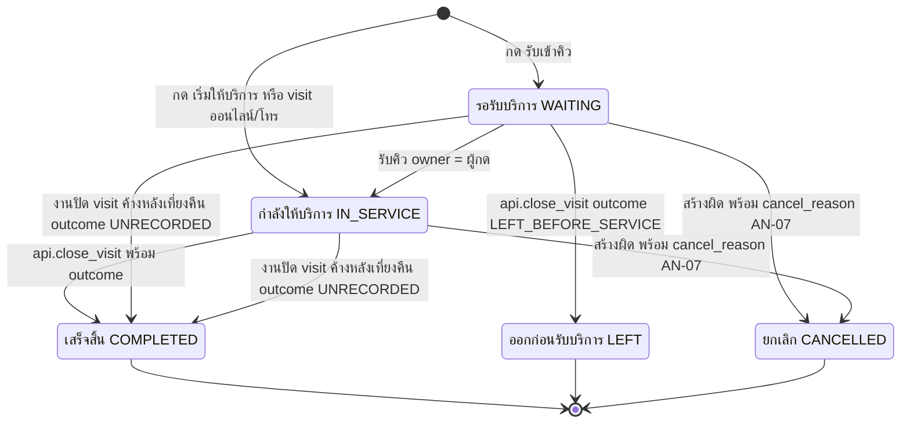

### แผนภาพการทำงาน

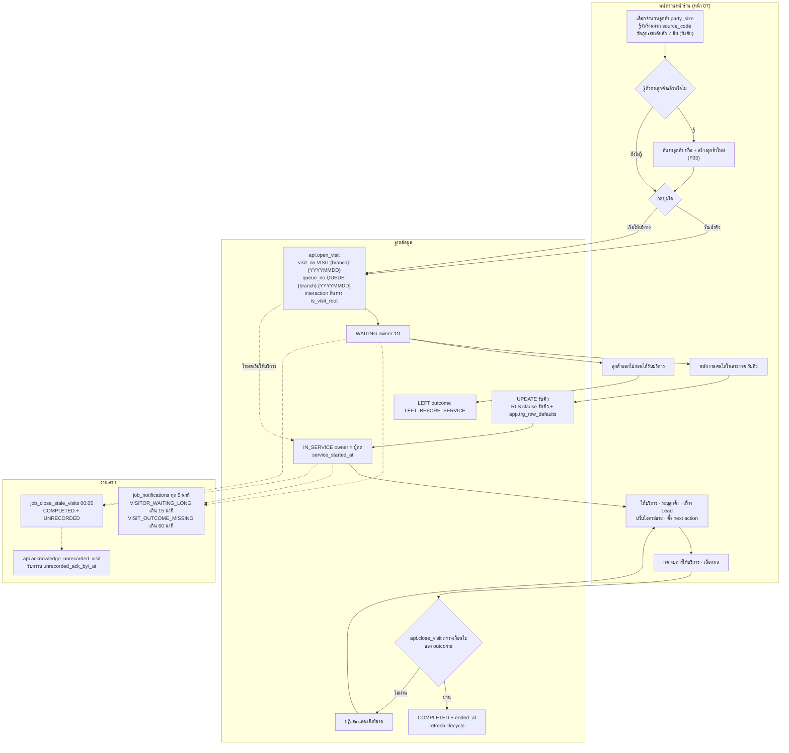

### ตารางขั้นตอน

| # | ผู้กระทำ | หน้าจอ | การกระทำ | RPC/ตาราง | สิทธิ์ | สถานะผลลัพธ์ | Audit / แจ้งเตือน | ผิดพลาด / ขอบ |
|---|---|---|---|---|---|---|---|---|
| 1 | ST/SV/BM | 07 | เปิดหน้ารับลูกค้า เห็นคิววันนี้ของสาขา | SELECT `crm.visits` | `visit.read` B | – | – | ผู้ใช้หลายสาขา (เช่น OP) เลือกสาขาจากตัวเลือกสาขา (prototype เริ่มที่ JP1 · ข้อ 14.1 · 14.3) |
| 2 | ST/SV/BM | 07 | กรอก `party_size` (≥ 1 ค่าเริ่มต้น 1) · `source_code` · ชิป `interest_code` 1 ค่า · ระบุลูกค้า (ถ้ามี) | `ref.interest_types` · `ref.sources` · `api.search_customers` | ผู้ใช้ ACTIVE | – | `CUSTOMER_SEARCH` (access log) เมื่อค้นหา | ไม่เลือกความสนใจ → กดปุ่มไม่ได้ (บังคับเมื่อ WALK_IN · ข้อ 6.10) · ค้นหาต่ำกว่า 3 ตัวอักษรไม่ส่ง · เกินเพดานอัตรา → ปฏิเสธ (ข้อ 6.5) |
| 3a | ST/SV/BM | 07 | กด **"รับเข้าคิว"** | `api.open_visit` (`channel_code='WALK_IN'` · `party_size` · `interest_code` · `source_code` · `customer_id` ถ้ามี) | `visit.create` B (ประเมินกับลูกค้าถ้ามี · ข้อ 8.0) | `WAITING` · `owner_staff_id` ว่าง · `started_at = now()` · `visit_no` + `queue_no` ("คิว NNN") · interaction ต้นทาง `INBOUND` `WALK_IN` | row INSERT `crm.visits` `crm.interactions` · `customer_branches` + `first_seen_at` ถ้ามีลูกค้า | ลูกค้าที่ส่งมาต้องอ่านได้ (`app.readable_customer_ids()` · ข้อ 6.6) **และ** เชื่อมกับสาขาของ visit อยู่แล้ว (`customer_branches`/`first_branch_id`) เว้นแต่ scope ORGANIZATION (ข้อ 8.0) มิฉะนั้นปฏิเสธ → เปิด visit นิรนามแล้วใช้ F03 ขั้นผูกสาขา |
| 3b | ST/SV/BM | 07 | กด **"เริ่มให้บริการ"** | `api.open_visit` (โหมดเริ่มให้บริการ) | `visit.create` B | `IN_SERVICE` · owner = ผู้กด · `service_started_at` | เหมือน 3a | – |
| 4 | ST/SV/BM คนใดในสาขา | 07 | กด **"รับคิว"** บนคิวที่ `WAITING` | UPDATE `crm.visits` เปลี่ยน `status='IN_SERVICE'` + `owner_staff_id` = ตน | `visit.update` scope ใดก็ได้ในสาขาของ visit (ข้อ 4.1 · 9.4) · เป็นกรณีเดียวที่ผู้ใช้เปลี่ยน `owner_staff_id` ตรงได้ (ข้อ 9.4.2) | `IN_SERVICE` · `app.trg_row_defaults` ตั้ง `service_started_at = greatest(now(), started_at)` (ข้อ 4.1 · 19.1 ข้อ 12) | row UPDATE | สองคนกดพร้อมกัน: รายการที่สองอัปเดต 0 แถว (USING ต้อง `owner_staff_id IS NULL`) → หน้าจอแจ้ง "มีผู้รับคิวแล้ว" และโหลดคิวใหม่ · เปลี่ยนคอลัมน์อื่นพร้อมกันถูกปฏิเสธ |
| 5 | ผู้รับ | 07 → 04 · 05 | ระบุลูกค้า: ลูกค้าใหม่กด "+ สร้างลูกค้าใหม่" เปิดหน้า 04 `?visit={visit_no}` (F03 โหมด C) · ลูกค้าเดิมที่อ่านได้เลือกจากผลค้นหา · บันทึกการสนทนา · สร้าง Lead (F04) · ปรับโอกาสขาย (F05) | `api.quick_capture` (พร้อม `visit_id` · ข้อ 19.3 ข้อ 2) · UPDATE `crm.visits.customer_id` · INSERT `crm.leads` | `customer.create` B · `visit.update` · `lead.create` B | `IDENTIFIED_VISITS` เพิ่มเมื่อ `customer_id` ไม่ว่าง | `CUSTOMER_CREATED` ถ้าสร้างใหม่ | ลูกค้าเดิมที่มีความสนใจ `creates_lead = true`: UI เสนอปุ่ม "สร้าง Lead" · `api.open_visit` ไม่สร้าง lead อัตโนมัติ (ข้อ 19.3 ข้อ 1) · ตั้ง `customer_id` ได้เมื่อยังว่าง · เปลี่ยนลูกค้าที่ระบุแล้วต้องมี `visit.update` scope ≥ T (ข้อ 19.2 ข้อ 2) · ลูกค้านอกขอบเขตใช้ `api.link_customer_to_branch` (F03) |
| 6 | ผู้รับ | 07 · 05 | กด **"จบการให้บริการ"** เลือก outcome | `api.close_visit(p_visit_id, p_outcome_code, p)` | `visit.update` บน visit (ST O · SV T · BM B · BA G) | `COMPLETED` + `outcome_code` + `ended_at` · outcome `PURCHASED` → ประเภท interaction ต้นทางเป็น `PURCHASE` | row UPDATE `crm.visits` · lifecycle refresh | ตรวจตามตาราง "เงื่อนไขของ outcome" ด้านล่าง · ไม่ผ่าน → ปฏิเสธทั้งทรานแซกชัน |
| 7 | ผู้รับ/ผู้สร้าง | 07 | ลูกค้าออกก่อนได้รับบริการ | `api.close_visit(p_visit_id, 'LEFT_BEFORE_SERVICE', p)` (ข้อ 19.3 ข้อ 3) | `visit.update` บน visit (visit `WAITING` owner ว่าง → scope O ใช้ `created_by` = ตน · ข้อ 8.0) | `LEFT` · outcome `LEFT_BEFORE_SERVICE` · `ended_at` | row UPDATE | ใช้ได้เฉพาะจาก `WAITING` · CHECK `visits_left_outcome_chk` |
| 8 | ผู้รับ/ผู้สร้าง หรือ SV/BM/BA | 07 | ยกเลิก visit ที่สร้างผิด พร้อมเหตุผล | UPDATE `crm.visits` `status='CANCELLED'` + `cancel_reason` (หมายเหตุผู้เขียน AN-07) | เจ้าของภายใน 15 นาทีหลังสร้าง (รอยืนยัน) · หลังจากนั้น `visit.update` scope T/B (G รวม) | `CANCELLED` · ไม่นับทุก KPI | row UPDATE | ไม่มี `cancel_reason` → ปฏิเสธ (`visits_cancel_reason_chk`) · interaction ต้นทางของ visit นี้ไม่นับเป็นกิจกรรมและไม่นับใน "ติดต่อ N ครั้ง" (ข้อ 3.1 · 3.3 ข้อ 5) · `app.trg_link_customer_branch` ไม่ผูกสาขาจาก visit `CANCELLED` |
| 9 | ผู้รับ | 05 | แก้ outcome ภายในวันธุรกิจเดียวกัน | เรียก `api.close_visit` ซ้ำ (ข้อ 19.3 ข้อ 3) | `visit.update` บน visit | outcome ใหม่ | row UPDATE | ข้ามวันธุรกิจแล้ว → ปฏิเสธ · `branch_id` ของ visit เปลี่ยนไม่ได้ทุกกรณี |
| 10 | JOB | – | ทุก 5 นาที ตรวจคิวรอนานและ visit ค้าง | `app.job_notifications(p_as_of)` | service_role | – | `VISITOR_WAITING_LONG` (WAITING เกิน 15 นาทีปฏิทิน · ส่งเฉพาะในเวลาทำการ) → SV ที่เป็นหัวหน้าทีมในสาขา และ BM ของสาขา · in-app + push · `VISIT_OUTCOME_MISSING` (IN_SERVICE เกิน 60 นาที) → ผู้รับ | ดู F14 |
| 11 | JOB | – | 00:05 วันถัดไป ปิด visit ที่ยังเปิด | `app.job_close_stale_visits(p_as_of)` | service_role | `COMPLETED` · `UNRECORDED` · `ended_at` = 23:59:59 ของวันนั้น · `closed_by_system = true` | `actor_label = SYSTEM:close_stale_visits` · `VISIT_OUTCOME_MISSING` สรุปให้ผู้จัดการสาขา | ดู F15 |
| 12 | ผู้รับ หรือ SV/BM/BA | 12 | รับทราบ visit ที่ระบบปิดเป็น `UNRECORDED` (แก้ outcome ข้ามวันไม่ได้) | `api.acknowledge_unrecorded_visit(p_visit_id)` | `visit.update` บน visit (ST O · SV T · BM B · BA G) | ตั้ง `visits.unrecorded_ack_by` = ตน · `unrecorded_ack_at` = `now()` | row UPDATE | visit ที่ outcome ไม่ใช่ `UNRECORDED` → ปฏิเสธ · รายการยังนับใน issue `VISIT_UNRECORDED` จนพ้น 7 วัน (หมายเหตุผู้เขียน AN-31) |

### เงื่อนไขของ outcome ที่ `api.close_visit` บังคับ (ข้อ 4.2)

| outcome | สถานะที่ได้ | ต้องมีก่อนปิด | ผลต่อรายการอื่น | นับเป็นบันทึกผลครบ |
|---|---|---|---|:--:|
| `PURCHASED` ซื้อแล้ว | `COMPLETED` | `customer_id` | ประเภท interaction ต้นทาง → `PURCHASE` · UI เสนอให้ปิด opportunity เป็น WON (ไม่บังคับใน V1 · F05) | ✓ |
| `FOLLOW_UP` นัดติดตาม | `COMPLETED` | `customer_id` + lead/opportunity ที่เปิดอยู่ของลูกค้าที่มี next action | – | ✓ |
| `NOT_YET` ยังไม่ซื้อ | `COMPLETED` | ถ้าลูกค้ามี lead/opportunity เปิดอยู่ ต้องมี next action | – | ✓ |
| `NOT_INTERESTED` ไม่สนใจ | `COMPLETED` | `p` มี `lost_reason_code` สำหรับ lead ที่เปิดจาก visit นี้ (`OTHER` บังคับ `lost_note`) · ไม่มีเหตุผล → ปฏิเสธ | lead ที่ `visit_id` = visit นี้และยังเปิดอยู่ ปิดเป็น `LOST` ในทรานแซกชันเดียว (ข้อ 19.3 ข้อ 3) · task next action ของ lead เหล่านั้น → `CANCELLED` | ✓ |
| `SERVICE_DONE` ให้บริการเสร็จ | `COMPLETED` | – | – | ✓ |
| `LEFT_BEFORE_SERVICE` ออกก่อนรับบริการ | `LEFT` | visit ยัง `WAITING` | – | ✓ |
| `UNRECORDED` ระบบปิดให้ | `COMPLETED` | ผู้ใช้เลือกไม่ได้ (งานระบบเท่านั้น) | – | ✗ |

### ผลต่อ KPI

`VISITS` · `WALKIN_VISITS` นับที่ `started_at` (ไม่นับ `CANCELLED`) · `IDENTIFIED_VISITS` เมื่อ `customer_id` ไม่ว่าง · issue `VISIT_UNRECORDED` = outcome `UNRECORDED` ที่ `started_at` อยู่ใน "7 วันล่าสุด" (ข้อ 12.3) · `OPEN_VISITS` = `WAITING`/`IN_SERVICE` ณ `app.clock()` · `OUTCOME_COMPLETION` ตัวหาร = `COMPLETED`/`LEFT` (ข้อ 12.1 · 12.2)

### ตัวอย่างจาก seed

**คิว JAUNPHONE 1 ณ 11 ก.ย. 2569 10:24 น.** (ข้อ 13.11)

| คิว | เข้าคิว | สถานะ | วัตถุประสงค์ | ผู้รับ | สิ่งที่จะเกิดต่อตามกติกา |
|---|---|---|---|---|---|
| 001 | 10:05 | กำลังให้บริการ | ซื้อเครื่อง | คุณขวัญ | ถ้ายัง `IN_SERVICE` เกิน 60 นาทีหลัง `service_started_at` → `VISIT_OUTCOME_MISSING` ถึงคุณขวัญ |
| 002 | 10:12 | รอรับบริการ | เทิร์นเครื่อง | – | ครบ 15 นาทีที่ 10:27 (คำนวณ · อยู่ในเวลาทำการ 10:00–21:00) → รอบ `job_notifications` แรกหลังจากนั้นแจ้ง `VISITOR_WAITING_LONG` ถึงคุณนัท (หัวหน้าทีม `JP1-SALES`) และคุณเจ · `dedupe_key` ยึดวันที่ของ `started_at` (AN-29) |
| 003 | 10:18 | รอรับบริการ | ซ่อม | – | ครบ 15 นาทีที่ 10:33 (คำนวณ) |
| 004 | 10:21 | รอรับบริการ | สอบถาม/โปรโมชั่น | – | ครบ 15 นาทีที่ 10:36 (คำนวณ) · ทั้ง 002–004 `customer_id` ว่าง จึงยังไม่นับใน `IDENTIFIED_VISITS` |

visit ที่ยังไม่ปิดทั้งองค์กร = 4 (ทั้งหมดคือคิว JP1) · ถ้ายังเปิดอยู่ถึงสิ้นวัน งาน 00:05 ของ 12 ก.ย. 2569 จะปิดเป็น `UNRECORDED` ด้วย `ended_at` 11 ก.ย. 2569 23:59:59 (คำนวณ)

**คุณสมชาย ใจดี `CUS-2026-000297` เข้าร้าน 8 ก.ย. 2569 16:10 น.** (ข้อ 13.7 interaction #6) — ลูกค้าเดิมที่คุณขวัญอ่านได้

| ขั้น | สิ่งที่เกิด | ข้อมูล seed |
|---|---|---|
| เปิด visit | `api.open_visit` กับ `customer_id` ของคุณสมชาย · interaction ต้นทาง `WALK_IN` · `INBOUND` · `VISIT` | `V-JP1-260908-017` |
| ระหว่างให้บริการ | สร้าง lead iPad Air ช่องทาง WALK_IN จึงเริ่มที่ `CONTACTED` (ข้อ 4.3) · เลื่อน `OP-2026-002998` เป็น `FOLLOW_UP` และเปลี่ยนสินค้าเป็น iPhone 17 Pro ฿45,900 `HOT` | `LD-2026-007460` (next action `FOLLOW_UP` 20 ก.ย. 2569 11:00) · `OP-2026-002998` (next action `CALL` "โทรติดตามเรื่องผ่อน" 18 ก.ย. 2569 10:00) · task `TK-2026-012508` สร้าง 8 ก.ย. 2569 16:40 |
| ปิด visit | outcome `FOLLOW_UP` ผ่านเงื่อนไข เพราะมี `customer_id` และมีรายการเปิดที่มี next action | visit `COMPLETED` `FOLLOW_UP` |

---

## F02 — การติดต่อออนไลน์/โทร → กติกา visit ข้อ 3.3

**เป้าหมาย:** ลูกค้าที่ทักทาง LINE · Facebook · Instagram · TikTok · เว็บไซต์ หรือโทรเข้า ถูกนับเป็น visit ด้วยกติกาเดียวกับหน้าร้าน และอยู่ในฐานลูกค้าเดียวกัน (A5 · B7 · D1)
**V1 บันทึกด้วยมือ** · Phase 4 สร้างอัตโนมัติจาก `crm.online_conversations` (รอยืนยัน Q19 · Q20)
**ผู้ใช้:** STAFF/SUPERVISOR/BRANCH_MANAGER ของสาขา หรือแอดมินออนไลน์ที่สังกัด `JPON` (D21 · รอยืนยัน Q3)

### กติกา (ข้อ 3.3)

| # | กรณี | ผล |
|---|---|---|
| 1 | การติดต่อ `INBOUND` ช่องทางที่ไม่ใช่ `WALK_IN` และลูกค้า (หรือผู้ติดต่อนิรนามคนเดิม) **มี** visit ช่องทางเดียวกันที่ยังไม่ปิดในวันธุรกิจเดียวกัน | แนบ interaction เข้า visit นั้น (`visit_id` = visit เดิม · `is_visit_root = false`) · ไม่เพิ่ม `VISITS` |
| 2 | `INBOUND` ช่องทางที่ไม่ใช่ `WALK_IN` และ **ไม่มี** visit ดังกล่าว | เปิด visit ใหม่สถานะ `IN_SERVICE` · owner = ผู้บันทึก · มี `visit_no` ไม่มี `queue_no` · interaction ต้นทาง |
| 3 | `OUTBOUND` หรือ `INTERNAL` | **ไม่สร้าง visit** · INSERT `crm.interactions` ตรง |
| 4 | ลูกค้ายังไม่มีในระบบ | Quick Capture (F03) ช่องทางแรก = ช่องทางที่ติดต่อ → สร้างลูกค้า + visit `IN_SERVICE` + interaction ต้นทาง ในทรานแซกชันเดียว |

**กติกาจับคู่ (CANONICAL ข้อ 19.3 ข้อ 1 · 19.2 ข้อ 5):** กรณี 1–2 ทำใน `api.open_visit` ซึ่ง "แนบหรือเปิด" ให้ · กุญแจจับคู่ = `customer_id` (หรือ visit นิรนามที่พนักงานเลือกจากรายการ) + `channel_code` + `branch_id` + วันธุรกิจ กับ visit สถานะ `IN_SERVICE` (สถานะ `WAITING` มีเฉพาะ walk-in · CHECK `visits_waiting_chk`) · `api.open_visit` ไม่สร้าง lead อัตโนมัติ · INSERT interaction `INBOUND` ตรงทาง PostgREST ได้เฉพาะเมื่อมี `visit_id` ของ visit ที่ยังเปิดอยู่สาขาเดียวกัน (FK `(visit_id, branch_id)`) มิฉะนั้นถูกปฏิเสธและต้องใช้ `api.open_visit`

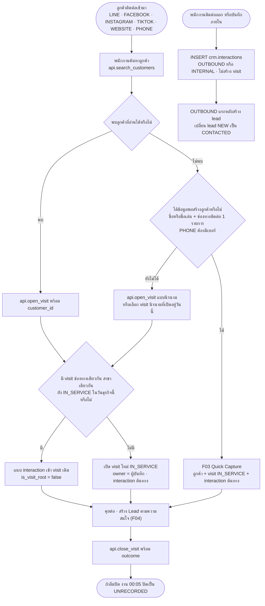

### ตารางขั้นตอน

| # | ผู้กระทำ | หน้าจอ | การกระทำ | RPC/ตาราง | สิทธิ์ | สถานะผลลัพธ์ | Audit / แจ้งเตือน | ผิดพลาด / ขอบ |
|---|---|---|---|---|---|---|---|---|
| 1 | ST (เช่นแอดมิน JPON) | แถบบน · 03 | ค้นหาจากชื่อ เบอร์ LINE ID อีเมล | `api.search_customers(p_term)` | ผู้ใช้ ACTIVE · ผลเฉพาะรายการที่อ่านได้ | – | `CUSTOMER_SEARCH` · ตัวนับ `app.rate_limit_counters` | ค่าติดต่อค้นได้เฉพาะตรงทั้งค่า · ไม่พบเพราะลูกค้าอยู่สาขาอื่น → ใช้ F03 (การ์ดย่อ + ผูกสาขาผ่าน visit) |
| 2 | ST | 05 · 04 | บันทึกข้อความ/สายเข้า (ช่องทาง · ประเภท interaction · สรุป) | `api.open_visit(p)` (`channel_code` · `customer_id` หรือ visit นิรนามที่เลือก · `interaction_type_code` · `summary`) · หรือ INSERT `crm.interactions` `INBOUND` พร้อม `visit_id` ของ visit ที่เปิดอยู่ (ข้อ 19.2 ข้อ 5) | `visit.create` B (ข้อ 9.6) + `interaction.create` B ประเมินกับลูกค้า (ข้อ 8.0) | แนบ: visit เดิมไม่เปลี่ยน · เปิดใหม่: `IN_SERVICE` | row INSERT `crm.visits` (ถ้าเปิดใหม่) + `crm.interactions` · ลูกค้าได้ `last_activity_at` `last_channel_code` ใหม่ | `channel_code = 'WALK_IN'` ต้องใช้ F01 · `summary` ที่มีเลขบัตรประชาชนถูกปฏิเสธ |
| 3 | ST | 04 | ลูกค้าใหม่ → Quick Capture ช่องทางแรก = ช่องทางนี้ | `api.quick_capture` | `customer.create` B + `visit.create` B | ลูกค้า `IDENTIFIED` หรือ `LEAD` · visit `IN_SERVICE` | `CUSTOMER_CREATED` · `CONSENT_RECORDED` | `PRIVACY_NOTICE` ช่องทางออนไลน์/โทรบันทึกได้เมื่อส่งลิงก์ประกาศแล้ว (`captured_via = 'LINK_SENT'` · ข้อ 10.2) · PHONE ต้องมีเบอร์ |
| 4 | ST | 11 · 05 | ความสนใจเป็นโอกาสขาย → สร้าง lead (ลูกค้าเดิม: กดปุ่ม "สร้าง Lead" ที่ UI เสนอ) | `api.quick_capture` (อัตโนมัติเมื่อสร้างลูกค้าใหม่) หรือ INSERT `crm.leads` | `lead.create` B | ช่องทางข้อความ → `NEW` · `PHONE` → `CONTACTED` + `first_contacted_at = created_at` (`ref.channels.is_live` · ข้อ 4.3 · `app.trg_row_defaults`) | row INSERT · `lead_status_history` | lead `NEW` เกิน 30 นาทีเวลาทำการ → `LEAD_NOT_CONTACTED` (F14) |
| 5 | ST | 05 | ตอบกลับลูกค้า (ส่งข้อความ/โทรออก) | INSERT `crm.interactions` `direction='OUTBOUND'` (ปุ่ม "โทร" เรียก `api.reveal_contact` ก่อน แล้วสร้าง interaction แบบร่างให้ยืนยันหลังวางสาย · ข้อ 6.4) | `interaction.create` B · `customer.pii.reveal` B | lead ของลูกค้าที่ `NEW` และ `created_at ≤ occurred_at` → `CONTACTED` + `first_contacted_at = occurred_at` (`app.trg_mark_lead_contacted`) | `CONTACT_REVEALED` (access log) · `lead_status_history` · เปิดค่าเต็มเกิน `security.reveal_per_hour` → ปฏิเสธ + `REVEAL_LIMIT_EXCEEDED` | OUTBOUND ไม่สร้าง visit และไม่นับใน `VISITS` แต่นับเป็นกิจกรรมของลูกค้า (`UNIQUE_CUSTOMERS`) |
| 6 | ST | 05 | ผู้ติดต่อนิรนามให้ข้อมูลภายหลัง | `api.quick_capture` พร้อม `visit_id` ของ visit ที่เปิดอยู่ (ข้อ 19.3 ข้อ 2) หรือ UPDATE `crm.visits.customer_id` ถ้าลูกค้ามีอยู่และอ่านได้ | `customer.create` B / `visit.update` | visit ได้ `customer_id` | row UPDATE | ลูกค้าอยู่นอกขอบเขต → `api.link_customer_to_branch` (F03) · `customer_id` ของ interaction ต้นทางผู้ใช้เปลี่ยนเองไม่ได้ (ข้อ 19.2 ข้อ 2) |
| 7 | ST | 05 | จบบทสนทนา | `api.close_visit` | `visit.update` บน visit | `COMPLETED` + outcome | row UPDATE | ลืมปิด → งาน 00:05 (F15) · outcome ตามตารางใน F01 |
| 8 | SV/BM/BA ที่มีสิทธิ์ทั้งสองสาขา | 11 · 06 | ส่งต่อรายการจาก JPON ไปสาขา | `api.assign_owner('LEAD'/'OPPORTUNITY'/'TASK', p_entity_id, p_to_staff_id, 'BRANCH_TRANSFER', p_note, p_to_branch_id)` | `lead.assign` / `opportunity.assign` / `task.assign` ทั้งสาขาต้นทางและปลายทาง (ST ไม่มี `*.assign`) | `branch_id` ใหม่ | `ownership_changes` เหตุผล `BRANCH_TRANSFER` | visit และ interaction ย้ายสาขาไม่ได้ · ผู้ส่งต่อตาม Q3 รอยืนยัน · รายละเอียดใน F07 |

### ตัวอย่างจาก seed

| เหตุการณ์ | สิ่งที่เกิดตามกติกา | ข้อมูล seed (ข้อ 13.7 · 13.11) |
|---|---|---|
| 11 ก.ย. 2569 10:24 คุณสมชายทัก LINE สอบถาม iPhone 17 Pro และเงื่อนไขผ่อน | ไม่มี visit LINE ที่เปิดอยู่ของคุณสมชายในวันนั้น → เปิด visit ใหม่ของ JP1 เป็นรายการที่ 7 ของวัน | interaction #7 `LINE` `INBOUND` `INQUIRY` · `V-JP1-260911-007` · `VISIT:JP1:20260911` = 7 |
| ปิด visit ด้วย `NOT_YET` | ผ่านเงื่อนไขเพราะ `OP-2026-002998` และ `LD-2026-007460` ที่เปิดอยู่มี next action | visit `COMPLETED` `NOT_YET` |
| visit ออนไลน์ JP1 วันนี้ 3 รายการ | คุณสมชาย LINE 10:24 · คุณวิไลวรรณ Instagram 10:11 · อีก 1 รายการก่อน 10:06 | JP1: Walk-in 4 + ออนไลน์/โทร 3 = `VISITS` 7 |
| ลูกค้า JP1 อีก 3 รายมีเฉพาะ interaction `OUTBOUND` วันนี้ก่อน 10:06 | ไม่สร้าง visit แต่นับเป็นลูกค้าไม่ซ้ำวันนี้ | ลูกค้าไม่ซ้ำวันนี้ JP1 = 7 (visit ที่ระบุตัวตน 4 + OUTBOUND 3) |
| 12 ส.ค. 2569 19:40 คุณสมชายทัก LINE ถามราคา iPhone 16 | เปิด visit LINE + สร้าง lead ช่องทางข้อความ เริ่ม `NEW` | interaction #3 · `LD-2026-006650` · visit `COMPLETED` `FOLLOW_UP` |
| 1 ก.ย. 2569 14:22 คุณขวัญส่งใบเสนอราคาทาง LINE | trigger สร้าง interaction `OUTBOUND` เมื่อกด "ส่ง" (F05 ขั้น 4) → ไม่สร้าง visit | interaction #5 `QUOTATION_SENT` · `QT-2026-001702` |

---

## F03 — Quick Capture · ตรวจซ้ำ · ผูกลูกค้าสาขาอื่น · override

**เป้าหมาย:** สร้างลูกค้าได้เร็วที่สุดโดยไม่สร้างซ้ำ และไม่เปิดเผยข้อมูลลูกค้าสาขาอื่นเกินจำเป็น (A13 · A25 · B14 · D16 · D32)
**ลูกค้าสร้างได้ทางเดียว:** `api.quick_capture(p jsonb)` · `authenticated` ไม่มี INSERT บน `crm.customers` `crm.customer_contacts` `crm.customer_consents` (ข้อ 6.2)

### โหมดของฟอร์ม

| โหมด | เปิดจาก | ผู้ใช้ | ผลของการบันทึก (ข้อ 6.2) |
|---|---|---|---|
| A · รับลูกค้า | ปุ่ม "+ รับลูกค้า" (ทุกอุปกรณ์) | ST · SV · BM | ลูกค้า + ช่องทางติดต่อ + consent `PRIVACY_NOTICE` + visit (walk-in ตามปุ่มที่กด · ช่องทางอื่น `IN_SERVICE`) + interaction ต้นทาง (+ lead) |
| B · เพิ่มลูกค้า | "เพิ่มลูกค้า" ในหน้า 03 | ST · SV · BM · BA | ลูกค้า + ช่องทางติดต่อ + consent (+ lead) · **ไม่มี visit** |
| C · ผูก visit ที่เปิดอยู่ | "+ สร้างลูกค้าใหม่" ในหน้า 07 → หน้า 04 `?visit={visit_no}` | ST · SV · BM | ลูกค้า + ช่องทางติดต่อ + consent (+ lead) · `api.quick_capture` รับ `visit_id` แล้วตั้ง `customer_id` ให้ visit เดิม ไม่เปิด visit ใหม่ (ข้อ 19.3 ข้อ 2) |

### แท็บของฟอร์ม (หน้า 04 · มือถือเรียงหน้าเดียว)

| แท็บ | ช่อง | บังคับ |
|---|---|---|
| ข้อมูลพื้นฐาน | เบอร์โทร · ชื่อ · นามสกุล · ช่องทางแรก · สาขา · ☐ แจ้งประกาศความเป็นส่วนตัวให้ลูกค้าแล้ว | ชื่อ **หรือ** ชื่อเล่น · ช่องทางแรก · สาขา (เติมจากผู้ใช้ เลือกได้ถ้ามีหลายสาขา) · แจ้งประกาศ · เบอร์โทรเมื่อช่องทางแรกเป็น `WALK_IN`/`PHONE` · ช่องทางติดต่ออย่างน้อย 1 รายการ |
| ความสนใจ | ความสนใจ (`interest_code`) · ประเภทสินค้า · รุ่น | `interest_code` |
| เพิ่มเติม | ชื่อเล่น · LINE · อีเมล · จังหวัด · แหล่งที่มา · ☐ ยินยอมรับข่าวสาร (ไม่ติ๊กไว้ก่อน · เลือกช่องทาง `LINE` `SMS` `PHONE` `EMAIL` · ต้องติ๊ก "ลูกค้าอายุ 20 ปีขึ้นไป หรือผู้ใช้อำนาจปกครองยินยอม" ซึ่งเก็บใน `evidence` · RPC ปฏิเสธ `MARKETING` `GRANTED` ถ้าไม่ติ๊ก · ข้อ 19.4 ข้อ 3) | – |

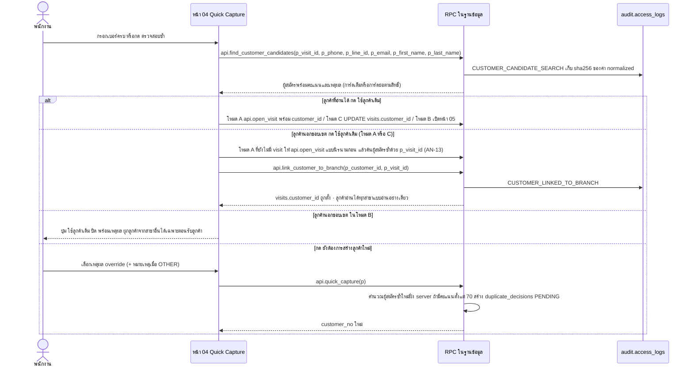

### ตารางขั้นตอน

| # | ผู้กระทำ | หน้าจอ | การกระทำ | RPC/ตาราง | สิทธิ์ | สถานะผลลัพธ์ | Audit / แจ้งเตือน | ผิดพลาด / ขอบ |
|---|---|---|---|---|---|---|---|---|
| 1 | ST/SV/BM/BA | 04 | เปิดฟอร์มตามโหมด | – | หน้า 04: ST SV BM BA (BA เฉพาะโหมด B · ข้อ 8.1) | – | – | บทบาทอื่นเห็นการ์ด "ไม่มีสิทธิ์เข้าหน้านี้" (ข้อ 14.1) |
| 2 | ผู้ใช้ | 04 | กรอกเบอร์ครบ (อัตโนมัติ) หรือกด "ตรวจสอบซ้ำ" | `api.find_customer_candidates(...)` | `customer.create` · ต้องมีตัวระบุเต็มอย่างน้อย 1 อย่าง (phone/line_id/email) | – | `CUSTOMER_CANDIDATE_SEARCH` (hash) | ส่งแต่ชื่อ → ปฏิเสธ · `p_visit_id` ต้องเป็น visit `WAITING`/`IN_SERVICE` ในสาขาที่มี `visit.update` สร้างภายใน 4 ชม. (รอยืนยัน) · เกิน 60 ครั้ง/ชม./ผู้ใช้ → ปฏิเสธ · ค้นไม่พบผลเกิน 20 ครั้ง/ชม. → บล็อก 1 ชม. + `SEARCH_LIMIT_EXCEEDED` ถึง BA |
| 3 | DB | 04 | ให้คะแนนผู้สมัคร | กฎข้อ 6.5: เบอร์ตรง 100 · LINE ID/LINE userId ตรง 100 · อีเมลตรง 90 · ชื่อ+นามสกุลตรงและเบอร์ 4 ตัวท้ายตรง 70 · ชื่อคล้าย (threshold 0.6) และสาขาแรก = สาขาผู้เรียก/visit 40 | – | แผง "พบข้อมูลที่อาจเป็นลูกค้าคนเดียวกัน N รายการ" | – | ไม่มีการ merge อัตโนมัติและไม่บล็อกการสร้าง |
| 4 | ผู้ใช้ | 04 | ลูกค้าที่ **อ่านได้**: เห็น `customer_no` ชื่อ `value_masked` ป้าย lifecycle คะแนน เหตุผล · กด "ดูข้อมูล" หรือ "ใช้ลูกค้าเดิม" | "ดูข้อมูล" → `api.get_customer_360` · "ใช้ลูกค้าเดิม" → โหมด A `api.open_visit` · โหมด C UPDATE `crm.visits.customer_id` · โหมด B เปิดหน้า 05 | `customer.read` · `visit.create`/`visit.update` | ไม่มีลูกค้าใหม่ | `CUSTOMER_VIEWED` เมื่อเปิด 360 | – |
| 5 | ผู้ใช้ | 04 | ลูกค้า **นอกขอบเขต**: เห็นเฉพาะ `customer_no` · ชื่อ + นามสกุลย่อ · เบอร์ปิดบัง (เฉพาะเมื่อตรงด้วยเบอร์) · คะแนน · เหตุผล · ปุ่ม "ใช้ลูกค้าเดิม" | `api.link_customer_to_branch(p_customer_id, p_visit_id)` | visit อยู่ในสาขาที่ผู้เรียกมี `visit.update` · `WAITING`/`IN_SERVICE` · สร้างภายใน 4 ชม. · `visits.customer_id` ยังว่าง · ลูกค้าถูกคืนจาก `find_customer_candidates` ของผู้เรียกสำหรับ visit นี้ภายใน 30 นาที | `visits.customer_id` ตั้ง · `crm.customer_branches` เพิ่มสาขาของ visit (`linked_via = 'MANUAL_LINK'` · หมายเหตุผู้เขียน AN-13) | `CUSTOMER_LINKED_TO_BRANCH` (access log) · เกิน `security.link_per_day` (10 ครั้ง/วัน/ผู้ใช้) → `LINK_LIMIT_EXCEEDED` ถึง BRANCH_MANAGER ของสาขานั้น (in-app · ข้อ 11.1) | ไม่คืน lifecycle สาขา หรือวันที่ติดต่อ · สาขามาจาก visit ไม่รับจากผู้เรียก · โหมด A ที่ยังไม่มี visit → เปิด visit นิรนามก่อน (AN-13) · **โหมด B ไม่มี visit → ปุ่ม "ใช้ลูกค้าเดิม" แสดงแบบปิดพร้อมเหตุผล "ผูกลูกค้าจากสาขาอื่นได้เฉพาะตอนรับลูกค้า"** (ข้อ 19.3 ข้อ 4) |
| 6 | ผู้ใช้ | 04 | กด "ยังต้องการสร้างลูกค้าใหม่" → เลือก `ref.duplicate_override_reasons` | – (เก็บในฟอร์ม) | – | – | – | `OTHER` บังคับหมายเหตุ |
| 7 | ผู้ใช้ | 04 | กด "บันทึก" | `api.quick_capture(p)` (โหมด C ส่ง `visit_id`) | `customer.create` B ในสาขาที่เลือก (+ `visit.create` B เมื่อโหมด A · `visit.update` บน visit เมื่อโหมด C) | ดูตาราง "ผลของการบันทึก" | `CUSTOMER_CREATED` · `CONSENT_RECORDED` · row INSERT ตารางที่เกี่ยวข้อง | ขาดชื่อและชื่อเล่น · ไม่มีช่องทางติดต่อ · ไม่มีเบอร์เมื่อ `WALK_IN`/`PHONE` · ไม่ติ๊กแจ้งประกาศ · สาขานอกสิทธิ์ · ข้อความมีเลขบัตรประชาชน → ปฏิเสธทั้งทรานแซกชัน · เบอร์ผิดรูปแบบไม่ปฏิเสธ แต่เก็บ `is_valid = false` (→ `INVALID_PHONE`) |
| 8 | DB | – | ถ้ามีการ override และผู้สมัครคะแนน ≥ 70 | INSERT `crm.duplicate_decisions` (`customer_id` = รายใหม่ · `candidate_customer_id` = คะแนนสูงสุด · `score` · `matched_rules` = ข้อความเหตุผลบนการ์ด · `override_reason_code` · `override_note` · `PENDING`) | ภายใน RPC ซึ่งคำนวณผู้สมัครใหม่ฝั่ง server ไม่รับคะแนนจาก client (ข้อ 19.3 ข้อ 2) | 1 แถวต่อ 1 ลูกค้าใหม่ (`duplicate_decisions_customer_uq` · CHECK `score >= 70`) | ถูกสรุปใน `DUPLICATE_SUSPECTED` 18:00 ถึง SV/BM ของสาขา | ผู้สมัครคะแนน 40 อย่างเดียว → ไม่สร้างแถว |
| 9 | ผู้ใช้ | 05 | เติมข้อมูลภายหลัง (Enrich Later) | `api.save_contact` · `api.save_address` · UPDATE `crm.customers` · INSERT `crm.customer_tags` · INSERT `crm.customer_notes` · `api.record_consent` | `customer.update` (ST O · SV T · BM B · BA G) · `note.create` · `customer.consent.manage` | ข้อมูลครบขึ้น | `CUSTOMER_UPDATED` · `CUSTOMER_CONTACT_UPDATED` · `CONSENT_RECORDED` | STAFF แก้ได้เฉพาะลูกค้าที่ตนดูแล (Q11) · consent เพิ่มแถวใหม่เท่านั้น · แก้โน้ต (`note.update`) ได้ภายใน 24 ชม. หลังสร้างสำหรับทุกคน · BA แก้โน้ตของคนอื่นได้แต่ยังอยู่ในกรอบ 24 ชม. (ข้อ 6.9) · เปลี่ยนผู้ดูแลลูกค้าใช้ `api.assign_owner` (F07) |

### ผลของการบันทึก `api.quick_capture` (ทรานแซกชันเดียว)

| ตาราง | สิ่งที่เขียน | กติกา |
|---|---|---|
| `crm.customers` | `customer_no` · ชื่อ · `first_seen_at = least(created_at, เวลากิจกรรมที่แนบ)` · `first_channel_code` · `first_source_code` · `first_branch_id` (= "สาขาที่สนใจ") · `owner_staff_id` = ผู้บันทึก (หมายเหตุผู้เขียน AN-14) · `created_via = 'QUICK_CAPTURE'` · `customer_type = 'INDIVIDUAL'` | ข้อ 3.2 · 6.2 · 6.3 |
| `crm.customer_contacts` | ค่า normalize (E.164) + `value_masked` คำนวณในฐานข้อมูล | ข้อ 6.4 |
| `crm.customer_consents` | `PRIVACY_NOTICE` `GRANTED` + `notice_version` = `app.settings['pdpa.current_notice_version']` (`"PN-2026-01"`) + `captured_via` + `evidence` · `MARKETING` เมื่อติ๊ก (ต้องติ๊กช่องอายุ ≥ 20 ปี) | ข้อ 10.2 · 11.2 · 19.4 ข้อ 3 |
| `crm.customer_notes` | "รายละเอียดเพิ่มเติม" เป็นโน้ตแรก (≤ 2,000 ตัวอักษร · `branch_id` = สาขาที่เลือก) | ข้อ 6.2 · 6.9 · 19.1 ข้อ 6 |
| `crm.visits` + `crm.interactions` | โหมด A เท่านั้น (โหมด C ตั้ง `customer_id` ให้ visit เดิมที่ส่งมาเป็น `visit_id`) | ข้อ 3.3 · 6.2 · 19.3 ข้อ 2 |
| `crm.leads` | เมื่อ `interest_code.creates_lead = true`: owner = ผู้บันทึก · `priority_code='NORMAL'` · `next_action='ติดต่อกลับลูกค้า'` · `next_action_type_code='CALL'` · `next_action_at = created_at + 30 นาที` (รอยืนยัน) · สถานะตาม `ref.channels.is_live` ของ `channel_code` (สด → `CONTACTED` · ข้อความ → `NEW`) · `REPAIR`/`INQUIRY` ไม่สร้าง | ข้อ 4.3 · 5.3 |
| `crm.customer_branches` | สาขาแรก `linked_via = 'CREATED'` | ข้อ 6.6 |
| `crm.duplicate_decisions` | ขั้น 8 | ข้อ 6.5 |

### ตัวอย่างจาก seed

**ตรวจซ้ำบนหน้า 04 (ข้อ 13.14):** กรอก `081-234-5678` + "สมชาย ใจดี"

| ผู้สมัคร | คะแนน · เหตุผล | ผู้เรียก = คุณขวัญ (ST@JP1) | ผู้เรียก = พนักงาน JP2 ที่ไม่เคยเห็นลูกค้าทั้งสอง (ตัวอย่างสมมติ ไม่อยู่ใน seed) |
|---|---|---|---|
| `CUS-2026-000297` คุณสมชาย ใจดี | 100 · เบอร์โทรตรงกัน | การ์ดเต็ม: `081-XXX-5678` · ลูกค้าซื้อซ้ำ · ปุ่ม "ดูข้อมูล" + "ใช้ลูกค้าเดิม" | การ์ดย่อ: `CUS-2026-000297` · สมชาย ใ. · `081-XXX-5678` · 100 · ปุ่ม "ใช้ลูกค้าเดิม" (ผูกผ่าน visit) |
| `CUS-2026-004410` คุณสมชาย ใจดี `081-234-5679` | 40 · ชื่อคล้าย + สาขาแรกเดียวกัน | การ์ดเต็ม: มีโอกาสซื้อ · ติดตามอยู่ | ไม่แสดง: กฎคะแนน 40 ต้องสาขาแรก = สาขาผู้เรียก (JP1 ≠ JP2) · กฎ 70 ไม่ผ่านเพราะเบอร์ 4 ตัวท้ายต่างกัน |

**การสร้างแม้อาจซ้ำ (ข้อ 13.14):** `CUS-2026-006633` คุณณัฐพล สุขใจ สร้างโดยคุณคิม 3 ก.ย. 2569 เลือกเหตุผล `FAMILY_SHARED_PHONE` · ผู้สมัครสูงสุด `CUS-2026-002118` คุณณัฐพร สุขใจ คะแนน 100 "เบอร์โทรตรงกัน" (ทั้งสองราย สาขาแรก JP1 · ผู้ดูแลคุณคิม) → แถว `duplicate_decisions` `PENDING` (1 ใน 16 แถวของ `DUPLICATE_SUSPECTED`) → ตัดสินต่อใน F10

---

## F04 — วงจร Lead

**เป้าหมาย:** ทุกความสนใจของลูกค้าที่รู้ตัวตนมีสถานะกลาง ผู้รับผิดชอบ และจบด้วยการแปลงเป็นโอกาสขายหรือเหตุผลที่ไม่สำเร็จ (A7 · B8 · D8)
**Lead** = การแสดงความสนใจหนึ่งครั้งของลูกค้าที่รู้ตัวตน (`customer_id NOT NULL`) นับตาม `created_at` (ข้อ 3.1)

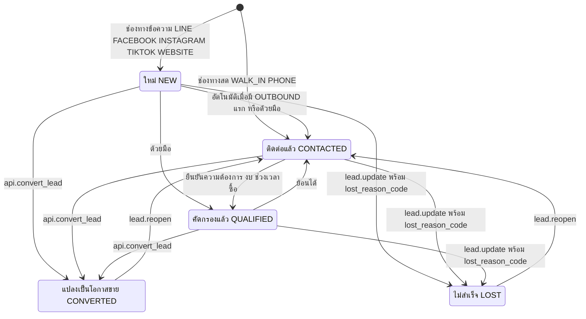

### ช่องที่บังคับตามสถานะ (CHECK ของ `crm.leads` · ข้อ 4.4)

| สถานะ | บังคับ | ต้องว่าง/ล้าง |
|---|---|---|
| `NEW` `CONTACTED` `QUALIFIED` (เปิด) | `next_action` · `next_action_type_code` · `next_action_at` · `priority_code` · **`owner_staff_id` ว่างได้** (→ `LEAD_UNASSIGNED`) | `closed_at` · `lost_reason_code` · `converted_opportunity_id` |
| `CONVERTED` | `converted_opportunity_id` · `closed_at` | `lost_reason_code` |
| `LOST` | `lost_reason_code` · `closed_at` · `lost_note` เมื่อ `OTHER` | `converted_opportunity_id` |

### ตารางขั้นตอน

| # | ผู้กระทำ | หน้าจอ | การกระทำ | RPC/ตาราง | สิทธิ์ | สถานะผลลัพธ์ | Audit / แจ้งเตือน | ผิดพลาด / ขอบ |
|---|---|---|---|---|---|---|---|---|
| 1a | DB | 04 | สร้างอัตโนมัติจาก Quick Capture | `api.quick_capture` | `customer.create` B | ค่าเริ่มต้นตาม F03 · owner = ผู้บันทึก | row INSERT · `lead_status_history` | `REPAIR` `INQUIRY` ไม่สร้าง lead |
| 1b | ST/SV/BM/BA | 05 · 11 | สร้าง lead ด้วยมือ (ระหว่าง visit ใส่ `visit_id`) | INSERT `crm.leads` (`customer_id` · `branch_id` · `channel_code` · `source_code` · `campaign_id` · `interest_code` · `product_type_code` · `product_model` · `interest_level` · `priority_code` · next action 3 ช่อง · `owner_staff_id`) | `lead.create` (ST B · SV B · BM B · BA G) ประเมินกับลูกค้า · `branch_id` ต้องอยู่ในสาขาของ assignment **และ** เป็นสาขาที่ลูกค้าเชื่อมอยู่แล้ว (`customer_branches`/`first_branch_id`) เว้นแต่ scope ORGANIZATION (ข้อ 8.0) | สถานะเริ่มต้นตาม `ref.channels.is_live` ของ `channel_code` ทุกรายการ (มีหรือไม่มี visit): สด → `CONTACTED` + `first_contacted_at = created_at` · ข้อความ → `NEW` (ข้อ 4.3 · `app.trg_row_defaults`) | row INSERT · `app.trg_sync_next_action_task` สร้าง task next action (F06) · `has_new_lead` เมื่อ `NEW` · lifecycle → `LEAD` ถ้ายังไม่เคยซื้อและไม่มี opportunity เปิด | ลูกค้าต้องอ่านได้ (WITH CHECK) · ใส่ owner คนอื่นตอน INSERT ต้องมี `lead.assign` บนแถวใหม่ + owner มี assignment ในสาขา (ข้อ 9.4.2 · rls-spec LD-2) · ลูกค้าสาขาอื่นที่ยังไม่เชื่อม → ใช้ `api.link_customer_to_branch` ก่อน (F03) |
| 2 | DB | – | `NEW → CONTACTED` อัตโนมัติ | `app.trg_mark_lead_contacted` เมื่อ INSERT/UPDATE interaction `OUTBOUND` ที่ `lead_id` = lead หรือ `customer_id` เดียวกัน และ `occurred_at ≥ created_at` | – | `CONTACTED` · `first_contacted_at = occurred_at` | `lead_status_history` · ป้าย "ยังไม่ได้ติดต่อ" หายเมื่อไม่มี lead `NEW` เหลือ | ก่อนเกิด: `LEAD_NOT_CONTACTED` เมื่อ `NEW` เกิน 30 นาทีในเวลาทำการ → owner + หัวหน้าทีม (F14) |
| 3 | owner/SV/BM/BA | 11 · 05 | เปลี่ยนสถานะด้วยมือ: `NEW → CONTACTED` (เช่น โทรจากเครื่องอื่นแล้วมาบันทึก) · `NEW → QUALIFIED` · `CONTACTED → QUALIFIED` (ยืนยันความต้องการ งบ ช่วงเวลาซื้อ) · `QUALIFIED → CONTACTED` (ย้อน) | UPDATE `crm.leads.status` (+ `set_config('app.status_reason', …, true)` ถ้ามีเหตุผล) | `lead.update` (ST O · SV T · BM B · BA G) | `CONTACTED` / `QUALIFIED` · ออกจาก `NEW` ด้วยมือ → `app.trg_row_defaults` ตั้ง `first_contacted_at = greatest(now(), created_at)` (ข้อ 4.3) | `lead_status_history` (`reason` จาก `app.status_reason` · ข้อ 19.1 ข้อ 9) | ย้อนเป็น `NEW` ไม่ได้ · ผู้ใช้ส่ง `first_contacted_at` เองไม่ได้ (คอลัมน์ตั้งโดยระบบ · ข้อ 19.2 ข้อ 4) · lead ที่ออกจาก `NEW` แล้วไม่นับใน "ยังไม่ติดต่อ N" แต่เข้าฐาน `LEAD_RESPONSE_MIN` ถ้าเป็นช่องทางข้อความ |
| 4 | owner/SV/BM | 11 · 05 | **แปลงเป็นโอกาสขาย**: กรอก `priority_code` next action สินค้า/มูลค่า | `api.convert_lead(p_lead_id, p)` | `lead.update` บน lead **และ** `opportunity.create` ประเมินกับ lead (BA ไม่มี `opportunity.create` จึงแปลงไม่ได้) | opportunity ใหม่ `INTERESTED` (`lead_id` · `customer_id` · `branch_id` = ของ lead · `origin_channel_code` = `leads.channel_code` · owner · next action) · lead `CONVERTED` + `converted_opportunity_id` + `closed_at` | `lead_status_history` · `opportunity_stage_history` · task next action ของ lead → `CANCELLED` (ถ้ายังไม่ DONE) · task next action ของ opportunity ถูกสร้าง · lifecycle → `OPPORTUNITY` (ถ้ายังไม่เคยซื้อ) | ขาด next action/priority ของ opportunity → ปฏิเสธทั้งทรานแซกชัน · UPDATE `status='CONVERTED'` ตรงถูกปฏิเสธ (`converted_opportunity_id` เป็นคอลัมน์ระบบ · ข้อ 9.4) |
| 5 | owner/SV/BM/BA | 11 · 05 | ปิดไม่สำเร็จ | UPDATE `status='LOST'` + `lost_reason_code` (+ `lost_note`) + `closed_at` (อยู่ใน column grant · CHECK ของ `crm.leads` บังคับ) | `lead.update` | `LOST` | `lead_status_history` · task next action → `CANCELLED` · lifecycle → `LOST` เมื่อไม่เคยซื้อและไม่มีรายการเปิด | outcome `NOT_INTERESTED` ของ visit ปิด lead ที่เปิดจาก visit นั้นให้ (ข้อ 19.3 ข้อ 3) · `lost_note`/`next_action` ที่มีเลขบัตรประชาชนถูกปฏิเสธ · lead ที่ปิดแล้วอ่านอย่างเดียวจนกว่าจะ reopen (ข้อ 19.2 ข้อ 3) |
| 6 | BM/BA | 11 · 05 | **เปิดใหม่** รายการที่ `CONVERTED`/`LOST` พร้อม next action ใหม่ | UPDATE `status='CONTACTED'` + next action | `lead.reopen` (BM B · BA G) | `CONTACTED` · ล้าง `closed_at` `lost_reason_code` `converted_opportunity_id` | `lead_status_history` · task next action ใหม่ | ST/SV ไม่มีสิทธิ์ · opportunity ที่เคยแปลงยังคงอยู่และยังมี `lead_id` เดิม |
| 7 | JOB | 12 | lead เปิดเกิน 14 วัน / ไม่มี owner | `analytics.data_quality_issues` · `app.job_notifications` | `data_quality.view` | – | issue `LEAD_WITHOUT_OUTCOME` · `LEAD_WITHOUT_OWNER` · แจ้ง `LEAD_UNASSIGNED` เมื่อไม่มี owner เกิน 15 นาที **เวลาทำการ** นับจากเวลาที่ lead เริ่มไม่มี owner → SUPERVISOR (หัวหน้าทีมในสาขา) และ BRANCH_MANAGER ของสาขา | แก้ด้วย `lead.update` / `api.assign_owner` (`lead.assign` · SUPERVISOR scope T มอบ lead ที่ owner ว่างในสาขาที่ตนเป็นหัวหน้าทีมได้ · ข้อ 8.0 · รอยืนยัน Q28) |

### ผลต่อ KPI (ข้อ 12)

`LEADS` นับที่ `created_at` · `LOST_LEADS` นับที่ `closed_at` · `OPEN_LEADS` = `NEW`/`CONTACTED`/`QUALIFIED` ณ `app.clock()` · `LEAD_RESPONSE_MIN` ฐาน = lead ช่องทางข้อความที่สร้างในช่วงและมี `first_contacted_at` · `OPPORTUNITY_RATE` = `OPPORTUNITIES / LEADS` (period-based)

### ตัวอย่างจาก seed (ข้อ 13.6 · 13.7)

| lead | เส้นทาง | จุดที่ควรสังเกต |
|---|---|---|
| `LD-2026-000312` | 11 ม.ค. 2569 13:15 ช่องทาง `FACEBOOK` → `CONVERTED` → `OP-2026-000231` → WON 20 ม.ค. 2569 15:30 ฿23,900 | lead ช่องทางข้อความเริ่มที่ `NEW` · เป็นกิจกรรมแรกของคุณสมชาย จึงเป็น `first_seen_at` |
| `LD-2026-006650` | 12 ส.ค. 2569 19:40 ช่องทาง `LINE` → `CONVERTED` → `OP-2026-002790` สร้างและ WON 15 ส.ค. 2569 11:05 ฿28,900 ระหว่างเข้าร้าน | `origin_channel_code` = `LINE` ตาม lead ต้นทาง จึง **ไม่อยู่** ใน Sales ต้นทาง Walk-in 158 แม้ปิดการขายที่หน้าร้าน |
| `LD-2026-007460` | 8 ก.ย. 2569 16:10 ช่องทาง `WALK_IN` → `CONTACTED` · iPad Air `WARM` · owner คุณขวัญ · next action `FOLLOW_UP` 20 ก.ย. 2569 11:00 | ช่องทางสดเริ่มที่ `CONTACTED` ทันที · task `FOLLOW_UP` ที่เปิดอยู่ทำให้คุณสมชายมีป้าย "ติดตามอยู่" |
| lead ของ `CUS-2026-006774` คุณธนพล รุ่งเรือง (JP4) | ช่องทาง `TIKTOK` สถานะ `NEW` | ป้าย "ยังไม่ได้ติดต่อ" (D46) · นับใน "ยังไม่ติดต่อ 9" |
| lead JP1 ที่ยังเปิด 58 รายการ | NEW 14 · CONTACTED 29 · QUALIFIED 15 · owner: คุณขวัญ 30 · คุณคิม 26 · ไม่มี owner 2 | lead NEW 6 รายการที่สร้างก่อน P คือ `LEAD_WITHOUT_OUTCOME` ของ JP1 ทั้ง 6 · ไม่มี owner 2 รายการ = `LEAD_WITHOUT_OWNER` และแจ้ง `LEAD_UNASSIGNED` ×2 ถึงคุณนัทและคุณเจ |

---

## F05 — Opportunity → ใบเสนอราคา → ปิดการขาย/ไม่สำเร็จ

**เป้าหมาย:** ทุกโอกาสขายที่ยังไม่จบมี Owner · Next Action · Follow-up Date · Priority (A9 · B9) และจบด้วย WON พร้อมยอด หรือ LOST พร้อมเหตุผล (B8)

### สถานะของ opportunity และ quotation

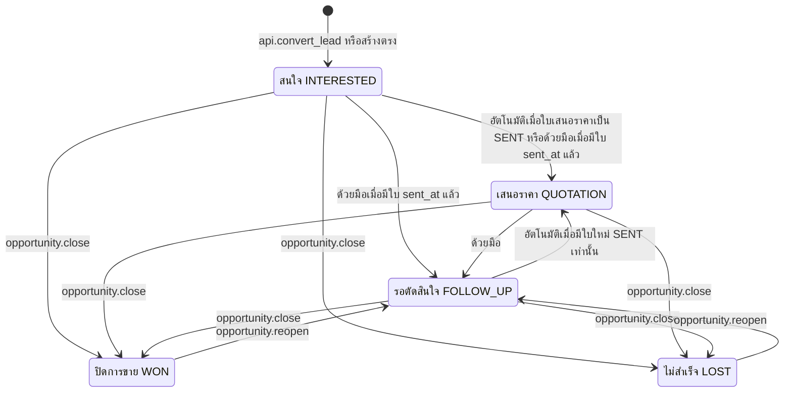

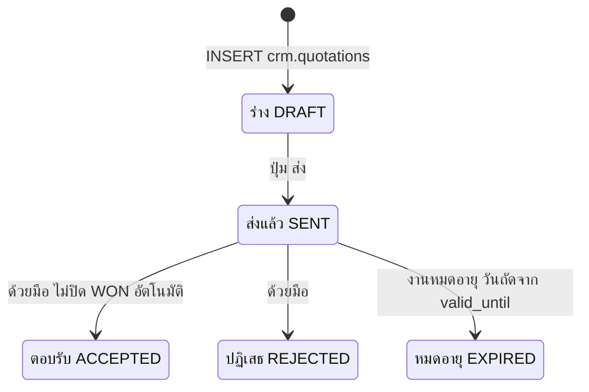

### การเลื่อนขั้นด้วยมือ (รวมการลากการ์ด · CANONICAL ข้อ 4.4 · 14.9 · D48)

| จาก → ไป | ด้วยมือ (ลากการ์ด / เมนู "ย้ายไปขั้น…") | เงื่อนไข | เมื่อไม่ผ่าน |
|---|:--:|---|---|
| `QUOTATION` เสนอราคา → `FOLLOW_UP` รอตัดสินใจ | ✓ | – | – |
| `INTERESTED` สนใจ → `QUOTATION` เสนอราคา | ✓ | มี quotation ของ opportunity นี้ที่ `sent_at IS NOT NULL` แล้วอย่างน้อย 1 ใบ (ไม่ว่าสถานะปัจจุบัน) | ปฏิเสธ · toast เหตุผล (ยังไม่มีใบเสนอราคาที่ส่งแล้ว) |
| `INTERESTED` สนใจ → `FOLLOW_UP` รอตัดสินใจ | ✓ | เหมือนข้างบน | ปฏิเสธ · toast เหตุผลเดียวกัน |
| `FOLLOW_UP` รอตัดสินใจ → `QUOTATION` เสนอราคา | ✗ | เกิดอัตโนมัติเมื่อมีใบใหม่ `SENT` (`app.trg_quotation_sent_stage`) | ปฏิเสธ · toast เหตุผล (ต้องส่งใบเสนอราคาใหม่) |
| ขั้นใดก็ได้ → `INTERESTED` สนใจ | ✗ | **ห้ามย้อนกลับ** | ปฏิเสธ · toast เหตุผล (ห้ามย้อนเป็นสนใจ) |
| ขั้นเปิด → `WON` / `LOST` | ผ่าน dialog เท่านั้น (ไม่ใช่การลาก) | ขั้น 8 · 10 | – |

- ฐานข้อมูลบังคับใน `app.enforce_row_transition` (UPDATE `stage` ตรงทาง PostgREST ก็ถูกตรวจ) · UI แสดง toast เหตุผลเมื่อลากผิดทิศ และเมนู "ย้ายไปขั้น…" แสดงเฉพาะปลายทางที่อนุญาต
- ถ้อยคำของ toast และรหัสข้อผิดพลาดกำหนดใน `docs/07-api/api-spec.md`

### ตารางขั้นตอน

| # | ผู้กระทำ | หน้าจอ | การกระทำ | RPC/ตาราง | สิทธิ์ | สถานะผลลัพธ์ | Audit / แจ้งเตือน | ผิดพลาด / ขอบ |
|---|---|---|---|---|---|---|---|---|
| 1a | owner/SV/BM | 11 | แปลงจาก lead | `api.convert_lead` (F04 ขั้น 4) | ดู F04 | `INTERESTED` | ดู F04 | – |
| 1b | ST/SV/BM | 05 · 06 | สร้างโอกาสขายตรง (ไม่มี lead) | INSERT `crm.opportunities` (`customer_id` · `branch_id` · `origin_channel_code` = ช่องทางของ visit/interaction ที่สร้าง · `origin_visit_id` · `interest_code` · `priority_code` · next action 3 ช่อง · `owner_staff_id`) | `opportunity.create` B ประเมินกับลูกค้า (BA ไม่มี) | `INTERESTED` · `origin_channel_code` ตั้งครั้งเดียวไม่เปลี่ยน | row INSERT · `opportunity_stage_history` · task next action | ขาดช่องบังคับของ CHECK → ปฏิเสธ |
| 2 | owner/SV/BM/BA | 06 · 05 | เพิ่ม/แก้สินค้า (`product_type_code` · `product_model` · `variant` · `quantity` · `unit_price` · `interest_level`) | INSERT/UPDATE/DELETE `crm.opportunity_items` | `opportunity.update` ของแม่ | trigger ปรับ `expected_amount` = ผลรวม items | row change | ลบ item ได้เมื่อ opportunity ยังเปิด |
| 3 | owner/SV/BM | 19 | สร้างใบเสนอราคาจาก opportunity (drawer) | INSERT `crm.quotations` (`opportunity_id` · `installment_months` · `terms_note`) + `crm.quotation_items` (`discount_amount`) | `quotation.create` (ST O · SV T · BM B) ประเมินกับ opportunity แม่ · `branch_id` = ของแม่ | `DRAFT` · `quotation_no` · `customer_id` `branch_id` `owner_staff_id` คัดลอกจาก opportunity แม่เมื่อไม่ส่งมา (`app.trg_row_defaults` · ข้อ 19.1 ข้อ 6) | row INSERT | BA/EX/OP ไม่มีสิทธิ์สร้าง · opportunity แม่ปิดแล้ว → ปฏิเสธ (อ่านอย่างเดียว · ข้อ 19.2 ข้อ 3) |
| 4 | owner/SV/BM | 19 | กด **"ส่ง"** เลือกช่องทางที่ส่ง | UPDATE `crm.quotations` `status='SENT'` + `sent_channel_code` (ข้อ 19.3 ข้อ 5 · ไม่มี RPC) | `quotation.update` | quotation `SENT` · `app.trg_row_defaults` ตั้ง `sent_at = now()` และ `valid_until = วันที่ส่ง (Asia/Bangkok) + quotation.valid_days` (7 · รอยืนยัน) · trigger สร้าง interaction `QUOTATION_SENT` `OUTBOUND` (ช่องทาง = `sent_channel_code`) · `app.trg_quotation_sent_stage` เลื่อน opportunity `INTERESTED`/`FOLLOW_UP` → `QUOTATION` | row UPDATE · `opportunity_stage_history` · OUTBOUND ทำให้ lead `NEW` ของลูกค้าเป็น `CONTACTED` (`app.trg_mark_lead_contacted`) | หลังส่งแก้ได้เฉพาะ `status` (ข้อ 9.4.2) · แก้ items ของใบที่ไม่ใช่ DRAFT → ปฏิเสธ · ผู้ใช้ส่ง `sent_at`/`valid_until` เองไม่ได้ (ข้อ 19.2 ข้อ 4) |
| 5 | owner/SV/BM | 19 | ลูกค้าตอบรับ/ปฏิเสธ | UPDATE `status='ACCEPTED'`/`'REJECTED'` | `quotation.update` | ใบเสนอราคาเปลี่ยน · opportunity ไม่เปลี่ยน | row UPDATE | `ACCEPTED` ไม่ปิด WON อัตโนมัติ |
| 6 | JOB | – | รอบ 00:10 ของวันถัดจาก `valid_until` (มีผลตั้งแต่ 00:00 · AN-30) | `app.job_expire_quotations(p_as_of)` | service_role | `SENT` ที่ `valid_until` < วันของ `p_as_of` → `EXPIRED` | row UPDATE (actor `SYSTEM`) | opportunity ยังเป็น `QUOTATION`/`FOLLOW_UP` (นิยาม "มีใบที่ SENT แล้วอย่างน้อย 1 ใบ ไม่ว่าจะหมดอายุหรือไม่") · เปลี่ยนเฉพาะใบที่ยัง `SENT` |
| 7 | owner/SV/BM/BA | 06 | ลากการ์ดหรือเลือก "ย้ายไปขั้น…" | UPDATE `crm.opportunities.stage` | `opportunity.update` (ST O · SV T · BM B · BA G) | ตามตาราง "การเลื่อนขั้นด้วยมือ" ด้านบน | `opportunity_stage_history` | ทิศที่ไม่อนุญาต → ปฏิเสธ + toast เหตุผล (D48) |
| 8 | owner/SV/BM/BA | 06 · 05 | ปิดการขาย (dialog บังคับยอดขาย) | UPDATE `stage='WON'` + `won_amount` + `won_at` + `closed_at = won_at` (คอลัมน์อยู่ใน column grant · CHECK บังคับ) | `opportunity.close` (ST O · SV T · BM B · BA G) | `WON` · task next action → `CANCELLED` ถ้ายังไม่ DONE · lifecycle → `CUSTOMER` หรือ `REPEAT` | `OPPORTUNITY_WON` · `opportunity_stage_history` | `won_amount ≤ 0` หรือ `closed_at ≠ won_at` → ปฏิเสธ · visit outcome `PURCHASED` เปิด dialog นี้ให้แต่ไม่บังคับ · รายการที่ปิดแล้วอ่านอย่างเดียวจนกว่าจะ reopen (ข้อ 19.2 ข้อ 3) |
| 9 | owner/SV/BM/BA | 05 | ผูกเลขธุรกรรม (V1 ด้วยมือ) | INSERT `crm.transaction_refs` (`customer_id` · `branch_id` · `opportunity_id` · `transaction_type_code` · `source_system_code = 'MANUAL'` · `external_no` · `transacted_at` · `amount` · `device_imei` · `device_serial`) | `transaction.link` (ST O · SV T · BM B · BA G) ประเมินกับแถวแม่ · scope O ประเมินจาก `created_by` (ข้อ 8.0) | ref ผูก opportunity WON นับเป็นการซื้อครั้งเดียวกับ opportunity · `customer_branches.linked_via = 'MANUAL_LINK'` เมื่อเป็นสาขาใหม่ | row INSERT | ซ้ำ (`source_system_code`, `external_no`) → ปฏิเสธ · **INSERT ได้อย่างเดียว** แก้/ยกเลิกที่ผูกผิดด้วยสคริปต์ BA (ข้อ 19.2 ข้อ 6 · รอยืนยัน Q29) · ยังไม่ผูกเมื่อ `won_at` เกิน 3 วัน → issue `WON_WITHOUT_TRANSACTION` |
| 10 | owner/SV/BM/BA | 06 · 05 | ปิดไม่สำเร็จ | UPDATE `stage='LOST'` + `lost_reason_code` (+ `lost_note` เมื่อ `OTHER`) + `closed_at` | `opportunity.close` | `LOST` · task next action → `CANCELLED` | `opportunity_stage_history` (`reason` = `lost_reason_code` เมื่อไม่ส่ง `app.status_reason`) | – |
| 11 | BM/BA | 06 · 05 | เปิดรายการที่ปิดแล้ว พร้อม next action ใหม่ | UPDATE `stage='FOLLOW_UP'` + next action | `opportunity.reopen` (BM B · BA G) | `FOLLOW_UP` · ล้าง `won_at` `won_amount` `closed_at` `lost_reason_code` | `opportunity_stage_history` · task next action ใหม่ | ST/SV ไม่มีสิทธิ์ |
| 12 | JOB | – | ไม่มี interaction หรือการเปลี่ยนขั้น 7 วัน | `app.job_notifications` | service_role | – | `OPPORTUNITY_STALE` → owner · 14 วันเพิ่มผู้จัดการสาขา | ดู F14 |

### ผลต่อ KPI (ข้อ 12)

`OPPORTUNITIES` นับที่ `created_at` · `SALES` `SALES_AMOUNT` นับที่ `won_at` (V1 ใช้ `won_amount`) · `LOST_OPPORTUNITIES` นับที่ `closed_at` · `CLOSE_RATE` = `SALES / (SALES + LOST_OPPORTUNITIES)` · `WALKIN_CONVERSION` ใช้ `origin_channel_code = 'WALK_IN'` · `OPEN_PIPELINE_AMOUNT` = ผลรวม `expected_amount` ของขั้นที่เปิด

### ตัวอย่างจาก seed — `OP-2026-002998` ของคุณสมชาย (ข้อ 13.7)

| วันเวลา | เหตุการณ์ | สถานะ opportunity | สถานะ `QT-2026-001702` |
|---|---|---|---|
| 1 ก.ย. 2569 14:00 | คุณขวัญสร้างโอกาสขายตรง (ไม่มี lead) · origin `LINE` | `INTERESTED` | – |
| 1 ก.ย. 2569 14:22 | ส่งใบเสนอราคา iPhone 17 Pro Max 256GB ฿49,900 ทาง LINE · interaction #5 `QUOTATION_SENT` | `QUOTATION` (อัตโนมัติ) | `SENT` · `valid_until` 8 ก.ย. 2569 |
| 8 ก.ย. 2569 16:10 | คุณสมชายเข้าร้าน เปลี่ยนสินค้าเป็น iPhone 17 Pro ฿45,900 `HOT` · ความสำคัญ `HIGH` | `FOLLOW_UP` (ด้วยมือ `QUOTATION → FOLLOW_UP` · อนุญาตเสมอ) | `SENT` |
| 8 ก.ย. 2569 16:40 | ตั้ง next action `CALL` "โทรติดตามเรื่องผ่อน" 18 ก.ย. 2569 10:00 | `FOLLOW_UP` | `SENT` |
| 9 ก.ย. 2569 00:10 (รอบงาน · คำนวณ) | `app.job_expire_quotations` | `FOLLOW_UP` (ไม่เปลี่ยน) | `EXPIRED` |

การ์ดบน pipeline JP1 (ข้อ 13.9): คอลัมน์ "รอตัดสินใจ" คุณสมชาย · iPhone 17 Pro · ฿45,900 · 18 ก.ย. · คุณขวัญ · คอลัมน์ "เสนอราคา" คุณพิมพ์ชนก ศรีสุข `CUS-2026-005412` · ฿49,900 · 10 ก.ย. (เกินกำหนด) · คอลัมน์ "ปิดการขาย (7 วัน)" คุณมานพ รักงาน `CUS-2026-006310` · iPhone 16 128GB · ฿28,900 · won 10 ก.ย. — คุณขวัญมีงาน `CALL` "โทรขอเลขใบเสร็จ POS" ของคุณมานพวันนี้ 10:00 (ข้อ 13.10 #5) ซึ่งเป็นงานที่สร้างเองสำหรับขั้น 9 (ไม่ใช่ task next action เพราะรายการ WON แล้ว)

---

## F06 — Next action · task ซิงก์ · วันติดตาม

**เป้าหมาย:** "next action เป็นแหล่งจริงของงานติดตาม" (ข้อ 4.4) — พนักงานตั้งนัดบน lead/opportunity ครั้งเดียว ระบบสร้างงาน เตือน และยกระดับให้ · หน้า "งานของวันนี้" แบ่ง **วันนี้** กับ **เกินกำหนด** ไม่ทับกัน (ข้อ 4.7 · D20)

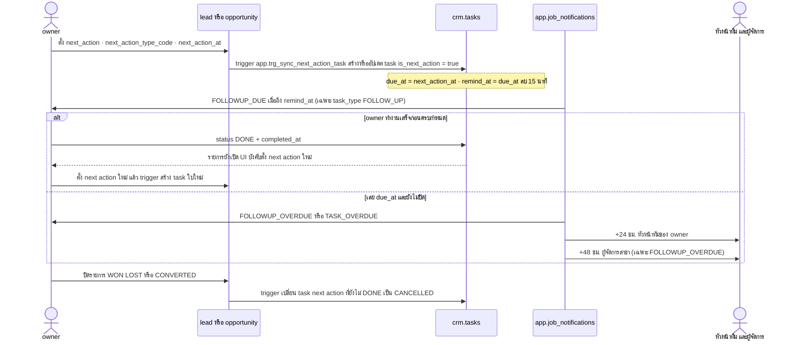

### การจับคู่ช่องที่ trigger ซิงก์

| lead/opportunity | task (`is_next_action = true`) | กติกา |
|---|---|---|
| `next_action` | `title` | ข้อ 4.4 |
| `next_action_type_code` | `task_type_code` | ข้อ 4.4 |
| `next_action_at` | `due_at` · `remind_at = due_at − 15 นาที` (`sla.followup_remind_min` · ตั้งโดย `app.trg_row_defaults` และเลื่อนตาม `due_at` ถ้าไม่ได้แก้เอง) | ข้อ 4.4 · 4.7 · 11.2 |
| `owner_staff_id` | `owner_staff_id` | ข้อ 4.4 |
| `id` · `customer_id` · `branch_id` | `lead_id` หรือ `opportunity_id` · `customer_id` · `branch_id` | ข้อ 6.10 · 8.0 (`branch_id` ของลูกเท่าแม่) |
| `priority_code` · `team_id` | `priority_code` · `team_id` | ข้อ 19.1 (migration 0009) |

- trigger `app.trg_sync_next_action_task` (AFTER INSERT/UPDATE ของ `crm.leads` `crm.opportunities`) ทำงานเมื่อคอลัมน์ `status`/`stage` `next_action` `next_action_type_code` `next_action_at` `owner_staff_id` `team_id` `priority_code` `branch_id` `customer_id` เปลี่ยน · ไม่มีใบเปิด → สร้างใบใหม่ (รวมหลังใบเดิม `DONE`) · รายการปิด (`CONVERTED`/`WON`/`LOST`) → ใบที่ยังไม่ปิดเป็น `CANCELLED` · ข้ามเมื่อ `app.bulk = on` (ข้อ 19.1 ข้อ 11)
- unique partial index `tasks_next_action_lead_uidx` · `tasks_next_action_opportunity_uidx` `WHERE is_next_action AND status IN ('OPEN','IN_PROGRESS')`: task next action ที่ยังเปิดได้หนึ่งใบต่อ lead/opportunity · CHECK `tasks_next_action_parent_chk` ผูกแม่ได้หนึ่งรายการพอดี
- task `is_next_action` ผู้ใช้แก้ owner · สาขา · `due_at` · ประเภท ตรงไม่ได้ (แก้ที่ next action ของแม่ หรือ `api.assign_owner` ของแม่) · task `DONE`/`CANCELLED` แก้ไม่ได้ (ข้อ 19.2 ข้อ 3)
- seed โหลดด้วย `app.bulk = on` จึงคงชื่องานตามที่พิมพ์ในข้อ 13.7 (`TK-2026-012508` "โทรติดตามเรื่องผ่อน iPhone 17 Pro") แม้ next action ของแม่คือ "โทรติดตามเรื่องผ่อน" · trigger ปรับ `title` ครั้งถัดไปที่คอลัมน์ข้างบนของแม่เปลี่ยน

### ตารางขั้นตอน

| # | ผู้กระทำ | หน้าจอ | การกระทำ | RPC/ตาราง | สิทธิ์ | สถานะผลลัพธ์ | Audit / แจ้งเตือน | ผิดพลาด / ขอบ |
|---|---|---|---|---|---|---|---|---|
| 1 | owner/SV/BM/BA | 06 · 11 · 05 | ตั้ง/เลื่อนนัดติดตาม | UPDATE next action 3 ช่องของ `crm.leads`/`crm.opportunities` | `lead.update` / `opportunity.update` | task next action ถูกสร้าง/อัปเดต | row change ทั้งสองตาราง | ช่องว่างขณะรายการเปิด → CHECK ปฏิเสธ · ข้อความมีเลขบัตรประชาชน → ปฏิเสธ |
| 2 | ผู้ใช้ | 08 · 10 | เปิด "งานของวันนี้" | SELECT `crm.tasks` | `task.read` (ST O · SV T · BM B · OP B · EX G · BA G) · **ไม่มี read-through ผ่านลูกค้า** | กลุ่ม **วันนี้**: `OPEN`/`IN_PROGRESS` และ `due_at` อยู่ในวันนี้ (เลยเวลาแสดงป้าย "เลยเวลา") · **เกินกำหนด**: `OPEN`/`IN_PROGRESS` และ `due_at` ก่อน 00:00 ของวันนี้ · ทั้งหมด = วันนี้ + เกินกำหนด | – | วันตาม Asia/Bangkok เทียบ `app.clock()` · ตัวกรองประเภท `FOLLOW_UP` = มุมมอง "Follow-ups" · มุมมองปฏิทิน Phase 2 (รอยืนยัน) |
| 3 | owner | 08 | สร้างงานเอง (ไม่ใช่ next action) | INSERT `crm.tasks` (`task_type_code` · `title` · `description` · `customer_id` · `lead_id`/`opportunity_id` · `priority_code` · `due_at`) | `task.create` (ST O · SV T · BM B · BA G) ประเมินกับ opportunity/lead ถ้ามี มิฉะนั้นลูกค้า | `OPEN` · `is_next_action = false` · `remind_at` ค่าเริ่มต้น `due_at − 15 นาที` · `customer_id` เติมจาก lead/opportunity เมื่อว่าง (`app.trg_row_defaults`) | row INSERT · มอบให้คนอื่นตอนสร้างต้องมี `task.assign` บนแถวใหม่ → `TASK_ASSIGNED` (ไม่ส่งสำหรับ task `is_next_action`) | `due_at` บังคับ (NOT NULL · ข้อ 19.1 ข้อ 6) |
| 4 | owner | 08 | เริ่มทำ / เสร็จ / ยกเลิก | UPDATE `status` (`IN_PROGRESS` · `DONE` · `CANCELLED`) · ความคิดเห็น INSERT `crm.task_comments` | `task.update` | ตามที่เลือก · `app.trg_row_defaults` ตั้ง `completed_at`/`cancelled_at` · `has_open_followup` ของลูกค้าปรับโดย `app.trg_touch_customer_activity` | row change | ปิด task next action ขณะรายการยังเปิด → UI เปิด dialog บังคับตั้ง next action ใหม่ก่อนออกจากหน้า (ข้อ 4.4) · task `DONE`/`CANCELLED` แก้ต่อไม่ได้ (ข้อ 19.2 ข้อ 3) |
| 5 | JOB | กระดิ่ง | ถึง `remind_at` / เลย `due_at` | `app.job_notifications(p_as_of)` ทุก 5 นาที | service_role | – | `FOLLOWUP_DUE` (FOLLOW_UP · in-app + push) · `FOLLOWUP_OVERDUE` · `TASK_OVERDUE` (F14) | task ไม่มี owner (หลังปิดใช้งานพนักงาน): ระดับ 0 และระดับหัวหน้าทีมของ owner ไม่มีผู้รับจึงข้าม (ข้อ 11.1) · `FOLLOWUP_OVERDUE` +48 ชม. ยังส่งถึงผู้จัดการสาขา · หัวหน้าทีม/ผู้จัดการมอบงานด้วย `api.assign_owner` (`task.assign` T รวมงาน owner ว่างในสาขาที่เป็นหัวหน้าทีม · ข้อ 8.0) |
| 6 | DB | – | ปิดรายการแม่ | trigger | – | task next action ที่ยังไม่ `DONE` → `CANCELLED` | row UPDATE | – |

### "นัดติดตามถัดไป" บน Customer 360

แสดง next action ที่ใกล้ที่สุดจาก lead/opportunity ที่เปิดอยู่ของลูกค้า (ไม่อ่านจาก tasks เพราะ tasks ไม่มี read-through) · ป้าย "ติดตามอยู่" อ่านจาก `customers.has_open_followup` (task `FOLLOW_UP` ที่ `OPEN`/`IN_PROGRESS`) จึงเห็นเหมือนกันทุกผู้ดู (ข้อ 3.5 · 6.3 · 6.8 · 9.4)

### ผลต่อ KPI

`TASKS_TODAY` · `TASKS_OVERDUE` ณ `app.clock()` · `OPEN_FOLLOWUP_CUSTOMERS` · `FOLLOWUP_COMPLETION`: ตัวหาร = task `FOLLOW_UP` ที่ `due_at` ในช่วงและไม่ `CANCELLED` ตัดรายการที่ยังไม่ `DONE` และ `due_at + 24 ชม. > app.clock()` ออก · ตัวตั้ง = `DONE` และ `completed_at ≤ due_at + 24 ชม.` (ข้อ 12.2)

### ตัวอย่างจาก seed

**คุณสมชาย (ข้อ 13.7):** "นัดติดตามถัดไป" = 18 ก.ย. 2569 10:00 · โทรติดตามเรื่องผ่อน · คุณขวัญ (next action ของ `OP-2026-002998` ที่ใกล้กว่า 20 ก.ย. ของ `LD-2026-007460`)

| task | ประเภท | due | เวลาเตือน (คำนวณ) | ถ้าไม่ปิด (คำนวณตามข้อ 11.1) |
|---|---|---|---|---|
| `TK-2026-012508` ของ `OP-2026-002998` | `CALL` | 18 ก.ย. 2569 10:00 | `remind_at` 09:45 · ไม่มี `FOLLOWUP_DUE` เพราะไม่ใช่ `FOLLOW_UP` | 18 ก.ย. 10:00 `TASK_OVERDUE` → คุณขวัญ · 19 ก.ย. 10:00 → คุณนัท · ไม่มี `TASK_ASSIGNED` เพราะเป็น task `is_next_action` |
| task ติดตาม iPad Air ของ `LD-2026-007460` | `FOLLOW_UP` | 20 ก.ย. 2569 11:00 | 10:45 `FOLLOWUP_DUE` → คุณขวัญ | 20 ก.ย. 11:00 `FOLLOWUP_OVERDUE` → คุณขวัญ · 21 ก.ย. 11:00 → คุณนัท · 22 ก.ย. 11:00 → คุณเจ (แต่ละระดับมี `dedupe_key` ของวันที่จุดยึด 20 · 21 · 22 ก.ย. จึงไม่แจ้งซ้ำทุกวัน · AN-29) |

**งานของคุณขวัญ ณ 11 ก.ย. 2569 10:24 (ข้อ 13.10):** ทั้งหมด 12 = วันนี้ 8 + เกินกำหนด 4 · งาน #5 (`CALL` 10:00) อยู่กลุ่ม "วันนี้" พร้อมป้าย "เลยเวลา" · งาน #1–#4 due 10 ก.ย. 2569 อยู่กลุ่ม "เกินกำหนด" · งาน #7 #10 #12 (`FOLLOW_UP` due วันนี้ยังเปิด) ถูก **ตัดออก** จากตัวหาร `FOLLOWUP_COMPLETION` เพราะยังอยู่ในระยะผ่อนผัน 24 ชม. · งานของคุณสมชาย (18 ก.ย.) ไม่อยู่ในรายการวันนี้

---

## F07 — เปลี่ยนผู้รับผิดชอบ / ย้ายสาขา

**เป้าหมาย:** ทุก lead/opportunity มี `owner_staff_id` `branch_id` `team_id` และทุกการเปลี่ยนมีประวัติ ผู้เปลี่ยน เหตุผล (A28)

### ใครเปลี่ยนอะไรได้ (ข้อ 8.1 · 9.4.2)

| สิ่งที่เปลี่ยน | ต้องมี | บันทึก |
|---|---|---|
| owner ของ lead / opportunity / task | `lead.assign` / `opportunity.assign` / `task.assign` (SV T · BM B · BA G) บนแถวเดิม **และ** แถวหลังเปลี่ยน (rls-spec LD-8/LD-9 · OP-7 · TK-6) · scope T รวมรายการ owner ว่างในสาขาที่ตนเป็นหัวหน้าทีม (ข้อ 8.0 · Q28) | `crm.ownership_changes` · แจ้ง `LEAD_ASSIGNED` / `OPPORTUNITY_ASSIGNED` / `TASK_ASSIGNED` ถึง owner ใหม่เมื่อคนอื่นเป็นผู้เปลี่ยน (ไม่ส่ง `TASK_ASSIGNED` สำหรับ task `is_next_action` · ไม่ส่งเมื่อ `app.bulk = on`) |
| owner ของลูกค้า | `customer.assign` (SV T · BM B · BA G) | `crm.ownership_changes` |
| owner ของ visit | `visit.update` scope T/B (G รวม) (การรับคิวใช้กติกา F01 ไม่ใช่การมอบงาน) | `crm.ownership_changes` |
| `branch_id` ของ lead / opportunity / task | `*.assign` ทั้งสาขาต้นทางและปลายทาง | `crm.ownership_changes` เหตุผล `BRANCH_TRANSFER` |
| owner ของ interaction / quotation · `branch_id` ของ visit / interaction · owner/สาขาของ task `is_next_action` (ตามแม่) | **เปลี่ยนไม่ได้** | – |

ทุกกรณีในตารางเรียก **`api.assign_owner(p_entity_type, p_entity_id, p_to_staff_id, p_reason_code, p_note, p_to_branch_id)`** เท่านั้น (ข้อ 9.4.2 · 9.6) · `p_entity_type` ∈ `CUSTOMER` `VISIT` `LEAD` `OPPORTUNITY` `TASK` (ชุดเดียวกับ CHECK `ownership_changes_entity_type_chk`) · `p_to_branch_id` ส่งเฉพาะเมื่อย้ายสาขา (lead/opportunity/task) · owner ของ opportunity ที่เปิดอยู่ว่างไม่ได้ (CHECK) · UPDATE `owner_staff_id`/`team_id`/`branch_id` ตรงทาง PostgREST ถูกปฏิเสธเพราะไม่อยู่ใน column grant (ยกเว้นการรับคิวของ visit)

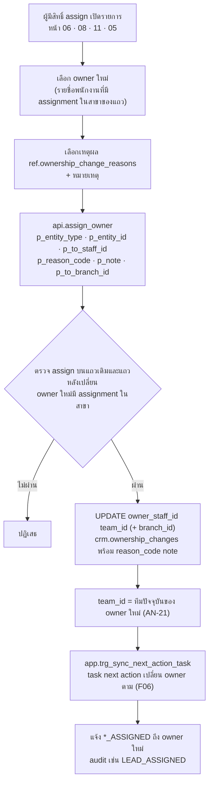

### ตารางขั้นตอน

| # | ผู้กระทำ | หน้าจอ | การกระทำ | RPC/ตาราง | สิทธิ์ | สถานะผลลัพธ์ | Audit / แจ้งเตือน | ผิดพลาด / ขอบ |
|---|---|---|---|---|---|---|---|---|
| 1 | SV/BM/BA | 11 · 06 · 08 · 05 | กด "เปลี่ยนผู้รับผิดชอบ" | SELECT `core.staff_profiles` (คอลัมน์ `id` `staff_code` `display_name` `nickname` `status`) | ผู้ใช้ ACTIVE ในองค์กร | – | – | ST ไม่มี `*.assign` → ปุ่มซ่อน |
| 2 | SV/BM/BA | เดิม | เลือก owner ใหม่ + เหตุผล (`SHIFT_CHANGE` · `WORKLOAD` · `STAFF_LEFT` · `CUSTOMER_REQUEST` · `BRANCH_TRANSFER` · `OTHER`) + หมายเหตุ | `api.assign_owner(p_entity_type, p_entity_id, p_to_staff_id, p_reason_code, p_note, p_to_branch_id)` | `*.assign` ตามตารางด้านบน | owner ใหม่ · `team_id` ใหม่ (หมายเหตุผู้เขียน AN-21) | `crm.ownership_changes` (`entity_type` · `entity_id` · `from_staff_id` · `to_staff_id` · `from_branch_id` · `to_branch_id` · `reason_code` = `p_reason_code` · `note` = `p_note` · `changed_by` · `changed_at`) · audit `LEAD_ASSIGNED` (หรือ row UPDATE ของตารางอื่น) | owner ใหม่ไม่มี assignment ในสาขาของแถว (`app.staff_has_branch_assignment`) → ปฏิเสธ · SUPERVISOR (scope T) มอบได้เฉพาะสมาชิกทีมตน เพราะต้องมี `*.assign` บนแถวหลังเปลี่ยนด้วย · `p_reason_code` ไม่อยู่ใน `ref.ownership_change_reasons` → ปฏิเสธ |
| 3 | DB | – | ซิงก์ task next action | `app.trg_sync_next_action_task` | – | task owner = owner ใหม่ | – | – |
| 4 | DB | กระดิ่ง | แจ้ง owner ใหม่ | `app.trg_emit_notification` | – | – | `LEAD_ASSIGNED` · `OPPORTUNITY_ASSIGNED` · `TASK_ASSIGNED` (in-app) | owner ใหม่เป็นผู้เปลี่ยนเอง → ไม่แจ้ง · task `is_next_action` → ไม่ส่ง `TASK_ASSIGNED` · `app.bulk = on` → ไม่ส่ง `*_ASSIGNED` (ข้อ 11.1) |
| 5 | SV/BM/BA ที่มีสิทธิ์สองสาขา | 11 · 06 | ย้าย lead/opportunity/task จาก `JPON` ไปสาขา | `api.assign_owner(…, 'BRANCH_TRANSFER', p_note, p_to_branch_id)` พร้อม owner ในสาขาปลายทาง | `*.assign` ทั้งสองสาขา | `branch_id` ใหม่ · task next action ย้ายสาขาตามแม่ | `ownership_changes` เหตุผล `BRANCH_TRANSFER` | ผู้ส่งต่อตาม Q3 รอยืนยัน · KPI สาขาใช้ `branch_id` ปัจจุบัน (ข้อ 12.4) |
| 6 | DB (ปิดใช้งานพนักงาน) | 13 | ย้ายงานของพนักงานที่ถูกปิดใช้งาน | `api.disable_staff` (F08) | `user.disable` 🔐 | opportunity ที่เปิด → ผู้จัดการสาขาของรายการ (หลายคน → `staff_code` น้อยสุด · รอยืนยัน) · lead/task ที่เปิด → owner ว่าง | `ownership_changes` เหตุผล `STAFF_LEFT` · `LEAD_UNASSIGNED` (รอยืนยัน) | สาขาของ opportunity ไม่มีผู้จัดการ → **ปฏิเสธการปิดใช้งาน** จนกว่าจะโอนงานด้วย `api.assign_owner` (ข้อ 7.3 ข้อ 4) |

### ตัวอย่างจาก seed (ข้อ 13.14)

`LD-2026-007512` ของคุณวิไลวรรณ สวยดี (`CUS-2026-006790`) · 10 ก.ย. 2569 18:05 · คุณขวัญ → คุณคิม · โดยคุณเจ (`BRANCH_MANAGER`@JP1 มี `lead.assign` B) เรียก `api.assign_owner('LEAD', <id ของ LD-2026-007512>, <id ของคุณคิม ST-0046>, 'SHIFT_CHANGE', p_note, NULL)` · เหตุผล `SHIFT_CHANGE` "เปลี่ยนกะ"
→ แถว `crm.ownership_changes` · audit `LEAD_ASSIGNED` (ผู้กระทำ `ST-0020` · รายละเอียด "คุณขวัญ → คุณคิม · SHIFT_CHANGE") · คุณคิมมีแจ้งเตือน `LEAD_ASSIGNED` LD-2026-007512 ที่ยังไม่อ่าน · lead ถูกนับเป็นของคุณคิมในผลงานรายพนักงาน (owner ปัจจุบัน · ข้อ 12.4)

---

## F08 — เชิญพนักงาน → เปิดใช้งาน (MFA) → ปิดใช้งาน

**เป้าหมาย:** ไม่มี public sign-up · ผู้จัดการสร้างบัญชีในสาขาตน · ลาออกใช้ Disable ไม่ Delete (B10) · `core.staff_status`: `INVITED` → `ACTIVE` → `DISABLED` (ข้อ 4.8 · 7.3)

### ใครเชิญ/มอบ/ปิดใช้งานใครได้ (ข้อ 7.2 · 7.3 · 8.1)

| ผู้กระทำ | เชิญได้ | มอบ/ถอนบทบาทได้ | แก้โปรไฟล์/ปิดใช้งานได้ |
|---|---|---|---|
| BRANCH_MANAGER | `user.invite` B · สาขาถูกล็อกเป็นสาขาที่ตนเป็นผู้จัดการ | `STAFF` `SUPERVISOR` ในสาขาตน | บัญชีที่ assignment ที่ยังมีผล **ทุกแถว** เป็น STAFF/SUPERVISOR ในสาขาตน (กรณีอื่นถอนได้เฉพาะ assignment ในสาขาตน) · แก้อีเมลไม่ได้ |
| BUSINESS_ADMIN | `user.invite` G | `STAFF` `SUPERVISOR` `BRANCH_MANAGER` `MARKETING` `OPERATIONS` ทุกสาขา | ทุกบัญชีธุรกิจ (ตามกติการ่วม) |
| SYSTEM_ADMIN | เฉพาะบัญชีสาย SYSTEM_ADMIN (บทบาทต้องผ่านคำขอ F09) | มอบตรงไม่ได้ (ไม่มี rank) | เฉพาะบัญชีที่ไม่มีบทบาทธุรกิจ |
| ทุกคน | – | ห้ามมอบ/ถอนของตนเอง · ห้ามมอบ rank ≥ rank สูงสุดของตน · ห้ามมอบบทบาทให้บัญชี `DISABLED` · `EXECUTIVE` `BUSINESS_ADMIN` `SYSTEM_ADMIN` มอบ/ถอนผ่านคำขอ RG เท่านั้น (F09) | ห้ามปิดใช้งานตนเอง · ห้ามปิดใช้งาน EXECUTIVE หรือ BUSINESS_ADMIN ที่ ACTIVE คนสุดท้าย |
| สคริปต์ bootstrap | EXECUTIVE คนแรก + SYSTEM_ADMIN คนแรก + บัญชี `INVITED` ของ BUSINESS_ADMIN คนแรก | บทบาท BA ของคนแรกมอบผ่านคำขอ RG ที่ EXECUTIVE อนุมัติ · EXECUTIVE ยืนยันตัวตนกับ HR แทน BA | – |

เปลี่ยนอีเมล/ตัวตนล็อกอิน/รีเซ็ต MFA (ข้อ 7.3 ข้อ 6): บัญชี STAFF และบทบาท ≥ SUPERVISOR → BUSINESS_ADMIN · บัญชี BA/EX/SA → EXECUTIVE · ผ่าน Edge Function `reset-mfa` (→ `api.svc_reset_mfa_authorize`) ที่ผู้กระทำต้อง aal2 · แจ้งอีเมลเดิมทุกครั้ง · บันทึก `MFA_RESET`

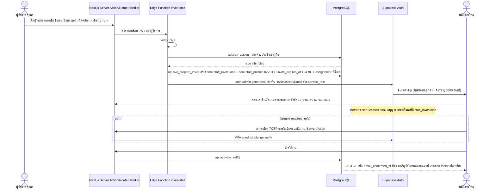

### ตารางขั้นตอน

| # | ผู้กระทำ | หน้าจอ | การกระทำ | RPC/ตาราง | สิทธิ์ | สถานะผลลัพธ์ | Audit / แจ้งเตือน | ผิดพลาด / ขอบ |
|---|---|---|---|---|---|---|---|---|
| 1 | BM/BA/SA | 13 | "ผู้ใช้งานในสาขา" → "เพิ่มผู้ใช้งาน" → กรอกชื่อ · ชื่อเล่น · อีเมล · เบอร์ · `employee_code` → เลือกบทบาท (แสดงเฉพาะที่มอบได้) | – | `user.invite` · `role.assign` 🔐 (BM/BA) | – | – | บทบาทที่มอบไม่ได้ไม่แสดง · BM ไม่เห็นตัวเลือกสาขา |
| 2 | EF `invite-staff` | – | ตรวจสิทธิ์แล้วสร้างบัญชี | verify JWT → `api.can_assign_role(...)` ด้วย JWT ผู้เรียก → `api.svc_prepare_invite(...)` (service_role · ตั้ง `app.actor_staff_id` จาก JWT) INSERT `core.staff_invitations` (`invited_by` · `expires_at` = +24 ชม.) + `core.staff_profiles` (`INVITED` · `invite_expires_at = +24 ชม.`) + `core.staff_role_assignments` ของบทบาทที่เลือก (มีผลเมื่อ `ACTIVE` · บัญชีสาย SYSTEM_ADMIN ไม่มี assignment จนกว่าคำขอ RG อนุมัติ · ข้อ 19.3 ข้อ 6) **ก่อน** → `auth.admin.generateLink`/`inviteUserByEmail` | service_role เฉพาะหลังตรวจสิทธิ์ · ไม่รับ actor/staff_id จาก body · เรียกฐานข้อมูลผ่าน `api.svc_*` เท่านั้น (ข้อ 9.8) | `INVITED` · `staff_code` `ST-{NNNN}` จากตัวนับ `ST` | `STAFF_INVITED` · `ROLE_GRANTED` (actor จาก JWT) | `employee_code` ซ้ำกับบัญชีที่ไม่ใช่ `DISABLED` → ปฏิเสธ (`staff_profiles_employee_code_open_uidx` · ข้อ 7.1) · SYSTEM_ADMIN รวมบทบาทธุรกิจ → ปฏิเสธ (`app.trg_check_role_exclusivity`) · บัญชีที่ SYSTEM_ADMIN เชิญรับบทบาทธุรกิจไม่ได้จนกว่า BA ยืนยันตัวตนกับ HR (`identity_verified_by`) · ลิงก์อีเมลหมดอายุ (3600 วินาที) แต่คำเชิญยังไม่ครบ 24 ชม. → `invite-staff` ออกลิงก์ใหม่ได้ (ข้อ 9.2) · พนักงานไม่มีอีเมล → รอยืนยัน Q24 |
| 3 | พนักงานใหม่ | อีเมล → 01 | กดลิงก์ ตั้งรหัสผ่าน | Supabase Auth | – | `email_confirmed_at` | `audit.login_events` | รหัสสั้นกว่า 12 ตัวอักษร หรือเป็นรหัสที่เคยรั่ว → ปฏิเสธ · อีเมลไม่มีคำเชิญ → Before User Created hook ปฏิเสธ |
| 4 | พนักงานใหม่ | 01 | ลงทะเบียน TOTP (เมื่อมีบทบาท `requires_mfa` · ทุกบทบาทยกเว้น STAFF) | Supabase Auth MFA ผ่าน Server Action/Route Handler (เซสชันเป็น HttpOnly cookie · ข้อ 19.4 ข้อ 4) | – | factor verified · aal2 | `MFA_ENROLLED` เขียนโดย trigger บน `auth.mfa_factors` (ข้อ 19.4 ข้อ 5) | ข้ามขั้นนี้ไม่ได้ (UI บังคับ · ข้อ 9.2) |
| 5 | พนักงานใหม่ | 01 | เปิดใช้งาน | `api.activate_self()` | ผู้ใช้ `INVITED` ของตนเอง | `ACTIVE` → เข้าหน้าแรกตามบทบาท (F13) · `staff_invitations.accepted_at` | row UPDATE `core.staff_profiles` | คำเชิญหมดอายุ (`invite_expires_at` เทียบ `now()`) → ปฏิเสธ ต้องเชิญใหม่ (ข้อ 19.3 ข้อ 6) · SSO ก่อนจบขั้นนี้ → ปฏิเสธ (ข้อ 9.2.1) |
| 6 | BM/BA | 13 | จัดทีม: สร้างทีม · เพิ่มสมาชิก · ตั้งหัวหน้า | `api.save_team(...)` · `api.set_team_member(...)` | `team.manage` (BM B · BA G) | `core.team_members` (`is_leader` · `valid_from` · `valid_to`) | row change | สมาชิกต้องมี assignment ในสาขาของทีม · SUPERVISOR ที่ไม่เป็น `is_leader` ของทีมใดในสาขาไม่ได้สิทธิ์ SUPERVISOR |
| 7 | BM/BA/SA · EX (เฉพาะรีเซ็ต) | 13 | แก้โปรไฟล์ | `api.update_staff(...)` · เปลี่ยนอีเมล/ตัวตนล็อกอิน/รีเซ็ต MFA ผ่าน EF `reset-mfa` → `api.svc_reset_mfa_authorize(...)` | `user.update` ตามตารางด้านบน · `reset-mfa`: บัญชี STAFF และ ≥ SUPERVISOR โดย BA · บัญชี BA/EX/SA โดย EX · ผู้กระทำ aal2 (ข้อ 7.3 ข้อ 6) | – | `STAFF_UPDATED` · `MFA_RESET` · แจ้งอีเมลเดิมทุกครั้ง | BM แก้อีเมลไม่ได้ · BM แก้ได้เฉพาะบัญชีที่ assignment ที่ยังมีผลทุกแถวเป็น STAFF/SUPERVISOR ในสาขาตน |
| 8 | BM/BA/SA | 13 | ปิดใช้งาน พร้อมเหตุผล | `api.disable_staff(...)` + EF `disable-staff` → `api.svc_finalize_disable(...)` | `user.disable` 🔐 | `DISABLED` (ห้ามลบแถว) · ban ใน Supabase Auth + เพิกถอน session · `valid_to = now()` ทุก assignment · opportunity ที่เปิด → owner = ผู้จัดการสาขาของรายการ (หลายคน → `staff_code` น้อยสุด · รอยืนยัน) · lead/task ที่เปิด → owner ว่าง | `STAFF_DISABLED` · `ROLE_REVOKED` · `ownership_changes` เหตุผล `STAFF_LEFT` · `LEAD_UNASSIGNED` (รอยืนยัน) | ปิดตนเอง / EX หรือ BA ที่ ACTIVE คนสุดท้าย → ปฏิเสธ · สาขาของ opportunity ไม่มีผู้จัดการ → **ปฏิเสธการปิดใช้งาน** จนกว่าจะโอนงานด้วย `api.assign_owner` (ข้อ 7.3 ข้อ 4) · ประวัติ audit ของพนักงานยังอยู่ครบ |
| 9 | BM/BA | 13 | เปิดใช้งานบัญชีที่ปิดไปแล้ว | เปลี่ยนสถานะกลับจาก `DISABLED` + ยกเลิก ban (กลไกรอยืนยัน · หมายเหตุผู้เขียน AN-25) → มอบบทบาทใหม่ด้วย `api.assign_role(...)` | `role.assign` 🔐 | ต้องมอบบทบาทใหม่ (ข้อ 7.3) · ห้ามมอบขณะยัง `DISABLED` (ข้อ 7.2) | `ROLE_GRANTED` | assignment เดิมไม่กลับมาเอง |

### ตัวอย่างจาก seed (ข้อ 13.5 · 13.14)

- บัญชีตัวอย่างที่ `requires_mfa` ทุกบัญชีมี TOTP verified แล้ว · คุณขวัญและคุณคิม (STAFF) ใช้งานที่ aal1 ได้
- `ST-0051` คุณโอ๊ต สถานะ `INVITED` (เชิญ 10 ก.ย. 2569) เป็นบัญชีสาย SYSTEM_ADMIN ที่ยังไม่มีบทบาท รอคำขอ `RG-2026-0003` (F09) · `ST` = 51 หลัง seed
- การเชิญพนักงาน JP1 โดยคุณเจ: ตัวอย่างสมมติ ไม่อยู่ใน seed

---

## F09 — คำขอมอบบทบาทสูง

**เป้าหมาย:** บทบาท `SYSTEM_ADMIN` `EXECUTIVE` `BUSINESS_ADMIN` ไม่มีใครมอบหรือถอนตรงได้ · SYSTEM_ADMIN ยื่นคำขอชนิด `GRANT` (มอบ) หรือ `REVOKE` (ถอน) · EXECUTIVE ตัดสิน (D22 · ข้อ 4.8 · 7.2) · สถานะคำขอ `REQUESTED` รออนุมัติ · `APPROVED` อนุมัติแล้ว · `REJECTED` ไม่อนุมัติ (`core.role_grant_requests.status` · text CHECK) · ลบคำขอไม่ได้
**bootstrap:** สคริปต์สร้าง EXECUTIVE คนแรก + SYSTEM_ADMIN คนแรก + บัญชี `INVITED` ของ BUSINESS_ADMIN คนแรก · บทบาท BA ของคนแรกมอบผ่านคำขอ RG ที่ EXECUTIVE อนุมัติ และ EXECUTIVE ยืนยันตัวตนกับ HR แทน BA (ข้อ 7.2)

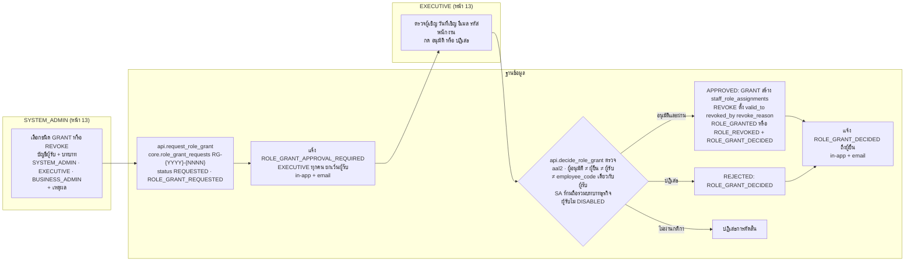

### ตารางขั้นตอน

| # | ผู้กระทำ | หน้าจอ | การกระทำ | RPC/ตาราง | สิทธิ์ | สถานะผลลัพธ์ | Audit / แจ้งเตือน | ผิดพลาด / ขอบ |
|---|---|---|---|---|---|---|---|---|
| 1 | SA | 13 | ยื่นคำขอชนิด `GRANT` หรือ `REVOKE` บทบาทสูงให้บัญชีผู้รับ พร้อมเหตุผล | `api.request_role_grant(...)` → `core.role_grant_requests` (`request_no` · `role_code` · `target_staff_id` · `requested_by` · `request_reason` · ชนิดคำขอ) | `role.request` S · บทบาท SA `requires_mfa` จึงต้อง aal2 | `status = 'REQUESTED'` · เลข `RG-{YYYY}-{NNNN}` | `ROLE_GRANT_REQUESTED` · `ROLE_GRANT_APPROVAL_REQUIRED` ถึง EXECUTIVE ทุกคนยกเว้นผู้รับ (in-app + email ที่มีเฉพาะป้าย เลขอ้างอิง deep link) | ผู้รับเป็นตนเอง → ปฏิเสธ (`role_grant_requests_requester_chk`) · มีคำขอ `REQUESTED` ของ (ผู้รับ, บทบาท) อยู่แล้ว → ปฏิเสธ (`role_grant_requests_open_uidx`) · ผู้รับ `DISABLED` กับชนิด `GRANT` → ปฏิเสธ (ข้อ 7.2) · บทบาทนอกสามค่านี้ → ใช้ `api.assign_role`/`api.revoke_role` โดย BM/BA แทน |
| 2 | EX | 13 | เปิดคำขอ ตรวจผู้เชิญ วันที่เชิญ อีเมล `employee_code` ของผู้รับ | `api.list_role_grant_requests(...)` · `api.list_staff(...)` | `role.decide` / `user.read` G · EXECUTIVE เปิดหน้า users เพื่อดูและอนุมัติเท่านั้น | – | – | – |
| 3 | EX | 13 | อนุมัติ หรือ ปฏิเสธ | `api.decide_role_grant(...)` | `role.decide` G 🔐 | `APPROVED`: `GRANT` → assignment ใหม่ (`granted_by` · `grant_reason`) · `REVOKE` → ตั้ง `valid_to` `revoked_by` `revoke_reason` ของ assignment ที่มีผล · `REJECTED`: ไม่เปลี่ยน assignment · `decided_by` `decided_at` `decision_note` | `ROLE_GRANT_DECIDED` · `ROLE_GRANTED`/`ROLE_REVOKED` เมื่ออนุมัติ · แจ้ง `ROLE_GRANT_DECIDED` ถึงผู้ยื่น (in-app + email · ข้อ 11.1) | ผู้อนุมัติ = ผู้ยื่น / ผู้รับ / บัญชีที่ `employee_code` เดียวกับผู้รับ → ปฏิเสธ (`role_grant_requests_decider_chk` + RPC) · ผู้รับมีบทบาทธุรกิจอยู่แล้วแต่ขอ `SYSTEM_ADMIN` (หรือกลับกัน) → `app.trg_check_role_exclusivity` (`SELECT … FOR UPDATE` `core.staff_profiles`) ปฏิเสธ · ผู้รับที่ SA เชิญขอบทบาทธุรกิจโดยยังไม่มี `identity_verified_by` → ปฏิเสธ · ผู้รับ `DISABLED` กับชนิด `GRANT` → ปฏิเสธ · `REVOKE` ที่ทำให้ไม่เหลือ EX/BA ที่ ACTIVE → ปฏิเสธ (หมายเหตุผู้เขียน AN-34) |
| 4 | ผู้รับ | 01 | เปิดใช้งาน/เข้าสู่ระบบด้วย aal2 | F08 ขั้น 3–5 · F13 | – | บทบาทมีผลเมื่อบัญชี `ACTIVE` และ aal2 | `MFA_ENROLLED` | คำเชิญหมดอายุก่อนอนุมัติ → เชิญใหม่ (ข้อ 19.3 ข้อ 6) |
| 5 | BM/BA | 13 | ถอนบทบาทที่ตนมอบได้ (BM: STAFF/SUPERVISOR ในสาขาตน · BA: STAFF/SUPERVISOR/BRANCH_MANAGER/MARKETING/OPERATIONS) | `api.revoke_role(...)` | `role.assign` 🔐 | `valid_to` · `revoked_by` · `revoke_reason` (แก้ได้เฉพาะสามคอลัมน์นี้) | `ROLE_REVOKED` | ถอนของตนเอง → ปฏิเสธ · ถอน EX/BA/SA → ใช้คำขอ RG ชนิด `REVOKE` (ขั้น 1–3) · การแก้ `core.role_permissions` ทำผ่าน migration เท่านั้น (`PERMISSION_CHANGED`) |

### ตัวอย่างจาก seed (ข้อ 13.14)

`RG-2026-0003` · ยื่นโดยคุณต้น (`ST-0003` SYSTEM_ADMIN) 11 ก.ย. 2569 09:12 · ขอ `SYSTEM_ADMIN` ให้คุณโอ๊ต (`ST-0051` · `INVITED` 10 ก.ย. 2569) · รอ EXECUTIVE
→ audit `ROLE_GRANT_REQUESTED` "SYSTEM_ADMIN → ST-0051" · จ๋าอั๋น (`ST-0001` EXECUTIVE คนเดียวใน seed และไม่ใช่ผู้รับ) มีแจ้งเตือน `ROLE_GRANT_APPROVAL_REQUIRED` RG-2026-0003 ที่ยังไม่อ่าน · จ๋าอั๋นต้องยืนยัน MFA จน aal2 ก่อนกดอนุมัติ (ที่ aal1 ได้สิทธิ์เท่ากับไม่มีบทบาท · ข้อ 13.13)

---

## F10 — รวมลูกค้าและตัดสินข้อมูลซ้ำ

**เป้าหมาย:** ลูกค้าหนึ่งคนมี master record เดียว โดยไม่รวมผิดคน (A13 · B14) · ไม่มี merge อัตโนมัติ · ไม่มี unmerge อัตโนมัติใน V1 (ข้อ 6.7)

**ทางเข้า:** หน้า 12 รายการ `DUPLICATE_SUSPECTED` (แถว `duplicate_decisions` `PENDING`) · แจ้งเตือนสรุป `DUPLICATE_SUSPECTED` 18:00 ถึง SV/BM ของสาขา · เมนู ⋮ "รวมลูกค้า" บน Customer 360

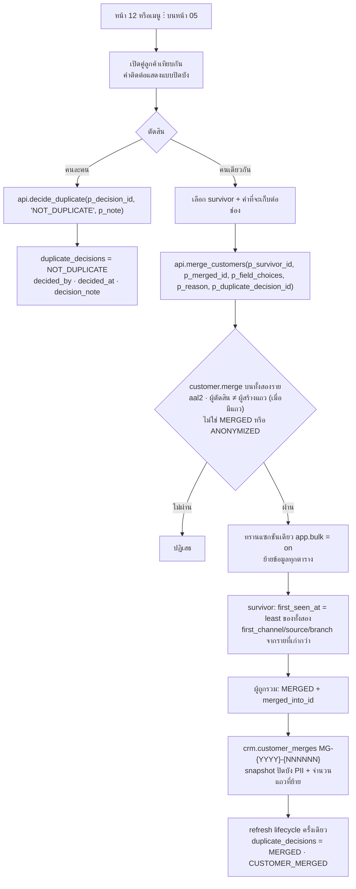

### ตารางขั้นตอน

| # | ผู้กระทำ | หน้าจอ | การกระทำ | RPC/ตาราง | สิทธิ์ | สถานะผลลัพธ์ | Audit / แจ้งเตือน | ผิดพลาด / ขอบ |
|---|---|---|---|---|---|---|---|---|
| 1 | SV/BM/BA (ST/OP/EX ดูได้) | 12 | เปิดรายการลูกค้าอาจซ้ำ | `api.list_data_quality_issues('DUPLICATE_SUSPECTED', p_branch_ids)` · SELECT `crm.duplicate_decisions` | `data_quality.view` บน **ลูกค้าทั้งสองราย** | – | – | เห็นเฉพาะคู่ที่มองเห็นทั้งสองราย |
| 2a | SV/BM/BA | 12 | ยืนยัน "คนละคน" พร้อมหมายเหตุ | `api.decide_duplicate(p_decision_id, 'NOT_DUPLICATE', p_note)` | `customer.merge` 🔐 (SV T · BM B · BA G) บนทั้งสองราย · ผู้ตัดสิน ≠ `created_by` ของแถว | `NOT_DUPLICATE` | row UPDATE `duplicate_decisions` | `DUPLICATE_RATE` ลดลง (นับเฉพาะ `PENDING` ที่ทั้งสองรายยัง `ACTIVE`) |
| 2b | SV/BM/BA | 12 · 05 | รวมลูกค้า: เลือก survivor · ค่าต่อช่อง · เหตุผล | `api.merge_customers(...)` | `customer.merge` 🔐 บนทั้งสองราย · ผู้ตัดสิน ≠ `created_by` ของแถว (เมื่อมีแถว) | ดูตาราง "สิ่งที่ย้าย" | `CUSTOMER_MERGED` · row change ของตารางที่ย้ายบันทึกตามปกติ (`app.bulk = on` ข้าม lifecycle · next-action sync · แคช `last_*`/`has_*` · แจ้งเตือน `*_ASSIGNED` แล้วเรียก `app.refresh_customer_activity` + `app.refresh_customer_lifecycle` ของ survivor ท้ายงาน · ข้อ 19.1 ข้อ 11) | aal1 → ปฏิเสธ · รายใดนอก scope → ปฏิเสธ · รายใด `MERGED`/`ANONYMIZED` → ปฏิเสธ · ลูกค้า `legal_hold` → รอยืนยัน · เปิดจากเมนู ⋮ บน Customer 360 โดยไม่มีแถวตัดสิน → `p_duplicate_decision_id` เป็น NULL และไม่ใช้กติกา "ผู้ตัดสิน ≠ ผู้สร้างแถว" (ข้อ 19.3 ข้อ 7) |
| 3 | ผู้ใช้ใดก็ได้ | 05 | เปิด `customer_no` ของผู้ถูกรวม | `api.get_customer_360` | `customer.read` | redirect ไป survivor | `CUSTOMER_VIEWED` ของ survivor | V1 ไม่มี unmerge อัตโนมัติ |

### สิ่งที่ย้ายใน `api.merge_customers` (ข้อ 6.7)

| ข้อมูล | วิธีย้าย |
|---|---|
| `customer_contacts` | ย้ายทั้งหมด · คู่ (`contact_type`, `value_normalized`) ซ้ำ เก็บแถวที่ verified ก่อน |
| `visits` · `interactions` · `leads` · `opportunities` · `quotations` · `tasks` · `transaction_refs` · `customer_notes` · `customer_consents` | เปลี่ยน `customer_id` เป็น survivor |
| `customer_tags` | `ON CONFLICT DO NOTHING` |
| `customer_branches` | upsert: least `first_linked_at` · greatest `last_activity_at` |
| ช่องของ survivor | `first_seen_at` = least ของทั้งสอง · `first_channel_code` `first_source_code` `first_branch_id` จากรายที่ `first_seen_at` เก่ากว่า (ไม่ใช้ `p_field_choices`) · ช่องอื่นตาม `p_field_choices` |
| ผู้ถูกรวม | `record_status = 'MERGED'` · `merged_into_id` = survivor |
| บันทึก | `crm.customer_merges` เลข `MG-{YYYY}-{NNNNNN}` · snapshot ก่อนรวมแบบปิดบัง PII + hash · จำนวนแถวที่ย้ายแยกตาราง |
| KPI | ลูกค้า `MERGED` นับที่ survivor (ข้อ 12.1) |

### ตัวอย่างจาก seed (ข้อ 13.12 · 13.14)

คู่แรกบนหน้า 12: `CUS-2026-006633` คุณณัฐพล สุขใจ (สร้างโดยคุณคิม 3 ก.ย. 2569 · override `FAMILY_SHARED_PHONE`) ↔ `CUS-2026-002118` คุณณัฐพร สุขใจ · ทั้งสองราย สาขาแรก JP1 · ผู้ดูแลคุณคิม · คะแนน 100 "เบอร์โทรตรงกัน" · `PENDING`
- คุณคิม (STAFF) ไม่มี `customer.merge` และเป็นผู้สร้างแถว จึงตัดสินไม่ได้ทั้งสองเหตุผล
- คุณแพร (BA · G) ตัดสินได้ · คุณเจ (BM@JP1 · B) ตัดสินได้เพราะลูกค้าทั้งสองรายเชื่อมกับ JP1 · คุณนัท (SV@JP1 · T) ตัดสินได้เพราะผู้ดูแลคือคุณคิมซึ่งเป็นสมาชิก `JP1-SALES` ที่คุณนัทเป็นหัวหน้า (ข้อ 8.0) · ทุกคนต้อง aal2
- ผลการตัดสินของคู่นี้ไม่อยู่ใน seed
- seed มี `DUPLICATE_SUSPECTED` 16 แถว (JP1 5 · JP2 4 · JP3 4 · JP4 3) · `DUPLICATE_RATE` 0.1% (16 / 14,962) · ลูกค้า `MERGED` 16 ราย · `MG:2026` = 16

---

## F11 — ส่งออกข้อมูลลูกค้า

**เป้าหมาย:** export เป็นสิทธิ์แยก มีเหตุผล จำนวน ผู้ export ลายน้ำ และ audit (A33 · B22) · `audit.export_status`: `REQUESTED` · `APPROVED` · `REJECTED` · `GENERATED` · `DOWNLOADED` · `EXPIRED`
**ไม่ใช่ flow นี้:** ส่งออกรายงานตัวเลขรวมจากหน้า 09 (`report.export` · ไม่มี PII · ไม่ต้องอนุมัติ · ลายน้ำ · `REPORT_EXPORTED`)

### กติกาตามบทบาทที่ยื่น (`requested_as_role` · ข้อ 8.2 · รอยืนยันตัวเลข Q7)

| ยื่นในบทบาท | แถวสูงสุด/ครั้ง | ครั้ง/วัน | ผู้อนุมัติ | คอลัมน์ที่ได้ |
|---|---:|---:|---|---|
| BRANCH_MANAGER | 500 | 3 | ไม่ต้อง · เกินเพดาน = ปฏิเสธ | `customer_no` · `display_name` · `lifecycle_stage` · `first_channel_code` · `province_code` · `last_activity_at` · เบอร์ปิดบัง |
| MARKETING | 5,000 | 2 | BUSINESS_ADMIN ทุกครั้ง | `customer_no` · `display_name` + PHONE เมื่อยินยอมช่องทาง `PHONE`/`SMS` · EMAIL เมื่อ `EMAIL` · LINE เมื่อ `LINE` |
| BUSINESS_ADMIN | 5,000 | 5 | EXECUTIVE | โปรไฟล์ + ช่องทางติดต่อ + tag + ความยินยอมปัจจุบัน |
| EXECUTIVE | 5,000 | 5 | BUSINESS_ADMIN (รอยืนยัน Q23) | โปรไฟล์ + ช่องทางติดต่อ + tag + ความยินยอมปัจจุบัน |

ทุกบทบาท: ไม่มีโน้ต สรุปการติดต่อ สรุปธุรกรรม หรือ IMEI · เหตุผลที่ `ref.export_reasons.is_marketing = true` กรองเฉพาะลูกค้าที่ยินยอม `MARKETING` · **ครั้ง/วัน** นับทุกคำขอที่ยื่นในวันธุรกิจ (Asia/Bangkok) ต่อผู้ขอและ `requested_as_role` **รวมที่ถูกปฏิเสธ** · คำขอของ BRANCH_MANAGER ที่ไม่เกินเพดาน = `APPROVED` ทันที (`approved_by` NULL) (ข้อ 8.2) · ค่าเพดานเก็บใน `app.settings['export.limits']` = `{ROLE: {max_rows, per_day, approver_role}}` (ข้อ 19.1 ข้อ 8)

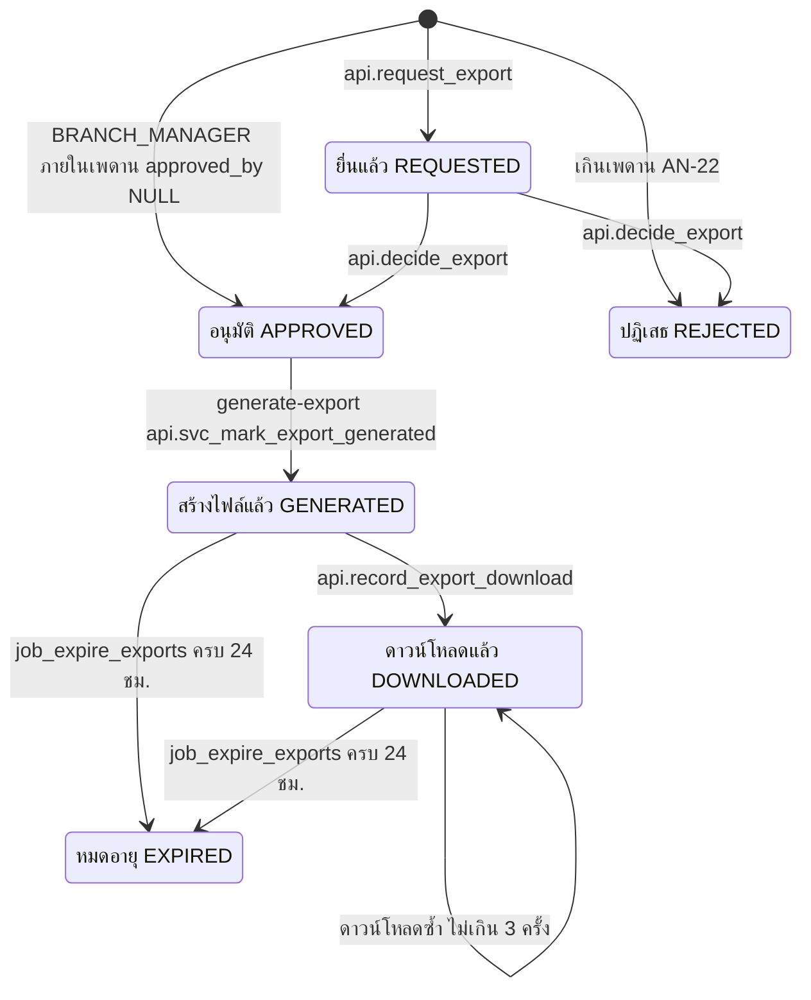

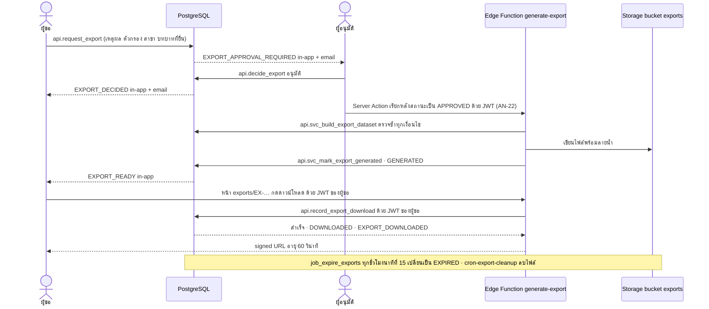

### ตารางขั้นตอน

| # | ผู้กระทำ | หน้าจอ | การกระทำ | RPC/ตาราง | สิทธิ์ | สถานะผลลัพธ์ | Audit / แจ้งเตือน | ผิดพลาด / ขอบ |
|---|---|---|---|---|---|---|---|---|
| 1 | BM/MK/BA/EX | 15 · 03 (เลือกหลายแถว → "ขอส่งออก") | เลือกเหตุผล (`OTHER` บังคับหมายเหตุ) · ตัวกรอง · สาขา · บทบาทที่ยื่น | `api.request_export(...)` → `audit.export_requests` (`export_no` `EX-{YYYY}-{NNNNNN}` · ตัวกรองและขอบเขตสาขาที่บันทึก · จำนวนแถว) | `customer.export` 🔐 (BM B · MK G · EX G · BA G) | `REQUESTED` (MK/BA/EX) · BM ภายในเพดาน `APPROVED` ทันที (`approved_by` NULL · ข้อ 8.2) · เกินเพดาน `REJECTED` (หมายเหตุผู้เขียน AN-22) | `EXPORT_REQUESTED` · `EXPORT_APPROVAL_REQUIRED` เฉพาะผู้อนุมัติที่มีสิทธิ์ตามบทบาทที่ยื่น | เกินจำนวนครั้ง/วัน (นับทุกคำขอในวันธุรกิจ Asia/Bangkok ต่อผู้ขอและ `requested_as_role` รวมที่ถูกปฏิเสธ) → ปฏิเสธ · ถือ MARKETING ร่วมกับ BUSINESS_ADMIN ไม่ได้ (Q22) · `requested_as_role` ∉ BRANCH_MANAGER/MARKETING/BUSINESS_ADMIN/EXECUTIVE → ปฏิเสธ (`export_requests_role_chk`) |
| 2 | ผู้อนุมัติ | 15 | ตรวจเหตุผล จำนวน ตัวกรอง แล้วอนุมัติ/ปฏิเสธ | `api.list_export_requests(...)` · `api.decide_export(...)` | `export.approve` 🔐 (EX G · BA G) ตามบทบาทที่ยื่น · CHECK `approved_by <> requested_by` | `APPROVED` / `REJECTED` · `decided_at` · `decision_note` | `EXPORT_DECIDED` (audit + แจ้งผู้ขอ in-app + email) | ผู้อนุมัติไม่ตรงกติกาบทบาท → ปฏิเสธ |
| 3 | EF `generate-export` (เรียกโดย Server Action หลัง `APPROVED` · AN-22) | – | สร้างไฟล์ | `api.svc_build_export_dataset(p_export_id)` (→ `app.build_export_dataset`) ตรวจซ้ำ: สถานะ · ผู้ขอยัง `ACTIVE` และมี `customer.export` · ขอบเขตสาขาและตัวกรองที่บันทึกตอนยื่น (`branch_ids` · `filter`) · whitelist คอลัมน์ · กรองความยินยอม `MARKETING` เมื่อ `is_marketing` → เขียนไฟล์ลง bucket `exports` → `api.svc_mark_export_generated(p_export_id, p_file_path)` | service_role (`api.svc_*` เท่านั้น) | `GENERATED` · `generated_at` · `file_path` · ลายน้ำ `ส่งออกโดย {staff_code} · {export_no} · {วันเวลา}` ในแถวหัวไฟล์และชื่อไฟล์ | row UPDATE `export_requests` · `EXPORT_READY` ถึงผู้ขอ (in-app) | ผู้ขอถูกปิดใช้งาน/ถอนสิทธิ์ก่อนสร้างไฟล์ → ไม่สร้าง · ลูกค้าที่ถอนความยินยอมหลังยื่นถูกตัดออก (ข้อ 10.4) |
| 4 | ผู้ขอ | `/exports/EX-…` | กดดาวน์โหลด | EF `generate-export` ด้วย JWT ของผู้ขอ → `api.record_export_download(export_id)` ด้วย JWT ของผู้ขอ → สำเร็จแล้ว EF ออก signed URL (ข้อ 9.8) | ผู้ขอเท่านั้น · `ACTIVE` · aal2 · สถานะ `GENERATED`/`DOWNLOADED` · ดาวน์โหลดแล้ว < 3 ครั้ง · ภายใน 24 ชม. หลังสร้างไฟล์ | `DOWNLOADED` · `download_count` + 1 · `last_downloaded_at` · signed URL อายุ 60 วินาที | `EXPORT_DOWNLOADED` | ผู้อนุมัติหรือคนอื่นดาวน์โหลดไม่ได้ · bucket `exports` ไม่มี storage policy ให้ authenticated · ครบ 3 ครั้งหรือเกิน 24 ชม. → ปฏิเสธแม้งานหมดอายุยังไม่รัน |
| 5 | JOB | – | หมดอายุ | `app.job_expire_exports(p_as_of)` ทุกชั่วโมงนาทีที่ 15 (`15 * * * *` · ข้อ 9.6) · ลบไฟล์โดย EF `cron-export-cleanup` ที่อ่าน `api.svc_expired_export_files()` (รอยืนยัน) | service_role | `GENERATED`/`DOWNLOADED` ที่สร้างไฟล์เกิน `export.link_ttl_hours` (24) → `EXPIRED` · `expired_at` · ไฟล์ถูกลบ · จำนวนครั้งดาวน์โหลดคงไว้ | row UPDATE (actor `SYSTEM`) | metadata เก็บตามระยะของ audit (ข้อ 10.3) |

### ตัวอย่างจาก seed (ข้อ 13.14)

| คำขอ | ผู้ขอ · เวลา | เหตุผล · จำนวน | สถานะ | สิ่งที่เกิดต่อ |
|---|---|---|---|---|
| `EX-2026-000031` | คุณมายด์ (MARKETING) · 10 ก.ย. 2569 16:20 | `MARKETING_CAMPAIGN` · 1,850 แถว (ยินยอม `MARKETING`) | `REQUESTED` รอคุณแพร | คุณแพรมีแจ้งเตือน `EXPORT_APPROVAL_REQUIRED` ที่ยังไม่อ่าน · ไฟล์จะมีเฉพาะ `customer_no` `display_name` และช่องทางที่ลูกค้ายินยอม · audit `EXPORT_REQUESTED` "1,850 แถว" |
| `EX-2026-000030` | คุณเจ (BRANCH_MANAGER) · 5 ก.ย. 2569 14:05 | `MANAGEMENT_REPORT` · 412 แถว | `EXPIRED` | ไม่ต้องอนุมัติ (≤ 500 แถว → `APPROVED` ทันที `approved_by` NULL) · ดาวน์โหลดแล้ว 1 ครั้ง · ไฟล์ถูกลบ 6 ก.ย. 2569 |

---

## F12 — คำขอเจ้าของข้อมูล (DSR)

**เป้าหมาย:** รองรับสิทธิ์ขอดู แก้ ลบ คัดค้าน ถอนความยินยอม โอนย้าย ภายในกำหนด (B23) — **ไม่ใช่คำแนะนำทางกฎหมาย · รอยืนยัน DPO** (ข้อ 10)
`crm.dsr_type`: `ACCESS` · `CORRECTION` · `DELETION` · `OBJECTION` · `WITHDRAW_CONSENT` · `PORTABILITY` · `crm.dsr_status`: `RECEIVED` · `VERIFIED` · `IN_PROGRESS` · `COMPLETED` · `REJECTED`

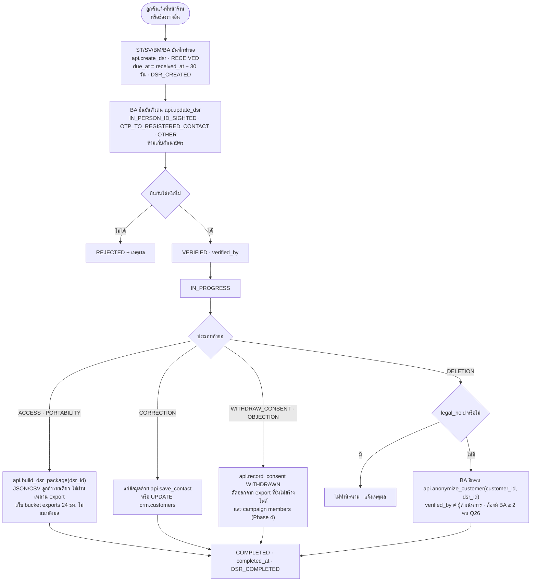

### ตารางขั้นตอน

| # | ผู้กระทำ | หน้าจอ | การกระทำ | RPC/ตาราง | สิทธิ์ | สถานะผลลัพธ์ | Audit / แจ้งเตือน | ผิดพลาด / ขอบ |
|---|---|---|---|---|---|---|---|---|
| 1 | ST/SV/BM/BA | 05 (เมนู ⋮ "รับคำขอเจ้าของข้อมูล") · 17 | บันทึกคำขอ: ประเภท · ชื่อผู้ยื่น · ช่องทางติดต่อ (เก็บแบบปิดบัง) · ลูกค้า (ถ้าระบุได้) · หมายเหตุ | `api.create_dsr(...)` → `crm.data_subject_requests` (`request_no` `DSR-{YYYY}-{NNNNNN}` · `received_at` · `received_by` · `due_at = received_at + 30 วัน`) | `dsr.create` (ST B · SV B · BM B · BA G) | `RECEIVED` · `customer_id` ว่างได้ · `due_at` คำนวณโดยคอลัมน์ generated | `DSR_CREATED` · ไม่มีแจ้งเตือนเมื่อสร้าง (หมายเหตุผู้เขียน AN-23) · `DSR_DUE_SOON` ถึง BUSINESS_ADMIN (in-app + email) เมื่อเหลือ 7 วันก่อน `due_at` และยังไม่ `COMPLETED`/`REJECTED` (ข้อ 11.1) | ผู้รับคำขอเห็นเฉพาะคำขอของตน · ห้ามแนบ/เก็บสำเนาบัตร |
| 2 | BA | 17 | เปิดรายการ · ยืนยันตัวตน เลือก `verification_method` | `api.list_dsr(...)` · `api.update_dsr(p_dsr_id, 'VERIFIED', p)` (`verification_method` · `verified_by` = ตน) | `dsr.manage` 🔐 (BA G) | `VERIFIED` หรือ `REJECTED` | row UPDATE | CHECK `data_subject_requests_verified_chk` บังคับ `verified_by` + `verification_method` เมื่อ `VERIFIED`/`IN_PROGRESS`/`COMPLETED` · กลไกส่ง OTP ไปช่องทางที่ลงทะเบียน รอยืนยัน (AN-23) |
| 3 | BA | 17 | ขยายเวลา (เมื่อจำเป็น) · เริ่มดำเนินการ | `api.update_dsr(p_dsr_id, p_status, p)` (`extended_until` + `extension_reason` · `IN_PROGRESS`) | `dsr.manage` 🔐 | `IN_PROGRESS` | row UPDATE | ระยะที่ขยายได้ รอยืนยัน DPO |
| 4a | BA | 17 | `ACCESS`/`PORTABILITY` สร้างแพ็กเกจ | `api.build_dsr_package(dsr_id)` | `dsr.manage` 🔐 | ไฟล์ JSON/CSV ของลูกค้ารายเดียวใน bucket `exports` อายุ 24 ชม. · ไม่แนบอีเมล (ข้อ 19.4 ข้อ 5) | row change | ไม่ผ่านเพดาน export · วิธีส่งมอบให้เจ้าของข้อมูล รอยืนยัน DPO (AN-23) |
| 4b | BA | 05 | `CORRECTION` แก้ข้อมูล | `api.save_contact` · UPDATE `crm.customers` | `customer.update` G | ข้อมูลถูกแก้ | `CUSTOMER_UPDATED` · `CUSTOMER_CONTACT_UPDATED` (ค่าปิดบัง + hash) | – |
| 4c | BA (หรือ ST/SV/BM ที่หน้าร้าน) | 05 | `WITHDRAW_CONSENT`/`OBJECTION` | `api.record_consent(...)` แถวใหม่ `WITHDRAWN` | `customer.consent.manage` (ST B · SV B · BM B · BA G) | consent ปัจจุบัน (`crm.customer_consent_current`) = `WITHDRAWN` | `CONSENT_RECORDED` | ห้าม UPDATE/DELETE แถวเดิม (append-only) |
| 4d | BA | 17 | ตั้ง/ยกเลิก legal hold | `api.set_legal_hold(p_customer_id, p_on, p_reason)` | `dsr.manage` 🔐 | `legal_hold` | row UPDATE | – |
| 4e | BA **อีกคน** | 17 | `DELETION` ทำข้อมูลนิรนาม | `api.anonymize_customer(customer_id, dsr_id)` | `customer.anonymize` 🔐 (BA G) · DSR `VERIFIED` ที่ `verified_by` ≠ ผู้ดำเนินการ · ≤ `dsr.anonymize_per_day` (20) รายการ/วัน/ผู้ใช้ | ดูตาราง "ผลของการทำนิรนาม" | `CUSTOMER_ANONYMIZED` | `legal_hold` → ข้าม · BA คนเดียวในระบบทำไม่ได้ → ต้องมี BA ที่ ACTIVE ≥ 2 คน (ค่าที่ใช้ไปก่อนของ Q26 · ทางเลือก: EXECUTIVE ยืนยันแทน · RR R11) |
| 5 | BA | 17 | ปิดคำขอ | `api.update_dsr(p_dsr_id, 'COMPLETED', p)` | `dsr.manage` 🔐 | `COMPLETED` · `completed_at` (CHECK `data_subject_requests_completed_chk`) | `DSR_COMPLETED` | – |

### ผลของการทำนิรนาม `api.anonymize_customer` (ข้อ 10.4)

| ส่วน | ผล |
|---|---|
| `crm.customers` | `first_name = 'ลูกค้านิรนาม ' \|\| customer_no` · `last_name` `nickname` `province_code` = NULL · `record_status = 'ANONYMIZED'` |
| ตารางลูก | ลบ contacts/addresses · ล้างคอลัมน์ที่ COMMENT ขึ้นต้น `[pii]` ทุกตารางที่อ้างลูกค้า (ข้อ 19.1 ข้อ 3): โน้ต · `summary` · `title` · `next_action` · `lost_note` · `transaction_refs.summary` `device_imei` `device_serial` · `notifications.title/body` · snapshot ของ merge · `duplicate_decisions.override_note` · `customer_consents.evidence` |
| ลูกค้าที่ถูกรวมเข้ามา | anonymize แถว `MERGED` ที่ `merged_into_id` ชี้มาหาลูกค้านี้ด้วย (วนซ้ำ · ข้อ 19.4 ข้อ 2) |
| Audit | ตั้ง `app.audit_redaction = 'on'` แล้วแทนค่า **เฉพาะคีย์ PII** ใน `before`/`after` ของลูกค้านั้นใน `audit.audit_logs` เป็น `"[ANONYMIZED]"` · คอลัมน์ `reason` ของ audit ห้ามมี PII (ข้อ 10.4 · 19.4 ข้อ 2) |
| คงไว้ | visit · lead · opportunity · transaction ref (ไม่มี PII) → **KPI ย้อนหลังไม่เปลี่ยน** · ลูกค้ายังผ่าน RLS แต่ UI ซ่อนจากรายการ |
| backup | เก็บ `customer_no` + เวลา anonymize นอกฐานข้อมูล เพื่อรันซ้ำหลัง restore (ค่าที่ใช้ไปก่อนของ Q30) |
| เรียกจากงาน retention | actor `SYSTEM:retention` ไม่ต้องมี DSR (F15) |

### ตัวอย่าง

- หน้า 17 ใน seed ไม่มีคำขอ (empty state · ข้อ 13.14)
- ตัวอย่างสมมติ ไม่อยู่ใน seed: คุณสมชาย `CUS-2026-000297` ขอลบข้อมูลที่ JP1 → คุณขวัญบันทึก `DELETION` (`RECEIVED` · ครบกำหนด 30 วันหลังรับ) → BA คนที่หนึ่งยืนยันด้วย `IN_PERSON_ID_SIGHTED` → BA อีกคนทำนิรนาม → ชื่อที่แสดงเป็น "ลูกค้านิรนาม CUS-2026-000297" · ยอด Sales 215 ของ P ไม่เปลี่ยน

---

## F13 — เข้าสู่ระบบและเซสชัน

**เป้าหมาย:** MFA · Session Expiration · Failed Login Limit · Device Logging · Password Policy · Token Rotation (A34 · B20) · ค่าตัวเลขทั้งหมด **รอยืนยันพร้อมแพ็กเกจ Q6** (ข้อ 9.2)

### ภาพรวม

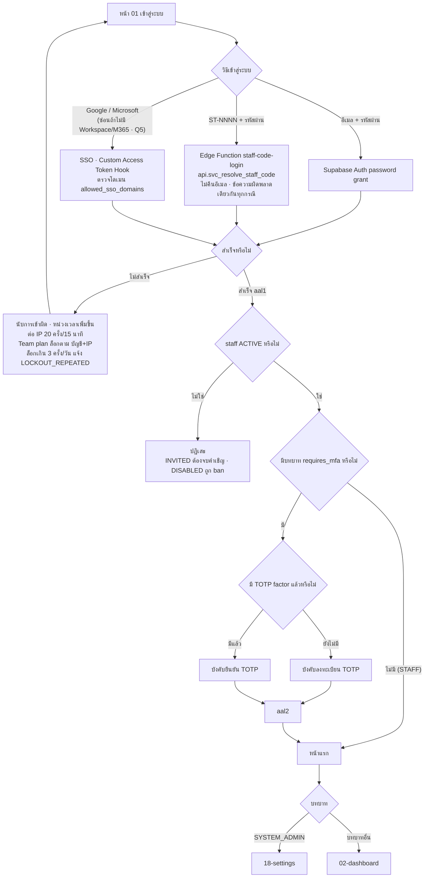

### ตารางขั้นตอน

| # | ผู้กระทำ | หน้าจอ | การกระทำ | RPC/ตาราง | สิทธิ์ | สถานะผลลัพธ์ | Audit / แจ้งเตือน | ผิดพลาด / ขอบ |
|---|---|---|---|---|---|---|---|---|
| 1 | ผู้ใช้ | 01 | กรอกอีเมล + รหัสผ่าน | Supabase Auth | – | session aal1 · access token 15 นาที | `audit.login_events` (password) | "จดจำฉันไว้" จำเฉพาะอีเมล/รหัสพนักงานในช่องกรอก ไม่ยืดอายุ session · ไม่ติ๊กไว้ก่อน · ซ่อนบนอุปกรณ์ counter (D34) |
| 2 | ผู้ใช้ | 01 | กรอก `ST-NNNN` + รหัสผ่าน | EF `staff-code-login` → `api.svc_resolve_staff_code(p_staff_code)` (คืน user_id ภายใน EF เท่านั้น) → password grant ฝั่ง server → คืน session | – | session aal1 | `audit.login_events` | ไม่คืนอีเมลในทุกกรณี · ข้อความผิดพลาดเหมือนกันทุกกรณี (ไม่บอกว่ารหัสพนักงานมีจริงหรือไม่) · Pro plan นับการเข้าผิดที่นี่แบบ best-effort (D24) |
| 3 | ผู้ใช้ | 01 | กด Google/Microsoft | Supabase Auth SSO · Custom Access Token Hook | บัญชี `ACTIVE` เท่านั้น | session aal1 | `audit.login_events` (SSO) | Microsoft: Azure single-tenant ขององค์กร · Google: `hd` ∉ `allowed_sso_domains` → ปฏิเสธ · SSO ไม่เปิดทางสมัครเอง (D23) |
| 4 | ผู้ใช้บทบาท MFA | 01 | ยืนยัน TOTP (หรือลงทะเบียนถ้ายังไม่มี) | Supabase Auth MFA ผ่าน Server Action/Route Handler (ข้อ 19.4 ข้อ 4) | – | aal2 · หน้าจอสร้างเมนูจาก `api.get_my_access()` | `audit.login_events` (MFA) · `MFA_ENROLLED` (trigger บน `auth.mfa_factors`) | ที่ aal1 assignment ของบทบาท `requires_mfa` ไม่ถูกนับ และสิทธิ์ 🔐 ไม่ถูกนับ (สิทธิ์จาก STAFF ยังใช้ได้) · ตัวอย่างข้อ 13.13: คุณนัท aal1 อ่าน `CUS-2026-000297` ไม่ได้ · จ๋าอั๋น aal1 `api.get_kpis` ถูกปฏิเสธ |
| 5 | ระบบ | ทุกหน้า | ต่ออายุ token | refresh token rotation (reuse interval 10 วินาที) | – | idle 2 ชม. · สูงสุด 12 ชม. (ตรวจตอน refresh จึงยาวได้อีก ≤ 15 นาที) | `audit.login_events` (refresh) | บทบาท/สิทธิ์ตรวจสดจากตารางทุกคำขอ ไม่ฝังใน JWT → ถอนบทบาทมีผลคำขอถัดไป |
| 6 | ผู้ใช้/ผู้โจมตี | 01 | เข้าผิดซ้ำ | Team plan: Password Verification Attempt hook · Pro plan: Server Action/`staff-code-login` | – | หน่วงเวลาเพิ่มขึ้น · ต่อ IP 20 ครั้ง/15 นาที (`security.login_ip_per_15min`) · Team plan ล็อกตาม (บัญชี, IP) ไม่ล็อกบัญชีจากทุกที่ | `audit.login_events` (lockout) · ถูกล็อกเกิน 3 ครั้ง/วัน → `LOCKOUT_REPEATED` ถึง BUSINESS_ADMIN (in-app + email · ข้อ 11.1) | Pro plan เรียก `/auth/v1/token` ตรงได้จึงเป็น best-effort (R8) · `ip`/`device_id` เป็นข้อมูลประกอบ ห้ามใช้ตัดสินสิทธิ์ |
| 7 | ผู้ใช้ | 01 | "ลืมรหัสผ่าน" กรอกอีเมลหรือ `ST-NNNN` | EF `password-reset` | บัญชี `ACTIVE` เท่านั้น | ส่งลิงก์อายุ 1 ชม. ไปอีเมลที่ลงทะเบียน · ตอบข้อความเดียวกันเสมอ | – | บัญชีไม่มี/ไม่ ACTIVE → ข้อความเดียวกันแต่ไม่ส่ง · อีเมลไม่มีข้อมูลลูกค้า |
| 8 | ผู้ใช้ | ลิงก์ → 01 | ตั้งรหัสผ่านใหม่ | Supabase Auth (Secure password change) | – | เพิกถอน session ทั้งหมด | `audit.login_events` | ≥ 12 ตัวอักษร · leaked password protection · ไม่มีกติกาห้ามซ้ำ (D43) |
| 9 | BM (BA ได้ด้วย scope G) | 13 | ลงทะเบียนแท็บเล็ต counter ของสาขา | `api.register_device(p_device_id, p_branch_id, p_is_shared_counter)` → `core.devices` (`device_id` · `branch_id` · `is_shared_counter`) | `user.update` scope B ของสาขานั้น (ข้อ 9.6) | อุปกรณ์เป็น counter | row INSERT `core.devices` | `device_id` เก็บใน localStorage (ไม่ถูกล้างตอน logout) และส่งเป็น header `x-device-id` · `device_id` ซ้ำ → ปฏิเสธ (UNIQUE) · เป็นข้อมูลประกอบ ห้ามใช้ตัดสินสิทธิ์ |
| 10 | ระบบ | ทุกหน้า | อุปกรณ์ counter ไม่มีการใช้งาน 10 นาที (`session.shared_counter_idle_min`) | – | – | ล็อกหน้าจอ ต้องล็อกอินใหม่ | `audit.login_events` | ข้อมูลที่กรอกค้างในฟอร์มไม่ถูกเก็บลง storage |
| 11 | ผู้ใช้ | ทุกหน้า | ออกจากระบบ | Supabase Auth signOut | – | ล้าง Cache Storage · IndexedDB · sessionStorage · localStorage (ยกเว้น `device_id` และค่าที่ "จดจำ" `login_id`) | `audit.login_events` | service worker ไม่ cache route ที่ต้องล็อกอิน |

---

## F14 — เส้นเวลาการแจ้งเตือนและการยกระดับ

**เป้าหมาย:** แจ้งเตือนตามเหตุการณ์และเวลา ผู้จัดการเห็นของทีม Staff เห็นของตน (A27 · B9 · ข้อ 11)
**ผู้สร้าง:** `app.trg_emit_notification` (เหตุการณ์ทันที) และ `app.job_notifications(p_as_of)` ทุก 5 นาที · ผู้อ่าน: เฉพาะ `recipient_staff_id` = ตน · UPDATE ได้เฉพาะ `read_at` (ข้อ 8.3)

### กติกาการสร้างแถวแจ้งเตือน

| กติกา | รายละเอียด |
|---|---|
| ข้อความ | `title` = ป้ายของรหัส · `body` มาตรฐาน `{ชื่อลูกค้า} · {ชื่องาน/รายการ} · {เวลาครบกำหนด}` เก็บใน `crm.notifications` เท่านั้น ("คุณ" อยู่ใน body ได้) · push/email ใช้ title + เลขอ้างอิง (`entity_ref`) + deep link ที่ต้องเข้าสู่ระบบ |
| กันซ้ำ | `dedupe_key = '{code}:{entity_id}:{escalation_level}:{วันที่ Asia/Bangkok ของจุดยึดของรายการ}'` · จุดยึด = `due_at` · `due_at + 24 ชม.` · เวลาที่ lead เริ่มไม่มี owner · วันที่ของสรุป — **ไม่ใช่วันที่ job รัน** จึงไม่แจ้งซ้ำทุกวัน · UNIQUE(`recipient_staff_id`, `dedupe_key`) (ข้อ 11.1) · จุดยึดของระดับ/รหัสที่ข้อ 11.1 ไม่ได้ระบุ ดูหมายเหตุผู้เขียน AN-29 |
| หัวหน้าทีม | หัวหน้าทีมปัจจุบันของ owner (`core.team_members.is_leader`) · SUPERVISOR เป็นผู้รับได้เมื่อเป็นหัวหน้าทีมในสาขานั้น · ระดับที่ไม่มีผู้รับให้ข้าม · การยกระดับไม่ส่งกลับไปที่ owner (เช่น owner เป็นหัวหน้าทีมเอง ระดับหัวหน้าทีมไม่ส่งซ้ำถึงตน) |
| เวลาทำการ | `business_hours` = `{"default":["10:00","21:00"]}` ทับรายสาขาได้ด้วยคีย์รหัสสาขา · ยังไม่มีวันหยุด (รอยืนยัน Q4) · `LEAD_UNASSIGNED` `LEAD_NOT_CONTACTED` **นับเฉพาะนาทีในเวลาทำการ** และส่งเฉพาะในเวลาทำการ · `VISITOR_WAITING_LONG` **นับนาทีปฏิทิน** และส่งเฉพาะในเวลาทำการ (ข้อ 11.1) |
| ไม่ส่ง | `TASK_ASSIGNED` สำหรับ task `is_next_action` · `*_ASSIGNED` เมื่อ `app.bulk = on` · `*_ASSIGNED` เมื่อ owner ใหม่เป็นผู้เปลี่ยนเอง · ทุกรหัสเมื่อ `app.seed_mode = on` (ข้อ 11.1 · 13.0 ข้อ 7) |
| หยุดยกระดับ | งานตรวจเงื่อนไขทุกรอบ เมื่อ task `DONE`/`CANCELLED` หรือ lead มี owner แล้ว ระดับถัดไปไม่ถูกสร้าง · แถวที่สร้างแล้วยังอยู่ |
| Phase | ตามหมายเหตุผู้เขียน AN-03 |

### ตารางรหัสแจ้งเตือน (ข้อ 11.1)

| code | ต้นเหตุ | ระดับ 0 | ระดับถัดไป | ช่องทาง | เวลาทำการ |
|---|---|---|---|---|:--:|
| `FOLLOWUP_DUE` | task `FOLLOW_UP` ถึง `remind_at` | owner | – | in-app + push | – |
| `FOLLOWUP_OVERDUE` | task `FOLLOW_UP` ยังไม่ปิดเมื่อ `due_at` ผ่าน | owner | +24 ชม. หัวหน้าทีมของ owner · +48 ชม. ผู้จัดการสาขา | in-app | – |
| `TASK_OVERDUE` | task ประเภทอื่นเลย `due_at` | owner | +24 ชม. หัวหน้าทีม | in-app | – |
| `LEAD_UNASSIGNED` | lead เปิดไม่มี owner เกิน 15 นาทีเวลาทำการ (นับจากเวลาที่เริ่มไม่มี owner) | SUPERVISOR (หัวหน้าทีมในสาขา) และ BRANCH_MANAGER ที่ ACTIVE ทุกคนของสาขา lead | – | in-app + push | ✓ |
| `LEAD_NOT_CONTACTED` | lead `NEW` เกิน 30 นาทีเวลาทำการ | owner · หัวหน้าทีม | – | in-app | ✓ |
| `LEAD_ASSIGNED` · `OPPORTUNITY_ASSIGNED` · `TASK_ASSIGNED` | owner เปลี่ยนเป็นตนโดยคนอื่น (`api.assign_owner` · INSERT ที่ใส่ owner คนอื่น) | owner ใหม่ | – | in-app | – |
| `OPPORTUNITY_STALE` | ไม่มี interaction/การเปลี่ยนขั้น 7 วัน | owner | 14 วัน เพิ่มผู้จัดการสาขา | in-app | – |
| `DUPLICATE_SUSPECTED` | สรุป `duplicate_decisions` `PENDING` ใหม่ของวัน | SUPERVISOR (หัวหน้าทีมในสาขา)/BRANCH_MANAGER ของสาขา เวลา 18:00 (`notify.duplicate_digest_time`) | – | in-app | – |
| `VISITOR_WAITING_LONG` | visit `WAITING` เกิน 15 นาทีปฏิทิน | SUPERVISOR (หัวหน้าทีมในสาขา) และ BRANCH_MANAGER ของสาขา | – | in-app + push | ✓ (ส่งเท่านั้น) |
| `VISIT_OUTCOME_MISSING` | `IN_SERVICE` เกิน 60 นาที · ปิดเป็น `UNRECORDED` | ผู้รับ (เกิน 60 นาที) | สรุปสิ้นวันให้ผู้จัดการสาขา (งาน 00:05) | in-app | – |
| `DATA_MISSING` | รายการคุณภาพข้อมูลที่เป็นของตน | owner 09:00 ทุกวัน (`notify.data_missing_time`) | ผู้จัดการรายสัปดาห์ **วันจันทร์ 09:00** | in-app | – |
| `EXPORT_APPROVAL_REQUIRED` · `EXPORT_DECIDED` | F11 | ผู้อนุมัติตามกติกา · ผู้ขอ | – | in-app + email | – |
| `EXPORT_READY` | คำขอส่งออกเปลี่ยนเป็น `GENERATED` (F11) | ผู้ขอ | – | in-app | – |
| `ROLE_GRANT_APPROVAL_REQUIRED` | F09 | EXECUTIVE ทุกคน ยกเว้นผู้รับ | – | in-app + email | – |
| `ROLE_GRANT_DECIDED` | `api.decide_role_grant` (F09) | ผู้ยื่นคำขอ | – | in-app + email | – |
| `REVEAL_LIMIT_EXCEEDED` · `SEARCH_LIMIT_EXCEEDED` | เกิน `security.reveal_per_hour` 30 (การเปิดดูถูกปฏิเสธ) · `security.search_miss_per_hour` 20 (บล็อก 1 ชม.) | BUSINESS_ADMIN | – | in-app + email | – |
| `CUSTOMER_VIEW_LIMIT_EXCEEDED` | เกิน `security.customer_view_per_hour` 100 (**แจ้งเท่านั้น ไม่บล็อก**) | BUSINESS_ADMIN | – | in-app | – |
| `LINK_LIMIT_EXCEEDED` | ผูกลูกค้าข้ามสาขาเกิน `security.link_per_day` 10 (F03) | BRANCH_MANAGER ของสาขานั้น | – | in-app | – |
| `LOCKOUT_REPEATED` | บัญชีถูกล็อกเกิน 3 ครั้ง/วัน (F13) | BUSINESS_ADMIN | – | in-app + email | – |
| `RETENTION_ANONYMIZE_UPCOMING` | ลูกค้าจะครบระยะเก็บใน 30 วัน · สรุปรายวันทั้งองค์กร (F15) | BUSINESS_ADMIN | – | in-app | – |
| `DSR_DUE_SOON` | 7 วันก่อน `due_at` และคำขอยังไม่ `COMPLETED`/`REJECTED` (F12) | BUSINESS_ADMIN | – | in-app + email | – |

### เส้นเวลาตัวอย่าง — งาน #2 ของคุณขวัญ (ข้อ 13.10)

`FOLLOW_UP` "ติดตามใบเสนอราคา iPhone 17 Pro Max" · คุณพิมพ์ชนก ศรีสุข `CUS-2026-005412` · ความสำคัญ `HIGH` · due 10 ก.ย. 2569 15:00 · owner คุณขวัญ (ทีม `JP1-SALES` หัวหน้าคุณนัท · ผู้จัดการ JP1 คุณเจ)

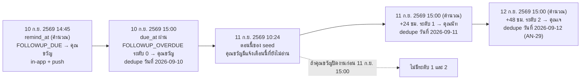

`body` ของแจ้งเตือน (ตัวอย่างข้อ 11.1 ใช้ข้อมูลเดียวกัน): "คุณพิมพ์ชนก ศรีสุข · ติดตามใบเสนอราคา iPhone 17 Pro Max · ครบกำหนด 10 ก.ย. 2569 15:00" · push แสดงเฉพาะ "ติดตามเกินกำหนด" + เลขงาน + deep link

### แจ้งเตือนที่ยังไม่อ่านใน seed (snapshot ข้อ 13.14 — ไม่ใช่ผลของการรันกติกา ณ `app.clock()`)

| ผู้ใช้ | จำนวน | รายการ |
|---|---:|---|
| คุณขวัญ | 6 | `FOLLOWUP_OVERDUE` ×3 (งาน #2 #3 #4) · `TASK_OVERDUE` ×2 (งาน #1 และ #5) · `DATA_MISSING` 11 ก.ย. 2569 09:00 |
| คุณคิม | 5 | `LEAD_ASSIGNED` LD-2026-007512 · 10 ก.ย. 2569 18:05 · `FOLLOWUP_OVERDUE` ×3 · `DATA_MISSING` 11 ก.ย. 2569 09:00 |
| คุณนัท | 3 | `LEAD_UNASSIGNED` ×2 · `DUPLICATE_SUSPECTED` สรุป 10 ก.ย. 2569 18:00 |
| คุณเจ | 4 | สามรายการเดียวกับคุณนัท + `VISIT_OUTCOME_MISSING` สรุปวันที่ 10 ก.ย. 2569 |
| คุณแพร | 1 | `EXPORT_APPROVAL_REQUIRED` EX-2026-000031 |
| จ๋าอั๋น | 1 | `ROLE_GRANT_APPROVAL_REQUIRED` RG-2026-0003 |
| คนอื่น | 0 | – |

test ของ `app.job_notifications` ต้องสร้างข้อมูลเองใน test (ข้อ 13.14)

---

## F15 — งานตามเวลา

**ผู้รัน:** งานระบบเรียกโดย cron — `pg_cron` + `pg_net` บน Supabase **[รอยืนยัน — หรือ scheduler ภายนอกเรียก Edge Function `cron-*`]** · pg_cron รันในฐานข้อมูลในฐานะ `postgres` · migration ที่เรียก `cron.schedule` แยกไฟล์ `supabase/migrations/*_cron.sql` (PGlite runner ข้าม) · เวลา cron เป็น UTC (ข้อ 1 · 9.6)
**ทุกงานรับ `p_as_of`:** prod = `now()` · dev/staging/test = `app.clock()` เพื่อทดสอบกับ seed ได้ · `app.enforce_row_transition` ข้ามงานระบบ · audit `actor_type = 'SYSTEM'`

| งาน | เวลา (Asia/Bangkok → cron UTC) | เลือกแถว | ทำอะไร | Audit / แจ้งเตือน | ทำซ้ำได้ปลอดภัย (idempotent) | ขอบ |
|---|---|---|---|---|---|---|
| `app.job_close_stale_visits(p_as_of)` | 00:05 → `5 17 * * *` | visit `WAITING`/`IN_SERVICE` ที่วันธุรกิจของ `started_at` ก่อนวันของ `p_as_of` (หมายเหตุผู้เขียน AN-30) | → `COMPLETED` · `outcome_code = 'UNRECORDED'` · `ended_at` = 23:59:59 ของวันนั้น · `closed_by_system = true` | `actor_label = SYSTEM:close_stale_visits` · `VISIT_OUTCOME_MISSING` สรุปให้ผู้จัดการสาขา | ✓ แถวที่ปิดแล้วไม่ถูกเลือกซ้ำ | `WAITING → COMPLETED` ไม่อยู่ในการเปลี่ยนที่ผู้ใช้ทำได้ แต่งานระบบทำได้ · `UNRECORDED` ไม่นับเป็นบันทึกผลครบ · แก้ outcome ข้ามวันไม่ได้ → issue `VISIT_UNRECORDED` 7 วัน · รับทราบด้วย `api.acknowledge_unrecorded_visit` ตั้ง `unrecorded_ack_by/_at` (ข้อ 9.6 · F01 ขั้น 12 · AN-31) |
| `app.job_expire_quotations(p_as_of)` | 00:10 → `10 17 * * *` (ข้อ 9.6 · มีผลตั้งแต่ 00:00 วันถัดจาก `valid_until` ตามข้อ 4.6 · AN-30) | quotation `SENT` ที่ `valid_until` < วันของ `p_as_of` | → `EXPIRED` | row UPDATE (SYSTEM) | ✓ | stage ของ opportunity ไม่เปลี่ยน · ใบที่ไม่ใช่ `SENT` ไม่ถูกแตะ |
| `app.job_expire_exports(p_as_of)` | ทุกชั่วโมงนาทีที่ 15 → `15 * * * *` (ข้อ 9.6) | export `GENERATED`/`DOWNLOADED` ที่สร้างไฟล์เกิน `export.link_ttl_hours` (24) | → `EXPIRED` · `expired_at` · คงจำนวนครั้งดาวน์โหลด · ไฟล์ใน Storage ลบโดย EF `cron-export-cleanup` ที่อ่าน `api.svc_expired_export_files()` (รอยืนยัน) | row UPDATE (SYSTEM) | ✓ | การดาวน์โหลดตรวจ 24 ชม. เองใน `api.record_export_download` จึงไม่พึ่งเวลางาน |
| `app.job_notifications(p_as_of)` | ทุก 5 นาที → `*/5 * * * *` | ตามตาราง F14 | INSERT `crm.notifications` · ส่ง push/email | – | ✓ ด้วย `dedupe_key` (จุดยึดวันที่ของรายการ ไม่ใช่วันที่รัน) | รอบ 09:00 (`DATA_MISSING` รายวันของ owner · วันจันทร์รายสัปดาห์ของผู้จัดการ) · 18:00 (`DUPLICATE_SUSPECTED`) ตาม `notify.*` ใน `app.settings` · `RETENTION_ANONYMIZE_UPCOMING` สรุปรายวัน · `DSR_DUE_SOON` |
| `app.job_retention(p_as_of)` | 02:00 → `0 19 * * *` (ข้อ 9.6) | ลูกค้าไม่เคยซื้อที่ `last_activity_at` ครบ 24 เดือน · ลูกค้าเคยซื้อครบ 10 ปีจากธุรกรรมล่าสุด · `audit.audit_logs` เกิน 5 ปี · `audit.access_logs` `audit.login_events` เกิน 1 ปี | SECURITY INVOKER: แจ้งล่วงหน้า 30 วัน → เมื่อครบ anonymize ก่อน (actor `SYSTEM:retention` · ข้าม `legal_hold` · รวมแถว `MERGED` ที่ชี้มา) → `SET LOCAL ROLE audit_retention` → DELETE log ที่เก่ากว่าระยะเก็บ (ข้อ 19.4 ข้อ 1–2 · 19.1 ข้อ 13) | `RETENTION_ANONYMIZE_UPCOMING` (สรุปรายวันทั้งองค์กร) → BUSINESS_ADMIN · `CUSTOMER_ANONYMIZED` | ✓ ลูกค้า `ANONYMIZED` ไม่ถูกเลือกซ้ำ | ทุกระยะรอยืนยัน DPO (Q8) · KPI ย้อนหลังไม่เปลี่ยน · สร้างใน Phase 1 (AN-30) |

### ตัวอย่างจาก seed

| งาน | ข้อมูล seed | ผลตามกติกา |
|---|---|---|
| ปิด visit ค้าง | คิว JP1 001–004 ยังเปิด ณ 11 ก.ย. 2569 10:24 | ถ้ายังเปิดถึงรอบ 12 ก.ย. 2569 00:05 → `UNRECORDED` · `ended_at` 11 ก.ย. 2569 23:59:59 (คำนวณ) · issue `VISIT_UNRECORDED` ปัจจุบัน 29 รายการ (JP1 9 · JP2 8 · JP3 7 · JP4 5) |
| หมดอายุใบเสนอราคา | `QT-2026-001702` `valid_until` 8 ก.ย. 2569 | `EXPIRED` 9 ก.ย. 2569 |
| หมดอายุ export | `EX-2026-000030` สร้าง 5 ก.ย. 2569 | `EXPIRED` · ไฟล์ถูกลบ 6 ก.ย. 2569 · ดาวน์โหลดแล้ว 1 ครั้งคงไว้ |
| retention | ลูกค้าเก่าสุดใน seed เป็นข้อมูลนำเข้า `CUS-2025-…` | ไม่มีตัวเลขตัวอย่างในข้อ 13 · test ต้องสร้างข้อมูลเอง |

---

## หมายเหตุผู้เขียนที่อ้างในเอกสารนี้

รายละเอียดเต็ม (ประเด็น · อ้างอิง · การตีความ) อยู่ที่ `docs/01-requirement/requirement-review.md` ภาคผนวก ก.1 · เลข AN ที่ CANONICAL v2.2 ตัดสินแล้ว (AN-01 04 05 06 08 09 10 11 12 15 16 17 18 19 20 24 26 27 28 32 33) ถูกแทนด้วยการอ้างเลขข้อของ CANONICAL และมีตารางเทียบในภาคผนวก ก.2

| flow | AN ที่ยังเปิดอยู่ | CANONICAL v2.2 ที่ใช้แทนหมายเหตุเดิม |
|---|---|---|
| F01 | AN-07 (ยกเลิก visit) · AN-29 · AN-31 | ข้อ 3.1 · 3.3 ข้อ 5 · 4.1 · 19.1 ข้อ 12 · 19.2 ข้อ 2 · 19.3 ข้อ 1–3 |
| F02 | – | ข้อ 4.3 · 19.2 ข้อ 5 · 19.3 ข้อ 1–2 |
| F03 | AN-13 (`linked_via` · visit ก่อนผูกในโหมด A) · AN-14 | ข้อ 11.1 (`LINK_LIMIT_EXCEEDED`) · 19.3 ข้อ 2 · 19.3 ข้อ 4 · 19.4 ข้อ 3 |
| F04 | – | ข้อ 4.3 (`NEW → CONTACTED/QUALIFIED` ด้วยมือ) · 8.0 · 19.1 ข้อ 9 · 19.3 ข้อ 3 |
| F05 | AN-30 (เวลาหมดอายุใบเสนอราคา) | ข้อ 4.4 · 14.9 · D48 · 19.2 ข้อ 6 · 19.3 ข้อ 5 |
| F06 | AN-29 | ข้อ 11.1 · 19.1 ข้อ 11 · 19.2 ข้อ 3 |
| F07 | AN-21 | ข้อ 7.3 · 8.0 · 9.4.2 · 9.6 (`api.assign_owner`) · Q28 |
| F08 | AN-25 (เปิดใช้งานบัญชี DISABLED) | ข้อ 7.1 · 7.3 · 9.2 · 19.3 ข้อ 6 · 19.4 ข้อ 4–5 |
| F09 | AN-34 | ข้อ 4.8 · 7.2 · 11.1 (`ROLE_GRANT_DECIDED`) · 19.3 ข้อ 6 |
| F10 | – | ข้อ 8.0 · 19.1 ข้อ 11 · 19.3 ข้อ 7 |
| F11 | AN-22 | ข้อ 8.2 · 9.6 · 9.8 · 11.1 (`EXPORT_READY`) |
| F12 | AN-23 | ข้อ 9.6 (`api.update_dsr`) · 11.1 (`DSR_DUE_SOON`) · 19.4 ข้อ 2 ข้อ 5 · Q26 · Q30 |
| F13 | – | ข้อ 9.2 · 9.6 (`api.register_device` · `api.svc_resolve_staff_code`) · 11.1 (`LOCKOUT_REPEATED`) |
| F14 | AN-03 · AN-29 | ข้อ 11.1 · 11.2 |
| F15 | AN-30 · AN-31 | ข้อ 9.6 (ตารางเวลา cron) · 19.4 ข้อ 1–2 |
