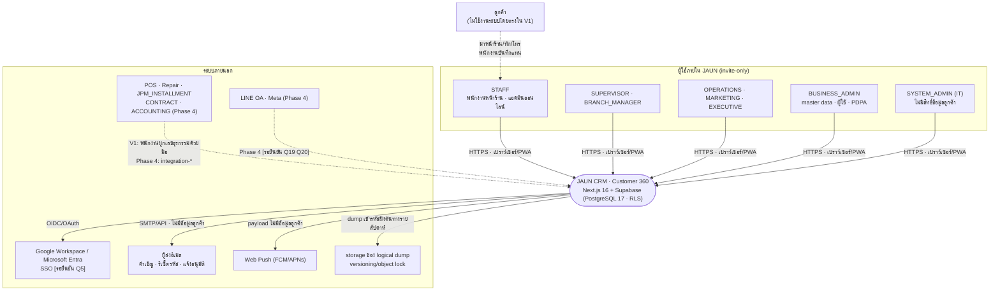
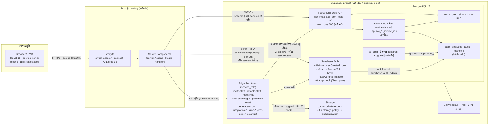
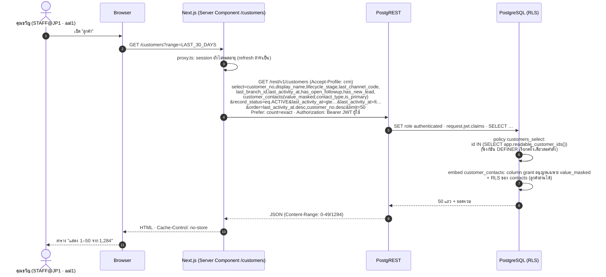
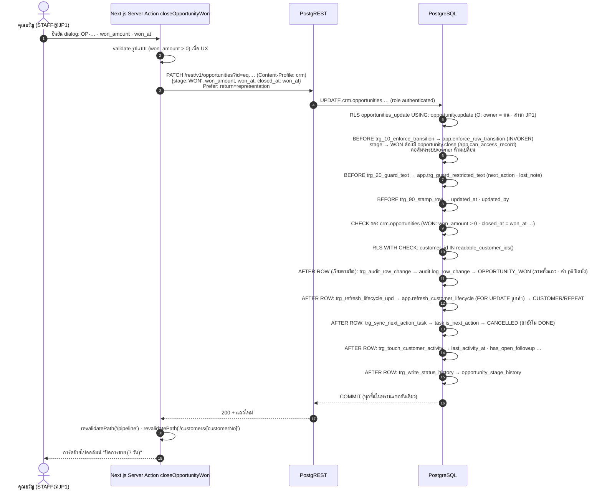
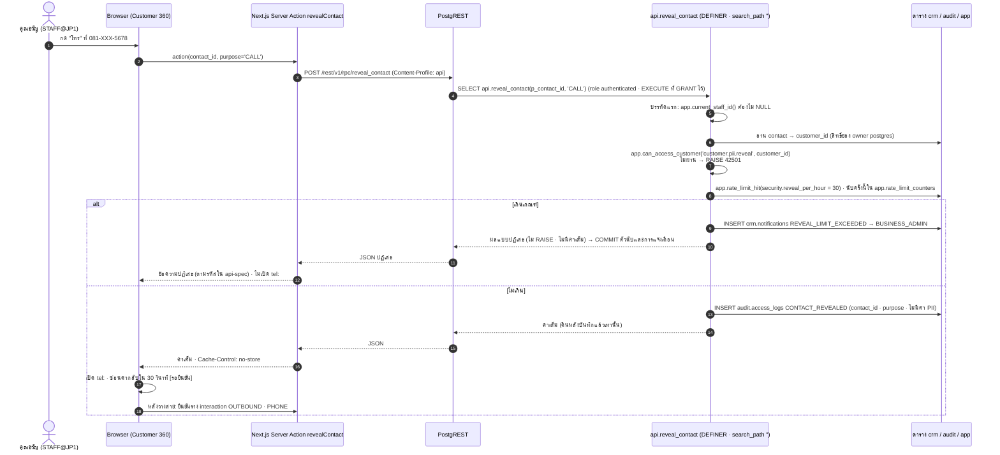
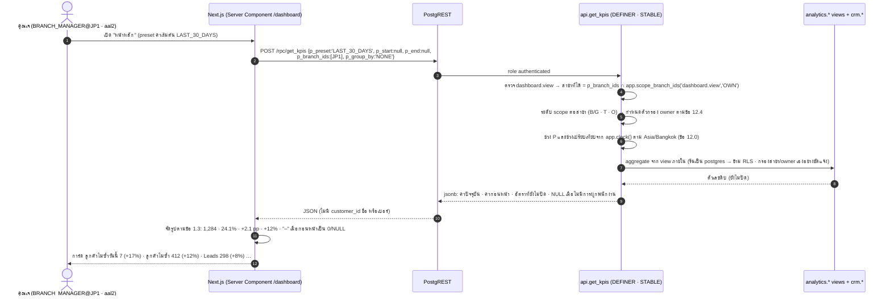
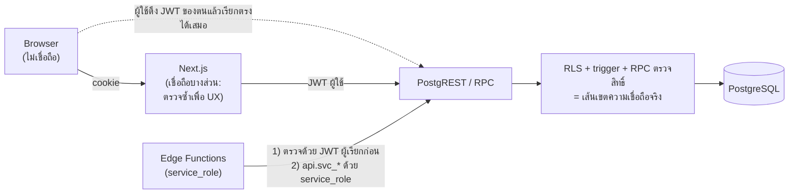
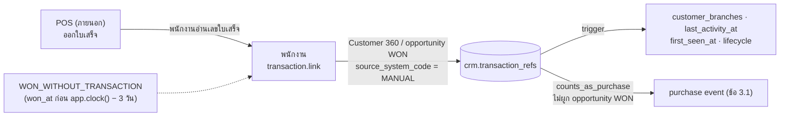
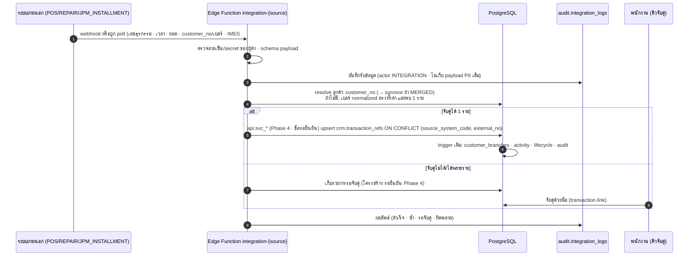

# System Architecture — JAUN CRM · Customer 360

> **ฉบับ Phase 0 · 16 ก.ย. 2569 (ปรับตาม CANONICAL v2.2)** · อ้างอิงค่าทั้งหมดจาก `docs/00-brief/CANONICAL.md` **v2.2** รวมข้อตัดสินข้อ 19 (อ้างเป็น "CANONICAL ข้อ …") และบรีฟ `docs/00-brief/REQUIREMENT.md` (A1–A45 · B1–B27) · ชื่อ object ในฐานข้อมูลตาม `supabase/migrations/0001–0009` (แหล่งจริงตามข้อ 19.1)
> เอกสารนี้ตอบคำถามเดียว: **ระบบประกอบด้วยชิ้นส่วนอะไร แต่ละชิ้นคุยกันอย่างไร การตรวจสิทธิ์เกิดที่ไหน และทำไมจึงออกแบบแบบนี้**
> ที่ใดเอกสารนี้ไม่ตรงกับ CANONICAL **CANONICAL ชนะ** · ค่าที่ CANONICAL ไม่มีเขียนว่า **"รอยืนยัน"** · ข้อตีความของผู้เขียนติดป้าย **"หมายเหตุผู้เขียน"** และสรุปรวมไว้ใน §14 · **การอ้างหัวข้อภายในเอกสารนี้ใช้ § (เช่น §4.2) · "ข้อ N" ที่ไม่มีชื่อเอกสารกำกับหมายถึง CANONICAL**
> เอกสารคู่กัน: `docs/04-security/rls-spec.md` (mapping สิทธิ์ต่อคอลัมน์) · `docs/07-api/api-spec.md` (สัญญา RPC) · `docs/03-data/schema-notes.md` · `docs/08-delivery/deployment-backup-recovery.md` (environment · CI/CD · backup)

**Stack ที่ตรึงแล้ว (CANONICAL ข้อ 1)**

| ชั้น | เทคโนโลยี |
|---|---|
| Frontend | Next.js 16 (App Router) · React 19 · TypeScript · Responsive Web + PWA |
| Auth | Supabase Auth · invite-only · TOTP MFA · SSO Google/Microsoft เฉพาะโดเมนที่อนุญาต |
| Data API | Supabase PostgREST · exposed schemas = `api, crm, core, ref` |
| Database | Supabase PostgreSQL **17** (ห้ามไวยากรณ์ PG 18) · RLS ทุกตาราง |
| Server-side ที่ถือ service_role | Supabase Edge Functions ตามรายการ CANONICAL ข้อ 9.8 เท่านั้น · เรียกฐานข้อมูลผ่าน `api.svc_*` เท่านั้น (ไม่ใช้ connection string ตรง) |
| Storage | Supabase Storage bucket private `exports` **เฉพาะไฟล์ export** (รวมแพ็กเกจ DSR · ข้อ 19.4) · ไม่มี storage policy ให้ `authenticated` · signed URL 60 วินาทีออกโดย `generate-export` (ข้อ 9.8) |
| งานตามเวลา | `pg_cron` (รันในฐานข้อมูลในฐานะ `postgres` · ข้อ 9.6) + `pg_net` **[รอยืนยัน — หรือ scheduler ภายนอกเรียก Edge Function · ข้อ 1]** |
| ทดสอบฐานข้อมูล | PGlite 0.4.1 (PostgreSQL 17.5 WASM) ผ่าน `tools/db/run.mjs` |

---

## 0. หลักการ 8 ข้อที่ทุกชิ้นส่วนต้องเคารพ

| # | หลักการ | ที่มา | ผลต่อการเขียนโค้ด |
|---|---|---|---|
| P1 | **ผู้ใช้ทุกคนเรียก PostgREST/RPC ตรงได้ด้วย JWT ของตน** → การควบคุมทุกข้ออยู่ในฐานข้อมูล | CANONICAL ข้อ 9.1 · A29 | Server Action ตรวจซ้ำได้เพื่อ UX แต่ห้ามถือเป็นการตรวจสิทธิ์ · UI ซ่อนปุ่มเพื่อความสะดวกเท่านั้น |
| P2 | Next.js ใช้ **JWT ของผู้ใช้เสมอ** และเรียก Supabase ฝั่ง server เท่านั้น (cookie HttpOnly) · service_role อยู่เฉพาะใน secret ของ Edge Functions ซึ่งแตะฐานข้อมูลผ่าน `api.svc_*` เท่านั้น | ข้อ 1 · 9.2 · 9.8 · 19.4 | ห้ามมีตัวแปร service_role หรือ connection string ใน env ของ Next.js ทุก environment · ไม่มี Supabase browser client ที่ถือ session |
| P3 | **ห้ามฝังบทบาท/สิทธิ์ลง JWT** ตรวจสดจากตาราง | ข้อ 8.0 | การถอนบทบาทมีผลทันทีโดยไม่ต้องรอ token หมดอายุ |
| P4 | ค่าเต็มของช่องทางติดต่อได้ทางเดียวคือ `api.reveal_contact` และถูกบันทึกก่อนคืนค่า | ข้อ 6.4 | ห้ามฝังค่าเต็มใน HTML ตอนโหลดหน้า |
| P5 | KPI/รายงานคืนเฉพาะตัวเลขรวมผ่าน RPC SECURITY DEFINER | ข้อ 9.4.1 | หน้าจอรายงานไม่ query ตารางธุรกิจตรง |
| P6 | ขอบวันธุรกิจ = เที่ยงคืน Asia/Bangkok คำนวณในฐานข้อมูล · นาฬิการายงาน = `app.clock()` · นาฬิกาตัดสินสิทธิ์ = `now()` | ข้อ 1.2 | JS ไม่คำนวณขอบช่วงเวลาของ KPI เอง ส่ง `p_preset` ไปให้ RPC |
| P7 | ข้อมูลลูกค้าไม่ถูก cache ที่ใดนอกจากหน่วยความจำของ request | ข้อ 9.2 | `Cache-Control: no-store` · service worker ห้าม cache route ที่ต้องล็อกอิน |
| P8 | push และอีเมลห้ามมีชื่อ เบอร์ หรือข้อมูลลูกค้า | ข้อ 1.4 · 11.1 | payload = ป้ายการแจ้งเตือน + เลขอ้างอิง + deep link |

---

## 1. บริบทระบบ (C4 Level 1 · System Context)



| ระบบภายนอก | ทิศทางข้อมูล | ข้อมูลที่ข้ามเส้น | Phase | สถานะผู้ประมวลผล (CANONICAL ข้อ 1.4) |
|---|---|---|---|---|
| Supabase `ap-southeast-1` (Singapore) | CRM ทั้งระบบ | ทั้งหมด | 1 | **[รอยืนยัน — DPO ประเมินตาม PDPA ม.28–29]** |
| ผู้ให้บริการ hosting ของ Next.js | render หน้า · Server Action | ข้อมูลที่ผ่าน request (ไม่เก็บถาวร) | 1 | ผู้ให้บริการ/region **รอยืนยัน** |
| ผู้ส่งอีเมล | ออก | อีเมลผู้รับ · ป้ายการแจ้งเตือน · เลขอ้างอิง · ลิงก์ | 1 | รอยืนยัน |
| Web Push (FCM/APNs) | ออก | ป้าย + เลขอ้างอิง + deep link | 2 | รอยืนยัน |
| Google/Microsoft SSO | เข้า-ออก | ตัวตนพนักงาน · claim `hd` | 1 | **[รอยืนยัน Q5]** |
| storage ของ logical dump | ออก | dump ที่เข้ารหัสแล้ว | 1 | รอยืนยัน |
| POS · ระบบซ่อม · ระบบผ่อน JPM · ระบบสัญญา · บัญชี | เข้า (Phase 4) | เลขธุรกรรม · ยอด · IMEI · สรุป | 4 | **[รอยืนยัน Q14]** |
| LINE OA · Meta | เข้า (Phase 4) | ข้อความ · userId | 4 | **[รอยืนยัน Q15 Q20]** |

---

## 2. Container (C4 Level 2)



| container | เทคโนโลยี | หน้าที่ | ถือความลับอะไร | ใครเรียก |
|---|---|---|---|---|
| Browser / PWA | React 19 · service worker | แสดงผล · ฟอร์ม · ไม่ถือ token ที่ JS อ่านได้ (§6.3) | ไม่มี (localStorage มีเฉพาะ `device_id` และ `login_id` ที่ "จดจำ" · ข้อ 9.2) | ผู้ใช้ |
| Next.js app | Next.js 16 App Router บน Node.js runtime | render ฝั่ง server · Server Actions · Route Handlers · ส่งต่อ header ประกอบ audit | anon (publishable) key · cookie secret ของ session | Browser |
| Supabase Auth | GoTrue + Auth Hooks | ออก JWT (access 15 นาที) · refresh rotation · MFA TOTP · SSO | JWT signing key (จัดการโดย Supabase) | Next.js · Edge Functions |
| PostgREST Data API | PostgREST | แปลง HTTP → SQL ด้วย role `authenticated` + claims ของ JWT | – | Next.js · Edge Functions · (ผู้ใช้ที่เรียกตรงด้วย JWT ของตน — §5) |
| Edge Functions | Deno | งานที่ต้องใช้ admin API ของ Auth หรือ Storage · แตะฐานข้อมูลผ่าน PostgREST เท่านั้น (RPC ตรวจสิทธิ์ด้วย JWT ผู้เรียก + `api.svc_*` ด้วย service_role · ข้อ 9.8) | service_role key · secret ของ integration (Phase 4) · **ไม่มี** connection string ฐานข้อมูล | Next.js (JWT ผู้ใช้) · ตัวเรียก `cron-export-cleanup` [รอยืนยัน] · ระบบภายนอก (Phase 4) |
| PostgreSQL 17 | Supabase Postgres | ข้อมูล · RLS · trigger · RPC · งานตามเวลา · audit | – | PostgREST · Auth hooks · pg_cron |
| Storage | Supabase Storage | bucket `exports`: ไฟล์ export และแพ็กเกจ DSR อายุ ≤ 24 ชม. | – | service_role ใน `generate-export` (เขียน · ออก signed URL) และ `cron-export-cleanup` (ลบ) เท่านั้น · ผู้ขออ่านผ่าน signed URL 60 วินาที |
| Backup | Supabase daily + PITR · logical dump ภายนอก | กู้คืน | กุญแจเข้ารหัส dump (ถือโดยคนที่ไม่ใช่ผู้ดูแล storage) | ผู้ดูแลระบบตาม runbook |

---

## 3. Component รายชิ้น

### 3.1 Next.js App Router

| ส่วน | กติกา |
|---|---|
| Server Components | ดึงข้อมูลด้วย Supabase server client ที่สร้าง **ต่อ request** จาก cookie ของผู้ใช้ · ห้ามเก็บ client เป็น singleton ข้าม request |
| Server Actions | ทุกการเขียน **และทุกการเรียก Supabase Auth ที่ต้องใช้เซสชัน รวม MFA enroll/challenge/verify** (ข้อ 19.4) · validate รูปแบบ (ช่องบังคับ ความยาว) เพื่อ UX → เรียกตาราง/RPC ด้วย JWT ผู้ใช้ → แปลงข้อผิดพลาดของ PostgreSQL เป็นข้อความไทย (§4.2) → `revalidatePath` |
| Route Handlers | งานที่ต้องตอบเป็นไฟล์/redirect: `/auth/confirm` (รับ `token_hash` จากลิงก์คำเชิญ/รีเซ็ตรหัส) · ส่งออกรายงานตัวเลขรวม (`report.export` · เรียก `api.record_report_export` ก่อนส่งไฟล์) · หน้า `/exports/EX-…` เรียก Edge Function `generate-export` ด้วย JWT ผู้ขอเพื่อรับ signed URL (§3.6) |
| `proxy.ts` | ชื่อใหม่ของ middleware ใน Next.js 16 · หน้าที่ §6.3 |
| Response header | ทุก response ของหน้าที่ต้องล็อกอินและทุก Server Action: `Cache-Control: no-store` · CSP แบบ strict (nonce) · `Referrer-Policy: same-origin` · `X-Content-Type-Options: nosniff` · `Permissions-Policy` ปิดกล้อง/ไมค์/ตำแหน่ง |
| ห้าม | import service_role · ใช้ `NEXT_PUBLIC_*` กับค่าลับ · เขียนข้อมูลลูกค้าลง log ของ server |

### 3.2 Supabase Auth และ Auth Hooks

| กลไก | ใช้ทำอะไร | ตรวจอะไร | แพ็กเกจ |
|---|---|---|---|
| ปิด public sign-up | `enable_signup = false` | – | ทุกแพ็กเกจ |
| **Before User Created hook** | ปฏิเสธการสร้างผู้ใช้ทุกช่องทาง (รวม SSO ครั้งแรก) | อนุญาตเฉพาะอีเมลที่มีแถว `core.staff_invitations` (CANONICAL ข้อ 9.2) | ตรวจแพ็กเกจ ณ วันตั้งค่า |
| **Custom Access Token hook** | ตรวจ SSO Google: `hd` ∈ `app.settings['allowed_sso_domains']` · SSO ใช้กับบัญชี `ACTIVE` เท่านั้น (ข้อ 9.2.1) | **ไม่เพิ่ม claim บทบาท/สิทธิ์** (P3) · ปฏิเสธการออก token เมื่อไม่ผ่าน | ทุกแพ็กเกจ |
| **Password Verification Attempt hook** | ล็อกตาม (บัญชี, IP) เมื่อรหัสผิด | เฉพาะ **Team plan** · Pro plan นับใน Server Action/`staff-code-login` แบบ best-effort · ต่อ IP `security.login_ip_per_15min` (20) · ถูกล็อกเกิน 3 ครั้ง/วัน → `LOCKOUT_REPEATED` (ข้อ 9.2 · 11.1 · 11.2) | Team |
| MFA TOTP | step-up เป็น `aal2` · enroll/challenge/verify ทำใน Server Action (ข้อ 19.4) | assignment ของบทบาท `requires_mfa` ไม่ถูกนับเมื่อ `aal <> 'aal2'` (ข้อ 8.0) · `MFA_ENROLLED` เขียนโดย trigger บน `auth.mfa_factors` (ข้อ 19.4) | ทุกแพ็กเกจ |
| Session | access token 15 นาที · refresh rotation · reuse interval 10 วินาที · idle 2 ชม. · สูงสุด 12 ชม. | idle/สูงสุดต้องใช้ Pro ขึ้นไป (ข้อ 9.2) | Pro+ |
| ลิงก์อีเมล | อายุ OTP/ลิงก์ **ค่าเดียว 3600 วินาที** ใช้ทั้งลิงก์รีเซ็ตรหัส (1 ชม.) และลิงก์คำเชิญ | คำเชิญมีอายุ 24 ชม. ตาม `core.staff_profiles.invite_expires_at` · `invite-staff` ออกลิงก์ใหม่ได้ภายในกรอบนี้ · หมดอายุคำเชิญ = เชิญใหม่ (ข้อ 9.2 · 19.3) | ทุกแพ็กเกจ |

- hook ทั้งหมดเป็นฟังก์ชัน Postgres ใน schema `app` ที่ GRANT EXECUTE ให้ `supabase_auth_admin` เท่านั้น (ไม่ให้ `authenticated`) · อ่านตารางที่ต้องใช้ผ่าน SECURITY DEFINER · ห้ามเขียน audit หนักใน hook (อยู่ในเส้นทางล็อกอิน) — บันทึกเหตุการณ์ลง `audit.login_events` แถวเดียวต่อครั้ง
- ชื่อฟังก์ชัน hook ไม่อยู่ในรายการ CANONICAL ข้อ 9.6 → **รอยืนยัน** ใน `docs/04-security/security-design.md`
- ค่าตั้ง Auth ต่อ environment อยู่ใน `docs/08-delivery/deployment-backup-recovery.md` §2

### 3.3 PostgREST Data API

ตั้งค่า: exposed schemas = `api, crm, core, ref` · `max_rows = 200` **[รอยืนยัน]** · role `anon` ไม่มี GRANT ใดในทุก schema ของระบบ (ข้อ 1.1)

**เส้นทางเข้าถึงต่อกลุ่มข้อมูล** — ใช้ตัดสินว่าหน้าจอเรียกตารางตรงหรือเรียก RPC

| ข้อมูล | อ่าน | เขียน | เหตุผล |
|---|---|---|---|
| `crm.customers` | ตาราง + RLS (รายการหน้า 03) · หัว Customer 360 ผ่าน `api.get_customer_360` (เขียน `CUSTOMER_VIEWED`) | INSERT ผ่าน `api.quick_capture` เท่านั้น · UPDATE ตาราง + column grant + trigger · เปลี่ยนผู้ดูแลผ่าน `api.assign_owner` (`customer.assign`) · `legal_hold` ผ่าน `api.set_legal_hold` | สร้างลูกค้าต้องสร้าง contact/consent/visit/lead ในทรานแซกชันเดียว (ข้อ 6.2 · 9.4 กติกา 7) |
| `crm.customer_contacts` · `customer_addresses` | ตาราง (เฉพาะคอลัมน์ใน column grant · contact: `value_masked` · address: `district` `province_code` `value_masked` · ข้อ 19.1) | `api.save_contact` / `api.save_address` | normalize + mask ในฐานข้อมูล (ข้อ 6.4) |
| ค่าเต็มของ contact · ที่อยู่เต็ม | `api.reveal_contact` · `api.reveal_address` เท่านั้น | – | บันทึก access log ก่อนคืนค่า · เกิน `security.reveal_per_hour` = ปฏิเสธ (§4.3) |
| `crm.customer_consents` | ตาราง | `api.record_consent` (append-only) | ข้อ 10.2 |
| ค้นหาลูกค้า · ตรวจซ้ำ · ผูกสาขา | `api.search_customers` · `api.find_customer_candidates` · `api.link_customer_to_branch` | – | ตรงทั้งค่า · อัตรา · การ์ดย่อของลูกค้านอกขอบเขต (ข้อ 6.5–6.6) |
| `crm.visits` | ตาราง + RLS | INSERT ผ่าน `api.open_visit`/`api.quick_capture` · ปิดผ่าน `api.close_visit` · รับคิว = UPDATE ตาราง (clause แยกใน policy) · รับทราบ `UNRECORDED` ผ่าน `api.acknowledge_unrecorded_visit` | interaction ต้นทาง + ผลของ outcome (ข้อ 3.3 · 4.2 · 19.3) |
| `crm.interactions` · `leads` · `opportunities` · `quotations` · `tasks` · `customer_notes` · `task_comments` · `customer_tags` · items | ตาราง + RLS | ตาราง + RLS + `app.enforce_row_transition` (BEFORE INSERT และ BEFORE UPDATE) · **เปลี่ยน `owner_staff_id`/`team_id`/ย้ายสาขาผ่าน `api.assign_owner` เท่านั้น** (คอลัมน์ owner ไม่อยู่ใน column grant ของ UPDATE) · แปลง lead ผ่าน `api.convert_lead` · interaction `INBOUND` ที่ INSERT ตรงต้องมี `visit_id` ของ visit เปิดสาขาเดียวกัน | การเปลี่ยนสถานะ/สิทธิ์ที่ขึ้นกับคอลัมน์ตรวจใน trigger (ข้อ 9.4.2 · 19.2) |
| `crm.transaction_refs` | ตาราง + RLS | **INSERT อย่างเดียว** `source_system_code = 'MANUAL'` (`transaction.link` · scope O ประเมินจาก `created_by`) · แก้/ยกเลิกไม่ได้ใน V1 (แก้ด้วยสคริปต์ BA **[รอยืนยัน Q29]**) | ข้อ 8.0 · 19.2 |
| `crm.data_subject_requests` | `api.list_dsr` | `api.create_dsr` · `api.update_dsr` · `api.build_dsr_package` · `api.anonymize_customer` | ข้อ 10.4 |
| `crm.notifications` | ตาราง (`recipient_staff_id` = ตน) | UPDATE เฉพาะ `read_at` (column grant) | ข้อ 8.3 |
| KPI · รายงาน · คุณภาพข้อมูล | `api.get_kpis` · `api.get_report` · `api.list_data_quality_issues` | `api.record_report_export` (เขียน `REPORT_EXPORTED`) | ตัวเลขรวมเท่านั้น (ข้อ 9.4.1 · 9.6) |
| `ref.*` | ตาราง + RLS (`is_active` หรือ `master_data.manage`) | ตาราง + RLS (`master_data.manage` + aal2) · ห้าม DELETE | ข้อ 5 |
| บริบทของผู้ใช้ปัจจุบัน (โปรไฟล์ · บทบาท/สาขา · `(permission_code, scope, branch_id, requires_aal2)` · `requires_mfa` · aal) | `api.get_my_access()` | – | ใช้สร้างเมนูและซ่อนปุ่มเท่านั้น (ข้อ 9.6) |
| `core.staff_profiles` (คอลัมน์แสดงผล) · `teams` · `branches` · `roles` · `permissions` · `role_permissions` | ตาราง (column grant · `roles`/`permissions`/`role_permissions` อ่านได้โดยพนักงาน ACTIVE ทุกคน · ข้อ 19.2) | RPC เท่านั้น (`api.update_staff` · `api.save_team` · `api.set_team_member` · `api.assign_role` · `api.revoke_role` · `api.register_device` …) · `role_permissions` แก้ด้วย migration เท่านั้น | ข้อ 7 · 8.3 |
| คอลัมน์อื่นของ `core.staff_profiles` · `staff_role_assignments` · `team_members` · `role_grant_requests` | `api.list_staff` · `api.list_role_grant_requests` | `api.request_role_grant` · `api.decide_role_grant` | ข้อ 8.3 · 9.6 |
| `audit.audit_logs` · `access_logs` · `login_events` | `api.search_audit` · `api.get_entity_history` · `api.search_security_log` | trigger/RPC เท่านั้น | schema ไม่เปิด API |
| `audit.export_requests` · `audit.integration_logs` · `app.settings` | `api.list_export_requests` · `api.list_integration_logs` · `api.get_settings` | `api.request_export` · `api.decide_export` · `api.record_export_download` · `api.update_setting` | schema ไม่เปิด API (ข้อ 9.6) |

supabase-js ต้องระบุ schema ทุกครั้ง: `supabase.schema('crm').from('leads')` · `supabase.schema('api').rpc('get_kpis', {...})` (ข้อ 1.1)

### 3.4 Schema ในฐานข้อมูลและสิ่งที่อยู่ในแต่ละ schema

| schema | เปิด API | สิ่งที่อยู่ข้างใน (CANONICAL ข้อ 1.1 · 14.6) | GRANT ให้ `authenticated` |
|---|:--:|---|---|
| `api` | ✓ | RPC หน้าจอทั้งหมดของข้อ 9.6 (DEFINER · `SET search_path = ''` · ตรวจสิทธิ์บรรทัดแรก) · RPC `api.svc_*` สำหรับ Edge Function (GRANT EXECUTE ให้ `service_role` เท่านั้น · บรรทัดแรกตรวจ `auth.role() = 'service_role'`) | EXECUTE รายฟังก์ชัน (ยกเว้น `svc_*`) |
| `crm` | ✓ | `customers` `customer_contacts` `customer_addresses` `customer_branches` `customer_notes` `tags` `customer_tags` `customer_consents` `customer_merges` `duplicate_decisions` `data_subject_requests` · `visits` `interactions` `transaction_refs` · `leads` `lead_status_history` `opportunities` `opportunity_items` `opportunity_stage_history` `quotations` `quotation_items` `campaigns` · `tasks` `task_comments` · `ownership_changes` `notifications` · view `customer_consent_current` (security_invoker) · ENUM ของ crm | SELECT/INSERT/UPDATE ตามตาราง + column grant (ข้อ 9.4) |
| `core` | ✓ | `organizations` `business_units` `branches` `departments` `teams` `team_members` `devices` · `staff_profiles` `staff_invitations` `roles` `permissions` `role_permissions` `staff_role_assignments` `role_grant_requests` · ENUM `staff_status` `data_scope` | SELECT ตาม RLS/column grant |
| `ref` | ✓ | lookup 16 ตารางของข้อ 14.6 | SELECT ตาม RLS |
| `app` | ✗ | helper ข้อ 9.3 · trigger function · `job_*` · `refresh_customer_lifecycle` · `refresh_customer_activity` · `build_export_dataset` · `rate_limit_hit` · helper ของ migration (`clock` `bangkok_date` `normalize_contact` `mask_contact` `is_bulk` `is_seed_mode` …) · ตาราง `settings` `running_numbers` `rate_limit_counters` · ฟังก์ชัน Auth hook | USAGE schema + EXECUTE **เฉพาะ helper ข้อ 9.3** และฟังก์ชันที่ code แบบ INVOKER เรียก (GRANT รายฟังก์ชันเพราะถอน EXECUTE ของ PUBLIC แบบทั้งฐาน · ข้อ 19.1) |
| `analytics` | ✗ | view ภายใน `customer_activity` · `data_quality_issues` · view ประกอบ KPI อื่น (security_invoker ทุกตัว) | ไม่มี |
| `audit` | ✗ | `audit_logs` `access_logs` `login_events` `export_requests` `integration_logs` · trigger `log_row_change` `deny_change` · ENUM `export_status` `actor_type` | ไม่มี |
| `restricted` | ✗ | ว่างใน V1 (`customer_documents` = Phase 4) | ไม่มี |
| `extensions` | – | `pg_trgm` (อ้างชื่อเต็ม `extensions.similarity()` · `OPERATOR(extensions.%)` · `extensions.gin_trgm_ops`) | USAGE (ของ Supabase) |

- owner ของทุก schema/ตาราง/ฟังก์ชัน = `postgres` · ห้ามสร้าง owner role อื่น (ข้อ 1.1) · role `audit_retention` (NOLOGIN · สร้างใน `0008_audit.sql`) มีไว้เพื่อ SELECT/DELETE ตาราง log ตามระยะเก็บเท่านั้น (ข้อ 9.5 · 19.1)
- ชุดค่าปิดที่ไม่อยู่ในข้อ 4.8 ใช้ `text` + CHECK ชื่อคงที่ · ป้าย `pii` เก็บเป็น COMMENT ที่ขึ้นต้น `[pii]` ซึ่ง audit masking และ anonymize อ่าน (ข้อ 19.1)
- ลำดับไฟล์ migration ตาม dependency: enum/ตาราง → view `analytics.*` → helper/RLS → trigger → RPC (ข้อ 14.6) · `*_cron.sql` แยกไฟล์

### 3.5 Edge Functions (CANONICAL ข้อ 9.8)

กติการ่วม (ข้อ 9.8 · 9.5):

1. ฟังก์ชันที่มีผู้เรียกเป็นผู้ใช้: (1) verify JWT (2) เรียก RPC ตรวจสิทธิ์ด้วย **JWT ของผู้เรียก** ก่อนแตะ service_role (3) ไม่รับ actor/staff_id จาก body (4) เขียน audit ด้วย actor จาก JWT
2. **Edge Function แตะฐานข้อมูลผ่าน PostgREST เท่านั้น** — ด้วย JWT ผู้เรียก (RPC หน้าจอ) หรือด้วย service_role เรียก `api.svc_*` · **ไม่มี connection string ฐานข้อมูลใน Edge Function** · ไม่เรียก `app.*` ตรง (schema `app` ไม่เปิด API)
3. `api.svc_*`: GRANT EXECUTE ให้ `service_role` เท่านั้น · บรรทัดแรกตรวจ `auth.role() = 'service_role'` · ตั้ง `set_config('app.actor_staff_id', <staff ของ sub จาก JWT ที่ verify แล้ว>, true)` เพื่อให้ `audit.log_row_change` บันทึก actor เป็นผู้ใช้จริง (ข้อ 9.5 · 19.1)
4. Storage และ Auth admin API ใช้ service_role ภายในฟังก์ชันเท่านั้น

| ฟังก์ชัน | ผู้เรียก | ตรวจสิทธิ์ด้วย JWT ผู้เรียก | สิ่งที่ทำด้วย service_role (`api.svc_*` · admin API) | audit |
|---|---|---|---|---|
| `invite-staff` | BM · BA · SA (Next.js หน้า 13) | `api.can_assign_role(...)` | `api.svc_prepare_invite(...)` สร้าง `core.staff_invitations` + `core.staff_profiles` (`INVITED` · `invite_expires_at = +24 ชม.`) + assignment ที่มีผลเมื่อ `ACTIVE` (บัญชีสาย SYSTEM_ADMIN ไม่มี assignment จนกว่าคำขอ RG อนุมัติ · ข้อ 19.3) **ก่อน** → `auth.admin.generateLink`/`inviteUserByEmail` · ออกลิงก์ใหม่ได้ภายใน 24 ชม. เพราะอายุลิงก์ = 3600 วินาที (ข้อ 9.2) | `STAFF_INVITED` |
| `disable-staff` | BM · BA · SA¹ | `api.disable_staff(...)` (ฝั่งข้อมูลทั้งหมด: `DISABLED` · `valid_to = now()` · opportunity เปิด → ผู้จัดการสาขาของรายการ (หลายคน → `staff_code` น้อยสุด **[รอยืนยัน]** · ไม่มีผู้จัดการ → ปฏิเสธจนกว่าจะโอนด้วย `api.assign_owner`) · lead/task เปิด → owner ว่าง + `LEAD_UNASSIGNED` **[รอยืนยัน]**) | ban ผู้ใช้ใน Auth + เพิกถอน session ทั้งหมด → `api.svc_finalize_disable(...)` | `STAFF_DISABLED` |
| `reset-mfa` | บัญชีเป้าหมาย STAFF และบทบาท ≥ SUPERVISOR → BA · บัญชี BA/EX/SA → EX · ผู้กระทำต้อง aal2 | verify JWT (ต้องมี `aal = aal2`) · **หมายเหตุผู้เขียน (E12)** | `api.svc_reset_mfa_authorize(...)` ตรวจกติกาข้อ 7.3 ข้อ 6 กับบัญชีเป้าหมาย → ลบ factor ของผู้ใช้เป้าหมาย · แจ้งอีเมลเดิมทุกครั้ง | `MFA_RESET` |
| `staff-code-login` | ผู้ใช้ที่ยังไม่ล็อกอิน (ไม่มี JWT) | – (ไม่มีผู้เรียกที่ยืนยันตัวตน) | `api.svc_resolve_staff_code(p_staff_code)` → user_id (ใช้ภายในฟังก์ชันเท่านั้น) → อ่านอีเมลด้วย admin API → password grant ฝั่ง server → คืน session **ไม่คืนอีเมล** · ข้อความผิดพลาดเดียวกันทุกกรณี · จำกัดต่อ IP `security.login_ip_per_15min` (20) | `audit.login_events` |
| `password-reset` | ผู้ใช้ที่ยังไม่ล็อกอิน | – | รับอีเมลหรือ `ST-NNNN` (`api.svc_resolve_staff_code`) → ส่งลิงก์ (อายุ 3600 วินาที) ไปอีเมลที่ลงทะเบียน เฉพาะบัญชี ACTIVE · ตอบข้อความเดียวกันเสมอ · หลังตั้งรหัสใหม่เพิกถอน session ทั้งหมด | `audit.login_events` |
| `generate-export` · โหมดสร้างไฟล์ | Next.js (JWT ของผู้ตัดสินหลัง `api.decide_export` อนุมัติ หรือของผู้ขอ BRANCH_MANAGER หลัง `api.request_export` ที่ `APPROVED` ทันที · ข้อ 8.2) · รับ `export_id` จาก body แต่ไม่เชื่อสถานะจาก body | verify JWT | `api.svc_build_export_dataset(p_export_id)` (ตรวจซ้ำผ่าน `app.build_export_dataset`: สถานะ · ผู้ขอ ACTIVE และมี `customer.export` · ขอบเขตสาขาและตัวกรองที่บันทึกตอนยื่น · whitelist คอลัมน์) → เขียนไฟล์ลง bucket `exports` · ลายน้ำ `ส่งออกโดย {staff_code} · {export_no} · {วันเวลา}` ในแถวหัวไฟล์และชื่อไฟล์ → `api.svc_mark_export_generated(p_export_id, p_file_path)` → `GENERATED` + แจ้ง `EXPORT_READY` ให้ผู้ขอ | แถว `audit.export_requests` (`status` · `generated_at` · `file_path`) |
| `generate-export` · โหมดดาวน์โหลด | Route Handler หน้า `/exports/EX-…` ด้วย **JWT ของผู้ขอ** | `api.record_export_download(export_id)` ด้วย JWT ผู้ขอ (ผู้ขอเท่านั้น · ACTIVE · aal2 · `GENERATED`/`DOWNLOADED` · ดาวน์โหลดแล้ว < 3 · ภายใน 24 ชม.) | เมื่อ RPC สำเร็จเท่านั้น → `storage.from('exports').createSignedUrl(file_path, 60)` · **หมายเหตุผู้เขียน (E13)** | `EXPORT_DOWNLOADED` |
| `cron-export-cleanup` (กลุ่ม `cron-*`) | ตัวเรียกตามเวลา **[รอยืนยัน — pg_cron + pg_net หรือ scheduler ภายนอก · ข้อ 1 · 9.6]** | ตรวจ secret ของตัวเรียก | `api.svc_expired_export_files()` → ลบไฟล์ใน bucket `exports` ผ่าน Storage API · ลบไม่สำเร็จ = ลองซ้ำรอบถัดไป + AL-08 | – |
| `integration-*` | ระบบภายนอก (Phase 4) | ตรวจลายเซ็น/secret ของผู้ส่ง | เขียน `crm.transaction_refs` · `crm.online_conversations` ผ่าน `api.svc_*` ที่เพิ่มใน Phase 4 (ชื่อ **รอยืนยัน**) | `audit.integration_logs` · actor `INTEGRATION` |

¹ SYSTEM_ADMIN แก้/ปิดใช้งานได้เฉพาะบัญชีที่ไม่มีบทบาทธุรกิจ (ข้อ 7.3 · 8.1)

> **หมายเหตุผู้เขียน (E12) — `reset-mfa`:** ข้อ 9.8 (2) ให้ตรวจสิทธิ์ด้วย JWT ผู้เรียก แต่ RPC ตรวจของฟังก์ชันนี้ที่ข้อ 9.6 ระบุคือ `api.svc_reset_mfa_authorize(...)` ซึ่ง GRANT ให้ service_role เท่านั้น · เอกสารนี้ตีความว่า ฟังก์ชัน verify JWT แล้วส่ง `sub` และ `aal` **จาก JWT ที่ verify แล้ว** (ไม่รับจาก body) ให้ `svc_reset_mfa_authorize` ซึ่งตัดสินกติกาข้อ 7.3 ข้อ 6 และตั้ง `app.actor_staff_id` · ถือว่าเป็นไปตามเจตนาของ (2)–(4) · พารามิเตอร์จริงกำหนดใน api-spec
>
> **หมายเหตุผู้เขียน (E13) — ที่มาของ `file_path` ตอนออก signed URL:** `audit.export_requests.file_path` อยู่ใน schema ที่ไม่เปิด API และ `api.svc_*` ที่ข้อ 9.6 ระบุไม่มีตัวอ่าน path ของคำขอ · เอกสารนี้กำหนดให้ `api.record_export_download` คืน `file_path` ของคำขอที่ผ่านการตรวจ (คืนให้ผู้ขอเท่านั้น) เพื่อให้ `generate-export` ออก signed URL · สัญญาผลลัพธ์กำหนดใน api-spec

### 3.6 Storage

| หัวข้อ | ค่า |
|---|---|
| bucket | private 1 bucket ชื่อ **`exports`** (ข้อ 9.8) · ไม่มี bucket public · V1 ไม่มีการอัปโหลดไฟล์ของลูกค้า (ข้อ 1 · 10.1) |
| storage policy | **ไม่มี policy บน `storage.objects` ให้ `authenticated` (และ `anon`)** สำหรับ bucket `exports` → ผู้ใช้อ่าน/แสดงรายการ/สร้าง signed URL เองไม่ได้ · เข้าถึงได้เฉพาะ service_role (ข้อ 9.8) |
| ผู้เขียน · ผู้ลบ | `generate-export` เขียนไฟล์ · `cron-export-cleanup` ลบไฟล์ที่ `api.svc_expired_export_files()` คืน (§3.5 · §3.7) |
| path | ใช้ `export_no` เป็นส่วนหนึ่งของชื่อไฟล์ (ลายน้ำอยู่ในชื่อไฟล์ตามข้อ 8.2) · บันทึกใน `audit.export_requests.file_path` ผ่าน `api.svc_mark_export_generated` · รูปแบบเต็ม **รอยืนยัน** ใน api-spec |
| การดาวน์โหลด | หน้า `/exports/EX-…` → Route Handler เรียก `generate-export` ด้วย JWT ผู้ขอ → ฟังก์ชันเรียก `api.record_export_download(export_id)` ด้วย JWT นั้น → สำเร็จเท่านั้นจึงออก signed URL อายุ **60 วินาที** ด้วย service_role (ข้อ 8.2 · 9.8) → redirect ไป URL |
| อายุไฟล์ | `app.job_expire_exports` เปลี่ยน `GENERATED`/`DOWNLOADED` ที่สร้างไฟล์เกิน `export.link_ttl_hours` (24) เป็น `EXPIRED` (คง `download_count`) · ไฟล์จริงถูกลบโดย `cron-export-cleanup` · metadata คงไว้ใน `audit.export_requests` |
| แพ็กเกจ DSR | `api.build_dsr_package` สร้างไฟล์ JSON/CSV ของลูกค้ารายเดียว (ข้อ 10.4) · เก็บใน bucket `exports` อายุ 24 ชม. · **ไม่แนบอีเมล** (ข้อ 19.4) · **หมายเหตุผู้เขียน (E14)** |

> **หมายเหตุผู้เขียน (E14) — ผู้เขียนไฟล์แพ็กเกจ DSR:** RPC ในฐานข้อมูลเขียนไฟล์ลง Storage ไม่ได้ และ bucket `exports` ไม่มี policy ให้ `authenticated` · ข้อ 9.8 ไม่ระบุ Edge Function สำหรับแพ็กเกจ DSR · เอกสารนี้ตีความว่า `api.build_dsr_package` (ด้วย JWT ของ BA · `dsr.manage` 🔐) เตรียมข้อมูลและบันทึกคำขอ แล้ว `generate-export` เป็นผู้เขียนไฟล์และออก signed URL ด้วยขั้นตอนเดียวกับไฟล์ export · ต้องมี `api.svc_*` สำหรับอ่านชุดข้อมูล DSR และ path (ชื่อ **รอยืนยัน** · ไม่อยู่ในรายการข้อ 9.6)

### 3.7 งานตามเวลา

ตารางเวลาตรึงตามข้อ 9.6 · `pg_cron` รันในฐานข้อมูลในฐานะ `postgres` · เวลา cron เป็น UTC

| งาน | เวลา (Asia/Bangkok) | cron (UTC) | ทำอะไร | ที่มา |
|---|---|---|---|---|
| `app.job_close_stale_visits(p_as_of)` | 00:05 ทุกวัน | `5 17 * * *` | visit ที่ยังไม่ปิดของวันธุรกิจก่อนหน้า → `COMPLETED` + `UNRECORDED` · `ended_at` 23:59:59 ของวันนั้น · `closed_by_system = true` · แจ้ง `VISIT_OUTCOME_MISSING` | ข้อ 4.1 · 9.6 |
| `app.job_expire_quotations(p_as_of)` | 00:10 ทุกวัน | `10 17 * * *` | `SENT` ที่ `valid_until` ก่อนวันนี้ (Asia/Bangkok) → `EXPIRED` (ผลเท่ากับ "00:00 วันถัดจาก `valid_until`" ของข้อ 4.6) | ข้อ 4.6 · 9.6 |
| `app.job_retention(p_as_of)` | 02:00 ทุกวัน | `0 19 * * *` | SECURITY INVOKER: anonymize ตามข้อ 10.3 ก่อน (ข้าม `legal_hold` · actor `SYSTEM:retention`) แล้ว `SET LOCAL ROLE audit_retention` แล้ว DELETE log ที่ครบระยะ (5 ปี · 1 ปี) | ข้อ 9.5 · 10.3 · 10.4 · 19.4 |
| `app.job_expire_exports(p_as_of)` | ทุกชั่วโมง นาทีที่ 15 | `15 * * * *` | `GENERATED`/`DOWNLOADED` ที่สร้างไฟล์เกิน `export.link_ttl_hours` → `EXPIRED` (คง `download_count`) · ไฟล์จริงลบโดย `cron-export-cleanup` | ข้อ 8.2 · 9.6 |
| `app.job_notifications(p_as_of)` | ทุก 5 นาที | `*/5 * * * *` | แจ้งเตือนตามเวลาของข้อ 11.1: digest `DUPLICATE_SUSPECTED` 18:00 · `DATA_MISSING` 09:00 ทุกวัน (ผู้จัดการ: วันจันทร์ 09:00) · `RETENTION_ANONYMIZE_UPCOMING` สรุปรายวันทั้งองค์กร · `DSR_DUE_SOON` · "ในเวลาทำการ" ตาม `business_hours` (คีย์รหัสสาขาทับ `default`) · `dedupe_key` ใช้วันที่ของจุดยึดของรายการ ไม่ใช่วันที่ job รัน | ข้อ 11.1 · 11.2 |
| Edge Function `cron-export-cleanup` | **รอยืนยัน** (ข้อ 9.6) | **รอยืนยัน** | อ่าน `api.svc_expired_export_files()` แล้วลบไฟล์ใน bucket `exports` ผ่าน Storage API | ข้อ 9.6 · 9.8 |

- `cron.schedule` อยู่ในไฟล์ `supabase/migrations/*_cron.sql` เท่านั้น (PGlite ข้าม) · คำสั่งของ job = `SELECT app.job_…(app.clock())` · `p_as_of` = `app.clock()` (prod = `now()`) ทำให้ staging ที่ตั้งนาฬิกาคงที่ทำงานซ้ำได้ผลเดิม · job ทุกตัวต้อง idempotent (แจ้งเตือนกันซ้ำด้วย `dedupe_key`)
- job รันเป็น `postgres` (ข้อ 9.6) จึงผ่านเงื่อนไข "ข้ามเมื่อ `current_user <> 'authenticated'`" ของ `app.enforce_row_transition` · job ตั้ง `set_config('app.actor_type', 'SYSTEM', true)` และ `app.actor_label` รูป `SYSTEM:close_stale_visits` ก่อนเขียน (ข้อ 9.5 · 19.1) · role ที่รันจริงยึดประโยค "pg_cron รันในฐานข้อมูลในฐานะ `postgres`" ของข้อ 9.6 (ไม่ใช่ service_role) · job ไม่ถูกเรียกผ่าน Edge Function
- ตัวเรียกและตารางเวลาของ `cron-export-cleanup` ยัง **รอยืนยัน** · ข้อเสนอ: รันหลัง `job_expire_exports` ทุกชั่วโมง เพื่อให้ไฟล์ไม่ค้างเกิน 24 ชม. + 1 ชม. · ไฟล์ที่ค้างเกิน 24 ชม. → AL-08 (§11.2)

---

## 4. วงจรชีวิตของ request (4 เส้นทางตัวแทน)

ทุกเส้นทางมีขั้นร่วม: `proxy.ts` refresh session → Server Component/Action สร้าง server client ต่อ request → ส่ง header `x-request-id` `x-client-ip` `x-client-ua` `x-device-id` ไป PostgREST (ฐานข้อมูลอ่านจาก `request.headers` ลง audit · ถือเป็นค่า "ที่รายงาน" ไม่ใช่หลักฐาน · ข้อ 9.5)

### 4.1 อ่าน — รายการลูกค้า (หน้า 03 `customers`)



| จุด | กติกา |
|---|---|
| ขอบช่วงวันที่ | Server Component ไม่คำนวณ "30 วันล่าสุด" ด้วย JS · ขอขอบช่วงจากฐานข้อมูล (ช่วงเดียวกับ `api.get_kpis`) หรือส่งค่า `date` ที่ผู้ใช้เลือกแล้วแปลงเป็น `timestamptz` ด้วยกติกา Asia/Bangkok ของ §9 |
| ป้าย | อ่านจากคอลัมน์แคช `lifecycle_stage` `has_open_followup` `has_new_lead` `first_seen_at` (ลูกค้าใหม่) · **ไม่** join tasks/leads (ข้อ 6.3) |
| ตัวกรองสาขา | เฉพาะสาขาในสิทธิ์ `customer.read` · กรองด้วย `crm.customer_branches` (embed `customer_branches!inner(branch_id)`) · คอลัมน์ "สาขา" แสดง `last_branch_id` (ข้อ 14.9) |
| ลูกค้า ANONYMIZED | ผ่าน RLS แต่ UI กรองออกด้วย `record_status=eq.ACTIVE` (ข้อ 9.4) |
| การแบ่งหน้า | `limit` ≤ `max_rows` (200) · หน้าที่ลึกใช้ keyset (`last_activity_at`,`customer_no`) แทน offset เมื่อข้อมูลโต (§10) |
| สิ่งที่ไม่มีในเส้นทางนี้ | ไม่มีค่าเต็มของเบอร์ · ไม่เขียน access log (การดูรายการไม่ใช่ `CUSTOMER_VIEWED`) · การค้นด้วยช่องค้นหาไปเส้น `api.search_customers` แทน |

### 4.2 เขียน — ปิดโอกาสขายเป็น WON (หน้า 06 dialog ปิดการขาย) ผ่าน transition trigger



การแปลงข้อผิดพลาดใน Server Action (ใช้ร่วมทุกการเขียน)

| SQLSTATE / HTTP | เกิดจาก | ข้อความที่แสดง |
|---|---|---|
| `42501` / 403 | ไม่มี GRANT · RLS WITH CHECK · `enforce_row_transition` ปฏิเสธ | "คุณไม่มีสิทธิ์ทำรายการนี้" |
| PATCH ได้ 0 แถว (200 + `[]`) | RLS USING ไม่ผ่าน (มองไม่เห็นแถว) หรือแถวถูกเปลี่ยนไปแล้ว | "ไม่พบรายการ หรือคุณไม่มีสิทธิ์" — ต้องตรวจจำนวนแถวที่คืนเสมอ |
| `23514` | CHECK ของตาราง | ข้อความตามช่องที่ขาด (map ชื่อ constraint → ข้อความใน api-spec) |
| `23505` | unique (เช่น `transaction_refs(source_system_code, external_no)`) | "เลขนี้ถูกผูกไว้แล้ว" |
| `P0001` | `RAISE EXCEPTION` ใน trigger/RPC พร้อมรหัสข้อความ | ตามรหัสใน api-spec |
| 5xx | ระบบ | "ระบบขัดข้อง ลองใหม่อีกครั้ง" + `request_id` |

- **ลำดับ trigger:** trigger ประเภทเดียวกัน (BEFORE/AFTER · ROW) ทำงานเรียงตาม **ชื่อ trigger** ตามตัวอักษร · ลำดับ BEFORE ตรึงโดยข้อ 9.4.2: `trg_05_running_number` → `trg_10_enforce_transition` → `trg_20_guard_text` → `trg_90_stamp_row` (ติดทั้ง BEFORE INSERT และ BEFORE UPDATE บน `customers` `visits` `interactions` `leads` `opportunities` `quotations` `tasks`) · AFTER trigger ต้องไม่พึ่งลำดับกันเอง: `app.refresh_customer_lifecycle` อ่านข้อเท็จจริงจาก leads/opportunities/transaction_refs ไม่อ่านแคช `last_*`/`has_*` (ตรวจแล้วใน `0009_business_triggers.sql`)
- ชื่อ BEFORE trigger ใน `0009_business_triggers.sql` ปัจจุบัน (`trg_assign_running_number` · `trg_guard_restricted_text` · `trg_row_defaults`) เขียนตาม v2.1 ต้องเปลี่ยนเป็นชื่อข้างบนใน migration ถัดไป · `trg_10_enforce_transition` ยังไม่ถูกสร้างใน 0001–0009
- trigger ทุกตัวทำงานใน **ทรานแซกชันเดียวกับคำสั่งของผู้ใช้** · ถ้า audit เขียนไม่ได้ การเปลี่ยนแปลงทั้งหมด rollback
- **การเลื่อนขั้นด้วยมือ (ลากการ์ด/เมนู "ย้ายไปขั้น…"):** PATCH `stage` ได้เฉพาะ `QUOTATION → FOLLOW_UP` · `INTERESTED → QUOTATION/FOLLOW_UP` เมื่อมี quotation `sent_at IS NOT NULL` แล้ว · ห้ามย้อนเป็น `INTERESTED` (ข้อ 4.4 · D48) · `trg_10_enforce_transition` ปฏิเสธทิศอื่น (42501) · UI แสดง toast เหตุผลและแสดงเฉพาะปลายทางที่อนุญาต (ข้อ 14.9)
- **เปลี่ยนผู้รับผิดชอบ/ย้ายสาขา:** เรียก `api.assign_owner(p_entity_type, p_entity_id, p_to_staff_id, p_reason_code, p_note, p_to_branch_id)` ไม่ PATCH ตาราง (ข้อ 9.4.2)

### 4.3 RPC แบบ SECURITY DEFINER + access log — เปิดเบอร์เพื่อโทร (`api.reveal_contact`)



| กติกาของ RPC ทุกตัวใน schema `api` | รายละเอียด |
|---|---|
| ประกาศ | `SECURITY DEFINER` · `SET search_path = ''` · owner `postgres` · volatility ตามข้อ 9.6 · migration ถอน EXECUTE ของ PUBLIC แบบทั้งฐาน (`0001_foundation.sql`) → **ต้อง `GRANT EXECUTE … TO authenticated` รายฟังก์ชันเสมอ** (ข้อ 19.1) · `api.svc_*` GRANT ให้ `service_role` เท่านั้น |
| บรรทัดแรก | RPC หน้าจอ: ตรวจผู้ใช้ `ACTIVE` และสิทธิ์ด้วย helper ข้อ 9.3 (`app.can_access_record` · `app.can_access_customer` ใช้ได้ใน RPC) · `api.svc_*`: ตรวจ `auth.role() = 'service_role'` |
| อ้างชื่อเต็ม | ทุกตาราง/ฟังก์ชัน/operator รวม `extensions.similarity()` |
| audit | RPC ที่เปลี่ยนข้อมูลได้ audit จาก trigger ของตารางอัตโนมัติ (เหตุผลส่งผ่าน `app.audit_reason` / `app.status_reason` · ข้อ 19.1) · RPC ที่ **อ่าน** ข้อมูลอ่อนไหวเขียน `audit.access_logs` เอง (`CUSTOMER_VIEWED` · `CONTACT_REVEALED` · `CUSTOMER_SEARCH` · `CUSTOMER_CANDIDATE_SEARCH` · `CUSTOMER_LINKED_TO_BRANCH`) · `api.record_report_export` เขียน `REPORT_EXPORTED` |
| ลำดับ "บันทึกก่อนคืนค่า" | INSERT access log อยู่ในทรานแซกชันเดียวกับการอ่าน · ถ้า INSERT ล้มเหลว RPC ล้มเหลวและไม่คืนค่า |
| อัตรา | ตัวนับใน `app.rate_limit_counters` ผ่าน `app.rate_limit_hit` · ค่าจาก `app.settings` `security.*` · **การปฏิเสธเพราะเกินเกณฑ์คืนผลแบบไม่ RAISE** เพื่อให้ตัวนับและการแจ้งเตือนถูก commit (ข้อ 6.4) · เกณฑ์: `reveal_per_hour` = ปฏิเสธ + `REVEAL_LIMIT_EXCEEDED` · `search_miss_per_hour` = บล็อก 1 ชม. + `SEARCH_LIMIT_EXCEEDED` · `link_per_day` = แจ้ง `LINK_LIMIT_EXCEEDED` ให้ BRANCH_MANAGER · `customer_view_per_hour` = **แจ้งเท่านั้น ไม่บล็อก** (`CUSTOMER_VIEW_LIMIT_EXCEEDED`) (ข้อ 6.4–6.6 · 11.1) |
| สิ่งที่ห้าม | รับ `staff_id`/actor จากพารามิเตอร์ · คืน `customer_id` ของลูกค้าที่อ่านไม่ได้ (ยกเว้นการ์ดย่อของ `find_customer_candidates` ตามข้อ 6.5) |

- `api.reveal_address(p_address_id, p_purpose)` ตรวจ `customer.pii.reveal` และบันทึก access log ก่อนคืนค่าแบบเดียวกัน (ชื่อ action ใน access log และตัวนับอัตราของที่อยู่ **รอยืนยัน** ใน api-spec · ข้อ 9.5 ระบุเฉพาะ `CONTACT_REVEALED`)

### 4.4 KPI — Dashboard ผ่าน `api.get_kpis`



| กติกา | รายละเอียด |
|---|---|
| ปัดที่ไหน | ฐานข้อมูลคืนค่าที่ยังไม่ปัด (หรือปัดด้วย `round(x::numeric, n)`) · **เทียบเป้าหมายใช้ค่าที่ยังไม่ปัด** · ส่วนต่าง pp คำนวณจากอัตราที่ยังไม่ปัด · JS ปัดด้วย helper จำนวนเต็ม ห้าม `Math.round` บน float (ข้อ 1.3) |
| TEAM/OWN | ผูกด้วย **owner เท่านั้น** (ไม่ใช้ `created_by` สำรอง) · ถ้าผู้เรียกมีบางสาขาเป็น TEAM/OWN KPI ที่ไม่มีการผูกพนักงานคืน `NULL` → แสดง `–`: `UNIQUE_CUSTOMERS` `NEW_CUSTOMERS` `RETURNING_CUSTOMERS` `BUYERS` `REPEAT_*` `DUPLICATE_RATE` `MISSING_REQUIRED_RATE` · `OPEN_FOLLOWUP_CUSTOMERS` ผูกด้วย owner ของ task · owner ที่อยู่หลายทีมนับในทุกทีม · อัตราที่ตัวตั้งหรือตัวหารเป็น `NULL` หรือ 0/0 คืน `NULL` (ข้อ 9.4.1 · 12.4 · 13.13) |
| ช่วงเปรียบเทียบ | `TODAY` = `[วันเดียวกันสัปดาห์ก่อน 00:00, app.clock() − 7 วัน)` · `THIS_WEEK`/`THIS_MONTH`/`THIS_QUARTER` เทียบแบบทั้งวันช่วงวันที่ตรงกัน ตัดที่สิ้นเดือนถ้าเดือนก่อนสั้นกว่า · `CUSTOM` ส่ง `p_end` แบบ exclusive (UI ส่งวันที่เลือก + 1) (ข้อ 12.0) |
| รายสาขาของ `DUPLICATE_RATE`/`MISSING_REQUIRED_RATE` | ใช้ `first_branch_id` ทั้งตัวตั้งและตัวหาร (ข้อ 12.4) |
| นับรวม | ลูกค้า `ANONYMIZED` นับเสมอ · `MERGED` นับที่ survivor · visit `CANCELLED` ตัดทุกสูตร · interaction ที่ผูก visit `CANCELLED` ไม่นับเป็นกิจกรรม (ข้อ 3.1) |
| cache | ห้าม cache ข้ามผู้ใช้ (ผลขึ้นกับสิทธิ์) · `Cache-Control: no-store` · ถ้าต้องลดโหลดใช้ memo ภายใน request เดียว |
| drill-down | ไปหน้ารายการลูกค้าด้วยตัวกรอง (ผ่าน RLS ตามปกติ · ข้อ 9.4.1) ไม่ใช่ขอรายชื่อจาก RPC |
| รายงาน | `api.get_report(p_code, …)` · `p_code` ∈ `OVERVIEW` `CUSTOMERS` `SALES` `CHANNELS` `STAFF` `BRANCHES` `LOST_REASONS` `DATA_QUALITY` (ข้อ 12.0) |
| ส่งออกรายงาน | `report.export` · ตัวเลขรวม · ลายน้ำ · Route Handler เรียก `api.record_report_export(p_code, p_params)` (DEFINER · VOLATILE · เขียน `REPORT_EXPORTED`) **ก่อน** ส่งไฟล์ · ไม่ต้องอนุมัติ (ข้อ 9.6 · 14.8) |

---

## 5. สมมติฐานภัยคุกคาม (CANONICAL ข้อ 9.1) และผลต่อสถาปัตยกรรม



**ผู้โจมตีที่ออกแบบรับมือ:** พนักงานที่มีบัญชีจริงและ JWT ถูกต้อง (หรือผู้ที่ขโมย session ของพนักงาน) ซึ่งเปิด DevTools แล้วเรียก `/rest/v1/*` และ `/rest/v1/rpc/*` เองด้วยพารามิเตอร์ใดก็ได้

| สิ่งที่ผู้โจมตีลอง | ชั้นที่หยุด | ต้องมี test |
|---|---|---|
| `GET /customers` ของสาขาอื่น | RLS `customers_select` | ✓ (ข้อ 13.13 คุณบอส) |
| `GET customer_contacts?select=value_raw` | column grant (42501) | ✓ |
| INSERT visit ที่ `customer_id` เป็นลูกค้าสาขาอื่นเพื่อ "ผูก" ลูกค้า | WITH CHECK `customer_id IN readable_customer_ids()` + กติกาแถวแม่ข้อ 8.0 (สาขาต้องเป็นสาขาที่ลูกค้าเชื่อมอยู่แล้ว เว้นแต่ scope ORGANIZATION) · ผูกข้ามสาขาได้ทางเดียวคือ `api.link_customer_to_branch` | ✓ |
| PATCH `owner_staff_id` ของ lead คนอื่น | คอลัมน์ owner ไม่อยู่ใน column grant (เปลี่ยนผ่าน `api.assign_owner` ที่ตรวจ `lead.assign`) + `trg_10_enforce_transition` | ✓ |
| PATCH `lifecycle_stage` / `first_seen_at` / `*_no` | ไม่อยู่ใน column grant + trigger ปฏิเสธคอลัมน์ระบบ | ✓ |
| เรียก `api.reveal_contact` วนเพื่อดูดเบอร์ | สิทธิ์ + access log + เกิน `security.reveal_per_hour` = **ปฏิเสธ** + แจ้ง BA | ✓ |
| เรียก `/rest/v1/rpc/svc_*` ด้วย JWT ของตน | ไม่มี GRANT EXECUTE ให้ `authenticated` + บรรทัดแรกตรวจ `auth.role() = 'service_role'` | ✓ |
| สร้าง signed URL/ดาวน์โหลดไฟล์ใน bucket `exports` เองเพื่อข้ามการนับครั้ง | ไม่มี storage policy ให้ `authenticated` · signed URL ออกโดย `generate-export` หลัง `api.record_export_download` เท่านั้น | ✓ (T7) |
| ลากการ์ด opportunity ย้อนเป็น `INTERESTED` ผ่าน PATCH ตรง | `trg_10_enforce_transition` (ข้อ 4.4) | ✓ |
| ค้นเบอร์แบบ prefix เพื่อไล่หาเบอร์ | `search_customers` ตรงทั้งค่าเท่านั้น · ไม่พบผล > 20 ครั้ง/ชม. บล็อก 1 ชม. | ✓ |
| ใช้บทบาท SUPERVISOR ด้วย session aal1 | helper ไม่นับ assignment `requires_mfa` ที่ aal1 | ✓ (คุณนัท aal1) |
| ปลอม header `x-client-ip` | ไม่มีผลต่อสิทธิ์ (ใช้เป็นข้อมูลประกอบเท่านั้น · ข้อ 9.2 · 9.5) | – |
| เรียก `/auth/v1/token` ตรงเพื่อเดารหัส | Team plan: hook ล็อก · Pro plan: จำกัดต่อ IP แบบ best-effort (ความเสี่ยงที่ยอมรับ · ข้อ 9.2) | – |
| ส่ง `staff_id` ปลอมให้ Edge Function | ฟังก์ชันไม่รับ actor จาก body | ✓ (test ของ Edge Function บน staging) |
| อ่าน `analytics.*` หรือ `audit.*` ตรง | schema ไม่เปิด API และไม่มี GRANT | ✓ |

**ข้อบังคับที่ตามมาสำหรับนักพัฒนา**

1. ฟีเจอร์ใหม่ทุกชิ้นต้องตอบได้ว่า "ถ้าผู้ใช้เรียก PostgREST ตรงด้วยพารามิเตอร์นี้ อะไรหยุดเขา" — คำตอบต้องอยู่ในฐานข้อมูล
2. การตรวจใน Server Action เป็นสำเนาเพื่อ UX · ถ้าสองที่ขัดกันให้แก้ฝั่งฐานข้อมูลเป็นหลัก
3. ห้ามสร้าง view ใน schema ที่เปิด API โดยไม่มี `security_invoker = true` และห้าม materialized view ใน schema ที่เปิด API (CI ต้องคืน 0 แถว · ข้อ 9.4)
4. ห้ามเพิ่ม GRANT ให้ `anon` · ห้ามเปิด schema เพิ่มใน Data API โดยไม่มี ADR
5. service_role key อยู่ใน secret ของ Edge Functions เท่านั้น · มนุษย์ไม่ถือ (ข้อ 9.8) · Edge Functions ไม่มี connection string ฐานข้อมูล · connection string มีเฉพาะใน secret manager ของ CI (migration) และ runner ของ logical dump (deployment-backup-recovery.md §2.3 · §5.2)
6. งานใหม่ที่ Edge Function ต้องเขียนฐานข้อมูลด้วย service_role ต้องเพิ่มเป็น `api.svc_*` (GRANT `service_role` · ตรวจ `auth.role()` · ตั้ง `app.actor_staff_id`) และเพิ่มในรายการข้อ 9.6 ก่อน

---

## 6. โครงสร้างโปรเจกต์ Next.js (ข้อเสนอ)

### 6.1 โครงไฟล์

```
web/                                   (แอป Next.js · อยู่ใน repo เดียวกับ supabase/ ใน Phase 1)
├── src/
│   ├── proxy.ts                       refresh session · redirect ผู้ยังไม่ล็อกอิน · AAL step-up (§6.3)
│   ├── app/
│   │   ├── (auth)/
│   │   │   ├── login/page.tsx                     01 login (อีเมล หรือ ST-NNNN)
│   │   │   ├── login/mfa/page.tsx                 ยืนยัน TOTP (challenge → verify → aal2 ผ่าน Server Action · ข้อ 19.4)
│   │   │   ├── login/mfa/enroll/page.tsx          ลงทะเบียน TOTP ครั้งแรก (enroll ผ่าน Server Action · QR มาจาก server)
│   │   │   ├── forgot-password/page.tsx           → Edge Function password-reset
│   │   │   └── set-password/page.tsx              หลังรับลิงก์คำเชิญ/รีเซ็ต → api.activate_self()
│   │   ├── auth/confirm/route.ts                  รับ token_hash → verifyOtp ฝั่ง server → ตั้ง cookie
│   │   ├── (app)/
│   │   │   ├── layout.tsx                         โหลดบริบทผู้ใช้ด้วย api.get_my_access() (§6.3) · sidebar/bottom nav ตามสิทธิ์ · แถบบน
│   │   │   ├── dashboard/page.tsx                 02
│   │   │   ├── customers/page.tsx                 03
│   │   │   ├── customers/new/page.tsx             04 quick-capture (?visit=… เมื่อเปิดจากหน้ารับลูกค้า)
│   │   │   ├── customers/[customerNo]/page.tsx    05 customer-360 (MERGED → redirect ไป survivor)
│   │   │   ├── pipeline/page.tsx                  06
│   │   │   ├── reception/page.tsx                 07
│   │   │   ├── tasks/page.tsx                     08
│   │   │   ├── reports/page.tsx                   09 (+ reports/export/route.ts → api.record_report_export ก่อนส่งไฟล์)
│   │   │   ├── leads/page.tsx                     11
│   │   │   ├── data-quality/page.tsx              12
│   │   │   ├── users/page.tsx                     13
│   │   │   ├── master-data/page.tsx               14
│   │   │   ├── exports/page.tsx                   15
│   │   │   ├── exports/[exportNo]/page.tsx        หน้าดาวน์โหลด /exports/EX-… (ข้อ 8.2)
│   │   │   ├── exports/[exportNo]/download/route.ts  เรียก generate-export ด้วย JWT ผู้ขอ → redirect ไป signed URL 60 วินาที
│   │   │   ├── audit/page.tsx                     16
│   │   │   ├── privacy/page.tsx                   17
│   │   │   ├── settings/page.tsx                  18
│   │   │   └── quotations/page.tsx                19
│   │   ├── manifest.ts · offline/page.tsx         PWA (หน้า offline ไม่มีข้อมูล)
│   │   └── not-authorized.tsx                     การ์ด "ไม่มีสิทธิ์เข้าหน้านี้"
│   ├── features/<module>/                         actions.ts (Server Actions) · queries.ts · components/
│   │                                               module: auth (signIn · MFA enroll/challenge/verify · signOut) · customers · capture
│   │                                               visits · leads · opportunities · quotations · tasks · kpi · data-quality · users
│   │                                               master-data · exports · audit · privacy · settings · notifications
│   ├── lib/
│   │   ├── supabase/server.ts                     createServerClient (@supabase/ssr) ต่อ request · cookie HttpOnly
│   │   ├── supabase/headers.ts                    สร้าง x-request-id · ส่งต่อ x-client-ip/ua · x-device-id
│   │   ├── errors.ts                              SQLSTATE → ข้อความไทย (§4.2)
│   │   ├── format/number.ts                       ปัด half away from zero ด้วยจำนวนเต็ม · 3,125 · ฿3,332,700 · ฿28,900.50 (สตางค์เฉพาะเมื่อไม่ใช่จำนวนเต็ม) · 24.1% · 100.0% · +2.1 pp · −5%
│   │   ├── format/date.ts                         "11 ก.ย. 2569" · "10:24 น." (เวลาเดี่ยวมี "น." · วันเวลาในตารางไม่มี "น." · ข้อ 19.5) (Asia/Bangkok · ปฏิทินพุทธ)
│   │   └── labels.ts                              ป้ายไทยของ ENUM (แหล่งเดียวกับ data dictionary)
│   └── types/database.ts                          สร้างด้วย `supabase gen types typescript --schema api,crm,core,ref`
├── public/sw.js                                   service worker (§6.4)
└── public/fonts/                                  Kanit self-host 300–700 (ข้อ 15)
```

- Phase 0 ไม่มีโค้ด Next.js · ชื่อโฟลเดอร์ `web/` และ `features/` เป็นข้อเสนอ ปรับได้โดยไม่กระทบสถาปัตยกรรม
- หน้า 10 `mobile` เป็นหน้าตัวอย่างของ prototype เท่านั้น · แอปจริงใช้ route เดียวกันแบบ responsive (ข้อ 14.4) · หน้า reports users master-data exports audit privacy settings บนมือถือแสดง "กรุณาใช้งานบนคอมพิวเตอร์"
- หน้าแรกหลังล็อกอิน: SYSTEM_ADMIN → `/settings` · คนอื่น → `/dashboard` (ข้อ 14.1)

### 6.2 Route ต่อหน้าจอ (CANONICAL ข้อ 14.1) และเส้นทางข้อมูลหลัก

| # | id | route | Phase | บทบาทที่เข้าได้ | อ่านหลัก | เขียนหลัก |
|---|---|---|---|---|---|---|
| 01 | `login` | `/login` | 1 | ก่อนเข้าสู่ระบบ | – | Auth · `staff-code-login` · `password-reset` |
| 02 | `dashboard` | `/dashboard` | 1 / 3 | ST SV BM OP MK EX BA | `api.get_kpis` · `crm.tasks` (ของตน) | – |
| 03 | `customers` | `/customers` | 1 | ST SV BM OP EX BA | `crm.customers` + contacts (masked) · ตัวกรองสาขาด้วย `customer_branches` | `crm.customer_tags` · `api.request_export` |
| 04 | `quick-capture` | `/customers/new` (`?visit={visit_no}` จากหน้า 07) | 1 | ST SV BM BA (BA: "เพิ่มลูกค้า" เท่านั้น) | `api.find_customer_candidates` · `ref.*` | `api.quick_capture` (รับ `visit_id` · ข้อ 19.3) · `api.link_customer_to_branch` |
| 05 | `customer-360` | `/customers/[customerNo]` | 1 | ST SV BM OP EX BA | `api.get_customer_360` · interactions · visits · leads · opportunities · quotations · transaction_refs · notes · tasks (`task.read`) · `api.get_entity_history` | `api.reveal_contact` · `api.reveal_address` · `api.save_contact` · `api.save_address` · notes · `crm.transaction_refs` (INSERT) · `api.record_consent` · `api.assign_owner` · `api.merge_customers` · `api.create_dsr` |
| 06 | `pipeline` | `/pipeline` | 2 | ST SV BM OP EX BA | `crm.opportunities` + items | UPDATE stage ตามทิศที่ข้อ 4.4 อนุญาต · ปิด WON/LOST (§4.2) · `api.assign_owner` |
| 07 | `reception` | `/reception` | 1 | ST SV BM OP | `crm.visits` วันนี้ | `api.open_visit` · รับคิว (UPDATE) · `api.close_visit` |
| 08 | `tasks` | `/tasks` | 2 | ST SV BM OP EX BA | `crm.tasks` | `crm.tasks` · `crm.task_comments` · `api.assign_owner` |
| 09 | `reports` | `/reports` | 3 | SV BM OP MK EX BA | `api.get_report` | `api.record_report_export` แล้วส่งไฟล์ตัวเลขรวม |
| 10 | `mobile` | – (responsive) | 1 | ST SV BM | – | – |
| 11 | `leads` | `/leads` | 2 | ST SV BM OP EX BA | `crm.leads` | `crm.leads` · `api.convert_lead` · `api.assign_owner` |
| 12 | `data-quality` | `/data-quality` | 1 / 2 | ST SV BM OP EX BA | `api.list_data_quality_issues` | `api.decide_duplicate` · `api.merge_customers` · `api.assign_owner` (`LEAD_WITHOUT_OWNER`) · `api.acknowledge_unrecorded_visit` (`VISIT_UNRECORDED`) · แก้ข้อมูลตามสิทธิ์ |
| 13 | `users` | `/users` | 1 | SV BM OP EX BA SA | `api.list_staff` · `api.list_role_grant_requests` | `invite-staff` · `api.update_staff` · `api.assign_role` · `api.revoke_role` · `disable-staff` · `api.request_role_grant` · `api.decide_role_grant` · `api.save_team` · `api.set_team_member` · `api.register_device` · `reset-mfa` |
| 14 | `master-data` | `/master-data` | 1 | MK (แท็บ Tag · แคมเปญ) BA | `ref.*` · `crm.tags` · `crm.campaigns` | ตาราง `ref.*` · `crm.tags` · `crm.campaigns` |
| 15 | `exports` | `/exports` · `/exports/[exportNo]` | 3 | BM MK EX BA | `api.list_export_requests` | `api.request_export` · `api.decide_export` · `generate-export` (สร้างไฟล์ · ดาวน์โหลดผ่าน `api.record_export_download`) |
| 16 | `audit` | `/audit` | 1 | EX BA SA (SA: security log) | `api.search_audit` · `api.search_security_log` | – |
| 17 | `privacy` | `/privacy` | 1 | BA | `api.list_dsr` · consents | `api.update_dsr` · `api.build_dsr_package` · `api.anonymize_customer` · `api.set_legal_hold` |
| 18 | `settings` | `/settings` | 1 | BA (เกณฑ์ธุรกิจ) SA (เชิงเทคนิค) | `api.get_settings` · `api.list_integration_logs` | `api.update_setting` |
| 19 | `quotations` | `/quotations` | 2 | ST SV BM OP EX BA | `crm.quotations` + items | `crm.quotations` · items |

- การเข้าหน้า: `(app)/layout.tsx` ตรวจบทบาทจากผลของ `api.get_my_access()` เพื่อ **แสดงผล** เท่านั้น (ซ่อนเมนู · การ์ดไม่มีสิทธิ์) · ข้อมูลที่หน้าได้รับถูกจำกัดโดยฐานข้อมูลอยู่แล้ว
- กลุ่มเมนูที่ไม่มีหน้าที่ผู้ใช้เข้าได้ให้ซ่อนทั้งกลุ่ม (ข้อ 14.2)
- แถบบน: ช่องค้นหา (`api.search_customers`) ซ่อนสำหรับ MARKETING และ SYSTEM_ADMIN · ตัวเลือกช่วงเวลาอยู่ในหัวหน้า 02 09 12 เท่านั้น (ข้อ 14.3)

### 6.3 Session · `proxy.ts` · MFA step-up · บริบทผู้ใช้

| ขั้น | ที่ | ทำอะไร |
|---|---|---|
| 1 | `proxy.ts` ทุก request ยกเว้น static asset | สร้าง server client จาก cookie → `auth.getClaims()`/`getUser()` เพื่อ refresh และตรวจ token · ไม่มี session → redirect `/login` |
| 2 | `proxy.ts` | อ่าน `aal` จาก claims และ `mfa.getAuthenticatorAssuranceLevel()` · ถ้า `nextLevel = 'aal2'` แต่ `currentLevel = 'aal1'` → redirect `/login/mfa` |
| 3 | `(app)/layout.tsx` | เรียก **`api.get_my_access()`** หนึ่งครั้งต่อ request: โปรไฟล์ของตน · บทบาท/สาขา · `(permission_code, scope, branch_id, requires_aal2)` · `requires_mfa` · aal ปัจจุบัน → สร้างเมนูและซ่อนปุ่ม (ข้อ 9.6) |
| 4 | `(app)/layout.tsx` | ถ้า `requires_mfa` แต่ยังไม่มี verified factor → redirect `/login/mfa/enroll` (ข้อ 9.2: "ถ้ายังไม่มี factor บังคับลงทะเบียนก่อน") · staff `INVITED` → `/set-password` เพื่อเรียก `api.activate_self()` |
| 5 | Server Action ที่ต้องใช้ 🔐 | ถ้า session เป็น aal1 ให้ตอบ "ต้องยืนยัน MFA" และพาไป challenge ก่อนเรียก · ฐานข้อมูลยังเป็นผู้ปฏิเสธจริง |
| 6 | อุปกรณ์ counter | `device_id` ใน localStorage · BRANCH_MANAGER ลงทะเบียนด้วย `api.register_device(p_device_id, p_branch_id, p_is_shared_counter)` · ถ้า `is_shared_counter` → idle `session.shared_counter_idle_min` (10) นาทีล็อกหน้าจอและ signOut · ซ่อน "จดจำฉันไว้" |
| 7 | Logout | `auth.signOut()` ฝั่ง server → ลบ cookie · หน้า client ล้าง Cache Storage · IndexedDB · sessionStorage · localStorage (ยกเว้น `device_id` และ `login_id` ที่ "จดจำ" · ข้อ 9.2) · ยกเลิก push subscription ของอุปกรณ์ counter |

- **cookie:** HttpOnly · Secure · SameSite=Lax (ข้อ 9.2) · ตั้ง `cookieOptions` ของ `@supabase/ssr` ให้ `httpOnly: true` · ผลคือ **ไม่มี Supabase browser client ที่ถือ session** — ทุกการเรียก Supabase ที่ต้องใช้เซสชัน **รวม MFA enroll/challenge/verify และ `functions.invoke`** วิ่งผ่าน Server Component/Action/Route Handler (ข้อ 1 · 19.4 · ADR-15) · V1 ไม่ใช้ Supabase Realtime (กระดิ่งแจ้งเตือน poll ผ่าน Server Action)
- JS ฝั่ง client อ่านได้เฉพาะผลที่ server ส่งมา (เช่น QR/secret ตอน enroll แสดงครั้งเดียว ไม่เก็บ) · "จดจำฉันไว้" เก็บเฉพาะ `login_id` (อีเมลหรือ `ST-NNNN`) ไม่ยืดอายุ session
- **หมายเหตุ Next.js 16:** `middleware.ts` เปลี่ยนชื่อเป็น `proxy.ts` และทำงานบน Node.js runtime · ถ้าใช้เวอร์ชันที่ยังเป็น middleware ให้ย้ายตรรกะเดียวกันไปไฟล์นั้น

### 6.4 PWA และ service worker (CANONICAL ข้อ 9.2)

| ประเภท request | กลยุทธ์ | เหตุผล |
|---|---|---|
| `/_next/static/*` · `/fonts/*` · ไอคอน · `manifest` | cache-first (ชื่อไฟล์มี hash) | ไม่มีข้อมูลผู้ใช้ |
| หน้า `/offline` | precache | แสดงเมื่อไม่มีเครือข่าย · ไม่มีข้อมูลลูกค้า |
| navigation ทุก route ใน `(app)` และ `(auth)` | **network-only · ห้าม cache** | route ที่ต้องล็อกอิน |
| `*/rest/v1/*` · `*/rpc/*` · `*/auth/*` · `*/functions/v1/*` · `*/storage/v1/*` | **ไม่แตะ (pass-through)** | ห้าม cache ตามข้อ 9.2 |
| Server Action (POST ไป route ของแอป) | network-only | – |
| offline write queue | **ไม่มีใน V1** | การเก็บคำขอที่มีข้อมูลลูกค้าใน IndexedDB ขัดกับข้อ 9.2 |

- response ที่มีข้อมูลลูกค้าตั้ง `Cache-Control: no-store` ทุกครั้ง (ทำใน `next.config` headers + Route Handler)
- Web Push (Phase 2): payload = ป้ายไทยของ `code` + เลขอ้างอิง (เช่น `TK-2026-012508`) + deep link · service worker ห้ามเก็บ payload · คลิกแล้วต้องล็อกอิน (ข้อ 11.1)
- อัปเดต service worker: `skipWaiting` เมื่อ deploy ใหม่เพื่อไม่ให้ asset เก่าค้าง · ตรวจว่า scope ไม่ครอบ path ของ Supabase

---

## 7. การไหลของข้อมูลและ Master Customer Key (A38 · A39 · B25)

### 7.1 หน้าที่ของ CRM เทียบระบบอื่น

| ระบบ | เป็นเจ้าของข้อมูล | ไม่ทำ | เชื่อมกับ CRM ด้วย |
|---|---|---|---|
| **JAUN CRM** | ใครคือลูกค้า · ช่องทางติดต่อ · ความยินยอม · การมาติดต่อ (visit) · การติดต่อ (interaction) · ความสนใจ · lead/opportunity/quotation · ผู้ดูแล · งานติดตาม · สรุปธุรกรรมแบบอ้างอิง | ตะกร้า ราคาขาย การรับชำระ สต็อก งานซ่อม สัญญา บัญชี (A39) | – |
| POS / Sales (`POS`) | ซื้ออะไร ราคาเท่าไร จ่ายอย่างไร · ใบเสร็จ | ข้อมูลโปรไฟล์ลูกค้าเต็ม | `transaction_refs` (`SALE` `TRADE_IN_SALE` `ACCESSORY_SALE` `BUYBACK` `REFUND`) |
| ระบบซ่อม (`REPAIR`) | อาการ · สถานะงานซ่อม · อะไหล่ | – | `transaction_refs` (`REPAIR`) |
| ระบบผ่อน JAUN POWER MONEY (`JPM_INSTALLMENT`) | สัญญาผ่อน · ค่างวด · เครดิต | – | `transaction_refs` (`INSTALLMENT_CONTRACT` · `INSTALLMENT_PAYMENT` Phase 4) · **[รอยืนยัน Q17 นิติบุคคล]** |
| ระบบสัญญา (`CONTRACT`) | เอกสารสัญญา · สำเนาบัตร (Restricted) | CRM ไม่เก็บเลขบัตร/เอกสารใน V1 | เลขสัญญาในแท็บ "เอกสาร" ของ Customer 360 |
| บัญชี (`ACCOUNTING`) | บัญชีแยกประเภท | – | Phase 4 · รอยืนยัน |
| LINE OA · Meta | ข้อความ · userId | – | Phase 4: `crm.online_conversations` → visit/interaction ตามข้อ 3.3 **[รอยืนยัน Q19 Q20]** · `LINE_USER_ID` ใน contacts |

### 7.2 Master Customer Key

| หัวข้อ | การออกแบบ |
|---|---|
| PK ภายใน | `crm.customers.id uuid` (ไม่ส่งออกไปนอกระบบ) |
| กุญแจที่ระบบอื่นเก็บ | `customer_no` (`CUS-YYYY-NNNNNN`) · ลูกค้าที่ถูกรวมชี้ไป survivor (ค่าที่ใช้ไปก่อนของ **Q27 [รอยืนยันก่อน Phase 4]**) |
| ลูกค้าที่ถูกรวม | `record_status = 'MERGED'` + `merged_into_id` · การรับข้อมูลจากภายนอกที่อ้าง `customer_no` เดิมต้อง resolve ไป survivor ก่อนเขียน (เหมือนการ redirect หน้าเว็บ · ข้อ 6.7) |
| ลูกค้านิรนาม | `ANONYMIZED` ยังรับ transaction ref ได้ (ไม่มี PII) · ห้ามเติมข้อมูลตัวตนกลับจากระบบภายนอก |
| สร้างลูกค้าจากระบบภายนอก | **ไม่ได้** — ลูกค้าเกิดได้ทางเดียวคือ `api.quick_capture` (ข้อ 6.2) · รายการจากภายนอกที่จับคู่ไม่ได้เข้าคิวรอพนักงานจับคู่ (§7.4) |
| ความเป็นเอกลักษณ์ของธุรกรรม | UNIQUE(`source_system_code`, `external_no`) → การรับซ้ำเป็น upsert ไม่เกิดแถวซ้ำ |

### 7.3 V1 — ผูกธุรกรรมด้วยมือ



- ref ที่ผูก opportunity `WON` นับรวมเป็นการซื้อครั้งเดียวกับ opportunity (ข้อ 3.1) · `SALES_AMOUNT` V1 = sum(`won_amount`) · Phase 4 เปลี่ยนเป็นยอดจาก ref ของ POS (ข้อ 12.1)
- V1: `authenticated` INSERT `crm.transaction_refs` ได้อย่างเดียวด้วย `source_system_code = 'MANUAL'` · `customer_branches.linked_via = 'MANUAL_LINK'` · scope O ประเมินจาก `created_by` · แก้/ยกเลิก ref ที่ผูกผิดทำด้วยสคริปต์ของ BA ตาม §3.3 M10 ของ deployment-backup-recovery.md **[รอยืนยัน Q29]** (ข้อ 4.8 · 8.0 · 19.2)

### 7.4 Phase 4 — ร่างการออกแบบ integration



| หัวข้อ | กติกา |
|---|---|
| ทิศทาง | Phase 4 เริ่มจาก **ขาเข้า** · การส่งข้อมูลลูกค้าออกนอกระบบ (เช่น ส่งรายชื่อไป LINE/Meta) ต้องให้ EXECUTIVE อนุมัติ (`integration.manage` · ข้อ 8.1) และผ่านการประเมินผู้ประมวลผลของ DPO |
| สิทธิ์ | Edge Function `integration-*` ใช้ service_role เรียก `api.svc_*` เท่านั้น (ข้อ 9.8) · RPC ตั้ง `app.actor_type = 'INTEGRATION'` → `audit.audit_logs.actor_type = 'INTEGRATION'` · `SYSTEM_ADMIN` จัดการการตั้งค่า integration (`integration.manage` 🔐) แต่ไม่เห็นข้อมูลลูกค้า |
| ความทนทาน | idempotent ด้วย UNIQUE ของ ref · ถ้าฐานข้อมูลไม่พร้อมตอบ 5xx ให้ผู้ส่ง retry · poll เก็บ cursor ต่อระบบ (ตำแหน่งจัดเก็บ รอยืนยัน) |
| ข้อความออนไลน์ | `crm.online_conversations` (Phase 4) สร้าง visit/interaction อัตโนมัติตามกติกาข้อ 3.3 ข้อ 3 **[รอยืนยัน Q19 Q20]** |
| คอลัมน์ `audit.integration_logs` · ตารางคิวจับคู่ · รูปแบบ payload | **รอยืนยัน** (ออกแบบใน Phase 4 · ต้องไม่เปลี่ยนตาราง Phase 1–3) |
| หน้า 18 | V1 แสดงทุก `ref.source_systems` เป็น "ยังไม่เชื่อมต่อ (Phase 4)" ยกเว้น `MANUAL` (ข้อ 13.14) |

---

## 8. แนวทาง Analytics

| หัวข้อ | การตัดสิน | เหตุผล |
|---|---|---|
| ที่คำนวณ | view ภายใน schema `analytics` (`security_invoker = true`) ถูกเรียกเฉพาะใน `api.get_kpis` · `api.get_report` · `api.list_data_quality_issues` | ตัวเลขรวมไม่มี PII · ควบคุมสาขา/owner ในที่เดียว (ข้อ 9.4.1) |
| materialized view | **ไม่ใช้ใน schema ที่เปิด API** (ข้อ 9.4 กติกา 4) · V1 ไม่ใช้เลย | RLS ไม่ทำงานบน MV · ข้อมูลค้าง · A37 เสนอ MV แต่ขัดกับเงื่อนไขความปลอดภัย (ADR-08) |
| ความสด | real-time ทุกการเรียก | ปริมาณข้อมูล §10 ยังคำนวณสดได้ |
| แคชระดับแถว | `crm.customers.lifecycle_stage` `first_seen_at` `last_activity_at` `last_channel_code` `last_branch_id` `has_open_followup` `has_new_lead` (trigger) | ทำให้หน้า 03 และตัวกรองไม่ต้อง join ตารางกิจกรรม (ข้อ 6.3) |
| นิยามสูตร | ข้อ 12 · รายละเอียดสูตร SQL อยู่ใน `docs/05-analytics/kpi-definitions.md` | – |
| การตรวจความถูกต้อง | `supabase/tests/acceptance.sql` assert ทุกตัวเลขในข้อ 13 ผ่าน `api.get_kpis`/`api.get_report` จากแถวจริง (ข้อ 13.0) | ห้ามเก็บยอดสำเร็จรูปใน seed |

**เมื่อใดจึงเพิ่มตารางสรุป (summary table)**

เพิ่มเมื่อเกิดข้อใดข้อหนึ่ง: (ก) เวลาตอบของ `api.get_kpis`/`api.get_report` บน prod เกินเป้าหมายที่ตกลงกัน (**ค่าเป้าหมาย รอยืนยัน**) ต่อเนื่อง 1 สัปดาห์ (ข) ข้อมูลโตถึงระดับ 10× ของ §10 และ benchmark บน staging เกินเป้าหมาย (ค) Phase 3 เปิดรายงาน `CUSTOM` ≤ 366 วันรายพนักงานพร้อมกันหลายคน

กติกาของตารางสรุป:

1. อยู่ใน schema `analytics` (ไม่เปิด API) · เขียนโดยงานตามเวลาหรือ trigger · อ่านผ่าน RPC เดิม (สัญญา RPC ไม่เปลี่ยน)
2. สรุปเฉพาะค่าที่ **บวกกันได้** ต่อ (วันธุรกิจ Asia/Bangkok · `branch_id` · `channel_code` · `owner_staff_id`): จำนวน visit/lead/opportunity/sale/lost · ยอดขาย
3. ค่าที่ **บวกกันไม่ได้** (`UNIQUE_CUSTOMERS` `NEW_CUSTOMERS` `RETURNING_CUSTOMERS` `BUYERS` `REPEAT_BUYERS` · มัธยฐาน `LEAD_RESPONSE_MIN`) คำนวณสดเสมอ
4. ห้ามเก็บ `customer_id` ในตารางสรุป → merge และ anonymize ไม่ต้องคำนวณใหม่ · แต่การย้าย `branch_id`/`owner_staff_id` ของ lead/opportunity (ข้อ 12.4 "ปัจจุบัน") ต้องปรับยอดของวันเดิม → ใช้ trigger ปรับแบบ delta หรือคำนวณวันที่ได้รับผลใหม่
5. ช่วงที่รวม "วันนี้" ใช้ตารางสรุปถึงเมื่อวาน + คำนวณสดของวันนี้
6. acceptance.sql ต้องมี test เทียบตารางสรุปกับการคำนวณสดบนข้อมูล seed ให้เท่ากันทุกตัวเลข

---

## 9. การจัดการเวลา (CANONICAL ข้อ 1.2)

### 9.1 กติกา

| หัวข้อ | กติกา | ตัวอย่าง/ข้อห้าม |
|---|---|---|
| ชนิดข้อมูล | `timestamptz` ทุกคอลัมน์เวลา · session TimeZone = `UTC` ทั้ง Supabase และ PGlite | ห้าม `timestamp without time zone` ในตาราง |
| วันธุรกิจ | `(ts AT TIME ZONE 'Asia/Bangkok')::date` | ห้าม `ts::date` · ห้าม `date_trunc('day', ts)` (ขึ้นกับ session TimeZone) |
| ขอบช่วงสำหรับกรอง | แปลงวันที่ Bangkok เป็น `timestamptz` แล้วเทียบ `>=` กับ `<` | ให้ผลเท่ากับการเทียบ `::date` แต่ใช้ index บนคอลัมน์เวลาได้ (§10) |
| นาฬิการายงาน | `app.clock()` — KPI · คุณภาพข้อมูล · แจ้งเตือน · "วันนี้" · ป้าย "ลูกค้าใหม่" · `p_as_of` ของงานตามเวลา | – |
| นาฬิกาตัดสินสิทธิ์ | `now()` — แก้ interaction ภายใน 24 ชม. · `valid_from/valid_to` · อายุคำเชิญ · ยกเลิก visit ภายใน 15 นาที [รอยืนยัน] · แก้โน้ต 24 ชม. | ห้ามใช้ `app.clock()` (มิฉะนั้น staging ที่ตั้งนาฬิกาย้อนจะเปิดสิทธิ์ผิด) |
| ช่วง "N วันล่าสุด" | `[วันนี้ − (N−1) วัน 00:00, พรุ่งนี้ 00:00)` | 30 วันล่าสุด ณ 11 ก.ย. 2569 = [13 ส.ค. 2569, 12 ก.ย. 2569) |
| TODAY เทียบ | `[วันเดียวกันสัปดาห์ก่อน 00:00, app.clock() − 7 วัน)` (ขอบบน `<`) | ข้อ 12.0 |
| THIS_WEEK · THIS_MONTH · THIS_QUARTER เทียบ | แบบทั้งวัน ช่วงวันที่ตรงกัน · ตัดที่สิ้นเดือนถ้าเดือนก่อนสั้นกว่า | ข้อ 12.0 |
| CUSTOM | `p_end` แบบ exclusive · UI ส่งวันที่ที่เลือก + 1 · ≤ 366 วัน | เลือก 1–30 ก.ย. → `p_start = 2026-09-01` · `p_end = 2026-10-01` |
| เลขอ้างอิง | ปี/วันจาก `created_at` (visit: `started_at`) `AT TIME ZONE 'Asia/Bangkok'` · ปี ค.ศ. | `V-JP1-260908-017` · `CUS-2026-000297` |
| cron | เวลาเป็น UTC · ตารางเวลาตามข้อ 9.6 (§3.7) | 00:05 Asia/Bangkok = `5 17 * * *` · 02:00 = `0 19 * * *` |
| การแสดงผล | พ.ศ. แบบย่อ + 24 ชม. | `11 ก.ย. 2569` · `10:24 น.` |
| ข้อมูลจากฟอร์ม | ค่าวัน/เวลาที่ผู้ใช้เลือกถือเป็นเวลา Asia/Bangkok เสมอ (ไม่ใช่ timezone ของเครื่อง) → ส่งเป็น ISO ที่มี `+07:00` | `2026-09-18T10:00:00+07:00` |

```sql
-- รูปแบบมาตรฐานใน RPC (search_path = '')
v_now      := app.clock();
v_today    := (v_now AT TIME ZONE 'Asia/Bangkok')::date;
v_start_ts := ((v_today - (p_days - 1))::timestamp AT TIME ZONE 'Asia/Bangkok');   -- 00:00 Bangkok เป็น timestamptz
v_end_ts   := ((v_today + 1)::timestamp AT TIME ZONE 'Asia/Bangkok');
-- กรอง: started_at >= v_start_ts AND started_at < v_end_ts
-- จัดกลุ่มรายวัน: (started_at AT TIME ZONE 'Asia/Bangkok')::date
```

```ts
// lib/format/date.ts — แสดงผลเท่านั้น ห้ามใช้คำนวณขอบช่วง KPI
const d = new Intl.DateTimeFormat('th-TH', { timeZone: 'Asia/Bangkok', day: 'numeric', month: 'short', year: 'numeric' });
const t = new Intl.DateTimeFormat('th-TH', { timeZone: 'Asia/Bangkok', hour: '2-digit', minute: '2-digit', hour12: false });
// d.format(x) → "11 ก.ย. 2569" · `${t.format(x)} น.` → "10:24 น."
```

### 9.2 นาฬิกาต่อ environment

| environment | `app.settings['env']` | `app.settings['clock']` | ผล |
|---|---|---|---|
| test (PGlite) · dev · staging ที่โหลด seed | `"dev"` / `"staging"` | `{"as_of":"2026-09-11T10:24:00+07:00"}` | ตัวเลขตรงข้อ 13 ทุกครั้ง |
| staging สำหรับทดลองแบบเวลาจริง | `"staging"` | `{"as_of": null}` | `now()` เพราะ `app.clock()` = `coalesce(as_of, now())` เมื่อ env ≠ prod (ข้อ 1.2) |
| prod | `"prod"` | `{"as_of": null}` (บังคับ) | `app.clock() = now()` เสมอ แม้มีคนตั้งค่า as_of |

- `app.clock()` ใน `0001_foundation.sql` ทำตามข้อ 1.2 แล้ว: ไม่พบแถว `env` ถือเป็น prod · CHECK `settings_clock_value_chk` บังคับให้ `as_of` เป็น `null` หรือสตริง ISO ที่มี offset

---

## 10. สมมติฐานความจุ · ดัชนี · การโต 10 เท่า

### 10.1 ปริมาณจากชุดข้อมูลตัวอย่าง (CANONICAL ข้อ 13)

ช่วง 1 ม.ค.–11 ก.ย. 2569 = 254 วัน · ช่วง P = 30 วัน

| สิ่ง | ตัวเลขใน CANONICAL | อัตราต่อวัน | ต่อปี (×365) | 10× ต่อปี |
|---|---|---:|---:|---:|
| ลูกค้า ACTIVE (สะสม) | 14,962 (ข้อ 13.0) | – | ≈15,000 สะสม | ≈150,000 สะสม |
| ลูกค้าใหม่ | `CUS:2026` = 6,852 ใน 254 วัน | ≈27 | ≈9,800 | ≈98,000 |
| Visit | 3,125 ใน P | ≈104 | ≈38,000 | ≈380,000 |
| Interaction | ≥ visit ที่ไม่ CANCELLED (ทุก visit มี interaction ต้นทาง · ข้อ 3.3) + OUTBOUND/INTERNAL | ≥ 104 (ส่วน outbound **รอวัดจาก pilot**) | ≥ 38,000 | ≥ 380,000 |
| Lead | 892 ใน P · `LD:2026` = 7,545 | ≈30 | ≈10,900 | ≈109,000 |
| Opportunity | 368 ใน P · `OP:2026` = 3,121 | ≈12 | ≈4,500 | ≈45,000 |
| Sale (WON) | 215 ใน P | ≈7 | ≈2,600 | ≈26,000 |
| Quotation | `QT:2026` = 1,772 | ≈7 | ≈2,500 | ≈25,000 |
| Task | `TK:2026` = 12,660 | ≈50 | ≈18,200 | ≈182,000 |
| บัญชีพนักงาน | `ST` = 51 (seed) | – | จำนวนจริง **รอยืนยัน** | – |
| สาขา | JP1–JP4 + JPON | – | 5 | – |

- ข้อมูลทั้งหมดหลังเก็บ 5 ปี (ระยะเก็บ audit) ที่ 10× ยังอยู่ในระดับหลักล้านแถวต่อตาราง — PostgreSQL บน compute ขนาดเล็กรับได้เมื่อมีดัชนีตาม §10.2 · ขนาด compute ของ Supabase **รอยืนยัน Q6**
- `audit.audit_logs` โตเร็วที่สุด (≥ 1 แถวต่อทุกการเขียนตาราง `crm` `core` `ref` · ข้อ 9.5) · `audit.access_logs` โตตามการเปิด Customer 360 และ reveal · ทั้งสองตารางมีงาน retention ลบ (5 ปี · 1 ปี)

### 10.2 ดัชนี

**บังคับโดย CANONICAL**

| ตาราง | ดัชนี | ที่มา |
|---|---|---|
| ทุกตารางกิจกรรม (`visits` `interactions` `leads` `opportunities` `quotations` `tasks` `transaction_refs` …) | `(branch_id)` · `(owner_staff_id)` · `(customer_id)` | ข้อ 6.10 |
| `crm.customer_branches` | PK `(customer_id, branch_id)` + `(branch_id, customer_id)` | ข้อ 6.6 · 6.10 |
| `crm.customers` | `gin (name_search extensions.gin_trgm_ops)` · UNIQUE `customer_no` | ข้อ 6.3 · 6.1 |
| `crm.customer_contacts` | `(contact_type, value_normalized)` | ข้อ 6.4 |
| `crm.tasks` | unique partial index ของ `is_next_action = true` ต่อ lead/opportunity | ข้อ 4.4 |
| `crm.transaction_refs` | UNIQUE `(source_system_code, external_no)` | ข้อ 6.10 |
| `crm.notifications` | UNIQUE `(recipient_staff_id, dedupe_key)` | ข้อ 6.10 · 11.1 |
| `core.staff_profiles` | UNIQUE `staff_code` · partial unique `employee_code WHERE status <> 'DISABLED'` | ข้อ 7.1 |
| ตารางที่มีเลขอ้างอิง | UNIQUE `*_no` | ข้อ 6.1 |

**แนะนำเพิ่ม (ข้อเสนอผู้เขียน · ยืนยันด้วย `EXPLAIN (ANALYZE, BUFFERS)` บน seed และ seed 10×)**

| ตาราง | ดัชนี | ใช้กับ |
|---|---|---|
| `crm.visits` | `(branch_id, started_at)` · partial `(branch_id, started_at) WHERE status IN ('WAITING','IN_SERVICE')` | `VISITS` · คิววันนี้ · `job_close_stale_visits` |
| `crm.interactions` | `(customer_id, occurred_at DESC)` · `(visit_id)` | timeline Customer 360 · interaction ต้นทาง |
| `crm.leads` | `(branch_id, created_at)` · partial `(branch_id, status) WHERE status IN ('NEW','CONTACTED','QUALIFIED')` | `LEADS` · `OPEN_LEADS` · แจ้งเตือน lead |
| `crm.opportunities` | `(branch_id, created_at)` · partial `(branch_id, won_at) WHERE stage = 'WON'` · partial `(branch_id, closed_at) WHERE stage = 'LOST'` · partial `(branch_id, stage) WHERE stage IN ('INTERESTED','QUOTATION','FOLLOW_UP')` | `OPPORTUNITIES` · `SALES` · `LOST_*` · Pipeline |
| `crm.tasks` | partial `(owner_staff_id, due_at) WHERE status IN ('OPEN','IN_PROGRESS')` · `(branch_id, due_at)` | งานวันนี้/เกินกำหนด · `FOLLOWUP_COMPLETION` |
| `crm.transaction_refs` | `(customer_id, transacted_at)` | purchase event · ยอดซื้อสะสม |
| `crm.customers` | `(last_activity_at DESC, customer_no DESC)` · `(first_seen_at)` · `(first_branch_id)` · partial `(merged_into_id) WHERE merged_into_id IS NOT NULL` | หน้า 03 · NEW/RETURNING · scope ลูกค้า · redirect MERGED |
| `crm.duplicate_decisions` | partial `(customer_id) WHERE status = 'PENDING'` | `DUPLICATE_RATE` · หน้า 12 |
| `crm.notifications` | partial `(recipient_staff_id, created_at DESC) WHERE read_at IS NULL` | กระดิ่ง |
| `core.staff_role_assignments` · `core.team_members` | `(staff_id)` · `(team_id)` | helper ข้อ 9.3 (ถูกเรียกทุก query) |
| `audit.audit_logs` | `(entity_type, entity_id, occurred_at DESC)` · `(occurred_at)` | ประวัติการแก้ไข · ค้น audit · retention |
| `audit.access_logs` · `audit.login_events` | `(occurred_at)` · `(actor_staff_id, occurred_at)` | ค้น · retention · ตรวจอัตรา |

### 10.3 จุดที่ต้องเฝ้าเมื่อโต 10 เท่า

| จุดเสี่ยง | อาการ | แนวทาง |
|---|---|---|
| `app.readable_customer_ids()` สำหรับ scope ORGANIZATION คืน uuid ทุกลูกค้า (≈150,000) | query รายการลูกค้าของ EX/BA ช้าลง | ห่อ `(SELECT …)` ให้เป็น hashed subplan ครั้งเดียวต่อคำสั่ง (ข้อ 9.4 กติกา 2) · benchmark · ถ้ายังช้าให้ helper แยกเส้นทาง ORGANIZATION ภายในฟังก์ชัน โดยผลต้องตรงข้อ 8.0 และผ่าน test ข้อ 13.13 |
| `Prefer: count=exact` บนหน้า 03 | เวลานับยอดรวมโตตามจำนวนแถว | เปลี่ยนเป็น `count=planned` สำหรับยอดเกินเกณฑ์ หรือแสดง "มากกว่า N" (ต้องตกลงกับ UX) |
| offset pagination | หน้าลึกช้า | keyset บน (`last_activity_at`, `customer_no`) |
| `api.get_kpis` ช่วง `CUSTOM` 366 วัน | CPU สูง | ตารางสรุปตาม §8 |
| `audit.audit_logs` หลักสิบล้านแถว | retention DELETE ยาว · dump/restore นานจนเสี่ยง RTO | ลบเป็นชุด (batch) นอกเวลาทำการ · พิจารณา partition รายเดือนตาม `occurred_at` (ต้องมี ADR และ migration แยก) |
| trigger ต่อแถวตอน import/merge | งานนำเข้าช้า | `app.bulk = on` แล้ว refresh lifecycle ครั้งเดียวต่อลูกค้า (ข้อ 3.4) |

---

## 11. Observability

### 11.1 แหล่งข้อมูล

| แหล่ง | มีอะไร | ใช้ทำอะไร | ข้อห้าม |
|---|---|---|---|
| Supabase logs (API gateway · PostgREST · Postgres · Auth · Edge Functions · Storage) | status code · เวลา · error ของ SQL · เหตุการณ์ Auth | อัตรา error · เวลาตอบ · debug | ห้าม log body ที่มีข้อมูลลูกค้าใน Edge Function |
| log ของ hosting Next.js | request · error ของ Server Action | debug ฝั่งแอป | log เฉพาะ `request_id` · route · SQLSTATE · ห้าม log ชื่อ/เบอร์/payload ฟอร์ม |
| `audit.*` | การกระทำทางธุรกิจ · การเข้าถึง · ล็อกอิน · export · integration | ตรวจย้อนหลัง · security log · หลักฐาน | อ่านผ่าน RPC ตามสิทธิ์เท่านั้น |
| `cron.job_run_details` (ถ้าใช้ pg_cron) | สถานะงานตามเวลาแต่ละรอบ | ตรวจงานล้มเหลว/ไม่รัน | – |
| Supabase project metrics | CPU · RAM · disk · connections · backup/PITR | capacity · แจ้งเตือน | – |

**Correlation:** Next.js สร้าง `x-request-id` (UUID) ต่อ request ของผู้ใช้ → ส่งไป PostgREST และ Edge Functions → ฐานข้อมูลบันทึกลง `audit.audit_logs.request_id` → ข้อความ error ที่แสดงผู้ใช้แนบ `request_id` เพื่อให้ IT ตามรอยได้โดยไม่ต้องขอข้อมูลลูกค้า

### 11.2 Metrics และการแจ้งเตือน

| # | เงื่อนไข | เกณฑ์ | ที่มา | ผู้รับ |
|---|---|---|---|---|
| AL-01 | backup ล้มเหลว (daily · PITR · logical dump รายสัปดาห์) | เกิด 1 ครั้ง | CANONICAL ข้อ 9.7 | SYSTEM_ADMIN (IT) |
| AL-02 | พื้นที่ฐานข้อมูล | > 80% | ข้อ 9.7 | SYSTEM_ADMIN |
| AL-03 | error rate ของ RPC | > 2% | ข้อ 9.7 · **นิยามผู้เขียน (E11):** สัดส่วน HTTP 5xx ของ `/rest/v1/rpc/*` ต่อ request ทั้งหมดของ RPC ในหน้าต่าง 5 นาที · 4xx (ไม่มีสิทธิ์/validation) ติดตามแยก ไม่นับรวม | SYSTEM_ADMIN |
| AL-09 | ถูกล็อกจากการเข้าผิด (`LOCKOUT_REPEATED`) | เกิน 3 ครั้ง/วัน | ข้อ 9.2 · 11.1 | BUSINESS_ADMIN (in-app + email) |
| AL-10 | `REVEAL_LIMIT_EXCEEDED` (ปฏิเสธแล้ว) · `SEARCH_LIMIT_EXCEEDED` · `CUSTOMER_VIEW_LIMIT_EXCEEDED` (แจ้งเท่านั้น) | ตาม `security.*` ข้อ 11.2 | ข้อ 6.4–6.5 · 11.1 | BUSINESS_ADMIN (in-app + email · `CUSTOMER_VIEW_LIMIT_EXCEEDED` in-app) · `LINK_LIMIT_EXCEEDED` → BRANCH_MANAGER ของสาขา (in-app) |
| AL-04 | งานตามเวลาล้มเหลว หรือไม่ได้รันตามรอบ (`cron.job_run_details` · `cron-export-cleanup`) | รอยืนยัน | ข้อเสนอผู้เขียน | SYSTEM_ADMIN |
| AL-05 | Edge Function 5xx (โดยเฉพาะ `invite-staff` `disable-staff` `generate-export`) | รอยืนยัน | ข้อเสนอผู้เขียน | SYSTEM_ADMIN |
| AL-07 | prod มี `app.settings['env'] <> 'prod'` หรือ `clock.as_of` ไม่เป็น null | เกิด 1 ครั้ง | ข้อ 9.7 "`app.settings['env']` บังคับตรง" | SYSTEM_ADMIN |
| AL-08 | ไฟล์ใน bucket `exports` อายุเกิน 24 ชม. ยังไม่ถูกลบ (`cron-export-cleanup` ล้มเหลว) | เกิด 1 ครั้ง | ข้อ 8.2 · 9.6 · 10.3 | SYSTEM_ADMIN |

- รหัส AL-xx ตรงกับรายการแจ้งเตือนใน `deployment-backup-recovery.md` §9 (ซึ่งมีรายการเพิ่มและขั้นตอนเมื่อได้รับแจ้ง) · ช่องทางแจ้งเตือนและผู้รับสำรอง **รอยืนยัน**
- แจ้งเตือนเชิงธุรกิจ (ข้อ 11.1) เป็นฟีเจอร์ของระบบใน `crm.notifications` ไม่ใช่ monitoring

---

## 12. กลยุทธ์การทดสอบ

### 12.1 ชั้นการทดสอบ

| ชั้น | เครื่องมือ | ครอบคลุม | รันเมื่อ |
|---|---|---|---|
| T1 migration + seed | `npm run db:migrate` · `node tools/db/run.mjs --seed` (PGlite 0.4.1 = PG 17.5 · UTC · `pg_trgm` ใน `extensions` · ข้าม `*_cron.sql`) | migration รันครบตามลำดับ · seed deterministic โหลดได้ | ทุก commit |
| T2 RLS persona | `supabase/tests/rls_*.sql` ด้วย `test.login_as(email, aal)` จาก `tools/db/supabase-shim.sql` | ตาราง 13.13 ครบทุกช่อง · test เพิ่มเติมที่บังคับ (ผู้ไม่มีบทบาทเห็น 0 แถว · BM@JP1+ST@JP2 · STAFF@JP2 INSERT visit ลูกค้า JP1 ถูกปฏิเสธ · `value_raw` ถูกปฏิเสธ · SA ไม่มี `customer.*`) · mapping คอลัมน์→สิทธิ์ของ rls-spec ทุกแถว | ทุก commit |
| T3 acceptance | `supabase/tests/acceptance.sql` | ทุกตัวเลขที่พิมพ์ในข้อ 13 ผ่าน `api.get_kpis`/`api.get_report` จากแถวจริง | ทุก commit |
| T4 invariant/lint ของ schema | ไฟล์ทดสอบใน `supabase/tests/` | ไม่มีกิจกรรมก่อน `first_seen_at` · NEW + RETURNING = UNIQUE · view ทุกตัวใน schema ของโครงการ (`api` `crm` `core` `ref` `app` `analytics` `audit` `restricted`) เป็น `security_invoker` (CI คืน 0 แถว · ข้อ 19.2) · ไม่มี MV ใน schema ที่เปิด API · ฟังก์ชัน DEFINER ทุกตัวมี `search_path = ''` · `anon` ไม่มี GRANT · `api.svc_*` มี EXECUTE เฉพาะ `service_role` · RPC หน้าจอมี EXECUTE ให้ `authenticated` (ข้อ 19.1) · ลำดับชื่อ BEFORE trigger ตามข้อ 9.4.2 · owner = `postgres` · `current_setting('is_superuser') = 'off'` ขณะทดสอบสิทธิ์ | ทุก commit |
| T5 prototype/CANONICAL | `npm run check:prototype` · `npm run check:canonical` | prototype ใช้ค่าตรง CANONICAL | ทุก commit (Phase 0) |
| T6 unit ฝั่งแอป | test runner ของ Next.js (เลือกใน Phase 1 · รอยืนยัน) | `lib/format/*` (ปัด half away from zero · `–` เมื่อก่อนหน้าเป็น 0) · error mapping · labels | ทุก commit (Phase 1+) |
| T7 HTTP-level บน staging | สคริปต์เรียก PostgREST/Edge Functions ด้วย JWT ของบัญชีตัวอย่างข้อ 13.5 | สิ่งที่ PGlite จำลองไม่ได้: PostgREST จริง (column grant ผ่าน HTTP · `max_rows` · exposed schemas · `rpc/svc_*` ด้วย JWT ผู้ใช้ถูกปฏิเสธ) · Auth hooks · MFA ผ่าน Server Action · อายุลิงก์อีเมล 3600 วินาที · Edge Functions ข้อ 9.8 (ไม่รับ actor จาก body · audit actor = ผู้เรียก) · bucket `exports`: `authenticated` อ่าน/สร้าง signed URL เองไม่ได้ · signed URL หมดอายุ 60 วินาที · `download_count` เพิ่มทุกครั้งที่ออก URL · pg_cron ครบ 5 job ตามข้อ 9.6 และรันเป็น `postgres` | ทุก deploy staging |
| T8 end-to-end | เบราว์เซอร์อัตโนมัติบน staging + seed (เครื่องมือ รอยืนยัน) | flow หลักต่อบทบาทตัวแทนข้อ 14.1 · service worker ไม่ cache route ที่ต้องล็อกอิน · logout ล้าง storage | ก่อน release |
| T9 ประสิทธิภาพ | seed 10× บน staging (สร้างแบบ deterministic ตามกติกาข้อ 13.0 และแยกจาก seed หลัก) | §10.3 | ก่อน Phase 3 และเมื่อข้อมูลโตใกล้ 10× |
| T10 UAT | `docs/08-delivery/test-cases-uat.md` | Acceptance A44 · B27 | ก่อน pilot และก่อน rollout |

```bash
npm run db:test            # migrations + seed + tests ทั้งหมด (--quiet)
npm run db:test:verbose    # พิมพ์ทุก assertion
node tools/db/run.mjs --seed --test rls_       # เฉพาะไฟล์ขึ้นต้น rls_
node tools/db/run.mjs --seed --sql "select app.clock()"
npm run check              # db:test + check:prototype + check:canonical
```

### 12.2 กติกาเขียนไฟล์ทดสอบ (จาก `tools/db/run.mjs` และ `supabase-shim.sql`)

- แต่ละไฟล์ใน `supabase/tests/` ถูกครอบ `BEGIN … ROLLBACK` · **ห้ามมีคำสั่งควบคุมทรานแซกชันในไฟล์**
- ผ่าน = ไม่มี exception · ใช้ `test.assert_true` · `test.assert_eq` · `test.assert_raises(sql, msg, sqlstate)` · `test.count_rows(sql)`
- ผู้ใช้เริ่มต้นของ PGlite เป็น superuser ซึ่งข้าม RLS → **ต้อง** `test.login_as('kwan@example.com','aal1')` ก่อนทดสอบสิทธิ์ และ `test.logout()` เมื่อต้องเตรียมข้อมูล
- test ของ `app.job_notifications` สร้างข้อมูลเองใน test (ข้อ 13.14) · test ที่ขึ้นกับเวลาใช้ `app.clock()` ของ seed ไม่ใช้ `now()` ยกเว้นกติกาสิทธิ์ที่ต้องใช้ `now()`
- ข้อจำกัดของ PGlite ที่ต้องชดเชยด้วย T7: ไม่มี `pg_cron`/`pg_net` · ไม่มี PostgREST · ไม่มี GoTrue/Auth hooks จริง · ไม่มี `request.headers` (คอลัมน์ ip/user_agent ของ audit เป็น NULL ใน test) · ไม่มี Storage

---

## 13. บันทึกการตัดสินใจทางเทคนิค (ADR)

รูปแบบ: **บริบท → การตัดสิน → ทางเลือกที่พิจารณา → ผลที่ตามมา** · สถานะทุกข้อ = **ยอมรับ (Phase 0)** เว้นแต่ระบุ

### ADR-01 · ตรวจสิทธิ์ทั้งหมดในฐานข้อมูล (RLS + trigger + RPC)

- **บริบท:** Supabase เปิด PostgREST ให้ผู้ใช้ที่มี JWT เรียกตรงได้ (ข้อ 9.1) · บรีฟ A29 "UI ไม่ใช่ Security"
- **การตัดสิน:** สิทธิ์ · การปิดบัง · access log · อัตรา · การเปลี่ยนสถานะ อยู่ในฐานข้อมูลทั้งหมด · Server Action ตรวจซ้ำเพื่อ UX เท่านั้น

| ทางเลือก | ข้อดี | เหตุที่ไม่เลือก |
|---|---|---|
| ตรวจสิทธิ์ใน Next.js แล้วเรียกฐานข้อมูลด้วย service_role | เขียน TypeScript ที่คุ้นเคย | ถ้ามีเส้นทางใดลืมตรวจคือรั่ว · ขัดข้อ 1 (service_role เฉพาะ Edge Functions) · ผู้ใช้ยังเรียก PostgREST ตรงได้ถ้าเปิด API |
| API server แยก (ปิด PostgREST ทั้งหมด) | ควบคุมเส้นทางเดียว | ทิ้งจุดแข็งของ Supabase · ต้องดูแล service เพิ่ม · ขัดกับ stack ที่ตรึง |

- **ผลที่ตามมา:** ต้องมี test สิทธิ์ระดับฐานข้อมูลครบ (§12) · ตรรกะบางส่วนเขียนเป็น PL/pgSQL · helper ต้องเร็วเพราะถูกเรียกทุก query

### ADR-02 · สร้างลูกค้าและเขียน/เปิดค่าช่องทางติดต่อผ่าน RPC เท่านั้น

- **บริบท:** การสร้างลูกค้าต้องสร้าง contacts + consent `PRIVACY_NOTICE` (+ visit + interaction ต้นทาง + lead) ในทรานแซกชันเดียว (ข้อ 6.2) · ค่าเบอร์ต้อง normalize/mask ในฐานข้อมูล · ค่าเต็มต้องบันทึกก่อนคืน (ข้อ 6.4)
- **การตัดสิน:** `authenticated` ไม่มี INSERT บน `crm.customers` `customer_contacts` `customer_addresses` `customer_consents` · ใช้ `api.quick_capture` · `api.save_contact` · `api.save_address` · `api.record_consent` · `api.reveal_contact` · `api.reveal_address` · หัว Customer 360 ผ่าน `api.get_customer_360` (เขียน `CUSTOMER_VIEWED`)

| ทางเลือก | เหตุที่ไม่เลือก |
|---|---|
| INSERT ตารางตรงหลายคำสั่งจาก Server Action | ไม่อะตอมมิก (PostgREST หนึ่ง request = หนึ่งคำสั่ง) · ผู้ใช้ข้ามขั้น consent/ตรวจกติกาช่องบังคับได้ |
| trigger normalize/mask บน INSERT ตรง | ยังต้องให้ GRANT INSERT `value_raw` ซึ่งทำให้ RLS/column grant ซับซ้อน · บังคับกติกาเฉพาะตอนสร้าง (ข้อ 6.2) ไม่ได้ |
| view ปิดบังค่าแทน column grant | view ใน schema ที่เปิด API ต้อง security_invoker อยู่ดี และยังต้องปิดตารางจริง |

- **ผลที่ตามมา:** RPC ต้องตรวจสิทธิ์บรรทัดแรกและมี test · สัญญาพารามิเตอร์อยู่ใน api-spec

### ADR-03 · ประเมินขอบเขตต่อแถวการมอบบทบาท และตรวจสดจากตาราง (ไม่ใส่ใน JWT)

- **บริบท:** คนเดียวมีหลายบทบาทหลายสาขาได้ (A15) · ห้ามยุบ scope ข้ามสาขา (ข้อ 8.0) · การถอนบทบาทต้องมีผลทันที
- **การตัดสิน:** แถวผ่านถ้ามี assignment อย่างน้อย 1 แถวที่ผ่านตามสาขาของ assignment นั้น (OR) · helper `app.scope_branch_ids` · `app.team_member_staff_ids` · `app.customer_ids_in_scope` อ่านตารางสด · assignment ของบทบาท `requires_mfa` ไม่นับที่ aal1

| ทางเลือก | เหตุที่ไม่เลือก |
|---|---|
| scope สูงสุดของผู้ใช้ใช้กับทุกสาขา | BM@JP1 + ST@JP2 จะได้ B ที่ JP2 (ผิดข้อ 8.0) |
| ใส่บทบาท/สาขาใน custom claims ของ JWT | ถอนบทบาทแล้ว token เดิมยังใช้ได้ ≤ 15 นาที · claim ใหญ่ · ข้อ 8.0 ห้าม |
| คอลัมน์ `branch_id` เดียวใน `staff_profiles` | รองรับ OPERATIONS หลายสาขาและคนที่มีสองบทบาทไม่ได้ (A15) |

- **ผลที่ตามมา:** ต้องมีดัชนีบน `staff_role_assignments(staff_id)` · policy ห่อ helper ด้วย `(SELECT …)` · scope TEAM ใน policy ใช้ `(branch_id, owner_staff_id) IN (SELECT … FROM app.team_scope_pairs(p))` (ข้อ 9.3) · test ครอบคลุมผู้ใช้หลายบทบาท · หน้าจอสร้างเมนูจาก `api.get_my_access()` ซึ่งอ่านตารางสดทุก request แทนการอ่าน claim ใน JWT

### ADR-04 · column grant สำหรับค่า PII ของช่องทางติดต่อ

- **บริบท:** รายการลูกค้าต้องแสดงเบอร์ปิดบังได้เร็ว · ค่าเต็มต้องผ่าน reveal (ข้อ 6.4) · A31 ระดับ Confidential
- **การตัดสิน:** `REVOKE ALL` แล้ว `GRANT SELECT` เฉพาะคอลัมน์ที่ไม่ใช่ค่าเต็ม (`value_masked` …) · `value_raw`/`value_normalized` อ่านได้เฉพาะในฟังก์ชัน DEFINER · `crm.customer_addresses` ใช้กติกาเดียวกัน: ซ่อน `address_line` `subdistrict` `postal_code` · แสดง `district` `province_code` `value_masked` (`{อำเภอ} · {จังหวัด}`) · เปิดเต็มผ่าน `api.reveal_address` (ข้อ 19.1)

| ทางเลือก | เหตุที่ไม่เลือก |
|---|---|
| แยกตาราง/สคีมา PII ที่ไม่เปิด API | ต้อง join ผ่าน RPC ทุกหน้า · หน้า 03 ช้าและซับซ้อน |
| เข้ารหัสคอลัมน์ (pgsodium/Vault) | ค้นตรงทั้งค่าบน `value_normalized` ยากขึ้น · key management เพิ่ม · ไม่ได้กันผู้มีสิทธิ์อ่านในฐานข้อมูลมากกว่า column grant |
| ปิดบังที่ UI | ขัด A29 และข้อ 9.1 |

- **ผลที่ตามมา:** `select=*` ของผู้ใช้บนตารางนี้ล้มเหลว (ต้องระบุคอลัมน์) · test `GET customer_contacts?select=value_raw` ต้องถูกปฏิเสธ

### ADR-05 · audit ปิดบัง + hash และกู้ข้อมูลด้วย PITR

- **บริบท:** A32 ต้องรู้ค่าก่อน/หลัง · แต่ audit ที่เก็บค่าเต็มกลายเป็นสำเนา PII ที่อยู่ 5 ปีและลบตาม DSR ยาก
- **การตัดสิน:** คอลัมน์ป้าย `pii` บันทึก `{"masked": …, "sha256": …}` · audit append-only (REVOKE + `audit.deny_change`) · การกู้ค่าที่ถูกแก้ผิดใช้ PITR · anonymize แทนค่า before/after ของลูกค้านั้นด้วย `"[ANONYMIZED]"` ภายใต้ `app.audit_redaction = 'on'` (ข้อ 9.5 · 10.4)

| ทางเลือก | เหตุที่ไม่เลือก |
|---|---|
| เก็บ before/after เต็ม | สำเนา PII ระยะยาว · ขัดหลักเก็บเท่าที่จำเป็น (B23) |
| ไม่ audit คอลัมน์ PII | ขัด A32 (ตัวอย่างเปลี่ยนเบอร์ `081-XXX-1234` → `089-XXX-5678`) |
| audit นอกฐานข้อมูล (log service) | ไม่อยู่ในทรานแซกชันเดียวกัน · อาจหายเมื่อการเขียนสำเร็จแต่ส่ง log ล้มเหลว |

- **ผลที่ตามมา:** audit ใช้ยืนยัน "มีการเปลี่ยน" แต่คืนค่าเดิมไม่ได้ → ขั้นตอนกู้ข้อมูลเฉพาะแถวอยู่ใน deployment-backup-recovery.md §7

### ADR-06 · ตาราง `crm.visits` เดียวทุกช่องทาง (D1)

- **บริบท:** บรีฟมี `visitor_sessions` สำหรับหน้าร้าน แต่ Traffic ต้องรวมออนไลน์ (A4 · A5 · A10)
- **การตัดสิน:** `crm.visits` เดียว · `channel_code` แยกช่องทาง · `queue_no` เฉพาะ WALK_IN · กติกาการเกิด visit ข้อ 3.3 · ทุก visit ที่ไม่ CANCELLED มี interaction ต้นทาง

| ทางเลือก | เหตุที่ไม่เลือก |
|---|---|
| `visitor_sessions` (หน้าร้าน) + ตารางออนไลน์แยก | สูตร `VISITS` `CAPTURE_RATE` ต้อง UNION ทุกที่ · RLS/ดัชนีสองชุด |
| ใช้ `interactions` แทน visit | นับ Traffic ไม่ได้ (หนึ่งการมาติดต่อมีหลาย interaction) · คิวหน้าร้านไม่มีที่อยู่ |

- **ผลที่ตามมา:** visit สร้างได้ผ่าน `api.open_visit`/`api.quick_capture` เท่านั้น · Phase 4 สร้าง visit อัตโนมัติจาก `online_conversations` ด้วยกติกาเดียวกัน

### ADR-07 · รวม tasks กับ follow-ups เป็น `crm.tasks` และให้ next action เป็นแหล่งจริง (D7)

- **บริบท:** บรีฟแยก `tasks` · `followups` · `reminders` (A10 · B12) · lead/opportunity ต้องมีงานติดตามเสมอ (ข้อ 4.4)
- **การตัดสิน:** `crm.tasks` เดียว · follow-up = `task_type_code = 'FOLLOW_UP'` · reminder = `remind_at` · trigger `app.trg_sync_next_action_task` รักษา task `is_next_action` หนึ่งใบต่อรายการที่เปิด (unique partial index)

| ทางเลือก | เหตุที่ไม่เลือก |
|---|---|
| สามตารางตามบรีฟ | หน้า "งานของวันนี้" ต้อง UNION · นับ `TASKS_TODAY`/`FOLLOWUP_COMPLETION` ซ้ำซ้อน |
| เก็บ next action เฉพาะคอลัมน์ใน lead/opportunity (ไม่มี task) | หน้า tasks และแจ้งเตือนต้องอ่านสามแหล่ง |

- **ผลที่ตามมา:** `tasks` ไม่มี read-through ผ่านลูกค้า (ข้อ 9.4) · Customer 360 แสดง "นัดติดตามถัดไป" จาก next action ของ lead/opportunity แทน

### ADR-08 · KPI ผ่าน RPC DEFINER บน view ภายใน · ไม่ใช้ materialized view ใน schema ที่เปิด API

- **บริบท:** A37 เสนอ Views/Materialized Views · ผู้ใช้ต้องเห็นเฉพาะตัวเลขในขอบเขตสิทธิ์ (ข้อ 9.4.1)
- **การตัดสิน:** `api.get_kpis` · `api.get_report` (DEFINER · STABLE) คำนวณสดจาก `analytics.*` · กรองสาขา/owner ในฟังก์ชัน · คืนเฉพาะตัวเลขรวม · ตารางสรุปเพิ่มตามเกณฑ์ §8

| ทางเลือก | เหตุที่ไม่เลือก |
|---|---|
| materialized view ใน schema ที่เปิด API | RLS ไม่ทำงานบน MV → ใครก็อ่านได้ทุกสาขา · ข้อมูลค้าง |
| view ใน `crm` ให้หน้าจอ query ตรง + RLS | ต้องเปิดแถวรายการให้ผู้ที่มีแค่ `dashboard.view` (เช่น MARKETING ไม่มี `customer.read`) · สูตร period-based ซับซ้อนเกินจะเขียนฝั่ง client |
| BI ภายนอกดึงฐานข้อมูลตรง | ผู้ประมวลผลเพิ่ม · ข้ามการควบคุมสิทธิ์ · Phase 5 ค่อยพิจารณา |

- **ผลที่ตามมา:** acceptance.sql ทดสอบผ่าน RPC เดียวกับหน้าจอ · สูตรอยู่ที่เดียว

### ADR-09 · แคชระดับแถวบน `crm.customers` ปรับด้วย trigger

- **บริบท:** ป้ายและตัวกรองหน้า 03 ต้องเหมือนกันทุกผู้ดู (ผู้ดูบางคนไม่มี `task.read`/`lead.read` ของรายการนั้น) · lifecycle ห้ามแก้ด้วยมือ (ข้อ 3.4 · 6.3)
- **การตัดสิน:** `lifecycle_stage` `first_seen_at` `last_activity_at` `last_channel_code` `last_branch_id` `has_open_followup` `has_new_lead` `note_summary` เป็นคอลัมน์แคช · trigger AFTER ROW แยกตาม event · ข้ามเมื่อ `app.bulk = on` แล้ว refresh ครั้งเดียวท้ายงาน

| ทางเลือก | เหตุที่ไม่เลือก |
|---|---|
| คำนวณตอนอ่าน (view/subquery) | ผู้ดูที่ไม่มีสิทธิ์อ่าน tasks เห็นป้ายต่างกัน · หน้า 03 ช้า |
| batch รายคืน | ป้าย "ติดตามอยู่"/"ยังไม่ได้ติดต่อ" ไม่ทันเหตุการณ์ |

- **ผลที่ตามมา:** ต้องล็อกแถวลูกค้าก่อน refresh (`FOR UPDATE`) · มี invariant test · คอลัมน์แคชอยู่ในรายการคอลัมน์ระบบที่ห้าม UPDATE (ข้อ 9.4 กติกา 7)

### ADR-10 · ใช้ PGlite ทดสอบฐานข้อมูล

- **บริบท:** ต้องทดสอบ RLS/trigger/RPC บน PostgreSQL 17 ทุก commit โดยทีมเล็ก · ไม่บังคับ Docker
- **การตัดสิน:** PGlite 0.4.1 (PG 17.5 WASM) ผ่าน `tools/db/run.mjs` + `tools/db/supabase-shim.sql` · session UTC · `pg_trgm` ใน `extensions` · ข้าม `*_cron.sql` · ชดเชยส่วนที่จำลองไม่ได้ด้วย T7 บน staging

| ทางเลือก | เหตุที่ไม่เลือก |
|---|---|
| `supabase start` (Docker) | ต้องมี Docker ทุกเครื่องและ CI · ช้ากว่า · แต่ใช้ได้เป็นทางเสริมบนเครื่องนักพัฒนา |
| pgTAP บน Postgres จริง | ต้องมีเซิร์ฟเวอร์ · shim ของ `test.*` ให้ assert ที่พอเพียงแล้ว |
| mock ฐานข้อมูลในโค้ด | ไม่ทดสอบ RLS จริง |

- **ผลที่ตามมา:** ห้ามใช้ไวยากรณ์/extension ที่ PGlite ไม่มี (ยกเว้นในไฟล์ `*_cron.sql`) · PGlite เป็น superuser จึงต้อง `test.login_as` ทุก test สิทธิ์

### ADR-11 · service_role อยู่เฉพาะใน Edge Functions ที่ระบุชื่อ และแตะฐานข้อมูลผ่าน `api.svc_*` เท่านั้น

- **บริบท:** งานบางอย่างต้องใช้ admin API (เชิญ · ban · ลบ MFA factor · password grant · เขียน/ลบ Storage) · schema `app` ไม่เปิด API · audit ต้องบันทึกผู้ใช้จริงเป็น actor แม้เขียนด้วย service_role (ข้อ 9.5)
- **การตัดสิน:** รายการฟังก์ชันปิดตามข้อ 9.8 · ทุกฟังก์ชันที่มีผู้เรียกตรวจสิทธิ์ด้วย JWT ผู้เรียกก่อนใช้ service_role · ไม่รับ actor จาก body · การเขียน/อ่านฐานข้อมูลด้วย service_role ทำผ่าน `api.svc_*` เท่านั้น (GRANT `service_role` · ตรวจ `auth.role() = 'service_role'` · ตั้ง `app.actor_staff_id` จาก `sub` ของ JWT ที่ verify แล้ว) · **ไม่มี connection string ฐานข้อมูลใน Edge Function** (ข้อ 9.5 · 9.6 · 9.8)

| ทางเลือก | เหตุที่ไม่เลือก |
|---|---|
| service_role ใน Next.js server | ความลับอยู่ใน runtime ที่ render ทุกหน้า · โค้ดส่วนใหญ่ของแอปเข้าถึงได้ · ขัดข้อ 1 |
| Edge Function ต่อฐานข้อมูลตรงด้วย connection string แล้วเรียก `app.*` เป็น `postgres` (ร่างเดิมของเอกสารนี้) | ความลับระดับเจ้าของฐานข้อมูลอยู่ในทุกฟังก์ชัน · ข้าม GRANT/RLS ทั้งหมด · ตั้ง actor ของ audit ด้วยมือทุกที่ · ขัดข้อ 9.8 v2.2 |
| GRANT schema `app` ให้ `service_role` และเปิด `app` ใน Data API | เปิดฟังก์ชันภายในทั้งหมดสู่ HTTP · ขัดข้อ 1.1 |
| ให้ SYSTEM_ADMIN ทำงาน admin ผ่าน Dashboard | ไม่มี audit ในระบบ · ขัดการแยก SA ออกจากข้อมูลธุรกิจ (A17) |

- **ผลที่ตามมา:** งานใหม่ของ Edge Function ต้องเพิ่ม `api.svc_*` ในข้อ 9.6 ก่อน · T4 ตรวจ GRANT ของ `svc_*` · ต้องมี test ของ Edge Function บน staging (T7) · rotate secret เมื่อสงสัยรั่ว (deployment-backup-recovery.md §7.5)

### ADR-12 · งานตามเวลาด้วย `pg_cron` ในไฟล์ `*_cron.sql` **[สถานะ: รอยืนยัน — ข้อ 1]**

- **บริบท:** งาน §3.7 ต้องรันตามเวลา Asia/Bangkok · ข้อ 9.6 ตรึงตารางเวลาและให้ pg_cron รันในฐานะ `postgres` · ข้อ 1 ยังเปิดทางเลือก scheduler ภายนอก
- **การตัดสิน (ค่าเริ่มต้น):** `pg_cron` เรียก `app.job_*(app.clock())` ในฐานข้อมูลตามตารางเวลาข้อ 9.6 · เวลา UTC · ไฟล์ `*_cron.sql` แยกให้ PGlite ข้าม · ไฟล์ใน Storage ลบโดย Edge Function `cron-export-cleanup` ที่อ่าน `api.svc_expired_export_files()` (ตัวเรียก **รอยืนยัน**)

| ทางเลือก | ข้อดี | ข้อเสีย |
|---|---|---|
| **pg_cron (เลือกไว้ก่อน)** | ไม่มีชิ้นส่วนเพิ่ม · อยู่กับข้อมูล · ประวัติใน `cron.job_run_details` · ไม่ต้องมี `svc_*` ครอบ `job_*` | ต้องแยกไฟล์จาก PGlite · การลบไฟล์ใน Storage ยังต้องผ่าน Edge Function |
| scheduler ภายนอก → Edge Function `cron-*` | ควบคุม retry/แจ้งเตือนภายนอกได้ | ผู้ประมวลผลเพิ่ม · ต้องจัดการ secret ของ scheduler · ต้องเพิ่ม `api.svc_*` ครอบ `app.job_*` ทุกตัว (ไม่อยู่ในข้อ 9.6) |

- **ผลที่ตามมา:** job ต้อง idempotent · job ตั้ง `app.actor_type = 'SYSTEM'` และ `app.actor_label` → audit `actor_type = 'SYSTEM'` · ถ้าเลือก scheduler ภายนอกต้องแก้ข้อ 9.6 ของ CANONICAL ก่อน

### ADR-13 · เลขอ้างอิงด้วยตาราง `app.running_numbers` ใน BEFORE INSERT trigger

- **บริบท:** รูปแบบเลขมี scope ต่อปี/สาขา/วัน (`VISIT:{branch}:{YYYYMMDD}` · ข้อ 6.1) · ต้องเรียงตาม `created_at` และไม่ข้ามเลขจากการ rollback มากเกินจำเป็น
- **การตัดสิน:** upsert `ON CONFLICT (scope_key) DO UPDATE SET last_value = last_value + 1 RETURNING` ใน trigger SECURITY DEFINER · ปี/วันจากเวลาของแถว (Asia/Bangkok) · ไม่เขียนทับเลขที่มีอยู่แล้ว (seed/import)

| ทางเลือก | เหตุที่ไม่เลือก |
|---|---|
| SEQUENCE ต่อ scope | ต้องสร้าง sequence ต่อสาขาต่อวันแบบไดนามิก · เลขข้ามเมื่อ rollback |
| สร้างเลขฝั่งแอป | ชนกันเมื่อบันทึกพร้อมกันหลายสาขา · ผู้ใช้ปลอมได้ |

- **ผลที่ตามมา:** แถวตัวนับถูกล็อกระหว่างทรานแซกชัน (ภาระต่ำที่ปริมาณ §10) · seed ต้องตั้งค่าตัวนับตามข้อ 13.0 ข้อ 8

### ADR-14 · หน่วย `JPON` เพื่อให้ทุกรายการมี `branch_id` (D21)

- **บริบท:** รายการออนไลน์ที่ยังไม่มอบสาขาไม่มีสาขา แต่ RLS และรายงานต้องใช้ `branch_id` (A5 · A30)
- **การตัดสิน:** branch `JPON` (`online_team`) ใต้ JAUNPHONE **[รอยืนยัน Q3]** · `branch_id NOT NULL` ในตารางกิจกรรม · ย้ายไปสาขาหน้าร้านต้องมี `*.assign` ทั้งสองฝั่ง (ข้อ 9.4.2)

| ทางเลือก | เหตุที่ไม่เลือก |
|---|---|
| `branch_id` nullable + policy พิเศษ | ทุก policy และทุกสูตร KPI ต้องมีกรณี NULL · เสี่ยงหลุดขอบเขต (helper ห้ามตีความ NULL เป็นทุกสาขา · ข้อ 7.1) |
| ให้แอดมินออนไลน์สังกัดสาขาหน้าร้าน | ไม่ตรงโครงสร้างจริงถ้ามีทีมกลาง (Q3) |

- **ผลที่ตามมา:** หน้า "ผลงานรายสาขา" ซ่อนแถวที่เป็นศูนย์ทั้งแถว (ข้อ 13.2) · คุณฝน (ST@JPON) เห็น empty state

### ADR-15 · เซสชันใน HttpOnly cookie → ทุกการเรียก Supabase ที่ใช้เซสชันทำฝั่ง server

- **บริบท:** ข้อ 9.2 ให้ cookie เป็น HttpOnly · Secure · SameSite=Lax · JS ในเบราว์เซอร์จึงอ่าน access/refresh token ไม่ได้ · MFA enroll/challenge/verify ต้องใช้เซสชัน
- **การตัดสิน:** ทุกการเรียก Supabase ที่ต้องใช้เซสชัน (PostgREST · RPC · `functions.invoke` · Auth รวม MFA enroll/challenge/verify · signOut) ทำใน Server Component/Server Action/Route Handler ด้วย server client ต่อ request (ข้อ 19.4) · ไม่มี Supabase browser client ที่ถือเซสชัน · บริบทสิทธิ์สำหรับ UI มาจาก `api.get_my_access()`

| ทางเลือก | เหตุที่ไม่เลือก |
|---|---|
| browser client เก็บเซสชันใน localStorage | token ถูกขโมยได้ด้วย XSS · ขัดข้อ 9.2 (cookie HttpOnly · logout ล้าง localStorage) |
| ผสม: อ่านข้อมูลฝั่ง server แต่ทำ MFA ด้วย browser client | ต้องเปิด token ให้ JS อ่านได้อย่างน้อยช่วงหนึ่ง · มีสองเส้นทางให้ดูแล |
| Supabase Realtime สำหรับกระดิ่ง | ต้องให้ browser ถือ JWT · V1 poll ผ่าน Server Action แทน |

- **ผลที่ตามมา:** ทุกการกระทำเพิ่ม round-trip ผ่าน Next.js · Server Action ต้องส่ง header `x-request-id` `x-client-ip` `x-client-ua` `x-device-id` ต่อ (ข้อ 9.5) · T8 ตรวจว่า bundle ฝั่ง client ไม่สร้าง Supabase client ที่ถือเซสชัน

### ADR-16 · ไฟล์ export: bucket `exports` ไม่มี storage policy · signed URL ออกโดย `generate-export`

- **บริบท:** ดาวน์โหลดต้องผ่าน `api.record_export_download` (ผู้ขอเท่านั้น · < 3 ครั้ง · ภายใน 24 ชม. · ข้อ 8.2) · ถ้าผู้ใช้สร้าง signed URL เองได้ การนับครั้งถูกข้าม
- **การตัดสิน:** bucket `exports` ไม่มี policy ให้ `authenticated` · `generate-export` เรียก `api.record_export_download` ด้วย JWT ของผู้ขอ แล้วออก signed URL 60 วินาทีด้วย service_role เมื่อสำเร็จเท่านั้น · `cron-export-cleanup` ลบไฟล์ตาม `api.svc_expired_export_files()` (ข้อ 9.6 · 9.8)

| ทางเลือก | เหตุที่ไม่เลือก |
|---|---|
| policy บน `storage.objects` ที่ผ่านเมื่อมีการบันทึกดาวน์โหลดภายใน 60 วินาที (ร่างเดิมของเอกสารนี้) | policy ต้องอ่าน `audit.export_requests` ข้าม schema · ผู้ใช้สร้าง URL ซ้ำได้ภายในหน้าต่างเวลา · ทดสอบยาก |
| Next.js สร้าง signed URL ด้วย JWT ผู้ใช้ | ต้องมี storage policy ให้ `authenticated` → เรียก Storage API ตรงข้าม RPC ได้ |
| stream ไฟล์ผ่าน Next.js | ต้องมี service_role ใน Next.js (ขัดข้อ 1) |

- **ผลที่ตามมา:** `api.record_export_download` ต้องคืน `file_path` ให้ `generate-export` (E13) · T7 ตรวจว่า `authenticated` อ่าน/สร้าง URL จาก bucket `exports` ไม่ได้ · ไฟล์ค้างเกิน 24 ชม. → AL-08

---

## 14. หมายเหตุผู้เขียนและประเด็นที่ต้องยืนยัน (สรุป)

**ประเด็นที่ยังเปิด**

| รหัส | ประเด็น | การตีความที่ใช้ในเอกสารนี้ | ต้องตัดสินใน |
|---|---|---|---|
| E11 | นิยาม "error rate RPC > 2%" (ข้อ 9.7) | HTTP 5xx ของ `/rest/v1/rpc/*` ต่อ request ทั้งหมดของ RPC ในหน้าต่าง 5 นาที · 4xx ติดตามแยก | deployment-backup-recovery |
| E12 | ข้อ 9.8 (2) ให้ตรวจสิทธิ์ด้วย JWT ผู้เรียก แต่ RPC ตรวจของ `reset-mfa` คือ `api.svc_reset_mfa_authorize` (service_role เท่านั้น) | ส่ง `sub` และ `aal` จาก JWT ที่ verify แล้ว (ไม่ใช่ body) ให้ `svc_reset_mfa_authorize` ตัดสินกติกาข้อ 7.3 ข้อ 6 | api-spec · security-design |
| E13 | `generate-export` ต้องรู้ `file_path` เพื่อออก signed URL แต่ `audit.export_requests` ไม่เปิด API และไม่มี `svc_*` อ่าน path | `api.record_export_download` คืน `file_path` ให้ผู้ขอที่ผ่านการตรวจ | api-spec |
| E14 | ข้อ 19.4 ให้แพ็กเกจ DSR อยู่ใน bucket `exports` แต่ไม่มี Edge Function/`svc_*` สำหรับเขียนไฟล์ DSR | `generate-export` เขียนไฟล์และออก signed URL ด้วยขั้นตอนเดียวกับไฟล์ export · `svc_*` สำหรับอ่านชุดข้อมูล DSR **รอยืนยัน** | api-spec · pdpa |
| – | ชื่อฟังก์ชัน Auth hook · ตัวเรียกและตารางเวลาของ `cron-export-cleanup` (ข้อ 9.6) · รูปแบบ path ใน bucket `exports` · ชื่อ action/ตัวนับอัตราของ `api.reveal_address` · เป้าหมายเวลาตอบ · hosting ของ Next.js · เครื่องมือ test ฝั่งแอป | **รอยืนยัน** | api-spec · security-design |
| – | ชื่อ BEFORE trigger ใน `0009_business_triggers.sql` ยังเป็นชื่อ v2.1 และยังไม่มี `trg_10_enforce_transition` | ใช้ชื่อตามข้อ 9.4.2 ในเอกสารนี้ · migration ถัดไปต้องเปลี่ยนชื่อ (§4.2) | schema-notes · migration |

**ประเด็นเดิมที่ CANONICAL v2.2 ตัดสินแล้ว (เก็บไว้เพื่ออ้างย้อน)**

| รหัสเดิม | ประเด็น | ข้อตัดสิน | อยู่ที่ |
|---|---|---|---|
| E1 | Edge Function เรียกฐานข้อมูลอย่างไร | ผ่าน `api.svc_*` · ไม่ใช้ connection string ตรง | ข้อ 9.6 · 9.8 · §3.5 · ADR-11 |
| E2 | ใครลบไฟล์ export จริงใน Storage | `cron-export-cleanup` อ่าน `api.svc_expired_export_files()` | ข้อ 9.6 · §3.7 |
| E3 | ใครออก signed URL · กันการข้าม `record_export_download` | bucket `exports` ไม่มี storage policy · `generate-export` ออก URL หลัง RPC สำเร็จด้วย JWT ผู้ขอ | ข้อ 9.8 · §3.6 · ADR-16 |
| E4 | ที่เก็บแพ็กเกจ DSR | bucket `exports` อายุ 24 ชม. ไม่แนบอีเมล | ข้อ 19.4 · §3.6 |
| E5 | role ที่ pg_cron ใช้ · ตารางเวลา `job_retention`/`job_expire_exports` | `postgres` · 02:00 (`0 19 * * *`) · ทุกชั่วโมงนาทีที่ 15 (`15 * * * *`) | ข้อ 9.6 · §3.7 |
| E6 | ตัวกรองสาขาหน้า 03 | `customer_branches` · คอลัมน์แสดง `last_branch_id` | ข้อ 14.9 · §4.1 |
| E7 | RPC บันทึก `REPORT_EXPORTED` | `api.record_report_export(p_code, p_params)` | ข้อ 9.6 · §4.4 |
| E8 | RPC บริบทผู้ใช้สำหรับเมนู/MFA | `api.get_my_access()` | ข้อ 9.6 · §6.3 |
| E9 | กุญแจลูกค้าของระบบภายนอก | `customer_no` → survivor (ยังเป็นคำถาม Q27) | ข้อ 17 · §7.2 |
| E10 | `app.clock()` เมื่อ `as_of` = null | `coalesce(as_of, now())` | ข้อ 1.2 · §9.2 |
| – | ชื่อ bucket | `exports` | ข้อ 9.8 |
| – | เกิน `security.reveal_per_hour` | ปฏิเสธแบบไม่ RAISE + แจ้ง | ข้อ 6.4 · §4.3 |
| – | RPC อ่านคำขอส่งออก · settings · คำขอบทบาท · DSR · integration log | `api.list_export_requests` · `api.get_settings` · `api.list_role_grant_requests` · `api.list_dsr` · `api.list_integration_logs` | ข้อ 9.6 · §3.3 |
