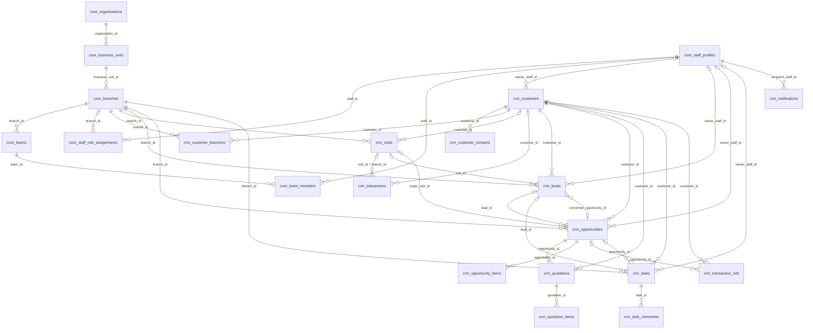
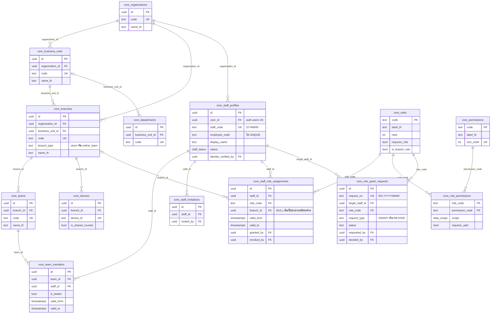
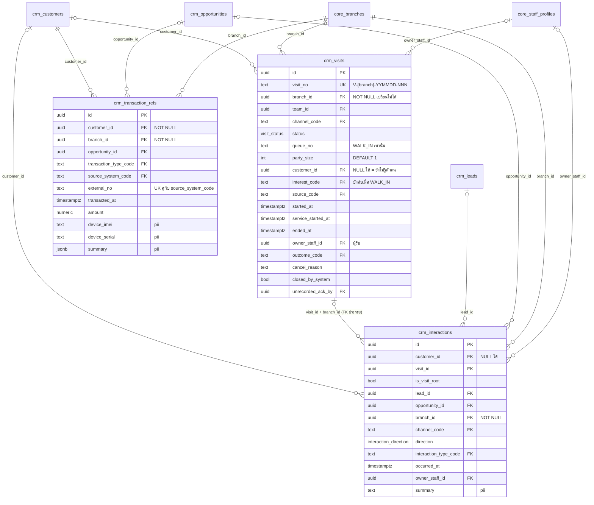
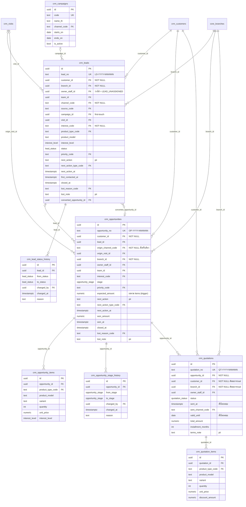
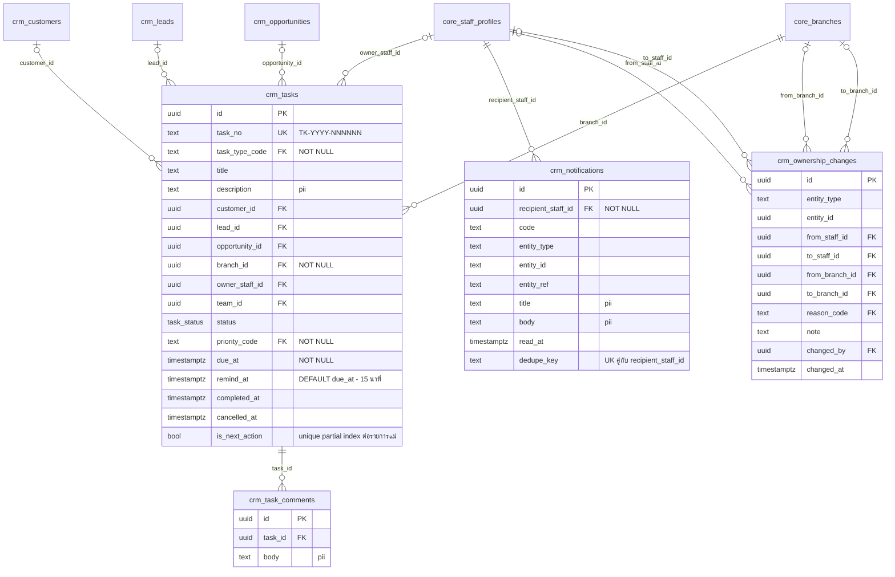
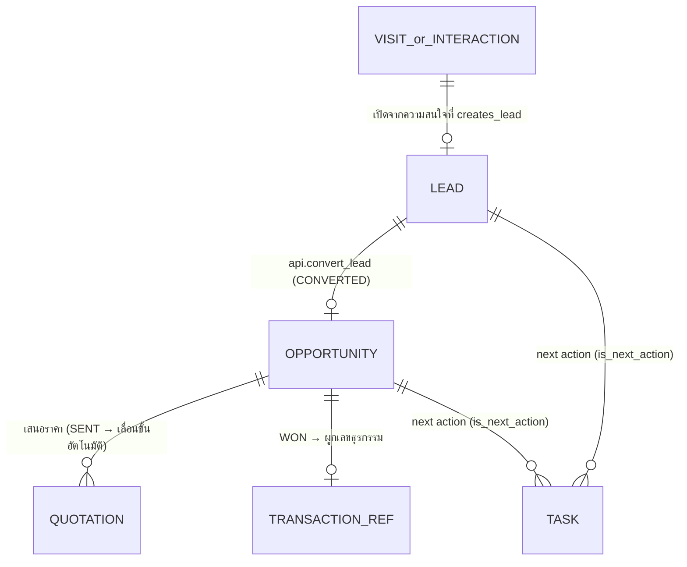

# ER Diagram — JAUN CRM · Customer 360

> เอกสารชุดที่ **08** ตาม A45 · **ฉบับ Phase 0**
> ค่าทุกค่าอ้างอิง `docs/00-brief/CANONICAL.md` **v2.2** (ข้อ 3 · 6 · 7 · 14.6 · 19) · ถ้าเอกสารนี้ขัดกับ CANONICAL **CANONICAL ชนะ**
> ชื่อตาราง คอลัมน์ และความสัมพันธ์ทุกเส้น **อ่านจากฐานข้อมูลจริง** ที่ได้จาก `supabase/migrations/0001–0013` — รายละเอียดครบทุกคอลัมน์อยู่ใน `docs/03-data/data-dictionary.md` (สร้างด้วย `npm run db:dictionary`)
> เอกสารคู่กัน: `docs/03-data/schema-notes.md` (ข้อตกลงการตั้งชื่อ · ลำดับ migration · trigger) · `docs/04-security/rls-spec.md` (ขอบเขตการมองเห็น) · `docs/01-requirement/user-flows.md` (ลำดับงาน)

## 0. วิธีอ่านเอกสารนี้

### 0.1 สัญลักษณ์ในแผนภาพ

ใช้ Mermaid `erDiagram` (crow's foot) · ชื่อ entity เขียนแบบ `schema_table` เพื่อให้ทุกตัวแสดงผลได้ทุก renderer

| สัญลักษณ์ | ความหมาย |
|---|---|
| `A \|\|--o{ B` | A หนึ่งแถว มี B ได้ 0 ถึงหลายแถว · **B ต้องมี A เสมอ** (FK ของ B เป็น `NOT NULL`) |
| `A \|o--o{ B` | A หนึ่งแถว มี B ได้ 0 ถึงหลายแถว · **B มี A หรือไม่มีก็ได้** (FK ของ B เป็น `NULL` ได้) |
| `A \|\|--o\| B` | A หนึ่งแถว มี B ได้ 0 หรือ 1 แถว (มี UNIQUE บน FK ของ B) |
| `PK` `FK` `UK` | Primary key · Foreign key · Unique key |
| ป้ายบนเส้น | ชื่อคอลัมน์ FK ของฝั่งลูก |

### 0.2 เส้นที่ **ไม่** วาด (เพื่อให้แผนภาพอ่านได้)

ทุกตารางธุรกิจมีคอลัมน์มาตรฐานที่เป็น FK เหมือนกันหมด จึงตัดออกจากแผนภาพทุกภาพและอธิบายรวมที่นี่แทน (ดูรายละเอียดในข้อ 9.1)

| คอลัมน์ | ชี้ไป | มีในตาราง |
|---|---|---|
| `organization_id` | `core.organizations(id)` | ทุกตารางใน `core` `crm` และ `audit.export_requests` (`ref.*` ไม่มี — เป็นค่ากลาง ข้อ 2) |
| `created_by` · `updated_by` | `core.staff_profiles(id)` | ทุกตารางที่มีคอลัมน์มาตรฐาน (ข้อ 6.10) |

เส้นที่ชี้ไป `ref.*` วาดเฉพาะในข้อ 3 (แผนภาพ Master Data) — ในแผนภาพโดเมนอื่นเขียนเป็นรายการคอลัมน์ `_code` แทนเส้น เพื่อไม่ให้เส้นพันกัน

### 0.3 ชนิดข้อมูลในแผนภาพ

เขียนแบบย่อ (`uuid` `text` `timestamptz` `numeric` `jsonb` `bool` `int`) · ความแม่นยำจริง (เช่น `numeric(12,2)` · `timestamp with time zone`) อยู่ใน data dictionary

---

## 1. ภาพรวมทั้งระบบ

แสดงเฉพาะเส้นหลักที่ใช้ตอบคำถามธุรกิจ (A11) · รายละเอียดของแต่ละกลุ่มอยู่ในข้อ 2–8

อ่านภาพนี้เป็นสามชั้น

1. **ชั้นองค์กร** (`core`) — องค์กร → หน่วยธุรกิจ → สาขา → ทีม · และ พนักงาน × บทบาท × สาขา เป็นตัวตัดสินสิทธิ์ทุกข้อ (ข้อ 8.0)
2. **ชั้นลูกค้า** (`crm.customers` + ตารางลูก) — ตัวตนของลูกค้าและช่องทางติดต่อ
3. **ชั้นกิจกรรม** — Visit · Interaction · Lead · Opportunity · Quotation · Task · Transaction ref ทุกแถว **มี `branch_id NOT NULL` เสมอ** เพราะ RLS ต้องตัดสินด้วยสาขา (D21 · ข้อ 6.10)

---

## 2. โดเมน Identity / Organization (schema `core`)

สิ่งที่ภาพนี้บอก (CANONICAL ข้อ 7 · 8)

- **สิทธิ์ไม่ได้อยู่ที่พนักงาน แต่อยู่ที่ "แถวการมอบบทบาท"** — `core.staff_role_assignments` คือหน่วยที่เล็กที่สุดของการตัดสินสิทธิ์ · คนเดียวมีหลายแถวได้ และ **ห้ามยุบ scope ข้ามสาขา** (ข้อ 8.0): `BRANCH_MANAGER`@JP1 + `STAFF`@JP2 = `B` ที่ JP1 และ `O` ที่ JP2 เท่านั้น
- `branch_id` ของ assignment เป็น `NULL` **ก็ต่อเมื่อ** `role_code ∈ {MARKETING, EXECUTIVE, BUSINESS_ADMIN, SYSTEM_ADMIN}` และต้องไม่เป็น NULL สำหรับบทบาทสาขา — บังคับด้วย CHECK `staff_role_assignments_branch_chk` (ข้อ 7.1) · **helper ห้ามตีความ `branch_id` NULL ของบทบาทสาขาว่าเป็นทุกสาขา**
- `core.role_permissions` ให้ `(role_code, permission_code) → scope, requires_aal2` · แก้ได้เฉพาะผ่าน migration (ข้อ 7.2)
- **สมาชิกทีมมีแหล่งเดียว** คือ `core.team_members` (ข้อ 7.1) · `teams.branch_id NOT NULL` ทำให้ scope `TEAM` ผูกกับสาขาเสมอ · `team_id` ที่อยู่บนรายการงาน (lead/opportunity/task/visit) เป็น **snapshot ตอนมอบงาน** (A28) ใช้แสดงผล/รายงานเท่านั้น — scope `TEAM` ประเมินจากสมาชิกภาพ**ปัจจุบัน**ของ owner
- `staff_profiles.staff_code` UNIQUE (`ST-NNNN` ใช้ล็อกอิน) แต่ `employee_code` **ไม่** UNIQUE — ห้ามซ้ำเฉพาะในบัญชีที่ไม่ใช่ `DISABLED` (partial unique index · ข้อ 7.1 **[รอยืนยัน Q1]**)
- `staff_profiles.user_id → auth.users.id` เป็นเส้นเดียวที่ออกไปนอก schema ของโครงการ · UNIQUE (หนึ่งบัญชี Supabase Auth = หนึ่งพนักงาน)
- `core.role_grant_requests` คือเส้นทางเดียวของการมอบ/ถอน `SYSTEM_ADMIN` `EXECUTIVE` `BUSINESS_ADMIN` (D22 · ข้อ 7.2) — SYSTEM_ADMIN ยื่น · EXECUTIVE อนุมัติ

---

## 3. โดเมน Master Data (schema `ref`)

`ref.*` เป็นค่ากลางทั้งองค์กร **ไม่มี `organization_id`** (ข้อ 2 · 5) · ทุกตารางมีรูปเดียวกัน: `code text PK` · `label_th` · `label_en` · `sort_order` · `is_active` · `is_system` · `created_at` · `updated_at` · **ห้ามลบ** ใช้ `is_active = false`

```mermaid
erDiagram
    ref_channels {
        text code PK "WALK_IN LINE FACEBOOK INSTAGRAM TIKTOK PHONE WEBSITE"
        text label_th
        bool is_live "สด = WALK_IN PHONE"
        int sort_order
    }
    ref_sources {
        text code PK
    }
    ref_interest_types {
        text code PK "BUY SELL TRADE_IN INSTALLMENT ACCESSORY REPAIR INQUIRY"
        bool creates_lead
    }
    ref_product_types {
        text code PK
    }
    ref_lost_reasons {
        text code PK "14 ค่า"
    }
    ref_visit_outcomes {
        text code PK "7 ค่า is_system ทั้งหมด"
    }
    ref_interaction_types {
        text code PK
    }
    ref_task_types {
        text code PK
    }
    ref_priorities {
        text code PK "LOW NORMAL HIGH URGENT"
    }
    ref_provinces {
        text code PK "77 จังหวัด รหัส ISO 3166-2 TH"
    }
    ref_transaction_types {
        text code PK
        bool counts_as_purchase
    }
    ref_source_systems {
        text code PK
    }
    ref_consent_purposes {
        text code PK "PRIVACY_NOTICE MARKETING"
        text controller_entity
    }
    ref_export_reasons {
        text code PK
        bool is_marketing
    }
    ref_duplicate_override_reasons {
        text code PK
    }
    ref_ownership_change_reasons {
        text code PK
    }

    ref_channels ||--o{ crm_visits : "channel_code"
    ref_channels ||--o{ crm_interactions : "channel_code"
    ref_channels ||--o{ crm_leads : "channel_code"
    ref_channels ||--o{ crm_opportunities : "origin_channel_code"
    ref_channels |o--o{ crm_quotations : "sent_channel_code"
    ref_channels |o--o{ crm_customers : "first_channel_code / last_channel_code"
    ref_channels |o--o{ crm_campaigns : "channel_code"

    ref_interest_types |o--o{ crm_visits : "interest_code"
    ref_interest_types ||--o{ crm_leads : "interest_code"
    ref_interest_types |o--o{ crm_opportunities : "interest_code"

    ref_sources |o--o{ crm_visits : "source_code"
    ref_sources |o--o{ crm_leads : "source_code"
    ref_sources |o--o{ crm_customers : "first_source_code"

    ref_visit_outcomes |o--o{ crm_visits : "outcome_code"
    ref_lost_reasons |o--o{ crm_leads : "lost_reason_code"
    ref_lost_reasons |o--o{ crm_opportunities : "lost_reason_code"
    ref_product_types |o--o{ crm_leads : "product_type_code"
    ref_product_types |o--o{ crm_opportunity_items : "product_type_code"
    ref_product_types |o--o{ crm_quotation_items : "product_type_code"
    ref_task_types ||--o{ crm_tasks : "task_type_code"
    ref_task_types |o--o{ crm_leads : "next_action_type_code"
    ref_task_types |o--o{ crm_opportunities : "next_action_type_code"
    ref_priorities ||--o{ crm_tasks : "priority_code"
    ref_priorities |o--o{ crm_leads : "priority_code"
    ref_priorities |o--o{ crm_opportunities : "priority_code"
    ref_interaction_types ||--o{ crm_interactions : "interaction_type_code"
    ref_transaction_types ||--o{ crm_transaction_refs : "transaction_type_code"
    ref_source_systems ||--o{ crm_transaction_refs : "source_system_code"
    ref_provinces |o--o{ crm_customers : "province_code"
    ref_provinces |o--o{ crm_customer_addresses : "province_code"
    ref_consent_purposes ||--o{ crm_customer_consents : "purpose_code"
    ref_export_reasons ||--o{ audit_export_requests : "reason_code"
    ref_duplicate_override_reasons ||--o{ crm_duplicate_decisions : "override_reason_code"
    ref_ownership_change_reasons ||--o{ crm_ownership_changes : "reason_code"
```

จุดที่ต้องรู้

- **ช่องทาง ≠ แหล่งที่มา** (ข้อ 5.2): `ref.channels` = คุยกันทางไหน · `ref.sources` = รู้จักร้านจากที่ไหน · กราฟ "แหล่งที่มาลูกค้า" (ข้อ 13.3) ใช้ `customers.first_channel_code` ตาม mockup ไม่ใช่ `first_source_code` (D3)
- ธงความหมายบน lookup เป็นส่วนหนึ่งของตรรกะ ไม่ใช่ข้อมูลตกแต่ง — `channels.is_live` ตัดสินสถานะเริ่มต้นของ lead (ข้อ 4.3) · `interest_types.creates_lead` ตัดสินว่า Quick Capture สร้าง lead หรือไม่ (ข้อ 6.2) · `transaction_types.counts_as_purchase` ตัดสินว่าเป็น "เหตุการณ์การซื้อ" หรือไม่ (ข้อ 3.1) · `export_reasons.is_marketing` บังคับกรองความยินยอม (ข้อ 8.2) · **แก้ได้ด้วย migration เท่านั้น** (ข้อ 19.1 ข้อ 4)
- "Service Type" ในบรีฟ (A14 · B15) ไม่มีตารางแยก — ใช้ `ref.interest_types` + `ref.transaction_types` (D39)

---

## 4. โดเมน Customer (แกนของระบบ)

```mermaid
erDiagram
    crm_customers {
        uuid id PK
        text customer_no UK "CUS-YYYY-NNNNNN"
        text first_name "pii"
        text last_name "pii"
        text nickname "pii"
        text display_name "pii generated"
        text name_search "pii generated trigram"
        text customer_type "INDIVIDUAL หรือ BUSINESS"
        timestamptz first_seen_at "กิจกรรมแรกที่รู้"
        text first_channel_code FK
        text first_source_code FK
        uuid first_branch_id FK
        uuid owner_staff_id FK
        text lifecycle_stage "คำนวณ ห้ามแก้มือ"
        customer_record_status record_status
        uuid merged_into_id FK "ชี้ไป survivor"
        text province_code FK
        text note_summary "pii แคช"
        bool legal_hold
        text created_via
        timestamptz last_activity_at "แคช"
        text last_channel_code FK "แคช"
        uuid last_branch_id FK "แคช"
        bool has_open_followup "แคช"
        bool has_new_lead "แคช"
    }
    crm_customer_contacts {
        uuid id PK
        uuid customer_id FK
        contact_type contact_type
        text value_raw "pii"
        text value_normalized "pii generated"
        text value_masked "generated"
        bool is_primary
        bool is_valid
        bool is_active
    }
    crm_customer_addresses {
        uuid id PK
        uuid customer_id FK
        text address_line "pii"
        text subdistrict "pii"
        text district
        text province_code FK
        text postal_code "pii"
        text value_masked
    }
    crm_customer_branches {
        uuid customer_id PK
        uuid branch_id PK
        timestamptz first_linked_at
        timestamptz last_activity_at
        customer_link_via linked_via
    }
    crm_customer_notes {
        uuid id PK
        uuid customer_id FK
        uuid interaction_id FK
        uuid branch_id FK
        text body "pii ไม่เกิน 2000 ตัวอักษร"
        bool is_pinned
    }
    crm_tags {
        uuid id PK
        text code UK
        text label_th
        bool is_active
    }
    crm_customer_tags {
        uuid id PK
        uuid customer_id FK
        uuid tag_id FK
    }
    crm_customer_consents {
        uuid id PK
        uuid customer_id FK
        text purpose_code FK
        consent_status status
        text notice_version
        text channels "text[]"
        consent_capture_via captured_via
        uuid captured_by FK
        text evidence "pii"
    }
    crm_duplicate_decisions {
        uuid id PK
        uuid customer_id FK "UNIQUE รายที่สร้างใหม่"
        uuid candidate_customer_id FK
        int score "CHECK >= 70"
        text matched_rules "text[]"
        text override_reason_code FK
        duplicate_status status
        uuid created_by FK
        uuid decided_by FK
    }
    crm_customer_merges {
        uuid id PK
        text merge_no UK "MG-YYYY-NNNNNN"
        uuid survivor_customer_id FK
        uuid merged_customer_id FK "UNIQUE"
        uuid duplicate_decision_id FK
        uuid merged_by FK
        jsonb snapshot "ปิดบัง PII"
    }
    crm_data_subject_requests {
        uuid id PK
        text request_no UK "DSR-YYYY-NNNNNN"
        uuid customer_id FK "NULL ได้"
        text requester_contact_masked
        dsr_type request_type
        dsr_status status
        timestamptz due_at "received_at + 30 วัน"
        text verification_method
        uuid verified_by FK
    }

    crm_customers ||--o{ crm_customer_contacts : "customer_id"
    crm_customers ||--o{ crm_customer_addresses : "customer_id"
    crm_customers ||--o{ crm_customer_branches : "customer_id"
    crm_customers ||--o{ crm_customer_notes : "customer_id"
    crm_customers ||--o{ crm_customer_tags : "customer_id"
    crm_tags ||--o{ crm_customer_tags : "tag_id"
    crm_customers ||--o{ crm_customer_consents : "customer_id"
    crm_customers |o--o{ crm_data_subject_requests : "customer_id"
    crm_customers ||--o| crm_duplicate_decisions : "customer_id (UNIQUE)"
    crm_customers ||--o{ crm_duplicate_decisions : "candidate_customer_id"
    crm_customers ||--o{ crm_customer_merges : "survivor_customer_id"
    crm_customers ||--o| crm_customer_merges : "merged_customer_id (UNIQUE)"
    crm_duplicate_decisions |o--o{ crm_customer_merges : "duplicate_decision_id"
    crm_customers |o--o{ crm_customers : "merged_into_id"
    core_branches ||--o{ crm_customer_branches : "branch_id"
    crm_interactions |o--o{ crm_customer_notes : "interaction_id"
```

สิ่งที่ภาพนี้บอก (CANONICAL ข้อ 6)

- **สร้างลูกค้าได้ทางเดียว: `api.quick_capture`** (ข้อ 6.2) — `authenticated` ไม่มี INSERT บน `customers` `customer_contacts` `customer_consents` เลย · ความสัมพันธ์ "ลูกค้า → ช่องทางติดต่อ → ความยินยอม" จึงถูกสร้างครบในทรานแซกชันเดียวเสมอ
- **`customer_contacts` คุมระดับคอลัมน์** (ข้อ 6.4): `authenticated` เห็น `value_masked` แต่ไม่เห็น `value_raw`/`value_normalized` · ค่าเต็มออกได้ทางเดียวคือ `api.reveal_contact` ซึ่งเขียน `audit.access_logs` ก่อนคืนค่า · `customer_addresses` ใช้กติกาเดียวกัน (ข้อ 19.1 ข้อ 5)
- **`customer_branches` คือกุญแจของการมองเห็น** (ข้อ 6.6 · 8.0) — ลูกค้าไม่มี `branch_id` ของตัวเอง สิทธิ์ระดับ `BRANCH` จึงถามว่า "ลูกค้าเชื่อมกับสาขาของฉันหรือไม่" ผ่านตารางนี้ (หรือ `first_branch_id`) · เขียนได้โดย trigger และ `api.link_customer_to_branch` เท่านั้น
- **การรวมลูกค้าไม่ลบแถว** (ข้อ 6.7): ผู้ถูกรวมได้ `record_status = 'MERGED'` + `merged_into_id` ชี้ไป survivor (self-FK) · `customer_merges.merged_customer_id` UNIQUE จึงถูกรวมได้ครั้งเดียว · `duplicate_decisions.customer_id` UNIQUE = หนึ่งแถวต่อลูกค้าที่สร้างใหม่หนึ่งราย (ข้อ 6.5)
- **ความยินยอมเป็น append-only** (ข้อ 10.2): ไม่มี `withdrawn_at` — ถอน = แถวใหม่สถานะ `WITHDRAWN` · สถานะปัจจุบันอ่านจาก view `crm.customer_consent_current`
- **ห้ามมี**เลขบัตรประชาชน วันเกิดเต็ม รายได้ รูปถ่าย หรือไฟล์เอกสารในโดเมนนี้ (A31 · B23 · ข้อ 10.1) — คอลัมน์ข้อความอิสระถูก trigger `app.trg_guard_restricted_text` ปฏิเสธเมื่อพบเลข 13 หลักที่ checksum ถูกต้อง

---

## 5. โดเมน Activity — Visit · Interaction · Transaction ref

สิ่งที่ภาพนี้บอก (CANONICAL ข้อ 3.3 · 4.1 · 4.2)

- **Visit คือ "หนึ่งครั้งที่มีคนติดต่อเรา" ทุกช่องทาง ไม่ใช่เฉพาะหน้าร้าน** (D1) — ตาราง `crm.visits` ตารางเดียวรองรับทั้ง walk-in และออนไลน์/โทร · `customer_id` เป็น NULL ได้ เพราะ visit เกิดก่อนรู้ตัวตนเสมอ (คิว 002–004 ในข้อ 13.11)
- **ทุก visit ที่ไม่ใช่ `CANCELLED` มี interaction ต้นทาง 1 รายการ** (`is_visit_root = true`) — นี่คือเส้น `visits ||--o{ interactions` ที่มีความหมายพิเศษ: หนึ่ง visit มี root ได้ใบเดียว
- **FK ประกอบ `interactions(visit_id, branch_id) → visits(id, branch_id)`** (รองรับด้วย UNIQUE `visits(id, branch_id)`) บังคับให้ interaction อยู่สาขาเดียวกับ visit ของมันเสมอ — ฐานข้อมูลปิดช่องการผูกข้ามสาขาตั้งแต่ชั้น FK ไม่ต้องรอ trigger
- interaction `OUTBOUND` และ `INTERNAL` **ไม่สร้าง visit** (ข้อ 3.3 ข้อ 4) จึงมี `visit_id` เป็น NULL
- **`transaction_refs` เป็นสะพานไปโลกภายนอก** — UNIQUE `(source_system_code, external_no)` กันการผูกซ้ำ · V1 INSERT ได้อย่างเดียวด้วย `source_system_code = 'MANUAL'` (ข้อ 19.2 ข้อ 6 · Q29) · ref ที่ผูก opportunity `WON` **ไม่ถูกนับซ้ำ** เป็นเหตุการณ์การซื้อ (ข้อ 3.1) ซึ่งเป็นเหตุผลที่ view `analytics.purchase_events` ต้องมีอยู่

---

## 6. โดเมน Sales — Lead · Opportunity · Quotation · Campaign

สิ่งที่ภาพนี้บอก (CANONICAL ข้อ 4.3 – 4.6)

- **Lead กับ Opportunity ผูกกันสองเส้น ไม่ใช่เส้นเดียว**
  `opportunities.lead_id` = "โอกาสขายนี้มาจาก lead ใด" (มองจากลูก)
  `leads.converted_opportunity_id` = "lead นี้ถูกแปลงไปเป็นโอกาสขายใด" (มองจากแม่ · บังคับเมื่อ `status = 'CONVERTED'`)
  ทั้งสองเส้นตั้งพร้อมกันใน **`api.convert_lead`** ทรานแซกชันเดียว (ข้อ 4.3) — ห้ามตั้งทีละเส้นจากหน้าจอ
- **ประวัติสถานะเป็นตารางของตัวเอง ไม่ใช่คอลัมน์** — `lead_status_history` · `opportunity_stage_history` เขียนโดย trigger ทุกครั้งที่สถานะเปลี่ยน (ข้อ 4.5) · ทั้งสองไม่อยู่ในขอบเขตของ `audit.log_row_change` เพราะซ้ำกัน (ข้อ 9.5)
- **`expected_amount` ไม่ใช่ช่องกรอก** — trigger คำนวณจาก `opportunity_items` (ข้อ 6.10) · `OPEN_PIPELINE_AMOUNT` (ข้อ 12.1) จึงบวกจากรายการจริงเสมอ
- **`quotations.customer_id` และ `branch_id` เป็น `NOT NULL` ที่คัดลอกจาก opportunity แม่ด้วย trigger** (ข้อ 19.1 ข้อ 6) — เพื่อให้ RLS ตัดสินใบเสนอราคาได้โดยไม่ต้อง join ขึ้นไปหาแม่
- **ขั้นของ opportunity เลื่อนเองบางเส้น** — `INTERESTED → QUOTATION` อัตโนมัติเมื่อ quotation เปลี่ยนเป็น `SENT` · `FOLLOW_UP → QUOTATION` อัตโนมัติเมื่อมีใบใหม่ `SENT` (ข้อ 4.4 · 19.3 ข้อ 5) · **ห้ามย้อนกลับเป็น `INTERESTED`** (D48)
- `campaigns` มีอยู่ตั้งแต่ Phase 0 แต่หน้าจอเต็มเป็น Phase 4 · `leads.campaign_id` เป็น first-touch (ข้อ 5.10) · `campaign_members` และ `segments` ยังไม่สร้าง (ข้อ 14.6)

---

## 7. โดเมน Work — Task · Notification · Ownership

สิ่งที่ภาพนี้บอก (CANONICAL ข้อ 4.4 · 4.7 · 11)

- **`tasks` ตารางเดียวแทน `tasks` + `followups` ของบรีฟ** (D7) — follow-up = `task_type_code = 'FOLLOW_UP'` · `reminders` กลายเป็นคอลัมน์ `remind_at` (ข้อ 14.6)
- **next action เป็นแหล่งจริงของงานติดตาม** (ข้อ 4.4): lead/opportunity ที่เปิดอยู่ทุกใบมี task ที่ `is_next_action = true` **หนึ่งใบ** (unique partial index) ซึ่ง trigger `app.trg_sync_next_action_task` สร้าง/อัปเดตให้ตรงกับ `next_action*` ของแม่ · ปิดรายการแม่ → task นั้นกลายเป็น `CANCELLED` ถ้ายังไม่ `DONE` · เส้น `leads → tasks` และ `opportunities → tasks` จึงไม่ใช่ความสัมพันธ์ธรรมดา แต่เป็นความสัมพันธ์ที่ระบบดูแลเอง
- **`tasks` ไม่มี read-through ผ่านลูกค้า** (ข้อ 9.4) — ต่างจาก visits/interactions/leads/opportunities/quotations/transaction_refs/customer_notes · ผู้ที่เห็นลูกค้าได้ไม่ได้แปลว่าเห็นงานของคนอื่น · Customer 360 จึงแสดง "นัดติดตามถัดไป" จาก next action ของ lead/opportunity แทนการอ่าน tasks ตรง
- **`ownership_changes` เป็น log แบบ polymorphic** (`entity_type` + `entity_id` ไม่มี FK) เพราะบันทึกการเปลี่ยนผู้รับผิดชอบของหลายตาราง (A28) · เขียนผ่าน `api.assign_owner` เท่านั้น
- **`notifications.dedupe_key` ยึดกับ "จุดยึดของรายการ" ไม่ใช่วันที่ job รัน** (ข้อ 11.1) · UNIQUE `(recipient_staff_id, dedupe_key)` คือกลไกที่ทำให้งานทุก 5 นาทีไม่ส่งซ้ำ

---

## 8. โดเมน Governance — Audit · App · Analytics

```mermaid
erDiagram
    audit_audit_logs {
        bigint id PK "identity"
        timestamptz occurred_at
        actor_type actor_type
        uuid actor_staff_id
        text actor_staff_code
        text actor_label
        text actor_roles "text[]"
        text aal
        text action "ENTITY_VERB"
        text entity_type
        text entity_id "text"
        text entity_ref
        uuid branch_id
        jsonb before "ปิดบัง pii + sha256"
        jsonb after "ปิดบัง pii + sha256"
        text changed_fields "text[]"
        text reason "ห้ามมี PII"
    }
    audit_access_logs {
        bigint id PK "identity"
        text action "CUSTOMER_VIEWED CONTACT_REVEALED ..."
        uuid customer_id
        uuid contact_id
        text term_sha256 "ไม่เก็บค่าจริง"
    }
    audit_login_events {
        bigint id PK
    }
    audit_integration_logs {
        bigint id PK
    }
    audit_export_requests {
        uuid id PK
        text export_no UK "EX-YYYY-NNNNNN"
        uuid requested_by FK
        text requested_as_role FK
        text reason_code FK
        export_status status
        uuid approved_by FK "CHECK <> requested_by"
        int download_count
    }
    app_settings {
        text key PK
        jsonb value
        text editable_by FK "permission code"
        uuid updated_by FK
    }
    app_running_numbers {
        text scope_key PK "CUS:2026 VISIT:JP1:20260911 ..."
        bigint last_value
    }
    app_rate_limit_counters {
        uuid staff_id PK
        text counter_key PK
        timestamptz window_start PK
        int hits
    }
    analytics_customer_activity {
        text kind "VISIT INTERACTION LEAD OPPORTUNITY OPPORTUNITY_CLOSED TRANSACTION"
        timestamptz occurred_at
    }
    analytics_purchase_events {
        uuid customer_id
        timestamptz occurred_at
        numeric amount
    }
    analytics_data_quality_issues {
        text issue_code "9 ชนิดตามข้อ 12.3"
        uuid branch_id
    }

    core_staff_profiles ||--o{ audit_export_requests : "requested_by"
    core_staff_profiles |o--o{ audit_export_requests : "approved_by"
    ref_export_reasons ||--o{ audit_export_requests : "reason_code"
    core_roles ||--o{ audit_export_requests : "requested_as_role"
    core_staff_profiles ||--o{ app_rate_limit_counters : "staff_id"
    core_permissions ||--o{ app_settings : "editable_by"
```

สิ่งที่ภาพนี้บอก (CANONICAL ข้อ 9.5 · 9.6 · 11.2)

- **`audit.audit_logs` และ `audit.access_logs` ตั้งใจไม่มี FK ไปตารางธุรกิจ** — log ต้องคงอยู่แม้แถวต้นทางถูกแก้หรือ anonymize · `entity_id` จึงเป็น `text` ไม่ใช่ `uuid` (ข้อ 9.5) · การกู้ข้อมูลใช้ PITR ไม่ใช้ audit
- **`audit.export_requests` เป็นตาราง workflow ไม่ใช่ log** (ข้อ 19.1 ข้อ 13) จึงมี FK ปกติและมี CHECK `approved_by <> requested_by` (ข้อ 8.2) · ผู้อนุมัติกำหนดจาก `requested_as_role` ไม่ใช่จากบทบาทสูงสุดของผู้ขอ
- **`app.running_numbers` คือที่เดียวที่ออกเลขอ้างอิงทุกชนิด** (ข้อ 6.1) — `scope_key` ทำให้ตัวนับรายปี (`CUS:2026`) และตัวนับรายสาขา-รายวัน (`VISIT:JP1:20260911`) อยู่ตารางเดียวกันได้ · upsert `ON CONFLICT … DO UPDATE` ล็อกแถวจึงไม่ซ้ำภายใต้การทำงานพร้อมกัน
- **`app.settings.editable_by` เป็น FK ไป `core.permissions.code`** — ใครแก้ค่าตั้งใดได้ ตัดสินจากสิทธิ์จริง (`settings.business` / `settings.system`) ไม่ใช่จากรายชื่อบทบาทที่เขียนตายไว้ (ข้อ 11.2 · 9.6)
- **`analytics.*` เป็น view ไม่ใช่ตาราง** — ไม่มี materialized view ในระบบ (ข้อ 9.4 กติกา 4) · ทุก view เป็น `security_invoker = true` และไม่มี GRANT จึงอ่านได้เฉพาะภายใน RPC `SECURITY DEFINER` (ข้อ 9.4.1)

---

## 9. คำอธิบายความสัมพันธ์ (A11 · CANONICAL ข้อ 3 · 6)

### 9.1 เหตุผลที่ไม่เอาทุกอย่างลง `customers` (A11)

บรีฟ A11 เขียนว่า Customer หนึ่งคนมี Interaction · Lead · Opportunity · Transaction ได้หลายครั้ง "นี่เป็นเหตุผลที่ไม่ควรเอาทุกอย่างลง customers" ระบบทำตามนี้ทั้งหมด และเพิ่มอีกสองชั้น

| ชั้น | ตาราง | ทำไมต้องแยก |
|---|---|---|
| ตัวตน | `crm.customers` | มีแถวเดียวต่อคน · ถือเฉพาะข้อมูลที่ตอบคำถาม "คนนี้เป็นใคร" |
| ช่องทางติดต่อ | `crm.customer_contacts` · `crm.customer_addresses` | หนึ่งคนมีได้หลายเบอร์/หลาย LINE · และต้องคุมสิทธิ์**ระดับคอลัมน์** ซึ่งทำไม่ได้ถ้าเก็บรวมในแถวลูกค้า (ข้อ 6.4) |
| การมองเห็น | `crm.customer_branches` | ลูกค้าไม่สังกัดสาขาเดียว · สิทธิ์ระดับ `BRANCH` ต้องถามแบบ "เชื่อมกับสาขาฉันไหม" (ข้อ 6.6) |
| กิจกรรม | `visits` · `interactions` · `leads` · `opportunities` · `quotations` · `tasks` · `transaction_refs` | นับได้ตามช่วงเวลา · แต่ละแถวมี `branch_id` และ owner ของตัวเองเพื่อให้ RLS และ KPI รายสาขา/รายพนักงานทำงานได้ (ข้อ 12.4) |
| แคช | คอลัมน์ `last_activity_at` · `last_channel_code` · `last_branch_id` · `has_open_followup` · `has_new_lead` · `note_summary` · `lifecycle_stage` บน `customers` | ค่าที่คำนวณจากกิจกรรม แต่ต้อง**เรียงและกรองได้เร็ว**ในหน้ารายการลูกค้า · เขียนโดย trigger เท่านั้น ผู้ใช้แก้ไม่ได้ (ข้อ 6.3 · 9.4 กติกา 7) |

คอลัมน์มาตรฐานที่ทุกตารางธุรกิจมีเหมือนกัน (ข้อ 6.10 · 19.2 ข้อ 1) — `id uuid PK` · `organization_id` · `created_at` · `created_by` · `updated_at` · `updated_by` · เติมด้วย DEFAULT + trigger `trg_90_stamp_row` · **ไม่อยู่ใน column grant ของ UPDATE**

### 9.2 ทำไมทุกแถวกิจกรรมต้องมี `branch_id`

RLS ทุก policy ตัดสินจาก "สาขา × ผู้รับผิดชอบ" (ข้อ 8.0) ดังนั้นแถวที่ไม่มีสาขาจะตัดสินไม่ได้ · รายการออนไลน์ที่ยังไม่มอบสาขาจึงถูกผูกกับหน่วย `JPON` (ทีมออนไลน์ส่วนกลาง · D21 **[รอยืนยัน Q3]**) แทนที่จะปล่อยให้ `branch_id` ว่าง

ผลที่ตามมาในแผนภาพ

- `visits.branch_id` และ `interactions.branch_id` **เปลี่ยนไม่ได้** (ข้อ 19.2 ข้อ 2) — ย้ายสาขาได้เฉพาะ lead/opportunity/task ผ่าน `api.assign_owner` ซึ่งต้องมี `*.assign` ทั้งสาขาต้นทางและปลายทาง (ข้อ 9.4.2)
- `branch_id` ของแถวลูกต้องเท่ากับแถวแม่ (ข้อ 8.0) — บังคับด้วย FK ประกอบสำหรับ interaction→visit และด้วย trigger/คัดลอกค่าสำหรับ quotation→opportunity

### 9.3 ลำดับชีวิตของรายการขาย (ข้อ 4.5)

| # | ขั้นในบรีฟ (A7 · B8) | เก็บที่ | code |
|---|---|---|---|
| 1 | New | lead | `NEW` |
| 2 | Contacted | lead | `CONTACTED` |
| 3 | Qualified | lead | `QUALIFIED` |
| 4 | Opportunity | opportunity | `INTERESTED` (lead → `CONVERTED`) |
| 5 | Quotation | opportunity | `QUOTATION` |
| 6 | Follow-up | opportunity | `FOLLOW_UP` |
| 7 | Won / Lost | opportunity (หรือ lead ที่ปิดก่อนเป็นโอกาสขาย) | `WON` / `LOST` |

**Opportunity ไม่จำเป็นต้องมาจาก lead เสมอ** — `opportunities.lead_id` เป็น NULL ได้ (เช่น `OP-2026-002998` ในข้อ 13.7 สร้างตรงจากการคุยกับลูกค้าเดิม) · แต่ `origin_channel_code` เป็น `NOT NULL` เสมอและตั้งครั้งเดียวไม่เปลี่ยน เพราะ `WALKIN_CONVERSION` (ข้อ 12.2) ต้องรู้ว่าดีลนี้เริ่มจากช่องทางไหน

### 9.4 หน่วยนับที่แผนภาพรองรับ (ข้อ 3.1)

| คำ | นับจาก | เส้นในแผนภาพที่ทำให้นับได้ |
|---|---|---|
| Visitor / Traffic | `visits` ที่ `status <> 'CANCELLED'` | `visits.branch_id` · `visits.started_at` |
| Identified Visit | `visits.customer_id IS NOT NULL` | เส้น `customers \|o--o{ visits` ที่เป็น optional |
| Unique Customer · ใหม่ · เก่า | view `analytics.customer_activity` (รวม 6 แหล่ง) เทียบกับ `customers.first_seen_at` | ทุกเส้นจาก `customers` ไปตารางกิจกรรม |
| เหตุการณ์การซื้อ · ผู้ซื้อ · ผู้ซื้อซ้ำ | view `analytics.purchase_events` | `opportunities.won_at` + `transaction_refs` ที่ `counts_as_purchase` และไม่ผูก opportunity WON |
| Lead · Opportunity · Sale · Lost | `created_at` / `won_at` / `closed_at` ของตารางนั้น ๆ | – |

**`first_seen_at` คือหลักประกันว่า `ใหม่ + เก่า = ไม่ซ้ำ` เสมอ** (ข้อ 3.2): trigger บน visits/interactions/leads/opportunities/transaction_refs ดึง `first_seen_at` ให้เก่าลงเมื่อพบกิจกรรมที่เก่ากว่า จึงไม่มีกิจกรรมใดที่ `occurred_at < customers.first_seen_at` (มี test ยืนยัน)

### 9.5 เส้นที่ "ไม่มี" โดยตั้งใจ

| ไม่มีเส้น | เหตุผล |
|---|---|
| `customers` → `branches` แบบหนึ่งต่อหนึ่ง | ลูกค้าไม่สังกัดสาขา · `first_branch_id` เป็นเพียงสาขาของกิจกรรมแรก ส่วนการมองเห็นใช้ `customer_branches` (ข้อ 6.6) |
| `customers` → ไฟล์/เอกสาร | V1 ไม่มีการอัปโหลดไฟล์ของลูกค้า · `restricted.customer_documents` เป็น Phase 4 (ข้อ 10.1 · D31) |
| `tasks` → `customers` แบบ read-through | `task.read` เท่านั้น ไม่มี read-through (ข้อ 9.4) |
| `transaction_refs` → รายการสินค้า | V1 เก็บเป็น `summary jsonb` + เลขอ้างอิงภายนอก · ตาราง `transaction_items` ของบรีฟถูกยุบ (D25 · ข้อ 14.6) |
| `audit.*` → ตารางธุรกิจ | log ต้องอยู่รอดอิสระ (ข้อ 9.5) |
| `campaign_members` · `online_conversations` · `segments` | Phase 4–5 · ยังไม่สร้างตาราง (ข้อ 14.6) |

---

## 10. สรุปจำนวนที่ตรวจได้

ตัวเลขทั้งหมดอ่านจากฐานข้อมูลที่ได้จาก `supabase/migrations/0001–0013` (ยืนยันซ้ำได้ด้วย `npm run db:dictionary` แล้วดูข้อ 1 ของ data dictionary)

| หน่วย | จำนวน |
|---|---:|
| ตารางทั้งหมด | 64 |
| ↳ `core` · `ref` · `crm` · `app` · `audit` | 14 · 16 · 26 · 3 · 5 |
| view (ทุกตัว `security_invoker = true`) | 4 |
| ENUM | 19 |
| Foreign key ทั้งหมด | 244 — `crm` 181 · `core` 53 · `audit` 7 · `app` 3 · `ref` 0 (เป็นค่ากลาง ไม่อ้างตารางอื่น) |
| ตารางที่เปิด RLS | 59 จาก 64 (ยกเว้น `audit.*` 5 ตาราง ซึ่งคุมด้วย GRANT ตามข้อ 19.1 ข้อ 13) |

---

## 11. รายการที่ยังต้องยืนยัน

| # | ประเด็น | ค่าที่ใช้ไปก่อน | อ้างอิง |
|---|---|---|---|
| 1 | หน่วย `JPON` (ทีมออนไลน์ส่วนกลาง) มีจริงหรือแอดมินสังกัดสาขา — กระทบว่า `branch_type = 'online_team'` ยังจำเป็นหรือไม่ | มี `JPON` | CANONICAL Q3 · D21 |
| 2 | `employee_code` ไม่ UNIQUE แต่ห้ามซ้ำในบัญชีที่ไม่ใช่ `DISABLED` | partial unique index | CANONICAL ข้อ 7.1 · Q1 |
| 3 | JAUNPHONE กับ JAUN POWER MONEY เป็นนิติบุคคลเดียวกันหรือไม่ — ถ้าไม่ ต้องแยก purpose เป็น `MARKETING_JAUNPHONE` / `MARKETING_JPM` และใช้ `ref.consent_purposes.controller_entity` | controller เดียว | CANONICAL Q17 · ข้อ 10.2 |
| 4 | การแก้/ยกเลิก `transaction_refs` ที่ผูกผิด (V1 เพิ่มได้อย่างเดียว) | แก้ด้วยสคริปต์ BA | CANONICAL Q29 · ข้อ 19.2 ข้อ 6 |
| 5 | `duplicate_decisions.matched_rules` เก็บข้อความเหตุผลบนการ์ด หรือรหัสกฎ | ข้อความบนการ์ด | CANONICAL ข้อ 19.1 ข้อ 7 |

**หมายเหตุผู้เขียน**

1. CANONICAL ไม่ได้กำหนดว่าจะแบ่งโดเมนของ ERD อย่างไร ผู้เขียนแบ่งตามไฟล์ migration จริง (`0002_core` → identity/org · `0003_ref` → master data · `0004_crm_customer` → customer · `0005_crm_activity` → activity · `0006_crm_sales` → sales · `0007_crm_work` → work · `0008_audit` + `app` + `analytics` → governance) เพื่อให้แผนภาพกับลำดับการสร้างตารางเป็นภาพเดียวกัน
2. แผนภาพทุกภาพตัดเส้น `organization_id` `created_by` `updated_by` ออก (ข้อ 0.2) เพราะมีอยู่ในเกือบทุกตารางและทำให้ภาพอ่านไม่ออก — เส้นเหล่านี้มีจริงในฐานข้อมูลและแสดงครบใน `docs/03-data/data-dictionary.md`
3. ชนิดข้อมูลในบล็อกแอตทริบิวต์เขียนแบบย่อเพื่อให้ Mermaid แสดงผลได้ (เช่น `numeric` แทน `numeric(12,2)`) · ค่าจริงอยู่ใน data dictionary
