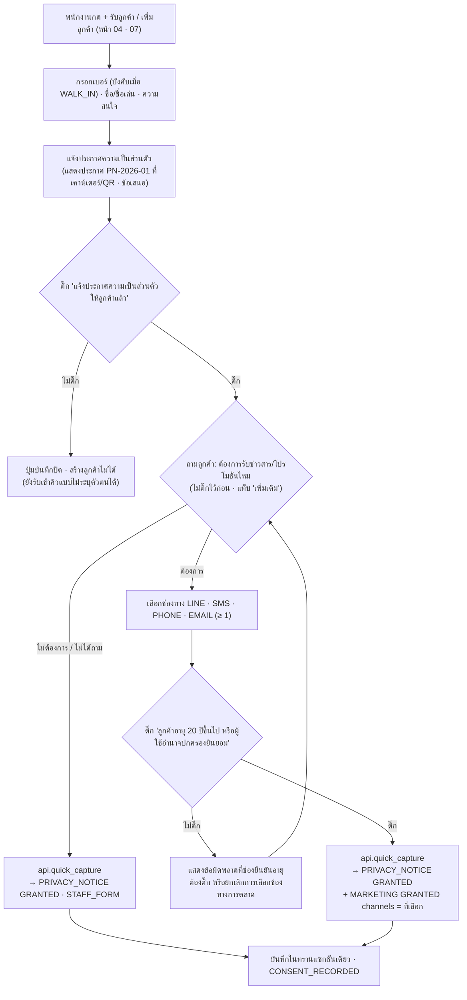
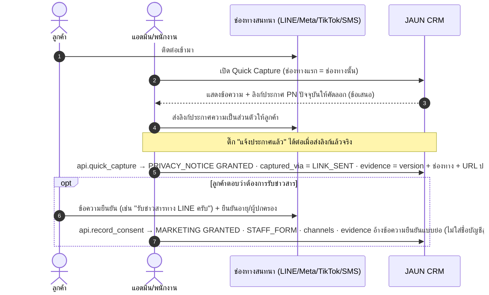
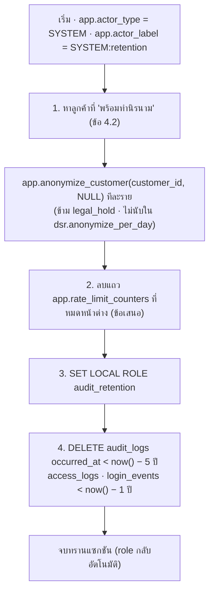
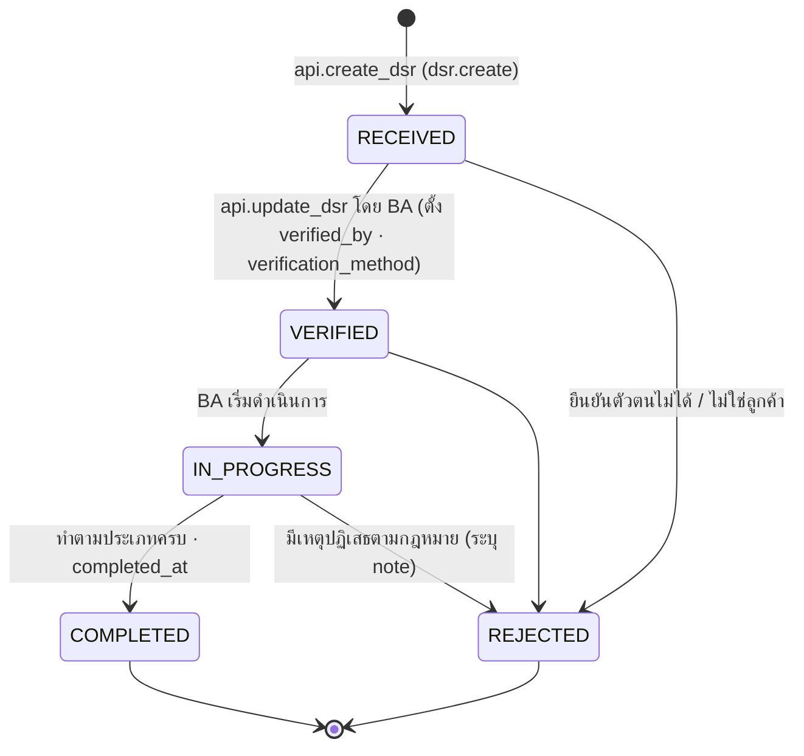
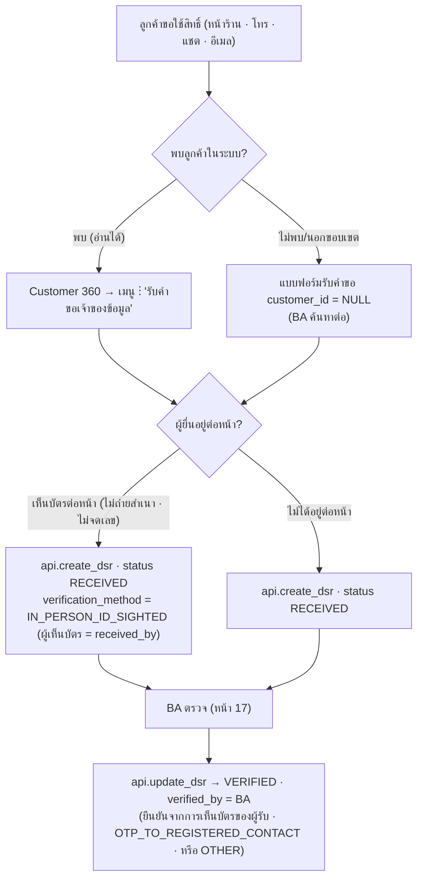

# PDPA และ Consent Flow — JAUN CRM · Customer 360

> **JAUN CRM · Customer 360** · องค์กร JAUN (JAUNPHONE 1–4 · ทีมออนไลน์ส่วนกลาง · JAUN POWER MONEY)
> จัดทำ 16 ก.ย. 2569 · ปรับตาม `docs/00-brief/CANONICAL.md` **ฉบับ v2.2** (โดยเฉพาะ CANONICAL ข้อ 1.4 · 6 · 9.5 · 10 · 11 · 19.1 · 19.4) · ตอบบรีฟ A31 · B23 และเอกสารชุดที่ 13 ของ A45 (PDPA / Consent Flow)
> ทะเบียนข้อมูลในข้อ 2 ใช้ชื่อคอลัมน์จริงใน `supabase/migrations/0001–0009` · คอลัมน์ป้าย `pii` = คอลัมน์ที่ COMMENT ขึ้นต้น `[pii]` (30 คอลัมน์ ณ ฉบับนี้ · ตรวจด้วย `SELECT * FROM app.pii_columns()`)
> อ่านคู่กับ `security-design.md` (กลไกทางเทคนิค · Audit Specification) · `permission-matrix.md` · `../03-data/data-dictionary.md` (ป้าย `pii`) · `../07-api/api-spec.md`

> **ข้อความกำกับที่ต้องอ่านก่อน**
> เอกสารนี้เป็น **การออกแบบระบบ ไม่ใช่คำแนะนำหรือความเห็นทางกฎหมาย** · การอ้างมาตราของพระราชบัญญัติคุ้มครองข้อมูลส่วนบุคคล พ.ศ. 2562 ฐานทางกฎหมาย ระยะเวลาเก็บ และระยะเวลาแจ้งเหตุทุกจุด เป็น "ค่าที่ออกแบบไว้" ซึ่ง **ต้องให้ DPO/ที่ปรึกษากฎหมายของ JAUN ตรวจและยืนยันก่อนใช้งานจริง** (CANONICAL ข้อ 10 · Q8) · ข้อที่ติดป้าย **[รอยืนยัน DPO]** ห้ามถือเป็นข้อยุติ

**เอกสารนี้ตอบคำถามเดียว: ระบบเก็บข้อมูลส่วนบุคคลอะไร เพื่ออะไร ใครเห็น เก็บนานเท่าไร แจ้ง/ขอความยินยอมอย่างไร และเจ้าของข้อมูลใช้สิทธิ์แล้วระบบทำอะไร**

ข้อตกลง: "(CANONICAL ข้อ X)" = แหล่งของค่านั้น · **หมายเหตุผู้เขียน:** = จุดที่ CANONICAL ไม่ได้กำหนด/กำกวม (สรุปในข้อ 10) · **ข้อเสนอ** = รายละเอียดที่ไม่ขัด CANONICAL และเปลี่ยนได้

---

## 0. ผู้เกี่ยวข้อง

| ฝ่าย | สถานะที่ออกแบบไว้ **[รอยืนยัน DPO]** | หมายเหตุ |
|---|---|---|
| JAUN | **ผู้ควบคุมข้อมูลส่วนบุคคล** | ถือเป็น controller เดียวจนกว่าตอบ **Q17** (JAUNPHONE กับ JAUN POWER MONEY เป็นนิติบุคคลเดียวกันหรือไม่) · ผลของ Q17 ข้อ 3.8 |
| DPO / ผู้รับผิดชอบข้อมูลส่วนบุคคล | **รอยืนยัน Q8** | เจ้าของรายการตรวจข้อ 9 |
| BUSINESS_ADMIN | ผู้ดำเนินการ PDPA ในระบบ | `dsr.manage` 🔐 · `customer.anonymize` 🔐 · หน้า 17 (CANONICAL ข้อ 7 · 8.1 · 14.1) · การลบตาม DSR ต้องมี BA ≥ 2 คน (ผู้ยืนยัน ≠ ผู้ดำเนินการ) **[รอยืนยัน Q26]** |
| พนักงานหน้าร้าน/แอดมิน (ST · SV · BM) | ผู้เก็บข้อมูลแทนผู้ควบคุม | แจ้งประกาศ · บันทึกความยินยอม · รับคำขอเจ้าของข้อมูล (`customer.consent.manage` · `dsr.create`) |
| ผู้ให้บริการภายนอก | **ผู้ประมวลผลข้อมูลส่วนบุคคล** | ข้อ 6 (CANONICAL ข้อ 1.4) |
| เจ้าของข้อมูล | ลูกค้า · ผู้ติดต่อ · พนักงาน (ข้อมูลบัญชี/log) | ลูกค้าเป็นกลุ่มหลักของเอกสาร · ข้อมูลพนักงานอยู่ในข้อ 2.4 |

---

## 1. ระดับชั้นข้อมูลและป้าย `pii`

### 1.1 ระดับชั้น (CANONICAL ข้อ 10.1)

| ระดับ | ตัวอย่างในระบบนี้ | การควบคุม |
|---|---|---|
| Public | ชื่อแคมเปญที่ประกาศแล้ว · ชื่อสาขา | – |
| Internal | ตัวเลข Dashboard รวม · master data · ชื่อพนักงาน | ต้องเข้าสู่ระบบ |
| Confidential | โปรไฟล์ลูกค้า · ช่องทางติดต่อ · timeline · โน้ต · ยอดซื้อ · IMEI | RLS ข้อ 8 · column grant + reveal · access log · ป้าย `pii` ใน data dictionary |
| Restricted | เลขบัตรประชาชน · สำเนาบัตร · สัญญาผ่อน · เอกสารรายได้ | schema `restricted` · **ปิดใช้งานใน V1** · ไม่เก็บใน CRM (ข้อ 7) |

### 1.2 ความหมายของป้าย `pii` (ใช้ในตารางข้อ 2)

ป้าย `pii` เก็บเป็น COMMENT ของคอลัมน์ที่ขึ้นต้น `[pii]` ใน migration (CANONICAL ข้อ 19.1 ข้อ 3) · data dictionary · audit masking · anonymize อ่านจากป้ายนี้แหล่งเดียว (`app.pii_columns()`) — ผู้ออกแบบตารางใหม่ต้องตัดสินป้ายนี้ทุกคอลัมน์

| ผล | กลไก | แหล่ง |
|---|---|---|
| ใน `audit.audit_logs.before/after` เก็บเป็น `{"masked":…,"sha256":…}` ไม่เก็บค่าเต็ม | `audit.log_row_change()` อ่าน `[pii]` จาก `pg_description` ขณะทำงาน | CANONICAL ข้อ 9.5 · `security-design.md` ข้อ 6.5 |
| ถูกล้างเมื่อทำข้อมูลนิรนาม | `app.anonymize_customer` | CANONICAL ข้อ 10.4 · 19.1 ข้อ 3 · ข้อ 5.6 ของเอกสารนี้ |
| อยู่ใน data dictionary คอลัมน์ `pii` | `tools/db/gen-data-dictionary.mjs` | 19.1 ข้อ 3 |

เกณฑ์ตัดสิน (ข้อเสนอ): ✓ เมื่อค่า **ระบุตัวบุคคลได้โดยตรง** (ชื่อ · ช่องทางติดต่อ · ที่อยู่ · IMEI/serial) **หรือ** เป็นข้อความอิสระที่พนักงานพิมพ์ (อาจมีชื่อ/เบอร์/เรื่องส่วนตัว) · ✗ สำหรับรหัสจาก master data · เวลา · จำนวนเงิน · FK — ซึ่งยังเป็นข้อมูลส่วนบุคคลเมื่อผูกกับลูกค้า (Confidential) แต่ถูกคงไว้หลังทำนิรนามเพื่อให้ KPI ย้อนหลังไม่เปลี่ยน (CANONICAL ข้อ 10.4)

คอลัมน์ `pii` ในตารางข้อ 2: **✓** = มี COMMENT `[pii]` ใน migration แล้ว · **✗ (เสนอ ✓ · I-11)** = ข้อความอิสระ/ข้อมูลติดต่อที่ migration ยังไม่ติดป้าย → ปัจจุบัน audit เก็บค่าจริงและ anonymize ไม่ล้าง จนกว่าจะเพิ่มป้าย

---

## 2. ทะเบียนข้อมูลส่วนบุคคล (data inventory)

**รหัสย่อในตาราง**

| ฐานทางกฎหมาย (ออกแบบไว้ · **รอ DPO**) | ความหมาย |
|---|---|
| `สัญญา` | จำเป็นเพื่อปฏิบัติตามสัญญาหรือดำเนินการตามคำขอก่อนเข้าทำสัญญา (ม.24(3)) — ซื้อ/ขาย/เทิร์น/ซ่อม/เสนอราคา |
| `ประโยชน์` | ประโยชน์โดยชอบด้วยกฎหมาย (ม.24(5)) — บริหารลูกค้า ติดตามการขาย วัดผลสาขา ป้องกันข้อมูลซ้ำ ความปลอดภัยของระบบ |
| `กฎหมาย` | ปฏิบัติหน้าที่ตามกฎหมาย (ม.24(6)) — log ตาม พ.ร.บ.คอมพิวเตอร์ · หลักฐานการใช้สิทธิ์ของเจ้าของข้อมูล |
| `ยินยอม` | ความยินยอม (ม.19) — การตลาด |

| ระยะเก็บ | ความหมาย (CANONICAL ข้อ 10.3) |
|---|---|
| `RT-ลูกค้า` | ไม่เคยซื้อ: 24 เดือนนับจาก `last_activity_at` · เคยซื้อ: 10 ปีนับจากธุรกรรมล่าสุด → ทำนิรนาม (ข้าม `legal_hold`) · รายละเอียดข้อ 4 |
| `RT-คงไว้` | คอลัมน์ไม่ใช่ `pii` · คงไว้หลังทำนิรนาม (ไม่มีตัวระบุตรงแล้ว) |
| `RT-ลบ` | แถวถูกลบเมื่อทำนิรนาม |
| `RT-audit5` · `RT-log1` · `RT-24ชม.` · `RT-backup` | 5 ปี · 1 ปี · 24 ชม. · PITR 7 วัน / dump 90 วัน |

| ผู้เห็น | ความหมาย (CANONICAL ข้อ 8.1 · 8.3 · 9.4) |
|---|---|
| `อ่านลูกค้า` | ผู้ผ่าน `customer.read` (ST · SV · BM · OP = สาขา · EX · BA = องค์กร) รวม read-through ของตารางกิจกรรม · MARKETING และ SYSTEM_ADMIN **ไม่เห็น** |
| `reveal` | ค่าเต็มผ่าน `api.reveal_contact` ด้วย `customer.pii.reveal` (ST · SV · BM = สาขา · EX · BA = องค์กร 🔐) · บันทึกทุกครั้ง |
| `task.read` | ST = O · SV = T · BM · OP = B · EX · BA = G (ไม่มี read-through) |
| `แก้ลูกค้า` | ผู้มี `customer.update` บนลูกค้ารายนั้น (แท็บประวัติการแก้ไข · ค่าปิดบัง) |
| `audit` | `audit.read` (EX · BA) ค่าปิดบัง · `security_log.read` (EX · BA · SA) เฉพาะ log ความปลอดภัย |

### 2.1 ข้อมูลตัวตนและช่องทางติดต่อของลูกค้า

| table.column | ข้อมูล | ระดับ | pii | วัตถุประสงค์ | ฐาน | ระยะเก็บ | ปิดบังที่ | ผู้เห็น |
|---|---|---|:--:|---|---|---|---|---|
| `crm.customers.customer_no` | รหัสลูกค้า `CUS-YYYY-NNNNNN` | Confidential | ✗ | อ้างอิงลูกค้า | ประโยชน์ | RT-คงไว้ (ใช้สร้างชื่อ `ลูกค้านิรนาม {customer_no}`) | – | อ่านลูกค้า · การ์ดผู้สมัครนอกขอบเขต |
| `crm.customers.first_name` | ชื่อ | Confidential | ✓ | ระบุตัวลูกค้า · เรียกชื่อ | สัญญา / ประโยชน์ | RT-ลูกค้า → `ลูกค้านิรนาม {customer_no}` | audit · การ์ดผู้สมัครนอกขอบเขต (ชื่อ + นามสกุลย่อ) · push/อีเมล (ไม่ส่ง) | อ่านลูกค้า · ชื่อใน `crm.notifications.body` ของผู้รับ |
| `crm.customers.last_name` | นามสกุล | Confidential | ✓ | เหมือนข้างบน | สัญญา / ประโยชน์ | RT-ลูกค้า → NULL | audit · การ์ดผู้สมัคร (อักษรแรก) | อ่านลูกค้า |
| `crm.customers.nickname` | ชื่อเล่น | Confidential | ✓ | เรียกชื่อที่หน้าร้าน | ประโยชน์ | RT-ลูกค้า → NULL | audit | อ่านลูกค้า |
| `crm.customers.display_name` · `name_search` | generated จากชื่อ | Confidential | ✓ | แสดงผล · ค้นหาด้วย trigram | ประโยชน์ | สร้างใหม่อัตโนมัติจากชื่อที่ถูกล้าง | audit | อ่านลูกค้า (`name_search` ใช้ภายใน RPC ค้นหา) |
| `crm.customers.province_code` | จังหวัด | Confidential | ✗ | แบ่งกลุ่มพื้นที่ · export ของ BM | ประโยชน์ | RT-ลูกค้า → NULL (CANONICAL ข้อ 10.4) | – | อ่านลูกค้า · export BM/BA/EX |
| `crm.customers.customer_type` | บุคคล/นิติบุคคล | Internal | ✗ | จำแนก (ไม่ใช้ใน KPI) | ประโยชน์ | RT-คงไว้ | – | อ่านลูกค้า |
| `crm.customers.first_seen_at` · `first_channel_code` · `first_source_code` · `first_branch_id` | กิจกรรมแรก · ช่องทาง · แหล่งที่รู้จักร้าน · สาขาแรก | Confidential | ✗ | KPI ลูกค้าใหม่/เก่า · แหล่งที่มา | ประโยชน์ | RT-คงไว้ | – | อ่านลูกค้า · KPI รวม |
| `crm.customers.lifecycle_stage` · `last_activity_at` · `last_channel_code` · `last_branch_id` · `has_open_followup` · `has_new_lead` | สถานะวงจรชีวิต (profiling จากข้อเท็จจริง) · แคชกิจกรรมล่าสุด | Confidential | ✗ | จัดลำดับงาน · ป้ายบนรายการ | ประโยชน์ | RT-คงไว้ · `last_activity_at` เป็นฐานของ retention | – | อ่านลูกค้า |
| `crm.customers.owner_staff_id` | พนักงานผู้ดูแล | Confidential | ✗ | ความรับผิดชอบ | ประโยชน์ | RT-คงไว้ | – | อ่านลูกค้า |
| `crm.customers.note_summary` | สำเนาโน้ตที่ปักหมุด (trigger `app.trg_sync_note_summary`) | Confidential | ✓ | แสดงบนหัว Customer 360 | ประโยชน์ | RT-ลูกค้า → NULL | audit (ไม่บันทึกเมื่อเปลี่ยนเฉพาะคอลัมน์นี้) | อ่านลูกค้า |
| `crm.customers.legal_hold` · `record_status` · `merged_into_id` · `created_via` | สถานะระบบ | Internal | ✗ | กันการลบ · รวมลูกค้า | กฎหมาย / ประโยชน์ | RT-คงไว้ | – | อ่านลูกค้า |
| `crm.customer_contacts.value_raw` | เบอร์ · อีเมล · LINE ID · Facebook · Instagram · TikTok · LINE userId (ค่าที่กรอก) | Confidential | ✓ | ติดต่อลูกค้า | สัญญา / ประโยชน์ | RT-ลบ | ไม่อยู่ใน column grant · audit · UI แสดง `value_masked` | **reveal เท่านั้น** |
| `crm.customer_contacts.value_normalized` | ค่า normalize (generated = `app.normalize_contact(contact_type, value_raw)` · E.164 · ตัวพิมพ์เล็ก) | Confidential | ✓ | ค้นหาตรงทั้งค่า · ตรวจซ้ำ | ประโยชน์ | RT-ลบ | ไม่อยู่ใน column grant · audit · access log เก็บเฉพาะ sha256 | ภายใน RPC ค้นหา/ตรวจซ้ำ |
| `crm.customer_contacts.value_masked` | ค่าปิดบัง `081-XXX-5678` | Confidential | ✗ (เป็นค่าปิดบัง) | แสดงผล | ประโยชน์ | RT-ลบ | คือค่าปิดบังเอง · export ของ BM | อ่านลูกค้า |
| `crm.customer_contacts.contact_type` · `is_primary` · `is_valid` · `is_active` · `verified_at` | คุณสมบัติของช่องทาง | Confidential | ✗ | เลือกช่องทาง · คุณภาพข้อมูล | ประโยชน์ | RT-ลบ | – | อ่านลูกค้า |
| `crm.customer_addresses.address_line` · `subdistrict` · `postal_code` | บ้านเลขที่/ถนน · ตำบล/แขวง · รหัสไปรษณีย์ | Confidential | ✓ | จัดส่ง/บริการ **[รอยืนยันความจำเป็น]** | สัญญา | RT-ลบ (ทั้งแถว) | ไม่อยู่ใน column grant · audit | ค่าเต็มผ่าน `api.reveal_address(p_address_id, p_purpose)` (`customer.pii.reveal`) เท่านั้น (CANONICAL ข้อ 19.1 ข้อ 5 · 9.6) |
| `crm.customer_addresses.district` · `province_code` · `value_masked` · `is_primary` · `is_active` | อำเภอ · จังหวัด · ค่าแสดง `{อำเภอ} · {จังหวัด}` | Confidential | ✗ | แสดงระดับพื้นที่ | สัญญา | RT-ลบ (ทั้งแถว) | คือระดับที่เปิดเผยได้ | อ่านลูกค้า |
| `crm.customer_branches.*` (`branch_id` `first_linked_at` `last_activity_at` `linked_via`) | สาขาที่ลูกค้าเคยใช้บริการ | Confidential | ✗ | ขอบเขตการมองเห็นข้ามสาขา (RLS) | ประโยชน์ | RT-คงไว้ | – | อ่านลูกค้า |
| `crm.customer_tags` (`customer_id` · `tag_id`) | tag เช่น `VIP` `INSTALLMENT` `STUDENT` `TRADE_IN` `IPHONE_FAN` | Confidential | ✗ | แบ่งกลุ่ม · ป้าย VIP | ประโยชน์ | RT-คงไว้ (หมายเหตุผู้เขียน: ไม่มีตัวระบุตรงหลังล้างชื่อ) | – | อ่านลูกค้า · export BA/EX |
| `crm.customer_notes.body` | โน้ต (≤ 2,000 ตัวอักษร) | Confidential | ✓ | ความต้องการ/ความชอบของลูกค้า | ประโยชน์ | RT-ลูกค้า → `[ANONYMIZED]` | audit · ไม่อยู่ในไฟล์ export ใด | อ่านลูกค้า (read-through) |
| `crm.customer_notes.is_pinned` · `interaction_id` · `branch_id` | คุณสมบัติโน้ต | Confidential | ✗ | – | ประโยชน์ | RT-คงไว้ | – | อ่านลูกค้า |

### 2.2 ความยินยอม · คำขอเจ้าของข้อมูล · ข้อมูลซ้ำ

| table.column | ข้อมูล | ระดับ | pii | วัตถุประสงค์ | ฐาน | ระยะเก็บ | ปิดบังที่ | ผู้เห็น |
|---|---|---|:--:|---|---|---|---|---|
| `crm.customer_consents.purpose_code` · `status` · `notice_version` · `channels` · `captured_via` · `captured_by` · `captured_at` | บันทึกการแจ้งประกาศ/ความยินยอม (append-only) | Confidential | ✗ | หลักฐานการแจ้ง · ฐานของการตลาด · กรอง export | กฎหมาย (หลักฐาน) | RT-คงไว้ **[รอยืนยัน DPO]** | – | อ่านลูกค้า · export BA/EX (ความยินยอมปัจจุบัน) |
| `crm.customer_consents.evidence` | หลักฐาน (version + ช่องทาง + ข้อความ/ลิงก์ที่ส่ง) | Confidential | ✓ | พิสูจน์การแจ้ง/ความยินยอม | กฎหมาย | RT-ลูกค้า → `[ANONYMIZED]` (CANONICAL ข้อ 10.4) | audit | อ่านลูกค้า |
| `crm.data_subject_requests.requester_name` | ชื่อผู้ยื่นคำขอ | Confidential | ✓ | ติดต่อกลับ · หลักฐาน | กฎหมาย | เมื่อทำนิรนามลูกค้าที่ผูก → `'[ANONYMIZED]'` (NOT NULL · ตามป้าย `[pii]` · ข้อ 5.6) · ระยะเก็บแถว **[รอยืนยัน DPO]** (I-28) | audit | `dsr.manage` (BA) · ผู้รับคำขอเห็นของตน |
| `crm.data_subject_requests.requester_contact_masked` | ช่องทางติดต่อผู้ยื่นแบบปิดบัง | Confidential | ✗ (ปิดบังแล้ว) | ติดต่อกลับ | กฎหมาย | **[รอยืนยัน DPO]** | เก็บเฉพาะค่าปิดบัง | เหมือนข้างบน |
| `crm.data_subject_requests.request_type` · `status` · `received_at` · `received_by` · `due_at` · `verification_method` · `verified_by` · `extended_until` · `extension_reason` · `completed_at` · `customer_id` | ข้อมูลการดำเนินคำขอ | Confidential | ✗ | ติดตาม SLA · หลักฐาน | กฎหมาย | **[รอยืนยัน DPO]** | – | เหมือนข้างบน |
| `crm.data_subject_requests.note` | หมายเหตุ | Confidential | ✓ | บันทึกการดำเนินการ | กฎหมาย | เมื่อทำนิรนามลูกค้าที่ผูก → NULL · ระยะเก็บแถว **[รอยืนยัน DPO]** | audit | เหมือนข้างบน |
| `crm.customer_merges.snapshot` | ภาพก่อนรวม (ปิดบัง PII ตามข้อ 9.5 แล้ว) | Confidential | ✓ | ตรวจสอบการรวม | ประโยชน์ | RT-ลูกค้า → `'"[ANONYMIZED]"'::jsonb` (NOT NULL) | ปิดบังตั้งแต่เขียน | แถวแม่อ่านได้ |
| `crm.customer_merges.reason` | เหตุผลการรวม (`p_reason` · ข้อความ) | Confidential | ✗ (เสนอ ✓ · I-11) | ตรวจสอบการรวม | ประโยชน์ | RT-คงไว้ (เสนอ → NULL) | – | แถวแม่อ่านได้ |
| `crm.duplicate_decisions.candidate_customer_id` · `score` · `matched_rules` · `override_reason_code` · `status` | ผลตรวจซ้ำ | Confidential | ✗ | คุณภาพข้อมูล | ประโยชน์ | RT-คงไว้ | – | `data_quality.view` บนลูกค้าทั้งสองราย |
| `crm.duplicate_decisions.override_note` | เหตุผลที่สร้างซ้ำ (ข้อความ) | Confidential | ✓ | อธิบายการสร้างใหม่ | ประโยชน์ | RT-ลูกค้า → NULL (CANONICAL ข้อ 10.4) | audit | เหมือนข้างบน |
| `crm.duplicate_decisions.decision_note` | หมายเหตุการตัดสิน | Confidential | ✗ (เสนอ ✓ · I-11) | อธิบายการตัดสิน | ประโยชน์ | RT-คงไว้ (เสนอ → NULL) | – | เหมือนข้างบน |

### 2.3 กิจกรรม การขาย และธุรกรรม

| table.column | ข้อมูล | ระดับ | pii | วัตถุประสงค์ | ฐาน | ระยะเก็บ | ปิดบังที่ | ผู้เห็น |
|---|---|---|:--:|---|---|---|---|---|
| `crm.visits.customer_id` · `channel_code` · `started_at` · `service_started_at` · `ended_at` · `party_size` · `interest_code` · `source_code` · `outcome_code` · `owner_staff_id` | การมาติดต่อ | Confidential (ถ้าผูกลูกค้า) · Internal (ไม่ผูก) | ✗ | คิว · KPI ผู้มาติดต่อ | ประโยชน์ | RT-คงไว้ · visit ไม่ผูกลูกค้าเก็บไว้ (ไม่มี PII) | – | `visit.read` · อ่านลูกค้า (read-through) |
| `crm.visits.cancel_reason` | เหตุผลยกเลิก (ข้อความ) | Confidential | ✗ (เสนอ ✓ · I-11) | ตรวจสอบการยกเลิก | ประโยชน์ | RT-คงไว้ (เสนอ → `[ANONYMIZED]` เมื่อไม่ว่างและผูกลูกค้า) | – | เหมือนข้างบน |
| `crm.interactions.summary` | สรุปการติดต่อ | Confidential | ✓ | ประวัติการติดต่อ | ประโยชน์ | RT-ลูกค้า → NULL | audit · ไม่อยู่ใน export | `interaction.read` · อ่านลูกค้า |
| `crm.interactions.channel_code` · `direction` · `interaction_type_code` · `occurred_at` · `owner_staff_id` · `visit_id` · `lead_id` · `opportunity_id` | ข้อเท็จจริงของการติดต่อ | Confidential | ✗ | timeline · ตัวนับ Customer 360 | ประโยชน์ | RT-คงไว้ | – | เหมือนข้างบน |
| `crm.leads.next_action` · `crm.opportunities.next_action` | งานถัดไป (ข้อความ) | Confidential | ✓ | ติดตามการขาย | ประโยชน์ **[รอยืนยัน DPO: การโทรติดตาม lead ไม่ใช่การตลาด]** | RT-ลูกค้า → `[ANONYMIZED]` (รายการเปิดต้องไม่ NULL ตาม CHECK ข้อ 4.4) | audit | `lead.read` / `opportunity.read` · อ่านลูกค้า |
| `crm.leads.lost_note` · `crm.opportunities.lost_note` | หมายเหตุไม่สำเร็จ (CHECK บังคับเมื่อ `OTHER`) | Confidential | ✓ | วิเคราะห์เหตุผล | ประโยชน์ | RT-ลูกค้า → `[ANONYMIZED]` เมื่อไม่ว่าง | audit | เหมือนข้างบน |
| `crm.leads.*` อื่น (`interest_code` `product_type_code` `product_model` `interest_level` `status` `priority_code` `channel_code` `source_code` `campaign_id` `first_contacted_at` `closed_at` `lost_reason_code`) | ความสนใจและสถานะการขาย | Confidential | ✗ | Pipeline · KPI | สัญญา (ก่อนทำสัญญา) / ประโยชน์ | RT-คงไว้ | – | เหมือนข้างบน |
| `crm.opportunities.*` อื่น (`stage` `expected_amount` `won_amount` `won_at` `origin_channel_code` `lost_reason_code`) · `crm.opportunity_items.*` (`product_model` `variant` `quantity` `unit_price` `interest_level`) | โอกาสขายและมูลค่า | Confidential | ✗ | Pipeline · ยอดขาย | สัญญา / ประโยชน์ | RT-คงไว้ | – | `opportunity.read` · อ่านลูกค้า |
| `crm.quotations.terms_note` | เงื่อนไข (ข้อความ · มี guard เลขบัตร) | Confidential | ✗ (เสนอ ✓ · I-11) | เงื่อนไขใบเสนอราคา | สัญญา | RT-คงไว้ (เสนอ → NULL) | – | `quotation.read` · อ่านลูกค้า |
| `crm.quotations.*` อื่น (`status` `sent_at` `sent_channel_code` `valid_until` `total_amount` `installment_months`) · `crm.quotation_items.*` | ใบเสนอราคา | Confidential | ✗ | ขาย | สัญญา | RT-คงไว้ | – | เหมือนข้างบน |
| `crm.tasks.title` · `description` | ชื่อ/รายละเอียดงาน | Confidential | ✓ | ติดตามลูกค้า | ประโยชน์ | RT-ลูกค้า → `[ANONYMIZED]` / NULL | audit · push มีเฉพาะเลข `TK-…` | `task.read` (ไม่มี read-through) |
| `crm.task_comments.body` | ความเห็นในงาน | Confidential | ✓ | ประสานงาน | ประโยชน์ | RT-ลูกค้า → `[ANONYMIZED]` (NOT NULL) | audit | `task.read` บน task |
| `crm.tasks.*` อื่น (`task_type_code` `status` `due_at` `remind_at` `completed_at` `owner_staff_id` `priority_code`) | สถานะงาน | Confidential | ✗ | KPI ติดตาม | ประโยชน์ | RT-คงไว้ | – | `task.read` |
| `crm.transaction_refs.external_no` · `transaction_type_code` · `source_system_code` · `transacted_at` · `amount` | เลขอ้างอิงธุรกรรมจากระบบอื่น · ยอด · ประเภท (รวม `INSTALLMENT_CONTRACT`) | Confidential | ✗ | ผูกการซื้อ · ยอดซื้อสะสม | สัญญา | RT-คงไว้ **[รอยืนยัน DPO: `external_no` เชื่อมกลับไประบบต้นทางได้ · I-27]** | ไม่อยู่ใน export | `transaction.read` · อ่านลูกค้า |
| `crm.transaction_refs.device_imei` · `device_serial` | IMEI · serial ของเครื่อง | Confidential | ✓ | ค้นหาเครื่อง · รับประกัน/ซ่อม | สัญญา | RT-ลูกค้า → NULL | audit · **ไม่อยู่ใน export ทุกบทบาท** | เหมือนข้างบน · ค้นหาด้วย IMEI ตรงทั้งค่า |
| `crm.transaction_refs.summary` | สรุปธุรกรรม (jsonb) | Confidential | ✓ | แสดงรายละเอียดการซื้อ | สัญญา | RT-ลูกค้า → NULL | audit · ไม่อยู่ใน export | เหมือนข้างบน |
| `crm.ownership_changes.note` | หมายเหตุการเปลี่ยนผู้รับผิดชอบ | Confidential | ✗ (เสนอ ✓ · I-11) | ตรวจสอบการมอบงาน | ประโยชน์ | RT-คงไว้ (เสนอ → NULL) | ไม่มี audit (ตารางยกเว้น) | แถวแม่อ่านได้ |
| `crm.lead_status_history.reason` · `crm.opportunity_stage_history.reason` | เหตุผลเปลี่ยนสถานะ (`app.status_reason`) | Confidential | ✗ (เสนอ ✓ · I-11) | ประวัติการขาย | ประโยชน์ | RT-คงไว้ (เสนอ → NULL) | ไม่มี audit (ตารางยกเว้น) | แถวแม่อ่านได้ |
| `crm.notifications.title` · `body` · `entity_ref` | ข้อความแจ้งเตือน (body มีชื่อลูกค้า · มี "คุณ" ได้ ข้อ 3.5) | Confidential | ✓ (`title` `body`) | แจ้งพนักงาน | ประโยชน์ | RT-ลูกค้า → `title` = ป้ายไทยของรหัส (NOT NULL) · `body` = NULL (CANONICAL ข้อ 10.4) | **push/อีเมลส่งเฉพาะป้าย + เลขอ้างอิง + deep link** · ไม่มี audit (ตารางยกเว้น) | ผู้รับ (`recipient_staff_id` = ตน) |

### 2.4 ข้อมูลพนักงานและผู้ใช้ระบบ

| table.column | ข้อมูล | ระดับ | pii | วัตถุประสงค์ | ฐาน | ระยะเก็บ | ปิดบังที่ | ผู้เห็น |
|---|---|---|:--:|---|---|---|---|---|
| `core.staff_profiles.display_name` · `nickname` · `staff_code` · `status` | ชื่อที่แสดง · รหัส `ST-NNNN` | Internal | ✗ | ระบุผู้ทำงาน · ลายน้ำ export | สัญญา (จ้างงาน) | **รอยืนยัน DPO** · แถวห้ามลบ (`DISABLED`) | – | ผู้ใช้ ACTIVE ในองค์กร (column grant `id` `staff_code` `display_name` `nickname` `status`) |
| `core.staff_profiles.employee_code` | รหัส HR | Confidential | ✗ | ยืนยันตัวตนกับ HR · กันบัญชีซ้ำ | สัญญา | **รอยืนยัน DPO** | – | `user.read` ผ่าน `api.list_staff` |
| `core.staff_profiles.email` · `phone` · `core.staff_invitations.email` (+ `auth.users.email`) | ช่องทางติดต่อพนักงาน | Confidential | ✗ (เสนอ ✓ · I-11) | คำเชิญ · รีเซ็ตรหัส · แจ้งอนุมัติ | สัญญา | **รอยืนยัน DPO** | ปัจจุบัน audit เก็บค่าจริง (`STAFF_INVITED` `STAFF_UPDATED`) · หน้าอนุมัติบทบาทแสดงอีเมลให้ EX | `user.read` ผ่าน `api.list_staff` · EX ในหน้าอนุมัติ |
| `core.staff_profiles.identity_verified_by` · `identity_verified_at` | ผู้ยืนยันตัวตนกับ HR | Internal | ✗ | กติกาบัญชีที่ SA เชิญ (ข้อ 7.2) | สัญญา | **รอยืนยัน DPO** | – | `user.read` |
| `auth.users` · `auth.identities` · `auth.mfa_factors` · `auth.sessions` | บัญชี · identity SSO · TOTP factor · session (IP/UA) | Confidential | – (นอก schema ธุรกิจ) | ยืนยันตัวตน | สัญญา / ประโยชน์ | ตาม Supabase **[รอยืนยัน]** | ไม่เปิดผ่าน API ของแอป | Owner Supabase (break-glass) |
| `core.staff_role_assignments.grant_reason` · `revoke_reason` · `core.role_grant_requests.request_reason` · `decision_note` | เหตุผลมอบ/ถอนบทบาท (ข้อความ) | Internal | ✗ (เสนอ ✓ · I-11) | ควบคุมสิทธิ์ | ประโยชน์ | **รอยืนยัน DPO** | – | `user.read` · EX (คำขอ) |
| `core.devices.device_id` · `branch_id` · `is_shared_counter` · `label` · `is_active` | ทะเบียนอุปกรณ์ counter (`api.register_device`) | Internal | ✗ | idle lock | ประโยชน์ | ตลอดการใช้งาน (ยกเลิก = `is_active = false`) | – | BM ของสาขา |
| การสมัคร Web Push ของอุปกรณ์ (ตาราง **รอยืนยัน** · I-24) | endpoint + key ของเบราว์เซอร์ | Confidential | ✗ | ส่ง push | ประโยชน์ | ลบเมื่อ logout/ยกเลิก (ข้อเสนอ) | – | ระบบเท่านั้น |

### 2.5 หลักฐาน log · ไฟล์ · สำเนา

| ที่เก็บ | ข้อมูลส่วนบุคคลที่มี | ระดับ | วัตถุประสงค์ | ฐาน | ระยะเก็บ | การปิดบัง | ผู้เห็น |
|---|---|---|---|---|---|---|---|
| `audit.audit_logs` | actor (staff) · `ip` `user_agent` `device_id` · before/after ของลูกค้า | Confidential | ตรวจสอบย้อนหลัง · ความปลอดภัย | กฎหมาย / ประโยชน์ | RT-audit5 · redaction เมื่อลูกค้าถูกทำนิรนาม | คอลัมน์ `pii` เป็น masked+hash | `audit` · `แก้ลูกค้า` (เฉพาะลูกค้านั้น) |
| `audit.access_logs` | actor · `customer_id` `contact_id` `visit_id` · `search_hashes` (sha256 ของค่า normalized) · `ip` `user_agent` `device_id` | Confidential | หลักฐานการเข้าถึงข้อมูลลูกค้า · ฐานของตัวนับ `security.*` | กฎหมาย / ประโยชน์ | RT-log1 (ไม่ต่ำกว่า 90 วัน) | ไม่มีค่าเต็ม · hash ไม่ถูก redaction และไม่ใส่ salt (ความเสี่ยงที่ยอมรับ · CANONICAL ข้อ 19.4 ข้อ 6) | `audit.read` (EX · BA) |
| `audit.login_events` | `user_id` `staff_id` · `identifier_hash` (sha256 ของอีเมล/`ST-NNNN` ที่กรอก) · `ip` `user_agent` `device_id` | Confidential | ความปลอดภัยของบัญชี | กฎหมาย / ประโยชน์ | RT-log1 | ไม่เก็บตัวระบุที่กรอกเป็นค่าจริง | `security_log.read` |
| `audit.export_requests` + ไฟล์ใน bucket `exports` | ผู้ขอ/ผู้อนุมัติ · `reason_note` `decision_note` · ไฟล์มีโปรไฟล์/ช่องทางติดต่อลูกค้าตาม whitelist | Confidential | ส่งออกที่ควบคุมได้ | ประโยชน์ / ยินยอม (เหตุผลการตลาด) | ไฟล์ RT-24ชม. · metadata ตาม audit (กลไกลบเมื่อครบ **รอยืนยัน** · `security-design.md` ข้อ 6.9) | ลายน้ำ · whitelist คอลัมน์ (`security-design.md` ข้อ 7) | ผู้ขอ (ดาวน์โหลด) · ผู้อนุมัติ (metadata) |
| `app.rate_limit_counters` | `staff_id` · `counter_key` · `window_start` · `hit_count` · `blocked_until` | Internal | จำกัดอัตรา | ประโยชน์ | หน้าต่างเวลา (ข้อเสนอ: ลบเมื่อพ้น 2 วัน) | – | ระบบ |
| backup · PITR · logical dump | ทุกอย่างข้างบน | Confidential | กู้คืนระบบ | ประโยชน์ | RT-backup · **ระบุในประกาศความเป็นส่วนตัว** | dump เข้ารหัสฝั่งต้นทาง | Owner Supabase · ผู้ถือกุญแจ dump |
| ไฟล์แพ็กเกจ DSR (`api.build_dsr_package`) | ข้อมูลของลูกค้ารายเดียวครบชุด | Confidential | ตอบคำขอเข้าถึง/โอนย้าย | กฎหมาย | bucket `exports` อายุ 24 ชม. · ไม่แนบอีเมล (CANONICAL ข้อ 19.4 ข้อ 5) | – | `dsr.manage` (BA) |

**ข้อมูลที่ระบบนี้ไม่เก็บ** (CANONICAL ข้อ 6.3 · 6.8 · 10.1): เลขบัตรประชาชน · สำเนาบัตร · วันเกิดเต็ม · รายได้ · รูปถ่ายลูกค้า (ใช้ avatar ตัวอักษรย่อ) · เอกสาร/ไฟล์ของลูกค้า · สัญญาผ่อน (อยู่ในระบบสัญญา)

---

## 3. ประกาศความเป็นส่วนตัวและความยินยอม (CANONICAL ข้อ 10.2) **[รอยืนยัน DPO]**

### 3.1 วัตถุประสงค์ที่บันทึก (`ref.consent_purposes`)

| purpose | ป้ายไทยบนฟอร์ม | ฐานที่ออกแบบไว้ | ค่าเริ่มต้นบนฟอร์ม | ความหมายของแถว `GRANTED` |
|---|---|---|---|---|
| `PRIVACY_NOTICE` | แจ้งประกาศความเป็นส่วนตัวให้ลูกค้าแล้ว | สัญญา/ประโยชน์โดยชอบด้วยกฎหมาย (บันทึกว่า "แจ้งแล้ว" **ไม่ใช่** ขอความยินยอม) | **บังคับติ๊ก** (สร้างลูกค้าไม่ได้ถ้าไม่ติ๊ก) | ลูกค้าได้รับประกาศฉบับ `notice_version` แล้ว |
| `MARKETING` | ลูกค้ายินยอมรับข่าวสาร/โปรโมชั่น (ไม่บังคับ) | ความยินยอม | **ไม่ติ๊กไว้ก่อน** · เลือกช่องทาง `LINE` `SMS` `PHONE` `EMAIL` | ยินยอมรับข่าวสารทางช่องทางใน `channels` |

- ข้อความประกาศฉบับ `PN-2026-01`: **รอยืนยัน Q9** (ฝ่ายกฎหมายร่าง) · ประกาศต้องระบุระยะเก็บรวมถึง backup (CANONICAL ข้อ 10.3) และผู้ประมวลผล/การโอนไปต่างประเทศ (ข้อ 6)
- ฉบับประกาศปัจจุบัน = `app.settings['pdpa.current_notice_version']` ค่าเริ่มต้น `"PN-2026-01"` ผู้แก้ BUSINESS_ADMIN (`settings.business` 🔐 · CANONICAL ข้อ 11.2) · RPC ที่บันทึก `PRIVACY_NOTICE` ใช้ค่านี้เป็น `notice_version` (ข้อเสนอ: ไม่รับจากผู้เรียก)
- `ref.consent_purposes.controller_entity` **[รอยืนยัน Q17]** (ข้อ 3.8)
- D11: checkbox "ยินยอมให้เก็บข้อมูล (PDPA)" ของ mockup A04 ถูกแทนด้วยสองช่องข้างบน · ฟอร์มมือถือ (mockup B) ต้องมีทั้งสองช่อง

### 3.2 แบบจำลองบันทึก — `crm.customer_consents` (append-only)

| คอลัมน์ | กติกา | แหล่ง |
|---|---|---|
| `customer_id` | ลูกค้าที่บันทึก | 10.2 |
| `purpose_code` | FK `ref.consent_purposes` | 10.2 |
| `status` | `crm.consent_status`: `GRANTED` · `WITHDRAWN` · **ไม่มี UPDATE/DELETE · ไม่มีคอลัมน์ `withdrawn_at`** · ถอน = แถวใหม่ `WITHDRAWN` | 4.8 · 10.2 |
| `notice_version` | เช่น `PN-2026-01` · บังคับทุกแถว · ค่า = `pdpa.current_notice_version` ณ เวลาบันทึก (MARKETING ก็อ้างฉบับประกาศที่ลูกค้าเห็นตอนให้ความยินยอม · ข้อเสนอ) | 10.2 · 11.2 |
| `channels text[]` | ⊆ {`LINE` `SMS` `PHONE` `EMAIL`} (CHECK) · ข้อเสนอ: `PRIVACY_NOTICE` = `{}` · `MARKETING GRANTED` ต้องมีอย่างน้อย 1 · `WITHDRAWN` = `{}` (ถอนทุกช่องทาง) | 5.8 · ข้อเสนอ |
| `captured_via` | `crm.consent_capture_via`: `STAFF_FORM` · `LINK_SENT` · `LINE_OA` · `WEB` | 4.8 |
| `captured_by` · `captured_at` | staff ผู้บันทึก (NULL เมื่อผ่าน `LINE_OA`/`WEB` ในอนาคต) · เวลา | 10.2 |
| `evidence text NOT NULL` | version + ช่องทาง + ข้อความ/ลิงก์ที่ส่ง + ข้อความยืนยันอายุ/ผู้ปกครองของ `MARKETING` · ป้าย `[pii]` | 10.2 · 10.4 · 19.4 ข้อ 3 |

**สถานะปัจจุบัน** = แถวล่าสุดต่อ (`customer_id`, `purpose_code`) ใน view `crm.customer_consent_current` (`security_invoker = true`) · ลำดับ `captured_at DESC, created_at DESC, id DESC` (ตาม `0004_crm_customer.sql` · view ไม่มีคอลัมน์ `evidence`) · **ไม่มีแถว MARKETING = ไม่ได้ยินยอม**

**รูปแบบ `evidence`** (ข้อเสนอ · ให้ตรวจย้อนหลังได้โดยไม่มีข้อมูลติดต่อของลูกค้า)

```
{notice_version} · {captured_via} · {ช่องทางที่คุย} · {สิ่งที่ทำ} [· {ข้อความยืนยันอายุ}]
```

| กรณี | ตัวอย่าง `evidence` |
|---|---|
| หน้าร้าน แจ้งประกาศ | `PN-2026-01 · STAFF_FORM · WALK_IN · แจ้งประกาศความเป็นส่วนตัวที่เคาน์เตอร์` |
| ออนไลน์ ส่งลิงก์ประกาศ (คุณสมชาย 11 ม.ค. 2569) | `PN-2026-01 · LINK_SENT · FACEBOOK · ส่งลิงก์ประกาศ {URL สาธารณะของประกาศ}` |
| ยินยอมการตลาดที่หน้าร้าน (คุณสมชาย 20 ม.ค. 2569 ช่องทาง LINE) | `PN-2026-01 · STAFF_FORM · WALK_IN · ลูกค้ายินยอมรับข่าวสารทาง LINE · ยืนยัน: อายุ 20 ปีขึ้นไป หรือผู้ใช้อำนาจปกครองยินยอม` |
| ถอนความยินยอมจาก DSR | `PN-2026-01 · STAFF_FORM · PHONE · ถอนตามคำขอ DSR-2026-NNNNNN` |

ห้ามใส่ใน `evidence`: เบอร์ อีเมล LINE ID ของลูกค้า · ภาพหน้าจอ · เลขบัตร (`app.trg_guard_restricted_text` ไม่ครอบคอลัมน์นี้ตามข้อ 10.1 — ข้อเสนอให้เพิ่ม · I-11)

ตัวอย่าง seed (CANONICAL ข้อ 13.7): คุณสมชาย `CUS-2026-000297` · `PRIVACY_NOTICE` 11 ม.ค. 2569 (`PN-2026-01` · `LINK_SENT`) · `MARKETING` 20 ม.ค. 2569 ช่องทาง `LINE` (`STAFF_FORM`)

### 3.3 ผู้บันทึกและ RPC

| งาน | RPC | สิทธิ์ | แหล่ง |
|---|---|---|---|
| บันทึกพร้อมสร้างลูกค้า (`PRIVACY_NOTICE` เสมอ + `MARKETING` เมื่อติ๊ก) | `api.quick_capture(p jsonb)` ในทรานแซกชันเดียวกับ customer + contacts | `customer.create` | 6.2 |
| บันทึก/เปลี่ยน/ถอนภายหลัง | `api.record_consent(...)` | `customer.consent.manage` (ST · SV · BM = สาขา · BA = องค์กร) | 8.1 · 8.3 |
| ถอนจากคำขอเจ้าของข้อมูล | `api.record_consent` (เรียกจากการดำเนิน DSR · เปลี่ยนสถานะ DSR ด้วย `api.update_dsr`) | `dsr.manage` 🔐 + `customer.consent.manage` | 9.6 · 10.4 |
| หลักฐาน | trigger เขียน `CONSENT_RECORDED` (`evidence` ปิดบังใน audit) | – | 9.5 |

`authenticated` ไม่มี INSERT/UPDATE/DELETE บน `crm.customer_consents` (CANONICAL ข้อ 6.2 · 9.4 กติกา 6)

### 3.4 ขั้นตอนที่หน้าร้าน (Walk-in)



กติกา
- ถ้าเลือกช่องทางการตลาดแต่ไม่ติ๊กยืนยันอายุ ปุ่มบันทึกแสดงข้อผิดพลาดที่ช่องนั้น (RPC ปฏิเสธอยู่แล้วตามข้อ 19.4 ข้อ 3 · UI ไม่ตัด MARKETING ทิ้งแบบเงียบ ๆ) — ข้อความ **รอยืนยัน**
- ไม่สร้างแถว `MARKETING WITHDRAWN` เมื่อลูกค้าไม่ยินยอมตั้งแต่ต้น (ไม่มีแถว = ไม่ยินยอม · ข้อเสนอ)
- ลูกค้าเดิมที่มีแถว `PRIVACY_NOTICE` แล้ว: การเปิด visit ใหม่ไม่ต้องบันทึกซ้ำ เว้นแต่ฉบับประกาศเปลี่ยน (ข้อ 3.6)

### 3.5 ขั้นตอนออนไลน์และโทรศัพท์ (LINE · Facebook · Instagram · TikTok · เว็บไซต์ · PHONE)



| ช่องทาง | `captured_via` ของ `PRIVACY_NOTICE` | หลักฐานการตลาด | หมายเหตุ |
|---|---|---|---|
| LINE · Facebook · Instagram · TikTok · WEBSITE | `LINK_SENT` | ข้อความยืนยันของลูกค้าในแชต (อยู่ในแพลตฟอร์มนั้น) + `evidence` แบบย่อ | CANONICAL ข้อ 10.2 |
| PHONE | `LINK_SENT` (ส่งลิงก์ทาง SMS/LINE หลังวางสาย) | การยืนยันด้วยวาจา → **[รอยืนยัน DPO] ว่าการยินยอมทางโทรศัพท์ต้องมีหลักฐานเพิ่มหรือไม่** | ข้อ 9 รายการ DPO-07 |
| `LINE_OA` · `WEB` | บันทึกอัตโนมัติจากฟอร์ม/ปุ่มยินยอม | log ของระบบภายนอก | Phase 4 |

### 3.6 เปลี่ยนแปลงภายหลัง

| เหตุการณ์ | สิ่งที่บันทึก | ผู้ทำ |
|---|---|---|
| ลูกค้าเพิ่ม/ลดช่องทางการตลาด | แถวใหม่ `MARKETING GRANTED` ด้วย `channels` ชุดใหม่ทั้งชุด | `customer.consent.manage` |
| ลูกค้าถอนความยินยอมการตลาด | แถวใหม่ `MARKETING WITHDRAWN` `channels = {}` · มีผลทันทีต่อ export ที่ยังไม่สร้างไฟล์ (กรองตอนสร้าง) | `customer.consent.manage` หรือผ่าน DSR `WITHDRAW_CONSENT` |
| ออกประกาศฉบับใหม่ (เช่น `PN-2026-02`) | BA แก้ `pdpa.current_notice_version` (`api.update_setting` · `SETTINGS_UPDATED`) → แถวใหม่ `PRIVACY_NOTICE GRANTED` ฉบับใหม่เมื่อแจ้งลูกค้าในการติดต่อครั้งถัดไป · ลูกค้าที่ต้องแจ้งซ้ำ = แถว `PRIVACY_NOTICE` ล่าสุดใน `crm.customer_consent_current` มี `notice_version <> pdpa.current_notice_version` (ข้อความ/ป้ายเตือนบนหน้าจอ **รอยืนยัน**) | BA (setting) · `customer.consent.manage` (แถวใหม่) |
| ความยินยอมที่ได้ก่อนประกาศฉบับใหม่ | **[รอยืนยัน DPO]** ว่าต้องขอใหม่หรือไม่ (ขึ้นกับการเปลี่ยนวัตถุประสงค์) | – |

### 3.7 ช่องยืนยันอายุ/ผู้ใช้อำนาจปกครอง

- `MARKETING` บังคับติ๊ก **"ลูกค้าอายุ 20 ปีขึ้นไป หรือผู้ใช้อำนาจปกครองยินยอม"** (CANONICAL ข้อ 10.2)
- ระบบ **ไม่เก็บวันเกิด/อายุ** (CANONICAL ข้อ 6.3) · ค่าติ๊กเก็บเป็นข้อความใน `evidence` (ข้อ 3.2) และ `api.record_consent`/`api.quick_capture` ปฏิเสธ `MARKETING` `GRANTED` ถ้าไม่ติ๊ก (CANONICAL ข้อ 19.4 ข้อ 3)
- ผู้เยาว์ที่ต้องการรับข่าวสารโดยไม่มีผู้ปกครองอยู่ด้วย: ไม่บันทึก MARKETING · กติกาเฉพาะอายุ (เช่น ไม่เกิน 10 ปี) **[รอยืนยัน DPO]**

### 3.8 ผลของ Q17 (นิติบุคคล JAUNPHONE / JAUN POWER MONEY)

| ถ้า | ผลต่อระบบ |
|---|---|
| **นิติบุคคลเดียวกัน** (ค่าที่ใช้ไปก่อน) | ใช้ `PRIVACY_NOTICE` + `MARKETING` ชุดเดียว · ประกาศฉบับเดียวระบุทั้งสองธุรกิจ |
| **คนละนิติบุคคล** | แยก purpose `MARKETING_JAUNPHONE` · `MARKETING_JPM` และระบุ `ref.consent_purposes.controller_entity` (CANONICAL ข้อ 10.2) · ประกาศต้องระบุผู้ควบคุมแต่ละราย · `transaction_refs` จากระบบ `JPM_INSTALLMENT` เป็นการเปิดเผยข้อมูลระหว่างนิติบุคคล → ต้องมีฐานและข้อตกลงแบ่งปันข้อมูล **[รอยืนยัน DPO]** · export เหตุผลการตลาดต้องกรองตาม purpose ของนิติบุคคลที่ขอ · migration เพิ่มค่าใน `ref.consent_purposes` (ไม่ใช่ ENUM) |

### 3.9 จุดที่ระบบบังคับใช้ความยินยอม

| จุด | กติกา | แหล่ง |
|---|---|---|
| คำขอส่งออกที่เหตุผล `is_marketing = true` | กรองเฉพาะลูกค้าที่สถานะปัจจุบัน `MARKETING = GRANTED` **ทุกบทบาท** | 8.2 |
| ไฟล์ export ของ MARKETING | PHONE เมื่อยินยอม `PHONE`/`SMS` · EMAIL เมื่อ `EMAIL` · LINE เมื่อ `LINE` (รายช่องทาง) | 8.2 |
| สร้างไฟล์ export | ตรวจความยินยอม ณ เวลาสร้างไฟล์ (ไม่ใช่เวลายื่น) | 8.2 · 10.4 |
| `campaign_members` (Phase 4) | ตัดลูกค้าที่ถอนความยินยอม/คัดค้าน | 10.4 |
| push/อีเมลของระบบ | ส่งถึง **พนักงาน** เท่านั้น ไม่ใช่ลูกค้า · V1 ไม่มีการส่งข้อความการตลาดจากระบบ | 1.4 · 11.1 |
| การโทร/ข้อความติดตาม lead ของพนักงาน | ไม่ตรวจความยินยอม MARKETING (ถือเป็นการติดตามคำขอของลูกค้า) **[รอยืนยัน DPO-05]** | – |

---

## 4. ระยะเวลาเก็บและงานตามเวลา (CANONICAL ข้อ 10.3) **[รอยืนยัน DPO · Q8]**

### 4.1 ตาราง retention

| ข้อมูล | เก็บ | เมื่อครบ | งานที่ทำ | แหล่ง |
|---|---|---|---|---|
| ลูกค้าที่ไม่เคยซื้อและไม่มีกิจกรรม | 24 เดือนนับจาก `last_activity_at` | ทำนิรนาม · แจ้ง BUSINESS_ADMIN ล่วงหน้า 30 วัน · ข้ามถ้า `legal_hold` | `app.job_retention` | 10.3 |
| ลูกค้าที่เคยซื้อ | 10 ปีนับจากธุรกรรมล่าสุด | ทำนิรนาม · ข้ามถ้า `legal_hold` | `app.job_retention` | 10.3 |
| Visit ที่ไม่ผูกลูกค้า | เก็บไว้ (ไม่มี PII) | – | – | 10.3 |
| `audit.audit_logs` | 5 ปี | ลบโดย role `audit_retention` | `app.job_retention` | 10.3 · 9.5 |
| `audit.access_logs` · `audit.login_events` | 1 ปี (ไม่ต่ำกว่า 90 วันตาม พ.ร.บ.คอมพิวเตอร์) | ลบ | `app.job_retention` | 10.3 |
| ไฟล์ export · แพ็กเกจ DSR | 24 ชม. | `EXPIRED` · ลบไฟล์ใน bucket `exports` · เก็บ metadata ตาม audit | `app.job_expire_exports` + Edge Function `cron-export-cleanup` **[รอยืนยัน]** | 10.3 · 8.2 · 9.6 · 19.4 ข้อ 5 |
| backup | PITR 7 วัน · dump 90 วัน | หมดไปตามรอบ · **ระบุในประกาศความเป็นส่วนตัว** | แพลตฟอร์ม/storage | 10.3 · 9.7 |
| ข้อมูลพนักงาน · คำขอ DSR · `audit.integration_logs` · metadata ใน `audit.export_requests` หลัง 5 ปี | **รอยืนยัน DPO** | – | – | I-28 |

### 4.2 นิยามที่ใช้คำนวณ

| คำ | นิยามในระบบ | หมายเหตุ |
|---|---|---|
| "เคยซื้อ" | ลูกค้ามีเหตุการณ์การซื้อตลอดอายุ ≥ 1 (CANONICAL ข้อ 3.1 · เท่ากับ `lifecycle_stage` ∈ `CUSTOMER` `REPEAT`) | – |
| "ธุรกรรมล่าสุด" | `greatest(max(opportunities.won_at), max(transaction_refs.transacted_at))` ของลูกค้า (ทุก `transaction_type_code`) | **หมายเหตุผู้เขียน (I-15):** CANONICAL ไม่นิยาม · รวมงานซ่อม/ชำระค่างวดด้วยเพราะเป็นธุรกรรมที่อาจต้องใช้หลักฐาน |
| วันครบกำหนดของลูกค้าที่เคยซื้อ | `greatest(ธุรกรรมล่าสุด + 10 ปี, last_activity_at + 24 เดือน)` | **หมายเหตุผู้เขียน (I-15):** ตีความว่าไม่ทำนิรนามลูกค้าที่ยังมีกิจกรรมภายใน 24 เดือน แม้ซื้อครั้งสุดท้ายเกิน 10 ปี |
| วันครบกำหนดของลูกค้าที่ไม่เคยซื้อ | `last_activity_at + 24 เดือน` | – |
| เวลาอ้างอิง | `p_as_of` = `app.clock()` (งานตามเวลา · prod = `now()`) · ขอบวัน Asia/Bangkok | CANONICAL ข้อ 1.2 |
| ลูกค้าที่ตรวจ | `record_status = 'ACTIVE'` และ `legal_hold = false` · รายที่ `MERGED` ไม่ประมวลแยก (ทำพร้อม survivor ตามข้อ 19.4 ข้อ 2) · `ANONYMIZED` ข้าม | CANONICAL ข้อ 19.4 ข้อ 2 |
| อยู่ในรายการแจ้งล่วงหน้า | วันครบกำหนด ≤ `p_as_of + 30 วัน` (รวมรายที่เลยกำหนดแล้วแต่ยังไม่ถูกทำนิรนาม) | ข้อเสนอ |
| พร้อมทำนิรนาม | วันครบกำหนด ≤ `p_as_of` **และ** `customers.created_at ≤ p_as_of − 30 วัน` | **หมายเหตุผู้เขียน (I-34):** กันลูกค้าที่ครบกำหนดตั้งแต่วันนำเข้า (legacy) ถูกทำนิรนามโดยไม่เคยอยู่ในรายการแจ้งล่วงหน้า 30 วันของข้อ 10.3 |

### 4.3 `app.job_retention(p_as_of)` (CANONICAL ข้อ 9.6 · 19.4 ข้อ 1)

รอบการรัน: pg_cron **02:00 Asia/Bangkok** (`0 19 * * *`) รันในฐานข้อมูลในฐานะ `postgres` · security = **INVOKER** (PostgreSQL ห้าม `SET ROLE` ในฟังก์ชัน DEFINER · รายละเอียดสิทธิ์และการตรวจอายุแถวใน `security-design.md` ข้อ 6.9) · GRANT EXECUTE ให้ `postgres` เท่านั้น



- การแจ้งล่วงหน้า `RETENTION_ANONYMIZE_UPCOMING` (ผู้รับ BUSINESS_ADMIN · in-app · **สรุปรายวันทั้งองค์กร**) สร้างโดย `app.job_notifications(p_as_of)` ตามข้อ 11.1 ไม่ใช่งานนี้ · เนื้อหา = จำนวนลูกค้าที่ "อยู่ในรายการแจ้งล่วงหน้า" · `dedupe_key` จุดยึด = วันที่ของสรุป · เวลาส่งของสรุป **รอยืนยัน** (`../05-analytics/notification-rules.md`)
- BUSINESS_ADMIN ที่ได้รับแจ้งล่วงหน้า ตรวจรายการในหน้า 17 และตั้ง `legal_hold` ผ่าน `api.set_legal_hold(p_customer_id, p_on, p_reason)` (`dsr.manage` 🔐 · บันทึก `CUSTOMER_UPDATED` พร้อม `reason` ที่ไม่มี PII) เมื่อมีเหตุต้องเก็บ (เช่น ข้อพิพาท) — เกณฑ์การตั้ง legal hold **[รอยืนยัน DPO-10]**
- ผลของการทำนิรนามโดยงานนี้เหมือนการทำตามคำขอ (ข้อ 5.6) แต่ไม่ต้องมี DSR `VERIFIED` (CANONICAL ข้อ 10.4) · `reason` ของ `CUSTOMER_ANONYMIZED` = `SYSTEM:retention`
- ข้อมูลที่ถูกทำนิรนามยังคงอยู่ใน backup จนหมดรอบ (PITR 7 วัน · dump 90 วัน) · การกู้คืนย้อนเวลาต้องทำซ้ำตามค่าที่ใช้ไปก่อนของ **Q30** (`security-design.md` ข้อ 9)

---

## 5. คำขอของเจ้าของข้อมูล (DSR) (CANONICAL ข้อ 10.4) **[รอยืนยัน DPO]**

### 5.1 ประเภทคำขอและสิ่งที่ระบบทำ

| `request_type` | ป้ายไทย | สิ่งที่ระบบทำ | RPC | สิทธิ์ |
|---|---|---|---|---|
| `ACCESS` | ขอดู/ขอสำเนา | สร้างแพ็กเกจ JSON/CSV ของลูกค้ารายเดียว (ไม่ผ่านเพดาน export) | `api.build_dsr_package(dsr_id)` | `dsr.manage` 🔐 |
| `PORTABILITY` | ขอโอนย้าย | เหมือน ACCESS (รูปแบบอ่านด้วยเครื่องได้) | `api.build_dsr_package(dsr_id)` | `dsr.manage` 🔐 |
| `CORRECTION` | ขอแก้ไข | แก้ผ่านหน้าจอปกติโดยผู้มี `customer.update` หรือ BA · audit บันทึกก่อน/หลัง | `api.save_contact` · `api.save_address` · UPDATE ตาม column grant | `customer.update` |
| `DELETION` | ขอลบ | ทำข้อมูลนิรนาม (ข้อ 5.6) · ไม่มีการลบแถวลูกค้าจริง (ไม่มี `customer.delete` · A16) | `api.anonymize_customer(customer_id, dsr_id)` | `customer.anonymize` 🔐 |
| `WITHDRAW_CONSENT` | ถอนความยินยอม | แถว consent `WITHDRAWN` · ตัดออกจาก campaign members (Phase 4) และ export ที่ยังไม่สร้างไฟล์ | `api.record_consent` | `dsr.manage` 🔐 |
| `OBJECTION` | คัดค้าน | เหมือน WITHDRAW_CONSENT สำหรับการตลาด · การคัดค้านการประมวลผลบนฐานประโยชน์โดยชอบ (เช่น การโทรติดตาม) **[รอยืนยัน DPO-06]** ว่าต้องระงับอะไรเพิ่ม | `api.record_consent` + บันทึก `note` | `dsr.manage` 🔐 |

ทุกประเภท: รับคำขอด้วย `api.create_dsr(...)` (`dsr.create`) · เปลี่ยนสถานะ/ยืนยันตัวตน/ขยายเวลาด้วย `api.update_dsr(p_dsr_id, p_status, p jsonb)` (`dsr.manage` 🔐) · รายการด้วย `api.list_dsr(...)` (`dsr.manage`) (CANONICAL ข้อ 9.6)

### 5.2 สถานะและ SLA



| หัวข้อ | ค่า | แหล่ง |
|---|---|---|
| กำหนดเสร็จ | `due_at = received_at + 30 วัน` | 10.4 |
| ขยายเวลา | `extended_until` + `extension_reason` (CHECK บังคับคู่กัน) · เพดานการขยาย **[รอยืนยัน DPO-08]** | 10.4 · 0004 |
| การเปลี่ยนสถานะ | `api.update_dsr` เท่านั้น (`dsr.manage` 🔐) · ลำดับตามแผนภาพ (ข้อเสนอ) · CHECK `data_subject_requests_verified_chk`: สถานะ `VERIFIED` `IN_PROGRESS` `COMPLETED` ต้องมี `verified_by` และ `verification_method` · CHECK `completed_chk`: `COMPLETED` ⇔ `completed_at` · audit `DSR_COMPLETED` เมื่อเสร็จ อื่น ๆ `DSR_UPDATED` | 9.5 · 9.6 · 0004 |
| ผู้ยืนยันตัวตน | `verified_by` = BUSINESS_ADMIN ผู้ตั้ง `VERIFIED` · สำหรับ `DELETION` ผู้ยืนยัน ≠ ผู้ดำเนินการ anonymize → ต้องมี BA ≥ 2 คน **[รอยืนยัน Q26]** | 10.4 · Q26 |
| แจ้งเตือนใกล้ครบกำหนด | `DSR_DUE_SOON` "คำขอเจ้าของข้อมูลใกล้ครบกำหนด" · 7 วันก่อน `due_at` และยังไม่ `COMPLETED`/`REJECTED` · ผู้รับ BUSINESS_ADMIN · in-app + email (อีเมลมีเฉพาะป้าย + `DSR-…` + deep link) · สร้างโดย `app.job_notifications` · หน้า 17 เรียงตาม `due_at` | 11.1 |
| คำขอที่ขยายเวลา | ข้อ 11.1 ยึด `due_at` · การแจ้งซ้ำก่อน `extended_until` **รอยืนยัน** — **หมายเหตุผู้เขียน** | 11.1 |
| เลขคำขอ | `DSR-{YYYY}-{NNNNNN}` ตัวนับ `DSR:{YYYY}` | 6.1 |
| seed | ไม่มีคำขอ (empty state หน้า 17) | 13.14 |

### 5.3 การรับคำขอ



- ผู้รับคำขอ: `dsr.create` (ST · SV · BM = สาขา · BA = องค์กร) · ผู้ดำเนินการ: `dsr.manage` 🔐 (BA) (CANONICAL ข้อ 8.1 · 10.4)
- `requester_contact_masked` ปิดบังโดยฐานข้อมูลด้วยรูปแบบเดียวกับ `value_masked` (ข้อเสนอ · `app.mask_contact`) · ห้ามเก็บค่าเต็มของผู้ยื่นที่ไม่ใช่ลูกค้า
- `VERIFIED` ตั้งได้เฉพาะผู้มี `dsr.manage` (BA) — ผู้รับที่หน้าร้านบันทึกได้เพียง `verification_method` ที่ใช้และรายละเอียดใน `note` (ไม่มีข้อมูลบัตร) · คำขอ `DELETION` ต้องให้ BA อีกคนที่ไม่ใช่ `verified_by` เป็นผู้ดำเนินการ (Q26)

### 5.4 วิธียืนยันตัวตน (`verification_method` · CHECK ใน `0004_crm_customer.sql`)

| ค่า | วิธีทำ | ห้าม |
|---|---|---|
| `IN_PERSON_ID_SIGHTED` เห็นบัตรต่อหน้า | เห็นบัตรประจำตัวต่อหน้า เทียบชื่อกับข้อมูลในระบบ · บันทึกเฉพาะว่าได้เห็น | **ห้ามเก็บสำเนาบัตร ห้ามถ่ายรูป ห้ามจดเลขบัตร** (CANONICAL ข้อ 10.4) |
| `OTP_TO_REGISTERED_CONTACT` รหัส OTP ไปช่องทางที่ลงทะเบียน | ส่งรหัสไปช่องทางติดต่อที่มีอยู่แล้วในระบบของลูกค้ารายนั้น แล้วให้ผู้ยื่นแจ้งรหัส · **กลไกส่ง OTP ไม่ได้กำหนด (ไม่มีผู้ให้บริการ SMS ในข้อ 1.4) → รอยืนยัน (I-20)** | ส่งไปช่องทางที่ผู้ยื่นเพิ่งแจ้งใหม่ |
| `OTHER` อื่น ๆ | อธิบายวิธีใน `note` (เช่น ยืนยันผ่านบัญชี LINE ที่เคยคุยกับร้าน) | ใส่ข้อมูลบัตร/เลขเอกสารใน `note` |

### 5.5 แพ็กเกจ ACCESS / PORTABILITY

| หัวข้อ | ออกแบบไว้ |
|---|---|
| ขอบเขต | ลูกค้ารายเดียว (รวมรายที่ถูกรวมเข้า) · โปรไฟล์ · ช่องทางติดต่อ (ค่าเต็ม — เป็นข้อมูลของผู้ขอเอง) · ความยินยอมทุกแถว · visits · interactions · leads/opportunities/quotations · transaction refs · tag |
| โน้ตภายในและ task | **[รอยืนยัน DPO-09]** ว่ารวมหรือไม่ |
| รูปแบบ | JSON (PORTABILITY) และ CSV (ACCESS) (CANONICAL ข้อ 10.4) |
| การเก็บไฟล์ | bucket `exports` (private · ไม่มี storage policy ให้ authenticated) · อายุ **24 ชม.** · **ไม่แนบในอีเมล** (CANONICAL ข้อ 19.4 ข้อ 5) · ลบโดย `cron-export-cleanup` แบบเดียวกับไฟล์ export |
| การดาวน์โหลดของ BA | signed URL 60 วินาทีออกโดย Edge Function หลังตรวจ `dsr.manage` ด้วย JWT ของ BA (รูปแบบเดียวกับข้อ 9.8) · ชื่อ RPC/Edge Function **รอยืนยัน** ใน `api-spec.md` |
| การส่งมอบให้เจ้าของข้อมูล | ต่อหน้า หรือช่องทางที่ยืนยันตัวตนซ้ำ **[รอยืนยัน DPO-09]** |
| หลักฐาน | `DSR_UPDATED` เมื่อสร้างแพ็กเกจ · `DSR_COMPLETED` เมื่อส่งมอบ |

### 5.6 การทำข้อมูลนิรนาม — `api.anonymize_customer(customer_id, dsr_id)` · รายการคอลัมน์ฉบับเต็ม

เงื่อนไขก่อนเริ่ม (CANONICAL ข้อ 10.4 · 11.2 · 19.4 ข้อ 2)
1. มี DSR `DELETION` สถานะ `VERIFIED` ที่ `verified_by` ≠ ผู้ดำเนินการ (ถ้า BA เปลี่ยนเป็น `IN_PROGRESS` ก่อน ให้ตรวจ `verified_by` ของแถวเดียวกันแทน — **หมายเหตุผู้เขียน**) **หรือ** เรียกจากงาน retention (actor `SYSTEM:retention`)
2. `legal_hold = false` (มิฉะนั้นข้าม · DSR ตอบกลับพร้อมเหตุผล)
3. ผู้ดำเนินการ ≤ `dsr.anonymize_per_day` (20) รายการ/วัน Asia/Bangkok (ไม่ใช้กับงาน retention)
4. ทรานแซกชันเดียว · ล็อกแถวลูกค้าใน **S** · ตั้ง `app.bulk = on` แล้วเรียก `app.refresh_customer_activity` และ `app.refresh_customer_lifecycle` ท้ายงาน (ข้อ 19.1 ข้อ 11)

**ขอบเขต S** = ลูกค้ารายนี้ **และ** ทุกรายที่ `record_status = 'MERGED'` และ `merged_into_id` ชี้มา (วนซ้ำ · ข้อ 19.4 ข้อ 2) · "แถวของ S" = แถวที่ `customer_id` ∈ S · task ของ S = `customer_id` ∈ S หรือ `lead_id`/`opportunity_id` เป็นของ S

กติกาค่าที่ใช้แทน: คอลัมน์ `NOT NULL` หรือถูก CHECK บังคับเมื่อมีค่า → `'[ANONYMIZED]'` · คอลัมน์ที่ว่างได้ → `NULL` · ทุกคอลัมน์ป้าย `[pii]` ของแถวของ S ต้องถูกจัดการตามตารางนี้ (ข้อ 19.1 ข้อ 3)

| # | ตาราง.คอลัมน์ | การกระทำ | ที่มา |
|---|---|---|---|
| 1 | `crm.customers.first_name` | `'ลูกค้านิรนาม ' \|\| customer_no` (รายที่ถูกรวมใช้ `customer_no` ของตน) | CANONICAL 10.4 |
| 2 | `crm.customers.last_name` · `nickname` · `province_code` | NULL | CANONICAL 10.4 |
| 3 | `crm.customers.display_name` · `name_search` | สร้างใหม่อัตโนมัติ (generated) → `ลูกค้านิรนาม CUS-…` | CANONICAL 6.3 |
| 4 | `crm.customers.note_summary` | NULL | `[pii]` |
| 5 | `crm.customers.record_status` | `ANONYMIZED` เฉพาะรายที่ขอ (รายที่ถูกรวมคง `MERGED`) → trigger เขียน `CUSTOMER_ANONYMIZED` | CANONICAL 10.4 |
| 6 | `crm.customer_contacts` ของ S | **DELETE ทุกแถว** | CANONICAL 10.4 |
| 7 | `crm.customer_addresses` ของ S | **DELETE ทุกแถว** | CANONICAL 10.4 |
| 8 | `crm.customer_notes.body` | `'[ANONYMIZED]'` (NOT NULL) | CANONICAL 10.4 ("โน้ต") |
| 9 | `crm.interactions.summary` | NULL | CANONICAL 10.4 ("summary") |
| 10 | `crm.tasks.title` · `crm.tasks.description` (task ของ S) | `'[ANONYMIZED]'` (NOT NULL) · NULL | CANONICAL 10.4 ("title") · `[pii]` |
| 11 | `crm.task_comments.body` (ของ task ของ S) | `'[ANONYMIZED]'` (NOT NULL) | `[pii]` |
| 12 | `crm.leads.next_action` · `crm.opportunities.next_action` | `'[ANONYMIZED]'` เมื่อไม่ว่าง (รายการเปิดต้องไม่ NULL ตาม CHECK ข้อ 4.4) | CANONICAL 10.4 |
| 13 | `crm.leads.lost_note` · `crm.opportunities.lost_note` | `'[ANONYMIZED]'` เมื่อไม่ว่าง (CHECK `*_lost_note_chk` บังคับเมื่อ `lost_reason_code = 'OTHER'`) | CANONICAL 10.4 · 0006 |
| 14 | `crm.transaction_refs.summary` · `device_imei` · `device_serial` | NULL | CANONICAL 10.4 |
| 15 | `crm.notifications.title` · `body` (แถวที่ `entity_id` เป็นลูกค้าหรือรายการของ S) | `title` = ป้ายไทยของ `code` ตามข้อ 11.1 (NOT NULL · ไม่มีชื่อลูกค้า) · `body` = NULL | CANONICAL 10.4 |
| 16 | `crm.customer_merges.snapshot` (S เป็น survivor หรือผู้ถูกรวม) | `'"[ANONYMIZED]"'::jsonb` (NOT NULL) | CANONICAL 10.4 |
| 17 | `crm.duplicate_decisions.override_note` (`customer_id` หรือ `candidate_customer_id` ∈ S) | NULL | CANONICAL 10.4 |
| 18 | `crm.customer_consents.evidence` | `'[ANONYMIZED]'` (NOT NULL) · แถวยังคงอยู่ (append-only · ไม่มี PII) | CANONICAL 10.4 |
| 19 | `crm.data_subject_requests.requester_name` · `note` (แถวที่ `customer_id` ∈ S) | `'[ANONYMIZED]'` (NOT NULL) · NULL · แถวคงไว้เป็นหลักฐาน (`request_no` `request_type` `status` เวลา `verification_method` `verified_by`) · **หมายเหตุผู้เขียน:** ข้อ 10.4 ไม่ระบุตารางนี้ แต่ทั้งสองคอลัมน์ติด `[pii]` และข้อ 19.1 ข้อ 3 ให้ anonymize อ่านจากป้าย · DPO ยืนยันระยะเก็บ (I-28) | 19.1 ข้อ 3 |
| 20 | `audit.audit_logs.before/after` | แทนทุกค่ารูป `{"masked","sha256"}` ด้วย `"[ANONYMIZED]"` (เฉพาะคีย์ PII) ภายใต้ `app.audit_redaction = 'on'` (ขั้นตอนใน `security-design.md` ข้อ 6.10) | CANONICAL 10.4 · 9.5 · 19.4 ข้อ 2 |
| 21 | `audit.access_logs` | ไม่เปลี่ยน (append-only) · มีแต่ `customer_id`/`contact_id`/`search_hashes` · หมดไปใน 1 ปี | CANONICAL 19.4 ข้อ 6 |
| ข้อเสนอ (I-11) | `crm.quotations.terms_note` · `crm.duplicate_decisions.decision_note` · `crm.customer_merges.reason` · `crm.ownership_changes.note` · `crm.lead_status_history.reason` · `crm.opportunity_stage_history.reason` → NULL · `crm.visits.cancel_reason` → `'[ANONYMIZED]'` เมื่อไม่ว่าง | **ยังไม่ทำ** จนกว่า migration เพิ่ม `[pii]` ให้คอลัมน์เหล่านี้ | หมายเหตุผู้เขียน |
| **คงไว้** | visits · leads · opportunities · opportunity_items · quotations · quotation_items · tasks (สถานะ/เวลา) · transaction_refs (ประเภท/ยอด/เวลา/`external_no`) · customer_branches · customer_tags · consents (สถานะ/เวลา) · first_* · lifecycle | **KPI ย้อนหลังไม่เปลี่ยน** | CANONICAL 10.4 · 9.4.1 |

หลังทำนิรนาม (acceptance · `security-design.md` RLS-22)
- `api.get_kpis` ของช่วงใดก็ตามให้ค่าเท่าเดิม
- ไม่มีแถว `crm.customer_contacts` `crm.customer_addresses` ของ S · `api.search_customers` ด้วยเบอร์/อีเมลเดิมไม่พบ
- ลูกค้ายังผ่าน RLS (ไม่มี PII แล้ว) · UI ซ่อนจากรายการด้วยตัวกรอง (CANONICAL ข้อ 9.4)
- ไม่มีค่า `{"masked","sha256"}` ของ S เหลือใน `audit.audit_logs`
- **ข้อจำกัดที่ต้องบอก DPO (I-27):** `customer_no` และ `transaction_refs.external_no` ยังเชื่อมกลับไประบบต้นทาง (POS/สัญญา) ได้ และ Q27 ใช้ `customer_no` เป็นกุญแจลูกค้าของระบบภายนอก → ผลลัพธ์อาจเป็น "แฝงตัวตน (pseudonymised)" มากกว่า "นิรนาม" ในความหมายของกฎหมาย **[รอยืนยัน DPO-11]**

---

## 6. ผู้ประมวลผลภายนอกและการโอนข้อมูลไปต่างประเทศ (CANONICAL ข้อ 1.4) **[รอยืนยัน — DPO ประเมินตาม PDPA ม.28–29]**

| ผู้ประมวลผล | ใช้ทำอะไร | ข้อมูลที่ได้รับ | ที่ตั้ง/การโอน | มาตรการในระบบ | สิ่งที่ DPO ต้องมี |
|---|---|---|---|---|---|
| Supabase (`ap-southeast-1` Singapore) | ฐานข้อมูล · Auth · Storage (export) · Edge Functions · backup/PITR | **ทุกข้อมูลในข้อ 2** | สิงคโปร์ → **โอนไปต่างประเทศ** | RLS · column grant · audit · dump เข้ารหัส · project แยก env (`security-design.md`) | ข้อตกลงประมวลผลข้อมูล · ประเมินมาตรฐานการคุ้มครองของปลายทาง · รายชื่อผู้ประมวลผลช่วง |
| ผู้ให้บริการ hosting ของ Next.js (ผู้ให้บริการ/region **รอยืนยัน**) | render หน้าเว็บ · Server Actions | ข้อมูลลูกค้าที่ผ่าน server ระหว่างใช้งาน (ไม่เก็บถาวร) · log ของ request | **รอยืนยัน** | ไม่มี service_role · `Cache-Control: no-store` · ไม่ log body ที่มี PII (ข้อเสนอ) | ข้อตกลง · region · นโยบาย log ของผู้ให้บริการ |
| ผู้ส่งอีเมล (คำเชิญ · รีเซ็ตรหัส · แจ้งอนุมัติ) | ส่งอีเมลถึง **พนักงาน** | อีเมลพนักงาน · ป้ายการแจ้งเตือน · เลขอ้างอิง · deep link | **รอยืนยัน** | **ห้ามมีชื่อ เบอร์ หรือข้อมูลลูกค้า** | ข้อตกลง |
| Web Push (FCM · APNs) | แจ้งเตือนบนอุปกรณ์พนักงาน | endpoint ของอุปกรณ์ · ป้าย + เลขอ้างอิง + deep link ที่ต้องล็อกอิน | ต่างประเทศ (ตามผู้ให้บริการ) | **ห้ามมีข้อมูลลูกค้า** (CANONICAL ข้อ 11.1) | ประเมินว่าข้อมูลที่ส่งเป็นข้อมูลส่วนบุคคลของพนักงานระดับใด |
| storage ของ logical dump | เก็บ dump รายสัปดาห์ 90 วัน | ทุกข้อมูล (เข้ารหัสฝั่งต้นทาง) | **รอยืนยัน** | age/GPG · กุญแจแยกผู้ถือ · object lock | ข้อตกลง · ที่ตั้ง |
| Google / Microsoft (SSO · ถ้าใช้ Q5) | ยืนยันตัวตนพนักงาน | ตัวตนบัญชีองค์กรของพนักงาน | ต่างประเทศ | จำกัดโดเมน/tenant · ไม่ใช้สร้างบัญชี | **หมายเหตุผู้เขียน:** ไม่อยู่ในรายการข้อ 1.4 → ให้ DPO พิจารณารวม |
| Phase 4: LINE OA · Meta · POS/ซ่อม/ผ่อน/สัญญา | integration | **รอยืนยัน** | **รอยืนยัน** | `integration.manage` 🔐 · ส่งข้อมูลออกต้องให้ EX อนุมัติ · `integration_logs` | ประเมินก่อนเปิด Phase 4 |

การใช้แอป LINE/โทรศัพท์ของพนักงานหลังกด reveal เป็นการติดต่อลูกค้าผ่านช่องทางที่ลูกค้าให้ไว้ ไม่ใช่การส่งข้อมูลจากระบบให้ผู้ประมวลผล — แต่ต้องใช้บัญชี/อุปกรณ์ขององค์กร (ข้อ 8 · **[รอยืนยัน DPO-21]**)

---

## 7. นโยบายข้อมูล Restricted และตัวกันข้อความอิสระ (CANONICAL ข้อ 10.1 · 6.9)

### 7.1 นโยบาย

| หัวข้อ | กติกา | แหล่ง |
|---|---|---|
| ข้อมูล Restricted (เลขบัตรประชาชน · สำเนาบัตร · สัญญาผ่อน · เอกสารรายได้) | **ไม่เก็บใน CRM** · schema `restricted` ปิดใช้งานใน V1 (ไม่เปิด API · ไม่มี GRANT) · เอกสารอยู่ในระบบสัญญา | 1.1 · 10.1 · Q16 |
| อัปโหลดไฟล์ของลูกค้า | **ไม่มีใน V1** · แท็บ "เอกสาร" แสดงเฉพาะเลขใบเสนอราคาและเลขสัญญาจาก transaction refs พร้อมข้อความ "เอกสารอยู่ในระบบสัญญา" | 6.8 · 10.1 |
| รูปถ่ายลูกค้า | ไม่เก็บ · avatar ตัวอักษรย่อ | 3.5 · D42 |
| ข้อมูลอ่อนไหวตาม ม.26 (สุขภาพ · ศาสนา · ความเชื่อ · เชื้อชาติ · ความคิดเห็นทางการเมือง · พฤติกรรมทางเพศ · ประวัติอาชญากรรม · ข้อมูลชีวภาพ · ข้อมูลสหภาพแรงงาน · ความพิการ · พันธุกรรม) | **ห้ามบันทึก** ในทุกช่อง · คำเตือนบนฟอร์ม "ห้ามบันทึกเลขบัตรประชาชน รายได้ ข้อมูลสุขภาพหรือศาสนา" | 6.9 |
| Phase 4 `restricted.customer_documents` | ออกแบบแยกเมื่อยืนยัน Q16 · สิทธิ์เพิ่มเติม · ไม่อยู่ในขอบเขตเอกสารนี้ | 14.6 |

### 7.2 `app.trg_guard_restricted_text` — ตรวจเลขบัตรประชาชนไทย (สร้างแล้วใน `0009_business_triggers.sql`)

ติดที่ (CANONICAL ข้อ 10.1 · ตรงกับ migration): `crm.customer_notes.body` · `crm.interactions.summary` · `crm.tasks.title` · `crm.tasks.description` · `crm.task_comments.body` · `crm.leads.next_action` · `crm.leads.lost_note` · `crm.opportunities.next_action` · `crm.opportunities.lost_note` · `crm.quotations.terms_note` — trigger `trg_guard_restricted_text` BEFORE INSERT OR UPDATE ส่งชื่อคอลัมน์เป็น argument

ข้อเสนอให้เพิ่ม (**หมายเหตุผู้เขียน · I-11** — ข้อความอิสระที่ข้อ 10.1 ไม่ได้ครอบ): `crm.visits.cancel_reason` · `crm.ownership_changes.note` · `crm.duplicate_decisions.override_note` · `decision_note` · `crm.customer_merges.reason` · `crm.data_subject_requests.note` · `crm.customer_consents.evidence` · `crm.lead_status_history.reason` · `crm.opportunity_stage_history.reason` · `audit.export_requests.reason_note` (ตรวจใน `api.request_export`)

การทำงาน (ตาม migration)

| ขั้น | ฟังก์ชัน | กติกา |
|---|---|---|
| 1 | `app.trg_guard_restricted_text()` (DEFINER) | ตรวจทีละคอลัมน์ที่ส่งมา · ข้ามค่า NULL · UPDATE ตรวจเฉพาะคอลัมน์ที่ค่าเปลี่ยน |
| 2 | `app.contains_thai_national_id(p_text)` | แปลงเลขไทย `๐–๙` เป็นอารบิก · หาชุดตัวเลขที่ไม่ติดตัวเลขอื่น 3 รูป: 13 หลักติดกัน · `1-2345-67890-12-1` · `1 2345 67890 12 1` (ตัวคั่นต้องครบทุกช่วง) |
| 3 | `app.is_thai_national_id(p_value)` | ตัดช่องว่าง/ขีด · ต้องเป็น 13 หลัก · checksum: หลักที่ 13 = (11 − (Σ หลักที่ i × (14 − i), i = 1..12) mod 11) mod 10 |
| 4 | ผลเมื่อพบ | `RAISE EXCEPTION` SQLSTATE **`23514`** ข้อความ `ห้ามบันทึกเลขบัตรประชาชนในข้อความ (schema.table.column)` · HINT = คำเตือนบนฟอร์ม "ห้ามบันทึกเลขบัตรประชาชน รายได้ ข้อมูลสุขภาพหรือศาสนา" · ไม่สะท้อนเลขที่พิมพ์ |

| หัวข้อ | รายละเอียด |
|---|---|
| ผลต่อผู้ใช้ | บันทึกไม่สำเร็จ · หน้าจอจับ SQLSTATE `23514` ที่มี `COLUMN` แล้วแสดง HINT ที่ช่องนั้น (การแปลงเป็นข้อความหน้าจอ: `api-spec.md`) |
| ผลบวกลวง | ตัวเลข 13 หลักใด ๆ ที่ checksum บังเอิญถูก (~1 ใน 10) เช่น เลขใบเสร็จ 13 หลัก → แนะนำให้ผูกเลขธุรกรรมใน `transaction_refs` แทนการพิมพ์ในโน้ต · IMEI 15 หลักไม่ติดเพราะมีขอบตัวเลข |
| ข้อจำกัด | ตรวจไม่ได้: รายได้ · ข้อมูลสุขภาพ/ศาสนา · เลขหนังสือเดินทาง · เลขบัตรที่พิมพ์ผิดรูป/ตัวอักษรปน/ตัวคั่นไม่ครบ · ข้อมูลในภาพ → พึ่งคำเตือน อบรม และการตรวจสุ่ม (ข้อ 8) |
| test | `security-design.md` RLS-16 · PT-31 |
| ไม่ใช้ trigger นี้แทน | การออกแบบที่ไม่มีช่องให้กรอกเลขบัตรตั้งแต่ต้น |

---

## 8. คู่มือพนักงาน (ใช้ทำสื่ออบรมและข้อความบนหน้าจอ)

### 8.1 ห้ามพิมพ์ลงช่องใดในระบบ (โน้ต · สรุปการติดต่อ · งาน · ความเห็น · next action · หมายเหตุ)

| ห้าม | ตัวอย่างที่ห้าม | ทำแทน |
|---|---|---|
| เลขบัตรประชาชน / สำเนาบัตร / เลขหนังสือเดินทาง | "บัตร 1-2345-67890-12-3" | ไม่ต้องบันทึก · เอกสารผ่อนอยู่ในระบบสัญญา |
| รายได้ เงินเดือน สลิป เลขบัญชีธนาคาร เลขบัตรเครดิต | "เงินเดือน 18,000 ทำงานโรงงาน" | บันทึกแค่ความสนใจ `INSTALLMENT` และงบประมาณคร่าว ๆ ของสินค้า |
| ผลตรวจเครดิต/เหตุผลที่ไฟแนนซ์ไม่ผ่านแบบละเอียด | "ติดบูโร ค้างหนี้บัตร" | เลือกเหตุผล `FINANCE_REJECTED` |
| สุขภาพ ศาสนา การเมือง เพศวิถี ประวัติอาชญากรรม ความพิการ | "ลูกค้าตั้งครรภ์" · "ถือศีล" | ไม่บันทึก |
| รหัสผ่าน/รหัสปลดล็อกเครื่อง · Apple ID/iCloud และรหัส | "passcode 123456 · iCloud somchai@…" | ไม่บันทึกในระบบใด ๆ · ให้ลูกค้ากรอกเองต่อหน้า |
| ข้อมูลของบุคคลอื่นที่ไม่ใช่ลูกค้า | "เบอร์แฟน 08x…" · "พ่อชื่อ…" | ถ้าเป็นผู้ติดต่อจริง ให้สร้างเป็นลูกค้าอีกรายหรือช่องทางติดต่อตามขั้นตอน |
| เบอร์/อีเมล/LINE ของลูกค้าในโน้ต | "โทร 081-234-5678 หลัง 6 โมง" | เพิ่มผ่าน "ช่องทางติดต่อ" (ถูกปิดบังและบันทึกการเปิดดู) |
| ความเห็นดูถูก/ตัดสินลูกค้า | "ลูกค้าจุกจิก ไม่น่าเชื่อถือ" | บันทึกข้อเท็จจริงที่เกี่ยวกับการขาย · ลูกค้ามีสิทธิ์ขอดูข้อมูลของตน |

ตัวอย่างที่เหมาะสม: "ชอบให้ติดต่อทาง LINE หลัง 18:00" (โน้ตที่ปักหมุดของคุณสมชาย · CANONICAL ข้อ 13.7) · "สนใจ iPhone 17 Pro สีดำ ต้องการผ่อน 10 เดือน" · "นัดดูเครื่องวันเสาร์"

### 8.2 การเปิดดูข้อมูลติดต่อ

- กด "แสดง/โทร/คัดลอก/เปิด LINE" **เฉพาะเมื่อต้องติดต่อลูกค้ารายนั้นในงานที่ทำอยู่** · ทุกครั้งถูกบันทึกชื่อผู้กด เวลา และเหตุผล และผู้บริหารตรวจได้
- ห้ามคัดลอกเบอร์ไปบันทึกในโทรศัพท์ส่วนตัว/กลุ่มแชตส่วนตัว · ห้ามถ่ายรูปหน้าจอ · ห้ามส่งรายชื่อลูกค้าให้บุคคลภายนอก
- เปิดเกินเกณฑ์ (30 ครั้ง/ชม.) ระบบหยุดให้เปิดและแจ้งผู้ดูแลข้อมูลธุรกิจ
- เปิดดูข้อมูลลูกค้า (Customer 360) จำนวนมากผิดปกติ (เกิน 100 ราย/ชม.) ระบบไม่หยุดงานแต่แจ้งผู้ดูแลข้อมูลธุรกิจ
- ค้นหาลูกค้าด้วยเบอร์เฉพาะลูกค้าที่อยู่ตรงหน้า/กำลังคุยด้วย · การค้นเบอร์สุ่มถูกบล็อกและแจ้งผู้ดูแล · การผูกลูกค้าจากสาขาอื่นเกิน 10 ครั้ง/วัน แจ้งผู้จัดการสาขา

### 8.3 อุปกรณ์และบัญชี

- ห้ามบอกรหัสผ่านหรือรหัส TOTP ให้ผู้อื่น รวมถึงหัวหน้าและฝ่าย IT
- เครื่อง counter ใช้ร่วมกัน: ออกจากระบบทุกครั้งที่ลุกจากเคาน์เตอร์ · ระบบล็อกเองเมื่อไม่ใช้ 10 นาที · ไม่ติ๊ก "จดจำฉันไว้"
- อุปกรณ์หาย/สงสัยบัญชีถูกใช้: แจ้งผู้จัดการสาขาทันที (ขั้นตอน `security-design.md` ข้อ 11)

### 8.4 การแจ้งประกาศและความยินยอม

- ติ๊ก "แจ้งประกาศความเป็นส่วนตัวแล้ว" **เมื่อแจ้งจริง** (ออนไลน์ = ส่งลิงก์แล้ว) · ห้ามติ๊กแทนเพื่อให้บันทึกผ่าน
- ถามความยินยอมรับข่าวสารด้วยคำถามเปิด ไม่ชี้นำ ไม่ติ๊กให้ก่อน · ถ้าลูกค้าอายุต่ำกว่า 20 ปีและไม่มีผู้ปกครองยินยอม ห้ามบันทึกความยินยอม
- ลูกค้าบอกว่าไม่ต้องการรับข่าวสารแล้ว → บันทึกถอนความยินยอมทันที (ไม่ต้องรอคำขอเป็นลายลักษณ์อักษร)

### 8.5 เมื่อลูกค้าขอใช้สิทธิ์

1. รับเรื่องทุกช่องทาง อย่าปฏิเสธเองว่าทำไม่ได้
2. เปิด Customer 360 → ⋮ "รับคำขอเจ้าของข้อมูล" → เลือกประเภท
3. ถ้าลูกค้าอยู่ต่อหน้า: ขอดูบัตรเทียบชื่อ แล้วเลือกวิธียืนยัน "เห็นบัตรต่อหน้า" · **ห้ามถ่ายสำเนา ห้ามถ่ายรูป ห้ามจดเลขบัตร** · ผู้ดูแลข้อมูลธุรกิจเป็นผู้ยืนยันคำขอในระบบ
4. แจ้งลูกค้าว่าผู้ดูแลข้อมูลจะดำเนินการภายในกำหนด (30 วัน) และจะติดต่อกลับทางช่องทางที่ลูกค้าให้ไว้
5. ห้ามแก้ไข/ลบข้อมูลเองนอกขั้นตอน

---

## 9. รายการตรวจสำหรับ DPO (คำถามทางกฎหมายที่ยังเปิดอยู่)

| # | คำถาม | ค่าที่ระบบใช้ไปก่อน | กระทบข้อ |
|---|---|---|---|
| DPO-01 | ผู้ทำหน้าที่ DPO/ผู้รับผิดชอบ และช่องทางติดต่อที่ใส่ในประกาศ (Q8) | รอยืนยัน | 0 |
| DPO-02 | ข้อความประกาศ `PN-2026-01` (Q9): วัตถุประสงค์ · ฐาน · ระยะเก็บ (รวม backup) · ผู้ประมวลผล · การโอนต่างประเทศ · สิทธิ์ · ช่องทางใช้สิทธิ์ | ต้องให้ฝ่ายกฎหมายร่าง | 3.1 · 4 · 6 |
| DPO-03 | JAUNPHONE กับ JAUN POWER MONEY เป็นนิติบุคคลเดียวกันหรือไม่ (Q17) · ฐานของการแบ่งปันข้อมูลผ่าน `transaction_refs` | controller เดียว | 3.8 |
| DPO-04 | ฐานทางกฎหมายรายวัตถุประสงค์ในข้อ 2 (โดยเฉพาะ profiling: `lifecycle_stage` · tag · KPI รายพนักงาน) และความจำเป็นต้องทำการประเมินประโยชน์โดยชอบด้วยกฎหมาย | ตามข้อ 2 | 2 |
| DPO-05 | การโทร/ส่งข้อความติดตาม lead/opportunity/ใบเสนอราคาโดยไม่มีความยินยอม MARKETING ถือเป็น "การดำเนินการตามคำขอก่อนเข้าทำสัญญา/ประโยชน์โดยชอบ" ได้หรือไม่ · มีระยะเวลาที่ควรหยุดติดตามหรือไม่ | ไม่ตรวจความยินยอม | 3.9 |
| DPO-06 | การคัดค้าน (`OBJECTION`) การประมวลผลบนฐานประโยชน์โดยชอบ ต้องระงับอะไรในระบบ (งานติดตาม · การนับใน KPI) | บันทึก consent `WITHDRAWN` + note | 5.1 |
| DPO-07 | หลักฐานความยินยอมทางโทรศัพท์/แชตเพียงพอหรือไม่ | `evidence` แบบย่อ | 3.5 |
| DPO-08 | SLA 30 วัน · เพดานการขยายเวลา · เหตุปฏิเสธคำขอที่ใช้ได้ | `due_at` +30 วัน | 5.2 |
| DPO-09 | แพ็กเกจ ACCESS ต้องรวมโน้ตภายใน/งาน/ชื่อพนักงานหรือไม่ · วิธีส่งมอบที่ปลอดภัย | รอยืนยัน | 5.5 |
| DPO-10 | เกณฑ์การตั้ง/ยกเลิก `legal_hold` และผู้อนุมัติ | BA (`dsr.manage`) | 4.3 |
| DPO-11 | ผลของ `app.anonymize_customer` เพียงพอเป็น "ทำให้ไม่สามารถระบุตัวบุคคลได้" หรือไม่ ทั้งที่ `customer_no` (กุญแจของระบบภายนอกตาม Q27) · `external_no` · hash ใน `access_logs` ยังอยู่ · และการเก็บ `requester_name` ของ DSR ไว้หรือล้าง | คงไว้เพื่อ KPI · ล้าง `requester_name` ตามป้าย `[pii]` | 5.6 |
| DPO-12 | ระยะเก็บ 24 เดือน/10 ปี · นิยาม "ธุรกรรมล่าสุด" และลูกค้าที่ยังมีกิจกรรม (I-15) · ระยะเก็บข้อมูลพนักงานและบันทึก DSR (I-28) | ตามข้อ 4.2 | 4 |
| DPO-13 | การโอนข้อมูลไปสิงคโปร์ (Supabase) และผู้ให้บริการ push/hosting ในต่างประเทศ (ม.28–29) | Supabase `ap-southeast-1` | 6 |
| DPO-14 | สัญญา/ข้อตกลงกับผู้ประมวลผลทุกราย (ม.40) และสิทธิ์ตรวจสอบ | รอยืนยัน | 6 |
| DPO-15 | ขั้นตอนแจ้งเหตุละเมิดต่อ สคส. ภายใน 72 ชั่วโมง · เกณฑ์ "ความเสี่ยงสูง" ที่ต้องแจ้งเจ้าของข้อมูล · ผู้ลงนาม | outline ใน `security-design.md` ข้อ 11 | – |
| DPO-16 | ความยินยอมของผู้เยาว์ (อายุต่ำกว่า 20 ปี · ไม่เกิน 10 ปี) และการยืนยันผู้ใช้อำนาจปกครอง | checkbox ยืนยัน | 3.7 |
| DPO-17 | ประกาศความเป็นส่วนตัวสำหรับพนักงาน: การเก็บ `login_events` · IP · การติดตามการเปิดดูข้อมูล · รายงานผลงานรายพนักงาน | รอยืนยัน | 2.4 · 2.5 |
| DPO-18 | ระยะเก็บ `access_logs`/`login_events` 1 ปี เทียบข้อกำหนด พ.ร.บ.คอมพิวเตอร์ (ไม่ต่ำกว่า 90 วัน) | 1 ปี | 4.1 |
| DPO-19 | hash sha256 ไม่มี salt ของเบอร์โทรใน log (CANONICAL ข้อ 19.4 ข้อ 6 กำหนดเป็นความเสี่ยงที่ยอมรับ · keyed hash พิจารณา Phase 3) — DPO รับทราบ/คัดค้าน | sha256 ไม่ใส่ salt · ไม่ส่งออกนอกฐานข้อมูล | 2.5 · `security-design.md` ข้อ 6.5 |
| DPO-20 | บันทึกรายการกิจกรรมการประมวลผล (ม.39) — ใช้ตารางข้อ 2 เป็นฐานได้หรือไม่ | ตารางข้อ 2 | 2 |
| DPO-21 | การติดต่อลูกค้าผ่าน LINE/โทรศัพท์ส่วนตัวของพนักงาน | ห้ามในคู่มือ | 6 · 8.2 |
| DPO-22 | วิธี OTP ยืนยันตัวตนผู้ยื่น DSR (ไม่มีผู้ให้บริการ SMS ในข้อ 1.4) | รอยืนยัน | 5.4 |
| DPO-23 | ข้อมูลที่ถูกทำนิรนามแล้วแต่ยังอยู่ใน backup และขั้นตอนทำซ้ำหลังกู้คืน (Q30) | ระบุในประกาศ · เก็บรายการ `customer_no` + เวลานอกฐานข้อมูล แล้วทำซ้ำหลัง restore | 4.3 · `security-design.md` ข้อ 9 |
| DPO-24 | การให้ผู้รับคำขอที่หน้าร้านรับรองการเห็นบัตร แล้ว BA ยืนยันในระบบโดยไม่เห็นบัตรเอง เพียงพอหรือไม่ · จำนวน BA ≥ 2 คนสำหรับการลบ (Q26) | BA ยืนยันจากบันทึกของผู้รับ | 5.3 |

---

## 10. หมายเหตุผู้เขียนและประเด็นที่ต้องยืนยัน

### 10.1 ประเด็นที่ยังเปิด

| # | ประเด็น | ข้อ | ที่ใช้ในเอกสารนี้ |
|---|---|---|---|
| I-11 | ข้อความอิสระ/ข้อมูลติดต่อที่ migration **ยังไม่ติด `[pii]`** จึงไม่ถูกปิดบังใน audit และไม่ถูกล้างเมื่อทำนิรนาม: `crm.quotations.terms_note` (มี guard) · `crm.visits.cancel_reason` · `crm.duplicate_decisions.decision_note` · `crm.customer_merges.reason` · `crm.ownership_changes.note` · `crm.lead_status_history.reason` · `crm.opportunity_stage_history.reason` · `core.staff_profiles.email` `phone` · `core.staff_invitations.email` · `core.role_grant_requests.request_reason` `decision_note` · `core.staff_role_assignments.grant_reason` `revoke_reason` · และคอลัมน์ที่ guard เลขบัตรไม่ครอบ (`evidence` · `data_subject_requests.note` · `override_note` ฯลฯ ข้อ 7.2) | 2 · 5.6 · 7.2 | ทะเบียนแสดง ✗ ตามจริง · เสนอเพิ่ม `[pii]` และ guard ใน migration |
| I-15 | "ธุรกรรมล่าสุด" ไม่นิยาม · ลูกค้าที่เคยซื้อแต่ยังมีกิจกรรมจะถูกทำนิรนามเมื่อครบ 10 ปีหรือไม่ | 4.2 | `greatest(ธุรกรรมล่าสุด + 10 ปี, last_activity_at + 24 เดือน)` |
| I-20 | กลไกส่ง OTP สำหรับ `OTP_TO_REGISTERED_CONTACT` ไม่กำหนด (ไม่มีผู้ให้บริการ SMS ในข้อ 1.4) | 5.4 | รอยืนยัน |
| I-24 | ตารางเก็บการสมัคร Web Push ไม่อยู่ในรายการตารางข้อ 14.6 | 2.4 | รอยืนยันใน data dictionary |
| I-27 | หลังทำนิรนาม `customer_no` · `transaction_refs.external_no` ยังเชื่อมกลับระบบต้นทางได้ (Q27 ใช้ `customer_no` เป็นกุญแจภายนอก) | 2.3 · 5.6 | คงไว้ตาม CANONICAL · ส่ง DPO-11 |
| I-28 | ระยะเก็บของบันทึก DSR · ข้อมูลพนักงาน · `integration_logs` · metadata ของ `export_requests` หลัง 5 ปี ไม่กำหนด · ข้อ 10.4 ไม่ระบุการล้าง `data_subject_requests.requester_name`/`note` แต่ทั้งสองติด `[pii]` | 2.2 · 2.4 · 4.1 · 5.6 | ล้างตามป้าย `[pii]` · ระยะเก็บรอยืนยัน DPO |
| I-34 | ข้อ 10.3 ให้แจ้ง BA ล่วงหน้า 30 วัน แต่ลูกค้าที่นำเข้าแล้วครบกำหนดทันทีจะไม่เคยอยู่ในรายการแจ้ง · ข้อ 11.1 ไม่ระบุเวลาส่งของสรุปรายวัน | 4.2 · 4.3 | ทำนิรนามได้เมื่อ `created_at ≤ p_as_of − 30 วัน` · รายการแจ้งรวมรายที่เลยกำหนด · เวลาส่งรอยืนยัน |
| I-36 | `DSR_DUE_SOON` ยึด `due_at` · ไม่ระบุการแจ้งเมื่อมี `extended_until` · การเข้า `IN_PROGRESS` ก่อน anonymize เทียบกับเงื่อนไข "สถานะ `VERIFIED`" ของข้อ 10.4 | 5.2 · 5.6 | แจ้งตาม `due_at` · ตรวจ `verified_by` ของแถวแทนสถานะ |

ประเด็นทางเทคนิคที่เกี่ยวข้อง (I-01 · I-02 · I-09 · I-29–I-33 · I-35) และรายการที่ migration ต้องปรับอยู่ใน `security-design.md` ข้อ 13

### 10.2 ประเด็นจากฉบับ v2.1 ที่ v2.2 ตัดสินแล้ว

| # เดิม | เรื่อง | ตัดสินที่ |
|---|---|---|
| I-13 | anonymize รายที่ `MERGED` ชี้มาพร้อม survivor | CANONICAL ข้อ 19.4 ข้อ 2 |
| I-16 | ค่าติ๊กยืนยันอายุ/ผู้ปกครองเก็บใน `evidence` · RPC ปฏิเสธถ้าไม่ติ๊ก | ข้อ 19.4 ข้อ 3 |
| I-19 | key ของฉบับประกาศปัจจุบัน | ข้อ 11.2 `pdpa.current_notice_version` |
| I-22 | ที่เก็บ/อายุไฟล์แพ็กเกจ DSR | ข้อ 19.4 ข้อ 5 (bucket `exports` · 24 ชม. · ไม่แนบอีเมล) |
| I-11 (บางส่วน) | `tasks.description` · `task_comments.body` · `data_subject_requests.note` เป็น pii | `[pii]` ใน `0007_crm_work.sql` · `0004_crm_customer.sql` (ข้อ 19.1 ข้อ 3) |
| – | การแจ้งเตือน DSR ใกล้ครบกำหนด | ข้อ 11.1 `DSR_DUE_SOON` |
| – | เพดานการทำนิรนามต่อวัน | ข้อ 11.2 `dsr.anonymize_per_day` |
| – | รอบการรันงาน retention | ข้อ 9.6 (02:00 · `0 19 * * *`) |

---

## 11. ความครอบคลุมบรีฟ

| บรีฟ | ข้อในเอกสารนี้ |
|---|---|
| A31 ข้อมูล 4 ระดับ · ไม่เก็บเลขบัตรใน Customer Master | 1 · 2 · 7 |
| B23 เก็บเท่าที่จำเป็น · ข้อมูลสำคัญเก็บแยก | 2 (รายการที่ไม่เก็บ) · 7 |
| B23 Consent Record · Consent History | 3 |
| B23 Retention | 4 |
| B23 Data Correction · Anonymization/Deletion Workflow | 5 |
| A45 #13 PDPA / Consent Flow | ทั้งเอกสาร |
