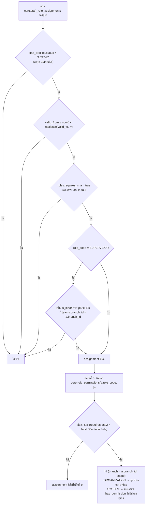
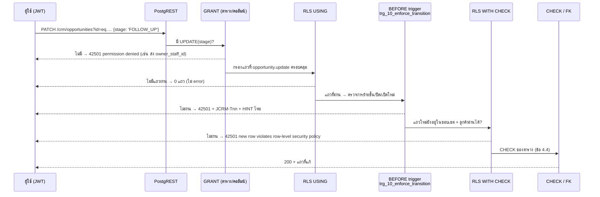

# Permission Matrix — JAUN CRM · Customer 360

> เอกสาร A45 #03 · **User Role & Permission Matrix** · ปรับ 16 ก.ย. 2569 ตาม `docs/00-brief/CANONICAL.md` **ฉบับ v2.2** (รวมข้อตัดสินข้อ 19)
> เอกสารนี้ตอบคำถามเดียว: **ใครทำอะไรได้ กับแถวข้อมูลใด ที่ระดับการยืนยันตัวตนใด และระบบบังคับเรื่องนี้ที่ชั้นไหน**
> ข้อความ SQL ของ helper · GRANT · policy · trigger · test อยู่ใน `docs/04-security/rls-spec.md` (อ้างเป็น "RS ข้อ …") ซึ่งเป็นแหล่งจริงของสิทธิ์และ RLS (CANONICAL ข้อ 19.2) · ชื่อตาราง/คอลัมน์ตาม migration 0001–0009
> ค่าที่ไม่มีใน CANONICAL เขียนว่า **รอยืนยัน** · ประเด็นที่ v2.2 ยังไม่ตัดสินอยู่ใน RS ข้อ 11 (H1–H6) และข้อ 10.2 ของเอกสารนี้ (M1–M3)

## สารบัญ

1. หลักการที่เอกสารนี้ยึด
2. ความหมายของขอบเขต (scope) และลำดับการตัดสิน
3. ตัวอย่างการตัดสินด้วยบุคคลตัวอย่าง (ข้อ 13.5)
4. ตารางสิทธิ์ข้อ 8.1 แยกตามบทบาท
5. แคตตาล็อกการกระทำรายหน้าจอ (19 หน้า · ข้อ 14.1)
6. การมอบบทบาท เชิญ ปิดใช้งาน (ข้อ 7.1–7.3) เป็นตารางตัดสินใจ
7. การส่งออกข้อมูลลูกค้า (ข้อ 8.2) เป็นตารางตัดสินใจ
8. สิทธิ์ของตารางย่อยและตารางประกอบ (ข้อ 8.3)
9. ผลที่คาดของการตรวจสิทธิ์ (ข้อ 13.13 + กรณีทดสอบ)
10. ประเด็นที่ยังต้องยืนยัน

---

## 1. หลักการที่เอกสารนี้ยึด

| # | หลักการ | ผลต่อการพัฒนา | อ้างอิง |
|---|---|---|---|
| P1 | **สิทธิ์ = permission × scope × สาขาของการมอบบทบาท** | การมี `lead.update` ไม่ได้แปลว่าแก้ lead ได้ทุกใบ แต่แก้ได้เฉพาะแถวที่ scope ของ assignment แถวนั้นครอบคลุม | CANONICAL ข้อ 8.0 |
| P2 | **ประเมินต่อแถวการมอบบทบาท แล้วรวมแบบ OR** · ห้ามยุบ scope ข้ามสาขา | คนที่ถือ `BRANCH_MANAGER`@JP1 และ `STAFF`@JP2 ได้ B ที่ JP1 และ O ที่ JP2 เท่านั้น | ข้อ 8.0 |
| P3 | **ปฏิเสธเป็นค่าเริ่มต้น** | ช่อง `–` = ไม่มีแถวใน `core.role_permissions` · ตารางหรือคอลัมน์ที่ไม่มี GRANT ถูกปฏิเสธที่ชั้นสิทธิ์ของ PostgreSQL ก่อนถึง RLS | ข้อ 9.4 |
| P4 | **ฐานข้อมูลคือด่านจริงด่านเดียว** | ผู้ใช้เรียก PostgREST/RPC ด้วย JWT ของตนได้โดยตรง · UI ซ่อนปุ่มเพื่อความสะดวก · Server Action ตรวจซ้ำเพื่อ UX เท่านั้น | ข้อ 9.1 · A29 |
| P5 | **MFA เป็นเงื่อนไขของ assignment ไม่ใช่ของหน้าจอ** | บทบาทที่ `requires_mfa = true` ที่ aal1 = เหมือนไม่มีบทบาทนั้น · สิทธิ์ 🔐 ที่ aal1 = ไม่มีสิทธิ์นั้น | ข้อ 8.0 · 9.2 |
| P6 | **ตรวจสดจากตารางทุกครั้ง** | ห้ามฝังบทบาท/สิทธิ์ลง JWT · ถอนบทบาทแล้วมีผลใน query ถัดไป · UI อ่านสิทธิ์ของตนผ่าน `api.get_my_access()` | ข้อ 8.0 · 9.6 |
| P7 | **SYSTEM_ADMIN ≠ BUSINESS_ADMIN** | SA ไม่มีสิทธิ์ข้อมูลลูกค้าใด ๆ และห้ามถือร่วมกับบทบาทธุรกิจ | ข้อ 7.1 · A17 · B11 |
| P8 | **สิทธิ์สร้างประเมินกับแถวแม่ · การเปลี่ยนสถานะตรวจใน trigger · การเปลี่ยน owner/ทีม/สาขาผ่าน `api.assign_owner` เท่านั้น** | `quotation.create` ดูที่ opportunity แม่ · ปิด/เปิดใหม่/ย้ายขั้นตรวจใน `app.enforce_row_transition` · คอลัมน์ owner ไม่อยู่ใน column grant ของ UPDATE (ยกเว้นรับคิว visit) | ข้อ 8.0 · 9.4.2 · 9.6 |

---

## 2. ความหมายของขอบเขต (scope) และลำดับการตัดสิน

### 2.1 ค่าของ `core.data_scope` (ประกาศตามลำดับ `OWN` < `TEAM` < `BRANCH` < `ORGANIZATION` < `SYSTEM`)

| ย่อ | scope | แถวที่มี `branch_id` (visit · interaction · lead · opportunity · quotation · task · transaction ref · note) | ลูกค้า (`crm.customers` ไม่มี `branch_id`) |
|---|---|---|---|
| `O` | `OWN` | `branch_id = a.branch_id` **และ** (`owner_staff_id` = ตน **หรือ** owner ว่างและ `created_by` = ตน) · ตารางที่ไม่มี owner (`transaction_refs` `customer_notes`) ใช้ `created_by` | `owner_staff_id` = ตน **และ** ลูกค้าเชื่อมกับ `a.branch_id` |
| `T` | `TEAM` | `branch_id = a.branch_id` **และ** `owner_staff_id` ∈ สมาชิกปัจจุบันของทีมที่ `teams.branch_id = a.branch_id` ซึ่งตนเป็น `is_leader` · **`lead.assign` `task.assign` รวมรายการ owner ว่างในสาขานั้น** | owner ∈ สมาชิกทีมดังกล่าว **และ** ลูกค้าเชื่อมกับ `a.branch_id` |
| `B` | `BRANCH` | `branch_id = a.branch_id` | ลูกค้าเชื่อมกับ `a.branch_id` |
| `G` | `ORGANIZATION` | `organization_id` = องค์กรของผู้ใช้ (ทุกสาขารวม `JPON`) | ทุกลูกค้าขององค์กร |
| `S` | `SYSTEM` | วัตถุระบบเท่านั้น (บัญชี · settings เชิงเทคนิค · integration) **ไม่ให้สิทธิ์แถวธุรกิจ** | – |

"ลูกค้าเชื่อมกับสาขา X" = มีแถว `crm.customer_branches(customer_id, branch_id = X)` **หรือ** `customers.first_branch_id = X` (ข้อ 8.0 · 6.6)

กติกาเสริมที่ใช้ทั้งระบบ:

| # | กติกา | ที่มา |
|---|---|---|
| S1 | scope สูงรวมเงื่อนไขของ scope ต่ำเสมอ (รวมแถว owner ว่างที่ตนสร้าง) | ข้อ 8.0 v2.2 |
| S2 | หัวหน้าทีมนับเป็นสมาชิกทีม → `T` ครอบคลุมรายการที่หัวหน้าเป็น owner เอง | ข้อ 7.1 |
| S3 | สมาชิกภาพทีมประเมินจาก **สมาชิกภาพปัจจุบันของ owner** ไม่ใช่ `team_id` บนรายการ (snapshot ตอนมอบงาน) | ข้อ 7.1 · A28 |
| S4 | `SUPERVISOR`@X **มีผล** เมื่อผู้ใช้เป็น `is_leader` ปัจจุบันของทีมที่ `teams.branch_id = X` อย่างน้อย 1 ทีม | ข้อ 7.1 |
| S5 | assignment ของบทบาทสาขาต้องมี `branch_id` · helper ห้ามตีความ NULL เป็นทุกสาขา | ข้อ 7.1 |
| S6 | บทบาทระดับองค์กร (`MARKETING` `EXECUTIVE` `BUSINESS_ADMIN`) มีเฉพาะ `G` · `G` ขยายเป็นทุกสาขาขององค์กร | ข้อ 7.1 · 9.3 |
| S7 | T ต้องจับคู่ (สาขา, สมาชิกทีม) ด้วย `app.team_scope_pairs` — หัวหน้าทีมสองสาขาไม่ได้สิทธิ์บนรายการที่สาขา B ของสมาชิกทีมสาขา A | ข้อ 9.3 |
| S8 | **สิทธิ์ `*.create` และ `transaction.link` ประเมินกับแถวแม่** และสาขาของแถวลูกต้องเท่าแม่ · ถ้าแม่คือลูกค้า สาขาของแถวลูกต้องเป็นสาขาที่ลูกค้าเชื่อมอยู่แล้ว (ยกเว้น G) — ผูกลูกค้าข้ามสาขาได้ทางเดียวคือ `api.link_customer_to_branch` | ข้อ 8.0 v2.2 · 6.6 |
| S9 | ลูกค้า `ANONYMIZED` และ `MERGED` ยังผ่าน RLS (UI กรองออก · MERGED redirect ไป survivor) · แต่แก้ไม่ได้ (`JCRM-T02`) | ข้อ 9.4 · 6.7 |
| S10 | การเทียบ `scope >= X` ต้องมี `scope <> 'SYSTEM'` เสมอ | ข้อ 4.8 |

### 2.2 assignment ที่ "นับ" (มีผล) ณ ขณะ query

- นาฬิกาตัดสินสิทธิ์คือ `now()` เสมอ ห้ามใช้ `app.clock()` (ข้อ 1.2) · aal อ่านจาก `coalesce(auth.jwt()->>'aal','aal1')`
- ผลรวมของทุก assignment คือเซตของคู่ `(สาขา, scope)` ต่อสิทธิ์ — แถวผ่านเมื่อ **คู่ใดคู่หนึ่ง** ผ่านตามข้อ 2.1 **โดยใช้สาขาของคู่นั้นเอง**

### 2.3 ด่านที่การกระทำหนึ่งต้องผ่าน (ลำดับจริงใน PostgreSQL)

การเปลี่ยน owner/ทีม/สาขา ไม่ผ่านเส้นทางนี้ · เรียก `api.assign_owner(p_entity_type, p_entity_id, p_to_staff_id, p_reason_code, p_note, p_to_branch_id)` ซึ่งตรวจตาม RS ข้อ 8.3

| ผลที่ผู้ใช้เห็น | ความหมาย | UI ควรทำ |
|---|---|---|
| `42501` "permission denied for table/column" | ไม่มี GRANT (เช่นขอ `value_raw` หรือส่ง `owner_staff_id`) | แสดง "ไม่มีสิทธิ์" · ถือเป็นบั๊กของ UI ถ้าเกิดจากปุ่มที่แสดงอยู่ |
| 0 แถว (SELECT/UPDATE) | RLS USING ไม่ผ่าน | SELECT: empty state · UPDATE: "ไม่พบรายการหรือไม่มีสิทธิ์แก้ไข" |
| `42501` + `JCRM-Tnn` | กติกาการเปลี่ยนแปลงข้อ 9.4.2 | แสดง HINT ภาษาไทย (RS ข้อ 7.4) |
| `42501` "new row violates row-level security policy" | แถวใหม่อยู่นอกขอบเขต | "รายการนี้อยู่นอกขอบเขตของคุณ" |
| `42501` จาก `api.*` | RPC ตรวจสิทธิ์ไม่ผ่าน | ข้อความตามรหัสใน `api-spec.md` / RS ข้อ 7.4 |

---

## 3. ตัวอย่างการตัดสินด้วยบุคคลตัวอย่าง (CANONICAL ข้อ 13.5)

แถวอ้างอิง (ข้อ 13.7): ลูกค้า `CUS-2026-000297` คุณสมชาย ใจดี (owner คุณขวัญ · เชื่อม JP1 เท่านั้น) · `OP-2026-002998` (JP1 · owner คุณขวัญ · `FOLLOW_UP` · มี `QT-2026-001702` ที่ส่งแล้ว) · `TK-2026-012508` (JP1 · owner คุณขวัญ · `is_next_action`) · `LD-2026-007460` (JP1 · owner คุณขวัญ · `CONTACTED`)
ทีม `JP1-SALES` = คุณนัท (หัวหน้า) · คุณขวัญ · คุณคิม · `JPON-ADMIN` = คุณฝน (ไม่มีหัวหน้า) · lead JP1 ที่ owner ว่าง 2 รายการ (ข้อ 13.5 · 13.12)

### 3.1 คุณขวัญ (`ST-0045` · STAFF@JP1 · aal1)

| คำถาม | คู่ (สาขา, scope) ที่ได้ | ตัดสิน | เหตุผล |
|---|---|:--:|---|
| อ่าน `CUS-2026-000297` | `customer.read` → (JP1, B) | ✓ | ลูกค้าเชื่อม JP1 · STAFF ไม่ `requires_mfa` |
| แก้ `CUS-2026-000297` (ชื่อ · ชื่อเล่น · จังหวัด · ประเภท) | `customer.update` → (JP1, O) | ✓ | owner = คุณขวัญ และเชื่อม JP1 |
| แก้ `OP-2026-002998` | `opportunity.update` → (JP1, O) | ✓ | owner = ตน |
| ลาก `OP-2026-002998` จาก รอตัดสินใจ → เสนอราคา | `opportunity.update` | ✗ `JCRM-T30` | ข้อ 4.4: `FOLLOW_UP → QUOTATION` เกิดอัตโนมัติเมื่อส่งใบใหม่เท่านั้น |
| ลาก `OP-2026-002998` → สนใจ | – | ✗ `JCRM-T30` | ห้ามย้อนเป็น INTERESTED (D48) |
| ปิด `OP-2026-002998` เป็น WON | `opportunity.close` → (JP1, O) | ✓ | |
| เปิดรายการที่ WON แล้วกลับ | `opportunity.reopen` → ไม่มี | ✗ `JCRM-T32` | ST ไม่มี reopen |
| มอบ `OP-2026-002998` ให้คุณคิม | `opportunity.assign` → ไม่มี | ✗ `JCRM-T10` (`api.assign_owner`) | |
| เปิดเบอร์คุณสมชาย | `customer.pii.reveal` → (JP1, B) | ✓ | บันทึก `CONTACT_REVEALED` · เกิน 30 ครั้ง/ชม. → ปฏิเสธ + แจ้ง `REVEAL_LIMIT_EXCEEDED` (ข้อ 6.4) |
| แก้ `LD-2026-007512` (owner คุณคิม) | `lead.update` → (JP1, O) | ✗ 0 แถว | |
| อ่าน task ของคุณคิม | `task.read` → (JP1, O) | ✗ 0 แถว | task ไม่มี read-through |
| แก้ `due_at` ของ `TK-2026-012508` | `task.update` O | ✗ `JCRM-T14` | task next action แก้ที่ opportunity (ข้อ 19.2 ข้อ 3) |

### 3.2 คุณคิม (`ST-0046` · STAFF@JP1 · aal1) — คนเดียวกันบทบาทเดียวกันแต่ไม่ใช่ owner

อ่านลูกค้า/opportunity/lead ของคุณขวัญได้ (B) · แก้ไม่ได้ (O) · อ่าน `TK-2026-012508` ไม่ได้ · เปิดเบอร์คุณสมชายได้ (B) — ตรงแถวที่ 2 ของข้อ 13.13

### 3.3 คุณนัท (`ST-0030` · SUPERVISOR@JP1 · หัวหน้า `JP1-SALES`) — aal2 เทียบ aal1

| คำถาม | aal2 | aal1 | เหตุผล |
|---|:--:|:--:|---|
| assignment SUPERVISOR@JP1 นับหรือไม่ | ✓ | ✗ | `requires_mfa` |
| อ่าน · แก้ `CUS-2026-000297` | ✓ B · ✓ T | ✗ | owner คุณขวัญ ∈ ทีม |
| มอบ `OP-2026-002998` จากคุณขวัญให้คุณคิม | ✓ | ✗ | `opportunity.assign` T ทั้งแถวเดิมและแถวใหม่ · owner ใหม่มี assignment JP1 |
| มอบ `OP-2026-002998` ให้คุณเจ | ✗ `JCRM-T11` | ✗ | คุณเจไม่อยู่ใน JP1-SALES |
| **มอบ lead JP1 ที่ owner ว่างให้คุณคิม** | **✓** | ✗ | `lead.assign` T รวม owner ว่างในสาขาที่เป็นหัวหน้าทีม (ข้อ 8.0 v2.2 · Q28) — รับเรื่อง `LEAD_UNASSIGNED` ได้เอง |
| แก้รายละเอียด lead ที่ owner ว่างนั้น (ก่อนมอบ) | ✗ 0 แถว | ✗ | `lead.update` T ไม่รวม owner ว่าง |
| `api.get_kpis` | ทีม JP1-SALES (Leads 296) | `42501` | `dashboard.view` T · ผูกด้วย owner (ข้อ 12.4) |
| รวมลูกค้า (`customer.merge` 🔐) ที่ owner ทั้งสองอยู่ในทีม | ✓ | ✗ | |
| ยกเลิก visit ของคุณขวัญหลัง 15 นาที | ✓ | ✗ | scope ≥ T (ข้อ 4.1) |

> ถ้าคุณนัทพ้นจากหัวหน้าทีม (`team_members.valid_to` ผ่านแล้ว) assignment SUPERVISOR@JP1 ไม่มีผลทันที (S4)

### 3.4 คนเดียวถือหลายบทบาทต่างสาขา — `BRANCH_MANAGER`@JP1 + `STAFF`@JP2 (ไม่อยู่ใน seed · RS fixture P13)

| คำถาม | คู่ที่ได้ (aal2) | aal2 | aal1 |
|---|---|:--:|:--:|
| อ่าน lead ทุกใบของ JP1 | (JP1, B) | ✓ | ✗ (BM ถูกข้าม) |
| แก้ lead ของคุณขวัญที่ JP1 | `lead.update` (JP1, B) | ✓ | ✗ |
| อ่าน lead ของคุณบอสที่ JP2 | `lead.read` (JP2, B) | ✓ | ✓ |
| **แก้ lead ของคุณบอสที่ JP2** | `lead.update` (JP1, B) + (JP2, O) | **✗ 0 แถว** | ✗ 0 แถว |
| อ่าน `CUS-2026-000297` (เชื่อม JP1 เท่านั้น) | `customer.read` (JP1, B) | ✓ | ✗ |
| สร้าง lead หรือโน้ตที่ **JP2** ให้ `CUS-2026-000297` | `lead.create` (JP2, B) แต่ลูกค้าไม่เชื่อม JP2 | **✗ `42501`** (S8) | ✗ |
| สร้าง lead ที่ JP1 ให้ `CUS-2026-000297` | (JP1, B) และลูกค้าเชื่อม JP1 | ✓ | ✗ |
| `api.request_export` | `customer.export` (JP1, B) 🔐 | ✓ ขอบเขต JP1 | ✗ |

### 3.5 คุณปุ๊ก (`ST-0010` · OPERATIONS@JP1 · JP2 · JP3 · JP4)

- "Multi-Branch" = assignment 4 แถวคนละสาขา · ได้ B ของสิทธิ์อ่านทั้งหมดในข้อ 4.4 · **ไม่มีสิทธิ์เขียนและไม่มี `customer.pii.reveal`**
- ไม่มี assignment ที่ `JPON` → รายการที่เชื่อมเฉพาะ JPON มองไม่เห็น · `api.get_kpis` ทุกสาขา = ข้อ 13.1 · OPERATIONS `requires_mfa` → aal1 เห็น 0 แถว

### 3.6 จ๋าอั๋น (`ST-0001` · EXECUTIVE) และคุณแพร (`ST-0002` · BUSINESS_ADMIN)

| คำถาม | EX aal2 | EX aal1 | BA aal2 | BA aal1 |
|---|:--:|:--:|:--:|:--:|
| อ่านลูกค้า/lead/opportunity ทุกสาขา | ✓ G | ✗ | ✓ G | ✗ |
| แก้ `CUS-2026-000297` · `OP-2026-002998` | ✗ | ✗ | ✓ G | ✗ |
| สร้าง opportunity · ใบเสนอราคา · แปลง lead | ✗ | ✗ | **✗** (ไม่มี `opportunity.create` `quotation.*` เขียน) | ✗ |
| แก้โน้ตของพนักงานภายใน 24 ชม. | ✗ | ✗ | ✓ G (ข้อ 6.9 v2.2) | ✗ |
| เปิดเบอร์ | ✓ G🔐 | ✗ | ✓ G🔐 | ✗ |
| อนุมัติ `RG-2026-0003` | ✓ `role.decide` 🔐 | ✗ | ✗ | ✗ |
| อนุมัติ `EX-2026-000031` (MARKETING ยื่น) | ✗ | ✗ | ✓ `export.approve` 🔐 | ✗ |
| ย้าย lead จาก JPON ไป JP1 พร้อม owner ที่มี assignment JP1 | ✗ | ✗ | ✓ `api.assign_owner` (G ทั้งสองสาขา) | ✗ |

### 3.7 คุณมายด์ (`ST-0011` · MARKETING) — ตัวเลขรวมได้ ลูกค้ารายคนไม่ได้

- ไม่มี `customer.read` → `crm.customers` 0 แถว · **ช่องค้นหาแถบบนซ่อน** (ข้อ 14.3) · หน้า 03 05 ไม่อยู่ในเมนู
- `dashboard.view` `report.view` `report.export` G → ตัวเลข = ข้อ 13.1 · widget "กิจกรรมล่าสุด" ซ่อน · drill-down ถึงทีม
- `customer.export` G🔐 ต้องให้ BUSINESS_ADMIN อนุมัติทุกครั้ง · `tag.manage` · `campaign.manage` → หน้า master-data เฉพาะแท็บ Tag และแคมเปญ

### 3.8 คุณฝน (`ST-0050` · STAFF@JPON · aal1) — บทบาทปกติแต่สาขาไม่มีข้อมูล

ทุกหน้าที่เป็นรายการแสดง empty state · `api.get_kpis`: จำนวนเป็น 0 · KPI ที่ไม่ผูกพนักงาน (เช่น `UNIQUE_CUSTOMERS`) และอัตรา 0/0 เป็น `NULL` แสดง `–` (ข้อ 13.13 v2.2 · 9.4.1)
ช่องทางเดียวที่เห็นลูกค้าสาขาอื่น: `api.find_customer_candidates` (การ์ดย่อ) → `api.link_customer_to_branch` ผ่าน visit ของ JPON → ลูกค้าเชื่อม JPON → อ่านได้พร้อมประวัติทุกสาขาแบบอ่านอย่างเดียว

### 3.9 คุณต้น (`ST-0003` · SYSTEM_ADMIN) — สายแยก

| คำถาม | ตัดสิน | เหตุผล |
|---|:--:|---|
| อ่าน/แก้/เปิดเบอร์ลูกค้าใด ๆ · ค้นหาลูกค้า | ✗ · ช่องค้นหาซ่อน | ไม่มีสิทธิ์ `customer.*` (CI-17) · ข้อ 14.3 |
| `api.get_kpis` | ✗ `42501` | ไม่มี `dashboard.view` |
| ดูรายชื่อบัญชี · ยื่นคำขอบทบาทสูง | ✓ S | `user.read` · `role.request` |
| มอบ SYSTEM_ADMIN ให้คุณโอ๊ตตรง · อนุมัติคำขอของตน | ✗ | ต้องใช้ `RG-2026-0003` และ EXECUTIVE อนุมัติ |
| ตั้งค่าเชิงเทคนิค · integration | ✓ 🔐 | `settings.system` · `integration.manage` |
| ดู security log | ✓ S | เฉพาะ `login_events` + audit ที่ action ∈ `ROLE_*` `PERMISSION_CHANGED` `STAFF_*` `MFA_*` `SETTINGS_UPDATED` `INTEGRATION_UPDATED` (ข้อ 9.5) |

---

## 4. ตารางสิทธิ์ข้อ 8.1 แยกตามบทบาท

ข้อ 4.1–4.8 คือข้อ 8.1 ฉบับจัดกลุ่มต่อบทบาท (ค่าเดียวกันทุกช่อง) · **🔐** = แถว `core.role_permissions.requires_aal2 = true` · ช่องที่ไม่ได้ระบุ = ไม่มีแถว
แหล่งจริงของค่าคือ `core.role_permissions` ซึ่งแก้ได้ผ่าน migration เท่านั้น (ข้อ 7.2) และถูกตรวจทุกช่องใน `supabase/tests/01_schema_stage1.sql` (228 แถว · `requires_aal2` 23 แถว) · CI-17 ของ `rls-spec.md` ตรวจกติกา SYSTEM_ADMIN และ scope ของบทบาทองค์กร/สาขา

**`requires_aal2` ต่อแถว:** สิทธิ์ที่มี 🔐 ในชื่อคอลัมน์ของข้อ 8.1 (`customer.merge` `customer.export` `customer.anonymize` `dsr.manage` `master_data.manage` `user.disable` `role.assign` `role.decide` `export.approve` `settings.business` `settings.system` `integration.manage`) = true ทุกบทบาทที่ถือ · `customer.pii.reveal` = true เฉพาะ EXECUTIVE และ BUSINESS_ADMIN (ช่อง `G🔐`) · แถวอื่น false

### 4.1 STAFF (`ST` · rank 10 · ไม่ `requires_mfa` · ใช้ได้ที่ aal1)

| กลุ่ม | สิทธิ์ : scope | คำอธิบาย |
|---|---|---|
| ลูกค้า | `customer.read`:B · `customer.create`:B · `customer.update`:O · `customer.pii.reveal`:B · `customer.consent.manage`:B | เห็นลูกค้าทุกรายที่เชื่อมสาขาตน · แก้เฉพาะรายที่ตนดูแล · เปิดเบอร์ลูกค้าในสาขาได้ (บันทึกทุกครั้ง) · บันทึกความยินยอมได้ |
| โน้ต | `note.create`:B · `note.update`:O | เพิ่มโน้ตให้ลูกค้าในสาขา · แก้ได้เฉพาะโน้ตของตนภายใน 24 ชม. |
| visit | `visit.read`:B · `visit.create`:B · `visit.update`:O | เห็นคิวทั้งสาขา · รับลูกค้า · แก้/ปิด visit ของตน · **รับคิว** WAITING ที่ยังไม่มีผู้รับได้ (ข้อ 4.1) |
| การติดต่อ | `interaction.read`:B · `interaction.create`:B · `interaction.update`:O | แก้บันทึกของตนภายใน 24 ชม. |
| lead | `lead.read`:B · `lead.create`:B · `lead.update`:O | ปิด LOST ของตนได้ · มอบ/เปิดใหม่ไม่ได้ |
| โอกาสขาย | `opportunity.read`:B · `opportunity.create`:B · `opportunity.update`:O · `opportunity.close`:O | ปิด WON/LOST ของตน · มอบ/เปิดใหม่ไม่ได้ |
| ใบเสนอราคา | `quotation.read`:B · `quotation.create`:O · `quotation.update`:O | สร้าง/ส่งได้เฉพาะของ opportunity ที่ตนดูแล |
| งาน | `task.read`:O · `task.create`:O · `task.update`:O | เห็นเฉพาะงานของตน (ไม่มี read-through) |
| ธุรกรรม | `transaction.read`:B · `transaction.link`:O | ผูกเลขธุรกรรมให้รายการที่ตนดูแล |
| ภาพรวม/คุณภาพ | `dashboard.view`:O · `data_quality.view`:O · `data_quality.resolve`:O | resolve ระดับ O ได้เฉพาะ `MISSING_PHONE` `INVALID_PHONE` `INCOMPLETE_CUSTOMER` ของลูกค้าที่ตนดูแล |
| PDPA | `dsr.create`:B | รับคำขอเจ้าของข้อมูลที่หน้าร้าน |

### 4.2 SUPERVISOR (`SV` · rank 20 · `requires_mfa` · มีผลเมื่อเป็นหัวหน้าทีมในสาขานั้น)

| กลุ่ม | สิทธิ์ : scope | คำอธิบาย |
|---|---|---|
| ลูกค้า | `customer.read`:B · `customer.create`:B · `customer.update`:T · `customer.assign`:T · `customer.merge`:T🔐 · `customer.pii.reveal`:B · `customer.consent.manage`:B | แก้/เปลี่ยนผู้ดูแลลูกค้าที่สมาชิกทีมดูแล · รวมลูกค้าซ้ำที่ทั้งสองรายอยู่ในขอบเขตทีม |
| โน้ต | `note.create`:B · `note.update`:O | |
| visit | `visit.read`:B · `visit.create`:B · `visit.update`:T | ยกเลิก visit ของทีมหลัง 15 นาทีได้ · เปลี่ยนผู้รับภายในทีม |
| การติดต่อ | `interaction.read`:B · `interaction.create`:B · `interaction.update`:T | |
| lead | `lead.read`:B · `lead.create`:B · `lead.update`:T · `lead.assign`:T | กระจาย lead ภายในทีม · **มอบ lead ที่ owner ว่างในสาขาที่ตนเป็นหัวหน้าทีมได้** (T ของ `lead.assign` รวม owner ว่าง · ข้อ 8.0 · Q28) ผ่าน `api.assign_owner` · แก้ lead owner ว่างที่ผู้อื่นสร้างไม่ได้ (`lead.update` T ไม่รวม) |
| โอกาสขาย | `opportunity.read`:B · `opportunity.create`:B · `opportunity.update`:T · `opportunity.assign`:T · `opportunity.close`:T | |
| ใบเสนอราคา | `quotation.read`:B · `quotation.create`:T · `quotation.update`:T | |
| งาน | `task.read`:T · `task.create`:T · `task.update`:T · `task.assign`:T | มอบ task owner ว่างในสาขาที่เป็นหัวหน้าทีมได้ (ข้อ 8.0) แต่ `task.read` T ไม่เห็น task owner ว่าง (rls-spec H4) |
| ธุรกรรม | `transaction.read`:B · `transaction.link`:T | |
| รายงาน | `dashboard.view`:T · `report.view`:T · `report.staff_performance`:T · `report.export`:T · `data_quality.view`:T · `data_quality.resolve`:T | ตัวเลขของทีม |
| อื่น | `dsr.create`:B · `user.read`:T | เห็นรายชื่อสมาชิกทีมตน |

### 4.3 BRANCH_MANAGER (`BM` · rank 30 · `requires_mfa`)

| กลุ่ม | สิทธิ์ : scope | คำอธิบาย |
|---|---|---|
| ลูกค้า | `customer.read`:B · `customer.create`:B · `customer.update`:B · `customer.assign`:B · `customer.merge`:B🔐 · `customer.pii.reveal`:B · `customer.export`:B🔐 · `customer.consent.manage`:B | จัดการลูกค้าทั้งสาขา · ส่งออก ≤ 500 แถว ≤ 3 ครั้ง/วัน ไม่ต้องอนุมัติ (ข้อ 8.2) |
| โน้ต | `note.create`:B · `note.update`:O | แก้ได้เฉพาะโน้ตของตน (ไม่ใช่ทั้งสาขา) |
| visit · การติดต่อ | `visit.read`:B · `visit.create`:B · `visit.update`:B · `interaction.read`:B · `interaction.create`:B · `interaction.update`:B | |
| lead | `lead.read`:B · `lead.create`:B · `lead.update`:B · `lead.assign`:B · `lead.reopen`:B | |
| โอกาสขาย | `opportunity.read`:B · `opportunity.create`:B · `opportunity.update`:B · `opportunity.assign`:B · `opportunity.close`:B · `opportunity.reopen`:B | |
| ใบเสนอราคา · งาน · ธุรกรรม | `quotation.read`:B · `quotation.create`:B · `quotation.update`:B · `task.read`:B · `task.create`:B · `task.update`:B · `task.assign`:B · `transaction.read`:B · `transaction.link`:B | |
| รายงาน | `campaign.read`:B · `dashboard.view`:B · `report.view`:B · `report.staff_performance`:B · `report.export`:B · `data_quality.view`:B · `data_quality.resolve`:B | |
| คนและทีม | `team.manage`:B · `user.read`:B · `user.invite`:B · `user.update`:B · `user.disable`:B🔐 · `role.assign`:B🔐 · `dsr.create`:B | มอบได้เฉพาะ STAFF/SUPERVISOR ในสาขาตน (ข้อ 6.1) · ย้ายรายการข้ามสาขาไม่ได้ถ้าไม่มี assign ที่ปลายทาง |

### 4.4 OPERATIONS (`OP` · rank 40 · `requires_mfa` · หลาย assignment คนละสาขา)

| กลุ่ม | สิทธิ์ : scope | คำอธิบาย |
|---|---|---|
| อ่านข้อมูลธุรกิจ | `customer.read`:B · `visit.read`:B · `interaction.read`:B · `lead.read`:B · `opportunity.read`:B · `quotation.read`:B · `task.read`:B · `transaction.read`:B · `campaign.read`:B | อ่านอย่างเดียวทุกสาขาที่มี assignment · **ไม่มี** `customer.pii.reveal` จึงเห็นเฉพาะค่าปิดบัง |
| รายงาน | `dashboard.view`:B · `report.view`:B · `report.staff_performance`:B · `report.export`:B · `data_quality.view`:B | ส่งออกได้เฉพาะรายงานตัวเลขรวม (ไม่มี `customer.export`) |
| คน | `user.read`:B | |

### 4.5 MARKETING (`MK` · rank 30 · `requires_mfa` · ระดับองค์กร)

| กลุ่ม | สิทธิ์ : scope | คำอธิบาย |
|---|---|---|
| ข้อมูลตลาด | `tag.manage`:G · `campaign.read`:G · `campaign.manage`:G | หน้า master-data เฉพาะแท็บ Tag · แคมเปญ |
| ตัวเลขรวม | `dashboard.view`:G · `report.view`:G · `report.export`:G | ไม่มี `report.staff_performance` → แท็บพนักงานซ่อน · drill-down ถึงทีม |
| ส่งออกลูกค้า | `customer.export`:G🔐 | ต้องให้ BUSINESS_ADMIN อนุมัติทุกครั้ง · คอลัมน์ตามความยินยอม · **ไม่มี `customer.read`** |

### 4.6 EXECUTIVE (`EX` · rank 60 · `requires_mfa` · ระดับองค์กร)

| กลุ่ม | สิทธิ์ : scope | คำอธิบาย |
|---|---|---|
| อ่านข้อมูลธุรกิจ | `customer.read`:G · `visit.read`:G · `interaction.read`:G · `lead.read`:G · `opportunity.read`:G · `quotation.read`:G · `task.read`:G · `transaction.read`:G · `campaign.read`:G | อ่านทั้งองค์กร **ไม่มีสิทธิ์เขียนข้อมูลธุรกิจ** |
| PII | `customer.pii.reveal`:G🔐 · `customer.export`:G🔐 | ส่งออก ≤ 5,000 แถว ≤ 5 ครั้ง/วัน ผู้อนุมัติ BUSINESS_ADMIN **[รอยืนยัน Q23]** |
| รายงาน | `dashboard.view`:G · `report.view`:G · `report.staff_performance`:G · `report.export`:G · `data_quality.view`:G | |
| ควบคุม | `user.read`:G · `role.decide`:G🔐 · `export.approve`:G🔐 · `audit.read`:G · `security_log.read`:G | เปิดหน้า users เพื่อดูและอนุมัติคำขอบทบาทเท่านั้น · อนุมัติคำขอส่งออกของ BUSINESS_ADMIN |

### 4.7 BUSINESS_ADMIN (`BA` · rank 50 · `requires_mfa` · ระดับองค์กร)

| กลุ่ม | สิทธิ์ : scope | คำอธิบาย |
|---|---|---|
| ลูกค้า | `customer.read`:G · `customer.create`:G · `customer.update`:G · `customer.assign`:G · `customer.merge`:G🔐 · `customer.pii.reveal`:G🔐 · `customer.export`:G🔐 · `customer.consent.manage`:G · `customer.anonymize`:G🔐 | Quick Capture ได้เฉพาะ "เพิ่มลูกค้า" (ไม่มี `visit.create`) |
| โน้ต | `note.create`:G · `note.update`:G | |
| visit · การติดต่อ | `visit.read`:G · `visit.update`:G · `interaction.read`:G · `interaction.create`:G | **ไม่มี** `visit.create` และ `interaction.update` |
| lead · โอกาสขาย | `lead.read`:G · `lead.create`:G · `lead.update`:G · `lead.assign`:G · `lead.reopen`:G · `opportunity.read`:G · `opportunity.update`:G · `opportunity.assign`:G · `opportunity.close`:G · `opportunity.reopen`:G | **ไม่มี** `opportunity.create` → แปลง lead ไม่ได้ |
| ใบเสนอราคา · งาน · ธุรกรรม | `quotation.read`:G · `task.read`:G · `task.create`:G · `task.update`:G · `task.assign`:G · `transaction.read`:G · `transaction.link`:G | **ไม่มี** `quotation.create` `quotation.update` |
| ตลาด · รายงาน | `tag.manage`:G · `campaign.read`:G · `campaign.manage`:G · `dashboard.view`:G · `report.view`:G · `report.staff_performance`:G · `report.export`:G · `data_quality.view`:G · `data_quality.resolve`:G | |
| PDPA | `dsr.create`:G · `dsr.manage`:G🔐 | |
| ผู้ดูแลธุรกิจ | `master_data.manage`:G🔐 · `team.manage`:G · `user.read`:G · `user.invite`:G · `user.update`:G · `user.disable`:G🔐 · `role.assign`:G🔐 · `export.approve`:G🔐 · `audit.read`:G · `security_log.read`:G · `settings.business`:G🔐 | มอบ STAFF–OPERATIONS ทุกสาขา · อนุมัติส่งออกของ MARKETING และ EXECUTIVE |

### 4.8 SYSTEM_ADMIN (`SA` · rank NULL สายแยก · `requires_mfa`)

| กลุ่ม | สิทธิ์ : scope | คำอธิบาย |
|---|---|---|
| บัญชี | `user.read`:S · `user.invite`:S¹ · `user.update`:S¹ · `user.disable`:S¹🔐 · `role.request`:S | ¹ เชิญได้เฉพาะบัญชีสาย SYSTEM_ADMIN (ผ่านคำขอ) · แก้/ปิดใช้งานได้เฉพาะบัญชีที่ไม่มีบทบาทธุรกิจ |
| ระบบ | `security_log.read`:S · `settings.system`:S🔐 · `integration.manage`:S🔐 | integration ที่ส่งข้อมูลออกนอกระบบต้องให้ EXECUTIVE อนุมัติ |
| ข้อมูลลูกค้า | – | **ไม่มีเลย** · test ยืนยันว่าไม่มี `customer.*` `visit.*` `lead.*` `opportunity.*` |

### 4.9 สรุปสิทธิ์เขียนที่มัก "คาดผิด"

| คาดว่า | จริง (ข้อ 8.1) |
|---|---|
| ผู้บริหารแก้อะไรก็ได้ | EXECUTIVE ไม่มีสิทธิ์เขียนข้อมูลธุรกิจเลย |
| BUSINESS_ADMIN ทำได้ทุกอย่าง | BA ไม่มี `visit.create` `interaction.update` `opportunity.create` `quotation.create` `quotation.update` |
| OPERATIONS ดูแลสาขา = แก้ได้ | OP อ่านอย่างเดียว และไม่เห็นค่าเต็มของช่องทางติดต่อ |
| MARKETING เห็นรายชื่อลูกค้า | ไม่มี `customer.read` · ได้รายชื่อผ่านคำขอส่งออกที่ BA อนุมัติเท่านั้น |
| SUPERVISOR มอบ lead ที่ไม่มี owner ไม่ได้ | ได้ในสาขาที่ตนเป็นหัวหน้าทีม (ข้อ 8.0 v2.2 · Q28) |
| แก้ `owner_staff_id` ในตารางได้ถ้ามีสิทธิ์ assign | ไม่ได้ทุกบทบาท · เปลี่ยน owner/ทีม/สาขาผ่าน `api.assign_owner` เท่านั้น (ข้อ 9.4.2) · ยกเว้นรับคิว visit |
| ผู้จัดการแก้โน้ตของลูกน้องได้ | `note.update` ของ BM = O |
| ผู้ที่อ่านลูกค้าได้เห็นงานของลูกค้านั้น | `tasks` ไม่มี read-through · Customer 360 แสดง "นัดติดตามถัดไป" จาก next action ของ lead/opportunity แทน |

---

## 5. แคตตาล็อกการกระทำรายหน้าจอ (CANONICAL ข้อ 14.1)

### 5.0 กติกาการแสดงปุ่ม (ใช้ทุกหน้า)

| สถานะของผู้ใช้ต่อการกระทำ | UI ทำอย่างไร | ข้อความเหตุผล (tooltip/ใต้ปุ่ม) |
|---|---|---|
| ไม่มีสิทธิ์นั้นใน scope ใดเลย | **ซ่อน** (`H`) | – |
| มีสิทธิ์ แต่แถวนี้อยู่นอก scope | **แสดงแบบปิด** (`D`) | `D-OWN` "แก้ได้เฉพาะรายการที่คุณดูแล" · `D-TEAM` "แก้ได้เฉพาะรายการของทีมคุณ" · `D-BRANCH` "รายการนี้อยู่นอกสาขาที่คุณดูแล" |
| สิทธิ์ติด 🔐 และเซสชันยังเป็น aal1 | **แสดงแบบปิด** + ลิงก์ยืนยัน MFA | `D-MFA` "ต้องยืนยันตัวตนสองขั้น (MFA) ในเซสชันนี้ก่อน" |
| มีสิทธิ์ แต่สถานะ/เวลาไม่อนุญาต | **แสดงแบบปิด** | `D-24H` "แก้ไขได้ภายใน 24 ชม. หลังบันทึก" · `D-STATE` "สถานะปัจจุบันไม่อนุญาตให้ทำรายการนี้" · `D-SELF` "ทำรายการกับบัญชีของตนเองไม่ได้" |
| เปิดหน้าที่บทบาทเข้าไม่ได้ | การ์ด "ไม่มีสิทธิ์เข้าหน้านี้" + บทบาทที่เข้าได้ (ข้อ 14.1) | – |

- ชุดสิทธิ์ที่ UI ใช้ตัดสินมาจาก **`api.get_my_access()`** (ข้อ 9.6): โปรไฟล์ของตน · `(permission_code, scope, branch_id, requires_aal2)` · `requires_mfa` · aal ปัจจุบัน → UI คำนวณ `H`/`D-*` ด้วยกติกาข้อ 2.1 (สำเนาเพื่อ UX · ผลจริงจากฐานข้อมูลเสมอ · UI ต้องรับมือ 0 แถว/`42501` แม้ปุ่มแสดงอยู่)
- ผู้ใช้บทบาท `requires_mfa` ที่ยัง aal1 ถูกบังคับไปยืนยัน MFA หลังล็อกอิน (ข้อ 9.2) จึงแทบไม่เห็น `D-MFA` · STAFF ไม่มีสิทธิ์ 🔐 ใด
- คอลัมน์ "การทำงานจริง": `SELECT/INSERT/UPDATE/DELETE schema.table` = PostgREST ด้วย JWT ผู้ใช้ · `api.*` = RPC ข้อ 9.6 · `EF:ชื่อ` = Edge Function ข้อ 9.8 · ทุกปุ่ม "มอบหมาย/เปลี่ยนผู้รับผิดชอบ/ย้ายสาขา" = `api.assign_owner` (ต้องเลือกเหตุผลจาก `ref.ownership_change_reasons`)

### 5.1 หน้า 01 `login` — เข้าสู่ระบบ (ก่อนเข้าสู่ระบบ)

| # | ปุ่ม/การกระทำ | สิทธิ์ | การทำงานจริง | เมื่อใช้ไม่ได้ |
|---|---|---|---|---|
| 01.1 | "เข้าสู่ระบบ" อีเมล + รหัสผ่าน | – | Supabase Auth password grant ผ่าน Server Action (cookie HttpOnly · 19.4 ข้อ 4) | ข้อความผิดพลาดเดียวกันทุกกรณี (ข้อ 9.2) |
| 01.2 | เข้าสู่ระบบด้วย `ST-NNNN` | – | `EF:staff-code-login` → `api.svc_resolve_staff_code` (ไม่คืนอีเมล) | เหมือน 01.1 |
| 01.3 | Login with Google / Microsoft | – | Supabase SSO · ตรวจ `hd` · บัญชี `ACTIVE` เท่านั้น | `H` เมื่อ `allowed_sso_domains = []` **[รอยืนยัน Q5]** |
| 01.4 | "ลืมรหัสผ่าน" | – | `EF:password-reset` (ลิงก์ 1 ชม. · บัญชี ACTIVE) | ตอบข้อความเดียวกันเสมอ |
| 01.5 | "จดจำฉันไว้" | – | จำเฉพาะค่าที่กรอก · ไม่ยืดอายุ session | `H` บนอุปกรณ์ counter · ไม่ติ๊กไว้ก่อน |
| 01.6 | ยืนยัน/ลงทะเบียน TOTP | – | MFA enroll/challenge ผ่าน Server Action → JWT `aal2` | บังคับเมื่อมีบทบาท `requires_mfa` |
| 01.7 | เปิดใช้งานบัญชีครั้งแรก | ผู้ใช้ INVITED ของตนเอง | `api.activate_self()` | คำเชิญหมดอายุ (24 ชม.) → เชิญใหม่ (19.3 ข้อ 6) |

### 5.2 หน้า 02 `dashboard` — หน้าหลัก

| # | ปุ่ม/การกระทำ | สิทธิ์ (scope) | การทำงานจริง | เมื่อไม่มีสิทธิ์ |
|---|---|---|---|---|
| 02.1 | การ์ด KPI · Funnel · แหล่งที่มา · เหตุผลที่ไม่สำเร็จ | `dashboard.view` (O/T/B/G) | `api.get_kpis(p_preset, p_start, p_end, p_branch_ids, p_group_by)` · T/O ผูกด้วย owner เท่านั้น · KPI ไม่ผูกพนักงานคืน NULL (ข้อ 9.4.1 · 12.4) | หน้าไม่อยู่ในเมนู (SYSTEM_ADMIN → `18-settings`) |
| 02.2 | ตัวเลือกสาขา | สาขาจาก `dashboard.view` | แสดงเมื่อมี > 1 สาขา (ข้อ 14.3) | `H` |
| 02.3 | ตัวเลือกช่วงเวลา | `dashboard.view` | `p_preset` ข้อ 12.0 · อยู่ในหัวหน้า 02 09 12 เท่านั้น (ข้อ 14.3) | preset อื่นแสดงแบบปิดใน prototype |
| 02.4 | ผลงานรายพนักงาน (BM · SV) | `report.staff_performance` (T/B/G) | `api.get_kpis(…, p_group_by => 'STAFF')` | `H` |
| 02.5 | widget "กิจกรรมล่าสุด" | `customer.read` + `interaction.read` | SELECT `crm.interactions` เรียง `occurred_at DESC` (RLS) · BM เห็นเฉพาะแถวของสาขาตน (ข้อ 13.5) | `H` (MARKETING) |
| 02.6 | แถวคุณภาพข้อมูล (BUSINESS_ADMIN) | `data_quality.view` G | `api.get_kpis` codes `CAPTURE_RATE` `OUTCOME_COMPLETION` `FOLLOWUP_COMPLETION` `DUPLICATE_RATE` `MISSING_REQUIRED_RATE` | `H` |
| 02.7 | drill-down ถึงรายชื่อลูกค้า | `customer.read` · ระดับพนักงาน `report.staff_performance` | เปิดหน้า 03 พร้อมตัวกรอง (RLS) | ตัวเลขไม่เป็นลิงก์ · MARKETING หยุดที่ทีม |
| 02.8 | รายการงานวันนี้ · ลูกค้าล่าสุดของฉัน (STAFF) | `task.read` · `customer.read` | SELECT `crm.tasks` (ข้อ 4.7) · SELECT `crm.customers` owner = ตน เรียง `last_activity_at DESC` (ข้อ 13.5) | `H` |
| 02.9 | "+ รับลูกค้า" (แท็บเล็ต) | `visit.create` | ไปหน้า 07 | `H` (BA · OP · EX · MK) |
| 02.10 | ค้นหาแถบบน (ทุกหน้า) | ผู้ใช้ ACTIVE | `api.search_customers(p_term)` · คืนเฉพาะที่อ่านได้ · contact = `value_masked` | **`H` สำหรับ MARKETING และ SYSTEM_ADMIN** (ข้อ 14.3) |
| 02.11 | กระดิ่ง · อ่านแล้ว (ทุกหน้า) | ผู้รับ = ตน | SELECT `crm.notifications` · UPDATE `crm.notifications(read_at)` | – |

### 5.3 หน้า 03 `customers` — ลูกค้า

| # | ปุ่ม/การกระทำ | สิทธิ์ (scope) | การทำงานจริง | เมื่อไม่มีสิทธิ์ |
|---|---|---|---|---|
| 03.1 | รายการ + ตัวกรองสาขา/สถานะ/ช่องทาง/ช่วงวันที่ | `customer.read` (B/G) | SELECT `crm.customers` (RLS) + `crm.customer_contacts` เฉพาะ `value_masked` · ตัวกรองสาขาใช้ `customer_branches` · คอลัมน์ "สาขา" = `last_branch_id` (ข้อ 14.9) | หน้าไม่อยู่ในเมนู |
| 03.2 | "เพิ่มลูกค้า" | `customer.create` (B/G) | หน้า 04 โหมดสร้างลูกค้าอย่างเดียว | `H` |
| 03.3 | เลือกหลายแถว → "เพิ่ม tag" | `customer.update` บนลูกค้าแต่ละราย | INSERT `crm.customer_tags` ทีละแถว · แถวที่ไม่ผ่านรายงานเป็นรายการ | `H` ถ้าไม่มี `customer.update` · แถวนอก scope `D-OWN`/`D-TEAM` |
| 03.4 | เลือกหลายแถว → "ขอส่งออก" | `customer.export` 🔐 (BM · EX · BA · MARKETING ยื่นจากหน้า 15 เพราะเข้าหน้า 03 ไม่ได้) | `api.request_export(...)` (ข้อ 7) | `H` · aal1 → `D-MFA` |
| 03.5 | คลิกแถว | `customer.read` | หน้า 05 | – |
| 03.6 | "นำเข้า" | – | ไม่มีใน V1 (ข้อ 14.9 · D38) | ไม่แสดง |

### 5.4 หน้า 04 `quick-capture` — เพิ่มลูกค้า

| # | ปุ่ม/การกระทำ | สิทธิ์ (scope) | การทำงานจริง | เมื่อไม่มีสิทธิ์ |
|---|---|---|---|---|
| 04.1 | เลือกสาขา | สาขาที่มี `customer.create` | ค่าเริ่มต้นจากผู้ใช้ · เลือกได้ถ้าหลายสาขา | ช่องล็อกเมื่อมีสาขาเดียว |
| 04.2 | "ตรวจสอบซ้ำ" (อัตโนมัติเมื่อกรอกเบอร์ครบ) | `customer.create` | `api.find_customer_candidates(p_visit_id, p_phone, p_line_id, p_email, p_first_name, p_last_name)` | ปุ่มปิดจนกว่ากรอก phone/LINE/อีเมล |
| 04.3 | "ดูข้อมูล" บนการ์ดผู้สมัคร | `customer.read` บนผู้สมัคร | หน้า 05 | **ไม่แสดง** บนการ์ดนอกขอบเขต (ข้อ 6.5) |
| 04.4 | "ใช้ลูกค้าเดิม" — ลูกค้าที่อ่านได้ | เปิดจากหน้า 07 (`?visit={visit_no}`): `visit.update` บน visit | UPDATE `crm.visits(customer_id)` (WITH CHECK ลูกค้าอ่านได้ · visit ที่ปิดแล้วตั้งได้จาก NULL เท่านั้น) · โหมดเพิ่มลูกค้า: เปิดหน้า 05 | – |
| 04.5 | "ใช้ลูกค้าเดิม" — ลูกค้านอกขอบเขต | `visit.update` ในสาขาของ visit + เงื่อนไขข้อ 6.6 | `api.link_customer_to_branch(p_customer_id, p_visit_id)` | โหมด "เพิ่มลูกค้า" (ไม่มี visit): `D-STATE` "ผูกลูกค้าจากสาขาอื่นได้เฉพาะตอนรับลูกค้า" (19.3 ข้อ 4) |
| 04.6 | "ยังต้องการสร้างลูกค้าใหม่" → เหตุผล | `customer.create` | `override_reason_code` ใน `api.quick_capture` → `crm.duplicate_decisions` `PENDING` เมื่อมีผู้สมัคร ≥ 70 · server คำนวณผู้สมัครใหม่ (19.3 ข้อ 2) | – |
| 04.7 | "บันทึก" (จาก "+ รับลูกค้า"/หน้า 07) | `customer.create` **และ** `visit.create` | `api.quick_capture(p jsonb)` (+ `visit_id` เมื่อเปิดจาก visit ที่มีอยู่) | BUSINESS_ADMIN: `H` (ไม่มี `visit.create`) |
| 04.8 | "บันทึก" (จาก "เพิ่มลูกค้า") | `customer.create` | `api.quick_capture(p jsonb)` ไม่มี visit | – |
| 04.9 | ติ๊ก "แจ้งประกาศความเป็นส่วนตัวให้ลูกค้าแล้ว" | ส่วนหนึ่งของ 04.7/04.8 | consent `PRIVACY_NOTICE` | บังคับ |
| 04.10 | ติ๊ก "ยินยอมรับข่าวสาร" + ช่องทาง + อายุ 20 ปีขึ้นไป | `customer.consent.manage` | consent `MARKETING` · ไม่ติ๊กอายุ → RPC ปฏิเสธ (19.4 ข้อ 3) | `H` ถ้าไม่มีสิทธิ์ |

### 5.5 หน้า 05 `customer-360` — ข้อมูลลูกค้า

| # | ปุ่ม/การกระทำ | สิทธิ์ (scope) | การทำงานจริง | เมื่อไม่มีสิทธิ์ |
|---|---|---|---|---|
| 05.1 | โหลดหัว · ตัวเลขสรุป · คอลัมน์ซ้าย | `customer.read` | `api.get_customer_360(p_customer_id)` (เขียน `CUSTOMER_VIEWED` · เกิน 100/ชม. แจ้ง BA เท่านั้น) | การ์ด "ไม่พบลูกค้าหรือไม่มีสิทธิ์" |
| 05.2 | "แก้ไข" (ชื่อ · นามสกุล · ชื่อเล่น · จังหวัด · ประเภท) | `customer.update` (O/T/B/G) | UPDATE `crm.customers(first_name, last_name, nickname, province_code, customer_type)` | `H` · `D-OWN`/`D-TEAM`/`D-BRANCH` · ลูกค้า MERGED/ANONYMIZED `D-STATE` |
| 05.3 | "แสดง" ค่าเต็มช่องทางติดต่อ | `customer.pii.reveal` (B · G🔐) | `api.reveal_contact(p_contact_id, 'VIEW')` · ซ่อนกลับใน 30 วินาที **[รอยืนยัน]** · เกิน `security.reveal_per_hour` → ผลปฏิเสธ + `REVEAL_LIMIT_EXCEEDED` | `H` (OP) · EX/BA aal1 → `D-MFA` |
| 05.4 | "โทร" | `customer.pii.reveal` + `interaction.create` | `api.reveal_contact(…,'CALL')` → INSERT `crm.interactions` OUTBOUND PHONE แบบร่าง | `H` ถ้าไม่มี reveal · EX โทรได้แต่ไม่สร้างร่าง |
| 05.5 | "คัดลอก" · "เปิด LINE" | `customer.pii.reveal` | `api.reveal_contact(…,'COPY'/'LINE_OPEN')` | เหมือน 05.3 |
| 05.6 | เพิ่ม/แก้ช่องทางติดต่อ · ที่อยู่ · เปิดที่อยู่เต็ม | `customer.update` · เปิดเต็ม `customer.pii.reveal` | `api.save_contact(...)` · `api.save_address(...)` · `api.reveal_address(p_address_id, p_purpose)` (19.1 ข้อ 5) | `H`/`D-OWN` |
| 05.7 | เพิ่ม/ลบ tag | `customer.update` · tag `is_active` | INSERT/DELETE `crm.customer_tags` | `H`/`D-OWN` |
| 05.8 | เปลี่ยนผู้ดูแลลูกค้า | `customer.assign` (T/B/G) | `api.assign_owner('CUSTOMER', id, to_staff, reason, note, NULL)` | `H` (ST · OP · EX) |
| 05.9 | แท็บโน้ต: "เพิ่มโน้ต" | `note.create` (B/G) | INSERT `crm.customer_notes` (สาขาต้องเป็นสาขาที่ลูกค้าเชื่อม) | `H` |
| 05.10 | แก้โน้ต · ปักหมุด | `note.update` (O · BA G) · ภายใน 24 ชม. หลังสร้าง | UPDATE `crm.customer_notes(body, is_pinned)` | `D-OWN` · `D-24H` |
| 05.11 | แท็บประวัติการติดต่อ | `customer.read` (read-through) | SELECT `crm.interactions` `crm.visits` | – |
| 05.12 | "บันทึกการติดต่อ" | `interaction.create` (B/G) | INSERT `crm.interactions` OUTBOUND/INTERNAL · INBOUND ต้องผูก visit ที่เปิดอยู่สาขาเดียวกัน มิฉะนั้น `api.open_visit` (19.2 ข้อ 5) | `H` |
| 05.13 | แก้บันทึกการติดต่อ | `interaction.update` (O/T/B) · 24 ชม. | UPDATE `crm.interactions(summary, interaction_type_code, occurred_at, customer_id)` · `customer_id` ตั้งได้จาก NULL เฉพาะที่ไม่ใช่ต้นทาง | `D-OWN` · `D-24H` · `H` (BA · EX · OP) |
| 05.14 | แท็บงานและโอกาสขาย — lead/opportunity/quotation | `customer.read` (read-through) | SELECT `crm.leads` `crm.opportunities` `crm.quotations` | – |
| 05.15 | แท็บงานและโอกาสขาย — task | `task.read` (**ไม่มี read-through**) | SELECT `crm.tasks` | แสดงเฉพาะ task ที่ผ่าน `task.read` |
| 05.16 | "สร้าง Lead" · "สร้างโอกาสขาย" · "สร้างงาน" | `lead.create` · `opportunity.create` · `task.create` (ประเมินกับลูกค้า · S8) | INSERT `crm.leads` / `crm.opportunities` / `crm.tasks` | `H` · BA ไม่มีปุ่มสร้างโอกาสขาย |
| 05.17 | "ผูกเลขธุรกรรม" | `transaction.link` (ประเมินกับ opportunity ถ้ามี มิฉะนั้นลูกค้า) | INSERT `crm.transaction_refs` (`source_system_code = 'MANUAL'`) · แก้/ยกเลิกไม่ได้ (Q29) | `H`/`D-OWN` |
| 05.18 | แท็บการซื้อและบริการ · เอกสาร | `customer.read` + read-through | SELECT `crm.opportunities` (WON) · `crm.transaction_refs` | ไม่มีปุ่มอัปโหลด (V1) |
| 05.19 | แท็บประวัติการแก้ไข | `customer.update` บนลูกค้ารายนี้ | `api.get_entity_history(...)` (ภาพทั้งแถวแบบปิดบัง · ข้อ 9.5) | `H` |
| 05.20 | เมนู ⋮ "รวมลูกค้า" | `customer.merge` 🔐 บนทั้งสองราย | `api.merge_customers(p_survivor_id, p_merged_id, p_field_choices, p_reason, p_duplicate_decision_id)` (NULL ได้ · 19.3 ข้อ 7) | `H` · `D-MFA` · ลูกค้า MERGED/ANONYMIZED `D-STATE` |
| 05.21 | เมนู ⋮ "รับคำขอเจ้าของข้อมูล" | `dsr.create` | `api.create_dsr(...)` | `H` |
| 05.22 | บันทึก/ถอนความยินยอม | `customer.consent.manage` | `api.record_consent(...)` (append-only) | `H` |

### 5.6 หน้า 06 `pipeline` — โอกาสการขาย

| # | ปุ่ม/การกระทำ | สิทธิ์ (scope) | การทำงานจริง | เมื่อไม่มีสิทธิ์ |
|---|---|---|---|---|
| 06.1 | Pipeline / มุมมองรายการ · ตัวกรอง | `opportunity.read` | SELECT `crm.opportunities` + `crm.opportunity_items` · รายชื่อพนักงานจาก `core.staff_profiles` คอลัมน์สาธารณะ | หน้าไม่อยู่ในเมนู |
| 06.2 | "+ สร้างโอกาสขาย" | `opportunity.create` (ประเมินกับลูกค้า) | INSERT `crm.opportunities` (ขั้น `INTERESTED` · owner ว่าง = ตน) + items | `H` (BA · OP · EX) |
| 06.3 | ลากการ์ด · เมนู "ย้ายไปขั้น…" | `opportunity.update` (O/T/B/G) | UPDATE `stage` · อนุญาต **เสนอราคา → รอตัดสินใจ** และ **สนใจ → เสนอราคา/รอตัดสินใจ เมื่อมีใบที่ส่งแล้ว** · ห้ามย้อนเป็นสนใจ · รอตัดสินใจ → เสนอราคา เกิดเมื่อส่งใบใหม่เท่านั้น (ข้อ 4.4 · 14.9) | ทิศที่ไม่อนุญาต: toast จาก HINT `JCRM-T30` · เมนูแสดงเฉพาะปลายทางที่อนุญาต · การ์ดนอก scope `D-OWN` |
| 06.4 | "ปิดการขาย" / "ไม่สำเร็จ" (dialog บังคับกรอก) | `opportunity.close` | UPDATE `stage='WON'` + `won_amount` `won_at` `closed_at` / `stage='LOST'` + `lost_reason_code` `closed_at` (`lost_note` เมื่อ OTHER) | `H`/`D-OWN` |
| 06.5 | "เปิดใหม่" (WON/LOST) | `opportunity.reopen` (BM B · BA G) | UPDATE `stage='FOLLOW_UP'` · trigger ล้าง `won_at` `won_amount` `closed_at` `lost_reason_code` · รายการปิดแก้อย่างอื่นไม่ได้จนกว่าเปิดใหม่ (`JCRM-T33`) | `H` |
| 06.6 | เปลี่ยนผู้รับผิดชอบ | `opportunity.assign` (T/B/G) | `api.assign_owner('OPPORTUNITY', …)` | `H` (ST) · `D-TEAM` |
| 06.7 | ย้ายสาขา | `opportunity.assign` ทั้งสาขาต้นทางและปลายทาง | `api.assign_owner('OPPORTUNITY', id, to_staff, 'BRANCH_TRANSFER', note, to_branch)` | ปลายทางแสดงเฉพาะสาขาที่มี assign |
| 06.8 | แก้ next action · ความสำคัญ · สินค้า | `opportunity.update` · รายการยังเปิด | UPDATE `crm.opportunities` · INSERT/UPDATE/DELETE `crm.opportunity_items` | `D-OWN` · ปิดแล้ว `D-STATE` |
| 06.9 | "สร้างใบเสนอราคา" | `quotation.create` (ประเมินกับ opportunity) | drawer หน้า 19 | `H` (BA · OP · EX) · `D-OWN` |

### 5.7 หน้า 07 `reception` — รับลูกค้าเข้าร้าน

| # | ปุ่ม/การกระทำ | สิทธิ์ (scope) | การทำงานจริง | เมื่อไม่มีสิทธิ์ |
|---|---|---|---|---|
| 07.1 | คิววันนี้ | `visit.read` | SELECT `crm.visits` สาขาที่เลือก วันนี้ (Asia/Bangkok) | หน้าไม่อยู่ในเมนู |
| 07.2 | ฟอร์ม: จำนวนลูกค้า · รู้จักร้านจาก · วัตถุประสงค์ | `visit.create` | ค่าที่ส่งใน 07.4/07.5 | ฟอร์ม `H` (OPERATIONS) |
| 07.3 | ระบุลูกค้า: ค้นหา / "+ สร้างลูกค้าใหม่" | `api.search_customers` · `customer.create` | สร้างใหม่ → หน้า 04 `?visit={visit_no}` | "+ สร้างลูกค้าใหม่" `H` ถ้าไม่มี `customer.create` |
| 07.4 | "รับเข้าคิว" | `visit.create` (ประเมินกับลูกค้าถ้ามี) | `api.open_visit(p jsonb)` → `WAITING` + `queue_no` | `H` |
| 07.5 | "เริ่มให้บริการ" | `visit.create` | `api.open_visit(p jsonb)` → `IN_SERVICE` · owner = ผู้กด | `H` |
| 07.6 | "รับคิว" บนแถว WAITING | `visit.update` ในสาขา (ทุก scope) | UPDATE `crm.visits` SET `status='IN_SERVICE'`, `owner_staff_id` = ตน · คอลัมน์อื่นพร้อมกันไม่ได้ (`JCRM-T20`) | `H` |
| 07.7 | "บันทึกผล" | `visit.update` (O/T/B/G) | `api.close_visit(p_visit_id, p_outcome_code, p jsonb)` · `NOT_INTERESTED` ต้องมี `lost_reason_code` และปิด lead ที่เปิดจาก visit เป็น LOST · แก้ outcome วันเดียวกัน = เรียกซ้ำ (19.3 ข้อ 3) | `D-OWN` · ข้ามวัน `D-STATE` |
| 07.8 | "ลูกค้าออกก่อนรับบริการ" | `visit.update` | `api.close_visit(…, 'LEFT_BEFORE_SERVICE', …)` | `D-OWN` |
| 07.9 | "ยกเลิก (สร้างผิด)" + เหตุผล | `visit.update` · owner (หรือผู้สร้างเมื่อ owner ว่าง) ภายใน 15 นาทีหลังสร้าง **[รอยืนยัน]** · หลังจากนั้น scope T/B/G | UPDATE `status='CANCELLED'`, `cancel_reason` (RS แถว V-6 · `JCRM-T22`) | `D-STATE` "เกิน 15 นาที ต้องให้หัวหน้าทีมหรือผู้จัดการยกเลิก" |
| 07.10 | เปลี่ยนผู้รับ (visit `IN_SERVICE`) | `visit.update` scope T/B/G | `api.assign_owner('VISIT', …)` · owner ใหม่มี assignment ในสาขา | `H` (ST) · visit `WAITING` ใช้ 07.6 |
| 07.11 | ผูกลูกค้าให้ visit ที่ยังไม่ระบุตัวตน | `visit.update` + ลูกค้าอ่านได้ / ข้อ 6.6 | 04.4 · 04.5 · เปลี่ยนลูกค้าที่ระบุแล้วต้อง scope ≥ T (`JCRM-T24`) | ตาม 04.4–04.5 |

### 5.8 หน้า 08 `tasks` — งานที่ต้องติดตาม

| # | ปุ่ม/การกระทำ | สิทธิ์ (scope) | การทำงานจริง | เมื่อไม่มีสิทธิ์ |
|---|---|---|---|---|
| 08.1 | รายการ (วันนี้ · เกินกำหนด · ทั้งหมด) | `task.read` (O/T/B/G) | SELECT `crm.tasks` · กลุ่มตามข้อ 4.7 เทียบ `app.clock()` | หน้าไม่อยู่ในเมนู |
| 08.2 | "+ เพิ่มงาน" | `task.create` (ประเมินกับ opportunity → lead → ลูกค้า) | INSERT `crm.tasks` (สถานะ `OPEN`) · owner อื่นต้องมี `task.assign` (`JCRM-T80`) | `H` (OP · EX) |
| 08.3 | ติ๊กเสร็จ · เปลี่ยนสถานะ · แก้ due/ความสำคัญ | `task.update` | UPDATE `crm.tasks` · `DONE` → `completed_at` ระบบตั้ง · งาน `DONE`/`CANCELLED` แก้ไม่ได้ · งาน next action แก้ due/ประเภทที่ lead/opportunity | `D-OWN`/`D-TEAM` · `D-STATE` |
| 08.4 | มอบงาน | `task.assign` (T/B/G · T รวมงาน owner ว่างในสาขาที่เป็นหัวหน้าทีม) | `api.assign_owner('TASK', …)` · งาน next action มอบที่แม่ | `H` (ST) |
| 08.5 | ความเห็นในงาน: ดู / เพิ่ม / แก้ | ดู `task.read` · เพิ่ม/แก้ `task.update` บน task | SELECT / INSERT / UPDATE `crm.task_comments(body)` | ช่องเพิ่ม `H` |
| 08.6 | มุมมองปฏิทิน | `task.read` | Phase 2 **[รอยืนยัน]** | – |

### 5.9 หน้า 09 `reports` — รายงาน

| # | ปุ่ม/การกระทำ | สิทธิ์ (scope) | การทำงานจริง | เมื่อไม่มีสิทธิ์ |
|---|---|---|---|---|
| 09.1 | แท็บ ภาพรวม · ลูกค้า · การขาย · ช่องทาง · สาขา | `report.view` (T/B/G) | `api.get_report(p_code, …)` · `p_code` ∈ `OVERVIEW` `CUSTOMERS` `SALES` `CHANNELS` `BRANCHES` `LOST_REASONS` `DATA_QUALITY` | หน้าไม่อยู่ในเมนู (ST · SA) |
| 09.2 | แท็บพนักงาน | `report.staff_performance` (T/B/G) | `api.get_report('STAFF', …)` | `H` (MARKETING) |
| 09.3 | "ส่งออก" (ตัวเลขรวม) | `report.export` | สร้างไฟล์ฝั่งแอป + `api.record_report_export(p_code, p_params)` เขียน `REPORT_EXPORTED` · ไม่ต้องอนุมัติ | `H` |
| 09.4 | drill-down ถึงรายชื่อลูกค้า | `customer.read` | หน้า 03 พร้อมตัวกรอง | หยุดที่ระดับที่มีสิทธิ์ |

### 5.10 หน้า 10 `mobile` — ตัวอย่างหน้าจอมือถือ (ST · SV · BM)

| ส่วน | อ้างการกระทำ |
|---|---|
| การ์ด "งานทั้งหมด 12 · เกินกำหนด 4" · ปุ่มลัด "งานของฉัน" | 08.1 |
| ปุ่มกลม "รับลูกค้า" | 07.4 · 07.5 · 04.7 (`H` ถ้าไม่มี `visit.create`) |
| "ค้นหาลูกค้า" | 02.10 |
| "ลูกค้าที่ฉันรับล่าสุด" | 02.8 |
| Customer 360 มือถือ | 05.1–05.22 |
| เพิ่มเติม → โอกาสการขาย · Leads · ศูนย์คุณภาพข้อมูล | 06 · 11 · 12 |
| หน้า reports users master-data exports audit privacy settings | "กรุณาใช้งานบนคอมพิวเตอร์" (ข้อ 14.4) |

### 5.11 หน้า 11 `leads` — Leads

| # | ปุ่ม/การกระทำ | สิทธิ์ (scope) | การทำงานจริง | เมื่อไม่มีสิทธิ์ |
|---|---|---|---|---|
| 11.1 | รายการ + ตัวกรอง | `lead.read` | SELECT `crm.leads` | หน้าไม่อยู่ในเมนู |
| 11.2 | "+ สร้าง Lead" | `lead.create` (ประเมินกับลูกค้า · S8) | INSERT `crm.leads` (สถานะตาม `is_live` · owner อื่นต้องมี `lead.assign`) | `H` (OP · EX) |
| 11.3 | แก้ข้อมูล · next action · เปลี่ยนสถานะ | `lead.update` | UPDATE `crm.leads` · `NEW→CONTACTED/QUALIFIED` ด้วยมือได้ (ระบบตั้ง `first_contacted_at`) · `QUALIFIED↔CONTACTED` · ห้ามกลับเป็น `NEW` (`JCRM-T40`) | `D-OWN`/`D-TEAM` |
| 11.4 | "ไม่สำเร็จ" + เหตุผล | `lead.update` | UPDATE `status='LOST'` + `lost_reason_code` `closed_at` | `D-OWN` |
| 11.5 | "แปลงเป็นโอกาสขาย" | `lead.update` **และ** `opportunity.create` ประเมินกับ lead | `api.convert_lead(p_lead_id, p jsonb)` (UPDATE ตรง `JCRM-T41`) | `H` (BA · OP · EX) · `D-OWN` |
| 11.6 | มอบ/เปลี่ยนผู้รับผิดชอบ (รวม lead ที่ไม่มี owner) | `lead.assign` (T/B/G · **T รวม owner ว่างในสาขาที่เป็นหัวหน้าทีม**) | `api.assign_owner('LEAD', …)` | `H` (ST) |
| 11.7 | ย้ายสาขา (เช่น `JPON` → หน้าร้าน) | `lead.assign` ทั้งสองสาขา **[รอยืนยัน Q3]** | `api.assign_owner('LEAD', id, to_staff, 'BRANCH_TRANSFER', note, to_branch)` | ปลายทางแสดงเฉพาะสาขาที่มี assign |
| 11.8 | "เปิดใหม่" (LOST/CONVERTED) | `lead.reopen` (BM B · BA G) | UPDATE `status='CONTACTED'` · trigger ล้าง `closed_at` `lost_reason_code` `converted_opportunity_id` · lead ปิดแก้อย่างอื่นไม่ได้ (`JCRM-T43`) | `H` |

### 5.12 หน้า 12 `data-quality` — ศูนย์คุณภาพข้อมูล

| # | ปุ่ม/การกระทำ | สิทธิ์ (scope) | การทำงานจริง | เมื่อไม่มีสิทธิ์ |
|---|---|---|---|---|
| 12.1 | รายการตาม issue | `data_quality.view` (O/T/B/G) | `api.list_data_quality_issues(p_issue_code, p_branch_ids)` | หน้าไม่อยู่ในเมนู |
| 12.2 | `DUPLICATE_SUSPECTED`: "รวมลูกค้า" / "ยืนยันคนละคน" | `customer.merge` 🔐 ทั้งสองราย · ผู้ตัดสิน ≠ `created_by` | `api.merge_customers(...)` / `api.decide_duplicate(p_decision_id, 'NOT_DUPLICATE', p_note)` | `H` (ST) · `D-SELF` · `D-MFA` |
| 12.3 | `MISSING_PHONE` · `INVALID_PHONE` | `data_quality.resolve` (O: ลูกค้าที่ตนดูแล) + `customer.update` | `api.save_contact(...)` | `H` (OP · EX) · `D-OWN` |
| 12.4 | `INCOMPLETE_CUSTOMER` | `data_quality.resolve` + `customer.update` | UPDATE `crm.customers` | เหมือน 12.3 |
| 12.5 | `LEAD_WITHOUT_OWNER`: มอบ | `lead.assign` (SV ได้ในสาขาที่เป็นหัวหน้าทีม) | 11.6 | `H` (ST) |
| 12.6 | `LEAD_WITHOUT_OUTCOME` | `lead.update` | 11.3 · 11.4 | `D-OWN` |
| 12.7 | `OVERDUE_FOLLOWUP` | `task.update` | 08.3 | `D-OWN` |
| 12.8 | `WON_WITHOUT_TRANSACTION` | `transaction.link` | 05.17 | `D-OWN` |
| 12.9 | `VISIT_UNRECORDED`: "รับทราบ" | `visit.update` | `api.acknowledge_unrecorded_visit(p_visit_id)` ตั้ง `unrecorded_ack_by/_at` (แก้ outcome ไม่ได้หลังข้ามวัน) | `H` · รับทราบแล้ว `D-STATE` |

### 5.13 หน้า 13 `users` — ผู้ใช้งานและสิทธิ์

| # | ปุ่ม/การกระทำ | สิทธิ์ (scope) | การทำงานจริง | เมื่อไม่มีสิทธิ์ |
|---|---|---|---|---|
| 13.1 | รายชื่อ · บทบาท · ทีม | `user.read` (T/B/G/S) | `api.list_staff(...)` | หน้าไม่อยู่ในเมนู (ST · MK) |
| 13.2 | "เพิ่มผู้ใช้งาน" (เชิญ) | `user.invite` (B/G/S¹) + ข้อ 6.4 | `EF:invite-staff` → `api.can_assign_role(...)` ด้วย JWT ผู้เรียก → `api.svc_prepare_invite` | `H` · บทบาทแสดงเฉพาะที่มอบได้ · สาขาล็อก (BM) |
| 13.3 | แก้โปรไฟล์ | `user.update` + ข้อ 6.5 | `api.update_staff(...)` · BM แก้อีเมลไม่ได้ | `H` · ช่องอีเมล `D-STATE` (BM) |
| 13.4 | ปิดใช้งาน | `user.disable` 🔐 + ข้อ 6.5 | `api.disable_staff(...)` + `EF:disable-staff` | `D-SELF` · `D-STATE` · `D-MFA` |
| 13.5 | มอบ / ถอนบทบาท (STAFF–OPERATIONS) | `role.assign` 🔐 + ข้อ 6.1 · 6.2 | `api.assign_role(...)` / `api.revoke_role(...)` | `H` (SV · OP · EX · SA) · `D-SELF` |
| 13.6 | ยื่นคำขอมอบ/ถอนบทบาทสูง (SA · EX · BA) | `role.request` (SA) | `api.request_role_grant(...)` ชนิด `GRANT`/`REVOKE` (ข้อ 7.2) | `H` |
| 13.7 | รายการคำขอ · อนุมัติ/ปฏิเสธ | ดู: `role.request`/`role.decide`/`user.read` · ตัดสิน: `role.decide` 🔐 (EX) + ข้อ 6.3 | `api.list_role_grant_requests(...)` · `api.decide_role_grant(...)` | `H` · `D-SELF` "ผู้อนุมัติต้องไม่ใช่ผู้ยื่นหรือผู้รับ" |
| 13.8 | ทีม · สมาชิก · หัวหน้าทีม | `team.manage` (B/G) + ข้อ 6.6 | `api.save_team(...)` · `api.set_team_member(...)` | `H` |
| 13.9 | เปลี่ยนอีเมล/ตัวตนล็อกอิน/รีเซ็ต MFA | บัญชี STAFF และ ≥ SUPERVISOR → บทบาท BUSINESS_ADMIN · บัญชี BA/EX/SA → บทบาท EXECUTIVE · ผู้กระทำ aal2 (ข้อ 7.3 ข้อ 6) | `EF:reset-mfa` → `api.svc_reset_mfa_authorize` · แจ้งอีเมลเดิม · `MFA_RESET` | `H` |
| 13.10 | ลงทะเบียนอุปกรณ์ counter | `user.update` scope B ของสาขานั้น (BA G รวม) | `api.register_device(p_device_id, p_branch_id, p_is_shared_counter)` | `H` |

### 5.14 หน้า 14 `master-data`

| # | ปุ่ม/การกระทำ | สิทธิ์ (scope) | การทำงานจริง | เมื่อไม่มีสิทธิ์ |
|---|---|---|---|---|
| 14.1 | แท็บ lookup (`ref.*` รวม Channel · Source) — ดู | ผู้ใช้ ACTIVE (`is_active`) · `master_data.manage` เห็นทั้งหมด | SELECT `ref.*` | แท็บ `H` (MARKETING) |
| 14.2 | เพิ่มค่า · แก้ป้าย/ลำดับ · ปิดใช้งาน | `master_data.manage` 🔐 (BA) | INSERT/UPDATE `ref.*(label_th, label_en, sort_order, is_active)` · ธงความหมายตั้งตอนเพิ่มค่าเท่านั้น · ห้ามลบ · `is_system` ปิดไม่ได้ (19.1 ข้อ 4) | `H` · `D-MFA` · แถว `is_system` `D-STATE` |
| 14.3 | แท็บ Tag | `tag.manage` (MK · BA) | INSERT/UPDATE `crm.tags(label_th, is_active)` · `code` แก้ไม่ได้ | แท็บ `H` |
| 14.4 | แท็บแคมเปญ | `campaign.manage` (MK · BA) | INSERT/UPDATE `crm.campaigns` | แท็บ `H` |

### 5.15 หน้า 15 `exports` — คำขอส่งออกข้อมูล

| # | ปุ่ม/การกระทำ | สิทธิ์ (scope) | การทำงานจริง | เมื่อไม่มีสิทธิ์ |
|---|---|---|---|---|
| 15.1 | คำขอของตน / รออนุมัติ | `customer.export` / `export.approve` | `api.list_export_requests(...)` (ผู้ขอเห็นของตน · ผู้อนุมัติเห็นคำขอที่ตนอนุมัติได้ตามข้อ 7.2) | หน้าไม่อยู่ในเมนู |
| 15.2 | "ขอส่งออก" | `customer.export` 🔐 | `api.request_export(...)` | `H` · `D-MFA` |
| 15.3 | "อนุมัติ" / "ปฏิเสธ" | `export.approve` 🔐 + ผู้อนุมัติตาม `requested_as_role` + ≠ ผู้ขอ | `api.decide_export(...)` · แจ้ง `EXPORT_DECIDED` | `D-SELF` |
| 15.4 | "ดาวน์โหลด" | ผู้ขอ · ACTIVE · aal2 · `GENERATED`/`DOWNLOADED` · < 3 ครั้ง · ≤ 24 ชม. | Next.js → `EF:generate-export` ด้วย JWT ผู้ขอ → `api.record_export_download(export_id)` สำเร็จ → EF ออก signed URL 60 วินาทีด้วย service_role (bucket `exports` ไม่มี storage policy ให้ผู้ใช้ · ข้อ 9.8) | `D-STATE` "หมดอายุ/ครบจำนวนดาวน์โหลด" |

### 5.16 หน้า 16 `audit` — ประวัติการใช้งาน

| # | ปุ่ม/การกระทำ | สิทธิ์ (scope) | การทำงานจริง | เมื่อไม่มีสิทธิ์ |
|---|---|---|---|---|
| 16.1 | ค้น audit ธุรกิจ (ค่าปิดบัง) + access log | `audit.read` (EX · BA) | `api.search_audit(...)` | แท็บ `H` (SA) |
| 16.2 | security log | `security_log.read` (EX · BA · SA) | `api.search_security_log(...)` | `H` |

### 5.17 หน้า 17 `privacy` — PDPA

| # | ปุ่ม/การกระทำ | สิทธิ์ (scope) | การทำงานจริง | เมื่อไม่มีสิทธิ์ |
|---|---|---|---|---|
| 17.1 | รายการคำขอเจ้าของข้อมูล | `dsr.manage` 🔐 · ผู้รับคำขอเห็นของตน | `api.list_dsr(...)` (BA) · ผู้รับคำขอ: SELECT `crm.data_subject_requests` (RLS `received_by`) | หน้าไม่อยู่ในเมนู (นอกจาก BA) |
| 17.2 | "รับคำขอ" | `dsr.create` | `api.create_dsr(...)` | `H` |
| 17.3 | ยืนยันตัวตน · ขยายเวลา · ปิด/ปฏิเสธคำขอ | `dsr.manage` 🔐 | `api.update_dsr(p_dsr_id, p_status, p jsonb)` | `D-MFA` |
| 17.4 | "สร้างชุดข้อมูล" (ACCESS/PORTABILITY) | `dsr.manage` 🔐 | `api.build_dsr_package(dsr_id)` · ไฟล์ใน bucket `exports` 24 ชม. ไม่แนบอีเมล | `D-MFA` |
| 17.5 | "ทำข้อมูลนิรนาม" (DELETION) | `customer.anonymize` 🔐 + DSR `VERIFIED` ที่ `verified_by` ≠ ผู้ทำ + ไม่ติด `legal_hold` · ≤ 20/วัน | `api.anonymize_customer(customer_id, dsr_id)` | `D-SELF` · `D-STATE` · ต้องมี BA ≥ 2 คน **[รอยืนยัน Q26]** |
| 17.6 | ตั้ง/ยกเลิก legal hold | `dsr.manage` 🔐 | `api.set_legal_hold(p_customer_id, p_on, p_reason)` | `D-MFA` |
| 17.7 | บันทึกการถอนความยินยอม | `customer.consent.manage` | `api.record_consent(...)` (แถวใหม่ `WITHDRAWN`) | `H` |

### 5.18 หน้า 18 `settings` — ตั้งค่าระบบ · Integration

| # | ปุ่ม/การกระทำ | สิทธิ์ (scope) | การทำงานจริง | เมื่อไม่มีสิทธิ์ |
|---|---|---|---|---|
| 18.1 | ดูค่าตั้ง | `settings.business` / `settings.system` | `api.get_settings()` (คืนเฉพาะ key ตาม `editable_by` ที่มีสิทธิ์) | กลุ่มที่ไม่ใช่ของตน `H` |
| 18.2 | แก้เกณฑ์ธุรกิจ (`business_hours` `sla.*` `dq.*` `badge.*` `quotation.valid_days` `notify.*` `export.*` `security.*` `session.*` `pdpa.*` `dsr.*`) | `settings.business` 🔐 (BA) | `api.update_setting(p_key, p_value)` | `H` · `D-MFA` |
| 18.3 | แก้ค่าเชิงเทคนิค (`env` `clock` `allowed_sso_domains`) | `settings.system` 🔐 (SA) | `api.update_setting(p_key, p_value)` | `H` · `D-MFA` |
| 18.4 | Integration (`ref.source_systems` "ยังไม่เชื่อมต่อ (Phase 4)") · log | `integration.manage` 🔐 (SA) | `api.list_integration_logs(...)` · ส่งข้อมูลออกต้องให้ EX อนุมัติ | `H` |

### 5.19 หน้า 19 `quotations` — ใบเสนอราคา

| # | ปุ่ม/การกระทำ | สิทธิ์ (scope) | การทำงานจริง | เมื่อไม่มีสิทธิ์ |
|---|---|---|---|---|
| 19.1 | รายการ | `quotation.read` (+ read-through) | SELECT `crm.quotations` + `crm.quotation_items` | หน้าไม่อยู่ในเมนู |
| 19.2 | สร้างจาก opportunity (drawer) | `quotation.create` (O/T/B ประเมินกับ opportunity แม่) | INSERT `crm.quotations(opportunity_id, total_amount, installment_months, terms_note)` → `DRAFT` · ลูกค้า/สาขา/owner จาก opportunity + INSERT `crm.quotation_items` | `H` (BA · OP · EX) · `D-OWN` |
| 19.3 | แก้ร่าง · รายการสินค้า | `quotation.update` · `DRAFT` | UPDATE `crm.quotations` · INSERT/UPDATE/DELETE `crm.quotation_items` | `D-OWN` · `D-STATE` "ส่งแล้ว แก้ได้เฉพาะสถานะ" |
| 19.4 | "ส่ง" + ช่องทางที่ส่ง | `quotation.update` | UPDATE `status='SENT'`, `sent_channel_code` · ระบบตั้ง `sent_at` `valid_until` · เลื่อน opportunity เป็น `QUOTATION` · interaction `QUOTATION_SENT` (19.3 ข้อ 5) | `D-OWN` · ไม่เลือกช่องทาง `JCRM-T52` |
| 19.5 | "ลูกค้าตอบรับ" / "ลูกค้าปฏิเสธ" | `quotation.update` · `SENT` | UPDATE `status='ACCEPTED'`/`'REJECTED'` · ไม่ปิด WON อัตโนมัติ | `D-STATE` |

---

## 6. การมอบบทบาท เชิญ ปิดใช้งาน (CANONICAL ข้อ 7.1–7.3)

ทุกตารางในข้อนี้ **ตรวจจากบนลงล่าง แถวแรกที่เข้าเงื่อนไขคือผล** · "มีผล" = ตามข้อ 2.2 (รวม aal2 เพราะ `role.assign` `role.decide` `user.disable` ติด 🔐 และทุกบทบาทที่ทำรายการเหล่านี้ `requires_mfa`) · ผลปฏิเสธเป็น `42501` จาก RPC (RS ข้อ 8.1 F5) · รหัสข้อความของ RPC อยู่ใน `api-spec.md`
`api.can_assign_role(...)` คืน true/false ด้วยตรรกะเดียวกับข้อ 6.1 (ไม่ raise) และถูกเรียกด้วย **JWT ของผู้เรียก** ก่อน Edge Function ใช้ service_role (ข้อ 7.3 ข้อ 2 · 9.8)
ตาราง `core.staff_role_assignments` `core.role_grant_requests` `core.staff_profiles` ไม่มี GRANT ให้ `authenticated` (RS ข้อ 6.1) · แถว assignment แก้ได้เฉพาะ `valid_to` `revoked_by` `revoke_reason` และลบไม่ได้ (trigger `trg_15_guard_core_row` · RS ข้อ 7.6 · test `G01`–`G03`)

### 6.1 มอบบทบาท — `api.assign_role` (ผู้กระทำ A · ผู้รับ T · บทบาท R · สาขา X)

| # | เงื่อนไข | ผล | อ้างอิง |
|---:|---|---|---|
| 1 | A ไม่มี `role.assign` ที่มีผล | ปฏิเสธ | 8.1 |
| 2 | T = A | ปฏิเสธ "ห้ามมอบบทบาทของตนเอง" (CHECK `staff_role_assignments_not_self_grant_chk`) | 7.2 |
| 3 | R ∈ {`EXECUTIVE`, `BUSINESS_ADMIN`, `SYSTEM_ADMIN`} | ปฏิเสธ → ใช้คำขอ RG ชนิด `GRANT` (ข้อ 6.3) | 7.2 |
| 4 | `roles.rank(R)` ≥ rank สูงสุดของ assignment ที่มีผลของ A (rank NULL ไม่นับ) | ปฏิเสธ | 7.2 |
| 5 | R เป็นบทบาทสาขาแต่ X ว่าง · หรือ R เป็นบทบาทองค์กรแต่ X ไม่ว่าง | ปฏิเสธ (CHECK `staff_role_assignments_branch_chk`) | 7.1 |
| 6 | A มี `role.assign` เฉพาะ scope B (BRANCH_MANAGER) และ (R ∉ {`STAFF`, `SUPERVISOR`} **หรือ** X ∉ `app.scope_branch_ids('role.assign','BRANCH')` ของ A) | ปฏิเสธ | 7.2 |
| 7 | A มี `role.assign` scope G (BUSINESS_ADMIN) และ R ∉ {`STAFF`, `SUPERVISOR`, `BRANCH_MANAGER`, `MARKETING`, `OPERATIONS`} | ปฏิเสธ | 7.2 |
| 8 | `T.status = 'DISABLED'` | ปฏิเสธ "ห้ามมอบบทบาทให้บัญชี DISABLED" · บัญชี `INVITED` มอบได้ (มีผลเมื่อ `ACTIVE`) | 7.2 v2.2 · 19.3 ข้อ 6 |
| 9 | T มี assignment `SYSTEM_ADMIN` ที่ยังไม่หมดอายุ | ปฏิเสธ "SYSTEM_ADMIN ถือร่วมกับบทบาทธุรกิจไม่ได้" · ต้อง `SELECT … FOR UPDATE` แถว `core.staff_profiles` ของ T ก่อนตรวจ | 7.1 |
| 10 | บัญชี T ถูกเชิญโดยบัญชี SYSTEM_ADMIN (`staff_invitations.invited_by`) และ `identity_verified_by IS NULL` | ปฏิเสธ "ต้องให้ BUSINESS_ADMIN ยืนยันตัวตนกับ HR ก่อน" | 7.2 |
| 11 | R = `MARKETING` และ T มี assignment `BUSINESS_ADMIN` ที่ยังไม่หมดอายุ | ปฏิเสธ **[รอยืนยัน Q22]** | 8.2 |
| 12 | R = `SUPERVISOR` และ T ยังไม่เป็น `is_leader` ของทีมใน X | **อนุญาต** + คำเตือน "บทบาทจะมีผลเมื่อเป็นหัวหน้าทีมในสาขานี้" | 7.1 · S4 |
| 13 | อื่น ๆ | อนุญาต · INSERT `core.staff_role_assignments` (`granted_by` = A · `grant_reason` บังคับ) · `ROLE_GRANTED` | 7.2 · 9.5 |

ตัวอย่าง: คุณเจ (BM@JP1 aal2) มอบ `SUPERVISOR`@JP1 ให้คุณคิม → แถว 12/13 ✓ · มอบ `STAFF`@JP2 → แถว 6 ✗ · มอบ `BRANCH_MANAGER`@JP1 → แถว 4 ✗ (30 ≥ 30) · คุณแพร (BA) มอบ `OPERATIONS`@JP3 → ✓ · มอบ `EXECUTIVE` → แถว 3 ✗

### 6.2 ถอนบทบาท — `api.revoke_role` (assignment `a` ของผู้รับ T)

| # | เงื่อนไข | ผล | อ้างอิง |
|---:|---|---|---|
| 1 | A ไม่มี `role.assign` ที่มีผล | ปฏิเสธ | 8.1 |
| 2 | T = A | ปฏิเสธ (CHECK `staff_role_assignments_not_self_revoke_chk`) | 7.2 |
| 3 | `a.role_code` ∈ {`EXECUTIVE`, `BUSINESS_ADMIN`, `SYSTEM_ADMIN`} | ปฏิเสธผ่าน RPC นี้ → ใช้คำขอ RG ชนิด `REVOKE` (ข้อ 6.3) | 7.2 v2.2 |
| 4 | `a.valid_to` ไม่ว่างและ ≤ `now()` (ถอนแล้วหรือหมดอายุ) | ปฏิเสธ · `valid_to` ที่ตั้งแล้วห้ามเลื่อนออกหรือล้าง (guard · `G03`) | 7.1 · 7.3 ข้อ 4 |
| 5 | A มีเฉพาะ scope B และ (`a.role_code` ∉ {`STAFF`, `SUPERVISOR`} หรือ `a.branch_id` ∉ `scope_branch_ids('role.assign','BRANCH')` ของ A) | ปฏิเสธ — BM ถอนได้เฉพาะ assignment ในสาขาตน แม้ T มีบทบาทอื่นนอกสาขา | 7.2 · 7.3 ข้อ 5 |
| 6 | A มี scope G และ `a.role_code` ∉ {`STAFF`, `SUPERVISOR`, `BRANCH_MANAGER`, `MARKETING`, `OPERATIONS`} | ปฏิเสธ | 7.2 |
| 7 | อื่น ๆ | อนุญาต · UPDATE เฉพาะ `valid_to = now()` `revoked_by = A` `revoke_reason` (บังคับ) · `ROLE_REVOKED` · ถ้า `a` เป็น SUPERVISOR สิทธิ์หมดผลใน query ถัดไป | 7.1 · 9.5 |

### 6.3 คำขอบทบาทสูง — `api.request_role_grant` · `api.decide_role_grant` · `api.list_role_grant_requests`

ชนิดคำขอเก็บใน `core.role_grant_requests.request_type` ∈ `GRANT` `REVOKE` (เพิ่มในบล็อก A ของ 0010 · **หมายเหตุผู้เขียน RS H2**) · สถานะ `REQUESTED` → `APPROVED`/`REJECTED` (CHECK ของ 0002) · เลข `RG-{YYYY}-{NNNN}`

| ขั้น | # | เงื่อนไข | ผล | อ้างอิง |
|---|---:|---|---|---|
| ยื่น | 1 | ผู้ยื่นไม่มี `role.request` ที่มีผล (SYSTEM_ADMIN aal2) | ปฏิเสธ | 8.1 |
| ยื่น | 2 | R ∉ {`SYSTEM_ADMIN`, `EXECUTIVE`, `BUSINESS_ADMIN`} | ปฏิเสธ (CHECK `role_grant_requests_role_chk` · บทบาทอื่นใช้ข้อ 6.1/6.2) | 7.2 |
| ยื่น | 3 | ผู้รับ = ผู้ยื่น | ปฏิเสธ (CHECK `role_grant_requests_requester_chk`) | 7.2 |
| ยื่น | 4 | มีคำขอ `REQUESTED` ของ (ผู้รับ, R) อยู่แล้ว | ปฏิเสธ (unique index `role_grant_requests_open_uidx`) | 0002 |
| ยื่น `GRANT` | 5 | ผู้รับ `DISABLED` · หรือ R = `SYSTEM_ADMIN` และผู้รับมี assignment บทบาทธุรกิจที่ยังไม่หมดอายุ · หรือ R เป็นบทบาทธุรกิจและผู้รับมี `SYSTEM_ADMIN` | ปฏิเสธ | 7.1 · 7.2 |
| ยื่น `REVOKE` | 6 | ผู้รับไม่มี assignment R ที่ยังไม่หมดอายุ | ปฏิเสธ | 7.2 |
| ยื่น | 7 | อื่น ๆ | INSERT คำขอ · `ROLE_GRANT_REQUESTED` · แจ้ง `ROLE_GRANT_APPROVAL_REQUIRED` ให้ EXECUTIVE ACTIVE ทุกคน **ยกเว้นผู้รับ** | 7.2 · 11.1 |
| ตัดสิน | 8 | ผู้ตัดสินไม่มี `role.decide` ที่มีผล (EXECUTIVE aal2) | ปฏิเสธ | 8.1 |
| ตัดสิน | 9 | ผู้ตัดสิน = ผู้ยื่น **หรือ** = ผู้รับ (CHECK `role_grant_requests_decider_chk`) **หรือ** `employee_code` ของผู้ตัดสิน = ของผู้รับ | ปฏิเสธ | 7.2 |
| ตัดสิน | 10 | สถานะไม่ใช่ `REQUESTED` | ปฏิเสธ | 7.2 |
| ตัดสิน | 11 | อนุมัติ `GRANT` R ∈ {`EXECUTIVE`, `BUSINESS_ADMIN`} ให้บัญชีที่ SYSTEM_ADMIN เชิญและ `identity_verified_by IS NULL` | ปฏิเสธ (ข้อ 6.1 แถว 10) | 7.2 |
| ตัดสิน | 12 | อนุมัติ `GRANT` แต่ข้อ 6.1 แถว 8–9 ไม่ผ่าน ณ เวลาตัดสิน | ปฏิเสธ | 7.1 · 7.2 |
| ตัดสิน | 13 | อนุมัติ `REVOKE` ที่ทำให้องค์กรไม่เหลือ EXECUTIVE หรือ BUSINESS_ADMIN ที่ ACTIVE และมี assignment มีผล | ปฏิเสธ **หมายเหตุผู้เขียน M1** | 7.3 ข้อ 5 (อนุโลม) |
| ตัดสิน | 14 | อนุมัติ `GRANT` | `status='APPROVED'` `decided_by` `decided_at` · INSERT assignment (`branch_id` NULL · `granted_by` = ผู้ตัดสิน) · `ROLE_GRANT_DECIDED` + `ROLE_GRANTED` · แจ้ง `ROLE_GRANT_DECIDED` ผู้ยื่น | 7.2 · 11.1 |
| ตัดสิน | 15 | อนุมัติ `REVOKE` | `status='APPROVED'` · UPDATE assignment `valid_to = now()` `revoked_by` = ผู้ตัดสิน `revoke_reason` = เหตุผลของคำขอ · `ROLE_GRANT_DECIDED` + `ROLE_REVOKED` · แจ้งผู้ยื่น | 7.2 |
| ตัดสิน | 16 | ปฏิเสธคำขอ | `status='REJECTED'` `decided_by` `decided_at` `decision_note` · `ROLE_GRANT_DECIDED` · แจ้งผู้ยื่น | 7.2 · 11.1 |

- หน้าอนุมัติแสดง ผู้เชิญ · วันที่เชิญ · อีเมล · รหัสพนักงาน (ข้อ 7.2) · ลบคำขอไม่ได้ (guard `trg_15_guard_core_row`)
- `api.list_role_grant_requests`: `role.decide` เห็นทุกคำขอขององค์กร · `role.request` เห็นคำขอที่ตนยื่น · `user.read` เห็นคำขอที่ผู้รับอยู่ในขอบเขตของตน (RS ข้อ 8.2)
- ตัวอย่าง `RG-2026-0003` (คุณต้นยื่น `GRANT SYSTEM_ADMIN` ให้คุณโอ๊ต `INVITED`): จ๋าอั๋น aal2 ตัดสินได้ · aal1 ไม่ได้ · คุณแพรไม่ได้ (แถว 8) · คุณต้นไม่ได้ (แถว 8–9) · อนุมัติแล้ว assignment มีผลเมื่อคุณโอ๊ต `ACTIVE` (19.3 ข้อ 6)

**Bootstrap (ข้อ 7.2):** สคริปต์ (รันด้วย `postgres`) สร้าง EXECUTIVE คนแรก + SYSTEM_ADMIN คนแรก พร้อม assignment และบัญชี `INVITED` ของ BUSINESS_ADMIN คนแรก (ไม่มี assignment) → SYSTEM_ADMIN ยื่น `GRANT BUSINESS_ADMIN` → EXECUTIVE ยืนยันตัวตนกับ HR **แทน BA** และอนุมัติ · การบันทึก `identity_verified_by` ของกรณีนี้ใช้ผู้อนุมัติ (EXECUTIVE) ในขั้นอนุมัติ **หมายเหตุผู้เขียน M3** · บัญชี EXECUTIVE คนแรกสร้างด้วยสคริปต์เท่านั้น

### 6.4 เชิญผู้ใช้ — `EF:invite-staff`

| ผู้เชิญ (สิทธิ์ที่มีผล) | บทบาทที่เลือกได้ | สาขา | ข้อกำหนดเพิ่ม |
|---|---|---|---|
| BRANCH_MANAGER (`user.invite` B + `role.assign` B 🔐) | `STAFF` `SUPERVISOR` | ล็อกเป็นสาขาที่ตนเป็น BM (หลายสาขาเลือกได้เฉพาะในนั้น) | ข้อ 6.1 ทุกแถว |
| BUSINESS_ADMIN (`user.invite` G + `role.assign` G 🔐) | `STAFF` `SUPERVISOR` `BRANCH_MANAGER` `MARKETING` `OPERATIONS` | ทุกสาขา (MARKETING ไม่มีสาขา) | ข้อ 6.1 |
| SYSTEM_ADMIN (`user.invite` S¹) | ไม่มีบทบาทตอนเชิญ · ต้องยื่น `api.request_role_grant` `GRANT SYSTEM_ADMIN` | – | บัญชีที่ SA เชิญรับบทบาทธุรกิจไม่ได้จนกว่า BA ยืนยันตัวตน (`identity_verified_by`) |
| EXECUTIVE · OPERATIONS · MARKETING · SUPERVISOR · STAFF | เชิญไม่ได้ | – | ปุ่ม `H` (13.2) |

ขั้นตอนบังคับ (ข้อ 7.3 ข้อ 2 · 19.3 ข้อ 6):
1. verify JWT → `api.can_assign_role(...)` ด้วย JWT ผู้เรียก (false → หยุด)
2. `api.svc_prepare_invite(...)` (service_role · ตั้ง `app.actor_staff_id` จาก JWT) สร้าง `core.staff_profiles` (`INVITED` · `invite_expires_at = now() + 24 ชม.`) + `core.staff_invitations` (`invited_by` = ผู้เชิญ) + **assignment ของบทบาทที่เลือก** (`granted_by` = ผู้เชิญ · มีผลเมื่อ `ACTIVE` เพราะ helper นับเฉพาะ staff `ACTIVE`) **ก่อน** เรียก `auth.admin.generateLink`/`inviteUserByEmail` · บัญชีสาย SYSTEM_ADMIN ไม่มี assignment จนกว่าคำขออนุมัติ
3. `employee_code` ห้ามซ้ำกับบัญชีที่ไม่ใช่ `DISABLED` (index `staff_profiles_employee_code_open_uidx` **[รอยืนยัน Q1]**) · อีเมลห้ามซ้ำกับบัญชีที่ไม่ใช่ `DISABLED` (index `staff_profiles_email_open_uidx`)
4. พนักงานตั้งรหัสผ่าน (+ TOTP ถ้ามีบทบาท `requires_mfa`) → `api.activate_self()` (ข้อ 6.5 แถว activate · RS ข้อ 8.2)
5. คำเชิญหมดอายุ = เชิญใหม่ (19.3 ข้อ 6) · ใช้แถว `staff_profiles` เดิมหรือไม่ **รอยืนยัน (api-spec)**

### 6.5 แก้โปรไฟล์ · ปิดใช้งาน · รีเซ็ต MFA — `api.update_staff` · `api.disable_staff` + `EF:disable-staff` · `EF:reset-mfa`

| # | เงื่อนไข | แก้โปรไฟล์ (`api.update_staff`) | ปิดใช้งาน (`api.disable_staff`) | อ้างอิง |
|---:|---|---|---|---|
| 1 | ไม่มี `user.update` / `user.disable` ที่มีผล | ปฏิเสธ | ปฏิเสธ | 8.1 |
| 2 | ผู้กระทำ = เป้าหมาย | **รอยืนยัน** (ข้อ 7.3 ไม่ระบุการแก้โปรไฟล์ตนเอง) | ปฏิเสธ "ห้ามปิดใช้งานตนเอง" | 7.3 ข้อ 5 |
| 3 | เป้าหมายเป็น EXECUTIVE หรือ BUSINESS_ADMIN ที่ ACTIVE คนสุดท้าย | – | ปฏิเสธ | 7.3 ข้อ 5 |
| 4 | ผู้กระทำใช้ S¹ (SYSTEM_ADMIN) และเป้าหมายมี assignment บทบาทธุรกิจที่ยังไม่หมดอายุ | ปฏิเสธ | ปฏิเสธ | 8.1 ¹ · 7.3 ข้อ 5 |
| 5 | ผู้กระทำใช้ B (BRANCH_MANAGER) และ **ไม่ใช่ทุก** assignment ที่ยังมีผลของเป้าหมายเป็น `STAFF`/`SUPERVISOR` ในสาขาที่ผู้กระทำเป็น BM | ปฏิเสธ (ถอนได้เฉพาะ assignment ในสาขาตน ข้อ 6.2) | ปฏิเสธ | 7.3 ข้อ 5 |
| 6 | ผู้กระทำใช้ B และขอเปลี่ยนอีเมล | ปฏิเสธ "ผู้จัดการสาขาแก้อีเมลไม่ได้" | – | 7.3 ข้อ 5 |
| 7 | เปลี่ยนอีเมล/ตัวตนล็อกอิน/รีเซ็ต MFA | ไม่ทำใน RPC นี้ → `EF:reset-mfa` → `api.svc_reset_mfa_authorize` ตามตารางด้านล่าง | – | 7.3 ข้อ 6 |
| 8 | ปิดใช้งาน และมี opportunity เปิดอยู่ของเป้าหมายในสาขาที่ไม่มี BRANCH_MANAGER อื่นที่ ACTIVE และมี assignment มีผล | – | ปฏิเสธทั้งคำสั่งจนกว่าจะโอนงานด้วย `api.assign_owner` | 7.3 ข้อ 4 |
| 9 | อื่น ๆ | อนุญาต · `STAFF_UPDATED` | อนุญาต · ผลด้านล่าง · `STAFF_DISABLED` | 7.3 · 9.5 |

**ผลของการปิดใช้งาน (ข้อ 7.3 ข้อ 4 · ทรานแซกชันเดียว แล้ว `EF:disable-staff` → `api.svc_finalize_disable`)**

| สิ่งที่เปลี่ยน | ค่า |
|---|---|
| `core.staff_profiles.status` | `DISABLED` · ห้ามลบแถว (guard `G01`) |
| Supabase Auth | ban ผู้ใช้ + เพิกถอน session (Edge Function) · JWT ที่ค้างอยู่ใช้ไม่ได้เพราะ `app.current_staff_id()` คืน NULL (test `H13` `C31`) |
| `core.staff_role_assignments` ที่ยังไม่หมดอายุ | `valid_to = now()` · `revoked_by` = ผู้กระทำ · `revoke_reason` |
| opportunity ที่เปิดอยู่ | owner = BRANCH_MANAGER ที่ ACTIVE และมี assignment มีผลในสาขาของรายการ (ไม่นับเป้าหมาย) · หลายคนใช้ `staff_code` น้อยสุด **[รอยืนยัน]** · ไม่มี → แถว 8 · `crm.ownership_changes` เหตุผล `STAFF_LEFT` `changed_by` = ผู้กระทำ |
| lead · task ที่เปิดอยู่ | owner ว่าง + `ownership_changes` `STAFF_LEFT` + แจ้ง `LEAD_UNASSIGNED` **[รอยืนยัน]** · task next action ตาม owner ของแม่ (trigger sync ของ 0009) |
| ลูกค้า · visit ที่เป้าหมายเป็น owner | ข้อ 7.3 ไม่ระบุ → ไม่เปลี่ยน **รอยืนยัน** |
| เปิดใช้งานใหม่ | ต้องมอบบทบาทใหม่ (assignment เดิมเปิดคืนไม่ได้ · `G03`) · ขั้นตอนเปลี่ยน `DISABLED` กลับ **หมายเหตุผู้เขียน M2** |

**รีเซ็ต MFA / เปลี่ยนอีเมล / ตัวตนล็อกอิน (ข้อ 7.3 ข้อ 6)**

| บัญชีเป้าหมาย (assignment ที่ยังไม่หมดอายุ) | ผู้กระทำที่ถูกต้อง (aal2) | ผลร่วม |
|---|---|---|
| มีเฉพาะ `STAFF` `SUPERVISOR` `BRANCH_MANAGER` `MARKETING` `OPERATIONS` (หรือยังไม่มีบทบาท) | ผู้มีบทบาท `BUSINESS_ADMIN` ที่มีผล | แจ้งอีเมลเดิมทุกครั้ง · `MFA_RESET` · Edge Function ตรวจด้วย JWT ผู้เรียกผ่าน `api.svc_reset_mfa_authorize` |
| มี `BUSINESS_ADMIN` `EXECUTIVE` หรือ `SYSTEM_ADMIN` อย่างน้อย 1 แถว | ผู้มีบทบาท `EXECUTIVE` ที่มีผล | เหมือนกัน |

ผู้กระทำ = เป้าหมาย: ข้อ 7.3 ไม่ระบุ **รอยืนยัน**

### 6.6 ทีม — `api.save_team` · `api.set_team_member`

| # | เงื่อนไข | ผล | อ้างอิง |
|---:|---|---|---|
| 1 | ไม่มี `team.manage` ที่มีผล | ปฏิเสธ | 8.1 |
| 2 | `teams.branch_id` ∉ `scope_branch_ids('team.manage','BRANCH')` (G ครอบคลุมทุกสาขา) | ปฏิเสธ | 7.1 |
| 3 | สมาชิกที่เพิ่มไม่มี assignment ในสาขาของทีม (`app.staff_has_branch_assignment`) | ปฏิเสธ | 7.1 |
| 4 | อื่น ๆ | อนุญาต · หัวหน้านับเป็นสมาชิก · ตั้ง/ถอด `is_leader` หรือปิดสมาชิกภาพ (`valid_to`) ทำให้ SUPERVISOR มีผล/หมดผลใน query ถัดไป (S4) · scope T ประเมินจากสมาชิกภาพปัจจุบันของ owner ไม่ใช่ `team_id` บนรายการ (S3) | 7.1 · A28 |

---

## 7. การส่งออกข้อมูลลูกค้า (CANONICAL ข้อ 8.2 · 9.8) **[รอยืนยันตัวเลข Q7]**

ค่าเพดานอ่านจาก `app.settings['export.limits']` = `{ROLE: {max_rows, per_day, approver_role}}` (ข้อ 19.1 ข้อ 8) · `export.link_ttl_hours` = 24 · `export.max_downloads` = 3 (ข้อ 11.2) · ตาราง `audit.export_requests` เขียนผ่าน RPC เท่านั้น และมี guard `trg_12_guard_export_request` (RS ข้อ 7.6 · test `G04`–`G07`)

### 7.1 ยื่นคำขอ — `api.request_export`

| # | เงื่อนไข | ผล | อ้างอิง |
|---:|---|---|---|
| 1 | ผู้ขอไม่มี assignment ที่มีผลของ `requested_as_role` ที่มีแถว `customer.export` (🔐 → ต้อง aal2) | ปฏิเสธ `42501` · ไม่สร้างแถว | 8.1 · 8.2 |
| 2 | `requested_as_role` ∉ {`BRANCH_MANAGER`, `MARKETING`, `BUSINESS_ADMIN`, `EXECUTIVE`} | ปฏิเสธ (CHECK `export_requests_role_chk`) | 8.2 |
| 3 | ไม่มี `reason_code` หรือ `OTHER` ไม่มี `reason_note` | ปฏิเสธ (CHECK `export_requests_reason_note_chk`) | 8.2 |
| 4 | จำนวนคำขอของผู้ขอด้วย `requested_as_role` เดียวกันที่ `app.bangkok_date(requested_at)` = วันธุรกิจนี้ **ทุกสถานะรวม `REJECTED`** ≥ `per_day` | ปฏิเสธ `42501` · ไม่สร้างแถว | 8.2 v2.2 |
| 5 | บันทึกขอบเขต: `branch_ids` = `scope_branch_ids('customer.export','OWN')` ของ assignment บทบาทนั้น (BM = สาขาที่เป็นผู้จัดการ · G = ทุกสาขาขององค์กร ณ เวลายื่น) · `filter` = ตัวกรองที่ส่ง · `row_count` = จำนวนลูกค้าที่ตรง (รวมกติกา `is_marketing` แถว 8) | – | 8.2 |
| 6 | `row_count` > `max_rows` | INSERT `status='REJECTED'` (`approved_by` NULL · `decided_at = now()`) → นับรวมในแถว 4 · RPC คืนผลปฏิเสธโดยไม่ raise เพื่อให้แถวถูก commit (รูปเดียวกับข้อ 6.4) | 8.2 "เกินเพดาน = ปฏิเสธ" |
| 7 | `requested_as_role = 'BRANCH_MANAGER'` | INSERT `status='APPROVED'` ทันที (`approved_by` NULL · `decided_at = now()`) · ไม่มีการแจ้งผู้อนุมัติ · `EXPORT_REQUESTED` | 8.2 v2.2 · RS บล็อก A |
| 8 | อื่น ๆ | INSERT `status='REQUESTED'` · แจ้ง `EXPORT_APPROVAL_REQUIRED` เฉพาะผู้อนุมัติที่ถูกต้องตามข้อ 7.2 (ไม่รวมผู้ขอ) · `EXPORT_REQUESTED` | 8.2 · 11.1 |

| ยื่นในบทบาท | ขอบเขตลูกค้า | แถวสูงสุด/ครั้ง | ครั้ง/วัน | ผู้อนุมัติ | คอลัมน์ที่ได้ |
|---|---|---:|---:|---|---|
| BRANCH_MANAGER | ลูกค้าที่เชื่อมสาขาที่ตนเป็น BM | 500 | 3 | ไม่ต้อง | `customer_no` · `display_name` · `lifecycle_stage` · `first_channel_code` · `province_code` · `last_activity_at` · เบอร์ปิดบัง |
| MARKETING | ทั้งองค์กร | 5,000 | 2 | BUSINESS_ADMIN ทุกครั้ง | `customer_no` · `display_name` + PHONE เมื่อยินยอมช่องทาง `PHONE`/`SMS` · EMAIL เมื่อ `EMAIL` · LINE เมื่อ `LINE` |
| BUSINESS_ADMIN | ทั้งองค์กร | 5,000 | 5 | EXECUTIVE | โปรไฟล์ + ช่องทางติดต่อ + tag + ความยินยอมปัจจุบัน |
| EXECUTIVE | ทั้งองค์กร | 5,000 | 5 | BUSINESS_ADMIN **[รอยืนยัน Q23]** | โปรไฟล์ + ช่องทางติดต่อ + tag + ความยินยอมปัจจุบัน |

- ทุกบทบาท: ไม่มีโน้ต สรุปการติดต่อ สรุปธุรกรรม หรือ IMEI
- เหตุผลที่ `ref.export_reasons.is_marketing = true` → กรองเฉพาะลูกค้าที่ยินยอม `MARKETING` ปัจจุบัน **ทุกบทบาท**
- ห้ามถือ MARKETING ร่วมกับ BUSINESS_ADMIN ในบัญชีเดียว **[รอยืนยัน Q22]** (ข้อ 6.1 แถว 11)

### 7.2 อนุมัติ — `api.decide_export`

| `requested_as_role` | ผู้อนุมัติที่ถูกต้อง | ผู้ที่ **ไม่** อนุมัติได้ |
|---|---|---|
| BRANCH_MANAGER | ไม่มี (อนุมัติอัตโนมัติข้อ 7.1 แถว 7) | ทุกคน |
| MARKETING | ผู้มี `export.approve` ที่มีผล **จากบทบาท BUSINESS_ADMIN** | EXECUTIVE · ผู้ขอเอง |
| BUSINESS_ADMIN | ผู้มี `export.approve` ที่มีผล **จากบทบาท EXECUTIVE** | BUSINESS_ADMIN คนอื่น · ผู้ขอเอง |
| EXECUTIVE | ผู้มี `export.approve` ที่มีผล **จากบทบาท BUSINESS_ADMIN** **[รอยืนยัน Q23]** | EXECUTIVE คนอื่น · ผู้ขอเอง |

เงื่อนไขร่วม: สถานะต้องเป็น `REQUESTED` (guard: `REQUESTED→APPROVED/REJECTED` เท่านั้น) · ผู้ตัดสิน ≠ ผู้ขอ (CHECK `export_requests_approver_chk`) · ผลลัพธ์ `APPROVED` (`approved_by` = ผู้อนุมัติ · `decided_at`) หรือ `REJECTED` (`decided_at` · `decision_note`) · `EXPORT_DECIDED` แจ้งผู้ขอ · การเก็บผู้ปฏิเสธ: 0008 ไม่มีคอลัมน์แยก → ใช้ actor ใน `audit.audit_logs` (`EXPORT_DECIDED`) · `api.list_export_requests` คืนคำขอของตน + คำขอที่ตนเป็นผู้อนุมัติที่ถูกต้อง · ไม่คืน `file_path` (RS ข้อ 8.2)
ตัวอย่าง `EX-2026-000031` (คุณมายด์ · MARKETING · `REQUESTED`) → คุณแพรอนุมัติได้ · จ๋าอั๋นไม่ได้ · คุณมายด์ไม่ได้

### 7.3 สร้างไฟล์และดาวน์โหลด (ข้อ 8.2 · 9.8 · RS ข้อ 8.4)

| ขั้น | ผู้ทำ · ด้วยสิทธิ์ | ตรวจ | ผลเมื่อไม่ผ่าน |
|---|---|---|---|
| สร้างไฟล์ | `EF:generate-export` (service_role) → `api.svc_build_export_dataset(p_export_id)` | สถานะ `APPROVED` · ผู้ขอยัง `ACTIVE` และยังมี assignment ที่มีผลของ `requested_as_role` ที่มี `customer.export` · `branch_ids` + `filter` ที่บันทึก · whitelist คอลัมน์ข้อ 7.1 | ไม่สร้างไฟล์ |
| บันทึกไฟล์ | `api.svc_mark_export_generated(p_export_id, p_file_path)` | ลายน้ำ `ส่งออกโดย {staff_code} · {export_no} · {วันเวลา}` ในแถวหัวไฟล์และชื่อไฟล์ · bucket `exports` | – → `GENERATED` · แจ้ง `EXPORT_READY` ผู้ขอ |
| ดาวน์โหลด | ผู้ขอกดในหน้า `/exports/EX-…` → Next.js → `EF:generate-export` **ด้วย JWT ผู้ขอ** → `api.record_export_download(export_id)` | ผู้ขอเท่านั้น · `ACTIVE` · aal2 · `GENERATED`/`DOWNLOADED` · `download_count` < 3 · ภายใน 24 ชม. หลัง `generated_at` | ปฏิเสธ · ไม่ออก URL |
| ออก URL | Edge Function หลัง RPC สำเร็จ | signed URL อายุ 60 วินาทีด้วย service_role · **bucket `exports` ไม่มี storage policy ให้ `authenticated`** (CI-19) | – |
| หมดอายุ | `app.job_expire_exports` ทุกชั่วโมงนาทีที่ 15 | `GENERATED`/`DOWNLOADED` ที่เกิน `export.link_ttl_hours` → `EXPIRED` · จำนวนดาวน์โหลดคงไว้ · ลบไฟล์โดย `cron-export-cleanup` อ่าน `api.svc_expired_export_files()` **[รอยืนยัน]** | – |

ตัวอย่าง `EX-2026-000030` (คุณเจ · BRANCH_MANAGER · 412 แถว) → `EXPIRED` ดาวน์โหลดแล้ว 1 ครั้ง · กดดาวน์โหลดอีก → ปฏิเสธ

---

## 8. สิทธิ์ของตารางย่อยและตารางประกอบ (CANONICAL ข้อ 8.3)

"แม่อ่านได้" = แถวแม่ผ่าน SELECT policy ของตารางแม่ (รวม read-through ถ้าตารางแม่มี) · คอลัมน์ในวงเล็บ = column grant จริงของ `authenticated` (RS ข้อ 6.1 · ตรวจโดย CI-08) · ช่อง "–" = ไม่มี GRANT · ทุกตารางไม่มี DELETE เว้นแต่ระบุ

| ตาราง | SELECT | INSERT | UPDATE | DELETE | test |
|---|---|---|---|---|---|
| `crm.customer_contacts` | ลูกค้าอ่านได้ · (`id` `organization_id` `customer_id` `contact_type` `value_masked` `is_primary` `is_valid` `is_active` `verified_at` `created_at` `updated_at`) · ค่าเต็มผ่าน `api.reveal_contact` | – (`api.save_contact` ตรวจ `customer.update`) | – | – | `C07` `C08` |
| `crm.customer_addresses` | ลูกค้าอ่านได้ · (`id` `organization_id` `customer_id` `district` `province_code` `value_masked` `is_primary` `is_active` `created_at` `updated_at`) · ที่อยู่เต็มผ่าน `api.reveal_address` | – (`api.save_address`) | – | – | `C09` |
| `crm.customer_notes` | ลูกค้าอ่านได้ | (`customer_id` `interaction_id` `branch_id` `body` `is_pinned`) · `note.create` ประเมินกับลูกค้า + สาขาของโน้ตเป็นสาขาที่ลูกค้าเชื่อม (S8) + interaction เป็นของลูกค้าเดียวกัน | (`body` `is_pinned`) · `note.update` (O = `created_by` ตน · BA G) · `created_at > now() − 24 ชม.` | – | `C16` `C17` `C18` `C25` `C26` |
| `crm.customer_tags` | ลูกค้าอ่านได้ | (`customer_id` `tag_id`) · `customer.update` บนลูกค้า · tag `is_active` องค์กรเดียวกัน | – | ✓ `customer.update` บนลูกค้า (audit `CUSTOMER_TAG_REMOVED`) | `C20` `C21` |
| `crm.customer_consents` · view `crm.customer_consent_current` | ลูกค้าอ่านได้ (view `security_invoker`) | – (`api.record_consent` append-only) | – | – | `C11` |
| `crm.customer_branches` | ลูกค้าอ่านได้ | – (trigger · `api.link_customer_to_branch`) | – | – | `C10` |
| `crm.customer_merges` | survivor หรือผู้ถูกรวมอ่านได้ | – (`api.merge_customers`) | – | – | `C12` |
| `crm.duplicate_decisions` | `data_quality.view` บนลูกค้า **ทั้งสองราย** | – (`api.quick_capture` · `api.decide_duplicate` · `api.merge_customers`) | – | – | `C13` |
| `crm.data_subject_requests` | องค์กรเดียวกัน และ (`dsr.manage` 🔐 หรือ `received_by` = ตน) | – (`api.create_dsr` ตรวจ `dsr.create`) | – (`api.update_dsr` ตรวจ `dsr.manage`) | – | `C14` · `R17` |
| `crm.lead_status_history` · `crm.opportunity_stage_history` | lead / opportunity อ่านได้ | – (trigger `app.trg_write_status_history`) | – | – | `S07` `S28` |
| `crm.ownership_changes` | ตาม `entity_type`: `CUSTOMER` ลูกค้าอ่านได้ · `VISIT` `LEAD` `OPPORTUNITY` `TASK` แถวต้นทางอ่านได้ | – (`api.assign_owner` · `api.disable_staff`) | – | – | `S12` · `R01` `R05` |
| `crm.opportunity_items` | opportunity อ่านได้ | (`opportunity_id` `product_type_code` `product_model` `variant` `quantity` `unit_price` `interest_level`) · opportunity **ยังเปิด** + `opportunity.update` | (คอลัมน์เดียวกันยกเว้น `opportunity_id`) · เงื่อนไขเดียวกัน | ✓ เงื่อนไขเดียวกัน | `S11` `S15` `S27` |
| `crm.quotation_items` | quotation อ่านได้ | (`quotation_id` `product_type_code` `product_model` `variant` `quantity` `unit_price` `discount_amount`) · quotation `DRAFT` + `quotation.update` | (คอลัมน์เดียวกันยกเว้น `quotation_id`) · เงื่อนไขเดียวกัน | ✓ เงื่อนไขเดียวกัน | `W04` |
| `crm.task_comments` | task อ่านได้ (`task.read` · ไม่มี read-through) | (`task_id` `body`) · `task.update` บน task | (`body`) · `task.update` บน task | – | `W11` `W12` `W16` |
| `crm.notifications` | `recipient_staff_id` = ตน | – (trigger · `app.job_notifications`) | (`read_at`) ของตนเท่านั้น | – | `W07` `W08` `W09` |
| `crm.tags` | `is_active` หรือมี `tag.manage` | (`code` `label_th` `is_active`) · `tag.manage` | (`label_th` `is_active`) · `tag.manage` · `code` แก้ไม่ได้ | – | `C19` |
| `crm.campaigns` | `campaign.read` ทุก scope เห็นทั้งองค์กร (19.2 ข้อ 7) | (`code` `name_th` `channel_code` `starts_on` `ends_on` `is_active`) · `campaign.manage` | (`name_th` `channel_code` `starts_on` `ends_on` `is_active`) · `campaign.manage` | – | `W10` `W18` |
| `crm.transaction_refs` | `transaction.read` + read-through ลูกค้า | (`customer_id` `branch_id` `opportunity_id` `transaction_type_code` `source_system_code` `external_no` `transacted_at` `amount` `device_imei` `device_serial` `summary`) · `source_system_code = 'MANUAL'` · `transaction.link` ประเมินกับ opportunity ถ้ามี มิฉะนั้นลูกค้า | – (INSERT อย่างเดียว · Q29) | – | `A04` `A11` `A12` `A15` `A23` |
| `ref.*` 16 ตาราง | ผู้ใช้ ACTIVE: `is_active` · `master_data.manage` เห็นทั้งหมด | (`code` `label_th` `label_en` `sort_order` `is_active` + ธงความหมาย/คอลัมน์เฉพาะตาราง) · `master_data.manage` 🔐 | (`label_th` `label_en` `sort_order` `is_active`) · `master_data.manage` 🔐 · `is_system` ปิดไม่ได้ (CHECK) | – | `K08`–`K14` |
| `core.organizations` · `core.business_units` · `core.branches` · `core.departments` · `core.teams` | ผู้ใช้ ACTIVE ในองค์กรเดียวกัน | – (RPC) | – | – | `K01` `K09` |
| `core.staff_profiles` | (`id` `staff_code` `display_name` `nickname` `status`) องค์กรเดียวกันทุกสถานะ · คอลัมน์อื่นผ่าน `api.list_staff` (`user.read`) | – | – | – | `K03` `K04` |
| `core.roles` · `core.permissions` · `core.role_permissions` | พนักงาน ACTIVE ทุกคน (19.2 ข้อ 7) | – (migration เท่านั้น) | – | – | `K02` |
| `core.staff_role_assignments` · `core.team_members` · `core.role_grant_requests` · `core.staff_invitations` · `core.devices` | – (ผ่าน `api.list_staff` `api.list_role_grant_requests` · `api.register_device`) | – | – | – | `K05` |
| `app.settings` · `app.running_numbers` · `app.rate_limit_counters` | – (`api.get_settings` · `app.clock()`) | – | – | – | `K06` |
| `audit.*` | – (ไม่มี USAGE schema · `api.search_audit` `api.get_entity_history` `api.search_security_log` `api.list_export_requests` `api.list_integration_logs`) | – | – | – | `K07` |

- `opportunity_items` จำกัด INSERT/UPDATE ที่ opportunity เปิดด้วย (ข้อ 8.3 ระบุเฉพาะ DELETE) เพราะข้อ 19.2 ข้อ 3 ให้ opportunity ที่ปิดแล้วอ่านอย่างเดียวจนกว่า reopen · `quotation_items` จำกัดที่ `DRAFT` ทุกคำสั่งตามข้อ 4.6
- ตาราง `crm.customers` `visits` `interactions` `leads` `opportunities` `quotations` `tasks` (รายการหลัก) อยู่ใน RS ข้อ 6.1 และข้อ 7.3

---

## 9. ผลที่คาดของการตรวจสิทธิ์ (CANONICAL ข้อ 13.13 + กรณีทดสอบ)

### 9.1 วิธีอ่านผล

| สัญลักษณ์ | ความหมายเชิงเทคนิค |
|---|---|
| ✓ | คำสั่งสำเร็จ · SELECT/UPDATE กระทบ ≥ 1 แถวตามที่ระบุ · RPC คืนค่า |
| ✗ 0 | ไม่ error แต่ได้ 0 แถว (RLS USING กรองออก) |
| ✗ G | `42501` จากการไม่มี GRANT ตาราง/คอลัมน์/schema |
| ✗ W | `42501` "new row violates row-level security policy" (WITH CHECK) |
| ✗ Tnn | `42501` จาก `app.enforce_row_transition` หรือ RPC ข้อความ `JCRM-Tnn` (RS ข้อ 7.4) |
| ✗ R | `42501` จาก RPC ตรวจสิทธิ์ (รหัสข้อความตาม `api-spec.md`) |

aal2 เว้นแต่ระบุ (ข้อ 13.5 · บัญชีที่ `requires_mfa` มี TOTP ครบ) · ทุกไฟล์ test ถูกห่อ `BEGIN … ROLLBACK` โดย `tools/db/run.mjs` · `current_setting('is_superuser') = 'off'` ขณะทดสอบ (`H00`)

### 9.2 ข้อ 13.13 บน seed — `supabase/tests/rls_90_seed_13_13.sql` (สเปกไฟล์ใน RS ข้อ 10.6)

คำสั่งมาตรฐานต่อคอลัมน์: **อ่านลูกค้า** `SELECT id FROM crm.customers WHERE customer_no = 'CUS-2026-000297'` · **แก้ลูกค้า** `UPDATE crm.customers SET nickname = 'ทดสอบ' WHERE customer_no = 'CUS-2026-000297'` · **แก้ OP** `UPDATE crm.opportunities SET priority_code = priority_code WHERE opportunity_no = 'OP-2026-002998'` · **อ่าน TK** `SELECT id FROM crm.tasks WHERE task_no = 'TK-2026-012508'` · **เปิดเบอร์** `SELECT api.reveal_contact(<id contact PHONE หลัก>, 'VIEW')` · **KPI** `SELECT api.get_kpis('LAST_30_DAYS', NULL, NULL, NULL, 'NONE')`

| ผู้ใช้ | อ่านลูกค้า | แก้ลูกค้า | แก้ OP | อ่าน TK | เปิดเบอร์ | `api.get_kpis` (`LEADS` · `OPPORTUNITIES` · `SALES` · `SALES_AMOUNT` · `UNIQUE_CUSTOMERS`) | เหตุผลหลัก |
|---|:--:|:--:|:--:|:--:|:--:|---|---|
| คุณขวัญ ST@JP1 aal1 | ✓ | ✓ | ✓ | ✓ | ✓ `081-234-5678` | 154 · 63 · 44 · 668,400 · NULL (ข้อ 13.6) | ST ไม่ `requires_mfa` · owner = ตน |
| คุณคิม ST@JP1 aal1 | ✓ | ✗ 0 | ✗ 0 | ✗ 0 | ✓ | 142 · 57 · 38 · 576,600 · NULL | O ไม่ใช่ owner · task ไม่มี read-through |
| คุณนัท SV@JP1 | ✓ | ✓ | ✓ | ✓ | ✓ | 296 · 120 · 82 · 1,245,000 · NULL (ทีม JP1-SALES) | T: owner คุณขวัญ ∈ ทีม · KPI ไม่ผูกพนักงานเป็น NULL (ข้อ 12.4) |
| คุณนัท SV@JP1 **aal1** | ✗ 0 | ✗ 0 | ✗ 0 | ✗ 0 | ✗ R | ✗ R | assignment `requires_mfa` ไม่นับ |
| คุณเจ BM@JP1 | ✓ | ✓ | ✓ | ✓ | ✓ | 298 · 120 · 82 · 1,245,000 · 412 (ข้อ 13.2) | B ที่ JP1 |
| คุณบอส BM@JP2 | ✗ 0 | ✗ 0 | ✗ 0 | ✗ 0 | ✗ R | 241 · 98 · 61 · 906,500 · 356 | ลูกค้าไม่เชื่อม JP2 · รายการอยู่ JP1 |
| คุณฝน ST@JPON aal1 | ✗ 0 | ✗ 0 | ✗ 0 | ✗ 0 | ✗ R | จำนวน 0 · KPI ไม่ผูกพนักงานและอัตรา 0/0 = NULL (ไม่ error) | สาขาไม่มีข้อมูล (ข้อ 13.13 v2.2) |
| คุณปุ๊ก OP@JP1–4 | ✓ | ✗ 0 | ✗ 0 | ✓ | ✗ R | 892 · 368 · 215 · 3,332,700 · 1,284 (= ข้อ 13.1) | อ่าน B · ไม่มีสิทธิ์เขียน/reveal |
| คุณมายด์ MK | ✗ 0 | ✗ 0 | ✗ 0 | ✗ 0 | ✗ R | = ข้อ 13.1 | ไม่มี `customer.read` · มี `dashboard.view` G |
| จ๋าอั๋น EX | ✓ | ✗ 0 | ✗ 0 | ✓ | ✓ | = ข้อ 13.1 | อ่าน G · reveal G🔐 |
| จ๋าอั๋น EX **aal1** | ✗ 0 | ✗ 0 | ✗ 0 | ✗ 0 | ✗ R | ✗ R | assignment ไม่นับ |
| คุณแพร BA | ✓ | ✓ | ✓ | ✓ | ✓ | = ข้อ 13.1 | G |
| คุณต้น SA | ✗ 0 | ✗ 0 | ✗ 0 | ✗ 0 | ✗ R | ✗ R | ไม่มีสิทธิ์ข้อมูลลูกค้าและ dashboard |

test เพิ่มเติมที่ข้อ 13.13 บังคับ (อยู่ใน fixture ของ RS จึงผ่านได้โดยไม่ต้องมี seed): ผู้ใช้ไม่มีบทบาทอ่านลูกค้า 0 แถว `C30` · `is_superuser = off` `H00` · BM@สาขา1 + ST@สาขา2 แก้ lead ของคนอื่นที่สาขา 2 ได้ 0 แถว `S20` · STAFF@สาขา2 INSERT visit ของลูกค้าสาขา 1 ถูกปฏิเสธ `A19` (+ `R13` ผ่าน `api.open_visit`) · `select=value_raw` ถูกปฏิเสธ `C08` · SYSTEM_ADMIN ไม่มี `customer.*` `CI-17` `C29`

### 9.3 แคตตาล็อกกรณีทดสอบ (fixture `TEST-RLS` · persona P01–P19 ใน RS ข้อ 10.2)

persona ของ fixture เทียบบุคคลข้อ 13.5: P01 = จ๋าอั๋น · P02 = คุณแพร · P03 = คุณต้น · P04 = คุณปุ๊ก · P05 = คุณมายด์ · P06 = คุณเจ · P07 = คุณบอส · P08 = คุณนัท · P09 = คุณขวัญ · P10 = คุณคิม · P11 = คุณฝน · สาขา `TR1` `TR2` `TRON` แทน JP1 JP2 JPON · รหัส test = ป้าย assertion ใน `supabase/tests/rls_0N_*.sql` (RS ข้อ 10.4) · รหัสแถว mapping ตาม RS ข้อ 7.3/10.5 · `R` = `rls_20_rpc.sql` ที่ RPC migration ต้องเพิ่ม (RS ข้อ 10.7)

| กลุ่ม | กรณี | ผลที่คาด | CANONICAL | test |
|---|---|---|---|---|
| ขอบเขต | ปฏิเสธเป็นค่าเริ่มต้น: ACTIVE ไม่มีบทบาท · `anon` · DISABLED | ✗ 0 · ✗ G · ✗ 0 | 9.4 · 13.13 | `C30` `C32` `K15` `C31` `H13` `K09` |
| ขอบเขต | MFA: บทบาท `requires_mfa` ที่ aal1 ไม่มีสิทธิ์ใด · STAFF ใช้ได้ที่ aal1 | ✗ 0 · ✓ | 8.0 | `H01` `H04` `H06` `H10` `C14` `K13` `S23` |
| ขอบเขต | ห้ามยุบ scope ข้ามสาขา (BM@1 + ST@2) | แก้ lead สาขา 2 ของผู้อื่น ✗ 0 · สาขา 1 ✓ | 8.0 · 13.13 | `H10` `S20` `S21` `S23` |
| ขอบเขต | T จับคู่ (สาขา, สมาชิกทีม) | หัวหน้าทีมสองสาขาแก้รายการสาขา B ของสมาชิกทีมสาขา A ✗ 0 | 8.0 · 9.3 | `H02` `H12` `C23` `S24` |
| ขอบเขต | SUPERVISOR ไม่เป็นหัวหน้าทีม · assignment หมดอายุ | ✗ ทุกสิทธิ์ | 7.1 · 8.0 | `H09` `H14` |
| ขอบเขต | `lead.assign` `task.assign` T รวม owner ว่างในสาขาที่เป็นหัวหน้า · `lead.update` `opportunity.assign` T ไม่รวม | ✓ / ✗ | 8.0 v2.2 · Q28 | `H03` `S17` `C22` `R01` |
| ขอบเขต | G ขยายทุกสาขารวม `JPON` · S ไม่ให้แถวธุรกิจ · สาขาไม่มีข้อมูล | ✓ ทุกสาขา · ✗ 0 · empty | 8.0 · 13.13 | `H06` `H07` `H08` `A21` `CI-17` |
| ขอบเขต | OPERATIONS หลายสาขาอ่านอย่างเดียว | อ่าน ✓ · เขียน/ผูกธุรกรรม ✗ | 8.1 | `H05` `A22` `A23` |
| ขอบเขต | helper ให้ผลเท่ากับ policy | `can_access_customer` = `customer_ids_in_scope` ทุกคู่ | 9.3 | `H15` `H16` |
| ลูกค้า | ค่าเต็มของช่องทางติดต่อ/ที่อยู่ไม่มี GRANT · `select=*` ถูกปฏิเสธ | ✗ G · ค่าปิดบัง ✓ | 6.4 · 19.1 ข้อ 5 · 13.13 | `C07` `C08` `C09` |
| ลูกค้า | แก้ลูกค้า O/T · owner/คอลัมน์ระบบไม่อยู่ใน grant · ไม่มี INSERT ตรง · ลูกค้า MERGED แก้ไม่ได้ | ✓ / ✗ 0 / ✗ G / ✗ T02 | 6.2 · 9.4 ข้อ 7 · 9.4.2 | `C02` `C03` `C04` `C05` `C06` `C22` `CU-1` |
| ลูกค้า | บทบาทที่ไม่มีสิทธิ์เขียน | MK อ่าน 0 · EX อ่านได้แก้ไม่ได้ · BM2 อ่านลูกค้า JP1 ไม่ได้ · SA 0 | 8.1 | `C24` `C27` `C28` `C29` |
| ลูกค้า | โน้ต 24 ชม. · BA แก้ของผู้อื่น · ไม่มี DELETE · สร้างโน้ตข้ามสาขาที่ลูกค้าไม่เชื่อม | ✓ / ✗ 0 / ✗ G / ✗ W | 6.9 v2.2 · 8.0 | `C16` `C17` `C18` `C25` `C26` |
| ลูกค้า | tag · consent · customer_branches · merges · duplicate · DSR | ตามข้อ 8 | 8.3 | `C10`–`C14` `C19`–`C21` |
| ลูกค้า | stamp `organization_id` `created_by` `updated_by` | ค่าจากผู้ใช้ ไม่ใช่ค่าที่ส่ง | 19.2 ข้อ 1 | `C15` `K16` |
| กิจกรรม | INSERT visit ตรง · `branch_id` visit ไม่อยู่ใน grant | ✗ G | 13.13 · 4.1 | `A02` `A03` `A19` |
| กิจกรรม | รับคิว (สองคอลัมน์) · รับคิวให้ผู้อื่น · รับคิวพร้อมแก้อื่น | ✓ / ✗ T13 / ✗ T20 | 4.1 · 9.4.2 | `V-1` `V-2` `V-3` |
| กิจกรรม | ปิด visit ตรง · ยกเลิกเกิน 15 นาที · แก้ visit ที่ปิด · เปลี่ยนลูกค้าที่ระบุแล้ว | ✗ T21 · ✗ T22 · ✗ T23 · ✗ T24 (SV ✓) | 4.1 · 19.2 ข้อ 2 · 19.3 ข้อ 3 | `V-4` `V-5` `V-6` `V-7` |
| กิจกรรม | interaction: owner = ผู้บันทึก · INBOUND ต้องมี visit เปิดสาขาเดียวกัน · แก้ภายใน 24 ชม. · `channel_code` แก้ไม่ได้ · ต้นทางเปลี่ยนลูกค้าไม่ได้ | ✓ / ✗ W / ✓ → ✗ T60 / ✗ G / ✗ T14 | 9.4.2 · 19.2 ข้อ 2 ข้อ 5 | `A06` `A07` `A08` `A09` `A10` `IN-1` `IN-2` `IN-3` |
| กิจกรรม | สร้าง interaction ให้ลูกค้าที่มองไม่เห็น/สาขาที่ลูกค้าไม่เชื่อม · BA แก้ interaction | ✗ W · ✗ 0 | 6.6 · 8.0 · 8.1 | `A17` `A18` `A20` |
| กิจกรรม | transaction ref: MANUAL เท่านั้น · ไม่มี UPDATE · `transaction.link` ประเมินกับ opportunity | ✗ W · ✗ G · ✗ W | 19.2 ข้อ 6 · 8.0 | `A04` `A11` `A12` `A15` |
| การขาย | owner/status ไม่อยู่ใน grant · lead ช่องทางสดเริ่ม CONTACTED · สร้างรายการให้ผู้อื่นต้องมี assign · owner ต้องมี assignment ในสาขา | ✗ G · ✓ · ✗ T80 · ✗ T12 | 4.3 · 9.4.2 | `S03` `S04` `S05` `S06` `S18` `S25` `LD-1` `LD-2` |
| การขาย | lead `NEW→CONTACTED/QUALIFIED` ด้วยมือ (ตั้ง `first_contacted_at`) · ย้อนเป็น NEW · แปลงตรง · lead ปิดแล้ว · reopen | ✓ · ✗ T40 · ✗ T41 · ✗ T43 · BM ✓ (ไป CONTACTED) | 4.3 · 19.2 ข้อ 3 | `LD-3`–`LD-7` |
| การขาย | Pipeline ตามข้อ 4.4: ย้อนเป็น INTERESTED · `FOLLOW_UP→QUOTATION` ด้วยมือ · `INTERESTED→QUOTATION/FOLLOW_UP` ไม่มีใบที่ส่ง / มีใบที่ส่ง · `QUOTATION→FOLLOW_UP` | ✗ T30 · ✗ T30 · ✗ T30 / ✓ · ✓ | 4.4 · 14.9 · D48 | `OP-6` |
| การขาย | ปิด WON/LOST · reopen (ไป FOLLOW_UP ล้างค่าปิด) · opportunity ปิดแล้วแก้อื่น · INSERT ขั้นอื่นนอก INTERESTED | O ✓ · ST ✗ T32 / BM ✓ · ✗ T33 · ✗ T81 | 4.4 · 8.1 · 19.2 ข้อ 3 | `OP-1`–`OP-5` `S09` |
| การขาย | items: แก้ของ opportunity เปิด · เพิ่มใน opportunity ของผู้อื่น (O) · ลบของ opportunity ที่ WON · BA สร้าง opportunity | ✓ · ✗ W · ✗ 0 · ✗ W | 8.3 · 8.1 · 19.2 ข้อ 3 | `S11` `S15` `S27` `S26` |
| การขาย | MARKETING ไม่เห็น lead/history/ownership | ✗ 0 | 8.1 | `S28` |
| งาน | task ไม่มี read-through · SV เห็นงานของทีม (ไม่รวม owner ว่าง · RS H4) · BM เห็นทั้งสาขา | ✗ 0 · 4 แถว · 8 แถว | 8.1 · 9.4 | `W01` `W11` `W15` `W17` `W19` |
| งาน | สร้างงานประเมินกับแม่ · งานไม่มีแม่นอกสาขา · มอบงานให้ผู้อื่นตอนสร้าง | ✗ W · ✗ W · ✗ T80 | 8.0 | `W05` `W06` `W13` `TK-2` |
| งาน | สถานะงาน · งานปิดแล้ว · งาน next action แก้ due/ประเภท | ✓ (`completed_at`) · ✗ T70 · ✗ T14 | 4.7 · 19.2 ข้อ 3 | `TK-1` `TK-3` `TK-4` `TK-5` |
| งาน | quotation: สร้าง DRAFT ลูกค้า/สาขา/owner จากแม่ · สร้างบน OP ของผู้อื่น · BA สร้าง · ส่งแล้วแก้อื่น · สถานะผิดทาง · ส่งไม่มีช่องทาง · items หลังส่ง (เพิ่ม/ลบ) | ✓ · ✗ W · ✗ W · ✗ T50 · ✗ T51 · ✗ T52 · ✗ W / ✗ 0 | 4.6 · 19.1 ข้อ 6 · 19.3 ข้อ 5 | `W03` `W04` `W14` `W20` `QT-1`–`QT-4` |
| งาน | แจ้งเตือน `read_at` ของตน · คอลัมน์อื่น · ความเห็นในงาน | ✓ / ✗ G / ตามข้อ 8 | 8.3 | `W07`–`W09` `W11` `W12` `W16` |
| งาน | `campaign.read` ทุก scope เห็นทั้งองค์กร · ST ไม่มี | ✓ · ✗ 0 | 19.2 ข้อ 7 | `W10` `W18` |
| core/ref | สาขา/บทบาท/สิทธิ์อ่านได้ · `staff_profiles` เฉพาะคอลัมน์สาธารณะ · assignment/app/audit ไม่มี GRANT | ✓ · ✗ G | 8.3 · 19.2 ข้อ 7 | `K01`–`K07` |
| core/ref | master data: BA aal2 ปิดค่า · `is_system` · ธงความหมายไม่อยู่ใน UPDATE · aal1 · MARKETING เพิ่ม ref | ✓ · ✗ `23514` (CHECK) · ✗ G · ✗ 0 · ✗ W | 5 · 4.2 · 19.1 ข้อ 4 | `K08`–`K14` |
| guard | ลบ `staff_profiles` · แก้ `role_code` ของ assignment · เปิด assignment ที่ถอนแล้ว · export: INSERT `GENERATED` · ข้ามขั้น · แก้ข้อมูลตอนยื่น · ลบ · seed mode | ✗ ทั้งหมด (seed mode ข้าม) | 7.1–7.3 · 8.2 · 19.1 ข้อ 13 | `G01`–`G08` |
| RPC | `api.assign_owner` ครบทุกเส้นทาง (owner ว่าง · นอกทีม · ไม่มี assign · สาขาปลายทาง · ไม่มี assignment · owner ว่างของ opportunity · สถานะ · ลูกค้า) | ตาม RS ข้อ 8.3 | 9.4.2 · 9.6 | `R01`–`R09` |
| RPC | `acknowledge_unrecorded_visit` · `get_my_access` · reveal เกินเกณฑ์ (ปฏิเสธ + แจ้ง) · `open_visit` ลูกค้าสาขาอื่น · `convert_lead` · `register_device` · `record_report_export` · `update_dsr` aal · `svc_*` · `close_visit` ไม่มีเหตุผล · `record_export_download` | ตาม RS ข้อ 10.7 | 6.4 · 8.2 · 9.6 · 19.3 | `R10`–`R20` |
| catalog | RLS เปิด · GRANT = RS ข้อ 6.1 · helper · trigger ครบและลำดับ · SA ไม่มีสิทธิ์ลูกค้า · `svc_*` เฉพาะ service_role · ไม่มี storage policy `exports` | ผลว่างทุกข้อ | 9.3 · 9.4 · 9.4.2 · 9.6 · 9.8 | `CI-01`–`CI-20` |

---

## 10. ประเด็นที่ยังต้องยืนยัน

### 10.1 ข้อที่ v2.2 ตัดสินแล้ว (ไม่เป็นประเด็นอีก)

| ประเด็นเดิม | ข้อตัดสิน v2.2 | ที่ใช้ในเอกสารนี้ |
|---|---|---|
| SUPERVISOR มอบ lead owner ว่าง | อนุญาตในสาขาที่เป็นหัวหน้าทีม (ข้อ 8.0 · Q28) | ข้อ 2.1 · 3.3 · 5.11 · 5.12 |
| UI อ่านสิทธิ์ของตน | `api.get_my_access()` (ข้อ 9.6) | ข้อ 5.0 |
| รีเซ็ต MFA · ลงทะเบียนอุปกรณ์ | ข้อ 7.3 ข้อ 6 · `api.register_device` (ข้อ 9.6) | ข้อ 5.13 · 6.5 |
| ถอนบทบาทสูง · มอบบทบาทให้ DISABLED | คำขอ RG ชนิด `REVOKE` · ห้าม (ข้อ 7.2) | ข้อ 6.2 · 6.3 |
| นับครั้ง/วันของการส่งออก · สถานะคำขอ BM | รวมที่ถูกปฏิเสธ ต่อ `requested_as_role` · `APPROVED` ทันที `approved_by` NULL (ข้อ 8.2) | ข้อ 7.1 |
| ผู้จัดการสาขาของรายการเมื่อปิดใช้งาน | `staff_code` น้อยสุด **[รอยืนยัน]** · ไม่มี → ปฏิเสธจนกว่าโอนงาน (ข้อ 7.3 ข้อ 4) | ข้อ 6.5 |
| จับคู่สาขาของรายการกับลูกค้า · helper คู่สาขา–ทีม | ข้อ 8.0 · `app.team_scope_pairs` (ข้อ 9.3) | ข้อ 2.1 S7 S8 |
| ไฟล์ส่งออกผ่าน storage policy | ไม่มี policy · Edge Function ออก signed URL (ข้อ 9.8) | ข้อ 7.3 |

### 10.2 หมายเหตุผู้เขียน (ประเด็นที่ v2.2 ยังไม่ตัดสิน)

| รหัส | ประเด็น | การตีความที่ใช้ | ต้องยืนยันโดย |
|---|---|---|---|
| RS H1–H6 | ไวยากรณ์ตัวอย่าง policy ข้อ 9.4 · ชื่อคอลัมน์ชนิดคำขอ RG · คอลัมน์เฉพาะตารางของ `ref` · SUPERVISOR มอบ task owner ว่างได้แต่ `task.read` T มองไม่เห็น · action ของ access log สำหรับ `api.reveal_address` · ส่ง `customer_id` ของ visit ไป interaction ต้นทาง | ตาม `rls-spec.md` ข้อ 11 | ตามตารางใน RS ข้อ 11 |
| M1 | ข้อ 7.3 ข้อ 5 ห้าม **ปิดใช้งาน** EXECUTIVE/BUSINESS_ADMIN ที่ ACTIVE คนสุดท้าย แต่ไม่พูดถึงการ **ถอน** ผ่านคำขอ `REVOKE` (ข้อ 7.2 v2.2) ซึ่งให้ผลเดียวกัน (ไม่มีผู้ `role.decide` หรือผู้ดูแลข้อมูลธุรกิจเหลือ) | ปฏิเสธการอนุมัติ `REVOKE` ที่ทำให้ไม่เหลือ EX หรือ BA ที่มีผล (ข้อ 6.3 แถว 13) | เจ้าของโครงการ |
| M2 | ข้อ 7.3 ข้อ 4 "เปิดใช้งานใหม่ต้องมอบบทบาทใหม่" แต่ข้อ 7.2 ห้ามมอบบทบาทให้บัญชี `DISABLED` และข้อ 9.6 ไม่มี RPC เปลี่ยน `DISABLED` กลับ | RPC ทุกตัวปฏิเสธการมอบบทบาทให้ `DISABLED` · ขั้นตอนเปิดใช้งานใหม่ (เชิญใหม่บนแถวเดิมหรือสร้างแถวใหม่ตาม partial unique index) **รอยืนยัน** | เจ้าของโครงการ · api-spec |
| M3 | ข้อ 7.2 ให้ EXECUTIVE "ยืนยันตัวตนกับ HR แทน BA" สำหรับ BA คนแรก แต่ไม่ระบุว่าบันทึก `identity_verified_by` ทางใด (EXECUTIVE ไม่มี `user.update`) | บันทึก `identity_verified_by/_at` = ผู้อนุมัติใน `api.decide_role_grant` เฉพาะคำขอ `GRANT BUSINESS_ADMIN` เมื่อองค์กรยังไม่มี BA ที่มีผล | เจ้าของโครงการ · api-spec |

### 10.3 ค่าที่ติดป้ายรอยืนยันใน CANONICAL และถูกใช้ในเอกสารนี้

Q1 (`employee_code`) · Q3 (ย้าย lead ข้ามสาขา) · Q5 (SSO) · Q7 (เพดานส่งออก) · Q22 (MK + BA) · Q23 (ผู้อนุมัติคำขอของ EX) · Q26 (BA ≥ 2 คนสำหรับ anonymize) · Q29 (แก้ transaction ref) · ยกเลิก visit 15 นาที (ข้อ 4.1) · ซ่อนค่าที่เปิด 30 วินาที (ข้อ 6.4) · visit สำหรับ candidates ≤ 4 ชม. (ข้อ 6.5) · BM ที่ `staff_code` น้อยสุด และ lead/task owner ว่างเมื่อปิดใช้งาน (ข้อ 7.3 ข้อ 4) · การลบไฟล์ส่งออกโดย `cron-export-cleanup` (ข้อ 9.6) · มุมมองปฏิทิน (ข้อ 14.2)

---

*ปรับ 16 ก.ย. 2569 · ทุกค่าอ้างอิง CANONICAL v2.2 และ migration 0001–0009 · ผลที่คาดข้อ 9 เป็นสัญญาของ `supabase/tests/rls_*.sql` · เอกสารคู่กัน `docs/04-security/rls-spec.md`*
