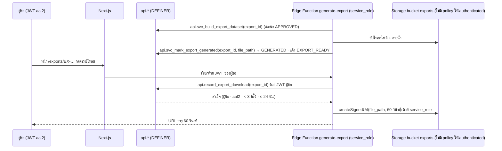

# RLS Specification — JAUN CRM · Customer 360

> เอกสาร A45 #11 · **Row Level Security Specification** · ปรับ 16 ก.ย. 2569 ตาม `docs/00-brief/CANONICAL.md` **ฉบับ v2.2** (รวมข้อตัดสินข้อ 19) · เอกสารนี้เป็น **แหล่งจริงของสิทธิ์และ RLS** ตาม CANONICAL ข้อ 19.2
> **ผู้เขียน `supabase/migrations/0010_security.sql` ต้องคัดลอกบล็อก SQL ในข้อ 3–8 ตามลำดับ A → M ตามตัวอักษร** และสร้างไฟล์ทดสอบตามข้อ 10
> ทุกบล็อก SQL และทุกไฟล์ทดสอบในเอกสารนี้ **รันผ่านจริงแล้ว** บน PGlite 0.4.1 (PostgreSQL 17.5) ต่อจาก migration 0001–0009 และทำให้ `supabase/tests/01_schema_stage1.sql` · `02_schema_stage2.sql` ยังผ่านครบ (242 + 175 assertion) · ไฟล์ `rls_01`–`rls_08` ผ่านรวม 293 assertion
> ชื่อตาราง/คอลัมน์/ENUM ใช้ตาม migration 0001–0009 (CANONICAL ข้อ 19.1) · ความหมายของสิทธิ์ บุคคลตัวอย่าง และแคตตาล็อกปุ่มอยู่ใน `docs/04-security/permission-matrix.md` (อ้างเป็น "PM ข้อ …")
> ค่าที่ CANONICAL ไม่มีเขียน **รอยืนยัน** · ประเด็นที่ v2.2 ยังไม่ตัดสินติดป้าย **หมายเหตุผู้เขียน** และสรุปในข้อ 11

## สารบัญ

1. สัญญาของเอกสารและโครงของ `0010_security.sql`
2. กติกาหลัก · ลำดับการประเมินใน PostgreSQL · คอลัมน์ระบบ · ข้อควรรู้ของ PostgreSQL 17
3. บล็อก A — ส่วนต่างของ schema ตาม v2.2 และชื่อ trigger
4. บล็อก B–C — GRANT ระดับ schema และ helper ตรวจสิทธิ์
5. แม่แบบ predicate (อ่านประกอบบล็อก E–H)
6. สิทธิ์รายตาราง — ตารางสรุปทุกตาราง + บล็อก D–J
7. Trigger — `trg_90_stamp_row` · `app.enforce_row_transition` · guard (บล็อก K–M)
8. สัญญาความปลอดภัยของ RPC (`api.*` · `api.svc_*`) · `api.assign_owner` · การส่งออกและ Storage
9. CI checks (`rls_01_catalog.sql`)
10. แผนทดสอบ — harness · fixture · ไฟล์ `rls_01`–`rls_08` · test ของ persona ข้อ 13.13 บน seed
11. หมายเหตุผู้เขียน

---

## 1. สัญญาของเอกสารและโครงของ `0010_security.sql`

### 1.1 สิ่งที่ `0010_security.sql` ต้องมี (เรียงตามลำดับในไฟล์)

| บล็อก | เนื้อหา | ข้อในเอกสาร | CANONICAL |
|---|---|---|---|
| A | เพิ่มคอลัมน์ `crm.visits.unrecorded_ack_by/_at` · `core.role_grant_requests.request_type` · ผ่อน CHECK `export_requests_decided_chk` สำหรับ BRANCH_MANAGER · เปลี่ยนชื่อ BEFORE trigger ของ 0009 | 3 | 6.10 · 7.2 · 8.2 · 9.4.2 |
| B | GRANT/REVOKE ระดับ schema · ล้างสิทธิ์ตาราง ลำดับ ฟังก์ชันเดิมทั้งหมด | 4.1 | 1.1 · 19.1 ข้อ 2 |
| C | helper 13 ตัว + ภายใน 2 ตัว · GRANT EXECUTE | 4.2 | 9.3 |
| D | DEFAULT `organization_id` `created_by` `updated_by` | 6.2 | 9.3 · 19.2 ข้อ 1 |
| E–H | GRANT ระดับตาราง/คอลัมน์ + policy ของทุกตาราง `crm` | 6.3–6.6 | 6 · 8.0 · 8.3 · 9.4 |
| I | `core` | 6.7 | 8.3 · 19.2 ข้อ 7 |
| J | `ref` 16 ตาราง | 6.8 | 5 · 19.1 ข้อ 4 |
| K | `app.trg_stamp_row()` + trigger `trg_90_stamp_row` 34 ตาราง | 7.1 | 19.2 ข้อ 1 |
| L | `app.transition_denied()` · `app.enforce_row_transition()` + trigger `trg_10_enforce_transition` 7 ตาราง | 7.2–7.5 | 9.4.2 · 19.2 ข้อ 2–6 |
| M | `app.trg_guard_core_row()` · `audit.trg_guard_export_request()` | 7.6 | 7.1–7.3 · 8.2 · 19.1 ข้อ 13 |

- RPC ใน `api` (ข้อ 9.6) **ไม่อยู่ใน 0010** · migration ที่สร้าง RPC ต้องทำตามสัญญาในข้อ 8 และเพิ่ม test ตามข้อ 10.7
- ไฟล์ `*_cron.sql` ไม่เกี่ยวกับเอกสารนี้ (pg_cron รันในฐานะ `postgres` · ข้อ 9.6)
- ทุก object owner = role ที่รัน migration (`postgres` บน Supabase · superuser บน PGlite) · ห้ามสร้าง owner role อื่น (ข้อ 1.1)

### 1.2 สิ่งที่เปลี่ยนจากฉบับที่เขียนตาม v2.1

| หัวข้อ | ฉบับเดิม | ฉบับนี้ (v2.2) |
|---|---|---|
| เปลี่ยน owner/ทีม/สาขา | UPDATE ตรง + trigger ตรวจ `*.assign` | **`api.assign_owner` เท่านั้น** · `owner_staff_id` `team_id` `branch_id` ไม่อยู่ใน UPDATE grant ยกเว้น `crm.visits.owner_staff_id` สำหรับรับคิว (ข้อ 9.4.2) |
| `lead.assign` · `task.assign` scope T | ต้องมี owner ∈ ทีม | รวมรายการ **owner ว่าง** ในสาขาที่ตนเป็นหัวหน้าทีม (ข้อ 8.0 · Q28) — อยู่ใน `app.can_access_record` |
| helper | `team_scope_pairs` `current_organization_id` เป็นข้อเสนอ | อยู่ในข้อ 9.3 แล้ว |
| แม่แบบสร้างรายการของลูกค้า | ข้อเสนอให้จับคู่สาขา | ข้อ 8.0 บังคับ: สาขาของรายการต้องเป็นสาขาที่ลูกค้าเชื่อมอยู่แล้ว (ยกเว้น scope G) |
| `enforce_row_transition` | BEFORE UPDATE (+INSERT บางตาราง) | BEFORE INSERT **และ** UPDATE ทั้ง 7 ตาราง · ลำดับ `trg_05` → `trg_10` → `trg_20` → `trg_90` |
| Pipeline | ย้อนเป็น INTERESTED ได้ | ห้ามย้อน · ด้วยมือได้ `QUOTATION→FOLLOW_UP` และ `INTERESTED→QUOTATION/FOLLOW_UP` เมื่อมีใบที่ `sent_at IS NOT NULL` (ข้อ 4.4 · D48) |
| lead `NEW→CONTACTED/QUALIFIED` ด้วยมือ | อนุญาต (ข้อเสนอ) | ข้อ 4.3 อนุญาตและ `first_contacted_at = greatest(now(), created_at)` (ตั้งโดย `trg_30_row_defaults` ของ 0009) |
| Storage ไฟล์ export | policy SELECT บน `storage.objects` + helper `downloadable_export_paths` | **ไม่มี storage policy ให้ authenticated** · signed URL ออกโดย Edge Function `generate-export` หลัง `api.record_export_download` (ข้อ 9.8) — helper เดิมถูกตัด |
| `audit.*` | ENABLE RLS ไม่มี policy | **ไม่เปิด RLS** เพราะ role `audit_retention` ต้อง DELETE ได้ (ข้อ 19.1 ข้อ 13) · ป้องกันด้วยการไม่มี USAGE/GRANT + `audit.deny_change` |
| test | ใช้บุคคลใน seed + persona ชั่วคราว | **fixture ของตัวเองทั้งหมด** (องค์กร `TEST-RLS`) ผ่านได้ทั้งมีและไม่มี seed · test ของข้อ 13.13 แยกเป็นไฟล์บน seed (ข้อ 10.6) |

---

## 2. กติกาหลัก · ลำดับการประเมิน · คอลัมน์ระบบ · ข้อควรรู้ของ PostgreSQL 17

### 2.1 กติกาที่ migration ต้องทำตามทุกข้อ

| # | กติกา | ที่มา | ตรวจด้วย |
|---|---|---|---|
| R1 | เปิด RLS ทุกตารางใน `core` `ref` `crm` (0002–0007 ทำแล้ว) และ `app` (0001 ทำแล้ว) · `audit` ไม่เปิด | 9.4 ข้อ 1 · 19.1 ข้อ 13 | CI-01 |
| R2 | ใน policy เรียกเฉพาะ helper ที่ argument เป็นค่าคงที่ ห่อด้วย `(SELECT app.f(...))` หรืออยู่ใน `FROM app.f(...)` · ห้าม `can_access_record` `can_access_customer` `staff_has_branch_assignment` `effective_*` `clock` | 9.3 · 9.4 ข้อ 2 | CI-09 · CI-10 |
| R3 | policy ของตาราง X ห้ามอ้างตาราง X | 9.4 ข้อ 3 | CI-11 |
| R4 | view ในทุก schema ของโครงการเป็น `security_invoker = true` · ไม่มี materialized view ใน schema ที่เปิด API | 9.4 ข้อ 4 · 19.2 ข้อ 8 | CI-02 · CI-03 |
| R5 | `authenticated` มี DELETE เฉพาะ `crm.customer_tags` `crm.opportunity_items` `crm.quotation_items` | 8.3 · 9.4 ข้อ 5 | CI-05 |
| R6 | ตารางที่เขียนโดย trigger/RPC เท่านั้นไม่มี GRANT INSERT/UPDATE/DELETE | 9.4 ข้อ 6 | CI-06 |
| R7 | คอลัมน์ระบบและคอลัมน์ owner/ทีม/สาขาไม่อยู่ใน column grant ของ UPDATE (ยกเว้น `crm.visits.owner_staff_id`) | 9.4 ข้อ 7 · 9.4.2 | CI-08 (ตาราง expected ข้อ 6.1) · ALL-1–3 |
| R8 | ทุกฟังก์ชันที่ `authenticated`/`service_role` เรียกตรง **รวมฟังก์ชันใน CHECK/generated column ของตารางที่ผู้ใช้เขียน** ต้อง GRANT EXECUTE เอง | 19.1 ข้อ 2 | CI-12 · CI-20 |
| R9 | ห้ามฝังบทบาท/สิทธิ์ลง JWT · นาฬิกาตัดสินสิทธิ์ = `now()` เสมอ | 8.0 · 1.2 | review |

### 2.2 ลำดับที่ PostgreSQL ประเมิน (ใช้ออกแบบข้อความและ test)

| คำสั่ง | ลำดับ | ผลเมื่อไม่ผ่าน |
|---|---|---|
| SELECT | ① USAGE schema + SELECT คอลัมน์ที่คำสั่งอ้าง (รวม `*`) → ② USING ของ policy SELECT | ① `42501` · ② 0 แถว |
| INSERT | ① GRANT INSERT คอลัมน์ที่ระบุ → ② DEFAULT → ③ BEFORE trigger เรียงตามชื่อ (`trg_05` → `trg_10` → `trg_20` → `trg_30` → `trg_90` → `trg_touch_updated_at`) → ④ WITH CHECK → ⑤ CHECK/NOT NULL/FK/UNIQUE → ⑥ AFTER trigger · `RETURNING` ต้องผ่าน policy SELECT | ① ③ ④ `42501` · ⑤ `23xxx` |
| UPDATE | ① GRANT UPDATE คอลัมน์ใน `SET` → ② USING ของ policy UPDATE → ③ BEFORE trigger → ④ WITH CHECK บนแถวใหม่ → ⑤ CHECK → ⑥ AFTER trigger | ② 0 แถว (ไม่ error) · ① ③ ④ `42501` |
| DELETE | ① GRANT DELETE → ② USING ของ policy DELETE | ② 0 แถว |

- ฟังก์ชัน `SECURITY DEFINER` owner `postgres` ข้าม RLS · ภายในนั้น `current_user = 'postgres'` จึง **ข้าม** `app.enforce_row_transition` และ `app.trg_stamp_row` → RPC และ trigger DEFINER ต้องตรวจเองตามข้อ 8
- PostgREST `select=*` ขยายเป็นทุกคอลัมน์ → ตารางที่มี column grant (`customer_contacts` `customer_addresses` `staff_profiles`) ต้องระบุคอลัมน์เสมอ

### 2.3 คอลัมน์ระบบ · owner · immutable (ที่ `app.enforce_row_transition` ตรวจ)

| กลุ่ม | คอลัมน์ | เมื่อผู้ใช้เปลี่ยนตรง | ที่มา |
|---|---|---|---|
| ระบบ | `id` `organization_id` `created_at` `created_by` `updated_at` `updated_by` · `customer_no` `lead_no` `opportunity_no` `quotation_no` `task_no` `visit_no` · `first_seen_at` `first_channel_code` `first_source_code` `first_branch_id` `lifecycle_stage` `last_activity_at` `last_channel_code` `last_branch_id` `has_open_followup` `has_new_lead` `note_summary` `created_via` `record_status` `merged_into_id` `legal_hold` `expected_amount` `is_visit_root` `is_next_action` `closed_by_system` `queue_no` `outcome_code` `converted_opportunity_id` · `first_contacted_at` `sent_at` `valid_until` `completed_at` `cancelled_at` `service_started_at` `ended_at` `unrecorded_ack_by` `unrecorded_ack_at` | `JCRM-T01` | 9.4 ข้อ 7 · 19.2 ข้อ 4 · 6.10 |
| owner/ทีม/สาขา | `owner_staff_id` `team_id` `branch_id` | `JCRM-T13` (ใช้ `api.assign_owner`) | 9.4.2 |
| เปลี่ยนไม่ได้ | คอลัมน์อื่นที่ไม่อยู่ใน UPDATE grant ของตาราง เช่น `channel_code` `started_at` `direction` `visit_id` `customer_id`/ลิงก์แม่ (ข้อ 6.1) | `JCRM-T14` | 19.2 ข้อ 2 · 4 |
| generated | `display_name` `name_search` | ไม่ตรวจ (ค่าใน BEFORE trigger ยังไม่คำนวณ · ผู้ใช้เขียนไม่ได้อยู่แล้ว) | 6.3 |

**`branch_id` ของ lead/opportunity/task เปลี่ยนผ่าน `api.assign_owner(… p_to_branch_id)` เท่านั้น** เพราะข้อ 9.6 ให้ RPC นี้รับสาขาปลายทาง และข้อ 9.4.2 บังคับบันทึก `ownership_changes` เหตุผล `BRANCH_TRANSFER` · visit/interaction/quotation เปลี่ยนสาขาไม่ได้เลย

**`team_id`** เป็น snapshot ตอนมอบงาน (ข้อ 7.1) จึงไม่อยู่ใน INSERT/UPDATE grant ของผู้ใช้ · ผู้ตั้งค่าคือ RPC (`api.assign_owner` `api.quick_capture` `api.open_visit` `api.convert_lead`) ตามกติกาใน `api-spec.md`

### 2.4 ข้อควรรู้ของ PostgreSQL 17 ที่บล็อก SQL คำนึงแล้ว

| เรื่อง | ผล | วิธีในเอกสารนี้ |
|---|---|---|
| `col = ANY ((SELECT app.scope_branch_ids(...)))` ตามตัวอย่างข้อ 9.4 | PostgreSQL ตีความเป็น `ANY (subquery)` → error `operator does not exist: uuid = uuid[]` | ใช้ `col = ANY ((SELECT app.scope_branch_ids(...))::uuid[])` (initplan ครั้งเดียวต่อคำสั่ง) · ข้อ 11 H1 |
| ฟังก์ชันใน CHECK และ generated column | ถูกตรวจสิทธิ์ EXECUTE ของผู้เขียนแถว (ต่างจาก index expression ที่ไม่ตรวจ) | GRANT EXECUTE `app.bangkok_date(timestamptz)` ให้ `authenticated` (ใช้ใน `quotations_valid_until_chk`) · CI-20 |
| generated column ใน BEFORE trigger | ค่าใน `NEW` ยังไม่คำนวณ จึงดูเหมือน "เปลี่ยน" | `enforce_row_transition` ตัด `display_name` `name_search` ออกจากการเทียบ |
| ค่า `now()` ในทรานแซกชันทดสอบ | คงที่ทั้งทรานแซกชัน | fixture ตั้ง `created_at` สัมพัทธ์กับ `now()` (เช่น `now() - interval '25 hours'`) |

---

## 3. บล็อก A — ส่วนต่างของ schema ตาม v2.2 และชื่อ trigger

migration 0001–0009 เขียนตาม v2.1 · สิ่งต่อไปนี้ v2.2 ต้องการและกระทบสิทธิ์โดยตรง จึงอยู่ต้น 0010 (เขียนแบบรันซ้ำได้ เผื่อมีการแก้ migration ต้นทางภายหลัง)

| รายการ | เหตุ | CANONICAL |
|---|---|---|
| `crm.visits.unrecorded_ack_by uuid → core.staff_profiles` · `unrecorded_ack_at timestamptz` · CHECK มีคู่กันและใช้ได้เฉพาะ outcome `UNRECORDED` | `api.acknowledge_unrecorded_visit` ตั้งค่า · เป็นคอลัมน์ระบบ | 6.10 · 9.6 · 12.3 |
| `core.role_grant_requests.request_type text NOT NULL DEFAULT 'GRANT'` CHECK `GRANT`/`REVOKE` | การถอน EX/BA/SA ใช้คำขอ RG ชนิด `REVOKE` · **หมายเหตุผู้เขียน H2** ชื่อคอลัมน์ | 4.8 · 7.2 |
| `export_requests_decided_chk` ยอม `APPROVED` ที่ `approved_by IS NULL` เมื่อ `requested_as_role = 'BRANCH_MANAGER'` | CHECK ของ 0008 ขัดกับข้อ 8.2 v2.2 | 8.2 |
| เปลี่ยนชื่อ `trg_assign_running_number` → `trg_05_running_number` (11 ตาราง) · `trg_guard_restricted_text` → `trg_20_guard_text` (7 ตาราง) · `trg_row_defaults` → `trg_30_row_defaults` (4 ตาราง) | ลำดับ BEFORE trigger ของข้อ 9.4.2 · `trg_row_defaults` ของ 0009 (เติม `first_contacted_at` `completed_at` `sent_at` ฯลฯ) ต้องทำงาน **หลัง** `trg_10` เพื่อให้ trigger ตรวจเห็นค่าที่ผู้ใช้ส่งจริง และก่อน `trg_90` | 9.4.2 |

```sql
-- A. ส่วนต่างของ schema ตาม CANONICAL v2.2 (เขียนแบบรันซ้ำได้) · ข้อ 6.10 · 4.8 · 8.2 · 9.4.2
ALTER TABLE crm.visits ADD COLUMN IF NOT EXISTS unrecorded_ack_by uuid REFERENCES core.staff_profiles (id);
ALTER TABLE crm.visits ADD COLUMN IF NOT EXISTS unrecorded_ack_at timestamptz;
DO $$
BEGIN
    IF NOT EXISTS (SELECT 1 FROM pg_constraint WHERE conname = 'visits_unrecorded_ack_chk' AND conrelid = 'crm.visits'::regclass) THEN
        ALTER TABLE crm.visits ADD CONSTRAINT visits_unrecorded_ack_chk
            CHECK ((unrecorded_ack_by IS NULL) = (unrecorded_ack_at IS NULL)
                   AND (unrecorded_ack_by IS NULL OR outcome_code = 'UNRECORDED'));
    END IF;
END $$;
ALTER TABLE core.role_grant_requests ADD COLUMN IF NOT EXISTS request_type text NOT NULL DEFAULT 'GRANT';
DO $$
BEGIN
    IF NOT EXISTS (SELECT 1 FROM pg_constraint WHERE conname = 'role_grant_requests_type_chk' AND conrelid = 'core.role_grant_requests'::regclass) THEN
        ALTER TABLE core.role_grant_requests ADD CONSTRAINT role_grant_requests_type_chk CHECK (request_type IN ('GRANT', 'REVOKE'));
    END IF;
END $$;
ALTER TABLE audit.export_requests DROP CONSTRAINT IF EXISTS export_requests_decided_chk;
ALTER TABLE audit.export_requests ADD CONSTRAINT export_requests_decided_chk
    CHECK ((approved_by IS NULL OR decided_at IS NOT NULL)
           AND (status <> 'APPROVED' OR approved_by IS NOT NULL OR requested_as_role = 'BRANCH_MANAGER')
           AND (status <> 'REJECTED' OR decided_at IS NOT NULL));

-- ชื่อ BEFORE trigger ตามลำดับข้อ 9.4.2 (PostgreSQL เรียกตามลำดับอักษรของชื่อ)
DO $$
DECLARE r record;
BEGIN
    FOR r IN SELECT t.tgname, c.oid::regclass AS tbl FROM pg_trigger t JOIN pg_class c ON c.oid = t.tgrelid
             WHERE NOT t.tgisinternal AND t.tgname IN ('trg_assign_running_number', 'trg_guard_restricted_text', 'trg_row_defaults')
    LOOP
        EXECUTE format('ALTER TRIGGER %I ON %s RENAME TO %I', r.tgname, r.tbl,
            CASE r.tgname WHEN 'trg_assign_running_number' THEN 'trg_05_running_number'
                          WHEN 'trg_guard_restricted_text' THEN 'trg_20_guard_text'
                          ELSE 'trg_30_row_defaults' END);
    END LOOP;
END $$;
```

---

## 4. บล็อก B–C — GRANT ระดับ schema และ helper ตรวจสิทธิ์

### 4.1 บล็อก B

- ผลของบล็อก B: ไม่มีใครมีสิทธิ์บนตาราง ลำดับ หรือฟังก์ชันใน schema ของโครงการ นอกจาก owner · บล็อก C–J ให้สิทธิ์กลับเฉพาะที่ระบุ
- `service_role` ได้ USAGE บน `api` `crm` `core` `ref` แต่ **ไม่มีสิทธิ์ตารางใด** (Edge Function เรียกผ่าน `api.svc_*` เท่านั้น · ข้อ 9.8) · RPC migration ให้ EXECUTE เอง
- `anon` ไม่มีอะไรเลย (ข้อ 1.1)

```sql
-- B. GRANT ระดับ schema · ล้างสิทธิ์ตาราง/ฟังก์ชันทั้งหมดก่อนให้ใหม่ (ข้อ 1.1 · 19.1 ข้อ 2)
REVOKE ALL ON SCHEMA api, app, crm, core, ref, analytics, audit, restricted FROM PUBLIC;
GRANT USAGE ON SCHEMA api, crm, core, ref TO authenticated, service_role;
GRANT USAGE ON SCHEMA app TO authenticated;
REVOKE ALL ON ALL TABLES IN SCHEMA api, app, crm, core, ref, analytics, audit, restricted FROM PUBLIC, anon, authenticated, service_role;
REVOKE ALL ON ALL SEQUENCES IN SCHEMA api, app, crm, core, ref, analytics, audit, restricted FROM PUBLIC, anon, authenticated, service_role;
REVOKE ALL ON ALL FUNCTIONS IN SCHEMA api, app, crm, core, ref, analytics, audit, restricted FROM PUBLIC, anon, authenticated, service_role;
```

### 4.2 helper (บล็อก C)

| ฟังก์ชัน | คืนค่า | GRANT `authenticated` | ใช้ใน policy | ความหมาย |
|---|---|:--:|:--:|---|
| `app.current_staff_id()` | `uuid` | ✓ | ✓ | staff `ACTIVE` ที่ผูก `auth.uid()` (แทนที่ของ 0008 ด้วยนิยามเดิม) |
| `app.is_aal2()` | `boolean` | ✓ | ✓ | `coalesce(auth.jwt()->>'aal','aal1') = 'aal2'` |
| `app.clock()` | `timestamptz` | ✓ (0001) | ✗ | นาฬิการายงาน · ห้ามใช้ตัดสินสิทธิ์ |
| `app.current_organization_id()` | `uuid` | ✓ | ✓ | องค์กรของผู้ใช้ · DEFAULT ของ `organization_id` |
| `app.effective_assignments()` | `TABLE(assignment_id, role_code, branch_id)` | ✗ ภายใน | ✗ | assignment ที่มีผล: ACTIVE · `valid_from ≤ now() < valid_to` · MFA · บทบาทสาขาต้องมีสาขา · SUPERVISOR ต้องเป็นหัวหน้าทีมในสาขา (ข้อ 7.1 · 8.0) |
| `app.effective_grants(p_permission)` | `TABLE(branch_id, scope, role_code)` | ✗ ภายใน | ✗ | คู่ (สาขา, scope) ของสิทธิ์ · 🔐 ต้อง aal2 · G ขยายเป็นทุกสาขาขององค์กร · S ไม่คืนสาขา |
| `app.has_permission(p_permission)` | `boolean` | ✓ | ✓ | มีสิทธิ์ที่ scope ใดก็ได้ (รวม S) |
| `app.scope_branch_ids(p_permission, p_min_scope)` | `uuid[]` (ว่าง = `'{}'`) | ✓ | ✓ | สาขาที่ scope ≥ `p_min_scope` (ไม่นับ S) |
| `app.team_scope_pairs(p_permission)` | `TABLE(branch_id, staff_id)` | ✓ | ✓ (`FROM`) | คู่ (สาขา, สมาชิกทีม) ที่ผู้ใช้เป็นหัวหน้าในสาขานั้นและสิทธิ์เป็น T |
| `app.team_member_staff_ids(p_permission)` | `uuid[]` | ✓ | ✓ แต่ policy ใช้ `team_scope_pairs` | สมาชิกทีมทั้งหมดจากคู่ข้างบน (ไม่จับคู่สาขา · ใช้ใน RPC/UI) |
| `app.customer_ids_in_scope(p_permission)` | `SETOF uuid` | ✓ | ✓ | ลูกค้าที่ผ่านสิทธิ์ตามข้อ 8.0 (ลูกค้าเชื่อมสาขา = `customer_branches` หรือ `first_branch_id`) |
| `app.readable_customer_ids()` | `SETOF uuid` | ✓ | ✓ | `= customer_ids_in_scope('customer.read')` |
| `app.can_access_record(p_permission, p_branch_id, p_owner_staff_id, p_created_by)` | `boolean` | ✓ | **✗** | ตัดสินแถวเดียว · กติกาเดียวกับ policy **และ** `lead.assign`/`task.assign` ที่ T รวม owner ว่างในสาขาที่ตนเป็นหัวหน้าทีม (ข้อ 8.0) |
| `app.can_access_customer(p_permission, p_customer_id)` | `boolean` | ✓ | **✗** | ตัดสินลูกค้ารายเดียว = `p_customer_id IN customer_ids_in_scope(p)` (H16) |
| `app.staff_has_branch_assignment(p_staff_id, p_branch_id)` | `boolean` | ✓ | **✗** | staff ACTIVE มี assignment ที่ยังมีผลในสาขานั้น (ไม่ดู aal ของเป้าหมาย · บทบาทองค์กรไม่นับ) |
| `app.bangkok_date(timestamptz)` | `date` | ✓ | – | ไม่ใช่ helper ข้อ 9.3 · GRANT เพราะอยู่ใน CHECK ของ `crm.quotations` (R8) |

- helper ทั้งหมด: `LANGUAGE sql` · `STABLE` · `SECURITY DEFINER` · `SET search_path = ''` · ห้าม `IMMUTABLE`/`LEAKPROOF`
- รหัสสิทธิ์ที่ไม่มีในตาราง → คืนว่าง/false ไม่ raise (H11)
- `can_access_*` และ `staff_has_branch_assignment` ต้อง GRANT เพราะ `app.enforce_row_transition` เป็น INVOKER · schema `app` ไม่เปิดผ่าน Data API จึงเรียกผ่าน HTTP ไม่ได้

```sql
-- C. helper ตรวจสิทธิ์ (ข้อ 9.3) · ทุกตัว SECURITY DEFINER · STABLE · search_path = ''
CREATE OR REPLACE FUNCTION app.current_staff_id() RETURNS uuid
LANGUAGE sql STABLE SECURITY DEFINER SET search_path = '' AS $$
    SELECT s.id FROM core.staff_profiles s WHERE s.user_id = auth.uid() AND s.status = 'ACTIVE'
$$;

CREATE FUNCTION app.is_aal2() RETURNS boolean
LANGUAGE sql STABLE SECURITY DEFINER SET search_path = '' AS $$
    SELECT coalesce(auth.jwt() ->> 'aal', 'aal1') = 'aal2'
$$;

CREATE FUNCTION app.current_organization_id() RETURNS uuid
LANGUAGE sql STABLE SECURITY DEFINER SET search_path = '' AS $$
    SELECT s.organization_id FROM core.staff_profiles s WHERE s.id = app.current_staff_id()
$$;

CREATE FUNCTION app.effective_assignments()
RETURNS TABLE (assignment_id uuid, role_code text, branch_id uuid)
LANGUAGE sql STABLE SECURITY DEFINER SET search_path = '' AS $$
    SELECT a.id, a.role_code, a.branch_id
    FROM core.staff_role_assignments a
    JOIN core.roles r ON r.code = a.role_code
    WHERE a.staff_id = app.current_staff_id()
      AND a.valid_from <= now()
      AND (a.valid_to IS NULL OR now() < a.valid_to)
      AND (NOT r.requires_mfa OR app.is_aal2())
      AND r.is_branch_role = (a.branch_id IS NOT NULL)
      AND (a.role_code <> 'SUPERVISOR' OR EXISTS (
            SELECT 1
            FROM core.team_members tm
            JOIN core.teams t ON t.id = tm.team_id
            WHERE tm.staff_id = a.staff_id
              AND tm.is_leader
              AND t.branch_id = a.branch_id
              AND tm.valid_from <= now()
              AND (tm.valid_to IS NULL OR now() < tm.valid_to)))
$$;

CREATE FUNCTION app.effective_grants(p_permission text)
RETURNS TABLE (branch_id uuid, scope core.data_scope, role_code text)
LANGUAGE sql STABLE SECURITY DEFINER SET search_path = '' AS $$
    WITH g AS (
        SELECT ea.branch_id, rp.scope, ea.role_code
        FROM app.effective_assignments() ea
        JOIN core.role_permissions rp ON rp.role_code = ea.role_code AND rp.permission_code = p_permission
        WHERE NOT rp.requires_aal2 OR app.is_aal2()
    )
    SELECT g.branch_id, g.scope, g.role_code FROM g
    WHERE g.scope IN ('OWN', 'TEAM', 'BRANCH') AND g.branch_id IS NOT NULL
    UNION ALL
    SELECT b.id, g.scope, g.role_code FROM g
    JOIN core.branches b ON b.organization_id = app.current_organization_id()
    WHERE g.scope = 'ORGANIZATION'
$$;

CREATE FUNCTION app.has_permission(p_permission text) RETURNS boolean
LANGUAGE sql STABLE SECURITY DEFINER SET search_path = '' AS $$
    SELECT EXISTS (
        SELECT 1
        FROM app.effective_assignments() ea
        JOIN core.role_permissions rp ON rp.role_code = ea.role_code AND rp.permission_code = p_permission
        WHERE NOT rp.requires_aal2 OR app.is_aal2())
$$;

CREATE FUNCTION app.scope_branch_ids(p_permission text, p_min_scope core.data_scope) RETURNS uuid[]
LANGUAGE sql STABLE SECURITY DEFINER SET search_path = '' AS $$
    SELECT coalesce(array_agg(DISTINCT g.branch_id ORDER BY g.branch_id), '{}'::uuid[])
    FROM app.effective_grants(p_permission) g
    WHERE p_min_scope <> 'SYSTEM' AND g.scope <> 'SYSTEM' AND g.scope >= p_min_scope
$$;

CREATE FUNCTION app.team_scope_pairs(p_permission text)
RETURNS TABLE (branch_id uuid, staff_id uuid)
LANGUAGE sql STABLE SECURITY DEFINER SET search_path = '' AS $$
    SELECT DISTINCT t.branch_id, m.staff_id
    FROM app.effective_grants(p_permission) g
    JOIN core.teams t        ON t.branch_id = g.branch_id
    JOIN core.team_members l ON l.team_id = t.id
                            AND l.staff_id = app.current_staff_id()
                            AND l.is_leader
                            AND l.valid_from <= now() AND (l.valid_to IS NULL OR now() < l.valid_to)
    JOIN core.team_members m ON m.team_id = t.id
                            AND m.valid_from <= now() AND (m.valid_to IS NULL OR now() < m.valid_to)
    WHERE g.scope = 'TEAM'
$$;

CREATE FUNCTION app.team_member_staff_ids(p_permission text) RETURNS uuid[]
LANGUAGE sql STABLE SECURITY DEFINER SET search_path = '' AS $$
    SELECT coalesce(array_agg(DISTINCT p.staff_id ORDER BY p.staff_id), '{}'::uuid[])
    FROM app.team_scope_pairs(p_permission) p
$$;

CREATE FUNCTION app.customer_ids_in_scope(p_permission text) RETURNS SETOF uuid
LANGUAGE sql STABLE SECURITY DEFINER SET search_path = '' AS $$
    WITH g AS (SELECT * FROM app.effective_grants(p_permission)),
    links AS (
        SELECT cb.customer_id, cb.branch_id FROM crm.customer_branches cb
        WHERE cb.branch_id IN (SELECT g.branch_id FROM g)
        UNION
        SELECT c.id, c.first_branch_id FROM crm.customers c
        WHERE c.first_branch_id IN (SELECT g.branch_id FROM g)
    )
    SELECT c.id FROM crm.customers c
    WHERE c.organization_id = app.current_organization_id()
      AND EXISTS (SELECT 1 FROM g WHERE g.scope = 'ORGANIZATION')
    UNION
    SELECT l.customer_id FROM links l
    JOIN g ON g.branch_id = l.branch_id AND g.scope = 'BRANCH'
    UNION
    SELECT l.customer_id FROM links l
    JOIN crm.customers c ON c.id = l.customer_id
    JOIN app.team_scope_pairs(p_permission) tp ON tp.branch_id = l.branch_id AND tp.staff_id = c.owner_staff_id
    UNION
    SELECT l.customer_id FROM links l
    JOIN crm.customers c ON c.id = l.customer_id AND c.owner_staff_id = app.current_staff_id()
$$;

CREATE FUNCTION app.readable_customer_ids() RETURNS SETOF uuid
LANGUAGE sql STABLE SECURITY DEFINER SET search_path = '' AS $$
    SELECT x FROM app.customer_ids_in_scope('customer.read') AS x
$$;

CREATE FUNCTION app.can_access_record(p_permission text, p_branch_id uuid, p_owner_staff_id uuid, p_created_by uuid) RETURNS boolean
LANGUAGE sql STABLE SECURITY DEFINER SET search_path = '' AS $$
    SELECT p_branch_id IS NOT NULL AND (
           p_branch_id = ANY (app.scope_branch_ids(p_permission, 'BRANCH'))
        OR (p_owner_staff_id IS NOT NULL AND EXISTS (
               SELECT 1 FROM app.team_scope_pairs(p_permission) tp
               WHERE tp.branch_id = p_branch_id AND tp.staff_id = p_owner_staff_id))
        OR (p_owner_staff_id IS NULL AND p_permission IN ('lead.assign', 'task.assign') AND EXISTS (
               SELECT 1 FROM app.team_scope_pairs(p_permission) tp WHERE tp.branch_id = p_branch_id))
        OR (p_branch_id = ANY (app.scope_branch_ids(p_permission, 'OWN'))
            AND coalesce(p_owner_staff_id, p_created_by) = app.current_staff_id()))
$$;

CREATE FUNCTION app.can_access_customer(p_permission text, p_customer_id uuid) RETURNS boolean
LANGUAGE sql STABLE SECURITY DEFINER SET search_path = '' AS $$
    WITH g AS (SELECT * FROM app.effective_grants(p_permission)),
    c AS (SELECT x.id, x.organization_id, x.owner_staff_id, x.first_branch_id FROM crm.customers x WHERE x.id = p_customer_id),
    links AS (
        SELECT cb.branch_id FROM crm.customer_branches cb WHERE cb.customer_id = p_customer_id
        UNION
        SELECT c.first_branch_id FROM c WHERE c.first_branch_id IS NOT NULL
    )
    SELECT EXISTS (SELECT 1 FROM c WHERE c.organization_id = app.current_organization_id()
                                     AND EXISTS (SELECT 1 FROM g WHERE g.scope = 'ORGANIZATION'))
        OR EXISTS (SELECT 1 FROM links l JOIN g ON g.branch_id = l.branch_id AND g.scope = 'BRANCH')
        OR EXISTS (SELECT 1 FROM links l CROSS JOIN c
                   JOIN app.team_scope_pairs(p_permission) tp ON tp.branch_id = l.branch_id AND tp.staff_id = c.owner_staff_id)
        OR EXISTS (SELECT 1 FROM links l JOIN g ON g.branch_id = l.branch_id CROSS JOIN c
                   WHERE c.owner_staff_id = app.current_staff_id())
$$;

CREATE FUNCTION app.staff_has_branch_assignment(p_staff_id uuid, p_branch_id uuid) RETURNS boolean
LANGUAGE sql STABLE SECURITY DEFINER SET search_path = '' AS $$
    SELECT EXISTS (
        SELECT 1
        FROM core.staff_role_assignments a
        JOIN core.staff_profiles s ON s.id = a.staff_id
        WHERE a.staff_id = p_staff_id
          AND a.branch_id = p_branch_id
          AND s.status = 'ACTIVE'
          AND a.valid_from <= now()
          AND (a.valid_to IS NULL OR now() < a.valid_to))
$$;

GRANT EXECUTE ON FUNCTION
    app.current_staff_id(), app.is_aal2(), app.clock(), app.current_organization_id(),
    app.has_permission(text), app.scope_branch_ids(text, core.data_scope),
    app.team_scope_pairs(text), app.team_member_staff_ids(text),
    app.customer_ids_in_scope(text), app.readable_customer_ids(),
    app.can_access_record(text, uuid, uuid, uuid), app.can_access_customer(text, uuid),
    app.staff_has_branch_assignment(uuid, uuid),
    app.bangkok_date(timestamptz)
TO authenticated;
```

---

## 5. แม่แบบ predicate (อ่านประกอบบล็อก E–H)

บล็อก E–H เขียน policy แบบขยายเต็มจากแม่แบบเหล่านี้ · `<p>` = รหัสสิทธิ์ · `T` = ชื่อตารางของ policy · `x` = alias ของแถวแม่

| แม่แบบ | ใช้เมื่อ | ข้อความ (ย่อ) | CANONICAL |
|---|---|---|---|
| `R(<p>, T)` | ขอบเขตระดับแถวที่มี `branch_id` + `owner_staff_id` | `T.branch_id = ANY((SELECT scope_branch_ids(<p>,'BRANCH'))::uuid[])` **OR** `(T.branch_id, T.owner_staff_id) IN (SELECT branch_id, staff_id FROM team_scope_pairs(<p>))` **OR** (`T.branch_id = ANY(scope OWN)` AND `coalesce(T.owner_staff_id, T.created_by) = current_staff_id()`) | 8.0 |
| `R0(<p>, T)` | ตารางไม่มี owner (`customer_notes` · `transaction_refs`) | บรรทัด B **OR** (`branch ∈ OWN` AND `T.created_by = current_staff_id()`) | 8.0 · 6.9 |
| `RT(<p>, T)` | read-through | `R(<p>,T) OR T.customer_id IN (SELECT readable_customer_ids())` · ใช้กับ `visits` `interactions` `leads` `opportunities` `quotations` `transaction_refs` · `customer_notes` ใช้ลูกค้าอ่านได้ตรง · **ห้ามใช้กับ `tasks` `task_comments`** | 9.4 |
| `C(<p>, T)` | สร้างแถวที่แม่คือ **ลูกค้า** | `T.customer_id` อ่านได้ **AND** (`T.branch_id ∈ scope ORGANIZATION` **OR** (ลูกค้าเชื่อม `T.branch_id` อยู่แล้ว AND (`T.branch_id ∈ BRANCH` OR `(T.branch_id, customers.owner_staff_id) ∈ team pairs` OR (`T.branch_id ∈ OWN` AND `customers.owner_staff_id = ตน`)))) | 8.0 (v2.2) · 6.6 |
| `P(<p>, parent, fk, T)` | สร้างแถวที่แม่คือ **รายการ** (quotation → opportunity · task → opportunity/lead · transaction ref → opportunity) | `T.fk IN (SELECT x.id FROM parent x WHERE x.branch_id = T.branch_id AND x.customer_id = T.customer_id AND R(<p>, x))` **AND** ลูกค้าอ่านได้ | 8.0 |
| `N(<p>, T)` | สร้างแถวที่ไม่มีแม่ (task ไม่ผูกอะไร · interaction นิรนาม) | `T.customer_id IS NULL AND R(<p>, T)` (owner/created_by ของแถวใหม่ถูกเติมก่อน WITH CHECK) | 8.0 |
| `U(<p>, T)` | แก้ไข | `USING R(<p>,T)` · `WITH CHECK R(<p>,T) AND (T.customer_id IS NULL OR อ่านได้)` | 9.4 · 6.6 |

- ผลของ `R` = scope สูงครอบคลุมเงื่อนไข scope ต่ำเสมอ รวมแถว owner ว่างที่ตนสร้าง (ข้อ 8.0 v2.2) · T ไม่รวมแถว owner ว่างสำหรับสิทธิ์อื่นนอกจาก `lead.assign`/`task.assign` ซึ่งไม่ถูกใช้ใน policy
- subquery บน `crm.customers` · `crm.customer_branches` · ตารางแม่ รันภายใต้ RLS ของผู้ใช้ · ผู้ที่มีสิทธิ์สร้างทุกบทบาทมีสิทธิ์อ่านแม่ครอบคลุม (PM ข้อ 4) จึงอ่านได้ · ไม่มีวงวนเพราะ policy ของตารางแม่เรียกเฉพาะ helper DEFINER

---

## 6. สิทธิ์รายตาราง

### 6.1 ตารางสรุปทุกตาราง (= expected ของ CI-08 และ CI-14)

ย่อ: `S` = SELECT ทุกคอลัมน์ · `S(…)` = เฉพาะคอลัมน์ · `I(…)` `U(…)` = INSERT/UPDATE เฉพาะคอลัมน์ · `D` = DELETE · "–" = ไม่มี · trigger สิทธิ์: `10` = `trg_10_enforce_transition` · `90` = `trg_90_stamp_row` · `15` = `trg_15_guard_core_row` · `12` = `trg_12_guard_export_request`

**crm**

| ตาราง | SELECT | INSERT | UPDATE | DELETE | policy (สิทธิ์ที่ประเมิน) | trigger |
|---|---|---|---|---|---|---|
| `crm.customers` | S | – (`api.quick_capture`) | `first_name` `last_name` `nickname` `customer_type` `province_code` | – | select: `readable_customer_ids` · update: `customer_ids_in_scope('customer.update')` | 10 · 90 |
| `crm.customer_contacts` | S(`id` `organization_id` `customer_id` `contact_type` `value_masked` `is_primary` `is_valid` `is_active` `verified_at` `created_at` `updated_at`) | – | – | – | select: ลูกค้าอ่านได้ | 90 |
| `crm.customer_addresses` | S(`id` `organization_id` `customer_id` `district` `province_code` `value_masked` `is_primary` `is_active` `created_at` `updated_at`) | – | – | – | select: ลูกค้าอ่านได้ | 90 |
| `crm.customer_branches` | S | – | – | – | select: ลูกค้าอ่านได้ | 90 |
| `crm.customer_notes` | S | `customer_id` `interaction_id` `branch_id` `body` `is_pinned` | `body` `is_pinned` | – | select: ลูกค้าอ่านได้ · insert: `C('note.create')` + interaction ของลูกค้าเดียวกัน · update: `R0('note.update')` + `created_at > now() − 24 ชม.` | 90 |
| `crm.tags` | S | `code` `label_th` `is_active` | `label_th` `is_active` | – | องค์กรเดียวกัน · select: `is_active` หรือ `tag.manage` · insert/update: `tag.manage` | 90 |
| `crm.customer_tags` | S | `customer_id` `tag_id` | – | D | select: ลูกค้าอ่านได้ · insert: `customer.update` + tag active องค์กรเดียวกัน · delete: `customer.update` | 90 |
| `crm.customer_consents` | S | – | – | – | select: ลูกค้าอ่านได้ | 90 |
| `crm.customer_consent_current` (view) | S | – | – | – | ผ่าน RLS ของ `customer_consents` (security_invoker) | – |
| `crm.duplicate_decisions` | S | – | – | – | `data_quality.view` บนลูกค้าทั้งสองราย | 90 |
| `crm.customer_merges` | S | – | – | – | survivor หรือผู้ถูกรวมอ่านได้ | 90 |
| `crm.data_subject_requests` | S | – | – | – | องค์กรเดียวกัน AND (`dsr.manage` หรือ `received_by` = ตน) | 90 |
| `crm.visits` | S | – (`api.open_visit` `api.quick_capture`) | `status` `owner_staff_id` `party_size` `customer_id` `interest_code` `source_code` `cancel_reason` | – | select: `RT('visit.read')` · update: `R('visit.update')` หรือรับคิว (`WAITING` owner ว่าง ในสาขาที่มี `visit.update`) · WITH CHECK: `R` + ลูกค้าว่างหรืออ่านได้ | 10 · 90 |
| `crm.interactions` | S | `customer_id` `visit_id` `lead_id` `opportunity_id` `branch_id` `channel_code` `direction` `interaction_type_code` `occurred_at` `owner_staff_id` `summary` | `customer_id` `interaction_type_code` `occurred_at` `summary` | – | select: `RT` · insert: `N` หรือ `C('interaction.create')` + `INBOUND` ต้องมี visit เปิดสาขาเดียวกัน + visit/lead/opportunity ของลูกค้าเดียวกัน · update: `U('interaction.update')` | 10 · 90 |
| `crm.transaction_refs` | S | `customer_id` `branch_id` `opportunity_id` `transaction_type_code` `source_system_code` `external_no` `transacted_at` `amount` `device_imei` `device_serial` `summary` | – | – | select: `R0('transaction.read')` + read-through · insert: `source_system_code = 'MANUAL'` + `P` (มี opportunity) หรือ `C('transaction.link')` | 90 |
| `crm.campaigns` | S | `code` `name_th` `channel_code` `starts_on` `ends_on` `is_active` | `name_th` `channel_code` `starts_on` `ends_on` `is_active` | – | องค์กรเดียวกัน · select: `has_permission('campaign.read')` (ทุก scope · 19.2 ข้อ 7) · insert/update: `campaign.manage` | 90 |
| `crm.leads` | S | `customer_id` `branch_id` `owner_staff_id` `channel_code` `source_code` `campaign_id` `visit_id` `interest_code` `product_type_code` `product_model` `interest_level` `priority_code` `next_action` `next_action_type_code` `next_action_at` | `source_code` `campaign_id` `interest_code` `product_type_code` `product_model` `interest_level` `status` `priority_code` `next_action` `next_action_type_code` `next_action_at` `closed_at` `lost_reason_code` `lost_note` | – | select: `RT` · insert: `C('lead.create')` + visit ของลูกค้า/สาขาเดียวกัน · update: `U('lead.update')` | 10 · 90 |
| `crm.lead_status_history` | S | – | – | – | lead อ่านได้ | – |
| `crm.opportunities` | S | `customer_id` `origin_channel_code` `origin_visit_id` `branch_id` `owner_staff_id` `interest_code` `priority_code` `next_action` `next_action_type_code` `next_action_at` | `interest_code` `stage` `priority_code` `next_action` `next_action_type_code` `next_action_at` `won_amount` `won_at` `closed_at` `lost_reason_code` `lost_note` | – | select: `RT` · insert: `C('opportunity.create')` + `origin_visit_id` สาขา/ลูกค้า/ช่องทางเดียวกัน · update: `U('opportunity.update')` | 10 · 90 |
| `crm.opportunity_stage_history` | S | – | – | – | opportunity อ่านได้ | – |
| `crm.opportunity_items` | S | `opportunity_id` `product_type_code` `product_model` `variant` `quantity` `unit_price` `interest_level` | `product_type_code` `product_model` `variant` `quantity` `unit_price` `interest_level` | D | select: opportunity อ่านได้ · insert/update/delete: opportunity **ยังเปิด** + `R('opportunity.update')` | 90 |
| `crm.quotations` | S | `opportunity_id` `total_amount` `installment_months` `terms_note` | `status` `sent_channel_code` `total_amount` `installment_months` `terms_note` | – | select: `RT` · insert: `P('quotation.create', opportunities)` · update: `U('quotation.update')` | 10 · 90 |
| `crm.quotation_items` | S | `quotation_id` `product_type_code` `product_model` `variant` `quantity` `unit_price` `discount_amount` | `product_type_code` `product_model` `variant` `quantity` `unit_price` `discount_amount` | D | select: quotation อ่านได้ · insert/update/delete: quotation `DRAFT` + `R('quotation.update')` | 90 |
| `crm.ownership_changes` | S | – | – | – | ตาม `entity_type`: CUSTOMER อ่านได้ · VISIT/LEAD/OPPORTUNITY/TASK แถวต้นทางอ่านได้ | – |
| `crm.tasks` | S | `task_type_code` `title` `description` `customer_id` `lead_id` `opportunity_id` `branch_id` `owner_staff_id` `priority_code` `due_at` `remind_at` | `task_type_code` `title` `description` `status` `priority_code` `due_at` `remind_at` | – | select: `R('task.read')` **ไม่มี read-through** · insert: `P`(opportunity) / `P`(lead) / `C` / `N` ของ `task.create` · update: `U('task.update')` | 10 · 90 |
| `crm.task_comments` | S | `task_id` `body` | `body` | – | select: task อ่านได้ · insert/update: `R('task.update')` บน task (ข้อ 8.3) | 90 |
| `crm.notifications` | S | – | `read_at` | – | `recipient_staff_id` = ตน | 90 |

**core · ref · app · audit · analytics · restricted**

| ตาราง | SELECT | INSERT | UPDATE | DELETE | policy / การเข้าถึง | trigger |
|---|---|---|---|---|---|---|
| `core.organizations` | S | – | – | – | `id = current_organization_id()` | – |
| `core.business_units` · `core.branches` · `core.departments` · `core.teams` | S | – | – | – | องค์กรเดียวกัน (ผู้ใช้ ACTIVE) | 90 |
| `core.staff_profiles` | S(`id` `staff_code` `display_name` `nickname` `status`) | – | – | – | องค์กรเดียวกัน (เห็นทุกสถานะเพื่อแสดงชื่อ owner เดิม) · คอลัมน์อื่นผ่าน `api.list_staff` | 15 (DELETE) · 90 |
| `core.roles` · `core.permissions` · `core.role_permissions` | S | – | – | – | `current_staff_id() IS NOT NULL` (19.2 ข้อ 7) | – |
| `core.team_members` · `core.staff_invitations` · `core.devices` | – | – | – | – | ไม่มี policy · `api.list_staff` `api.set_team_member` `api.register_device` · Edge Function | 90 |
| `core.staff_role_assignments` · `core.role_grant_requests` | – | – | – | – | ไม่มี policy · `api.assign_role` `api.revoke_role` `api.request_role_grant` `api.decide_role_grant` `api.list_role_grant_requests` | 15 · 90 |
| `ref.*` 16 ตาราง | S | `code` `label_th` `label_en` `sort_order` `is_active` + คอลัมน์เฉพาะตาราง | `label_th` `label_en` `sort_order` `is_active` | – | select: ผู้ใช้ ACTIVE และ (`is_active` หรือ `master_data.manage`) · insert/update: `master_data.manage` (🔐) | – |
| `app.settings` · `app.running_numbers` · `app.rate_limit_counters` | – | – | – | – | RLS เปิด (0001) ไม่มี policy · อ่านผ่าน `app.clock()` `api.get_settings` | – |
| `audit.audit_logs` `access_logs` `login_events` `integration_logs` · `audit.export_requests` | – (ไม่มี USAGE schema) | – | – | – | RLS ไม่เปิด · `api.search_audit` `api.get_entity_history` `api.search_security_log` `api.list_export_requests` `api.list_integration_logs` · `audit.deny_change` (0008) | export_requests: 12 · 90 |
| `analytics.*` · `restricted.*` | – | – | – | – | ไม่มี object ใน 0001–0009 · view `analytics` ในอนาคตต้อง `security_invoker = true` และไม่ GRANT | – |

คอลัมน์เฉพาะตารางของ `ref` ที่อยู่ใน INSERT grant (ไม่อยู่ใน UPDATE · ข้อ 19.1 ข้อ 4): `channels.channel_group` `channels.is_live` `channels.chart_token` · `interest_types.creates_lead` · `visit_outcomes.counts_as_recorded` · `priorities.color_token` · `export_reasons.is_marketing` · `consent_purposes.controller_entity` · `transaction_types.counts_as_purchase` `transaction_types.purchase_tab_group` · `is_system` ไม่อยู่ใน grant ใดเลย (ค่า DEFAULT ของตาราง) · **หมายเหตุผู้เขียน H3**

### 6.2 บล็อก D — DEFAULT

```sql
-- D. DEFAULT ของ organization_id created_by updated_by (ข้อ 9.3 · 19.2 ข้อ 1)
DO $$
DECLARE r record;
BEGIN
    FOR r IN
        SELECT c.oid::regclass AS tbl
        FROM pg_class c JOIN pg_namespace n ON n.oid = c.relnamespace
        WHERE n.nspname IN ('crm', 'core', 'audit') AND c.relkind = 'r'
          AND (SELECT count(*) FROM pg_attribute a
               WHERE a.attrelid = c.oid AND NOT a.attisdropped
                 AND a.attname IN ('organization_id', 'created_by', 'updated_by')) = 3
        ORDER BY 1
    LOOP
        EXECUTE format('ALTER TABLE %s ALTER COLUMN organization_id SET DEFAULT app.current_organization_id(), '
                       'ALTER COLUMN created_by SET DEFAULT app.current_staff_id(), '
                       'ALTER COLUMN updated_by SET DEFAULT app.current_staff_id()', r.tbl);
    END LOOP;
END $$;
```

### 6.3 บล็อก E — ลูกค้าและตารางย่อย

- `crm.customers` แก้ owner ผ่าน `api.assign_owner('CUSTOMER', …)` · `legal_hold` ผ่าน `api.set_legal_hold` · `record_status` ผ่าน merge/anonymize
- `crm.customer_notes`: `note.update` ของ BUSINESS_ADMIN = G → แก้โน้ตของทุกคนได้ภายใน 24 ชม. หลังสร้าง (ข้อ 6.9 v2.2) · คนอื่น O = โน้ตที่ตนสร้าง
- `crm.customer_contacts` · `crm.customer_addresses` เขียนผ่าน `api.save_contact` · `api.save_address` · ค่าเต็มผ่าน `api.reveal_contact` · `api.reveal_address` (ข้อ 6.4 · 19.1 ข้อ 5)

```sql
-- E. crm: ลูกค้าและตารางย่อย (ข้อ 6.3–6.9 · 8.3 · 10.2 · 10.4)
GRANT SELECT ON crm.customers TO authenticated;
GRANT UPDATE (first_name, last_name, nickname, customer_type, province_code) ON crm.customers TO authenticated;
CREATE POLICY customers_select ON crm.customers FOR SELECT TO authenticated
    USING (id IN (SELECT app.readable_customer_ids()));
CREATE POLICY customers_update ON crm.customers FOR UPDATE TO authenticated
    USING (id IN (SELECT app.customer_ids_in_scope('customer.update')))
    WITH CHECK (id IN (SELECT app.customer_ids_in_scope('customer.update')));

GRANT SELECT (id, organization_id, customer_id, contact_type, value_masked, is_primary, is_valid, is_active, verified_at, created_at, updated_at)
    ON crm.customer_contacts TO authenticated;
CREATE POLICY customer_contacts_select ON crm.customer_contacts FOR SELECT TO authenticated
    USING (customer_id IN (SELECT app.readable_customer_ids()));

GRANT SELECT (id, organization_id, customer_id, district, province_code, value_masked, is_primary, is_active, created_at, updated_at)
    ON crm.customer_addresses TO authenticated;
CREATE POLICY customer_addresses_select ON crm.customer_addresses FOR SELECT TO authenticated
    USING (customer_id IN (SELECT app.readable_customer_ids()));

GRANT SELECT ON crm.customer_branches TO authenticated;
CREATE POLICY customer_branches_select ON crm.customer_branches FOR SELECT TO authenticated
    USING (customer_id IN (SELECT app.readable_customer_ids()));

GRANT SELECT ON crm.customer_notes TO authenticated;
GRANT INSERT (customer_id, interaction_id, branch_id, body, is_pinned) ON crm.customer_notes TO authenticated;
GRANT UPDATE (body, is_pinned) ON crm.customer_notes TO authenticated;
CREATE POLICY customer_notes_select ON crm.customer_notes FOR SELECT TO authenticated
    USING (customer_id IN (SELECT app.readable_customer_ids()));
CREATE POLICY customer_notes_insert ON crm.customer_notes FOR INSERT TO authenticated
WITH CHECK (
        customer_notes.customer_id IN (SELECT app.readable_customer_ids())
    AND (   customer_notes.branch_id = ANY ((SELECT app.scope_branch_ids('note.create', 'ORGANIZATION'))::uuid[])
         OR (    (   EXISTS (SELECT 1 FROM crm.customer_branches cb
                             WHERE cb.customer_id = customer_notes.customer_id AND cb.branch_id = customer_notes.branch_id)
                  OR EXISTS (SELECT 1 FROM crm.customers c
                             WHERE c.id = customer_notes.customer_id AND c.first_branch_id = customer_notes.branch_id))
             AND (   customer_notes.branch_id = ANY ((SELECT app.scope_branch_ids('note.create', 'BRANCH'))::uuid[])
                  OR (customer_notes.branch_id, (SELECT c.owner_staff_id FROM crm.customers c WHERE c.id = customer_notes.customer_id))
                       IN (SELECT tp.branch_id, tp.staff_id FROM app.team_scope_pairs('note.create') tp)
                  OR (    customer_notes.branch_id = ANY ((SELECT app.scope_branch_ids('note.create', 'OWN'))::uuid[])
                      AND (SELECT c.owner_staff_id FROM crm.customers c WHERE c.id = customer_notes.customer_id)
                          = (SELECT app.current_staff_id())))))
    AND (customer_notes.interaction_id IS NULL
         OR customer_notes.interaction_id IN (SELECT i.id FROM crm.interactions i WHERE i.customer_id = customer_notes.customer_id))
);
CREATE POLICY customer_notes_update ON crm.customer_notes FOR UPDATE TO authenticated
USING (
        customer_notes.created_at > now() - interval '24 hours'
    AND (   customer_notes.branch_id = ANY ((SELECT app.scope_branch_ids('note.update', 'BRANCH'))::uuid[])
         OR (    customer_notes.branch_id = ANY ((SELECT app.scope_branch_ids('note.update', 'OWN'))::uuid[])
             AND customer_notes.created_by = (SELECT app.current_staff_id())))
)
WITH CHECK (
        customer_notes.customer_id IN (SELECT app.readable_customer_ids())
    AND (   customer_notes.branch_id = ANY ((SELECT app.scope_branch_ids('note.update', 'BRANCH'))::uuid[])
         OR (    customer_notes.branch_id = ANY ((SELECT app.scope_branch_ids('note.update', 'OWN'))::uuid[])
             AND customer_notes.created_by = (SELECT app.current_staff_id())))
);

GRANT SELECT ON crm.tags TO authenticated;
GRANT INSERT (code, label_th, is_active) ON crm.tags TO authenticated;
GRANT UPDATE (label_th, is_active) ON crm.tags TO authenticated;
CREATE POLICY tags_select ON crm.tags FOR SELECT TO authenticated
    USING (organization_id = (SELECT app.current_organization_id())
           AND (is_active OR (SELECT app.has_permission('tag.manage'))));
CREATE POLICY tags_insert ON crm.tags FOR INSERT TO authenticated
    WITH CHECK (organization_id = (SELECT app.current_organization_id()) AND (SELECT app.has_permission('tag.manage')));
CREATE POLICY tags_update ON crm.tags FOR UPDATE TO authenticated
    USING (organization_id = (SELECT app.current_organization_id()) AND (SELECT app.has_permission('tag.manage')))
    WITH CHECK (organization_id = (SELECT app.current_organization_id()) AND (SELECT app.has_permission('tag.manage')));

GRANT SELECT ON crm.customer_tags TO authenticated;
GRANT INSERT (customer_id, tag_id) ON crm.customer_tags TO authenticated;
GRANT DELETE ON crm.customer_tags TO authenticated;
CREATE POLICY customer_tags_select ON crm.customer_tags FOR SELECT TO authenticated
    USING (customer_id IN (SELECT app.readable_customer_ids()));
CREATE POLICY customer_tags_insert ON crm.customer_tags FOR INSERT TO authenticated
    WITH CHECK (customer_id IN (SELECT app.customer_ids_in_scope('customer.update'))
                AND tag_id IN (SELECT t.id FROM crm.tags t WHERE t.is_active AND t.organization_id = (SELECT app.current_organization_id())));
CREATE POLICY customer_tags_delete ON crm.customer_tags FOR DELETE TO authenticated
    USING (customer_id IN (SELECT app.customer_ids_in_scope('customer.update')));

GRANT SELECT ON crm.customer_consents, crm.customer_consent_current TO authenticated;
CREATE POLICY customer_consents_select ON crm.customer_consents FOR SELECT TO authenticated
    USING (customer_id IN (SELECT app.readable_customer_ids()));

GRANT SELECT ON crm.duplicate_decisions TO authenticated;
CREATE POLICY duplicate_decisions_select ON crm.duplicate_decisions FOR SELECT TO authenticated
    USING (customer_id IN (SELECT app.customer_ids_in_scope('data_quality.view'))
           AND candidate_customer_id IN (SELECT app.customer_ids_in_scope('data_quality.view')));

GRANT SELECT ON crm.customer_merges TO authenticated;
CREATE POLICY customer_merges_select ON crm.customer_merges FOR SELECT TO authenticated
    USING (survivor_customer_id IN (SELECT app.readable_customer_ids())
           OR merged_customer_id IN (SELECT app.readable_customer_ids()));

GRANT SELECT ON crm.data_subject_requests TO authenticated;
CREATE POLICY data_subject_requests_select ON crm.data_subject_requests FOR SELECT TO authenticated
    USING (organization_id = (SELECT app.current_organization_id())
           AND ((SELECT app.has_permission('dsr.manage')) OR received_by = (SELECT app.current_staff_id())));
```

### 6.4 บล็อก F — visits · interactions · transaction_refs

- `crm.visits`: ไม่มี INSERT · ปิดผ่าน `api.close_visit` · รับคิวเป็น clause แยกใน USING (ข้อ 9.4) และ trigger จำกัดคอลัมน์ (V-1–V-3)
- `crm.interactions`: `INBOUND` ที่ INSERT ตรงต้องมี `visit_id` ของ visit `WAITING`/`IN_SERVICE` สาขาเดียวกัน (19.2 ข้อ 5) · นอกนั้นใช้ `api.open_visit`
- `crm.transaction_refs`: INSERT อย่างเดียว `source_system_code = 'MANUAL'` (19.2 ข้อ 6 · Q29) · scope O ของการอ่าน = `created_by` (ข้อ 8.0)

```sql
-- F. crm: visits · interactions · transaction_refs (ข้อ 3.3 · 4.1 · 5.7 · 9.4)
GRANT SELECT ON crm.visits TO authenticated;
GRANT UPDATE (status, owner_staff_id, party_size, customer_id, interest_code, source_code, cancel_reason) ON crm.visits TO authenticated;
CREATE POLICY visits_select ON crm.visits FOR SELECT TO authenticated
USING (
       visits.branch_id = ANY ((SELECT app.scope_branch_ids('visit.read', 'BRANCH'))::uuid[])
    OR (visits.branch_id, visits.owner_staff_id) IN (SELECT tp.branch_id, tp.staff_id FROM app.team_scope_pairs('visit.read') tp)
    OR (    visits.branch_id = ANY ((SELECT app.scope_branch_ids('visit.read', 'OWN'))::uuid[])
        AND coalesce(visits.owner_staff_id, visits.created_by) = (SELECT app.current_staff_id()))
    OR visits.customer_id IN (SELECT app.readable_customer_ids())
);
CREATE POLICY visits_update ON crm.visits FOR UPDATE TO authenticated
USING (
       visits.branch_id = ANY ((SELECT app.scope_branch_ids('visit.update', 'BRANCH'))::uuid[])
    OR (visits.branch_id, visits.owner_staff_id) IN (SELECT tp.branch_id, tp.staff_id FROM app.team_scope_pairs('visit.update') tp)
    OR (    visits.branch_id = ANY ((SELECT app.scope_branch_ids('visit.update', 'OWN'))::uuid[])
        AND coalesce(visits.owner_staff_id, visits.created_by) = (SELECT app.current_staff_id()))
    OR (    visits.status = 'WAITING' AND visits.owner_staff_id IS NULL
        AND visits.branch_id = ANY ((SELECT app.scope_branch_ids('visit.update', 'OWN'))::uuid[]))
)
WITH CHECK (
    (      visits.branch_id = ANY ((SELECT app.scope_branch_ids('visit.update', 'BRANCH'))::uuid[])
        OR (visits.branch_id, visits.owner_staff_id) IN (SELECT tp.branch_id, tp.staff_id FROM app.team_scope_pairs('visit.update') tp)
        OR (    visits.branch_id = ANY ((SELECT app.scope_branch_ids('visit.update', 'OWN'))::uuid[])
            AND coalesce(visits.owner_staff_id, visits.created_by) = (SELECT app.current_staff_id())))
    AND (visits.customer_id IS NULL OR visits.customer_id IN (SELECT app.readable_customer_ids()))
);

GRANT SELECT ON crm.interactions TO authenticated;
GRANT INSERT (customer_id, visit_id, lead_id, opportunity_id, branch_id, channel_code, direction, interaction_type_code, occurred_at, owner_staff_id, summary)
    ON crm.interactions TO authenticated;
GRANT UPDATE (customer_id, interaction_type_code, occurred_at, summary) ON crm.interactions TO authenticated;
CREATE POLICY interactions_select ON crm.interactions FOR SELECT TO authenticated
USING (
       interactions.branch_id = ANY ((SELECT app.scope_branch_ids('interaction.read', 'BRANCH'))::uuid[])
    OR (interactions.branch_id, interactions.owner_staff_id) IN (SELECT tp.branch_id, tp.staff_id FROM app.team_scope_pairs('interaction.read') tp)
    OR (    interactions.branch_id = ANY ((SELECT app.scope_branch_ids('interaction.read', 'OWN'))::uuid[])
        AND coalesce(interactions.owner_staff_id, interactions.created_by) = (SELECT app.current_staff_id()))
    OR interactions.customer_id IN (SELECT app.readable_customer_ids())
);
CREATE POLICY interactions_insert ON crm.interactions FOR INSERT TO authenticated
WITH CHECK (
    (   (    interactions.customer_id IS NULL
         AND (   interactions.branch_id = ANY ((SELECT app.scope_branch_ids('interaction.create', 'BRANCH'))::uuid[])
              OR (interactions.branch_id, interactions.owner_staff_id) IN (SELECT tp.branch_id, tp.staff_id FROM app.team_scope_pairs('interaction.create') tp)
              OR (    interactions.branch_id = ANY ((SELECT app.scope_branch_ids('interaction.create', 'OWN'))::uuid[])
                  AND coalesce(interactions.owner_staff_id, interactions.created_by) = (SELECT app.current_staff_id()))))
     OR (    interactions.customer_id IN (SELECT app.readable_customer_ids())
         AND (   interactions.branch_id = ANY ((SELECT app.scope_branch_ids('interaction.create', 'ORGANIZATION'))::uuid[])
              OR (    (   EXISTS (SELECT 1 FROM crm.customer_branches cb
                                  WHERE cb.customer_id = interactions.customer_id AND cb.branch_id = interactions.branch_id)
                       OR EXISTS (SELECT 1 FROM crm.customers c
                                  WHERE c.id = interactions.customer_id AND c.first_branch_id = interactions.branch_id))
                  AND (   interactions.branch_id = ANY ((SELECT app.scope_branch_ids('interaction.create', 'BRANCH'))::uuid[])
                       OR (interactions.branch_id, (SELECT c.owner_staff_id FROM crm.customers c WHERE c.id = interactions.customer_id))
                            IN (SELECT tp.branch_id, tp.staff_id FROM app.team_scope_pairs('interaction.create') tp)
                       OR (    interactions.branch_id = ANY ((SELECT app.scope_branch_ids('interaction.create', 'OWN'))::uuid[])
                           AND (SELECT c.owner_staff_id FROM crm.customers c WHERE c.id = interactions.customer_id)
                               = (SELECT app.current_staff_id())))))))
    AND (interactions.direction <> 'INBOUND' OR interactions.visit_id IN (
            SELECT v.id FROM crm.visits v
            WHERE v.branch_id = interactions.branch_id AND v.status IN ('WAITING', 'IN_SERVICE')))
    AND (interactions.visit_id IS NULL OR interactions.visit_id IN (
            SELECT v.id FROM crm.visits v
            WHERE v.branch_id = interactions.branch_id AND v.customer_id IS NOT DISTINCT FROM interactions.customer_id))
    AND (interactions.lead_id IS NULL OR interactions.lead_id IN (
            SELECT l.id FROM crm.leads l WHERE l.customer_id = interactions.customer_id))
    AND (interactions.opportunity_id IS NULL OR interactions.opportunity_id IN (
            SELECT o.id FROM crm.opportunities o WHERE o.customer_id = interactions.customer_id))
);
CREATE POLICY interactions_update ON crm.interactions FOR UPDATE TO authenticated
USING (
       interactions.branch_id = ANY ((SELECT app.scope_branch_ids('interaction.update', 'BRANCH'))::uuid[])
    OR (interactions.branch_id, interactions.owner_staff_id) IN (SELECT tp.branch_id, tp.staff_id FROM app.team_scope_pairs('interaction.update') tp)
    OR (    interactions.branch_id = ANY ((SELECT app.scope_branch_ids('interaction.update', 'OWN'))::uuid[])
        AND coalesce(interactions.owner_staff_id, interactions.created_by) = (SELECT app.current_staff_id()))
)
WITH CHECK (
    (      interactions.branch_id = ANY ((SELECT app.scope_branch_ids('interaction.update', 'BRANCH'))::uuid[])
        OR (interactions.branch_id, interactions.owner_staff_id) IN (SELECT tp.branch_id, tp.staff_id FROM app.team_scope_pairs('interaction.update') tp)
        OR (    interactions.branch_id = ANY ((SELECT app.scope_branch_ids('interaction.update', 'OWN'))::uuid[])
            AND coalesce(interactions.owner_staff_id, interactions.created_by) = (SELECT app.current_staff_id())))
    AND (interactions.customer_id IS NULL OR interactions.customer_id IN (SELECT app.readable_customer_ids()))
);

GRANT SELECT ON crm.transaction_refs TO authenticated;
GRANT INSERT (customer_id, branch_id, opportunity_id, transaction_type_code, source_system_code, external_no, transacted_at, amount, device_imei, device_serial, summary)
    ON crm.transaction_refs TO authenticated;
CREATE POLICY transaction_refs_select ON crm.transaction_refs FOR SELECT TO authenticated
USING (
       transaction_refs.branch_id = ANY ((SELECT app.scope_branch_ids('transaction.read', 'BRANCH'))::uuid[])
    OR (    transaction_refs.branch_id = ANY ((SELECT app.scope_branch_ids('transaction.read', 'OWN'))::uuid[])
        AND transaction_refs.created_by = (SELECT app.current_staff_id()))
    OR transaction_refs.customer_id IN (SELECT app.readable_customer_ids())
);
CREATE POLICY transaction_refs_insert ON crm.transaction_refs FOR INSERT TO authenticated
WITH CHECK (
        transaction_refs.source_system_code = 'MANUAL'
    AND transaction_refs.customer_id IN (SELECT app.readable_customer_ids())
    AND (   (    transaction_refs.opportunity_id IS NOT NULL
             AND transaction_refs.opportunity_id IN (
                   SELECT x.id FROM crm.opportunities x
                   WHERE x.branch_id = transaction_refs.branch_id
                     AND x.customer_id = transaction_refs.customer_id
                     AND (   x.branch_id = ANY ((SELECT app.scope_branch_ids('transaction.link', 'BRANCH'))::uuid[])
                          OR (x.branch_id, x.owner_staff_id) IN (SELECT tp.branch_id, tp.staff_id FROM app.team_scope_pairs('transaction.link') tp)
                          OR (    x.branch_id = ANY ((SELECT app.scope_branch_ids('transaction.link', 'OWN'))::uuid[])
                              AND coalesce(x.owner_staff_id, x.created_by) = (SELECT app.current_staff_id())))))
         OR (    transaction_refs.opportunity_id IS NULL
             AND (   transaction_refs.branch_id = ANY ((SELECT app.scope_branch_ids('transaction.link', 'ORGANIZATION'))::uuid[])
                  OR (    (   EXISTS (SELECT 1 FROM crm.customer_branches cb
                                      WHERE cb.customer_id = transaction_refs.customer_id AND cb.branch_id = transaction_refs.branch_id)
                           OR EXISTS (SELECT 1 FROM crm.customers c
                                      WHERE c.id = transaction_refs.customer_id AND c.first_branch_id = transaction_refs.branch_id))
                      AND (   transaction_refs.branch_id = ANY ((SELECT app.scope_branch_ids('transaction.link', 'BRANCH'))::uuid[])
                           OR (transaction_refs.branch_id, (SELECT c.owner_staff_id FROM crm.customers c WHERE c.id = transaction_refs.customer_id))
                                IN (SELECT tp.branch_id, tp.staff_id FROM app.team_scope_pairs('transaction.link') tp)
                           OR (    transaction_refs.branch_id = ANY ((SELECT app.scope_branch_ids('transaction.link', 'OWN'))::uuid[])
                               AND (SELECT c.owner_staff_id FROM crm.customers c WHERE c.id = transaction_refs.customer_id)
                                   = (SELECT app.current_staff_id())))))))
);
```

### 6.5 บล็อก G — campaigns · leads · opportunities · items · quotations · ประวัติ · ownership_changes

- `crm.leads` INSERT ไม่มี `status` → DEFAULT `NEW` แล้ว `trg_30_row_defaults` เปลี่ยนเป็น `CONTACTED` เมื่อช่องทาง `is_live` (ข้อ 4.3) · แปลงผ่าน `api.convert_lead`
- `crm.opportunities` INSERT ไม่มี `stage` `lead_id` → `INTERESTED` สร้างตรงแบบไม่มี lead · owner ว่าง → ผู้สร้าง (trigger OP-2)
- `crm.opportunity_items`: INSERT/UPDATE/DELETE ได้เฉพาะ opportunity ที่ยังเปิด (ข้อ 8.3 · 19.2 ข้อ 3)
- `crm.quotations` INSERT ไม่มี `status` `customer_id` `branch_id` `owner_staff_id` → `DRAFT` และค่าจาก opportunity แม่ (`trg_30_row_defaults` · 19.1 ข้อ 6) · ส่ง = UPDATE `status='SENT'` + `sent_channel_code` (19.3 ข้อ 5)

```sql
-- G. crm: campaigns · leads · opportunities · items · quotations · ประวัติ (ข้อ 4.3–4.6 · 5.10 · 8.3)
GRANT SELECT ON crm.campaigns TO authenticated;
GRANT INSERT (code, name_th, channel_code, starts_on, ends_on, is_active) ON crm.campaigns TO authenticated;
GRANT UPDATE (name_th, channel_code, starts_on, ends_on, is_active) ON crm.campaigns TO authenticated;
CREATE POLICY campaigns_select ON crm.campaigns FOR SELECT TO authenticated
    USING (organization_id = (SELECT app.current_organization_id()) AND (SELECT app.has_permission('campaign.read')));
CREATE POLICY campaigns_insert ON crm.campaigns FOR INSERT TO authenticated
    WITH CHECK (organization_id = (SELECT app.current_organization_id()) AND (SELECT app.has_permission('campaign.manage')));
CREATE POLICY campaigns_update ON crm.campaigns FOR UPDATE TO authenticated
    USING (organization_id = (SELECT app.current_organization_id()) AND (SELECT app.has_permission('campaign.manage')))
    WITH CHECK (organization_id = (SELECT app.current_organization_id()) AND (SELECT app.has_permission('campaign.manage')));

GRANT SELECT ON crm.leads TO authenticated;
GRANT INSERT (customer_id, branch_id, owner_staff_id, channel_code, source_code, campaign_id, visit_id, interest_code, product_type_code,
              product_model, interest_level, priority_code, next_action, next_action_type_code, next_action_at) ON crm.leads TO authenticated;
GRANT UPDATE (source_code, campaign_id, interest_code, product_type_code, product_model, interest_level, status, priority_code,
              next_action, next_action_type_code, next_action_at, closed_at, lost_reason_code, lost_note) ON crm.leads TO authenticated;
CREATE POLICY leads_select ON crm.leads FOR SELECT TO authenticated
USING (
       leads.branch_id = ANY ((SELECT app.scope_branch_ids('lead.read', 'BRANCH'))::uuid[])
    OR (leads.branch_id, leads.owner_staff_id) IN (SELECT tp.branch_id, tp.staff_id FROM app.team_scope_pairs('lead.read') tp)
    OR (    leads.branch_id = ANY ((SELECT app.scope_branch_ids('lead.read', 'OWN'))::uuid[])
        AND coalesce(leads.owner_staff_id, leads.created_by) = (SELECT app.current_staff_id()))
    OR leads.customer_id IN (SELECT app.readable_customer_ids())
);
CREATE POLICY leads_insert ON crm.leads FOR INSERT TO authenticated
WITH CHECK (
        leads.customer_id IN (SELECT app.readable_customer_ids())
    AND (   leads.branch_id = ANY ((SELECT app.scope_branch_ids('lead.create', 'ORGANIZATION'))::uuid[])
         OR (    (   EXISTS (SELECT 1 FROM crm.customer_branches cb WHERE cb.customer_id = leads.customer_id AND cb.branch_id = leads.branch_id)
                  OR EXISTS (SELECT 1 FROM crm.customers c WHERE c.id = leads.customer_id AND c.first_branch_id = leads.branch_id))
             AND (   leads.branch_id = ANY ((SELECT app.scope_branch_ids('lead.create', 'BRANCH'))::uuid[])
                  OR (leads.branch_id, (SELECT c.owner_staff_id FROM crm.customers c WHERE c.id = leads.customer_id))
                       IN (SELECT tp.branch_id, tp.staff_id FROM app.team_scope_pairs('lead.create') tp)
                  OR (    leads.branch_id = ANY ((SELECT app.scope_branch_ids('lead.create', 'OWN'))::uuid[])
                      AND (SELECT c.owner_staff_id FROM crm.customers c WHERE c.id = leads.customer_id) = (SELECT app.current_staff_id())))))
    AND (leads.visit_id IS NULL OR leads.visit_id IN (
            SELECT v.id FROM crm.visits v WHERE v.branch_id = leads.branch_id AND v.customer_id = leads.customer_id))
);
CREATE POLICY leads_update ON crm.leads FOR UPDATE TO authenticated
USING (
       leads.branch_id = ANY ((SELECT app.scope_branch_ids('lead.update', 'BRANCH'))::uuid[])
    OR (leads.branch_id, leads.owner_staff_id) IN (SELECT tp.branch_id, tp.staff_id FROM app.team_scope_pairs('lead.update') tp)
    OR (    leads.branch_id = ANY ((SELECT app.scope_branch_ids('lead.update', 'OWN'))::uuid[])
        AND coalesce(leads.owner_staff_id, leads.created_by) = (SELECT app.current_staff_id()))
)
WITH CHECK (
    (      leads.branch_id = ANY ((SELECT app.scope_branch_ids('lead.update', 'BRANCH'))::uuid[])
        OR (leads.branch_id, leads.owner_staff_id) IN (SELECT tp.branch_id, tp.staff_id FROM app.team_scope_pairs('lead.update') tp)
        OR (    leads.branch_id = ANY ((SELECT app.scope_branch_ids('lead.update', 'OWN'))::uuid[])
            AND coalesce(leads.owner_staff_id, leads.created_by) = (SELECT app.current_staff_id())))
    AND leads.customer_id IN (SELECT app.readable_customer_ids())
);

GRANT SELECT ON crm.lead_status_history TO authenticated;
CREATE POLICY lead_status_history_select ON crm.lead_status_history FOR SELECT TO authenticated
    USING (lead_id IN (SELECT l.id FROM crm.leads l));

GRANT SELECT ON crm.opportunities TO authenticated;
GRANT INSERT (customer_id, origin_channel_code, origin_visit_id, branch_id, owner_staff_id, interest_code, priority_code,
              next_action, next_action_type_code, next_action_at) ON crm.opportunities TO authenticated;
GRANT UPDATE (interest_code, stage, priority_code, next_action, next_action_type_code, next_action_at,
              won_amount, won_at, closed_at, lost_reason_code, lost_note) ON crm.opportunities TO authenticated;
CREATE POLICY opportunities_select ON crm.opportunities FOR SELECT TO authenticated
USING (
       opportunities.branch_id = ANY ((SELECT app.scope_branch_ids('opportunity.read', 'BRANCH'))::uuid[])
    OR (opportunities.branch_id, opportunities.owner_staff_id) IN (SELECT tp.branch_id, tp.staff_id FROM app.team_scope_pairs('opportunity.read') tp)
    OR (    opportunities.branch_id = ANY ((SELECT app.scope_branch_ids('opportunity.read', 'OWN'))::uuid[])
        AND coalesce(opportunities.owner_staff_id, opportunities.created_by) = (SELECT app.current_staff_id()))
    OR opportunities.customer_id IN (SELECT app.readable_customer_ids())
);
CREATE POLICY opportunities_insert ON crm.opportunities FOR INSERT TO authenticated
WITH CHECK (
        opportunities.customer_id IN (SELECT app.readable_customer_ids())
    AND (   opportunities.branch_id = ANY ((SELECT app.scope_branch_ids('opportunity.create', 'ORGANIZATION'))::uuid[])
         OR (    (   EXISTS (SELECT 1 FROM crm.customer_branches cb WHERE cb.customer_id = opportunities.customer_id AND cb.branch_id = opportunities.branch_id)
                  OR EXISTS (SELECT 1 FROM crm.customers c WHERE c.id = opportunities.customer_id AND c.first_branch_id = opportunities.branch_id))
             AND (   opportunities.branch_id = ANY ((SELECT app.scope_branch_ids('opportunity.create', 'BRANCH'))::uuid[])
                  OR (opportunities.branch_id, (SELECT c.owner_staff_id FROM crm.customers c WHERE c.id = opportunities.customer_id))
                       IN (SELECT tp.branch_id, tp.staff_id FROM app.team_scope_pairs('opportunity.create') tp)
                  OR (    opportunities.branch_id = ANY ((SELECT app.scope_branch_ids('opportunity.create', 'OWN'))::uuid[])
                      AND (SELECT c.owner_staff_id FROM crm.customers c WHERE c.id = opportunities.customer_id) = (SELECT app.current_staff_id())))))
    AND (opportunities.origin_visit_id IS NULL OR opportunities.origin_visit_id IN (
            SELECT v.id FROM crm.visits v
            WHERE v.branch_id = opportunities.branch_id AND v.customer_id = opportunities.customer_id
              AND v.channel_code = opportunities.origin_channel_code))
);
CREATE POLICY opportunities_update ON crm.opportunities FOR UPDATE TO authenticated
USING (
       opportunities.branch_id = ANY ((SELECT app.scope_branch_ids('opportunity.update', 'BRANCH'))::uuid[])
    OR (opportunities.branch_id, opportunities.owner_staff_id) IN (SELECT tp.branch_id, tp.staff_id FROM app.team_scope_pairs('opportunity.update') tp)
    OR (    opportunities.branch_id = ANY ((SELECT app.scope_branch_ids('opportunity.update', 'OWN'))::uuid[])
        AND coalesce(opportunities.owner_staff_id, opportunities.created_by) = (SELECT app.current_staff_id()))
)
WITH CHECK (
    (      opportunities.branch_id = ANY ((SELECT app.scope_branch_ids('opportunity.update', 'BRANCH'))::uuid[])
        OR (opportunities.branch_id, opportunities.owner_staff_id) IN (SELECT tp.branch_id, tp.staff_id FROM app.team_scope_pairs('opportunity.update') tp)
        OR (    opportunities.branch_id = ANY ((SELECT app.scope_branch_ids('opportunity.update', 'OWN'))::uuid[])
            AND coalesce(opportunities.owner_staff_id, opportunities.created_by) = (SELECT app.current_staff_id())))
    AND opportunities.customer_id IN (SELECT app.readable_customer_ids())
);

GRANT SELECT ON crm.opportunity_stage_history TO authenticated;
CREATE POLICY opportunity_stage_history_select ON crm.opportunity_stage_history FOR SELECT TO authenticated
    USING (opportunity_id IN (SELECT o.id FROM crm.opportunities o));

GRANT SELECT ON crm.opportunity_items TO authenticated;
GRANT INSERT (opportunity_id, product_type_code, product_model, variant, quantity, unit_price, interest_level) ON crm.opportunity_items TO authenticated;
GRANT UPDATE (product_type_code, product_model, variant, quantity, unit_price, interest_level) ON crm.opportunity_items TO authenticated;
GRANT DELETE ON crm.opportunity_items TO authenticated;
CREATE POLICY opportunity_items_select ON crm.opportunity_items FOR SELECT TO authenticated
    USING (opportunity_id IN (SELECT o.id FROM crm.opportunities o));
CREATE POLICY opportunity_items_insert ON crm.opportunity_items FOR INSERT TO authenticated
WITH CHECK (opportunity_items.opportunity_id IN (
    SELECT x.id FROM crm.opportunities x
    WHERE x.stage IN ('INTERESTED', 'QUOTATION', 'FOLLOW_UP')
      AND (   x.branch_id = ANY ((SELECT app.scope_branch_ids('opportunity.update', 'BRANCH'))::uuid[])
           OR (x.branch_id, x.owner_staff_id) IN (SELECT tp.branch_id, tp.staff_id FROM app.team_scope_pairs('opportunity.update') tp)
           OR (    x.branch_id = ANY ((SELECT app.scope_branch_ids('opportunity.update', 'OWN'))::uuid[])
               AND coalesce(x.owner_staff_id, x.created_by) = (SELECT app.current_staff_id())))));
CREATE POLICY opportunity_items_update ON crm.opportunity_items FOR UPDATE TO authenticated
USING (opportunity_items.opportunity_id IN (
    SELECT x.id FROM crm.opportunities x
    WHERE x.stage IN ('INTERESTED', 'QUOTATION', 'FOLLOW_UP')
      AND (   x.branch_id = ANY ((SELECT app.scope_branch_ids('opportunity.update', 'BRANCH'))::uuid[])
           OR (x.branch_id, x.owner_staff_id) IN (SELECT tp.branch_id, tp.staff_id FROM app.team_scope_pairs('opportunity.update') tp)
           OR (    x.branch_id = ANY ((SELECT app.scope_branch_ids('opportunity.update', 'OWN'))::uuid[])
               AND coalesce(x.owner_staff_id, x.created_by) = (SELECT app.current_staff_id())))))
WITH CHECK (opportunity_items.opportunity_id IN (
    SELECT x.id FROM crm.opportunities x
    WHERE x.stage IN ('INTERESTED', 'QUOTATION', 'FOLLOW_UP')
      AND (   x.branch_id = ANY ((SELECT app.scope_branch_ids('opportunity.update', 'BRANCH'))::uuid[])
           OR (x.branch_id, x.owner_staff_id) IN (SELECT tp.branch_id, tp.staff_id FROM app.team_scope_pairs('opportunity.update') tp)
           OR (    x.branch_id = ANY ((SELECT app.scope_branch_ids('opportunity.update', 'OWN'))::uuid[])
               AND coalesce(x.owner_staff_id, x.created_by) = (SELECT app.current_staff_id())))));
CREATE POLICY opportunity_items_delete ON crm.opportunity_items FOR DELETE TO authenticated
USING (opportunity_items.opportunity_id IN (
    SELECT x.id FROM crm.opportunities x
    WHERE x.stage IN ('INTERESTED', 'QUOTATION', 'FOLLOW_UP')
      AND (   x.branch_id = ANY ((SELECT app.scope_branch_ids('opportunity.update', 'BRANCH'))::uuid[])
           OR (x.branch_id, x.owner_staff_id) IN (SELECT tp.branch_id, tp.staff_id FROM app.team_scope_pairs('opportunity.update') tp)
           OR (    x.branch_id = ANY ((SELECT app.scope_branch_ids('opportunity.update', 'OWN'))::uuid[])
               AND coalesce(x.owner_staff_id, x.created_by) = (SELECT app.current_staff_id())))));

GRANT SELECT ON crm.quotations TO authenticated;
GRANT INSERT (opportunity_id, total_amount, installment_months, terms_note) ON crm.quotations TO authenticated;
GRANT UPDATE (status, sent_channel_code, total_amount, installment_months, terms_note) ON crm.quotations TO authenticated;
CREATE POLICY quotations_select ON crm.quotations FOR SELECT TO authenticated
USING (
       quotations.branch_id = ANY ((SELECT app.scope_branch_ids('quotation.read', 'BRANCH'))::uuid[])
    OR (quotations.branch_id, quotations.owner_staff_id) IN (SELECT tp.branch_id, tp.staff_id FROM app.team_scope_pairs('quotation.read') tp)
    OR (    quotations.branch_id = ANY ((SELECT app.scope_branch_ids('quotation.read', 'OWN'))::uuid[])
        AND coalesce(quotations.owner_staff_id, quotations.created_by) = (SELECT app.current_staff_id()))
    OR quotations.customer_id IN (SELECT app.readable_customer_ids())
);
CREATE POLICY quotations_insert ON crm.quotations FOR INSERT TO authenticated
WITH CHECK (
        quotations.customer_id IN (SELECT app.readable_customer_ids())
    AND quotations.opportunity_id IN (
            SELECT x.id FROM crm.opportunities x
            WHERE x.branch_id = quotations.branch_id
              AND x.customer_id = quotations.customer_id
              AND (   x.branch_id = ANY ((SELECT app.scope_branch_ids('quotation.create', 'BRANCH'))::uuid[])
                   OR (x.branch_id, x.owner_staff_id) IN (SELECT tp.branch_id, tp.staff_id FROM app.team_scope_pairs('quotation.create') tp)
                   OR (    x.branch_id = ANY ((SELECT app.scope_branch_ids('quotation.create', 'OWN'))::uuid[])
                       AND coalesce(x.owner_staff_id, x.created_by) = (SELECT app.current_staff_id()))))
);
CREATE POLICY quotations_update ON crm.quotations FOR UPDATE TO authenticated
USING (
       quotations.branch_id = ANY ((SELECT app.scope_branch_ids('quotation.update', 'BRANCH'))::uuid[])
    OR (quotations.branch_id, quotations.owner_staff_id) IN (SELECT tp.branch_id, tp.staff_id FROM app.team_scope_pairs('quotation.update') tp)
    OR (    quotations.branch_id = ANY ((SELECT app.scope_branch_ids('quotation.update', 'OWN'))::uuid[])
        AND coalesce(quotations.owner_staff_id, quotations.created_by) = (SELECT app.current_staff_id()))
)
WITH CHECK (
    (      quotations.branch_id = ANY ((SELECT app.scope_branch_ids('quotation.update', 'BRANCH'))::uuid[])
        OR (quotations.branch_id, quotations.owner_staff_id) IN (SELECT tp.branch_id, tp.staff_id FROM app.team_scope_pairs('quotation.update') tp)
        OR (    quotations.branch_id = ANY ((SELECT app.scope_branch_ids('quotation.update', 'OWN'))::uuid[])
            AND coalesce(quotations.owner_staff_id, quotations.created_by) = (SELECT app.current_staff_id())))
    AND quotations.customer_id IN (SELECT app.readable_customer_ids())
);

GRANT SELECT ON crm.quotation_items TO authenticated;
GRANT INSERT (quotation_id, product_type_code, product_model, variant, quantity, unit_price, discount_amount) ON crm.quotation_items TO authenticated;
GRANT UPDATE (product_type_code, product_model, variant, quantity, unit_price, discount_amount) ON crm.quotation_items TO authenticated;
GRANT DELETE ON crm.quotation_items TO authenticated;
CREATE POLICY quotation_items_select ON crm.quotation_items FOR SELECT TO authenticated
    USING (quotation_id IN (SELECT q.id FROM crm.quotations q));
CREATE POLICY quotation_items_insert ON crm.quotation_items FOR INSERT TO authenticated
WITH CHECK (quotation_items.quotation_id IN (
    SELECT x.id FROM crm.quotations x
    WHERE x.status = 'DRAFT'
      AND (   x.branch_id = ANY ((SELECT app.scope_branch_ids('quotation.update', 'BRANCH'))::uuid[])
           OR (x.branch_id, x.owner_staff_id) IN (SELECT tp.branch_id, tp.staff_id FROM app.team_scope_pairs('quotation.update') tp)
           OR (    x.branch_id = ANY ((SELECT app.scope_branch_ids('quotation.update', 'OWN'))::uuid[])
               AND coalesce(x.owner_staff_id, x.created_by) = (SELECT app.current_staff_id())))));
CREATE POLICY quotation_items_update ON crm.quotation_items FOR UPDATE TO authenticated
USING (quotation_items.quotation_id IN (
    SELECT x.id FROM crm.quotations x
    WHERE x.status = 'DRAFT'
      AND (   x.branch_id = ANY ((SELECT app.scope_branch_ids('quotation.update', 'BRANCH'))::uuid[])
           OR (x.branch_id, x.owner_staff_id) IN (SELECT tp.branch_id, tp.staff_id FROM app.team_scope_pairs('quotation.update') tp)
           OR (    x.branch_id = ANY ((SELECT app.scope_branch_ids('quotation.update', 'OWN'))::uuid[])
               AND coalesce(x.owner_staff_id, x.created_by) = (SELECT app.current_staff_id())))))
WITH CHECK (quotation_items.quotation_id IN (
    SELECT x.id FROM crm.quotations x
    WHERE x.status = 'DRAFT'
      AND (   x.branch_id = ANY ((SELECT app.scope_branch_ids('quotation.update', 'BRANCH'))::uuid[])
           OR (x.branch_id, x.owner_staff_id) IN (SELECT tp.branch_id, tp.staff_id FROM app.team_scope_pairs('quotation.update') tp)
           OR (    x.branch_id = ANY ((SELECT app.scope_branch_ids('quotation.update', 'OWN'))::uuid[])
               AND coalesce(x.owner_staff_id, x.created_by) = (SELECT app.current_staff_id())))));
CREATE POLICY quotation_items_delete ON crm.quotation_items FOR DELETE TO authenticated
USING (quotation_items.quotation_id IN (
    SELECT x.id FROM crm.quotations x
    WHERE x.status = 'DRAFT'
      AND (   x.branch_id = ANY ((SELECT app.scope_branch_ids('quotation.update', 'BRANCH'))::uuid[])
           OR (x.branch_id, x.owner_staff_id) IN (SELECT tp.branch_id, tp.staff_id FROM app.team_scope_pairs('quotation.update') tp)
           OR (    x.branch_id = ANY ((SELECT app.scope_branch_ids('quotation.update', 'OWN'))::uuid[])
               AND coalesce(x.owner_staff_id, x.created_by) = (SELECT app.current_staff_id())))));

GRANT SELECT ON crm.ownership_changes TO authenticated;
CREATE POLICY ownership_changes_select ON crm.ownership_changes FOR SELECT TO authenticated
USING (
       (entity_type = 'CUSTOMER'    AND entity_id IN (SELECT app.readable_customer_ids()))
    OR (entity_type = 'VISIT'       AND entity_id IN (SELECT v.id FROM crm.visits v))
    OR (entity_type = 'LEAD'        AND entity_id IN (SELECT l.id FROM crm.leads l))
    OR (entity_type = 'OPPORTUNITY' AND entity_id IN (SELECT o.id FROM crm.opportunities o))
    OR (entity_type = 'TASK'        AND entity_id IN (SELECT t.id FROM crm.tasks t))
);
```

### 6.6 บล็อก H — tasks · task_comments · notifications

- `crm.tasks` INSERT ไม่มี `status` → `OPEN` · owner ≠ ตนต้องมี `task.assign` (TK-2) · มอบงานภายหลังผ่าน `api.assign_owner('TASK', …)`
- task ที่ owner ว่างไม่เข้า scope T ของ `task.read` → SUPERVISOR มองไม่เห็นแม้มอบได้ · **หมายเหตุผู้เขียน H4**

```sql
-- H. crm: tasks · task_comments · notifications (ข้อ 4.7 · 8.3 · 11.1)
GRANT SELECT ON crm.tasks TO authenticated;
GRANT INSERT (task_type_code, title, description, customer_id, lead_id, opportunity_id, branch_id, owner_staff_id, priority_code, due_at, remind_at)
    ON crm.tasks TO authenticated;
GRANT UPDATE (task_type_code, title, description, status, priority_code, due_at, remind_at) ON crm.tasks TO authenticated;
CREATE POLICY tasks_select ON crm.tasks FOR SELECT TO authenticated
USING (
       tasks.branch_id = ANY ((SELECT app.scope_branch_ids('task.read', 'BRANCH'))::uuid[])
    OR (tasks.branch_id, tasks.owner_staff_id) IN (SELECT tp.branch_id, tp.staff_id FROM app.team_scope_pairs('task.read') tp)
    OR (    tasks.branch_id = ANY ((SELECT app.scope_branch_ids('task.read', 'OWN'))::uuid[])
        AND coalesce(tasks.owner_staff_id, tasks.created_by) = (SELECT app.current_staff_id()))
);
CREATE POLICY tasks_insert ON crm.tasks FOR INSERT TO authenticated
WITH CHECK (
    (tasks.customer_id IS NULL OR tasks.customer_id IN (SELECT app.readable_customer_ids()))
    AND (
        (    tasks.opportunity_id IS NOT NULL
         AND tasks.opportunity_id IN (
               SELECT x.id FROM crm.opportunities x
               WHERE x.branch_id = tasks.branch_id
                 AND x.customer_id IS NOT DISTINCT FROM tasks.customer_id
                 AND (tasks.lead_id IS NULL OR tasks.lead_id = x.lead_id)
                 AND (   x.branch_id = ANY ((SELECT app.scope_branch_ids('task.create', 'BRANCH'))::uuid[])
                      OR (x.branch_id, x.owner_staff_id) IN (SELECT tp.branch_id, tp.staff_id FROM app.team_scope_pairs('task.create') tp)
                      OR (    x.branch_id = ANY ((SELECT app.scope_branch_ids('task.create', 'OWN'))::uuid[])
                          AND coalesce(x.owner_staff_id, x.created_by) = (SELECT app.current_staff_id())))))
     OR (    tasks.opportunity_id IS NULL AND tasks.lead_id IS NOT NULL
         AND tasks.lead_id IN (
               SELECT x.id FROM crm.leads x
               WHERE x.branch_id = tasks.branch_id
                 AND x.customer_id IS NOT DISTINCT FROM tasks.customer_id
                 AND (   x.branch_id = ANY ((SELECT app.scope_branch_ids('task.create', 'BRANCH'))::uuid[])
                      OR (x.branch_id, x.owner_staff_id) IN (SELECT tp.branch_id, tp.staff_id FROM app.team_scope_pairs('task.create') tp)
                      OR (    x.branch_id = ANY ((SELECT app.scope_branch_ids('task.create', 'OWN'))::uuid[])
                          AND coalesce(x.owner_staff_id, x.created_by) = (SELECT app.current_staff_id())))))
     OR (    tasks.opportunity_id IS NULL AND tasks.lead_id IS NULL AND tasks.customer_id IS NOT NULL
         AND (   tasks.branch_id = ANY ((SELECT app.scope_branch_ids('task.create', 'ORGANIZATION'))::uuid[])
              OR (    (   EXISTS (SELECT 1 FROM crm.customer_branches cb WHERE cb.customer_id = tasks.customer_id AND cb.branch_id = tasks.branch_id)
                       OR EXISTS (SELECT 1 FROM crm.customers c WHERE c.id = tasks.customer_id AND c.first_branch_id = tasks.branch_id))
                  AND (   tasks.branch_id = ANY ((SELECT app.scope_branch_ids('task.create', 'BRANCH'))::uuid[])
                       OR (tasks.branch_id, (SELECT c.owner_staff_id FROM crm.customers c WHERE c.id = tasks.customer_id))
                            IN (SELECT tp.branch_id, tp.staff_id FROM app.team_scope_pairs('task.create') tp)
                       OR (    tasks.branch_id = ANY ((SELECT app.scope_branch_ids('task.create', 'OWN'))::uuid[])
                           AND (SELECT c.owner_staff_id FROM crm.customers c WHERE c.id = tasks.customer_id) = (SELECT app.current_staff_id()))))))
     OR (    tasks.opportunity_id IS NULL AND tasks.lead_id IS NULL AND tasks.customer_id IS NULL
         AND (   tasks.branch_id = ANY ((SELECT app.scope_branch_ids('task.create', 'BRANCH'))::uuid[])
              OR (tasks.branch_id, tasks.owner_staff_id) IN (SELECT tp.branch_id, tp.staff_id FROM app.team_scope_pairs('task.create') tp)
              OR (    tasks.branch_id = ANY ((SELECT app.scope_branch_ids('task.create', 'OWN'))::uuid[])
                  AND coalesce(tasks.owner_staff_id, tasks.created_by) = (SELECT app.current_staff_id()))))
    )
);
CREATE POLICY tasks_update ON crm.tasks FOR UPDATE TO authenticated
USING (
       tasks.branch_id = ANY ((SELECT app.scope_branch_ids('task.update', 'BRANCH'))::uuid[])
    OR (tasks.branch_id, tasks.owner_staff_id) IN (SELECT tp.branch_id, tp.staff_id FROM app.team_scope_pairs('task.update') tp)
    OR (    tasks.branch_id = ANY ((SELECT app.scope_branch_ids('task.update', 'OWN'))::uuid[])
        AND coalesce(tasks.owner_staff_id, tasks.created_by) = (SELECT app.current_staff_id()))
)
WITH CHECK (
    (      tasks.branch_id = ANY ((SELECT app.scope_branch_ids('task.update', 'BRANCH'))::uuid[])
        OR (tasks.branch_id, tasks.owner_staff_id) IN (SELECT tp.branch_id, tp.staff_id FROM app.team_scope_pairs('task.update') tp)
        OR (    tasks.branch_id = ANY ((SELECT app.scope_branch_ids('task.update', 'OWN'))::uuid[])
            AND coalesce(tasks.owner_staff_id, tasks.created_by) = (SELECT app.current_staff_id())))
    AND (tasks.customer_id IS NULL OR tasks.customer_id IN (SELECT app.readable_customer_ids()))
);

GRANT SELECT ON crm.task_comments TO authenticated;
GRANT INSERT (task_id, body) ON crm.task_comments TO authenticated;
GRANT UPDATE (body) ON crm.task_comments TO authenticated;
CREATE POLICY task_comments_select ON crm.task_comments FOR SELECT TO authenticated
    USING (task_id IN (SELECT t.id FROM crm.tasks t));
CREATE POLICY task_comments_insert ON crm.task_comments FOR INSERT TO authenticated
WITH CHECK (task_comments.task_id IN (
    SELECT x.id FROM crm.tasks x
    WHERE x.branch_id = ANY ((SELECT app.scope_branch_ids('task.update', 'BRANCH'))::uuid[])
       OR (x.branch_id, x.owner_staff_id) IN (SELECT tp.branch_id, tp.staff_id FROM app.team_scope_pairs('task.update') tp)
       OR (    x.branch_id = ANY ((SELECT app.scope_branch_ids('task.update', 'OWN'))::uuid[])
           AND coalesce(x.owner_staff_id, x.created_by) = (SELECT app.current_staff_id()))));
CREATE POLICY task_comments_update ON crm.task_comments FOR UPDATE TO authenticated
USING (task_comments.task_id IN (
    SELECT x.id FROM crm.tasks x
    WHERE x.branch_id = ANY ((SELECT app.scope_branch_ids('task.update', 'BRANCH'))::uuid[])
       OR (x.branch_id, x.owner_staff_id) IN (SELECT tp.branch_id, tp.staff_id FROM app.team_scope_pairs('task.update') tp)
       OR (    x.branch_id = ANY ((SELECT app.scope_branch_ids('task.update', 'OWN'))::uuid[])
           AND coalesce(x.owner_staff_id, x.created_by) = (SELECT app.current_staff_id()))))
WITH CHECK (task_comments.task_id IN (
    SELECT x.id FROM crm.tasks x
    WHERE x.branch_id = ANY ((SELECT app.scope_branch_ids('task.update', 'BRANCH'))::uuid[])
       OR (x.branch_id, x.owner_staff_id) IN (SELECT tp.branch_id, tp.staff_id FROM app.team_scope_pairs('task.update') tp)
       OR (    x.branch_id = ANY ((SELECT app.scope_branch_ids('task.update', 'OWN'))::uuid[])
           AND coalesce(x.owner_staff_id, x.created_by) = (SELECT app.current_staff_id()))));

GRANT SELECT ON crm.notifications TO authenticated;
GRANT UPDATE (read_at) ON crm.notifications TO authenticated;
CREATE POLICY notifications_select ON crm.notifications FOR SELECT TO authenticated
    USING (recipient_staff_id = (SELECT app.current_staff_id()));
CREATE POLICY notifications_update ON crm.notifications FOR UPDATE TO authenticated
    USING (recipient_staff_id = (SELECT app.current_staff_id()))
    WITH CHECK (recipient_staff_id = (SELECT app.current_staff_id()));
```

### 6.7 บล็อก I — core

```sql
-- I. core (ข้อ 8.3 · 19.2 ข้อ 7)
GRANT SELECT ON core.organizations, core.business_units, core.branches, core.departments, core.teams,
                core.roles, core.permissions, core.role_permissions TO authenticated;
GRANT SELECT (id, staff_code, display_name, nickname, status) ON core.staff_profiles TO authenticated;
CREATE POLICY organizations_select ON core.organizations FOR SELECT TO authenticated
    USING (id = (SELECT app.current_organization_id()));
CREATE POLICY business_units_select ON core.business_units FOR SELECT TO authenticated
    USING (organization_id = (SELECT app.current_organization_id()));
CREATE POLICY branches_select ON core.branches FOR SELECT TO authenticated
    USING (organization_id = (SELECT app.current_organization_id()));
CREATE POLICY departments_select ON core.departments FOR SELECT TO authenticated
    USING (organization_id = (SELECT app.current_organization_id()));
CREATE POLICY teams_select ON core.teams FOR SELECT TO authenticated
    USING (organization_id = (SELECT app.current_organization_id()));
CREATE POLICY staff_profiles_select ON core.staff_profiles FOR SELECT TO authenticated
    USING (organization_id = (SELECT app.current_organization_id()));
CREATE POLICY roles_select ON core.roles FOR SELECT TO authenticated
    USING ((SELECT app.current_staff_id()) IS NOT NULL);
CREATE POLICY permissions_select ON core.permissions FOR SELECT TO authenticated
    USING ((SELECT app.current_staff_id()) IS NOT NULL);
CREATE POLICY role_permissions_select ON core.role_permissions FOR SELECT TO authenticated
    USING ((SELECT app.current_staff_id()) IS NOT NULL);
```

### 6.8 บล็อก J — ref

```sql
-- J. ref 16 ตาราง (ข้อ 5 · 19.1 ข้อ 4)
DO $$
DECLARE
    t text;
    v_extra text;
BEGIN
    FOREACH t IN ARRAY ARRAY['channels','sources','interest_types','product_types','lost_reasons','visit_outcomes','interaction_types',
                             'task_types','priorities','provinces','ownership_change_reasons','duplicate_override_reasons',
                             'export_reasons','consent_purposes','transaction_types','source_systems']
    LOOP
        v_extra := CASE t
            WHEN 'channels'          THEN ', channel_group, is_live, chart_token'
            WHEN 'interest_types'    THEN ', creates_lead'
            WHEN 'visit_outcomes'    THEN ', counts_as_recorded'
            WHEN 'priorities'        THEN ', color_token'
            WHEN 'export_reasons'    THEN ', is_marketing'
            WHEN 'consent_purposes'  THEN ', controller_entity'
            WHEN 'transaction_types' THEN ', counts_as_purchase, purchase_tab_group'
            ELSE '' END;
        EXECUTE format('GRANT SELECT ON ref.%I TO authenticated', t);
        EXECUTE format('GRANT INSERT (code, label_th, label_en, sort_order, is_active%s) ON ref.%I TO authenticated', v_extra, t);
        EXECUTE format('GRANT UPDATE (label_th, label_en, sort_order, is_active) ON ref.%I TO authenticated', t);
        EXECUTE format('CREATE POLICY %I ON ref.%I FOR SELECT TO authenticated USING ((SELECT app.current_staff_id()) IS NOT NULL AND (is_active OR (SELECT app.has_permission(%L))))',
                       t || '_select', t, 'master_data.manage');
        EXECUTE format('CREATE POLICY %I ON ref.%I FOR INSERT TO authenticated WITH CHECK ((SELECT app.has_permission(%L)))',
                       t || '_insert', t, 'master_data.manage');
        EXECUTE format('CREATE POLICY %I ON ref.%I FOR UPDATE TO authenticated USING ((SELECT app.has_permission(%L))) WITH CHECK ((SELECT app.has_permission(%L)))',
                       t || '_update', t, 'master_data.manage', 'master_data.manage');
    END LOOP;
END $$;
```

### 6.9 app · audit · analytics · restricted · Storage

- ไม่มี GRANT/policy เพิ่มในบล็อกใด (บล็อก B ล้างแล้ว) · `authenticated` มี USAGE เฉพาะ `app` เพื่อเรียก helper
- `audit.*` ไม่เปิด RLS: role `audit_retention` (0008) ต้อง SELECT/DELETE ตาราง log ได้ ถ้าเปิด RLS โดยไม่มี policy จะลบไม่ได้ · การป้องกันคือไม่มี USAGE schema + ไม่มี GRANT + `audit.deny_change` + `audit.trg_guard_export_request` (บล็อก M)
- Storage bucket `exports`: **ไม่มี policy บน `storage.objects` ให้ `authenticated`/`anon`** · อัปโหลด/ลบ/ออก signed URL ด้วย `service_role` ใน Edge Function เท่านั้น (ข้อ 9.8) · ขั้นตอนในข้อ 8.4 · CI-19

---

## 7. Trigger

### 7.1 บล็อก K — `trg_90_stamp_row`

| หัวข้อ | ค่า |
|---|---|
| ฟังก์ชัน | `app.trg_stamp_row()` · `plpgsql` · **SECURITY INVOKER** · `search_path = ''` |
| ทำงานเมื่อ | `current_user = 'authenticated'` เท่านั้น (ผู้ใช้เขียนตารางตรง) · RPC/trigger DEFINER/งานระบบ/seed ตั้งค่าเอง |
| INSERT | `organization_id := app.current_organization_id()` · `created_by := app.current_staff_id()` · `updated_by := app.current_staff_id()` (ทับค่าที่ส่งมา) |
| UPDATE | `updated_by := app.current_staff_id()` · `updated_at` ตั้งโดย `trg_touch_updated_at` (0001–0007) ซึ่งทำงานถัดไป |
| ติดที่ | ทุกตารางใน `crm` `core` `audit` ที่มีคอลัมน์ `organization_id` `created_by` `updated_by` ครบ = 34 ตาราง: `core.business_units` `branches` `departments` `teams` `team_members` `devices` `staff_profiles` `staff_invitations` `staff_role_assignments` `role_grant_requests` · `crm.customers` `customer_contacts` `customer_addresses` `customer_branches` `customer_notes` `tags` `customer_tags` `customer_consents` `duplicate_decisions` `customer_merges` `data_subject_requests` `visits` `interactions` `transaction_refs` `campaigns` `leads` `opportunities` `opportunity_items` `quotations` `quotation_items` `tasks` `task_comments` `notifications` · `audit.export_requests` |

```sql
-- K. trg_90_stamp_row (ข้อ 19.2 ข้อ 1) · ติดทุกตารางที่มี organization_id created_by updated_by
CREATE FUNCTION app.trg_stamp_row() RETURNS trigger
LANGUAGE plpgsql SET search_path = '' AS $$
DECLARE
    v_me uuid;
BEGIN
    IF current_user <> 'authenticated' THEN
        RETURN NEW;
    END IF;
    v_me := app.current_staff_id();
    IF TG_OP = 'INSERT' THEN
        NEW.organization_id := app.current_organization_id();
        NEW.created_by      := v_me;
        NEW.updated_by      := v_me;
    ELSE
        NEW.updated_by      := v_me;
    END IF;
    RETURN NEW;
END;
$$;

DO $$
DECLARE r record;
BEGIN
    FOR r IN
        SELECT c.oid::regclass AS tbl
        FROM pg_class c JOIN pg_namespace n ON n.oid = c.relnamespace
        WHERE n.nspname IN ('crm', 'core', 'audit') AND c.relkind = 'r'
          AND (SELECT count(*) FROM pg_attribute a
               WHERE a.attrelid = c.oid AND NOT a.attisdropped
                 AND a.attname IN ('organization_id', 'created_by', 'updated_by')) = 3
        ORDER BY 1
    LOOP
        EXECUTE format('CREATE TRIGGER trg_90_stamp_row BEFORE INSERT OR UPDATE ON %s FOR EACH ROW EXECUTE FUNCTION app.trg_stamp_row()', r.tbl);
    END LOOP;
END $$;
```

### 7.2 `app.enforce_row_transition()` — คุณสมบัติ

| หัวข้อ | ค่า |
|---|---|
| ภาษา · security | `plpgsql` · **SECURITY INVOKER** · `search_path = ''` (ข้อ 9.4.2) |
| ติดที่ | `crm.customers` `crm.visits` `crm.interactions` `crm.leads` `crm.opportunities` `crm.quotations` `crm.tasks` · `BEFORE INSERT OR UPDATE FOR EACH ROW` · ชื่อ `trg_10_enforce_transition` |
| ข้าม | บรรทัดแรก `IF current_user <> 'authenticated' THEN RETURN NEW` (service_role · postgres · RPC/trigger DEFINER · งานระบบ) |
| error | `app.transition_denied(p_code)` → `ERRCODE 42501` · `MESSAGE 'JCRM-Tnn'` · `DETAIL` อังกฤษ · `HINT` ไทย (ข้อ 7.4) · UI แสดง HINT |
| ลำดับตรวจ UPDATE | ① ไม่มีคอลัมน์เปลี่ยน → ผ่าน ② ALL-1–3 ทุกคอลัมน์ที่เปลี่ยนต้องอยู่ในรายการ UPDATE grant ของตาราง ③ แถวของตารางนั้นจากบนลงล่าง · แถวแรกที่ไม่ผ่าน raise |
| "มีสิทธิ์ X บนแถวเดิม" | `app.can_access_record('X', OLD.branch_id, OLD.owner_staff_id, OLD.created_by)` |
| "scope ≥ T ของ `visit.update`" | `OLD.branch_id = ANY(app.scope_branch_ids('visit.update','BRANCH')) OR (OLD.branch_id, OLD.owner_staff_id) ∈ app.team_scope_pairs('visit.update')` |
| อ่านตารางอื่น | OP-6 อ่าน `crm.quotations` ภายใต้ RLS ของผู้ใช้ · ผู้ที่มี `opportunity.update` ทุกบทบาทมี `quotation.read` ที่สาขาเดียวกัน (PM ข้อ 4) จึงเห็นใบของ opportunity นั้น |

### 7.3 ตาราง mapping (รหัสแถวตรงกับความเห็นในบล็อก L และ test ข้อ 10.5)

| แถว | ตาราง · คำสั่ง | เงื่อนไข | กติกา / ต้องมี | ไม่ผ่าน | ระบบตั้งค่า | CANONICAL |
|---|---|---|---|---|---|---|
| ALL-1 | ทั้ง 7 · UPDATE | คอลัมน์ระบบ (ข้อ 2.3) เปลี่ยน | ปฏิเสธ | T01 | – | 9.4 ข้อ 7 |
| ALL-2 | ทั้ง 7 · UPDATE | `owner_staff_id` `team_id` `branch_id` เปลี่ยน (ยกเว้น visit ดู V-2) | ปฏิเสธ → `api.assign_owner` | T13 | – | 9.4.2 |
| ALL-3 | ทั้ง 7 · UPDATE | คอลัมน์อื่นนอก UPDATE grant เปลี่ยน | ปฏิเสธ | T14 | – | 19.2 ข้อ 2 · 4 |
| CU-1 | customers · UPDATE | `OLD.record_status <> 'ACTIVE'` | ปฏิเสธทุกการแก้ | T02 | – | 6.7 · 10.4 · 19.3 ข้อ 7 |
| V-1 | visits · UPDATE | **รับคิว**: `OLD.status='WAITING'` owner ว่าง → `NEW.status='IN_SERVICE'` และ `NEW.owner_staff_id` = ตน | อนุญาต (policy ให้ผู้มี `visit.update` ในสาขาทุก scope) | – | `service_started_at := greatest(now(), started_at)` (`trg_30_row_defaults`) | 4.1 · 9.4.2 |
| V-2 | visits · UPDATE | `owner_staff_id` เปลี่ยนและไม่ใช่ V-1 | ปฏิเสธ → `api.assign_owner('VISIT')` | T13 | – | 9.4.2 |
| V-3 | visits · UPDATE | V-1 และมีคอลัมน์อื่นเปลี่ยนด้วย | ปฏิเสธ | T20 | – | 4.1 |
| V-4 | visits · UPDATE | `OLD.status IN ('COMPLETED','LEFT','CANCELLED')` | เปลี่ยนได้เฉพาะ `customer_id` จาก NULL | T23 | – | 19.2 ข้อ 2 |
| V-5 | visits · UPDATE | `status` เปลี่ยนและไม่ใช่ V-1 | อนุญาตเฉพาะ `WAITING/IN_SERVICE → CANCELLED` · ปิดงานใช้ `api.close_visit` | T21 | – | 4.1 · 19.3 ข้อ 3 |
| V-6 | visits · UPDATE | `→ CANCELLED` | (`coalesce(OLD.owner_staff_id, OLD.created_by)` = ตน และ `now() < OLD.created_at + 15 นาที` **[รอยืนยัน]**) หรือ scope ≥ T ของ `visit.update` · `cancel_reason` บังคับด้วย CHECK | T22 | – | 4.1 |
| V-7 | visits · UPDATE | `customer_id` เปลี่ยนจากค่าไม่ว่าง (visit ยังเปิด) | scope ≥ T ของ `visit.update` | T24 | – | 19.2 ข้อ 2 |
| IN-1 | interactions · INSERT | `owner_staff_id` ไม่ว่างและ ≠ ตน | ปฏิเสธ | T80 | `owner_staff_id := ตน` | 9.4.2 |
| IN-2 | interactions · UPDATE | `OLD.created_at < now() − 24 ชม.` | ปฏิเสธทุกการแก้ | T60 | – | 9.4.2 |
| IN-3 | interactions · UPDATE | `customer_id` เปลี่ยน และ (`OLD.customer_id` ไม่ว่าง หรือ `OLD.is_visit_root`) | ปฏิเสธ | T14 | – | 19.2 ข้อ 2 · 4 |
| LD-1 | leads · INSERT | `status <> 'NEW'` | ปฏิเสธ (สถานะเริ่มต้นตาม `is_live` ตั้งโดย `trg_30_row_defaults`) | T81 | – | 4.3 · 9.4.2 |
| LD-2 | leads · INSERT | owner ไม่ว่างและ ≠ ตน | `lead.assign` บนแถวใหม่ (T80) · owner มี assignment ในสาขา (T12) | T80 · T12 | – | 9.4.2 |
| LD-3 | leads · UPDATE | `OLD.status IN ('CONVERTED','LOST')` และสถานะไม่เปลี่ยน | ปฏิเสธ (เปิดใหม่ก่อน) | T43 | – | 19.2 ข้อ 3 |
| LD-4 | leads · UPDATE | `NEW.status = 'CONVERTED'` | ปฏิเสธ → `api.convert_lead` | T41 | – | 4.3 |
| LD-5 | leads · UPDATE | ออกจาก `CONVERTED`/`LOST` | `lead.reopen` บนแถวเดิม **และ** `NEW.status = 'CONTACTED'` | T42 | `closed_at` `lost_reason_code` `converted_opportunity_id` := NULL | 4.3 · 9.4.2 |
| LD-6 | leads · UPDATE | สถานะเปิด → `LOST` | `lead.update` บนแถวเดิม (ชั้นป้องกันซ้ำของ policy) | T31 | – | 9.4.2 |
| LD-7 | leads · UPDATE | สถานะเปลี่ยนอื่น ๆ | อนุญาต `NEW→CONTACTED` `NEW→QUALIFIED` `CONTACTED→QUALIFIED` `QUALIFIED→CONTACTED` | T40 | `first_contacted_at := greatest(now(), created_at)` เมื่อออกจาก `NEW` (`trg_30_row_defaults`) | 4.3 |
| OP-1 | opportunities · INSERT | `stage <> 'INTERESTED'` | ปฏิเสธ | T81 | – | 4.4 · 9.4.2 |
| OP-2 | opportunities · INSERT | owner ว่าง / owner ≠ ตน | ว่าง → ตั้งเป็นตน · ≠ ตน → `opportunity.assign` บนแถวใหม่ (T80) + assignment (T12) | T80 · T12 | `owner_staff_id := ตน` เมื่อว่าง | 4.4 CHECK · 9.4.2 |
| OP-3 | opportunities · UPDATE | `OLD.stage IN ('WON','LOST')` และขั้นไม่เปลี่ยน | ปฏิเสธ | T33 | – | 19.2 ข้อ 3 |
| OP-4 | opportunities · UPDATE | ออกจาก `WON`/`LOST` | `opportunity.reopen` บนแถวเดิม **และ** `NEW.stage = 'FOLLOW_UP'` | T32 | `won_at` `won_amount` `closed_at` `lost_reason_code` := NULL | 4.4 |
| OP-5 | opportunities · UPDATE | ขั้นเปิด → `WON`/`LOST` | `opportunity.close` บนแถวเดิม | T31 | – | 9.4.2 |
| OP-6 | opportunities · UPDATE | ขั้นเปิด → ขั้นเปิดอื่น | อนุญาตเฉพาะ `QUOTATION→FOLLOW_UP` · `INTERESTED→QUOTATION/FOLLOW_UP` เมื่อมี `crm.quotations` ของ opportunity นี้ที่ `sent_at IS NOT NULL` · **ห้าม `→INTERESTED` และห้าม `FOLLOW_UP→QUOTATION` ด้วยมือ** (เกิดอัตโนมัติจาก trigger DEFINER เมื่อส่งใบใหม่) | T30 | – | 4.4 · 14.9 · D48 |
| QT-1 | quotations · INSERT | `status <> 'DRAFT'` · owner ไม่ว่างและ ≠ ตน | ปฏิเสธ | T81 · T80 | ลูกค้า/สาขา/owner จาก opportunity (`trg_30_row_defaults`) | 4.6 · 19.1 ข้อ 6 |
| QT-2 | quotations · UPDATE | `OLD.status <> 'DRAFT'` และคอลัมน์อื่นนอกจาก `status` เปลี่ยน | ปฏิเสธ | T50 | – | 4.6 · 9.4.2 |
| QT-3 | quotations · UPDATE | `status` เปลี่ยน | อนุญาต `DRAFT→SENT` `SENT→ACCEPTED` `SENT→REJECTED` · `→EXPIRED` เฉพาะงานระบบ | T51 | – | 4.6 |
| QT-4 | quotations · UPDATE | `DRAFT→SENT` | `sent_channel_code` ไม่ว่าง | T52 | `sent_at` `valid_until` (`trg_30_row_defaults`) · ขั้น opportunity (`trg_quotation_sent_stage`) | 4.6 · 19.3 ข้อ 5 |
| TK-1 | tasks · INSERT | `status <> 'OPEN'` | ปฏิเสธ | T81 | – | 4.7 · 9.4.2 |
| TK-2 | tasks · INSERT | owner ไม่ว่างและ ≠ ตน | `task.assign` บนแถวใหม่ (T80) + assignment (T12) | T80 · T12 | – | 9.4.2 |
| TK-3 | tasks · UPDATE | `OLD.status IN ('DONE','CANCELLED')` | ปฏิเสธทุกการแก้ | T70 | – | 19.2 ข้อ 3 |
| TK-4 | tasks · UPDATE | `OLD.is_next_action` และ `task_type_code`/`due_at` เปลี่ยน | ปฏิเสธ (แก้ next action ที่ lead/opportunity) | T14 | – | 19.2 ข้อ 3 · 4.4 |
| TK-5 | tasks · UPDATE | `status` เปลี่ยน | อนุญาต `OPEN↔IN_PROGRESS` · `OPEN/IN_PROGRESS→DONE/CANCELLED` | T70 | `completed_at`/`cancelled_at := now()` (`trg_30_row_defaults`) | 4.7 |

การบันทึก `crm.lead_status_history` · `crm.opportunity_stage_history` ทำโดย `app.trg_write_status_history` (0009 · DEFINER) · `crm.ownership_changes` ทำโดย `api.assign_owner`/`api.disable_staff` ตามข้อ 8.3

### 7.4 แคตตาล็อกข้อความ (`app.transition_denied` · ใช้ร่วมกับ RPC ข้อ 8)

| MESSAGE | DETAIL | HINT (แสดงผู้ใช้) | ผู้ใช้ |
|---|---|---|---|
| `JCRM-T00` | no active staff for this session | บัญชีนี้ไม่ได้อยู่ในสถานะใช้งาน | trigger · RPC |
| `JCRM-T01` | system column is not writable | ข้อมูลนี้ระบบกำหนด แก้ไขเองไม่ได้ | trigger |
| `JCRM-T02` | customer record is not ACTIVE | ลูกค้ารายนี้ถูกรวมหรือทำเป็นข้อมูลนิรนามแล้ว | trigger · RPC |
| `JCRM-T10` | assign permission required on current row | ต้องมีสิทธิ์มอบหมายรายการนี้ | RPC |
| `JCRM-T11` | new owner is outside your assign scope | ผู้รับผิดชอบใหม่อยู่นอกขอบเขตที่คุณมอบหมายได้ | RPC |
| `JCRM-T12` | new owner has no assignment in the row branch | ผู้รับผิดชอบที่เลือกไม่ได้สังกัดสาขาของรายการ | trigger · RPC |
| `JCRM-T13` | owner, team or branch changes only via api.assign_owner | เปลี่ยนผู้รับผิดชอบหรือสาขาด้วยปุ่ม "มอบหมาย" เท่านั้น | trigger |
| `JCRM-T14` | column is immutable | ข้อมูลช่องนี้เปลี่ยนไม่ได้หลังบันทึก | trigger · RPC |
| `JCRM-T15` | assign permission required on destination branch | ต้องมีสิทธิ์มอบหมายทั้งสาขาต้นทางและปลายทาง | RPC |
| `JCRM-T16` | owner is required for this record | ต้องเลือกผู้รับผิดชอบ | RPC |
| `JCRM-T20` | queue claim may change status and owner only | รับคิวแล้วจึงแก้ไขรายละเอียดอื่น | trigger |
| `JCRM-T21` | visit status change not allowed here | ปิดการให้บริการด้วยปุ่มบันทึกผล | trigger · RPC |
| `JCRM-T22` | cancel window passed; team or branch scope required | เกิน 15 นาที ต้องให้หัวหน้าทีมหรือผู้จัดการยกเลิก | trigger |
| `JCRM-T23` | closed visit is read-only | การให้บริการนี้ปิดแล้ว | trigger · RPC |
| `JCRM-T24` | changing identified customer requires team or branch scope | ต้องให้หัวหน้าทีมหรือผู้จัดการเปลี่ยนลูกค้าของรายการนี้ | trigger |
| `JCRM-T25` | changing visit owner requires team or branch scope | ต้องให้หัวหน้าทีมหรือผู้จัดการเปลี่ยนผู้รับ | RPC |
| `JCRM-T30` | stage transition not allowed | ย้ายขั้นนี้ไม่ได้ (เสนอราคา/รอตัดสินใจต้องมีใบเสนอราคาที่ส่งแล้ว · ย้อนเป็น "สนใจ" ไม่ได้) | trigger |
| `JCRM-T31` | close permission required | ต้องมีสิทธิ์ปิดรายการนี้ | trigger |
| `JCRM-T32` | reopen permission required or invalid target stage | ต้องมีสิทธิ์เปิดรายการที่ปิดแล้ว | trigger |
| `JCRM-T33` | closed opportunity is read-only | เปิดรายการใหม่ก่อนแก้ไข | trigger · RPC |
| `JCRM-T40` | lead status transition not allowed | เปลี่ยนสถานะนี้ไม่ได้ | trigger |
| `JCRM-T41` | use api.convert_lead | ใช้ปุ่ม "แปลงเป็นโอกาสขาย" | trigger |
| `JCRM-T42` | reopen permission required or invalid target status | ต้องมีสิทธิ์เปิด Lead ที่ปิดแล้ว | trigger |
| `JCRM-T43` | closed lead is read-only | เปิด Lead ใหม่ก่อนแก้ไข | trigger · RPC |
| `JCRM-T50` | sent quotation: only status may change | ส่งแล้ว แก้ได้เฉพาะสถานะ | trigger |
| `JCRM-T51` | quotation status transition not allowed | เปลี่ยนสถานะใบเสนอราคานี้ไม่ได้ | trigger |
| `JCRM-T52` | sent_channel_code is required | เลือกช่องทางที่ส่งใบเสนอราคา | trigger |
| `JCRM-T60` | interaction older than 24 hours | แก้ไขได้ภายใน 24 ชม. หลังบันทึก | trigger |
| `JCRM-T70` | task status transition not allowed | เปลี่ยนสถานะงานนี้ไม่ได้ | trigger · RPC |
| `JCRM-T80` | owner other than yourself requires assign permission | สร้างรายการให้ผู้อื่นต้องมีสิทธิ์มอบหมาย | trigger |
| `JCRM-T81` | initial status not allowed | สถานะเริ่มต้นไม่ถูกต้อง | trigger |
| `JCRM-T90` | customer.assign required | ต้องมีสิทธิ์เปลี่ยนผู้ดูแลลูกค้า | RPC |

### 7.5 บล็อก L

```sql
-- L. app.enforce_row_transition (ข้อ 9.4.2) · รหัสแถวในความเห็นตรงกับตาราง §7.3
CREATE FUNCTION app.transition_denied(p_code text) RETURNS void
LANGUAGE plpgsql STABLE SET search_path = '' AS $$
BEGIN
    RAISE EXCEPTION USING
        ERRCODE = '42501',
        MESSAGE = 'JCRM-' || p_code,
        DETAIL  = CASE p_code
            WHEN 'T00' THEN 'no active staff for this session'
            WHEN 'T01' THEN 'system column is not writable'
            WHEN 'T02' THEN 'customer record is not ACTIVE'
            WHEN 'T10' THEN 'assign permission required on current row'
            WHEN 'T11' THEN 'new owner is outside your assign scope'
            WHEN 'T12' THEN 'new owner has no assignment in the row branch'
            WHEN 'T13' THEN 'owner, team or branch changes only via api.assign_owner'
            WHEN 'T14' THEN 'column is immutable'
            WHEN 'T15' THEN 'assign permission required on destination branch'
            WHEN 'T16' THEN 'owner is required for this record'
            WHEN 'T20' THEN 'queue claim may change status and owner only'
            WHEN 'T21' THEN 'visit status change not allowed here'
            WHEN 'T22' THEN 'cancel window passed; team or branch scope required'
            WHEN 'T23' THEN 'closed visit is read-only'
            WHEN 'T24' THEN 'changing identified customer requires team or branch scope'
            WHEN 'T25' THEN 'changing visit owner requires team or branch scope'
            WHEN 'T30' THEN 'stage transition not allowed'
            WHEN 'T31' THEN 'close permission required'
            WHEN 'T32' THEN 'reopen permission required or invalid target stage'
            WHEN 'T33' THEN 'closed opportunity is read-only'
            WHEN 'T40' THEN 'lead status transition not allowed'
            WHEN 'T41' THEN 'use api.convert_lead'
            WHEN 'T42' THEN 'reopen permission required or invalid target status'
            WHEN 'T43' THEN 'closed lead is read-only'
            WHEN 'T50' THEN 'sent quotation: only status may change'
            WHEN 'T51' THEN 'quotation status transition not allowed'
            WHEN 'T52' THEN 'sent_channel_code is required'
            WHEN 'T60' THEN 'interaction older than 24 hours'
            WHEN 'T70' THEN 'task status transition not allowed'
            WHEN 'T80' THEN 'owner other than yourself requires assign permission'
            WHEN 'T81' THEN 'initial status not allowed'
            WHEN 'T90' THEN 'customer.assign required'
            ELSE 'transition denied' END,
        HINT = CASE p_code
            WHEN 'T00' THEN 'บัญชีนี้ไม่ได้อยู่ในสถานะใช้งาน'
            WHEN 'T01' THEN 'ข้อมูลนี้ระบบกำหนด แก้ไขเองไม่ได้'
            WHEN 'T02' THEN 'ลูกค้ารายนี้ถูกรวมหรือทำเป็นข้อมูลนิรนามแล้ว'
            WHEN 'T10' THEN 'ต้องมีสิทธิ์มอบหมายรายการนี้'
            WHEN 'T11' THEN 'ผู้รับผิดชอบใหม่อยู่นอกขอบเขตที่คุณมอบหมายได้'
            WHEN 'T12' THEN 'ผู้รับผิดชอบที่เลือกไม่ได้สังกัดสาขาของรายการ'
            WHEN 'T13' THEN 'เปลี่ยนผู้รับผิดชอบหรือสาขาด้วยปุ่ม "มอบหมาย" เท่านั้น'
            WHEN 'T14' THEN 'ข้อมูลช่องนี้เปลี่ยนไม่ได้หลังบันทึก'
            WHEN 'T15' THEN 'ต้องมีสิทธิ์มอบหมายทั้งสาขาต้นทางและปลายทาง'
            WHEN 'T16' THEN 'ต้องเลือกผู้รับผิดชอบ'
            WHEN 'T20' THEN 'รับคิวแล้วจึงแก้ไขรายละเอียดอื่น'
            WHEN 'T21' THEN 'ปิดการให้บริการด้วยปุ่มบันทึกผล'
            WHEN 'T22' THEN 'เกิน 15 นาที ต้องให้หัวหน้าทีมหรือผู้จัดการยกเลิก'
            WHEN 'T23' THEN 'การให้บริการนี้ปิดแล้ว'
            WHEN 'T24' THEN 'ต้องให้หัวหน้าทีมหรือผู้จัดการเปลี่ยนลูกค้าของรายการนี้'
            WHEN 'T25' THEN 'ต้องให้หัวหน้าทีมหรือผู้จัดการเปลี่ยนผู้รับ'
            WHEN 'T30' THEN 'ย้ายขั้นนี้ไม่ได้ (เสนอราคา/รอตัดสินใจต้องมีใบเสนอราคาที่ส่งแล้ว · ย้อนเป็น "สนใจ" ไม่ได้)'
            WHEN 'T31' THEN 'ต้องมีสิทธิ์ปิดรายการนี้'
            WHEN 'T32' THEN 'ต้องมีสิทธิ์เปิดรายการที่ปิดแล้ว'
            WHEN 'T33' THEN 'เปิดรายการใหม่ก่อนแก้ไข'
            WHEN 'T40' THEN 'เปลี่ยนสถานะนี้ไม่ได้'
            WHEN 'T41' THEN 'ใช้ปุ่ม "แปลงเป็นโอกาสขาย"'
            WHEN 'T42' THEN 'ต้องมีสิทธิ์เปิด Lead ที่ปิดแล้ว'
            WHEN 'T43' THEN 'เปิด Lead ใหม่ก่อนแก้ไข'
            WHEN 'T50' THEN 'ส่งแล้ว แก้ได้เฉพาะสถานะ'
            WHEN 'T51' THEN 'เปลี่ยนสถานะใบเสนอราคานี้ไม่ได้'
            WHEN 'T52' THEN 'เลือกช่องทางที่ส่งใบเสนอราคา'
            WHEN 'T60' THEN 'แก้ไขได้ภายใน 24 ชม. หลังบันทึก'
            WHEN 'T70' THEN 'เปลี่ยนสถานะงานนี้ไม่ได้'
            WHEN 'T80' THEN 'สร้างรายการให้ผู้อื่นต้องมีสิทธิ์มอบหมาย'
            WHEN 'T81' THEN 'สถานะเริ่มต้นไม่ถูกต้อง'
            WHEN 'T90' THEN 'ต้องมีสิทธิ์เปลี่ยนผู้ดูแลลูกค้า'
            ELSE 'ไม่อนุญาต' END;
END;
$$;

CREATE FUNCTION app.enforce_row_transition() RETURNS trigger
LANGUAGE plpgsql SET search_path = '' AS $$
DECLARE
    c_system constant text[] := ARRAY[
        'id', 'organization_id', 'created_at', 'created_by', 'updated_at', 'updated_by',
        'customer_no', 'lead_no', 'opportunity_no', 'quotation_no', 'task_no', 'visit_no',
        'first_seen_at', 'first_channel_code', 'first_source_code', 'first_branch_id', 'lifecycle_stage',
        'last_activity_at', 'last_channel_code', 'last_branch_id', 'has_open_followup', 'has_new_lead', 'note_summary',
        'created_via', 'record_status', 'merged_into_id', 'legal_hold', 'expected_amount', 'is_visit_root', 'is_next_action',
        'closed_by_system', 'queue_no', 'outcome_code', 'converted_opportunity_id',
        'first_contacted_at', 'sent_at', 'valid_until', 'completed_at', 'cancelled_at', 'service_started_at', 'ended_at',
        'unrecorded_ack_by', 'unrecorded_ack_at'];
    c_owner  constant text[] := ARRAY['owner_staff_id', 'team_id', 'branch_id'];
    c_open_lead constant text[] := ARRAY['NEW', 'CONTACTED', 'QUALIFIED'];
    c_open_opp  constant text[] := ARRAY['INTERESTED', 'QUOTATION', 'FOLLOW_UP'];
    v_me       uuid;
    v_new      jsonb;
    v_old      jsonb;
    v_changed  text[];
    v_allowed  text[];
    v_col      text;
    v_claim    boolean := false;
    v_team_up  boolean;
BEGIN
    IF current_user <> 'authenticated' THEN
        RETURN NEW;
    END IF;
    v_me := app.current_staff_id();
    IF v_me IS NULL THEN
        PERFORM app.transition_denied('T00');
    END IF;

    -- ---------------- INSERT ----------------
    IF TG_OP = 'INSERT' THEN
        IF TG_TABLE_NAME = 'interactions' THEN
            IF NEW.owner_staff_id IS NOT NULL AND NEW.owner_staff_id <> v_me THEN
                PERFORM app.transition_denied('T80');                                     -- IN-1
            END IF;
            NEW.owner_staff_id := v_me;
        ELSIF TG_TABLE_NAME = 'leads' THEN
            IF NEW.status <> 'NEW' THEN
                PERFORM app.transition_denied('T81');                                     -- LD-1
            END IF;
            IF NEW.owner_staff_id IS NOT NULL AND NEW.owner_staff_id <> v_me THEN         -- LD-2
                IF NOT app.can_access_record('lead.assign', NEW.branch_id, NEW.owner_staff_id, v_me) THEN
                    PERFORM app.transition_denied('T80');
                END IF;
                IF NOT app.staff_has_branch_assignment(NEW.owner_staff_id, NEW.branch_id) THEN
                    PERFORM app.transition_denied('T12');
                END IF;
            END IF;
        ELSIF TG_TABLE_NAME = 'opportunities' THEN
            IF NEW.stage <> 'INTERESTED' THEN
                PERFORM app.transition_denied('T81');                                     -- OP-1
            END IF;
            IF NEW.owner_staff_id IS NULL THEN
                NEW.owner_staff_id := v_me;                                               -- OP-2
            ELSIF NEW.owner_staff_id <> v_me THEN
                IF NOT app.can_access_record('opportunity.assign', NEW.branch_id, NEW.owner_staff_id, v_me) THEN
                    PERFORM app.transition_denied('T80');
                END IF;
                IF NOT app.staff_has_branch_assignment(NEW.owner_staff_id, NEW.branch_id) THEN
                    PERFORM app.transition_denied('T12');
                END IF;
            END IF;
        ELSIF TG_TABLE_NAME = 'quotations' THEN
            IF NEW.status <> 'DRAFT' THEN
                PERFORM app.transition_denied('T81');                                     -- QT-1
            END IF;
            IF NEW.owner_staff_id IS NOT NULL AND NEW.owner_staff_id <> v_me THEN
                PERFORM app.transition_denied('T80');
            END IF;
        ELSIF TG_TABLE_NAME = 'tasks' THEN
            IF NEW.status <> 'OPEN' THEN
                PERFORM app.transition_denied('T81');                                     -- TK-1
            END IF;
            IF NEW.owner_staff_id IS NOT NULL AND NEW.owner_staff_id <> v_me THEN         -- TK-2
                IF NOT app.can_access_record('task.assign', NEW.branch_id, NEW.owner_staff_id, v_me) THEN
                    PERFORM app.transition_denied('T80');
                END IF;
                IF NOT app.staff_has_branch_assignment(NEW.owner_staff_id, NEW.branch_id) THEN
                    PERFORM app.transition_denied('T12');
                END IF;
            END IF;
        END IF;
        RETURN NEW;
    END IF;

    -- ---------------- UPDATE ----------------
    v_new := to_jsonb(NEW);
    v_old := to_jsonb(OLD);
    SELECT coalesce(array_agg(k ORDER BY k), '{}') INTO v_changed
    FROM jsonb_object_keys(v_new) AS k
    WHERE (v_new -> k) IS DISTINCT FROM (v_old -> k)
      AND k NOT IN ('display_name', 'name_search');                                     -- generated column (ค่าใน BEFORE trigger ยังไม่คำนวณ)
    IF cardinality(v_changed) = 0 THEN
        RETURN NEW;
    END IF;

    v_allowed := CASE TG_TABLE_NAME
        WHEN 'customers'     THEN ARRAY['first_name', 'last_name', 'nickname', 'customer_type', 'province_code']
        WHEN 'visits'        THEN ARRAY['status', 'owner_staff_id', 'party_size', 'customer_id', 'interest_code', 'source_code', 'cancel_reason']
        WHEN 'interactions'  THEN ARRAY['customer_id', 'interaction_type_code', 'occurred_at', 'summary']
        WHEN 'leads'         THEN ARRAY['source_code', 'campaign_id', 'interest_code', 'product_type_code', 'product_model', 'interest_level',
                                        'status', 'priority_code', 'next_action', 'next_action_type_code', 'next_action_at',
                                        'closed_at', 'lost_reason_code', 'lost_note']
        WHEN 'opportunities' THEN ARRAY['interest_code', 'stage', 'priority_code', 'next_action', 'next_action_type_code', 'next_action_at',
                                        'won_amount', 'won_at', 'closed_at', 'lost_reason_code', 'lost_note']
        WHEN 'quotations'    THEN ARRAY['status', 'sent_channel_code', 'total_amount', 'installment_months', 'terms_note']
        WHEN 'tasks'         THEN ARRAY['task_type_code', 'title', 'description', 'status', 'priority_code', 'due_at', 'remind_at']
        ELSE '{}'::text[] END;

    FOREACH v_col IN ARRAY v_changed LOOP                                                   -- ALL-1 · ALL-2 · ALL-3
        CONTINUE WHEN v_col = ANY (v_allowed);
        IF v_col = ANY (c_system) THEN
            PERFORM app.transition_denied('T01');
        ELSIF v_col = ANY (c_owner) THEN
            PERFORM app.transition_denied('T13');
        ELSE
            PERFORM app.transition_denied('T14');
        END IF;
    END LOOP;

    IF TG_TABLE_NAME = 'customers' THEN
        IF OLD.record_status <> 'ACTIVE' THEN
            PERFORM app.transition_denied('T02');                                         -- CU-1
        END IF;

    ELSIF TG_TABLE_NAME = 'visits' THEN
        v_claim := OLD.status = 'WAITING' AND OLD.owner_staff_id IS NULL
               AND NEW.status = 'IN_SERVICE' AND NEW.owner_staff_id = v_me;
        v_team_up := OLD.branch_id = ANY (app.scope_branch_ids('visit.update', 'BRANCH'))
                  OR EXISTS (SELECT 1 FROM app.team_scope_pairs('visit.update') tp
                             WHERE tp.branch_id = OLD.branch_id AND tp.staff_id = OLD.owner_staff_id);
        IF 'owner_staff_id' = ANY (v_changed) AND NOT v_claim THEN
            PERFORM app.transition_denied('T13');                                         -- V-2
        END IF;
        IF v_claim AND NOT (v_changed <@ ARRAY['owner_staff_id', 'status']) THEN
            PERFORM app.transition_denied('T20');                                         -- V-3
        END IF;
        IF OLD.status IN ('COMPLETED', 'LEFT', 'CANCELLED')
           AND NOT (v_changed = ARRAY['customer_id'] AND OLD.customer_id IS NULL) THEN
            PERFORM app.transition_denied('T23');                                         -- V-4
        END IF;
        IF 'status' = ANY (v_changed) AND NOT v_claim THEN
            IF NOT (OLD.status IN ('WAITING', 'IN_SERVICE') AND NEW.status = 'CANCELLED') THEN
                PERFORM app.transition_denied('T21');                                     -- V-5
            END IF;
            IF NOT ((coalesce(OLD.owner_staff_id, OLD.created_by) = v_me AND now() < OLD.created_at + interval '15 minutes')
                    OR v_team_up) THEN
                PERFORM app.transition_denied('T22');                                     -- V-6
            END IF;
        END IF;
        IF 'customer_id' = ANY (v_changed) AND OLD.customer_id IS NOT NULL AND NOT v_team_up THEN
            PERFORM app.transition_denied('T24');                                         -- V-7
        END IF;

    ELSIF TG_TABLE_NAME = 'interactions' THEN
        IF OLD.created_at < now() - interval '24 hours' THEN
            PERFORM app.transition_denied('T60');                                         -- IN-2
        END IF;
        IF 'customer_id' = ANY (v_changed) AND (OLD.customer_id IS NOT NULL OR OLD.is_visit_root) THEN
            PERFORM app.transition_denied('T14');                                         -- IN-3
        END IF;

    ELSIF TG_TABLE_NAME = 'leads' THEN
        IF OLD.status IN ('CONVERTED', 'LOST') AND NEW.status = OLD.status THEN
            PERFORM app.transition_denied('T43');                                         -- LD-3
        END IF;
        IF NEW.status = 'CONVERTED' AND OLD.status <> 'CONVERTED' THEN
            PERFORM app.transition_denied('T41');                                         -- LD-4
        END IF;
        IF OLD.status IN ('CONVERTED', 'LOST') AND NEW.status <> OLD.status THEN          -- LD-5
            IF NEW.status <> 'CONTACTED'
               OR NOT app.can_access_record('lead.reopen', OLD.branch_id, OLD.owner_staff_id, OLD.created_by) THEN
                PERFORM app.transition_denied('T42');
            END IF;
            NEW.closed_at := NULL;
            NEW.lost_reason_code := NULL;
            NEW.converted_opportunity_id := NULL;
        ELSIF OLD.status::text = ANY (c_open_lead) AND NEW.status = 'LOST' THEN          -- LD-6
            IF NOT app.can_access_record('lead.update', OLD.branch_id, OLD.owner_staff_id, OLD.created_by) THEN
                PERFORM app.transition_denied('T31');
            END IF;
        ELSIF 'status' = ANY (v_changed)
              AND (OLD.status::text, NEW.status::text) NOT IN (('NEW', 'CONTACTED'), ('NEW', 'QUALIFIED'),
                                                               ('CONTACTED', 'QUALIFIED'), ('QUALIFIED', 'CONTACTED')) THEN
            PERFORM app.transition_denied('T40');                                         -- LD-7
        END IF;

    ELSIF TG_TABLE_NAME = 'opportunities' THEN
        IF OLD.stage IN ('WON', 'LOST') AND NEW.stage = OLD.stage THEN
            PERFORM app.transition_denied('T33');                                         -- OP-3
        END IF;
        IF OLD.stage IN ('WON', 'LOST') AND NEW.stage <> OLD.stage THEN                   -- OP-4
            IF NEW.stage <> 'FOLLOW_UP'
               OR NOT app.can_access_record('opportunity.reopen', OLD.branch_id, OLD.owner_staff_id, OLD.created_by) THEN
                PERFORM app.transition_denied('T32');
            END IF;
            NEW.won_at := NULL;
            NEW.won_amount := NULL;
            NEW.closed_at := NULL;
            NEW.lost_reason_code := NULL;
        ELSIF NEW.stage IN ('WON', 'LOST') AND NEW.stage <> OLD.stage THEN               -- OP-5
            IF NOT app.can_access_record('opportunity.close', OLD.branch_id, OLD.owner_staff_id, OLD.created_by) THEN
                PERFORM app.transition_denied('T31');
            END IF;
        ELSIF 'stage' = ANY (v_changed) THEN                                              -- OP-6
            IF NOT (   (OLD.stage = 'QUOTATION' AND NEW.stage = 'FOLLOW_UP')
                    OR (OLD.stage = 'INTERESTED' AND NEW.stage IN ('QUOTATION', 'FOLLOW_UP')
                        AND EXISTS (SELECT 1 FROM crm.quotations q
                                    WHERE q.opportunity_id = OLD.id AND q.sent_at IS NOT NULL))) THEN
                PERFORM app.transition_denied('T30');
            END IF;
        END IF;

    ELSIF TG_TABLE_NAME = 'quotations' THEN
        IF OLD.status <> 'DRAFT' AND v_changed <> ARRAY['status'] THEN
            PERFORM app.transition_denied('T50');                                         -- QT-2
        END IF;
        IF 'status' = ANY (v_changed)
           AND (OLD.status::text, NEW.status::text) NOT IN (('DRAFT', 'SENT'), ('SENT', 'ACCEPTED'), ('SENT', 'REJECTED')) THEN
            PERFORM app.transition_denied('T51');                                         -- QT-3
        END IF;
        IF OLD.status = 'DRAFT' AND NEW.status = 'SENT' AND NEW.sent_channel_code IS NULL THEN
            PERFORM app.transition_denied('T52');                                         -- QT-4
        END IF;

    ELSIF TG_TABLE_NAME = 'tasks' THEN
        IF OLD.status IN ('DONE', 'CANCELLED') THEN
            PERFORM app.transition_denied('T70');                                         -- TK-3
        END IF;
        IF OLD.is_next_action AND ('task_type_code' = ANY (v_changed) OR 'due_at' = ANY (v_changed)) THEN
            PERFORM app.transition_denied('T14');                                         -- TK-4
        END IF;
        IF 'status' = ANY (v_changed)
           AND (OLD.status::text, NEW.status::text) NOT IN (('OPEN', 'IN_PROGRESS'), ('IN_PROGRESS', 'OPEN'), ('OPEN', 'DONE'),
                                                            ('IN_PROGRESS', 'DONE'), ('OPEN', 'CANCELLED'), ('IN_PROGRESS', 'CANCELLED')) THEN
            PERFORM app.transition_denied('T70');                                         -- TK-5
        END IF;
    END IF;

    RETURN NEW;
END;
$$;

GRANT EXECUTE ON FUNCTION app.transition_denied(text) TO authenticated;

DO $$
DECLARE t text;
BEGIN
    FOREACH t IN ARRAY ARRAY['customers', 'visits', 'interactions', 'leads', 'opportunities', 'quotations', 'tasks'] LOOP
        EXECUTE format('CREATE TRIGGER trg_10_enforce_transition BEFORE INSERT OR UPDATE ON crm.%I FOR EACH ROW EXECUTE FUNCTION app.enforce_row_transition()', t);
    END LOOP;
END $$;
```

### 7.6 บล็อก M — guard

| ตาราง | trigger | กติกา | ข้าม | CANONICAL |
|---|---|---|---|---|
| `core.staff_role_assignments` | `trg_15_guard_core_row` BEFORE UPDATE OR DELETE | ห้าม DELETE · UPDATE เปลี่ยนได้เฉพาะ `valid_to` `revoked_by` `revoke_reason` (+`updated_*`) · `valid_to` ที่ตั้งแล้วห้ามเลื่อนออกหรือล้าง (เปิดใช้งานใหม่ = มอบบทบาทใหม่) | `app.is_seed_mode()` | 7.1 · 7.3 ข้อ 4 |
| `core.staff_profiles` · `core.role_grant_requests` | `trg_15_guard_core_row` BEFORE DELETE | ห้าม DELETE | `app.is_seed_mode()` | 7.2 · 7.3 ข้อ 4 |
| `audit.export_requests` | `trg_12_guard_export_request` BEFORE INSERT OR UPDATE OR DELETE | INSERT สถานะ `REQUESTED` · หรือ `APPROVED` ที่ `approved_by IS NULL` (BRANCH_MANAGER ไม่เกินเพดาน · CHECK บล็อก A จำกัดให้เฉพาะ BM) · หรือ `REJECTED` ที่ `approved_by IS NULL` (เกินเพดานแถว · PM ข้อ 7.1 แถว 6) · UPDATE ห้ามแก้ข้อมูลตอนยื่น (`export_no` `requested_by` `requested_as_role` `requested_at` `branch_ids` `reason_code` `reason_note` `filter`) · `download_count` ห้ามลด · สถานะ `REQUESTED→APPROVED/REJECTED` `APPROVED→GENERATED` `GENERATED→DOWNLOADED` `GENERATED/DOWNLOADED→EXPIRED` · ห้าม DELETE | `app.is_seed_mode()` | 8.2 · 19.1 ข้อ 13 |

ทั้งสองฟังก์ชันเป็น `SECURITY DEFINER` (ไม่ต้องอ่าน `current_user`) · error `42501` ข้อความไทย (ไม่ใช่รหัส JCRM เพราะผู้ใช้ไม่เขียนตารางเหล่านี้ตรง)

```sql
-- M. guard ของ core (ข้อ 7.1–7.3) และ audit.export_requests (ข้อ 8.2 · 19.1 ข้อ 13)
CREATE FUNCTION app.trg_guard_core_row() RETURNS trigger
LANGUAGE plpgsql SECURITY DEFINER SET search_path = '' AS $$
BEGIN
    IF app.is_seed_mode() THEN
        RETURN coalesce(NEW, OLD);
    END IF;
    IF TG_OP = 'DELETE' THEN
        RAISE EXCEPTION 'ห้ามลบแถว %.% (ข้อ 7.1 · 7.2 · 7.3)', TG_TABLE_SCHEMA, TG_TABLE_NAME USING ERRCODE = '42501';
    END IF;
    IF TG_TABLE_NAME = 'staff_role_assignments' THEN
        IF (to_jsonb(NEW) - ARRAY['valid_to', 'revoked_by', 'revoke_reason', 'updated_at', 'updated_by'])
           IS DISTINCT FROM (to_jsonb(OLD) - ARRAY['valid_to', 'revoked_by', 'revoke_reason', 'updated_at', 'updated_by']) THEN
            RAISE EXCEPTION 'assignment แก้ได้เฉพาะ valid_to revoked_by revoke_reason (ข้อ 7.1)' USING ERRCODE = '42501';
        END IF;
        IF OLD.valid_to IS NOT NULL AND (NEW.valid_to IS NULL OR NEW.valid_to > OLD.valid_to) THEN
            RAISE EXCEPTION 'assignment ที่ถอนแล้วขยายเวลาไม่ได้ (ข้อ 7.1 · 7.3 มอบบทบาทใหม่)' USING ERRCODE = '42501';
        END IF;
    END IF;
    RETURN NEW;
END;
$$;

CREATE TRIGGER trg_15_guard_core_row BEFORE UPDATE OR DELETE ON core.staff_role_assignments FOR EACH ROW EXECUTE FUNCTION app.trg_guard_core_row();
CREATE TRIGGER trg_15_guard_core_row BEFORE DELETE ON core.staff_profiles FOR EACH ROW EXECUTE FUNCTION app.trg_guard_core_row();
CREATE TRIGGER trg_15_guard_core_row BEFORE DELETE ON core.role_grant_requests FOR EACH ROW EXECUTE FUNCTION app.trg_guard_core_row();

CREATE FUNCTION audit.trg_guard_export_request() RETURNS trigger
LANGUAGE plpgsql SECURITY DEFINER SET search_path = '' AS $$
DECLARE
    c_fixed constant text[] := ARRAY['id', 'organization_id', 'export_no', 'requested_by', 'requested_as_role', 'requested_at',
                                     'branch_ids', 'reason_code', 'reason_note', 'filter', 'created_at', 'created_by'];
BEGIN
    IF app.is_seed_mode() THEN
        RETURN coalesce(NEW, OLD);
    END IF;
    IF TG_OP = 'DELETE' THEN
        RAISE EXCEPTION 'ห้ามลบคำขอส่งออก (ข้อ 19.1 ข้อ 13)' USING ERRCODE = '42501';
    END IF;
    IF TG_OP = 'INSERT' THEN
        IF NOT (NEW.status = 'REQUESTED'
                OR (NEW.status IN ('APPROVED', 'REJECTED') AND NEW.requested_as_role = 'BRANCH_MANAGER' AND NEW.approved_by IS NULL)
                OR (NEW.status = 'REJECTED' AND NEW.approved_by IS NULL)) THEN
            RAISE EXCEPTION 'สถานะเริ่มต้นของคำขอส่งออกไม่ถูกต้อง (ข้อ 8.2)' USING ERRCODE = '42501';
        END IF;
        RETURN NEW;
    END IF;
    IF (SELECT jsonb_object_agg(k, to_jsonb(NEW) -> k) FROM unnest(c_fixed) k)
       IS DISTINCT FROM (SELECT jsonb_object_agg(k, to_jsonb(OLD) -> k) FROM unnest(c_fixed) k) THEN
        RAISE EXCEPTION 'ข้อมูลที่บันทึกตอนยื่นคำขอส่งออกแก้ไม่ได้ (ข้อ 8.2)' USING ERRCODE = '42501';
    END IF;
    IF NEW.download_count < OLD.download_count THEN
        RAISE EXCEPTION 'จำนวนครั้งดาวน์โหลดลดลงไม่ได้ (ข้อ 8.2)' USING ERRCODE = '42501';
    END IF;
    IF NEW.status IS DISTINCT FROM OLD.status
       AND (OLD.status::text, NEW.status::text) NOT IN (('REQUESTED', 'APPROVED'), ('REQUESTED', 'REJECTED'), ('APPROVED', 'GENERATED'),
                                                        ('GENERATED', 'DOWNLOADED'), ('GENERATED', 'EXPIRED'), ('DOWNLOADED', 'EXPIRED')) THEN
        RAISE EXCEPTION 'เปลี่ยนสถานะคำขอส่งออก % → % ไม่ได้ (ข้อ 8.2)', OLD.status, NEW.status USING ERRCODE = '42501';
    END IF;
    RETURN NEW;
END;
$$;

CREATE TRIGGER trg_12_guard_export_request BEFORE INSERT OR UPDATE OR DELETE ON audit.export_requests
    FOR EACH ROW EXECUTE FUNCTION audit.trg_guard_export_request();
```

---

## 8. สัญญาความปลอดภัยของ RPC

### 8.1 กติการ่วม (ทุกฟังก์ชันใน `api`)

| # | กติกา | CANONICAL |
|---|---|---|
| F1 | `SECURITY DEFINER` · owner `postgres` · `SET search_path = ''` · volatility ตามข้อ 9.6 | 9.6 |
| F2 | บรรทัดแรก `v_me := app.current_staff_id(); IF v_me IS NULL THEN PERFORM app.transition_denied('T00')` (ยกเว้น `api.activate_self` และ `api.svc_*`) | 9.6 |
| F3 | `REVOKE EXECUTE … FROM PUBLIC, anon` แล้ว `GRANT EXECUTE … TO authenticated` · `api.svc_*` `GRANT EXECUTE … TO service_role` เท่านั้น และบรรทัดแรก `IF auth.role() IS DISTINCT FROM 'service_role' THEN RAISE … USING ERRCODE = '42501'` | 9.6 · 19.1 ข้อ 2 · CI-18 |
| F4 | DEFINER ข้าม RLS และ `enforce_row_transition` → **ต้องตรวจสิทธิ์ด้วย helper ข้อ 4.2 ให้ได้ผลเท่ากับ policy + ตาราง mapping ข้อ 7.3 ของการเปลี่ยนแปลงที่ RPC ทำ** ยกเว้นส่วนที่ข้อ 9.6 ระบุว่า RPC นั้นเป็นเส้นทางเดียว (เช่น `convert_lead` ตั้ง `CONVERTED` · `close_visit` ตั้ง `COMPLETED`/`LEFT` · `assign_owner` เปลี่ยน owner/สาขา) | 9.1 · 9.4.2 |
| F5 | ปฏิเสธด้วย `ERRCODE 42501` · รหัสข้อความของ RPC อยู่ใน `api-spec.md` (ใช้รหัส `JCRM-Tnn` ข้อ 7.4 เมื่อความหมายตรงกัน) · ไม่บอกว่ามีแถวอยู่แต่ไม่มีสิทธิ์ (ใช้ผลเดียวกับไม่พบ) | 9.1 |
| F6 | ตั้ง `set_config('app.audit_reason', …, true)` เมื่อมีเหตุผล · ข้อความเหตุผลห้ามมี PII | 9.5 · 19.4 ข้อ 2 |
| F7 | ค่าเวลาในการตัดสินสิทธิ์ใช้ `now()` · ตัวนับอัตราใช้ `app.rate_limit_hit` | 1.2 · 6.5 |
| F8 | Edge Function ห้ามส่ง actor/staff_id ใน body · `api.svc_*` ที่เขียนข้อมูลตั้ง `set_config('app.actor_staff_id', <sub จาก JWT ที่ verify แล้ว>, true)` | 9.5 · 9.8 |

### 8.2 รายการตรวจต่อ RPC

| RPC | ต้องตรวจ (นอกจาก F1–F8) |
|---|---|
| `api.get_my_access()` | คืนเฉพาะของ `v_me`: โปรไฟล์ (คอลัมน์ของตน) · assignment ที่มีผล `(role_code, branch_id)` · `(permission_code, scope, branch_id, requires_aal2)` จาก `app.effective_grants` **แบบไม่กรอง aal** พร้อมธง `requires_mfa` ของบทบาทและ aal ปัจจุบัน (เพื่อให้ UI แสดง `D-MFA` · PM ข้อ 5.0) |
| `api.quick_capture(p)` | `p.branch_id = ANY(scope_branch_ids('customer.create','OWN'))` · เปิด visit: `= ANY(scope_branch_ids('visit.create','OWN'))` · `p.visit_id` (19.3 ข้อ 2): visit `WAITING`/`IN_SERVICE` ที่ `can_access_record('visit.update', …)` หรือเข้าเงื่อนไขรับคิว และสาขาเท่ากัน · ติ๊ก MARKETING: `= ANY(scope_branch_ids('customer.consent.manage','OWN'))` + ติ๊กอายุ (19.4 ข้อ 3) · คำนวณผู้สมัครซ้ำใหม่ฝั่ง server · lead อัตโนมัติ owner = `v_me` |
| `api.search_customers(p_term)` | คืนลูกค้า `IN readable_customer_ids()` · lead/opportunity/quotation/ธุรกรรมที่ `can_access_record('<x>.read', …)` **หรือ** ลูกค้าอ่านได้ · contact เป็น `value_masked` · อัตรา `security.search_per_hour` `security.search_miss_per_hour` (บล็อก 1 ชม. + `SEARCH_LIMIT_EXCEEDED`) · `CUSTOMER_SEARCH` เก็บ sha256 |
| `api.find_customer_candidates(...)` | `cardinality(scope_branch_ids('customer.create','OWN')) > 0` · มี phone/line/email อย่างน้อย 1 · `p_visit_id`: สาขา `∈ scope_branch_ids('visit.update','OWN')` สถานะ `WAITING`/`IN_SERVICE` สร้าง ≤ 4 ชม. **[รอยืนยัน]** · การ์ดย่อเมื่อ `NOT can_access_customer('customer.read', id)` · `CUSTOMER_CANDIDATE_SEARCH` |
| `api.link_customer_to_branch(p_customer_id, p_visit_id)` | ข้อ 6.6 ทุกข้อ (สาขาจาก visit · `visit.update` ในสาขา · สถานะ · ≤ 4 ชม. · `customer_id` ว่าง · อยู่ในผล candidates ของผู้เรียกกับ visit นี้ ≤ 30 นาทีจาก `audit.access_logs`) · เกิน `security.link_per_day` → `LINK_LIMIT_EXCEEDED` แจ้ง BM (ไม่บล็อก) · `CUSTOMER_LINKED_TO_BRANCH` |
| `api.get_customer_360(p_customer_id)` | `can_access_customer('customer.read', id)` · task ในผลกรอง `can_access_record('task.read', …)` · `CUSTOMER_VIEWED` · เกิน `security.customer_view_per_hour` → แจ้ง `CUSTOMER_VIEW_LIMIT_EXCEEDED` เท่านั้น |
| `api.reveal_contact(p_contact_id, p_purpose)` | `can_access_customer('customer.pii.reveal', contacts.customer_id)` · `p_purpose ∈ VIEW CALL COPY LINE_OPEN` · เขียน `CONTACT_REVEALED` ก่อนคืนค่า · เกิน `security.reveal_per_hour` → **คืนผลปฏิเสธโดยไม่ raise** (ให้ตัวนับและแจ้ง `REVEAL_LIMIT_EXCEEDED` commit) (ข้อ 6.4 v2.2) |
| `api.reveal_address(p_address_id, p_purpose)` | เหมือน `reveal_contact` บนลูกค้าของที่อยู่ · ใช้ตัวนับ `security.reveal_per_hour` เดียวกัน · action ของ access log **หมายเหตุผู้เขียน H5** |
| `api.save_contact(...)` · `api.save_address(...)` | `can_access_customer('customer.update', customer_id)` · ลูกค้า `ACTIVE` (T02) |
| `api.record_consent(...)` | `can_access_customer('customer.consent.manage', customer_id)` · MARKETING `GRANTED` ต้องมีธงอายุใน `evidence` (19.4 ข้อ 3) |
| `api.merge_customers(...)` · `api.decide_duplicate(...)` | `can_access_customer('customer.merge', a)` **และ** `(…, b)` (🔐 อยู่ใน helper) · `v_me <> duplicate_decisions.created_by` · ปฏิเสธลูกค้า `MERGED`/`ANONYMIZED` · `p_duplicate_decision_id` NULL ได้ (19.3 ข้อ 7) |
| `api.get_kpis(...)` · `api.get_report(p_code, …)` | สาขา = `scope_branch_ids('dashboard.view'/'report.view','OWN') ∩ p_branch_ids` (รายงานรายพนักงานใช้ `report.staff_performance`) · ว่าง → 42501 · ต่อสาขา: B/G ทุกแถว · T owner ∈ `team_scope_pairs` ของสาขานั้น · O owner = `v_me` · **ผูกด้วย owner เท่านั้น** · มีบางสาขาเป็น T/O → KPI ไม่ผูกพนักงานคืน NULL (ข้อ 9.4.1 · 12.4) · `p_code ∈ OVERVIEW CUSTOMERS SALES CHANNELS STAFF BRANCHES LOST_REASONS DATA_QUALITY` |
| `api.request_export(...)` · `api.decide_export(...)` | PM ข้อ 7.1 · 7.2 |
| `api.record_export_download(export_id)` | `requested_by = v_me` · ACTIVE · `app.is_aal2()` · สถานะ `GENERATED`/`DOWNLOADED` · `download_count < export.max_downloads` · `now() < generated_at + export.link_ttl_hours` · เพิ่ม `download_count` ตั้ง `last_downloaded_at` สถานะ `DOWNLOADED` · `EXPORT_DOWNLOADED` |
| `api.list_export_requests(...)` | แถวที่ `requested_by = v_me` (ต้องมี `customer.export` ที่ scope ใดก็ได้) **หรือ** แถวที่ `v_me` เป็นผู้อนุมัติที่ถูกต้องตาม `requested_as_role` (PM ข้อ 7.2 · ต้องมี `export.approve`) · ไม่คืน `file_path` |
| `api.search_audit(...)` · `api.get_entity_history(...)` | `has_permission('audit.read')` · `can_access_customer('customer.update', p_customer_id)` · คืนค่าปิดบังจากฐานข้อมูล |
| `api.search_security_log(...)` | `has_permission('security_log.read')` · เฉพาะ `login_events` + `audit_logs` ที่ action ∈ `ROLE_*` `PERMISSION_CHANGED` `STAFF_*` `MFA_*` `SETTINGS_UPDATED` `INTEGRATION_UPDATED` · ไม่คืน access_logs หรือ entity ลูกค้า |
| `api.can_assign_role(...)` | คืน boolean ตาม PM ข้อ 6.1 (ไม่ raise) · เรียกด้วย JWT ผู้เรียกจาก `invite-staff` |
| `api.assign_role(...)` · `api.revoke_role(...)` | `role.assign` 🔐 · PM ข้อ 6.1 · 6.2 |
| `api.request_role_grant(...)` · `api.decide_role_grant(...)` | `role.request` · `role.decide` 🔐 · PM ข้อ 6.3 (ชนิด `GRANT`/`REVOKE`) |
| `api.list_role_grant_requests(...)` | `role.decide` → ทุกคำขอขององค์กร · `role.request` → คำขอที่ตนยื่น · `user.read` → คำขอที่ผู้รับอยู่ในขอบเขต `user.read` ของตน (ข้อ 8.1 แถว `user.read`) |
| `api.list_staff(...)` · `api.update_staff(...)` | `user.read`/`user.update`: G ทั้งองค์กร · B staff ที่มี assignment ในสาขานั้น · T `team_member_staff_ids('user.read')` · S ข้อมูลบัญชีที่ไม่มีบทบาทธุรกิจสำหรับ update (เชิงอรรถ ¹) · PM ข้อ 6.5 |
| `api.disable_staff(...)` | `user.disable` 🔐 · PM ข้อ 6.5 (รวมการเลือกผู้จัดการสาขาของ opportunity ข้อ 7.3 ข้อ 4) |
| `api.activate_self()` | staff ที่ `user_id = auth.uid()` สถานะ `INVITED` · `auth.users.email_confirmed_at` ไม่ว่าง · `invite_expires_at > now()` · มี factor verified เมื่อบทบาทใดของตน `requires_mfa` |
| `api.save_team(...)` · `api.set_team_member(...)` | `teams.branch_id = ANY(scope_branch_ids('team.manage','BRANCH'))` · สมาชิก `staff_has_branch_assignment(staff, teams.branch_id)` |
| `api.update_setting(p_key, p_value)` · `api.get_settings()` | `has_permission(settings.editable_by)` ต่อ key · `get_settings` คืนเฉพาะ key ที่ผู้เรียกมีสิทธิ์ตาม `editable_by` |
| `api.list_integration_logs(...)` | `has_permission('integration.manage')` |
| `api.create_dsr(...)` | `has_permission('dsr.create')` · มี `customer_id`: `can_access_customer('dsr.create', customer_id)` |
| `api.list_dsr(...)` · `api.update_dsr(...)` · `api.build_dsr_package(...)` · `api.set_legal_hold(...)` | `has_permission('dsr.manage')` (🔐 อยู่ใน helper) · `update_dsr` ไป `VERIFIED` ตั้ง `verified_by = v_me` + `verification_method` |
| `api.anonymize_customer(customer_id, dsr_id)` | `has_permission('customer.anonymize')` · DSR `VERIFIED` ที่ `verified_by <> v_me` · ไม่ติด `legal_hold` · ≤ `dsr.anonymize_per_day` ต่อผู้ใช้ · anonymize แถว `MERGED` ที่ชี้มาหาด้วย (19.4 ข้อ 2) |
| `api.open_visit(p)` | `p.branch_id = ANY(scope_branch_ids('visit.create','OWN'))` · มี `customer_id`: ลูกค้าอ่านได้ **และ** (เชื่อม `p.branch_id` แล้ว หรือ `p.branch_id ∈ scope ORGANIZATION`) = แม่แบบ C ด้วย `visit.create` · แนบ/เปิดตาม 19.3 ข้อ 1 |
| `api.close_visit(p_visit_id, p_outcome_code, p)` | `can_access_record('visit.update', v.branch_id, v.owner_staff_id, v.created_by)` · แก้ outcome ได้เฉพาะวันธุรกิจเดียวกัน (`app.bangkok_date(v.started_at) = app.bangkok_date(now())`) · `NOT_INTERESTED` ต้องมี `lost_reason_code` แล้วปิด lead ที่ `leads.visit_id` = visit เป็น LOST ในทรานแซกชันเดียว (19.3 ข้อ 3) |
| `api.acknowledge_unrecorded_visit(p_visit_id)` | `can_access_record('visit.update', …)` · `outcome_code = 'UNRECORDED'` · `unrecorded_ack_at IS NULL` → ตั้ง `unrecorded_ack_by = v_me` `unrecorded_ack_at = now()` |
| `api.convert_lead(p_lead_id, p)` | `can_access_record('lead.update', l…)` **และ** `can_access_record('opportunity.create', l.branch_id, l.owner_staff_id, l.created_by)` · lead สถานะเปิด · ลูกค้าอ่านได้ |
| `api.list_data_quality_issues(...)` | สาขา `scope_branch_ids('data_quality.view','OWN')` · O/T กรองตาม owner (รายการระดับลูกค้าผูกสาขาด้วย `first_branch_id` · ข้อ 12.3) |
| `api.assign_owner(...)` | ข้อ 8.3 |
| `api.record_report_export(p_code, p_params)` | `has_permission('report.export')` · สาขาใน `p_params` ⊆ `scope_branch_ids('report.export','OWN')` · `p_code` ตาม `api.get_report` · เขียน `REPORT_EXPORTED` |
| `api.register_device(p_device_id, p_branch_id, p_is_shared_counter)` | `p_branch_id = ANY(scope_branch_ids('user.update','BRANCH'))` (ข้อ 9.6 "scope B ของสาขานั้น" · G รวม) |
| `api.svc_build_export_dataset(p_export_id)` | สถานะ `APPROVED` · ผู้ขอ `ACTIVE` และยังมี assignment ที่มีผลของ `requested_as_role` ที่มีแถว `customer.export` · ขอบเขตสาขาและตัวกรองที่บันทึก · whitelist คอลัมน์ข้อ 8.2 (ประเมินจากตาราง ไม่ใช้ JWT) |
| `api.svc_mark_export_generated` · `api.svc_prepare_invite` · `api.svc_finalize_disable` · `api.svc_resolve_staff_code` · `api.svc_reset_mfa_authorize` · `api.svc_expired_export_files` | F3 · F8 · ตรวจเงื่อนไขของขั้นตอนนั้นซ้ำ (ข้อ 7.3 · 8.2 · 9.2) · `svc_resolve_staff_code` คืน user_id ภายใน Edge Function เท่านั้น · `svc_reset_mfa_authorize`: ผู้กระทำ aal2 · บัญชี STAFF และ ≥ SUPERVISOR → BUSINESS_ADMIN · บัญชี BA/EX/SA → EXECUTIVE (ข้อ 7.3 ข้อ 6) |

### 8.3 `api.assign_owner(p_entity_type, p_entity_id, p_to_staff_id, p_reason_code, p_note, p_to_branch_id)`

เส้นทางเดียวของการเปลี่ยน owner/ทีม/สาขาโดยผู้ใช้ (ข้อ 9.4.2 · 9.6) · ตรวจจากบนลงล่าง · สิทธิ์ `perm` = `customer.assign` (CUSTOMER) · `visit.update` (VISIT) · `lead.assign` · `opportunity.assign` · `task.assign`

| # | ตรวจ | ไม่ผ่าน |
|---:|---|---|
| 1 | F2 · `p_entity_type ∈ CUSTOMER VISIT LEAD OPPORTUNITY TASK` (CHECK ของ `crm.ownership_changes`) · ล็อกแถว `FOR UPDATE` · ไม่พบ → ถือเป็นไม่มีสิทธิ์ | 42501 |
| 2 | `p_reason_code` เป็นค่า active ใน `ref.ownership_change_reasons` · ถ้าสาขาเปลี่ยน ต้องเป็น `BRANCH_TRANSFER` | 42501 (api-spec) |
| 3 | สถานะแถว: CUSTOMER `record_status = 'ACTIVE'` · VISIT `IN_SERVICE` (`WAITING` ใช้การรับคิว · ปิดแล้วห้าม) · LEAD สถานะเปิด · OPPORTUNITY ขั้นเปิด · TASK `OPEN`/`IN_PROGRESS` และ `is_next_action = false` (next action ตาม owner ของแม่) | T02 · T21/T23 · T43 · T33 · T70/T14 |
| 4 | `p_to_branch_id` ไม่ว่างและต่างจากเดิม: เฉพาะ LEAD OPPORTUNITY TASK | T14 |
| 5 | สิทธิ์บนแถวเดิม: CUSTOMER `can_access_customer('customer.assign', id)` · VISIT scope ≥ T ของ `visit.update` · อื่น `can_access_record(perm, old.branch_id, old.owner_staff_id, old.created_by)` | T90 · T25 · T10 |
| 6 | สาขาปลายทาง (เมื่อเปลี่ยน): `can_access_record(perm, p_to_branch_id, p_to_staff_id, old.created_by)` | T15 |
| 7 | ขอบเขตของแถวใหม่: CUSTOMER มีสาขา X ที่ลูกค้าเชื่อมซึ่ง `X ∈ scope_branch_ids('customer.assign','BRANCH')` หรือ `(X, p_to_staff_id) ∈ team_scope_pairs('customer.assign')` · VISIT `(branch, p_to_staff_id)` ผ่าน scope ≥ T · อื่น `can_access_record(perm, new_branch, p_to_staff_id, old.created_by)` (T ของ lead/task รวม owner ว่าง) | T11 |
| 8 | `p_to_staff_id` ว่างได้เฉพาะ CUSTOMER LEAD TASK · ไม่ว่าง → `staff_has_branch_assignment(p_to_staff_id, new_branch)` (CUSTOMER: สาขาใดสาขาหนึ่งที่ลูกค้าเชื่อม) | T16 · T12 |
| 9 | เขียน: UPDATE `owner_staff_id` · `team_id` (snapshot ตาม api-spec) · `branch_id` · INSERT `crm.ownership_changes` หนึ่งแถว (`from/to_staff_id` `from/to_branch_id` `reason_code` `note` `changed_by = v_me`) · `app.audit_reason` = `p_reason_code` · การแจ้ง `*_ASSIGNED` และ sync task next action เป็นของ trigger (0009 และ trigger แจ้งเตือน) | – |

ตัวอย่างผลตามข้อ 8.0: SUPERVISOR (หัวหน้าทีม JP1) มอบ lead JP1 ที่ owner ว่างให้สมาชิกทีม ✓ (แถว 5 และ 7 ผ่านด้วยกฎ owner ว่าง) · มอบให้ผู้จัดการสาขา ✗ T11 · BRANCH_MANAGER@JP1 ย้าย lead ไป JP2 ✗ T15 · BUSINESS_ADMIN ย้ายพร้อม owner ที่มี assignment JP2 ✓ · owner ที่ไม่มี assignment ในสาขา ✗ T12

### 8.4 การส่งออก · ไฟล์ · Storage (ข้อ 8.2 · 9.8)



- ไม่มี policy บน `storage.objects` สำหรับ bucket `exports` ให้ `authenticated`/`anon` → ผู้ใช้สร้าง signed URL เองไม่ได้ (CI-19)
- ไฟล์หมดอายุ: `app.job_expire_exports` → `EXPIRED` · `cron-export-cleanup` อ่าน `api.svc_expired_export_files()` แล้วลบไฟล์ **[รอยืนยัน]** (ข้อ 9.6)
- แพ็กเกจ DSR อยู่ bucket `exports` อายุ 24 ชม. ไม่แนบอีเมล (19.4 ข้อ 5) · เส้นทางดาวน์โหลดของ `dsr.manage` ใช้รูปเดียวกัน (RPC บันทึกการดาวน์โหลดก่อนออก URL) · ชื่อ RPC บันทึกการดาวน์โหลดแพ็กเกจ **รอยืนยัน (api-spec.md)**

---

## 9. CI checks (`supabase/tests/rls_01_catalog.sql`)

ไฟล์นี้ไม่ใช้ fixture · ทุก assertion ต้องได้ผลว่าง/0 · รันได้ทั้งมีและไม่มี seed

| รหัส | ตรวจ | กติกา |
|---|---|---|
| CI-01 | RLS เปิดทุกตาราง `core` `ref` `crm` `app` | R1 |
| CI-02 · CI-03 | view ของโครงการเป็น `security_invoker` · ไม่มี materialized view ใน `api` `crm` `core` `ref` | R4 |
| CI-04 | `anon`/PUBLIC ไม่มีสิทธิ์ตาราง คอลัมน์ ฟังก์ชัน หรือ USAGE ใน schema ของโครงการ | ข้อ 1.1 |
| CI-05 | `authenticated` ไม่มี TRUNCATE/REFERENCES/TRIGGER/MAINTAIN · DELETE เฉพาะ 3 ตาราง | R5 |
| CI-06 | ตารางเขียนโดย trigger/RPC ไม่มี INSERT/UPDATE · `core` `audit` `app` `analytics` `restricted` ไม่มีการเขียนเลย | R6 |
| CI-07 | ไม่มี USAGE บน `audit` `analytics` `restricted` | ข้อ 1.1 |
| CI-08 | GRANT ระดับตารางและคอลัมน์ของ `authenticated` = ข้อ 6.1 ทุกแถว | R7 |
| CI-09 · CI-10 | policy ไม่เรียก helper ต้องห้าม · ทุก `app.*` มี argument คงที่และอยู่ใน `SELECT`/`FROM` | R2 |
| CI-11 | policy ไม่อ้างตารางตัวเอง | R3 |
| CI-12 | helper 13 ตัวเป็น DEFINER STABLE `search_path=''` และ GRANT · ฟังก์ชัน `app` ที่ GRANT มีเฉพาะรายการที่อนุญาต | 9.3 · R8 |
| CI-13 | owner ของทุก relation = owner ของ schema `crm` | ข้อ 1.1 |
| CI-14 | ทุกคำสั่งที่ GRANT บน `crm` `core` `ref` มี policy รองรับ | 9.4 |
| CI-15 | `trg_10_enforce_transition` BEFORE ROW INSERT+UPDATE ครบ 7 ตาราง | 9.4.2 |
| CI-16 | ชื่อ trigger เดิมไม่เหลือ · `trg_05` 11 · `trg_20` 7 · `trg_30` 4 · `trg_90` ครบทุกตารางที่มี 3 คอลัมน์ | 9.4.2 · 19.2 ข้อ 1 |
| CI-17 | SYSTEM_ADMIN ไม่มีสิทธิ์ข้อมูลลูกค้า · บทบาทองค์กรมีเฉพาะ G/S · บทบาทสาขาไม่มี G/S | 7.2 · 13.13 |
| CI-18 | ฟังก์ชัน `api`: `svc_*` EXECUTE เฉพาะ `service_role` · ตัวอื่นเฉพาะ `authenticated` · DEFINER + `search_path=''` (ว่างได้จนกว่า RPC migration จะสร้าง) | 9.6 · F3 |
| CI-19 | ไม่มี policy บน `storage.objects` ที่อ้าง bucket `exports` (ตรวจเมื่อมี schema `storage`) | 9.8 |
| CI-20 | `authenticated` EXECUTE `app.bangkok_date(timestamptz)` (CHECK ของ `crm.quotations`) | R8 |

```sql
-- CI-01 RLS เปิดทุกตาราง core ref crm app
SELECT test.assert_eq((SELECT coalesce(string_agg(n.nspname || '.' || c.relname, ', '), '') FROM pg_class c JOIN pg_namespace n ON n.oid = c.relnamespace
    WHERE n.nspname IN ('core', 'ref', 'crm', 'app') AND c.relkind IN ('r', 'p') AND NOT c.relrowsecurity), '', 'CI-01');
-- CI-02 view security_invoker
SELECT test.assert_eq((SELECT coalesce(string_agg(n.nspname || '.' || c.relname, ', '), '') FROM pg_class c JOIN pg_namespace n ON n.oid = c.relnamespace
    WHERE c.relkind = 'v' AND n.nspname IN ('api','crm','core','ref','app','analytics','audit','restricted')
      AND NOT coalesce(c.reloptions @> ARRAY['security_invoker=true'], false)), '', 'CI-02');
-- CI-03 matview
SELECT test.assert_eq((SELECT count(*) FROM pg_class c JOIN pg_namespace n ON n.oid = c.relnamespace
    WHERE c.relkind = 'm' AND n.nspname IN ('api','crm','core','ref')), 0::bigint, 'CI-03');
-- CI-04 anon / PUBLIC
SELECT test.assert_eq((
    SELECT count(*) FROM (
        SELECT 1 FROM pg_class c JOIN pg_namespace n ON n.oid = c.relnamespace CROSS JOIN LATERAL aclexplode(coalesce(c.relacl, acldefault('r', c.relowner))) a
        WHERE n.nspname IN ('api','app','crm','core','ref','analytics','audit','restricted') AND a.grantee IN (0, 'anon'::regrole)
        UNION ALL
        SELECT 1 FROM pg_attribute att JOIN pg_class c ON c.oid = att.attrelid JOIN pg_namespace n ON n.oid = c.relnamespace CROSS JOIN LATERAL aclexplode(att.attacl) a
        WHERE n.nspname IN ('api','app','crm','core','ref','analytics','audit','restricted') AND a.grantee IN (0, 'anon'::regrole)
        UNION ALL
        SELECT 1 FROM pg_proc p JOIN pg_namespace n ON n.oid = p.pronamespace CROSS JOIN LATERAL aclexplode(coalesce(p.proacl, acldefault('f', p.proowner))) a
        WHERE n.nspname IN ('api','app','crm','core','ref','analytics','audit','restricted') AND a.grantee IN (0, 'anon'::regrole)
        UNION ALL
        SELECT 1 FROM pg_namespace n WHERE n.nspname IN ('api','app','crm','core','ref','analytics','audit','restricted') AND has_schema_privilege('anon', n.oid, 'USAGE')
    ) x), 0::bigint, 'CI-04');
-- CI-05 DELETE/TRUNCATE/REFERENCES/TRIGGER ของ authenticated
SELECT test.assert_eq((SELECT coalesce(string_agg(n.nspname || '.' || c.relname || ':' || a.privilege_type, ', '), '')
    FROM pg_class c JOIN pg_namespace n ON n.oid = c.relnamespace CROSS JOIN LATERAL aclexplode(c.relacl) a
    WHERE a.grantee = 'authenticated'::regrole AND n.nspname IN ('api','app','crm','core','ref','analytics','audit','restricted')
      AND a.privilege_type IN ('DELETE','TRUNCATE','REFERENCES','TRIGGER','MAINTAIN')
      AND NOT (a.privilege_type = 'DELETE' AND n.nspname = 'crm' AND c.relname IN ('customer_tags','opportunity_items','quotation_items'))), '', 'CI-05');
-- CI-06 ตารางเขียนโดย trigger/RPC เท่านั้น
SELECT test.assert_eq((SELECT coalesce(string_agg(f.t || ':' || f.p, ', '), '') FROM (VALUES
    ('crm.customers','INSERT'), ('crm.visits','INSERT'),
    ('crm.customer_contacts','INSERT'), ('crm.customer_contacts','UPDATE'), ('crm.customer_addresses','INSERT'), ('crm.customer_addresses','UPDATE'),
    ('crm.customer_consents','INSERT'), ('crm.customer_consents','UPDATE'), ('crm.customer_branches','INSERT'), ('crm.customer_branches','UPDATE'),
    ('crm.lead_status_history','INSERT'), ('crm.lead_status_history','UPDATE'), ('crm.opportunity_stage_history','INSERT'), ('crm.opportunity_stage_history','UPDATE'),
    ('crm.ownership_changes','INSERT'), ('crm.ownership_changes','UPDATE'), ('crm.customer_merges','INSERT'), ('crm.customer_merges','UPDATE'),
    ('crm.duplicate_decisions','INSERT'), ('crm.duplicate_decisions','UPDATE'), ('crm.notifications','INSERT'),
    ('crm.data_subject_requests','INSERT'), ('crm.data_subject_requests','UPDATE'), ('crm.transaction_refs','UPDATE')) f (t, p)
    WHERE has_table_privilege('authenticated', f.t, f.p) OR has_any_column_privilege('authenticated', f.t, f.p)), '', 'CI-06a');
SELECT test.assert_eq((SELECT coalesce(string_agg(n.nspname || '.' || c.relname, ', '), '')
    FROM pg_class c JOIN pg_namespace n ON n.oid = c.relnamespace
    WHERE n.nspname IN ('core','audit','app','analytics','restricted') AND c.relkind IN ('r','p','v')
      AND (has_any_column_privilege('authenticated', c.oid, 'INSERT') OR has_any_column_privilege('authenticated', c.oid, 'UPDATE')
           OR has_table_privilege('authenticated', c.oid, 'DELETE'))), '', 'CI-06b');
-- CI-07
SELECT test.assert_eq((SELECT count(*) FROM pg_namespace n WHERE n.nspname IN ('audit','analytics','restricted') AND has_schema_privilege('authenticated', n.oid, 'USAGE')), 0::bigint, 'CI-07');
-- CI-08 GRANT ระดับตารางและระดับคอลัมน์ของ authenticated ตรงกับข้อ 6.1 ทุกแถว (ไม่มีเกิน ไม่มีขาด)
SELECT test.assert_eq((
    WITH expected (t, p) AS (VALUES
    ('core.branches', 'SELECT'),
    ('core.business_units', 'SELECT'),
    ('core.departments', 'SELECT'),
    ('core.organizations', 'SELECT'),
    ('core.permissions', 'SELECT'),
    ('core.role_permissions', 'SELECT'),
    ('core.roles', 'SELECT'),
    ('core.teams', 'SELECT'),
    ('crm.campaigns', 'SELECT'),
    ('crm.customer_branches', 'SELECT'),
    ('crm.customer_consent_current', 'SELECT'),
    ('crm.customer_consents', 'SELECT'),
    ('crm.customer_merges', 'SELECT'),
    ('crm.customer_notes', 'SELECT'),
    ('crm.customer_tags', 'DELETE,SELECT'),
    ('crm.customers', 'SELECT'),
    ('crm.data_subject_requests', 'SELECT'),
    ('crm.duplicate_decisions', 'SELECT'),
    ('crm.interactions', 'SELECT'),
    ('crm.lead_status_history', 'SELECT'),
    ('crm.leads', 'SELECT'),
    ('crm.notifications', 'SELECT'),
    ('crm.opportunities', 'SELECT'),
    ('crm.opportunity_items', 'DELETE,SELECT'),
    ('crm.opportunity_stage_history', 'SELECT'),
    ('crm.ownership_changes', 'SELECT'),
    ('crm.quotation_items', 'DELETE,SELECT'),
    ('crm.quotations', 'SELECT'),
    ('crm.tags', 'SELECT'),
    ('crm.task_comments', 'SELECT'),
    ('crm.tasks', 'SELECT'),
    ('crm.transaction_refs', 'SELECT'),
    ('crm.visits', 'SELECT'),
    ('ref.channels', 'SELECT'),
    ('ref.consent_purposes', 'SELECT'),
    ('ref.duplicate_override_reasons', 'SELECT'),
    ('ref.export_reasons', 'SELECT'),
    ('ref.interaction_types', 'SELECT'),
    ('ref.interest_types', 'SELECT'),
    ('ref.lost_reasons', 'SELECT'),
    ('ref.ownership_change_reasons', 'SELECT'),
    ('ref.priorities', 'SELECT'),
    ('ref.product_types', 'SELECT'),
    ('ref.provinces', 'SELECT'),
    ('ref.source_systems', 'SELECT'),
    ('ref.sources', 'SELECT'),
    ('ref.task_types', 'SELECT'),
    ('ref.transaction_types', 'SELECT'),
    ('ref.visit_outcomes', 'SELECT')
    ), actual AS (
        SELECT n.nspname || '.' || c.relname AS t, string_agg(a.privilege_type, ',' ORDER BY a.privilege_type) AS p
        FROM pg_class c JOIN pg_namespace n ON n.oid = c.relnamespace CROSS JOIN LATERAL aclexplode(c.relacl) a
        WHERE a.grantee = 'authenticated'::regrole AND n.nspname IN ('api','app','crm','core','ref','analytics','audit','restricted')
        GROUP BY 1)
    SELECT coalesce(string_agg(d, '; '), '') FROM (
        (SELECT 'extra ' || t || ':' || p AS d FROM actual EXCEPT SELECT 'extra ' || t || ':' || p FROM expected)
        UNION ALL
        (SELECT 'missing ' || t || ':' || p FROM expected EXCEPT SELECT 'missing ' || t || ':' || p FROM actual)) x
    ), '', 'CI-08a GRANT ระดับตาราง');
SELECT test.assert_eq((
    WITH expected (t, p, cols) AS (VALUES
    ('core.staff_profiles', 'SELECT', 'display_name,id,nickname,staff_code,status'),
    ('crm.campaigns', 'INSERT', 'channel_code,code,ends_on,is_active,name_th,starts_on'),
    ('crm.campaigns', 'UPDATE', 'channel_code,ends_on,is_active,name_th,starts_on'),
    ('crm.customer_addresses', 'SELECT', 'created_at,customer_id,district,id,is_active,is_primary,organization_id,province_code,updated_at,value_masked'),
    ('crm.customer_contacts', 'SELECT', 'contact_type,created_at,customer_id,id,is_active,is_primary,is_valid,organization_id,updated_at,value_masked,verified_at'),
    ('crm.customer_notes', 'INSERT', 'body,branch_id,customer_id,interaction_id,is_pinned'),
    ('crm.customer_notes', 'UPDATE', 'body,is_pinned'),
    ('crm.customer_tags', 'INSERT', 'customer_id,tag_id'),
    ('crm.customers', 'UPDATE', 'customer_type,first_name,last_name,nickname,province_code'),
    ('crm.interactions', 'INSERT', 'branch_id,channel_code,customer_id,direction,interaction_type_code,lead_id,occurred_at,opportunity_id,owner_staff_id,summary,visit_id'),
    ('crm.interactions', 'UPDATE', 'customer_id,interaction_type_code,occurred_at,summary'),
    ('crm.leads', 'INSERT', 'branch_id,campaign_id,channel_code,customer_id,interest_code,interest_level,next_action,next_action_at,next_action_type_code,owner_staff_id,priority_code,product_model,product_type_code,source_code,visit_id'),
    ('crm.leads', 'UPDATE', 'campaign_id,closed_at,interest_code,interest_level,lost_note,lost_reason_code,next_action,next_action_at,next_action_type_code,priority_code,product_model,product_type_code,source_code,status'),
    ('crm.notifications', 'UPDATE', 'read_at'),
    ('crm.opportunities', 'INSERT', 'branch_id,customer_id,interest_code,next_action,next_action_at,next_action_type_code,origin_channel_code,origin_visit_id,owner_staff_id,priority_code'),
    ('crm.opportunities', 'UPDATE', 'closed_at,interest_code,lost_note,lost_reason_code,next_action,next_action_at,next_action_type_code,priority_code,stage,won_amount,won_at'),
    ('crm.opportunity_items', 'INSERT', 'interest_level,opportunity_id,product_model,product_type_code,quantity,unit_price,variant'),
    ('crm.opportunity_items', 'UPDATE', 'interest_level,product_model,product_type_code,quantity,unit_price,variant'),
    ('crm.quotation_items', 'INSERT', 'discount_amount,product_model,product_type_code,quantity,quotation_id,unit_price,variant'),
    ('crm.quotation_items', 'UPDATE', 'discount_amount,product_model,product_type_code,quantity,unit_price,variant'),
    ('crm.quotations', 'INSERT', 'installment_months,opportunity_id,terms_note,total_amount'),
    ('crm.quotations', 'UPDATE', 'installment_months,sent_channel_code,status,terms_note,total_amount'),
    ('crm.tags', 'INSERT', 'code,is_active,label_th'),
    ('crm.tags', 'UPDATE', 'is_active,label_th'),
    ('crm.task_comments', 'INSERT', 'body,task_id'),
    ('crm.task_comments', 'UPDATE', 'body'),
    ('crm.tasks', 'INSERT', 'branch_id,customer_id,description,due_at,lead_id,opportunity_id,owner_staff_id,priority_code,remind_at,task_type_code,title'),
    ('crm.tasks', 'UPDATE', 'description,due_at,priority_code,remind_at,status,task_type_code,title'),
    ('crm.transaction_refs', 'INSERT', 'amount,branch_id,customer_id,device_imei,device_serial,external_no,opportunity_id,source_system_code,summary,transacted_at,transaction_type_code'),
    ('crm.visits', 'UPDATE', 'cancel_reason,customer_id,interest_code,owner_staff_id,party_size,source_code,status'),
    ('ref.channels', 'INSERT', 'channel_group,chart_token,code,is_active,is_live,label_en,label_th,sort_order'),
    ('ref.channels', 'UPDATE', 'is_active,label_en,label_th,sort_order'),
    ('ref.consent_purposes', 'INSERT', 'code,controller_entity,is_active,label_en,label_th,sort_order'),
    ('ref.consent_purposes', 'UPDATE', 'is_active,label_en,label_th,sort_order'),
    ('ref.duplicate_override_reasons', 'INSERT', 'code,is_active,label_en,label_th,sort_order'),
    ('ref.duplicate_override_reasons', 'UPDATE', 'is_active,label_en,label_th,sort_order'),
    ('ref.export_reasons', 'INSERT', 'code,is_active,is_marketing,label_en,label_th,sort_order'),
    ('ref.export_reasons', 'UPDATE', 'is_active,label_en,label_th,sort_order'),
    ('ref.interaction_types', 'INSERT', 'code,is_active,label_en,label_th,sort_order'),
    ('ref.interaction_types', 'UPDATE', 'is_active,label_en,label_th,sort_order'),
    ('ref.interest_types', 'INSERT', 'code,creates_lead,is_active,label_en,label_th,sort_order'),
    ('ref.interest_types', 'UPDATE', 'is_active,label_en,label_th,sort_order'),
    ('ref.lost_reasons', 'INSERT', 'code,is_active,label_en,label_th,sort_order'),
    ('ref.lost_reasons', 'UPDATE', 'is_active,label_en,label_th,sort_order'),
    ('ref.ownership_change_reasons', 'INSERT', 'code,is_active,label_en,label_th,sort_order'),
    ('ref.ownership_change_reasons', 'UPDATE', 'is_active,label_en,label_th,sort_order'),
    ('ref.priorities', 'INSERT', 'code,color_token,is_active,label_en,label_th,sort_order'),
    ('ref.priorities', 'UPDATE', 'is_active,label_en,label_th,sort_order'),
    ('ref.product_types', 'INSERT', 'code,is_active,label_en,label_th,sort_order'),
    ('ref.product_types', 'UPDATE', 'is_active,label_en,label_th,sort_order'),
    ('ref.provinces', 'INSERT', 'code,is_active,label_en,label_th,sort_order'),
    ('ref.provinces', 'UPDATE', 'is_active,label_en,label_th,sort_order'),
    ('ref.source_systems', 'INSERT', 'code,is_active,label_en,label_th,sort_order'),
    ('ref.source_systems', 'UPDATE', 'is_active,label_en,label_th,sort_order'),
    ('ref.sources', 'INSERT', 'code,is_active,label_en,label_th,sort_order'),
    ('ref.sources', 'UPDATE', 'is_active,label_en,label_th,sort_order'),
    ('ref.task_types', 'INSERT', 'code,is_active,label_en,label_th,sort_order'),
    ('ref.task_types', 'UPDATE', 'is_active,label_en,label_th,sort_order'),
    ('ref.transaction_types', 'INSERT', 'code,counts_as_purchase,is_active,label_en,label_th,purchase_tab_group,sort_order'),
    ('ref.transaction_types', 'UPDATE', 'is_active,label_en,label_th,sort_order'),
    ('ref.visit_outcomes', 'INSERT', 'code,counts_as_recorded,is_active,label_en,label_th,sort_order'),
    ('ref.visit_outcomes', 'UPDATE', 'is_active,label_en,label_th,sort_order')
    ), actual AS (
        SELECT n.nspname || '.' || c.relname AS t, x.privilege_type AS p, string_agg(att.attname::text, ',' ORDER BY att.attname) AS cols
        FROM pg_attribute att JOIN pg_class c ON c.oid = att.attrelid JOIN pg_namespace n ON n.oid = c.relnamespace
        CROSS JOIN LATERAL aclexplode(att.attacl) x
        WHERE x.grantee = 'authenticated'::regrole AND n.nspname IN ('api','app','crm','core','ref','analytics','audit','restricted')
        GROUP BY 1, 2)
    SELECT coalesce(string_agg(d, '; '), '') FROM (
        (SELECT 'extra ' || t || ':' || p || '(' || cols || ')' AS d FROM actual EXCEPT SELECT 'extra ' || t || ':' || p || '(' || cols || ')' FROM expected)
        UNION ALL
        (SELECT 'missing ' || t || ':' || p || '(' || cols || ')' FROM expected EXCEPT SELECT 'missing ' || t || ':' || p || '(' || cols || ')' FROM actual)) x
    ), '', 'CI-08b GRANT ระดับคอลัมน์');
-- CI-09 / CI-10 policy expressions
SELECT test.assert_eq((SELECT coalesce(string_agg(policyname, ', '), '') FROM (
        SELECT policyname, coalesce(qual, '') || ' ' || coalesce(with_check, '') AS e FROM pg_policies WHERE schemaname IN ('core','ref','crm')) p
    WHERE e ~ 'app\.(can_access_record|can_access_customer|staff_has_branch_assignment|effective_assignments|effective_grants|clock|transition_denied)\('
       OR regexp_count(e, 'app\.[a-z_]+\(') <> regexp_count(e, 'app\.[a-z_]+\((\s*''[^'']*''::[a-z_.]+\s*,?)*\s*\)')
       OR regexp_count(e, 'app\.[a-z_]+\(') <> regexp_count(e, '(SELECT\s+(unnest\()?app\.[a-z_]+\(|FROM\s+app\.[a-z_]+\()')), '', 'CI-09/CI-10');
-- CI-11 policy ไม่อ้างตารางตัวเอง
SELECT test.assert_eq((SELECT coalesce(string_agg(policyname, ', '), '') FROM pg_policies
    WHERE schemaname IN ('core','ref','crm') AND (coalesce(qual,'') || ' ' || coalesce(with_check,'')) ~ ('(FROM|JOIN)\s+' || schemaname || '\.' || tablename || '\M')), '', 'CI-11');
-- CI-12 helper
SELECT test.assert_eq((SELECT coalesce(string_agg(e.fn, ', '), '') FROM (VALUES ('current_staff_id'),('is_aal2'),('clock'),('current_organization_id'),('has_permission'),
        ('scope_branch_ids'),('team_scope_pairs'),('team_member_staff_ids'),('customer_ids_in_scope'),('readable_customer_ids'),
        ('can_access_record'),('can_access_customer'),('staff_has_branch_assignment')) e(fn)
    WHERE NOT EXISTS (SELECT 1 FROM pg_proc p WHERE p.pronamespace = 'app'::regnamespace AND p.proname = e.fn AND p.prosecdef AND p.provolatile = 's'
                      AND p.proconfig @> ARRAY['search_path=""'] AND has_function_privilege('authenticated', p.oid, 'EXECUTE'))), '', 'CI-12a');
SELECT test.assert_eq((SELECT coalesce(string_agg(p.proname, ', '), '') FROM pg_proc p
    WHERE p.pronamespace = 'app'::regnamespace AND has_function_privilege('authenticated', p.oid, 'EXECUTE')
      AND p.proname NOT IN ('current_staff_id','is_aal2','clock','current_organization_id','has_permission','scope_branch_ids','team_scope_pairs',
                            'team_member_staff_ids','customer_ids_in_scope','readable_customer_ids','can_access_record','can_access_customer',
                            'staff_has_branch_assignment','bangkok_date','transition_denied')), '', 'CI-12b');
-- CI-13 owner เดียวกับ schema crm
SELECT test.assert_eq((SELECT count(*) FROM pg_class c JOIN pg_namespace n ON n.oid = c.relnamespace
    WHERE n.nspname IN ('api','app','crm','core','ref','analytics','audit','restricted') AND c.relkind IN ('r','v','m','S','p')
      AND c.relowner <> (SELECT nspowner FROM pg_namespace WHERE nspname = 'crm')), 0::bigint, 'CI-13');
-- CI-14 ทุก grant มี policy
SELECT test.assert_eq((SELECT coalesce(string_agg(g.nspname || '.' || g.relname || ':' || g.priv, ', '), '') FROM (
        SELECT n.nspname, c.relname, v.priv FROM pg_class c JOIN pg_namespace n ON n.oid = c.relnamespace
        CROSS JOIN (VALUES ('SELECT'),('INSERT'),('UPDATE'),('DELETE')) v(priv)
        WHERE n.nspname IN ('crm','core','ref') AND c.relkind IN ('r','p')
          AND (has_table_privilege('authenticated', c.oid, v.priv) OR (v.priv <> 'DELETE' AND has_any_column_privilege('authenticated', c.oid, v.priv)))) g
    WHERE NOT EXISTS (SELECT 1 FROM pg_policies pp WHERE pp.schemaname = g.nspname AND pp.tablename = g.relname
                        AND pp.cmd IN (g.priv, 'ALL') AND 'authenticated' = ANY (pp.roles))), '', 'CI-14');
-- CI-15 enforce trigger
SELECT test.assert_eq((SELECT coalesce(string_agg(e.t, ', '), '') FROM (VALUES ('customers'),('visits'),('interactions'),('leads'),('opportunities'),('quotations'),('tasks')) e(t)
    WHERE NOT EXISTS (SELECT 1 FROM pg_trigger tg WHERE tg.tgrelid = ('crm.' || e.t)::regclass AND tg.tgname = 'trg_10_enforce_transition'
                      AND tg.tgfoid = 'app.enforce_row_transition()'::regprocedure AND (tg.tgtype & 2) = 2 AND (tg.tgtype & 1) = 1
                      AND (tg.tgtype & 4) = 4 AND (tg.tgtype & 16) = 16)), '', 'CI-15');
-- CI-16 ชื่อ/ลำดับ BEFORE trigger
SELECT test.assert_eq((SELECT count(*) FROM pg_trigger WHERE NOT tgisinternal AND tgname IN ('trg_assign_running_number','trg_guard_restricted_text','trg_row_defaults')), 0::bigint, 'CI-16a ชื่อเดิมไม่เหลือ');
SELECT test.assert_eq((SELECT count(*) FROM pg_trigger WHERE NOT tgisinternal AND tgname = 'trg_05_running_number'), 11::bigint, 'CI-16b trg_05 11 ตาราง');
SELECT test.assert_eq((SELECT count(*) FROM pg_trigger WHERE NOT tgisinternal AND tgname = 'trg_20_guard_text'), 7::bigint, 'CI-16c trg_20 7 ตาราง');
SELECT test.assert_eq((SELECT count(*) FROM pg_trigger WHERE NOT tgisinternal AND tgname = 'trg_30_row_defaults'), 4::bigint, 'CI-16d trg_30 4 ตาราง');
SELECT test.assert_eq((SELECT coalesce(string_agg(c.oid::regclass::text, ', '), '') FROM pg_class c JOIN pg_namespace n ON n.oid = c.relnamespace
    WHERE n.nspname IN ('crm','core','audit') AND c.relkind = 'r'
      AND (SELECT count(*) FROM pg_attribute a WHERE a.attrelid = c.oid AND NOT a.attisdropped AND a.attname IN ('organization_id','created_by','updated_by')) = 3
      AND NOT EXISTS (SELECT 1 FROM pg_trigger tg WHERE tg.tgrelid = c.oid AND tg.tgname = 'trg_90_stamp_row')), '', 'CI-16e trg_90 ครบ');
-- CI-20 ฟังก์ชันใน CHECK/generated ของตารางที่ authenticated เขียน
SELECT test.assert_true(has_function_privilege('authenticated', 'app.bangkok_date(timestamptz)', 'EXECUTE'), 'CI-20');
-- CI-17 SYSTEM_ADMIN ไม่มีสิทธิ์ข้อมูลลูกค้า · บทบาทองค์กรมีเฉพาะ G/S · บทบาทสาขาไม่มี G/S
SELECT test.assert_eq((SELECT count(*) FROM core.role_permissions rp JOIN core.roles r ON r.code = rp.role_code
    WHERE (rp.role_code = 'SYSTEM_ADMIN' AND rp.permission_code ~ '^(customer|note|visit|interaction|lead|opportunity|quotation|task|transaction)\.')
       OR (NOT r.is_branch_role AND rp.scope NOT IN ('ORGANIZATION', 'SYSTEM'))
       OR (r.is_branch_role AND rp.scope IN ('ORGANIZATION', 'SYSTEM'))), 0::bigint, 'CI-17');
-- CI-18 ฟังก์ชันใน api: svc_* เฉพาะ service_role · ตัวอื่นเฉพาะ authenticated · ทุกตัว DEFINER + search_path ''
SELECT test.assert_eq((SELECT coalesce(string_agg(p.proname, ', '), '') FROM pg_proc p WHERE p.pronamespace = 'api'::regnamespace
    AND NOT (p.prosecdef AND coalesce(p.proconfig @> ARRAY['search_path=""'], false)
             AND NOT has_function_privilege('anon', p.oid, 'EXECUTE')
             AND CASE WHEN p.proname LIKE 'svc\_%' THEN has_function_privilege('service_role', p.oid, 'EXECUTE') AND NOT has_function_privilege('authenticated', p.oid, 'EXECUTE')
                      ELSE has_function_privilege('authenticated', p.oid, 'EXECUTE') AND NOT has_function_privilege('service_role', p.oid, 'EXECUTE') END)), '', 'CI-18');
-- CI-19 bucket exports ไม่มี storage policy (ตรวจเมื่อมี schema storage · บน Supabase)
SELECT test.assert_eq((SELECT CASE WHEN to_regclass('storage.objects') IS NULL THEN 0::bigint
    ELSE (SELECT count(*) FROM pg_policies WHERE schemaname = 'storage' AND tablename = 'objects'
          AND (coalesce(qual, '') || ' ' || coalesce(with_check, '')) ILIKE '%exports%') END), 0::bigint, 'CI-19');
```

---

## 10. แผนทดสอบ

### 10.1 สัญญากับ harness

| หัวข้อ | ค่า |
|---|---|
| ตัวรัน | `node tools/db/run.mjs --test rls_` (หรือ `--seed --test`) · แต่ละไฟล์ห่อ `BEGIN … ROLLBACK` โดย `run.mjs` · ห้ามมีคำสั่งควบคุมทรานแซกชันในไฟล์ |
| ฟังก์ชันจาก `tools/db/supabase-shim.sql` | `test.login_as(p_email, p_aal)` · `test.login_anon()` · `test.logout()` · `test.assert_true` · `test.assert_eq` · `test.assert_raises(p_sql, p_msg, p_sqlstate)` · `test.count_rows(p_sql)` |
| ฟังก์ชันเพิ่ม (สร้างในบล็อก P0 ต้นไฟล์ · ถูก ROLLBACK) | `test.assert_denied(p_sql, p_code, p_msg)` = ต้อง raise `42501` และถ้า `p_code` ไม่ว่าง MESSAGE ต้องเป็น `JCRM-<p_code>` · `test.exec_count(p_sql)` = จำนวนแถวที่คำสั่ง INSERT/UPDATE/DELETE กระทบ |
| ไฟล์ | `rls_01_catalog.sql` (ไม่มี fixture) · `rls_02`–`rls_08` = **บล็อก P0+F0 ข้อ 10.3 คัดลอกตรงตัว** ตามด้วยเนื้อหาข้อ 10.4 |
| อิสระจาก seed | ข้อมูลทั้งหมดอยู่ในองค์กร `TEST-RLS` ที่ไม่ชน seed (สาขา `TR1` `TR2` `TRON` · `ST-97NN` · `CUS-1997-…` · id ขึ้นต้น `7a000000-`) · helper กรองด้วยองค์กรของผู้ใช้ จึงผลเท่ากันทั้งมีและไม่มี seed |
| นาฬิกา | สิทธิ์ใช้ `now()` จริง · fixture ตั้งเวลาสัมพัทธ์ (`now() - interval '25 hours'`) · `now()` คงที่ทั้งทรานแซกชัน |
| test ข้อ 13.13 บน seed | ไฟล์แยก `rls_90_seed_13_13.sql` (ข้อ 10.6) ข้ามตัวเองเมื่อไม่มี seed |

### 10.2 persona ของ fixture (ทุกบัญชีอีเมล `rls.pNN@example.com` · staff id `7a000000-0000-4000-8000-0000000001NN` · user id `…0009NN`)

| persona | staff_code | สถานะ | assignment | ทีม | เทียบข้อ 13.5 | ใช้ทดสอบ |
|---|---|---|---|---|---|---|
| P01 EX | `ST-9701` | ACTIVE | `EXECUTIVE` | – | จ๋าอั๋น | G · aal1 |
| P02 BA | `ST-9702` | ACTIVE | `BUSINESS_ADMIN` | – | คุณแพร | G · 🔐 |
| P03 SA | `ST-9703` | ACTIVE | `SYSTEM_ADMIN` | – | คุณต้น | S |
| P04 OP | `ST-9704` | ACTIVE | `OPERATIONS`@TR1 · @TR2 | – | คุณปุ๊ก | อ่านหลายสาขา |
| P05 MK | `ST-9705` | ACTIVE | `MARKETING` | – | คุณมายด์ | ไม่มี `customer.read` |
| P06 BM1 | `ST-9706` | ACTIVE | `BRANCH_MANAGER`@TR1 | – | คุณเจ | B · reopen |
| P07 BM2 | `ST-9707` | ACTIVE | `BRANCH_MANAGER`@TR2 | – | คุณบอส | สาขาอื่น |
| P08 SV1 | `ST-9708` | ACTIVE | `SUPERVISOR`@TR1 | หัวหน้า `TR1-SALES` | คุณนัท | T |
| P09 STA | `ST-9709` | ACTIVE | `STAFF`@TR1 | `TR1-SALES` | คุณขวัญ | O owner |
| P10 STB | `ST-9710` | ACTIVE | `STAFF`@TR1 | `TR1-SALES` | คุณคิม | O ไม่ใช่ owner |
| P11 STON | `ST-9711` | ACTIVE | `STAFF`@TRON | – | คุณฝน | สาขาไม่มีข้อมูล |
| P12 NOROLE | `ST-9712` | ACTIVE | ไม่มี | – | – | ปฏิเสธเป็นค่าเริ่มต้น |
| P13 BM1ST2 | `ST-9713` | ACTIVE | `BRANCH_MANAGER`@TR1 · `STAFF`@TR2 | – | (13.13 "BM@JP1 + ST@JP2") | ห้ามยุบ scope |
| P14 SV2NL | `ST-9714` | ACTIVE | `SUPERVISOR`@TR2 | สมาชิก `TR2-SALES` (ไม่ใช่หัวหน้า) | – | SUPERVISOR ไม่มีผล |
| P15 STEXP | `ST-9715` | ACTIVE | `STAFF`@TR1 หมดอายุ (`valid_to = now() − 1 วัน`) | – | – | valid_to |
| P16 STDIS | `ST-9716` | DISABLED | `STAFF`@TR1 | – | – | staff ไม่ ACTIVE |
| P17 SV12 | `ST-9717` | ACTIVE | `SUPERVISOR`@TR1 · @TR2 | หัวหน้า `TRX-T` (TR1) และ `TR2-SALES` | – | คู่สาขา–ทีม |
| P18 STX | `ST-9718` | ACTIVE | `STAFF`@TR1 · @TR2 | สมาชิก `TRX-T` เท่านั้น | – | คู่สาขา–ทีม |
| P19 ST2 | `ST-9719` | ACTIVE | `STAFF`@TR2 | `TR2-SALES` | (13.13 "STAFF@JP2") | สาขา 2 |

แถวข้อมูลหลัก (id ท้าย): ลูกค้า `201` C01 (TR1 · owner STA · contacts 3 · consent 2 · tag VIP · ที่อยู่) · `202` C02 (TR1 · STB) · `203` C03 (TR2 · ST2) · `204` C04 (TR1 · owner ว่าง) · `205` C05 (MERGED → C01) · `206` C06 (TR2 · STX) · `207` C07 (TR1 · STB · คู่ซ้ำกับ C02) · visit `301` IN_SERVICE STA C01 · `302` WAITING สร้างโดย STB 5 นาที · `303` WAITING สร้างโดย STA 20 นาที · `304` LINE IN_SERVICE นิรนาม · `305` COMPLETED นิรนาม · `306` COMPLETED C01 · `307` UNRECORDED · `308` TR2 · `309` IN_SERVICE STB C02 · interaction `401` (1 ชม.) `402` (25 ชม.) `403` root ของ 301 · `404` root นิรนามของ 304 · `405` นิรนามไม่ใช่ root · `406` TR2 · lead `501` STA CONTACTED · `502` STB NEW · `503` owner ว่าง (สร้างโดย BM1) · `504` STA LOST · `505`–`507` TR2 (`506` owner STX · `507` owner BM2) · opportunity `601` STA FOLLOW_UP + ใบ `701` SENT · `602` STB INTERESTED + ใบ `704` DRAFT · `603` STA INTERESTED + ใบ `702` SENT · `604` STA WON · `605` TR2 QUOTATION + ใบ `703` · `606` STB QUOTATION · `607` STA INTERESTED + ใบ `705` DRAFT · task `801` next action ของ 501 · `802` STB · `803` owner ว่าง · `804` DONE · `805` TR2 · `806` STA · โน้ต `b01` (1 ชม.) `b02` (25 ชม.) · DSR `d41` รับโดย STA · `d42` รับโดย STB · แจ้งเตือน `f01` `f02` ของ STA · `f03` ของ STB

### 10.3 บล็อก P0 + F0 (ต้นไฟล์ `rls_02`–`rls_08` ทุกไฟล์ · คัดลอกตรงตัว)

```sql
-- ===== P0: harness เพิ่ม (อยู่ในทรานแซกชันของไฟล์ · ROLLBACK ท้ายไฟล์) =====
CREATE FUNCTION test.assert_denied(p_sql text, p_code text, p_msg text) RETURNS void
LANGUAGE plpgsql AS $$
DECLARE v_state text; v_message text;
BEGIN
    BEGIN
        EXECUTE p_sql;
    EXCEPTION WHEN OTHERS THEN
        GET STACKED DIAGNOSTICS v_state = RETURNED_SQLSTATE, v_message = MESSAGE_TEXT;
        IF v_state <> '42501' OR (p_code IS NOT NULL AND v_message <> 'JCRM-' || p_code) THEN
            RAISE EXCEPTION 'ASSERT FAILED: % — ได้ % "%" แต่คาดว่า 42501 %', p_msg, v_state, v_message, coalesce('JCRM-' || p_code, '');
        END IF;
        RAISE NOTICE 'ok: % (%)', p_msg, v_message;
        RETURN;
    END;
    RAISE EXCEPTION 'ASSERT FAILED: % — คำสั่งสำเร็จทั้งที่ควรถูกปฏิเสธ: %', p_msg, p_sql;
END;
$$;

CREATE FUNCTION test.exec_count(p_sql text) RETURNS bigint
LANGUAGE plpgsql AS $$
DECLARE v bigint;
BEGIN
    EXECUTE p_sql;
    GET DIAGNOSTICS v = ROW_COUNT;
    RETURN v;
END;
$$;

GRANT EXECUTE ON FUNCTION test.assert_denied(text, text, text), test.exec_count(text) TO authenticated;

-- ===== F0: fixture (superuser · app.bulk = on ระหว่างสร้าง) =====
SELECT set_config('app.bulk', 'on', true);

INSERT INTO core.organizations (id, code, name_th) VALUES ('7a000000-0000-4000-8000-000000000001', 'TEST-RLS', 'องค์กรทดสอบ RLS');
INSERT INTO core.business_units (id, organization_id, code, name_th)
    VALUES ('7a000000-0000-4000-8000-000000000002', '7a000000-0000-4000-8000-000000000001', 'TRBU', 'หน่วยทดสอบ RLS');
INSERT INTO core.branches (id, organization_id, business_unit_id, code, name_th, branch_type) VALUES
    ('7a000000-0000-4000-8000-000000000011', '7a000000-0000-4000-8000-000000000001', '7a000000-0000-4000-8000-000000000002', 'TR1',  'สาขาทดสอบ 1', 'store'),
    ('7a000000-0000-4000-8000-000000000012', '7a000000-0000-4000-8000-000000000001', '7a000000-0000-4000-8000-000000000002', 'TR2',  'สาขาทดสอบ 2', 'store'),
    ('7a000000-0000-4000-8000-000000000013', '7a000000-0000-4000-8000-000000000001', '7a000000-0000-4000-8000-000000000002', 'TRON', 'ทีมออนไลน์ทดสอบ', 'online_team');
INSERT INTO core.teams (id, organization_id, branch_id, code, name_th) VALUES
    ('7a000000-0000-4000-8000-000000000021', '7a000000-0000-4000-8000-000000000001', '7a000000-0000-4000-8000-000000000011', 'TR1-SALES', 'ทีมขายทดสอบ 1'),
    ('7a000000-0000-4000-8000-000000000022', '7a000000-0000-4000-8000-000000000001', '7a000000-0000-4000-8000-000000000012', 'TR2-SALES', 'ทีมขายทดสอบ 2'),
    ('7a000000-0000-4000-8000-000000000023', '7a000000-0000-4000-8000-000000000001', '7a000000-0000-4000-8000-000000000011', 'TRX-T',     'ทีมข้ามสาขาทดสอบ');

INSERT INTO auth.users (id, email)
SELECT ('7a000000-0000-4000-8000-0000000009' || lpad(n::text, 2, '0'))::uuid, 'rls.p' || lpad(n::text, 2, '0') || '@example.com'
FROM generate_series(1, 19) n;

INSERT INTO core.staff_profiles (id, organization_id, staff_code, employee_code, display_name, email, user_id, status)
SELECT ('7a000000-0000-4000-8000-0000000001' || lpad(n::text, 2, '0'))::uuid, '7a000000-0000-4000-8000-000000000001',
       'ST-97' || lpad(n::text, 2, '0'), 'RLS-' || lpad(n::text, 2, '0'), 'ผู้ทดสอบ P' || lpad(n::text, 2, '0'),
       'rls.p' || lpad(n::text, 2, '0') || '@example.com', ('7a000000-0000-4000-8000-0000000009' || lpad(n::text, 2, '0'))::uuid,
       (CASE WHEN n = 16 THEN 'DISABLED' ELSE 'ACTIVE' END)::core.staff_status
FROM generate_series(1, 19) n;

INSERT INTO core.staff_role_assignments (organization_id, staff_id, role_code, branch_id, valid_from, valid_to) VALUES
    ('7a000000-0000-4000-8000-000000000001', '7a000000-0000-4000-8000-000000000101', 'EXECUTIVE',      NULL,                                   now() - interval '90 days', NULL),
    ('7a000000-0000-4000-8000-000000000001', '7a000000-0000-4000-8000-000000000102', 'BUSINESS_ADMIN', NULL,                                   now() - interval '90 days', NULL),
    ('7a000000-0000-4000-8000-000000000001', '7a000000-0000-4000-8000-000000000103', 'SYSTEM_ADMIN',   NULL,                                   now() - interval '90 days', NULL),
    ('7a000000-0000-4000-8000-000000000001', '7a000000-0000-4000-8000-000000000104', 'OPERATIONS',     '7a000000-0000-4000-8000-000000000011', now() - interval '90 days', NULL),
    ('7a000000-0000-4000-8000-000000000001', '7a000000-0000-4000-8000-000000000104', 'OPERATIONS',     '7a000000-0000-4000-8000-000000000012', now() - interval '90 days', NULL),
    ('7a000000-0000-4000-8000-000000000001', '7a000000-0000-4000-8000-000000000105', 'MARKETING',      NULL,                                   now() - interval '90 days', NULL),
    ('7a000000-0000-4000-8000-000000000001', '7a000000-0000-4000-8000-000000000106', 'BRANCH_MANAGER', '7a000000-0000-4000-8000-000000000011', now() - interval '90 days', NULL),
    ('7a000000-0000-4000-8000-000000000001', '7a000000-0000-4000-8000-000000000107', 'BRANCH_MANAGER', '7a000000-0000-4000-8000-000000000012', now() - interval '90 days', NULL),
    ('7a000000-0000-4000-8000-000000000001', '7a000000-0000-4000-8000-000000000108', 'SUPERVISOR',     '7a000000-0000-4000-8000-000000000011', now() - interval '90 days', NULL),
    ('7a000000-0000-4000-8000-000000000001', '7a000000-0000-4000-8000-000000000109', 'STAFF',          '7a000000-0000-4000-8000-000000000011', now() - interval '90 days', NULL),
    ('7a000000-0000-4000-8000-000000000001', '7a000000-0000-4000-8000-000000000110', 'STAFF',          '7a000000-0000-4000-8000-000000000011', now() - interval '90 days', NULL),
    ('7a000000-0000-4000-8000-000000000001', '7a000000-0000-4000-8000-000000000111', 'STAFF',          '7a000000-0000-4000-8000-000000000013', now() - interval '90 days', NULL),
    ('7a000000-0000-4000-8000-000000000001', '7a000000-0000-4000-8000-000000000113', 'BRANCH_MANAGER', '7a000000-0000-4000-8000-000000000011', now() - interval '90 days', NULL),
    ('7a000000-0000-4000-8000-000000000001', '7a000000-0000-4000-8000-000000000113', 'STAFF',          '7a000000-0000-4000-8000-000000000012', now() - interval '90 days', NULL),
    ('7a000000-0000-4000-8000-000000000001', '7a000000-0000-4000-8000-000000000114', 'SUPERVISOR',     '7a000000-0000-4000-8000-000000000012', now() - interval '90 days', NULL),
    ('7a000000-0000-4000-8000-000000000001', '7a000000-0000-4000-8000-000000000115', 'STAFF',          '7a000000-0000-4000-8000-000000000011', now() - interval '30 days', now() - interval '1 day'),
    ('7a000000-0000-4000-8000-000000000001', '7a000000-0000-4000-8000-000000000116', 'STAFF',          '7a000000-0000-4000-8000-000000000011', now() - interval '90 days', NULL),
    ('7a000000-0000-4000-8000-000000000001', '7a000000-0000-4000-8000-000000000117', 'SUPERVISOR',     '7a000000-0000-4000-8000-000000000011', now() - interval '90 days', NULL),
    ('7a000000-0000-4000-8000-000000000001', '7a000000-0000-4000-8000-000000000117', 'SUPERVISOR',     '7a000000-0000-4000-8000-000000000012', now() - interval '90 days', NULL),
    ('7a000000-0000-4000-8000-000000000001', '7a000000-0000-4000-8000-000000000118', 'STAFF',          '7a000000-0000-4000-8000-000000000011', now() - interval '90 days', NULL),
    ('7a000000-0000-4000-8000-000000000001', '7a000000-0000-4000-8000-000000000118', 'STAFF',          '7a000000-0000-4000-8000-000000000012', now() - interval '90 days', NULL),
    ('7a000000-0000-4000-8000-000000000001', '7a000000-0000-4000-8000-000000000119', 'STAFF',          '7a000000-0000-4000-8000-000000000012', now() - interval '90 days', NULL);

INSERT INTO core.team_members (organization_id, team_id, staff_id, is_leader, valid_from) VALUES
    ('7a000000-0000-4000-8000-000000000001', '7a000000-0000-4000-8000-000000000021', '7a000000-0000-4000-8000-000000000108', true,  now() - interval '90 days'),
    ('7a000000-0000-4000-8000-000000000001', '7a000000-0000-4000-8000-000000000021', '7a000000-0000-4000-8000-000000000109', false, now() - interval '90 days'),
    ('7a000000-0000-4000-8000-000000000001', '7a000000-0000-4000-8000-000000000021', '7a000000-0000-4000-8000-000000000110', false, now() - interval '90 days'),
    ('7a000000-0000-4000-8000-000000000001', '7a000000-0000-4000-8000-000000000022', '7a000000-0000-4000-8000-000000000117', true,  now() - interval '90 days'),
    ('7a000000-0000-4000-8000-000000000001', '7a000000-0000-4000-8000-000000000022', '7a000000-0000-4000-8000-000000000114', false, now() - interval '90 days'),
    ('7a000000-0000-4000-8000-000000000001', '7a000000-0000-4000-8000-000000000022', '7a000000-0000-4000-8000-000000000119', false, now() - interval '90 days'),
    ('7a000000-0000-4000-8000-000000000001', '7a000000-0000-4000-8000-000000000023', '7a000000-0000-4000-8000-000000000117', true,  now() - interval '90 days'),
    ('7a000000-0000-4000-8000-000000000001', '7a000000-0000-4000-8000-000000000023', '7a000000-0000-4000-8000-000000000118', false, now() - interval '90 days');

INSERT INTO crm.customers (id, organization_id, customer_no, first_name, last_name, first_seen_at, first_channel_code, first_branch_id,
                           owner_staff_id, record_status, merged_into_id, created_via, created_by) VALUES
    ('7a000000-0000-4000-8000-000000000201', '7a000000-0000-4000-8000-000000000001', 'CUS-1997-000001', 'ลูกค้าหนึ่ง', 'ทดสอบ', now() - interval '30 days', 'LINE',    '7a000000-0000-4000-8000-000000000011', '7a000000-0000-4000-8000-000000000109', 'ACTIVE', NULL, 'QUICK_CAPTURE', '7a000000-0000-4000-8000-000000000109'),
    ('7a000000-0000-4000-8000-000000000202', '7a000000-0000-4000-8000-000000000001', 'CUS-1997-000002', 'ลูกค้าสอง',  'ทดสอบ', now() - interval '30 days', 'WALK_IN', '7a000000-0000-4000-8000-000000000011', '7a000000-0000-4000-8000-000000000110', 'ACTIVE', NULL, 'QUICK_CAPTURE', '7a000000-0000-4000-8000-000000000110'),
    ('7a000000-0000-4000-8000-000000000203', '7a000000-0000-4000-8000-000000000001', 'CUS-1997-000003', 'ลูกค้าสาม',  'ทดสอบ', now() - interval '30 days', 'WALK_IN', '7a000000-0000-4000-8000-000000000012', '7a000000-0000-4000-8000-000000000119', 'ACTIVE', NULL, 'QUICK_CAPTURE', '7a000000-0000-4000-8000-000000000119'),
    ('7a000000-0000-4000-8000-000000000204', '7a000000-0000-4000-8000-000000000001', 'CUS-1997-000004', 'ลูกค้าสี่',   'ทดสอบ', now() - interval '30 days', 'LINE',    '7a000000-0000-4000-8000-000000000011', NULL,                                   'ACTIVE', NULL, 'QUICK_CAPTURE', '7a000000-0000-4000-8000-000000000106'),
    ('7a000000-0000-4000-8000-000000000205', '7a000000-0000-4000-8000-000000000001', 'CUS-1997-000005', 'ลูกค้าห้า',  'ทดสอบ', now() - interval '30 days', 'LINE',    '7a000000-0000-4000-8000-000000000011', '7a000000-0000-4000-8000-000000000109', 'ACTIVE', NULL, 'QUICK_CAPTURE', '7a000000-0000-4000-8000-000000000109'),
    ('7a000000-0000-4000-8000-000000000206', '7a000000-0000-4000-8000-000000000001', 'CUS-1997-000006', 'ลูกค้าหก',   'ทดสอบ', now() - interval '30 days', 'WALK_IN', '7a000000-0000-4000-8000-000000000012', '7a000000-0000-4000-8000-000000000118', 'ACTIVE', NULL, 'QUICK_CAPTURE', '7a000000-0000-4000-8000-000000000118'),
    ('7a000000-0000-4000-8000-000000000207', '7a000000-0000-4000-8000-000000000001', 'CUS-1997-000007', 'ลูกค้าเจ็ด', 'ทดสอบ', now() - interval '3 days',  'WALK_IN', '7a000000-0000-4000-8000-000000000011', '7a000000-0000-4000-8000-000000000110', 'ACTIVE', NULL, 'QUICK_CAPTURE', '7a000000-0000-4000-8000-000000000110');
UPDATE crm.customers SET record_status = 'MERGED', merged_into_id = '7a000000-0000-4000-8000-000000000201' WHERE id = '7a000000-0000-4000-8000-000000000205';

INSERT INTO crm.customer_branches (organization_id, customer_id, branch_id, first_linked_at, last_activity_at, linked_via)
SELECT '7a000000-0000-4000-8000-000000000001', c.id, c.first_branch_id, c.first_seen_at, c.first_seen_at, 'CREATED'
FROM crm.customers c WHERE c.organization_id = '7a000000-0000-4000-8000-000000000001';

INSERT INTO crm.customer_contacts (id, organization_id, customer_id, contact_type, value_raw, is_primary) VALUES
    ('7a000000-0000-4000-8000-000000000c01', '7a000000-0000-4000-8000-000000000001', '7a000000-0000-4000-8000-000000000201', 'PHONE',   '081-234-5678', true),
    ('7a000000-0000-4000-8000-000000000c02', '7a000000-0000-4000-8000-000000000001', '7a000000-0000-4000-8000-000000000201', 'LINE_ID', 'rls_somchai', true),
    ('7a000000-0000-4000-8000-000000000c03', '7a000000-0000-4000-8000-000000000001', '7a000000-0000-4000-8000-000000000201', 'EMAIL',   'rls.somchai@example.com', true),
    ('7a000000-0000-4000-8000-000000000c04', '7a000000-0000-4000-8000-000000000001', '7a000000-0000-4000-8000-000000000203', 'PHONE',   '089-999-0000', true);
INSERT INTO crm.customer_addresses (id, organization_id, customer_id, address_line, subdistrict, district, province_code, postal_code, value_masked, is_primary) VALUES
    ('7a000000-0000-4000-8000-000000000c21', '7a000000-0000-4000-8000-000000000001', '7a000000-0000-4000-8000-000000000201', '99/1 ถนนทดสอบ', 'สีลม', 'บางรัก', 'TH-10', '10500', 'บางรัก · กรุงเทพมหานคร', true);
INSERT INTO crm.customer_consents (id, organization_id, customer_id, purpose_code, status, notice_version, channels, captured_via, captured_by, evidence) VALUES
    ('7a000000-0000-4000-8000-000000000c11', '7a000000-0000-4000-8000-000000000001', '7a000000-0000-4000-8000-000000000201', 'PRIVACY_NOTICE', 'GRANTED', 'PN-2026-01', '{}',     'LINK_SENT',  '7a000000-0000-4000-8000-000000000109', 'PN-2026-01 · LINE · ลิงก์ทดสอบ'),
    ('7a000000-0000-4000-8000-000000000c12', '7a000000-0000-4000-8000-000000000001', '7a000000-0000-4000-8000-000000000201', 'MARKETING',      'GRANTED', 'PN-2026-01', '{LINE}', 'STAFF_FORM', '7a000000-0000-4000-8000-000000000109', 'PN-2026-01 · STAFF_FORM · อายุ 20 ปีขึ้นไป');

INSERT INTO crm.tags (id, organization_id, code, label_th, is_active) VALUES
    ('7a000000-0000-4000-8000-000000000d01', '7a000000-0000-4000-8000-000000000001', 'VIP',     'ลูกค้าคนสำคัญ (VIP)', true),
    ('7a000000-0000-4000-8000-000000000d02', '7a000000-0000-4000-8000-000000000001', 'STUDENT', 'นักศึกษา', true),
    ('7a000000-0000-4000-8000-000000000d03', '7a000000-0000-4000-8000-000000000001', 'OLDTAG',  'tag เลิกใช้', false);
INSERT INTO crm.customer_tags (id, organization_id, customer_id, tag_id)
    VALUES ('7a000000-0000-4000-8000-000000000d11', '7a000000-0000-4000-8000-000000000001', '7a000000-0000-4000-8000-000000000201', '7a000000-0000-4000-8000-000000000d01');
INSERT INTO crm.duplicate_decisions (id, organization_id, customer_id, candidate_customer_id, score, matched_rules, override_reason_code, created_by)
    VALUES ('7a000000-0000-4000-8000-000000000d21', '7a000000-0000-4000-8000-000000000001', '7a000000-0000-4000-8000-000000000207', '7a000000-0000-4000-8000-000000000202',
            100, '{เบอร์โทรตรงกัน}', 'FAMILY_SHARED_PHONE', '7a000000-0000-4000-8000-000000000110');
INSERT INTO crm.customer_merges (id, organization_id, merge_no, survivor_customer_id, merged_customer_id, reason, snapshot, merged_by)
    VALUES ('7a000000-0000-4000-8000-000000000d31', '7a000000-0000-4000-8000-000000000001', 'MG-1997-000001', '7a000000-0000-4000-8000-000000000201',
            '7a000000-0000-4000-8000-000000000205', 'ทดสอบ', '{}', '7a000000-0000-4000-8000-000000000102');
INSERT INTO crm.data_subject_requests (id, organization_id, request_no, customer_id, requester_name, request_type, received_by) VALUES
    ('7a000000-0000-4000-8000-000000000d41', '7a000000-0000-4000-8000-000000000001', 'DSR-1997-000001', '7a000000-0000-4000-8000-000000000201', 'ผู้ขอทดสอบหนึ่ง', 'ACCESS', '7a000000-0000-4000-8000-000000000109'),
    ('7a000000-0000-4000-8000-000000000d42', '7a000000-0000-4000-8000-000000000001', 'DSR-1997-000002', '7a000000-0000-4000-8000-000000000202', 'ผู้ขอทดสอบสอง',  'ACCESS', '7a000000-0000-4000-8000-000000000110');
INSERT INTO crm.customer_notes (id, organization_id, customer_id, branch_id, body, is_pinned, created_at, created_by) VALUES
    ('7a000000-0000-4000-8000-000000000b01', '7a000000-0000-4000-8000-000000000001', '7a000000-0000-4000-8000-000000000201', '7a000000-0000-4000-8000-000000000011', 'โน้ตทดสอบล่าสุด', true,  now() - interval '1 hour',   '7a000000-0000-4000-8000-000000000109'),
    ('7a000000-0000-4000-8000-000000000b02', '7a000000-0000-4000-8000-000000000001', '7a000000-0000-4000-8000-000000000201', '7a000000-0000-4000-8000-000000000011', 'โน้ตทดสอบเก่า',   false, now() - interval '25 hours', '7a000000-0000-4000-8000-000000000109'),
    ('7a000000-0000-4000-8000-000000000b03', '7a000000-0000-4000-8000-000000000001', '7a000000-0000-4000-8000-000000000203', '7a000000-0000-4000-8000-000000000012', 'โน้ตสาขาสอง',    false, now() - interval '1 hour',   '7a000000-0000-4000-8000-000000000119');

INSERT INTO crm.visits (id, organization_id, visit_no, branch_id, channel_code, status, queue_no, customer_id, interest_code,
                        started_at, service_started_at, ended_at, owner_staff_id, outcome_code, closed_by_system, created_at, created_by) VALUES
    ('7a000000-0000-4000-8000-000000000301', '7a000000-0000-4000-8000-000000000001', 'V-TR1-000000-001', '7a000000-0000-4000-8000-000000000011', 'WALK_IN', 'IN_SERVICE', 1, '7a000000-0000-4000-8000-000000000201', 'BUY',      now() - interval '30 minutes', now() - interval '30 minutes', NULL, '7a000000-0000-4000-8000-000000000109', NULL, false, now() - interval '30 minutes', '7a000000-0000-4000-8000-000000000109'),
    ('7a000000-0000-4000-8000-000000000302', '7a000000-0000-4000-8000-000000000001', 'V-TR1-000000-002', '7a000000-0000-4000-8000-000000000011', 'WALK_IN', 'WAITING',    2, NULL,                                   'REPAIR',   now() - interval '5 minutes',  NULL, NULL, NULL,                                   NULL, false, now() - interval '5 minutes',  '7a000000-0000-4000-8000-000000000110'),
    ('7a000000-0000-4000-8000-000000000303', '7a000000-0000-4000-8000-000000000001', 'V-TR1-000000-003', '7a000000-0000-4000-8000-000000000011', 'WALK_IN', 'WAITING',    3, NULL,                                   'INQUIRY',  now() - interval '20 minutes', NULL, NULL, NULL,                                   NULL, false, now() - interval '20 minutes', '7a000000-0000-4000-8000-000000000109'),
    ('7a000000-0000-4000-8000-000000000304', '7a000000-0000-4000-8000-000000000001', 'V-TR1-000000-004', '7a000000-0000-4000-8000-000000000011', 'LINE',    'IN_SERVICE', NULL, NULL,                                'INQUIRY',  now() - interval '10 minutes', now() - interval '10 minutes', NULL, '7a000000-0000-4000-8000-000000000109', NULL, false, now() - interval '10 minutes', '7a000000-0000-4000-8000-000000000109'),
    ('7a000000-0000-4000-8000-000000000305', '7a000000-0000-4000-8000-000000000001', 'V-TR1-000000-005', '7a000000-0000-4000-8000-000000000011', 'WALK_IN', 'COMPLETED',  5, NULL,                                   'INQUIRY',  now() - interval '2 hours',    now() - interval '2 hours', now() - interval '1 hour', '7a000000-0000-4000-8000-000000000109', 'SERVICE_DONE', false, now() - interval '2 hours', '7a000000-0000-4000-8000-000000000109'),
    ('7a000000-0000-4000-8000-000000000306', '7a000000-0000-4000-8000-000000000001', 'V-TR1-000000-006', '7a000000-0000-4000-8000-000000000011', 'WALK_IN', 'COMPLETED',  6, '7a000000-0000-4000-8000-000000000201', 'BUY',      now() - interval '4 hours',    now() - interval '4 hours', now() - interval '3 hours', '7a000000-0000-4000-8000-000000000109', 'PURCHASED', false, now() - interval '4 hours', '7a000000-0000-4000-8000-000000000109'),
    ('7a000000-0000-4000-8000-000000000307', '7a000000-0000-4000-8000-000000000001', 'V-TR1-000000-007', '7a000000-0000-4000-8000-000000000011', 'WALK_IN', 'COMPLETED',  7, NULL,                                   'BUY',      now() - interval '2 days',     now() - interval '2 days', now() - interval '47 hours', '7a000000-0000-4000-8000-000000000110', 'UNRECORDED', true, now() - interval '2 days', '7a000000-0000-4000-8000-000000000110'),
    ('7a000000-0000-4000-8000-000000000308', '7a000000-0000-4000-8000-000000000001', 'V-TR2-000000-001', '7a000000-0000-4000-8000-000000000012', 'WALK_IN', 'IN_SERVICE', 1, '7a000000-0000-4000-8000-000000000203', 'BUY',      now() - interval '15 minutes', now() - interval '15 minutes', NULL, '7a000000-0000-4000-8000-000000000119', NULL, false, now() - interval '15 minutes', '7a000000-0000-4000-8000-000000000119'),
    ('7a000000-0000-4000-8000-000000000309', '7a000000-0000-4000-8000-000000000001', 'V-TR1-000000-009', '7a000000-0000-4000-8000-000000000011', 'WALK_IN', 'IN_SERVICE', 9, '7a000000-0000-4000-8000-000000000202', 'BUY',      now() - interval '20 minutes', now() - interval '20 minutes', NULL, '7a000000-0000-4000-8000-000000000110', NULL, false, now() - interval '20 minutes', '7a000000-0000-4000-8000-000000000110');

INSERT INTO crm.interactions (id, organization_id, customer_id, visit_id, is_visit_root, branch_id, channel_code, direction, interaction_type_code,
                              occurred_at, owner_staff_id, summary, created_at, created_by) VALUES
    ('7a000000-0000-4000-8000-000000000401', '7a000000-0000-4000-8000-000000000001', '7a000000-0000-4000-8000-000000000201', NULL, false, '7a000000-0000-4000-8000-000000000011', 'LINE',    'OUTBOUND', 'MESSAGE', now() - interval '1 hour',     '7a000000-0000-4000-8000-000000000109', 'ส่งข้อความทดสอบ', now() - interval '1 hour',     '7a000000-0000-4000-8000-000000000109'),
    ('7a000000-0000-4000-8000-000000000402', '7a000000-0000-4000-8000-000000000001', '7a000000-0000-4000-8000-000000000201', NULL, false, '7a000000-0000-4000-8000-000000000011', 'PHONE',   'OUTBOUND', 'CALL',    now() - interval '25 hours',   '7a000000-0000-4000-8000-000000000109', 'โทรทดสอบเก่า',   now() - interval '25 hours',   '7a000000-0000-4000-8000-000000000109'),
    ('7a000000-0000-4000-8000-000000000403', '7a000000-0000-4000-8000-000000000001', '7a000000-0000-4000-8000-000000000201', '7a000000-0000-4000-8000-000000000301', true, '7a000000-0000-4000-8000-000000000011', 'WALK_IN', 'INBOUND', 'VISIT', now() - interval '30 minutes', '7a000000-0000-4000-8000-000000000109', 'เข้าร้านทดสอบ', now() - interval '30 minutes', '7a000000-0000-4000-8000-000000000109'),
    ('7a000000-0000-4000-8000-000000000404', '7a000000-0000-4000-8000-000000000001', NULL, '7a000000-0000-4000-8000-000000000304', true, '7a000000-0000-4000-8000-000000000011', 'LINE', 'INBOUND', 'INQUIRY', now() - interval '10 minutes', '7a000000-0000-4000-8000-000000000109', 'สอบถามนิรนาม', now() - interval '10 minutes', '7a000000-0000-4000-8000-000000000109'),
    ('7a000000-0000-4000-8000-000000000405', '7a000000-0000-4000-8000-000000000001', NULL, NULL, false, '7a000000-0000-4000-8000-000000000011', 'PHONE', 'OUTBOUND', 'CALL', now() - interval '1 hour', '7a000000-0000-4000-8000-000000000109', 'โทรนิรนาม', now() - interval '1 hour', '7a000000-0000-4000-8000-000000000109'),
    ('7a000000-0000-4000-8000-000000000406', '7a000000-0000-4000-8000-000000000001', '7a000000-0000-4000-8000-000000000203', NULL, false, '7a000000-0000-4000-8000-000000000012', 'LINE', 'OUTBOUND', 'MESSAGE', now() - interval '1 hour', '7a000000-0000-4000-8000-000000000119', 'ข้อความสาขาสอง', now() - interval '1 hour', '7a000000-0000-4000-8000-000000000119');

INSERT INTO crm.leads (id, organization_id, lead_no, customer_id, branch_id, owner_staff_id, channel_code, interest_code, status, priority_code,
                       next_action, next_action_type_code, next_action_at, first_contacted_at, closed_at, lost_reason_code, created_at, created_by) VALUES
    ('7a000000-0000-4000-8000-000000000501', '7a000000-0000-4000-8000-000000000001', 'LD-1997-000001', '7a000000-0000-4000-8000-000000000201', '7a000000-0000-4000-8000-000000000011', '7a000000-0000-4000-8000-000000000109', 'WALK_IN', 'BUY',      'CONTACTED', 'NORMAL', 'ติดต่อกลับ', 'CALL', now() + interval '1 day', NULL, NULL, NULL, now() - interval '2 days', '7a000000-0000-4000-8000-000000000109'),
    ('7a000000-0000-4000-8000-000000000502', '7a000000-0000-4000-8000-000000000001', 'LD-1997-000002', '7a000000-0000-4000-8000-000000000202', '7a000000-0000-4000-8000-000000000011', '7a000000-0000-4000-8000-000000000110', 'LINE',    'BUY',      'NEW',       'NORMAL', 'ติดต่อกลับ', 'CALL', now() + interval '1 day', NULL, NULL, NULL, now() - interval '1 day',  '7a000000-0000-4000-8000-000000000110'),
    ('7a000000-0000-4000-8000-000000000503', '7a000000-0000-4000-8000-000000000001', 'LD-1997-000003', '7a000000-0000-4000-8000-000000000204', '7a000000-0000-4000-8000-000000000011', NULL,                                   'LINE',    'TRADE_IN', 'NEW',       'NORMAL', 'ติดต่อกลับ', 'CALL', now() + interval '1 day', NULL, NULL, NULL, now() - interval '1 day',  '7a000000-0000-4000-8000-000000000106'),
    ('7a000000-0000-4000-8000-000000000504', '7a000000-0000-4000-8000-000000000001', 'LD-1997-000004', '7a000000-0000-4000-8000-000000000201', '7a000000-0000-4000-8000-000000000011', '7a000000-0000-4000-8000-000000000109', 'LINE',    'BUY',      'LOST',      'NORMAL', 'ติดต่อกลับ', 'CALL', now() - interval '2 days', now() - interval '3 days', now() - interval '1 day', 'PRICE', now() - interval '3 days', '7a000000-0000-4000-8000-000000000109'),
    ('7a000000-0000-4000-8000-000000000505', '7a000000-0000-4000-8000-000000000001', 'LD-1997-000005', '7a000000-0000-4000-8000-000000000203', '7a000000-0000-4000-8000-000000000012', '7a000000-0000-4000-8000-000000000119', 'WALK_IN', 'BUY',      'CONTACTED', 'NORMAL', 'ติดต่อกลับ', 'CALL', now() + interval '1 day', NULL, NULL, NULL, now() - interval '2 days', '7a000000-0000-4000-8000-000000000119'),
    ('7a000000-0000-4000-8000-000000000506', '7a000000-0000-4000-8000-000000000001', 'LD-1997-000006', '7a000000-0000-4000-8000-000000000206', '7a000000-0000-4000-8000-000000000012', '7a000000-0000-4000-8000-000000000118', 'WALK_IN', 'BUY',      'CONTACTED', 'NORMAL', 'ติดต่อกลับ', 'CALL', now() + interval '1 day', NULL, NULL, NULL, now() - interval '2 days', '7a000000-0000-4000-8000-000000000118'),
    ('7a000000-0000-4000-8000-000000000507', '7a000000-0000-4000-8000-000000000001', 'LD-1997-000007', '7a000000-0000-4000-8000-000000000203', '7a000000-0000-4000-8000-000000000012', '7a000000-0000-4000-8000-000000000107', 'LINE',    'BUY',      'QUALIFIED', 'NORMAL', 'ติดต่อกลับ', 'CALL', now() + interval '1 day', now() - interval '1 day', NULL, NULL, now() - interval '2 days', '7a000000-0000-4000-8000-000000000107');

INSERT INTO crm.opportunities (id, organization_id, opportunity_no, customer_id, origin_channel_code, branch_id, owner_staff_id, stage, priority_code,
                               next_action, next_action_type_code, next_action_at, won_amount, won_at, closed_at, created_at, created_by) VALUES
    ('7a000000-0000-4000-8000-000000000601', '7a000000-0000-4000-8000-000000000001', 'OP-1997-000001', '7a000000-0000-4000-8000-000000000201', 'LINE',    '7a000000-0000-4000-8000-000000000011', '7a000000-0000-4000-8000-000000000109', 'FOLLOW_UP',  'HIGH',   'โทรติดตาม', 'CALL', now() + interval '2 days', NULL, NULL, NULL, now() - interval '10 days', '7a000000-0000-4000-8000-000000000109'),
    ('7a000000-0000-4000-8000-000000000602', '7a000000-0000-4000-8000-000000000001', 'OP-1997-000002', '7a000000-0000-4000-8000-000000000202', 'WALK_IN', '7a000000-0000-4000-8000-000000000011', '7a000000-0000-4000-8000-000000000110', 'INTERESTED', 'NORMAL', 'โทรติดตาม', 'CALL', now() + interval '2 days', NULL, NULL, NULL, now() - interval '5 days',  '7a000000-0000-4000-8000-000000000110'),
    ('7a000000-0000-4000-8000-000000000603', '7a000000-0000-4000-8000-000000000001', 'OP-1997-000003', '7a000000-0000-4000-8000-000000000201', 'LINE',    '7a000000-0000-4000-8000-000000000011', '7a000000-0000-4000-8000-000000000109', 'INTERESTED', 'NORMAL', 'โทรติดตาม', 'CALL', now() + interval '2 days', NULL, NULL, NULL, now() - interval '5 days',  '7a000000-0000-4000-8000-000000000109'),
    ('7a000000-0000-4000-8000-000000000604', '7a000000-0000-4000-8000-000000000001', 'OP-1997-000004', '7a000000-0000-4000-8000-000000000201', 'WALK_IN', '7a000000-0000-4000-8000-000000000011', '7a000000-0000-4000-8000-000000000109', 'WON',        'NORMAL', 'โทรติดตาม', 'CALL', now() - interval '2 days', 1000, now() - interval '1 day', now() - interval '1 day', now() - interval '5 days', '7a000000-0000-4000-8000-000000000109'),
    ('7a000000-0000-4000-8000-000000000605', '7a000000-0000-4000-8000-000000000001', 'OP-1997-000005', '7a000000-0000-4000-8000-000000000203', 'WALK_IN', '7a000000-0000-4000-8000-000000000012', '7a000000-0000-4000-8000-000000000119', 'QUOTATION',  'NORMAL', 'โทรติดตาม', 'CALL', now() + interval '2 days', NULL, NULL, NULL, now() - interval '5 days',  '7a000000-0000-4000-8000-000000000119'),
    ('7a000000-0000-4000-8000-000000000606', '7a000000-0000-4000-8000-000000000001', 'OP-1997-000006', '7a000000-0000-4000-8000-000000000202', 'LINE',    '7a000000-0000-4000-8000-000000000011', '7a000000-0000-4000-8000-000000000110', 'QUOTATION',  'NORMAL', 'โทรติดตาม', 'CALL', now() + interval '2 days', NULL, NULL, NULL, now() - interval '5 days',  '7a000000-0000-4000-8000-000000000110'),
    ('7a000000-0000-4000-8000-000000000607', '7a000000-0000-4000-8000-000000000001', 'OP-1997-000007', '7a000000-0000-4000-8000-000000000201', 'LINE',    '7a000000-0000-4000-8000-000000000011', '7a000000-0000-4000-8000-000000000109', 'INTERESTED', 'NORMAL', 'โทรติดตาม', 'CALL', now() + interval '2 days', NULL, NULL, NULL, now() - interval '5 days',  '7a000000-0000-4000-8000-000000000109');

INSERT INTO crm.opportunity_items (id, organization_id, opportunity_id, product_type_code, product_model, quantity, unit_price) VALUES
    ('7a000000-0000-4000-8000-000000000e01', '7a000000-0000-4000-8000-000000000001', '7a000000-0000-4000-8000-000000000601', 'IPHONE', 'iPhone ทดสอบ', 1, 45900),
    ('7a000000-0000-4000-8000-000000000e02', '7a000000-0000-4000-8000-000000000001', '7a000000-0000-4000-8000-000000000604', 'IPHONE', 'iPhone ทดสอบ', 1, 1000);

INSERT INTO crm.quotations (id, organization_id, quotation_no, opportunity_id, status, sent_at, sent_channel_code, valid_until, total_amount, created_by) VALUES
    ('7a000000-0000-4000-8000-000000000701', '7a000000-0000-4000-8000-000000000001', 'QT-1997-000001', '7a000000-0000-4000-8000-000000000601', 'SENT',  now() - interval '2 days', 'LINE', app.bangkok_date(now()) + 5, 49900, '7a000000-0000-4000-8000-000000000109'),
    ('7a000000-0000-4000-8000-000000000702', '7a000000-0000-4000-8000-000000000001', 'QT-1997-000002', '7a000000-0000-4000-8000-000000000603', 'SENT',  now() - interval '2 days', 'LINE', app.bangkok_date(now()) + 5, 49900, '7a000000-0000-4000-8000-000000000109'),
    ('7a000000-0000-4000-8000-000000000703', '7a000000-0000-4000-8000-000000000001', 'QT-1997-000003', '7a000000-0000-4000-8000-000000000605', 'SENT',  now() - interval '2 days', 'LINE', app.bangkok_date(now()) + 5, 49900, '7a000000-0000-4000-8000-000000000119'),
    ('7a000000-0000-4000-8000-000000000704', '7a000000-0000-4000-8000-000000000001', 'QT-1997-000004', '7a000000-0000-4000-8000-000000000602', 'DRAFT', NULL, NULL, NULL, 20000, '7a000000-0000-4000-8000-000000000110'),
    ('7a000000-0000-4000-8000-000000000705', '7a000000-0000-4000-8000-000000000001', 'QT-1997-000005', '7a000000-0000-4000-8000-000000000607', 'DRAFT', NULL, NULL, NULL, 20000, '7a000000-0000-4000-8000-000000000109');
INSERT INTO crm.quotation_items (id, organization_id, quotation_id, product_type_code, product_model, quantity, unit_price) VALUES
    ('7a000000-0000-4000-8000-000000000e11', '7a000000-0000-4000-8000-000000000001', '7a000000-0000-4000-8000-000000000705', 'IPHONE', 'iPhone ร่าง', 1, 20000),
    ('7a000000-0000-4000-8000-000000000e12', '7a000000-0000-4000-8000-000000000001', '7a000000-0000-4000-8000-000000000701', 'IPHONE', 'iPhone ส่งแล้ว', 1, 49900);

INSERT INTO crm.tasks (id, organization_id, task_no, task_type_code, title, customer_id, lead_id, branch_id, owner_staff_id, status, due_at,
                       completed_at, is_next_action, created_by) VALUES
    ('7a000000-0000-4000-8000-000000000801', '7a000000-0000-4000-8000-000000000001', 'TK-1997-000001', 'CALL',      'ติดต่อกลับ',       NULL,                                   '7a000000-0000-4000-8000-000000000501', '7a000000-0000-4000-8000-000000000011', '7a000000-0000-4000-8000-000000000109', 'OPEN', now() + interval '1 day', NULL, true,  '7a000000-0000-4000-8000-000000000109'),
    ('7a000000-0000-4000-8000-000000000802', '7a000000-0000-4000-8000-000000000001', 'TK-1997-000002', 'FOLLOW_UP', 'ติดตามลูกค้าสอง',  '7a000000-0000-4000-8000-000000000202', NULL, '7a000000-0000-4000-8000-000000000011', '7a000000-0000-4000-8000-000000000110', 'OPEN', now() + interval '1 day', NULL, false, '7a000000-0000-4000-8000-000000000110'),
    ('7a000000-0000-4000-8000-000000000803', '7a000000-0000-4000-8000-000000000001', 'TK-1997-000003', 'OTHER',     'งานไม่มีผู้รับ',    '7a000000-0000-4000-8000-000000000204', NULL, '7a000000-0000-4000-8000-000000000011', NULL,                                   'OPEN', now() + interval '1 day', NULL, false, '7a000000-0000-4000-8000-000000000106'),
    ('7a000000-0000-4000-8000-000000000804', '7a000000-0000-4000-8000-000000000001', 'TK-1997-000004', 'CALL',      'งานเสร็จแล้ว',      '7a000000-0000-4000-8000-000000000201', NULL, '7a000000-0000-4000-8000-000000000011', '7a000000-0000-4000-8000-000000000109', 'DONE', now() - interval '1 day', now() - interval '1 hour', false, '7a000000-0000-4000-8000-000000000109'),
    ('7a000000-0000-4000-8000-000000000805', '7a000000-0000-4000-8000-000000000001', 'TK-1997-000005', 'FOLLOW_UP', 'งานสาขาสอง',        '7a000000-0000-4000-8000-000000000203', NULL, '7a000000-0000-4000-8000-000000000012', '7a000000-0000-4000-8000-000000000119', 'OPEN', now() + interval '1 day', NULL, false, '7a000000-0000-4000-8000-000000000119'),
    ('7a000000-0000-4000-8000-000000000806', '7a000000-0000-4000-8000-000000000001', 'TK-1997-000006', 'FOLLOW_UP', 'ติดตามลูกค้าหนึ่ง', '7a000000-0000-4000-8000-000000000201', NULL, '7a000000-0000-4000-8000-000000000011', '7a000000-0000-4000-8000-000000000109', 'OPEN', now() + interval '1 day', NULL, false, '7a000000-0000-4000-8000-000000000109');
INSERT INTO crm.task_comments (id, organization_id, task_id, body, created_by)
    VALUES ('7a000000-0000-4000-8000-000000000e21', '7a000000-0000-4000-8000-000000000001', '7a000000-0000-4000-8000-000000000801', 'ความเห็นทดสอบ', '7a000000-0000-4000-8000-000000000109');

INSERT INTO crm.transaction_refs (id, organization_id, customer_id, branch_id, opportunity_id, transaction_type_code, source_system_code, external_no,
                                  transacted_at, amount, created_by) VALUES
    ('7a000000-0000-4000-8000-000000000e31', '7a000000-0000-4000-8000-000000000001', '7a000000-0000-4000-8000-000000000201', '7a000000-0000-4000-8000-000000000011', '7a000000-0000-4000-8000-000000000604', 'SALE', 'MANUAL', 'RLS-TXN-001', now() - interval '1 day', 1000, '7a000000-0000-4000-8000-000000000109'),
    ('7a000000-0000-4000-8000-000000000e32', '7a000000-0000-4000-8000-000000000001', '7a000000-0000-4000-8000-000000000203', '7a000000-0000-4000-8000-000000000012', NULL, 'SALE', 'MANUAL', 'RLS-TXN-002', now() - interval '1 day', 2000, '7a000000-0000-4000-8000-000000000119');

INSERT INTO crm.notifications (id, organization_id, recipient_staff_id, code, entity_type, entity_ref, title, read_at, dedupe_key) VALUES
    ('7a000000-0000-4000-8000-000000000f01', '7a000000-0000-4000-8000-000000000001', '7a000000-0000-4000-8000-000000000109', 'FOLLOWUP_OVERDUE', 'TASK', 'TK-1997-000006', 'ติดตามเกินกำหนด', NULL,  'FOLLOWUP_OVERDUE:rls1:0:1997-01-01'),
    ('7a000000-0000-4000-8000-000000000f02', '7a000000-0000-4000-8000-000000000001', '7a000000-0000-4000-8000-000000000109', 'TASK_OVERDUE',     'TASK', 'TK-1997-000001', 'งานเกินกำหนด',   now(), 'TASK_OVERDUE:rls2:0:1997-01-01'),
    ('7a000000-0000-4000-8000-000000000f03', '7a000000-0000-4000-8000-000000000001', '7a000000-0000-4000-8000-000000000110', 'FOLLOWUP_OVERDUE', 'TASK', 'TK-1997-000002', 'ติดตามเกินกำหนด', NULL,  'FOLLOWUP_OVERDUE:rls3:0:1997-01-01');
INSERT INTO crm.ownership_changes (id, organization_id, entity_type, entity_id, from_staff_id, to_staff_id, reason_code, changed_by)
    VALUES ('7a000000-0000-4000-8000-000000000f11', '7a000000-0000-4000-8000-000000000001', 'LEAD', '7a000000-0000-4000-8000-000000000502',
            '7a000000-0000-4000-8000-000000000109', '7a000000-0000-4000-8000-000000000110', 'SHIFT_CHANGE', '7a000000-0000-4000-8000-000000000106');
INSERT INTO crm.campaigns (id, organization_id, code, name_th)
    VALUES ('7a000000-0000-4000-8000-000000000f21', '7a000000-0000-4000-8000-000000000001', 'RLS-CAMP', 'แคมเปญทดสอบ');
INSERT INTO core.devices (id, organization_id, device_id, branch_id, is_shared_counter)
    VALUES ('7a000000-0000-4000-8000-000000000f31', '7a000000-0000-4000-8000-000000000001', 'RLS-DEVICE-1', '7a000000-0000-4000-8000-000000000011', true);

SELECT set_config('app.bulk', 'off', true);
```

### 10.4 เนื้อหาของแต่ละไฟล์ (ต่อท้าย P0+F0)

รหัส assertion: `H` helper · `C` ลูกค้า · `A` กิจกรรม · `S` การขาย · `W` งาน · รหัสแถว mapping (ข้อ 7.3) · `K` core/ref/app/audit · `G` guard · ใช้อ้างใน PM ข้อ 9

#### `supabase/tests/rls_02_helpers.sql`

```sql
-- ===== rls_02_helpers =====
SELECT test.login_as('rls.p09@example.com', 'aal1');
SELECT test.assert_eq(current_setting('is_superuser'), 'off', 'H00 is_superuser = off หลังสลับเป็น authenticated (13.13)');
SELECT test.assert_eq(app.scope_branch_ids('customer.read', 'OWN'), ARRAY['7a000000-0000-4000-8000-000000000011']::uuid[], 'H01 STA aal1 customer.read OWN = {TR1}');
SELECT test.assert_eq(app.scope_branch_ids('customer.update', 'BRANCH'), '{}'::uuid[], 'H01 STA customer.update BRANCH = {}');
SELECT test.assert_eq(app.has_permission('customer.merge'), false, 'H01 STA ไม่มี customer.merge');
SELECT test.assert_eq(app.has_permission('customer.pii.reveal'), true, 'H01 STA มี customer.pii.reveal ที่ aal1');
SELECT test.assert_eq(app.current_organization_id(), '7a000000-0000-4000-8000-000000000001'::uuid, 'H01 current_organization_id');
SELECT test.assert_eq((SELECT count(*) FROM app.readable_customer_ids()), 5::bigint, 'H01 STA อ่านลูกค้าได้ 5 ราย (เชื่อม TR1)');

SELECT test.login_as('rls.p08@example.com', 'aal2');
SELECT test.assert_eq(app.scope_branch_ids('lead.update', 'TEAM'), ARRAY['7a000000-0000-4000-8000-000000000011']::uuid[], 'H02 SV1 lead.update TEAM = {TR1}');
SELECT test.assert_eq(app.scope_branch_ids('lead.update', 'BRANCH'), '{}'::uuid[], 'H02 SV1 lead.update BRANCH = {}');
SELECT test.assert_eq(app.team_member_staff_ids('lead.update'),
    ARRAY['7a000000-0000-4000-8000-000000000108','7a000000-0000-4000-8000-000000000109','7a000000-0000-4000-8000-000000000110']::uuid[], 'H02 SV1 team_member_staff_ids');
SELECT test.assert_eq((SELECT count(*) FROM app.team_scope_pairs('lead.update')), 3::bigint, 'H02 SV1 team_scope_pairs 3 คู่');
SELECT test.assert_eq(app.can_access_record('lead.assign', '7a000000-0000-4000-8000-000000000011', NULL, '7a000000-0000-4000-8000-000000000106'), true, 'H03 SV1 lead.assign T รวม lead owner ว่างในสาขาที่เป็นหัวหน้าทีม');
SELECT test.assert_eq(app.can_access_record('task.assign', '7a000000-0000-4000-8000-000000000011', NULL, '7a000000-0000-4000-8000-000000000106'), true, 'H03 SV1 task.assign T รวม task owner ว่าง');
SELECT test.assert_eq(app.can_access_record('opportunity.assign', '7a000000-0000-4000-8000-000000000011', NULL, '7a000000-0000-4000-8000-000000000106'), false, 'H03 SV1 opportunity.assign T ไม่รวม owner ว่าง');
SELECT test.assert_eq(app.can_access_record('lead.assign', '7a000000-0000-4000-8000-000000000012', NULL, '7a000000-0000-4000-8000-000000000106'), false, 'H03 SV1 lead.assign ที่ TR2 (ไม่ได้เป็นหัวหน้า) = false');
SELECT test.assert_eq(app.can_access_record('lead.update', '7a000000-0000-4000-8000-000000000011', NULL, '7a000000-0000-4000-8000-000000000106'), false, 'H03 SV1 lead.update T ไม่รวม owner ว่างที่ผู้อื่นสร้าง');

SELECT test.login_as('rls.p08@example.com', 'aal1');
SELECT test.assert_eq(app.has_permission('customer.read'), false, 'H04 SV1 aal1 ไม่มีสิทธิ์ใด');
SELECT test.assert_eq(app.scope_branch_ids('customer.read', 'OWN'), '{}'::uuid[], 'H04 SV1 aal1 scope ว่าง');
SELECT test.assert_eq(app.current_staff_id(), '7a000000-0000-4000-8000-000000000108'::uuid, 'H04 current_staff_id ไม่ขึ้นกับ aal');

SELECT test.login_as('rls.p04@example.com', 'aal2');
SELECT test.assert_eq(app.scope_branch_ids('lead.read', 'BRANCH'),
    ARRAY['7a000000-0000-4000-8000-000000000011','7a000000-0000-4000-8000-000000000012']::uuid[], 'H05 OP lead.read BRANCH = {TR1,TR2}');
SELECT test.assert_eq(app.has_permission('lead.update'), false, 'H05 OP ไม่มี lead.update');

SELECT test.login_as('rls.p01@example.com', 'aal2');
SELECT test.assert_eq(cardinality(app.scope_branch_ids('customer.read', 'BRANCH')), 3, 'H06 EX aal2 G ขยายเป็นทุกสาขาขององค์กร (รวม TRON)');
SELECT test.assert_eq((SELECT count(*) FROM app.readable_customer_ids()), 7::bigint, 'H06 EX อ่านลูกค้าทุกรายขององค์กร');
SELECT test.login_as('rls.p01@example.com', 'aal1');
SELECT test.assert_eq(app.scope_branch_ids('customer.read', 'BRANCH'), '{}'::uuid[], 'H06 EX aal1 = {}');

SELECT test.login_as('rls.p03@example.com', 'aal2');
SELECT test.assert_eq(app.has_permission('user.read'), true, 'H07 SA has_permission(user.read) S');
SELECT test.assert_eq(app.scope_branch_ids('user.read', 'OWN'), '{}'::uuid[], 'H07 SA scope S ไม่ให้สาขา');
SELECT test.assert_eq(app.has_permission('customer.read'), false, 'H07 SA ไม่มี customer.read');

SELECT test.login_as('rls.p11@example.com', 'aal1');
SELECT test.assert_eq(app.scope_branch_ids('customer.read', 'OWN'), ARRAY['7a000000-0000-4000-8000-000000000013']::uuid[], 'H08 STON = {TRON}');
SELECT test.assert_eq((SELECT count(*) FROM app.readable_customer_ids()), 0::bigint, 'H08 STON อ่านลูกค้า 0');

SELECT test.login_as('rls.p14@example.com', 'aal2');
SELECT test.assert_eq(app.has_permission('lead.read'), false, 'H09 SV2NL (SUPERVISOR ไม่เป็นหัวหน้าทีม) ไม่มีสิทธิ์');

SELECT test.login_as('rls.p13@example.com', 'aal2');
SELECT test.assert_eq(app.scope_branch_ids('lead.update', 'BRANCH'), ARRAY['7a000000-0000-4000-8000-000000000011']::uuid[], 'H10 BM1ST2 aal2 lead.update BRANCH = {TR1}');
SELECT test.assert_eq(app.scope_branch_ids('lead.update', 'OWN'),
    ARRAY['7a000000-0000-4000-8000-000000000011','7a000000-0000-4000-8000-000000000012']::uuid[], 'H10 BM1ST2 aal2 lead.update OWN = {TR1,TR2}');
SELECT test.login_as('rls.p13@example.com', 'aal1');
SELECT test.assert_eq(app.scope_branch_ids('lead.update', 'OWN'), ARRAY['7a000000-0000-4000-8000-000000000012']::uuid[], 'H10 BM1ST2 aal1 = {TR2}');
SELECT test.assert_eq(app.scope_branch_ids('lead.update', 'BRANCH'), '{}'::uuid[], 'H10 BM1ST2 aal1 BRANCH = {}');

SELECT test.login_as('rls.p06@example.com', 'aal2');
SELECT test.assert_eq(app.scope_branch_ids('lead.updat', 'OWN'), '{}'::uuid[], 'H11 สิทธิ์สะกดผิดคืนว่าง');
SELECT test.assert_eq(app.has_permission('nope'), false, 'H11 has_permission(nope) = false');

SELECT test.login_as('rls.p17@example.com', 'aal2');
SELECT test.assert_eq((SELECT count(*) FROM app.team_scope_pairs('lead.update')), 5::bigint, 'H12 SV12 คู่ (สาขา, สมาชิก) 5 คู่');
SELECT test.assert_eq((SELECT count(*) FROM app.team_scope_pairs('lead.update')
                       WHERE branch_id = '7a000000-0000-4000-8000-000000000012' AND staff_id = '7a000000-0000-4000-8000-000000000118'), 0::bigint,
    'H12 SV12 ไม่มีคู่ (TR2, STX) แม้ STX อยู่ใน team_member_staff_ids');
SELECT test.assert_true('7a000000-0000-4000-8000-000000000118'::uuid = ANY (app.team_member_staff_ids('lead.update')), 'H12 STX อยู่ใน team_member_staff_ids');

SELECT test.login_as('rls.p16@example.com', 'aal1');
SELECT test.assert_true(app.current_staff_id() IS NULL AND app.current_organization_id() IS NULL, 'H13 STDIS current_staff_id/org = NULL');
SELECT test.login_as('rls.p15@example.com', 'aal1');
SELECT test.assert_eq(app.has_permission('customer.read'), false, 'H14 STEXP assignment หมดอายุ');

SELECT test.logout();
SELECT test.assert_true(app.staff_has_branch_assignment('7a000000-0000-4000-8000-000000000110', '7a000000-0000-4000-8000-000000000011')
    AND NOT app.staff_has_branch_assignment('7a000000-0000-4000-8000-000000000111', '7a000000-0000-4000-8000-000000000011')
    AND NOT app.staff_has_branch_assignment('7a000000-0000-4000-8000-000000000102', '7a000000-0000-4000-8000-000000000011')
    AND NOT app.staff_has_branch_assignment('7a000000-0000-4000-8000-000000000115', '7a000000-0000-4000-8000-000000000011')
    AND NOT app.staff_has_branch_assignment('7a000000-0000-4000-8000-000000000116', '7a000000-0000-4000-8000-000000000011'),
    'H15 staff_has_branch_assignment: STB/TR1 true · STON BA STEXP STDIS false');

-- invariant can_access_customer = customer_ids_in_scope
CREATE TEMP TABLE t_inv (email text, aal text, perm text, customer uuid, a boolean, b boolean);
GRANT ALL ON t_inv TO authenticated;
DO $$
DECLARE r record; p text; c uuid;
BEGIN
    FOR r IN SELECT * FROM (VALUES ('rls.p09@example.com','aal1'),('rls.p08@example.com','aal2'),('rls.p06@example.com','aal2'),
                                   ('rls.p04@example.com','aal2'),('rls.p01@example.com','aal2'),('rls.p02@example.com','aal2'),
                                   ('rls.p13@example.com','aal2'),('rls.p17@example.com','aal2'),('rls.p19@example.com','aal1')) v(e, a) LOOP
        PERFORM test.login_as(r.e, r.a);
        FOREACH p IN ARRAY ARRAY['customer.read','customer.update','customer.merge','customer.pii.reveal','data_quality.view'] LOOP
            FOR c IN SELECT ('7a000000-0000-4000-8000-00000000020' || n)::uuid FROM generate_series(1,7) n LOOP
                INSERT INTO t_inv VALUES (r.e, r.a, p, c, app.can_access_customer(p, c), c IN (SELECT app.customer_ids_in_scope(p)));
            END LOOP;
        END LOOP;
        PERFORM test.logout();
    END LOOP;
END $$;
SELECT test.assert_eq((SELECT count(*) FROM t_inv WHERE a IS DISTINCT FROM b), 0::bigint, 'H16 can_access_customer = customer_ids_in_scope (9 persona × 5 สิทธิ์ × 7 ลูกค้า)');
```

#### `supabase/tests/rls_03_customer.sql`

```sql
-- ===== rls_03_customer =====
SELECT test.login_as('rls.p09@example.com', 'aal1');
SELECT test.assert_eq(test.count_rows('SELECT id FROM crm.customers'), 5::bigint, 'C01 STA เห็นลูกค้า 5');
SELECT test.assert_eq(test.exec_count($$UPDATE crm.customers SET nickname = 'ทดสอบ' WHERE id = '7a000000-0000-4000-8000-000000000201'$$), 1::bigint, 'C02 STA แก้ลูกค้าที่ตนดูแล');
SELECT test.assert_eq(test.exec_count($$UPDATE crm.customers SET nickname = 'ทดสอบ' WHERE id = '7a000000-0000-4000-8000-000000000202'$$), 0::bigint, 'C03 STA แก้ลูกค้าของ STB = 0 แถว');
SELECT test.assert_raises($$UPDATE crm.customers SET owner_staff_id = '7a000000-0000-4000-8000-000000000110' WHERE id = '7a000000-0000-4000-8000-000000000201'$$, 'C04 owner_staff_id ไม่อยู่ใน column grant', '42501');
SELECT test.assert_raises($$UPDATE crm.customers SET lifecycle_stage = 'REPEAT' WHERE id = '7a000000-0000-4000-8000-000000000201'$$, 'C05 คอลัมน์ระบบ', '42501');
SELECT test.assert_raises($$INSERT INTO crm.customers (customer_no, first_seen_at, created_via) VALUES ('CUS-1997-000099', now(), 'QUICK_CAPTURE')$$, 'C06 ไม่มี INSERT customers', '42501');
SELECT test.assert_eq(test.count_rows('SELECT id, contact_type, value_masked FROM crm.customer_contacts'), 3::bigint, 'C07 STA contacts ปิดบัง 3 แถว');
SELECT test.assert_eq((SELECT value_masked FROM crm.customer_contacts WHERE id = '7a000000-0000-4000-8000-000000000c01'), '081-XXX-5678', 'C07 value_masked');
SELECT test.assert_raises('SELECT value_raw FROM crm.customer_contacts', 'C08 value_raw ไม่มี grant', '42501');
SELECT test.assert_raises('SELECT * FROM crm.customer_contacts', 'C08 select * ไม่มี grant', '42501');
SELECT test.assert_eq(test.count_rows('SELECT district, value_masked FROM crm.customer_addresses'), 1::bigint, 'C09 address ระดับอำเภอ');
SELECT test.assert_raises('SELECT address_line FROM crm.customer_addresses', 'C09 address_line ไม่มี grant', '42501');
SELECT test.assert_eq(test.count_rows('SELECT customer_id FROM crm.customer_branches'), 5::bigint, 'C10 customer_branches ของลูกค้าที่อ่านได้');
SELECT test.assert_eq(test.count_rows('SELECT id FROM crm.customer_consents'), 2::bigint, 'C11 consents');
SELECT test.assert_eq(test.count_rows('SELECT id FROM crm.customer_consent_current'), 2::bigint, 'C11 view consent_current');
SELECT test.assert_raises($$INSERT INTO crm.customer_consents (customer_id, purpose_code, status, captured_via, evidence) VALUES ('7a000000-0000-4000-8000-000000000201', 'MARKETING', 'WITHDRAWN', 'STAFF_FORM', 'x')$$, 'C11 ไม่มี INSERT consent', '42501');
SELECT test.assert_eq(test.count_rows('SELECT id FROM crm.customer_merges'), 1::bigint, 'C12 merges (survivor อ่านได้)');
SELECT test.assert_eq(test.count_rows('SELECT id FROM crm.duplicate_decisions'), 0::bigint, 'C13 STA duplicate_decisions (O ไม่ใช่ owner) = 0');
SELECT test.assert_eq(test.count_rows('SELECT id FROM crm.data_subject_requests'), 1::bigint, 'C14 STA เห็น DSR ที่ตนรับ');
-- notes
INSERT INTO crm.customer_notes (customer_id, branch_id, body) VALUES ('7a000000-0000-4000-8000-000000000201', '7a000000-0000-4000-8000-000000000011', 'โน้ตใหม่ STA');
SELECT test.assert_eq((SELECT created_by::text || '|' || organization_id::text FROM crm.customer_notes WHERE body = 'โน้ตใหม่ STA'),
    '7a000000-0000-4000-8000-000000000109|7a000000-0000-4000-8000-000000000001', 'C15 stamp: created_by/organization_id จากผู้ใช้');
SELECT test.assert_raises($$INSERT INTO crm.customer_notes (customer_id, branch_id, body) VALUES ('7a000000-0000-4000-8000-000000000203', '7a000000-0000-4000-8000-000000000012', 'x')$$, 'C16 โน้ตลูกค้าที่อ่านไม่ได้', '42501');
SELECT test.assert_eq(test.exec_count($$UPDATE crm.customer_notes SET body = 'แก้' WHERE id = '7a000000-0000-4000-8000-000000000b01'$$), 1::bigint, 'C17 แก้โน้ตของตน 1 ชม.');
SELECT test.assert_eq(test.exec_count($$UPDATE crm.customer_notes SET body = 'แก้' WHERE id = '7a000000-0000-4000-8000-000000000b02'$$), 0::bigint, 'C17 โน้ต 25 ชม. = 0');
SELECT test.assert_raises($$DELETE FROM crm.customer_notes WHERE id = '7a000000-0000-4000-8000-000000000b01'$$, 'C18 ไม่มี DELETE โน้ต', '42501');
-- tags
SELECT test.assert_eq(test.count_rows('SELECT id FROM crm.tags'), 2::bigint, 'C19 STA เห็นเฉพาะ tag active');
SELECT test.assert_raises($$INSERT INTO crm.tags (code, label_th) VALUES ('X_STA', 'x')$$, 'C19 STA สร้าง tag ไม่ได้', '42501');
INSERT INTO crm.customer_tags (customer_id, tag_id) VALUES ('7a000000-0000-4000-8000-000000000201', '7a000000-0000-4000-8000-000000000d02');
SELECT test.assert_raises($$INSERT INTO crm.customer_tags (customer_id, tag_id) VALUES ('7a000000-0000-4000-8000-000000000202', '7a000000-0000-4000-8000-000000000d02')$$, 'C20 tag ลูกค้าที่แก้ไม่ได้', '42501');
SELECT test.assert_raises($$INSERT INTO crm.customer_tags (customer_id, tag_id) VALUES ('7a000000-0000-4000-8000-000000000201', '7a000000-0000-4000-8000-000000000d03')$$, 'C20 tag inactive', '42501');
SELECT test.assert_eq(test.exec_count($$DELETE FROM crm.customer_tags WHERE id = '7a000000-0000-4000-8000-000000000d11'$$), 1::bigint, 'C21 ลบ tag ของลูกค้าที่แก้ได้');

SELECT test.login_as('rls.p10@example.com', 'aal1');
SELECT test.assert_eq(test.exec_count($$UPDATE crm.customer_notes SET body = 'แก้' WHERE id = '7a000000-0000-4000-8000-000000000b01'$$), 0::bigint, 'C17 STB แก้โน้ต STA = 0');
SELECT test.assert_eq(test.count_rows('SELECT id FROM crm.duplicate_decisions'), 1::bigint, 'C13 STB (owner ทั้งสองราย) เห็น duplicate 1');
SELECT test.assert_eq(test.exec_count($$UPDATE crm.customers SET nickname = 'x' WHERE id = '7a000000-0000-4000-8000-000000000201'$$), 0::bigint, 'C03 STB แก้ลูกค้า STA = 0');

SELECT test.login_as('rls.p08@example.com', 'aal2');
SELECT test.assert_eq(test.exec_count($$UPDATE crm.customers SET nickname = 'x' WHERE id = '7a000000-0000-4000-8000-000000000202'$$), 1::bigint, 'C22 SV1 T แก้ลูกค้าของสมาชิก');
SELECT test.assert_eq(test.exec_count($$UPDATE crm.customers SET nickname = 'x' WHERE id = '7a000000-0000-4000-8000-000000000204'$$), 0::bigint, 'C22 SV1 แก้ลูกค้า owner ว่าง = 0');
SELECT test.assert_eq(test.count_rows('SELECT id FROM crm.duplicate_decisions'), 1::bigint, 'C13 SV1 duplicate 1');

SELECT test.login_as('rls.p17@example.com', 'aal2');
SELECT test.assert_eq(test.exec_count($$UPDATE crm.customers SET nickname = 'x' WHERE id = '7a000000-0000-4000-8000-000000000206'$$), 0::bigint, 'C23 SV12 ลูกค้า TR2 ของ STX (ไม่อยู่ทีม TR2) = 0');

SELECT test.login_as('rls.p07@example.com', 'aal2');
SELECT test.assert_eq(test.count_rows($$SELECT id FROM crm.customers WHERE id = '7a000000-0000-4000-8000-000000000201'$$), 0::bigint, 'C24 BM2 อ่านลูกค้า TR1 = 0');
SELECT test.assert_eq(test.count_rows('SELECT customer_id FROM crm.customer_branches'), 2::bigint, 'C10 BM2 customer_branches 2');
SELECT test.assert_eq(test.count_rows('SELECT id FROM crm.customer_merges'), 0::bigint, 'C12 BM2 merges 0');

SELECT test.login_as('rls.p13@example.com', 'aal2');
SELECT test.assert_raises($$INSERT INTO crm.customer_notes (customer_id, branch_id, body) VALUES ('7a000000-0000-4000-8000-000000000201', '7a000000-0000-4000-8000-000000000012', 'x')$$, 'C25 BM1ST2 สร้างโน้ตลูกค้า TR1 ที่สาขา TR2', '42501');

SELECT test.login_as('rls.p02@example.com', 'aal2');
SELECT test.assert_eq(test.exec_count($$UPDATE crm.customer_notes SET body = 'BA แก้' WHERE id = '7a000000-0000-4000-8000-000000000b01'$$), 1::bigint, 'C26 BA แก้โน้ตผู้อื่นภายใน 24 ชม.');
SELECT test.assert_eq(test.exec_count($$UPDATE crm.customer_notes SET body = 'BA แก้' WHERE id = '7a000000-0000-4000-8000-000000000b02'$$), 0::bigint, 'C26 BA โน้ต 25 ชม. = 0');
SELECT test.assert_eq(test.count_rows('SELECT id FROM crm.data_subject_requests'), 2::bigint, 'C14 BA dsr.manage เห็นทั้งหมด');
SELECT test.login_as('rls.p02@example.com', 'aal1');
SELECT test.assert_eq(test.count_rows('SELECT id FROM crm.data_subject_requests'), 0::bigint, 'C14 BA aal1 = 0');

SELECT test.login_as('rls.p05@example.com', 'aal2');
SELECT test.assert_eq(test.count_rows('SELECT id FROM crm.customers'), 0::bigint, 'C27 MK อ่านลูกค้า 0');
SELECT test.assert_eq(test.count_rows('SELECT id FROM crm.tags'), 3::bigint, 'C19 MK (tag.manage) เห็นทุก tag');
INSERT INTO crm.tags (code, label_th) VALUES ('X_MK', 'tag ของ MK');
SELECT test.assert_eq(test.count_rows('SELECT id FROM crm.duplicate_decisions'), 0::bigint, 'C13 MK duplicate 0');

SELECT test.login_as('rls.p01@example.com', 'aal2');
SELECT test.assert_eq(test.count_rows('SELECT id FROM crm.customers'), 7::bigint, 'C28 EX อ่าน 7');
SELECT test.assert_eq(test.exec_count($$UPDATE crm.customers SET nickname = 'x' WHERE id = '7a000000-0000-4000-8000-000000000201'$$), 0::bigint, 'C28 EX แก้ไม่ได้');

SELECT test.login_as('rls.p03@example.com', 'aal2');
SELECT test.assert_eq(test.count_rows('SELECT id FROM crm.customers'), 0::bigint, 'C29 SA อ่านลูกค้า 0');
SELECT test.login_as('rls.p12@example.com', 'aal2');
SELECT test.assert_eq(test.count_rows('SELECT id FROM crm.customers'), 0::bigint, 'C30 NOROLE 0');
SELECT test.login_as('rls.p16@example.com', 'aal1');
SELECT test.assert_eq(test.count_rows('SELECT id FROM crm.customers'), 0::bigint, 'C31 DISABLED 0');
SELECT test.login_anon();
SELECT test.assert_raises('SELECT id FROM crm.customers', 'C32 anon', '42501');
SELECT test.logout();
```

#### `supabase/tests/rls_04_activity.sql`

```sql
-- ===== rls_04_activity =====
SELECT test.login_as('rls.p09@example.com', 'aal1');
SELECT test.assert_eq(test.count_rows('SELECT id FROM crm.visits'), 8::bigint, 'A01 STA เห็น visit TR1 8');
SELECT test.assert_raises($$INSERT INTO crm.visits (branch_id, channel_code) VALUES ('7a000000-0000-4000-8000-000000000011', 'LINE')$$, 'A02 ไม่มี INSERT visits', '42501');
SELECT test.assert_raises($$UPDATE crm.visits SET branch_id = '7a000000-0000-4000-8000-000000000012' WHERE id = '7a000000-0000-4000-8000-000000000301'$$, 'A03 branch_id ไม่อยู่ใน grant', '42501');
SELECT test.assert_eq(test.count_rows('SELECT id FROM crm.transaction_refs'), 1::bigint, 'A04 STA transaction_refs 1');
SELECT test.assert_eq(test.count_rows('SELECT id FROM crm.interactions'), 5::bigint, 'A05 STA interactions TR1 5');
INSERT INTO crm.interactions (customer_id, branch_id, channel_code, direction, interaction_type_code, summary)
    VALUES ('7a000000-0000-4000-8000-000000000201', '7a000000-0000-4000-8000-000000000011', 'LINE', 'OUTBOUND', 'MESSAGE', 'ใหม่ STA');
SELECT test.assert_eq((SELECT owner_staff_id FROM crm.interactions WHERE summary = 'ใหม่ STA'), '7a000000-0000-4000-8000-000000000109'::uuid, 'A06 owner = ผู้บันทึก (IN-1)');
SELECT test.assert_raises($$INSERT INTO crm.interactions (customer_id, branch_id, channel_code, direction, interaction_type_code) VALUES ('7a000000-0000-4000-8000-000000000201', '7a000000-0000-4000-8000-000000000011', 'LINE', 'INBOUND', 'INQUIRY')$$, 'A07 INBOUND ไม่มี visit_id', '42501');
INSERT INTO crm.interactions (visit_id, branch_id, channel_code, direction, interaction_type_code, summary)
    VALUES ('7a000000-0000-4000-8000-000000000304', '7a000000-0000-4000-8000-000000000011', 'LINE', 'INBOUND', 'INQUIRY', 'INBOUND แนบ visit เปิด');
SELECT test.assert_raises($$INSERT INTO crm.interactions (visit_id, branch_id, channel_code, direction, interaction_type_code) VALUES ('7a000000-0000-4000-8000-000000000305', '7a000000-0000-4000-8000-000000000011', 'WALK_IN', 'INBOUND', 'INQUIRY')$$, 'A08 INBOUND แนบ visit ที่ปิดแล้ว', '42501');
SELECT test.assert_eq(test.exec_count($$UPDATE crm.interactions SET summary = 'แก้' WHERE id = '7a000000-0000-4000-8000-000000000401'$$), 1::bigint, 'A09 แก้ interaction ภายใน 24 ชม.');
SELECT test.assert_raises($$UPDATE crm.interactions SET channel_code = 'PHONE' WHERE id = '7a000000-0000-4000-8000-000000000401'$$, 'A10 channel_code ไม่อยู่ใน grant', '42501');
INSERT INTO crm.transaction_refs (customer_id, branch_id, opportunity_id, transaction_type_code, source_system_code, external_no, transacted_at)
    VALUES ('7a000000-0000-4000-8000-000000000201', '7a000000-0000-4000-8000-000000000011', '7a000000-0000-4000-8000-000000000604', 'SALE', 'MANUAL', 'RLS-TXN-003', now());
INSERT INTO crm.transaction_refs (customer_id, branch_id, transaction_type_code, source_system_code, external_no, transacted_at)
    VALUES ('7a000000-0000-4000-8000-000000000201', '7a000000-0000-4000-8000-000000000011', 'REPAIR', 'MANUAL', 'RLS-TXN-004', now());
SELECT test.assert_raises($$INSERT INTO crm.transaction_refs (customer_id, branch_id, transaction_type_code, source_system_code, external_no, transacted_at) VALUES ('7a000000-0000-4000-8000-000000000201', '7a000000-0000-4000-8000-000000000011', 'SALE', 'POS', 'RLS-TXN-005', now())$$, 'A11 source ต้องเป็น MANUAL', '42501');
SELECT test.assert_raises($$UPDATE crm.transaction_refs SET amount = 1 WHERE id = '7a000000-0000-4000-8000-000000000e31'$$, 'A12 ไม่มี UPDATE transaction_refs', '42501');

SELECT test.login_as('rls.p10@example.com', 'aal1');
SELECT test.assert_eq(test.exec_count($$UPDATE crm.visits SET party_size = 2 WHERE id = '7a000000-0000-4000-8000-000000000301'$$), 0::bigint, 'A13 STB แก้ visit ของ STA = 0');
SELECT test.assert_eq(test.exec_count($$UPDATE crm.interactions SET summary = 'x' WHERE id = '7a000000-0000-4000-8000-000000000401'$$), 0::bigint, 'A14 STB แก้ interaction ของ STA = 0');
SELECT test.assert_raises($$INSERT INTO crm.transaction_refs (customer_id, branch_id, opportunity_id, transaction_type_code, source_system_code, external_no, transacted_at) VALUES ('7a000000-0000-4000-8000-000000000201', '7a000000-0000-4000-8000-000000000011', '7a000000-0000-4000-8000-000000000604', 'SALE', 'MANUAL', 'RLS-TXN-006', now())$$, 'A15 STB transaction.link O บน opportunity ของ STA', '42501');

SELECT test.login_as('rls.p07@example.com', 'aal2');
SELECT test.assert_eq(test.count_rows('SELECT id FROM crm.visits'), 1::bigint, 'A16 BM2 visit 1');
SELECT test.assert_raises($$INSERT INTO crm.interactions (customer_id, branch_id, channel_code, direction, interaction_type_code) VALUES ('7a000000-0000-4000-8000-000000000201', '7a000000-0000-4000-8000-000000000012', 'LINE', 'OUTBOUND', 'MESSAGE')$$, 'A17 BM2 interaction ลูกค้าที่มองไม่เห็น', '42501');
SELECT test.login_as('rls.p13@example.com', 'aal2');
SELECT test.assert_raises($$INSERT INTO crm.interactions (customer_id, branch_id, channel_code, direction, interaction_type_code) VALUES ('7a000000-0000-4000-8000-000000000201', '7a000000-0000-4000-8000-000000000012', 'LINE', 'OUTBOUND', 'MESSAGE')$$, 'A18 BM1ST2 interaction ลูกค้า TR1 ที่สาขา TR2', '42501');
SELECT test.login_as('rls.p19@example.com', 'aal1');
SELECT test.assert_raises($$INSERT INTO crm.visits (branch_id, channel_code, customer_id) VALUES ('7a000000-0000-4000-8000-000000000012', 'LINE', '7a000000-0000-4000-8000-000000000201')$$, 'A19 ST2 INSERT visit ตรง (13.13)', '42501');
SELECT test.login_as('rls.p02@example.com', 'aal2');
SELECT test.assert_eq(test.exec_count($$UPDATE crm.interactions SET summary = 'x' WHERE id = '7a000000-0000-4000-8000-000000000401'$$), 0::bigint, 'A20 BA ไม่มี interaction.update');
SELECT test.login_as('rls.p11@example.com', 'aal1');
SELECT test.assert_eq(test.count_rows('SELECT id FROM crm.visits'), 0::bigint, 'A21 STON visit 0');
SELECT test.login_as('rls.p04@example.com', 'aal2');
SELECT test.assert_eq(test.count_rows('SELECT id FROM crm.visits'), 9::bigint, 'A22 OP visit 9');
SELECT test.assert_raises($$INSERT INTO crm.transaction_refs (customer_id, branch_id, transaction_type_code, source_system_code, external_no, transacted_at) VALUES ('7a000000-0000-4000-8000-000000000201', '7a000000-0000-4000-8000-000000000011', 'SALE', 'MANUAL', 'RLS-TXN-007', now())$$, 'A23 OP ไม่มี transaction.link', '42501');
```

#### `supabase/tests/rls_05_sales.sql`

```sql
-- ===== rls_05_sales =====
SELECT test.login_as('rls.p09@example.com', 'aal1');
SELECT test.assert_eq(test.count_rows('SELECT id FROM crm.leads'), 4::bigint, 'S01 STA leads 4');
SELECT test.assert_eq(test.exec_count($$UPDATE crm.leads SET priority_code = 'HIGH' WHERE id = '7a000000-0000-4000-8000-000000000501'$$), 1::bigint, 'S02 STA แก้ lead ของตน');
SELECT test.assert_raises($$UPDATE crm.leads SET owner_staff_id = '7a000000-0000-4000-8000-000000000110' WHERE id = '7a000000-0000-4000-8000-000000000501'$$, 'S03 owner ไม่อยู่ใน grant (api.assign_owner)', '42501');
SELECT test.assert_raises($$INSERT INTO crm.leads (customer_id, branch_id, channel_code, interest_code, status, priority_code, next_action, next_action_type_code, next_action_at) VALUES ('7a000000-0000-4000-8000-000000000201', '7a000000-0000-4000-8000-000000000011', 'LINE', 'BUY', 'QUALIFIED', 'NORMAL', 'x', 'CALL', now())$$, 'S04 status ไม่อยู่ใน INSERT grant', '42501');
INSERT INTO crm.leads (customer_id, branch_id, owner_staff_id, channel_code, interest_code, priority_code, next_action, next_action_type_code, next_action_at)
    VALUES ('7a000000-0000-4000-8000-000000000201', '7a000000-0000-4000-8000-000000000011', '7a000000-0000-4000-8000-000000000109', 'WALK_IN', 'ACCESSORY', 'NORMAL', 'ติดต่อ', 'CALL', now() + interval '1 day');
SELECT test.assert_eq((SELECT status::text || '|' || (first_contacted_at IS NOT NULL)::text FROM crm.leads WHERE interest_code = 'ACCESSORY' AND customer_id = '7a000000-0000-4000-8000-000000000201'), 'CONTACTED|true', 'S05 lead ช่องทางสดเริ่ม CONTACTED (4.3)');
SELECT test.assert_denied($$INSERT INTO crm.leads (customer_id, branch_id, owner_staff_id, channel_code, interest_code, priority_code, next_action, next_action_type_code, next_action_at) VALUES ('7a000000-0000-4000-8000-000000000201', '7a000000-0000-4000-8000-000000000011', '7a000000-0000-4000-8000-000000000110', 'LINE', 'BUY', 'NORMAL', 'x', 'CALL', now())$$, 'T80', 'S06 STA สร้าง lead ให้ STB');
SELECT test.assert_eq(test.count_rows($$SELECT id FROM crm.lead_status_history WHERE lead_id = '7a000000-0000-4000-8000-000000000501'$$), 1::bigint, 'S07 lead_status_history อ่านได้ตาม lead');
SELECT test.assert_eq(test.count_rows('SELECT id FROM crm.opportunities'), 6::bigint, 'S08 STA opportunities TR1 6');
INSERT INTO crm.opportunities (customer_id, origin_channel_code, branch_id, priority_code, next_action, next_action_type_code, next_action_at)
    VALUES ('7a000000-0000-4000-8000-000000000201', 'LINE', '7a000000-0000-4000-8000-000000000011', 'NORMAL', 'โทร', 'CALL', now() + interval '1 day');
SELECT test.assert_eq((SELECT owner_staff_id FROM crm.opportunities WHERE customer_id = '7a000000-0000-4000-8000-000000000201' AND next_action = 'โทร'), '7a000000-0000-4000-8000-000000000109'::uuid, 'S09 opportunity owner ว่าง → ผู้สร้าง');
SELECT test.assert_raises($$INSERT INTO crm.opportunities (customer_id, origin_channel_code, origin_visit_id, branch_id, priority_code, next_action, next_action_type_code, next_action_at) VALUES ('7a000000-0000-4000-8000-000000000201', 'LINE', '7a000000-0000-4000-8000-000000000301', '7a000000-0000-4000-8000-000000000011', 'NORMAL', 'x', 'CALL', now())$$, 'S10 origin_channel ต้องตรง visit', '42501');
INSERT INTO crm.opportunity_items (opportunity_id, product_type_code, quantity, unit_price) VALUES ('7a000000-0000-4000-8000-000000000607', 'IPAD', 1, 100);
SELECT test.assert_eq(test.exec_count($$UPDATE crm.opportunity_items SET unit_price = 46000 WHERE id = '7a000000-0000-4000-8000-000000000e01'$$), 1::bigint, 'S11 แก้ item ของ opportunity เปิด');
SELECT test.assert_eq(test.count_rows($$SELECT id FROM crm.ownership_changes$$), 1::bigint, 'S12 ownership_changes ของ lead ที่อ่านได้');

SELECT test.login_as('rls.p10@example.com', 'aal1');
SELECT test.assert_eq(test.exec_count($$UPDATE crm.leads SET priority_code = 'LOW' WHERE id = '7a000000-0000-4000-8000-000000000501'$$), 0::bigint, 'S13 STB แก้ lead ของ STA = 0');
SELECT test.assert_eq(test.exec_count($$UPDATE crm.opportunities SET priority_code = 'LOW' WHERE id = '7a000000-0000-4000-8000-000000000601'$$), 0::bigint, 'S14 STB แก้ OP ของ STA = 0');
SELECT test.assert_raises($$INSERT INTO crm.opportunity_items (opportunity_id, product_type_code, quantity, unit_price) VALUES ('7a000000-0000-4000-8000-000000000607', 'IPAD', 1, 100)$$, 'S15 STB เพิ่ม item OP ของ STA', '42501');

SELECT test.login_as('rls.p08@example.com', 'aal2');
SELECT test.assert_eq(test.exec_count($$UPDATE crm.leads SET priority_code = 'LOW' WHERE id = '7a000000-0000-4000-8000-000000000502'$$), 1::bigint, 'S16 SV1 แก้ lead ของสมาชิก');
SELECT test.assert_eq(test.exec_count($$UPDATE crm.leads SET priority_code = 'LOW' WHERE id = '7a000000-0000-4000-8000-000000000503'$$), 0::bigint, 'S17 SV1 lead.update ไม่รวม owner ว่าง');
INSERT INTO crm.leads (customer_id, branch_id, owner_staff_id, channel_code, interest_code, priority_code, next_action, next_action_type_code, next_action_at)
    VALUES ('7a000000-0000-4000-8000-000000000202', '7a000000-0000-4000-8000-000000000011', '7a000000-0000-4000-8000-000000000110', 'LINE', 'SELL', 'NORMAL', 'ติดต่อ', 'CALL', now() + interval '1 day');
SELECT test.assert_denied($$INSERT INTO crm.leads (customer_id, branch_id, owner_staff_id, channel_code, interest_code, priority_code, next_action, next_action_type_code, next_action_at) VALUES ('7a000000-0000-4000-8000-000000000202', '7a000000-0000-4000-8000-000000000011', '7a000000-0000-4000-8000-000000000119', 'LINE', 'SELL', 'NORMAL', 'x', 'CALL', now())$$, 'T80', 'S18 SV1 สร้าง lead ให้คนนอกทีม');
SELECT test.assert_eq(test.exec_count($$UPDATE crm.opportunities SET priority_code = 'LOW' WHERE id = '7a000000-0000-4000-8000-000000000606'$$), 1::bigint, 'S19 SV1 แก้ OP ของสมาชิก');

SELECT test.login_as('rls.p13@example.com', 'aal2');
SELECT test.assert_eq(test.exec_count($$UPDATE crm.leads SET priority_code = 'LOW' WHERE id = '7a000000-0000-4000-8000-000000000507'$$), 0::bigint, 'S20 BM1ST2 แก้ lead TR2 ของผู้อื่น = 0 (13.13)');
SELECT test.assert_eq(test.exec_count($$UPDATE crm.leads SET priority_code = 'LOW' WHERE id = '7a000000-0000-4000-8000-000000000501'$$), 1::bigint, 'S21 BM1ST2 แก้ lead TR1 (B)');
SELECT test.assert_raises($$INSERT INTO crm.leads (customer_id, branch_id, channel_code, interest_code, priority_code, next_action, next_action_type_code, next_action_at) VALUES ('7a000000-0000-4000-8000-000000000201', '7a000000-0000-4000-8000-000000000012', 'LINE', 'BUY', 'NORMAL', 'x', 'CALL', now())$$, 'S22 BM1ST2 lead ลูกค้า TR1 ที่สาขา TR2', '42501');
SELECT test.login_as('rls.p13@example.com', 'aal1');
SELECT test.assert_eq(test.count_rows($$SELECT id FROM crm.leads WHERE id = '7a000000-0000-4000-8000-000000000501'$$), 0::bigint, 'S23 BM1ST2 aal1 ไม่เห็น lead TR1');
SELECT test.assert_eq(test.count_rows($$SELECT id FROM crm.leads WHERE id = '7a000000-0000-4000-8000-000000000505'$$), 1::bigint, 'S23 BM1ST2 aal1 เห็น lead TR2 (ST)');

SELECT test.login_as('rls.p17@example.com', 'aal2');
SELECT test.assert_eq(test.count_rows($$SELECT id FROM crm.leads WHERE id = '7a000000-0000-4000-8000-000000000506'$$), 1::bigint, 'S24 SV12 เห็น lead TR2 ของ STX (B)');
SELECT test.assert_eq(test.exec_count($$UPDATE crm.leads SET priority_code = 'LOW' WHERE id = '7a000000-0000-4000-8000-000000000506'$$), 0::bigint, 'S24 SV12 แก้ไม่ได้ (คู่สาขา–ทีม)');

SELECT test.login_as('rls.p02@example.com', 'aal2');
SELECT test.assert_denied($$INSERT INTO crm.leads (customer_id, branch_id, owner_staff_id, channel_code, interest_code, priority_code, next_action, next_action_type_code, next_action_at) VALUES ('7a000000-0000-4000-8000-000000000201', '7a000000-0000-4000-8000-000000000011', '7a000000-0000-4000-8000-000000000111', 'LINE', 'BUY', 'NORMAL', 'x', 'CALL', now())$$, 'T12', 'S25 BA owner ไม่มี assignment ในสาขา');
SELECT test.assert_raises($$INSERT INTO crm.opportunities (customer_id, origin_channel_code, branch_id, priority_code, next_action, next_action_type_code, next_action_at) VALUES ('7a000000-0000-4000-8000-000000000201', 'LINE', '7a000000-0000-4000-8000-000000000011', 'NORMAL', 'x', 'CALL', now())$$, 'S26 BA ไม่มี opportunity.create', '42501');

SELECT test.login_as('rls.p06@example.com', 'aal2');
SELECT test.assert_eq(test.exec_count($$DELETE FROM crm.opportunity_items WHERE id = '7a000000-0000-4000-8000-000000000e02'$$), 0::bigint, 'S27 ลบ item ของ OP ที่ WON = 0');

SELECT test.login_as('rls.p05@example.com', 'aal2');
SELECT test.assert_eq(test.count_rows('SELECT id FROM crm.leads'), 0::bigint, 'S28 MK leads 0');
SELECT test.assert_eq(test.count_rows('SELECT id FROM crm.lead_status_history'), 0::bigint, 'S28 MK history 0');
SELECT test.assert_eq(test.count_rows('SELECT id FROM crm.ownership_changes'), 0::bigint, 'S28 MK ownership 0');
SELECT test.logout();
```

#### `supabase/tests/rls_06_work.sql`

```sql
-- ===== rls_06_work =====
SELECT test.login_as('rls.p09@example.com', 'aal1');
SELECT test.assert_eq(test.count_rows('SELECT id FROM crm.tasks'), 3::bigint, 'W01 STA tasks (O · ไม่มี read-through) 3');
SELECT test.assert_eq(test.count_rows('SELECT id FROM crm.quotations'), 4::bigint, 'W02 STA quotations TR1 4');
INSERT INTO crm.quotations (opportunity_id, total_amount, terms_note) VALUES ('7a000000-0000-4000-8000-000000000607', 30000, 'ใบใหม่ STA');
SELECT test.assert_eq((SELECT status::text || '|' || owner_staff_id::text || '|' || customer_id::text || '|' || branch_id::text FROM crm.quotations WHERE terms_note = 'ใบใหม่ STA'),
    'DRAFT|7a000000-0000-4000-8000-000000000109|7a000000-0000-4000-8000-000000000201|7a000000-0000-4000-8000-000000000011', 'W03 quotation ใหม่: DRAFT · owner/customer/branch จาก opportunity');
INSERT INTO crm.quotation_items (quotation_id, product_type_code, quantity, unit_price) VALUES ('7a000000-0000-4000-8000-000000000705', 'IPAD', 1, 1000);
SELECT test.assert_raises($$INSERT INTO crm.quotation_items (quotation_id, product_type_code, quantity, unit_price) VALUES ('7a000000-0000-4000-8000-000000000701', 'IPAD', 1, 1000)$$, 'W04 item ของใบที่ส่งแล้ว', '42501');
SELECT test.assert_eq(test.exec_count($$DELETE FROM crm.quotation_items WHERE id = '7a000000-0000-4000-8000-000000000e12'$$), 0::bigint, 'W04 ลบ item ของใบที่ส่งแล้ว = 0');
INSERT INTO crm.tasks (task_type_code, title, customer_id, branch_id, due_at) VALUES ('OTHER', 'งานลูกค้าหนึ่ง STA', '7a000000-0000-4000-8000-000000000201', '7a000000-0000-4000-8000-000000000011', now() + interval '1 day');
INSERT INTO crm.tasks (task_type_code, title, branch_id, due_at) VALUES ('OTHER', 'งานไม่มีแม่ STA', '7a000000-0000-4000-8000-000000000011', now() + interval '1 day');
SELECT test.assert_raises($$INSERT INTO crm.tasks (task_type_code, title, branch_id, due_at) VALUES ('OTHER', 'x', '7a000000-0000-4000-8000-000000000012', now())$$, 'W05 งานไม่มีแม่นอกสาขา', '42501');
SELECT test.assert_denied($$INSERT INTO crm.tasks (task_type_code, title, lead_id, branch_id, owner_staff_id, due_at) VALUES ('CALL', 'x', '7a000000-0000-4000-8000-000000000501', '7a000000-0000-4000-8000-000000000011', '7a000000-0000-4000-8000-000000000110', now())$$, 'T80', 'W06 STA สร้างงานให้ STB');
INSERT INTO crm.task_comments (task_id, body) VALUES ('7a000000-0000-4000-8000-000000000801', 'ความเห็น STA');
SELECT test.assert_eq(test.count_rows('SELECT id FROM crm.notifications WHERE read_at IS NULL'), 1::bigint, 'W07 STA แจ้งเตือนยังไม่อ่าน 1');
SELECT test.assert_eq(test.exec_count('UPDATE crm.notifications SET read_at = now()'), 2::bigint, 'W08 อ่านแล้วได้เฉพาะของตน');
SELECT test.assert_raises($$UPDATE crm.notifications SET title = 'x'$$, 'W09 title ไม่อยู่ใน grant', '42501');
SELECT test.assert_eq(test.count_rows('SELECT id FROM crm.campaigns'), 0::bigint, 'W10 STA ไม่มี campaign.read');

SELECT test.login_as('rls.p10@example.com', 'aal1');
SELECT test.assert_eq(test.count_rows($$SELECT id FROM crm.tasks WHERE id = '7a000000-0000-4000-8000-000000000801'$$), 0::bigint, 'W11 STB อ่านงานของ STA = 0');
SELECT test.assert_eq(test.count_rows($$SELECT id FROM crm.task_comments$$), 0::bigint, 'W11 STB ความเห็นงานของ STA = 0');
SELECT test.assert_raises($$INSERT INTO crm.task_comments (task_id, body) VALUES ('7a000000-0000-4000-8000-000000000801', 'x')$$, 'W12 STB เพิ่มความเห็นงานของ STA', '42501');
SELECT test.assert_raises($$INSERT INTO crm.tasks (task_type_code, title, lead_id, branch_id, owner_staff_id, due_at) VALUES ('CALL', 'x', '7a000000-0000-4000-8000-000000000501', '7a000000-0000-4000-8000-000000000011', '7a000000-0000-4000-8000-000000000110', now())$$, 'W13 task.create O ประเมินกับ lead แม่', '42501');
SELECT test.assert_raises($$INSERT INTO crm.quotations (opportunity_id) VALUES ('7a000000-0000-4000-8000-000000000607')$$, 'W14 STB สร้างใบเสนอราคาของ OP ของ STA', '42501');

SELECT test.login_as('rls.p08@example.com', 'aal2');
SELECT test.assert_eq(test.count_rows('SELECT id FROM crm.tasks'), 4::bigint, 'W15 SV1 tasks ที่ owner อยู่ในทีม (งาน owner ว่างที่ STA สร้างไม่นับ) 4');
INSERT INTO crm.tasks (task_type_code, title, customer_id, branch_id, owner_staff_id, due_at) VALUES ('FOLLOW_UP', 'SV1 มอบ STB', '7a000000-0000-4000-8000-000000000202', '7a000000-0000-4000-8000-000000000011', '7a000000-0000-4000-8000-000000000110', now() + interval '1 day');
SELECT test.assert_eq(test.exec_count($$UPDATE crm.task_comments SET body = 'SV1 แก้' WHERE id = '7a000000-0000-4000-8000-000000000e21'$$), 1::bigint, 'W16 SV1 แก้ความเห็นงานของทีม');

SELECT test.login_as('rls.p06@example.com', 'aal2');
SELECT test.assert_eq(test.count_rows('SELECT id FROM crm.tasks'), 8::bigint, 'W17 BM1 tasks TR1 8');
SELECT test.assert_eq(test.count_rows('SELECT id FROM crm.campaigns'), 1::bigint, 'W18 BM1 campaign.read B เห็นแคมเปญองค์กร');
SELECT test.assert_raises($$INSERT INTO crm.campaigns (code, name_th) VALUES ('RLS-BM', 'x')$$, 'W18 BM1 ไม่มี campaign.manage', '42501');
SELECT test.login_as('rls.p05@example.com', 'aal2');
INSERT INTO crm.campaigns (code, name_th) VALUES ('RLS-MK', 'แคมเปญ MK');
SELECT test.assert_eq(test.count_rows('SELECT id FROM crm.tasks'), 0::bigint, 'W19 MK tasks 0');
SELECT test.login_as('rls.p02@example.com', 'aal2');
SELECT test.assert_raises($$INSERT INTO crm.quotations (opportunity_id) VALUES ('7a000000-0000-4000-8000-000000000601')$$, 'W20 BA ไม่มี quotation.create', '42501');
```

#### `supabase/tests/rls_07_transition.sql`

```sql
-- ===== rls_07_transition =====
SELECT test.login_as('rls.p09@example.com', 'aal1');
-- visits
SELECT test.assert_denied($$UPDATE crm.visits SET status = 'IN_SERVICE', owner_staff_id = '7a000000-0000-4000-8000-000000000109', interest_code = 'BUY' WHERE id = '7a000000-0000-4000-8000-000000000302'$$, 'T20', 'V-3 รับคิวพร้อมแก้คอลัมน์อื่น');
SELECT test.assert_denied($$UPDATE crm.visits SET status = 'IN_SERVICE', owner_staff_id = '7a000000-0000-4000-8000-000000000110' WHERE id = '7a000000-0000-4000-8000-000000000302'$$, 'T13', 'V-2 รับคิวให้ผู้อื่น');
SELECT test.assert_denied($$UPDATE crm.visits SET status = 'COMPLETED' WHERE id = '7a000000-0000-4000-8000-000000000301'$$, 'T21', 'V-5 ปิด visit ตรง');
SELECT test.assert_denied($$UPDATE crm.visits SET status = 'CANCELLED', cancel_reason = 'สร้างผิด' WHERE id = '7a000000-0000-4000-8000-000000000303'$$, 'T22', 'V-6 ยกเลิกเกิน 15 นาที');
SELECT test.assert_denied($$UPDATE crm.visits SET party_size = 2 WHERE id = '7a000000-0000-4000-8000-000000000305'$$, 'T23', 'V-4 visit ปิดแล้ว');
SELECT test.assert_eq(test.exec_count($$UPDATE crm.visits SET customer_id = '7a000000-0000-4000-8000-000000000201' WHERE id = '7a000000-0000-4000-8000-000000000305'$$), 1::bigint, 'V-4 ผ่าน: visit ปิดแล้วระบุลูกค้าจาก NULL');
SELECT test.assert_denied($$UPDATE crm.visits SET customer_id = '7a000000-0000-4000-8000-000000000202' WHERE id = '7a000000-0000-4000-8000-000000000306'$$, 'T23', 'V-4 visit ปิดแล้วเปลี่ยนลูกค้าที่ระบุแล้ว');
-- interactions
SELECT test.assert_denied($$UPDATE crm.interactions SET summary = 'x' WHERE id = '7a000000-0000-4000-8000-000000000402'$$, 'T60', 'IN-2 เกิน 24 ชม.');
SELECT test.assert_denied($$UPDATE crm.interactions SET customer_id = '7a000000-0000-4000-8000-000000000202' WHERE id = '7a000000-0000-4000-8000-000000000401'$$, 'T14', 'IN-3 เปลี่ยนลูกค้าที่ระบุแล้ว');
SELECT test.assert_denied($$UPDATE crm.interactions SET customer_id = '7a000000-0000-4000-8000-000000000201' WHERE id = '7a000000-0000-4000-8000-000000000404'$$, 'T14', 'IN-3 interaction ต้นทาง');
SELECT test.assert_eq(test.exec_count($$UPDATE crm.interactions SET customer_id = '7a000000-0000-4000-8000-000000000201' WHERE id = '7a000000-0000-4000-8000-000000000405'$$), 1::bigint, 'IN-3 ผ่าน: interaction นิรนามที่ไม่ใช่ต้นทาง');
SELECT test.assert_denied($$INSERT INTO crm.interactions (customer_id, branch_id, channel_code, direction, interaction_type_code, owner_staff_id) VALUES ('7a000000-0000-4000-8000-000000000201', '7a000000-0000-4000-8000-000000000011', 'LINE', 'OUTBOUND', 'MESSAGE', '7a000000-0000-4000-8000-000000000110')$$, 'T80', 'IN-1 owner ผู้อื่น');
-- tasks (next action ก่อนปิด lead)
SELECT test.assert_denied($$UPDATE crm.tasks SET due_at = now() + interval '3 days' WHERE id = '7a000000-0000-4000-8000-000000000801'$$, 'T14', 'TK-4 งาน next action แก้ due');
-- leads
SELECT test.assert_denied($$UPDATE crm.leads SET status = 'NEW' WHERE id = '7a000000-0000-4000-8000-000000000501'$$, 'T40', 'LD-7 CONTACTED→NEW');
SELECT test.assert_denied($$UPDATE crm.leads SET status = 'CONVERTED', closed_at = now() WHERE id = '7a000000-0000-4000-8000-000000000501'$$, 'T41', 'LD-4 แปลงตรง');
SELECT test.assert_denied($$UPDATE crm.leads SET priority_code = 'HIGH' WHERE id = '7a000000-0000-4000-8000-000000000504'$$, 'T43', 'LD-3 lead ปิดแล้ว');
SELECT test.assert_denied($$UPDATE crm.leads SET status = 'CONTACTED' WHERE id = '7a000000-0000-4000-8000-000000000504'$$, 'T42', 'LD-5 ST ไม่มี lead.reopen');
SELECT test.assert_eq(test.exec_count($$UPDATE crm.leads SET status = 'QUALIFIED' WHERE id = '7a000000-0000-4000-8000-000000000501'$$), 1::bigint, 'LD-7 ผ่าน CONTACTED→QUALIFIED');
SELECT test.assert_eq(test.exec_count($$UPDATE crm.leads SET status = 'LOST', lost_reason_code = 'PRICE', closed_at = now() WHERE id = '7a000000-0000-4000-8000-000000000501'$$), 1::bigint, 'LD-6 ผ่าน ปิด LOST');
-- opportunities
SELECT test.assert_denied($$UPDATE crm.opportunities SET stage = 'QUOTATION' WHERE id = '7a000000-0000-4000-8000-000000000607'$$, 'T30', 'OP-6 INTERESTED→QUOTATION ไม่มีใบที่ส่ง');
SELECT test.assert_denied($$UPDATE crm.opportunities SET stage = 'QUOTATION' WHERE id = '7a000000-0000-4000-8000-000000000601'$$, 'T30', 'OP-6 FOLLOW_UP→QUOTATION ด้วยมือ');
SELECT test.assert_denied($$UPDATE crm.opportunities SET stage = 'INTERESTED' WHERE id = '7a000000-0000-4000-8000-000000000601'$$, 'T30', 'OP-6 ย้อนเป็น INTERESTED');
SELECT test.assert_eq(test.exec_count($$UPDATE crm.opportunities SET stage = 'FOLLOW_UP' WHERE id = '7a000000-0000-4000-8000-000000000603'$$), 1::bigint, 'OP-6 ผ่าน INTERESTED→FOLLOW_UP มีใบที่ส่งแล้ว');
SELECT test.assert_denied($$UPDATE crm.opportunities SET priority_code = 'HIGH' WHERE id = '7a000000-0000-4000-8000-000000000604'$$, 'T33', 'OP-3 opportunity ปิดแล้ว');
SELECT test.assert_denied($$UPDATE crm.opportunities SET stage = 'FOLLOW_UP' WHERE id = '7a000000-0000-4000-8000-000000000604'$$, 'T32', 'OP-4 ST ไม่มี reopen');
SELECT test.assert_eq(test.exec_count($$UPDATE crm.opportunities SET stage = 'WON', won_amount = 45900, won_at = now(), closed_at = now() WHERE id = '7a000000-0000-4000-8000-000000000601'$$), 1::bigint, 'OP-5 ผ่าน ปิด WON (opportunity.close O)');
-- quotations
SELECT test.assert_denied($$UPDATE crm.quotations SET status = 'SENT' WHERE id = '7a000000-0000-4000-8000-000000000705'$$, 'T52', 'QT-4 ส่งไม่ระบุช่องทาง');
SELECT test.assert_eq(test.exec_count($$UPDATE crm.quotations SET status = 'SENT', sent_channel_code = 'LINE' WHERE id = '7a000000-0000-4000-8000-000000000705'$$), 1::bigint, 'QT-4 ผ่าน ส่งใบเสนอราคา');
SELECT test.assert_eq((SELECT (sent_at IS NOT NULL)::text || '|' || (SELECT stage::text FROM crm.opportunities WHERE id = '7a000000-0000-4000-8000-000000000607') FROM crm.quotations WHERE id = '7a000000-0000-4000-8000-000000000705'), 'true|QUOTATION', 'QT-4 ระบบตั้ง sent_at และเลื่อนขั้น opportunity');
SELECT test.assert_denied($$UPDATE crm.quotations SET terms_note = 'x' WHERE id = '7a000000-0000-4000-8000-000000000705'$$, 'T50', 'QT-2 ส่งแล้วแก้ช่องอื่น');
SELECT test.assert_denied($$UPDATE crm.quotations SET status = 'EXPIRED' WHERE id = '7a000000-0000-4000-8000-000000000705'$$, 'T51', 'QT-3 →EXPIRED ด้วยมือ');
SELECT test.assert_eq(test.exec_count($$UPDATE crm.quotations SET status = 'ACCEPTED' WHERE id = '7a000000-0000-4000-8000-000000000705'$$), 1::bigint, 'QT-3 ผ่าน SENT→ACCEPTED');
-- tasks
SELECT test.assert_denied($$UPDATE crm.tasks SET title = 'x' WHERE id = '7a000000-0000-4000-8000-000000000804'$$, 'T70', 'TK-3 งานปิดแล้ว');
SELECT test.assert_eq(test.exec_count($$UPDATE crm.tasks SET status = 'IN_PROGRESS' WHERE id = '7a000000-0000-4000-8000-000000000806'$$), 1::bigint, 'TK-5 ผ่าน OPEN→IN_PROGRESS');
SELECT test.assert_eq(test.exec_count($$UPDATE crm.tasks SET status = 'DONE' WHERE id = '7a000000-0000-4000-8000-000000000806'$$), 1::bigint, 'TK-5 ผ่าน IN_PROGRESS→DONE');
SELECT test.assert_eq((SELECT completed_at IS NOT NULL FROM crm.tasks WHERE id = '7a000000-0000-4000-8000-000000000806'), true, 'TK-5 completed_at ตั้งโดยระบบ');
SELECT test.assert_denied($$UPDATE crm.tasks SET status = 'OPEN' WHERE id = '7a000000-0000-4000-8000-000000000806'$$, 'T70', 'TK-3 DONE→OPEN');
SELECT test.assert_denied($$UPDATE crm.customers SET nickname = 'x' WHERE id = '7a000000-0000-4000-8000-000000000205'$$, 'T02', 'CU-1 ลูกค้า MERGED');
SELECT test.login_as('rls.p10@example.com', 'aal1');
SELECT test.assert_eq(test.exec_count($$UPDATE crm.visits SET status = 'IN_SERVICE', owner_staff_id = '7a000000-0000-4000-8000-000000000110' WHERE id = '7a000000-0000-4000-8000-000000000303'$$), 1::bigint, 'V-1 ผ่าน: STB รับคิว WAITING ของผู้อื่น');
SELECT test.assert_eq((SELECT service_started_at IS NOT NULL FROM crm.visits WHERE id = '7a000000-0000-4000-8000-000000000303'), true, 'V-1 service_started_at ตั้งโดยระบบ');
SELECT test.assert_eq(test.exec_count($$UPDATE crm.visits SET status = 'CANCELLED', cancel_reason = 'สร้างผิด' WHERE id = '7a000000-0000-4000-8000-000000000302'$$), 1::bigint, 'V-6 ผ่าน: ผู้สร้างยกเลิกภายใน 15 นาที');
SELECT test.assert_denied($$UPDATE crm.visits SET customer_id = '7a000000-0000-4000-8000-000000000207' WHERE id = '7a000000-0000-4000-8000-000000000309'$$, 'T24', 'V-7 STB เปลี่ยนลูกค้าที่ระบุแล้ว');
SELECT test.assert_eq(test.exec_count($$UPDATE crm.leads SET status = 'CONTACTED' WHERE id = '7a000000-0000-4000-8000-000000000502'$$), 1::bigint, 'LD-7 ผ่าน NEW→CONTACTED ด้วยมือ');
SELECT test.assert_eq((SELECT first_contacted_at IS NOT NULL FROM crm.leads WHERE id = '7a000000-0000-4000-8000-000000000502'), true, 'LD-7 first_contacted_at ตั้งโดยระบบ (4.3)');
SELECT test.assert_eq(test.exec_count($$UPDATE crm.opportunities SET stage = 'FOLLOW_UP' WHERE id = '7a000000-0000-4000-8000-000000000606'$$), 1::bigint, 'OP-6 ผ่าน QUOTATION→FOLLOW_UP');

SELECT test.login_as('rls.p08@example.com', 'aal2');
SELECT test.assert_eq(test.exec_count($$UPDATE crm.visits SET customer_id = '7a000000-0000-4000-8000-000000000207' WHERE id = '7a000000-0000-4000-8000-000000000309'$$), 1::bigint, 'V-7 ผ่าน: SV1 (T) เปลี่ยนลูกค้าของ visit ทีม');
SELECT test.assert_eq(test.exec_count($$UPDATE crm.visits SET status = 'CANCELLED', cancel_reason = 'สร้างผิด' WHERE id = '7a000000-0000-4000-8000-000000000309'$$), 1::bigint, 'V-6 ผ่าน: SV1 ยกเลิกหลัง 15 นาที');

SELECT test.login_as('rls.p06@example.com', 'aal2');
SELECT test.assert_denied($$UPDATE crm.leads SET status = 'QUALIFIED' WHERE id = '7a000000-0000-4000-8000-000000000504'$$, 'T42', 'LD-5 reopen ไปสถานะอื่นที่ไม่ใช่ CONTACTED');
SELECT test.assert_eq(test.exec_count($$UPDATE crm.leads SET status = 'CONTACTED' WHERE id = '7a000000-0000-4000-8000-000000000504'$$), 1::bigint, 'LD-5 ผ่าน BM reopen');
SELECT test.assert_eq((SELECT (closed_at IS NULL AND lost_reason_code IS NULL)::text FROM crm.leads WHERE id = '7a000000-0000-4000-8000-000000000504'), 'true', 'LD-5 ล้าง closed_at lost_reason_code');
SELECT test.assert_denied($$UPDATE crm.opportunities SET stage = 'INTERESTED' WHERE id = '7a000000-0000-4000-8000-000000000604'$$, 'T32', 'OP-4 reopen เป็น INTERESTED');
SELECT test.assert_eq(test.exec_count($$UPDATE crm.opportunities SET stage = 'FOLLOW_UP' WHERE id = '7a000000-0000-4000-8000-000000000604'$$), 1::bigint, 'OP-4 ผ่าน BM reopen → FOLLOW_UP');
SELECT test.assert_eq((SELECT (won_at IS NULL AND won_amount IS NULL AND closed_at IS NULL)::text FROM crm.opportunities WHERE id = '7a000000-0000-4000-8000-000000000604'), 'true', 'OP-4 ล้าง won_*');

SELECT test.login_as('rls.p02@example.com', 'aal2');
SELECT test.assert_denied($$UPDATE crm.customers SET nickname = 'x' WHERE id = '7a000000-0000-4000-8000-000000000205'$$, 'T02', 'CU-1 BA แก้ลูกค้า MERGED');


-- ชั้นป้องกันซ้ำที่ column grant ดักไว้ก่อน: เปิด grant ชั่วคราวในทรานแซกชันทดสอบ (ROLLBACK ท้ายไฟล์)
SELECT test.logout();
GRANT UPDATE (lifecycle_stage) ON crm.customers TO authenticated;
GRANT UPDATE (owner_staff_id) ON crm.leads TO authenticated;
GRANT UPDATE (channel_code) ON crm.interactions TO authenticated;
GRANT INSERT (status) ON crm.leads TO authenticated;
GRANT INSERT (stage) ON crm.opportunities TO authenticated;
GRANT INSERT (status) ON crm.quotations TO authenticated;
GRANT INSERT (status) ON crm.tasks TO authenticated;
DELETE FROM core.role_permissions WHERE role_code = 'STAFF' AND permission_code = 'opportunity.close';
SELECT test.login_as('rls.p09@example.com', 'aal1');
SELECT test.assert_denied($$UPDATE crm.customers SET lifecycle_stage = 'LOST' WHERE id = '7a000000-0000-4000-8000-000000000201'$$, 'T01', 'ALL-1 คอลัมน์ระบบ');
SELECT test.assert_denied($$UPDATE crm.leads SET owner_staff_id = '7a000000-0000-4000-8000-000000000110' WHERE id = '7a000000-0000-4000-8000-000000000501'$$, 'T13', 'ALL-2 เปลี่ยน owner ตรง (ต้องใช้ api.assign_owner)');
SELECT test.assert_denied($$UPDATE crm.interactions SET channel_code = 'PHONE' WHERE id = '7a000000-0000-4000-8000-000000000401'$$, 'T14', 'ALL-3 คอลัมน์ที่เปลี่ยนไม่ได้');
SELECT test.assert_denied($$INSERT INTO crm.leads (customer_id, branch_id, channel_code, interest_code, status, priority_code, next_action, next_action_type_code, next_action_at) VALUES ('7a000000-0000-4000-8000-000000000201', '7a000000-0000-4000-8000-000000000011', 'LINE', 'BUY', 'QUALIFIED', 'NORMAL', 'x', 'CALL', now())$$, 'T81', 'LD-1 สถานะเริ่มต้นของ lead');
SELECT test.assert_denied($$INSERT INTO crm.opportunities (customer_id, origin_channel_code, branch_id, stage, priority_code, next_action, next_action_type_code, next_action_at) VALUES ('7a000000-0000-4000-8000-000000000201', 'LINE', '7a000000-0000-4000-8000-000000000011', 'FOLLOW_UP', 'NORMAL', 'x', 'CALL', now())$$, 'T81', 'OP-1 ขั้นเริ่มต้นของ opportunity');
SELECT test.assert_denied($$INSERT INTO crm.opportunities (customer_id, origin_channel_code, branch_id, owner_staff_id, priority_code, next_action, next_action_type_code, next_action_at) VALUES ('7a000000-0000-4000-8000-000000000201', 'LINE', '7a000000-0000-4000-8000-000000000011', '7a000000-0000-4000-8000-000000000110', 'NORMAL', 'x', 'CALL', now())$$, 'T80', 'OP-2 owner ผู้อื่นไม่มี opportunity.assign');
SELECT test.assert_denied($$INSERT INTO crm.quotations (opportunity_id, status) VALUES ('7a000000-0000-4000-8000-000000000607', 'SENT')$$, 'T81', 'QT-1 สถานะเริ่มต้นของ quotation');
SELECT test.assert_denied($$INSERT INTO crm.tasks (task_type_code, title, branch_id, due_at, status) VALUES ('OTHER', 'x', '7a000000-0000-4000-8000-000000000011', now(), 'DONE')$$, 'T81', 'TK-1 สถานะเริ่มต้นของ task');
SELECT test.assert_denied($$UPDATE crm.opportunities SET stage = 'LOST', lost_reason_code = 'PRICE', closed_at = now() WHERE id = '7a000000-0000-4000-8000-000000000603'$$, 'T31', 'OP-5 ไม่มี opportunity.close (ลบแถวสิทธิ์ชั่วคราว)');
SELECT test.logout();
-- ข้าม: คำสั่งเดียวกันโดย role ที่ไม่ใช่ authenticated ไม่ถูกตรวจ (current_user <> 'authenticated')
UPDATE crm.opportunities SET stage = 'INTERESTED' WHERE id = '7a000000-0000-4000-8000-000000000606';
SELECT test.assert_eq((SELECT stage::text FROM crm.opportunities WHERE id = '7a000000-0000-4000-8000-000000000606'), 'INTERESTED', 'SKIP postgres ไม่ผ่าน enforce_row_transition');
```

#### `supabase/tests/rls_08_core_ref_app_audit.sql`

```sql
-- ===== rls_08_core_ref_app_audit =====
SELECT test.login_as('rls.p12@example.com', 'aal1');
SELECT test.assert_eq(test.count_rows('SELECT id FROM core.branches'), 3::bigint, 'K01 NOROLE (ACTIVE) เห็นสาขาขององค์กร');
SELECT test.assert_eq(test.count_rows('SELECT code FROM core.roles'), 8::bigint, 'K02 roles 8');
SELECT test.assert_eq(test.count_rows('SELECT role_code FROM core.role_permissions'), 228::bigint, 'K02 role_permissions 228');
SELECT test.login_as('rls.p09@example.com', 'aal1');
SELECT test.assert_eq(test.count_rows('SELECT id, staff_code, display_name, nickname, status FROM core.staff_profiles'), 19::bigint, 'K03 staff_profiles คอลัมน์สาธารณะ (ทุกสถานะ)');
SELECT test.assert_raises('SELECT email FROM core.staff_profiles', 'K04 staff_profiles.email ไม่มี grant', '42501');
SELECT test.assert_raises('SELECT id FROM core.staff_role_assignments', 'K05 assignments ไม่มี grant', '42501');
SELECT test.assert_raises('SELECT id FROM core.team_members', 'K05 team_members ไม่มี grant', '42501');
SELECT test.assert_raises('SELECT id FROM core.devices', 'K05 devices ไม่มี grant', '42501');
SELECT test.assert_raises('SELECT id FROM core.role_grant_requests', 'K05 role_grant_requests ไม่มี grant', '42501');
SELECT test.assert_raises('SELECT key FROM app.settings', 'K06 app.settings ไม่มี grant', '42501');
SELECT test.assert_raises('SELECT id FROM audit.audit_logs', 'K07 audit ไม่มี USAGE', '42501');
SELECT test.assert_eq(test.count_rows('SELECT code FROM ref.lost_reasons'), 14::bigint, 'K08 ref active 14');
SELECT test.login_as('rls.p16@example.com', 'aal1');
SELECT test.assert_eq(test.count_rows('SELECT id FROM core.branches'), 0::bigint, 'K09 DISABLED เห็นสาขา 0');
SELECT test.assert_eq(test.count_rows('SELECT code FROM ref.channels'), 0::bigint, 'K09 DISABLED ref 0');
SELECT test.login_as('rls.p02@example.com', 'aal2');
INSERT INTO ref.lost_reasons (code, label_th, sort_order) VALUES ('RLS_TEST', 'เหตุผลทดสอบ', 99);
SELECT test.assert_eq(test.exec_count($$UPDATE ref.lost_reasons SET is_active = false WHERE code = 'RLS_TEST'$$), 1::bigint, 'K10 BA ปิดใช้งานค่า master data');
SELECT test.assert_raises($$UPDATE ref.visit_outcomes SET is_active = false WHERE code = 'UNRECORDED'$$, 'K11 is_system ปิดใช้งานไม่ได้', '23514');
SELECT test.assert_raises($$UPDATE ref.channels SET is_live = false WHERE code = 'PHONE'$$, 'K12 ธงความหมายไม่อยู่ใน UPDATE grant', '42501');
SELECT test.login_as('rls.p02@example.com', 'aal1');
SELECT test.assert_eq(test.exec_count($$UPDATE ref.lost_reasons SET sort_order = 1 WHERE code = 'PRICE'$$), 0::bigint, 'K13 BA aal1 แก้ ref = 0');
SELECT test.login_as('rls.p05@example.com', 'aal2');
SELECT test.assert_raises($$INSERT INTO ref.channels (code, label_th, sort_order, channel_group, is_live, chart_token) VALUES ('RLSX', 'x', 99, 'online', false, '--chart-9')$$, 'K14 MK เพิ่ม ref ไม่ได้', '42501');
SELECT test.login_anon();
SELECT test.assert_raises('SELECT id FROM core.branches', 'K15 anon', '42501');
SELECT test.logout();

-- stamp
SELECT test.login_as('rls.p09@example.com', 'aal1');
UPDATE crm.leads SET priority_code = 'LOW' WHERE id = '7a000000-0000-4000-8000-000000000501';
SELECT test.logout();
SELECT test.assert_eq((SELECT updated_by FROM crm.leads WHERE id = '7a000000-0000-4000-8000-000000000501'), '7a000000-0000-4000-8000-000000000109'::uuid, 'K16 trg_90_stamp_row ตั้ง updated_by');

-- guards (postgres · ไม่ใช่ seed mode)
SELECT test.assert_raises($$DELETE FROM core.staff_profiles WHERE id = '7a000000-0000-4000-8000-000000000112'$$, 'G01 ห้ามลบ staff_profiles', '42501');
SELECT test.assert_raises($$UPDATE core.staff_role_assignments SET role_code = 'SUPERVISOR' WHERE staff_id = '7a000000-0000-4000-8000-000000000110'$$, 'G02 assignment แก้ role_code ไม่ได้', '42501');
UPDATE core.staff_role_assignments SET valid_to = now(), revoked_by = '7a000000-0000-4000-8000-000000000106', revoke_reason = 'ทดสอบ' WHERE staff_id = '7a000000-0000-4000-8000-000000000110';
SELECT test.assert_raises($$UPDATE core.staff_role_assignments SET valid_to = NULL, revoked_by = NULL, revoke_reason = NULL WHERE staff_id = '7a000000-0000-4000-8000-000000000110'$$, 'G03 เปิด assignment ที่ถอนแล้วไม่ได้', '42501');
INSERT INTO audit.export_requests (id, organization_id, requested_by, requested_as_role, reason_code, status, decided_at)
    VALUES ('7a000000-0000-4000-8000-000000000f41', '7a000000-0000-4000-8000-000000000001', '7a000000-0000-4000-8000-000000000106', 'BRANCH_MANAGER', 'MANAGEMENT_REPORT', 'APPROVED', now());
INSERT INTO audit.export_requests (id, organization_id, requested_by, requested_as_role, reason_code)
    VALUES ('7a000000-0000-4000-8000-000000000f42', '7a000000-0000-4000-8000-000000000001', '7a000000-0000-4000-8000-000000000105', 'MARKETING', 'MARKETING_CAMPAIGN');
SELECT test.assert_raises($$INSERT INTO audit.export_requests (organization_id, requested_by, requested_as_role, reason_code, status, generated_at) VALUES ('7a000000-0000-4000-8000-000000000001', '7a000000-0000-4000-8000-000000000105', 'MARKETING', 'MARKETING_CAMPAIGN', 'GENERATED', now())$$, 'G04 INSERT สถานะ GENERATED', '42501');
SELECT test.assert_raises($$UPDATE audit.export_requests SET status = 'GENERATED', generated_at = now() WHERE id = '7a000000-0000-4000-8000-000000000f42'$$, 'G05 REQUESTED→GENERATED', '42501');
SELECT test.assert_raises($$UPDATE audit.export_requests SET requested_as_role = 'BUSINESS_ADMIN' WHERE id = '7a000000-0000-4000-8000-000000000f42'$$, 'G06 ข้อมูลตอนยื่นแก้ไม่ได้', '42501');
SELECT test.assert_raises($$DELETE FROM audit.export_requests WHERE id = '7a000000-0000-4000-8000-000000000f42'$$, 'G07 ห้ามลบคำขอส่งออก', '42501');
SELECT set_config('app.seed_mode', 'on', true);
DELETE FROM core.staff_profiles WHERE id = '7a000000-0000-4000-8000-000000000112';
SELECT set_config('app.seed_mode', 'off', true);
SELECT test.assert_eq((SELECT count(*) FROM core.staff_profiles WHERE id = '7a000000-0000-4000-8000-000000000112'), 0::bigint, 'G08 seed_mode ข้าม guard');
```

### 10.5 ความครอบคลุมของตาราง mapping (ข้อ 7.3)

| แถว | กรณีไม่ผ่าน (ไฟล์ · ป้าย) | กรณีผ่าน |
|---|---|---|
| ALL-1 · ALL-2 · ALL-3 | rls_07 `ALL-1` `ALL-2` `ALL-3` (เปิด column grant ชั่วคราวในทรานแซกชันเพื่อพ้นด่าน GRANT) | rls_03 `C02` · rls_07 `V-1` · rls_04 `A09` |
| CU-1 | rls_07 `CU-1` (STA และ BA) | rls_03 `C02` |
| V-1 · V-2 · V-3 | rls_07 `V-2` `V-3` | rls_07 `V-1 ผ่าน` (+ `service_started_at`) |
| V-4 | rls_07 `V-4 visit ปิดแล้ว` · `…เปลี่ยนลูกค้าที่ระบุแล้ว` | rls_07 `V-4 ผ่าน` |
| V-5 · V-6 | rls_07 `V-5` · `V-6 ยกเลิกเกิน 15 นาที` | rls_07 `V-6 ผ่าน` (ผู้สร้างใน 15 นาที · SV1 หลัง 15 นาที) |
| V-7 | rls_07 `V-7 STB` | rls_07 `V-7 ผ่าน` (SV1) |
| IN-1 · IN-2 · IN-3 | rls_07 `IN-1` `IN-2` `IN-3` ×2 | rls_04 `A06` `A09` · rls_07 `IN-3 ผ่าน` |
| LD-1 · LD-2 | rls_07 `LD-1` · rls_05 `S06` `S18` `S25` | rls_05 `S05` + insert ของ SV1 |
| LD-3 · LD-4 · LD-5 | rls_07 `LD-3` `LD-4` `LD-5` ×2 | rls_07 `LD-5 ผ่าน` (+ ล้างค่าปิด) |
| LD-6 | ไม่มีกรณีที่เข้าถึงได้ (policy UPDATE ใช้สิทธิ์เดียวกัน) | rls_07 `LD-6 ผ่าน` |
| LD-7 | rls_07 `LD-7 CONTACTED→NEW` | rls_07 `LD-7 ผ่าน` ×2 (+ `first_contacted_at`) |
| OP-1 · OP-2 | rls_07 `OP-1` `OP-2` | rls_05 `S09` |
| OP-3 · OP-4 · OP-5 · OP-6 | rls_07 `OP-3` · `OP-4` ×2 · `OP-5` (ลบแถวสิทธิ์ชั่วคราว) · `OP-6` ×3 | rls_07 `OP-4 ผ่าน` · `OP-5 ผ่าน` · `OP-6 ผ่าน` ×2 |
| QT-1 · QT-2 · QT-3 · QT-4 | rls_07 `QT-1` `QT-2` `QT-3` `QT-4` | rls_06 `W03` · rls_07 `QT-3 ผ่าน` `QT-4 ผ่าน` (+ `sent_at` + ขั้น QUOTATION) |
| TK-1 · TK-2 · TK-3 · TK-4 · TK-5 | rls_07 `TK-1` `TK-3` ×2 `TK-4` · rls_06 `W06` | rls_06 insert ของ SV1 · rls_07 `TK-5 ผ่าน` ×2 (+ `completed_at`) |
| ข้าม | – | rls_07 `SKIP postgres ไม่ผ่าน enforce_row_transition` |

### 10.6 test ของ persona ข้อ 13.13 บน seed — `supabase/tests/rls_90_seed_13_13.sql` (ผู้สร้าง seed เป็นผู้เขียนไฟล์)

**กติกาไฟล์:** คำสั่งแรก `SELECT set_config('test.has_seed', (EXISTS (SELECT 1 FROM crm.customers WHERE customer_no = 'CUS-2026-000297'))::text, true);` · ทุกบล็อกหลังจากนั้นอยู่ใน `DO $$ … $$` ที่ขึ้นต้นด้วย `IF current_setting('test.has_seed') <> 'true' THEN RAISE NOTICE 'skip: ไม่มี seed'; RETURN; END IF;` · คอลัมน์ที่ใช้ RPC ข้ามเมื่อ `to_regprocedure('api.reveal_contact(uuid,text)')` / `to_regprocedure('api.get_kpis(text,date,date,uuid[],text)')` เป็น NULL (ยังไม่มี RPC migration) · อีเมลตามข้อ 13.5 · หา id ของ contact `PHONE` หลักของ `CUS-2026-000297` ก่อนสลับ role และเก็บในตารางชั่วคราวที่ GRANT SELECT ให้ `authenticated`

**คำสั่งมาตรฐานต่อคอลัมน์:** อ่านลูกค้า `SELECT id FROM crm.customers WHERE customer_no = 'CUS-2026-000297'` (นับแถว) · แก้ลูกค้า `UPDATE crm.customers SET nickname = 'ทดสอบ' WHERE customer_no = 'CUS-2026-000297'` (`test.exec_count`) · แก้ OP `UPDATE crm.opportunities SET priority_code = priority_code WHERE opportunity_no = 'OP-2026-002998'` · อ่าน TK `SELECT id FROM crm.tasks WHERE task_no = 'TK-2026-012508'` · เปิดเบอร์ `SELECT api.reveal_contact(<id>, 'VIEW')` (✓ = คืนค่าเต็ม `081-234-5678` · ✗ = raise `42501`) · KPI `SELECT api.get_kpis('LAST_30_DAYS', NULL, NULL, NULL, 'NONE')` (รูปผลลัพธ์ตาม `api-spec.md`) · ทุก persona assert `current_setting('is_superuser') = 'off'`

| persona (อีเมล · aal) | อ่านลูกค้า | แก้ลูกค้า | แก้ OP | อ่าน TK | เปิดเบอร์ | `LEADS` · `OPPORTUNITIES` · `SALES` · `SALES_AMOUNT` · `UNIQUE_CUSTOMERS` |
|---|:--:|:--:|:--:|:--:|:--:|---|
| คุณขวัญ `kwan@example.com` · aal1 | 1 | 1 | 1 | 1 | ✓ | 154 · 63 · 44 · 668,400 · NULL (ข้อ 13.6 · 12.4) |
| คุณคิม `kim@example.com` · aal1 | 1 | 0 | 0 | 0 | ✓ | 142 · 57 · 38 · 576,600 · NULL |
| คุณนัท `nat@example.com` · aal2 | 1 | 1 | 1 | 1 | ✓ | 296 · 120 · 82 · 1,245,000 · NULL (ทีม JP1-SALES ข้อ 13.6) |
| คุณนัท · **aal1** | 0 | 0 | 0 | 0 | ✗ | `42501` |
| คุณเจ `jay@example.com` · aal2 | 1 | 1 | 1 | 1 | ✓ | 298 · 120 · 82 · 1,245,000 · 412 (ข้อ 13.2) |
| คุณบอส `boss@example.com` · aal2 | 0 | 0 | 0 | 0 | ✗ | 241 · 98 · 61 · 906,500 · 356 |
| คุณฝน `fon@example.com` · aal1 | 0 | 0 | 0 | 0 | ✗ | 0 · 0 · 0 · (ตาม kpi-definitions) · NULL · อัตรา 0/0 = NULL (ข้อ 13.13 v2.2) |
| คุณปุ๊ก `puk@example.com` · aal2 | 1 | 0 | 0 | 1 | ✗ | 892 · 368 · 215 · 3,332,700 · 1,284 |
| คุณมายด์ `mind@example.com` · aal2 | 0 | 0 | 0 | 0 | ✗ | 892 · 368 · 215 · 3,332,700 · 1,284 |
| จ๋าอั๋น `ja@example.com` · aal2 | 1 | 0 | 0 | 1 | ✓ | 892 · 368 · 215 · 3,332,700 · 1,284 |
| จ๋าอั๋น · **aal1** | 0 | 0 | 0 | 0 | ✗ | `42501` |
| คุณแพร `prae@example.com` · aal2 | 1 | 1 | 1 | 1 | ✓ | 892 · 368 · 215 · 3,332,700 · 1,284 |
| คุณต้น `ton@example.com` · aal2 | 0 | 0 | 0 | 0 | ✗ | `42501` |

test เพิ่มเติมที่ข้อ 13.13 บังคับ → อยู่ใน fixture แล้ว: ผู้ใช้ไม่มีบทบาทอ่านลูกค้า 0 แถว (`C30`) · `is_superuser = off` (`H00`) · BM@สาขา1 + ST@สาขา2 แก้ lead ของคนอื่นที่สาขา 2 ได้ 0 แถว (`S20`) · STAFF@สาขา2 INSERT visit ที่ลูกค้าเป็นของสาขา 1 ถูกปฏิเสธ (`A19`) · `select=value_raw` ถูกปฏิเสธ (`C08`) · SYSTEM_ADMIN ไม่มี `customer.*` (`CI-17` · `C29`)

### 10.7 test ที่ RPC migration ต้องเพิ่ม (`supabase/tests/rls_20_rpc.sql` · P0+F0 เดิม)

| # | persona · aal | คำสั่ง | ผลที่คาด |
|---|---|---|---|
| R01 | SV1 aal2 | `api.assign_owner('LEAD', 503, STB, 'WORKLOAD', NULL, NULL)` (lead owner ว่าง) | ✓ · แถว `crm.ownership_changes` 1 แถว (ข้อ 8.0 · Q28) |
| R02 | SV1 aal2 | `api.assign_owner('LEAD', 501, BM1, 'WORKLOAD', …)` | `JCRM-T11` |
| R03 | STA aal1 | `api.assign_owner('OPPORTUNITY', 601, STB, 'SHIFT_CHANGE', …)` | `JCRM-T10` |
| R04 | BM1 aal2 | `api.assign_owner('LEAD', 501, STA, 'BRANCH_TRANSFER', NULL, TR2)` | `JCRM-T15` |
| R05 | BA aal2 | `api.assign_owner('LEAD', 501, ST2, 'BRANCH_TRANSFER', NULL, TR2)` | ✓ · `from/to_branch_id` บันทึก |
| R06 | BA aal2 | `api.assign_owner('LEAD', 502, STON, 'WORKLOAD', …)` | `JCRM-T12` |
| R07 | BM1 aal2 | `api.assign_owner('OPPORTUNITY', 602, NULL, 'WORKLOAD', …)` | `JCRM-T16` |
| R08 | BM1 aal2 | `api.assign_owner('VISIT', 302, STA, …)` (WAITING) · `('LEAD', 504, …)` (LOST) · `('TASK', 801, …)` (next action) | `JCRM-T21` · `JCRM-T43` · `JCRM-T14` |
| R09 | STA aal1 · SV1 aal2 | `api.assign_owner('CUSTOMER', 201, STB, 'CUSTOMER_REQUEST', …)` | `JCRM-T90` · ✓ |
| R10 | STB aal1 · STA aal1 | `api.acknowledge_unrecorded_visit(307)` | ✓ ตั้ง `unrecorded_ack_by/_at` · 0 แถว/`42501` |
| R11 | SV1 aal1 · SV1 aal2 | `api.get_my_access()` | คืนเฉพาะของ SV1 · aal1: แถวสิทธิ์ของ SUPERVISOR มีธง `requires_mfa` และ aal ปัจจุบัน = aal1 |
| R12 | STA aal1 | `api.reveal_contact(c01,'VIEW')` ครั้งที่ `security.reveal_per_hour + 1` | ผลปฏิเสธโดยไม่ raise · มีแถว `REVEAL_LIMIT_EXCEEDED` ของ BA · ตัวนับถูก commit (ตรวจในทรานแซกชันเดียวกัน) |
| R13 | P19 ST2 aal1 | `api.open_visit({customer_id: C01, branch_id: TR2, …})` | `42501` (ข้อ 13.13 · 6.6) |
| R14 | BA aal2 · STA aal1 | `api.convert_lead(501, …)` | `42501` (ไม่มี `opportunity.create`) · ✓ |
| R15 | BM1 aal2 · STA aal1 | `api.register_device('RLS-DEVICE-2', TR1, true)` | ✓ · `42501` |
| R16 | SV1 aal2 · STA aal1 | `api.record_report_export('OVERVIEW', {branch_ids:[TR1]})` | ✓ + `REPORT_EXPORTED` · `42501` |
| R17 | BA aal1 · BA aal2 | `api.update_dsr(d41, 'VERIFIED', …)` | `42501` · ✓ (`verified_by` = BA) |
| R18 | STA aal1 | `api.svc_expired_export_files()` | `42501` (ไม่มี EXECUTE · CI-18) |
| R19 | BM1 aal2 | `api.close_visit(301, 'NOT_INTERESTED', {})` ไม่มี `lost_reason_code` | `42501`/ข้อความตาม api-spec |
| R20 | ผู้ขอ/ผู้อื่น · aal1/aal2 | `api.record_export_download` บนคำขอ `GENERATED` ของ fixture เพิ่ม | ผู้ขอ aal2 ✓ (`download_count` +1) · ผู้อื่น/aal1/ครั้งที่ 4/เกิน 24 ชม. `42501` |

---

## 11. หมายเหตุผู้เขียน (ประเด็นที่ v2.2 ยังไม่ตัดสิน)

| รหัส | ประเด็น | การตัดสินในเอกสารนี้ | ต้องยืนยันโดย |
|---|---|---|---|
| H1 | ตัวอย่าง policy ข้อ 9.4 `branch_id = ANY ((SELECT app.scope_branch_ids(...)))` รันไม่ได้บน PostgreSQL 17 (ตีความเป็น `ANY (subquery)`) | ใช้ `= ANY ((SELECT …)::uuid[])` ทุก policy · ความหมายเท่าเดิม (ข้อ 9.4 ระบุว่าตัวอย่างไม่ใช่ SQL สุดท้าย) | – (แจ้งเพื่อแก้ตัวอย่างใน CANONICAL) |
| H2 | ข้อ 4.8 · 7.2 มีชนิดคำขอ `GRANT`/`REVOKE` แต่ไม่ระบุชื่อคอลัมน์ และ 0002 ยังไม่มี | เพิ่ม `core.role_grant_requests.request_type` (บล็อก A) ตามรูปชื่อ `data_subject_requests.request_type` | ทีม schema |
| H3 | ข้อ 19.1 ข้อ 4 ห้ามแก้ธงความหมาย 5 ตัวหลังเพิ่มค่า · migration มีคอลัมน์เพิ่ม `visit_outcomes.counts_as_recorded` `channels.channel_group` `chart_token` `priorities.color_token` `transaction_types.purchase_tab_group` ที่ไม่ได้ระบุ | ทุกคอลัมน์เฉพาะตารางตั้งได้ตอน INSERT เท่านั้น · แก้ภายหลังด้วย migration (รวมโทเค็นสี) | เจ้าของโครงการ |
| H4 | ข้อ 8.0 ให้ `task.assign` T รวม task owner ว่าง แต่ `task.read` T ไม่รวม → SUPERVISOR มอบ task owner ว่างได้แต่ค้นหาใน `crm.tasks` ไม่เจอ (BRANCH_MANAGER เห็นด้วย B · task next action ตาม owner ของ lead ซึ่ง SV เห็นผ่าน `lead.read`) | ยึดตัวอักษร · SV มอบ task owner ว่างผ่าน RPC เมื่อรู้ id (เช่น จากหน้า lead) | เจ้าของโครงการ |
| H5 | ข้อ 9.6 เพิ่ม `api.reveal_address` แต่ข้อ 9.5 ไม่มี action ของ access log สำหรับเปิดที่อยู่ และ `audit.access_logs` (0008) บังคับ `contact_id` เมื่อ `CONTACT_REVEALED` | ใช้ตัวนับ `security.reveal_per_hour` ร่วม · action และคอลัมน์ของ access log **รอยืนยัน** (ห้ามเขียนเป็น `CONTACT_REVEALED` ที่ `contact_id` ว่าง) | api-spec · security-design |
| H6 | ข้อ 19.2 ข้อ 2 ให้ตั้ง `visits.customer_id` จาก NULL ด้วย UPDATE ตรง แต่ข้อ 3.3 ให้ interaction ต้นทางเป็นลูกค้าเดียวกับ visit และข้อ 19.2 ข้อ 2 ห้ามผู้ใช้แก้ `customer_id` ของ interaction ต้นทาง · 0009 ไม่มี trigger ส่งค่าต่อ | สิทธิ์ตามข้อ 6.4 · ขอ trigger DEFINER ส่ง `customer_id` ของ visit ไปยัง interaction ต้นทางที่ยังว่าง (requests) | ทีม schema |

ประเด็นเวิร์กโฟลว์บทบาทที่ยังไม่ตัดสิน (ถอน EX/BA คนสุดท้ายผ่านคำขอ `REVOKE` · ขั้นตอนเปิดใช้งานบัญชี `DISABLED` ใหม่ · การบันทึก `identity_verified_by` ของ BA คนแรก) อยู่ใน PM ข้อ 10.2 (M1–M3) และ RPC ต้องทำตามการตีความนั้นจนกว่ายืนยัน

### 11.1 ส่วนต่าง v2.2 นอกขอบเขตเอกสารนี้ที่พบระหว่างเทียบ migration (ส่งต่อผู้ดูแล migration)

| ที่ | ส่วนต่าง | CANONICAL |
|---|---|---|
| `crm.notifications.notifications_code_chk` (0007) | ขาดรหัส `LOCKOUT_REPEATED` `LINK_LIMIT_EXCEEDED` `CUSTOMER_VIEW_LIMIT_EXCEEDED` `EXPORT_READY` `ROLE_GRANT_DECIDED` `DSR_DUE_SOON` | 11.1 |
| `app.settings` (0001) | ขาด `pdpa.current_notice_version` `security.login_ip_per_15min` `dsr.anonymize_per_day` | 11.2 |
| `audit.log_row_change` (0008) | `entity_type` เก็บ `schema.table` แต่ v2.2 กำหนดรหัส `CUSTOMER` `CONTACT` … · ยังไม่อ่าน `app.actor_staff_id` เมื่อ `auth.role() = 'service_role'` | 9.5 |
| `app.customer_activity_events` (0009) | ยังนับ interaction ของ visit `CANCELLED` | 3.1 · 3.3 ข้อ 5 |
| `app.trg_quotation_sent_stage` (0009) | ยังไม่สร้าง interaction `QUOTATION_SENT` เมื่อส่งใบ | 19.3 ข้อ 5 |

---

*ปรับ 16 ก.ย. 2569 · ทุกค่าอ้างอิง CANONICAL v2.2 และ migration 0001–0009 · เอกสารคู่กัน `docs/04-security/permission-matrix.md`*
