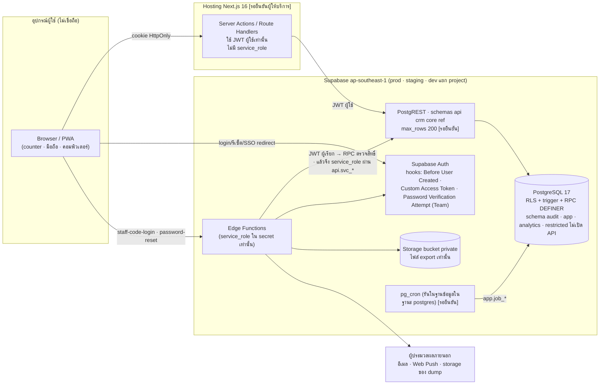
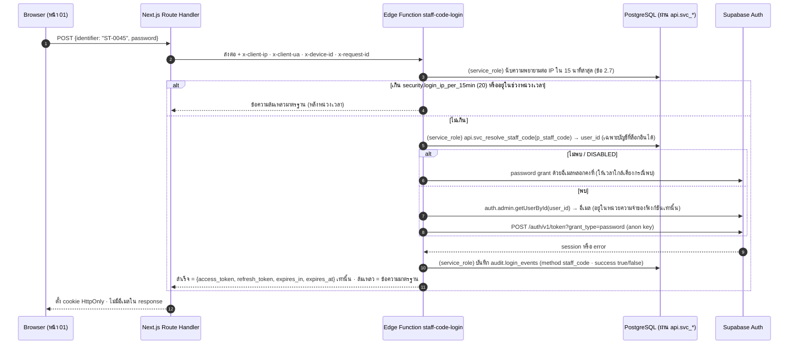
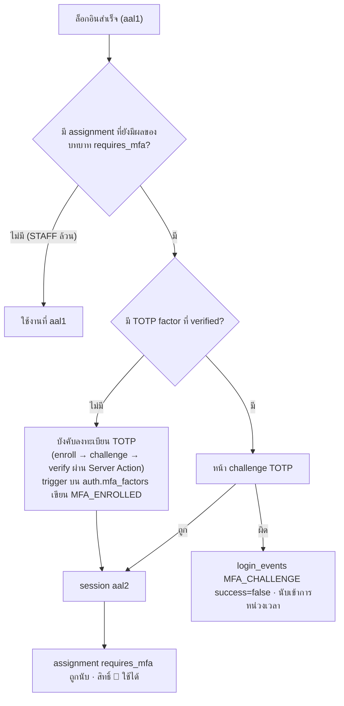
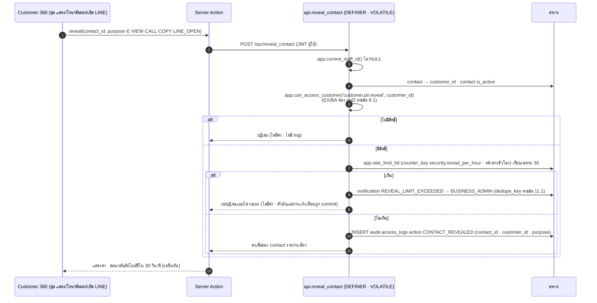
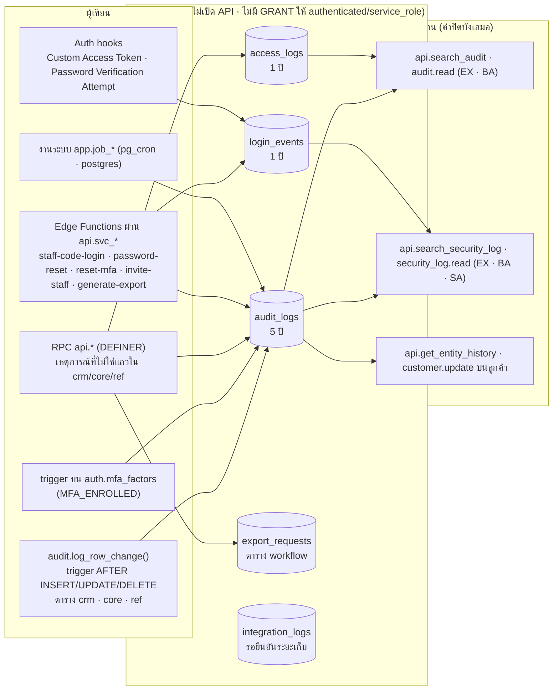
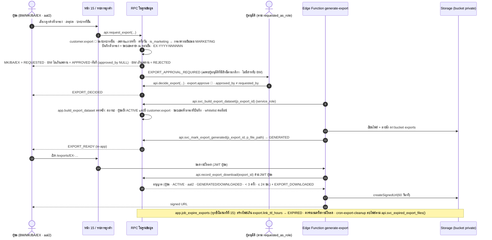
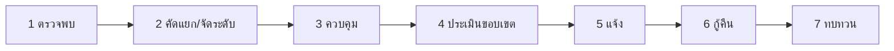

# Security Design — JAUN CRM · Customer 360 (รวม Audit Specification)

> **JAUN CRM · Customer 360** · องค์กร JAUN (JAUNPHONE 1–4 · ทีมออนไลน์ส่วนกลาง · JAUN POWER MONEY)
> จัดทำ 16 ก.ย. 2569 · ปรับตาม `docs/00-brief/CANONICAL.md` **ฉบับ v2.2** (รวมข้อตัดสินข้อ 19) · ตอบบรีฟ A29–A36 · B20–B22 และเอกสารชุดที่ 12 ของ A45 (Audit Specification)
> ชื่อตาราง/คอลัมน์/ฟังก์ชันของฐานข้อมูลอ้างตามที่สร้างจริงใน `supabase/migrations/0001–0009` (แหล่งจริงตาม CANONICAL ข้อ 19.1) · จุดที่ migration ยังไม่ตรง v2.2 ระบุว่า **"migration ต้องปรับ"**
> อ่านคู่กับ `permission-matrix.md` (ใครทำอะไรได้) · `rls-spec.md` (policy/trigger ฉบับเต็ม) · `pdpa.md` (ข้อมูลส่วนบุคคล) · `../07-api/api-spec.md` · `../03-data/data-dictionary.md` · `../08-delivery/deployment-backup-recovery.md`

**เอกสารนี้ตอบคำถามเดียว: ภัยอะไรบ้างที่ระบบต้องกัน กลไกแต่ละตัวทำงานอย่างไร บังคับที่ชั้นไหน ทดสอบอย่างไร และกันอะไรไม่ได้**

ข้อตกลงในเอกสาร
- "(CANONICAL ข้อ X)" = แหล่งของค่านั้น · ค่าที่ CANONICAL ติด **[รอยืนยัน]** ยังคงป้ายไว้
- **หมายเหตุผู้เขียน:** = จุดที่ CANONICAL ไม่ได้กำหนดหรือกำกวม ผู้เขียนเลือกการตีความที่สอดคล้องกับส่วนอื่นมากที่สุด ต้องยืนยันก่อน production (สรุปรวมในข้อ 13)
- **ข้อเสนอ** = รายละเอียดทางเทคนิคที่ CANONICAL ไม่ได้ตรึง ผู้พัฒนาใช้ได้ทันทีแต่เปลี่ยนได้โดยไม่ขัด CANONICAL

---

## 0. หลักคิด

| # | หลักคิด | ผลในระบบ | อ้างอิง |
|---|---|---|---|
| P1 | **ฐานข้อมูลคือด่านตรวจเดียวที่นับ** ผู้ใช้ทุกคนเรียก PostgREST/RPC ตรงด้วย JWT ของตนได้ | สิทธิ์ · การปิดบัง · access log · อัตรา · การเปลี่ยนสถานะ อยู่ใน RLS/trigger/RPC ทั้งหมด · Server Action ตรวจซ้ำเพื่อ UX เท่านั้น · UI ซ่อนปุ่มเพื่อความสะดวก | CANONICAL ข้อ 9.1 · A29 |
| P2 | **ไม่เชื่อสิ่งที่อยู่ในโทเคน นอกจากตัวตนและ aal** | ห้ามฝังบทบาท/สิทธิ์ลง JWT · ตรวจสดจาก `core.staff_role_assignments` + `core.role_permissions` ทุกคำขอ · staff ที่ไม่ `ACTIVE` ได้ `app.current_staff_id() = NULL` ทันทีแม้โทเคนยังไม่หมดอายุ | ข้อ 8.0 · 9.3 |
| P3 | **ปิดบังเป็นค่าเริ่มต้น ค่าเต็มมีทางเดียวและทิ้งร่องรอยทุกครั้ง** | `value_raw` ไม่อยู่ใน column grant · ค่าเต็มได้เฉพาะ `api.reveal_contact` ซึ่งเขียน `CONTACT_REVEALED` ในทรานแซกชันเดียวกันก่อนคืนค่า | ข้อ 6.4 |
| P4 | **หลักฐานต้องแก้ไม่ได้โดยผู้ที่ถูกตรวจ** | `audit.*` ไม่มี GRANT ให้ `authenticated` · REVOKE UPDATE/DELETE/TRUNCATE ทุก role · trigger `audit.deny_change()` | ข้อ 9.5 |
| P5 | **service_role เป็นกุญแจที่มนุษย์และ Next.js ไม่ถือ** | ใช้เฉพาะ Edge Functions ที่ระบุ · ทุกฟังก์ชันตรวจสิทธิ์ด้วย JWT ของผู้เรียกก่อนใช้ | ข้อ 1 · 9.8 |
| P6 | **ทุกกลไกต้องบอกขีดจำกัดของตัวเอง** | ทุกหัวข้อมี "ขีดจำกัด" · ความเสี่ยงคงเหลือรวมในข้อ 1.6 | – |

---

## 1. Threat Model

### 1.1 ขอบเขตความเชื่อถือ (trust boundary)



เส้นที่ข้ามขอบเขตทุกเส้นถือว่าผู้ส่งอาจเป็นผู้โจมตี · **เส้น `B → P` ตรงไม่มีในแผนภาพ แต่ต้องสมมติว่ามีเสมอ** เพราะผู้ใช้ที่ได้โทเคนของตนเองเรียก PostgREST ตรงได้ (CANONICAL ข้อ 9.1)

### 1.2 ทรัพย์สิน (assets)

| รหัส | ทรัพย์สิน | อยู่ที่ | ระดับชั้น (ข้อ 10.1) | ผลเมื่อรั่ว/ถูกแก้ |
|---|---|---|---|---|
| AS-01 | ค่าเต็มของช่องทางติดต่อ (`value_raw` `value_normalized`) · ที่อยู่เต็ม | `crm.customer_contacts` · `crm.customer_addresses` | Confidential | ฐานลูกค้าถูกขายต่อ/คู่แข่งดึงลูกค้า · เหตุละเมิดข้อมูลตาม PDPA |
| AS-02 | โปรไฟล์ · timeline · โน้ต · ยอดซื้อ · IMEI · tag | `crm.*` | Confidential | ละเมิดความเป็นส่วนตัว · IMEI ใช้ปลอมแปลงเครื่องได้ |
| AS-03 | ความยินยอมและคำขอเจ้าของข้อมูล | `crm.customer_consents` · `crm.data_subject_requests` | Confidential | ส่งการตลาดโดยไม่มีฐาน · พิสูจน์การปฏิบัติตามกฎหมายไม่ได้ |
| AS-04 | ไฟล์ส่งออก | Storage private · `audit.export_requests` | Confidential | รั่วครั้งละ ≤ 5,000 แถว (ข้อ 8.2) |
| AS-05 | หลักฐานการใช้งาน | `audit.audit_logs` · `access_logs` · `login_events` | Confidential | ปกปิดการกระทำผิด · สืบเหตุไม่ได้ |
| AS-06 | บทบาท · สิทธิ์ · ทีม · สมาชิกภาพ | `core.staff_role_assignments` · `core.role_permissions` · `core.team_members` | Internal (ผลกระทบสูง) | ยกระดับสิทธิ์ = เข้าถึง AS-01–AS-04 ทั้งหมด |
| AS-07 | ข้อมูลยืนยันตัวตน · session · TOTP factor | Supabase Auth · cookie | Confidential | สวมรอยผู้ใช้ |
| AS-08 | service_role key · กุญแจ SSO · SMTP · กุญแจเข้ารหัส dump | secret ของ Edge Functions / ผู้ให้บริการ | Restricted ด้านเทคนิค | ข้าม RLS ทั้งระบบ |
| AS-09 | `app.settings` (`env` `clock` `allowed_sso_domains` เกณฑ์ `security.*`) | `app.settings` | Internal (ผลกระทบสูง) | ปิดการจำกัดอัตรา · เปิด SSO ให้โดเมนอื่น · บิดนาฬิการายงาน |
| AS-10 | backup · PITR · logical dump · สำเนาทดสอบ | Supabase · storage ภายนอก | Confidential | รั่วทั้งฐานข้อมูลพร้อมกัน |

### 1.3 ผู้กระทำ (actors)

| รหัส | ผู้กระทำ | ความสามารถที่สมมติ | เป้าหมายที่เป็นไปได้ |
|---|---|---|---|
| TA-01 | **STAFF ที่ประสงค์ร้าย (malicious insider)** | บัญชี `STAFF` ถูกต้องที่สาขาหนึ่ง (aal1) · มี `customer.pii.reveal` scope B · รู้ว่า PostgREST เรียกตรงได้ · ใช้ DevTools/curl เป็น | ดูดเบอร์ลูกค้าทั้งสาขา · สืบว่าเบอร์หนึ่งเป็นลูกค้าที่สาขาอื่นหรือไม่ · ยึดลูกค้า/lead ของเพื่อน · ลบร่องรอย |
| TA-02 | STAFF ที่อยากรู้อยากเห็น | เหมือน TA-01 แต่ใช้ผ่าน UI | เปิดดูข้อมูลคนรู้จัก/คนดัง |
| TA-03 | **ผู้ได้รหัสผ่านของผู้จัดการ (compromised manager password)** | รู้อีเมล/`ST-NNNN` + รหัสผ่านของ `BRANCH_MANAGER` · **ไม่มี** TOTP | ส่งออกข้อมูล · มอบบทบาทให้ตนเอง |
| TA-04 | ผู้ขโมย session ของผู้จัดการที่ aal2 แล้ว | ได้ cookie/refresh token จากเครื่องที่ไม่ล็อก | เหมือน TA-03 ภายในอายุ session |
| TA-05 | **ผู้ดูแลระบบ IT (`SYSTEM_ADMIN`)** | บทบาท SA · บางคนอาจเป็น Owner/Admin ของ Supabase organization (break-glass ≤ 2 คน **[รอยืนยัน Q25]**) | เปิดดูข้อมูลลูกค้าผ่านบัญชีแอป · ยื่นคำขอบทบาทให้ตนเอง/พวกพ้อง · แก้ settings · ใช้สิทธิ์ dashboard ของ Supabase |
| TA-06 | **ผู้โจมตีภายนอก (ไม่มีบัญชี)** | เข้าถึง URL ของแอป · anon key (เป็นค่าสาธารณะ) · endpoint `/auth/v1/*` และ Edge Functions ก่อนล็อกอิน | ไล่หาบัญชี · เดารหัส · สมัครเอง · SSO จากโดเมนอื่น · อ่านข้อมูลด้วย anon |
| TA-07 | อดีตพนักงาน | อาจยังถือ refresh token/อุปกรณ์ · รู้กระบวนการภายใน | เข้าใช้หลังถูกปิดบัญชี |
| TA-08 | ผู้ประมวลผลภายนอก/ผู้ที่เข้าถึง storage ของ dump | อ่านอีเมล/push/ไฟล์ dump | เก็บข้อมูลลูกค้าจากช่องทางแจ้งเตือน |
| TA-09 | คนเดินผ่านที่เคาน์เตอร์ | เข้าถึงอุปกรณ์ counter ที่ยังล็อกอินค้าง | เปิดดู/ถ่ายรูปข้อมูลลูกค้า |
| TA-10 | ผู้พัฒนา/CI ที่ทำพลาด | ผลักดัน migration/โค้ด | policy รั่ว · secret หลุดใน repo · ข้อมูลจริงใน dev |

### 1.4 STRIDE → กลไก → แหล่ง → test

คอลัมน์ "test" อ้างรหัสในข้อ 10 (`RLS-*` ชุดทดสอบฐานข้อมูล · `PT-*` pen-test)

| รหัส | STRIDE | ภัย | ผู้กระทำ | กลไกที่กัน | CANONICAL | test |
|---|---|---|---|---|---|---|
| T-01 | S | สมัครบัญชีเอง/สร้างผู้ใช้ Auth ใหม่ด้วยอีเมลที่ไม่ถูกเชิญ | TA-06 | `enable_signup = false` + Before User Created hook อนุญาตเฉพาะอีเมลที่มีแถว `core.staff_invitations` | 9.2 | PT-29 |
| T-02 | S | ล็อกอิน Google ด้วยบัญชีนอกโดเมนองค์กร / Microsoft tenant อื่น | TA-06 | Google: `hd` ∈ `allowed_sso_domains` ตรวจใน Custom Access Token Hook · Microsoft: Azure single-tenant · SSO ใช้ได้เฉพาะ `ACTIVE` | 9.2.1 | PT-29 |
| T-03 | S | ใช้รหัสผ่านผู้จัดการที่รั่ว (ไม่มี TOTP) | TA-03 | assignment ที่ `requires_mfa` ไม่ถูกนับเมื่อ aal1 → ได้สิทธิ์เท่าคนไม่มีบทบาท (อ่านลูกค้า 0 แถว) · สิทธิ์ 🔐 ต้อง aal2 | 8.0 · 7 · 13.13 | RLS-03 · PT-15 |
| T-04 | S | เดารหัสผ่าน/credential stuffing | TA-06 | รหัส ≥ 12 · leaked password protection · จำกัดต่อ IP `security.login_ip_per_15min` (20) · หน่วงเวลาเพิ่มขึ้น · Team plan: Password Verification Attempt hook · ถูกล็อกเกิน 3 ครั้ง/วัน → `LOCKOUT_REPEATED` | 9.2 · 11.1 · 11.2 | PT-27 |
| T-05 | I | ไล่หาว่า `ST-NNNN`/อีเมลใดมีบัญชี ผ่าน `staff-code-login` หรือ `password-reset` | TA-06 | ไม่คืนอีเมล · ข้อความผิดพลาดเดียวกันทุกกรณี · รีเซ็ตตอบข้อความเดียวกันเสมอ | 9.2 | PT-27 · PT-28 |
| T-06 | S | ใช้ session ค้างของอดีตพนักงาน | TA-07 | `api.disable_staff` → `DISABLED` (helper คืน NULL ทันที) + `disable-staff` ban + เพิกถอน session · `valid_to = now()` ทุก assignment | 7.3 · 9.3 | PT-18 |
| T-07 | S | ใช้อุปกรณ์ counter ที่ล็อกอินค้าง | TA-09 | อุปกรณ์ `is_shared_counter` idle 10 นาที → ล็อกหน้าจอและต้องล็อกอินใหม่ · ซ่อน "จดจำฉันไว้" | 9.2 · 11.2 | PT-37 |
| T-08 | S | ขโมย refresh token ไปใช้ต่อ | TA-04 | access token 15 นาที · refresh token rotation + reuse interval 10 วินาที · idle 2 ชม. · สูงสุด 12 ชม. · cookie HttpOnly/Secure/SameSite=Lax | 9.2 | ข้อ 2.8 |
| T-09 | T | แก้คอลัมน์ระบบผ่าน PATCH ตรง (`lifecycle_stage` `legal_hold` `record_status` `owner` …) | TA-01 | column grant ของ UPDATE ไม่รวมคอลัมน์ระบบ · `app.enforce_row_transition` ปฏิเสธเสมอ | 9.4 กติกา 7 · 9.4.2 | PT-07 · PT-08 |
| T-10 | T/E | ยึด lead/opportunity ของคนอื่นโดยเปลี่ยน `owner_staff_id` | TA-01 | คอลัมน์ owner ไม่อยู่ใน column grant ของ UPDATE (ยกเว้นการรับคิวของ visit) · เปลี่ยนได้ทางเดียวคือ `api.assign_owner` ที่ต้องมี `*.assign` (STAFF ไม่มี) · owner ใหม่ต้องมี assignment ในสาขา · บันทึก `ownership_changes` | 9.4.2 · 8.1 · 9.6 | PT-08 |
| T-11 | T/E | ผูกลูกค้าสาขาอื่นเข้าสาขาตนโดยสร้าง visit/interaction ที่อ้าง `customer_id` นั้น | TA-01 | WITH CHECK `customer_id IS NULL OR customer_id IN (SELECT app.readable_customer_ids())` · ทางเดียวคือ `api.link_customer_to_branch` ที่มีเงื่อนไข visit + ผลค้นผู้สมัคร 30 นาที | 6.6 · 13.13 | PT-10 · PT-23 |
| T-12 | T | แก้/ลบ audit log เพื่อลบร่องรอย | TA-01 TA-05 | ไม่มี GRANT · REVOKE UPDATE/DELETE/TRUNCATE · `audit.deny_change()` · schema `audit` ไม่เปิด API | 9.5 | PT-32 |
| T-13 | R | ปฏิเสธว่าไม่ได้เปิดเบอร์/ไม่ได้แก้ข้อมูล | TA-01 TA-02 | `CONTACT_REVEALED` เขียนก่อนคืนค่าในทรานแซกชันเดียว · `audit.log_row_change` ติดทุกตาราง `crm` `core` `ref` · actor จาก `app.current_staff_id()` (หรือ `app.actor_staff_id` เมื่อ Edge Function เขียนด้วย service_role) + `aal` จาก JWT | 6.4 · 9.5 | PT-24 · RLS-20 |
| T-14 | I | อ่าน `value_raw` ผ่าน `select=*`/`select=value_raw` | TA-01 | `REVOKE ALL` + GRANT SELECT เฉพาะคอลัมน์ที่ปิดบัง | 6.4 · 13.13 | PT-02 · PT-03 |
| T-15 | I | ดูดเบอร์จำนวนมากด้วย `api.reveal_contact` วนลูป | TA-01 | ต้องมี `customer.pii.reveal` บนลูกค้ารายนั้น · `security.reveal_per_hour` = 30 · เกิน → **ปฏิเสธ** + `REVEAL_LIMIT_EXCEEDED` ถึง BUSINESS_ADMIN · ทุกครั้งที่ได้ค่ามี access log · เปิด Customer 360 เกิน `security.customer_view_per_hour` → `CUSTOMER_VIEW_LIMIT_EXCEEDED` (แจ้งเท่านั้น) | 6.4 · 11.1 · 11.2 | PT-12 |
| T-16 | I | ไล่ตรวจว่าเบอร์ใดเป็นลูกค้า (ทั้งองค์กร) ผ่าน `api.find_customer_candidates` | TA-01 | ต้องมี `customer.create` · ต้องมีตัวระบุเต็ม · การ์ดนอกขอบเขตคืนแค่ `customer_no` + ชื่อย่อ · ≤ 60 ครั้ง/ชม. · ไม่พบผล > 20 ครั้ง/ชม. → บล็อก 1 ชม. + แจ้ง · เก็บ `sha256` ของค่าที่ค้น | 6.5 | PT-21 · PT-22 |
| T-17 | I | IDOR: ส่ง UUID ลูกค้า/lead ของสาขาอื่นเข้า RPC | TA-01 | RPC ตรวจสิทธิ์บรรทัดแรกด้วย `app.can_access_customer`/`app.can_access_record` · RLS ของตาราง | 9.3 · 9.6 | PT-13 · PT-14 |
| T-18 | I | ใช้ read-through ของลูกค้าเพื่ออ่านงาน (tasks) ของคนอื่น | TA-01 | `tasks` `task_comments` ไม่มี read-through (`task.read` อย่างเดียว) | 9.4 | RLS-01 (`TK-2026-012508` คุณคิม ✗) |
| T-19 | I | ขอแถวจำนวนมากด้วย `limit` ใหญ่ | TA-01 | PostgREST `max_rows = 200` **[รอยืนยัน]** · RLS จำกัดขอบเขตอยู่แล้ว | 1.1 | PT-17 |
| T-20 | I | KPI/รายงานหลุดรายชื่อลูกค้า | TA-01 TA-05 | `api.get_kpis` `api.get_report` คืนตัวเลขรวมเท่านั้น · view `analytics` ไม่เปิด API | 9.4.1 | RLS-10 |
| T-21 | I | ไฟล์ export ถูกส่งต่อ/ดาวน์โหลดซ้ำ | TA-01 TA-04 | ข้อ 8.2 ครบวงจร (ข้อ 7 ของเอกสารนี้) · ลายน้ำ `staff_code` · ≤ 3 ครั้ง · 24 ชม. · signed URL 60 วินาที · ต้อง aal2 | 8.2 | PT-30 |
| T-22 | I | cache ของ PWA/เบราว์เซอร์เก็บข้อมูลลูกค้าไว้หลังออกจากระบบ | TA-09 | SW ห้าม cache route ที่ต้องล็อกอิน `/rest/v1` `/rpc` `/auth` · `Cache-Control: no-store` · logout ล้าง storage | 9.2 | PT-37 |
| T-23 | I | push/อีเมลรั่วชื่อหรือเบอร์ลูกค้าไปผู้ประมวลผลภายนอก | TA-08 | push/อีเมลมีเฉพาะป้าย + เลขอ้างอิง + deep link ที่ต้องล็อกอิน | 1.4 · 11.1 | PT-38 |
| T-24 | I | ข้อมูลจริงหลุดไป dev/staging | TA-10 | seed สังเคราะห์ · สำเนา prod ต้องผ่าน `tools/db/anonymize.sql` + สคริปต์ตรวจ + ลบ project ภายใน 24 ชม. | 9.7 | ข้อ 8.3 |
| T-25 | I | เลขบัตรประชาชนถูกพิมพ์ลงช่องข้อความอิสระ | TA-02 | `app.trg_guard_restricted_text` ปฏิเสธเลข 13 หลักที่ checksum ถูก · คำเตือนบนฟอร์ม | 10.1 · 6.9 | PT-31 |
| T-26 | D | ยิง RPC ค้นหา/ล็อกอินจนระบบช้า | TA-06 TA-01 | อัตราต่อผู้ใช้ (`app.rate_limit_counters`) · ต่อ IP ที่ล็อกอิน (`security.login_ip_per_15min`) · rate limit ของ Supabase Auth · monitoring error rate RPC > 2% | 6.5 · 9.2 · 9.7 · 11.2 | PT-21 |
| T-27 | D | ล็อกบัญชีผู้อื่นด้วยการกรอกรหัสผิดจงใจ | TA-06 | ไม่ล็อกบัญชีจากทุกที่ ใช้การหน่วงเวลาเพิ่มขึ้น · Team plan ล็อกตามคู่ (บัญชี, IP) | 9.2 | PT-27 |
| T-28 | E | มอบบทบาทให้ตนเอง/มอบ rank สูงกว่าตน | TA-01 TA-03 TA-05 | ห้ามมอบ/ถอนของตนเอง · ห้าม rank ≥ rank สูงสุดของตน · `role.assign` 🔐 · SA ยื่นคำขอ + EX อนุมัติ (ผู้อนุมัติ ≠ ผู้ยื่น ≠ ผู้รับ ≠ `employee_code` เดียวกัน) · การถอน EX/BA/SA ใช้คำขอ RG ชนิด `REVOKE` เส้นทางเดียวกัน · ห้ามมอบให้บัญชี `DISABLED` · ลบคำขอไม่ได้ | 7.2 | PT-33 |
| T-29 | E | SYSTEM_ADMIN อ่านข้อมูลลูกค้า | TA-05 | SA ไม่มีสิทธิ์ `customer.*` `visit.*` `lead.*` `opportunity.*` (test) · ห้ามถือร่วมกับบทบาทธุรกิจ · `security_log.read` ไม่คืน access log/รายการลูกค้า | 7.1 · 7.2 · 9.5 · 13.13 | PT-34 |
| T-30 | E | ใช้ `service_role` จาก Next.js หรือเครื่องนักพัฒนา | TA-10 TA-05 | key อยู่ใน secret ของ Edge Function เท่านั้น · Edge Function ตรวจสิทธิ์ด้วย JWT ผู้เรียก · ไม่รับ actor จาก body | 9.8 | ข้อ 4.3 |
| T-31 | E | เรียก helper/job ใน schema `app` ตรง | TA-01 | schema `app` ไม่เปิด API · EXECUTE เฉพาะ helper ข้อ 9.3 · `ALTER DEFAULT PRIVILEGES … REVOKE EXECUTE … FROM PUBLIC` | 1.1 · 9.6 | PT-05 |
| T-32 | E/T | BUSINESS_ADMIN/SA แก้ `app.settings` เพื่อปิดการป้องกัน | TA-05 | `settings.business`/`settings.system` 🔐 ตาม `editable_by` · `SETTINGS_UPDATED` อยู่ใน security log ที่ EX อ่านได้ | 11.2 · 9.5 | RLS-30 |
| T-33 | I | ใช้ view ที่ไม่ใช่ `security_invoker` ข้าม RLS | TA-10 | ทุก view `WITH (security_invoker = true)` · ห้าม materialized view ใน schema ที่เปิด API · CI check คืน 0 แถว | 9.4 กติกา 4 | CI-01 |
| T-34 | I | policy เรียกฟังก์ชันที่รับคอลัมน์ของแถว (ช้า/รั่วผ่าน side effect) | TA-10 | กติกา 9.4 ข้อ 2–3 · lint ใน CI | 9.4 | CI-04 |
| T-35 | R/T | ข้อมูลใน backup ถูกแก้/ลบเพื่อทำลายหลักฐาน | TA-05 | dump เข้ารหัสฝั่งต้นทาง · storage versioning/object lock 90 วัน · กุญแจถือโดยคนที่ไม่ใช่ผู้ดูแล storage | 9.7 | ข้อ 9 |

### 1.5 สถานการณ์ตามผู้กระทำหลัก

| ผู้กระทำ | ลำดับการโจมตีที่คาด | ด่านที่หยุด | สิ่งที่เหลือให้เห็นในหลักฐาน |
|---|---|---|---|
| **TA-01 STAFF ประสงค์ร้าย** | ① `GET /rest/v1/customer_contacts?select=value_raw` ② วน `rpc/reveal_contact` ③ วน `rpc/find_customer_candidates` ด้วยเบอร์สุ่ม ④ PATCH `leads.owner_staff_id` ⑤ ถ่ายรูปหน้าจอ | ① column grant ② ครั้งที่ 31 ในชั่วโมงถูกปฏิเสธ + แจ้ง BA ③ ต้องมีตัวระบุเต็ม · 60/ชม. · miss 20/ชม. บล็อก ④ column grant (owner ไม่อยู่ใน UPDATE grant) ⑤ **กันไม่ได้** | ② `CONTACT_REVEALED` ต่อครั้ง ③ `CUSTOMER_CANDIDATE_SEARCH` + hash ④ ไม่มีแถวเปลี่ยน (คำขอถูกปฏิเสธ) |
| **TA-03 รหัสผ่านผู้จัดการรั่ว** | ล็อกอินได้ aal1 → ขอ `api.request_export` / อ่านลูกค้า | บทบาท `BRANCH_MANAGER` `requires_mfa` → ไม่ถูกนับที่ aal1 · UI บังคับ challenge TOTP | `audit.login_events` (ล็อกอินสำเร็จ aal1 + MFA ไม่ผ่าน) |
| **TA-04 session ผู้จัดการถูกขโมย** | ส่งออก 500 แถว/ครั้ง 3 ครั้ง/วัน · เปิดเบอร์ | เพดาน 8.2 · อายุ session ≤ 12 ชม. · idle 2 ชม. · reveal 30/ชม. | `EXPORT_REQUESTED` `EXPORT_DOWNLOADED` · ลายน้ำในไฟล์ระบุ `staff_code` ของเจ้าของ session |
| **TA-05 IT admin** | ① ใช้บัญชี SA อ่านลูกค้า ② ยื่นคำขอ BUSINESS_ADMIN ให้บัญชีอีกบัญชีของตน ③ ใช้สิทธิ์ Owner ของ Supabase เปิด SQL editor | ① 0 แถว ② EX อนุมัติ · บัญชีที่ SA เชิญรับบทบาทธุรกิจไม่ได้จนกว่า BA ยืนยันตัวตนกับ HR ③ **กันด้วยเทคนิคไม่ได้** — จำกัดคน ≤ 2 · break-glass มีบันทึกเหตุผล **[รอยืนยัน Q25]** | ② `ROLE_GRANT_REQUESTED` `ROLE_GRANT_DECIDED` ③ audit log ของ Supabase organization (นอกฐานข้อมูล) |
| **TA-06 ภายนอก** | ไล่ `ST-0001…ST-9999` ที่ `staff-code-login` · สมัครเอง · anon อ่าน `crm` | ข้อความเดียวกัน + จำกัดต่อ IP · signup ปิด · `anon` ไม่มี GRANT | `audit.login_events` (ล้มเหลว · IP ที่รายงาน) |

### 1.6 ความเสี่ยงคงเหลือ (กลไกในเอกสารนี้กันไม่ได้)

| # | ความเสี่ยง | เหตุผล | มาตรการชดเชย |
|---|---|---|---|
| R-01 | ผู้มีสิทธิ์ reveal จดหรือถ่ายรูปเบอร์ | ค่าเต็มต้องไปถึงหน้าจอเพื่อโทร | access log ต่อครั้ง · เพดาน 30/ชม. · คู่มือพนักงาน (`pdpa.md` ข้อ 8) · ตรวจรายงาน reveal รายสัปดาห์ **[รอยืนยันความถี่]** |
| R-02 | owner ของฐานข้อมูล (`postgres`) และ Owner ของ Supabase organization ข้าม RLS · ปิด trigger ได้ | owner = `postgres` มี BYPASSRLS (ข้อ 1.1) | ≤ 2 คน break-glass · dump เข้ารหัสแบบ object lock ใช้เป็นหลักฐานเทียบ |
| R-03 | Pro plan: การนับรหัสผิดเป็น best-effort | เรียก `/auth/v1/token` ตรงได้โดยไม่ผ่าน Server Action (ข้อ 9.2) | leaked password protection · รหัส ≥ 12 · rate limit ของ Supabase Auth · ย้าย Team plan ถ้ายืนยัน Q6 |
| R-04 | `ip` `user_agent` `device_id` ปลอมได้ | เป็นค่า "ที่รายงาน" (ข้อ 9.5) | ห้ามใช้ตัดสินสิทธิ์ (ข้อ 9.2) · ใช้ประกอบการสืบเท่านั้น |
| R-05 | hash `sha256` ของเบอร์โทรย้อนหาได้ด้วยการลองทุกค่า | พื้นที่เบอร์มือถือไทยเล็ก (หลักร้อยล้านค่า) | **ความเสี่ยงที่ยอมรับ** (CANONICAL ข้อ 19.4 ข้อ 6): ไม่ใส่ salt · ไม่ส่ง hash ออกนอกฐานข้อมูล (ข้อ 6.5) · keyed hash พิจารณา Phase 3 |
| R-06 | ข้อความอิสระอาจมีข้อมูลอ่อนไหวอื่นนอกจากเลขบัตร | guard ตรวจได้เฉพาะรูปแบบเลขบัตร | คำเตือนบนฟอร์ม · อบรม · ตรวจสุ่ม |
| R-07 | ไฟล์ export ที่ดาวน์โหลดแล้วอยู่นอกการควบคุม | เป็นธรรมชาติของการส่งออก | อนุมัติ · เพดาน · ลายน้ำ · ไม่มีโน้ต/IMEI ในไฟล์ |

---

## 2. การยืนยันตัวตนและเซสชัน (A34 · B20) **[รอยืนยันตัวเลขและแพ็กเกจ Q6]**

### 2.1 วิธีเข้าสู่ระบบ

| วิธี | เส้นทาง | ใช้ได้กับ | หมายเหตุ |
|---|---|---|---|
| อีเมล + รหัสผ่าน | Server Action → Supabase Auth password grant | บัญชี `ACTIVE` (และ `INVITED` ระหว่าง flow คำเชิญ) | Server Action นับรหัสผิด (Pro plan) ก่อนส่งต่อ |
| `staff_code` (`ST-NNNN`) + รหัสผ่าน | Edge Function `staff-code-login` | เหมือนข้างบน | ไม่คืนอีเมล · ข้อความผิดพลาดเดียวกันทุกกรณี (D24) |
| Google | OAuth ของ Supabase Auth | `ACTIVE` เท่านั้น · `hd` ∈ `app.settings['allowed_sso_domains']` | ซ่อนปุ่มถ้าไม่มี Workspace **[รอยืนยัน Q5]** |
| Microsoft | Azure single-tenant ขององค์กร | `ACTIVE` เท่านั้น | เหมือนข้างบน |
| TOTP (ขั้นที่สอง) | Supabase MFA challenge/verify | ผู้มีบทบาท `requires_mfa` | ข้อ 2.6 |

ช่องกรอกหน้า 01 รับทั้งอีเมลและ `ST-NNNN`: ถ้าค่าที่กรอกตรง regex `^ST-\d{4,}$` (ไม่สนตัวพิมพ์ · แปลงเป็นตัวใหญ่ก่อนส่ง) ให้เรียก `staff-code-login` มิฉะนั้นถือเป็นอีเมล (ข้อเสนอ)

### 2.2 `staff-code-login` — ล็อกอินด้วยรหัสพนักงานโดยไม่เปิดเผยอีเมล



กติกาที่ต้องทำให้ครบ

| # | กติกา | แหล่ง |
|---|---|---|
| 1 | response สำเร็จ **ตัดอ็อบเจกต์ `user` ของ Supabase ทิ้ง** (มีอีเมล) คืนเฉพาะโทเคน · หน้าจอดึงชื่อที่แสดงจาก `core.staff_profiles` ภายหลัง | 9.2 |
| 2 | ความล้มเหลวทุกแบบ (ไม่พบรหัส · รหัสผ่านผิด · `DISABLED` · ถูกหน่วงเวลา · อีเมลยังไม่ยืนยัน) คืน **HTTP status เดียวกันและ body เดียวกันทุกไบต์** · ข้อความภาษาไทย **รอยืนยัน** (`../06-ux/sitemap-screen-specs.md`) | 9.2 |
| 3 | ไม่รับ `staff_id`/`user_id`/อีเมลจาก body | 9.8 |
| 4 | Edge Function ตั้ง `verify_jwt = false` (ก่อนล็อกอินไม่มี JWT) จึงต้องจำกัดอัตราต่อ IP เอง · IP ใช้ค่าจาก header ของแพลตฟอร์ม Edge (ไม่ใช้ `x-client-ip` ที่ผู้เรียกส่งเอง) | 9.2 · ข้อเสนอ |
| 5 | บัญชีที่ต้อง MFA ได้ session aal1 → หน้าจอพาไป challenge TOTP ทันที | 9.2 |
| 6 | เรียกฐานข้อมูลผ่าน `api.svc_resolve_staff_code(p_staff_code)` เท่านั้น (คืน `user_id` ใช้ภายในฟังก์ชัน · ห้ามส่งอีเมลออก) · ไม่ใช้ connection string ตรง | 9.6 · 9.8 |
| 7 | การทำ password grant ด้วยอีเมลหลอกคงที่ในกรณีไม่พบบัญชี (ลดการแยกด้วยเวลา) · อีเมลหลอกต้องไม่มีบัญชีจริงและต้องไม่ถูกนับเข้า lockout | ข้อเสนอ |
| 8 | RPC `svc_` สำหรับเขียน `audit.login_events` และนับความพยายามต่อ IP ไม่มีชื่อในข้อ 9.6 → ชื่อ **รอยืนยัน** ใน `../07-api/api-spec.md` (ต้องขึ้นต้น `svc_` · GRANT ให้ `service_role` เท่านั้น) | 9.6 · 9.8 |

ขีดจำกัด: ผู้ใช้ที่ล็อกอินแล้วเรียก `/auth/v1/user` ได้อีเมล **ของตนเอง** เสมอ (ยอมรับได้ — ภัยคือการหาอีเมลของคนอื่น)

### 2.3 ปิดการสมัครเอง · invite-only (ข้อ 7.3)

| ชั้น | การตั้งค่า |
|---|---|
| Supabase Auth | Dashboard "Allow new users to sign up" = off · CLI `[auth] enable_signup = false` |
| Before User Created hook | ปฏิเสธถ้าอีเมล (lower-case) ไม่มีแถวใน `core.staff_invitations` (ข้อเสนอเพิ่ม: และคำเชิญยังไม่หมดอายุ) — ครอบคลุมทั้ง `inviteUserByEmail` และการสร้างผู้ใช้จาก SSO ครั้งแรก |
| คำเชิญ | Edge Function `invite-staff` (ข้อ 4.3) สร้าง `core.staff_invitations` + `core.staff_profiles` (`INVITED` · `invite_expires_at = +24 ชม.`) **ก่อน** เรียก `auth.admin.generateLink`/`inviteUserByEmail` · คำเชิญสร้าง assignment พร้อมกัน (มีผลเมื่อ `ACTIVE`) · บัญชีสาย SYSTEM_ADMIN ไม่มี assignment จนกว่าคำขอ RG ได้รับอนุมัติ · คำเชิญหมดอายุ = เชิญใหม่ (ข้อ 19.3 ข้อ 6) |
| อายุลิงก์อีเมล | Supabase ใช้อายุ OTP/ลิงก์ค่าเดียว → ตั้ง **3600 วินาที** · คำเชิญมีอายุ 24 ชม. ตาม `core.staff_profiles.invite_expires_at` โดย `invite-staff` ออกลิงก์ใหม่ได้ภายในกรอบนี้ (ข้อ 9.2) |
| bootstrap | สคริปต์สร้าง EXECUTIVE คนแรก + SYSTEM_ADMIN คนแรก + บัญชี `INVITED` ของ BUSINESS_ADMIN คนแรก · บทบาท BA มอบผ่านคำขอ RG ที่ EXECUTIVE อนุมัติ และ EXECUTIVE ยืนยันตัวตนกับ HR แทน BA (ข้อ 7.2) |
| เปิดใช้งาน | พนักงานตั้งรหัสผ่าน → ลงทะเบียน TOTP ถ้าบทบาทต้องใช้ → `api.activate_self()` ตรวจ `email_confirmed_at` · คำเชิญไม่หมดอายุ (เทียบ `now()` ไม่ใช่ `app.clock()` · ข้อ 1.2) · มี verified factor เมื่อจำเป็น → `ACTIVE` |
| Redirect URL | allow-list ของ Supabase Auth ต้องมีเฉพาะโดเมนของ environment นั้น (ข้อเสนอ · ป้องกันลิงก์คำเชิญ/รีเซ็ตพาไปโดเมนอื่น) |

### 2.4 SSO (ข้อ 9.2.1)

| ตรวจอะไร | ที่ไหน | ผลเมื่อไม่ผ่าน |
|---|---|---|
| ผู้ให้บริการ Google: claim `hd` ∈ `allowed_sso_domains` | Custom Access Token Hook (อ่าน identity ของผู้ใช้จาก `auth.identities`) | hook คืน error → ไม่ออกโทเคน · เขียน `login_events` (`event_type = 'SSO_LOGIN'` · `success = false`) |
| ผู้ให้บริการ Microsoft: tenant ขององค์กร | ตั้งค่า Azure provider เป็น single-tenant | Azure ปฏิเสธก่อนถึง Supabase |
| staff ของ `user_id` ต้อง `ACTIVE` เมื่อเข้าด้วย SSO | Custom Access Token Hook | บัญชี `INVITED` ต้องจบ flow คำเชิญด้วยรหัสผ่านก่อน |
| อีเมลไม่ได้ถูกเชิญ | Before User Created hook (ข้อ 2.3) | ไม่สร้างผู้ใช้ |
| `allowed_sso_domains = []` | Next.js ซ่อนปุ่ม · hook ปฏิเสธทุก SSO | – |

- Custom Access Token Hook **ห้ามเพิ่ม claim บทบาท/สิทธิ์/สาขา** (ข้อ 8.0) — ทำได้เพียงอนุญาต/ปฏิเสธการออกโทเคนและเขียน `login_events`
- hook ทำงานทุกครั้งที่ออกโทเคน (รวม refresh) จึงเป็นจุดบันทึกเหตุการณ์ `TOKEN_REFRESH` ได้ด้วย (ข้อ 6.7)
- ผู้แก้ `allowed_sso_domains` = SA (`settings.system` 🔐) · บันทึก `SETTINGS_UPDATED`

### 2.5 รหัสผ่าน

| ค่า | ตั้งที่ |
|---|---|
| ความยาว ≥ 12 ตัวอักษร | Auth → Password minimum length |
| Leaked password protection = เปิด | Auth → Password security |
| Secure password change = เปิด (ต้องยืนยันตัวตนล่าสุดก่อนเปลี่ยน) | Auth |
| **ไม่มี** กติกาห้ามใช้ซ้ำ 5 ครั้ง | บังคับไม่ได้บน Supabase Auth (D43) |

### 2.6 MFA (TOTP)

**ใครต้องใช้:** บทบาทที่ `core.roles.requires_mfa = true` = ทุกบทบาทยกเว้น `STAFF` (ข้อ 7)



| หัวข้อ | กติกา | แหล่ง |
|---|---|---|
| ผลของ aal1 | assignment ของบทบาท `requires_mfa` ไม่ถูกนับ → ได้สิทธิ์เท่าไม่มีบทบาท (เช่น คุณนัท SV@JP1 aal1 อ่าน `CUS-2026-000297` ไม่ได้) · สิทธิ์จาก `STAFF` ยังใช้ได้ | 8.0 · 13.13 |
| สิทธิ์ 🔐 (step-up) | `role_permissions.requires_aal2 = true` ไม่ถูกนับเมื่อไม่ใช่ aal2 · ตรวจจาก `app.is_aal2()` ในแต่ละคำขอ ไม่ใช่สถานะที่ UI จำไว้ | 8.0 · 9.3 |
| UI step-up | เมื่อ RPC ปฏิเสธเพราะ aal (รหัส error **รอยืนยัน** ใน `api-spec.md`) หน้าจอเปิด challenge แล้วลองซ้ำ | ข้อเสนอ |
| ลงทะเบียน | ระหว่างรับคำเชิญ (ข้อ 7.3 ขั้น 3) หรือครั้งแรกที่ได้บทบาท `requires_mfa` | 7.3 |
| รีเซ็ต MFA / เปลี่ยนอีเมล / ตัวตนล็อกอิน | บัญชีเป้าหมายที่ assignment ที่ยังมีผลเป็น `STAFF` หรือบทบาท rank ≥ SUPERVISOR (SV · BM · MK · OP) → ผู้กระทำ `BUSINESS_ADMIN` · บัญชีเป้าหมายที่ถือ `BUSINESS_ADMIN` `EXECUTIVE` หรือ `SYSTEM_ADMIN` → ผู้กระทำ `EXECUTIVE` · ผ่าน Edge Function `reset-mfa` · ผู้กระทำต้อง aal2 · แจ้งอีเมลเดิมทุกครั้ง · บันทึก `MFA_RESET` · ตรวจอำนาจด้วย `api.svc_reset_mfa_authorize(...)` (ข้อ 4.3) | 7.3 ข้อ 6 · 9.6 |
| บัญชีที่ถือหลายบทบาท | ใช้กติกาที่เข้มกว่า: ถือ BA/EX/SA อย่างน้อยหนึ่งบทบาท → ต้องเป็น `EXECUTIVE` · ห้ามรีเซ็ตของตนเอง (ข้อเสนอ ตามหลัก "ห้ามมอบ/ถอนของตนเอง" ข้อ 7.2) | ข้อเสนอ |
| สูญเสียอุปกรณ์ | Supabase ไม่มี recovery code → ใช้ `reset-mfa` · หลังรีเซ็ตเพิกถอน session ของบัญชีเป้าหมาย (ข้อเสนอ) · EXECUTIVE คนเดียวในระบบเสียอุปกรณ์ (ไม่มี EX อื่นรีเซ็ตให้) → **รอยืนยัน** (break-glass ของ Owner Supabase · Q25) | 7.3 · Q25 |

### 2.7 การกรอกรหัสผ่านผิดและการหน่วงเวลา

| แพ็กเกจ | กลไก | ขอบเขต |
|---|---|---|
| **Team plan** | Password Verification Attempt hook: นับความล้มเหลวตามคู่ (บัญชี, IP) · เกินเกณฑ์ → hook ตอบปฏิเสธชั่วคราว | ครอบคลุมทุกเส้นทางรวม `/auth/v1/token` ตรง |
| **Pro plan** (ค่าที่ใช้ไปก่อน Q6) | นับใน Server Action และ `staff-code-login` | **best-effort** — เรียก `/auth/v1/token` ตรงไม่ผ่านตัวนับ |
| ทั้งสองแบบ | จำกัดต่อ IP `security.login_ip_per_15min` = **20 ครั้ง/15 นาที** · หน่วงเวลาเพิ่มขึ้นแทนการล็อกบัญชีจากทุกที่ · ถูกล็อกเกิน **3 ครั้ง/วัน** → แจ้ง `LOCKOUT_REPEATED` ถึง BUSINESS_ADMIN (in-app + email) | 9.2 · 11.1 · 11.2 |

- ค่าการหน่วงเวลาแต่ละขั้นและเกณฑ์ต่อคู่ (บัญชี, IP): **รอยืนยัน** (ไม่มีใน CANONICAL)
- ที่นับ (ข้อเสนอ): `app.rate_limit_counters` มี `staff_id NOT NULL` จึงเก็บตัวนับต่อ IP ของผู้ที่ยังไม่ระบุตัวไม่ได้ → นับจาก `audit.login_events` (`ip` · `occurred_at` · `success = false`) ในหน้าต่าง 15 นาทีเทียบ `now()` · "ถูกล็อก" = แถวที่ `event_type = 'LOCKOUT'` (ข้อ 6.7) นับต่อ `user_id` ต่อวัน Asia/Bangkok · ต้องเพิ่ม index `(ip, occurred_at)` ใน migration
- `LOCKOUT_REPEATED` ผู้รับ = BUSINESS_ADMIN · `dedupe_key` ตามข้อ 11.1 (จุดยึด = วันที่ของการล็อกครั้งที่ 4) · ข้อความ push/email ไม่มีข้อมูลลูกค้า
- ทุกความล้มเหลวและทุกการหน่วง/ล็อกเขียน `audit.login_events` (ข้อ 6.7)
- ตั้ง rate limit ของ Supabase Auth (sign-in/token/verify/OTP) ให้ไม่หลวมกว่าเกณฑ์ข้างบน **[รอยืนยันค่า]**

### 2.8 โทเคนและเซสชัน

| ค่า | ตั้งที่ | ผล |
|---|---|---|
| Access token (JWT expiry) **15 นาที** | Auth → JWT expiry = 900 | สิทธิ์ถูกประเมินสดทุกคำขออยู่แล้ว (ข้อ 8.0) · 15 นาทีจำกัดอายุโทเคนที่ถูกขโมย |
| Refresh token rotation **เปิด** · reuse interval **10 วินาที** | Auth → Sessions | refresh token ใช้ซ้ำเกิน 10 วินาที → Supabase เพิกถอนทั้ง session family |
| Inactivity timeout **2 ชม.** · Time-box **12 ชม.** | Auth → Sessions (Pro ขึ้นไป) | ตรวจตอน refresh จึงยาวได้อีก ≤ 15 นาที |
| ปิดบัญชี | `api.disable_staff` + `disable-staff` | ทันทีที่ `DISABLED`: `app.current_staff_id()` = NULL → ทุก policy/RPC ปฏิเสธแม้ access token ยังเหลืออายุ · ban + เพิกถอน session ปิดการ refresh |
| "จดจำฉันไว้" | หน้า 01 | จำเฉพาะค่าที่กรอกในช่อง (อีเมล/`ST-NNNN`) ใน `localStorage` · **ไม่ยืดอายุ session** · ไม่ติ๊กไว้ก่อน · ซ่อนบนอุปกรณ์ counter (D34) |

### 2.9 อุปกรณ์ counter ใช้ร่วมกัน

| หัวข้อ | กติกา | แหล่ง |
|---|---|---|
| ลงทะเบียน | `core.devices` (`device_id` · `branch_id` · `is_shared_counter` · `label` · `is_active`) โดย BRANCH_MANAGER ผ่าน `api.register_device(p_device_id, p_branch_id, p_is_shared_counter)` (DEFINER · `user.update` scope B ของสาขานั้น) · audit `DEVICE_CREATED`/`DEVICE_UPDATED` (ข้อ 6.6) | 9.2 · 9.6 |
| `device_id` | UUID สร้างครั้งแรกในเบราว์เซอร์ เก็บ `localStorage` · **ไม่ถูกล้างตอน logout** · ส่งทุกคำขอเป็น `x-device-id` | 9.2 · 9.5 |
| idle | `session.shared_counter_idle_min` = **10** นาทีไม่มีการกด/พิมพ์ → ล็อกหน้าจอ **และ** เรียก sign-out จริง (ไม่ใช่แค่ overlay) → ต้องล็อกอินใหม่ | 9.2 · 11.2 |
| ข้อจำกัด | ผู้ใช้แก้ `device_id` ในเบราว์เซอร์ได้ → ใช้เป็นกลไกความสะดวก/ลดความเสี่ยงที่เคาน์เตอร์เท่านั้น **ห้ามใช้ตัดสินสิทธิ์** · idle 2 ชม. ฝั่ง server ยังคุมอยู่ | 9.2 |

### 2.10 ลืมรหัสผ่าน — Edge Function `password-reset`

1. ผู้ใช้กรอกอีเมลหรือ `ST-NNNN` → Edge Function (`verify_jwt = false` · จำกัดอัตราต่อ IP **[รอยืนยันค่า]**)
2. หา auth user จาก staff_code หรืออีเมล · **ส่งลิงก์เฉพาะบัญชี `ACTIVE`** ไปอีเมลที่ลงทะเบียน · ลิงก์อายุ **1 ชม.**
3. ตอบข้อความเดียวกันเสมอ ไม่ว่าพบบัญชีหรือไม่ (ข้อความ **รอยืนยัน**)
4. เมื่อผู้ใช้ตั้งรหัสใหม่สำเร็จ → **เพิกถอน session ทั้งหมด** ของผู้ใช้ (sign-out แบบ global) แล้วให้ล็อกอินใหม่
5. บันทึก `login_events` ทั้งการขอและการตั้งรหัสใหม่ (ข้อ 6.7) · อีเมลรีเซ็ตไม่มีข้อมูลลูกค้า (ข้อ 1.4)

### 2.11 ออกจากระบบ

ลำดับฝั่ง client (ข้อ 9.2):
1. เรียก Server Action sign-out → Supabase เพิกถอน refresh token ของ session นี้ · ลบ cookie
2. ล้าง **Cache Storage · IndexedDB · sessionStorage · localStorage** ทั้งหมด **ยกเว้น `device_id` และค่าที่ "จดจำ" `login_id`** (ข้อ 9.2)
3. ยกเลิกการสมัคร Web Push ของอุปกรณ์นี้ (ข้อเสนอ · กันการแจ้งเตือนของผู้ใช้เดิมเด้งบนอุปกรณ์ counter)
4. เขียน `login_events` เหตุการณ์ออกจากระบบ (ข้อ 6.7)

### 2.12 PWA และ cache

| กติกา | รายละเอียด |
|---|---|
| service worker **ห้าม** cache | route ที่ต้องล็อกอินทั้งหมด · `/rest/v1` · `/rpc` · `/auth` (ทั้ง path ของ Supabase และ Route Handler ของแอป) |
| cache ได้ | ไฟล์ static ที่มี hash ในชื่อ (JS/CSS/ฟอนต์ Kanit/ไอคอน) · หน้า offline ที่ไม่มีข้อมูล |
| header | response ที่มีข้อมูลลูกค้า `Cache-Control: no-store` |
| push payload | `title` = ป้ายการแจ้งเตือน · เลขอ้างอิง (เช่น `TK-2026-012508`) · deep link · **ไม่มีชื่อ เบอร์ หรือข้อมูลลูกค้า** (ข้อ 1.4 · 11.1) |

### 2.13 Cookie · CSP · header

| หัวข้อ | ค่า | แหล่ง |
|---|---|---|
| Cookie session | `HttpOnly` · `Secure` · `SameSite=Lax` | 9.2 |
| ผลของ HttpOnly | JavaScript ในเบราว์เซอร์อ่านโทเคนไม่ได้ → **ทุกการเรียก Supabase ที่ต้องใช้ session (รวม MFA enroll/challenge) ทำผ่าน Server Action/Route Handler** | 1 · 9.2 · 19.4 ข้อ 4 |
| CSP | strict — ข้อเสนอขั้นต่ำ: `default-src 'self'` · `script-src 'self' 'nonce-{random}' 'strict-dynamic'` · `style-src 'self' 'nonce-{random}'` · `img-src 'self' data:` · `font-src 'self'` · `connect-src 'self'` (+ URL ของ Supabase เฉพาะถ้าเบราว์เซอร์ต้องเรียก Auth ตรง) · `object-src 'none'` · `base-uri 'none'` · `frame-ancestors 'none'` · `form-action 'self'` | 9.2 · ข้อเสนอ |
| CSRF | SameSite=Lax + การตรวจ Origin ของ Server Actions (Next.js) · Route Handler ที่เปลี่ยนสถานะรับเฉพาะ POST และตรวจ `Origin` | ข้อเสนอ |
| header อื่น | `Strict-Transport-Security` · `X-Content-Type-Options: nosniff` · `Referrer-Policy: same-origin` · `Permissions-Policy` ปิดกล้อง/ไมค์/ตำแหน่ง | ข้อเสนอ |
| ข้อความจากผู้ใช้ | render ผ่าน React (escape อัตโนมัติ) · ห้าม `dangerouslySetInnerHTML` กับโน้ต/summary | ข้อเสนอ |

---

## 3. ชั้นการตรวจสิทธิ์ (สรุป · รายละเอียดอยู่ใน `permission-matrix.md` และ `rls-spec.md`)

เอกสารนี้ไม่ทำซ้ำตารางสิทธิ์ (CANONICAL ข้อ 8.1) หรือข้อความ policy · ส่วนนี้บอกว่าแต่ละชั้นรับผิดชอบอะไรและ **ห้ามพึ่งชั้นใดแทนชั้นใด**

| ชั้น | กลไก | รับผิดชอบ | นับเป็นการตรวจสิทธิ์? | เอกสารละเอียด |
|---|---|---|:--:|---|
| L0 | UI ซ่อน/ปิดปุ่ม · `data-roles` ของหน้า | ความสะดวก | ✗ | `../06-ux/sitemap-screen-specs.md` |
| L1 | Server Action ตรวจล่วงหน้า (`app.has_permission`) | ข้อความผิดพลาดที่ดี | ✗ | `../07-api/api-spec.md` |
| L2 | การเปิด schema ของ PostgREST | `api` `crm` `core` `ref` เท่านั้น · `audit` `app` `analytics` `restricted` ไม่เปิด · `anon` ไม่มี GRANT · `max_rows = 200` **[รอยืนยัน]** | ✓ | ข้อ 1.1 |
| L3 | GRANT ระดับตาราง/คอลัมน์ | ตารางที่เขียนผ่าน trigger/RPC เท่านั้น (9.4 กติกา 6) · คอลัมน์ระบบและคอลัมน์ owner ไม่อยู่ใน UPDATE grant (กติกา 7 · 9.4.2 · ยกเว้นการรับคิวของ visit) · `customer_contacts` `customer_addresses` เปิดเฉพาะคอลัมน์ปิดบัง | ✓ | `rls-spec.md` |
| L4 | RLS policy | ขอบเขต O/T/B/G ต่อแถวการมอบบทบาท (ข้อ 8.0) · read-through ผ่านลูกค้าเฉพาะตารางที่ระบุ | ✓ | `rls-spec.md` · `permission-matrix.md` |
| L5 | `app.enforce_row_transition()` (BEFORE INSERT และ BEFORE UPDATE · INVOKER) | สถานะเริ่มต้นที่อนุญาต · owner ที่ไม่ใช่ตนต้องมี `*.assign` · สิทธิ์ที่ขึ้นกับคอลัมน์ที่เปลี่ยน (assign · close · reopen · ย้ายสาขา · แก้หลังส่ง · 24 ชม.) | ✓ | ข้อ 9.4.2 · `rls-spec.md` |
| L6 | RPC `api.*` SECURITY DEFINER | ตรวจสิทธิ์บรรทัดแรก · งานหลายตารางในทรานแซกชันเดียว · การปิดบัง · access log · อัตรา | ✓ | ข้อ 9.6 · `api-spec.md` |
| L7 | audit/access log | หลักฐาน (ไม่ป้องกัน) | – | ข้อ 6 ของเอกสารนี้ |

**Invariant ที่ต้องมี test ทุกข้อ** (ห้ามให้การ refactor ใดทำลาย)

| # | invariant | แหล่ง |
|---|---|---|
| INV-01 | ห้ามยุบ scope ข้ามสาขา: BM@JP1 + ST@JP2 ได้ B ที่ JP1 และ O ที่ JP2 เท่านั้น | 8.0 · 13.13 |
| INV-02 | assignment ของบทบาท `requires_mfa` และสิทธิ์ 🔐 ไม่ถูกนับที่ aal1 | 8.0 |
| INV-03 | ไม่มีบทบาท/สิทธิ์ใน JWT claim | 8.0 |
| INV-04 | SYSTEM_ADMIN ไม่มี `customer.*` `visit.*` `lead.*` `opportunity.*` และถือร่วมกับบทบาทธุรกิจไม่ได้ | 7.1 · 7.2 |
| INV-05 | `tasks` `task_comments` ไม่มี read-through | 9.4 |
| INV-06 | `app.can_access_record` / `app.can_access_customer` / `app.staff_has_branch_assignment` ใช้ใน trigger/RPC เท่านั้น ห้ามอยู่ใน policy | 9.3 |
| INV-07 | policy ห้ามเรียกฟังก์ชันที่รับคอลัมน์ของแถว · ห่อ helper ด้วย `(SELECT …)` · policy ของตาราง X ห้ามอ้าง X | 9.4 กติกา 2–3 |
| INV-08 | ทุก view `security_invoker = true` · ไม่มี materialized view ใน schema ที่เปิด API | 9.4 กติกา 4 |
| INV-09 | ไม่มี DELETE สำหรับ `authenticated` ยกเว้นที่ข้อ 8.3 อนุญาต (`customer_tags` · items ตามสถานะแม่) | 9.4 กติกา 5 · 8.3 |
| INV-10 | ห้ามถือ `MARKETING` ร่วมกับ `BUSINESS_ADMIN` ในบัญชีเดียว **[รอยืนยัน Q22]** | 8.2 |

### 3.1 เช็กลิสต์ฟังก์ชัน SECURITY DEFINER (ใช้ตอน review ทุก migration)

| # | ข้อ | แหล่ง |
|---|---|---|
| F-01 | owner = `postgres` · ไม่มี owner role อื่น | 1.1 · 9.6 |
| F-02 | `SET search_path = ''` · อ้างชื่อเต็มทุกวัตถุ รวม `extensions.similarity()` `OPERATOR(extensions.%)` | 1 · 9.6 |
| F-03 | บรรทัดแรกตรวจ `app.current_staff_id() IS NOT NULL` + สิทธิ์ของงานนั้น · ปฏิเสธก่อนอ่านข้อมูลใด | 9.6 |
| F-04 | `REVOKE EXECUTE … FROM PUBLIC` (default privileges ทั้งฐาน) → ทุกฟังก์ชันที่ `authenticated`/`service_role` เรียกตรงต้อง GRANT EXECUTE เอง · `authenticated` ได้เฉพาะ `api.*` (ที่ไม่ขึ้นต้น `svc_`) และ helper ข้อ 9.3 · `api.svc_*` GRANT ให้ `service_role` เท่านั้นและตรวจ `auth.role() = 'service_role'` บรรทัดแรก | 1.1 · 9.6 · 19.1 ข้อ 2 |
| F-05 | ไม่รับ `staff_id`/actor จากพารามิเตอร์เพื่อใช้เป็นผู้กระทำ · ข้อยกเว้นเดียว: `api.svc_*` รับ `sub` ที่ Edge Function verify แล้ว (ข้อ 4.2) | 9.5 · 9.8 |
| F-06 | volatility ตามข้อ 9.6 · ฟังก์ชันที่เขียน log/ตัวนับต้อง `VOLATILE` · **เรียก VOLATILE ด้วย HTTP POST เท่านั้น** (PostgREST รัน GET ในทรานแซกชัน read-only) | 9.6 · ข้อเสนอ |
| F-07 | ห้าม dynamic SQL ที่ต่อสตริงจากผู้ใช้ · ถ้าจำเป็นใช้ `format('%I', …)`/`%L` | ข้อเสนอ |
| F-08 | ค่าที่คืนไม่มีค่าเต็มของ contact ยกเว้น `api.reveal_contact` | 6.4 |
| F-09 | งานที่ถูกปฏิเสธเพราะเกินอัตรา **คืนผลแบบไม่ raise** เพื่อให้ตัวนับ/การบล็อก/การแจ้งเตือนถูก commit — ถ้า raise ทรานแซกชันทั้งหมด rollback รวมตัวนับ · รูปแบบผล (เช่น jsonb `{"error":"RATE_LIMITED"}`) ข้อเสนอ · ละเอียดใน `api-spec.md` | 6.4 · ข้อ 5.6 |

---

## 4. service_role และ Edge Functions (ข้อ 9.8)

### 4.1 กติการ่วม

1. service_role ใช้ได้เฉพาะ Edge Functions: `invite-staff` · `disable-staff` · `reset-mfa` · `staff-code-login` · `password-reset` · `generate-export` · `integration-*` · `cron-*`
2. ฟังก์ชันที่มีผู้เรียกเป็นผู้ใช้ต้อง (1) verify JWT (2) เรียก RPC ตรวจสิทธิ์ด้วย **JWT ของผู้เรียก** ก่อนใช้ service_role (3) ไม่รับ actor/staff_id จาก body (4) เขียน audit ด้วย actor จาก JWT
3. service_role key อยู่ใน secret ของ Edge Function เท่านั้น — ห้ามอยู่ใน Next.js (รวม env ของ hosting) ห้ามอยู่ใน repo/CI log ห้ามมนุษย์ถือ
4. Edge Function เรียกฐานข้อมูลด้วย service_role **ผ่าน `api.svc_*` เท่านั้น** (ไม่ใช้ connection string ตรง · ไม่ PATCH/INSERT ตารางผ่าน PostgREST ด้วย service_role) · `api.svc_*` GRANT EXECUTE ให้ `service_role` เท่านั้นและตรวจ `auth.role() = 'service_role'` บรรทัดแรก (ข้อ 9.6 · 9.8)
5. ข้อเสนอ: ใน Edge Function สร้าง Supabase client **สองตัวแยกตัวแปร** — `userClient` (anon key + `Authorization: Bearer <JWT ผู้เรียก>`) สำหรับขั้นตรวจสิทธิ์ และ `adminClient` (service_role) ที่สร้างหลังตรวจผ่านเท่านั้น · lint ห้ามใช้ `adminClient` ก่อนบรรทัดตรวจสิทธิ์
6. ข้อเสนอ: ใช้ service_role เฉพาะสิ่งที่ JWT ผู้ใช้ทำไม่ได้ (Auth Admin API · Storage bucket `exports` · `api.svc_*`) · งานที่ RPC ของผู้ใช้ทำได้ ให้เรียกด้วย `userClient`

### 4.2 การระบุผู้กระทำเมื่อเขียนด้วย service_role (CANONICAL ข้อ 9.5 · 19.1 ข้อ 9)

`audit.log_row_change()` ได้ actor จาก `app.current_staff_id()` ซึ่งผูก `auth.uid()` — เมื่อ Edge Function เขียนด้วย service_role ค่านี้เป็น NULL จึงใช้กติกานี้:

1. Edge Function ได้ `sub` จาก JWT ของผู้เรียกที่ verify แล้ว (ไม่ใช่จาก body)
2. Edge Function เรียก `api.svc_*` ด้วย `adminClient` โดยส่ง `sub` นั้น · ฟังก์ชัน `svc_` หา `core.staff_profiles` ที่ `user_id = sub` และ `status = 'ACTIVE'` (ไม่พบ → ปฏิเสธ) แล้ว `PERFORM set_config('app.actor_staff_id', <staff_profiles.id>, true)` ก่อนเขียนข้อมูลใด ในทรานแซกชันเดียวกัน
3. `audit.log_row_change()`: `v_staff_id := app.current_staff_id()` · ถ้า NULL **และ** `auth.role() = 'service_role'` → `v_staff_id := nullif(current_setting('app.actor_staff_id', true), '')::uuid` (ต้องเป็น staff `ACTIVE`) → `actor_type = 'STAFF'` · ถ้ายังว่าง → `SYSTEM` + `actor_label` ของงาน (`app.actor_label`)
4. `aal` ของแถว audit อ่านจาก `auth.jwt()` ซึ่งเป็นโทเคนของ service_role (ไม่มี claim `aal`) → เก็บ `NULL` · ฟังก์ชันที่ต้อง aal2 (เช่น `reset-mfa`) ตรวจ aal ของผู้เรียกก่อนเรียก `svc_` (ข้อ 4.3) · **หมายเหตุผู้เขียน:** ข้อ 19.1 ข้อ 9 ไม่มี setting สำหรับส่ง aal ของผู้เรียกเข้า trigger จึงไม่เพิ่ม `app.actor_aal`
5. ข้อ 9.5 เขียนว่า "sub จาก JWT" แต่ชื่อ setting คือ `actor_staff_id` → เอกสารนี้ตีความว่าเก็บ `core.staff_profiles.id` ที่แปลงจาก `sub` (ตรงกับคอลัมน์ `audit_logs.actor_staff_id`) — **หมายเหตุผู้เขียน**
6. test: ผู้ใช้ `authenticated` ตั้ง `app.actor_staff_id` เองต้องไม่มีผลต่อ actor (เพราะ `auth.role() = 'authenticated'`) · `svc_` ที่ถูกเรียกด้วย JWT ของ `authenticated` ถูกปฏิเสธ (ไม่มี EXECUTE)
7. **migration ต้องปรับ:** `audit.log_row_change()` ใน `0008_audit.sql` ยังไม่อ่าน `app.actor_staff_id`

### 4.3 เช็กลิสต์รายฟังก์ชัน

| ฟังก์ชัน | ผู้เรียก | verify JWT | ตรวจสิทธิ์ด้วย JWT ผู้เรียก | ใช้ service_role ทำอะไร | ห้ามรับจาก body | audit / log | อัตรา | ข้อควรระวัง |
|---|---|---|---|---|---|---|---|---|
| `invite-staff` | BM · BA · SA (หน้า 13) | ✓ | `api.can_assign_role(...)` ต้องคืน true (+ `user.invite`) · SA เชิญได้เฉพาะสาย SA ที่ผ่านคำขอ | `api.svc_prepare_invite(...)` สร้าง `core.staff_invitations` + `core.staff_profiles` (`INVITED` · `invite_expires_at` +24 ชม.) **ก่อน** → `auth.admin.generateLink`/`inviteUserByEmail` | `invited_by` · `branch_id` นอกสาขาที่ล็อก | `STAFF_INVITED` actor = ผู้เรียก (ข้อ 4.2) | **รอยืนยัน** | ถ้าส่งอีเมลล้มเหลวให้คงแถว `INVITED` และออกลิงก์ใหม่ได้ภายใน 24 ชม. · อีเมลคำเชิญไม่มีข้อมูลลูกค้า |
| `disable-staff` | BM · BA · SA¹ | ✓ | `api.disable_staff(...)` (`user.disable` 🔐 · กติกาข้อ 7.3 ข้อ 4–5) ทำขั้นฐานข้อมูลทั้งหมดก่อน · ไม่มีผู้จัดการสาขารับ opportunity → ปฏิเสธจนกว่าจะโอนงานด้วย `api.assign_owner` | ban ผู้ใช้ใน Auth + เพิกถอนทุก session → `api.svc_finalize_disable(...)` | `actor` | `STAFF_DISABLED` · `ROLE_REVOKED` ต่อ assignment (จาก trigger) | – | ลำดับ: ฐานข้อมูลก่อน (ผลทันที) → ban → finalize · ถ้า ban ล้มเหลวให้ retry และแจ้ง SA (บัญชี `DISABLED` อ่านข้อมูลไม่ได้อยู่แล้ว) |
| `reset-mfa` | BA · EX ตามกติกาข้อ 2.6 | ✓ + ต้อง aal2 | `userClient` เรียก `api.get_my_access()` ยืนยัน staff `ACTIVE` และ aal ปัจจุบัน = aal2 → `adminClient` เรียก `api.svc_reset_mfa_authorize(...)` ซึ่งตรวจซ้ำจากตาราง: ผู้กระทำ ACTIVE · บทบาทผู้กระทำตามข้อ 7.3 ข้อ 6 · ไม่ใช่บัญชีตนเอง · ตั้ง `app.actor_staff_id` | ลบ TOTP factor · เปลี่ยนอีเมล/ตัวตนล็อกอิน · เพิกถอน session เป้าหมาย (ข้อเสนอ) | `actor` (body มีได้เฉพาะเป้าหมายและชนิดการรีเซ็ต) | `MFA_RESET` (+ `STAFF_UPDATED` เมื่อเปลี่ยน `core.staff_profiles.email`) | – | **แจ้งอีเมลเดิมทุกครั้ง** รวมกรณีเปลี่ยนอีเมล · ลำดับการเขียน `MFA_RESET` เทียบกับการเรียก Auth Admin API (authorize ก่อน · บันทึกผลหลังสำเร็จ) และพารามิเตอร์ของ `svc_reset_mfa_authorize` **รอยืนยัน** ใน `api-spec.md` |
| `staff-code-login` | ไม่มี JWT (ก่อนล็อกอิน) | ✗ (`verify_jwt = false`) | – | `api.svc_resolve_staff_code(p_staff_code)` → `user_id` · Auth Admin หาอีเมลภายในฟังก์ชัน · เขียน `login_events` · นับต่อ IP | – | `login_events` | `security.login_ip_per_15min` (20) | ข้อ 2.2 · ไม่คืนอีเมล · ข้อความเดียวกันทุกกรณี |
| `password-reset` | ไม่มี JWT | ✗ | – | หาบัญชีจาก `ST-NNNN` (`api.svc_resolve_staff_code`)/อีเมล · สร้างลิงก์รีเซ็ต (1 ชม.) | – | `login_events` | ต่อ IP **รอยืนยัน** | ข้อ 2.10 · ส่งเฉพาะ `ACTIVE` · ตอบเหมือนกันเสมอ |
| `generate-export` | ระบบหลังคำขอเข้าสถานะที่สร้างไฟล์ได้ · และผู้ขอตอนดาวน์โหลด (ข้อ 7) | ✓ (ตอนดาวน์โหลด) | ตอนดาวน์โหลด: `api.record_export_download(export_id)` ด้วย **JWT ผู้ขอ** ต้องสำเร็จก่อน | `api.svc_build_export_dataset(p_export_id)` (ตรวจซ้ำครบข้อ 8.2) → เขียนไฟล์ลง bucket `exports` → `api.svc_mark_export_generated(p_export_id, p_file_path)` → `GENERATED` · ตอนดาวน์โหลดสร้าง signed URL 60 วินาที | `requested_by` · คอลัมน์ · ตัวกรอง | `EXPORT_DOWNLOADED` (จาก RPC) | ข้อ 8.2 | signed URL ออกโดยฟังก์ชันนี้หลัง `api.record_export_download` สำเร็จด้วย JWT ผู้ขอเท่านั้น · bucket `exports` ไม่มี storage policy ให้ authenticated (ข้อ 9.8) |
| `integration-*` (Phase 4) | ระบบ/ผู้ดูแล integration | ตามชนิด | ตั้งค่า: `integration.manage` 🔐 (SA) · ส่งข้อมูลออกนอกระบบต้องให้ EX อนุมัติ | รับ/ส่งข้อมูลกับระบบภายนอก | – | `audit.integration_logs` · `INTEGRATION_UPDATED` · `actor_type = 'INTEGRATION'` | **รอยืนยัน** | V1 มีเฉพาะ `MANUAL` (ข้อ 13.14) |
| `cron-export-cleanup` | scheduler **[รอยืนยัน]** | ✗ แต่ต้องมี shared secret ใน header (ข้อเสนอ) | – | อ่าน `api.svc_expired_export_files()` → ลบ object ใน bucket `exports` | ทุก actor | `actor_type = 'SYSTEM'` | – | ลบไฟล์ของคำขอที่ `app.job_expire_exports` เปลี่ยนเป็น `EXPIRED` แล้ว (ฐานข้อมูลลบ object ใน Storage เองไม่ได้) · ข้อ 9.6 |

¹ SA ปิดใช้งานได้เฉพาะบัญชีที่ไม่มีบทบาทธุรกิจ (ข้อ 8.1 เชิงอรรถ ¹)

**งานตามเวลาในฐานข้อมูล** (ไม่ผ่าน Edge Function · ข้อ 9.6): pg_cron รันในฐานข้อมูลในฐานะ `postgres` · migration แยกไฟล์ `supabase/migrations/*_cron.sql` (PGlite runner ข้าม) · ทุกงานตั้ง `app.actor_type = 'SYSTEM'` และ `app.actor_label` (เช่น `SYSTEM:close_stale_visits` · `SYSTEM:retention`)

| งาน | Asia/Bangkok | cron (UTC) |
|---|---|---|
| `app.job_close_stale_visits(p_as_of)` | 00:05 ทุกวัน | `5 17 * * *` |
| `app.job_expire_quotations(p_as_of)` | 00:10 ทุกวัน | `10 17 * * *` |
| `app.job_retention(p_as_of)` | 02:00 ทุกวัน | `0 19 * * *` |
| `app.job_expire_exports(p_as_of)` | ทุกชั่วโมง นาทีที่ 15 | `15 * * * *` |
| `app.job_notifications(p_as_of)` | ทุก 5 นาที | `*/5 * * * *` |

ขั้นตอนตรวจก่อน deploy Edge Function ทุกตัว

- [ ] ไม่มี service_role key ใน bundle ของ Next.js (`grep` build output หา prefix ของ key และค่า `SUPABASE_SERVICE_ROLE_KEY`)
- [ ] ฟังก์ชันที่มีผู้ใช้เรียก: `verify_jwt = true` และมีการเรียก RPC ตรวจสิทธิ์ด้วย `userClient` ก่อน `adminClient` ถูกสร้าง
- [ ] `adminClient` เรียกฐานข้อมูลเฉพาะ `api.svc_*` (ต้องไม่พบการอ่าน/เขียนตารางผ่าน `.from('<table>')` ของ `adminClient` หรือ connection string ของ Postgres ในโค้ด Edge Function · `storage.from('exports')` ใช้ได้)
- [ ] ไม่อ่าน `actor` `staff_id` `user_id` `requested_by` จาก body/query
- [ ] ข้อความผิดพลาดไม่มีอีเมล/ข้อมูลลูกค้า/stack trace
- [ ] ส่ง `x-request-id` ต่อให้ฐานข้อมูลเพื่อผูก audit (ข้อ 9.5)
- [ ] มี test ที่เรียกด้วย JWT ของผู้ไม่มีสิทธิ์แล้วต้องไม่มีผลข้างเคียงใดใน Auth/Storage/DB

---

## 5. การปกป้องข้อมูลส่วนบุคคลในระดับเทคนิค

รายการคอลัมน์ข้อมูลส่วนบุคคลทั้งหมด ระดับชั้น และป้าย `pii` อยู่ใน `pdpa.md` ข้อ 2 · ส่วนนี้คือกลไก

### 5.1 Column grant

| ตาราง | SELECT ที่ `authenticated` ได้ | ไม่ได้ | เขียนผ่าน | แหล่ง |
|---|---|---|---|---|
| `crm.customer_contacts` | `id` `organization_id` `customer_id` `contact_type` `value_masked` `is_primary` `is_valid` `is_active` `verified_at` `created_at` `updated_at` | `value_raw` `value_normalized` `created_by` `updated_by` | `api.save_contact` (normalize + mask ในฐานข้อมูล) | 6.4 |
| `crm.customer_addresses` | `district` `province_code` `value_masked` (`{อำเภอ} · {จังหวัด}`) + คอลัมน์ที่ไม่ใช่ที่อยู่ (`id` `customer_id` `is_primary` `is_active` เวลา) | `address_line` `subdistrict` `postal_code` (ป้าย `[pii]`) · เปิดเต็มผ่าน `api.reveal_address(p_address_id, p_purpose)` | `api.save_address` | 6.4 · 19.1 ข้อ 5 |
| `core.staff_profiles` (ผู้ใช้ ACTIVE ในองค์กร) | `id` `staff_code` `display_name` `nickname` `status` | คอลัมน์อื่น (อ่านผ่าน `api.list_staff` ด้วย `user.read`) | RPC | 8.3 |
| `crm.notifications` | แถวของตน | – | UPDATE เฉพาะ `read_at` ของตน | 8.3 |
| `audit.*` · `app.*` · `analytics.*` | ไม่มี | ทั้งหมด | trigger/RPC | 1.1 · 9.4 |

- test บังคับ: `GET /rest/v1/customer_contacts?select=value_raw` ถูกปฏิเสธ (ข้อ 13.13) · `select=*` ต้องถูกปฏิเสธด้วย (PostgREST ขยาย `*` เป็นทุกคอลัมน์) → หน้าจอต้องระบุคอลัมน์ทุกครั้ง
- ห้ามสร้าง view/computed column/relationship ที่คืน `value_raw` ใน schema ที่เปิด API

### 5.2 รูปแบบการปิดบัง

| สิ่ง | รูปแบบ | ใช้ที่ | แหล่ง |
|---|---|---|---|
| PHONE มือถือ | `081-XXX-5678` | UI · ผลค้นหา · การ์ดผู้สมัคร (เฉพาะเมื่อตรงด้วยเบอร์) · export ของ BM · audit | 6.4 |
| PHONE เบอร์บ้าน | `02-XXX-4567` | เหมือนข้างบน | 6.4 |
| EMAIL | อักษรแรก + `***@` + โดเมน `s***@example.com` | เหมือนข้างบน | 6.4 |
| LINE_ID · FACEBOOK · INSTAGRAM · TIKTOK | 2 อักษรแรก + `***` เช่น `so***` | เหมือนข้างบน | 6.4 |
| LINE_USER_ID | ไม่แสดง (`—`) | – | 6.4 |
| ชื่อลูกค้านอกขอบเขตในการ์ดผู้สมัคร | ชื่อ + นามสกุลย่อ `สมชาย ใ.` | `api.find_customer_candidates` | 6.5 |
| ที่อยู่ | `value_masked` = `{อำเภอ} · {จังหวัด}` | UI | 6.4 · 19.1 ข้อ 5 |
| ค่าใน audit | `{"masked":"081-XXX-1234","sha256":"…"}` (รูปแบบ masked ของแต่ละชนิดในข้อ 6.5) | `audit.audit_logs.before/after` · `crm.customer_merges.snapshot` | 9.5 · ข้อ 6.5 |
| push · อีเมล | ไม่มีข้อมูลลูกค้าเลย | ผู้ประมวลผลภายนอก | 1.4 |

การปิดบัง contact ทำในฐานข้อมูลด้วย `app.mask_contact(contact_type, value)` และ normalize ด้วย `app.normalize_contact(contact_type, value)` (สร้างแล้วใน migration) · `value_masked` คำนวณในฐานข้อมูลเท่านั้น (ฝั่ง client ห้ามส่งค่าปิดบังมาเอง)

### 5.3 การเปิดค่าเต็ม — `api.reveal_contact(p_contact_id, p_purpose)`



| กติกา | แหล่ง |
|---|---|
| ค่าเต็มได้ทางเดียว · ปุ่ม "โทร" "คัดลอก" "เปิด LINE" เรียกฟังก์ชันนี้ก่อนเสมอ · ห้ามฝังค่าเต็มใน HTML ตอนโหลดหน้า · ห้ามเก็บค่าที่เปิดใน state ข้ามการเปลี่ยนหน้า | 6.4 |
| `CONTACT_REVEALED` เขียน **ก่อนคืนค่าในทรานแซกชันเดียวกัน** · ถ้า INSERT log ล้มเหลว ทรานแซกชันล้มทั้งหมดและไม่มีค่ากลับไป | 6.4 · 9.5 |
| ปุ่ม "โทร" สร้าง interaction `OUTBOUND` PHONE แบบร่างให้ยืนยันหลังวางสาย | 6.4 |
| เกิน `security.reveal_per_hour` (30) → **ปฏิเสธ** โดยคืนผลแบบไม่ raise (ตัวนับและการแจ้งเตือนถูก commit) + แจ้ง `REVEAL_LIMIT_EXCEEDED` ถึง BUSINESS_ADMIN (in-app + email) | 6.4 · 11.1 · 11.2 |
| ตัวนับ: `app.rate_limit_counters` `counter_key = 'security.reveal_per_hour'` · `window_start` = ต้นชั่วโมงของ `now()` (ข้อ 5.6) | 6.5 · 1.2 |
| `api.reveal_address(p_address_id, p_purpose)` ใช้ flow เดียวกัน (`customer.pii.reveal` · คืน `address_line` `subdistrict` `postal_code` ของที่อยู่รายการเดียว) · **รหัส access log ของการเปิดที่อยู่ไม่มีในข้อ 9.5 → รอยืนยัน** · ข้อเสนอ: action `ADDRESS_REVEALED` + `detail = {"address_id": …}` + ใช้ตัวนับ `security.reveal_per_hour` ร่วมกัน (ต้องเพิ่มค่าใน CHECK `access_logs_action_chk` ของ `0008_audit.sql`) — **หมายเหตุผู้เขียน** | 6.4 · 9.5 · 9.6 |
| PostgREST ต้องตั้ง `db-tx-end = commit` (ค่าเริ่มต้น) — **ห้าม** `commit-allow-override`/`rollback-allow-override` มิฉะนั้นผู้เรียกส่ง `Prefer: tx=rollback` แล้วได้ค่าเต็มขณะที่ access log ถูก rollback | ข้อเสนอ (PT-24) |

ขีดจำกัด: ค่าที่เปิดแล้วอยู่บนหน้าจอผู้ใช้ (R-01) · เพดานเป็นต่อชั่วโมง ผู้ใช้ที่อดทนเปิดได้ 30 ครั้ง × ชั่วโมงทำงาน — ชดเชยด้วยรายงาน reveal และการแจ้งเตือน

### 5.4 ค้นหาทั่วไป — `api.search_customers(p_term)`

| กติกา | แหล่ง |
|---|---|
| เบอร์ · อีเมล · LINE ID · IMEI (15 หลัก) · เลขธุรกรรม: normalize แล้ว **ตรงทั้งค่าเท่านั้น** กับ `value_normalized` · ห้าม LIKE/prefix/trigram บนค่า contact | 6.5 |
| ชื่อ: trigram บน `name_search` · `customer_no` `LD-` `OP-` `QT-`: ตรงทั้งค่า · ขั้นต่ำ 3 ตัวอักษร | 6.5 |
| คืนเฉพาะรายการที่ผู้เรียกอ่านได้ · ค่า contact ที่คืนเป็น `value_masked` | 6.5 |
| อัตรา `security.search_per_hour` = 60 ต่อผู้ใช้ | 6.5 · 11.2 |
| บันทึก `audit.access_logs` action `CUSTOMER_SEARCH`: `search_hashes` = sha256 hex ของค่า normalized ที่ใช้ค้น (เบอร์/LINE/อีเมล/IMEI) · `result_count` · **ไม่เก็บคำค้นจริงและไม่เก็บคำค้นชื่อ (แม้เป็น hash)** | 6.5 · 9.5 · คอลัมน์ตาม `0008_audit.sql` |
| ซ่อนช่องค้นหาสำหรับ MARKETING และ SYSTEM_ADMIN (UI · ฐานข้อมูลยังคืนเฉพาะรายการที่อ่านได้ ซึ่งเป็น 0 สำหรับสองบทบาทนี้) | 14.3 |

### 5.5 ตรวจซ้ำ — `api.find_customer_candidates(...)` และ `api.link_customer_to_branch(...)`

ช่องทางนี้ **ค้นทั้งองค์กร** โดยตั้งใจ (D16) จึงเป็นช่องทางไล่ตรวจสมาชิกภาพลูกค้า (enumeration) ที่ต้องคุมเข้มที่สุด

| ด่าน | กติกา | ผู้โจมตีได้อะไรถ้าผ่าน | แหล่ง |
|---|---|---|---|
| สิทธิ์ | ต้องมี `customer.create` (ST/SV/BM/BA) | – | 6.5 |
| อินพุต | ต้องมีตัวระบุเต็มอย่างน้อย 1 อย่าง (phone/line_id/email) · ส่งชื่ออย่างเดียวไม่ได้ | ไล่ด้วยชื่อไม่ได้ | 6.5 |
| visit | `p_visit_id` (ถ้ามี) ต้อง `WAITING`/`IN_SERVICE` ในสาขาที่มี `visit.update` สร้างภายใน 4 ชม. **[รอยืนยัน]** | – | 6.5 |
| ผลนอกขอบเขต | `customer_no` · ชื่อ + นามสกุลย่อ · เบอร์ปิดบัง **เฉพาะเมื่อตรงด้วยเบอร์** · คะแนน · เหตุผล · **ไม่คืน** lifecycle สาขา วันที่ติดต่อ | รู้ว่าเบอร์นี้เป็นลูกค้า JAUN + ชื่อต้น | 6.5 |
| อัตรา | ≤ 60 ครั้ง/ชม./ผู้ใช้ · ค้นด้วยตัวระบุที่ไม่พบผล > 20 ครั้ง/ชม. → บล็อก 1 ชม. + `SEARCH_LIMIT_EXCEEDED` ถึง BUSINESS_ADMIN **[รอยืนยัน]** | ≤ 60 ค่าต่อชั่วโมง · ไล่สุ่มโดนบล็อกหลัง 21 ครั้งที่ไม่พบ | 6.5 · 11.1 |
| หลักฐาน | `audit.access_logs` action `CUSTOMER_CANDIDATE_SEARCH`: `search_hashes` = sha256(ค่า normalized) ของตัวระบุแต่ละตัว · `visit_id` · `result_count` · `detail` (ข้อเสนอ) = `{"result_customer_ids": [...], "scores": [...]}` (uuid และคะแนนไม่ใช่ PII · ใช้ตรวจเงื่อนไข 30 นาทีของการผูกสาขา) | – | 6.5 · 6.6 |
| ผูกสาขา | `api.link_customer_to_branch(p_customer_id, p_visit_id)`: สาขามาจาก visit · visit ในสาขาที่มี `visit.update` · `WAITING`/`IN_SERVICE` · สร้างภายใน 4 ชม. · `visits.customer_id` ยังว่าง · ลูกค้าอยู่ใน `detail.result_customer_ids` ของ `CUSTOMER_CANDIDATE_SEARCH` ของผู้เรียก **สำหรับ visit นี้** ภายใน 30 นาที · ตั้ง `visits.customer_id` ในทรานแซกชันเดียว · `CUSTOMER_LINKED_TO_BRANCH` · เกิน `security.link_per_day` (10) ครั้ง/วัน/ผู้ใช้ → แจ้ง `LINK_LIMIT_EXCEEDED` ถึง BRANCH_MANAGER ของสาขานั้น (in-app · **ไม่บล็อก**) **[รอยืนยัน]** | เห็นลูกค้าเต็ม (ตาม scope B) — ต้องมีลูกค้าอยู่ตรงหน้าจริงในทางปฏิบัติ | 6.6 · 11.1 |
| การสร้างรายการของลูกค้าที่ไม่มีแม่ | `branch_id` ต้องเป็นสาขาที่ลูกค้าเชื่อมอยู่แล้วใน `customer_branches`/`first_branch_id` เว้นแต่ scope ORGANIZATION → ผูกข้ามสาขาได้ทางเดียวคือ RPC ข้างบน | – | 8.0 |
| โหมด "เพิ่มลูกค้า" (ไม่มี visit) | ปุ่ม "ใช้ลูกค้าเดิม" ของลูกค้านอกขอบเขตแสดงแบบปิดพร้อมเหตุผล "ผูกลูกค้าจากสาขาอื่นได้เฉพาะตอนรับลูกค้า" | – | 19.3 ข้อ 4 |

### 5.6 ตารางอัตรา (rate limit)

| กฎ | ค่า | settings key | ใช้ใน | หน่วยนับ | เมื่อเกิน | แหล่ง |
|---|---|---|---|---|---|---|
| เปิดค่าเต็ม | 30 ครั้ง/ชม. | `security.reveal_per_hour` | `api.reveal_contact` (+ `api.reveal_address` ข้อเสนอ) | ต่อ staff | **ปฏิเสธ** (ไม่ raise) + `REVEAL_LIMIT_EXCEEDED` → BA | 6.4 · 11.1 · 11.2 |
| ค้นหา | 60 ครั้ง/ชม. | `security.search_per_hour` | `api.search_customers` · `api.find_customer_candidates` (**หมายเหตุผู้เขียน:** นับรวมสองฟังก์ชันในตัวนับเดียว เพราะข้อตกลงของ `app.rate_limit_counters.counter_key` = key ของ settings และข้อ 11.2 มี key เดียว) | ต่อ staff | ปฏิเสธ | 6.5 · 11.2 |
| ค้นไม่พบผล | 20 ครั้ง/ชม. | `security.search_miss_per_hour` | `api.find_customer_candidates` (ข้อเสนอเพิ่ม: `search_customers` เมื่อค้นด้วยตัวระบุ) | ต่อ staff | บล็อก 1 ชม. (`blocked_until`) + `SEARCH_LIMIT_EXCEEDED` → BA | 6.5 · 11.1 |
| ผูกลูกค้าเข้าสาขา | 10 ครั้ง/วัน | `security.link_per_day` | `api.link_customer_to_branch` | ต่อ staff · วัน Asia/Bangkok | **แจ้งเท่านั้น** `LINK_LIMIT_EXCEEDED` → BRANCH_MANAGER ของสาขานั้น | 6.6 · 11.1 · 11.2 |
| เปิด Customer 360 | 100 ครั้ง/ชม. | `security.customer_view_per_hour` | `api.get_customer_360` | ต่อ staff | **แจ้งเท่านั้น ไม่บล็อก** `CUSTOMER_VIEW_LIMIT_EXCEEDED` → BA (in-app) | 11.1 · 11.2 |
| ล็อกอินต่อ IP | 20 ครั้ง/15 นาที | `security.login_ip_per_15min` | Server Action · `staff-code-login` · Team plan hook | ต่อ IP (นับจาก `audit.login_events` · ข้อ 2.7) | หน่วงเวลาเพิ่มขึ้น | 9.2 · 11.2 |
| ถูกล็อกบ่อย | > 3 ครั้ง/วัน | – (ค่าคงที่ในข้อ 9.2) | นับแถว `LOCKOUT` ใน `audit.login_events` | ต่อบัญชี · วัน Asia/Bangkok | แจ้ง `LOCKOUT_REPEATED` → BA (in-app + email) | 9.2 · 11.1 |
| ทำข้อมูลนิรนาม | 20 รายการ/วัน | `dsr.anonymize_per_day` | `api.anonymize_customer` | ต่อ staff (ไม่ใช้กับงาน retention) | ปฏิเสธ | 10.4 · 11.2 |
| คำขอส่งออก | ตามบทบาท (500×3 · 5,000×2 · 5,000×5) | `export.limits` | `api.request_export` | ต่อผู้ขอและ `requested_as_role` · วันธุรกิจ · **นับรวมคำขอที่ถูกปฏิเสธ** | ปฏิเสธ | 8.2 · 11.2 |
| ดาวน์โหลด export | 3 ครั้ง · 24 ชม. | `export.max_downloads` · `export.link_ttl_hours` | `api.record_export_download` | ต่อคำขอ | ปฏิเสธ | 8.2 · 11.2 |

การนับด้วย `app.rate_limit_counters` (คอลัมน์ตาม `0001_foundation.sql`: `staff_id` · `counter_key` · `window_start` · `hit_count` · `blocked_until` · PK `(staff_id, counter_key, window_start)`) ผ่าน `app.rate_limit_hit` (ข้อ 9.6)
- `counter_key` = key ของ `app.settings` ที่กำหนดเพดาน (เช่น `security.reveal_per_hour`) · `window_start` = `date_trunc('hour', now())` สำหรับ `*_per_hour` · 00:00 Asia/Bangkok ของวันนั้นสำหรับ `*_per_day` · เวลาใช้ `now()` เสมอ (เป็นการตัดสินสิทธิ์ ข้อ 1.2)
- upsert `hit_count + 1` แล้วเทียบเพดาน · การบล็อก 1 ชม. ตั้ง `blocked_until = now() + 1 ชม.` บนแถวของตัวนับนั้น · ตรวจสถานะบล็อกจาก **ทุกแถว** ของ (`staff_id`, `counter_key`) ที่ `blocked_until > now()` (การบล็อกข้ามต้นชั่วโมงได้)
- ค่าเกณฑ์อ่านจาก `app.settings` ทุกครั้ง (`app.setting_int`) · ผู้แก้ = BA (`settings.business` 🔐) · บันทึก `SETTINGS_UPDATED`
- ตัวนับที่ไม่มี `staff_id` (ต่อ IP) ใช้ `audit.login_events` แทน (ข้อ 2.7) · ลบแถวตัวนับที่หมดหน้าต่างแล้ว: ข้อเสนอให้ `app.job_retention` ลบแถว `window_start < now() − 2 วัน`

---

## 6. AUDIT SPECIFICATION (A32 · B21 · A45 ชุดที่ 12)

แหล่ง: CANONICAL ข้อ 9.5 · 10.3 · 10.4 · 19.1 ข้อ 3 · 9 · 13 · 19.4 ข้อ 1–2 · 5–6 · โครงสร้างที่สร้างแล้ว: `supabase/migrations/0008_audit.sql` (ตาราง · `audit.log_row_change()` · `audit.deny_change()` · `audit.pii_json()` · `audit.entity_code()` · `app.pii_columns()` · `app.mask_pii_text()` · `app.is_seed_mode()`)

### 6.1 ภาพรวม



### 6.2 `audit.audit_logs` — คอลัมน์ (ข้อ 9.5 · ตาม `0008_audit.sql`)

| คอลัมน์ | ชนิด · ข้อจำกัด | ค่า / ที่มา |
|---|---|---|
| `id` | `bigint GENERATED ALWAYS AS IDENTITY` PK | ลำดับการเขียน |
| `occurred_at` | `timestamptz NOT NULL DEFAULT now()` | `now()` ของทรานแซกชัน (**ไม่ใช่** `app.clock()` เพราะเป็นหลักฐาน) · seed ใส่ค่าคงที่ตามข้อ 13.14 |
| `organization_id` | `uuid` | ของแถวที่เปลี่ยน · แถวที่ไม่มี `organization_id` (`ref.*` `core.roles` `core.permissions` `core.role_permissions`) ใช้ขององค์กรผู้กระทำ |
| `actor_type` | `audit.actor_type NOT NULL` · CHECK `actor_type <> 'STAFF' OR actor_staff_id IS NOT NULL` | `STAFF` เมื่อหา staff ได้ (ข้อ 4.2) · `SYSTEM` · `INTEGRATION` · RPC/งานระบบกำหนดทับด้วย `set_config('app.actor_type', 'SYSTEM' หรือ 'INTEGRATION', true)` |
| `actor_staff_id` | `uuid` | `app.current_staff_id()` หรือ `app.actor_staff_id` (ข้อ 4.2) |
| `actor_staff_code` | `text` | snapshot `ST-NNNN` ณ เวลาบันทึก |
| `actor_label` | `text` | `app.actor_label` ถ้าตั้ง · มิฉะนั้น STAFF = `core.staff_profiles.display_name` · อื่น ๆ = `{actor_type}:{role ปัจจุบันหรือ session_user}` · งานระบบต้องตั้งเอง เช่น `SYSTEM:close_stale_visits` `SYSTEM:retention` |
| `actor_roles` | `text[] NOT NULL DEFAULT '{}'` | `role_code` ไม่ซ้ำของ assignment ที่ `valid_from ≤ now() < valid_to` เรียงตามตัวอักษร เช่น `{BRANCH_MANAGER}` |
| `aal` | `text` · CHECK `aal1`/`aal2`/NULL | `auth.jwt()->>'aal'` · SYSTEM และ service_role = NULL (ข้อ 4.2 ข้อ 4) |
| `action` | `text NOT NULL` · CHECK `^[A-Z][A-Z0-9]*(_[A-Z0-9]+)+$` | ข้อ 6.6 |
| `entity_type` | `text` | ค่าในชุดปิด 21 ค่าของข้อ 9.5 ตามข้อ 6.4 · **migration ต้องปรับ:** `0008` ยังเก็บ `schema.table` |
| `entity_id` | `text` | ข้อ 6.4 (uuid แปลงเป็นข้อความ · code ของ ref) |
| `entity_ref` | `text` | เลขที่มนุษย์อ่านได้ ข้อ 6.4 |
| `branch_id` | `uuid` | `branch_id` ของแถว · `core.branches` ใช้ `id` · แถวที่ไม่มีคอลัมน์นี้ = NULL |
| `before` · `after` | `jsonb` | **ภาพทั้งแถว** (`to_jsonb`) · คอลัมน์ป้าย `[pii]` เป็น `{"masked","sha256"}` (ข้อ 6.5) · INSERT: `before` NULL · DELETE: `after` NULL |
| `changed_fields` | `text[]` | ชื่อคอลัมน์ที่ค่าเปลี่ยน เรียงตามชื่อ (UPDATE เท่านั้น · รวม `updated_at` `updated_by` ถ้าเปลี่ยนด้วย) · INSERT/DELETE = NULL |
| `reason` | `text` | `current_setting('app.audit_reason', true)` ที่ RPC ตั้ง · **ห้ามมี PII** — ใช้รหัสหรือเลขอ้างอิงเท่านั้น เช่น `SHIFT_CHANGE` `DSR-2026-000001` (ข้อ 19.4 ข้อ 2) |
| `ip` · `user_agent` · `device_id` · `request_id` | `text` | `current_setting('request.headers', true)::jsonb` คีย์ `x-client-ip` `x-client-ua` `x-device-id` `x-request-id` (ค่าที่รายงาน ไม่ใช่หลักฐาน) · `request_id` ผูกหลายแถวของคำขอเดียว (เช่น merge) |

Index (สร้างแล้ว): `audit_logs_occurred_at_idx (occurred_at)` · `audit_logs_entity_idx (entity_type, entity_id, occurred_at)` · `audit_logs_actor_idx (actor_staff_id, occurred_at)` · `audit_logs_action_idx (action, occurred_at)` · `audit_logs_customer_idx` บนนิพจน์ `coalesce(after ->> 'customer_id', before ->> 'customer_id')` (ประวัติของลูกค้า · redaction ข้อ 6.10) · ไม่มี FK ไปตารางอื่น (log คงอยู่อิสระจากข้อมูลต้นทาง)

### 6.3 พฤติกรรมของ `audit.log_row_change()` (SECURITY DEFINER · ไม่ GRANT)

| หัวข้อ | กติกา | แหล่ง |
|---|---|---|
| ติดที่ | trigger `trg_audit_row_change` AFTER INSERT OR UPDATE OR DELETE FOR EACH ROW บนทุกตาราง (`relkind` r/p) ใน `crm` `core` `ref` ที่มีตอนรัน `0008` · ตารางที่สร้างใน migration หลังจากนั้นต้อง `CREATE TRIGGER trg_audit_row_change …` เอง | 9.5 · 0008 |
| ยกเว้น | `crm.notifications` · `crm.lead_status_history` · `crm.opportunity_stage_history` · `crm.ownership_changes` · `crm.customer_branches` | 9.5 |
| ข้ามการบันทึก | UPDATE ที่ไม่มีคอลัมน์เปลี่ยน หรือ `changed_fields` ⊆ {`updated_at` `updated_by` `last_activity_at` `last_channel_code` `last_branch_id` `has_open_followup` `has_new_lead` `lifecycle_stage` `first_seen_at` `note_summary`} | 9.5 |
| ข้ามทั้งหมด | `app.is_seed_mode()` = `app.seed_mode = 'on'` **และ** role GUC = `none` **และ** `session_user` เป็น superuser/`postgres` (ผู้ใช้ PostgREST ตั้ง `seed_mode` เพื่อข้าม audit ไม่ได้) | 13.0 ข้อ 7 · 19.1 ข้อ 10 |
| `app.bulk = on` | **ไม่ข้าม** audit (ข้อ 19.1 ข้อ 11 ไม่รวม audit) → merge/import มีแถว audit ต่อแถวที่ย้าย ผูกด้วย `request_id` เดียวกัน | 19.1 ข้อ 11 |
| INSERT · UPDATE · DELETE | ข้อ 6.2 แถว `before`/`after` | 9.5 |
| ป้าย pii | อ่านจาก `pg_description` ของตารางนั้นขณะทำงาน: คอลัมน์ที่ COMMENT ขึ้นต้น `[pii]` (แหล่งเดียวกับ `app.pii_columns()` และ data dictionary จึงไม่มีรายการคงที่ให้ drift) → `audit.pii_json()` | 19.1 ข้อ 3 |
| คอลัมน์ generated | `crm.customers.display_name` `name_search` ติด `[pii]` → masked+hash เหมือนคอลัมน์ต้นทาง | 0004 |
| ตารางนอก `crm/core/ref` | `app.settings` · `audit.export_requests` ไม่มี trigger นี้ → RPC ที่เปลี่ยนแถว INSERT แถว audit เองด้วยกติกาเดียวกัน (ภาพทั้งแถว · `changed_fields`) ตามข้อ 6.6 | 9.5 |
| ความล้มเหลว | เขียน audit ไม่ได้ → ทรานแซกชันธุรกิจล้มด้วย (ไม่มี best-effort) | ข้อเสนอ |
| ผู้กระทำ | ข้อ 4.2 | 9.5 |
| action | ข้อ 6.6 | 9.5 · 0008 |

### 6.4 `entity_type` · `entity_id` · `entity_ref` · `branch_id` ต่อตาราง

ชุดค่า `entity_type` (ข้อ 9.5 · ปิด 21 ค่า): `CUSTOMER` `CONTACT` `ADDRESS` `NOTE` `CONSENT` `VISIT` `INTERACTION` `LEAD` `OPPORTUNITY` `QUOTATION` `TASK` `TRANSACTION_REF` `STAFF` `ROLE_ASSIGNMENT` `ROLE_GRANT_REQUEST` `TEAM` `EXPORT` `DSR` `SETTING` `REF` `DUPLICATE_DECISION`

- `entity_id` = id ของ **สิ่งที่ `entity_type` ระบุ** เป็นข้อความ: ตารางที่เป็นสิ่งนั้นเองใช้ `id` ของแถว · ตารางลูกที่จัดเข้า `entity_type` ของแม่ใช้ id ของแม่ (id ของแถวลูกยังอยู่ใน `before`/`after`) — **หมายเหตุผู้เขียน:** ข้อ 9.5 ไม่ระบุว่า entity_id ของตารางลูกคืออะไร · เลือกแบบนี้เพื่อให้ "ประวัติของสิ่งหนึ่ง" = `WHERE entity_type = … AND entity_id = …` (ใช้ index `audit_logs_entity_idx`)
- `entity_ref` = ผลของลำดับที่ `0008` ใช้: เลขของแถวเอง (`customer_no` `lead_no` `opportunity_no` `quotation_no` `task_no` `visit_no` `request_no` `merge_no` `export_no` `staff_code`) → เลขของแม่ผ่าน `customer_id` → `visit_id` → `lead_id` → `opportunity_id` → `quotation_id` → `task_id` → `staff_id` → `external_no` → `code`
- ตารางที่ข้อ 9.5 ไม่มีชนิดตรง (โครงสร้างองค์กร · บทบาท/สิทธิ์ · tag · แคมเปญ · อุปกรณ์) จัดเข้า `REF` หรือ `SETTING` ตามตาราง — **หมายเหตุผู้เขียน** (ชุด 21 ค่าไม่ครอบทุกตารางที่ trigger ติด)
- **migration ต้องปรับ:** `0008` ตั้ง `entity_type = schema.table` และ `entity_id = id ของแถว` เสมอ

| ตาราง | `entity_type` | `entity_id` | `entity_ref` (ผลของลำดับข้างบน) | `branch_id` |
|---|---|---|---|---|
| `crm.customers` | `CUSTOMER` | `id` | `customer_no` | NULL |
| `crm.customer_tags` | `CUSTOMER` | `customer_id` | `customer_no` | NULL |
| `crm.customer_merges` | `CUSTOMER` | `survivor_customer_id` | `merge_no` (`MG-…`) | NULL |
| `crm.customer_contacts` | `CONTACT` | `id` | `customer_no` | NULL |
| `crm.customer_addresses` | `ADDRESS` | `id` | `customer_no` | NULL |
| `crm.customer_notes` | `NOTE` | `id` | `customer_no` | `branch_id` |
| `crm.customer_consents` | `CONSENT` | `id` | `customer_no` | NULL |
| `crm.duplicate_decisions` | `DUPLICATE_DECISION` | `id` | `customer_no` ของ `customer_id` (รายที่สร้างใหม่) | NULL |
| `crm.data_subject_requests` | `DSR` | `id` | `request_no` (`DSR-…`) | NULL |
| `crm.visits` | `VISIT` | `id` | `visit_no` | `branch_id` |
| `crm.interactions` | `INTERACTION` | `id` | `customer_no` ถ้ามีลูกค้า มิฉะนั้น `visit_no` | `branch_id` |
| `crm.leads` | `LEAD` | `id` | `lead_no` | `branch_id` |
| `crm.opportunities` | `OPPORTUNITY` | `id` | `opportunity_no` | `branch_id` |
| `crm.opportunity_items` | `OPPORTUNITY` | `opportunity_id` | `opportunity_no` | NULL |
| `crm.quotations` | `QUOTATION` | `id` | `quotation_no` | `branch_id` |
| `crm.quotation_items` | `QUOTATION` | `quotation_id` | `quotation_no` | NULL |
| `crm.tasks` | `TASK` | `id` | `task_no` | `branch_id` |
| `crm.task_comments` | `TASK` | `task_id` | `task_no` | NULL |
| `crm.transaction_refs` | `TRANSACTION_REF` | `id` | `customer_no` | `branch_id` |
| `core.staff_profiles` | `STAFF` | `id` | `staff_code` | NULL |
| `core.staff_invitations` | `STAFF` | `staff_id` | `staff_code` | NULL |
| `core.staff_role_assignments` | `ROLE_ASSIGNMENT` | `id` | `staff_code` ของผู้รับ | `branch_id` |
| `core.role_grant_requests` | `ROLE_GRANT_REQUEST` | `id` | `request_no` (`RG-…`) | NULL |
| `core.teams` | `TEAM` | `id` | `code` | `branch_id` |
| `core.team_members` | `TEAM` | `team_id` | `staff_code` ของสมาชิก | NULL |
| `core.roles` · `core.permissions` | `REF` | `{schema.table}:{code}` เช่น `core.roles:STAFF` | `code` | NULL |
| `core.role_permissions` | `REF` | `core.role_permissions:{role_code}:{permission_code}` | NULL | NULL |
| `core.organizations` · `core.business_units` · `core.branches` · `core.departments` | `REF` | `{schema.table}:{id}` | `code` | `core.branches` = `id` · อื่น NULL |
| `crm.tags` · `crm.campaigns` | `REF` | `{schema.table}:{id}` | `code` | NULL |
| `ref.*` (ทุกตาราง) | `REF` | `{schema.table}:{code}` เช่น `ref.channels:WALK_IN` | `code` | NULL |
| `core.devices` | `SETTING` | `core.devices:{device_id}` | NULL | `branch_id` |
| `app.settings` (RPC เขียน) | `SETTING` | `key` | `key` | NULL |
| `audit.export_requests` (RPC เขียน) | `EXPORT` | `id` | `export_no` (`EX-…`) | NULL (สาขาอยู่ใน `after.branch_ids`) |
| ส่งออกรายงานรวม (`api.record_report_export`) | `EXPORT` | `REPORT:{p_code}` | `p_code` | NULL |
| MFA (`MFA_ENROLLED` · `MFA_RESET`) | `STAFF` | `core.staff_profiles.id` ของบัญชีเป้าหมาย | `staff_code` | NULL |
| การตั้งค่า integration (Phase 4) | `SETTING` | `source_system_code` | `source_system_code` | NULL |

`api.get_entity_history(customer)` คืนแถวที่ (`entity_type = 'CUSTOMER'` และ `entity_id` ∈ ลูกค้านี้ + รายที่ `merged_into_id` ชี้มา) **หรือ** (`entity_type` ∈ {`CONTACT` `ADDRESS` `NOTE` `CONSENT` `DUPLICATE_DECISION`} และ `coalesce(after->>'customer_id', before->>'customer_id')` ∈ ชุดเดียวกัน) · ค่า `masked` เท่านั้น

### 6.5 รูปแบบ masked + hash (`audit.pii_json`)

```json
{"masked": "081-XXX-1234", "sha256": "<64 ตัวอักษร hex ตัวพิมพ์เล็ก>"}
```

| ชนิดค่า | `masked` | `sha256` ของ | แหล่ง |
|---|---|---|---|
| NULL | เก็บ `null` (ไม่สร้างอ็อบเจกต์) | – | 0008 |
| `crm.customer_contacts.value_raw` · `value_normalized` | `app.mask_contact(contact_type, ค่า)` (รูปแบบข้อ 5.2) | `app.normalize_contact(contact_type, ค่า)` (ถ้า normalize ไม่ได้ใช้ค่าเดิม) → สองคอลัมน์ได้ hash เดียวกัน · เทียบกับ `access_logs.search_hashes` ได้ | 9.5 · 6.5 |
| ข้อความที่ทั้งค่าเป็นเบอร์ไทยที่ถูกต้อง | `app.mask_contact('PHONE', ค่า)` | ข้อความตามที่เก็บ | `app.mask_pii_text` |
| ข้อความที่ทั้งค่าเป็นอีเมล | `s***@โดเมน` | ข้อความตามที่เก็บ | `app.mask_pii_text` |
| ข้อความอื่น (ชื่อ · ข้อความอิสระ · IMEI · serial · ที่อยู่) | อักษรแรก (หลัง `btrim`) + `***` | ข้อความตามที่เก็บ | `app.mask_pii_text` |
| jsonb ที่ไม่ใช่ string (`transaction_refs.summary` · `customer_merges.snapshot`) | `***` | `ค่า::text` | 0008 |

- `sha256` = `encode(sha256(convert_to(v, 'UTF8')), 'hex')` — `sha256()` เป็นฟังก์ชันแกนของ PG (ไม่ใช้ pgcrypto · ข้อ 1)
- `crm.customer_merges.snapshot` ต้องสร้างเป็นค่าปิดบังตั้งแต่ `api.merge_customers` เขียน (ข้อ 9.5) และใน audit ยังเป็น masked+hash ของทั้งก้อน
- การใช้ hash: เทียบความเท่ากันภายในฐานข้อมูลเท่านั้น · **`api.search_audit` / `api.get_entity_history` / `api.search_security_log` คืนเฉพาะ `masked` ไม่คืน `sha256`** · sha256 ไม่ใส่ salt เป็นความเสี่ยงที่ยอมรับ · keyed hash พิจารณา Phase 3 (ข้อ 19.4 ข้อ 6)
- การกู้ข้อมูลใช้ PITR ไม่ใช้ audit (audit ไม่มีค่าเต็ม · ข้อ 9.5)

### 6.6 แคตตาล็อก action

**กติกา (ตาม `audit.log_row_change()` ใน `0008`)**
1. ค่าเริ่มต้น `{audit.entity_code(TG_TABLE_NAME)}_{CREATED|UPDATED|DELETED}` ตาม TG_OP · `audit.entity_code` แปลงชื่อตารางเป็นเอกพจน์ตัวพิมพ์ใหญ่: `staff_profiles` → `STAFF` · `data_subject_requests` → `DSR` · ลงท้าย `ies` → `y` · `(ss|ch|sh|x)es` → ตัด `es` · `s` → ตัด `s` (เช่น `customer_contacts` → `CUSTOMER_CONTACT` · `branches` → `BRANCH` · `customer_addresses` → `CUSTOMER_ADDRESS` · `opportunities` → `OPPORTUNITY` · `priorities` → `PRIORITY`)
2. แทนด้วย override ข้างล่างเมื่อเข้าเงื่อนไข (ตรวจตามลำดับ · ข้อแรกที่ตรงชนะ)

| ตาราง | เงื่อนไข | action |
|---|---|---|
| `core.role_permissions` | ทุก TG_OP | `PERMISSION_CHANGED` |
| `core.staff_role_assignments` | INSERT | `ROLE_GRANTED` |
| `core.staff_role_assignments` | UPDATE ที่ `valid_to` อยู่ใน `changed_fields` และค่าใหม่ไม่ NULL | `ROLE_REVOKED` |
| `core.role_grant_requests` | INSERT · UPDATE ที่ `status` เปลี่ยน | `ROLE_GRANT_REQUESTED` · `ROLE_GRANT_DECIDED` |
| `core.staff_profiles` | INSERT · UPDATE ที่ `status` → `DISABLED` | `STAFF_INVITED` · `STAFF_DISABLED` |
| `crm.customers` | UPDATE ที่ `record_status` → `MERGED` / `ANONYMIZED` | `CUSTOMER_MERGED` / `CUSTOMER_ANONYMIZED` |
| `crm.customer_tags` | DELETE | `CUSTOMER_TAG_REMOVED` |
| `crm.customer_consents` | INSERT | `CONSENT_RECORDED` |
| `crm.data_subject_requests` | UPDATE ที่ `status` → `COMPLETED` | `DSR_COMPLETED` |
| `crm.opportunities` | UPDATE ที่ `stage` → `WON` | `OPPORTUNITY_WON` (ตรวจก่อน ASSIGNED) |
| `crm.leads` · `crm.opportunities` · `crm.tasks` | UPDATE ที่ `owner_staff_id` เปลี่ยน | `LEAD_ASSIGNED` · `OPPORTUNITY_ASSIGNED` · `TASK_ASSIGNED` |

3. action ที่ไม่ได้มาจาก trigger ของ `crm/core/ref` เขียนโดย RPC/trigger อื่น (ตาราง 6.6.1 คอลัมน์ "ผู้เขียน")
4. ไม่มีรหัสเชิงความหมายอื่นนอกจากนี้ · เหตุการณ์อย่าง lead/opportunity `LOST` · `CONVERTED` · reopen · ย้ายสาขาโดย owner เดิม · เปลี่ยนผู้ดูแลลูกค้า ได้รหัสทั่วไป (`LEAD_UPDATED` `OPPORTUNITY_UPDATED` `CUSTOMER_UPDATED`) และแยกด้วย `changed_fields` + `after` (เช่น `changed_fields ∋ 'stage'` และ `after->>'stage' = 'LOST'`)

คอลัมน์ "security log" = แถวนี้คืนให้ `security_log.read` หรือไม่ (ข้อ 6.11)

#### 6.6.1 รหัสที่ CANONICAL ข้อ 9.5 กำหนด (ครบ 27 รหัส)

| action | เขียนเมื่อ | ผู้เขียน | `entity_type` | จุดที่ต้องดูใน `after`/`changed_fields`/`reason` | security log |
|---|---|---|---|---|---|
| `CUSTOMER_CREATED` | INSERT `crm.customers` (`api.quick_capture` · สคริปต์นำเข้า) | trigger (ค่าเริ่มต้น) | `CUSTOMER` | ทั้งแถว · ชื่อเป็น masked+hash | ✗ |
| `CUSTOMER_UPDATED` | UPDATE `crm.customers` ที่ไม่เข้า override (แก้ชื่อ/จังหวัด · `api.assign_owner` · `api.set_legal_hold` · field_choices ของ merge บน survivor) | trigger (ค่าเริ่มต้น) | `CUSTOMER` | `changed_fields` · `reason` = รหัสเหตุผลของ `api.assign_owner` หรือ `p_reason` ของ legal hold (ห้าม PII) | ✗ |
| `CUSTOMER_CONTACT_UPDATED` | UPDATE `crm.customer_contacts` (`api.save_contact`) | trigger (ค่าเริ่มต้น) | `CONTACT` | `value_raw` `value_normalized` masked+hash · `value_masked` เก็บตามจริง (ปิดบังอยู่แล้ว) | ✗ |
| `CUSTOMER_TAG_REMOVED` | DELETE `crm.customer_tags` (`customer.update`) | trigger override | `CUSTOMER` | `before` = แถว tag ที่ลบ | ✗ |
| `CUSTOMER_MERGED` | UPDATE `record_status` → `MERGED` ใน `api.merge_customers` | trigger override | `CUSTOMER` (รายที่ถูกรวม) | `changed_fields ∋ merged_into_id, record_status` · `reason` = `p_reason` (ห้าม PII) | ✗ |
| `CUSTOMER_ANONYMIZED` | UPDATE `record_status` → `ANONYMIZED` ใน `app.anonymize_customer` | trigger override | `CUSTOMER` | `reason` = `DSR-…` หรือ `SYSTEM:retention` · ค่า PII ใน before/after ถูกแทนด้วย `"[ANONYMIZED]"` ในทรานแซกชันเดียวกัน (ข้อ 6.10) | ✗ |
| `LEAD_ASSIGNED` | UPDATE `crm.leads.owner_staff_id` (`api.assign_owner`) | trigger override | `LEAD` | `changed_fields ∋ owner_staff_id` · `reason` = `ref.ownership_change_reasons.code` | ✗ |
| `OPPORTUNITY_WON` | UPDATE `crm.opportunities.stage` → `WON` | trigger override | `OPPORTUNITY` | `won_amount` `won_at` `closed_at` | ✗ |
| `ROLE_GRANTED` | INSERT `core.staff_role_assignments` (`api.assign_role` · `api.decide_role_grant` อนุมัติ · คำเชิญ) | trigger override | `ROLE_ASSIGNMENT` | `role_code` `branch_id` `valid_from` `granted_by` · `grant_reason` | ✓ |
| `ROLE_REVOKED` | UPDATE `valid_to` เป็นค่าไม่ NULL (`api.revoke_role` · `api.disable_staff` · คำขอ RG ชนิด `REVOKE`) | trigger override | `ROLE_ASSIGNMENT` | `valid_to` `revoked_by` `revoke_reason` | ✓ |
| `ROLE_GRANT_REQUESTED` | INSERT `core.role_grant_requests` (`api.request_role_grant`) | trigger override | `ROLE_GRANT_REQUEST` | `request_no` `role_code` `target_staff_id` `requested_by` `request_reason` | ✓ |
| `ROLE_GRANT_DECIDED` | UPDATE `core.role_grant_requests.status` (`api.decide_role_grant` aal2) | trigger override | `ROLE_GRANT_REQUEST` | `status` `decided_by` `decided_at` `decision_note` | ✓ |
| `PERMISSION_CHANGED` | INSERT/UPDATE/DELETE `core.role_permissions` (migration เท่านั้น) | trigger override | `REF` | `actor_type = SYSTEM` · migration ควรตั้ง `app.actor_label = 'SYSTEM:migration'` (ข้อเสนอ) | ✓ |
| `STAFF_INVITED` | INSERT `core.staff_profiles` (`api.svc_prepare_invite` ของ `invite-staff` · สคริปต์ bootstrap) | trigger override + actor ข้อ 4.2 | `STAFF` | `staff_code` `employee_code` `display_name` `email` `phone` `status` `invite_expires_at` · `email`/`phone` **ยังไม่ติด `[pii]`** จึงเก็บค่าจริง (ข้อ 13 I-11) | ✓ |
| `STAFF_UPDATED` | UPDATE `core.staff_profiles` ที่ไม่เป็น `DISABLED` (`api.update_staff` · `api.activate_self` `INVITED → ACTIVE` · `identity_verified_by` · เปลี่ยนอีเมลผ่าน `reset-mfa`) | trigger (ค่าเริ่มต้น) | `STAFF` | `changed_fields` | ✓ |
| `STAFF_DISABLED` | UPDATE `status` → `DISABLED` (`api.disable_staff`) | trigger override | `STAFF` | `reason` = เหตุผลที่ส่ง (ถ้ามี · ห้าม PII) | ✓ |
| `MFA_ENROLLED` | factor ใน `auth.mfa_factors` เปลี่ยนเป็น `verified` | trigger (DEFINER) บน `auth.mfa_factors` (ข้อ 19.4 ข้อ 5) · actor = staff `ACTIVE` ของ `user_id` ของ factor · **migration ยังไม่มี** | `STAFF` | `after` = `{"factor_id": …, "factor_type": "totp", "status": "verified"}` (ข้อเสนอ · ไม่เก็บ secret ของ factor) | ✓ |
| `MFA_RESET` | `reset-mfa` ลบ factor/เปลี่ยนตัวตนล็อกอินสำเร็จ | `api.svc_reset_mfa_authorize(...)` เส้นทางข้อ 4.3 | `STAFF` | `after` (ข้อเสนอ) = `{"factors_removed": n, "email_changed": true/false, "old_email_notified": true}` · ไม่ต้องใส่อีเมล (การเปลี่ยนอีเมลเห็นใน `STAFF_UPDATED`) | ✓ |
| `SETTINGS_UPDATED` | `api.update_setting(p_key, p_value)` สำเร็จ | RPC | `SETTING` | ภาพทั้งแถวของ `app.settings` (`key` `value` `editable_by` `updated_by` `updated_at`) | ✓ |
| `INTEGRATION_UPDATED` | เปลี่ยนการตั้งค่า integration (`integration.manage` 🔐 · Phase 4) | RPC ของ integration (**รอยืนยัน**) | `SETTING` | ห้ามมี token/secret | ✓ |
| `EXPORT_REQUESTED` | `api.request_export` สร้าง `audit.export_requests` (รวมกรณี BRANCH_MANAGER ที่ `APPROVED`/`REJECTED` ทันที) | RPC | `EXPORT` | ภาพทั้งแถว · `reason_note` เป็นข้อความอิสระ → ใช้ `audit.pii_json` (ข้อเสนอ · ตาราง `audit` ไม่อยู่ใน `app.pii_columns()`) | ✗ |
| `EXPORT_DECIDED` | `api.decide_export` อนุมัติ/ปฏิเสธ | RPC | `EXPORT` | `status` `approved_by` `decided_at` `decision_note` | ✗ |
| `EXPORT_DOWNLOADED` | `api.record_export_download` สำเร็จ | RPC | `EXPORT` | `download_count` `last_downloaded_at` `status` | ✗ |
| `REPORT_EXPORTED` | ส่งออกรายงานตัวเลขรวม | `api.record_report_export(p_code, p_params)` (`report.export`) | `EXPORT` | `after` = `{"p_code": …, "p_params": …}` (ไม่มี PII) | ✗ |
| `CONSENT_RECORDED` | INSERT `crm.customer_consents` (`api.quick_capture` · `api.record_consent` · DSR ถอนความยินยอม) | trigger override | `CONSENT` | `purpose_code` `status` `notice_version` `channels` `captured_via` · `evidence` masked+hash | ✗ |
| `DSR_CREATED` | INSERT `crm.data_subject_requests` (`api.create_dsr`) | trigger (ค่าเริ่มต้น · `entity_code` = `DSR`) | `DSR` | `request_type` `status` `due_at` · `requester_name` `note` masked+hash | ✗ |
| `DSR_COMPLETED` | UPDATE `status` → `COMPLETED` (`api.update_dsr`) | trigger override | `DSR` | `completed_at` | ✗ |

#### 6.6.2 รหัสทั่วไปที่พบบ่อย (ไม่ใช่รายการครบ · ได้จากกติกาข้อ 1)

| action | เกิดจาก |
|---|---|
| `VISIT_CREATED` · `VISIT_UPDATED` | `api.open_visit` · `api.quick_capture` · รับคิว · `api.close_visit` · `api.acknowledge_unrecorded_visit` |
| `INTERACTION_CREATED` · `INTERACTION_UPDATED` | บันทึก/แก้การติดต่อ (≤ 24 ชม.) |
| `LEAD_CREATED` · `LEAD_UPDATED` · `OPPORTUNITY_CREATED` · `OPPORTUNITY_UPDATED` · `OPPORTUNITY_ITEM_*` | สร้าง · เปลี่ยนสถานะ/ขั้น (รวม LOST · CONVERTED · reopen) · ย้ายสาขา |
| `QUOTATION_CREATED` · `QUOTATION_UPDATED` · `QUOTATION_ITEM_*` | สร้าง · ส่ง (`status = 'SENT'`) · หมดอายุโดยงานระบบ |
| `TASK_CREATED` · `TASK_UPDATED` · `TASK_COMMENT_CREATED` | งานและความเห็น |
| `TRANSACTION_REF_CREATED` | ผูกเลขธุรกรรม (INSERT อย่างเดียว · ข้อ 19.2 ข้อ 6) |
| `CUSTOMER_CONTACT_CREATED` · `CUSTOMER_CONTACT_DELETED` · `CUSTOMER_ADDRESS_*` · `CUSTOMER_NOTE_*` · `CUSTOMER_TAG_CREATED` | ตารางย่อยของลูกค้า (DELETE contact/address เกิดจากการทำนิรนามเท่านั้น) |
| `CUSTOMER_MERGE_CREATED` · `DUPLICATE_DECISION_CREATED` · `DUPLICATE_DECISION_UPDATED` | merge · ตรวจซ้ำ |
| `DSR_UPDATED` | `api.update_dsr` เปลี่ยนสถานะอื่น (`VERIFIED` `IN_PROGRESS` `REJECTED`) · ขยายเวลา · สร้างแพ็กเกจ |
| `STAFF_INVITATION_*` · `STAFF_ROLE_ASSIGNMENT_UPDATED` · `TEAM_*` · `TEAM_MEMBER_*` · `DEVICE_*` | ผู้ใช้ · ทีม · อุปกรณ์ |
| `TAG_*` · `CAMPAIGN_*` · `BRANCH_*` · `CHANNEL_*` · `LOST_REASON_*` ฯลฯ | master data (`entity_type = REF`) |

#### 6.6.3 `audit.access_logs` — เหตุการณ์การเข้าถึง (ข้อ 9.5 · ตาม `0008_audit.sql`)

| `action` | เขียนเมื่อ | ผู้เขียน | คอลัมน์ที่ต้องมีค่า | ห้ามเก็บ |
|---|---|---|---|---|
| `CUSTOMER_VIEWED` | `api.get_customer_360` คืนข้อมูลสำเร็จ (ทรานแซกชันเดียวกัน) | RPC | `customer_id` | – |
| `CONTACT_REVEALED` | `api.reveal_contact` ผ่านสิทธิ์และอัตรา ก่อนคืนค่า | RPC | `customer_id` · `contact_id` · `purpose` ∈ `VIEW` `CALL` `COPY` `LINE_OPEN` (CHECK `access_logs_reveal_chk`) | ค่า contact |
| `CUSTOMER_CANDIDATE_SEARCH` | `api.find_customer_candidates` ทุกครั้งที่ผ่านสิทธิ์ (ทั้งพบและไม่พบ) | RPC | `visit_id` (ถ้ามี) · `search_hashes` · `result_count` · `detail` = `{"result_customer_ids": [...], "scores": [...]}` (ข้อเสนอ) | เบอร์/อีเมล/LINE ที่กรอก · คำค้นชื่อ |
| `CUSTOMER_SEARCH` | `api.search_customers` ทุกครั้งที่ผ่านสิทธิ์ | RPC | `search_hashes` (เฉพาะตัวระบุ) · `result_count` | คำค้นจริง · คำค้นชื่อ |
| `CUSTOMER_LINKED_TO_BRANCH` | `api.link_customer_to_branch` สำเร็จ | RPC | `customer_id` · `visit_id` · `branch_id` (สาขาที่ผูก) | – |
| (เปิดที่อยู่เต็ม) | `api.reveal_address` | RPC | **รอยืนยัน** (ข้อ 5.3) | ค่าที่อยู่ |

คอลัมน์ (สร้างแล้ว): `id bigint identity` · `occurred_at timestamptz NOT NULL DEFAULT now()` · `organization_id` · `actor_staff_id` · `actor_staff_code` · `actor_roles text[] NOT NULL DEFAULT '{}'` · `aal` (CHECK) · `action text NOT NULL` (CHECK 5 ค่าข้างบน) · `customer_id` · `contact_id` · `visit_id` · `branch_id` · `purpose` (CHECK) · `search_hashes text[]` (CHECK hex 64 ตัวทุกค่า) · `result_count integer` (≥ 0 · 0 = ไม่พบ ใช้นับ `security.search_miss_per_hour`) · `detail jsonb` (ข้อมูลประกอบที่ไม่มี PII) · `ip` `user_agent` `device_id` `request_id`
Index (สร้างแล้ว): `(occurred_at)` · `(actor_staff_id, action, occurred_at)` (นับอัตรา · ตรวจเงื่อนไข 30 นาทีของการผูกสาขา) · `(customer_id, occurred_at) WHERE customer_id IS NOT NULL`

### 6.7 `audit.login_events` — แหล่งเดียวของเหตุการณ์ล็อกอิน

CANONICAL ข้อ 9.2: เหตุการณ์ล็อกอินทั้งหมด (password · SSO · MFA · refresh · lockout) อยู่ที่ตารางนี้ · `ip`/`device_id` เป็นข้อมูลประกอบ ห้ามใช้ตัดสินสิทธิ์

คอลัมน์ (สร้างแล้วใน `0008`): `id bigint identity` · `occurred_at timestamptz NOT NULL DEFAULT now()` · `organization_id` · `user_id` (NULL เมื่อระบุบัญชีไม่ได้) · `staff_id` · `event_type text NOT NULL` (CHECK รูปแบบ `^[A-Z][A-Z0-9_]*$`) · `method` (รูปแบบเดียวกัน) · `success boolean NOT NULL` · `failure_reason` (รหัสภายใน ไม่แสดงผู้ใช้) · `identifier_hash` (sha256 hex ของอีเมล lower-case หรือ `ST-NNNN` ที่กรอก) · `aal` (CHECK) · `ip` · `user_agent` · `device_id` · `request_id` · `detail jsonb`
Index (สร้างแล้ว): `(occurred_at)` · `(user_id, occurred_at)` · `(identifier_hash, occurred_at) WHERE identifier_hash IS NOT NULL` · **ข้อเสนอเพิ่ม:** `(ip, occurred_at)` สำหรับนับต่อ IP (ข้อ 2.7)

**หมายเหตุผู้เขียน (I-01):** ชุดค่า `event_type` `method` `failure_reason` ยังไม่กำหนดใน CANONICAL (migration ระบุ "ชุดค่ารอยืนยัน") · ข้อเสนอ:

| `event_type` | `method` | ผู้เขียน | ครอบคลุมเมื่อ |
|---|---|---|---|
| `LOGIN` | `PASSWORD` · `STAFF_CODE` | Server Action · `staff-code-login` · Team plan: Password Verification Attempt hook | ทุกครั้ง · Pro plan ไม่เห็นความล้มเหลวที่ยิง `/auth/v1/token` ตรง (R-03) |
| `SSO_LOGIN` | `GOOGLE` · `MICROSOFT` | Custom Access Token Hook | สำเร็จ/ถูกปฏิเสธโดเมนหรือสถานะ |
| `MFA_CHALLENGE` | `TOTP` | Server Action ที่ทำ verify (ข้อ 2.13) | ถูก/ผิด |
| `TOKEN_REFRESH` | `REFRESH_TOKEN` | Custom Access Token Hook (ทำงานทุกครั้งที่ออกโทเคน) | ทุก refresh |
| `LOCKOUT` | ตามวิธีที่ถูกล็อก | ตัวนับรหัสผิด (Server Action · `staff-code-login` · hook) | คู่ (บัญชี, IP) เข้าสถานะหน่วง/ล็อก · ใช้นับ `LOCKOUT_REPEATED` (> 3 ครั้ง/วันต่อ `user_id`) |
| `IP_THROTTLED` | – | เหมือนข้างบน | IP เกิน `security.login_ip_per_15min` |
| `PASSWORD_RESET_REQUESTED` · `PASSWORD_CHANGED` | – | `password-reset` · Server Action ตั้งรหัสใหม่ | ข้อ 2.10 |
| `LOGOUT` · `IDLE_LOCK` | – | Server Action sign-out · หน้าจอ counter ล็อกเมื่อ idle | ข้อ 2.9 · 2.11 |

`failure_reason` (ข้อเสนอ): `INVALID_CREDENTIALS` · `ACCOUNT_NOT_ACTIVE` · `SSO_DOMAIN_NOT_ALLOWED` · `MFA_INVALID` · `RATE_LIMITED`

- Edge Function เขียนตารางนี้ผ่าน `api.svc_*` (ชื่อ **รอยืนยัน** · ข้อ 2.2 กติกา 8) · Auth hook (รันเป็น role ของ Supabase Auth) เขียนผ่านฟังก์ชัน DEFINER ที่ GRANT ให้ role ของ hook เท่านั้น (ข้อเสนอ)
- Supabase เก็บ `auth.audit_log_entries` ของตัวเองด้วย — ใช้เป็นแหล่งเสริมตอนสืบเหตุ ไม่ใช่แหล่งของหน้าจอ (หน้าจออ่าน `audit.login_events` เท่านั้น)
- hook ต้องเขียนเร็วและไม่ล้มการออกโทเคนเพราะเขียน log ไม่ได้ **ยกเว้น** กรณีที่ hook ตั้งใจปฏิเสธ (โดเมน/สถานะ) — ข้อเสนอ

### 6.8 `audit.export_requests` และ `audit.integration_logs` (ตาม `0008_audit.sql`)

**`audit.export_requests`** — ตาราง workflow ของข้อ 8.2 (ข้อ 19.1 ข้อ 13)

| กลุ่ม | คอลัมน์ |
|---|---|
| ตัวตน | `id uuid` · `organization_id` · `export_no` (`EX-YYYY-NNNNNN` · UNIQUE) |
| การยื่น | `requested_by` · `requested_as_role` (CHECK ∈ `BRANCH_MANAGER` `MARKETING` `BUSINESS_ADMIN` `EXECUTIVE`) · `requested_at` · `branch_ids uuid[]` (ว่าง = องค์กร) · `reason_code` (FK `ref.export_reasons`) · `reason_note` (CHECK บังคับเมื่อ `OTHER`) · `filter jsonb` (ห้าม PII) · `row_count` |
| การตัดสิน | `status audit.export_status` · `approved_by` (CHECK `approved_by <> requested_by`) · `decided_at` · `decision_note` |
| ไฟล์ | `generated_at` · `file_path` (bucket `exports`) · `file_deleted_at` · `download_count` · `last_downloaded_at` · `expired_at` |
| ระบบ | `created_at` `created_by` `updated_at` `updated_by` (trigger `trg_touch_updated_at`) |

- ป้องกันด้วย: ไม่มี GRANT ให้ `authenticated`/`service_role` (เขียนผ่าน RPC DEFINER และ `api.svc_*` เท่านั้น) · ไม่ติด `audit.deny_change`
- trigger ลำดับสถานะ (ข้อ 19.1 ข้อ 13 · ลำดับตามข้อ 8.2): `REQUESTED → APPROVED | REJECTED` · `APPROVED → GENERATED` · `GENERATED → DOWNLOADED | EXPIRED` · `DOWNLOADED → DOWNLOADED (download_count + 1) | EXPIRED` · สถานะอื่นปฏิเสธ — **migration ต้องปรับ:** `0008` ยังไม่มี trigger นี้
- **migration ต้องปรับ:** CHECK `export_requests_decided_chk` บังคับ `approved_by` เมื่อ `APPROVED` แต่ข้อ 8.2 (v2.2) กำหนดคำขอของ BRANCH_MANAGER ที่ไม่เกินเพดาน = `APPROVED` ทันทีโดย `approved_by` NULL

**`audit.integration_logs`** (Phase 4 · append-only): `id` · `occurred_at` · `organization_id` · `source_system_code` · `direction` (CHECK `INBOUND`/`OUTBOUND`) · `operation` · `status` (CHECK `SUCCESS`/`FAILED`) · `http_status` · `external_ref` · `error_message` · `payload_sha256` · `actor_label` · `request_id` · `detail` — ชุดค่าเป็นของผู้เขียน migration **[รอยืนยัน]** · กติกา: ห้ามเก็บ payload ที่มี PII (เก็บ `payload_sha256`) · ห้ามเก็บ token/secret · `error_message`/`detail` ห้ามมี PII (ข้อเสนอ)

### 6.9 Append-only และ retention (ข้อ 9.5 · 10.3 · 19.1 ข้อ 13 · 19.4 ข้อ 1)

```sql
-- สิทธิ์ (0008): ไม่มี GRANT ใด ๆ ให้ PUBLIC anon authenticated service_role บนตาราง audit ทั้ง 5
REVOKE ALL ON audit.audit_logs, audit.access_logs, audit.login_events, audit.export_requests, audit.integration_logs
    FROM PUBLIC, anon, authenticated, service_role;
-- owner (postgres) ถูก REVOKE UPDATE/DELETE/TRUNCATE บนตาราง log · ได้คืนเฉพาะคอลัมน์ที่ anonymize ใช้
GRANT UPDATE (before, after) ON audit.audit_logs TO postgres;
-- role ของงาน retention: SELECT/DELETE เฉพาะตาราง log
CREATE ROLE audit_retention NOLOGIN;
GRANT USAGE ON SCHEMA audit TO audit_retention;
GRANT SELECT, DELETE ON audit.audit_logs, audit.access_logs, audit.login_events, audit.integration_logs TO audit_retention;
GRANT audit_retention TO postgres;   -- pg_cron รันงานในฐานะ postgres · ห้าม GRANT ให้ service_role
-- audit.deny_change(): BEFORE UPDATE OR DELETE FOR EACH ROW + BEFORE TRUNCATE FOR EACH STATEMENT
--   บน audit_logs access_logs login_events integration_logs (ไม่ติดที่ export_requests)
```

ตรรกะของ `audit.deny_change()` (SECURITY INVOKER เพื่อให้ `current_user` เป็น role ที่สั่งจริง · ปฏิเสธด้วย SQLSTATE `42501`)

| การกระทำ | อนุญาตเมื่อ | แหล่ง |
|---|---|---|
| TRUNCATE | ไม่อนุญาต (project ทิ้งเพื่อทดสอบ: owner ปิด trigger ก่อน TRUNCATE เท่านั้น) | 19.1 ข้อ 13 |
| DELETE | `current_user = 'audit_retention'` **และ** `OLD.occurred_at < now() − ระยะเก็บ`: `audit_logs` 5 ปี · `access_logs` 1 ปี · `login_events` 1 ปี · `integration_logs` ระยะเก็บ **รอยืนยัน** → ปฏิเสธจนกว่ายืนยัน | 19.1 ข้อ 13 · 10.3 |
| UPDATE `audit.audit_logs` | `current_setting('app.audit_redaction', true) = 'on'` **และ** คอลัมน์อื่นนอกจาก `before` `after` ไม่เปลี่ยน | 9.5 |
| UPDATE ตาราง log อื่น | ไม่อนุญาต | 9.5 |

**migration ต้องปรับ:** `audit.deny_change()` ใน `0008` ยังอนุญาต DELETE ของ `audit_retention` โดยไม่ตรวจอายุแถว

**งาน `app.job_retention(p_as_of)`** — SECURITY INVOKER · `GRANT EXECUTE` ให้ `postgres` เท่านั้น · pg_cron 02:00 Asia/Bangkok (`0 19 * * *`)

1. `set_config('app.actor_type', 'SYSTEM', true)` · `set_config('app.actor_label', 'SYSTEM:retention', true)`
2. เลือกลูกค้าที่ครบกำหนด (นิยามใน `pdpa.md` ข้อ 4.2) → เรียก `app.anonymize_customer(customer_id, NULL)` (DEFINER) ทีละราย · ไม่นับใน `dsr.anonymize_per_day`
3. ลบแถว `app.rate_limit_counters` ที่หมดหน้าต่างแล้ว (ข้อเสนอ ข้อ 5.6) — ต้องทำก่อนขั้น 4 เพราะ `audit_retention` ไม่มีสิทธิ์ใน `app`
4. `SET LOCAL ROLE audit_retention`
5. `DELETE FROM audit.audit_logs WHERE occurred_at < now() - interval '5 years'` · `audit.access_logs` และ `audit.login_events` `< now() - interval '1 year'` (ใช้ `now()` ให้ตรงกับ `deny_change` ไม่ใช่ `p_as_of`)
6. ขั้น 4–5 ต้องอยู่ท้ายสุด (หลัง `SET LOCAL ROLE` ทำอย่างอื่นไม่ได้ · role กลับเมื่อจบทรานแซกชัน)

เหตุผลที่เป็น INVOKER: PostgreSQL ไม่อนุญาต `SET ROLE` ภายในฟังก์ชัน SECURITY DEFINER (ข้อ 19.4 ข้อ 1) · ข้อ 9.6 แถว "งานระบบ (เรียกโดย cron ด้วย service_role)" ขัดกับประโยคท้ายข้อเดียวกัน "pg_cron รันในฐานข้อมูลในฐานะ postgres" → เอกสารนี้ยึด `postgres` และไม่ให้ `service_role` เป็นสมาชิก `audit_retention` — **หมายเหตุผู้เขียน**

ขีดจำกัด: owner (`postgres`) ปิด trigger ได้ (`ALTER TABLE … DISABLE TRIGGER` หรือ `session_replication_role`) — append-only จึงป้องกันผู้ใช้แอปและ service_role ไม่ใช่ป้องกัน Owner ของ Supabase (R-02)

| ตาราง | ระยะเก็บ | ผู้ลบ | แหล่ง |
|---|---|---|---|
| `audit.audit_logs` | 5 ปี | `app.job_retention` ในบทบาท `audit_retention` | 10.3 |
| `audit.access_logs` · `audit.login_events` | 1 ปี (ไม่ต่ำกว่า 90 วันตาม พ.ร.บ.คอมพิวเตอร์) | เหมือนข้างบน | 10.3 |
| ไฟล์ export | 24 ชม. | `app.job_expire_exports` เปลี่ยนเป็น `EXPIRED` · Edge Function `cron-export-cleanup` ลบ object ตาม `api.svc_expired_export_files()` **[รอยืนยัน]** | 8.2 · 9.6 · 10.3 |
| `audit.export_requests` (metadata) | ตาม audit (5 ปี) | กลไกลบเมื่อครบ **รอยืนยัน** (`audit_retention` ไม่มีสิทธิ์บนตารางนี้ตามข้อ 19.1 ข้อ 13) · V1 ไม่ลบ | 10.3 |
| `audit.integration_logs` | **รอยืนยัน** | – | – |

### 6.10 การปกปิดใน audit เมื่อทำข้อมูลนิรนาม (redaction · ข้อ 10.4 · 19.4 ข้อ 2)

ขั้นตอนภายใน `app.anonymize_customer(p_customer_id, p_dsr_id)` ส่วนที่เกี่ยวกับ audit (รายการคอลัมน์ธุรกิจที่ถูกล้างอยู่ใน `pdpa.md` ข้อ 5.6)

1. ชุดลูกค้า **S** = ลูกค้ารายนี้ + ทุกรายที่ `record_status = 'MERGED'` และ `merged_into_id` ชี้มาหา (วนซ้ำ)
2. ทำงานส่วนธุรกิจทั้งหมดก่อน รวม DELETE contacts/addresses และ UPDATE `record_status = 'ANONYMIZED'` (trigger เขียน `CUSTOMER_ANONYMIZED`) — แถว audit ที่เกิดในขั้นนี้ยังมี masked+hash
3. `PERFORM set_config('app.audit_redaction', 'on', true)`
4. หาแถว audit เป้าหมาย: `coalesce(after->>'customer_id', before->>'customer_id')` ∈ S (index `audit_logs_customer_idx`) **หรือ** `entity_type = 'CUSTOMER'` และ `entity_id` ∈ S **หรือ** `after/before->>'candidate_customer_id'` · `merged_customer_id` ∈ S **หรือ** `entity_type` ∈ {`OPPORTUNITY` `QUOTATION` `TASK`} และ `entity_id` ∈ id ของ opportunity/quotation/task ของ S (ครอบแถวของ `opportunity_items` `quotation_items` `task_comments` ที่ไม่มี `customer_id`)
5. ในแถวเป้าหมาย แทน **ทุกค่าใน `before`/`after` ที่เป็นอ็อบเจกต์รูป `{"masked","sha256"}`** ด้วยสตริง `"[ANONYMIZED]"` · คงคีย์และค่าที่ไม่ใช่ PII (`stage` `owner_staff_id` …) = "แทนเฉพาะคีย์ PII" ตามข้อ 19.4 ข้อ 2 (เฉพาะคอลัมน์ `[pii]` ที่มีรูปนี้ จึงไม่ต้องรู้ชื่อตาราง)
6. `PERFORM set_config('app.audit_redaction', 'off', true)`

- คอลัมน์ `reason` ของ audit ห้ามมี PII (ข้อ 19.4 ข้อ 2) — แก้ภายหลังไม่ได้ตามกติกา append-only
- `audit.access_logs` ไม่ถูกแก้ (ไม่มีค่า PII · `search_hashes` เป็นความเสี่ยงที่ยอมรับและหมดไปใน 1 ปี · ข้อ 19.4 ข้อ 6)
- **migration ต้องปรับ:** COMMENT ของ `audit.audit_logs.before` ใน `0008` เขียนว่า "แทนทั้งค่า" ขัดกับข้อ 19.4 ข้อ 2 (แทนเฉพาะคีย์ PII) · test ใน `02_schema_stage2.sql` ที่ UPDATE ทั้งก้อนทดสอบเฉพาะสิทธิ์ของ `deny_change`

### 6.11 ใครอ่านอะไรได้

| ช่องทาง | สิทธิ์ | บทบาท (ข้อ 8.1) | คืนอะไร | ไม่คืน |
|---|---|---|---|---|
| `api.search_audit(...)` (หน้า 16) | `audit.read` | EX · BA (G) | `audit_logs` ทุก action + `access_logs` ทุก action · ค่า `masked` | `sha256` · ค่าเต็ม |
| `api.search_security_log(...)` (หน้า 16 มุมมอง SA) | `security_log.read` | EX · BA · SA | `login_events` + `audit_logs` ที่ action ∈ {`ROLE_*` `PERMISSION_CHANGED` `STAFF_*` `MFA_*` `SETTINGS_UPDATED` `INTEGRATION_UPDATED`} | `access_logs` · แถวที่ `entity_type` เป็นข้อมูลลูกค้า (`CUSTOMER` `CONTACT` `ADDRESS` `NOTE` `CONSENT` `VISIT` `INTERACTION` `LEAD` `OPPORTUNITY` `QUOTATION` `TASK` `TRANSACTION_REF` `DSR` `DUPLICATE_DECISION`) |
| `api.get_entity_history(...)` (แท็บ "ประวัติการแก้ไข" ของ Customer 360) | `customer.update` บนลูกค้ารายนั้น | ST (O) · SV (T) · BM (B) · BA (G) | แถว audit ตามเงื่อนไขท้ายข้อ 6.4 · ค่า `masked` | `access_logs` (ใครเปิดดู) · `sha256` |
| ประวัติสถานะ lead/opportunity | อ่านแถวแม่ได้ | ตาม RLS | `crm.lead_status_history` · `crm.opportunity_stage_history` · `crm.ownership_changes` | – |
| รายการ log ทาง API อื่น | – | – | `api.list_integration_logs(...)` (`integration.manage`) · `api.list_export_requests(...)` (`customer.export`/`export.approve`) | – |
| PostgREST ตรง | – | ไม่มีใคร | schema `audit` ไม่เปิด API และไม่มี GRANT | ทั้งหมด |

พารามิเตอร์ของ RPC ค้น log (ข้อเสนอ · ละเอียดใน `api-spec.md`): ช่วงวันที่บังคับ · actor (`staff_code`) · action · `entity_type` · `entity_ref` · ค่าที่ต้องการค้นแบบ hash (BA ใช้ในงาน DSR · เทียบภายในฐานข้อมูล) · แบ่งหน้าด้วย `id` (keyset) · สูงสุด 200 แถวต่อหน้า

### 6.12 แถวตัวอย่าง (seed · ตรงกับ CANONICAL ข้อ 13.14)

seed ใส่แถวเหล่านี้ตรง (audit trigger ถูกข้ามใน seed mode) · ค่า `…` = ค่าที่ seed กำหนดเองได้ (uuid/hash/ip/คอลัมน์อื่นของแถว) · เวลาเป็น `+07:00` · `before`/`after` เป็นภาพทั้งแถว (ย่อด้วย `…`)

| # | ตาราง | occurred_at | actor | actor_roles · aal | action | entity_type · entity_ref · branch_id | before → after / รายละเอียด |
|---|---|---|---|---|---|---|---|
| 1 | `access_logs` | `2026-09-11T10:20:00+07:00` | `ST-0045` คุณขวัญ | `{STAFF}` · `aal1` | `CONTACT_REVEALED` | – · `customer_id` = คุณสมชาย (`CUS-2026-000297`) · `contact_id` = PHONE ของคุณสมชาย | `purpose = CALL` |
| 2 | `audit_logs` | `2026-09-11T09:12:00+07:00` | `ST-0003` คุณต้น | `{SYSTEM_ADMIN}` · `aal2` | `ROLE_GRANT_REQUESTED` | `ROLE_GRANT_REQUEST` · `RG-2026-0003` · NULL | NULL → `{"id":"…","request_no":"RG-2026-0003","role_code":"SYSTEM_ADMIN","target_staff_id":"<คุณโอ๊ต ST-0051>","requested_by":"<คุณต้น>","requested_at":"2026-09-11T09:12:00+07:00","status":"REQUESTED","decided_by":null,…}` |
| 3 | `audit_logs` | `2026-09-10T18:42:00+07:00` | `ST-0045` คุณขวัญ | `{STAFF}` · `aal1` | `CUSTOMER_CONTACT_UPDATED` | `CONTACT` · `CUS-2025-007321` · NULL | `{…,"contact_type":"PHONE","value_raw":{"masked":"081-XXX-1234","sha256":"…"},"value_normalized":{"masked":"081-XXX-1234","sha256":"…"},"value_masked":"081-XXX-1234",…}` → `{…,"value_raw":{"masked":"089-XXX-5678","sha256":"…"},"value_normalized":{"masked":"089-XXX-5678","sha256":"…"},"value_masked":"089-XXX-5678",…}` · `changed_fields = {updated_at,updated_by,value_masked,value_normalized,value_raw}` (A32) |
| 4 | `audit_logs` | `2026-09-10T18:05:00+07:00` | `ST-0020` คุณเจ | `{BRANCH_MANAGER}` · `aal2` | `LEAD_ASSIGNED` | `LEAD` · `LD-2026-007512` · JP1 | `{…,"owner_staff_id":"<คุณขวัญ>",…}` → `{…,"owner_staff_id":"<คุณคิม>",…}` · `changed_fields = {owner_staff_id,updated_at,updated_by}` · `reason = SHIFT_CHANGE` |
| 5 | `audit_logs` | `2026-09-10T16:20:00+07:00` | `ST-0011` คุณมายด์ | `{MARKETING}` · `aal2` | `EXPORT_REQUESTED` | `EXPORT` · `EX-2026-000031` · NULL | NULL → `{"id":"…","export_no":"EX-2026-000031","requested_as_role":"MARKETING","reason_code":"MARKETING_CAMPAIGN","row_count":1850,"status":"REQUESTED","approved_by":null,…}` |

แถวที่ 3: `value_raw` และ `value_normalized` ได้ hash เดียวกันเพราะ hash ของ contact คำนวณจากค่า normalized (ข้อ 6.5) · หน้า 16 แสดงคอลัมน์ "รายละเอียด" เป็น `081-XXX-1234 → 089-XXX-5678` ตามข้อ 13.14

---

## 7. ความปลอดภัยของการส่งออก (A33 · B22 · ข้อ 8.2 ครบวงจร) **[รอยืนยันตัวเลข Q7]**



| ขั้น | ด่าน | แหล่ง |
|---|---|---|
| ยื่น | `customer.export` 🔐: BM (B) · MK · EX · BA (G) · STAFF/SV/OP ไม่มี | 8.1 |
| ยื่น | เพดาน: BM 500 แถว × 3 ครั้ง/วัน (ไม่ต้องอนุมัติ · ไม่เกิน = `APPROVED` ทันทีโดย `approved_by` NULL · เกิน = ปฏิเสธ) · MK 5,000 × 2 (BA อนุมัติทุกครั้ง) · BA 5,000 × 5 (EX อนุมัติ) · EX 5,000 × 5 (BA อนุมัติ **[รอยืนยัน Q23]**) · ค่าอยู่ใน `export.limits` = `{ROLE: {max_rows, per_day, approver_role}}` · ครั้ง/วันนับทุกคำขอที่ยื่นในวันธุรกิจ (Asia/Bangkok) ต่อผู้ขอและ `requested_as_role` **รวมที่ถูกปฏิเสธ** | 8.2 · 11.2 · 19.1 ข้อ 8 |
| ยื่น | เหตุผลจาก `ref.export_reasons` · `OTHER` บังคับหมายเหตุ · `is_marketing = true` → กรองเฉพาะลูกค้าที่ยินยอม `MARKETING` **ทุกบทบาท** | 5.8 · 8.2 |
| อนุมัติ | ผู้อนุมัติกำหนดตาม `requested_as_role` · CHECK `approved_by <> requested_by` · ห้ามถือ MK ร่วมกับ BA **[รอยืนยัน Q22]** (มิฉะนั้นอนุมัติคำขอ MK ของตัวเองผ่านบัญชีเดียวได้) | 8.2 |
| สร้างไฟล์ | `generate-export` เรียก `api.svc_build_export_dataset(p_export_id)` → `app.build_export_dataset` ตรวจซ้ำทุกด่าน (สถานะอาจเปลี่ยน ผู้ขออาจถูกปิดบัญชีระหว่างรออนุมัติ) · ข้อมูลอ่าน ณ เวลาสร้าง (ลูกค้าที่ถอนความยินยอมระหว่างรอถูกตัดออกอัตโนมัติ) · เขียนไฟล์แล้ว `api.svc_mark_export_generated(p_export_id, p_file_path)` → `GENERATED` + แจ้ง `EXPORT_READY` ถึงผู้ขอ | 8.2 · 9.6 · 10.4 · 11.1 |
| สร้างไฟล์ | whitelist คอลัมน์ต่อบทบาท: BM = `customer_no` `display_name` `lifecycle_stage` `first_channel_code` `province_code` `last_activity_at` + เบอร์ปิดบัง · MK = `customer_no` `display_name` + PHONE เมื่อยินยอม `PHONE`/`SMS` · EMAIL เมื่อ `EMAIL` · LINE เมื่อ `LINE` · BA/EX = โปรไฟล์ + ช่องทางติดต่อ + tag + ความยินยอมปัจจุบัน · **ไม่มีบทบาทใดได้โน้ต สรุปการติดต่อ สรุปธุรกรรม หรือ IMEI** | 8.2 |
| สร้างไฟล์ | ลายน้ำ `ส่งออกโดย {staff_code} · {export_no} · {วันเวลา}` ในแถวหัวไฟล์และชื่อไฟล์ | 8.2 |
| สร้างไฟล์ | กัน CSV/Excel formula injection: เซลล์ที่ขึ้นต้นด้วย `=` `+` `-` `@` แท็บ หรือ CR นำหน้าด้วย `'` (ข้อเสนอ) | ข้อเสนอ |
| เก็บไฟล์ | bucket `exports` (private) · **ไม่มี** storage policy สำหรับ `authenticated` หรือ `anon` (เข้าได้เฉพาะ service_role + signed URL) · ชื่อ object ไม่มีชื่อลูกค้า (ข้อเสนอ) | 1 · 9.8 |
| ดาวน์โหลด | `api.record_export_download` (ผู้ขอเท่านั้น · ACTIVE · aal2 · สถานะ GENERATED/DOWNLOADED · ดาวน์โหลดแล้ว < 3 · ภายใน 24 ชม. หลังสร้าง) ด้วย JWT ผู้ขอ → `generate-export` ออก signed URL **60 วินาที** หลัง RPC สำเร็จเท่านั้น | 8.2 · 9.8 |
| หมดอายุ | `app.job_expire_exports` → `EXPIRED` (+ `expired_at`) · ไฟล์ลบโดย `cron-export-cleanup` ตาม `api.svc_expired_export_files()` **[รอยืนยัน]** แล้วตั้ง `file_deleted_at` · metadata คงไว้ตาม audit | 8.2 · 9.6 · 10.3 |
| หลักฐาน | `EXPORT_REQUESTED` `EXPORT_DECIDED` `EXPORT_DOWNLOADED` · แจ้งเตือน `EXPORT_APPROVAL_REQUIRED` `EXPORT_DECIDED` (in-app + email · อีเมลไม่มีข้อมูลลูกค้า) · `EXPORT_READY` (in-app) | 9.5 · 11.1 |
| รายงานรวม | `report.export` (SV T · BM B · OP B · MK/EX/BA G): ตัวเลขรวม ไม่มี PII · ลายน้ำ · `api.record_report_export(p_code, p_params)` เขียน `REPORT_EXPORTED` · ไม่ต้องอนุมัติ | 9.6 · 14.8 |
| แพ็กเกจ DSR | `api.build_dsr_package` ลูกค้ารายเดียว ไม่ผ่านเพดาน export แต่ต้อง `dsr.manage` 🔐 · ไฟล์เก็บ bucket `exports` อายุ 24 ชม. ไม่แนบอีเมล (ข้อ 19.4 ข้อ 5 · `pdpa.md` ข้อ 5.5) | 10.4 · 19.4 |

ตัวอย่าง seed: `EX-2026-000031` คุณมายด์ (MARKETING) 1,850 แถว `REQUESTED` รอคุณแพร · `EX-2026-000030` คุณเจ (BRANCH_MANAGER) 412 แถว `EXPIRED` ดาวน์โหลด 1 ครั้ง ไฟล์ถูกลบ 6 ก.ย. 2569 (ข้อ 13.14)

---

## 8. Secrets และ environment (A35 · B20 · ข้อ 9.7) **[รอยืนยัน]**

### 8.1 environment

| หัวข้อ | กติกา | แหล่ง |
|---|---|---|
| แยก | `dev` · `staging` · `prod` = Supabase project แยก 3 project · secret แยก · `app.settings['env']` ต้องตรงกับ project | 9.7 |
| นาฬิการายงาน | prod: `app.settings['clock'] = {"as_of": null}` · `app.clock()` ใช้ `as_of` เฉพาะเมื่อ `env <> 'prod'` · CI/smoke test หลัง deploy ต้องยืนยันทั้งสองค่าบน prod (ข้อเสนอ) | 1.2 · 11.2 |
| SSO | `allowed_sso_domains` แยกต่อ environment · OAuth client แยกต่อ environment (ข้อเสนอ) | 9.2.1 |
| ข้อมูลใน dev/staging | seed สังเคราะห์ (`supabase/seed.sql`) เท่านั้น หรือสำเนา prod ตามข้อ 8.3 | 9.7 |
| redirect / Site URL | allow-list เฉพาะโดเมนของ environment นั้น (ข้อเสนอ) | – |
| สิทธิ์ Supabase organization (prod) | Owner/Admin = บุคคลที่ระบุชื่อ ≤ 2 คน · ใช้แบบ break-glass มีบันทึกเหตุผล **[รอยืนยัน Q25]** · ผู้พัฒนาทั่วไปไม่มีสิทธิ์ project prod | 9.7 |

### 8.2 ทะเบียน secret

| secret | เก็บที่ | ผู้เข้าถึง | ห้าม | เปลี่ยนเมื่อ (ข้อเสนอ) |
|---|---|---|---|---|
| `service_role` key | secret ของ Edge Functions ต่อ project | runtime ของ Edge Functions | Next.js · repo · CI log · เครื่องมนุษย์ | สงสัยรั่ว · คนที่เคยเห็นลาออก |
| JWT signing key ของ Supabase | Supabase (จัดการในแพลตฟอร์ม) | แพลตฟอร์ม | export ออก | สงสัยรั่ว (ทำให้ทุก session หลุด) |
| `anon` key | env ของ Next.js/Edge Functions | สาธารณะได้ | ถือเป็นความลับด้านสิทธิ์ (anon ไม่มี GRANT อยู่แล้ว) | ตามรอบ key ของ project |
| OAuth client secret (Google/Microsoft) | Supabase Auth provider settings | SA | repo | ตามนโยบายผู้ให้บริการ |
| SMTP / ผู้ส่งอีเมล | Supabase Auth SMTP settings · secret ของ Edge Functions | SA | repo | สงสัยรั่ว |
| กุญแจ Web Push (VAPID) · FCM/APNs | secret ของ Edge Function ที่ส่ง push | runtime | Next.js client bundle (ยกเว้น VAPID public key) | สงสัยรั่ว |
| shared secret ของ `cron-*` (เช่น `cron-export-cleanup`) | Supabase Vault/secret ของ Edge Function + ค่าที่ scheduler ส่ง **[รอยืนยัน scheduler]** | runtime | repo | ทุกครั้งที่เปลี่ยนผู้ดูแล |
| รหัสผ่าน DB (`postgres`) | Supabase dashboard | Owner ≤ 2 คน (break-glass) | ใช้ในแอป | หลังทุกการใช้แบบ break-glass |
| กุญแจเข้ารหัส dump (age/GPG) | ผู้ถือที่ **ไม่ใช่** ผู้ดูแล storage | ผู้ถือกุญแจ + สำรองที่ปลอดภัย | เก็บคู่กับ dump | สงสัยรั่ว · ทบทวนรายไตรมาส |

กติกา repo/CI (ข้อเสนอ): `.env*` อยู่ใน `.gitignore` · secret scanning ใน CI · build ล้มถ้าพบรูปแบบ JWT ของ service_role ใน output ของ Next.js

### 8.3 สำเนา prod เพื่อทดสอบ (ข้อ 9.7)

1. restore ไป **project แยก** region เดียวกัน (ไม่ใช่ dev/staging เดิม)
2. รัน `tools/db/anonymize.sql`: ครอบคลุม `crm.*` · truncate `audit.*` · อีเมลใน `auth.users` เป็น `@example.com` · truncate `login_events`
3. สคริปต์ตรวจว่าไม่พบเบอร์/อีเมลจริง (ต้องผ่านก่อนขั้นถัดไป)
4. dump ผลลัพธ์ → ใช้ในการทดสอบ
5. **ลบ project ภายใน 24 ชม.** · บันทึกผู้ทำใน runbook (`../08-delivery/deployment-backup-recovery.md`)

ข้อเสนอเพิ่ม: `tools/db/anonymize.sql` ใช้รายการคอลัมน์จาก `app.pii_columns()` (ชุดเดียวกับ `app.anonymize_customer` · `pdpa.md` ข้อ 5.6) + `core.staff_profiles.email` `phone` · `core.staff_invitations.email` และตั้ง `app.settings['env']` ของสำเนาเป็น `staging` · TRUNCATE `audit.*` ต้องปิด trigger `trg_deny_truncate` ในฐานะ owner ก่อน (ข้อ 19.1 ข้อ 13)

---

## 9. ความปลอดภัยของ backup (A36 · B24 · ข้อ 9.7) **[รอยืนยัน]**

| หัวข้อ | ค่า | มุมความปลอดภัย |
|---|---|---|
| Supabase daily backup + **PITR 7 วัน** (prod) | แพลตฟอร์ม | เข้าถึงผ่าน Owner/Admin ของ organization เท่านั้น (≤ 2 คน) |
| logical dump รายสัปดาห์ | **เข้ารหัสฝั่งต้นทาง** (age/GPG) ก่อนออกจากเครื่องที่ dump · กุญแจถือโดยคนที่ไม่ใช่ผู้ดูแล storage | ผู้ดูแล storage อ่านไม่ได้ · ผู้ถือกุญแจลบ/แก้ไฟล์ไม่ได้ |
| storage ของ dump | เปิด versioning/object lock · เก็บ 90 วัน · อยู่ในรายชื่อผู้ประมวลผลข้อ 1.4 | กันการลบ/แก้ย้อนหลัง (T-35) |
| ทบทวนผู้เข้าถึง | ทุกไตรมาส | บันทึกผลใน runbook |
| Restore test | ทุกเดือน restore ไป project ทดสอบ: (A) ตรวจความครบของข้อมูลจริง (จำนวนแถว · เลขอ้างอิงสูงสุดก่อนเวลา T · invariant) (B) ล้างข้อมูลแล้วโหลด `seed.sql` รัน `acceptance.sql` + `rls_*.sql` ต้องผ่าน · ลบ project ภายใน 24 ชม. · บันทึกผล | project ทดสอบมีข้อมูลจริงระหว่างขั้น (A) → ผู้เข้าถึงจำกัดเท่าข้อ 8.3 (ข้อเสนอ) |
| เป้าหมาย | RPO ≤ 5 นาที · RTO ≤ 4 ชม. | – |
| Monitoring | แจ้งเมื่อ backup ล้มเหลว · พื้นที่ DB > 80% · error rate RPC > 2% | error rate สูงผิดปกติอาจเป็นสัญญาณการยิง RPC (T-26) |

ผลต่อ PDPA ที่ต้องจัดการ
- ข้อมูลลูกค้าที่ถูกทำนิรนามแล้วยังอยู่ใน PITR ≤ 7 วัน และ dump ≤ 90 วัน → ระบุในประกาศความเป็นส่วนตัว (ข้อ 10.3)
- **การกู้คืนย้อนเวลาทำให้การทำนิรนามที่เกิดหลังจุดกู้คืนหายไป** · ค่าที่ใช้ไปก่อน **[รอยืนยัน Q30]**: เก็บรายการ `customer_no` + เวลาที่ทำนิรนาม (ไม่มี PII) ไว้นอกฐานข้อมูล แล้วรัน `app.anonymize_customer` ซ้ำหลัง restore สำหรับรายการหลังจุดกู้คืน ก่อนเปิดระบบให้ผู้ใช้ · ที่เก็บรายการ: ข้อเสนอ = ที่เดียวกับ runbook (`../08-delivery/deployment-backup-recovery.md`)

---

## 10. การจัดการช่องโหว่และการทดสอบความปลอดภัย

### 10.1 CI check (รันทุก migration · ต้องคืน 0 แถว/ผ่านทั้งหมด)

| รหัส | ตรวจอะไร | แหล่ง |
|---|---|---|
| CI-01 | view ทุก schema ที่ไม่มี `security_invoker=true` · materialized view ใน `api` `crm` `core` `ref` | 9.4 กติกา 4 |
| CI-02 | ตารางใน `core` `ref` `crm` ที่ไม่ได้เปิด RLS | 9.4 กติกา 1 |
| CI-03 | ฟังก์ชันใน `api` `app` `audit` `analytics` ที่ `prosecdef = true` แต่ `proconfig` ไม่มี `search_path=` · owner ≠ `postgres` · มี EXECUTE ให้ `PUBLIC`/`anon` · `api.svc_*` ที่มี EXECUTE ให้ role อื่นนอกจาก `service_role` | 1.1 · 9.6 |
| CI-04 | policy ที่นิพจน์เรียกฟังก์ชันด้วยคอลัมน์ของแถว หรือเรียก `app.can_access_record` `app.can_access_customer` `app.staff_has_branch_assignment` · policy ที่อ้างตารางตัวเอง | 9.3 · 9.4 กติกา 2–3 |
| CI-05 | GRANT ใด ๆ ให้ `anon` ใน schema ของระบบ | 1.1 |
| CI-06 | GRANT INSERT/UPDATE/DELETE ให้ `authenticated` บนตารางในกติกา 9.4 ข้อ 6 · คอลัมน์ระบบ (กติกา 7) อยู่ใน UPDATE grant | 9.4 |
| CI-07 | `core.role_permissions` ของ `SYSTEM_ADMIN` มี `customer.%` `visit.%` `lead.%` `opportunity.%` | 7.2 |
| CI-08 | ตารางใน `crm` `core` `ref` ที่ไม่มี trigger `trg_audit_row_change` (ยกเว้น 5 ตาราง) · ตารางที่ไม่มี mapping `entity_type` ข้อ 6.4 · ค่า `audit_logs.entity_type` นอกชุด 21 ค่า · คอลัมน์ข้อความอิสระที่ไม่มี COMMENT `[pii]` และไม่อยู่ในรายการยกเว้นที่ตรวจแล้ว (ข้อเสนอ) | 9.5 · 19.1 ข้อ 3 |
| CI-09 | test รันด้วย `current_setting('is_superuser') = 'off'` | 13.13 |
| CI-10 | secret scanning · service_role ใน build output ของ Next.js · `npm audit` ระดับ high/critical (ข้อเสนอ) | 9.8 |
| CI-11 | ข้อความ push/อีเมลที่สร้างจาก template ไม่มี placeholder ของชื่อ/เบอร์ลูกค้า (ข้อเสนอ) | 1.4 |

### 10.2 ชุดทดสอบฐานข้อมูล (supabase/tests · PGlite 0.4.1)

| รหัส | ทดสอบ | ผลที่คาด | แหล่ง |
|---|---|---|---|
| RLS-01 | ตาราง 13 แถวผู้ใช้ × 6 คอลัมน์ | ตรง CANONICAL ข้อ 13.13 ทุกช่อง | 13.13 |
| RLS-02 | ผู้ใช้ไม่มีบทบาทอ่าน `crm.customers` | 0 แถว | 13.13 |
| RLS-03 | SV/EX ที่ aal1 | ปฏิเสธทุกช่องตาม 13.13 · STAFF aal1 ยังใช้สิทธิ์ได้ | 8.0 |
| RLS-04 | BM@JP1 + ST@JP2 แก้ lead ของคนอื่นที่ JP2 | 0 แถว | 13.13 |
| RLS-05 | STAFF@JP2 INSERT visit ที่ `customer_id` เป็นลูกค้า JP1 อย่างเดียว | ถูกปฏิเสธ | 13.13 |
| RLS-06 | `select value_raw` / `select *` บน `customer_contacts` | permission denied | 13.13 |
| RLS-07 | คุณคิมอ่าน `TK-2026-012508` แม้อ่านลูกค้าได้ | ✗ (ไม่มี read-through) | 9.4 |
| RLS-08 | ทุกแถวของ mapping คอลัมน์→สิทธิ์ใน `rls-spec.md` | ตามตาราง | 9.4.2 |
| RLS-09 | staff `DISABLED` ที่ถือโทเคนเดิม | `app.current_staff_id()` = NULL · 0 แถว | 9.3 |
| RLS-10 | `api.get_kpis`/`api.get_report` คืนค่าไม่มี `customer_id`/ชื่อ/เบอร์ · คุณฝนได้ศูนย์ | ผ่าน | 9.4.1 |
| RLS-11 | `api.reveal_contact` สำเร็จ → มี `CONTACT_REVEALED` 1 แถว · ไม่มีสิทธิ์ → ไม่มีค่าและไม่มีแถว · ครั้งที่ 31 ในชั่วโมง → ผลปฏิเสธแบบไม่ raise ไม่มีค่า + ตัวนับ commit + `REVEAL_LIMIT_EXCEEDED` ถึง BA | ผ่าน | 6.4 |
| RLS-11b | `api.get_customer_360` ครั้งที่ 101 ในชั่วโมง → **ยังคืนข้อมูล** + `CUSTOMER_VIEW_LIMIT_EXCEEDED` ถึง BA · `api.link_customer_to_branch` ครั้งที่ 11 ในวัน → สำเร็จ + `LINK_LIMIT_EXCEEDED` ถึง BM ของสาขานั้น · `api.anonymize_customer` รายการที่ 21 ในวัน → ปฏิเสธ | ผ่าน | 6.6 · 10.4 · 11.1 · 11.2 |
| RLS-12 | `find_customer_candidates` ด้วยชื่ออย่างเดียว → ปฏิเสธ · ไม่พบผลครั้งที่ 21 → บล็อก 1 ชม. · ผลนอกขอบเขตไม่มี lifecycle/สาขา/วันที่ · กรณีตัวอย่างข้อ 13.14 (`081-234-5678` + "สมชาย ใจดี") คืน 2 รายการคะแนน 100 และ 40 | ผ่าน | 6.5 · 13.14 |
| RLS-13 | `link_customer_to_branch`: ไม่มีผลค้นใน 30 นาที · visit เกิน 4 ชม. · visit มีลูกค้าแล้ว · สาขาไม่มี `visit.update` | ปฏิเสธทุกกรณี | 6.6 |
| RLS-14 | กติกามอบบทบาทข้อ 7.2 ทุกข้อ (ตนเอง · rank · ผู้อนุมัติ ≠ ผู้ยื่น ≠ ผู้รับ ≠ employee_code เดียวกัน · SA ถือร่วมบทบาทธุรกิจ) | ปฏิเสธ | 7.2 |
| RLS-15 | `api.record_export_download` ครั้งที่ 4 · หลัง 24 ชม. · ผู้อนุมัติเรียก · aal1 | ปฏิเสธ | 8.2 |
| RLS-16 | `app.trg_guard_restricted_text` ทุกคอลัมน์ในข้อ 10.1: เลขบัตร checksum ถูก (ติดกัน/มีขีด) → ปฏิเสธ · checksum ผิด → ผ่าน | ผ่าน | 10.1 |
| RLS-20 | ทุก action ในข้อ 6.6.1 ถูกเขียนเมื่อทำเหตุการณ์ · `before`/`after` เป็นภาพทั้งแถว · คอลัมน์ `[pii]` เป็น `{"masked","sha256"}` · `changed_fields` ตรงคอลัมน์ที่เปลี่ยน · `entity_type` อยู่ในชุด 21 ค่าและตรงตาราง 6.4 · UPDATE เฉพาะคอลัมน์แคช 10 คอลัมน์ → ไม่มีแถว | ผ่าน | 9.5 |
| RLS-20b | `api.svc_*` ที่ตั้ง `app.actor_staff_id` เขียนแถว → `actor_type = STAFF` และ `actor_staff_id` = staff ของ `sub` · ผู้ใช้ `authenticated` ตั้ง `app.actor_staff_id` เอง → actor ยังเป็นตนเอง · `authenticated` เรียก `api.svc_*` → permission denied | ผ่าน | 9.5 · 9.6 |
| RLS-21 | `authenticated`/`service_role` UPDATE/DELETE/TRUNCATE `audit.*` · `audit_retention` DELETE แถวอายุน้อยกว่าระยะเก็บ · DELETE `integration_logs` · UPDATE `before` โดยไม่ตั้ง `app.audit_redaction` · UPDATE `action` ขณะตั้ง `app.audit_redaction` | ปฏิเสธทั้งหมด (`42501`) · `audit_retention` DELETE แถวที่เก่ากว่าระยะเก็บ → สำเร็จ | 9.5 · 19.1 ข้อ 13 · ข้อ 6.9 |
| RLS-22 | `api.anonymize_customer` บนลูกค้าตัวอย่างที่มีรายที่ถูกรวมเข้า: KPI ข้อ 13.1 ไม่เปลี่ยน · ไม่มี contact/address ของ S · ค้นด้วยเบอร์เดิมไม่พบ · แถว audit ของ S ไม่มีอ็อบเจกต์ `{"masked","sha256"}` เหลือแต่คีย์ที่ไม่ใช่ PII ยังอยู่ · มี `CUSTOMER_ANONYMIZED` · DSR ที่ `verified_by` = ผู้ดำเนินการ → ปฏิเสธ · `legal_hold` → ข้าม | ผ่าน | 10.4 · 19.4 ข้อ 2 |
| RLS-23 | `api.record_consent` `MARKETING` `GRANTED` โดยไม่ส่งค่าติ๊กยืนยันอายุ/ผู้ปกครอง → ปฏิเสธ · ส่งค่า → แถวใหม่และ `evidence` มีข้อความยืนยัน | ผ่าน | 10.2 · 19.4 ข้อ 3 |
| RLS-30 | `api.update_setting`: BA แก้ key ที่ `editable_by` เป็น SA (`env` `clock` `allowed_sso_domains`) · SA แก้ key ของ BA · aal1 | ปฏิเสธ · สำเร็จแล้วมี `SETTINGS_UPDATED` | 11.2 |

### 10.3 Pen-test (ทำก่อน pilot JP1 **[รอยืนยัน Q2]** และหลังการเปลี่ยนแปลงใหญ่ด้านสิทธิ์)

ใช้ JWT ของผู้ใช้ตัวอย่างข้อ 13.5 บน staging · ทุกคำขอยิงตรง `https://<project>.supabase.co/rest/v1/...` พร้อม `Accept-Profile`/`Content-Profile`

| รหัส | การโจมตี | ตัวอย่างคำขอ | ผลที่ต้องได้ |
|---|---|---|---|
| PT-01 | anon อ่านข้อมูล | `GET /rest/v1/customers` `Accept-Profile: crm` ด้วย anon key | permission denied / 0 แถว |
| PT-02 | อ่านค่าเต็มของ contact | JWT คุณขวัญ `GET /rest/v1/customer_contacts?select=value_raw` | `42501` permission denied |
| PT-03 | อ่านด้วย `*` | `GET /rest/v1/customer_contacts?select=*` | permission denied |
| PT-04 | เปิด schema ที่ไม่เปิด | `Accept-Profile: audit` / `app` / `analytics` / `restricted` | schema ไม่อยู่ใน exposed schemas |
| PT-05 | เรียก helper/job ตรง | `POST /rest/v1/rpc/job_retention` `Content-Profile: app` | ถูกปฏิเสธ |
| PT-06 | สร้างลูกค้าข้าม RPC | `POST /rest/v1/customers` `Content-Profile: crm` | permission denied |
| PT-07 | แก้คอลัมน์ระบบ | `PATCH /rest/v1/customers?id=eq.<คุณสมชาย>` body `{"legal_hold":true}` / `{"lifecycle_stage":"REPEAT"}` / `{"record_status":"MERGED"}` | ปฏิเสธ · ไม่มีแถว audit |
| PT-08 | ยึด lead | JWT คุณขวัญ `PATCH /rest/v1/leads?lead_no=eq.LD-2026-007512` `{"owner_staff_id":"<คุณขวัญ>"}` · `POST /rpc/assign_owner` เป้าหมายตนเอง | PATCH: permission denied (คอลัมน์ owner ไม่อยู่ใน UPDATE grant) · RPC: ปฏิเสธ (ไม่มี `lead.assign`) |
| PT-09 | ย้ายสาขา | `POST /rpc/assign_owner` `p_to_branch_id = <JP2>` โดย BM@JP1 | ปฏิเสธ (ต้อง assign ทั้งสองสาขา) |
| PT-10 | ผูกลูกค้าผ่านการสร้างรายการ | JWT คุณบอส (BM@JP2) `POST /rest/v1/interactions` `customer_id` = `CUS-2026-000297` | WITH CHECK ล้มเหลว |
| PT-11 | รับคิวแทนคนอื่น | `PATCH visits` คิว 002 JP1 `{"status":"IN_SERVICE","owner_staff_id":"<คุณคิม>"}` ด้วย JWT คุณขวัญ | WITH CHECK ล้มเหลว |
| PT-12 | reveal ผิดทาง | `GET /rest/v1/rpc/reveal_contact?...` (read-only) · `POST` ด้วย JWT คุณบอส · `POST` ด้วยคุณมายด์ (MK) | GET ล้ม · POST ปฏิเสธ · ไม่มีค่าคืน |
| PT-13 | IDOR Customer 360 | JWT คุณบอส `POST /rpc/get_customer_360` `{"p_customer_id":"<คุณสมชาย>"}` | ปฏิเสธ · ไม่มีข้อมูล |
| PT-14 | IDOR ประวัติแก้ไข | JWT คุณปุ๊ก (OP) `POST /rpc/get_entity_history` ลูกค้า JP1 | ปฏิเสธ (OP ไม่มี `customer.update`) |
| PT-15 | รหัสผ่านผู้จัดการรั่ว | ล็อกอินคุณเจ aal1 แล้วเรียก `GET customers` · `POST /rpc/request_export` | 0 แถว · ปฏิเสธ |
| PT-16 | JWT ปลอม | แก้ payload เพิ่ม `"role_code":"EXECUTIVE"` หรือ `"aal":"aal2"` แล้วเซ็นใหม่ด้วยกุญแจอื่น | 401 (ลายเซ็นผิด) · claim เพิ่มไม่มีผลแม้เป็นโทเคนจริง |
| PT-17 | ดึงจำนวนมาก | `GET customers?limit=100000` | ≤ 200 แถว **[รอยืนยัน]** |
| PT-18 | อดีตพนักงาน | ปิดบัญชีขณะถือ access token ที่เหลือ 10 นาที | ทุกคำขอได้ 0 แถว/ปฏิเสธทันที · refresh ไม่ได้ |
| PT-19 | แก้การแจ้งเตือนคนอื่น | `PATCH notifications?recipient_staff_id=neq.<ตน>` `{"read_at":"…"}` · `PATCH` ของตน `{"body":"x"}` | 0 แถว · permission denied |
| PT-20 | ค้นหาแบบ prefix | `POST /rpc/search_customers` `{"p_term":"081-234"}` · `"%5678"` | ไม่คืนผลจากค่าบางส่วน |
| PT-21 | enumeration ด้วยการค้นผู้สมัคร | สคริปต์ยิงเบอร์สุ่ม 100 ค่า/ชม. ด้วย JWT คุณขวัญ | ครั้งที่ 21 ที่ไม่พบ → บล็อก 1 ชม. · `SEARCH_LIMIT_EXCEEDED` ถึงคุณแพร · access log มี hash ครบทุกครั้ง |
| PT-22 | ค้นด้วยชื่ออย่างเดียว | `find_customer_candidates` ส่งแค่ `p_first_name` | ปฏิเสธ |
| PT-23 | ผูกสาขาโดยไม่มีลูกค้าตรงหน้า | `link_customer_to_branch` กับ visit เก่า 5 ชม. / visit สาขาอื่น / ลูกค้าที่ไม่เคยอยู่ในผลค้น | ปฏิเสธทุกกรณี |
| PT-24 | ข้ามการบันทึก reveal | `POST /rpc/reveal_contact` พร้อม `Prefer: tx=rollback` · ยกเลิกการเชื่อมต่อทันทีหลังส่ง | header ไม่มีผล (db-tx-end = commit) · มี `CONTACT_REVEALED` ทุกครั้งที่ได้ค่า |
| PT-25 | ช่องทางอ้อมถึง `value_raw` | embedded resource `customers?select=*,customer_contacts(value_raw)` · view/computed field | ปฏิเสธ |
| PT-26 | ยิง VOLATILE RPC ด้วย GET เพื่อเลี่ยงตัวนับ | `GET /rpc/search_customers` | ล้ม (read-only) ไม่ได้ผลค้นหา |
| PT-27 | ไล่หาบัญชีที่ `staff-code-login` | `ST-0045` รหัสผิด · `ST-9999` · `ST-0051` (INVITED) · บัญชี DISABLED — วัด status/body/เวลา 50 ครั้งต่อกรณี | status/body เหมือนกันทุกไบต์ · เวลาไม่แยกกลุ่มชัดเจน · ครั้งที่ 21 ใน 15 นาทีจาก IP เดียวถูกหน่วง |
| PT-28 | ไล่หาบัญชีที่ `password-reset` | อีเมลที่มี/ไม่มี/INVITED | ข้อความเดียวกัน · อีเมลส่งเฉพาะ ACTIVE |
| PT-29 | สมัครเอง/SSO นอกโดเมน | `POST /auth/v1/signup` · Google บัญชี gmail.com · Google โดเมนที่อนุญาตแต่ไม่ถูกเชิญ · SSO ของบัญชี INVITED | ปฏิเสธทุกกรณี · มี `login_events` |
| PT-30 | ไฟล์ export | เปิด object ใน bucket ด้วย JWT ผู้ขอผ่าน Storage API ตรง · ใช้ signed URL หลัง 60 วินาที · ดาวน์โหลดครั้งที่ 4 | ปฏิเสธทั้งหมด |
| PT-31 | เลขบัตรในโน้ต | บันทึกโน้ตที่มีเลข 13 หลัก checksum ถูก ทั้งแบบติดกันและ `x-xxxx-xxxxx-xx-x` ผ่าน PostgREST ตรง | ปฏิเสธ |
| PT-32 | ลบร่องรอย | service_role `DELETE FROM audit.audit_logs` ผ่าน Edge Function ทดสอบ · service_role `SET ROLE audit_retention` · `SET app.audit_redaction='on'` แล้ว UPDATE คอลัมน์ `action` | ปฏิเสธทั้งหมด (service_role ไม่มี GRANT และไม่เป็นสมาชิก `audit_retention`) |
| PT-33 | ยกระดับสิทธิ์ | คุณเจ `api.assign_role` ให้ตนเอง/ให้คุณคิมเป็น `BRANCH_MANAGER` · คุณต้นยื่นคำขอให้ตนเองแล้วใช้บัญชีเดียวกันอนุมัติ | ปฏิเสธ |
| PT-34 | IT อ่านลูกค้า | JWT คุณต้น `GET customers` · `POST /rpc/search_audit` | 0 แถว · ปฏิเสธ (SA มีแค่ `security_log.read`) |
| PT-35 | XSS | โน้ต `` แล้วเปิด Customer 360/หน้า Audit | แสดงเป็นข้อความ · CSP บล็อก inline script |
| PT-36 | CSRF | ฟอร์มจาก origin อื่น POST ไป Server Action/Route Handler | ปฏิเสธ |
| PT-37 | cache หลังออกจากระบบ | ใช้งาน → logout → offline → ตรวจ Cache Storage/IndexedDB/localStorage · อุปกรณ์ counter idle 10 นาที | ไม่มีข้อมูลลูกค้า · เหลือแค่ `device_id` และ `login_id` ที่ "จดจำ" · ต้องล็อกอินใหม่ |
| PT-38 | ข้อมูลรั่วใน push/อีเมล | ดักเนื้อหา push และอีเมลของ `FOLLOWUP_DUE` `EXPORT_DECIDED` | ไม่มีชื่อ/เบอร์ลูกค้า |
| PT-39 | บิดนาฬิกา | BA `api.update_setting('clock', …)` · SA ตั้ง `clock` บน prod | ปฏิเสธ · prod ไม่ใช้ `as_of` |

### 10.4 การจัดการช่องโหว่ (ข้อเสนอ · ความถี่/SLA **รอยืนยัน**)

| กิจกรรม | รายละเอียด |
|---|---|
| dependency | อัปเดต Next.js/React/supabase-js ตามประกาศความปลอดภัย · CI-10 |
| Supabase Security Advisor | รันหลังทุก migration บน staging · ผลต้องไม่มีรายการระดับ ERROR |
| ทบทวนสิทธิ์ | ทุกไตรมาส: รายชื่อบทบาท `EXECUTIVE` `BUSINESS_ADMIN` `SYSTEM_ADMIN` · assignment ที่ไม่มี `valid_to` ของพนักงานลาออก · Owner ของ Supabase |
| ทบทวน log | รายสัปดาห์: `REVEAL_LIMIT_EXCEEDED` `SEARCH_LIMIT_EXCEEDED` `CUSTOMER_VIEW_LIMIT_EXCEEDED` `LINK_LIMIT_EXCEEDED` `LOCKOUT_REPEATED` · ผู้ที่ reveal สูงสุด 10 อันดับ · `ROLE_*` |
| pen-test | ข้อ 10.3 ก่อน pilot และก่อนเปิด Phase ที่เพิ่มสิทธิ์ใหม่ (Phase 2 · 3 · 4) |

---

## 11. การตอบสนองต่อเหตุการณ์ (outline)

> ระยะเวลาและหน้าที่ตามกฎหมายในส่วนนี้ **ต้องให้ DPO/ที่ปรึกษากฎหมายยืนยัน** ก่อนใช้จริง (CANONICAL ข้อ 10 · Q8)

### 11.1 บทบาท

| บทบาทในเหตุการณ์ | ผู้รับ (ค่าเริ่มต้นที่เสนอ · **รอยืนยัน**) | หน้าที่ |
|---|---|---|
| ผู้นำเหตุการณ์ | EXECUTIVE ที่ได้รับมอบหมาย | ตัดสินใจระดับองค์กร · อนุมัติการแจ้งภายนอก |
| DPO / ที่ปรึกษากฎหมาย | **รอยืนยัน Q8** | ประเมินความเสี่ยงต่อสิทธิของเจ้าของข้อมูล · ตัดสินใจแจ้ง สคส./เจ้าของข้อมูล |
| ผู้นำด้านเทคนิค | SYSTEM_ADMIN (+ Owner break-glass เมื่อจำเป็น) | ควบคุมความเสียหาย · เก็บหลักฐาน · กู้ระบบ |
| ผู้นำด้านข้อมูลธุรกิจ | BUSINESS_ADMIN | ระบุลูกค้าที่ได้รับผลกระทบจาก audit/access log · ปิดบัญชีผู้เกี่ยวข้อง |
| ผู้จัดการสาขาที่เกี่ยวข้อง | BRANCH_MANAGER | ข้อเท็จจริงหน้างาน · อุปกรณ์ counter |

### 11.2 ขั้นตอน



| ขั้น | สิ่งที่ทำ | เครื่องมือ/หลักฐานในระบบ |
|---|---|---|
| 1 ตรวจพบ | แจ้งเตือน `REVEAL_LIMIT_EXCEEDED` `SEARCH_LIMIT_EXCEEDED` `CUSTOMER_VIEW_LIMIT_EXCEEDED` `LINK_LIMIT_EXCEEDED` `LOCKOUT_REPEATED` · backup ล้มเหลว · error rate RPC > 2% · รายงานจากพนักงาน/ลูกค้า | ข้อ 11.1 · 9.7 ของ CANONICAL |
| 2 คัดแยก | เป็นเหตุละเมิดข้อมูลส่วนบุคคลหรือไม่ · ข้อมูลระดับใด (ข้อ 10.1) · ยังเกิดอยู่หรือไม่ · **บันทึกเวลาที่ "รับรู้" เหตุ** (ใช้นับกำหนดแจ้ง) | – |
| 3 ควบคุม | บัญชีต้องสงสัย: `api.disable_staff` + `disable-staff` · session ถูกขโมย: เพิกถอน session/รีเซ็ตรหัส/`reset-mfa` · key รั่ว: หมุน service_role key/secret ที่เกี่ยวข้อง · export รั่ว: เปลี่ยนคำขอเป็น `EXPIRED` และลบไฟล์ · อุปกรณ์หาย: ตั้ง `core.devices.is_active = false` ผ่าน `api.register_device` (ห้ามลบแถว · ข้อเสนอ) + เพิกถอน session ของผู้ใช้ที่ใช้เครื่องนั้น | ข้อ 4.3 · 7 |
| 4 ประเมินขอบเขต | ลูกค้าที่ถูกเปิดดู/เปิดเบอร์ (`access_logs` ตาม actor/ช่วงเวลา) · ข้อมูลที่ถูกแก้ (`audit_logs`) · ไฟล์ export ที่ดาวน์โหลด · การล็อกอินผิดปกติ (`login_events` IP/อุปกรณ์ที่รายงาน) · **เก็บสำเนาหลักฐานก่อนงาน retention ลบ** | ข้อ 6 |
| 5 แจ้ง | **ความตระหนัก (รอ DPO ยืนยัน):** พ.ร.บ.คุ้มครองข้อมูลส่วนบุคคล พ.ศ. 2562 กำหนดให้ผู้ควบคุมข้อมูลแจ้งเหตุละเมิดต่อสำนักงานคณะกรรมการคุ้มครองข้อมูลส่วนบุคคล (สคส.) **ภายใน 72 ชั่วโมงนับแต่ทราบเหตุ** เว้นแต่ไม่มีความเสี่ยงต่อสิทธิและเสรีภาพ และแจ้งเจ้าของข้อมูลเมื่อมีความเสี่ยงสูง · ถ้าเหตุเกิดที่ผู้ประมวลผล (ข้อ 1.4) ผู้ประมวลผลต้องแจ้งผู้ควบคุม · ข้อความแจ้ง/ช่องทาง/ผู้ลงนาม **รอยืนยัน** | `pdpa.md` ข้อ 9 |
| 6 กู้คืน | กู้ข้อมูลที่ถูกแก้ด้วย PITR (ไม่ใช่ audit) · ถ้ากู้ย้อนเวลา ต้องทำนิรนามซ้ำตามข้อ 9 (Q30) · ยืนยันความครบของข้อมูลตามขั้น (A) ของ restore test | ข้อ 9 |
| 7 ทบทวน | สาเหตุ · กลไกที่ล้มเหลว · เพิ่ม test (ข้อ 10) · ปรับเกณฑ์ `security.*` | – |

### 11.3 playbook ย่อ

| สถานการณ์ | ควบคุมทันที | สืบจาก |
|---|---|---|
| STAFF เปิดเบอร์ผิดปกติ (TA-01) | ปิดบัญชีชั่วคราว · ตรวจอุปกรณ์/ไฟล์ส่วนตัวตามนโยบาย HR | `access_logs` `CONTACT_REVEALED` ของ actor · ลูกค้าที่ได้รับผลกระทบ |
| บัญชีผู้จัดการถูกใช้จากที่อื่น (TA-03/04) | `password-reset` บังคับ + เพิกถอน session · `reset-mfa` ถ้าสงสัย factor | `login_events` · `EXPORT_*` · `ROLE_*` |
| service_role key รั่ว | หมุน key ทันที · redeploy Edge Functions · ตรวจ Storage และ `auth.users` ที่ถูกสร้าง/แก้ | log ของ Supabase platform · `audit_logs` actor SYSTEM ผิดปกติ |
| ไฟล์ export ถูกส่งต่อ | `EXPIRED` + ลบไฟล์ · ระบุผู้ขอจากลายน้ำ | `audit.export_requests` · `EXPORT_DOWNLOADED` |
| อุปกรณ์ counter หาย | เพิกถอน session ผู้ใช้ล่าสุด · ยกเลิกทะเบียน `device_id` (`is_active = false`) | `login_events` ตาม `device_id` |

---

## 12. ความครอบคลุมบรีฟ

| บรีฟ | ข้อในเอกสารนี้ |
|---|---|
| A29 Zero Trust + Least Privilege · B20 | 0 · 1 · 3 |
| A30 RLS | 3 (อ้าง `rls-spec.md`) · 10.2 |
| A31 Sensitive Data | 5 · `pdpa.md` ข้อ 2 · 7 |
| A32 Audit Log · B21 (ใคร ทำอะไร ข้อมูลไหน เมื่อไร อุปกรณ์ไหน ก่อน/หลัง · login · failed login · role/permission change · export) | 6 ทั้งหมด · 6.7 · 6.12 |
| A33 Export Security · B22 | 7 |
| A34 Login Security (MFA · session · failed login · device logging · password policy · token rotation · role change log) | 2 · 6.6 (`ROLE_*`) · 6.7 |
| A35 Environment · B20 | 8 |
| A36 Backup · B24 | 9 |
| A45 #12 Audit Specification | 6 |

---

## 13. หมายเหตุผู้เขียนและประเด็นที่ต้องยืนยัน

### 13.1 ประเด็นที่ยังเปิด (CANONICAL v2.2 ยังไม่ตัดสิน)

| # | ประเด็น | ข้อที่เกี่ยว | ที่ใช้ในเอกสารนี้ |
|---|---|---|---|
| I-01 | ชุดค่า `audit.login_events.event_type` `method` `failure_reason` ไม่กำหนด · ชื่อ RPC `svc_` ที่ Edge Function ใช้เขียน `login_events` และนับความพยายามต่อ IP ไม่อยู่ในข้อ 9.6 | 2.2 · 6.7 | ข้อเสนอชุดค่าในข้อ 6.7 · ชื่อ RPC รอยืนยันใน `api-spec.md` |
| I-02 | ชุด `entity_type` 21 ค่าไม่ครอบ `core.organizations` `business_units` `branches` `departments` `roles` `permissions` `role_permissions` `devices` · `crm.tags` `campaigns` · ไม่ระบุ `entity_id` ของตารางลูก · `REPORT_EXPORTED` `INTEGRATION_UPDATED` ไม่มีชนิดตรง | 6.4 · 6.6.1 | จัดเข้า `REF`/`SETTING`/`EXPORT` · ตารางลูกใช้ id ของแม่ |
| I-35 | ข้อ 9.6 เขียน "งานระบบเรียกโดย cron ด้วย service_role" แต่ประโยคท้ายข้อเดียวกันว่า "pg_cron รันในฐานะ postgres" | 6.9 | ยึด `postgres` · `service_role` ไม่เป็นสมาชิก `audit_retention` |
| I-09 (ส่วนที่เหลือ) | พารามิเตอร์และลำดับของ `api.svc_reset_mfa_authorize(...)` เทียบกับการเรียก Auth Admin API และจุดเขียน `MFA_RESET` ไม่กำหนด · แถว audit ที่เขียนผ่าน `svc_` ไม่มีทางบันทึก `aal` ของผู้เรียก (ข้อ 19.1 ข้อ 9 ไม่มี setting) | 4.2 · 4.3 · 6.6.1 | authorize ก่อน · บันทึกผลหลังสำเร็จ (รอยืนยันใน `api-spec.md`) · `aal` = NULL |
| I-11 | คอลัมน์ข้อความอิสระ/ช่องทางติดต่อที่ **ไม่มี** COMMENT `[pii]` ใน migration: `crm.quotations.terms_note` · `crm.visits.cancel_reason` · `crm.duplicate_decisions.decision_note` · `crm.customer_merges.reason` · `crm.ownership_changes.note` · `crm.lead_status_history.reason` · `crm.opportunity_stage_history.reason` · `core.staff_profiles.email` `phone` · `core.staff_invitations.email` · `core.role_grant_requests.request_reason` `decision_note` · `core.staff_role_assignments.grant_reason` `revoke_reason` → audit เก็บค่าจริงและ anonymize ไม่ล้าง | 6.6.1 · `pdpa.md` ข้อ 2 · 5.6 | เสนอเพิ่ม `[pii]` (รายการใน `pdpa.md` ข้อ 10) |
| I-29 | ไม่มีรหัส access log ของ `api.reveal_address` (CHECK ของ `access_logs` รับ 5 ค่า และ `CONTACT_REVEALED` บังคับ `contact_id`) | 5.3 · 6.6.3 | รอยืนยัน · ข้อเสนอ `ADDRESS_REVEALED` + `detail.address_id` |
| I-30 | `app.rate_limit_counters.staff_id NOT NULL` จึงนับต่อ IP (`security.login_ip_per_15min`) ไม่ได้ · นิยาม "ถูกล็อก" ของ Pro plan ที่ใช้หน่วงเวลาแทนการล็อก | 2.7 · 5.6 | นับจาก `audit.login_events` (+ index `(ip, occurred_at)`) · `LOCKOUT` = คู่ (บัญชี, IP) เข้าสถานะหน่วง/ล็อก |
| I-31 | `security.search_per_hour` มี key เดียวแต่ใช้กับสองฟังก์ชัน | 5.6 | นับรวมในตัวนับเดียว |
| I-32 | ข้อ 9.5 ให้ตั้ง `app.actor_staff_id` เป็น "sub จาก JWT" (= `auth.users.id`) แต่ชื่อ setting และคอลัมน์ปลายทางเป็น staff id | 4.2 | `svc_` แปลง `sub` → `core.staff_profiles.id` ก่อนตั้งค่า |
| I-33 | รีเซ็ต MFA ของบัญชีที่ถือหลายบทบาท · EXECUTIVE คนเดียวที่เสียอุปกรณ์ | 2.6 | ใช้กติกาที่เข้มกว่า · กรณี EX คนเดียว รอยืนยัน (Q25) |

ประเด็นด้าน PDPA (I-11 · I-15 · I-20 · I-24 · I-27 · I-28 · I-34 · I-36) อยู่ใน `pdpa.md` ข้อ 10

### 13.2 จุดที่ migration ต้องปรับให้ตรง v2.2 (สำหรับเจ้าของ `supabase/migrations`)

| # | ไฟล์ | สิ่งที่ต้องปรับ | ข้อในเอกสารนี้ |
|---|---|---|---|
| M-01 | `0008_audit.sql` `audit.log_row_change()` | `entity_type` เป็นชุด 21 ค่า + `entity_id` ของตารางลูกตามข้อ 6.4 (ปัจจุบัน `schema.table` และ id ของแถว) | 6.4 |
| M-02 | `0008_audit.sql` `audit.log_row_change()` | อ่าน `app.actor_staff_id` เมื่อ `app.current_staff_id()` เป็น NULL และ `auth.role() = 'service_role'` | 4.2 |
| M-03 | `0008_audit.sql` `audit.deny_change()` | DELETE ของ `audit_retention` ต้องตรวจ `OLD.occurred_at < now() − ระยะเก็บ` ต่อตาราง · `integration_logs` ปฏิเสธจนกว่ายืนยันระยะเก็บ | 6.9 |
| M-04 | `0008_audit.sql` `audit.export_requests` | trigger ลำดับสถานะ · แก้ CHECK `export_requests_decided_chk` ให้ `APPROVED` ของ BRANCH_MANAGER มี `approved_by` NULL ได้ | 6.8 · 7 |
| M-05 | `0008_audit.sql` COMMENT `audit_logs.before` | เปลี่ยนจาก "แทนทั้งค่า" เป็น "แทนเฉพาะค่า `{"masked","sha256"}` ด้วย `"[ANONYMIZED]"`" | 6.10 |
| M-06 | `0008_audit.sql` `access_logs` | (ถ้ายืนยัน I-29) เพิ่มค่าใน `access_logs_action_chk` · index `login_events (ip, occurred_at)` (I-30) | 5.3 · 2.7 |
| M-07 | `0001_foundation.sql` `app.settings` | เพิ่ม key `pdpa.current_notice_version` = `"PN-2026-01"` · `security.login_ip_per_15min` = 20 · `dsr.anonymize_per_day` = 20 (`settings.business`) | 5.6 · `pdpa.md` 3.6 |
| M-08 | migration ถัดไป | trigger บน `auth.mfa_factors` เขียน `MFA_ENROLLED` (+ shim ใน PGlite) | 6.6.1 |
| M-09 | `0002_core.sql` `core.role_grant_requests` | คอลัมน์ชนิดคำขอ `GRANT`/`REVOKE` (ข้อ 4.8 · 7.2) ยังไม่มี | 6.6.1 |
| M-10 | `0002`–`0007` COMMENT | เพิ่ม `[pii]` ตาม I-11 เมื่อได้รับการยืนยัน | 6.6.1 |

### 13.3 ประเด็นจากฉบับ v2.1 ที่ v2.2 ตัดสินแล้ว (อ้างอิงแทนหมายเหตุเดิม)

| # เดิม | เรื่อง | ตัดสินที่ |
|---|---|---|
| I-03 | before/after = ภาพทั้งแถว + `changed_fields` · รหัส action และรูปแบบ masked | CANONICAL ข้อ 9.5 · 19.1 ข้อ 3 (`0008_audit.sql`) |
| I-04 | actor เมื่อ Edge Function เขียนด้วย service_role | ข้อ 9.5 (`app.actor_staff_id`) · 19.1 ข้อ 9 |
| I-05 | `app.job_retention` INVOKER · `deny_change` ตรวจอายุแถว · `export_requests` เป็นตาราง workflow | ข้อ 19.4 ข้อ 1 · 19.1 ข้อ 13 |
| I-06 | เกิน `security.reveal_per_hour` = ปฏิเสธ + แจ้ง | ข้อ 6.4 |
| I-07 | เกิน `security.customer_view_per_hour` = แจ้งเท่านั้น | ข้อ 11.1 `CUSTOMER_VIEW_LIMIT_EXCEEDED` |
| I-08 | รหัสแจ้งเตือน lockout/ผูกสาขา · key ของเกณฑ์ต่อ IP และการทำนิรนาม | ข้อ 11.1 `LOCKOUT_REPEATED` `LINK_LIMIT_EXCEEDED` · 11.2 `security.login_ip_per_15min` `dsr.anonymize_per_day` |
| I-09 (ส่วนใหญ่) | RPC ตรวจอำนาจ `reset-mfa` · ลงทะเบียนอุปกรณ์ · ผู้เขียน `MFA_ENROLLED` `REPORT_EXPORTED` | ข้อ 9.6 `api.svc_reset_mfa_authorize` `api.register_device` `api.record_report_export` · 19.4 ข้อ 5 |
| I-10 | ผู้ออก signed URL ของ export | ข้อ 9.8 |
| I-12 · I-13 | redaction เฉพาะคีย์ PII · `reason` ห้าม PII · anonymize รายที่ถูกรวม | ข้อ 19.4 ข้อ 2 |
| I-14 | sha256 ไม่ใส่ salt | ข้อ 19.4 ข้อ 6 (ความเสี่ยงที่ยอมรับ) |
| I-17 | อำนาจรีเซ็ต MFA ของบัญชี STAFF และ SA | ข้อ 7.3 ข้อ 6 |
| I-18 | HttpOnly → เรียก Supabase ผ่าน server รวม MFA | ข้อ 19.4 ข้อ 4 |
| I-21 | คอลัมน์ที่อยู่และ RPC เปิดที่อยู่เต็ม | ข้อ 19.1 ข้อ 5 · 9.6 `api.reveal_address` |
| I-23 | ทำนิรนามซ้ำหลัง restore | ข้อ 17 Q30 (ค่าที่ใช้ไปก่อน) |
| I-25 | ตำแหน่งอีเมล/เบอร์พนักงาน | `core.staff_profiles.email` `phone` · `core.staff_invitations.email` (`0002_core.sql`) · การติด `[pii]` ย้ายไป I-11 |
| I-26 | `employee_code` UNIQUE หรือไม่ | ข้อ 17 Q1 (v2.2 แก้ให้ตรงข้อ 7.1) |
