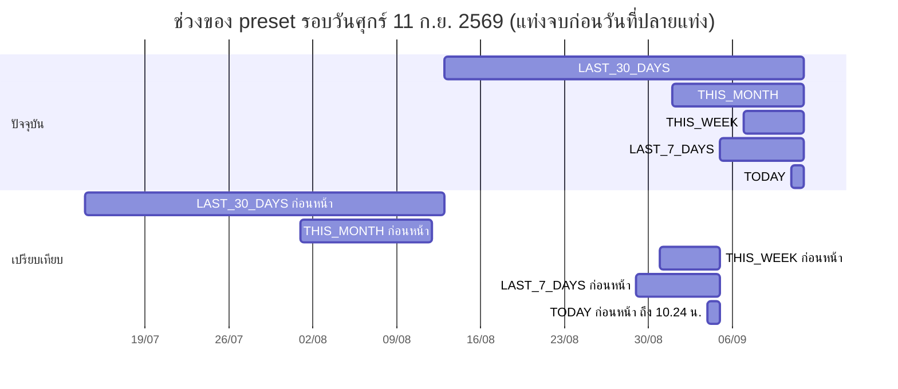
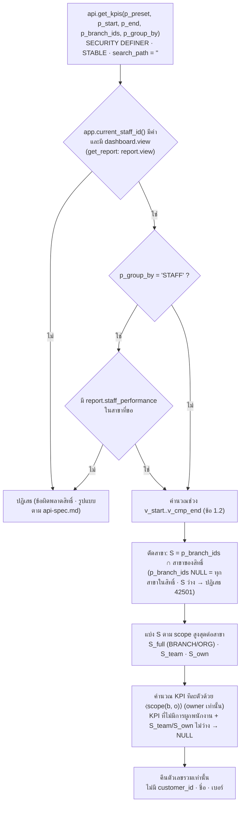

# Dashboard KPI Definition — JAUN CRM · Customer 360

> เอกสารชุดที่ 14 ตาม A45 · **ฉบับ Phase 0 · 16 ก.ย. 2569**
> ค่าทุกค่าอ้างอิง `docs/00-brief/CANONICAL.md` **v2.2** (ข้อ 1.2 · 1.3 · 3 · 4.7 · 9.3 · 9.4.1 · 9.6 · 12 · 13 · 14.7 · 14.8 · 16 D51 · 19) · ถ้าเอกสารนี้ขัดกับ CANONICAL **CANONICAL ชนะ**
> ชื่อตาราง/คอลัมน์/ฟังก์ชันยึด `supabase/migrations/0001–0009` (CANONICAL ข้อ 19.1) · สิ่งที่ v2.2 เพิ่มแต่ migration ยังไม่มี (เช่น `visits.unrecorded_ack_by/_at` · `app.team_scope_pairs`) ใช้ชื่อตาม CANONICAL
> เอกสารคู่กัน: `docs/05-analytics/notification-rules.md` · `docs/07-api/api-spec.md` (รูปแบบ request/response ของ RPC) · `docs/04-security/rls-spec.md` · `docs/03-data/data-dictionary.md`
> "ตอนนี้" ในทุกตัวอย่าง = **11 ก.ย. 2569 10:24 น.** (`app.clock()` ของ seed/test · CANONICAL ข้อ 1.2)

## 0. วิธีอ่านเอกสารนี้

| ประเภทข้อความ | ความหมาย |
|---|---|
| ตัวเลขตัวอย่าง (3,125 · 24.1% …) | มาจาก CANONICAL ข้อ 13 เท่านั้น · ช่องที่ข้อ 13 ไม่มีค่าเขียน `–` |
| **[รอยืนยัน]** | ค่าที่ CANONICAL ติดป้ายรอยืนยัน หรือเอกสารนี้ต้องใช้แต่ CANONICAL ไม่มี |
| **หมายเหตุผู้เขียน** | จุดที่ CANONICAL กำกวม/ไม่ครอบคลุม ผู้เขียนเลือกการตีความที่สอดคล้องกับส่วนอื่นของ CANONICAL มากที่สุด ต้องให้เจ้าของโครงการยืนยัน (สรุปรวมในข้อ 12) |
| SQL ในเอกสาร | **sketch** แสดงตรรกะและชื่อตาราง/คอลัมน์ที่ตรึง (CANONICAL ข้อ 6.3 · 6.10) · ไม่ใช่ข้อความ migration สุดท้าย · ในฟังก์ชันจริงต้อง `SET search_path = ''` และอ้างชื่อเต็ม |

ตัวแปรที่ใช้ใน SQL sketch ทั้งเอกสาร

| ตัวแปร | ความหมาย | คำนวณจาก |
|---|---|---|
| `v_clock` | นาฬิการายงาน | `app.clock()` (ข้อ 1.2) |
| `v_start` · `v_end` | ขอบช่วงปัจจุบัน `[v_start, v_end)` เป็น `timestamptz` | `(p_start::timestamp AT TIME ZONE 'Asia/Bangkok')` · ข้อ 1 ของเอกสารนี้ |
| `v_cmp_start` · `v_cmp_end` | ขอบช่วงเปรียบเทียบ | ข้อ 1.2 |
| `v_today` · `v_tomorrow` | 00:00 ของวันนี้ / พรุ่งนี้ Asia/Bangkok | `(v_clock AT TIME ZONE 'Asia/Bangkok')::date` |
| `⟨scope(b, o)⟩` | เงื่อนไขขอบเขตของผู้เรียกบนแถวที่มีสาขา `b` และผู้ผูกผลงาน `o` | ข้อ 3.2 |

---

## 1. ช่วงเวลาและการเปรียบเทียบ (CANONICAL ข้อ 12.0)

### 1.1 กติการ่วม

1. ทุกช่วงเป็น **ครึ่งเปิด** `[เริ่ม, จบ)` ขอบบนใช้ `<` เสมอ (ข้อ 1.2)
2. ขอบวันคือเที่ยงคืน **Asia/Bangkok** · แปลงวันที่เป็นเวลาด้วย `(d::timestamp AT TIME ZONE 'Asia/Bangkok')` · ห้ามพึ่ง session TimeZone (PGlite/Supabase = `UTC`)
3. "วันนี้" คำนวณจาก `app.clock()` ไม่ใช่ `now()` (ข้อ 1.2)
4. `api.get_kpis` / `api.get_report` รับ `p_preset` ∈ `TODAY` `YESTERDAY` `LAST_7_DAYS` `THIS_WEEK` `LAST_30_DAYS` `THIS_MONTH` `LAST_MONTH` `THIS_QUARTER` `CUSTOM` · ถ้าไม่ใช่ `CUSTOM` ให้ **ละเลย** `p_start`/`p_end` ที่ส่งมาและคำนวณจาก preset (ข้อ 9.4.1)
5. `CUSTOM`: `p_start`/`p_end` เป็น `date` · ช่วงคือ `[p_start, p_end)` → **`p_end` แบบ exclusive · UI ส่ง `p_end = วันที่เลือก + 1 วัน`** (CANONICAL ข้อ 12.0) · ความยาว `p_end − p_start` ต้อง ≥ 1 และ ≤ 366 วัน มิฉะนั้นปฏิเสธ
   - **หมายเหตุผู้เขียน:** การส่ง `p_end` ที่เลยพรุ่งนี้ของ `app.clock()` ไม่มีกติกาใน CANONICAL **[รอยืนยัน]** (ข้อเสนอ: ยอมรับ · แถวในอนาคตไม่มีอยู่แล้ว)
6. ตัวเลือกช่วงเวลาอยู่ในหัวหน้า 02 · 09 · 12 เท่านั้น (ข้อ 14.3) · ค่าเริ่มต้นคือ `LAST_30_DAYS` ป้าย **"30 วันล่าสุด"** · ห้ามเขียน "เดือนนี้" บนการ์ด เว้นแต่ preset = `THIS_MONTH` (D27)
7. ช่วงที่ยังไม่จบ (รวมวันนี้) ของ preset แบบ "N วันล่าสุด" เทียบกับช่วงก่อนหน้า **ทั้งช่วง** · tooltip ต้องมีข้อความ **"ช่วงปัจจุบันรวมวันนี้ที่ยังไม่จบ"**
8. prototype เปิดใช้เฉพาะ `TODAY` และ `LAST_30_DAYS` · preset อื่นแสดงแบบปิดพร้อม tooltip **"ไม่มีข้อมูลตัวอย่างสำหรับช่วงนี้"**
9. KPI แบบ **"ณ app.clock()"** (`OPEN_*` · `TASKS_*` · `OPEN_VISITS` · `WON_LAST_7_DAYS*` · `DUPLICATE_RATE` · `MISSING_REQUIRED_RATE`) **ไม่ใช้ช่วงของ preset** และไม่มีค่าช่วงก่อนหน้า (ไม่แสดงป้ายเปลี่ยนแปลง) — ข้อ 4

### 1.2 สูตรขอบช่วงของแต่ละ preset

ให้ `D = (app.clock() AT TIME ZONE 'Asia/Bangkok')::date` (วันนี้) · `+ n` = บวกวัน

| preset | ป้ายไทย | ช่วงปัจจุบัน `[start, end)` | ช่วงเปรียบเทียบ `[cmp_start, cmp_end)` |
|---|---|---|---|
| `TODAY` | วันนี้ | `[D, D+1)` | `[D−7 00:00, app.clock() − 7 วัน)` = วันเดียวกันสัปดาห์ก่อน **ขอบบนเป็นเวลาเดียวกัน ใช้ `<`** |
| `YESTERDAY` | เมื่อวาน | `[D−1, D)` | `[D−8, D−7)` ทั้งวัน |
| `LAST_7_DAYS` | 7 วันล่าสุด | `[D−6, D+1)` | `[D−13, D−6)` |
| `THIS_WEEK` | สัปดาห์นี้ | `[จันทร์ของสัปดาห์นี้, D+1)` **[รอยืนยัน Q18 วันเริ่มสัปดาห์]** | `[จันทร์ก่อน, D−7+1)` = ช่วงวันเดียวกันของสัปดาห์ก่อน |
| `LAST_30_DAYS` | 30 วันล่าสุด (ค่าเริ่มต้น) | `[D−29, D+1)` | `[D−59, D−29)` |
| `THIS_MONTH` | เดือนนี้ | `[วันที่ 1 ของเดือน, D+1)` | `[วันที่ 1 ของเดือนก่อน, วันที่ (day(D)+1) ของเดือนก่อน)` · ถ้าเดือนก่อนสั้นกว่า ตัดที่สิ้นเดือนก่อน |
| `LAST_MONTH` | เดือนที่แล้ว | `[วันที่ 1 ของเดือนก่อน, วันที่ 1 ของเดือนนี้)` | เดือนก่อนหน้านั้นทั้งเดือน |
| `THIS_QUARTER` | ไตรมาสนี้ | `[วันแรกของไตรมาสปฏิทิน, D+1)` **[รอยืนยัน Q18 ปีบัญชี]** | ไตรมาสก่อน ตั้งแต่วันแรกถึง "เดือนที่เท่ากันในไตรมาส + วันที่เดียวกัน" (รวม) · ตัดที่สิ้นเดือนถ้าสั้นกว่า |
| `CUSTOM` | กำหนดเอง | `[p_start, p_end)` ≤ 366 วัน | `[p_start − (p_end − p_start), p_start)` |

```sql
-- sketch: app.kpi_period(p_preset, p_start, p_end) → (v_start, v_end, v_cmp_start, v_cmp_end)
v_d := (app.clock() AT TIME ZONE 'Asia/Bangkok')::date;
CASE p_preset
  WHEN 'TODAY'        THEN s := v_d;        e := v_d + 1;
                           cs := v_d - 7;    ce_ts := app.clock() - interval '7 days';   -- ขอบบนเป็นเวลา ไม่ใช่เที่ยงคืน
  WHEN 'YESTERDAY'    THEN s := v_d - 1;    e := v_d;       cs := v_d - 8;   ce := v_d - 7;
  WHEN 'LAST_7_DAYS'  THEN s := v_d - 6;    e := v_d + 1;   cs := v_d - 13;  ce := v_d - 6;
  WHEN 'THIS_WEEK'    THEN s := date_trunc('week', v_d::timestamp)::date;  e := v_d + 1;   -- ISO week = จันทร์
                           cs := s - 7;      ce := v_d - 6;
  WHEN 'LAST_30_DAYS' THEN s := v_d - 29;   e := v_d + 1;   cs := v_d - 59;  ce := v_d - 29;
  WHEN 'THIS_MONTH'   THEN s := date_trunc('month', v_d::timestamp)::date;  e := v_d + 1;
                           cs := (s - interval '1 month')::date;
                           ce := least(cs + (v_d - s) + 1, s);                     -- ตัดที่สิ้นเดือนก่อน
  WHEN 'LAST_MONTH'   THEN e := date_trunc('month', v_d::timestamp)::date;  s := (e - interval '1 month')::date;
                           ce := s;  cs := (s - interval '1 month')::date;
  WHEN 'THIS_QUARTER' THEN s := date_trunc('quarter', v_d::timestamp)::date;  e := v_d + 1;
                           cs := (s - interval '3 months')::date;
                           ce := least((date_trunc('month', v_d::timestamp) - interval '3 months')::date
                                       + extract(day FROM v_d)::int,               -- วันที่เดียวกัน (รวม) → +1 วันเป็นขอบเปิด
                                       (date_trunc('month', v_d::timestamp) - interval '2 months')::date);  -- ตัดที่สิ้นเดือน
  WHEN 'CUSTOM'       THEN s := p_start;    e := p_end;
                           cs := p_start - (p_end - p_start);  ce := p_start;
END CASE;
v_start := s::timestamp AT TIME ZONE 'Asia/Bangkok';   -- ทำแบบเดียวกันกับ e · cs · ce
```

- `date_trunc('week', …)` ของ PostgreSQL เริ่มวันจันทร์ (ISO) ตรงกับค่าที่ใช้ไปก่อนของ Q18 · ถ้า Q18 เปลี่ยนเป็นวันอื่นต้องแก้ฟังก์ชันนี้จุดเดียว
- `TODAY` เทียบ `[วันเดียวกันสัปดาห์ก่อน 00:00, app.clock() − 7 วัน)` ขอบบน `<` (CANONICAL ข้อ 12.0) → เหตุการณ์เวลา 10:24:00 พอดีของ 4 ก.ย. 2569 **ไม่ถูกนับ** ในช่วงเปรียบเทียบ
- `THIS_WEEK` · `THIS_MONTH` · `THIS_QUARTER` เทียบ **แบบทั้งวัน** ช่วงวันที่ตรงกันของสัปดาห์/เดือน/ไตรมาสก่อน (ไตรมาส = เดือนที่ n ของไตรมาสก่อน + วันที่เดียวกัน) · ตัดที่สิ้นเดือนถ้าเดือนก่อนสั้นกว่า (CANONICAL ข้อ 12.0)

### 1.3 ตัวอย่างปฏิทินรอบ "ตอนนี้" = ศุกร์ 11 ก.ย. 2569 10:24 น.

| preset | ช่วงปัจจุบัน | ช่วงเปรียบเทียบ | ค่าที่ `acceptance.sql` ใช้ |
|---|---|---|---|
| `TODAY` | [11 ก.ย. 2569 00:00, 12 ก.ย. 2569 00:00) | [4 ก.ย. 2569 00:00, 4 ก.ย. 2569 10:24) | ✓ ข้อ 13.11 |
| `YESTERDAY` | [10 ก.ย. 2569, 11 ก.ย. 2569) | [3 ก.ย. 2569, 4 ก.ย. 2569) | – |
| `LAST_7_DAYS` | [5 ก.ย. 2569, 12 ก.ย. 2569) | [29 ส.ค. 2569, 5 ก.ย. 2569) | (ช่วงของ `WON_LAST_7_DAYS` · ข้อ 13.9) |
| `THIS_WEEK` | [จ. 7 ก.ย. 2569, 12 ก.ย. 2569) | [จ. 31 ส.ค. 2569, 5 ก.ย. 2569) | – |
| `LAST_30_DAYS` | **[13 ส.ค. 2569, 12 ก.ย. 2569)** | **[14 ก.ค. 2569, 13 ส.ค. 2569)** | ✓ ข้อ 13.1–13.6 |
| `THIS_MONTH` | [1 ก.ย. 2569, 12 ก.ย. 2569) | [1 ส.ค. 2569, 12 ส.ค. 2569) | – |
| `LAST_MONTH` | [1 ส.ค. 2569, 1 ก.ย. 2569) | [1 ก.ค. 2569, 1 ส.ค. 2569) | – |
| `THIS_QUARTER` | [1 ก.ค. 2569, 12 ก.ย. 2569) | [1 เม.ย. 2569, 12 มิ.ย. 2569) | – |
| `CUSTOM` 1–10 ก.ย. (UI) | ส่ง `p_start = 2026-09-01` · `p_end = 2026-09-11` → [1 ก.ย. 2569, 11 ก.ย. 2569) | [22 ส.ค. 2569, 1 ก.ย. 2569) | – |



ตรวจตัวอย่างขอบ: task ที่ `due_at = 12 ส.ค. 2569 23:59` อยู่ **ช่วงก่อนหน้า** ของ `LAST_30_DAYS` · `due_at = 13 ส.ค. 2569 00:00` อยู่ **ช่วงปัจจุบัน** · `LD-2026-006650` (12 ส.ค. 2569 19:40) จึงไม่นับใน `LEADS` 892 (ข้อ 13.0 ข้อ 8)

---

## 2. การแสดงผลและการปัด (CANONICAL ข้อ 1.3)

| ชนิดค่า | รูปแบบบนการ์ด/ข้อความ | รูปแบบในช่องตาราง | ส่วนต่างเทียบช่วงก่อน | ตัวอย่าง |
|---|---|---|---|---|
| จำนวน (count) | คั่นหลักพัน | คั่นหลักพัน | % จำนวนเต็ม | `3,125` · `+12%` |
| เงิน | `฿` + คั่นหลักพัน · สตางค์ 2 ตำแหน่งเฉพาะเมื่อไม่ใช่จำนวนเต็ม | คั่นหลักพัน ใต้หัวคอลัมน์ "(บาท)" (กติกาสตางค์เดียวกัน) | % จำนวนเต็ม | `฿3,332,700` · `฿28,900.50` · `1,245,000` · `+9%` |
| อัตรา/สัดส่วน | 1 ตำแหน่งเสมอ + `%` (รวมขั้นแรกของ funnel `100.0%`) | เหมือนการ์ด | **pp** 1 ตำแหน่ง | `24.1%` · `36.0%` · `100.0%` · `+2.1 pp` |
| นาที (`LEAD_RESPONSE_MIN`) | จำนวนเต็ม + " นาที" | เหมือนการ์ด | ไม่มีใน CANONICAL **[รอยืนยัน]** | `18 นาที` |

กติกาคำนวณ

1. **ปัดแบบ half away from zero** = `round(x::numeric, n)` ของ PostgreSQL · ห้าม `round(double precision)` (tie ขึ้นกับแพลตฟอร์ม) → ผลของ `percentile_cont` และการหาร float ต้อง cast เป็น `numeric` ก่อนปัด
2. ฝั่ง JS ห้าม `Math.round` บน float · ใช้ helper ปัดด้วยจำนวนเต็ม (เช่นส่งค่าเป็น `numerator`/`denominator` จำนวนเต็มแล้วปัดด้วยเลขจำนวนเต็ม) — แนะนำให้ RPC คืนค่าที่ปัดแล้วเป็น `text`/`numeric` ด้วย เพื่อให้หน้าจอไม่ต้องปัดเอง
3. อัตรา = `round(100 * numerator::numeric / denominator, 1)` · ตัวหาร = 0 → `NULL` → แสดง `–`
4. ส่วนต่างของจำนวน/เงิน = `round(100 * (cur − prev)::numeric / prev, 0)` · `prev` = 0 หรือ `NULL` → แสดง `–` และ **ไม่แสดงป้าย** · ผลเป็น 0 แสดง `0%` (ข้อ 13.11: JP2 `0%`)
5. ส่วนต่างของอัตรา = `round(100 * (cur_ratio − prev_ratio), 1)` โดย `cur_ratio`/`prev_ratio` **ยังไม่ปัด** แล้วค่อยปัด · เช่น `CONV_LEAD_TO_SALE`: `215/892 − 182/826 = 0.241031 − 0.220339 = 0.020692` → `+2.1 pp` (ถ้าเอา 24.1 − 22.0 จะได้ผลเดียวกันโดยบังเอิญแต่ห้ามใช้วิธีนั้น)
6. เครื่องหมาย: บวกใส่ `+` · ลบใช้เครื่องหมายลบ U+2212 `−5%` `−0.4 pp` (ไม่ใช่ hyphen)
7. **เทียบเป้าหมายใช้ค่าที่ยังไม่ปัด:** `FOLLOWUP_COMPLETION` = 889/1,046 = 84.990…% แสดง `85.0%` และ **ไม่ผ่าน** เป้า ≥ 90% · ตัวอย่างตรึง 94.96% แสดง `95.0%` แต่ไม่ผ่าน ≥ 95%
8. ค่า `NULL` ทุกกรณี (ไม่มีการผูกพนักงาน · ตัวหารเป็น 0 · ไม่มีข้อมูล) แสดง `–` · ห้ามแสดง `0` แทน `NULL`

---
## 3. กลไกร่วมของ `api.get_kpis` / `api.get_report` (CANONICAL ข้อ 9.4.1 · 12.4)

### 3.1 ลำดับการประมวลผล



1. ตรวจสิทธิ์บรรทัดแรก (ข้อ 9.6) · `api.get_kpis` ใช้ `dashboard.view` · `api.get_report` ใช้ `report.view` · แท็บ/กลุ่มรายพนักงานต้องมี `report.staff_performance` ด้วย
2. MFA ตามข้อ 8.0: บทบาท `requires_mfa` ที่ `aal1` ไม่ถูกนับ → คุณนัท (SV · aal1) และจ๋าอั๋น (EX · aal1) ถูกปฏิเสธ (ข้อ 13.13) · คุณขวัญ/คุณคิม/คุณฝน (STAFF · aal1) ใช้ได้
3. `p_group_by` ∈ `NONE` `BRANCH` `TEAM` `STAFF` `CHANNEL` `STATUS` · KPI ที่ไม่มีมิติที่ขอ (ช่อง `–` ในข้อ 4.1) คืน `NULL` ในทุกกลุ่ม
4. คืนเฉพาะตัวเลขรวม · รวมลูกค้า `ANONYMIZED` และ `MERGED` (นับที่ survivor เพราะ merge ย้ายกิจกรรมไป survivor แล้ว) เสมอ · visit `CANCELLED` ตัดออกทุกสูตร
5. drill-down ถึงรายชื่อลูกค้าไม่ผ่าน RPC นี้ → เปิดหน้า 03 ด้วยตัวกรอง (ผ่าน RLS ปกติ · ต้องมี `customer.read`)

- **หมายเหตุผู้เขียน:** `p_branch_ids = NULL` ตีความเป็น "ทุกสาขาที่ผู้เรียกมีสิทธิ์" (ตัวเลือก "ทุกสาขา" บนแถบบน) · สาขาที่ส่งมาแต่ไม่มีสิทธิ์ถูกตัดทิ้งเงียบ ๆ ไม่ใช่ข้อผิดพลาด (คุณบอสส่งทุกสาขาได้แถว JP2 · ข้อ 13.13) · ถ้าตัดแล้วไม่เหลือสาขาเลย → ปฏิเสธ `42501` ตาม `rls-spec.md`

### 3.2 ขอบเขตของผู้เรียก `⟨scope(b, o)⟩`

```sql
-- p = 'dashboard.view' (get_kpis) หรือ 'report.view' (get_report)
v_full  := ARRAY(SELECT unnest(app.scope_branch_ids(p,'BRANCH')) INTERSECT SELECT unnest(v_S));
v_team  := ARRAY(SELECT unnest(app.scope_branch_ids(p,'TEAM'))   INTERSECT SELECT unnest(v_S)
                 EXCEPT SELECT unnest(v_full));
v_own   := ARRAY(SELECT unnest(app.scope_branch_ids(p,'OWN'))    INTERSECT SELECT unnest(v_S)
                 EXCEPT SELECT unnest(v_full) EXCEPT SELECT unnest(v_team));
v_me         := app.current_staff_id();
v_partial    := cardinality(v_team) > 0 OR cardinality(v_own) > 0;

-- ⟨scope(b, o)⟩ =   (o = คอลัมน์ owner ตามข้อ 12.4 · ไม่มี fallback created_by)
(    b = ANY (v_full)
 OR (b = ANY (v_team) AND (b, o) IN (SELECT tp.branch_id, tp.staff_id FROM app.team_scope_pairs(p) tp))
 OR (b = ANY (v_own)  AND o = v_me) )
-- app.team_scope_pairs(p) (CANONICAL ข้อ 9.3) คืนคู่ (สาขา, สมาชิกทีม) ที่ผู้เรียกเป็นหัวหน้าในสาขานั้น
-- → สมาชิกทีมของสาขา A ไม่ผ่านที่สาขา B แม้ผู้เรียกมี scope TEAM ทั้งสองสาขา
```

| scope ของสาขานั้น | แถวที่นับ | KPI ที่ไม่มีการผูกพนักงาน (UNIQUE · NEW · RETURNING · BUYERS · REPEAT_BUYERS · REPEAT_RATE · DUPLICATE_RATE · MISSING_REQUIRED_RATE) |
|---|---|---|
| `BRANCH` / `ORGANIZATION` | ทุกแถวที่ `branch_id` อยู่ในสาขา | คำนวณตามปกติ |
| `TEAM` | `o` ∈ สมาชิกทีมปัจจุบันที่ผู้เรียกเป็นหัวหน้า **ในสาขานั้น** (รวมหัวหน้าเอง) | `NULL` (ข้อ 9.4.1 · 12.4) |
| `OWN` | `o` = ผู้เรียก | `NULL` |

- `o` = คอลัมน์ผู้ผูกผลงานตามข้อ 12.4 (ตาราง "มิติ" ข้อ 4.1) · แถวที่ `o IS NULL` **ไม่ผ่าน** TEAM/OWN → lead ไม่มี owner 2 รายการของ JP1 ไม่อยู่ในยอดทีม JP1-SALES (Leads 296 ไม่ใช่ 298 · ข้อ 13.6)
- KPI ภายใต้ scope TEAM/OWN ผูกด้วย **owner เท่านั้น ไม่ใช้ `created_by` สำรอง** (CANONICAL ข้อ 12.4) — ต่างจาก RLS ของแถว (ข้อ 8.0 ให้ OWN ผ่านแถวไม่มี owner ที่ตนสร้าง) · ยอดของคุณขวัญจึง = ข้อ 13.6 (Leads 154)
- **scope ผสม:** ถ้าในชุดสาขา S มีบางสาขาเป็น TEAM/OWN (`v_partial = true` · เช่น BM@JP1 + ST@JP2 เลือกทั้งสองสาขา) KPI ที่ไม่มีการผูกพนักงานคืน `NULL` ทั้งค่า (CANONICAL ข้อ 12.4) · KPI ที่ผูกพนักงานนับตาม scope ของแต่ละสาขา · ผู้ใช้เลือกเฉพาะสาขาที่เป็น BRANCH เพื่อดูค่าเต็ม

### 3.3 ชิ้นส่วน SQL ที่ใช้ซ้ำ

**(ก) `analytics.customer_activity`** (ข้อ 3.1 · view ภายใน `WITH (security_invoker = true)` · อ่านใน RPC DEFINER เท่านั้น)

```sql
CREATE VIEW analytics.customer_activity WITH (security_invoker = true) AS
SELECT v.customer_id, v.branch_id, v.started_at    AS occurred_at, 'VISIT'              AS kind
  FROM crm.visits v            WHERE v.customer_id IS NOT NULL AND v.status <> 'CANCELLED'
UNION ALL
SELECT i.customer_id, i.branch_id, i.occurred_at,                  'INTERACTION'
  FROM crm.interactions i
  LEFT JOIN crm.visits iv ON iv.id = i.visit_id
 WHERE i.customer_id IS NOT NULL
   AND (i.visit_id IS NULL OR iv.status <> 'CANCELLED')           -- ไม่นับ interaction ที่ผูก visit CANCELLED (ข้อ 3.1 v2.2)
UNION ALL
SELECT l.customer_id, l.branch_id, l.created_at,                   'LEAD'               FROM crm.leads l
UNION ALL
SELECT o.customer_id, o.branch_id, o.created_at,                   'OPPORTUNITY'        FROM crm.opportunities o
UNION ALL
SELECT o.customer_id, o.branch_id, o.closed_at,                    'OPPORTUNITY_CLOSED'
  FROM crm.opportunities o     WHERE o.closed_at IS NOT NULL
UNION ALL
SELECT t.customer_id, t.branch_id, t.transacted_at,                'TRANSACTION'        FROM crm.transaction_refs t;
```

- ค่าของ `kind` ตรงกับ `app.customer_activity_events(p_customer_id)` ใน `0009_business_triggers.sql` (ฟังก์ชันรายลูกค้าที่คำนวณแคช `first_seen_at`/`last_activity_at` · ต้องใช้นิยามเดียวกับ view นี้) · KPI ในเอกสารนี้ไม่กรองด้วย `kind`
- invariant (ข้อ 3.2): ไม่มีแถวใดที่ `occurred_at < customers.first_seen_at` → `NEW + RETURNING = UNIQUE` ทุกช่วง ทุกสาขา

**(ข) `purchase_events`** (ข้อ 3.1 เหตุการณ์การซื้อ)

```sql
purchase_events AS (
  SELECT o.customer_id, o.branch_id, o.won_at AS purchased_at, o.owner_staff_id, o.id AS opportunity_id
    FROM crm.opportunities o
   WHERE o.stage = 'WON'
  UNION ALL
  SELECT t.customer_id, t.branch_id, t.transacted_at, NULL::uuid, t.opportunity_id
    FROM crm.transaction_refs t
    JOIN ref.transaction_types tt ON tt.code = t.transaction_type_code AND tt.counts_as_purchase
    LEFT JOIN crm.opportunities o ON o.id = t.opportunity_id
   WHERE t.opportunity_id IS NULL OR o.stage IS DISTINCT FROM 'WON'    -- ref ที่ผูก opportunity WON นับรวมกับ opportunity แล้ว
)
```

**(ค) `visits_p`** — `crm.visits v WHERE v.status <> 'CANCELLED' AND v.started_at >= v_start AND v.started_at < v_end AND ⟨scope(v.branch_id, v.owner_staff_id)⟩`

---

## 4. นิยาม KPI หลัก (CANONICAL ข้อ 12.1)

### 4.1 ตารางสรุป

ช่องมิติ: **สาขา · ทีม · พนักงาน · ช่องทาง · STATUS** = คอลัมน์ที่ใช้เมื่อ `p_group_by` เป็นค่านั้น · `–` = ไม่มีมิตินี้ (คืน `NULL`) · "ทีม" ทุกช่อง = ทีมปัจจุบันของผู้ผูกผลงาน (ข้อ 7.1 · 12.4) · Phase = Phase ที่ข้อมูลเกิด / Phase ที่แสดงบน Dashboard เต็ม-รายงาน (ข้อ 12.4 · 14.5 · 14.7)

| code | ชื่อบนหน้าจอ | ชนิด | สาขา | พนักงาน (= `o` ของ scope) | ช่องทาง | STATUS | TEAM/OWN | Phase |
|---|---|---|---|---|---|---|---|---|
| `VISITS` | ผู้มาติดต่อ (Visitor) | ช่วง · จำนวน | `visits.branch_id` | `visits.owner_staff_id` (ผู้รับ) | `visits.channel_code` | – | กรองตามผู้รับ | 1 |
| `WALKIN_VISITS` | ลูกค้าเข้าร้าน (Walk-in) | ช่วง · จำนวน | เหมือน VISITS | เหมือน VISITS | (มีค่าเฉพาะ `WALK_IN`) | – | กรองตามผู้รับ | 1 |
| `IDENTIFIED_VISITS` | ระบุตัวตนได้ | ช่วง · จำนวน | เหมือน VISITS | เหมือน VISITS | `visits.channel_code` | – | กรองตามผู้รับ | 1 |
| `UNIQUE_CUSTOMERS` | ลูกค้าไม่ซ้ำ | ช่วง · จำนวน | สาขาของกิจกรรม | – | `customers.first_channel_code` | – | `NULL` | 1 |
| `NEW_CUSTOMERS` | ลูกค้าใหม่ | ช่วง · จำนวน | สาขาของกิจกรรม | – | `first_channel_code` | – | `NULL` | 1 |
| `RETURNING_CUSTOMERS` | ลูกค้าเก่า | ช่วง · จำนวน | สาขาของกิจกรรม | – | `first_channel_code` | – | `NULL` | 1 |
| `LEADS` | Leads | ช่วง · จำนวน | `leads.branch_id` ปัจจุบัน | `leads.owner_staff_id` ปัจจุบัน | `leads.channel_code` | – | กรองตาม owner | 2 / 3 |
| `OPPORTUNITIES` | Opportunities | ช่วง · จำนวน | `opportunities.branch_id` ปัจจุบัน | `opportunities.owner_staff_id` ปัจจุบัน | `origin_channel_code` | – | กรองตาม owner | 2 / 3 |
| `SALES` | ปิดการขาย (Sales) | ช่วง · จำนวน | เหมือน OPPORTUNITIES | เหมือน OPPORTUNITIES | `origin_channel_code` | – | กรองตาม owner | 2 / 3 |
| `SALES_AMOUNT` | ยอดขาย (บาท) | ช่วง · เงิน | เหมือน SALES | เหมือน SALES | `origin_channel_code` | – | กรองตาม owner | 2 / 3 |
| `LOST_OPPORTUNITIES` | ไม่สำเร็จ | ช่วง · จำนวน | เหมือน OPPORTUNITIES | เหมือน OPPORTUNITIES | `origin_channel_code` | – | กรองตาม owner | 2 / 3 |
| `LOST_LEADS` | ไม่สำเร็จ | ช่วง · จำนวน | `leads.branch_id` | `leads.owner_staff_id` | `leads.channel_code` | – | กรองตาม owner | 2 / 3 |
| `LOST_TOTAL` | ไม่สำเร็จ | ช่วง · จำนวน | ตามตารางต้นทาง | ตามตารางต้นทาง | ตามตารางต้นทาง | – | กรองตาม owner | 2 / 3 |
| `BUYERS` | ผู้ซื้อ | ช่วง · จำนวน | สาขาของเหตุการณ์การซื้อ | – | – | – | `NULL` | 3 |
| `REPEAT_BUYERS` | ผู้ซื้อซ้ำ | ช่วง · จำนวน | สาขาของเหตุการณ์การซื้อในช่วง | – | – | – | `NULL` | 3 |
| `OPEN_FOLLOWUP_CUSTOMERS` | ลูกค้าที่ต้องติดตาม | ณ clock · จำนวน | `tasks.branch_id` | `tasks.owner_staff_id` | – | – | กรองตาม owner ของ task | 2 / 3 |
| `OPEN_LEADS` | Lead เปิดอยู่ | ณ clock · จำนวน | `leads.branch_id` | `leads.owner_staff_id` | `leads.channel_code` | `leads.status` | กรองตาม owner | 2 |
| `OPEN_OPPORTUNITIES` | โอกาสขายเปิดอยู่ | ณ clock · จำนวน | `opportunities.branch_id` | `owner_staff_id` | `origin_channel_code` | `stage` | กรองตาม owner | 2 |
| `OPEN_PIPELINE_AMOUNT` | มูลค่า (โอกาสขายเปิดอยู่) | ณ clock · เงิน | เหมือน OPEN_OPPORTUNITIES | เหมือนกัน | เหมือนกัน | `stage` | กรองตาม owner | 2 |
| `WON_LAST_7_DAYS` | ปิดการขาย 7 วัน | 7 วันล่าสุด · จำนวน | เหมือน SALES | เหมือน SALES | `origin_channel_code` | – | กรองตาม owner | 2 |
| `WON_LAST_7_DAYS_AMOUNT` | ปิดการขาย 7 วัน (มูลค่า) | 7 วันล่าสุด · เงิน | เหมือน SALES | เหมือน SALES | `origin_channel_code` | – | กรองตาม owner | 2 |
| `TASKS_TODAY` | งานวันนี้ | ณ clock · จำนวน | `tasks.branch_id` | `tasks.owner_staff_id` | – | – | กรองตาม owner | 2 |
| `TASKS_OVERDUE` | เกินกำหนด | ณ clock · จำนวน | `tasks.branch_id` | `tasks.owner_staff_id` | – | – | กรองตาม owner | 2 |
| `OPEN_VISITS` | visit เปิดอยู่ | ณ clock · จำนวน | `visits.branch_id` | `visits.owner_staff_id` | `visits.channel_code` | `visits.status` | กรองตามผู้รับ (WAITING ไม่มีผู้รับ → ไม่ผ่าน) | 1 |

- มิติทีม/พนักงาน/ช่องทางและ drill-down = Phase 3 · ช่วงเวลา + สาขา = Phase 1 (ข้อ 12.4)
- ตามข้อ 12.4: `BUYERS` `REPEAT_BUYERS` (`REPEAT_RATE`) `DUPLICATE_RATE` `MISSING_REQUIRED_RATE` **ไม่มีการผูกพนักงาน** · `OPEN_FOLLOWUP_CUSTOMERS` ผูกด้วย owner ของ task · owner ที่อยู่หลายทีมนับในทุกทีม (ผลรวมรายทีมอาจเกินยอดสาขา)
- **หมายเหตุผู้เขียน (มิติที่ข้อ 12.4 ไม่ได้ระบุ):** `OPEN_LEADS` `OPEN_OPPORTUNITIES` `OPEN_PIPELINE_AMOUNT` `WON_LAST_7_DAYS*` `TASKS_*` `OPEN_VISITS` และอัตราในข้อ 5 ใช้คอลัมน์สาขา/owner/ช่องทางของ **ตารางต้นทาง** ตามรูปแบบเดียวกับข้อ 12.4 (ตารางด้านบน) · มิติ `STATUS` มีเฉพาะ `OPEN_LEADS` `OPEN_OPPORTUNITIES` `OPEN_PIPELINE_AMOUNT` (ข้อ 12.1) และ `OPEN_VISITS` (ข้อเสนอ)
- owner ที่ไม่อยู่ในทีมใด (เช่นผู้จัดการสาขา JP2–JP4 ใน seed) และแถวที่ไม่มี owner อยู่กลุ่ม `group_key = NULL` · ป้ายที่แสดง "ไม่มีทีม" / "ไม่มีผู้รับผิดชอบ" (ข้อเสนอ · ข้อ 13.6 ใช้หัวคอลัมน์ "ไม่มี owner")

### 4.2 ค่าตัวอย่างรวม (P = 30 วันล่าสุด · ข้อ 13)

| code | องค์กร (ก่อนหน้า · เปลี่ยน) | JP1 (ก่อนหน้า · เปลี่ยน) | คุณขวัญ | คุณคิม | ทีม JP1-SALES (คุณนัท) | วันนี้ องค์กร · JP1 (ข้อ 13.11) |
|---|---|---|---|---|---|---|
| `VISITS` | 3,125 (2,790 · +12%) | 1,008 (900 · +12%) | – | – | – | 17 · 7 |
| `WALKIN_VISITS` | 2,525 | 812 | – | – | – | 9 · 4 |
| (ออนไลน์/โทร = VISITS − WALKIN) | 600 | 196 | – | – | – | 8 · 3 |
| `IDENTIFIED_VISITS` | 2,719 | 891 | – | – | – | 13 · 4 |
| `UNIQUE_CUSTOMERS` | 1,284 (1,146 · +12%) | 412 (368 · +12%) | `–` (NULL) | `–` | `–` | 16 (14 · +14%) · 7 (6 · +17%) |
| `NEW_CUSTOMERS` | 809 (63.0%) | 262 | `–` | `–` | `–` | – |
| `RETURNING_CUSTOMERS` | 475 (37.0%) | 150 | `–` | `–` | `–` | – |
| `LEADS` | 892 (826 · +8%) | 298 (276 · +8%) | 154 | 142 | 296 | – |
| `OPPORTUNITIES` | 368 (323 · +14%) | 120 (105 · +14%) | 63 | 57 | 120 | – |
| `SALES` | 215 (182 · +18%) | 82 (69 · +19%) | 44 | 38 | 82 | – |
| `SALES_AMOUNT` | ฿3,332,700 (฿3,051,760 · +9%) | ฿1,245,000 (฿1,111,600 · +12%) | ฿668,400 | ฿576,600 | ฿1,245,000 | – |
| `LOST_OPPORTUNITIES` | 153 | 51 | 26 | 25 | – | – |
| `LOST_LEADS` | 143 | 45 | 23 | 22 | – | – |
| `LOST_TOTAL` | 296 | 96 | 49 | 47 | – | – |
| `BUYERS` | 209 | 80 | `–` | `–` | `–` | – |
| `REPEAT_BUYERS` | 41 | 16 | `–` | `–` | `–` | – |
| `OPEN_FOLLOWUP_CUSTOMERS` | 117 | – | – | – | – | – |
| `OPEN_LEADS` | – | 58 (NEW 14 · CONTACTED 29 · QUALIFIED 15) | 30 | 26 | – | – |
| `OPEN_OPPORTUNITIES` · `OPEN_PIPELINE_AMOUNT` | – | 62 · ฿1,327,100 (สนใจ 32 ฿426,800 · เสนอราคา 18 ฿512,300 · รอตัดสินใจ 12 ฿388,000) | 34 (17 · 10 · 7) · ฿731,600 | 28 (15 · 8 · 5) · ฿595,500 | – | – |
| `WON_LAST_7_DAYS` · `_AMOUNT` | – | 8 · ฿285,400 | 4 · ฿145,500 | 4 · ฿139,900 | – | – |
| `TASKS_TODAY` · `TASKS_OVERDUE` | – | – | 8 · 4 | 6 · 3 | – · 7 | – |
| `OPEN_VISITS` | 4 | 4 (JP2–JP4 = 0) | – | – | – | – |

- `LOST_TOTAL` ของคุณขวัญ 49 = 26 + 23 และคุณคิม 47 = 25 + 22 เป็นผลบวกจากข้อ 13.6 (นิยาม `LOST_TOTAL` = ผลบวก)
- ค่าองค์กรของ `OPEN_LEADS` `OPEN_OPPORTUNITIES` `WON_LAST_7_DAYS` `TASKS_*` และค่า JP1 ของ `TASKS_*` `OPEN_FOLLOWUP_CUSTOMERS` ไม่มีในข้อ 13 → `–` (prototype ห้ามคิดตัวเลข · ข้อ 14.1)

### 4.3 รายละเอียดราย KPI

#### `VISITS` · `WALKIN_VISITS` · `IDENTIFIED_VISITS`

- **ความหมายธุรกิจ:** ปริมาณการมาติดต่อ (traffic) ทุกช่องทาง · นับ **ครั้ง** ไม่ใช่คน · `party_size` ใช้แสดงเท่านั้น (ข้อ 3.1)
- **นิยาม:** `VISITS` = visit ที่ `started_at ∈ P` และ `status <> 'CANCELLED'` · `WALKIN_VISITS` = ในนั้นที่ `channel_code = 'WALK_IN'` · `IDENTIFIED_VISITS` = ในนั้นที่ `customer_id IS NOT NULL`

```sql
SELECT count(*)                                           AS visits,
       count(*) FILTER (WHERE v.channel_code = 'WALK_IN') AS walkin_visits,
       count(*) FILTER (WHERE v.customer_id IS NOT NULL)  AS identified_visits
  FROM crm.visits v
 WHERE v.status <> 'CANCELLED'
   AND v.started_at >= v_start AND v.started_at < v_end
   AND ⟨scope(v.branch_id, v.owner_staff_id)⟩;
-- GROUP BY: BRANCH → v.branch_id · STAFF → v.owner_staff_id · CHANNEL → v.channel_code · TEAM → ทีมปัจจุบันของ v.owner_staff_id
```

- **ข้อควรระวัง:**
  - visit `WAITING`/`LEFT` ไม่มีผู้รับ → นับในยอดสาขาแต่ไม่อยู่ในยอดพนักงาน/ทีมใด (ผลรวมรายพนักงาน < ยอดสาขา)
  - `IDENTIFIED_VISITS` เปลี่ยนย้อนหลังได้เมื่อผูกลูกค้าภายหลัง (`api.link_customer_to_branch` · quick-capture ผูก visit) → ตัวเลขช่วงเก่าอาจเพิ่มขึ้น
  - visit ออนไลน์/โทรบันทึกด้วยมือใน V1 (ข้อ 3.3) → ยอดออนไลน์ขึ้นกับวินัยการบันทึก
  - ห้ามใช้ `party_size` ในสูตร

#### `UNIQUE_CUSTOMERS` · `NEW_CUSTOMERS` · `RETURNING_CUSTOMERS`

- **ความหมายธุรกิจ:** จำนวนคน (ที่รู้ตัวตน) ที่มีกิจกรรมในช่วง แยกเป็นคนที่เพิ่งรู้จักในช่วงนี้ กับคนที่รู้จักมาก่อน
- **นิยาม:** ลูกค้าไม่ซ้ำใน `analytics.customer_activity` ที่ `occurred_at ∈ P` · ใหม่ = `first_seen_at ∈ P` · เก่า = `first_seen_at < v_start` (ข้อ 3.1)

```sql
WITH act AS (
  SELECT a.customer_id, a.branch_id
    FROM analytics.customer_activity a
   WHERE a.occurred_at >= v_start AND a.occurred_at < v_end
     AND a.branch_id = ANY (v_full)                 -- v_partial = true → คืน NULL ทั้งสามตัว
)
SELECT count(DISTINCT c.id)                                        AS unique_customers,
       count(DISTINCT c.id) FILTER (WHERE c.first_seen_at >= v_start
                                      AND c.first_seen_at <  v_end) AS new_customers,
       count(DISTINCT c.id) FILTER (WHERE c.first_seen_at <  v_start) AS returning_customers
  FROM act JOIN crm.customers c ON c.id = act.customer_id;
-- BRANCH → GROUP BY act.branch_id (ลูกค้าคนเดียวอาจอยู่หลายสาขา) · CHANNEL → GROUP BY c.first_channel_code
```

- **ข้อควรระวัง:**
  - ยอดองค์กร = `count(DISTINCT)` ทั้งชุด **ไม่ใช่** ผลบวกรายสาขา · ข้อ 13.2 ผลบวกเท่ากันเพราะ seed กำหนดให้ลูกค้าแต่ละคนมีกิจกรรมสาขาเดียวต่อช่วง (ข้อมูลจริงผลบวกอาจมากกว่า)
  - รายสาขาของ NEW/RETURNING ใช้ **สาขาของกิจกรรม** ไม่ใช่ `first_branch_id`
  - กราฟ "แหล่งที่มาลูกค้า" = `UNIQUE_CUSTOMERS` กลุ่ม `CHANNEL` (`first_channel_code` ไม่ใช่ `ref.sources` · ข้อ 5.2) · ส่วนของโดนัทแสดงเฉพาะค่า > 0 (`WEBSITE` = 0 ไม่แสดง · D3)
  - interaction ที่ผูก visit `CANCELLED` **ไม่นับ** เป็นกิจกรรม เช่นเดียวกับ `visits.started_at` ของ CANCELLED (CANONICAL ข้อ 3.1) · ยกเลิก visit ภายหลังจึงอาจทำให้ UNIQUE ของช่วงนั้นลดลง
  - ลูกค้า `MERGED` ไม่มีกิจกรรมเหลือ (ย้ายไป survivor) · ลูกค้าที่รวมกลาง P อาจทำให้ช่วงก่อนหน้าย้อนหลังเปลี่ยน (first_seen ของ survivor = least ของทั้งสอง)
  - ตรวจ invariant ได้ทุกครั้ง: `new + returning = unique`

#### `LEADS` · `OPPORTUNITIES` · `SALES` · `SALES_AMOUNT`

- **ความหมายธุรกิจ:** ขั้นของ Funnel แบบ **ตามช่วงเวลา** (period-based) — Sale ในช่วงนี้อาจมาจาก Lead ของช่วงก่อน · tooltip ของ Funnel ต้องบอกข้อนี้ (ข้อ 3.1)
- **นิยาม:** `LEADS` = lead `created_at ∈ P` · `OPPORTUNITIES` = opportunity `created_at ∈ P` · `SALES` = opportunity `stage = 'WON'` และ `won_at ∈ P` · `SALES_AMOUNT` = `sum(won_amount)` ของ SALES (V1 · Phase 4 เปลี่ยนเป็นยอด POS)

```sql
SELECT count(*) FROM crm.leads l
 WHERE l.created_at >= v_start AND l.created_at < v_end
   AND ⟨scope(l.branch_id, l.owner_staff_id)⟩;                         -- LEADS

SELECT count(*) FILTER (WHERE o.created_at >= v_start AND o.created_at < v_end)            AS opportunities,
       count(*) FILTER (WHERE o.stage = 'WON' AND o.won_at >= v_start AND o.won_at < v_end) AS sales,
       coalesce(sum(o.won_amount) FILTER (WHERE o.stage = 'WON'
                         AND o.won_at >= v_start AND o.won_at < v_end), 0)                  AS sales_amount
  FROM crm.opportunities o
 WHERE ⟨scope(o.branch_id, o.owner_staff_id)⟩;
```

- **ข้อควรระวัง:**
  - มิติสาขา/พนักงานใช้ค่า **ปัจจุบัน** ของแถว → ย้ายสาขา/เปลี่ยน owner ทำให้ตัวเลขช่วงเก่าเปลี่ยน (`team_id` บนแถวเป็น snapshot ใช้แสดงผลเท่านั้น · ข้อ 7.1)
  - opportunity ที่ reopen แล้ว WON ใหม่: `won_at` ถูกล้างและตั้งใหม่ → นับตาม `won_at` ล่าสุด · ช่วงเก่าลดลง
  - `SALES_AMOUNT` ไม่หัก `REFUND` (V1 ไม่มีสูตรหัก) **[รอยืนยัน Phase 4]**
  - `LEADS` นับทุกช่องทาง รวม lead ที่เปิดจาก walk-in (`CONTACTED` ทันที)
  - ช่องทางของ SALES/OPPORTUNITIES = `origin_channel_code` (ตั้งครั้งเดียว) · `OP-2026-002790` ของคุณสมชายเป็น origin `LINE` แม้ปิดการขายหน้าร้าน (ข้อ 13.7)

#### `LOST_OPPORTUNITIES` · `LOST_LEADS` · `LOST_TOTAL`

- **ความหมายธุรกิจ:** โอกาสที่เสียไป · `LOST_TOTAL` ใช้กับกราฟ "เหตุผลที่ไม่สำเร็จ"
- **นิยาม:** `stage/status = 'LOST'` และ `closed_at ∈ P` · `LOST_TOTAL = LOST_OPPORTUNITIES + LOST_LEADS`

```sql
SELECT count(*) FROM crm.opportunities o
 WHERE o.stage = 'LOST' AND o.closed_at >= v_start AND o.closed_at < v_end
   AND ⟨scope(o.branch_id, o.owner_staff_id)⟩;                          -- LOST_OPPORTUNITIES
SELECT count(*) FROM crm.leads l
 WHERE l.status = 'LOST' AND l.closed_at >= v_start AND l.closed_at < v_end
   AND ⟨scope(l.branch_id, l.owner_staff_id)⟩;                          -- LOST_LEADS

-- กราฟเหตุผล: 5 อันดับแรก + "อื่น ๆ" เรียงมากไปน้อย · เท่ากันเรียง ref.lost_reasons.sort_order (ข้อ 5.5)
WITH lost AS (
  SELECT o.lost_reason_code FROM crm.opportunities o WHERE <LOST_OPPORTUNITIES>
  UNION ALL
  SELECT l.lost_reason_code FROM crm.leads l          WHERE <LOST_LEADS>
), ranked AS (
  SELECT r.code, r.label_th, r.sort_order, count(lost.*) AS n,
         row_number() OVER (ORDER BY count(lost.*) DESC, r.sort_order) AS rk
    FROM lost JOIN ref.lost_reasons r ON r.code = lost.lost_reason_code
   GROUP BY r.code, r.label_th, r.sort_order
)
SELECT CASE WHEN rk <= 5 THEN code ELSE '_OTHERS' END            AS bucket,     -- ป้าย '_OTHERS' = "อื่น ๆ"
       min(label_th) FILTER (WHERE rk <= 5)                       AS label_th,
       sum(n)                                                     AS n,
       round(100 * sum(n)::numeric / (SELECT sum(n) FROM ranked), 1) AS pct
  FROM ranked
 GROUP BY 1
 ORDER BY min(rk);                                                -- "อื่น ๆ" อยู่ท้ายเสมอ
```

- ค่าตัวอย่างกราฟ (ข้อ 13.4 · องค์กร): ราคาสูงไป 83 (28.0%) · รอเปรียบเทียบ 53 (17.9%) · ลูกค้ายังไม่พร้อม 47 (15.9%) · ติดเรื่องเอกสาร 36 (12.2%) · เปลี่ยนรุ่น/เปลี่ยนใจ 30 (10.1%) · อื่น ๆ 47 (15.9%) · JP1 รวม 96
- **ข้อควรระวัง:** lead ที่ `CONVERTED` ไม่ใช่ LOST · opportunity ที่มาจาก lead ไม่ทำให้ lead นับ LOST ซ้ำ · `OTHER` บังคับ `lost_note` แต่กราฟแสดงเฉพาะรหัส · `COMPARING` รอยืนยัน Q10

#### `BUYERS` · `REPEAT_BUYERS`

- **ความหมายธุรกิจ:** จำนวนคนที่ซื้อจริง และคนที่ซื้อซ้ำ (ใช้กับ `REPEAT_RATE`)
- **นิยาม:** ผู้ซื้อ = ลูกค้าไม่ซ้ำที่มีเหตุการณ์การซื้อ `purchased_at ∈ P` · ผู้ซื้อซ้ำ = ผู้ซื้อที่มีเหตุการณ์การซื้อตลอดอายุ **≥ 2 ครั้ง** ที่ `purchased_at < v_end` (ครั้งก่อนหน้าอยู่ในช่วงเดียวกันได้)

```sql
WITH purchase_events AS (…ข้อ 3.3 ข…),
buyers AS (
  SELECT DISTINCT pe.customer_id, pe.branch_id
    FROM purchase_events pe
   WHERE pe.purchased_at >= v_start AND pe.purchased_at < v_end
     AND pe.branch_id = ANY (v_full)                       -- v_partial = true → NULL
)
SELECT count(DISTINCT b.customer_id) AS buyers,
       count(DISTINCT b.customer_id) FILTER (
         WHERE (SELECT count(*) FROM purchase_events x
                 WHERE x.customer_id = b.customer_id AND x.purchased_at < v_end) >= 2) AS repeat_buyers
  FROM buyers b;
-- BRANCH → GROUP BY b.branch_id · การนับครั้งที่ ≥ 2 นับทุกสาขาของลูกค้า
```

- ตัวอย่าง: 209 = ซื้อ 1 ครั้งใน P 203 ราย + 2 ครั้ง 6 ราย · 41 = ซื้อ 2 ครั้งใน P 6 ราย + เคยซื้อก่อน P 35 ราย (คุณสมชายเป็นหนึ่งใน 35 · ข้อ 13.7) · เหตุการณ์การซื้อใน P รวม 203 + 12 = 215 = `SALES` (seed ไม่มี ref ที่ไม่ผูก opportunity · ข้อ 13.0 ข้อ 6)
- **หมายเหตุผู้เขียน:** การนับ "≥ 2 ครั้ง" ของรายสาขาใช้เหตุการณ์ **ทุกสาขา** ของลูกค้า (นิยามข้อ 3.1 เป็นระดับลูกค้า)
- **ข้อควรระวัง:** transaction ref ที่ `counts_as_purchase = true` แต่ผูก opportunity ที่ยังไม่ WON นับเป็นเหตุการณ์แยก (ถ้าต่อมา WON จะกลายเป็นครั้งเดียวกัน → ตัวเลขย้อนหลังลด) · `ACCESSORY_SALE` `REPAIR` `BUYBACK` ไม่นับเป็นการซื้อ

#### `OPEN_FOLLOWUP_CUSTOMERS`

- **ความหมายธุรกิจ:** "ลูกค้ากี่คนยังต้องติดตาม" (A45: 117 คน) · ณ `app.clock()`
- **นิยาม:** ลูกค้าไม่ซ้ำที่มี task `task_type_code = 'FOLLOW_UP'` สถานะ `OPEN`/`IN_PROGRESS`

```sql
SELECT count(DISTINCT coalesce(t.customer_id, l.customer_id, o.customer_id))
  FROM crm.tasks t
  LEFT JOIN crm.leads l         ON l.id = t.lead_id
  LEFT JOIN crm.opportunities o ON o.id = t.opportunity_id
 WHERE t.task_type_code = 'FOLLOW_UP' AND t.status IN ('OPEN','IN_PROGRESS')
   AND ⟨scope(t.branch_id, t.owner_staff_id)⟩;
```

- ไม่ใช้ช่วงของ preset (ไม่มีขอบล่างของ `due_at`) · ตรวจไขว้ระดับองค์กร: ควรเท่ากับ `count(*) FROM crm.customers WHERE has_open_followup` (แคชของป้าย "ติดตามอยู่" · ข้อ 6.3 · `app.refresh_customer_activity` นับจาก `tasks.customer_id`)
- ผูกพนักงานด้วย `tasks.owner_staff_id` (CANONICAL ข้อ 12.4) · `tasks.customer_id` เป็น nullable แต่ trigger ใน `0009` เติมจาก lead/opportunity เมื่อว่าง → `coalesce` เป็นการกันไว้เท่านั้น

#### `OPEN_LEADS` · `OPEN_OPPORTUNITIES` · `OPEN_PIPELINE_AMOUNT`

- **ความหมายธุรกิจ:** งานขายที่ค้างอยู่ตอนนี้ · คอลัมน์ Pipeline หน้า 06
- **นิยาม:** lead `status IN ('NEW','CONTACTED','QUALIFIED')` · opportunity `stage IN ('INTERESTED','QUOTATION','FOLLOW_UP')` · มูลค่า = `sum(expected_amount)` · แยกสถานะด้วย `p_group_by = 'STATUS'`

```sql
SELECT l.status, count(*) FROM crm.leads l
 WHERE l.status IN ('NEW','CONTACTED','QUALIFIED') AND ⟨scope(l.branch_id, l.owner_staff_id)⟩
 GROUP BY ROLLUP (l.status);
SELECT o.stage, count(*), coalesce(sum(o.expected_amount), 0) FROM crm.opportunities o
 WHERE o.stage IN ('INTERESTED','QUOTATION','FOLLOW_UP') AND ⟨scope(o.branch_id, o.owner_staff_id)⟩
 GROUP BY ROLLUP (o.stage);
```

- ป้ายกลุ่ม STATUS: lead `ใหม่` `ติดต่อแล้ว` `คัดกรองแล้ว` · opportunity `สนใจ` `เสนอราคา` `รอตัดสินใจ` (ข้อ 4.3 · 4.4)
- **ข้อควรระวัง:** เป็นสถานะ ณ เวลาที่เรียก (ไม่มีตารางสถานะย้อนหลังสำหรับ `app.clock()` ในอดีต) · `expected_amount` = ผลรวม items (trigger) → opportunity ที่ไม่มี items มีมูลค่า 0 · หน้า Pipeline ของ JP1 แสดงคอลัมน์ "ปิดการขาย (7 วัน)" ด้วย `WON_LAST_7_DAYS`

#### `WON_LAST_7_DAYS` · `WON_LAST_7_DAYS_AMOUNT`

- **นิยาม:** `SALES` และ `SALES_AMOUNT` ในช่วง "7 วันล่าสุด" `[D−6, D+1)` คำนวณจาก `app.clock()` เสมอ ไม่ขึ้นกับ `p_preset` → 11 ก.ย. 2569 = `won_at ∈ [5 ก.ย. 2569, 12 ก.ย. 2569)`
- ตัวอย่าง JP1 8 รายการ ฿285,400 (คุณขวัญ 4 ฿145,500 · คุณคิม 4 ฿139,900) · อีก 74 รายการของ Sales 82 รวม ฿959,600 (ข้อ 13.9)
- **หมายเหตุผู้เขียน:** CANONICAL ไม่กำหนดช่วงเปรียบเทียบ → ไม่มีป้ายเปลี่ยนแปลง

#### `TASKS_TODAY` · `TASKS_OVERDUE`

- **ความหมายธุรกิจ:** การ์ด "งานทั้งหมด 12 · เกินกำหนด 4" (ทั้งหมด = วันนี้ + เกินกำหนด · D20)
- **นิยาม (ข้อ 4.7):** สถานะ `OPEN`/`IN_PROGRESS` · วันนี้ = `due_at ∈ [v_today, v_tomorrow)` (เลยเวลาแล้วยังนับกลุ่มนี้ + ป้าย "เลยเวลา") · เกินกำหนด = `due_at < v_today` · ทุก `task_type_code`

```sql
SELECT count(*) FILTER (WHERE t.due_at >= v_today AND t.due_at < v_tomorrow) AS tasks_today,
       count(*) FILTER (WHERE t.due_at <  v_today)                          AS tasks_overdue
  FROM crm.tasks t
 WHERE t.status IN ('OPEN','IN_PROGRESS') AND ⟨scope(t.branch_id, t.owner_staff_id)⟩;
```

- ตัวอย่าง: คุณขวัญ 8 · 4 (ข้อ 13.10 · #5 10:00 "เลยเวลา" อยู่กลุ่มวันนี้) · คุณคิม 6 · 3 · ทีม JP1-SALES เกินกำหนด 7
- **ข้อควรระวัง:** `tasks.due_at` เป็น `NOT NULL` (CANONICAL ข้อ 19.1 ข้อ 6 · `0007_crm_work.sql`) ทุก task จึงอยู่กลุ่มใดกลุ่มหนึ่งหรืออยู่ในอนาคต · task ไม่มี read-through ผ่านลูกค้า (ข้อ 9.4) แต่ KPI เป็น DEFINER จึงนับตาม scope ของ `dashboard.view` · ข้อบังคับ seed ข้อ 13.6: `next_action_at` ของรายการเปิดอื่นของคุณขวัญ/คุณคิม ≥ 12 ก.ย. 2569 00:00 ตัวเลขนี้จึงตรึงได้

#### `OPEN_VISITS`

- **นิยาม:** visit `status IN ('WAITING','IN_SERVICE')` ณ `app.clock()` · ตัวอย่างองค์กร 4 = คิว JP1 001 (กำลังให้บริการ) + 002–004 (รอรับบริการ) · JP2–JP4 = 0
- **ข้อควรระวัง:** visit ที่ค้างข้ามวันถูกปิดโดย `app.job_close_stale_visits` 00:05 → ในเวลาปกติ `OPEN_VISITS` มีเฉพาะของวันนี้ · ใต้ OWN/TEAM visit `WAITING` ไม่มีผู้รับจึงไม่ถูกนับ

---
## 5. อัตรา (CANONICAL ข้อ 12.2)

> **ห้ามแสดงคำว่า "Conversion" เดี่ยว ๆ** ต้องมีวงเล็บบอกตัวตั้ง/ตัวหารเสมอ (D5 · D36)

### 5.1 ตารางสรุป

| code | ชื่อบนหน้าจอ | ตัวตั้ง / ตัวหาร | มิติ (สาขา · พนักงาน · ช่องทาง) | TEAM/OWN | เป้า | องค์กร | JP1 | Phase |
|---|---|---|---|---|---|---|---|---|
| `LEAD_RATE` | อัตรา Lead | `LEADS` / `VISITS` | ตามตัวตั้ง/ตัวหารแต่ละตัว | คำนวณได้ | – | 28.5% | 29.6% | 3 |
| `OPPORTUNITY_RATE` | อัตราโอกาสขาย | `OPPORTUNITIES` / `LEADS` | เหมือนกัน | คำนวณได้ | – | 41.3% | 40.3% | 3 |
| `CLOSE_RATE` | อัตราปิดการขาย | `SALES` / (`SALES` + `LOST_OPPORTUNITIES`) | opportunity | คำนวณได้ | – | 58.4% | 61.7% | 3 |
| `LOST_RATE` | อัตราไม่สำเร็จ | `LOST_OPPORTUNITIES` / (`SALES` + `LOST_OPPORTUNITIES`) | opportunity | คำนวณได้ | – | 41.6% | 38.3% | 3 |
| `CONV_LEAD_TO_SALE` | Conversion (Lead → ขาย) | `SALES` / `LEADS` | เหมือนกัน | คำนวณได้ | – | 24.1% (ก่อน 22.0% · +2.1 pp) | 27.5% (25.0% · +2.5 pp) | 3 |
| `CONV_VISIT_TO_SALE` | Conversion (ผู้มาติดต่อ → ขาย) | `SALES` / `VISITS` | เหมือนกัน | คำนวณได้ | – | 6.9% | 8.1% | 3 |
| `WALKIN_CONVERSION` | Walk-in Conversion | `SALES` ที่ `origin_channel_code = 'WALK_IN'` / `WALKIN_VISITS` | เหมือนกัน | คำนวณได้ | – | 6.3% (158 / 2,525) | 7.4% (60 / 812) | 3 |
| `CAPTURE_RATE` | อัตราบันทึกตัวตนลูกค้า | `IDENTIFIED_VISITS` / `VISITS` | visit | คำนวณได้ | ≥ 95% | 87.0% (2,719 / 3,125) | 88.4% (891 / 1,008) | 1 |
| `REPEAT_RATE` | อัตราซื้อซ้ำ | `REPEAT_BUYERS` / `BUYERS` | สาขาของการซื้อ · – · – | `NULL` | – | 19.6% (41 / 209) | 20.0% (16 / 80) | 3 |
| `LEAD_RESPONSE_MIN` | เวลาตอบกลับ Lead (มัธยฐาน) | มัธยฐานนาที (ข้อ 5.2) | lead | คำนวณได้ | – | 18 นาที (ฐาน 214 · ยังไม่ติดต่อ 9) | `–` (ยังไม่ติดต่อ 8) | 2 / 3 |
| `FOLLOWUP_COMPLETION` | ติดตามตรงเวลา | ข้อ 5.2 | `tasks.branch_id` · `tasks.owner_staff_id` · – | คำนวณได้ | ≥ 90% | 85.0% (889 / 1,046) | 86.6% (305 / 352) | 2 / 3 |
| `OUTCOME_COMPLETION` | บันทึกผลการให้บริการครบ | ข้อ 5.2 | visit | คำนวณได้ | ≥ 95% | 95.4% (2,977 / 3,121) | 95.6% (960 / 1,004) | 1 |

ค่ารายสาขาอื่นอยู่ในข้อ 13.2b · ทีม JP1-SALES: `CONV_LEAD_TO_SALE` 27.7% (82 / 296)

กติการ่วมของอัตรา

1. คำนวณจาก **ค่าดิบ** ของตัวตั้งและตัวหารในช่วงและขอบเขตเดียวกัน แล้วปัดครั้งเดียว (ข้อ 2) · ห้ามเฉลี่ยอัตรารายสาขาเป็นอัตราองค์กร
2. ตัวตั้งหรือตัวหาร `NULL` → `NULL` · ตัวหาร 0 → `NULL` (ข้อ 9.4.1)
3. ภายใต้ TEAM/OWN ตัวตั้งและตัวหารใช้การผูกพนักงานของตารางต้นทางของตัวเอง (เช่น `LEAD_RATE` ของพนักงาน = lead ที่ตนเป็น owner / visit ที่ตนเป็นผู้รับ) → อัตรารายพนักงานที่ผสมสองตารางต้องแสดง tooltip "ตัวตั้งและตัวหารผูกพนักงานคนละแบบ"
4. ช่วงก่อนหน้าใช้สูตรเดียวกันบน `[v_cmp_start, v_cmp_end)` · ส่วนต่างเป็น pp (ข้อ 2)
5. อัตราแบบ period-based ไม่ใช่ cohort (ข้อ 3.1) · Close Rate ใช้ `SALES / (SALES + LOST_OPPORTUNITIES)` ไม่ใช่ A20 (D4) · ในข้อมูลตัวอย่างสองสูตรเท่ากัน **เฉพาะระดับองค์กร** (215/368 = 58.4%) รายสาขาไม่เท่า (JP1 82/133 = 61.7% แต่ 82/120 = 68.3%)

### 5.2 รายละเอียดอัตราที่มีกติกาพิเศษ

#### `WALKIN_CONVERSION`

```sql
SELECT count(*) FILTER (WHERE o.stage = 'WON' AND o.won_at >= v_start AND o.won_at < v_end
                          AND o.origin_channel_code = 'WALK_IN')
  FROM crm.opportunities o WHERE ⟨scope(o.branch_id, o.owner_staff_id)⟩;       -- ตัวตั้ง
-- ตัวหาร = WALKIN_VISITS (ข้อ 4.3)
```

- ตัวตั้งใช้ `origin_channel_code` ไม่ใช่ช่องทางของ visit ที่ปิดขาย → ลูกค้าที่ทักทาง LINE แล้วมาซื้อหน้าร้านไม่อยู่ในตัวตั้ง (`OP-2026-002790` · ข้อ 13.7)
- รายสาขา (ข้อ 13.2b): JP1 60/812 = 7.4% · JP2 46/694 = 6.6% · JP3 31/521 = 6.0% · JP4 21/498 = 4.2%

#### `LEAD_RESPONSE_MIN`

- **ความหมายธุรกิจ:** แอดมินตอบลูกค้าที่ทักทางข้อความเร็วแค่ไหน · lead ช่องทางคุยสด (WALK_IN · PHONE) เริ่มที่ `CONTACTED` ทันทีจึงไม่อยู่ในฐาน (D47)
- **นิยาม:** ฐาน = lead ที่ `created_at ∈ P` · `ref.channels.is_live = false` · `first_contacted_at IS NOT NULL` · ค่า = มัธยฐานของนาทีปฏิทินจาก `created_at` ถึง `first_contacted_at` ปัดเป็นจำนวนเต็ม · แสดงคู่กับ "ยังไม่ติดต่อ N"

```sql
SELECT round((percentile_cont(0.5) WITHIN GROUP (
              ORDER BY extract(epoch FROM (l.first_contacted_at - l.created_at)) / 60))::numeric)
                                                               AS lead_response_min,   -- ต้อง cast numeric ก่อน round
       count(*) FILTER (WHERE l.first_contacted_at IS NOT NULL) AS base_n,
       count(*) FILTER (WHERE l.first_contacted_at IS NULL)     AS not_contacted_n       -- "ยังไม่ติดต่อ N"
  FROM crm.leads l
  JOIN ref.channels ch ON ch.code = l.channel_code AND ch.is_live = false
 WHERE l.created_at >= v_start AND l.created_at < v_end
   AND ⟨scope(l.branch_id, l.owner_staff_id)⟩;
-- percentile_cont (ordered-set aggregate) ละเว้นแถวที่ค่า ORDER BY เป็น NULL อยู่แล้ว
-- → lead ที่ first_contacted_at IS NULL ไม่เข้าฐานมัธยฐาน แต่ยังนับใน not_contacted_n
```

- ตัวอย่าง: องค์กร 18 นาที · ฐาน 214 lead · ยังไม่ติดต่อ 9 (JP1 8 + JP4 1 = lead ของ `CUS-2026-006774` · ทั้ง 9 ยังเป็น `NEW`) · รายสาขาไม่มีค่าตัวอย่าง → `–` แต่ "ยังไม่ติดต่อ" รายสาขามีค่า (JP1 8 · JP2 0 · JP3 0 · JP4 1)
- **ข้อควรระวัง:**
  - นาทีปฏิทินหรือนาทีเวลาทำการ **[รอยืนยัน Q21]** · ค่าที่ใช้ไปก่อน = นาทีปฏิทิน → lead ที่ทักมาหลังปิดร้านทำให้มัธยฐานสูง
  - `first_contacted_at` ตั้งโดยระบบเท่านั้น (ข้อ 19.2 ข้อ 4): อัตโนมัติจาก interaction `OUTBOUND` แรก หรือเมื่อเปลี่ยน `NEW → CONTACTED/QUALIFIED` ด้วยมือ = `greatest(now(), created_at)` (ข้อ 4.3) → ถ้าพนักงานตอบในแอป LINE แต่ไม่บันทึกอะไรเลย ระบบจะเห็นว่า "ยังไม่ติดต่อ" · การเปลี่ยนสถานะด้วยมือภายหลังทำให้นาทีนับถึงเวลาที่กด ไม่ใช่เวลาที่ตอบจริง
  - สถานะเริ่มต้นของ lead ทุกรายการตัดสินจาก `ref.channels.is_live` ของ `leads.channel_code` (ข้อ 4.3) → ฐานของมัธยฐานใช้เงื่อนไขเดียวกัน
  - ฐาน 0 → `NULL` แสดง `–` แต่ยังแสดง "ยังไม่ติดต่อ N"

#### `FOLLOWUP_COMPLETION`

- **ความหมายธุรกิจ:** พนักงานติดตามลูกค้าตามนัดภายใน 1 วันหรือไม่ (A19 Follow-up Performance)
- **นิยาม:**
  - ตัวหาร = task `FOLLOW_UP` ที่ `due_at ∈ P` และไม่ `CANCELLED` **ตัดออก** ถ้ายังไม่ `DONE` และ `due_at + 24 ชม. > app.clock()` (ยังอยู่ในระยะผ่อนผัน)
  - ตัวตั้ง = ในตัวหารที่ `DONE` และ `completed_at ≤ due_at + 24 ชม.`

```sql
WITH base AS (
  SELECT t.status, t.due_at, t.completed_at
    FROM crm.tasks t
   WHERE t.task_type_code = 'FOLLOW_UP'
     AND t.due_at >= v_start AND t.due_at < v_end
     AND t.status <> 'CANCELLED'
     AND NOT (t.status <> 'DONE' AND t.due_at + interval '24 hours' > v_clock)
     AND ⟨scope(t.branch_id, t.owner_staff_id)⟩
)
SELECT count(*) FILTER (WHERE status = 'DONE' AND completed_at <= due_at + interval '24 hours') AS on_time,
       count(*) FILTER (WHERE status = 'DONE' AND completed_at >  due_at + interval '24 hours') AS done_late,
       count(*) FILTER (WHERE status <> 'DONE')                                                AS open_past_grace,
       count(*)                                                                                AS denominator
  FROM base;
```

แยกองค์ประกอบ (ข้อ 13.1 · 13.2b) — ใช้เป็น assertion ได้ทั้งหมด

| กลุ่ม | กติกา | องค์กร | JP1 | JP2 | JP3 | JP4 |
|---|---|---:|---:|---:|---:|---:|
| ตรงเวลา (ตัวตั้ง) | DONE · `completed_at ≤ due_at + 24 ชม.` | 889 | 305 | 246 | 190 | 148 |
| เสร็จช้า | DONE · `completed_at > due_at + 24 ชม.` | 138 | 47 | 37 | 30 | 24 |
| เปิด · พ้นผ่อนผัน | OPEN/IN_PROGRESS · `due_at + 24 ชม. ≤ 11 ก.ย. 2569 10:24` | 19 | 0 | 7 | 6 | 6 |
| **ตัวหาร** | ผลบวกสามแถวบน | **1,046** | **352** | **290** | **226** | **178** |
| ตัดออก: เกินกำหนด (due < 11 ก.ย. 00:00) · ในผ่อนผัน | `due_at ∈ (10 ก.ย. 2569 10:24, 11 ก.ย. 2569 00:00)` | 12 | 6 | 2 | 2 | 2 |
| ตัดออก: เปิด · due วันนี้ | `due_at ∈ [11 ก.ย. 2569, 12 ก.ย. 2569)` | 9 | 9 (คุณขวัญ 3 = งาน #7 #10 #12 · คุณคิม 6) | 0 | 0 | 0 |
| **อัตรา** | ตัวตั้ง / ตัวหาร | **85.0%** ต่ำกว่าเป้า | 86.6% | 84.8% | 84.1% | 83.1% |

- ตรวจไขว้กับศูนย์คุณภาพข้อมูล: `OVERDUE_FOLLOWUP` = "ในผ่อนผัน" + "เปิด·พ้นผ่อนผัน" ทุกสาขา (JP1 6+0=6 · JP2 2+7=9 · JP3 2+6=8 · JP4 2+6=8 · รวม 31) เพราะ seed ไม่มีงานเกินกำหนดที่ `due_at` ก่อน P
- งานเกินกำหนดของคุณขวัญ #2 #3 #4 (due 10 ก.ย. 2569 15:00 · 17:30 · 19:00) อยู่ในผ่อนผัน · งาน #1 เป็น `CALL` ไม่เกี่ยว
- ระยะ 24 ชม. เป็นค่าคงที่ของสูตรข้อ 12.2 **ไม่ผูก** กับ `escalation.overdue_hours` ของการแจ้งเตือน (แก้ค่าตั้งแล้วสูตร KPI ไม่เปลี่ยน)
- **ข้อควรระวัง:**
  - ช่วงเปรียบเทียบใช้ `app.clock()` เดิม (ไม่เลื่อน) → งานของช่วงก่อนหน้าพ้นผ่อนผันหมดแล้ว
  - task ที่ reschedule `due_at` ย้ายช่วงได้ · task ที่ `CANCELLED` (เช่น ปิด lead แล้ว task next action ถูกยกเลิก) ไม่อยู่ในตัวหาร → พนักงานอาจ "ยกเลิกแทนทำ" ได้ ควรดู `CANCELLED` คู่กันในรายงาน
  - มิติช่องทางไม่มี (ข้อ 12.4)

#### `OUTCOME_COMPLETION`

- **นิยาม:** ตัวตั้ง = visit `started_at ∈ P` สถานะ `COMPLETED`/`LEFT` และ `outcome_code <> 'UNRECORDED'` · ตัวหาร = visit `started_at ∈ P` สถานะ `COMPLETED`/`LEFT`

```sql
SELECT count(*) FILTER (WHERE v.outcome_code <> 'UNRECORDED') AS numerator,
       count(*)                                               AS denominator
  FROM crm.visits v
 WHERE v.status IN ('COMPLETED','LEFT')
   AND v.started_at >= v_start AND v.started_at < v_end
   AND ⟨scope(v.branch_id, v.owner_staff_id)⟩;
```

- ตัวอย่าง: 2,977 / 3,121 = 95.4% ผ่านเป้า · 3,121 = VISITS 3,125 − visit เปิดอยู่ 4 · UNRECORDED 144 (JP1 44 · JP2 38 · JP3 34 · JP4 28)
- **ข้อควรระวัง:** visit ที่ยังเปิด (วันนี้) ไม่อยู่ในตัวหาร → ค่าของ `TODAY` ก่อน 00:05 ของวันถัดไปจะสูงเกินจริง · `LEFT` มี outcome `LEFT_BEFORE_SERVICE` อัตโนมัติจึงนับเป็นครบ · visit ที่ระบบปิดเป็น `UNRECORDED` แก้ outcome ไม่ได้หลังข้ามวัน (ข้อ 4.1)

#### `CAPTURE_RATE` · `REPEAT_RATE`

- `CAPTURE_RATE` = `IDENTIFIED_VISITS / VISITS` · ตัวอย่าง 87.0% **ต่ำกว่าเป้า ≥ 95%** · ตัวเลขช่วงเก่าเพิ่มได้เมื่อผูกลูกค้าภายหลัง
- `REPEAT_RATE` = `REPEAT_BUYERS / BUYERS` · ไม่มีการผูกพนักงาน → `NULL` ใต้ TEAM/OWN · 19.6% (41 / 209)

---

## 6. คุณภาพข้อมูล (CANONICAL ข้อ 12.3)

### 6.1 KPI คุณภาพข้อมูลและเป้าหมาย

| code | ชื่อบนหน้าจอ | ชนิด | เป้า (เทียบค่าไม่ปัด) | องค์กร | ผล |
|---|---|---|---|---|---|
| `CAPTURE_RATE` | อัตราบันทึกตัวตนลูกค้า | ช่วง | ≥ 95% | 87.0% | **ต่ำกว่าเป้า** |
| `OUTCOME_COMPLETION` | บันทึกผลการให้บริการครบ | ช่วง | ≥ 95% | 95.4% | ผ่าน |
| `FOLLOWUP_COMPLETION` | ติดตามตรงเวลา | ช่วง | ≥ 90% | 85.0% | **ต่ำกว่าเป้า** |
| `DUPLICATE_RATE` | อัตราข้อมูลซ้ำ | ณ clock | < 2% | 0.1% (16 / 14,962) | ผ่าน |
| `MISSING_REQUIRED_RATE` | ข้อมูลจำเป็นไม่ครบ | ณ clock | < 2% | 0.4% (61 / 14,962) | ผ่าน |

ป้ายผลบนการ์ด: "ผ่าน" (success) · "ต่ำกว่าเป้า" (danger) · ต้องมีข้อความกำกับ ไม่สื่อด้วยสีอย่างเดียว (ข้อ 15)

#### `DUPLICATE_RATE`

```sql
SELECT count(DISTINCT d.customer_id)::numeric
       / nullif((SELECT count(*) FROM crm.customers c
                  WHERE c.record_status = 'ACTIVE' AND c.first_branch_id = ANY (v_full)), 0)
  FROM crm.duplicate_decisions d
  JOIN crm.customers c1 ON c1.id = d.customer_id           AND c1.record_status = 'ACTIVE'
  JOIN crm.customers c2 ON c2.id = d.candidate_customer_id AND c2.record_status = 'ACTIVE'
 WHERE d.status = 'PENDING'
   AND c1.first_branch_id = ANY (v_full);                  -- v_partial = true → NULL
```

#### `MISSING_REQUIRED_RATE`

```sql
SELECT count(DISTINCT x.customer_id)::numeric
       / nullif((SELECT count(*) FROM crm.customers c
                  WHERE c.record_status = 'ACTIVE' AND c.first_branch_id = ANY (v_full)), 0)
  FROM (SELECT customer_id FROM dq_missing_phone          -- ข้อ 6.2
        UNION
        SELECT customer_id FROM dq_incomplete_customer) x;
-- ตัวอย่าง: 23 + 42 − 4 (ติดทั้งสองธง) = 61
```

- รายสาขาใช้ `first_branch_id` **ทั้งตัวตั้งและตัวหาร** (CANONICAL ข้อ 12.4) · ตัวหารรายสาขาไม่มีใน seed → รายสาขาแสดง `–` ใน prototype
- สองอัตรานี้ไม่มีการผูกพนักงาน (ข้อ 12.4) → `NULL` เมื่อ `v_partial = true`
- seed ไม่มีลูกค้า ACTIVE ที่ `first_branch_id = JPON` (ข้อ 12.4) → คุณปุ๊ก (OP@JP1–JP4) ได้ตัวหาร 14,962 เท่ากับทั้งองค์กร ตามข้อ 13.13 "= ข้อ 13.1"

### 6.2 รายการในศูนย์คุณภาพข้อมูล (`analytics.data_quality_issues` · หน้า 12)

อ่านผ่าน `api.list_data_quality_issues(p_issue_code, p_branch_ids)` (`data_quality.view`) · จำนวนต่อรายการใช้ในหน้า 12 · Dashboard ของ BUSINESS_ADMIN · การแจ้งเตือน `DATA_MISSING`

| issue code | ป้ายไทย | ระดับแถว | สาขา (สำหรับ scope/กลุ่ม) | ผู้ผูก (OWN/TEAM · `DATA_MISSING`) | แก้โดย | JP1 · JP2 · JP3 · JP4 · รวม | Phase |
|---|---|---|---|---|---|---|---|
| `DUPLICATE_SUSPECTED` | ลูกค้าอาจซ้ำ | แถว `duplicate_decisions` | `first_branch_id` ของลูกค้าที่สร้างใหม่ (`customer_id`) | – | `customer.merge` 🔐 (T/B/G) · ผู้ตัดสิน ≠ `created_by` | 5 · 4 · 4 · 3 · **16** | 1 |
| `MISSING_PHONE` | ไม่มีเบอร์โทร | ลูกค้า | `first_branch_id` | `customers.owner_staff_id` | `data_quality.resolve` (O ได้) | 7 · 6 · 5 · 5 · **23** | 1 |
| `INVALID_PHONE` | เบอร์ไม่ถูกต้อง | ลูกค้า | `first_branch_id` | `customers.owner_staff_id` | `data_quality.resolve` (O ได้) | 2 · 2 · 1 · 1 · **6** | 1 |
| `LEAD_WITHOUT_OWNER` | Lead ไม่มีผู้รับผิดชอบ | lead | `leads.branch_id` | – (เป็นรายการ ไม่ใช่ KPI → scope O ของรายการใช้ `created_by` ตามข้อ 8.0) | `lead.assign` (T = รวม lead ไม่มี owner ในสาขาที่เป็นหัวหน้าทีม · B/G · ข้อ 8.0) | 2 · 2 · 2 · 2 · **8** | 2 |
| `LEAD_WITHOUT_OUTCOME` | Lead ค้างไม่มีผล | lead | `leads.branch_id` | `leads.owner_staff_id` | `lead.update` | 6 · 5 · 4 · 4 · **19** | 2 |
| `OVERDUE_FOLLOWUP` | ติดตามเกินกำหนด | task | `tasks.branch_id` | `tasks.owner_staff_id` | `task.update` | 6 · 9 · 8 · 8 · **31** | 2 |
| `INCOMPLETE_CUSTOMER` | ข้อมูลลูกค้าไม่ครบ | ลูกค้า | `first_branch_id` | `customers.owner_staff_id` | `data_quality.resolve` (O ได้) | 13 · 11 · 9 · 9 · **42** | 1 |
| `WON_WITHOUT_TRANSACTION` | ปิดขายแต่ไม่มีเลขธุรกรรม | opportunity | `opportunities.branch_id` | `opportunities.owner_staff_id` | `transaction.link` | 4 · 3 · 3 · 2 · **12** | 2 |
| `VISIT_UNRECORDED` | ไม่ได้บันทึกผลการให้บริการ | visit | `visits.branch_id` | `visits.owner_staff_id` | `visit.update` · หลังข้ามวันแก้ outcome ไม่ได้ → "รับทราบ" ด้วย `api.acknowledge_unrecorded_visit(p_visit_id)` (ตั้ง `visits.unrecorded_ack_by/_at` · ข้อ 6.10 · 9.6) | 9 · 8 · 7 · 5 · **29** | 1 |

- `data_quality.resolve` ระดับ O ใช้ได้เฉพาะ `MISSING_PHONE` `INVALID_PHONE` `INCOMPLETE_CUSTOMER` ของลูกค้าที่ตนดูแล (ข้อ 8.1)
- การมองเห็น `duplicate_decisions` ต้องมี `data_quality.view` บน **ลูกค้าทั้งสองราย** (ข้อ 8.3) → ผู้จัดการสาขาอาจเห็นน้อยกว่าจำนวนรายสาขาข้างบนถ้าผู้สมัครอยู่นอกสาขา · จำนวนข้างบนคือมุมมองระดับองค์กร
- เกณฑ์วันอ่านจาก `app.settings`: `dq.lead_without_outcome_days` = 14 · `dq.won_without_txn_days` = 3 · `dq.visit_unrecorded_days` = 7 (ข้อ 11.2)

```sql
-- sketch ของ analytics.data_quality_issues (security_invoker · ใช้ใน RPC เท่านั้น)
-- คอลัมน์ผลลัพธ์ที่เสนอ: issue_code, entity_type, entity_id, customer_id, branch_id, owner_staff_id, detected_at
v_lead_days  := (SELECT (value #>> '{}')::int FROM app.settings WHERE key = 'dq.lead_without_outcome_days');  -- 14
v_won_days   := (SELECT (value #>> '{}')::int FROM app.settings WHERE key = 'dq.won_without_txn_days');       -- 3
v_visit_days := (SELECT (value #>> '{}')::int FROM app.settings WHERE key = 'dq.visit_unrecorded_days');      -- 7

-- แต่ละส่วนด้านล่างต่อกันด้วย UNION ALL · คอลัมน์ = (issue_code, entity_id, branch_id, owner_staff_id)
-- DUPLICATE_SUSPECTED (นับเป็นแถว)
SELECT 'DUPLICATE_SUSPECTED', d.id, c.first_branch_id, NULL::uuid
  FROM crm.duplicate_decisions d JOIN crm.customers c ON c.id = d.customer_id
 WHERE d.status = 'PENDING'

-- MISSING_PHONE
SELECT 'MISSING_PHONE', c.id, c.first_branch_id, c.owner_staff_id FROM crm.customers c
 WHERE c.record_status = 'ACTIVE' AND c.first_channel_code IN ('WALK_IN','PHONE')
   AND NOT EXISTS (SELECT 1 FROM crm.customer_contacts cc
                    WHERE cc.customer_id = c.id AND cc.contact_type = 'PHONE' AND cc.is_active)

-- INVALID_PHONE (หนึ่งแถวต่อลูกค้า)
SELECT 'INVALID_PHONE', c.id, c.first_branch_id, c.owner_staff_id FROM crm.customers c
 WHERE c.record_status = 'ACTIVE'
   AND EXISTS (SELECT 1 FROM crm.customer_contacts cc
                WHERE cc.customer_id = c.id AND cc.contact_type = 'PHONE' AND cc.is_active AND NOT cc.is_valid)

-- LEAD_WITHOUT_OWNER (คอลัมน์ owner_staff_id ของรายการนี้ = created_by ใช้กับ scope O ของ api.list_data_quality_issues เท่านั้น)
SELECT 'LEAD_WITHOUT_OWNER', l.id, l.branch_id, l.created_by FROM crm.leads l
 WHERE l.status IN ('NEW','CONTACTED','QUALIFIED') AND l.owner_staff_id IS NULL

-- LEAD_WITHOUT_OUTCOME
SELECT 'LEAD_WITHOUT_OUTCOME', l.id, l.branch_id, l.owner_staff_id FROM crm.leads l
 WHERE l.status IN ('NEW','CONTACTED','QUALIFIED')
   AND l.created_at < app.clock() - make_interval(days => v_lead_days)      -- 11 ก.ย. → ก่อน 28 ส.ค. 2569 10:24

-- OVERDUE_FOLLOWUP (กลุ่ม "เกินกำหนด" ข้อ 4.7)
SELECT 'OVERDUE_FOLLOWUP', t.id, t.branch_id, t.owner_staff_id FROM crm.tasks t
 WHERE t.task_type_code = 'FOLLOW_UP' AND t.status IN ('OPEN','IN_PROGRESS')
   AND t.due_at < ((app.clock() AT TIME ZONE 'Asia/Bangkok')::date::timestamp AT TIME ZONE 'Asia/Bangkok')

-- INCOMPLETE_CUSTOMER
SELECT 'INCOMPLETE_CUSTOMER', c.id, c.first_branch_id, c.owner_staff_id FROM crm.customers c
 WHERE c.record_status = 'ACTIVE' AND c.last_name IS NULL AND c.province_code IS NULL
   AND NOT EXISTS (SELECT 1 FROM crm.leads l         WHERE l.customer_id = c.id)                          -- leads.interest_code NOT NULL
   AND NOT EXISTS (SELECT 1 FROM crm.opportunities o WHERE o.customer_id = c.id AND o.interest_code IS NOT NULL)

-- WON_WITHOUT_TRANSACTION
SELECT 'WON_WITHOUT_TRANSACTION', o.id, o.branch_id, o.owner_staff_id FROM crm.opportunities o
 WHERE o.stage = 'WON' AND o.won_at < app.clock() - make_interval(days => v_won_days)   -- ก่อน 8 ก.ย. 2569 10:24
   AND NOT EXISTS (SELECT 1 FROM crm.transaction_refs t WHERE t.opportunity_id = o.id)

-- VISIT_UNRECORDED ("7 วันล่าสุด" ตามข้อ 1.2)
SELECT 'VISIT_UNRECORDED', v.id, v.branch_id, v.owner_staff_id FROM crm.visits v
 WHERE v.outcome_code = 'UNRECORDED'
   AND v.unrecorded_ack_at IS NULL                                  -- รับทราบแล้วออกจากรายการ (หมายเหตุผู้เขียนด้านล่าง)
   AND v.started_at >= (app.bangkok_date(app.clock()) - (v_visit_days - 1))::timestamp AT TIME ZONE 'Asia/Bangkok'
   AND v.started_at <  (app.bangkok_date(app.clock()) + 1)::timestamp AT TIME ZONE 'Asia/Bangkok'
```

ข้อควรระวังของรายการคุณภาพข้อมูล

- `INCOMPLETE_CUSTOMER` นับ `last_name IS NULL` เท่านั้น · ถ้าระบบเก็บสตริงว่าง `''` ต้องทำให้เป็น `NULL` ตอนบันทึก (หรือใช้ `nullif(btrim(last_name), '')`) **[รอยืนยันกับ data dictionary]**
- `MISSING_PHONE` ไม่นับลูกค้าที่ช่องทางแรกเป็นข้อความ (ข้อ 6.2 ไม่บังคับเบอร์) · 23 รายของ seed เป็นข้อมูลนำเข้า (`created_via = 'IMPORT'`) และ 4 รายติด `INCOMPLETE_CUSTOMER` ด้วย
- `LEAD_WITHOUT_OUTCOME` JP1 6 = lead `NEW` ที่สร้างก่อน P (ช่องทางข้อความ) ทั้ง 6 (ข้อ 13.6)
- `VISIT_UNRECORDED` แก้ outcome ไม่ได้หลังข้ามวัน (ข้อ 4.1) · ปุ่ม "รับทราบ" เรียก `api.acknowledge_unrecorded_visit(p_visit_id)` (`visit.update`) ซึ่งตั้ง `visits.unrecorded_ack_by` `visits.unrecorded_ack_at` (ข้อ 6.10 · 9.6) · `OUTCOME_COMPLETION` ไม่เปลี่ยนเพราะ outcome ยังเป็น `UNRECORDED`
  - **หมายเหตุผู้เขียน:** สูตรข้อ 12.3 ไม่ได้ตัดรายการที่รับทราบแล้ว แต่ถ้าไม่ตัด การ "แก้โดยรับทราบ" จะไม่มีผล → เอกสารนี้ตัดแถวที่ `unrecorded_ack_at IS NOT NULL` ออกจากรายการ · seed ข้อ 13.12 (29 รายการ) จึงต้องไม่มี visit ที่รับทราบแล้วในช่วง 7 วัน **[รอยืนยัน]**
- `WON_WITHOUT_TRANSACTION` 12 รายการ = opportunity WON ที่ seed ตั้งใจไม่ใส่ ref (ข้อ 13.0 ข้อ 6)

---
## 7. ผลลัพธ์ของ RPC ที่หน้าจอต้องการ

CANONICAL ตรึงชื่อและพารามิเตอร์ของ `api.get_kpis(p_preset, p_start, p_end, p_branch_ids, p_group_by)` / `api.get_report(p_code, p_preset, p_start, p_end, p_branch_ids, p_params)` (ข้อ 9.4.1 · 9.6 · DEFINER · STABLE) · `p_group_by` ∈ `NONE` `BRANCH` `TEAM` `STAFF` `CHANNEL` `STATUS` · รหัส `p_code` ตามข้อ 12.0 (ข้อ 7.1) · รูปแบบผลลัพธ์ยึด `docs/07-api/api-spec.md` · หน้าจอในเอกสารนี้ต้องการข้อมูลอย่างน้อยดังนี้ต่อหนึ่งแถว `(code, group_key)`

| field | ใช้ทำอะไร |
|---|---|
| `code` · `group_key` · `group_label` | รหัส KPI · ค่ามิติ (`NULL` เมื่อ `NONE` หรือกลุ่ม "ไม่มีทีม/ไม่มีผู้รับผิดชอบ") |
| `value` | ค่าดิบ (`numeric` · อัตราเป็นสัดส่วน 0–1 ที่ยังไม่ปัด) หรือ `NULL` |
| `numerator` · `denominator` | สำหรับอัตรา · แสดงใน tooltip เช่น "158 / 2,525" |
| `prev_value` | ค่าช่วงเปรียบเทียบ (`NULL` สำหรับ KPI ณ clock) |
| `display` · `change_display` | ข้อความที่ปัดแล้วตามข้อ 2 (`"24.1%"` · `"+2.1 pp"` · `"–"`) — ให้ JS ไม่ต้องปัดเอง |
| `target_met` | `true`/`false`/`NULL` สำหรับ KPI ที่มีเป้า (เทียบค่าไม่ปัด) |

- **หมายเหตุผู้เขียน:** CANONICAL ไม่ตรึงรูปผลลัพธ์ของสอง RPC · รายการ field ข้างบนเป็นขั้นต่ำที่หน้าจอต้องใช้ · ชื่อ field จริงยึด `api-spec.md`
- กราฟสองมิติ (สาขา × ช่องทางของข้อ 13.3) ใช้ `api.get_report('CHANNELS', …)` หรือเรียก `api.get_kpis(…, p_branch_ids => ARRAY[สาขา], p_group_by => 'CHANNEL')` ทีละสาขา

### 7.1 รหัสรายงานของ `api.get_report` (CANONICAL ข้อ 12.0)

| `p_code` | ใช้ที่ | เนื้อหา (KPI · มิติ) | สิทธิ์เพิ่มจาก `report.view` |
|---|---|---|---|
| `OVERVIEW` | หน้า 09 แท็บ `ภาพรวม` | `VISITS` `UNIQUE_CUSTOMERS` `SALES` `CONV_LEAD_TO_SALE` · `NEW_CUSTOMERS`/`RETURNING_CUSTOMERS` · `WALKIN_VISITS` × สาขา | – |
| `CUSTOMERS` | แท็บ `ลูกค้า` | `NEW_CUSTOMERS` `RETURNING_CUSTOMERS` `BUYERS` `REPEAT_BUYERS` `REPEAT_RATE` `CAPTURE_RATE` `IDENTIFIED_VISITS` | – |
| `SALES` | แท็บ `การขาย` | Funnel · `CLOSE_RATE` `LOST_RATE` · `SALES_AMOUNT` | – |
| `CHANNELS` | แท็บ `ช่องทาง` | `UNIQUE_CUSTOMERS` × สาขา × `first_channel_code` (ข้อ 13.3) · `LEAD_RATE` × ช่องทาง | – |
| `STAFF` | แท็บ `พนักงาน` | KPI ของข้อ 13.6 × พนักงาน | `report.staff_performance` |
| `BRANCHES` | แท็บ `สาขา` | ทุก KPI ของข้อ 13.2 · 13.2b × สาขา | – |
| `LOST_REASONS` | กราฟเหตุผลที่ไม่สำเร็จ (หน้า 02 · แท็บ `การขาย`) | `LOST_TOTAL` × `lost_reason_code` 5 อันดับ + อื่น ๆ · แยก Lead/Opportunity (ข้อ 4.3 ของเอกสารนี้ · ข้อ 13.4) | – |
| `DATA_QUALITY` | หัวหน้า 12 (ตัวเลขสรุปตามช่วงเวลาที่เลือก · ข้อ 14.3) สำหรับผู้มี `report.view` · แถวคุณภาพข้อมูลบนหน้า 02 ของ BUSINESS_ADMIN ใช้ `get_kpis` (ข้อ 8.1 #12) | KPI ข้อ 12.3 (`CAPTURE_RATE` `OUTCOME_COMPLETION` `FOLLOWUP_COMPLETION` `DUPLICATE_RATE` `MISSING_REQUIRED_RATE` + `target_met`) · จำนวนรายการต่อ issue code × สาขา (ข้อ 6.2 · 13.12) | – |

- CANONICAL ตรึงเฉพาะรายชื่อรหัส · การจับคู่รหัสกับเนื้อหาข้างบนตามแท็บข้อ 14.8 และ widget ข้อ 14.7 · รูปผลลัพธ์ยึด `api-spec.md`
- STAFF ไม่มี `report.view` → หน้า 12 ของ STAFF ใช้ `api.list_data_quality_issues` (`data_quality.view`) ไม่ใช่ `DATA_QUALITY`
- รหัสอื่น → ปฏิเสธ (ข้อผิดพลาดพารามิเตอร์ตาม `api-spec.md`)

---

## 8. Dashboard ตามบทบาท (หน้า 02 · CANONICAL ข้อ 14.7)

ทุกการ์ดใช้ `p_preset = 'LAST_30_DAYS'` เว้นแต่ระบุ · ป้ายเปลี่ยนแปลงใน prototype แสดงเฉพาะที่ข้อ 13 มีค่าก่อนหน้า (ระบบจริงแสดงเมื่อ `prev_value` มีค่าและ ≠ 0)

### 8.1 EXECUTIVE · BUSINESS_ADMIN · OPERATIONS · MARKETING (ทุกสาขา · `p_branch_ids = NULL`)

| # | ส่วน | KPI | การเรียก | ค่าตัวอย่าง |
|---|---|---|---|---|
| 1 | การ์ด "ลูกค้าไม่ซ้ำวันนี้" | `UNIQUE_CUSTOMERS` | `get_kpis('TODAY', NULL, NULL, NULL, 'NONE')` | 16 (+14%) |
| 2 | การ์ด "ลูกค้าไม่ซ้ำ" | `UNIQUE_CUSTOMERS` | `get_kpis('LAST_30_DAYS', NULL, NULL, NULL, 'NONE')` | 1,284 (+12%) |
| 3 | การ์ด "Leads" | `LEADS` | (เรียกเดียวกับ #2) | 892 (+8%) |
| 4 | การ์ด "Opportunities" | `OPPORTUNITIES` | #2 | 368 (+14%) |
| 5 | การ์ด "ปิดการขาย" | `SALES` | #2 | 215 (+18%) |
| 6 | การ์ด "Conversion (Lead → ขาย)" | `CONV_LEAD_TO_SALE` | #2 | 24.1% (+2.1 pp) |
| 7 | Funnel ลูกค้า (tooltip period-based) | `VISITS` → `LEADS` → `OPPORTUNITIES` → `SALES` · % เทียบ VISITS | #2 | 3,125 (100.0%) → 892 (28.5%) → 368 (11.8%) → 215 (6.9%) |
| 8 | แหล่งที่มาลูกค้า (โดนัท · กลาง = `UNIQUE_CUSTOMERS`) | `UNIQUE_CUSTOMERS` กลุ่มช่องทางแรก | `get_kpis('LAST_30_DAYS', …, 'CHANNEL')` | กลาง 1,284 · Walk-in 36.0% · LINE 28.0% · Facebook 16.0% · Instagram 8.0% · TikTok 7.0% · โทรศัพท์ 5.0% |
| 9 | เหตุผลที่ไม่สำเร็จ (5 อันดับ + อื่น ๆ · แท่งสี `--support-blue`) | `LOST_TOTAL` ตาม `lost_reason_code` | `get_report('LOST_REASONS', 'LAST_30_DAYS', NULL, NULL, NULL, '{}')` | ข้อ 4.3 |
| 10 | ผลงานรายสาขา (สาขา · ลูกค้าไม่ซ้ำ · Leads · Opportunities · Sales · Conversion (Lead → ขาย) · ยอดขาย (บาท) · เปลี่ยน) | `UNIQUE_CUSTOMERS` `LEADS` `OPPORTUNITIES` `SALES` `CONV_LEAD_TO_SALE` `SALES_AMOUNT` (+ ส่วนต่างของ `SALES_AMOUNT`) | `get_kpis('LAST_30_DAYS', …, 'BRANCH')` + แถวรวมจาก #2 | JP1 412 · 298 · 120 · 82 · 27.5% · 1,245,000 · +12% ／ JP2 356 · 241 · 98 · 61 · 25.3% · 906,500 · +8% ／ JP3 280 · 187 · 86 · 45 · 24.1% · 712,300 · +5% ／ JP4 236 · 166 · 64 · 27 · 16.3% · 468,900 · +11% ／ รวม 1,284 · 892 · 368 · 215 · 24.1% · 3,332,700 · +9% |
| 11 | กิจกรรมล่าสุด (ชื่อ · ช่องทางล่าสุด · สาขา · เวลา) | ไม่ใช่ KPI · 5 แถวแรกของรายการลูกค้าหน้า 03 (`last_activity_at DESC, customer_no DESC` · ผ่าน RLS `customer.read` · คอลัมน์ `display_name` `last_channel_code` `last_branch_id` `last_activity_at`) | ข้อ 13.5 · 13.8 · ตาม `sitemap-screen-specs.md` | คุณสมชาย ใจดี · LINE · JAUNPHONE 1 · 11 ก.ย. 2569 10:24 ／ คุณณัฐชยา มากมี · Walk-in · JAUNPHONE 2 · 11 ก.ย. 2569 10:20 ／ คุณกิตติพงษ์ กล้าหาญ · Facebook · JAUNPHONE 3 · 11 ก.ย. 2569 10:16 ／ คุณวิไลวรรณ สวยดี · Instagram · JAUNPHONE 1 · 11 ก.ย. 2569 10:11 ／ คุณธนพล รุ่งเรือง · TikTok · JAUNPHONE 4 · 11 ก.ย. 2569 10:06 · **ซ่อนสำหรับ MARKETING** (ไม่มี `customer.read`) |
| 12 | แถวคุณภาพข้อมูล (**BUSINESS_ADMIN เท่านั้น**) | `CAPTURE_RATE` `OUTCOME_COMPLETION` `FOLLOWUP_COMPLETION` `DUPLICATE_RATE` `MISSING_REQUIRED_RATE` | #2 | Capture 87.0% · Outcome 95.4% · Follow-up 85.0% · Duplicate 0.1% · Missing 0.4% |

- แถว JPON มีค่าเป็นศูนย์ทั้งแถว → ไม่แสดง (ข้อ 13.2)
- แถวรวมของตารางสาขาใช้ค่า `NONE` (ลูกค้าไม่ซ้ำรวม = distinct ทั้งองค์กร ไม่ใช่ผลบวก)

### 8.2 BRANCH_MANAGER — คุณเจ (JP1 · `p_branch_ids = ARRAY[JP1]` · scope B)

| ส่วน | KPI / การเรียก | ค่าตัวอย่าง |
|---|---|---|
| การ์ด 6 ใบ | `UNIQUE_CUSTOMERS` (`TODAY`) · `UNIQUE_CUSTOMERS` `LEADS` `OPPORTUNITIES` `SALES` `CONV_LEAD_TO_SALE` (`LAST_30_DAYS` · `NONE`) | 7 (+17%) · 412 (+12%) · 298 (+8%) · 120 (+14%) · 82 (+19%) · 27.5% (+2.5 pp) |
| Funnel JP1 | `VISITS` `LEADS` `OPPORTUNITIES` `SALES` | 1,008 → 298 (29.6%) → 120 (11.9%) → 82 (8.1%) |
| แหล่งที่มา JP1 | `UNIQUE_CUSTOMERS` · `CHANNEL` | กลาง 412 · WALK_IN 147 · LINE 116 · FACEBOOK 66 · INSTAGRAM 33 · TIKTOK 29 · PHONE 21 |
| เหตุผลที่ไม่สำเร็จ JP1 | `get_report('LOST_REASONS', …, ARRAY[JP1], …)` | PRICE 27 · COMPARING 17 · NOT_READY 15 · DOCUMENTS 12 · CHANGED_MIND 10 · อื่น ๆ 15 · รวม 96 |
| **ผลงานรายพนักงาน** (แทนตารางสาขา) | `get_kpis('LAST_30_DAYS', …, ARRAY[JP1], 'STAFF')` · ต้องมี `report.staff_performance` (BM = B) | คุณขวัญ Leads 154 · Opps 63 · Sales 44 · ฿668,400 · Lost 26 · 23 ／ คุณคิม 142 · 57 · 38 · ฿576,600 · 25 · 22 ／ ไม่มีผู้รับผิดชอบ Leads 2 |
| กิจกรรมล่าสุด | ไม่ใช่ KPI · รายการเดียวกับข้อ 8.1 #11 แต่ **เฉพาะแถวที่สาขา (`last_branch_id`) = JP1** (ข้อ 13.5) | ใน 5 แถวของข้อ 13.8 เหลือ: คุณสมชาย ใจดี · LINE · JAUNPHONE 1 · 11 ก.ย. 2569 10:24 ／ คุณวิไลวรรณ สวยดี · Instagram · JAUNPHONE 1 · 11 ก.ย. 2569 10:11 (prototype แสดงเฉพาะ 2 แถวนี้ · ระบบจริงเติมถึง 5 แถวจากรายการที่กรองแล้ว) |

### 8.3 SUPERVISOR — คุณนัท (ทีม JP1-SALES · scope T · ต้อง aal2)

| ส่วน | KPI / การเรียก | ค่าตัวอย่าง |
|---|---|---|
| การ์ด | `LEADS` · `OPPORTUNITIES` · `SALES` · `SALES_AMOUNT` · `CONV_LEAD_TO_SALE` (`LAST_30_DAYS`) · `TASKS_OVERDUE` (ณ clock) | 296 · 120 · 82 · ฿1,245,000 · 27.7% · งานเกินกำหนดของทีม 7 |
| ผลงานรายพนักงานในทีม | `get_kpis(…, 'STAFF')` (`report.staff_performance` = T) | คุณขวัญ · คุณคิม (ค่าตามข้อ 13.6 · ไม่มีแถว "ไม่มีผู้รับผิดชอบ") |
| งานเกินกำหนดของทีม | รายการ task ผ่าน RLS (`task.read` T) · จำนวน = `TASKS_OVERDUE` | 7 = คุณขวัญ 4 + คุณคิม 3 |

- การ์ด "ลูกค้าไม่ซ้ำ" ไม่อยู่บน Dashboard ของ SV เพราะคืน `NULL` ใต้ scope T (ข้อ 3.2)

### 8.4 STAFF — คุณขวัญ (JP1 · scope O · aal1 ได้)

| การ์ด | KPI / การเรียก | ค่าตัวอย่าง |
|---|---|---|
| งานวันนี้ · เกินกำหนด | `TASKS_TODAY` · `TASKS_OVERDUE` | 8 · 4 |
| Lead ที่ดูแล (เปิดอยู่) | `OPEN_LEADS` | 30 |
| โอกาสขายที่ดูแล | `OPEN_OPPORTUNITIES` (+ `OPEN_PIPELINE_AMOUNT`) | 34 (฿731,600) |
| ปิดการขาย 30 วัน | `SALES` (`LAST_30_DAYS`) | 44 |
| ยอดขาย 30 วัน | `SALES_AMOUNT` (`LAST_30_DAYS`) | ฿668,400 |

- Widget: รายการงานวันนี้ (ข้อ 13.10) · **ลูกค้าล่าสุดของฉัน (JP1)** — ไม่ใช่ KPI · ไม่มี Funnel/ตารางสาขา
- ป้าย "30 วัน" ต้องเปลี่ยนตาม preset ที่เลือก (กติกาข้อ 1.1 ข้อ 6)
- มือถือ (ข้อ 14.4): การ์ด **"งานทั้งหมด 12 · เกินกำหนด 4"** = `TASKS_TODAY + TASKS_OVERDUE` · `TASKS_OVERDUE` · รายการ "ลูกค้าที่ฉันรับล่าสุด" 5 ราย = widget เดียวกับข้างล่าง

**ลูกค้าล่าสุดของฉัน** (หน้า 02 STAFF และหน้าแรกมือถือ · CANONICAL ข้อ 13.5)

```sql
-- ผ่าน RLS ปกติ (customer.read) · ไม่ใช่ get_kpis
SELECT c.customer_no, c.display_name, c.last_activity_at
  FROM crm.customers c
 WHERE c.owner_staff_id = app.current_staff_id()
   AND c.record_status = 'ACTIVE'
 ORDER BY c.last_activity_at DESC NULLS LAST, c.customer_no DESC      -- tie-break ตามข้อ 13.8 · index customers_last_activity_idx
 LIMIT 5;
```

| # | ลูกค้า | `last_activity_at` |
|---:|---|---|
| 1 | คุณสมชาย ใจดี | 11 ก.ย. 2569 10:24 |
| 2 | คุณมานพ รักงาน | 10 ก.ย. 2569 16:40 |
| 3 | คุณพิมพ์ชนก ศรีสุข | 10 ก.ย. 2569 14:05 |
| 4 | คุณชนากานต์ ใจงาม | 10 ก.ย. 2569 11:20 |
| 5 | คุณอรอุมา แสนดี | 9 ก.ย. 2569 15:10 |

- นิยาม = ลูกค้าที่ `owner_staff_id` = ผู้ดู เรียง `last_activity_at DESC` (ข้อ 13.5) · "(JP1)" มาจาก RLS ของคุณขวัญ (`customer.read` B ที่ JP1)
- ข้อบังคับ seed ที่ตัวเลขนี้พึ่ง (ข้อ 13.5): ลูกค้ารายอื่นของคุณขวัญมี `last_activity_at` ก่อน 9 ก.ย. 2569 15:10 · ผู้ดูแลลูกค้าของคุณวิไลวรรณ ลูกค้าคิว 001 ลูกค้าออนไลน์รายการที่ 3 และลูกค้า OUTBOUND 3 รายของ JP1 วันนี้ = **คุณคิม** (จึงไม่แทรกรายการนี้แม้กิจกรรมล่าสุดกว่า)

### 8.5 Dashboard พื้นฐาน Phase 1 และส่วนที่ไม่อยู่ใน prototype

- Phase 1 "พื้นฐาน" = การ์ด `VISITS`/`WALKIN_VISITS`/`IDENTIFIED_VISITS`/`UNIQUE_CUSTOMERS` · `NEW_CUSTOMERS`/`RETURNING_CUSTOMERS` · `CAPTURE_RATE` · แหล่งที่มา (`UNIQUE_CUSTOMERS` × `CHANNEL`)
- กราฟแนวโน้มรายวัน (mockup A02) และ Top Product (B16) **ไม่อยู่ใน prototype Phase 0** (D44) · Top Product (Phase 3) = 5 อันดับ `product_model` จาก `crm.opportunity_items` ของ `SALES` · กราฟแนวโน้มรายวันไม่มีสูตรใน CANONICAL **[รอยืนยัน]**
- Follow-up Performance (A19) = `FOLLOWUP_COMPLETION` + จำนวน `OVERDUE_FOLLOWUP` ต่อสาขา/พนักงาน

---

## 9. หน้ารายงาน (หน้า 09 · CANONICAL ข้อ 14.8)

สิทธิ์: `report.view` (SV T · BM B · OP B · MK G · EX G · BA G) · STAFF ไม่มี · แท็บ "พนักงาน" ต้องมี `report.staff_performance` (MK ไม่มี → ซ่อนแท็บ · drill-down ของ MK ถึงระดับทีม)

| แท็บ | `p_code` (ข้อ 12.0 · ข้อ 7.1) | KPI · `p_group_by` | ค่าตัวอย่าง |
|---|---|---|---|
| `ภาพรวม` | `OVERVIEW` | `VISITS` `UNIQUE_CUSTOMERS` `SALES` `CONV_LEAD_TO_SALE` (`NONE`) · โดนัท `NEW_CUSTOMERS`/`RETURNING_CUSTOMERS` · `WALKIN_VISITS` (`BRANCH`) | 3,125 · 1,284 · 215 · 24.1% · ใหม่ 63.0% / เก่า 37.0% (สี `--chart-2` / `--chart-7`) · Walk-in JP1 812 · JP2 694 · JP3 521 · JP4 498 |
| `ลูกค้า` | `CUSTOMERS` | `NEW_CUSTOMERS` `RETURNING_CUSTOMERS` `BUYERS` `REPEAT_BUYERS` `REPEAT_RATE` `CAPTURE_RATE` `IDENTIFIED_VISITS` (`NONE` / `BRANCH`) | 809 · 475 · 209 · 41 · 19.6% · 87.0% · 2,719 |
| `การขาย` | `SALES` | Funnel · `CLOSE_RATE` `LOST_RATE` · เหตุผลที่ไม่สำเร็จ (`LOST_REASONS`) · `SALES_AMOUNT` | 58.4% · 41.6% · ข้อ 13.4 · ฿3,332,700 (+9%) |
| `ช่องทาง` | `CHANNELS` | `UNIQUE_CUSTOMERS` × สาขา × `first_channel_code` (ข้อ 13.3) · `LEAD_RATE` | ตาราง 13.3 · 28.5% (รายช่องทางไม่มีค่าตัวอย่าง → `–`) |
| `พนักงาน` | `STAFF` | KPI ของข้อ 13.6 (`STAFF`) | ข้อ 13.6 |
| `สาขา` | `BRANCHES` | ทุก KPI ของข้อ 13.2 · 13.2b (`BRANCH`) | ข้อ 13.2 · 13.2b |

- กราฟเหตุผลในแท็บ `การขาย` เรียก `LOST_REASONS` เพิ่ม · รหัส `DATA_QUALITY` ไม่ใช่แท็บของหน้า 09 (ใช้ที่หน้า 12 · ข้อ 7.1)
- ปุ่ม **"ส่งออก"** = `report.export` → `api.record_report_export(p_code, p_params)` (ข้อ 9.6) · ตัวเลขรวมไม่มี PII · ลายน้ำ · audit `REPORT_EXPORTED` · ไม่ต้องอนุมัติ
- Drill-down: องค์กร → สาขา (`BRANCH`) → ทีม (`TEAM`) → พนักงาน (`STAFF` · `report.staff_performance`) → รายชื่อลูกค้า (เปิดหน้า 03 พร้อมตัวกรอง · ต้องมี `customer.read`) · Phase 3
- ตาราง `LEAD_RATE` ตามช่องทาง: ตัวตั้ง = `leads.channel_code` · ตัวหาร = `visits.channel_code` (มิติข้อ 12.4)
- มือถือแสดง "กรุณาใช้งานบนคอมพิวเตอร์" (ข้อ 14.4)

---

## 10. คำถาม Acceptance ของ V1 (A44 · B27) → KPI → คำตอบที่คาด

ช่วง "เดือนนี้" ในบรีฟ = preset ค่าเริ่มต้น `LAST_30_DAYS` (D27 · ข้อมูลตัวอย่างไม่มี `THIS_MONTH`) · ผู้ถาม = จ๋าอั๋น (EX · aal2 · ทุกสาขา) เว้นแต่ระบุ

| # | คำถาม (A44) | KPI / แหล่ง | การเรียก | คำตอบที่คาด (ข้อมูลตัวอย่าง) |
|---:|---|---|---|---|
| 1 | วันนี้มีคนเข้าร้านกี่คน | `WALKIN_VISITS` (+ `VISITS` · `UNIQUE_CUSTOMERS` · `OPEN_VISITS`) | `get_kpis('TODAY', …, 'BRANCH')` | **Walk-in 9 ครั้ง** (JP1 4 · JP2 2 · JP3 2 · JP4 1) · ผู้มาติดต่อทุกช่องทาง 17 · ลูกค้าไม่ซ้ำวันนี้ 16 (+14% เทียบ [4 ก.ย. 2569 00:00, 10:24) = 14) · visit เปิดอยู่ 4 (คิว JP1) — "คน" นับเป็นครั้ง ไม่ใช่ `party_size` |
| 2 | เดือนนี้มีลูกค้าไม่ซ้ำกี่คน | `UNIQUE_CUSTOMERS` | `get_kpis('LAST_30_DAYS', …, 'NONE')` | **1,284 คน** (ช่วงก่อน 1,146 · +12%) |
| 3 | ลูกค้าใหม่กี่คน | `NEW_CUSTOMERS` | #2 | **809 คน (63.0%)** = `CUS-2026-006044…006852` |
| 4 | ลูกค้าเก่ากี่คน | `RETURNING_CUSTOMERS` | #2 | **475 คน (37.0%)** |
| 5 | มาจากช่องทางใด | `UNIQUE_CUSTOMERS` × `first_channel_code` · `VISITS` × `channel_code` | `get_kpis(…, 'CHANNEL')` | **Walk-in 462 (36.0%) · LINE 360 (28.0%) · Facebook 205 (16.0%) · Instagram 103 (8.0%) · TikTok 90 (7.0%) · โทรศัพท์ 64 (5.0%)** · เว็บไซต์ 0 · visit Walk-in 2,525 / ออนไลน์-โทร 600 |
| 6 | สนใจอะไร | **ตอบระดับรายการใน V1 (D51):** `interest_code` `product_type_code` `product_model` ของ lead/opportunity (Customer 360 "สินค้าที่สนใจ" · การ์ด Pipeline) · รายงานรวมตามความสนใจ = Phase 3 **[รอยืนยัน]** | `api.get_customer_360` · หน้า 06 | คุณสมชาย `CUS-2026-000297`: **iPhone 17 Pro (สนใจมาก) · iPad Air (สนใจ)** · การ์ด Pipeline JP1 เช่น คุณอรอุมา iPhone 17 ฿32,900 · ยอดรวมตามความสนใจไม่มีรหัส KPI และค่าตัวอย่าง → `–` (D51) |
| 7 | ใครดูแล | owner ของลูกค้า/lead/opportunity · `LEADS` `OPPORTUNITIES` `SALES` × `STAFF` · `LEAD_WITHOUT_OWNER` | `get_kpis(…, ARRAY[JP1], 'STAFF')` · Customer 360 | คุณสมชาย → **คุณขวัญ (ST-0045)** · JP1: Leads คุณขวัญ 154 · คุณคิม 142 · ไม่มีผู้รับผิดชอบ 2 · องค์กรมี Lead ไม่มีผู้รับผิดชอบ 8 (สาขาละ 2) |
| 8 | ซื้อหรือไม่ซื้อ | `SALES` `LOST_OPPORTUNITIES` `LOST_LEADS` `BUYERS` `CLOSE_RATE` · Customer 360 "ซื้อ N ครั้ง" | #2 | **ปิดการขาย 215 · ไม่สำเร็จ 296 (โอกาสขาย 153 · Lead 143) · ผู้ซื้อ 209 ราย · อัตราปิดการขาย 58.4%** · คุณสมชายซื้อ 2 ครั้ง ยอดสะสม 52,800 บาท |
| 9 | ถ้าไม่ซื้อ เพราะอะไร | `LOST_TOTAL` × `lost_reason_code` | `get_report('LOST_REASONS', …)` | **ราคาสูงไป 83 (28.0%) · รอเปรียบเทียบ 53 (17.9%) · ลูกค้ายังไม่พร้อม 47 (15.9%) · ติดเรื่องเอกสาร 36 (12.2%) · เปลี่ยนรุ่น/เปลี่ยนใจ 30 (10.1%) · อื่น ๆ 47 (15.9%)** (ในอื่น ๆ: ไม่มีสินค้า 18) |
| 10 | ใครต้องติดตามต่อ | `OPEN_FOLLOWUP_CUSTOMERS` · `TASKS_TODAY`/`TASKS_OVERDUE` × `STAFF` · `OVERDUE_FOLLOWUP` | `get_kpis(…, 'STAFF')` · หน้า 08 | **ลูกค้าที่ต้องติดตาม 117 ราย** · คุณขวัญ งานทั้งหมด 12 (วันนี้ 8 · เกินกำหนด 4) · คุณคิม 9 (6 · 3) · ติดตามเกินกำหนดทั้งองค์กร 31 · ทีม JP1-SALES เกินกำหนด 7 |
| 11 | แต่ละสาขา Conversion เท่าไร | `CONV_LEAD_TO_SALE` · `CONV_VISIT_TO_SALE` · `WALKIN_CONVERSION` × `BRANCH` (แสดงชื่อเต็มทุกตัว · D5) | `get_kpis(…, 'BRANCH')` | **Conversion (Lead → ขาย): JP1 27.5% · JP2 25.3% · JP3 24.1% · JP4 16.3% · รวม 24.1%** · (ผู้มาติดต่อ → ขาย): 8.1% · 7.2% · 6.5% · 4.6% · รวม 6.9% · Walk-in: 7.4% · 6.6% · 6.0% · 4.2% · รวม 6.3% · สูงสุด = JP1 (D13) |
| 12 | มีข้อมูลซ้ำหรือข้อมูลไม่ครบเท่าไร (B27 เพิ่ม) | `DUPLICATE_RATE` `MISSING_REQUIRED_RATE` · รายการข้อ 6.2 | `get_kpis(…)` · `api.list_data_quality_issues` | **ลูกค้าอาจซ้ำ 16 (0.1%) · ข้อมูลจำเป็นไม่ครบ 61 ราย (0.4%)** · ไม่มีเบอร์ 23 · เบอร์ไม่ถูกต้อง 6 · ข้อมูลไม่ครบ 42 |

- A44 มี 11 ข้อ · B27 รวม "ลูกค้าใหม่/เก่า" เป็นข้อเดียวและเพิ่มข้อ 12 → ตารางนี้ครอบคลุมทั้งสองชุด
- ตัวเลขใน A45 ("41 คนเพราะไม่มีสินค้า" · "สาขา 2 Conversion สูงสุด" · "ลูกค้าเก่า 164 คนที่มีโอกาสซื้อซ้ำ") เป็นตัวอย่างประกอบ ใช้ข้อ 13 แทน (D13) · "ลูกค้าเก่าที่มีโอกาสซื้อซ้ำ" = Phase 5
- Pilot หลัง Phase 1 ตอบได้เฉพาะข้อ 1–5 และข้อ 12 บางส่วน (ข้อที่ต้องใช้ lead/opportunity/task เป็น Phase 2–3 · D26)

---

## 11. `supabase/tests/acceptance.sql` — assertion ของทุกตัวเลขในข้อ 13

### 11.1 สัญญาการรัน

1. รันหลังโหลด `supabase/seed.sql` · `app.settings['clock'] = {"as_of":"2026-09-11T10:24:00+07:00"}` · `app.settings['env'] <> 'prod'` · `current_setting('is_superuser') = 'off'` ขณะเรียก RPC ในบทบาท `authenticated` (ข้อ 13.13)
2. ทุก KPI ต้องได้จาก **`api.get_kpis` / `api.get_report` บนแถวจริง** (ข้อ 13.0 ข้อ 2) · ห้าม SELECT ยอดสำเร็จรูป · ห้าม assert ข้อมูลเติม (ข้อ 13.0 ข้อ 9)
3. จำลองผู้ใช้ด้วย helper ของ `00_harness.sql` (ตั้ง JWT `sub`/`aal` แล้ว `SET LOCAL ROLE authenticated`) · ค่าเริ่มต้นจ๋าอั๋น `ST-0001` aal2 = มุมมองทั้งองค์กร
4. ห้ามเรียก `app.job_*` ก่อน assert ข้อ 13.14 (แถว notification เป็น snapshot) · ทั้งไฟล์รันใน transaction แล้ว `ROLLBACK`
5. assert ทั้ง **ค่าดิบ** และ **ข้อความที่แสดง** (ข้อ 2) สำหรับค่าที่ข้อ 13 พิมพ์เป็นอัตรา/ส่วนต่าง เช่น `numerator = 215 AND denominator = 892 AND display = '24.1%'`
6. ข้อบังคับของ seed ที่ assertion พึ่ง: ข้อ 13.0 (ประชากร · ref ทุก WON ยกเว้น 12 · ไม่มี ref ลอย · running numbers) · ข้อ 12.4 (ไม่มีลูกค้า ACTIVE ที่ `first_branch_id = JPON`) · ข้อ 13.2 (ลูกค้ามีกิจกรรมสาขาเดียวต่อช่วง) · ข้อ 13.5 (ลูกค้ารายอื่นของคุณขวัญ `last_activity_at` ก่อน 9 ก.ย. 2569 15:10 · ผู้ดูแลลูกค้าวันนี้ของ JP1 ที่ระบุ = คุณคิม) · ข้อ 13.6 (lead `NEW` JP1 · "ยังไม่ติดต่อ 9" · `next_action_at` ≥ 12 ก.ย. 2569 · lead WALK_IN/PHONE ไม่เป็น NEW) · ข้อ 13.11 (กิจกรรมวันนี้ของลูกค้านอกข้อ 13.8 เกิดก่อน 10:06) · ข้อ 13.12 (visit `UNRECORDED` ใน 7 วันยังไม่รับทราบ · ข้อ 6.2) → ถ้า assertion ข้อใดล้ม ให้ตรวจข้อบังคับเหล่านี้ก่อนแก้สูตร

### 11.2 รายการ assertion ตามข้อ

| ข้อ | ผู้เรียก · การเรียก | สิ่งที่ assert |
|---|---|---|
| **13.0** | postgres (อ่านตรง · ไม่ใช่ KPI) | ลูกค้า `ACTIVE` = 14,962 · ปี 2026 ACTIVE = 6,836 · `MERGED` = 16 และทุกรายเลข < `CUS-2026-006044` · `created_via='IMPORT'` ปี 2025 = 8,126 · ลูกค้าที่ `first_seen_at ∈ P` = เลข `CUS-2026-006044…006852` ครบ 809 พอดี · opportunity WON ที่ไม่มี ref = 12 · ref ที่ `opportunity_id IS NULL` = 0 · `app.running_numbers` ทุกคีย์ของข้อ 13.0 ข้อ 8 (`CUS:2026`=6852 … `QUEUE:JP4:20260911`=1) · `LD-2026-006650.created_at = 2026-08-12 19:40+07` และ lead ใน P = 892 ต่อจาก 6,653 |
| **13.1** | EX · `get_kpis('LAST_30_DAYS', NULL, NULL, NULL, 'NONE')` | ทุกแถวของตาราง: VISITS 3,125/2,790/`+12%` · WALKIN 2,525 · IDENTIFIED 2,719 · UNIQUE 1,284/1,146/`+12%` · NEW 809 `63.0%` · RETURNING 475 `37.0%` · LEADS 892/826/`+8%` · OPPS 368/323/`+14%` · SALES 215/182/`+18%` · SALES_AMOUNT 3,332,700/3,051,760/`+9%` · LOST 153 · 143 · 296 · BUYERS 209 (แยก 203 + 6 จาก purchase_events) · REPEAT 41 (6 + 35) · LEAD_RATE `28.5%` · OPP_RATE `41.3%` · CLOSE `58.4%` · LOST_RATE `41.6%` · CONV_L2S `24.1%`/`22.0%`/`+2.1 pp` · CONV_V2S `6.9%` · WALKIN_CONV 158/2,525 `6.3%` · REPEAT_RATE 41/209 `19.6%` · LEAD_RESPONSE 18 (ฐาน 214 · ยังไม่ติดต่อ 9) · CAPTURE `87.0%` `target_met=false` · OUTCOME 2,977/3,121 `95.4%` `true` · FOLLOWUP 889/1,046 `85.0%` `false` + องค์ประกอบ 889/138/19 และตัดออก 12 + 9 · DUPLICATE 16/14,962 `0.1%` `true` · MISSING 61/14,962 `0.4%` `true` · OPEN_FOLLOWUP_CUSTOMERS 117 · Funnel `100.0%` · `28.5%` · `11.8%` · `6.9%` · OPEN_VISITS 4 |
| **13.2** | EX · `get_kpis(…, 'BRANCH')` | ต่อสาขา JP1–JP4: VISITS · WALKIN · (VISITS − WALKIN) · IDENTIFIED · UNIQUE · NEW · RETURNING · LEADS · OPPS · SALES · LOST_OPP · LOST_LEADS · SALES_AMOUNT · prev SALES_AMOUNT · `change_display` ของ SALES_AMOUNT · แถวรวม = ค่า `NONE` · ผลบวก UNIQUE รายสาขา = 1,284 และช่วงก่อน = 1,146 (สมมติฐาน seed) · JPON: KPI แบบจำนวน/เงิน = 0 · อัตรา (ตัวหาร 0) = `NULL` |
| **13.2b** | EX · `BRANCH` | ตารางองค์ประกอบ: Sales ต้นทาง Walk-in 60/46/31/21 · ผู้ซื้อ · ผู้ซื้อซ้ำ · visit ปิดแล้ว · UNRECORDED · องค์ประกอบ FOLLOWUP 5 คอลัมน์ · ตารางช่วงก่อน (VISITS · UNIQUE · LEADS · OPPS · SALES + `change_display` ทั้ง 5) · ตารางอัตรา 11 คอลัมน์รวม `+x pp` ของ Lead→ขาย · Funnel รายสาขา % (29.6 · 11.9 · 8.1 …) · `LEAD_RESPONSE_MIN` รายสาขา = `NULL`/ไม่ assert |
| **13.3** | EX · `get_report('CHANNELS', …)` หรือ `get_kpis(ARRAY[สาขา], 'CHANNEL')` ทีละสาขา | เมทริกซ์ 4 × 6 ทุกช่อง · รวมรายช่องทาง + `%` (36.0 · 28.0 · 16.0 · 8.0 · 7.0 · 5.0) · `WEBSITE` = 0 และไม่อยู่ในชุดข้อมูลโดนัท |
| **13.4** | EX · `get_report('LOST_REASONS', …)` ทั้งองค์กรและทีละสาขา | 5 อันดับ + อื่น ๆ ต่อสาขา · รวม 96/78/69/53/296 · `%` 6 แถว · รายรหัสใน "อื่น ๆ" (OUT_OF_STOCK 18 …) · คอลัมน์ "ในนั้นเป็น Lead" (38 · 27 · 26 · 14 · 13 · 25 · 9 · 5 · 3 · 6 · 2 · รวม 143) = แยก `LOST_LEADS` ตามเหตุผล |
| **13.5** | postgres · คุณขวัญ (aal1) · คุณเจ | staff 14 แถวตาม `staff_code` · `display_name` · บทบาท/สาขา · ทีม/หัวหน้า · อีเมล · สถานะ · ทีม JP2–JP4-SALES ไม่มีสมาชิก · lead เปิดไม่มี owner สาขาละ 2 · factor TOTP verified ของบัญชี `requires_mfa` · **ลูกค้าล่าสุดของฉัน** (คุณขวัญ · ข้อ 8.4) 5 แถวตามลำดับ คุณสมชาย 10:24 · คุณมานพ 10 ก.ย. 16:40 · คุณพิมพ์ชนก 10 ก.ย. 14:05 · คุณชนากานต์ 10 ก.ย. 11:20 · คุณอรอุมา 9 ก.ย. 15:10 · owner ของคุณวิไลวรรณ/ลูกค้าคิว 001/ลูกค้าออนไลน์รายการที่ 3/ลูกค้า OUTBOUND 3 ราย = คุณคิม · **กิจกรรมล่าสุด** ของคุณเจ = เฉพาะแถว JP1 (คุณสมชาย · คุณวิไลวรรณ นำหน้า) |
| **13.6** | คุณขวัญ (aal1) · คุณคิม (aal1) · คุณนัท (aal2) · คุณเจ `STAFF` | คอลัมน์คุณขวัญ/คุณคิมจากมุมมองของตนเอง (scope O) และจาก `STAFF` ของคุณเจ · คอลัมน์ "ไม่มี owner" (Leads 2 · Lead เปิด 2) · รวม JP1 · OPEN_LEADS 58 แยก NEW 14 · CONTACTED 29 · QUALIFIED 15 · OPEN_OPPS แยกขั้นและมูลค่า · WON_LAST_7_DAYS · TASKS · ทีมคุณนัท: 296 · 120 · 82 · ฿1,245,000 · `27.7%` · 7 · UNIQUE ของคุณขวัญ/คุณนัท = `NULL` · ข้อบังคับ lead: NEW JP1 = 6 (ก่อน P) + 8 (หลัง 28 ส.ค. 2569 10:24) · lead ช่องทางข้อความใน P ที่ `first_contacted_at IS NULL` = 9 (JP1 8 · JP4 1 · ยังเป็น NEW ทั้งหมด) |
| **13.7** | คุณขวัญ · `api.get_customer_360(CUS-2026-000297)` | ป้าย `REPEAT` + VIP + ติดตามอยู่ · tag 3 · contact masked 3 ค่า · จังหวัด · first_seen 11 ม.ค. 2569 13:15 · `FACEBOOK` · `FACEBOOK_PAGE` · "8 เดือน" · ตัวเลขสรุป 7 · 3 · 2 · 52,800 (ติดต่อไม่นับ `INTERNAL` และ interaction ของ visit `CANCELLED` · ข้อ 3.3) · สินค้าที่สนใจ 2 รายการเรียง HOT→WARM · นัดติดตามถัดไป 18 ก.ย. 2569 10:00 · consent 2 แถว · โน้ตปักหมุด · visit 6 + interaction 7 ตามตาราง · lead/opportunity/quotation/task ทุกแถวของตาราง · `OP-2026-002790` ไม่อยู่ใน WALKIN_CONVERSION ตัวตั้ง · มีเขียน `CUSTOMER_VIEWED` |
| **13.8** | คุณแพร (BA) · รายการลูกค้าหน้า 03 | ลูกค้าที่ `last_activity_at ∈ P` = 1,284 (= `UNIQUE_CUSTOMERS`) · 5 แถวแรกตามลำดับ `last_activity_at DESC, customer_no DESC` พร้อมช่องทางล่าสุด · ป้าย · สาขา · เวลา · เบอร์ masked · เลขลูกค้าสูงสุด `CUS-2026-006852` · widget "กิจกรรมล่าสุด" หน้า 02 (EX/BA/OP) = 5 แถวเดียวกัน (ชื่อ · ช่องทางล่าสุด · สาขา · เวลา) |
| **13.9** | คุณเจ · `get_kpis(…, ARRAY[JP1], 'STATUS')` + `WON_LAST_7_DAYS` | สนใจ 32 ฿426,800 · เสนอราคา 18 ฿512,300 · รอตัดสินใจ 12 ฿388,000 · ปิดการขาย (7 วัน) 8 ฿285,400 · การ์ดตัวอย่าง 8 ใบ (ลูกค้า · สินค้า · มูลค่า · วันที่ · owner) · Sales JP1 นอก 7 วัน = 74 รายการ ฿959,600 |
| **13.10** | คุณขวัญ · รายการงาน (RLS `task.read`) + `TASKS_*` | 12 แถวตามลำดับ (กลุ่ม · due · ประเภท · ลูกค้า · ชื่องาน · ความสำคัญ) · วันนี้ 8 · เกินกำหนด 4 · คุณคิม 6 + 3 ทั้งหมด `FOLLOW_UP` · `TK-2026-012508` ไม่อยู่ในวันนี้ |
| **13.11** | EX · `get_kpis('TODAY', …, 'BRANCH')` | ต่อสาขา: WALKIN · (VISITS − WALKIN) · VISITS · IDENTIFIED · UNIQUE วันนี้ · prev UNIQUE (`[4 ก.ย. 2569 00:00, 10:24)` ขอบบน `<`) · `change_display` (`+17%` · `0%` · `+50%` · `0%` · รวม `+14%`) · OPEN_VISITS · คิว JP1 4 แถว (เวลา · สถานะ · วัตถุประสงค์ · ผู้รับ) · คิว 002–004 `customer_id IS NULL` · UNIQUE JP1 7 = 4 จาก visit + 3 จาก OUTBOUND |
| **13.12** | EX · `api.list_data_quality_issues(…)` ทีละ issue × สาขา | 9 × 4 ช่อง + รวม · ลูกค้าไม่ซ้ำที่ติดธง 61 (MISSING_PHONE 23 เป็น IMPORT · ทับ INCOMPLETE 4) · DUPLICATE 16 แถว = ลูกค้าใหม่ 16 รายไม่ซ้ำ · ไม่มีคู่อื่นคะแนน ≥ 70 · OVERDUE_FOLLOWUP JP1 = คุณขวัญ 3 + คุณคิม 3 · VISIT_UNRECORDED 29 ทุกแถว `unrecorded_ack_at IS NULL` |
| **13.13** | ผู้ใช้ 14 แถว | คอลัมน์ `api.get_kpis P ได้ผล` (ส่วน KPI): คุณขวัญ = คอลัมน์ข้อ 13.6 · คุณคิม = คอลัมน์ข้อ 13.6 · คุณนัท aal2 = ทีม · คุณนัท aal1 = ปฏิเสธ · คุณเจ = แถว JP1 ข้อ 13.2 · คุณบอส = แถว JP2 ข้อ 13.2 (แม้ส่ง `p_branch_ids` ทุกสาขา) · คุณฝน = KPI แบบจำนวนเป็น 0 · KPI ที่ไม่ผูกพนักงานและอัตรา 0/0 = `NULL` (ข้อ 13.13) · คุณปุ๊ก · คุณมายด์ · จ๋าอั๋น · คุณแพร = ข้อ 13.1 · จ๋าอั๋น aal1 = ปฏิเสธ · คุณต้น = ปฏิเสธ · (คอลัมน์อ่าน/แก้/เปิดเบอร์ อยู่ใน `rls_*.sql`) |
| **13.14** | postgres + RPC ที่เกี่ยวข้อง | `ownership_changes` ของ `LD-2026-007512` · `find_customer_candidates` (คุณขวัญ · `081-234-5678` + "สมชาย ใจดี") คืน 2 รายการ คะแนน 100 และ 40 · คู่ซ้ำ `CUS-2026-006633` ↔ `CUS-2026-002118` PENDING · notification ยังไม่อ่านต่อผู้ใช้ 6/5/3/4/1/1/0 ตรงตามรหัส (snapshot · ไม่เรียก job) · export 2 แถว · RG-2026-0003 · audit 5 แถว · DSR 0 · `ref.source_systems` |

- ตัวอย่างรูป assertion (ใช้ซ้ำทุกตัว):

```sql
SELECT test.assert_eq(
  (SELECT numerator FROM api.get_kpis('LAST_30_DAYS', NULL, NULL, NULL, 'NONE') WHERE code = 'CONV_LEAD_TO_SALE'), 215,
  '13.1 CONV_LEAD_TO_SALE numerator');
SELECT test.assert_eq(
  (SELECT change_display FROM api.get_kpis('LAST_30_DAYS', NULL, NULL, NULL, 'NONE') WHERE code = 'CONV_LEAD_TO_SALE'), '+2.1 pp',
  '13.1 CONV_LEAD_TO_SALE pp');
-- ชื่อ helper (test.assert_eq) และรูปผลลัพธ์ของ get_kpis ยึด 00_harness.sql และ api-spec.md
```

---

## 12. สรุปหมายเหตุผู้เขียน (ต้องยืนยัน)

| # | ประเด็นที่ยังเปิด | ที่ใช้ในเอกสารนี้ |
|---|---|---|
| K3 | `CUSTOM` ที่ `p_end` เลยพรุ่งนี้ของ `app.clock()` | ยอมรับ **[รอยืนยัน]** |
| K6 | มิติ/การผูกพนักงานของ `OPEN_*` `WON_LAST_7_DAYS*` `TASKS_*` `OPEN_VISITS` และอัตรา (ข้อ 12.4 ไม่ระบุ) · มิติ `STATUS` ของ `OPEN_VISITS` | คอลัมน์ของตารางต้นทาง · `OPEN_VISITS` × `visits.status` (ข้อเสนอ) |
| K12 | ช่วงเปรียบเทียบของ `WON_LAST_7_DAYS` · รูปแบบส่วนต่างของ `LEAD_RESPONSE_MIN` | ไม่มี (ไม่แสดงป้ายเปลี่ยนแปลง) |
| K15 | `p_branch_ids = NULL` · สาขาที่ไม่มีสิทธิ์ · รูปผลลัพธ์ของ `get_kpis`/`get_report` | NULL = ทุกสาขาในสิทธิ์ · ตัดทิ้งเงียบ ๆ (ว่าง → 42501) · field ขั้นต่ำข้อ 7 ยึด `api-spec.md` |
| K16 | รายการ `VISIT_UNRECORDED` ที่รับทราบแล้ว (ข้อ 12.3 ไม่ตัด) | ตัดออกเมื่อ `unrecorded_ack_at IS NOT NULL` · seed ข้อ 13.12 ต้องยังไม่รับทราบ |
| K17 | การนับ "≥ 2 ครั้ง" ของ `REPEAT_BUYERS` รายสาขา | ใช้เหตุการณ์การซื้อทุกสาขาของลูกค้า (เอกสารนี้ข้อ 4.3 · นิยามระดับลูกค้าของ CANONICAL ข้อ 3.1) |

ตัดสินแล้วใน CANONICAL v2.2 (ลบหมายเหตุออกจากเนื้อหาแล้ว): K1 ขอบบน `TODAY` (ข้อ 12.0) · K2 ช่วงทั้งวันของ THIS_* (ข้อ 12.0) · K3 ส่วน `p_end` exclusive (ข้อ 12.0) · K4 owner เท่านั้น (ข้อ 12.4) · K5 scope ผสม → `NULL` (ข้อ 12.4) · K6 ส่วน BUYERS/REPEAT/DQ/`OPEN_FOLLOWUP_CUSTOMERS` (ข้อ 12.4) · K7 หลายทีมนับทุกทีม (ข้อ 12.4) · K8 ตัด interaction ของ visit CANCELLED (ข้อ 3.1) · K9 รหัส `p_code` (ข้อ 12.0) · K10 `first_branch_id` + seed ไม่มี JPON (ข้อ 12.4) · K11 "สนใจอะไร" (D51) · K13 ที่เก็บการรับทราบ (ข้อ 6.10 · 9.6) · K14 ผลของคุณฝน (ข้อ 13.13)
