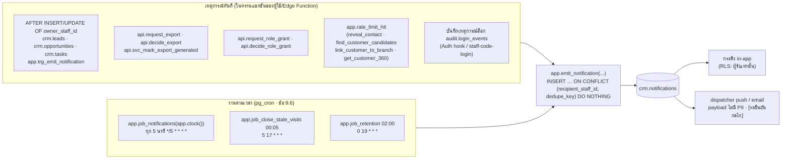
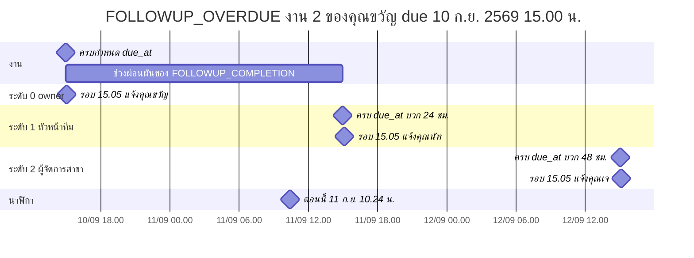
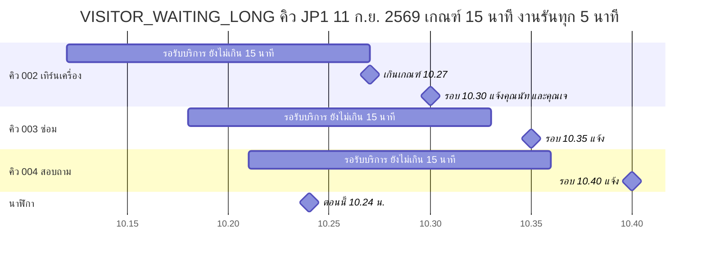

# Notification Rule — JAUN CRM · Customer 360

> เอกสารชุดที่ 15 ตาม A45 · **ฉบับ Phase 0 · 16 ก.ย. 2569**
> ค่าทุกค่าอ้างอิง `docs/00-brief/CANONICAL.md` **v2.2** (ข้อ 1.2 · 1.4 · 3.5 · 4 · 6.4–6.6 · 7 · 8.0 · 8.2 · 9.2 · 9.5 · 9.6 · 10.3–10.4 · 11 · 13.14 · 19) · ถ้าเอกสารนี้ขัดกับ CANONICAL **CANONICAL ชนะ**
> ชื่อตาราง/คอลัมน์/ฟังก์ชันยึด `supabase/migrations/0001–0009` (ข้อ 19.1) · สิ่งที่ v2.2 เพิ่มแต่ migration ยังไม่มี (รหัสแจ้งเตือนใหม่ 6 รหัสใน CHECK `notifications_code_chk` · ชนิดคำขอ `GRANT`/`REVOKE` ของคำขอบทบาท) ใช้ชื่อตาม CANONICAL
> เอกสารคู่กัน: `docs/05-analytics/kpi-definitions.md` (รายการคุณภาพข้อมูลข้อ 6.2 ที่ `DATA_MISSING` ใช้) · `docs/04-security/rls-spec.md` · `docs/07-api/api-spec.md` · `docs/06-ux/sitemap-screen-specs.md`
> **หมายเหตุผู้เขียน** = จุดที่ CANONICAL กำกวม/ไม่ครอบคลุม ผู้เขียนเลือกการตีความที่สอดคล้องกับส่วนอื่นมากที่สุด (สรุปในข้อ 8) · SQL ทั้งหมดเป็น **sketch** (ในฟังก์ชันจริง `SET search_path = ''`)

## 0. ภาพรวม

| หัวข้อ | ค่า (CANONICAL) |
|---|---|
| ที่เก็บ | `crm.notifications(id, organization_id, recipient_staff_id, code, entity_type, entity_id uuid, entity_ref, title, body, created_at, read_at, dedupe_key, created_by, updated_at, updated_by)` · UNIQUE `notifications_recipient_dedupe_uq` (`recipient_staff_id`, `dedupe_key`) · CHECK `notifications_code_chk` (รหัสข้อ 11.1) · `notifications_dedupe_key_chk` (ขึ้นต้น `{code}:`) (ข้อ 6.10 · `0007_crm_work.sql`) |
| ผู้เขียน | trigger (เหตุการณ์ทันที) · RPC ในทรานแซกชันของเหตุการณ์ · งานตามเวลา `app.job_notifications(p_as_of)` ทุก 5 นาที (ข้อ 11.1) · `authenticated` ไม่มี INSERT (ข้อ 9.4 กติกา 6) |
| ผู้อ่าน | `recipient_staff_id` = ตน · UPDATE ได้เฉพาะ `read_at` ของตน (ข้อ 8.3) |
| นาฬิกา | `app.clock()` สำหรับเงื่อนไขเวลา · วันที่ใน `dedupe_key` · "วันนี้" (ข้อ 1.2) · ความมีผลของบทบาท/ทีมของผู้รับใช้ `now()` (ข้อ 1.2 นาฬิกาการตัดสินสิทธิ์) |
| PII | ข้อความเต็ม (มีชื่อลูกค้า) อยู่ใน `crm.notifications` เท่านั้น · **push/email ห้ามมีชื่อ เบอร์ หรือข้อมูลลูกค้า** ใช้ title + เลขอ้างอิง + deep link ที่ต้องเข้าสู่ระบบ (ข้อ 1.4 · 11.1) · anonymize ล้าง `notifications.title/body` ของลูกค้านั้น (ข้อ 10.4) |
| seed | seed ตั้ง `app.seed_mode = on` → `app.is_seed_mode()` (`0008_audit.sql` · ข้อ 19.1 ข้อ 10) เป็นจริง → ข้ามการสร้าง notification · แถวใน seed มีเฉพาะ snapshot ข้อ 13.14 (ข้อ 13.0 ข้อ 7) |



- cron (ข้อ 9.6): `app.job_notifications` ทุก 5 นาที (`*/5 * * * *`) · `app.job_close_stale_visits` 00:05 (`5 17 * * *`) · `app.job_retention` 02:00 (`0 19 * * *`) · pg_cron รันในฐานข้อมูลในฐานะ `postgres` · migration ของ cron อยู่ใน `*_cron.sql` (PGlite ข้าม) · ทางเลือก scheduler ภายนอกเรียก Edge Function `cron-*` ยัง **[รอยืนยัน ข้อ 1]**
- **หมายเหตุผู้เขียน:** `app.emit_notification` เป็นชื่อ helper ภายในที่เสนอ (ไม่อยู่ในรายการข้อ 9.6) · กลไกส่ง push/email จริง (ตาราง subscription · ผู้ให้บริการ · retry) ไม่มีใน CANONICAL **[รอยืนยัน]** — เอกสารนี้กำหนดเฉพาะ "ส่งอะไร ให้ใคร เมื่อไร"

---

## 1. ค่าตั้งที่ใช้ (`app.settings` · CANONICAL ข้อ 11.2 · ทุกค่า [รอยืนยันค่า] · ผู้แก้ BA ผ่าน `api.update_setting`)

| key | ค่าเริ่มต้น | ใช้กับ |
|---|---|---|
| `business_hours` | `{"default":["10:00","21:00"]}` · คีย์รหัสสาขา (เช่น `"JP1"`) ทับ `default` (ข้อ 11.1) | `LEAD_UNASSIGNED` · `LEAD_NOT_CONTACTED` · `VISITOR_WAITING_LONG` (ข้อ 2.3) |
| `sla.followup_remind_min` | 15 | ค่าเริ่มต้น `tasks.remind_at = due_at − 15 นาที` (ข้อ 4.7) → `FOLLOWUP_DUE` |
| `sla.lead_unassigned_min` | 15 | `LEAD_UNASSIGNED` |
| `sla.lead_not_contacted_min` | 30 | `LEAD_NOT_CONTACTED` |
| `sla.visitor_waiting_min` | 15 | `VISITOR_WAITING_LONG` |
| `sla.visit_in_service_min` | 60 | `VISIT_OUTCOME_MISSING` ระดับ 0 |
| `sla.opportunity_stale_days` | `[7,14]` | `OPPORTUNITY_STALE` ระดับ 0 · 1 |
| `escalation.overdue_hours` | `[24,48]` | `FOLLOWUP_OVERDUE` ระดับ 1 · 2 · `TASK_OVERDUE` ระดับ 1 (ใช้ตัวแรก) |
| `notify.duplicate_digest_time` | `"18:00"` | `DUPLICATE_SUSPECTED` |
| `notify.data_missing_time` | `"09:00"` | `DATA_MISSING` รายวัน และรายสัปดาห์วันจันทร์ (ข้อ 11.1 "วันจันทร์ 09:00") |
| `dq.lead_without_outcome_days` · `dq.won_without_txn_days` · `dq.visit_unrecorded_days` | 14 · 3 · 7 | นับรายการของ `DATA_MISSING` |
| `security.reveal_per_hour` · `security.search_miss_per_hour` | 30 · 20 | `REVEAL_LIMIT_EXCEEDED` (เกิน = ปฏิเสธ + แจ้ง) · `SEARCH_LIMIT_EXCEEDED` (เกิน = บล็อก 1 ชม. + แจ้ง) |
| `security.link_per_day` | 10 | `LINK_LIMIT_EXCEEDED` |
| `security.customer_view_per_hour` | 100 | `CUSTOMER_VIEW_LIMIT_EXCEEDED` (แจ้งเท่านั้น ไม่บล็อก) |
| `export.limits` | `{ROLE: {max_rows, per_day, approver_role}}` ตามข้อ 8.2 (ข้อ 19.1 ข้อ 8) | ผู้อนุมัติของ `EXPORT_APPROVAL_REQUIRED` = `approver_role` ของ `requested_as_role` |
| `export.link_ttl_hours` · `export.max_downloads` | 24 · 3 | ข้อความของ `EXPORT_READY` |
| (ค่าคงที่ข้อ 9.2 · ไม่มีคีย์) | ถูกล็อก "เกิน 3 ครั้ง/วัน" | `LOCKOUT_REPEATED` |
| (ค่าคงที่ข้อ 11.1 · ไม่มีคีย์) | 7 วันก่อน `due_at` (ใช้ `coalesce(extended_until, due_at)` · ข้อ 3.22) | `DSR_DUE_SOON` |

อ่านค่าแบบเดียวทุกกฎ: `(SELECT value FROM app.settings WHERE key = '…')` ครั้งเดียวต่อรอบงาน (ไม่ hard-code)

---

## 2. กลไกร่วม

### 2.1 `dedupe_key` และความ idempotent

รูปแบบตรึง (ข้อ 11.1): **`'{code}:{entity_id}:{escalation_level}:{วันที่ Asia/Bangkok ของจุดยึดของรายการ}'`**

| ส่วน | ค่า |
|---|---|
| `{code}` | รหัสข้อ 11.1 เช่น `FOLLOWUP_OVERDUE` |
| `{entity_id}` | UUID ของรายการที่เป็นเหตุ · สำหรับสรุป (digest) = UUID ของหน่วยที่สรุป (สาขา/พนักงาน/องค์กร) ตามข้อ 3 |
| `{escalation_level}` | `0` = ผู้รับชั้นแรก · `1` · `2` = ชั้นยกระดับตามลำดับเวลา |
| `{วันที่}` | `to_char(app.bangkok_date(anchor), 'YYYY-MM-DD')` (ค.ศ. · `app.bangkok_date` ใน `0001_foundation.sql`) |

- **จุดยึด (anchor) ไม่ใช่วันที่ job รัน** (ข้อ 11.1): จุดยึด = `due_at` · `due_at + 24 ชม.` · เวลาที่ lead เริ่มไม่มี owner · วันที่ของสรุป — กำหนดต่อรหัสในข้อ 3 → งานรันซ้ำทุก 5 นาทีหรือรันย้อน (catch-up) ได้ผลเดิม · ไม่แจ้งซ้ำทุกเที่ยงคืนสำหรับรายการที่ค้างหลายวัน · ถ้าจุดยึดเปลี่ยน (เลื่อน `due_at` · มี interaction ใหม่ · lead กลับมาไม่มี owner) แจ้งรอบใหม่ได้ · สอดคล้อง snapshot ข้อ 13.14 ที่คุณขวัญมี `TASK_OVERDUE` ของงาน #1 (due 10 ก.ย.) เพียงแถวเดียว
- สรุปรายวัน (`DUPLICATE_SUSPECTED` · `DATA_MISSING` · `RETENTION_ANONYMIZE_UPCOMING`) มีจุดยึด = วันที่ของสรุป จึงเกิดได้วันละหนึ่งแถวต่อผู้รับต่อหน่วย · เหตุการณ์ทันที (RPC/trigger) ที่ไม่มีจุดยึดในข้อมูล ใช้ `app.clock()` ขณะเกิดเหตุการณ์ → ซ้ำรายการ/ผู้รับเดิมในวันเดียวกันไม่แจ้งซ้ำ
- การสร้างทุกครั้งใช้ `INSERT … ON CONFLICT (recipient_staff_id, dedupe_key) DO NOTHING` → แถวที่ผู้ใช้อ่านแล้ว (`read_at`) ไม่ถูกรีเซ็ต
- เงื่อนไขเวลาทุกกฎใช้รูป "เกิน" = `เวลาที่ถึงเกณฑ์ < p_as_of` (strict · เช่น `started_at + 15 นาที < p_as_of`) · "ถึง" = `<= p_as_of` (เฉพาะ `FOLLOWUP_DUE` · `DSR_DUE_SOON` และเวลาของ digest)
- `created_at` = `p_as_of` (งาน) หรือ `app.clock()` (trigger/RPC) · ใน prod ทั้งสองค่า = `now()` · ใน test ทำให้ผลคงที่ **(หมายเหตุผู้เขียน)**

```sql
-- sketch: helper ภายใน (SECURITY DEFINER · ไม่ GRANT ให้ authenticated · ชื่อเป็นข้อเสนอ ไม่อยู่ในข้อ 9.6)
CREATE FUNCTION app.emit_notification(
  p_recipient uuid, p_code text, p_entity_type text, p_entity_id uuid, p_entity_ref text,
  p_level int, p_anchor timestamptz, p_title text, p_body text, p_created_at timestamptz)
RETURNS void LANGUAGE sql SECURITY DEFINER SET search_path = '' AS $$
  INSERT INTO crm.notifications (organization_id, recipient_staff_id, code, entity_type, entity_id,
                                 entity_ref, title, body, created_at, dedupe_key)
  SELECT sp.organization_id, p_recipient, p_code, p_entity_type, p_entity_id, p_entity_ref, p_title, p_body,
         p_created_at,
         p_code || ':' || p_entity_id || ':' || p_level || ':'
                || to_char(app.bangkok_date(p_anchor), 'YYYY-MM-DD')
    FROM core.staff_profiles sp
   WHERE sp.id = p_recipient
     AND sp.status = 'ACTIVE'                                           -- ไม่ส่งถึงบัญชี INVITED/DISABLED
     AND NOT app.is_seed_mode()                                         -- 0008_audit.sql · ข้อ 19.1 ข้อ 10
  ON CONFLICT (recipient_staff_id, dedupe_key) DO NOTHING;
$$;
-- *_ASSIGNED ตรวจ app.is_bulk() เพิ่มที่ผู้เรียก (ข้อ 19.1 ข้อ 11) · รหัสอื่นไม่ข้ามเมื่อ bulk
```

### 2.2 การหาผู้รับ (recipient resolution)

ทุกฟังก์ชันคืน `SETOF uuid` ของ staff ที่ `status = 'ACTIVE'` · ความมีผลของ assignment/สมาชิกทีมใช้ `valid_from <= now() AND (valid_to IS NULL OR now() < valid_to)` (ข้อ 8.0) · ผู้รับซ้ำกันในหลายบทบาทได้แถวเดียวต่อ `dedupe_key`

| ชื่อ (ใช้ในเอกสาร) | นิยาม | CANONICAL |
|---|---|---|
| **R_OWNER** | `owner_staff_id` ของรายการ · `NULL` → ไม่มีผู้รับชั้นนี้ | 11.1 |
| **R_TEAM_LEADER(owner, branch)** | หัวหน้า (`is_leader`) ของทุกทีมที่ `teams.branch_id = branch` และ owner เป็นสมาชิกปัจจุบัน · ตัด owner ออก | 11.1 "หัวหน้าทีมปัจจุบันของ owner" · 7.1 · 8.0 |
| **R_BRANCH_MANAGERS(branch)** | staff ที่มี assignment `BRANCH_MANAGER` ที่ `branch_id = branch` มีผลอยู่ | 11.1 |
| **R_SV_BM(branch)** | R_BRANCH_MANAGERS ∪ staff ที่มี assignment `SUPERVISOR` ที่ `branch` มีผลอยู่ **และ** เป็น `is_leader` ของทีมอย่างน้อย 1 ทีมในสาขานั้น | 11.1 "SUPERVISOR เป็นผู้รับได้เมื่อเป็นหัวหน้าทีมในสาขานั้น" · 7.1 |
| **R_EXPORT_APPROVERS(request)** | staff ที่มีบทบาท = `app.settings['export.limits'][requested_as_role].approver_role`: `MARKETING` → BA ทุกคน · `BUSINESS_ADMIN` → EX ทุกคน · `EXECUTIVE` → BA ทุกคน **[รอยืนยัน Q23]** · `BRANCH_MANAGER` → `null` = ไม่มี (ไม่ต้องอนุมัติ) · ตัดผู้ยื่นออกเสมอ (`approved_by <> requested_by`) | 8.2 · 19.1 ข้อ 8 |
| **R_ROLE_DECIDERS(request)** | EX ทุกคน ตัด **ผู้รับ** (`target_staff_id`) · ผู้ยื่น (`requested_by`) · บัญชีที่ `employee_code` เดียวกับผู้รับ | 11.1 · 7.2 |
| **R_REQUESTER(request)** | `audit.export_requests.requested_by` · `core.role_grant_requests.requested_by` | 11.1 (`EXPORT_DECIDED` `EXPORT_READY` `ROLE_GRANT_DECIDED`) |
| **R_BA** | BUSINESS_ADMIN ที่ ACTIVE ทุกคน | 11.1 |

```sql
-- R_TEAM_LEADER(p_owner, p_branch)
SELECT DISTINCT ld.staff_id
  FROM core.team_members m
  JOIN core.teams t          ON t.id = m.team_id AND t.branch_id = p_branch
  JOIN core.team_members ld  ON ld.team_id = t.id AND ld.is_leader
  JOIN core.staff_profiles s ON s.id = ld.staff_id AND s.status = 'ACTIVE'
 WHERE m.staff_id = p_owner
   AND m.valid_from  <= now() AND (m.valid_to  IS NULL OR now() < m.valid_to)
   AND ld.valid_from <= now() AND (ld.valid_to IS NULL OR now() < ld.valid_to)
   AND ld.staff_id <> p_owner;

-- R_SV_BM(p_branch)
SELECT DISTINCT a.staff_id
  FROM core.staff_role_assignments a
  JOIN core.staff_profiles s ON s.id = a.staff_id AND s.status = 'ACTIVE'
 WHERE a.branch_id = p_branch
   AND a.valid_from <= now() AND (a.valid_to IS NULL OR now() < a.valid_to)
   AND ( a.role_code = 'BRANCH_MANAGER'
      OR (a.role_code = 'SUPERVISOR' AND EXISTS (
            SELECT 1 FROM core.team_members ld JOIN core.teams t ON t.id = ld.team_id
             WHERE ld.staff_id = a.staff_id AND ld.is_leader AND t.branch_id = p_branch
               AND ld.valid_from <= now() AND (ld.valid_to IS NULL OR now() < ld.valid_to))) );

-- R_EXPORT_APPROVERS(p_export)
SELECT DISTINCT a.staff_id
  FROM audit.export_requests e
  JOIN app.settings st ON st.key = 'export.limits'
  JOIN core.staff_role_assignments a
    ON a.role_code = st.value -> e.requested_as_role ->> 'approver_role'   -- BRANCH_MANAGER → null → ไม่มีแถว
  JOIN core.staff_profiles s ON s.id = a.staff_id AND s.status = 'ACTIVE'
 WHERE e.id = p_export
   AND a.valid_from <= now() AND (a.valid_to IS NULL OR now() < a.valid_to)
   AND a.staff_id <> e.requested_by;
```

- **การยกระดับไม่ส่งกลับไปที่ owner** (ข้อ 11.1): ตัด owner ออกจากทุกระดับที่ ≥ 1 (เช่น owner เป็นหัวหน้าทีมเอง หรือเป็นผู้จัดการสาขาแบบ seed JP2–JP4) · ระดับถัดไปยังทำงานตามปกติ
- **ระดับที่ไม่มีผู้รับให้ข้าม** (ข้อ 11.1): ไม่แทนด้วยบทบาทอื่นและไม่เป็นข้อผิดพลาด (ทีมไม่มีหัวหน้า เช่น `JPON-ADMIN` · สาขา `JPON` ไม่มี SV/BM ใน seed) · ผู้รับของ JPON ในอนาคตขึ้นกับ **[รอยืนยัน Q3]**
- ผู้รับไม่ต้องอยู่ aal2 เพื่อรับแถว in-app (แถวอ่านด้วย `recipient_staff_id`) · การเปิด deep link ยังผ่าน RLS/MFA ปกติ
- A27: Staff ได้เฉพาะของตน · หัวหน้า/ผู้จัดการได้ของทีม/สาขา → ตรงกับตารางผู้รับข้างบน

### 2.3 เวลาทำการ

- ค่า `business_hours` = `{"default":["HH:MM","HH:MM"], "<รหัสสาขา>":["HH:MM","HH:MM"]}` เวลา Asia/Bangkok ช่วง `[เปิด, ปิด)` ทุกวัน · **คีย์รหัสสาขา (`core.branches.code` เช่น `"JP1"`) ทับค่า `default`** · **ยังไม่มีวันหยุด** (ข้อ 11.1) · ค่าเวลาจริงของแต่ละสาขา **[รอยืนยัน Q4]**
- สองแบบการใช้ (ข้อ 11.1)

| แบบ | ใช้กับ | ความหมาย |
|---|---|---|
| **นับนาทีเวลาทำการ + ส่งเฉพาะในเวลาทำการ** | `LEAD_UNASSIGNED` "เกิน 15 นาที (ในเวลาทำการ)" · `LEAD_NOT_CONTACTED` "เกิน 30 นาที (ในเวลาทำการ)" | นับเฉพาะนาทีที่อยู่ในช่วงเวลาทำการของสาขา · และสร้างแถวเฉพาะเมื่อ `p_as_of` อยู่ในเวลาทำการ |
| **นับนาทีปฏิทิน + ส่งเฉพาะในเวลาทำการ** | `VISITOR_WAITING_LONG` "(ในเวลาทำการ)" | นับนาทีปฏิทิน · สร้างแถวเฉพาะเมื่อ `p_as_of` อยู่ในเวลาทำการ |

กฎอื่นไม่มีเงื่อนไขเวลาทำการใน CANONICAL → ทำงานทุกเวลา (in-app อย่างเดียวจึงไม่รบกวนนอกเวลา · `FOLLOWUP_DUE` มี push แต่เวลาเตือนผู้ใช้กำหนดเอง)

```sql
-- app.business_window(p_branch, p_date) → [open_ts, close_ts)
SELECT (p_date + (h->>0)::time)::timestamp AT TIME ZONE 'Asia/Bangkok',
       (p_date + (h->>1)::time)::timestamp AT TIME ZONE 'Asia/Bangkok'
  FROM (SELECT coalesce(s.value -> b.code, s.value -> 'default') AS h
          FROM app.settings s, core.branches b
         WHERE s.key = 'business_hours' AND b.id = p_branch) x;

-- app.in_business_hours(p_branch, p_ts) = p_ts ∈ business_window(p_branch, (p_ts AT TIME ZONE 'Asia/Bangkok')::date)

-- app.business_minutes_between(p_branch, p_from, p_to) → numeric
SELECT coalesce(sum(extract(epoch FROM (least(w.close_ts, p_to) - greatest(w.open_ts, p_from))) / 60), 0)
  FROM generate_series((p_from AT TIME ZONE 'Asia/Bangkok')::date::timestamp,   -- cast เป็น timestamp เพื่อไม่พึ่ง session TimeZone
                       (p_to   AT TIME ZONE 'Asia/Bangkok')::date::timestamp, interval '1 day') d(day),
       LATERAL app.business_window(p_branch, d.day::date) w
 WHERE least(w.close_ts, p_to) > greatest(w.open_ts, p_from);
```

ตัวอย่าง (เวลาทำการ 10:00–21:00): lead LINE ไม่มี owner สร้าง 20:55 → วันนั้นได้ 5 นาที → วันถัดไป 10:10 ครบ 15 นาที (ยังไม่ "เกิน") → งานรอบ **10:15** สร้างแจ้งเตือน · `dedupe_key` ใช้วันที่ของ anchor = เวลาที่เริ่มไม่มี owner (วันที่สร้าง lead) จึงไม่ซ้ำแม้งานรันต่อในวันถัดไป

### 2.4 ข้อความและช่องทาง

| ช่องทาง | เนื้อหา | กติกา |
|---|---|---|
| **in-app** (ทุกรหัส) | `title` = ป้ายไทยของข้อ 11.1 · `body` = แม่แบบของแต่ละรหัส (ข้อ 3) | body มาตรฐาน `{ชื่อลูกค้า} · {ชื่องาน/รายการ} · {เวลาครบกำหนด}` เช่น **"คุณพิมพ์ชนก ศรีสุข · ติดตามใบเสนอราคา iPhone 17 Pro Max · ครบกำหนด 10 ก.ย. 2569 15:00"** |
| **push** (`FOLLOWUP_DUE` `LEAD_UNASSIGNED` `VISITOR_WAITING_LONG`) | หัว = `title` · เนื้อ = `entity_ref` · แตะแล้วเปิด deep link | **ห้าม** ชื่อ/เบอร์/ข้อมูลลูกค้า/ชื่อสินค้า/ข้อความ body |
| **email** (`EXPORT_APPROVAL_REQUIRED` `EXPORT_DECIDED` `ROLE_GRANT_APPROVAL_REQUIRED` `ROLE_GRANT_DECIDED` `REVEAL_LIMIT_EXCEEDED` `SEARCH_LIMIT_EXCEEDED` `LOCKOUT_REPEATED` `DSR_DUE_SOON`) | หัวเรื่อง = `title` + " · " + `entity_ref` · เนื้อ = `title` + `entity_ref` + ลิงก์ | เหมือน push · ลิงก์ต้องเข้าสู่ระบบ (หน้า `/exports/EX-…` ของข้อ 8.2 สำหรับ export) |
| **in-app อย่างเดียว** | รหัสที่เหลือตามคอลัมน์ "ช่องทาง" ข้อ 11.1 (รวม `LINK_LIMIT_EXCEEDED` `CUSTOMER_VIEW_LIMIT_EXCEEDED` `EXPORT_READY`) | – |

ตัวแทนค่าใน body

| placeholder | ค่า | รูปแบบ |
|---|---|---|
| `{ชื่อลูกค้า}` | "คุณ" + `customers.display_name` ของรายการ (ถ้าไม่มีลูกค้าให้ตัดส่วนนี้พร้อมตัวคั่น) | ลูกค้า ANONYMIZED = `ลูกค้านิรนาม CUS-…` |
| `{ชื่องาน}` | `tasks.title` | ข้อความ ≤ 80 ตัวอักษร ตัดด้วย "…" **(ข้อเสนอ)** |
| `{เวลา}` (วัน+เวลา) | `timestamptz` → `d MMM yyyy HH:mm` แบบ พ.ศ. ย่อ | `10 ก.ย. 2569 15:00` (ไม่มี "น." ตามตัวอย่างข้อ 11.1 · ข้อ 19.5 ข้อ 4) |
| `{HH:MM}` (เวลาเดี่ยว) | เวลา 24 ชม. + " น." | `10:12 น.` (ข้อ 1.2 · 19.5 ข้อ 4) |
| `{เลขรายการ}` | `task_no` `lead_no` `opportunity_no` `visit_no` `export_no` `request_no` (`core.role_grant_requests` · `crm.data_subject_requests`) | ตามข้อ 6.1 |
| `{ผู้รับผิดชอบ}` · `{ผู้กระทำ}` | `core.staff_profiles.display_name` · ผู้กระทำที่เป็นระบบ = "ระบบ" | – |

deep link ตามชนิด entity (หน้าในข้อ 14.1 · รูป URL จริงยึด `sitemap-screen-specs.md`)

| `entity_type` | `entity_ref` | หน้า |
|---|---|---|
| `TASK` | `TK-…` | 08 `tasks` (เปิด drawer งาน) |
| `LEAD` | `LD-…` | 11 `leads` |
| `OPPORTUNITY` | `OP-…` | 06 `pipeline` |
| `VISIT` | `V-…` | 07 `reception` |
| `EXPORT` | `EX-…` | 15 `exports` · `/exports/EX-…` |
| `ROLE_GRANT_REQUEST` | `RG-…` | 13 `users` |
| `DSR` | `DSR-…` | 17 `privacy` |
| `STAFF` (digest ของตน · เกินเกณฑ์ · ล็อกซ้ำ) | `ST-…` | 12 `data-quality` (`DATA_MISSING`) · 16 `audit` (BA: reveal/search/view/lockout) · 13 `users` (BM: `LINK_LIMIT_EXCEEDED`) |
| `BRANCH` (digest · ข้อเสนอ) | รหัสสาขา เช่น `JP1` | 12 `data-quality` (ซ้ำ/คุณภาพ) · 07 `reception` (visit ไม่บันทึกผล) |
| `ORGANIZATION` (retention · ข้อเสนอ) | `JAUN` | 17 `privacy` |

- ค่า `entity_type` ใช้คำศัพท์เดียวกับ `audit.audit_logs.entity_type` ของ CANONICAL ข้อ 9.5 (`TASK` `LEAD` `OPPORTUNITY` `VISIT` `EXPORT` `ROLE_GRANT_REQUEST` `DSR` `STAFF`) · `BRANCH` `ORGANIZATION` ไม่มีในข้อ 9.5 จึงเป็นข้อเสนอสำหรับสรุป · คอลัมน์เป็น `text` ไม่มี CHECK (`0007`)
- body ใน `crm.notifications` มีคำนำหน้า "คุณ" ได้ (ข้อ 3.5: "ข้อความสำเร็จรูป เช่น `notifications.body` มี 'คุณ' ได้") · คอลัมน์ชื่อของลูกค้าไม่เก็บ "คุณ"

### 2.5 การปิด/หยุดแจ้ง

- `crm.notifications` ไม่มีคอลัมน์สถานะ "แก้แล้ว" และ authenticated ไม่มี DELETE → **แถวที่สร้างแล้วคงอยู่** จนผู้ใช้อ่าน (`read_at`)
- เมื่อเงื่อนไขหมด (งานปิด · lead มี owner · visit เปลี่ยนสถานะ) งาน **ไม่สร้างระดับถัดไป** · หน้าที่เปิดจาก deep link แสดงสถานะจริงของรายการ
- ข้อเสนอ UI: ในรายการกระดิ่งแสดงป้าย "จัดการแล้ว" เมื่อสถานะปัจจุบันของ entity ไม่เข้าเงื่อนไข (อ่านผ่าน RLS ปกติ) · การตั้ง `read_at` อัตโนมัติเมื่อจัดการแล้วไม่มีใน CANONICAL **[รอยืนยัน]**

---
## 3. กฎรายรหัส (CANONICAL ข้อ 11.1 · 25 รหัส)

### 3.0 ตารางสรุป

| # | code | title | ประเภท | ผู้รับ (ระดับ: เวลา) | เวลาทำการ | ช่องทาง |
|---:|---|---|---|---|---|---|
| 1 | `FOLLOWUP_DUE` | ถึงเวลาติดตามลูกค้า | งาน 5 นาที | owner (0: `remind_at`) | – | in-app + push |
| 2 | `FOLLOWUP_OVERDUE` | ติดตามเกินกำหนด | งาน 5 นาที | owner (0: `due_at`) · หัวหน้าทีมของ owner (1: +24 ชม.) · ผู้จัดการสาขา (2: +48 ชม.) | – | in-app |
| 3 | `TASK_OVERDUE` | งานเกินกำหนด | งาน 5 นาที | owner (0: `due_at`) · หัวหน้าทีม (1: +24 ชม.) | – | in-app |
| 4 | `LEAD_UNASSIGNED` | Lead ยังไม่มีผู้รับผิดชอบ | งาน 5 นาที | SV+BM ของสาขา (0: > 15 นาทีเวลาทำการ) | นับนาทีเวลาทำการ + ส่งเฉพาะในเวลาทำการ | in-app + push |
| 5 | `LEAD_NOT_CONTACTED` | Lead ยังไม่ถูกติดต่อ | งาน 5 นาที | owner + หัวหน้าทีม (0: > 30 นาทีเวลาทำการ) | นับนาทีเวลาทำการ + ส่งเฉพาะในเวลาทำการ | in-app |
| 6 | `LEAD_ASSIGNED` | ได้รับมอบหมายรายการใหม่ | trigger | owner ใหม่ (0: ทันที) | – | in-app |
| 7 | `OPPORTUNITY_ASSIGNED` | ได้รับมอบหมายรายการใหม่ | trigger | owner ใหม่ (0: ทันที) | – | in-app |
| 8 | `TASK_ASSIGNED` | ได้รับมอบหมายรายการใหม่ | trigger | owner ใหม่ (0: ทันที) | – | in-app |
| 9 | `OPPORTUNITY_STALE` | โอกาสขายไม่มีความเคลื่อนไหว | งาน 5 นาที | owner (0: 7 วัน) · ผู้จัดการสาขา (1: 14 วัน) | – | in-app |
| 10 | `DUPLICATE_SUSPECTED` | อาจมีลูกค้าซ้ำ | งาน 5 นาที (digest 18:00) | SV+BM ของสาขา (0) | – | in-app |
| 11 | `VISITOR_WAITING_LONG` | ลูกค้ารอนานเกินไป | งาน 5 นาที | SV+BM ของสาขา (0: > 15 นาที) | นับนาทีปฏิทิน + ส่งเฉพาะในเวลาทำการ | in-app + push |
| 12 | `VISIT_OUTCOME_MISSING` | ยังไม่บันทึกผลการให้บริการ | งาน 5 นาที (0) · `app.job_close_stale_visits` 00:05 (1) | ผู้รับ visit (0: > 60 นาที) · ผู้จัดการสาขา (1: สรุปสิ้นวัน) | – | in-app |
| 13 | `DATA_MISSING` | ข้อมูลลูกค้าไม่ครบ | งาน 5 นาที (digest 09:00) | owner (0: ทุกวัน 09:00) · ผู้จัดการสาขา (1: **วันจันทร์ 09:00**) | – | in-app |
| 14 | `EXPORT_APPROVAL_REQUIRED` | มีคำขอส่งออกรออนุมัติ | RPC `api.request_export` | ผู้อนุมัติตามข้อ 8.2 (0) | – | in-app + email |
| 15 | `EXPORT_DECIDED` | คำขอส่งออกได้รับการตัดสินแล้ว | RPC `api.decide_export` | ผู้ขอ (0) | – | in-app + email |
| 16 | `ROLE_GRANT_APPROVAL_REQUIRED` | มีคำขอมอบบทบาทรออนุมัติ | RPC `api.request_role_grant` | EX ทุกคนยกเว้นผู้รับ (0) | – | in-app + email |
| 17 | `REVEAL_LIMIT_EXCEEDED` | การเปิดดู/ค้นหาเกินเกณฑ์ | RPC `api.reveal_contact` (`app.rate_limit_hit` · เกิน = ปฏิเสธ) | BA ทุกคน (0) | – | in-app + email |
| 18 | `SEARCH_LIMIT_EXCEEDED` | การเปิดดู/ค้นหาเกินเกณฑ์ | RPC (`app.rate_limit_hit` · เกิน = บล็อก 1 ชม.) | BA ทุกคน (0) | – | in-app + email |
| 19 | `RETENTION_ANONYMIZE_UPCOMING` | ข้อมูลใกล้ครบระยะเก็บ | `app.job_retention` 02:00 (สรุปรายวันทั้งองค์กร) | BA ทุกคน (0) | – | in-app |
| 20 | `LOCKOUT_REPEATED` | บัญชีถูกล็อกซ้ำ | ในทรานแซกชันที่บันทึกเหตุการณ์ล็อก (`audit.login_events`) | BA ทุกคน (0: ครั้งที่ 4 ของวัน) | – | in-app + email |
| 21 | `LINK_LIMIT_EXCEEDED` | ผูกลูกค้าข้ามสาขาเกินเกณฑ์ | RPC `api.link_customer_to_branch` (`app.rate_limit_hit`) | BRANCH_MANAGER ของสาขานั้น (0) | – | in-app |
| 22 | `CUSTOMER_VIEW_LIMIT_EXCEEDED` | เปิดดูลูกค้าจำนวนมาก | RPC `api.get_customer_360` (`app.rate_limit_hit` · ไม่บล็อก) | BA ทุกคน (0) | – | in-app |
| 23 | `EXPORT_READY` | ไฟล์ส่งออกพร้อมดาวน์โหลด | RPC `api.svc_mark_export_generated` (→ `GENERATED`) | ผู้ขอ (0) | – | in-app |
| 24 | `ROLE_GRANT_DECIDED` | คำขอบทบาทได้รับการตัดสินแล้ว | RPC `api.decide_role_grant` | ผู้ยื่นคำขอ (0) | – | in-app + email |
| 25 | `DSR_DUE_SOON` | คำขอเจ้าของข้อมูลใกล้ครบกำหนด | งาน 5 นาที | BA ทุกคน (0: 7 วันก่อน `due_at`) | – | in-app + email |

- ทุกรหัสต้องอยู่ใน CHECK `notifications_code_chk` · migration 0007 มีเฉพาะ 19 รหัสแรก → ต้องเพิ่ม #20–#25 ด้วย migration ก่อนใช้งาน

โครงของ `app.job_notifications(p_as_of)` (service_role/cron · ไม่มี `app.current_staff_id()`)

```sql
-- sketch: หนึ่งทรานแซกชันต่อรอบ · ทุกกฎเป็น INSERT…SELECT ผ่าน app.emit_notification (idempotent)
v_cfg := (SELECT jsonb_object_agg(key, value) FROM app.settings);
v_today := app.bangkok_date(p_as_of);
PERFORM app.nr_followup_due(p_as_of, v_cfg);        -- 3.1
PERFORM app.nr_followup_overdue(p_as_of, v_cfg);    -- 3.2
PERFORM app.nr_task_overdue(p_as_of, v_cfg);        -- 3.3
PERFORM app.nr_lead_unassigned(p_as_of, v_cfg);     -- 3.4
PERFORM app.nr_lead_not_contacted(p_as_of, v_cfg);  -- 3.5
PERFORM app.nr_opportunity_stale(p_as_of, v_cfg);   -- 3.7
PERFORM app.nr_duplicate_digest(p_as_of, v_cfg);    -- 3.8
PERFORM app.nr_visitor_waiting(p_as_of, v_cfg);     -- 3.9
PERFORM app.nr_visit_in_service(p_as_of, v_cfg);    -- 3.10 ระดับ 0
PERFORM app.nr_data_missing(p_as_of, v_cfg);        -- 3.11
PERFORM app.nr_dsr_due_soon(p_as_of, v_cfg);        -- 3.22
-- ชื่อ app.nr_* เป็นข้อเสนอเพื่อแยกทดสอบรายกฎ · จะรวมเป็นฟังก์ชันเดียวก็ได้
-- รหัสอื่นเกิดใน trigger/RPC (3.6 · 3.12–3.15 · 3.17–3.21) · 3.10 ระดับ 1 ใน job_close_stale_visits · 3.16 ใน job_retention
```

---

### 3.1 `FOLLOWUP_DUE` — ถึงเวลาติดตามลูกค้า

| หัวข้อ | ข้อกำหนด |
|---|---|
| ประเภท | งาน `app.job_notifications` ทุก 5 นาที |
| เงื่อนไข | task `task_type_code = 'FOLLOW_UP'` · `status IN ('OPEN','IN_PROGRESS')` · `owner_staff_id IS NOT NULL` · `remind_at <= p_as_of` · `due_at > p_as_of` |
| เวลาทำการ | ไม่มีเงื่อนไข (`remind_at` ผู้ใช้กำหนด · ค่าเริ่มต้น `due_at − sla.followup_remind_min`) |
| ผู้รับ · ระดับ | R_OWNER · ระดับ 0 |
| entity · anchor · dedupe | `TASK` · `task_no` · anchor = `remind_at` · `FOLLOWUP_DUE:{tasks.id}:0:{วันที่ remind_at}` |
| body | `{ชื่อลูกค้า} · {tasks.title} · ครบกำหนด {due_at}` |
| push | หัว "ถึงเวลาติดตามลูกค้า" · เนื้อ `{task_no}` · ลิงก์หน้า 08 |
| ปิด/หยุด | งาน DONE/CANCELLED ก่อนถึง `remind_at` → ไม่สร้าง · เลย `due_at` แล้วไม่สร้าง (ส่งต่อให้ `FOLLOWUP_OVERDUE`) · เลื่อน `remind_at` ไปวันอื่น → แจ้งใหม่ได้ |
| ตัวอย่าง | task ติดตาม iPad Air ของคุณสมชาย (`FOLLOW_UP` · due 20 ก.ย. 2569 11:00 · ข้อ 13.7) → `remind_at` 10:45 → รอบ 10:45 สร้างแถวถึงคุณขวัญ · body "คุณสมชาย ใจดี · {ชื่องาน} · ครบกำหนด 20 ก.ย. 2569 11:00" · `TK-2026-012508` เป็น `CALL` จึง **ไม่มี** `FOLLOWUP_DUE` |

- **หมายเหตุผู้เขียน:** เงื่อนไข `due_at > p_as_of` ป้องกันการเตือน "ถึงเวลา" ย้อนหลังเมื่องานหยุดรันแล้วกลับมาหลังครบกำหนด (ข้อ 11.1 ไม่ได้ระบุ)

```sql
-- ชื่อ helper app.nr_body_* (ประกอบ body) · app.r_* (ผู้รับข้อ 2.2) เป็นข้อเสนอ
PERFORM app.emit_notification(t.owner_staff_id, 'FOLLOWUP_DUE', 'TASK', t.id, t.task_no, 0, t.remind_at,
         'ถึงเวลาติดตามลูกค้า', app.nr_body_task(t), p_as_of)
  FROM crm.tasks t
 WHERE t.task_type_code = 'FOLLOW_UP' AND t.status IN ('OPEN','IN_PROGRESS')
   AND t.owner_staff_id IS NOT NULL
   AND t.remind_at <= p_as_of AND t.due_at > p_as_of;
```

### 3.2 `FOLLOWUP_OVERDUE` — ติดตามเกินกำหนด

| หัวข้อ | ข้อกำหนด |
|---|---|
| ประเภท | งานทุก 5 นาที |
| เงื่อนไขร่วม | task `FOLLOW_UP` · `status IN ('OPEN','IN_PROGRESS')` (`tasks.due_at` NOT NULL เสมอ · ข้อ 19.1 ข้อ 6) |
| ระดับ 0 | `due_at < p_as_of` → R_OWNER · anchor `due_at` · owner ว่าง → ข้ามระดับนี้ |
| ระดับ 1 | `due_at + h1 < p_as_of` (`h1 = escalation.overdue_hours[0]` = 24 ชม.) → R_TEAM_LEADER(owner, `tasks.branch_id`) · anchor `due_at + h1` · owner ว่างหรือไม่มีหัวหน้า → ข้าม |
| ระดับ 2 | `due_at + h2 < p_as_of` (`h2` = 48 ชม.) → R_BRANCH_MANAGERS(`tasks.branch_id`) ตัด owner · anchor `due_at + h2` · ผู้รับไม่ขึ้นกับ owner จึงส่งแม้ owner ว่าง (ข้อ 11.1 "ระดับที่ไม่มีผู้รับให้ข้าม" ใช้กับแต่ละระดับแยกกัน) |
| เวลาทำการ | ไม่มี |
| dedupe | `FOLLOWUP_OVERDUE:{tasks.id}:{ระดับ 0–2}:{วันที่ anchor}` |
| body | ระดับ 0: `{ชื่อลูกค้า} · {title} · ครบกำหนด {due_at}` · ระดับ 1–2: ต่อท้าย ` · ผู้รับผิดชอบ {owner}` (owner ว่าง = "ไม่มีผู้รับผิดชอบ") |
| ช่องทาง | in-app |
| ปิด/หยุด | DONE/CANCELLED → ไม่สร้างระดับถัดไป · เลื่อน `due_at` → anchor ใหม่ (แจ้งรอบใหม่เมื่อเลยกำหนดใหม่) |
| ตัวอย่าง | ข้อ 5.1 (timeline) · งาน #2 ของคุณขวัญ |

- ต่างจากกลุ่ม "เกินกำหนด" ของหน้า 08 (ข้อ 4.7 = `due_at` ก่อน 00:00 วันนี้): การแจ้งเตือนเริ่มทันทีที่เลย `due_at`

```sql
-- ใน plpgsql ห่อทั้งคำสั่งด้วย PERFORM 1 FROM ( … ) x
WITH t AS (
  SELECT t.*, (v_cfg #>> '{escalation.overdue_hours,0}')::int AS h1,
              (v_cfg #>> '{escalation.overdue_hours,1}')::int AS h2
    FROM crm.tasks t
   WHERE t.task_type_code = 'FOLLOW_UP' AND t.status IN ('OPEN','IN_PROGRESS') AND t.due_at < p_as_of
)
SELECT app.emit_notification(t.owner_staff_id, 'FOLLOWUP_OVERDUE', 'TASK', t.id, t.task_no, 0, t.due_at,
                             'ติดตามเกินกำหนด', app.nr_body_task(t), p_as_of)
  FROM t WHERE t.owner_staff_id IS NOT NULL
UNION ALL
SELECT app.emit_notification(r.staff_id, 'FOLLOWUP_OVERDUE', 'TASK', t.id, t.task_no, 1,
                             t.due_at + make_interval(hours => t.h1), 'ติดตามเกินกำหนด', app.nr_body_task_owner(t), p_as_of)
  FROM t CROSS JOIN LATERAL app.r_team_leader(t.owner_staff_id, t.branch_id) r(staff_id)
 WHERE t.due_at + make_interval(hours => t.h1) < p_as_of
UNION ALL
SELECT app.emit_notification(r.staff_id, 'FOLLOWUP_OVERDUE', 'TASK', t.id, t.task_no, 2,
                             t.due_at + make_interval(hours => t.h2), 'ติดตามเกินกำหนด', app.nr_body_task_owner(t), p_as_of)
  FROM t CROSS JOIN LATERAL app.r_branch_managers(t.branch_id) r(staff_id)
 WHERE t.due_at + make_interval(hours => t.h2) < p_as_of
   AND r.staff_id IS DISTINCT FROM t.owner_staff_id;
```

### 3.3 `TASK_OVERDUE` — งานเกินกำหนด

| หัวข้อ | ข้อกำหนด |
|---|---|
| ประเภท | งานทุก 5 นาที |
| เงื่อนไข | task `task_type_code <> 'FOLLOW_UP'` · `status IN ('OPEN','IN_PROGRESS')` |
| ระดับ 0 | `due_at < p_as_of` → R_OWNER · anchor `due_at` |
| ระดับ 1 | `due_at + escalation.overdue_hours[0]` (24 ชม.) `< p_as_of` → R_TEAM_LEADER(owner, branch) · anchor `due_at + 24 ชม.` · **ไม่มีระดับ 2** |
| dedupe | `TASK_OVERDUE:{tasks.id}:{ระดับ 0–1}:{วันที่ anchor}` |
| body | เหมือน `FOLLOWUP_OVERDUE` (ระดับ 1 ต่อท้ายผู้รับผิดชอบ) |
| ช่องทาง · ปิด | in-app · เหมือน 3.2 |
| ตัวอย่าง | งาน #1 ของคุณขวัญ (`CALL` · due 10 ก.ย. 2569 13:00) → ระดับ 0 รอบ 13:05 ของ 10 ก.ย. · ระดับ 1 ถึงคุณนัท รอบ 13:05 ของ 11 ก.ย. 2569 (หลัง "ตอนนี้") · งาน #5 (`CALL` · due 11 ก.ย. 2569 10:00) → ระดับ 0 รอบ 10:05 · body "คุณมานพ รักงาน · โทรขอเลขใบเสร็จ POS · ครบกำหนด 11 ก.ย. 2569 10:00" |

### 3.4 `LEAD_UNASSIGNED` — Lead ยังไม่มีผู้รับผิดชอบ

| หัวข้อ | ข้อกำหนด |
|---|---|
| ประเภท | งานทุก 5 นาที |
| เงื่อนไข | lead `status IN ('NEW','CONTACTED','QUALIFIED')` · `owner_staff_id IS NULL` · `app.business_minutes_between(branch_id, v_since, p_as_of) > sla.lead_unassigned_min` (15) · `app.in_business_hours(branch_id, p_as_of)` (นับนาทีเวลาทำการ + ส่งเฉพาะในเวลาทำการ · ข้อ 11.1) |
| `v_since` | เวลาที่เริ่มไม่มี owner = `coalesce((SELECT max(oc.changed_at) FROM crm.ownership_changes oc WHERE oc.entity_type = 'LEAD' AND oc.entity_id = l.id AND oc.to_staff_id IS NULL), l.created_at)` (`ownership_changes_entity_type_chk` ใน `0006`) |
| ผู้รับ · ระดับ | R_SV_BM(`leads.branch_id`) · ระดับ 0 (ไม่มีการยกระดับ) · SV รับเรื่องได้เพราะ `lead.assign` scope T รวม lead ไม่มี owner ในสาขาที่ตนเป็นหัวหน้าทีม (ข้อ 8.0 · Q28) |
| entity · anchor · dedupe | `LEAD` · `lead_no` · anchor = `v_since` · `LEAD_UNASSIGNED:{leads.id}:0:{วันที่ v_since}` |
| body | `{ชื่อลูกค้า} · {lead_no} · {ป้ายช่องทาง} · ไม่มีผู้รับผิดชอบตั้งแต่ {v_since}` |
| push | หัว "Lead ยังไม่มีผู้รับผิดชอบ" · เนื้อ `{lead_no}` · ลิงก์หน้า 11 |
| ปิด/หยุด | มอบ owner (`api.assign_owner` · `lead.assign` · ข้อ 9.4.2) หรือปิด lead · ถ้ากลับมาไม่มี owner อีกครั้งในวันอื่น → แจ้งใหม่ |
| ที่มาอื่น | `api.disable_staff` ตั้ง owner ของ lead ที่เปิดอยู่เป็นว่าง "+ แจ้ง `LEAD_UNASSIGNED`" (ข้อ 7.3 **[รอยืนยัน]**) → ใช้กฎนี้ (anchor = `changed_at` ของแถว `ownership_changes` เหตุผล `STAFF_LEFT`) ไม่สร้างเส้นทางแยก · task ที่ owner ว่างจากการปิดใช้งานไม่มีรหัสแจ้งเตือน **[รอยืนยัน]** |
| ตัวอย่าง | lead เปิดอยู่ไม่มี owner ของ JP1 2 รายการ → คุณนัท (SV · หัวหน้า JP1-SALES) และคุณเจ (BM) คนละ 2 แถว (ข้อ 13.14) |

- แถว `LEAD_WITHOUT_OWNER` ในศูนย์คุณภาพข้อมูลคือรายการเดียวกันแต่ไม่มีเงื่อนไขเวลา

### 3.5 `LEAD_NOT_CONTACTED` — Lead ยังไม่ถูกติดต่อ

| หัวข้อ | ข้อกำหนด |
|---|---|
| ประเภท | งานทุก 5 นาที |
| เงื่อนไข | lead `status = 'NEW'` · `app.business_minutes_between(branch_id, created_at, p_as_of) > sla.lead_not_contacted_min` (30) · `app.in_business_hours(branch_id, p_as_of)` |
| ผู้รับ · ระดับ | R_OWNER **และ** R_TEAM_LEADER(owner, branch) พร้อมกัน · ระดับ 0 ทั้งคู่ (CANONICAL ไม่กำหนดเวลาห่าง) · owner ว่าง → ไม่มีผู้รับ (ครอบคลุมโดย `LEAD_UNASSIGNED`) |
| entity · anchor · dedupe | `LEAD` · `lead_no` · anchor = `created_at` · `LEAD_NOT_CONTACTED:{leads.id}:0:{วันที่ created_at}` |
| body | `{ชื่อลูกค้า} · {lead_no} · {ป้ายช่องทาง} · สร้างเมื่อ {created_at}` (หัวหน้าทีมต่อท้าย ` · ผู้รับผิดชอบ {owner}`) |
| ช่องทาง | in-app |
| ปิด/หยุด | `NEW → CONTACTED` อัตโนมัติจาก interaction `OUTBOUND` แรก หรือ `NEW → CONTACTED/QUALIFIED` ด้วยมือ (ข้อ 4.3) หรือปิด lead |
| หมายเหตุ | lead ช่องทาง `WALK_IN`/`PHONE` เริ่มที่ `CONTACTED` จึงไม่เข้ากฎนี้ · ตัวอย่าง: lead ของ `CUS-2026-006774` (TikTok · JP4 · ป้าย "ยังไม่ได้ติดต่อ" · กิจกรรมล่าสุด 11 ก.ย. 2569 10:06) ถ้าสร้างเวลา 10:06 → เวลาทำการสะสมเกิน 30 นาทีหลัง 10:36 → รอบ **10:40** · ณ 10:24 ยังไม่ถึงเกณฑ์ · ผู้รับ = owner ของ lead (ข้อสมมติข้อ 13.5: รายการ JP4 มี owner = คุณเบียร์ เว้นแต่เป็น lead ไม่มี owner) · ไม่มีหัวหน้าทีม |

### 3.6 `LEAD_ASSIGNED` · `OPPORTUNITY_ASSIGNED` · `TASK_ASSIGNED` — ได้รับมอบหมายรายการใหม่

| หัวข้อ | ข้อกำหนด |
|---|---|
| ประเภท | trigger `app.trg_emit_notification` AFTER INSERT OR UPDATE OF `owner_staff_id` ON `crm.leads` / `crm.opportunities` / `crm.tasks` (FOR EACH ROW) · การเปลี่ยน owner ของรายการที่มีอยู่ทำผ่าน `api.assign_owner(...)` เท่านั้น (ข้อ 9.4.2) |
| เงื่อนไข | `NEW.owner_staff_id IS NOT NULL` · (`TG_OP = 'INSERT'` หรือ `NEW.owner_staff_id IS DISTINCT FROM OLD.owner_staff_id`) · `NEW.owner_staff_id IS DISTINCT FROM v_actor` ("โดยคนอื่น" · `v_actor = coalesce(app.current_staff_id(), nullif(current_setting('app.actor_staff_id', true), '')::uuid)` สำหรับ Edge Function ที่เรียก `api.svc_*` · ข้อ 9.5 · งานระบบที่ไม่มี actor นับเป็นคนอื่น) · **`TASK_ASSIGNED` ไม่ส่งสำหรับ task `is_next_action`** · **ไม่ส่งเมื่อ `app.bulk = on`** (`app.is_bulk()` · ข้อ 11.1 · 19.1 ข้อ 11) |
| ผู้รับ · ระดับ | owner ใหม่ · ระดับ 0 |
| entity · anchor · dedupe | `LEAD`/`OPPORTUNITY`/`TASK` · เลขรายการ · anchor = `app.clock()` · `{code}:{id}:0:{วันที่}` (มอบรายการเดิมให้คนเดิมซ้ำในวันเดียวกัน → แถวเดียว) |
| body | lead: `{ชื่อลูกค้า} · {lead_no} · มอบโดย {ผู้กระทำ}` · opportunity: `{ชื่อลูกค้า} · {opportunity_no} · มอบโดย {ผู้กระทำ}` · task: `{ชื่อลูกค้า} · {title} · ครบกำหนด {due_at} · มอบโดย {ผู้กระทำ}` |
| ช่องทาง · ปิด | in-app · ไม่มีการปิด (แจ้งข้อมูล) |
| ตัวอย่าง (ข้อ 13.14) | `LD-2026-007512` 10 ก.ย. 2569 18:05 คุณเจมอบจากคุณขวัญ → คุณคิม (`SHIFT_CHANGE`) → คุณคิมได้ `LEAD_ASSIGNED` · `dedupe_key` = `LEAD_ASSIGNED:{id ของ LD-2026-007512}:0:2026-09-10` · body "คุณวิไลวรรณ สวยดี · LD-2026-007512 · มอบโดย คุณเจ" · task next action ที่ trigger ย้าย owner ตาม **ไม่** สร้าง `TASK_ASSIGNED` |

- เหตุผลของข้อยกเว้น (ข้อ 11.1): task next action ถูก `app.trg_sync_next_action_task` ย้าย owner ตาม lead/opportunity ทุกครั้ง จะกลายเป็นแจ้งซ้ำ · งาน bulk (นำเข้า/merge/seed) จะสร้างแจ้งเตือนจำนวนมาก
- ผลที่ตามมา: quick-capture สร้าง lead ที่ owner = ผู้บันทึก จึงไม่แจ้ง · `api.disable_staff` ย้าย opportunity ที่เปิดอยู่ไปผู้จัดการสาขาของรายการ (หลายคน → `staff_code` น้อยสุด **[รอยืนยัน]** · ข้อ 7.3) → ผู้จัดการได้ `OPPORTUNITY_ASSIGNED` เว้นแต่ผู้จัดการคนนั้นเป็นผู้ปิดใช้งานเอง · เปลี่ยน `branch_id` อย่างเดียวไม่แจ้ง

```sql
-- sketch: app.trg_emit_notification() สำหรับ crm.leads
v_actor := coalesce(app.current_staff_id(), nullif(current_setting('app.actor_staff_id', true), '')::uuid);
IF NEW.owner_staff_id IS NOT NULL
   AND (TG_OP = 'INSERT' OR NEW.owner_staff_id IS DISTINCT FROM OLD.owner_staff_id)
   AND NEW.owner_staff_id IS DISTINCT FROM v_actor
   AND NOT app.is_bulk() THEN                                   -- crm.tasks: AND NOT NEW.is_next_action
  PERFORM app.emit_notification(NEW.owner_staff_id, 'LEAD_ASSIGNED', 'LEAD', NEW.id, NEW.lead_no, 0, app.clock(),
          'ได้รับมอบหมายรายการใหม่', app.nr_body_assigned(NEW), app.clock());
END IF;
RETURN NULL;
```

### 3.7 `OPPORTUNITY_STALE` — โอกาสขายไม่มีความเคลื่อนไหว

| หัวข้อ | ข้อกำหนด |
|---|---|
| ประเภท | งานทุก 5 นาที |
| เงื่อนไขร่วม | opportunity `stage IN ('INTERESTED','QUOTATION','FOLLOW_UP')` |
| `v_last` | `greatest(o.created_at, (SELECT max(i.occurred_at) FROM crm.interactions i WHERE i.opportunity_id = o.id), (SELECT max(h.changed_at) FROM crm.opportunity_stage_history h WHERE h.opportunity_id = o.id))` |
| ระดับ 0 | `v_last + sla.opportunity_stale_days[0]` (7 วัน) `< p_as_of` → R_OWNER · anchor `v_last + 7 วัน` |
| ระดับ 1 | `v_last + sla.opportunity_stale_days[1]` (14 วัน) `< p_as_of` → R_BRANCH_MANAGERS(branch) ตัด owner (owner ยังมีแถวระดับ 0 อยู่แล้ว = "14 วันเพิ่มผู้จัดการสาขา") · anchor `v_last + 14 วัน` |
| dedupe | `OPPORTUNITY_STALE:{opportunities.id}:{ระดับ 0–1}:{วันที่ anchor}` |
| body | `{ชื่อลูกค้า} · {opportunity_no} · ไม่มีความเคลื่อนไหวตั้งแต่ {v_last}` (ระดับ 1 ต่อท้ายผู้รับผิดชอบ) |
| ช่องทาง · ปิด | in-app · มี interaction ที่ผูก `opportunity_id` หรือเปลี่ยนขั้น → `v_last` ใหม่ · ปิด WON/LOST → หยุด |
| ตัวอย่าง | `OP-2026-002998` (คุณสมชาย) เปลี่ยนขั้นล่าสุด `QUOTATION → FOLLOW_UP` 8 ก.ย. 2569 16:10 → ถ้าไม่มีการเคลื่อนไหว ระดับ 0 ถึงคุณขวัญรอบ 16:15 ของ 15 ก.ย. 2569 · ระดับ 1 ถึงคุณเจรอบ 16:15 ของ 22 ก.ย. 2569 · ถ้าบันทึก interaction โทรที่ผูก opportunity วันที่ 18 ก.ย. ตามนัด → เริ่มนับใหม่ |

- **หมายเหตุผู้เขียน:** นับเฉพาะ interaction ที่ `opportunity_id` = รายการนี้ (ข้อความข้อ 11.1 "ไม่มี interaction/การเปลี่ยนขั้น") · การแก้ next action หรือ items ไม่นับเป็นความเคลื่อนไหว · interaction ของลูกค้าที่ไม่ผูก opportunity ไม่นับ

### 3.8 `DUPLICATE_SUSPECTED` — อาจมีลูกค้าซ้ำ (สรุปรายวัน)

| หัวข้อ | ข้อกำหนด |
|---|---|
| ประเภท | งานทุก 5 นาที · ทำงานเมื่อ `(p_as_of AT TIME ZONE 'Asia/Bangkok')::time >= notify.duplicate_digest_time` (18:00) |
| เงื่อนไข | ต่อสาขา `B`: `N` = จำนวนแถว `crm.duplicate_decisions` ที่ `status = 'PENDING'` · `app.bangkok_date(created_at) = v_today` · `customers.first_branch_id` ของ `customer_id` (รายที่สร้างใหม่) = `B` (ข้อ 12.3 ผูกสาขาด้วย `first_branch_id`) · สร้างเมื่อ `N > 0` |
| ผู้รับ · ระดับ | R_SV_BM(B) · ระดับ 0 |
| entity · anchor · dedupe | `BRANCH` · รหัสสาขา · anchor = `v_today` 18:00 · `DUPLICATE_SUSPECTED:{branches.id}:0:{v_today}` |
| body | `{ชื่อสาขา} · ลูกค้าอาจซ้ำรายการใหม่วันนี้ {N} รายการ` (ไม่มีชื่อลูกค้า) · ลิงก์หน้า 12 ตัวกรอง `DUPLICATE_SUSPECTED` |
| ช่องทาง · ปิด | in-app · ไม่มี (รายการอยู่ในศูนย์คุณภาพข้อมูลจนตัดสิน) |
| ตัวอย่าง (ข้อ 13.14) | คุณนัทและคุณเจมี "สรุป 10 ก.ย. 2569 18:00" ของ JP1 · `dedupe_key` = `DUPLICATE_SUSPECTED:{id ของ JP1}:0:2026-09-10` |

- ถ้างานหยุดทั้งช่วง 18:00–23:59 จะไม่สร้างสรุปของวันนั้นย้อนหลัง (จุดยึด = วันที่ของสรุป · รายการยังอยู่ในหน้า 12) · `N` นับเฉพาะแถวที่ยัง PENDING ตอนสรุป

### 3.9 `VISITOR_WAITING_LONG` — ลูกค้ารอนานเกินไป

| หัวข้อ | ข้อกำหนด |
|---|---|
| ประเภท | งานทุก 5 นาที |
| เงื่อนไข | visit `status = 'WAITING'` · `started_at + sla.visitor_waiting_min` (15 นาที) `< p_as_of` (นาทีปฏิทิน) · `app.in_business_hours(branch_id, p_as_of)` (ส่งเฉพาะในเวลาทำการ · ข้อ 11.1) |
| ผู้รับ · ระดับ | R_SV_BM(`visits.branch_id`) · ระดับ 0 (ไม่มีการยกระดับ) |
| entity · anchor · dedupe | `VISIT` · `visit_no` · anchor = `started_at` · `VISITOR_WAITING_LONG:{visits.id}:0:{วันที่ started_at}` |
| body | `{ชื่อลูกค้า (ถ้าระบุแล้ว)} · คิว {lpad(queue_no::text, 3, '0')} · {ป้ายวัตถุประสงค์} · รอตั้งแต่ {HH:MM}` เช่น "คิว 002 · เทิร์นเครื่อง · รอตั้งแต่ 10:12 น." (`visits.queue_no` เป็น integer · `0005`) |
| push | หัว "ลูกค้ารอนานเกินไป" · เนื้อ `{visit_no}` · ลิงก์หน้า 07 |
| ปิด/หยุด | `WAITING → IN_SERVICE` (รับคิว) · `LEFT` · `CANCELLED` · visit ค้างข้ามวันถูกปิดโดย `app.job_close_stale_visits` |
| ตัวอย่าง | ข้อ 5.2 (timeline คิว JP1) |

### 3.10 `VISIT_OUTCOME_MISSING` — ยังไม่บันทึกผลการให้บริการ

| หัวข้อ | ระดับ 0 (ผู้รับ) | ระดับ 1 (สรุปสิ้นวันให้ผู้จัดการ) |
|---|---|---|
| ประเภท | งานทุก 5 นาที | `app.job_close_stale_visits(p_as_of)` 00:05 Asia/Bangkok (ข้อ 4.1) หลังปิด visit ค้าง |
| เงื่อนไข | visit `status = 'IN_SERVICE'` · `service_started_at + sla.visit_in_service_min` (60 นาที) `< p_as_of` (`IN_SERVICE` มี owner และ `service_started_at` เสมอ · `visits_in_service_chk` · ข้อ 19.1 ข้อ 12) | ต่อสาขา: `N` = visit ที่งานรอบนี้ปิดเป็น `COMPLETED` + `UNRECORDED` (`closed_by_system = true`) ของวันธุรกิจก่อนหน้า · `N > 0` |
| ผู้รับ | R_OWNER (ผู้รับ visit) | R_BRANCH_MANAGERS(สาขา) |
| entity · anchor | `VISIT` · `visit_no` · `service_started_at` | `BRANCH` · รหัสสาขา · วันธุรกิจที่สรุป |
| dedupe | `VISIT_OUTCOME_MISSING:{visits.id}:0:{วันที่ anchor}` | `VISIT_OUTCOME_MISSING:{branches.id}:1:{วันธุรกิจ}` |
| body | `{ชื่อลูกค้า (ถ้ามี)} · {คิว NNN หรือ visit_no} · เริ่มให้บริการ {HH:MM}` | `{ชื่อสาขา} · สรุปวันที่ {d MMM yyyy} · ระบบปิดเป็น "ไม่ได้บันทึกผล" {N} รายการ` |
| ช่องทาง · ปิด | in-app · `api.close_visit` | in-app · แก้ outcome ไม่ได้หลังข้ามวัน → รายการ `VISIT_UNRECORDED` ในหน้า 12 ปิดด้วย `api.acknowledge_unrecorded_visit(p_visit_id)` (ตั้ง `unrecorded_ack_by/_at` · ข้อ 9.6) · แถวแจ้งเตือนคงอยู่จนอ่าน |
| ตัวอย่าง | คิว 001 JP1 (เข้าคิว 10:05 · กำลังให้บริการ · คุณขวัญ) ถ้า `service_started_at` = 10:05 (ข้อ 13.11 ไม่ระบุ) และยังไม่ปิด → รอบ 11:10 สร้างแถวถึงคุณขวัญ | คุณเจมี "สรุปวันที่ 10 ก.ย. 2569" (ข้อ 13.14) · `dedupe_key` = `VISIT_OUTCOME_MISSING:{id ของ JP1}:1:2026-09-10` |

- **หมายเหตุผู้เขียน:** ข้อ 11.1 ใช้รหัสเดียวสองกรณี · เอกสารนี้แยกด้วย `escalation_level` 0/1 และ entity คนละชนิด · "ผู้จัดการ" = BRANCH_MANAGER ของสาขา

### 3.11 `DATA_MISSING` — ข้อมูลลูกค้าไม่ครบ

| หัวข้อ | ระดับ 0 (owner ทุกวัน) | ระดับ 1 (ผู้จัดการรายสัปดาห์) |
|---|---|---|
| ประเภท | งานทุก 5 นาที · เมื่อเวลาท้องถิ่นของ `p_as_of` ≥ `notify.data_missing_time` (09:00) | งานทุก 5 นาที · **วันจันทร์** (`extract(isodow FROM v_today) = 1`) เวลา ≥ `notify.data_missing_time` (09:00) · ข้อ 11.1 "สรุปรายสัปดาห์ของผู้จัดการ = วันจันทร์ 09:00" |
| เงื่อนไข | ต่อพนักงาน `S`: `N` = จำนวนรายการใน `analytics.data_quality_issues` (kpi-definitions ข้อ 6.2 · รวม `VISIT_UNRECORDED` ที่ยังไม่รับทราบ) ที่ผู้ผูก = `S` · ไม่รวม `DUPLICATE_SUSPECTED` และ `LEAD_WITHOUT_OWNER` (ไม่มี owner) · `N > 0` | ต่อสาขา `B`: `N` = จำนวนรายการทุกประเภทที่สาขา = `B` · `N > 0` |
| ผู้รับ | `S` | R_BRANCH_MANAGERS(B) ("ผู้จัดการ" = BRANCH_MANAGER ของสาขา) |
| entity · anchor | `STAFF` · `staff_code` · `v_today` 09:00 | `BRANCH` · รหัสสาขา · วันจันทร์นั้น 09:00 |
| dedupe | `DATA_MISSING:{staff_profiles.id}:0:{v_today}` | `DATA_MISSING:{branches.id}:1:{วันที่วันจันทร์}` |
| body | `รายการคุณภาพข้อมูลที่ต้องแก้ {N} รายการ · {ป้ายประเภท n · …}` เช่น "… · ติดตามเกินกำหนด 3" (ไม่มีชื่อลูกค้า) | `{ชื่อสาขา} · รายการคุณภาพข้อมูลค้าง {N} รายการ · {ป้ายประเภท n · …}` |
| ช่องทาง · ปิด | in-app · ไม่มี (แก้ในหน้า 12) | in-app |
| ตัวอย่าง (ข้อ 13.14) | คุณขวัญและคุณคิมมี `DATA_MISSING` 11 ก.ย. 2569 09:00 · `dedupe_key` = `DATA_MISSING:{id ของคุณขวัญ}:0:2026-09-11` · คุณขวัญ/คุณคิมมี `OVERDUE_FOLLOWUP` คนละ 3 (ข้อ 13.12) จึง `N ≥ 3` · ค่า `N` ทั้งหมดไม่มีในข้อ 13 → `–` | – |

- **หมายเหตุผู้เขียน:** "รายการคุณภาพข้อมูลที่เป็นของตน" ตีความเป็นผู้ผูกตามคอลัมน์ในข้อ 6.2 ของ kpi-definitions (customer owner · lead/task/opportunity owner · ผู้รับ visit)
- ถ้างานไม่ได้รันช่วง 09:00–23:59 ของวันจันทร์ จะไม่สร้างสรุปรายสัปดาห์ย้อนหลัง (จุดยึด = วันจันทร์นั้น)

### 3.12 `EXPORT_APPROVAL_REQUIRED` — มีคำขอส่งออกรออนุมัติ

| หัวข้อ | ข้อกำหนด |
|---|---|
| ประเภท | ในทรานแซกชันของ `api.request_export(...)` หลังสร้างแถว `audit.export_requests` สถานะ `REQUESTED` |
| เงื่อนไข | สถานะหลังยื่น = `REQUESTED` และ `approver_role` ของ `requested_as_role` ไม่ว่าง (`MARKETING` `BUSINESS_ADMIN` `EXECUTIVE`) · คำขอของ BRANCH_MANAGER ไม่เกินเพดาน = `APPROVED` ทันที (`approved_by` NULL) · เกินเพดาน = `REJECTED` → ทั้งสองกรณีไม่สร้างแถวนี้ (ข้อ 8.2) |
| ผู้รับ · ระดับ | R_EXPORT_APPROVERS · ระดับ 0 · "แจ้งเตือนเฉพาะผู้อนุมัติที่มีสิทธิ์ตามกติกานี้" (ข้อ 8.2) |
| entity · anchor · dedupe | `EXPORT` · `export_no` · anchor = `app.clock()` · `EXPORT_APPROVAL_REQUIRED:{export_requests.id}:0:{วันที่}` |
| body | `{export_no} · {ป้ายเหตุผล} · {จำนวนแถว} แถว · ยื่นโดย {ผู้ยื่น} ({ป้ายบทบาท})` |
| email | หัวเรื่อง "มีคำขอส่งออกรออนุมัติ · {export_no}" · เนื้อ: title + `export_no` + ลิงก์หน้า `/exports/{export_no}` |
| ปิด/หยุด | `api.decide_export` → `APPROVED`/`REJECTED` |
| ตัวอย่าง (ข้อ 13.14) | `EX-2026-000031` คุณมายด์ (MARKETING) 10 ก.ย. 2569 16:20 · `MARKETING_CAMPAIGN` · 1,850 แถว → ผู้อนุมัติ = BA ทุกคน = คุณแพร · body "EX-2026-000031 · แคมเปญการตลาด · 1,850 แถว · ยื่นโดย คุณมายด์ (ฝ่ายการตลาด)" · `dedupe_key` = `EXPORT_APPROVAL_REQUIRED:{id}:0:2026-09-10` |

### 3.13 `EXPORT_DECIDED` — คำขอส่งออกได้รับการตัดสินแล้ว

| หัวข้อ | ข้อกำหนด |
|---|---|
| ประเภท | ในทรานแซกชันของ `api.decide_export(...)` เมื่อ `REQUESTED → APPROVED` หรือ `REJECTED` |
| ผู้รับ · ระดับ | R_REQUESTER (`requested_by`) · ระดับ 0 |
| entity · anchor · dedupe | `EXPORT` · `export_no` · `app.clock()` · `EXPORT_DECIDED:{export_requests.id}:0:{วันที่}` |
| body | `{export_no} · อนุมัติแล้ว` หรือ `{export_no} · ไม่อนุมัติ` (ป้าย `audit.export_status` ข้อ 4.8) + ` · โดย {ผู้ตัดสิน}` |
| email | หัวเรื่อง "คำขอส่งออกได้รับการตัดสินแล้ว · {export_no}" · ลิงก์หน้า `/exports/{export_no}` (ดาวน์โหลดต้อง aal2 · ข้อ 8.2) |
| ปิด | – · เมื่อไฟล์พร้อมผู้ขอได้ `EXPORT_READY` (ข้อ 3.20) |
| หมายเหตุผู้เขียน | คำขอของ BRANCH_MANAGER ถูกตัดสินทันทีตอนยื่นโดยไม่มีผู้ตัดสิน (`APPROVED` ไม่เกินเพดาน / `REJECTED` เกินเพดาน · ข้อ 8.2) → ไม่ส่งรหัสนี้ เพราะผลคืนใน response ของ `api.request_export` แล้ว |

### 3.14 `ROLE_GRANT_APPROVAL_REQUIRED` — มีคำขอมอบบทบาทรออนุมัติ

| หัวข้อ | ข้อกำหนด |
|---|---|
| ประเภท | ในทรานแซกชันของ `api.request_role_grant(...)` (SYSTEM_ADMIN ยื่น `SYSTEM_ADMIN`/`EXECUTIVE`/`BUSINESS_ADMIN` · ชนิดคำขอ `GRANT` มอบ หรือ `REVOKE` ถอน · ข้อ 4.8 · 7.2) |
| ผู้รับ · ระดับ | R_ROLE_DECIDERS = EXECUTIVE ที่ ACTIVE ทุกคน ยกเว้นผู้รับ (+ ผู้ยื่น + บัญชี `employee_code` เดียวกับผู้รับ ตามข้อ 7.2) · ระดับ 0 |
| entity · anchor · dedupe | `ROLE_GRANT_REQUEST` · `request_no` (`RG-…`) · `app.clock()` · `ROLE_GRANT_APPROVAL_REQUIRED:{role_grant_requests.id}:0:{วันที่}` |
| body | `{request_no} · {มอบ/ถอน} บทบาท {ป้ายบทบาท} {ให้/ของ} {staff_code ผู้รับ} · ยื่นโดย {staff_code ผู้ยื่น}` (`role_code` · `target_staff_id` · `requested_by` ของ `core.role_grant_requests` · ชื่อคอลัมน์ชนิดคำขอยึด migration ที่เพิ่มตาม v2.2) |
| email | หัวเรื่อง "มีคำขอมอบบทบาทรออนุมัติ · {request_no}" · ลิงก์หน้า 13 (อนุมัติต้อง aal2) |
| ปิด | `api.decide_role_grant` → ผู้ยื่นได้ `ROLE_GRANT_DECIDED` (ข้อ 3.21) |
| ตัวอย่าง (ข้อ 13.14) | `RG-2026-0003` คุณต้นยื่น 11 ก.ย. 2569 09:12 ขอ `SYSTEM_ADMIN` ให้คุณโอ๊ต (`ST-0051`) → จ๋าอั๋น · body "RG-2026-0003 · มอบ บทบาท ผู้ดูแลระบบ (IT) ให้ ST-0051 · ยื่นโดย ST-0003" · `dedupe_key` = `ROLE_GRANT_APPROVAL_REQUIRED:{id}:0:2026-09-11` |

### 3.15 `REVEAL_LIMIT_EXCEEDED` · `SEARCH_LIMIT_EXCEEDED` — การเปิดดู/ค้นหาเกินเกณฑ์

| หัวข้อ | `REVEAL_LIMIT_EXCEEDED` | `SEARCH_LIMIT_EXCEEDED` |
|---|---|---|
| ประเภท | ใน `api.reveal_contact` ผ่าน `app.rate_limit_hit` (ตัวนับ `security.reveal_per_hour`) | ใน `api.find_customer_candidates` / `api.search_customers` ผ่าน `app.rate_limit_hit` (ตัวนับ `security.search_miss_per_hour`) |
| เงื่อนไข | จำนวนการเปิดค่าเต็มของผู้ใช้ในชั่วโมงนั้น > `security.reveal_per_hour` (30) → **ปฏิเสธการเปิด** (ไม่คืนค่าเต็ม · ไม่เขียน `CONTACT_REVEALED`) และแจ้ง · ปฏิเสธแบบ **คืนผลไม่ raise** เพื่อให้ตัวนับและแถวแจ้งเตือนถูก commit (ข้อ 6.4) | การค้นด้วยตัวระบุที่ไม่พบผลของผู้ใช้ในชั่วโมงนั้น > `security.search_miss_per_hour` (20) → บล็อก 1 ชม. (`rate_limit_counters.blocked_until`) + แจ้ง (ข้อ 6.5) |
| ผู้รับ · ระดับ | R_BA · ระดับ 0 | R_BA · ระดับ 0 |
| entity · anchor · dedupe | `STAFF` (ผู้ที่เกินเกณฑ์) · `staff_code` · `app.clock()` · `REVEAL_LIMIT_EXCEEDED:{staff_profiles.id}:0:{วันที่}` (สูงสุดวันละครั้งต่อผู้ใช้ต่อผู้รับ) | `STAFF` · `staff_code` · `SEARCH_LIMIT_EXCEEDED:{staff_profiles.id}:0:{วันที่}` |
| body | `{staff_code} {display_name} · เปิดดูช่องทางติดต่อเกิน 30 ครั้ง/ชม. · ระบบปฏิเสธการเปิด` | `{staff_code} {display_name} · ค้นหาด้วยตัวระบุที่ไม่พบผลเกิน 20 ครั้ง/ชม. · ถูกบล็อก 1 ชม.` |
| email | หัวเรื่อง title + `staff_code` · ลิงก์หน้า 16 | เหมือนกัน |
| หมายเหตุ | คำขอเปิดทุกครั้งหลังเกินเกณฑ์ในชั่วโมงเดียวกันถูกปฏิเสธต่อ · แถวแจ้งเตือนไม่เพิ่ม (dedupe วันเดียวกัน) | **หมายเหตุผู้เขียน:** การเกิน `security.search_per_hour` (60) ถูกปฏิเสธการค้น แต่ CANONICAL ไม่ระบุการแจ้งเตือน → ไม่แจ้ง **[รอยืนยัน]** |

- ไม่มีข้อมูลลูกค้าในข้อความ (ชื่อพนักงานไม่ใช่ข้อมูลลูกค้า)
- ช่วงนับ: `app.rate_limit_counters.window_start` = ต้นชั่วโมง `date_trunc('hour', now())` สำหรับ `*_per_hour` · 00:00 Asia/Bangkok สำหรับ `*_per_day` (หน้าต่างคงที่ · `0001_foundation.sql`) · ตัวนับใช้ `now()` (นาฬิกาการตัดสินสิทธิ์ ข้อ 1.2) ส่วนจุดยึดของ `dedupe_key` ใช้ `app.clock()`
- ข้อ 3.17–3.19 ครอบคลุมเหตุการณ์ "แจ้ง" อื่นของข้อ 6.6 · 9.2 และ `security.customer_view_per_hour`

### 3.16 `RETENTION_ANONYMIZE_UPCOMING` — ข้อมูลใกล้ครบระยะเก็บ

| หัวข้อ | ข้อกำหนด |
|---|---|
| ประเภท | `app.job_retention(p_as_of)` 02:00 Asia/Bangkok (`0 19 * * *` · ข้อ 9.6) · **สรุปรายวันทั้งองค์กร** (ข้อ 11.1) |
| วันครบกำหนด | ลูกค้า `record_status = 'ACTIVE'` ที่ `legal_hold = false`: ไม่เคยซื้อ → `last_activity_at + 24 เดือน` · เคยซื้อ → ธุรกรรมล่าสุด + 10 ปี (ข้อ 10.3) |
| เงื่อนไข | `N` = ลูกค้าที่วันครบกำหนดอยู่ภายใน 30 วันจาก `v_today` (แจ้งล่วงหน้า 30 วัน) และยังไม่ถูก anonymize · `N > 0` |
| ผู้รับ · ระดับ | R_BA · ระดับ 0 |
| entity · anchor · dedupe | `ORGANIZATION` · `JAUN` · anchor = วันที่ของสรุป (`v_today`) · `RETENTION_ANONYMIZE_UPCOMING:{organizations.id}:0:{v_today}` |
| body | `ลูกค้า {N} รายจะครบระยะเก็บข้อมูลภายใน 30 วัน · ครบเร็วสุด {วันที่}` · ลิงก์หน้า 17 |
| ช่องทาง · ปิด | in-app · ลูกค้าถูก anonymize · ตั้ง `legal_hold` · มีกิจกรรมใหม่ (วันครบกำหนดเลื่อน) |

- สรุปรายวันจึงแจ้งทุกวันระหว่างที่ยังมีรายการในหน้าต่าง 30 วัน (จุดยึด = วันที่ของสรุป · ข้อ 11.1) · ไม่มีรายชื่อลูกค้าในแจ้งเตือน
- **หมายเหตุผู้เขียน:** "ธุรกรรมล่าสุด" ใช้ `greatest(max(transaction_refs.transacted_at), max(opportunities.won_at))` ของลูกค้า · ข้อ 10.3 เขียน "แจ้ง BUSINESS_ADMIN ล่วงหน้า 30 วัน" เฉพาะแถวลูกค้าไม่เคยซื้อ · เอกสารนี้นับทั้งสองกลุ่มในสรุปเดียวกัน **[รอยืนยัน]**

### 3.17 `LOCKOUT_REPEATED` — บัญชีถูกล็อกซ้ำ

| หัวข้อ | ข้อกำหนด |
|---|---|
| ประเภท | ในทรานแซกชันที่บันทึกเหตุการณ์ล็อกลง `audit.login_events` (ผู้เขียน = Password Verification Attempt hook บน Team plan หรือ Server Action/`staff-code-login` บน Pro plan ผ่าน RPC `api.svc_*` · ข้อ 9.2 · 9.8) |
| เงื่อนไข | แถวใหม่เป็นเหตุการณ์ล็อก (`event_type` = รหัสเหตุการณ์ lockout · ชุดรหัส **[รอยืนยัน]** ตาม `0008_audit.sql`) · `staff_id IS NOT NULL` · `count(*)` ของเหตุการณ์ล็อกของ `staff_id` นั้นที่ `app.bangkok_date(occurred_at)` = วันเดียวกัน **> 3** ("ถูกล็อกเกิน 3 ครั้ง/วัน" · ข้อ 9.2) → เกิดครั้งแรกที่ครั้งที่ 4 |
| ผู้รับ · ระดับ | R_BA · ระดับ 0 |
| entity · anchor · dedupe | `STAFF` · `staff_code` · anchor = `occurred_at` ของเหตุการณ์ครั้งที่ทำให้เกิน · `LOCKOUT_REPEATED:{staff_profiles.id}:0:{วันที่}` (วันละครั้งต่อบัญชี) |
| body | `{staff_code} {display_name} · ถูกล็อกการเข้าสู่ระบบ {N} ครั้งวันนี้` (ไม่มี IP/อีเมล) |
| email | หัวเรื่อง "บัญชีถูกล็อกซ้ำ · {staff_code}" · ลิงก์หน้า 16 (security log · `security_log.read`) |
| ปิด | – |

- **หมายเหตุผู้เขียน:** การล็อกที่ระบุบัญชีไม่ได้ (`staff_id` NULL เช่นตัวระบุที่ไม่มีอยู่) ไม่สร้างแจ้งเตือน เพราะรหัสนี้ผูก "บัญชี" · การล็อกตาม (บัญชี, IP) หลาย IP ในวันเดียวนับรวมต่อบัญชี

### 3.18 `LINK_LIMIT_EXCEEDED` — ผูกลูกค้าข้ามสาขาเกินเกณฑ์

| หัวข้อ | ข้อกำหนด |
|---|---|
| ประเภท | ใน `api.link_customer_to_branch(p_customer_id, p_visit_id)` หลังผูกสำเร็จ ผ่าน `app.rate_limit_hit` (ตัวนับ `security.link_per_day` · หน้าต่าง 00:00 Asia/Bangkok) |
| เงื่อนไข | จำนวนการผูกของผู้เรียกในวันนั้น > `security.link_per_day` (10) · **แจ้งเท่านั้น** (ข้อ 6.6 · 11.1 ไม่กำหนดการบล็อก) |
| ผู้รับ · ระดับ | R_BRANCH_MANAGERS(`visits.branch_id` ของ `p_visit_id` = "สาขานั้น" · สาขามาจาก visit ตามข้อ 6.6) · ระดับ 0 · เช่นเดียวกับ R_BA ของข้อ 3.15/3.19 ไม่ตัดผู้ที่เกินเกณฑ์ออกจากผู้รับ |
| entity · anchor · dedupe | `STAFF` (ผู้เรียก) · `staff_code` · `app.clock()` · `LINK_LIMIT_EXCEEDED:{staff_profiles.id}:0:{วันที่}` (ผู้จัดการแต่ละสาขาได้วันละครั้งต่อผู้เรียก) |
| body | `{staff_code} {display_name} · ผูกลูกค้าจากสาขาอื่นเกิน 10 ครั้งวันนี้` (ไม่มีชื่อลูกค้า) |
| ปิด | – · ลิงก์หน้า 13 `users` (BRANCH_MANAGER ไม่มี `audit.read`) |

### 3.19 `CUSTOMER_VIEW_LIMIT_EXCEEDED` — เปิดดูลูกค้าจำนวนมาก

| หัวข้อ | ข้อกำหนด |
|---|---|
| ประเภท | ใน `api.get_customer_360(p_customer_id)` (ที่เขียน `CUSTOMER_VIEWED`) ผ่าน `app.rate_limit_hit` (ตัวนับ `security.customer_view_per_hour`) |
| เงื่อนไข | จำนวนการเปิด Customer 360 ของผู้เรียกในชั่วโมงนั้น > `security.customer_view_per_hour` (100) · **แจ้งเท่านั้น ไม่บล็อก** (ข้อ 11.1) — RPC คืนข้อมูลตามปกติ |
| ผู้รับ · ระดับ | R_BA · ระดับ 0 |
| entity · anchor · dedupe | `STAFF` · `staff_code` · `app.clock()` · `CUSTOMER_VIEW_LIMIT_EXCEEDED:{staff_profiles.id}:0:{วันที่}` |
| body | `{staff_code} {display_name} · เปิดดูข้อมูลลูกค้าเกิน 100 ครั้ง/ชม.` |
| ช่องทาง · ปิด | in-app · ลิงก์หน้า 16 |

### 3.20 `EXPORT_READY` — ไฟล์ส่งออกพร้อมดาวน์โหลด

| หัวข้อ | ข้อกำหนด |
|---|---|
| ประเภท | ในทรานแซกชันของ `api.svc_mark_export_generated(p_export_id, p_file_path)` (Edge Function `generate-export` · service_role · ข้อ 9.6) เมื่อสถานะเปลี่ยนเป็น `GENERATED` |
| ผู้รับ · ระดับ | R_REQUESTER (`audit.export_requests.requested_by`) · ระดับ 0 · รวมคำขอของ BRANCH_MANAGER ที่อนุมัติทันที |
| entity · anchor · dedupe | `EXPORT` · `export_no` · `app.clock()` · `EXPORT_READY:{export_requests.id}:0:{วันที่}` |
| body | `{export_no} · พร้อมดาวน์โหลดถึง {generated_at + export.link_ttl_hours} · ดาวน์โหลดได้ {export.max_downloads} ครั้ง` เช่น "EX-2026-000031 · พร้อมดาวน์โหลดถึง {generated_at + 24 ชม.} · ดาวน์โหลดได้ 3 ครั้ง" (seed ยังไม่สร้างไฟล์ของคำขอนี้ จึงไม่มีเวลาตัวอย่าง) |
| ช่องทาง · ปิด | in-app · ลิงก์ `/exports/{export_no}` (ดาวน์โหลดต้อง aal2 ผ่าน `api.record_export_download` · ข้อ 8.2) · ไม่มีการปิด |

### 3.21 `ROLE_GRANT_DECIDED` — คำขอบทบาทได้รับการตัดสินแล้ว

| หัวข้อ | ข้อกำหนด |
|---|---|
| ประเภท | ในทรานแซกชันของ `api.decide_role_grant(...)` เมื่อ `REQUESTED → APPROVED` หรือ `REJECTED` |
| ผู้รับ · ระดับ | R_REQUESTER (`core.role_grant_requests.requested_by` = ผู้ยื่น) · ระดับ 0 · ผู้รับบทบาทไม่ได้รับรหัสนี้ |
| entity · anchor · dedupe | `ROLE_GRANT_REQUEST` · `request_no` · `app.clock()` · `ROLE_GRANT_DECIDED:{role_grant_requests.id}:0:{วันที่}` |
| body | `{request_no} · {มอบ/ถอน} บทบาท {ป้ายบทบาท} {ให้/ของ} {staff_code ผู้รับ} · {อนุมัติแล้ว/ไม่อนุมัติ} · โดย {staff_code ผู้ตัดสิน}` (ป้ายสถานะตามข้อ 4.8) |
| email | หัวเรื่อง "คำขอบทบาทได้รับการตัดสินแล้ว · {request_no}" · ลิงก์หน้า 13 |
| ตัวอย่าง | ถ้าจ๋าอั๋นอนุมัติ `RG-2026-0003` → คุณต้นได้ body "RG-2026-0003 · มอบ บทบาท ผู้ดูแลระบบ (IT) ให้ ST-0051 · อนุมัติแล้ว · โดย ST-0001" (seed ยังรอตัดสิน จึงไม่มีแถวนี้) |

### 3.22 `DSR_DUE_SOON` — คำขอเจ้าของข้อมูลใกล้ครบกำหนด

| หัวข้อ | ข้อกำหนด |
|---|---|
| ประเภท | งาน `app.job_notifications` ทุก 5 นาที |
| เงื่อนไข | `crm.data_subject_requests` ที่ `status NOT IN ('COMPLETED','REJECTED')` · `v_deadline − 7 วัน <= p_as_of` โดย `v_deadline = coalesce(extended_until, due_at)` (`due_at` = `received_at + 30 วัน` generated · `0004`) |
| ผู้รับ · ระดับ | R_BA · ระดับ 0 |
| entity · anchor · dedupe | `DSR` · `request_no` · anchor = `v_deadline − 7 วัน` · `DSR_DUE_SOON:{data_subject_requests.id}:0:{วันที่ anchor}` → แจ้งครั้งเดียวต่อกำหนด (ขยายกำหนดแล้วแจ้งรอบใหม่) |
| body | `{request_no} · {ป้าย request_type} · {ป้าย status} · ครบกำหนด {v_deadline}` (ไม่มีชื่อผู้ยื่นคำขอ) |
| email | หัวเรื่อง "คำขอเจ้าของข้อมูลใกล้ครบกำหนด · {request_no}" · ลิงก์หน้า 17 |
| ปิด | `COMPLETED`/`REJECTED` ก่อนถึงจุดยึด → ไม่สร้าง · ตัวอย่างใน seed: ไม่มี DSR (ข้อ 13.14) |

- **หมายเหตุผู้เขียน:** ข้อ 11.1 เขียน "7 วันก่อน `due_at`" · เอกสารนี้ใช้ `extended_until` แทนเมื่อมีการขยายกำหนด (คอลัมน์ของข้อ 10.4) **[รอยืนยัน]** · ถ้างานหยุดจนเลยกำหนดแล้วยังสร้างแถว (ไม่มีขอบบน) เพราะคำขอยังค้าง

---
## 4. กระดิ่งแจ้งเตือนบนหน้าจอ (แถบบนทุกหน้า · ข้อ 14.3)

| หัวข้อ | กติกา |
|---|---|
| ตัวเลขบนกระดิ่ง | `count(*) FROM crm.notifications WHERE recipient_staff_id = app.current_staff_id() AND read_at IS NULL` (RLS จำกัดให้เห็นเฉพาะของตนอยู่แล้ว) |
| รายการ | เรียง `created_at DESC` · แสดง `title` (ตัวหนา) · `body` · วันเวลา `created_at` แบบ `11 ก.ย. 2569 09:00` (วัน+เวลาไม่มี "น." · ข้อ 19.5 ข้อ 4) · จุดสถานะยังไม่อ่าน |
| อ่าน | คลิกรายการ → `UPDATE crm.notifications SET read_at = now() WHERE id = … AND read_at IS NULL` (column grant เฉพาะ `read_at` · CHECK `notifications_read_chk`: `read_at >= created_at`) → เปิด deep link ตามข้อ 2.4 |
| อ่านทั้งหมด | UPDATE แถวของตนที่ `read_at IS NULL` |
| สิทธิ์ของหน้าปลายทาง | เปิดผ่าน RLS ปกติ · ถ้าสิทธิ์เปลี่ยนหลังได้รับแจ้ง (เช่นย้ายสาขา) หน้าแสดง "ไม่มีสิทธิ์เข้าหน้านี้" |
| A27 | Staff เห็นเฉพาะของตน · หัวหน้า/ผู้จัดการได้รับแจ้งของทีม/สาขาตามตารางผู้รับข้อ 2.2 (ไม่มีมุมมอง "แจ้งเตือนของทีม" แยก) |

---

## 5. Timeline

### 5.1 `FOLLOWUP_OVERDUE` — งาน #2 ของคุณขวัญ (ติดตามใบเสนอราคา iPhone 17 Pro Max · คุณพิมพ์ชนก ศรีสุข · ข้อ 13.10)



| เวลา (Asia/Bangkok) | เหตุการณ์ | แถวที่เกิด (`dedupe_key`) |
|---|---|---|
| 10 ก.ย. 2569 15:00 | `due_at` · รอบงาน 15:00 ยังไม่สร้าง (`due_at < p_as_of` ยังเป็นเท็จ) | – |
| 10 ก.ย. 2569 15:05 | ระดับ 0 → คุณขวัญ · body "คุณพิมพ์ชนก ศรีสุข · ติดตามใบเสนอราคา iPhone 17 Pro Max · ครบกำหนด 10 ก.ย. 2569 15:00" | `FOLLOWUP_OVERDUE:{id งาน #2}:0:2026-09-10` |
| 10 ก.ย. 15:10 … 11 ก.ย. 15:00 | ทุกรอบ ON CONFLICT DO NOTHING · ช่วงนี้งานถูกตัดออกจากตัวหาร `FOLLOWUP_COMPLETION` (ในผ่อนผัน) · ตั้งแต่ 00:00 ของ 11 ก.ย. หน้า 08 ย้ายงานไปกลุ่ม "เกินกำหนด" และนับเป็น `OVERDUE_FOLLOWUP` | – |
| **11 ก.ย. 2569 10:24** | "ตอนนี้" ของ seed · คุณขวัญมีแถวระดับ 0 ยังไม่อ่าน (ข้อ 13.14) · คุณนัทยังไม่มี | – |
| 11 ก.ย. 2569 15:05 | ระดับ 1 → คุณนัท (หัวหน้า JP1-SALES) · body ต่อท้าย " · ผู้รับผิดชอบ คุณขวัญ" · งานพ้นผ่อนผัน → ถ้ายังเปิดจะนับในตัวหาร FOLLOWUP_COMPLETION เป็น "เปิด·พ้นผ่อนผัน" | `FOLLOWUP_OVERDUE:{id งาน #2}:1:2026-09-11` |
| 12 ก.ย. 2569 15:05 | ระดับ 2 → คุณเจ (BM JP1) | `FOLLOWUP_OVERDUE:{id งาน #2}:2:2026-09-12` |
| ถ้าคุณขวัญปิดงาน DONE 11 ก.ย. 14:00 | ไม่มีระดับ 1–2 · KPI นับ "ตรงเวลา" (`completed_at ≤ due_at + 24 ชม.`) | – |
| ถ้าเลื่อน `due_at` เป็น 13 ก.ย. 11:00 ก่อน 11 ก.ย. 15:05 | ระดับ 1 เดิมไม่เกิด · anchor ใหม่ → ระดับ 0 ใหม่ 13 ก.ย. 11:05 | `FOLLOWUP_OVERDUE:{id}:0:2026-09-13` |

### 5.2 `VISITOR_WAITING_LONG` — คิว JAUNPHONE 1 วันที่ 11 ก.ย. 2569 (ข้อ 13.11)

สมมติว่าคิวไม่มีใครรับต่อหลัง 10:24 (ข้อ 13 ไม่ได้ระบุเหตุการณ์หลัง "ตอนนี้")



| คิว | เข้าคิว (`started_at`) | เกินเกณฑ์หลัง | รอบงานที่สร้างแถว | ผู้รับ (R_SV_BM ของ JP1) | `dedupe_key` |
|---|---|---|---|---|---|
| 001 | 10:05 | – (กำลังให้บริการ · ไม่ใช่ WAITING) | – | – | – |
| 002 | 10:12 | 10:27 | 10:30 | คุณนัท · คุณเจ | `VISITOR_WAITING_LONG:{id คิว 002}:0:2026-09-11` |
| 003 | 10:18 | 10:33 | 10:35 | คุณนัท · คุณเจ | `VISITOR_WAITING_LONG:{id คิว 003}:0:2026-09-11` |
| 004 | 10:21 | 10:36 | 10:40 | คุณนัท · คุณเจ | `VISITOR_WAITING_LONG:{id คิว 004}:0:2026-09-11` |

- ณ 10:24 ยังไม่มีคิวใดเกิน 15 นาที → snapshot ข้อ 13.14 ไม่มีรหัสนี้ (สอดคล้อง)
- ถ้าคุณคิมรับคิว 002 เวลา 10:26 (`WAITING → IN_SERVICE`) → รอบ 10:30 ไม่สร้างแถวของคิว 002
- ถ้า walk-in เข้าคิว 20:50 และยังรออยู่ → เกินเกณฑ์ 21:05 ซึ่งอยู่นอกเวลาทำการ (`[10:00, 21:00)`) → **ไม่สร้างแถว** · visit ถูกปิดโดย `app.job_close_stale_visits` 00:05 และเข้าสรุป `VISIT_OUTCOME_MISSING` ระดับ 1
- push ถึงคุณนัท/คุณเจ: หัว "ลูกค้ารอนานเกินไป" · เนื้อ = `visit_no` ของคิว (ไม่มีวัตถุประสงค์หรือชื่อลูกค้า)

---

## 6. แถวตัวอย่างใน seed (CANONICAL ข้อ 13.14)

> ตารางข้อ 13.14 คือแถว `crm.notifications` **ที่ยังไม่อ่านทั้งหมด** ที่ seed ใส่ด้วยมือ · เป็น **snapshot** ไม่ใช่ผลของกฎข้อ 3 ณ `app.clock()` (ข้อ 13.14) · seed โหลดด้วย `app.seed_mode = on` จึงไม่มีแถวอื่นเกิดจาก trigger · acceptance และ prototype ใช้ตัวเลขนี้ตรง ๆ · **ห้ามรัน `app.job_notifications` บน seed แล้วคาดว่าได้ตารางนี้**

| ผู้ใช้ | จำนวน | code | entity_ref / รายการ | `dedupe_key` ที่ seed ควรใช้ (ตามข้อ 2.1) | สอดคล้องกับกฎหรือไม่ |
|---|---:|---|---|---|---|
| คุณขวัญ (`ST-0045`) | 6 | `FOLLOWUP_OVERDUE` ×3 | งาน #2 #3 #4 (due 10 ก.ย. 2569 15:00 · 17:30 · 19:00) | `FOLLOWUP_OVERDUE:{id งาน}:0:2026-09-10` | ✓ ระดับ 0 · ระดับ 1 ยังไม่ถึง |
| | | `TASK_OVERDUE` ×2 | งาน #1 (`CALL` due 10 ก.ย. 2569 13:00) · งาน #5 (`CALL` due 11 ก.ย. 2569 10:00) | `TASK_OVERDUE:{id งาน #1}:0:2026-09-10` · `TASK_OVERDUE:{id งาน #5}:0:2026-09-11` | ✓ (ระดับ 1 ของงาน #1 ถึง 11 ก.ย. 13:05) |
| | | `DATA_MISSING` | 11 ก.ย. 2569 09:00 | `DATA_MISSING:{id คุณขวัญ}:0:2026-09-11` | ✓ |
| คุณคิม (`ST-0046`) | 5 | `LEAD_ASSIGNED` | `LD-2026-007512` · 10 ก.ย. 2569 18:05 | `LEAD_ASSIGNED:{id lead}:0:2026-09-10` | ✓ |
| | | `FOLLOWUP_OVERDUE` ×3 | งานเกินกำหนด 3 รายการ (ในผ่อนผัน → due ระหว่าง 10 ก.ย. 10:24–24:00) | `FOLLOWUP_OVERDUE:{id งาน}:0:2026-09-10` | ✓ |
| | | `DATA_MISSING` | 11 ก.ย. 2569 09:00 | `DATA_MISSING:{id คุณคิม}:0:2026-09-11` | ✓ |
| คุณนัท (`ST-0030`) | 3 | `LEAD_UNASSIGNED` ×2 | lead JP1 ไม่มี owner 2 รายการ | `LEAD_UNASSIGNED:{id lead}:0:{วันที่เริ่มไม่มี owner}` | ✓ |
| | | `DUPLICATE_SUSPECTED` | สรุป 10 ก.ย. 2569 18:00 (JP1) | `DUPLICATE_SUSPECTED:{id JP1}:0:2026-09-10` | ✓ |
| คุณเจ (`ST-0020`) | 4 | สามรายการเดียวกับคุณนัท | – | key เดียวกับคุณนัท (UNIQUE ต่อผู้รับ) | ✓ |
| | | `VISIT_OUTCOME_MISSING` | สรุปวันที่ 10 ก.ย. 2569 (JP1) | `VISIT_OUTCOME_MISSING:{id JP1}:1:2026-09-10` | ✓ |
| คุณแพร (`ST-0002`) | 1 | `EXPORT_APPROVAL_REQUIRED` | `EX-2026-000031` | `EXPORT_APPROVAL_REQUIRED:{id}:0:2026-09-10` | ✓ |
| จ๋าอั๋น (`ST-0001`) | 1 | `ROLE_GRANT_APPROVAL_REQUIRED` | `RG-2026-0003` | `ROLE_GRANT_APPROVAL_REQUIRED:{id}:0:2026-09-11` | ✓ |
| คนอื่น | 0 | – | – | – | ✗ กฎจริงจะสร้างเพิ่ม เช่น `LEAD_UNASSIGNED` ×2 ต่อผู้จัดการ JP2–JP4 · `FOLLOWUP_OVERDUE`/`TASK_OVERDUE` ของงานที่ owner เป็นผู้จัดการ JP2–JP4 · `DUPLICATE_SUSPECTED` ของ JP2–JP4 (ถ้ามีรายการ PENDING ที่สร้างวันนั้น) |

- แถวที่มีอยู่ทุกแถวสอดคล้องกับกฎ แต่กฎจริง ณ 10:24 จะสร้าง **แถวเพิ่ม** ด้วย รวมถึงผู้ใช้ในตาราง (เช่น `LEAD_NOT_CONTACTED` ของ lead `NEW` ช่องทางข้อความของ JP1 ที่ถึงเกณฑ์ 30 นาทีเวลาทำการแล้ว ถึง owner และคุณนัท) → นี่คือเหตุผลที่ข้อ 13.14 ประกาศว่าเป็น snapshot
- snapshot ไม่มีรหัสใหม่ของ v2.2 (#20–#25) · สอดคล้องกับข้อมูล seed: ไม่มี DSR · `RG-2026-0003` ยังรอตัดสิน · `EX-2026-000031` ยัง `REQUESTED` (`EX-2026-000030` ของคุณเจสร้างไฟล์เมื่อ 5 ก.ย. แต่ข้อ 13.14 ไม่มีแถว `EXPORT_READY` ที่ยังไม่อ่าน)
- รวม 20 แถวที่ `read_at IS NULL` · seed อาจมีแถวที่อ่านแล้วได้หรือไม่ ข้อ 13.14 ไม่ระบุ → **ข้อเสนอ:** seed ใส่เฉพาะ 20 แถวนี้
- `created_at` ของแถวที่ข้อ 13.14 ไม่พิมพ์เวลา ให้ใช้รอบงานแรกหลัง anchor (เช่น `FOLLOWUP_OVERDUE` งาน #2 = 10 ก.ย. 2569 15:05) **(ข้อเสนอ)** · แถวที่พิมพ์เวลาใช้ค่าตามข้อ 13.14
- `title` = ป้ายของข้อ 11.1 · `body` ตามแม่แบบข้อ 3 (ค่าที่ไม่มีใน seed เช่นชื่อ lead ไม่มี owner ให้ประกอบจากแถวจริง)
- acceptance assert: จำนวนยังไม่อ่านต่อผู้ใช้ 6 · 5 · 3 · 4 · 1 · 1 · อื่น ๆ 0 และรหัส/entity_ref ตามตาราง

---

## 7. Test cases (fixture ของตัวเอง · ไม่พึ่ง seed)

### 7.1 สัญญาของ test

1. ไฟล์ `supabase/tests/notifications_*.sql` (ชื่อไฟล์ยึดแผน test) · ทั้งไฟล์อยู่ใน `BEGIN … ROLLBACK`
2. สร้าง fixture ด้วย postgres (ตั้ง `app.seed_mode = off` · `app.bulk = off`) · UUID คงที่ · ใช้สาขาทดสอบ **`ZZT`** (มีเฉพาะใน test · ถูก rollback) เพื่อไม่ให้ผู้รับของ JP1–JP4 ใน seed ปน
3. เรียก `app.job_notifications(p_as_of => '…+07:00')` ด้วยเวลาที่กำหนดในแต่ละกรณี · กฎที่เป็น trigger/RPC ตั้ง `app.settings['clock']` ให้ตรงเวลาของกรณี และจำลอง JWT ด้วย helper ของ `00_harness.sql`
4. assert เฉพาะแถวที่ `entity_id` เป็นของ fixture (หรือ `recipient_staff_id` เป็น staff ของ fixture) → แถวที่งานสร้างจาก seed ไม่กระทบผล
5. ทุกกรณีรันงานซ้ำอย่างน้อยหนึ่งครั้งที่ `p_as_of` เดิมและ +5 นาที เพื่อยืนยัน idempotent
6. ค่า settings ใช้ค่าเริ่มต้นข้อ 1 · กรณีที่ต้องการค่าอื่นให้ UPDATE ภายใน transaction
7. แต่ละกรณีเริ่มด้วย `SAVEPOINT` และจบด้วย `ROLLBACK TO SAVEPOINT` (สถานะไม่ข้ามกรณี) ยกเว้นกรณีที่เขียนว่า "ต่อจาก Nxx"
8. การเปลี่ยน owner ด้วย JWT ทำผ่าน `api.assign_owner(p_entity_type, p_entity_id, p_to_staff_id, p_reason_code, p_note, p_to_branch_id)` เท่านั้น (ข้อ 9.4.2) · ยกเว้นการรับคิวของ visit (UPDATE ตรง)
9. กรณีรหัสใหม่ #20–#25 ต้องรันหลัง migration ที่เพิ่มรหัสใน `notifications_code_chk` · การตั้ง `read_at` ต้อง ≥ `created_at` (`notifications_read_chk`) → กรณีที่ `p_as_of` อยู่หลังเวลาจริงให้ตั้ง `read_at` เป็นค่าคงที่แทน `now()`

### 7.2 Fixture F

| ตัวแปร | สิ่งที่สร้าง |
|---|---|
| `B` | `core.branches` code `ZZT` · `store` · ใต้ `JAUNPHONE` |
| `TEAM` | `core.teams` `ZZT-SALES` · `branch_id = B` |
| `S1` · `S2` | staff ACTIVE · `STAFF`@B · สมาชิก `TEAM` |
| `L1` | staff ACTIVE · `SUPERVISOR`@B · `is_leader` ของ `TEAM` |
| `X1` | staff ACTIVE · `SUPERVISOR`@B · **ไม่เป็นหัวหน้าทีม** (ต้องไม่ได้รับ R_SV_BM) |
| `M1` · `M2` | staff ACTIVE · `BRANCH_MANAGER`@B |
| `MD` | staff **DISABLED** · `BRANCH_MANAGER`@B (assignment `valid_to` ผ่านแล้ว) — ต้องไม่ได้รับ |
| `MK1` | staff ACTIVE · `MARKETING` |
| `BA1` · `BA2` | staff ACTIVE · `BUSINESS_ADMIN` |
| `EX1` · `EX2` | staff ACTIVE · `EXECUTIVE` |
| `SA1` | staff ACTIVE · `SYSTEM_ADMIN` (ผู้ยื่นคำขอบทบาท) |
| `C1` · `C2` | ลูกค้า ACTIVE `first_branch_id = B` มี `last_name` และ `province_code` (ไม่ติด `INCOMPLETE_CUSTOMER`) · `C1` owner `S1` มีเบอร์ถูกต้อง · `C2` owner `S1` `first_channel_code = 'WALK_IN'` ไม่มี contact PHONE (`MISSING_PHONE`) |
| `B2` · `M3` | `core.branches` code `ZZU` · `store` · `M3` staff ACTIVE `BRANCH_MANAGER`@B2 (ต้องไม่ได้รับ `LINK_LIMIT_EXCEEDED` ของสาขา B) |
| `CL1`…`CL11` | ลูกค้า ACTIVE `first_branch_id = B2` มี PHONE คนละเบอร์ (ใช้ผูกข้ามสาขาใน N41) |
| `D1` | `crm.data_subject_requests` `DSR-TEST-…` สถานะ `VERIFIED` `received_at = 2026-09-01T10:00:00+07:00` (`due_at` = 1 ต.ค. 2569 10:00) · `received_by = S1` |

### 7.3 กรณีทดสอบ

| # | กฎ | ขั้นตอน (fixture เพิ่ม → เรียก) | ผลที่คาด |
|---|---|---|---|
| N01 | `FOLLOWUP_DUE` | task `T1` `FOLLOW_UP` owner S1 due `2026-09-15 14:00` remind `13:45` → job @13:40 · @13:45 · @13:50 | @13:40: 0 แถว · @13:45: 1 แถวถึง S1 `FOLLOWUP_DUE:{T1}:0:2026-09-15` · @13:50: ยัง 1 |
| N02 | `FOLLOWUP_DUE` | T1 เดิม · job ครั้งแรก @14:01 (หลัง due) | 0 แถว `FOLLOWUP_DUE` · 1 แถว `FOLLOWUP_OVERDUE` ระดับ 0 |
| N03 | `FOLLOWUP_OVERDUE` ยกระดับ | task `T2` `FOLLOW_UP` owner S1 due `2026-09-14 15:00` → job @09-14 15:00 · 15:05 · @09-15 15:00 · 15:05 · @09-16 15:05 · 15:10 | 15:00: 0 · 15:05: S1 ระดับ 0 · 09-15 15:00: ไม่มีระดับ 1 · 15:05: L1 ระดับ 1 (`…:1:2026-09-15`) · 09-16 15:05: M1 และ M2 ระดับ 2 (`…:2:2026-09-16`) · MD และ X1 ไม่ได้ · รวม 4 แถว · รอบ 15:10 ยัง 4 |
| N04 | `FOLLOWUP_OVERDUE` ปิดงาน | ต่อจาก N03 ถึงรอบ 09-15 15:05 · T2 DONE @09-15 16:00 → job @09-16 15:05 | ไม่มีระดับ 2 (รวม 2 แถว) |
| N05 | `FOLLOWUP_OVERDUE` owner = หัวหน้า | task owner L1 due `2026-09-14 15:00` → job @09-16 15:05 | L1 ระดับ 0 · ไม่มีระดับ 1 (ตัด owner) · M1 M2 ระดับ 2 |
| N06 | `FOLLOWUP_OVERDUE` เลื่อนกำหนด | T3 due `09-14 15:00` → job @15:05 → UPDATE due `09-16 11:00` → job @09-15 15:05 · @09-16 11:05 | ไม่มีระดับ 1 วันที่ 15 · ระดับ 0 ใหม่ `…:0:2026-09-16` (S1 มี 2 แถวระดับ 0 คนละวันที่) |
| N07 | `TASK_OVERDUE` | task `CALL` owner S1 due `09-14 13:00` → job @13:05 · @09-15 13:05 · @09-16 13:05 | S1 ระดับ 0 · L1 ระดับ 1 · **ไม่มีระดับ 2** |
| N08 | `LEAD_UNASSIGNED` นอกเวลาทำการ | lead LINE `NEW` owner NULL สร้าง `09-14 20:55` → job @21:05 · @09-15 10:10 · @10:15 | 21:05: 0 (นอกเวลา) · 10:10: 0 (สะสม 15 ไม่เกิน) · 10:15: L1 · M1 · M2 (ไม่รวม X1 · MD) `LEAD_UNASSIGNED:{lead}:0:2026-09-14` |
| N09 | `LEAD_UNASSIGNED` มอบแล้ว | lead สร้าง `09-15 11:00` owner NULL → JWT L1 `api.assign_owner('LEAD', lead, S2, 'WORKLOAD', NULL, NULL)` @11:10 (SV มอบ lead ไม่มี owner ได้ · ข้อ 8.0) → job @11:20 | 0 แถว `LEAD_UNASSIGNED` · S2 ได้ `LEAD_ASSIGNED` |
| N10 | `LEAD_UNASSIGNED` จากปิดใช้งาน | lead owner S2 สร้าง `09-15 10:00` → จำลองผลของ `api.disable_staff(S2)` ด้วย postgres: owner → NULL + แถว `ownership_changes` (`to_staff_id` NULL · `STAFF_LEFT` · `changed_at 09-15 11:00`) → job @11:15 · @11:20 | 11:15: 0 · 11:20: L1 M1 M2 · anchor = `changed_at` → `…:0:2026-09-15` |
| N11 | `LEAD_NOT_CONTACTED` | lead FACEBOOK `NEW` owner S1 สร้าง `09-15 11:00` → job @11:30 · @11:35 | 11:30: 0 · 11:35: S1 และ L1 ระดับ 0 |
| N12 | `LEAD_NOT_CONTACTED` ติดต่อแล้ว | lead แบบ N11 · interaction `OUTBOUND` ผูก lead @11:20 → job @11:35 | 0 แถว (สถานะ `CONTACTED`) |
| N13 | `LEAD_NOT_CONTACTED` walk-in | lead `WALK_IN` สร้าง `09-15 11:00` → job @12:00 | 0 แถว (เริ่มที่ `CONTACTED`) |
| N14 | `LEAD_ASSIGNED` | JWT M1 · `api.assign_owner('LEAD', lead, S2, 'SHIFT_CHANGE', NULL, NULL)` (owner เดิม S1) | S2 1 แถว · S1 0 · M1 0 |
| N15 | ASSIGNED มอบให้ตัวเอง | JWT L1 · `api.assign_owner('LEAD', lead, L1, 'WORKLOAD', NULL, NULL)` | 0 แถว |
| N16 | `TASK_ASSIGNED` next action | JWT M1 · `api.assign_owner('OPPORTUNITY', opp, S2, 'WORKLOAD', NULL, NULL)` (owner เดิม S1 · task next action ย้ายตาม) | S2 ได้ `OPPORTUNITY_ASSIGNED` 1 แถว · ไม่มี `TASK_ASSIGNED` |
| N17 | `TASK_ASSIGNED` | JWT L1 · INSERT task `DOCUMENT` owner S1 (ไม่ใช่ next action) | S1 1 แถว `TASK_ASSIGNED` |
| N18 | `OPPORTUNITY_STALE` | opportunity owner S1 สร้าง `09-01 10:00` ไม่มี interaction/เปลี่ยนขั้น → job @09-08 10:00 · 10:05 · @09-15 10:05 | 10:00: 0 · 10:05: S1 ระดับ 0 · 09-15: M1 M2 ระดับ 1 |
| N19 | `OPPORTUNITY_STALE` reset | ต่อจาก N18 ถึงรอบ 09-08 10:05 · เพิ่ม interaction ผูก opportunity @09-10 09:00 → job @09-15 10:05 · @09-17 09:05 | 09-15: ไม่มีระดับ 1 · 09-17 09:05: S1 ระดับ 0 ใหม่ `…:0:2026-09-17` |
| N20 | `DUPLICATE_SUSPECTED` | `duplicate_decisions` PENDING ของลูกค้าใหม่ first_branch B สร้าง `09-15 09:00` และ `14:00` + อีกแถว `09-14 12:00` → job @17:55 · @18:00 · @18:05 | 17:55: 0 · 18:00: L1 M1 M2 คนละ 1 แถว body นับ 2 · 18:05: ไม่เพิ่ม |
| N21 | `DUPLICATE_SUSPECTED` ไม่มีรายการ | ไม่มี PENDING ใหม่วันนั้น → job @18:00 | 0 แถว |
| N22 | `VISITOR_WAITING_LONG` | visit WALK_IN `WAITING` B `started_at 09-15 10:12` → job @10:25 · @10:30 | 10:25: 0 · 10:30: L1 M1 M2 (push) |
| N23 | `VISITOR_WAITING_LONG` รับคิว | visit แบบ N22 → JWT S1 รับคิว (`IN_SERVICE`) @10:26 → job @10:30 | 0 แถว |
| N24 | `VISITOR_WAITING_LONG` นอกเวลา | visit `WAITING` `started_at 09-15 20:50` → job @21:10 | 0 แถว |
| N25 | `VISIT_OUTCOME_MISSING` ระดับ 0 | visit `IN_SERVICE` owner S1 `service_started_at 09-15 10:00` → job @11:00 · @11:05 | 11:00: 0 · 11:05: S1 |
| N26 | `VISIT_OUTCOME_MISSING` ระดับ 1 | visit B ค้าง 2 รายการของ 09-15 → `app.job_close_stale_visits('2026-09-16T00:05:00+07:00')` | visit ทั้ง 2 = `COMPLETED`/`UNRECORDED` · M1 M2 คนละ 1 แถว `VISIT_OUTCOME_MISSING:{B}:1:2026-09-15` body นับ 2 · L1 ไม่ได้ |
| N27 | `DATA_MISSING` รายวัน | C2 (`MISSING_PHONE` · owner S1) + task `T9` `FOLLOW_UP` owner S1 OPEN due `09-14 12:00` (`OVERDUE_FOLLOWUP`) → job @09-15 08:55 · @09:00 · @09:05 | 08:55: 0 · 09:00: S1 1 แถว body นับ 2 · S2 0 · 09:05: ไม่เพิ่ม |
| N28 | `DATA_MISSING` รายสัปดาห์ | C2 (`MISSING_PHONE`) → job @2026-09-14 08:55 · 09:00 (วันจันทร์) · @2026-09-15 09:00 (อังคาร) | 08:55: 0 · 09-14 09:00: M1 M2 ระดับ 1 `DATA_MISSING:{B}:1:2026-09-14` · 09-15: ไม่มีระดับ 1 เพิ่ม |
| N29 | `EXPORT_APPROVAL_REQUIRED` | JWT MK1 aal2 · `api.request_export(…MARKETING…)` | BA1 BA2 ได้ · EX1 EX2 ไม่ได้ |
| N30 | ผู้อนุมัติตามบทบาท | JWT BA1 ยื่น → EX1 EX2 ได้ · BA1 ไม่ได้ ／ JWT EX1 ยื่น → BA1 BA2 ได้ · EX1 ไม่ได้ ／ JWT M1 ยื่น (≤ 500 แถว) | กรณี BM: สถานะ `APPROVED` ทันที `approved_by` NULL · 0 แถว `EXPORT_APPROVAL_REQUIRED` และ `EXPORT_DECIDED` |
| N31 | `EXPORT_DECIDED` | JWT BA2 aal2 · `api.decide_export(approve)` คำขอของ MK1 | MK1 1 แถว body "… · อนุมัติแล้ว · โดย …" (in-app + email payload ไม่มีชื่อลูกค้า) |
| N32 | `ROLE_GRANT_APPROVAL_REQUIRED` | JWT SA1 · `api.request_role_grant(GRANT BUSINESS_ADMIN → EX2)` | EX1 ได้ · EX2 (ผู้รับ) ไม่ได้ |
| N33 | `REVEAL_LIMIT_EXCEEDED` | JWT S1 · `api.reveal_contact` 31 ครั้งภายในชั่วโมงเดียวกัน แล้วอีก 10 ครั้ง | ครั้งที่ 1–30 คืนค่าเต็ม · ครั้งที่ 31–41 **ถูกปฏิเสธแบบไม่ raise** (ไม่คืนค่าเต็ม · ไม่มี `CONTACT_REVEALED` เพิ่ม) · ตัวนับ `security.reveal_per_hour` ของชั่วโมงนั้น = 41 · BA1 BA2 คนละ 1 แถว (ไม่เพิ่มหลังครั้งที่ 31) |
| N34 | `SEARCH_LIMIT_EXCEEDED` | JWT S1 · ค้นด้วยเบอร์ที่ไม่มีอยู่ 21 ครั้งภายใน 1 ชม. | BA1 BA2 คนละ 1 แถว · ครั้งที่ 22 ถูกบล็อก |
| N35 | `RETENTION_ANONYMIZE_UPCOMING` | ลูกค้า C3 ไม่เคยซื้อ `last_activity_at 2024-10-10` (ครบ 2026-10-10) · C4 เหมือนกันแต่ `legal_hold` → `app.job_retention('2026-09-15T02:00:00+07:00')` · เรียกซ้ำ `'2026-09-16T02:00:00+07:00'` | 09-15: BA1 BA2 คนละ 1 แถว body นับ 1 (ไม่นับ C4) `…:0:2026-09-15` · 09-16: แถวใหม่อีกวันละ 1 (สรุปรายวัน) |
| N36 | seed mode | (ก) postgres ไม่ SET ROLE · `set_config('app.seed_mode','on',true)` · UPDATE lead owner S1 → S2 ตรง ／ (ข) JWT M1 (role `authenticated`) ตั้ง `app.seed_mode = on` เองแล้วทำ N14 | (ก) 0 แถว (`app.is_seed_mode()` = true) ／ (ข) S2 ได้ 1 แถวตามปกติ (ผู้ใช้ข้ามการแจ้งเตือนด้วย seed_mode ไม่ได้ · ข้อ 19.1 ข้อ 10) |
| N37 | ไม่รีเซ็ตการอ่าน | ต่อจาก N03 · JWT S1 ตั้ง `read_at` ของแถวระดับ 0 → job รอบถัดไป | `read_at` คงเดิม · ไม่มีแถวใหม่ระดับ 0 |
| N38 | RLS | JWT S2 · `SELECT * FROM crm.notifications` · UPDATE `body` ของแถวตน · UPDATE `read_at` ของแถว S1 | เห็นเฉพาะแถว S2 · UPDATE body ถูกปฏิเสธ · UPDATE แถว S1 ได้ 0 แถว |
| N39 | PII ใน push/email | ประกอบ payload ของแถว N01 · N22 · N29 ด้วยตัวประกอบ payload ของ dispatcher | payload มีเฉพาะ title · `entity_ref` · ลิงก์ · ไม่มีชื่อ/เบอร์ของ C1/C2 **[รูปแบบ dispatcher รอยืนยัน]** |
| N40 | `LOCKOUT_REPEATED` | service_role บันทึกเหตุการณ์ล็อกของ S1 ลง `audit.login_events` 3 ครั้ง `09-15 09:00–09:30` → ครั้งที่ 4 @09:40 → ครั้งที่ 5 @09:50 → ครั้งที่ 1 ของ `09-16` | 3 ครั้งแรก: 0 · ครั้งที่ 4: BA1 BA2 คนละ 1 แถว `LOCKOUT_REPEATED:{S1}:0:2026-09-15` · ครั้งที่ 5: ไม่เพิ่ม · 09-16: 0 (นับใหม่) · เหตุการณ์ล็อกที่ `staff_id` NULL 5 ครั้ง: 0 แถว |
| N41 | `LINK_LIMIT_EXCEEDED` | JWT S1 · สร้าง visit `WAITING` ใน B 11 รายการ · ต่อ visit เรียก `api.find_customer_candidates` ด้วยเบอร์ของ `CLn` แล้ว `api.link_customer_to_branch(CLn, visit)` ครั้งที่ 1–11 ในวันเดียว | ครั้งที่ 1–10: 0 แถว · ครั้งที่ 11: การผูกสำเร็จ (ไม่บล็อก) · M1 M2 คนละ 1 แถว `LINK_LIMIT_EXCEEDED:{S1}:0:{วันที่}` · M3 (BM ของ B2) 0 แถว |
| N42 | `CUSTOMER_VIEW_LIMIT_EXCEEDED` | JWT S1 · `api.get_customer_360(C1)` 101 ครั้งในชั่วโมงเดียวกัน | ครั้งที่ 101 ยังคืนข้อมูลตามปกติ · BA1 BA2 คนละ 1 แถว · ไม่มีแถวถึง BM/SV |
| N43 | `EXPORT_READY` | ต่อจาก N31 · service_role `api.svc_mark_export_generated(export, 'exports/…')` ／ คำขอของ M1 จาก N30 ทำแบบเดียวกัน | MK1 1 แถว `EXPORT_READY:{export}:0:{วันที่}` · body มีเวลาหมดอายุ = `generated_at + 24 ชม.` และ "3 ครั้ง" ／ M1 1 แถว |
| N44 | `ROLE_GRANT_DECIDED` | ต่อจาก N32 · JWT EX1 aal2 · `api.decide_role_grant(reject)` | SA1 1 แถว body "… · ไม่อนุมัติ · โดย …" · EX2 (ผู้รับ) 0 แถว |
| N45 | `DSR_DUE_SOON` | D1 (`due_at` 1 ต.ค. 2569 10:00) → job @2026-09-24 09:55 · 10:00 · 10:05 → ตั้ง `extended_until = 2026-10-31T10:00:00+07:00` · job @2026-10-24 10:00 | 09:55: 0 · 10:00: BA1 BA2 `DSR_DUE_SOON:{D1}:0:2026-09-24` · 10:05: ไม่เพิ่ม · 10-24 10:00: แถวใหม่ `…:0:2026-10-24` · ถ้า D1 `COMPLETED` ก่อน 09-24: 0 แถว |
| N46 | ในเวลาทำการตามสาขา | UPDATE `business_hours` = `{"default":["10:00","21:00"],"ZZT":["09:00","18:00"]}` · lead LINE `NEW` owner NULL สาขา B สร้าง `09-15 09:00` → job @09:15 · @09:20 | 09:15: 0 (สะสม 15 ไม่เกิน) · 09:20: L1 M1 M2 (ใช้คีย์ `ZZT` ไม่ใช้ `default`) |

```sql
-- sketch โครง test (ชื่อ helper ยึด 00_harness.sql)
BEGIN;
SET LOCAL app.seed_mode = 'off';
-- … สร้าง fixture F ด้วย UUID คงที่ เช่น '00000000-0000-4000-8000-00000000f001' …
INSERT INTO crm.tasks (id, organization_id, task_no, task_type_code, title, branch_id, owner_staff_id, status,
                       priority_code, due_at, remind_at, is_next_action, created_at, created_by)
VALUES (:T2, :ORG, 'TK-TEST-000002', 'FOLLOW_UP', 'ติดตามทดสอบ', :B, :S1, 'OPEN', 'NORMAL',
        '2026-09-14T15:00:00+07:00', '2026-09-14T14:45:00+07:00', false, '2026-09-10T09:00:00+07:00', :S1);
SELECT app.job_notifications('2026-09-14T15:05:00+07:00');
SELECT test.assert_eq((SELECT count(*) FROM crm.notifications WHERE entity_id = :T2), 1, 'N03 level 0');
SELECT app.job_notifications('2026-09-15T15:05:00+07:00');
SELECT test.assert_eq((SELECT array_agg(recipient_staff_id ORDER BY recipient_staff_id)
                         FROM crm.notifications WHERE entity_id = :T2 AND dedupe_key LIKE '%:1:%'),
                      ARRAY[:L1]::uuid[], 'N03 level 1 = team leader only');
ROLLBACK;
```

---

## 8. สรุปหมายเหตุผู้เขียน (ต้องยืนยัน)

รหัสหมายเหตุ `N1`–`N19` คงเลขเดิมจากฉบับ v2.1 (ไม่ใช่รหัส test `N01`–`N46` ของข้อ 7) · หมายเหตุใหม่ใช้รหัสแบบคำ

| # | ประเด็นที่ยังเปิด | ที่ใช้ในเอกสารนี้ |
|---|---|---|
| N6 | `FOLLOWUP_DUE` หลังเลย `due_at` | ไม่ส่ง (ส่งต่อให้ `FOLLOWUP_OVERDUE`) |
| N8 | `LEAD_NOT_CONTACTED` หัวหน้าทีมได้พร้อม owner | ระดับ 0 พร้อมกัน |
| N10 | ความเคลื่อนไหวของ `OPPORTUNITY_STALE` | interaction ที่ผูก `opportunity_id` + การเปลี่ยนขั้นเท่านั้น |
| N11 | `VISIT_OUTCOME_MISSING` สองกรณีในรหัสเดียว | ระดับ 0 = รายการ · ระดับ 1 = สรุปต่อสาขาจาก `job_close_stale_visits` · "ผู้จัดการ" = BRANCH_MANAGER |
| N12 | "ของตน" ของ `DATA_MISSING` | ผู้ผูกตาม kpi-definitions ข้อ 6.2 |
| N13 | `EXPORT_DECIDED` ของคำขอ BRANCH_MANAGER (ตัดสินทันทีตอนยื่น) | ไม่ส่ง (ผลอยู่ใน response) · ยังได้ `EXPORT_READY` |
| N14 | เกิน `security.search_per_hour` (60) แจ้งหรือไม่ | ไม่แจ้ง · `SEARCH_LIMIT_EXCEEDED` เฉพาะการบล็อกของ `search_miss_per_hour` |
| N16 | "ธุรกรรมล่าสุด" ของ retention · การแจ้งล่วงหน้าของลูกค้าที่เคยซื้อ (ข้อ 10.3 ระบุเฉพาะกลุ่มไม่เคยซื้อ) | `greatest(max(transacted_at), max(won_at))` · รวมทั้งสองกลุ่มในสรุป |
| N18 | `created_at` ของแถวที่งานสร้าง | = `p_as_of` / `app.clock()` |
| N19 | กลไก push/email · การปิดแจ้งเตือนอัตโนมัติเมื่อจัดการแล้ว · `entity_type` `BRANCH`/`ORGANIZATION` ของสรุป · ชื่อ helper `app.emit_notification` `app.nr_*` `app.r_*` | ข้อเสนอ / [รอยืนยัน] |
| N-DSR | `DSR_DUE_SOON` เมื่อมี `extended_until` | ใช้ `coalesce(extended_until, due_at)` เป็นกำหนด |
| N-LOCK | `LOCKOUT_REPEATED` กับเหตุการณ์ล็อกที่ไม่มี `staff_id` · รหัส `event_type` ของ lockout | ไม่แจ้ง · รหัสรอยืนยัน |
| N-DISABLE | task ที่ owner ว่างจาก `api.disable_staff` (ข้อ 7.3) | ไม่มีรหัสแจ้งเตือน |

ตัดสินแล้วใน CANONICAL v2.2 (ลบหมายเหตุออกจากเนื้อหาแล้ว): N1 จุดยึดของ `dedupe_key` (ข้อ 11.1) · N2 ไม่ส่งกลับ owner + ระดับที่ไม่มีผู้รับให้ข้าม (ข้อ 11.1) · N3 SV ต้องเป็นหัวหน้าทีมในสาขา (ข้อ 11.1) · N4 คีย์รหัสสาขาใน `business_hours` + ไม่มีวันหยุด (ข้อ 11.1) · N5 ความหมาย "ในเวลาทำการ" (ข้อ 11.1) · N7 ระดับ 2 เมื่อ owner ว่าง (ผลของ "ระดับที่ไม่มีผู้รับให้ข้าม") · N9 `TASK_ASSIGNED` ของ next action + `app.bulk` (ข้อ 11.1 · 19.1 ข้อ 11) · N12 ส่วนวันจันทร์ 09:00 (ข้อ 11.1) · N13 ส่วน `EXPORT_READY` `ROLE_GRANT_DECIDED` (ข้อ 11.1) · N14 ส่วน reveal = ปฏิเสธ (ข้อ 6.4) · N15 รหัส `LINK_LIMIT_EXCEEDED` `LOCKOUT_REPEATED` `CUSTOMER_VIEW_LIMIT_EXCEEDED` (ข้อ 11.1) · N16 ส่วนสรุปรายวันและเวลา 02:00 (ข้อ 11.1 · 9.6) · N17 "คุณ" ใน body (ข้อ 3.5) และรูปวันเวลา (ข้อ 19.5 ข้อ 4)
