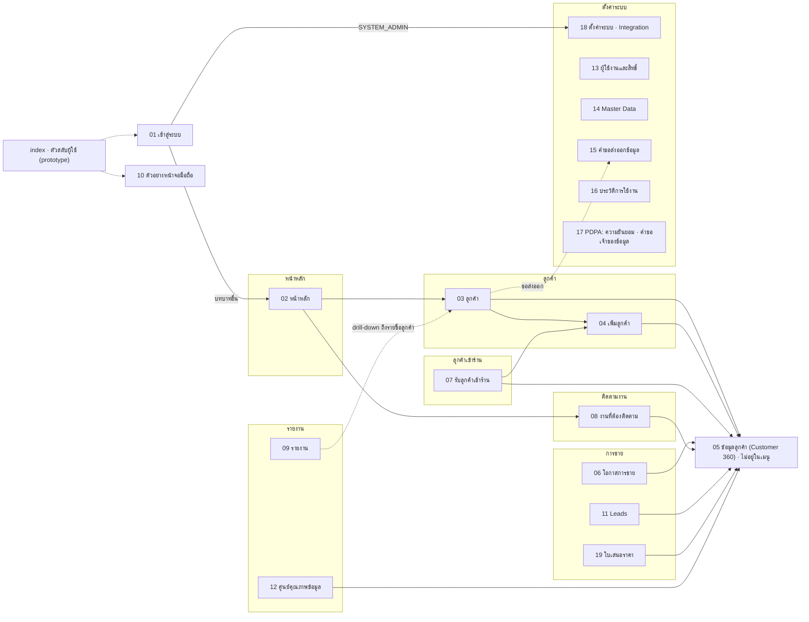

# Sitemap · Screen Specification — JAUN CRM · Customer 360

**เอกสาร:** A45 #05 Sitemap และ #06 Screen Specification
**วันที่จัดทำ:** 16 ก.ย. 2569 · อ้างอิง **CANONICAL v2.2** (ปรับจากฉบับ v2.1 ตาม `docs/00-brief/changes/CANONICAL-v2.1-to-v2.2.diff`)
**ขอบเขต:** หน้า index (ตัวสลับผู้ใช้) + 19 หน้าจอตาม (CANONICAL ข้อ 14.1) · ระดับที่ผู้สร้าง `prototype/` และนักพัฒนา Next.js สร้างตามได้โดยไม่ต้องตัดสินใจเพิ่ม

> **ลำดับความเป็นเจ้าของ**
> - ตัวเลข รหัส ชื่อคน ป้าย สิทธิ์ และสูตร มาจาก `docs/00-brief/CANONICAL.md` เท่านั้น (ข้อ 19 มีผลบังคับเท่าข้ออื่น)
> - token · component (`C-…`) · รูปแบบวันที่/ตัวเลข · ชื่อเรียกปุ่ม (**ส้ม · navy · รอง · ghost · danger · danger-outline** = `.btn--accent/primary/secondary/ghost/danger/danger-outline`) มาจาก `docs/06-ux/design-system.md` ข้อ 7.1
> - ค่าที่ CANONICAL ไม่มี แสดง `–` บนหน้าจอ (CANONICAL ข้อ 14.1) และในเอกสารนี้ติดป้าย **รอยืนยัน** หรือ **หมายเหตุผู้เขียน**
> - ชื่อ RPC ตาม (CANONICAL ข้อ 9.6) · ชื่อพารามิเตอร์ที่ CANONICAL ไม่ระบุ อ้าง `docs/07-api/api-spec.md` เป็นแหล่งจริง · เอกสารนี้ระบุเฉพาะความหมาย

> **สิ่งที่เปลี่ยนจากฉบับ v2.1 (สรุปสำหรับผู้สร้างหน้าจอ)**
> - query string ตาราง 1.1 (ตรงกับ `prototype/README.md` ข้อ 5.1): `c=` `op=` `qt=` `ex=` `lead=` `mode=visit|customer` `visit=` `owner=` + ใหม่ `task=`
> - ช่องค้นหากลางซ่อนสำหรับ MARKETING/SYSTEM_ADMIN · ตัวเลือกช่วงเวลาอยู่ในหัวหน้า 02 09 12 เท่านั้น · `data-roles=""` ของ login/index (ข้อ 14.1 · 14.3)
> - ป้ายไทยสถานะคำขอส่งออก · DSR · ข้อมูลซ้ำ · ความยินยอม · คำขอบทบาท มาจากข้อ 4.8 · ชื่อทีม JP2–JP4 (ข้อ 2)
> - Pipeline: ลากตามข้อ 4.4 (D48) · ความสำคัญของการ์ดตัวอย่างทั้ง 8 ใบ (ข้อ 13.9)
> - หน้า 02/10: "ลูกค้าของฉันล่าสุด" ของคุณขวัญ และ "กิจกรรมล่าสุด" มีรายการตัวอย่างแล้ว (ข้อ 13.5)
> - เปลี่ยนผู้รับผิดชอบทุกชนิดผ่าน `api.assign_owner` + dialog เหตุผล (`C-DIALOG-ASSIGN`) · รับทราบ visit ไม่บันทึกผลผ่าน `api.acknowledge_unrecorded_visit`
> - RPC ใหม่: `api.list_export_requests` `api.list_role_grant_requests` `api.get_settings` `api.update_setting` `api.list_integration_logs` `api.list_dsr` `api.update_dsr` `api.record_report_export` `api.register_device` `api.reveal_address` `api.get_my_access`
> - เปิดดูข้อมูลติดต่อเกินเกณฑ์ = ปฏิเสธ · เปิดดูลูกค้าเกินเกณฑ์ = แจ้งเท่านั้น ไม่บล็อก · KPI `NULL` แสดง `–` · คุณฝน = จำนวน 0 และอัตรา `–`
> - Lead เปลี่ยน `NEW → CONTACTED/QUALIFIED` ด้วยมือได้ · SUPERVISOR มอบ Lead ที่ไม่มีผู้รับผิดชอบในสาขาที่ตนเป็นหัวหน้าได้ · รหัสแจ้งเตือนใหม่ 6 รหัส (ข้อ 1.8)

---

## สารบัญ

1. [ข้อตกลงร่วมของทุกหน้าจอ](#1-ข้อตกลงร่วมของทุกหน้าจอ)
2. [Sitemap](#2-sitemap)
3. [หน้า index · ตัวสลับผู้ใช้](#3-หน้า-index--ตัวสลับผู้ใช้)
4. [หน้า 01 · เข้าสู่ระบบ](#4-หน้า-01--เข้าสู่ระบบ)
5. [หน้า 02 · หน้าหลัก](#5-หน้า-02--หน้าหลัก)
6. [หน้า 03 · ลูกค้า](#6-หน้า-03--ลูกค้า)
7. [หน้า 04 · เพิ่มลูกค้า (Quick Capture)](#7-หน้า-04--เพิ่มลูกค้า-quick-capture)
8. [หน้า 05 · ข้อมูลลูกค้า (Customer 360)](#8-หน้า-05--ข้อมูลลูกค้า-customer-360)
9. [หน้า 06 · โอกาสการขาย](#9-หน้า-06--โอกาสการขาย)
10. [หน้า 07 · รับลูกค้าเข้าร้าน](#10-หน้า-07--รับลูกค้าเข้าร้าน)
11. [หน้า 08 · งานที่ต้องติดตาม](#11-หน้า-08--งานที่ต้องติดตาม)
12. [หน้า 09 · รายงาน](#12-หน้า-09--รายงาน)
13. [หน้า 10 · ตัวอย่างหน้าจอมือถือ](#13-หน้า-10--ตัวอย่างหน้าจอมือถือ)
14. [หน้า 11 · Leads](#14-หน้า-11--leads)
15. [หน้า 12 · ศูนย์คุณภาพข้อมูล](#15-หน้า-12--ศูนย์คุณภาพข้อมูล)
16. [หน้า 13 · ผู้ใช้งานและสิทธิ์](#16-หน้า-13--ผู้ใช้งานและสิทธิ์)
17. [หน้า 14 · Master Data](#17-หน้า-14--master-data)
18. [หน้า 15 · คำขอส่งออกข้อมูล](#18-หน้า-15--คำขอส่งออกข้อมูล)
19. [หน้า 16 · ประวัติการใช้งาน](#19-หน้า-16--ประวัติการใช้งาน)
20. [หน้า 17 · PDPA: ความยินยอม · คำขอเจ้าของข้อมูล](#20-หน้า-17--pdpa-ความยินยอม--คำขอเจ้าของข้อมูล)
21. [หน้า 18 · ตั้งค่าระบบ · Integration](#21-หน้า-18--ตั้งค่าระบบ--integration)
22. [หน้า 19 · ใบเสนอราคา](#22-หน้า-19--ใบเสนอราคา)
23. [ภาคผนวก · หมายเหตุผู้เขียนและรายการรอยืนยัน](#23-ภาคผนวก--หมายเหตุผู้เขียนและรายการรอยืนยัน)

---

## 1. ข้อตกลงร่วมของทุกหน้าจอ

### 1.1 ไฟล์และ attribute

- ไฟล์ `prototype/NN-id.html` · `<body data-page="id" data-roles="…">` · `data-roles` = รหัสบทบาทเต็มคั่นด้วยช่องว่าง ตรงตาม (CANONICAL ข้อ 14.1) — ค่าจริงของแต่ละหน้าอยู่ในตารางหัวหน้านั้น
- หน้าที่ไม่ต้องเข้าสู่ระบบใช้ `data-roles=""`: `<body data-page="login" data-roles="">` · `<body data-page="index" data-roles="">` (CANONICAL ข้อ 14.1)
- ทุกหน้า `<html lang="th">` · ลำดับ include ตาม `prototype/README.md` ข้อ 2: `assets/app.css` → `assets/data.js` (ตัวเลขที่พิมพ์ในข้อ 13 และรายการที่ระบุชื่อเท่านั้น · CANONICAL ข้อ 13.0 ข้อ 10) → `assets/app.js` → สคริปต์ของหน้า
- พารามิเตอร์ใน URL ใช้ได้เฉพาะรหัสอ้างอิงและรหัสตัวกรอง **ห้ามมีคำค้น เบอร์ อีเมล LINE ID หรือชื่อ** · ชื่อพารามิเตอร์ (ตรงกับ `prototype/README.md` ข้อ 5.1 · อ่านด้วย `JCRM.param(name)` · prototype รับชื่อเดิม `customer` `opportunity` `quotation` `mode=receive|add` เป็น alias):

| พารามิเตอร์ | ค่า | ใช้ที่ |
|---|---|---|
| `c` | `CUS-…` | 05 (ไม่มี = `CUS-2026-000297`) |
| `lead` · `op` · `qt` · `ex` | `LD-…` · `OP-…` · `QT-…` · `EX-…` | เปิด drawer/รายละเอียดรายการใน 11 · 06 · 19 · 15 |
| `task` (**ใหม่ในฉบับนี้**) | `TK-…` | 08 เปิด drawer งาน (deep link การแจ้งเตือนข้อ 1.8) |
| `mode` | `visit` (รับลูกค้า: สร้าง/ผูกลูกค้า + เปิด visit) · `customer` (เพิ่มลูกค้าอย่างเดียว) | 04 (ไม่มี = `customer`) |
| `visit` | `V-…` (visit ที่เปิดอยู่) | 04 `mode=visit&visit=…` (CANONICAL ข้อ 19.3 ข้อ 2) |
| `owner` | `me` · `none` · `ST-…` | 11 · 06 ตัวกรองผู้รับผิดชอบ |
| `tab` · `group` · `view` · `issue` · `branch` | รหัสแท็บ/กลุ่ม/มุมมอง · `issue_code` · `JP1`…`JPON` | ตามตารางหัวของแต่ละหน้า |

### 1.2 ผู้ใช้ตัวอย่าง (persona)

แหล่ง: (CANONICAL ข้อ 13.5 · 14.1) · ค่าเก็บที่ `localStorage['jcrm.staff']` = `staff_code` · ค่าเริ่มต้น `ST-0001` · อ่าน/เขียนใน `try/catch` · ค่าที่ไม่รู้จักถือเป็น `ST-0001`

| staff_code | ชื่อที่แสดง | บทบาท (ป้าย) | ขอบเขต | ทีม | ข้อความโปรไฟล์บน top bar | ตัวเลือกสาขา | กระดิ่ง (ยังไม่อ่าน) | หน้าแรก |
|---|---|---|---|---|---|---|---:|---|
| `ST-0001` | จ๋าอั๋น | `EXECUTIVE` ผู้บริหาร | องค์กร | – | จ๋าอั๋น · ผู้บริหาร · องค์กร | ทุกสาขา · JAUNPHONE 1–4 · ทีมออนไลน์ส่วนกลาง | 1 | 02 |
| `ST-0002` | คุณแพร | `BUSINESS_ADMIN` ผู้ดูแลข้อมูลธุรกิจ | องค์กร | – | คุณแพร · ผู้ดูแลข้อมูลธุรกิจ · องค์กร | เหมือน ST-0001 | 1 | 02 |
| `ST-0003` | คุณต้น | `SYSTEM_ADMIN` ผู้ดูแลระบบ (IT) | – | – | คุณต้น · ผู้ดูแลระบบ (IT) | ไม่แสดง | 0 | **18** |
| `ST-0010` | คุณปุ๊ก | `OPERATIONS` ฝ่ายปฏิบัติการ | JP1 · JP2 · JP3 · JP4 | – | คุณปุ๊ก · ฝ่ายปฏิบัติการ · JAUNPHONE 1–4 | ทุกสาขา · JAUNPHONE 1–4 | 0 | 02 |
| `ST-0011` | คุณมายด์ | `MARKETING` ฝ่ายการตลาด | องค์กร | – | คุณมายด์ · ฝ่ายการตลาด · องค์กร | เหมือน ST-0001 | 0 | 02 |
| `ST-0020` | คุณเจ | `BRANCH_MANAGER` ผู้จัดการสาขา | JP1 | – | คุณเจ · ผู้จัดการสาขา · JAUNPHONE 1 | ไม่แสดง | 4 | 02 |
| `ST-0030` | คุณนัท | `SUPERVISOR` หัวหน้าทีม | JP1 | `JP1-SALES` (หัวหน้า) | คุณนัท · หัวหน้าทีม · JAUNPHONE 1 | ไม่แสดง | 3 | 02 |
| `ST-0045` | คุณขวัญ | `STAFF` พนักงานขาย/แอดมิน | JP1 | `JP1-SALES` | คุณขวัญ · พนักงานขาย/แอดมิน · JAUNPHONE 1 | ไม่แสดง | 6 | 02 |
| `ST-0046` (สลับได้) | คุณคิม | `STAFF` พนักงานขาย/แอดมิน | JP1 | `JP1-SALES` | คุณคิม · พนักงานขาย/แอดมิน · JAUNPHONE 1 | ไม่แสดง | 5 | 02 |
| `ST-0021` (สลับได้) | คุณบอส | `BRANCH_MANAGER` ผู้จัดการสาขา | JP2 | – | คุณบอส · ผู้จัดการสาขา · JAUNPHONE 2 | ไม่แสดง | 0 | 02 |
| `ST-0050` (สลับได้) | คุณฝน | `STAFF` พนักงานขาย/แอดมิน | JPON | `JPON-ADMIN` | คุณฝน · พนักงานขาย/แอดมิน · ทีมออนไลน์ส่วนกลาง | ไม่แสดง | 0 | 02 |
| `ST-0022` (ผู้ใช้อื่นใน index) | คุณหนึ่ง | `BRANCH_MANAGER` ผู้จัดการสาขา | JP3 | – | คุณหนึ่ง · ผู้จัดการสาขา · JAUNPHONE 3 | ไม่แสดง | 0 | 02 |
| `ST-0023` (ผู้ใช้อื่นใน index) | คุณเบียร์ | `BRANCH_MANAGER` ผู้จัดการสาขา | JP4 | – | คุณเบียร์ · ผู้จัดการสาขา · JAUNPHONE 4 | ไม่แสดง | 0 | 02 |
| `ST-0051` (ผู้ใช้อื่นใน index · INVITED) | คุณโอ๊ต | – (รอคำขอ `SYSTEM_ADMIN` RG-2026-0003) | – | – | คุณโอ๊ต · เชิญแล้ว | ไม่แสดง | 0 | ไม่มี (เข้าสู่ระบบไม่ได้) |

- ทุกบัญชีที่บทบาท `requires_mfa` ถือว่ายืนยัน TOTP แล้ว (aal2) ใน prototype (CANONICAL ข้อ 13.5) · index มีช่องติ๊ก "จำลองเซสชันที่ยังไม่ยืนยัน MFA (aal1)" (`JCRM.setAal("aal1")`) → assignment ของบทบาทที่ต้อง MFA และสิทธิ์ 🔐 ไม่ถูกนับ (CANONICAL ข้อ 8.0 · 13.13) → หน้าที่ต้องใช้สิทธิ์นั้นแสดง `C-STATE-MFA`
- **persona ที่ไม่มีรายการในสเปกของแต่ละหน้า** ใช้กติกานี้: คุณหนึ่ง (JP3) · คุณเบียร์ (JP4) = รูปแบบเดียวกับคุณบอส (JP2) โดยใช้แถว/คอลัมน์ JAUNPHONE 3 · JAUNPHONE 4 ของข้อ 13 · คุณโอ๊ต (INVITED · ไม่มีบทบาท) = ทุกหน้า `C-STATE-NOACCESS-PAGE` (prototype) และเข้าสู่ระบบไม่ได้ (แอปจริง)
- **ช่องค้นหากลางไม่แสดง** สำหรับ `MARKETING` (คุณมายด์) และ `SYSTEM_ADMIN` (คุณต้น) (CANONICAL ข้อ 14.3)

### 1.3 นาฬิกาและขอบเขตข้อมูลตัวอย่าง

- "ตอนนี้" = **11 ก.ย. 2569 10:24 น.** (`app.clock()`) · ช่วงเริ่มต้น **"30 วันล่าสุด" = 13 ส.ค. – 11 ก.ย. 2569** · ช่วงก่อนหน้า = 14 ก.ค. – 12 ส.ค. 2569 (CANONICAL ข้อ 13)
- ตัวเลือกช่วงเวลาใน prototype เปิดใช้เฉพาะ **วันนี้** และ **30 วันล่าสุด** · preset อื่นปิดพร้อม tooltip "ไม่มีข้อมูลตัวอย่างสำหรับช่วงนี้" (CANONICAL ข้อ 12.0)
- หน้า 06 07 08 11 12 ของบทบาทหลายสาขา (EXECUTIVE · BUSINESS_ADMIN · OPERATIONS) **เริ่มที่ตัวกรองสาขา JAUNPHONE 1** · "ทุกสาขา" แสดงยอดรวมเฉพาะที่มีในข้อ 13 (CANONICAL ข้อ 14.1) · หน้าอื่นของบทบาทหลายสาขาเริ่มที่ "ทุกสาขา"
- ค่าที่ไม่มีในข้อ 13 แสดง `–` · รายการยาวแสดงแถวที่ระบุชื่อ + ท้ายตาราง "แสดง 1–N จาก {ยอดรวม} รายการ" · ถ้าไม่มีแถวที่ระบุชื่อเลยแต่รู้ยอดรวม แสดง `C-STATE-SAMPLE`
- **คุณฝน (STAFF@JPON · aal1):** จำนวนทุกตัวเป็น `0` (เงิน `฿0`) · KPI ที่ไม่ผูกพนักงานและอัตรา 0/0 เป็น `NULL` → แสดง `–` (CANONICAL ข้อ 13.13) · ทุกหน้าที่เป็นรายการแสดง `C-STATE-EMPTY` (CANONICAL ข้อ 13.5) — กติกา 0 / `–` / ว่าง ตาม design-system ข้อ 7.15

### 1.4 Shell ของหน้า

| ขนาด | โครง | อ้างอิง |
|---|---|---|
| เดสก์ท็อป ≥ 1280px | sidebar 264px + top bar 64px + page header + เนื้อหา | `C-SHELL` |
| แท็บเล็ต 768–1279px | sidebar ไอคอน 72px + top bar + เนื้อหา · FAB "+ รับลูกค้า" (บทบาทที่มี `visit.create`) · ปุ่มหลัก ≥ 48px | `C-SHELL` · `C-FAB` (CANONICAL ข้อ 14.4) |
| มือถือ < 768px | top bar ย่อ (โลโก้ · ไอคอนค้นหา (ไม่มีสำหรับ MARKETING/SYSTEM_ADMIN) · กระดิ่ง) + เนื้อหา + bottom nav 5 ช่อง | `C-BOTTOMNAV` (CANONICAL ข้อ 14.3 · 14.4) |

**Top bar ทุกหน้า (CANONICAL ข้อ 14.3):** ช่องค้นหากลาง `C-SEARCH` placeholder "ค้นหาชื่อ เบอร์ LINE Customer ID IMEI" (**ไม่แสดงสำหรับ MARKETING และ SYSTEM_ADMIN** · Serial ค้นไม่ได้ใน V1 [รอยืนยัน]) · กระดิ่ง `C-NOTIF` · ชื่อ/บทบาท/สาขา (ข้อ 1.2) · ตัวเลือกสาขา (เฉพาะผู้มีหลายสาขา) · **ตัวเลือกช่วงเวลา `C-PERIOD` อยู่ใน page header ของหน้า 02 09 12 เท่านั้น** (หน้าอื่นไม่มี · prototype: `JCRM.page({ period: false })` ทุกหน้ายกเว้น 02 09 12)

**ตัวเลือกสาขาบน top bar** เป็นค่าบริบทของแท็บเบราว์เซอร์ (เก็บ `sessionStorage['jcrm.branch']` · ล้างเมื่อออกจากระบบ) · หน้าที่มีตัวกรองสาขาของตนใช้ค่านี้เป็นค่าเริ่มต้น ยกเว้นเปิดหน้า 06 07 08 11 12 ครั้งแรกของเซสชัน ซึ่งตั้ง JP1 ตามข้อ 1.3

**เมนูโปรไฟล์:** "ออกจากระบบ" → ล้าง Cache Storage · IndexedDB · sessionStorage · localStorage **ยกเว้น `device_id` และค่าที่ "จดจำ" `login_id`** (CANONICAL ข้อ 9.2) → หน้า 01 · prototype `JCRM.logout()` ลบ `jcrm.staff` `jcrm.aal` คง `jcrm.login_id` แล้วไป `01-login.html`

### 1.5 การแสดงผลตามสิทธิ์

1. เปิดหน้าที่บทบาทไม่อยู่ใน `data-roles` → เนื้อหาเป็น `C-STATE-NOACCESS-PAGE` "ไม่มีสิทธิ์เข้าหน้านี้" + รายชื่อบทบาทที่เข้าได้ (ป้ายไทย) · sidebar/top bar ยังแสดงตามปกติ
2. ปุ่มที่บทบาท **ไม่มีสิทธิ์นั้นเลย** (ตาราง CANONICAL ข้อ 8.1 เป็น `–`) → **ซ่อน**
3. ปุ่มที่บทบาทมีสิทธิ์ แต่แถวนี้ไม่ผ่านขอบเขต (เช่น STAFF scope `O` กับรายการของคนอื่น) หรือสถานะไม่อนุญาต หรือยังไม่ aal2 → **แสดงแบบปิดพร้อมเหตุผล** (`aria-disabled` + tooltip) — ข้อความมาตรฐาน:
   - "แก้ได้เฉพาะรายการที่คุณเป็นผู้รับผิดชอบ" (scope O)
   - "แก้ได้เฉพาะรายการของสมาชิกในทีมคุณ" (scope T)
   - "ต้องยืนยันตัวตนสองขั้นตอน (MFA) ก่อน" (🔐)
   - "สถานะนี้แก้ไขไม่ได้" · "เกินจำนวนที่กำหนด"
4. การซ่อนปุ่มเป็นความสะดวกเท่านั้น · ทุกการกระทำตรวจซ้ำในฐานข้อมูล (CANONICAL ข้อ 9.1) · ถ้า RPC ปฏิเสธ → toast danger "คุณไม่มีสิทธิ์ทำรายการนี้" และโหลดข้อมูลแถวใหม่
5. รายการที่อ่านไม่ได้ (RLS คืน 0 แถว) → `C-STATE-NOTFOUND` "ไม่พบข้อมูล หรือคุณไม่มีสิทธิ์ดูรายการนี้"
6. แอปจริงสร้างเมนูและซ่อน/ปิดปุ่มจาก `api.get_my_access()` (โปรไฟล์ · `(permission_code, scope, branch_id, requires_aal2)` · `requires_mfa` · aal ปัจจุบัน · CANONICAL ข้อ 9.6) · prototype ใช้ `JCRM.can(...)`
7. **เปลี่ยนผู้รับผิดชอบ/ผู้ดูแล/ผู้รับคิว ทุกหน้า** ใช้ `C-DIALOG-ASSIGN` → `api.assign_owner(p_entity_type, p_entity_id, p_to_staff_id, p_reason_code, p_note, p_to_branch_id)` เท่านั้น (คอลัมน์ owner ไม่อยู่ใน column grant ของ UPDATE ยกเว้นการรับคิว · CANONICAL ข้อ 9.4.2) · ฟอร์มแก้ไขอื่นไม่มีช่องผู้รับผิดชอบ
8. `lead.assign` · `task.assign` scope T รวมรายการที่ **ไม่มีผู้รับผิดชอบ** ในสาขาที่ตนเป็นหัวหน้าทีม (CANONICAL ข้อ 8.0 · Q28) → คุณนัทมอบ Lead ที่ไม่มีผู้รับผิดชอบของ JP1 ได้
9. รายการ lead/opportunity ที่ปิดแล้วเป็นอ่านอย่างเดียวจนกว่าจะเปิดอีกครั้ง · task `DONE`/`CANCELLED` แก้ไม่ได้ (CANONICAL ข้อ 19.2) → ปุ่มแก้ปิดพร้อมเหตุผล "รายการที่ปิดแล้วแก้ไขไม่ได้"

### 1.6 สถานะร่วม

ทุกหน้าที่โหลดข้อมูลมีสถานะ: **กำลังโหลด** `C-STATE-LOADING` · **ว่าง** `C-STATE-EMPTY` · **ตัวกรองไม่พบ** `C-STATE-NORESULT` · **ผิดพลาด** `C-STATE-ERROR` (มีปุ่ม "ลองอีกครั้ง" · ไม่ล้างค่าที่ผู้ใช้กรอกไว้) · **ไม่มีสิทธิ์** ตามข้อ 1.5 · **มือถือ** หน้า 09 13 14 15 16 17 18 แสดง `C-STATE-DESKTOP-ONLY` "กรุณาใช้งานบนคอมพิวเตอร์" (CANONICAL ข้อ 14.4) · ข้อความของสถานะว่างเฉพาะหน้าอยู่ในข้อ "สถานะ" ของแต่ละหน้า

### 1.7 PII · การบันทึกการเข้าถึง

| เหตุการณ์ | แหล่งบันทึก | หน้า |
|---|---|---|
| ค้นหาลูกค้า | `audit.access_logs` `CUSTOMER_SEARCH` (ภายใน `api.search_customers`) | ทุกหน้า (top bar) · 03 · 07 |
| ตรวจซ้ำก่อนสร้าง | `CUSTOMER_CANDIDATE_SEARCH` (เก็บ `sha256` ไม่เก็บค่าจริง) | 04 · 07 |
| เปิด Customer 360 | `CUSTOMER_VIEWED` (ในทรานแซกชันของ `api.get_customer_360`) | 05 |
| เปิดดู/โทร/คัดลอก/เปิด LINE | `CONTACT_REVEALED` (ก่อนคืนค่า) | 05 · 10 |
| ผูกลูกค้านอกสาขา | `CUSTOMER_LINKED_TO_BRANCH` | 04 · 07 |
| ส่งออก | `EXPORT_REQUESTED` · `EXPORT_DECIDED` · `EXPORT_DOWNLOADED` · `REPORT_EXPORTED` | 03 · 09 · 15 |

- ค่าเต็มของช่องทางติดต่อไม่อยู่ใน HTML ตอนโหลดหน้า · ได้ทางเดียวผ่าน `api.reveal_contact` (`C-CONTACT`) · ที่อยู่เต็มผ่าน `api.reveal_address` (`C-ADDRESS`)
- toast · การแจ้งเตือน push/อีเมล · ชื่อไฟล์ · URL ไม่มีเบอร์/อีเมล/LINE ID
- ฟิลด์ข้อความอิสระทุกช่องมี `C-PII-WARN`

**เกณฑ์อัตรา (CANONICAL ข้อ 6.4–6.6 · 11.1 · 11.2) — พฤติกรรมบนหน้าจอ**

| เกณฑ์ (ค่าเริ่มต้น) | เมื่อเกิน | หน้าจอ | แจ้งเตือน |
|---|---|---|---|
| `security.reveal_per_hour` (30) | **ปฏิเสธ** (RPC คืนผลแบบไม่ raise) | ไม่แสดงค่า · toast danger design-system ข้อ 7.9 · ปุ่มเปิดดูบนหน้าปิดพร้อมเหตุผล | `REVEAL_LIMIT_EXCEEDED` → BUSINESS_ADMIN |
| `security.search_per_hour` (60) · `security.search_miss_per_hour` (20) | ปฏิเสธ / ระงับ 1 ชม. | toast danger design-system ข้อ 7.8 | `SEARCH_LIMIT_EXCEEDED` → BUSINESS_ADMIN |
| `security.customer_view_per_hour` (100) | **แจ้งเท่านั้น ไม่บล็อก** | หน้า 05 เปิดได้ตามปกติ ไม่มีข้อความใด | `CUSTOMER_VIEW_LIMIT_EXCEEDED` → BUSINESS_ADMIN |
| `security.link_per_day` (10) | แจ้งเท่านั้น (การผูกสำเร็จ) | ไม่มีข้อความเพิ่ม | `LINK_LIMIT_EXCEEDED` → BRANCH_MANAGER ของสาขานั้น |

### 1.8 การแจ้งเตือน (กระดิ่ง · CANONICAL ข้อ 11.1 · 13.14)

แหล่ง: `crm.notifications` ที่ `recipient_staff_id` = ตน และ `read_at IS NULL` เรียง `created_at DESC` · แสดง `title` · `body` **ตามที่เก็บ** (body มี "คุณ" อยู่แล้ว · ห้ามเติมซ้ำ · CANONICAL ข้อ 3.5) · `entity_ref` · เวลา `created_at` · กดรายการ → ตั้ง `read_at` + ไปหน้าปลายทาง

**ก. รหัสทั้งหมด → ป้าย → หน้าปลายทาง** (title ตรงตัวตามข้อ 11.1 · หน้าปลายทางเป็น **ข้อเสนอของผู้ออกแบบ** ที่สอดคล้องกับ `docs/05-analytics/notification-rules.md` ข้อ 2.4)

| code | title | ผู้รับ (ข้อ 11.1) | ช่องทาง | ไปที่ |
|---|---|---|---|---|
| `FOLLOWUP_DUE` | ถึงเวลาติดตามลูกค้า | owner | in-app + push | 08 `?task=TK-…` |
| `FOLLOWUP_OVERDUE` | ติดตามเกินกำหนด | owner · +24 ชม. หัวหน้าทีม · +48 ชม. ผู้จัดการสาขา | in-app | 08 `?task=TK-…` (ไม่มีเลข → `?group=overdue`) |
| `TASK_OVERDUE` | งานเกินกำหนด | owner · +24 ชม. หัวหน้าทีม | in-app | 08 `?task=TK-…` (ไม่มีเลข → `?group=overdue`) |
| `LEAD_UNASSIGNED` | Lead ยังไม่มีผู้รับผิดชอบ | SUPERVISOR (หัวหน้าทีมในสาขา) · BRANCH_MANAGER ของสาขา | in-app + push | 11 `?lead=LD-…` (ไม่มีเลข → `?owner=none`) |
| `LEAD_NOT_CONTACTED` | Lead ยังไม่ถูกติดต่อ | owner · หัวหน้าทีม | in-app | 11 `?lead=LD-…` |
| `LEAD_ASSIGNED` · `OPPORTUNITY_ASSIGNED` · `TASK_ASSIGNED` | ได้รับมอบหมายรายการใหม่ | owner ใหม่ (ไม่ส่งสำหรับ task `is_next_action`) | in-app | 11 `?lead=` · 06 `?op=` · 08 `?task=` |
| `OPPORTUNITY_STALE` | โอกาสขายไม่มีความเคลื่อนไหว | owner · 14 วันเพิ่มผู้จัดการสาขา | in-app | 06 `?op=OP-…` |
| `DUPLICATE_SUSPECTED` | อาจมีลูกค้าซ้ำ | SUPERVISOR/BRANCH_MANAGER ของสาขา (18:00) | in-app | 12 `?issue=DUPLICATE_SUSPECTED` |
| `VISITOR_WAITING_LONG` | ลูกค้ารอนานเกินไป | SUPERVISOR · BRANCH_MANAGER ของสาขา | in-app + push | 07 |
| `VISIT_OUTCOME_MISSING` | ยังไม่บันทึกผลการให้บริการ | ผู้รับคิว (IN_SERVICE > 60 นาที) · ผู้จัดการสาขา (สรุปสิ้นวัน) | in-app | ผู้รับคิว → 07 · สรุป → 12 `?issue=VISIT_UNRECORDED` |
| `DATA_MISSING` | ข้อมูลลูกค้าไม่ครบ | owner 09:00 ทุกวัน · ผู้จัดการวันจันทร์ 09:00 | in-app | 12 |
| `EXPORT_APPROVAL_REQUIRED` | มีคำขอส่งออกรออนุมัติ | ผู้อนุมัติตามข้อ 8.2 | in-app + email | 15 `?ex=EX-…` |
| `EXPORT_DECIDED` | คำขอส่งออกได้รับการตัดสินแล้ว | ผู้ขอ | in-app + email | 15 `?ex=EX-…` |
| `EXPORT_READY` | ไฟล์ส่งออกพร้อมดาวน์โหลด | ผู้ขอ | in-app | 15 `?ex=EX-…` |
| `ROLE_GRANT_APPROVAL_REQUIRED` | มีคำขอมอบบทบาทรออนุมัติ | EXECUTIVE ทุกคน (ยกเว้นผู้รับ) | in-app + email | 13 `?tab=requests` |
| `ROLE_GRANT_DECIDED` | คำขอบทบาทได้รับการตัดสินแล้ว | ผู้ยื่นคำขอ | in-app + email | 13 `?tab=requests` |
| `REVEAL_LIMIT_EXCEEDED` · `SEARCH_LIMIT_EXCEEDED` | การเปิดดู/ค้นหาเกินเกณฑ์ | BUSINESS_ADMIN | in-app + email | 16 `?tab=business` (ตัวกรองผู้กระทำ = `entity_ref` `ST-…`) |
| `CUSTOMER_VIEW_LIMIT_EXCEEDED` | เปิดดูลูกค้าจำนวนมาก | BUSINESS_ADMIN | in-app | 16 `?tab=business` (ตัวกรองผู้กระทำ) |
| `LOCKOUT_REPEATED` | บัญชีถูกล็อกซ้ำ | BUSINESS_ADMIN | in-app + email | 16 `?tab=security` |
| `LINK_LIMIT_EXCEEDED` | ผูกลูกค้าข้ามสาขาเกินเกณฑ์ | BRANCH_MANAGER ของสาขา | in-app | 13 `?tab=users` (แถวพนักงานตาม `entity_ref`) — BRANCH_MANAGER ไม่มี `audit.read` จึงไม่ส่งไปหน้า 16 |
| `RETENTION_ANONYMIZE_UPCOMING` | ข้อมูลใกล้ครบระยะเก็บ | BUSINESS_ADMIN (สรุปรายวันทั้งองค์กร) | in-app | 17 `?tab=retention` |
| `DSR_DUE_SOON` | คำขอเจ้าของข้อมูลใกล้ครบกำหนด | BUSINESS_ADMIN | in-app + email | 17 `?tab=dsr` |

**ข. รายการที่ยังไม่อ่านต่อ persona** (snapshot ของ seed ข้อ 13.14 · ใช้ตัวเลขนี้ตรง ๆ · รหัสใหม่ของ v2.2 ไม่มีแถวใน seed)

| ผู้ใช้ | รายการ (title — body — ไปที่) |
|---|---|
| คุณขวัญ (6) | 1 **ติดตามเกินกำหนด** — คุณพิมพ์ชนก ศรีสุข · ติดตามใบเสนอราคา iPhone 17 Pro Max · ครบกำหนด 10 ก.ย. 2569 15:00 — 08 · 2 **ติดตามเกินกำหนด** — คุณสุนิสา แก้วใส · ติดตามความสนใจ iPad · ครบกำหนด 10 ก.ย. 2569 17:30 — 08 · 3 **ติดตามเกินกำหนด** — คุณกมลชนก สายสุข · ติดตามเรื่องเทิร์นเครื่อง · ครบกำหนด 10 ก.ย. 2569 19:00 — 08 · 4 **งานเกินกำหนด** — คุณจิราพร ทองดี · โทรยืนยันวันรับเครื่อง · ครบกำหนด 10 ก.ย. 2569 13:00 — 08 · 5 **งานเกินกำหนด** — คุณมานพ รักงาน · โทรขอเลขใบเสร็จ POS · ครบกำหนด 11 ก.ย. 2569 10:00 — 08 · 6 **ข้อมูลลูกค้าไม่ครบ** — (body ไม่มีในข้อ 13 → ไม่แสดงบรรทัด) · 11 ก.ย. 2569 09:00 — 12 |
| คุณคิม (5) | 1 **ได้รับมอบหมายรายการใหม่** — คุณวิไลวรรณ สวยดี · LD-2026-007512 · 10 ก.ย. 2569 18:05 — 11 `?lead=LD-2026-007512` · 2–4 **ติดตามเกินกำหนด** ×3 (body ไม่มีในข้อ 13 → ไม่แสดงบรรทัด) — 08 `?group=overdue` · 5 **ข้อมูลลูกค้าไม่ครบ** — 11 ก.ย. 2569 09:00 — 12 |
| คุณนัท (3) | 1–2 **Lead ยังไม่มีผู้รับผิดชอบ** ×2 (เลข lead ไม่มีในข้อ 13 → `entity_ref` `–`) — 11 `?owner=none` (คุณนัทมอบหมายได้ · ข้อ 1.5 ข้อ 8) · 3 **อาจมีลูกค้าซ้ำ** — สรุป 10 ก.ย. 2569 18:00 — 12 `?issue=DUPLICATE_SUSPECTED` |
| คุณเจ (4) | สามรายการเดียวกับคุณนัท + **ยังไม่บันทึกผลการให้บริการ** — สรุปวันที่ 10 ก.ย. 2569 — 12 `?issue=VISIT_UNRECORDED` |
| คุณแพร (1) | **มีคำขอส่งออกรออนุมัติ** — EX-2026-000031 — 15 `?ex=EX-2026-000031` |
| จ๋าอั๋น (1) | **มีคำขอมอบบทบาทรออนุมัติ** — RG-2026-0003 — 13 `?tab=requests` |
| คนอื่น (คุณต้น คุณปุ๊ก คุณมายด์ คุณบอส คุณหนึ่ง คุณเบียร์ คุณฝน) | 0 · แผงแสดง "ไม่มีการแจ้งเตือนใหม่" |

prototype: กดรายการ → ไปหน้าปลายทาง + ลดจำนวนบนกระดิ่งในหน่วยความจำของหน้า (ไม่เก็บถาวร)

### 1.9 ค้นหากลาง (ข้อมูลตัวอย่าง)

`api.search_customers(p_term)` · คืนเฉพาะรายการที่ผู้เรียกอ่านได้ · ค่า contact เป็น `value_masked` (CANONICAL ข้อ 6.5)

| คำค้น | ผลสำหรับผู้อ่าน JP1 (ขวัญ คิม นัท เจ) และ ปุ๊ก จ๋าอั๋น แพร | ผลสำหรับบอส (JP2) · ฝน (JPON) |
|---|---|---|
| `สมชาย` (ชื่อ · trigram) | กลุ่ม **ลูกค้า (2)**: `CUS-2026-000297` คุณสมชาย ใจดี · 081-XXX-5678 · ลูกค้าซื้อซ้ำ ／ `CUS-2026-004410` คุณสมชาย ใจดี · 081-XXX-5679 · มีโอกาสซื้อ | ไม่พบผลลัพธ์ |
| `081-234-5678` (ตรงทั้งค่า) | ลูกค้า (1): `CUS-2026-000297` | ไม่พบผลลัพธ์ |
| `5678` | ไม่พบผลลัพธ์ + helper "เบอร์โทร อีเมล LINE ID IMEI และเลขธุรกรรมต้องพิมพ์ครบทั้งค่า" | เหมือนกัน |
| `CUS-2026-000297` · `OP-2026-002998` · `QT-2026-001702` · `LD-2026-007460` | รายการนั้นในกลุ่มของตน (ลูกค้า · โอกาสขาย · ใบเสนอราคา · Lead) | ไม่พบผลลัพธ์ |
| `ณัฐชยา` | ปุ๊ก จ๋าอั๋น แพร: `CUS-2026-006851` คุณณัฐชยา มากมี · 095-XXX-4567 · สนใจซื้อ · ลูกค้าใหม่ · ผู้อ่าน JP1: ไม่พบ | บอส: พบ `CUS-2026-006851` · ฝน: ไม่พบ |

- คุณมายด์ (MARKETING) · คุณต้น (SYSTEM_ADMIN): **ไม่มีช่องค้นหา** บน top bar (CANONICAL ข้อ 14.3) · มือถือไม่มีไอคอนค้นหา
- คำค้นที่เป็น Serial เครื่อง → "ไม่พบผลลัพธ์" (Serial ค้นไม่ได้ใน V1 [รอยืนยัน] · CANONICAL ข้อ 14.3)

### 1.10 วิธีอ่านตาราง "องค์ประกอบ" ในแต่ละหน้า

- **แหล่งข้อมูล:** `schema.table.column` (อ่านผ่าน PostgREST ด้วย JWT ผู้ใช้ · ผ่าน RLS) หรือ `api.fn(param = ค่า)` · "ข้อ 13.x" = ค่าที่ prototype ใช้
- **รูปแบบ:** อ้างกติกา design-system ข้อ 10 (จำนวน · `฿` · อัตรา · pp · วันที่)
- **สิทธิ์** ใช้รหัสและ scope ตาม (CANONICAL ข้อ 8.1) · 🔐 = ต้อง aal2

---

## 2. Sitemap

### 2.1 แผนผัง



กลุ่มและลำดับเมนูตาม (CANONICAL ข้อ 14.2) · ป้ายเมนูย่อย = ชื่อหน้าจอในข้อ 14.1 · กลุ่ม "การตลาด" (Campaigns · Customer Segments) ซ่อนใน V1 · **กลุ่มที่ไม่มีหน้าที่ผู้ใช้เข้าได้ให้ซ่อนทั้งกลุ่ม**

### 2.2 การเข้าถึงหน้าต่อบทบาท (`data-roles`)

| # | หน้า | ST | SV | BM | OP | MK | EX | BA | SA | มือถือ |
|---|---|:-:|:-:|:-:|:-:|:-:|:-:|:-:|:-:|---|
| 01 | เข้าสู่ระบบ | ทุกคน (ก่อนเข้าสู่ระบบ) ||||||||ใช้ได้ |
| 02 | หน้าหลัก | ✓ | ✓ | ✓ | ✓ | ✓ | ✓ | ✓ | – | ใช้ได้ (หน้าแรก) |
| 03 | ลูกค้า | ✓ | ✓ | ✓ | ✓ | – | ✓ | ✓ | – | ใช้ได้ |
| 04 | เพิ่มลูกค้า | ✓ | ✓ | ✓ | – | – | – | ✓ | – | ใช้ได้ |
| 05 | ข้อมูลลูกค้า (Customer 360) | ✓ | ✓ | ✓ | ✓ | – | ✓ | ✓ | – | ใช้ได้ |
| 06 | โอกาสการขาย | ✓ | ✓ | ✓ | ✓ | – | ✓ | ✓ | – | ใช้ได้ |
| 07 | รับลูกค้าเข้าร้าน | ✓ | ✓ | ✓ | ✓ | – | – | – | – | ใช้ได้ |
| 08 | งานที่ต้องติดตาม | ✓ | ✓ | ✓ | ✓ | – | ✓ | ✓ | – | ใช้ได้ |
| 09 | รายงาน | – | ✓ | ✓ | ✓ | ✓ | ✓ | ✓ | – | กรุณาใช้งานบนคอมพิวเตอร์ |
| 10 | ตัวอย่างหน้าจอมือถือ | ✓ | ✓ | ✓ | – | – | – | – | – | ใช้ได้ |
| 11 | Leads | ✓ | ✓ | ✓ | ✓ | – | ✓ | ✓ | – | ใช้ได้ |
| 12 | ศูนย์คุณภาพข้อมูล | ✓ | ✓ | ✓ | ✓ | – | ✓ | ✓ | – | ใช้ได้ |
| 13 | ผู้ใช้งานและสิทธิ์ | – | ✓ | ✓ | ✓ | – | ✓ | ✓ | ✓ | กรุณาใช้งานบนคอมพิวเตอร์ |
| 14 | Master Data | – | – | – | – | ✓ (แท็บ Tag · แคมเปญ) | – | ✓ | – | กรุณาใช้งานบนคอมพิวเตอร์ |
| 15 | คำขอส่งออกข้อมูล | – | – | ✓ | – | ✓ | ✓ | ✓ | – | กรุณาใช้งานบนคอมพิวเตอร์ |
| 16 | ประวัติการใช้งาน | – | – | – | – | – | ✓ | ✓ | ✓ (security log) | กรุณาใช้งานบนคอมพิวเตอร์ |
| 17 | PDPA | – | – | – | – | – | – | ✓ | – | กรุณาใช้งานบนคอมพิวเตอร์ |
| 18 | ตั้งค่าระบบ · Integration | – | – | – | – | – | – | ✓ (เกณฑ์ธุรกิจ) | ✓ (เชิงเทคนิค) | กรุณาใช้งานบนคอมพิวเตอร์ |
| 19 | ใบเสนอราคา | ✓ | ✓ | ✓ | ✓ | – | ✓ | ✓ | – | ใช้ได้ |

### 2.3 เมนูด้านข้างที่แต่ละบทบาทเห็น

| บทบาท | หน้าหลัก | ลูกค้า | ลูกค้าเข้าร้าน | การขาย | ติดตามงาน | รายงาน | ตั้งค่าระบบ |
|---|---|---|---|---|---|---|---|
| STAFF | หน้าหลัก | ลูกค้า · เพิ่มลูกค้า | รับลูกค้าเข้าร้าน | Leads · โอกาสการขาย · ใบเสนอราคา | งานที่ต้องติดตาม | ศูนย์คุณภาพข้อมูล | (ซ่อนกลุ่ม) |
| SUPERVISOR | หน้าหลัก | ลูกค้า · เพิ่มลูกค้า | รับลูกค้าเข้าร้าน | Leads · โอกาสการขาย · ใบเสนอราคา | งานที่ต้องติดตาม | รายงาน · ศูนย์คุณภาพข้อมูล | ผู้ใช้งานและสิทธิ์ |
| BRANCH_MANAGER | หน้าหลัก | ลูกค้า · เพิ่มลูกค้า | รับลูกค้าเข้าร้าน | Leads · โอกาสการขาย · ใบเสนอราคา | งานที่ต้องติดตาม | รายงาน · ศูนย์คุณภาพข้อมูล | ผู้ใช้งานและสิทธิ์ · คำขอส่งออกข้อมูล |
| OPERATIONS | หน้าหลัก | ลูกค้า | รับลูกค้าเข้าร้าน | Leads · โอกาสการขาย · ใบเสนอราคา | งานที่ต้องติดตาม | รายงาน · ศูนย์คุณภาพข้อมูล | ผู้ใช้งานและสิทธิ์ |
| MARKETING | หน้าหลัก | (ซ่อนกลุ่ม) | (ซ่อนกลุ่ม) | (ซ่อนกลุ่ม) | (ซ่อนกลุ่ม) | รายงาน | Master Data · คำขอส่งออกข้อมูล |
| EXECUTIVE | หน้าหลัก | ลูกค้า | (ซ่อนกลุ่ม) | Leads · โอกาสการขาย · ใบเสนอราคา | งานที่ต้องติดตาม | รายงาน · ศูนย์คุณภาพข้อมูล | ผู้ใช้งานและสิทธิ์ · คำขอส่งออกข้อมูล · ประวัติการใช้งาน |
| BUSINESS_ADMIN | หน้าหลัก | ลูกค้า · เพิ่มลูกค้า | (ซ่อนกลุ่ม) | Leads · โอกาสการขาย · ใบเสนอราคา | งานที่ต้องติดตาม | รายงาน · ศูนย์คุณภาพข้อมูล | ผู้ใช้งานและสิทธิ์ · Master Data · คำขอส่งออกข้อมูล · ประวัติการใช้งาน · PDPA: ความยินยอม · คำขอเจ้าของข้อมูล · ตั้งค่าระบบ · Integration |
| SYSTEM_ADMIN | (ซ่อน) | (ซ่อนกลุ่ม) | (ซ่อนกลุ่ม) | (ซ่อนกลุ่ม) | (ซ่อนกลุ่ม) | (ซ่อนกลุ่ม) | ผู้ใช้งานและสิทธิ์ · ประวัติการใช้งาน · ตั้งค่าระบบ · Integration |

### 2.4 เส้นทางหลัก

```mermaid
flowchart TD
    subgraph W["รับลูกค้า walk-in (counter/มือถือ)"]
        W1["07 กรอกจำนวน · รู้จักร้านจาก · วัตถุประสงค์"] --> W2{"ระบุลูกค้า?"}
        W2 -->|"ค้นหาพบ"| W3["เลือกลูกค้า"]
        W2 -->|"ลูกค้าใหม่"| W4["04 mode=visit · ตรวจซ้ำ"]
        W2 -->|"ยังไม่ระบุ"| W5["รับเข้าคิว (WAITING)"]
        W3 --> W6["รับเข้าคิว / เริ่มให้บริการ · api.open_visit"]
        W4 --> W7["api.quick_capture · customer + visit (+ lead)"]
        W6 --> W8["05 Customer 360 (เมื่อเริ่มให้บริการ)"]
        W7 --> W8
        W5 --> W9["คิววันนี้ · รับคิว · ระบุลูกค้า"]
        W9 --> W10["บันทึกผล · api.close_visit"]
        W8 --> W10
    end
    subgraph F["ติดตามงาน"]
        F1["กระดิ่ง / 02 งานวันนี้"] --> F2["08 งานที่ต้องติดตาม"]
        F2 --> F3["05 Customer 360 · โทร (reveal CALL)"]
        F3 --> F4["บันทึกการโทร · ปิดงาน"]
        F4 --> F5{"รายการยังเปิด?"}
        F5 -->|"ใช่"| F6["บังคับตั้งการติดตามครั้งถัดไป"]
    end
    subgraph S["ขาย"]
        S1["11 Lead"] -->|"api.convert_lead"| S2["06 โอกาสขาย · สนใจ"]
        S2 --> S3["19 ใบเสนอราคา · ส่ง"]
        S3 -->|"อัตโนมัติ"| S4["เสนอราคา"]
        S4 --> S5["รอตัดสินใจ"]
        S5 --> S6["ปิดการขาย / ไม่สำเร็จ (dialog)"]
    end
```



### 2.5 Bottom navigation ต่อบทบาท (มือถือ · CANONICAL ข้อ 14.4)

| บทบาท | ช่องที่แสดง | "เพิ่มเติม" มี |
|---|---|---|
| STAFF · SUPERVISOR · BRANCH_MANAGER | หน้าแรก (02) · ลูกค้า (03) · **รับลูกค้า** (04 `?mode=visit`) · งาน (08) · เพิ่มเติม | โอกาสการขาย · Leads · ศูนย์คุณภาพข้อมูล · ออกจากระบบ |
| OPERATIONS · EXECUTIVE · BUSINESS_ADMIN | หน้าแรก · ลูกค้า · งาน · เพิ่มเติม (ไม่มีช่องกลางเพราะไม่มี `visit.create`) | โอกาสการขาย · Leads · ศูนย์คุณภาพข้อมูล · ออกจากระบบ |
| MARKETING | หน้าแรก · เพิ่มเติม | ออกจากระบบ |
| SYSTEM_ADMIN | หน้าแรก (18 → กรุณาใช้งานบนคอมพิวเตอร์) · เพิ่มเติม | ออกจากระบบ |

---

## 3. หน้า index · ตัวสลับผู้ใช้

| หัวข้อ | ค่า |
|---|---|
| ไฟล์ | `prototype/index.html` |
| body | `<body data-page="index" data-roles="">` (CANONICAL ข้อ 14.1) |
| เมนู | ไม่มี (หน้าเริ่มของ prototype · ไม่มี sidebar) |
| Phase | 0 (เฉพาะ prototype · ไม่มีในแอปจริง) |

**วัตถุประสงค์:** รวมลิงก์ทุกหน้า และสลับผู้ใช้ตัวอย่างเพื่อดูผลของสิทธิ์ต่อหน้าจอเดียวกัน (CANONICAL ข้อ 14.1)

**Layout (เดสก์ท็อป · มือถือเรียงเป็นคอลัมน์เดียว)**

```
┌──────────────────────────────────────────────────────────────────────────┐
│ JAUN CRM · Customer 360 — Prototype Phase 0                    [h1]      │
│ ข้อมูลทั้งหมดเป็นข้อมูลสมมติ · "ตอนนี้" = 11 ก.ย. 2569 10:24 น.          │
├───────────────────────────────┬──────────────────────────────────────────┤
│ ผู้ใช้ปัจจุบัน                  │ หน้าจอทั้งหมด                              │
│ (ข) คุณขวัญ · ST-0045          │ # │ ชื่อหน้าจอ │ กลุ่มเมนู │ Phase │ สำหรับผู้ใช้นี้ │
│ พนักงานขาย/แอดมิน · JAUNPHONE 1 │ 01│ เข้าสู่ระบบ│ –        │ 1     │ เปิดได้          │
│ หน้าแรก: 02 หน้าหลัก            │ 02│ หน้าหลัก  │ หน้าหลัก  │ 1/3   │ เปิดได้          │
│                               │ …                                         │
│ เลือกผู้ใช้ตัวอย่าง (radio card)  │ 18│ ตั้งค่าระบบ · Integration │ … │ ไม่มีสิทธิ์ │
│ ○ ST-0001 จ๋าอั๋น · ผู้บริหาร     │ 19│ ใบเสนอราคา│ การขาย    │ 2     │ เปิดได้          │
│ ● ST-0045 คุณขวัญ · …           │                                           │
│ …                             │ [ตัวอย่างหน้าจอมือถือ (10) →]               │
│ [รีเซ็ตเป็นค่าเริ่มต้น]  [เข้าหน้าแรก] │                                           │
└───────────────────────────────┴──────────────────────────────────────────┘
```

| องค์ประกอบ | ป้าย/เนื้อหา | แหล่ง | รูปแบบ |
|---|---|---|---|
| หัวหน้า | "JAUN CRM · Customer 360 — Prototype Phase 0" | ค่าคงที่ | `h1` |
| แถบข้อมูล | "ข้อมูลทั้งหมดเป็นข้อมูลสมมติ · "ตอนนี้" = 11 ก.ย. 2569 10:24 น. · บัญชีที่ต้องใช้ MFA ถือว่ายืนยันตัวตนแล้ว" | ข้อ 13 | แถบ info |
| การ์ดผู้ใช้ปัจจุบัน | avatar · ชื่อ · `staff_code` · ป้ายบทบาท · ขอบเขต · ทีม · "หน้าแรก: {หน้า}" · "แจ้งเตือนที่ยังไม่อ่าน {N}" | ข้อ 1.2 | – |
| รายการผู้ใช้ตัวอย่าง | 14 แถวตามข้อ 1.2 เรียง: หัวข้อย่อย "ผู้ใช้ตัวแทนของแต่ละบทบาท" 8 แถว (ST-0001 ST-0002 ST-0003 ST-0010 ST-0011 ST-0020 ST-0030 ST-0045) · "สลับเพิ่มเติม" ST-0046 ST-0021 ST-0050 (CANONICAL ข้อ 14.1) · "ผู้ใช้อื่นในข้อมูลตัวอย่าง" ST-0022 ST-0023 ST-0051 (ST-0051 มีป้าย neutral "เชิญแล้ว · เข้าสู่ระบบไม่ได้") | ข้อ 13.5 · 14.1 | radio card (`role="radiogroup"`) |
| จำลอง aal1 | checkbox "จำลองเซสชันที่ยังไม่ยืนยัน MFA (aal1)" + helper "บทบาทที่ต้อง MFA จะไม่ถูกนับ (ข้อ 8.0 · 13.13)" · ค่าเริ่มต้นไม่ติ๊ก · STAFF ล้วนเป็น aal1 อยู่แล้ว | ข้อ 8.0 · 13.13 | `JCRM.setAal("aal1" \| null)` |
| ตารางหน้าจอ | 19 แถว: # · ชื่อหน้าจอ (ลิงก์) · กลุ่มเมนู · mockup · Phase · "เปิดได้" (success) / "ไม่มีสิทธิ์" (neutral + ไอคอนกุญแจ) · บรรทัดสรุปบนการ์ดผู้ใช้ "เปิดได้ {n} จาก 18 หน้า (ไม่นับหน้าเข้าสู่ระบบ)" | ข้อ 14.1 | `C-TABLE` · ลิงก์ "ไม่มีสิทธิ์" ยังกดได้เพื่อดูการ์ด "ไม่มีสิทธิ์เข้าหน้านี้" |
| ลิงก์หน้า 10 | "ตัวอย่างหน้าจอมือถือ (10)" | – | ปุ่มรอง · แสดง "ไม่มีสิทธิ์" สำหรับบทบาทนอก ST SV BM |

| การกระทำ | ผล |
|---|---|
| เลือกผู้ใช้ | เขียน `localStorage['jcrm.staff']` ทันที · อัปเดตการ์ดและคอลัมน์ "สำหรับผู้ใช้นี้" · toast "สลับเป็น {ชื่อ} แล้ว" |
| "เข้าหน้าแรก" (navy · การนำทางห้ามส้ม ตาม CANONICAL ข้อ 15) | ไปหน้าแรกของผู้ใช้ (SYSTEM_ADMIN → `18-settings.html` · อื่น → `02-dashboard.html`) |
| "รีเซ็ตเป็นค่าเริ่มต้น" (ghost) | ตั้ง `ST-0001` และยกเลิกการจำลอง aal1 |
| ติ๊ก/เอาติ๊กจำลอง aal1 | บันทึกค่า aal ใน localStorage ของ prototype · คอลัมน์ "สำหรับผู้ใช้นี้" คำนวณใหม่ (เช่น จ๋าอั๋น aal1 → เปิดได้เฉพาะหน้าที่ไม่ต้องใช้บทบาทที่ต้อง MFA = ไม่มี · CANONICAL ข้อ 13.13) |
| เลือกคุณโอ๊ต (ST-0051) | คอลัมน์ "สำหรับผู้ใช้นี้" เป็น "ไม่มีสิทธิ์" ทุกแถว · "เข้าหน้าแรก" ปิดพร้อมเหตุผล "บัญชีนี้ยังไม่เปิดใช้งาน" |
| localStorage ใช้ไม่ได้ | ใช้ค่าในหน่วยความจำ + แถบ warning "เบราว์เซอร์นี้ไม่อนุญาตให้จำผู้ใช้ตัวอย่าง ระบบจะใช้ จ๋าอั๋น (ST-0001) เมื่อเปลี่ยนหน้า" |

---

## 4. หน้า 01 · เข้าสู่ระบบ

| หัวข้อ | ค่า |
|---|---|
| ไฟล์ | `prototype/01-login.html` |
| body | `<body data-page="login" data-roles="">` (CANONICAL ข้อ 14.1) |
| เมนู | – |
| mockup | A01 (ปรับตาม D23 D24 D34) |
| Phase | 1 |

### 4.1 วัตถุประสงค์

เข้าสู่ระบบด้วยอีเมลหรือรหัสพนักงาน `ST-NNNN` + รหัสผ่าน · ยืนยัน MFA เมื่อบทบาทต้องใช้ · ขอลิงก์ตั้งรหัสผ่านใหม่ (CANONICAL ข้อ 9.2)

### 4.2 บทบาท

ทุกคนก่อนเข้าสู่ระบบ · ไม่มี public sign-up (CANONICAL ข้อ 1 · 9.2) · บัญชี `INVITED` และ `DISABLED` เข้าไม่ได้และได้ข้อความผิดพลาดเดียวกัน

### 4.3 ทางเข้าและการนำทาง

ทางเข้า: เปิดแอปโดยไม่มี session · ออกจากระบบ · หน้าล็อก counter · deep link จากการแจ้งเตือน (เก็บปลายทางไว้แล้วไปต่อหลังเข้าสู่ระบบ) · ทางออก: SYSTEM_ADMIN → 18 · อื่น → 02 (หรือ deep link ที่เก็บไว้)

### 4.4 Layout

```
เดสก์ท็อป/แท็บเล็ต                                        มือถือ
┌───────────────────────────┬──────────────────────────┐  ┌──────────────────────┐
│ แผงแบรนด์ (navy-900)       │ เข้าสู่ระบบ JAUN CRM [h2]   │  │ JAUN CRM (แถบ navy)   │
│                           │                          │  ├──────────────────────┤
│ JAUN CRM  [display 700]   │ อีเมลหรือรหัสพนักงาน *     │  │ เข้าสู่ระบบ JAUN CRM   │
│ Customer 360              │ [name@example.com หรือ ST-0045] │  │ อีเมลหรือรหัสพนักงาน * │
│ JAUNPHONE ·               │ รหัสผ่าน *        [แสดง]   │  │ รหัสผ่าน *             │
│ JAUN POWER MONEY          │ [••••••••••••]            │  │ ☐ จดจำฉันไว้           │
│                           │ ☐ จดจำฉันไว้   ลืมรหัสผ่าน? │  │ [    เข้าสู่ระบบ    ]  │
│                           │ [       เข้าสู่ระบบ       ] │  │ ลืมรหัสผ่าน?           │
│                           │ ──────── หรือ ────────    │  │ ── หรือ ──            │
│                           │ [เข้าสู่ระบบด้วย Google]    │  │ [Google] [Microsoft]  │
│                           │ [เข้าสู่ระบบด้วย Microsoft] │  └──────────────────────┘
└───────────────────────────┴──────────────────────────┘
```
แผงแบรนด์กว้าง 50% (เดสก์ท็อป) · 40% (แท็บเล็ต) · ฟอร์มกว้างสูงสุด 400px · ไม่มีภาพถ่ายหรือข้อความโปรยที่ไม่มีใน CANONICAL

### 4.5 องค์ประกอบ

| องค์ประกอบ | ป้าย | แหล่ง/พฤติกรรม | รูปแบบ |
|---|---|---|---|
| ช่องบัญชี | "อีเมลหรือรหัสพนักงาน" * · placeholder "name@example.com หรือ ST-0045" | ถ้าตรงรูปแบบ `ST-\d{4}` → Edge Function `staff-code-login` (ไม่คืนอีเมล) · อื่น → Supabase Auth password grant | `C-FORM` input · `autocomplete="username"` |
| ช่องรหัสผ่าน | "รหัสผ่าน" * · ปุ่มไอคอน `aria-label` "แสดงรหัสผ่าน"/"ซ่อนรหัสผ่าน" | – | `autocomplete="current-password"` |
| จดจำ | checkbox "จดจำฉันไว้" · helper "จำเฉพาะอีเมล/รหัสพนักงานบนเครื่องนี้ ไม่ยืดเวลาเข้าสู่ระบบ" | **ไม่ติ๊กไว้ก่อน** · จำค่าช่องบัญชีเท่านั้นใน `localStorage` คีย์ `login_id` (prototype `jcrm.login_id`) ซึ่งการออกจากระบบ **ไม่ลบ** · เอาติ๊กออกแล้วเข้าสู่ระบบ → ลบค่าที่จำ · **ซ่อนบนอุปกรณ์ counter** (D34 · CANONICAL ข้อ 9.2) · เปิดหน้าครั้งถัดไปเติมช่องบัญชีจากค่าที่จำและติ๊กไว้ | checkbox |
| ลิงก์ | "ลืมรหัสผ่าน?" | เปิดมุมมองลืมรหัสผ่าน (ข้อ 4.6) | `--text-link` |
| ปุ่มหลัก | "เข้าสู่ระบบ" | – | ส้ม (`C-BTN accent`) lg เต็มความกว้าง |
| SSO | "เข้าสู่ระบบด้วย Google" · "เข้าสู่ระบบด้วย Microsoft" | ใช้ได้เฉพาะบัญชี ACTIVE ในโดเมนที่ `app.settings['allowed_sso_domains']` อนุญาต · **ซ่อนเมื่อองค์กรไม่มี Workspace/M365 [รอยืนยัน Q5]** · prototype แสดงปุ่มและกดแล้ว toast info "SSO ใช้ได้เฉพาะบัญชีที่ได้รับเชิญแล้ว (prototype)" | รอง (`C-BTN secondary`) |
| ข้อผิดพลาด | **"อีเมล/รหัสพนักงาน หรือรหัสผ่านไม่ถูกต้อง"** (ข้อความเดียวทุกกรณี) | – | กล่อง `role="alert"` danger เหนือปุ่ม |
| หน่วงเวลา | "พยายามเข้าสู่ระบบหลายครั้งเกินไป กรุณารอสักครู่แล้วลองใหม่" | จำกัดต่อ IP `security.login_ip_per_15min` (20 ครั้ง/15 นาที) · หน่วงเวลาเพิ่มขึ้น · ถูกล็อกเกิน 3 ครั้ง/วัน → แจ้ง `LOCKOUT_REPEATED` ถึง BUSINESS_ADMIN (CANONICAL ข้อ 9.2 · 11.1 · 11.2) · ข้อความไม่บอกว่าบัญชีมีอยู่หรือถูกล็อก | danger |

### 4.6 มุมมองย่อยในหน้าเดียวกัน

| มุมมอง | เนื้อหา | การกระทำ |
|---|---|---|
| ยืนยัน MFA (บทบาทที่ `requires_mfa`) | หัว "ยืนยันตัวตนสองขั้นตอน" · ข้อความ "กรอกรหัส 6 หลักจากแอป Authenticator" · ช่อง "รหัส 6 หลัก" (`inputmode="numeric"` `autocomplete="one-time-code"`) | "ยืนยัน" (ส้ม) → aal2 → หน้าแรก · "ใช้บัญชีอื่น" (ghost) → ออกจากระบบ · ผิด: "รหัสไม่ถูกต้อง กรุณาลองใหม่" |
| ลงทะเบียน MFA (ยังไม่มี factor) | หัว "ตั้งค่าการยืนยันตัวตนสองขั้นตอน" · ขั้น 1 สแกน QR (prototype: กรอบว่าง "QR ตัวอย่าง") · ขั้น 2 กรอกรหัส 6 หลัก | "ยืนยันและเปิดใช้งาน" (ส้ม) → `MFA_ENROLLED` |
| รับคำเชิญ (เปิดจากลิงก์ในอีเมลเชิญ) | หัว "ตั้งรหัสผ่านเพื่อเริ่มใช้งาน" · ช่อง "รหัสผ่านใหม่" * (≥ 12 ตัวอักษร: "รหัสผ่านต้องมีอย่างน้อย 12 ตัวอักษร") · "ยืนยันรหัสผ่าน" * · ถ้าบทบาทที่ได้รับเชิญ `requires_mfa` → ต่อด้วยมุมมอง "ลงทะเบียน MFA" | "ตั้งรหัสผ่าน" (ส้ม) → `api.activate_self()` → `ACTIVE` → หน้าแรก · ลิงก์หมดอายุ (เกิน `invite_expires_at` 24 ชม.) → "คำเชิญหมดอายุแล้ว กรุณาติดต่อผู้เชิญเพื่อส่งคำเชิญใหม่" (คำเชิญหมดอายุ = เชิญใหม่ · CANONICAL ข้อ 7.3 · 9.2 · 19.3 ข้อ 6) · รหัสผ่านรั่วไหล (leaked password protection) → "รหัสผ่านนี้ไม่ปลอดภัย กรุณาตั้งรหัสอื่น" |
| ลืมรหัสผ่าน | หัว "ตั้งรหัสผ่านใหม่" · ช่อง "อีเมลหรือรหัสพนักงาน" | "ส่งลิงก์ตั้งรหัสผ่านใหม่" (ส้ม) → Edge Function `password-reset` → ข้อความเดียวเสมอ: "ถ้าข้อมูลตรงกับบัญชีที่ใช้งานอยู่ ระบบจะส่งลิงก์ไปที่อีเมลที่ลงทะเบียนไว้ ลิงก์มีอายุ 1 ชั่วโมง" (อายุลิงก์อีเมล 3600 วินาที · CANONICAL ข้อ 9.2) · ตั้งรหัสใหม่สำเร็จ → เพิกถอน session ทั้งหมด · "กลับไปหน้าเข้าสู่ระบบ" |

### 4.7 สถานะ · PII · การบันทึก

- กำลังส่ง: ปุ่ม "กำลังเข้าสู่ระบบ…" (`aria-busy`) · เครือข่ายผิดพลาด: "เชื่อมต่อไม่สำเร็จ กรุณาลองใหม่"
- ทุกเหตุการณ์ (password · SSO · MFA · lockout) บันทึก `audit.login_events` (CANONICAL ข้อ 9.2) · หน้าไม่แสดงว่าอีเมลมีอยู่ในระบบหรือไม่
- ไม่มี service worker cache ของหน้านี้หลังเข้าสู่ระบบ

### 4.8 พฤติกรรม prototype

- กรอกอีเมลหรือ `staff_code` ของผู้ใช้ในข้อ 1.2 (เช่น `kwan@example.com` หรือ `ST-0045`) + รหัสผ่านใดก็ได้ → ตั้ง `localStorage['jcrm.staff']` → ถ้าบทบาท `requires_mfa` แสดงมุมมอง "ยืนยันตัวตนสองขั้นตอน" (รับรหัส 6 หลักใดก็ได้) → ไปหน้าแรก
- `ST-0051`/`oat@example.com` (INVITED) หรือค่าที่ไม่รู้จัก → ข้อความผิดพลาดมาตรฐาน
- STAFF (`requires_mfa` = –) ข้ามขั้น MFA

---

## 5. หน้า 02 · หน้าหลัก

| หัวข้อ | ค่า |
|---|---|
| ไฟล์ | `prototype/02-dashboard.html` |
| body | `<body data-page="dashboard" data-roles="STAFF SUPERVISOR BRANCH_MANAGER OPERATIONS MARKETING EXECUTIVE BUSINESS_ADMIN">` |
| เมนู | หน้าหลัก › หน้าหลัก |
| mockup | A02 · B (ปรับตาม D2 D3 D5 D6 D10 D27 D41 D44) |
| Phase | 1 พื้นฐาน (การ์ดลูกค้า/visit · ลูกค้าใหม่/เก่า · Capture Rate · แหล่งที่มา) / 3 เต็ม |

### 5.1 วัตถุประสงค์

ภาพรวมตัวเลขตามบทบาท (CANONICAL ข้อ 14.7): ผู้บริหารเห็นทั้งองค์กร · ผู้จัดการเห็นสาขา · หัวหน้าทีมเห็นทีม · พนักงานเห็นงานและผลงานของตน

### 5.2 บทบาทและขอบเขต

| บทบาท | ขอบเขตตัวเลข (`dashboard.view`) | ชุดการ์ด/วิดเจ็ต | ปุ่ม "+ รับลูกค้า" |
|---|---|---|---|
| EXECUTIVE · BUSINESS_ADMIN · MARKETING | G ทั้งองค์กร · เลือกสาขาได้ | ชุด "องค์กร" | – |
| OPERATIONS | B ที่ JP1–JP4 · เลือกสาขาได้ | ชุด "องค์กร" | – |
| BRANCH_MANAGER | B สาขาตน | ชุด "สาขา" | ✓ (`visit.create` B) |
| SUPERVISOR | T ทีมที่ตนเป็นหัวหน้า | ชุด "ทีม" | ✓ |
| STAFF | O ของตน | ชุด "พนักงาน" | ✓ |

KPI ที่ไม่ผูกพนักงาน (`UNIQUE_CUSTOMERS` `NEW_CUSTOMERS` `RETURNING_CUSTOMERS` `BUYERS` `REPEAT_*` `DUPLICATE_RATE` `MISSING_REQUIRED_RATE` · ข้อ 12.4) คืน `NULL` สำหรับ scope TEAM/OWN · KPI ภายใต้ TEAM/OWN ผูกด้วย owner เท่านั้น · อัตรา 0/0 คืน `NULL` → แสดง `–` (CANONICAL ข้อ 9.4.1 · 12.4 · 13.13) — ชุดการ์ดของ SV/ST ตามข้อ 14.7 จึงไม่มีการ์ดเหล่านั้น

### 5.3 ทางเข้าและการนำทาง

ทางเข้า: หน้าแรกหลังเข้าสู่ระบบ · เมนู · bottom nav "หน้าแรก" · ทางออก: การ์ด "งานวันนี้"/"เกินกำหนด" → 08 (กลุ่มที่ตรงกัน) · การ์ด Leads → 11 · Opportunities/ปิดการขาย → 06 · แถวตารางสาขา → 09 แท็บสาขา · แถวผลงานรายพนักงาน → 09 แท็บพนักงาน (มี `report.staff_performance`) · กิจกรรมล่าสุด/ลูกค้าล่าสุด → 05 · "+ รับลูกค้า" → 04 `mode=visit` · แถวคุณภาพข้อมูล → 12

### 5.4 Layout

```
เดสก์ท็อป (ชุด "องค์กร")
┌──────────────────────────────────────────────────────────────────────────────────┐
│ สวัสดี จ๋าอั๋น [h1]                                   [ปฏิทิน 30 วันล่าสุด ▾]    │
│ ภาพรวมทั้งองค์กร · ข้อมูล ณ 11 ก.ย. 2569 10:24 น.                                │
├────────────┬────────────┬────────────┬────────────┬────────────┬────────────────┤
│ KPI 1      │ KPI 2      │ KPI 3      │ KPI 4      │ KPI 5      │ KPI 6          │  (1280–1439px: 3×2)
├────────────┴──────────┬─┴────────────┴─────┬──────┴────────────┴────────────────┤
│ Funnel ลูกค้า          │ แหล่งที่มาลูกค้า (โดนัท)│ เหตุผลที่ไม่สำเร็จ (hbar)             │
├───────────────────────┴────────────────────┴─────────────┬──────────────────────┤
│ ผลงานรายสาขา (ตาราง)                                        │ กิจกรรมล่าสุด           │
├──────────────────────────────────────────────────────────┴──────────────────────┤
│ [BUSINESS_ADMIN เท่านั้น] คุณภาพข้อมูล: 5 การ์ด C-KPI-TARGET                        │
└──────────────────────────────────────────────────────────────────────────────────┘

เดสก์ท็อป (ชุด "พนักงาน")
┌────────────────────────────────────────────────────────────────┐
│ สวัสดี คุณขวัญ [h1]                           [+ รับลูกค้า] (ส้ม) │
├──────────┬──────────┬──────────┬──────────┬──────────┬──────────┤
│ งานวันนี้  │ เกินกำหนด │ Lead ที่ดูแล│ โอกาสขาย  │ ปิดการขาย │ ยอดขาย   │
├──────────┴──────────┴──────────┼──────────┴──────────┴──────────┤
│ งานของฉัน (5 แถวแรก)             │ ลูกค้าล่าสุดของฉัน (JP1)          │
└────────────────────────────────┴────────────────────────────────┘
```

- **แท็บเล็ต (CANONICAL ข้อ 14.4):** การ์ด KPI 3 คอลัมน์ + Funnel (ชุดที่มี Funnel) + วิดเจ็ต "งานวันนี้" (`C-TASK` 5 แถวแรก + ลิงก์ 08 · คุณขวัญ: งาน #1–#5 · คุณนัท: งาน #1–#5 ของคุณขวัญ + `C-STATE-SAMPLE` "ทั้งหมด 21 รายการ" · บทบาท B/G: `C-STATE-SAMPLE` · MARKETING ไม่มี `task.read` → ไม่แสดงวิดเจ็ตนี้) · **ซ่อน** ตารางสาขา/พนักงาน · แหล่งที่มา · เหตุผลที่ไม่สำเร็จ · กิจกรรมล่าสุด (และกราฟแนวโน้ม/Top Product ที่ไม่มีใน Phase 0) · FAB "+ รับลูกค้า" สำหรับ ST SV BM
- **มือถือ บทบาท STAFF (CANONICAL ข้อ 14.4):** การ์ดใหญ่ **"งานทั้งหมด 12 · เกินกำหนด 4"** (กด → 08) · ปุ่มลัด 3 ปุ่มสูง 72px: "รับลูกค้า" (04 `mode=visit`) · "ค้นหาลูกค้า" (เปิดค้นหาเต็มจอ) · "งานของฉัน" (08) · รายการ "ลูกค้าที่ฉันรับล่าสุด" 5 ราย
- **มือถือ บทบาทอื่น (CANONICAL ข้อ 19.5 ข้อ 3):** การ์ด KPI ของบทบาทนั้น 2 คอลัมน์ + **widget แรกของบทบาทนั้นตามข้อ 14.7** — ชุดองค์กร (จ๋าอั๋น แพร ปุ๊ก มายด์) = "Funnel ลูกค้า" · ชุดสาขา (คุณเจ คุณบอส) = "Funnel" ของสาขา · ชุดทีม (คุณนัท) = "ผลงานรายพนักงานในทีม" แสดงเป็นการ์ดรายคน · widget อื่นไม่แสดงบนมือถือ + ลิงก์ "ดูภาพรวมเต็มบนคอมพิวเตอร์" (ข้อความเท่านั้น ไม่ใช่ปุ่มส้ม)

### 5.5 องค์ประกอบและแหล่งข้อมูล

**ร่วม**

| องค์ประกอบ | ป้าย | แหล่งข้อมูล | รูปแบบ |
|---|---|---|---|
| หัวหน้า | "สวัสดี {display_name}" · บรรทัดรอง "ภาพรวม{ขอบเขต} · ข้อมูล ณ 11 ก.ย. 2569 10:24 น." ({ขอบเขต} = "ทั้งองค์กร" / "JAUNPHONE 1" / "ทีม JP1-SALES" / "ของฉัน") | `core.staff_profiles.display_name` · `app.clock()` | `h1` |
| ตัวเลือกช่วงเวลา | ค่าเริ่มต้น "30 วันล่าสุด" | ข้อ 12.0 · อยู่ใน page header (CANONICAL ข้อ 14.3) | `C-PERIOD` · ชุด "พนักงาน" ไม่แสดง (**หมายเหตุผู้เขียน:** การ์ดของ STAFF ในข้อ 14.7 มีช่วงตายตัว "ณ ตอนนี้"/"30 วัน" อยู่ในป้ายการ์ดเอง ตัวเลือกจึงไม่มีผล) |
| ตัวเลือกสาขา | บน top bar (OP EX BA MK) · ค่าเริ่มต้น "ทุกสาขา" | `p_branch_ids` | `C-FILTER` |
| ปุ่ม | "+ รับลูกค้า" | – | ส้ม (`C-BTN accent`) · เฉพาะ `visit.create` |

**ชุด "องค์กร" (EX · BA · OP · MK)**

| # | การ์ด/วิดเจ็ต | แหล่งข้อมูล | รูปแบบ |
|---|---|---|---|
| K1 | "ลูกค้าไม่ซ้ำวันนี้" · period "วันนี้ ถึง 10:24 น." | `api.get_kpis(p_preset='TODAY', p_branch_ids, p_group_by='NONE')` → `UNIQUE_CUSTOMERS` + ค่าเปรียบเทียบ | `C-KPI` จำนวน + delta % (tooltip "เทียบวันเดียวกันสัปดาห์ก่อน (4 ก.ย. 2569) ถึง 10:24 น." · ช่วงเทียบ `[4 ก.ย. 2569 00:00, 4 ก.ย. 2569 10:24)` · CANONICAL ข้อ 12.0) |
| K2 | "ลูกค้าไม่ซ้ำ" | `api.get_kpis(p_preset=<ช่วงที่เลือก>…)` → `UNIQUE_CUSTOMERS` | จำนวน + delta % |
| K3 | "Leads" | → `LEADS` | จำนวน + delta % |
| K4 | "Opportunities" | → `OPPORTUNITIES` | จำนวน + delta % |
| K5 | "ปิดการขาย" | → `SALES` | จำนวน + delta % |
| K6 | "Conversion (Lead → ขาย)" | → `CONV_LEAD_TO_SALE` (ตัวตั้ง/ตัวหาร `SALES`/`LEADS` ของทั้งสองช่วง) | อัตรา + delta **pp** |
| W1 | "Funnel ลูกค้า" · ขั้น "ผู้มาติดต่อ (Visitor)" · "Leads" · "Opportunities" · "ปิดการขาย (Sales)" | → `VISITS` `LEADS` `OPPORTUNITIES` `SALES` | `C-CHART-FUNNEL` · ร้อยละเทียบ Visitor (ขั้นแรก `100.0%`) · เส้นคั่น 2px · ปุ่ม "ดูเป็นตาราง" · tooltip period-based บังคับ |
| W2 | "แหล่งที่มาลูกค้า" · กลางวง "ลูกค้าไม่ซ้ำ" | `api.get_kpis(p_group_by='CHANNEL')` → `UNIQUE_CUSTOMERS` ตาม `customers.first_channel_code` (ข้อ 12.4) · ป้ายช่องทาง `ref.channels.label_th` | `C-CHART-DONUT` · ซ่อนช่องทางที่เป็น 0 · เส้นคั่น 2px · legend "ชื่อ · จำนวน · %" ตาม `ref.channels.sort_order` · ปุ่ม "ดูเป็นตาราง" (CANONICAL ข้อ 15) |
| W3 | "เหตุผลที่ไม่สำเร็จ" | `api.get_report(p_code='LOST_REASONS', p_preset, p_start, p_end, p_branch_ids, p_params)` → `LOST_TOTAL` แยก `lost_reason_code` · ป้าย `ref.lost_reasons.label_th` | `C-CHART-HBAR` สี `--chart-lost` · 5 อันดับ + "อื่น ๆ" ท้ายสุด · ค่า "83 · 28.0%" |
| W4 | "ผลงานรายสาขา" · คอลัมน์ **สาขา · ลูกค้าไม่ซ้ำ · Leads · Opportunities · Sales · Conversion (Lead → ขาย) · ยอดขาย (บาท) · เปลี่ยน** | `api.get_kpis(p_group_by='BRANCH')` · "เปลี่ยน" = delta % ของ `SALES_AMOUNT` (tooltip หัวคอลัมน์ "ยอดขายเทียบช่วงก่อนหน้า") | `C-TABLE` · แถว "รวม" · ไม่แสดงแถวที่เป็นศูนย์ทั้งแถว (JPON) · เงินไม่มี `฿` |
| W5 | "กิจกรรมล่าสุด" (**ซ่อนสำหรับ MARKETING** · ข้อ 14.7) · 5 รายการ แถวละ: "คุณ{ชื่อ}" · ช่องทางล่าสุด · สาขา · เวลา | = **5 แถวแรกของรายการลูกค้าข้อ 13.8** (CANONICAL ข้อ 13.5): `crm.customers` (RLS `customer.read`) `display_name` · `last_channel_code` → `ref.channels.label_th` · `last_branch_id` → ชื่อสาขา · `last_activity_at` เรียง `last_activity_at DESC, customer_no DESC` limit 5 · BRANCH_MANAGER เห็นเฉพาะแถวของสาขาตน | รายการ · เวลาเดี่ยว `10:24 น.` (ทุกแถวเป็นวันนี้) · กด → 05 `?c=` |
| W6 | **BUSINESS_ADMIN เท่านั้น** "คุณภาพข้อมูล": อัตราบันทึกตัวตนลูกค้า · บันทึกผลการให้บริการครบ · ติดตามตรงเวลา · อัตราข้อมูลซ้ำ · ข้อมูลจำเป็นไม่ครบ | `api.get_kpis` → `CAPTURE_RATE` `OUTCOME_COMPLETION` `FOLLOWUP_COMPLETION` `DUPLICATE_RATE` `MISSING_REQUIRED_RATE` · เป้า ข้อ 12.3 | `C-KPI-TARGET` ×5 · กด → 12 |

**ชุด "สาขา" (BRANCH_MANAGER)** — K1–K6 เหมือนชุดองค์กรแต่ `p_branch_ids` = สาขาตน · W1 W2 W3 ของสาขา · **W4 แทนด้วย "ผลงานรายพนักงาน"** คอลัมน์ พนักงาน · Leads · Opportunities · Sales · ยอดขาย (บาท) · Lost Opp · Lost Lead · Lead เปิดอยู่ · โอกาสขายเปิดอยู่ · งาน วันนี้ · เกินกำหนด (`api.get_kpis(p_group_by='STAFF')` · Phase 3) + แถว "ไม่มีผู้รับผิดชอบ" + "รวม {สาขา}" · W5 ของสาขา

**ชุด "ทีม" (SUPERVISOR)**

| # | ป้าย | แหล่ง | รูปแบบ |
|---|---|---|---|
| K1–K5 | "Leads" · "Opportunities" · "ปิดการขาย" · "ยอดขาย" · "Conversion (Lead → ขาย)" | `api.get_kpis` (scope T กรองตาม owner ปัจจุบัน ข้อ 12.4) | จำนวน · `฿` · อัตรา · ไม่มี delta (ข้อ 13.6 ไม่มีค่าก่อนหน้าของทีม) |
| K6 | "งานเกินกำหนดของทีม" · period "ณ 11 ก.ย. 2569 10:24 น." | `TASKS_OVERDUE` (scope T) | จำนวน · กด → 08 กลุ่มเกินกำหนด |
| W1 | "ผลงานรายพนักงานในทีม" | `api.get_kpis(p_group_by='STAFF')` | `C-TABLE` คอลัมน์เดียวกับชุดสาขา |
| W2 | "งานเกินกำหนดของทีม" | `crm.tasks` (RLS `task.read` T) สถานะ OPEN/IN_PROGRESS `due_at` < วันนี้ 00:00 | `C-TASK` + ผู้รับผิดชอบ |

**ชุด "พนักงาน" (STAFF)**

| # | ป้าย | period | แหล่ง | รูปแบบ |
|---|---|---|---|---|
| K1 | "งานวันนี้" | ณ 11 ก.ย. 2569 10:24 น. | `TASKS_TODAY` (scope O) | จำนวน · กด → 08 กลุ่มวันนี้ |
| K2 | "เกินกำหนด" | ณ 11 ก.ย. 2569 10:24 น. | `TASKS_OVERDUE` | จำนวน · กด → 08 กลุ่มเกินกำหนด |
| K3 | "Lead ที่ดูแล (เปิดอยู่)" | ณ 11 ก.ย. 2569 10:24 น. | `OPEN_LEADS` | จำนวน · กด → 11 ตัวกรองผู้รับผิดชอบ = ตน |
| K4 | "โอกาสขายที่ดูแล" | ณ 11 ก.ย. 2569 10:24 น. | `OPEN_OPPORTUNITIES` + `OPEN_PIPELINE_AMOUNT` | จำนวน + บรรทัดรอง `฿731,600` · กด → 06 ตัวกรองพนักงาน = ตน |
| K5 | "ปิดการขาย 30 วัน" | 30 วันล่าสุด | `SALES` (preset `LAST_30_DAYS`) | จำนวน |
| K6 | "ยอดขาย 30 วัน" | 30 วันล่าสุด | `SALES_AMOUNT` | `฿` |
| W1 | "งานของฉัน" · 5 แถวแรก (เกินกำหนดก่อน เรียง `due_at`) + ลิงก์ "ดูทั้งหมด {N} งาน" | – | `crm.tasks` (RLS) | `C-TASK` |
| W2 | "ลูกค้าล่าสุดของฉัน (JP1)" (ข้อ 14.7 · มือถือใช้ป้าย "ลูกค้าที่ฉันรับล่าสุด" ข้อ 14.4) · 5 ราย | – | `crm.customers` (RLS) ที่ `owner_staff_id` = ตน เรียง `last_activity_at DESC, customer_no DESC` limit 5 (CANONICAL ข้อ 13.5) | แถวละ: `C-AVATAR` 32 · "คุณ{ชื่อ}" · `customer_no` · ป้าย lifecycle + ป้ายเสริม (ถ้ามีในข้อมูล) · `last_activity_at` แบบ `10 ก.ย. 2569 16:40` · กด → 05 · ไม่มี Funnel/ตารางสาขา |

### 5.6 การกระทำ

| การกระทำ | สิทธิ์ | ผล |
|---|---|---|
| เปลี่ยนช่วงเวลา | `dashboard.view` | เรียก RPC ใหม่ · การ์ดที่ผูก "วันนี้"/"ณ ตอนนี้" ไม่เปลี่ยน · prototype: preset อื่นนอก TODAY/LAST_30_DAYS ปิด |
| เปลี่ยนสาขา | `dashboard.view` หลายสาขา | RPC ด้วย `p_branch_ids` ใหม่ · เลือกสาขาเดียว → ชุด "องค์กร" แสดงค่าของสาขานั้น (ตาราง W4 เหลือแถวเดียว) |
| + รับลูกค้า | `visit.create` (+ `customer.create`) | → 04 `mode=visit` |
| "ดูเป็นตาราง" บนกราฟ | – | สลับเป็นตาราง |
| ส่งออก | ไม่มีบนหน้านี้ (อยู่หน้า 09) | – |

### 5.7 สถานะ

- กำลังโหลด: skeleton ของการ์ด 6 ใบและวิดเจ็ต · ผิดพลาดเฉพาะวิดเจ็ต: `C-STATE-ERROR` ในวิดเจ็ตนั้น (ส่วนอื่นยังแสดง)
- ค่าเป็น 0 ทั้งหมด (คุณฝน · ข้อ 13.13): การ์ดจำนวนแสดง `0` / `฿0` (ไม่มี delta) · การ์ดอัตรา/KPI ที่ RPC คืน `NULL` แสดง `–` · W1 `C-STATE-EMPTY` "ยังไม่มีงานวันนี้" · W2 `C-STATE-EMPTY` "ยังไม่มีลูกค้าที่คุณดูแล"
- preset "วันนี้": การ์ด/วิดเจ็ตที่ข้อ 13.11 ไม่มีค่า แสดง `–` หรือ `C-STATE-SAMPLE` "ไม่มีข้อมูลตัวอย่างสำหรับช่วงนี้"
- aal1 ของบทบาทที่ต้อง MFA: ทั้งหน้าเป็น `C-STATE-MFA` (RPC ปฏิเสธ · CANONICAL ข้อ 13.13)

### 5.8 PII และการบันทึก

การ์ดและกราฟเป็นตัวเลขรวมไม่มี PII (CANONICAL ข้อ 9.4.1) · W5 และ W2 (พนักงาน) แสดงชื่อลูกค้าผ่าน RLS ปกติ ไม่มีเบอร์ · ไม่บันทึก access log บนหน้านี้

### 5.9 ข้อมูลตัวอย่างต่อ persona (30 วันล่าสุด)

**จ๋าอั๋น · คุณแพร · คุณปุ๊ก · คุณมายด์ (ทุกสาขา · CANONICAL ข้อ 14.7 · 13.1–13.4)**

| การ์ด | K1 ลูกค้าไม่ซ้ำวันนี้ | K2 ลูกค้าไม่ซ้ำ | K3 Leads | K4 Opportunities | K5 ปิดการขาย | K6 Conversion (Lead → ขาย) |
|---|---|---|---|---|---|---|
| ค่า | 16 ▲ +14% | 1,284 ▲ +12% | 892 ▲ +8% | 368 ▲ +14% | 215 ▲ +18% | 24.1% ▲ +2.1 pp |

- W1 Funnel: ผู้มาติดต่อ (Visitor) 3,125 · 100.0% → Leads 892 · 28.5% → Opportunities 368 · 11.8% → ปิดการขาย (Sales) 215 · 6.9%
- W2 แหล่งที่มา (กลาง 1,284): Walk-in (หน้าร้าน) 462 · 36.0% · LINE 360 · 28.0% · Facebook 205 · 16.0% · Instagram 103 · 8.0% · TikTok 90 · 7.0% · โทรศัพท์ 64 · 5.0% (เว็บไซต์ = 0 ไม่แสดง)
- W3 เหตุผลที่ไม่สำเร็จ (296): ราคาสูงไป 83 · 28.0% · รอเปรียบเทียบ 53 · 17.9% · ลูกค้ายังไม่พร้อม 47 · 15.9% · ติดเรื่องเอกสาร 36 · 12.2% · เปลี่ยนรุ่น/เปลี่ยนใจ 30 · 10.1% · อื่น ๆ 47 · 15.9%
- W4 ผลงานรายสาขา:

| สาขา | ลูกค้าไม่ซ้ำ | Leads | Opportunities | Sales | Conversion (Lead → ขาย) | ยอดขาย (บาท) | เปลี่ยน |
|---|---:|---:|---:|---:|---:|---:|---|
| JAUNPHONE 1 | 412 | 298 | 120 | 82 | 27.5% | 1,245,000 | ▲ +12% |
| JAUNPHONE 2 | 356 | 241 | 98 | 61 | 25.3% | 906,500 | ▲ +8% |
| JAUNPHONE 3 | 280 | 187 | 86 | 45 | 24.1% | 712,300 | ▲ +5% |
| JAUNPHONE 4 | 236 | 166 | 64 | 27 | 16.3% | 468,900 | ▲ +11% |
| **รวม** | **1,284** | **892** | **368** | **215** | **24.1%** | **3,332,700** | **▲ +9%** |

- W5 กิจกรรมล่าสุด (จ๋าอั๋น แพร ปุ๊ก · ซ่อนสำหรับมายด์): คุณสมชาย ใจดี · LINE · JAUNPHONE 1 · 10:24 น. ／ คุณณัฐชยา มากมี · Walk-in (หน้าร้าน) · JAUNPHONE 2 · 10:20 น. ／ คุณกิตติพงษ์ กล้าหาญ · Facebook · JAUNPHONE 3 · 10:16 น. ／ คุณวิไลวรรณ สวยดี · Instagram · JAUNPHONE 1 · 10:11 น. ／ คุณธนพล รุ่งเรือง · TikTok · JAUNPHONE 4 · 10:06 น.
- W6 (คุณแพรเท่านั้น): อัตราบันทึกตัวตนลูกค้า 87.0% เป้า ≥ 95% **ต่ำกว่าเป้า** · บันทึกผลการให้บริการครบ 95.4% เป้า ≥ 95% ผ่าน · ติดตามตรงเวลา 85.0% เป้า ≥ 90% **ต่ำกว่าเป้า** · อัตราข้อมูลซ้ำ 0.1% เป้า < 2% ผ่าน · ข้อมูลจำเป็นไม่ครบ 0.4% เป้า < 2% ผ่าน
- เลือกสาขาใดสาขาหนึ่งบน top bar → ใช้ค่าชุด "สาขา" ของสาขานั้นด้านล่าง (ตาราง W4 เหลือแถวเดียว · W5 เหลือรายการของสาขา)
- มือถือ (ข้อ 19.5 ข้อ 3): K1–K6 สองคอลัมน์ + W1 Funnel ลูกค้า · widget อื่นไม่แสดง
- preset "วันนี้" (ทุกสาขา · ข้อ 13.11): K1 = K2 = 16 ▲ +14% · K3–K6 `–` · W1 W2 W3 เป็น `C-STATE-SAMPLE` "ไม่มีข้อมูลตัวอย่างสำหรับช่วงนี้" · W4 คอลัมน์ลูกค้าไม่ซ้ำ JAUNPHONE 1 7 · JAUNPHONE 2 4 · JAUNPHONE 3 3 · JAUNPHONE 4 2 · รวม 16 · คอลัมน์อื่นและ "เปลี่ยน" แสดง `–`

**คุณเจ (BRANCH_MANAGER · JAUNPHONE 1)**

| K1 | K2 | K3 | K4 | K5 | K6 |
|---|---|---|---|---|---|
| ลูกค้าไม่ซ้ำวันนี้ 7 ▲ +17% | ลูกค้าไม่ซ้ำ 412 ▲ +12% | Leads 298 ▲ +8% | Opportunities 120 ▲ +14% | ปิดการขาย 82 ▲ +19% | Conversion (Lead → ขาย) 27.5% ▲ +2.5 pp |

- W1 Funnel JP1: 1,008 · 100.0% → 298 · 29.6% → 120 · 11.9% → 82 · 8.1%
- W2 แหล่งที่มา JP1 (กลาง 412): Walk-in (หน้าร้าน) 147 · 35.7% · LINE 116 · 28.2% · Facebook 66 · 16.0% · Instagram 33 · 8.0% · TikTok 29 · 7.0% · โทรศัพท์ 21 · 5.1%
- W3 เหตุผล JP1 (96): ราคาสูงไป 27 · 28.1% · รอเปรียบเทียบ 17 · 17.7% · ลูกค้ายังไม่พร้อม 15 · 15.6% · ติดเรื่องเอกสาร 12 · 12.5% · เปลี่ยนรุ่น/เปลี่ยนใจ 10 · 10.4% · อื่น ๆ 15 · 15.6%
- ผลงานรายพนักงาน (ข้อ 13.6):

| พนักงาน | Leads | Opportunities | Sales | ยอดขาย (บาท) | Lost Opp · Lost Lead | Lead เปิดอยู่ | โอกาสขายเปิดอยู่ (สนใจ · เสนอราคา · รอตัดสินใจ) | งาน วันนี้ · เกินกำหนด |
|---|---:|---:|---:|---:|---|---:|---|---|
| คุณขวัญ | 154 | 63 | 44 | 668,400 | 26 · 23 | 30 | 34 (17 · 10 · 7) ฿731,600 | 8 · 4 |
| คุณคิม | 142 | 57 | 38 | 576,600 | 25 · 22 | 26 | 28 (15 · 8 · 5) ฿595,500 | 6 · 3 |
| ไม่มีผู้รับผิดชอบ | 2 | – | – | – | – | 2 | – | – |
| **รวม JAUNPHONE 1** | **298** | **120** | **82** | **1,245,000** | **51 · 45** | **58** | **62 ฿1,327,100** | **–** |

- W5 กิจกรรมล่าสุด (BRANCH_MANAGER เห็นเฉพาะแถวของ JP1 · CANONICAL ข้อ 13.5): คุณสมชาย ใจดี · LINE · JAUNPHONE 1 · 10:24 น. ／ คุณวิไลวรรณ สวยดี · Instagram · JAUNPHONE 1 · 10:11 น.
- preset "วันนี้": K1 = K2 = 7 ▲ +17% · อื่น `–`
- มือถือ: K1–K6 สองคอลัมน์ + W1 Funnel JP1

**คุณบอส (BRANCH_MANAGER · JAUNPHONE 2)** — K1 4 · 0% · K2 356 ▲ +12% · K3 241 ▲ +8% · K4 98 ▲ +14% · K5 61 ▲ +17% · K6 25.3% ▲ +2.0 pp · Funnel 842 · 100.0% → 241 · 28.6% → 98 · 11.6% → 61 · 7.2% · แหล่งที่มา (356): Walk-in (หน้าร้าน) 143 · 40.2% · LINE 93 · 26.1% · Facebook 53 · 14.9% · Instagram 27 · 7.6% · TikTok 23 · 6.5% · โทรศัพท์ 17 · 4.8% · เหตุผล (78): ราคาสูงไป 22 · 28.2% · รอเปรียบเทียบ 14 · 17.9% · ลูกค้ายังไม่พร้อม 12 · 15.4% · ติดเรื่องเอกสาร 10 · 12.8% · เปลี่ยนรุ่น/เปลี่ยนใจ 8 · 10.3% · อื่น ๆ 12 · 15.4% · ผลงานรายพนักงาน: `C-STATE-SAMPLE` "ข้อมูลตัวอย่างรายพนักงานมีเฉพาะ JAUNPHONE 1" · กิจกรรมล่าสุด (แถวของสาขาตน): คุณณัฐชยา มากมี · Walk-in (หน้าร้าน) · JAUNPHONE 2 · 10:20 น. · มือถือ: K1–K6 + Funnel JP2

(ค่าของ JP3/JP4 เมื่อผู้บริหารเลือกสาขา: JP3 K1 3 ▲ +50% · K2 280 ▲ +12% · K3 187 ▲ +8% · K4 86 ▲ +13% · K5 45 ▲ +18% · K6 24.1% ▲ +2.1 pp · Funnel 694 → 187 · 26.9% → 86 · 12.4% → 45 · 6.5% · แหล่งที่มา (280) 64 · 22.9% · 95 · 33.9% · 54 · 19.3% · 27 · 9.6% · 24 · 8.6% · 16 · 5.7% · เหตุผล (69) 19 · 27.5% · 12 · 17.4% · 11 · 15.9% · 8 · 11.6% · 7 · 10.1% · อื่น ๆ 12 · 17.4% ／ JP4 K1 2 · 0% · K2 236 ▲ +12% · K3 166 ▲ +8% · K4 64 ▲ +14% · K5 27 ▲ +17% · K6 16.3% ▲ +1.3 pp · Funnel 581 → 166 · 28.6% → 64 · 11.0% → 27 · 4.6% · แหล่งที่มา (236) 108 · 45.8% · 56 · 23.7% · 32 · 13.6% · 16 · 6.8% · 14 · 5.9% · 10 · 4.2% · เหตุผล (53) 15 · 28.3% · 10 · 18.9% · 9 · 17.0% · 6 · 11.3% · 5 · 9.4% · อื่น ๆ 8 · 15.1% — ลำดับช่องทาง/เหตุผลเดียวกับ JP1)

**คุณหนึ่ง (BM · JP3) · คุณเบียร์ (BM · JP4)** — การ์ด/Funnel/แหล่งที่มา/เหตุผล = ค่า JP3 / JP4 ในวงเล็บข้างบน · ผลงานรายพนักงาน `C-STATE-SAMPLE` "ข้อมูลตัวอย่างรายพนักงานมีเฉพาะ JAUNPHONE 1" · กิจกรรมล่าสุด: คุณหนึ่ง = คุณกิตติพงษ์ กล้าหาญ · Facebook · JAUNPHONE 3 · 10:16 น. ／ คุณเบียร์ = คุณธนพล รุ่งเรือง · TikTok · JAUNPHONE 4 · 10:06 น.

**คุณนัท (SUPERVISOR · ทีม JP1-SALES)** — K1 Leads 296 · K2 Opportunities 120 · K3 ปิดการขาย 82 · K4 ยอดขาย ฿1,245,000 · K5 Conversion (Lead → ขาย) 27.7% · K6 งานเกินกำหนดของทีม 7 · W1 ผลงานรายพนักงานในทีม = แถวคุณขวัญและคุณคิมของตารางด้านบน + แถว "รวมทีม" Leads 296 · Opportunities 120 · Sales 82 · ยอดขาย 1,245,000 · W2 งานเกินกำหนดของทีม: งาน #1–#4 ของคุณขวัญ (ตารางข้อมูลตัวอย่างของหน้า 08) + `C-STATE-SAMPLE` "แสดง 4 จาก 7 รายการ" · ไม่มีการ์ดลูกค้าไม่ซ้ำ/ลูกค้าใหม่ (ไม่ผูกพนักงาน) · มือถือ: K1–K6 สองคอลัมน์ + W1 เป็นการ์ดรายคน (คุณขวัญ · คุณคิม)

**คุณขวัญ (STAFF)** — K1 งานวันนี้ 8 · K2 เกินกำหนด 4 · K3 Lead ที่ดูแล (เปิดอยู่) 30 · K4 โอกาสขายที่ดูแล 34 (฿731,600) · K5 ปิดการขาย 30 วัน 44 · K6 ยอดขาย 30 วัน ฿668,400 · W1 งานของฉัน: #1 โทรยืนยันวันรับเครื่อง · #2 ติดตามใบเสนอราคา iPhone 17 Pro Max · #3 ติดตามความสนใจ iPad · #4 ติดตามเรื่องเทิร์นเครื่อง · #5 โทรขอเลขใบเสร็จ POS (เลยเวลา) + "ดูทั้งหมด 12 งาน" · W2 ลูกค้าล่าสุดของฉัน (JP1) — ตรงตามข้อ 13.5:

| # | ลูกค้า | รหัสลูกค้า | ป้าย | ติดต่อล่าสุด |
|---|---|---|---|---|
| 1 | คุณสมชาย ใจดี | CUS-2026-000297 | ลูกค้าซื้อซ้ำ · VIP · ติดตามอยู่ | 11 ก.ย. 2569 10:24 |
| 2 | คุณมานพ รักงาน | CUS-2026-006310 | (ไม่มีในข้อ 13 → ไม่แสดงป้าย) | 10 ก.ย. 2569 16:40 |
| 3 | คุณพิมพ์ชนก ศรีสุข | CUS-2026-005412 | (ไม่แสดงป้าย) | 10 ก.ย. 2569 14:05 |
| 4 | คุณชนากานต์ ใจงาม | CUS-2026-006840 | (ไม่แสดงป้าย) | 10 ก.ย. 2569 11:20 |
| 5 | คุณอรอุมา แสนดี | CUS-2026-005980 | (ไม่แสดงป้าย) | 9 ก.ย. 2569 15:10 |

ไม่มี `C-STATE-SAMPLE` บน widget นี้ (รายการครบ 5 ตาม limit)
- มือถือ (ข้อ 14.4): การ์ด "งานทั้งหมด 12 · เกินกำหนด 4" + ปุ่มลัด รับลูกค้า · ค้นหาลูกค้า · งานของฉัน + "ลูกค้าที่ฉันรับล่าสุด" = 5 แถวเดียวกับ W2 (แถวละ avatar · ชื่อ · รหัส · เวลา)

**คุณคิม (STAFF)** — K1 6 · K2 3 · K3 26 · K4 28 (฿595,500) · K5 38 · K6 ฿576,600 · W1 `C-STATE-SAMPLE` "ข้อมูลตัวอย่างไม่มีรายละเอียดงานของคุณคิม · ทั้งหมด 9 รายการ" · W2 `C-STATE-SAMPLE` · มือถือ: การ์ด "งานทั้งหมด 9 · เกินกำหนด 3"

**คุณฝน (STAFF · JPON · aal1)** — K1 งานวันนี้ `0` · K2 เกินกำหนด `0` · K3 Lead ที่ดูแล (เปิดอยู่) `0` · K4 โอกาสขายที่ดูแล `0` (`฿0`) · K5 ปิดการขาย 30 วัน `0` · K6 ยอดขาย 30 วัน `฿0` · ไม่มี delta · W1 `C-STATE-EMPTY` "ยังไม่มีงานวันนี้" · W2 `C-STATE-EMPTY` "ยังไม่มีลูกค้าที่คุณดูแล" · มือถือ: การ์ด "งานทั้งหมด 0 · เกินกำหนด 0" + ปุ่มลัด + รายการว่าง (ชุดพนักงานไม่มีการ์ดอัตรา จึงไม่มี `–` · CANONICAL ข้อ 13.13)

---

## 6. หน้า 03 · ลูกค้า

| หัวข้อ | ค่า |
|---|---|
| ไฟล์ | `prototype/03-customers.html` |
| body | `<body data-page="customers" data-roles="STAFF SUPERVISOR BRANCH_MANAGER OPERATIONS EXECUTIVE BUSINESS_ADMIN">` |
| เมนู | ลูกค้า › ลูกค้า |
| mockup | A03 (ปรับตาม D33 D38 D46) |
| Phase | 1 |

### 6.1 วัตถุประสงค์

ค้นหาและกรองรายชื่อลูกค้าที่ผู้ใช้อ่านได้ · เปิด Customer 360 · เพิ่มลูกค้า · เพิ่ม Tag/ขอส่งออกหลายรายการ (CANONICAL ข้อ 14.9)

### 6.2 บทบาทและขอบเขต

| บทบาท | อ่าน (`customer.read`) | ปุ่มหัวหน้า | เลือกหลายแถว |
|---|---|---|---|
| STAFF | B สาขาตน | "+ เพิ่มลูกค้า" (รอง) · "+ รับลูกค้า" (ส้ม) | เพิ่ม Tag (`customer.update` O · เฉพาะลูกค้าที่ตนดูแล) |
| SUPERVISOR | B | เหมือน STAFF | เพิ่ม Tag (T) |
| BRANCH_MANAGER | B | "ขอส่งออก" (รอง) · "+ เพิ่มลูกค้า" (รอง) · "+ รับลูกค้า" (ส้ม) | เพิ่ม Tag (B) · ขอส่งออก (`customer.export` B 🔐) |
| OPERATIONS | B ที่ JP1–JP4 | – | – (อ่านอย่างเดียว) |
| EXECUTIVE | G | "ขอส่งออก" (รอง) | ขอส่งออก (G 🔐) |
| BUSINESS_ADMIN | G | "ขอส่งออก" (รอง) · "+ เพิ่มลูกค้า" (ส้ม · ไม่มีรับลูกค้า ข้อ 8.1) | เพิ่ม Tag (G) · ขอส่งออก (G 🔐) |

### 6.3 ทางเข้าและการนำทาง

ทางเข้า: เมนู · bottom nav "ลูกค้า" · "ดูผลทั้งหมด" จากค้นหากลาง (คำค้นส่งผ่าน state) · drill-down จากรายงาน (ตัวกรองใน query string เฉพาะรหัส) · ทางออก: แถว → 05 (`?c={customer_no}`) · "+ เพิ่มลูกค้า" → 04 `mode=customer` · "+ รับลูกค้า" → 04 `mode=visit` · ขอส่งออกสำเร็จ → 15

### 6.4 Layout

```
เดสก์ท็อป
┌───────────────────────────────────────────────────────────────────────────────┐
│ ลูกค้า [h1]                                  [ขอส่งออก] [+ เพิ่มลูกค้า] [+ รับลูกค้า] │
│ ค้นหาและจัดการข้อมูลลูกค้าที่คุณเข้าถึงได้                                          │
├───────────────────────────────────────────────────────────────────────────────┤
│ [ค้นหาชื่อ เบอร์ LINE Customer ID IMEI                         ] [ค้นหา]        │
│ [สาขา ▾] [สถานะ ▾] [ช่องทางล่าสุด ▾] [ติดต่อล่าสุด: 30 วันล่าสุด ▾]   ล้างตัวกรอง  │
├───────────────────────────────────────────────────────────────────────────────┤
│ ☐ │ # │ รหัสลูกค้า │ ชื่อลูกค้า │ เบอร์โทร │ ช่องทางล่าสุด │ สถานะ │ สาขา │ ติดต่อล่าสุด ▼ │
│ ☐ │ 1 │ CUS-2026-000297 │ (สจ) คุณสมชาย ใจดี │ 081-XXX-5678 │ LINE │ [..] │ JAUNPHONE 1 │ 11 ก.ย. 2569 10:24 │
├───────────────────────────────────────────────────────────────────────────────┤
│ แสดง 1–5 จาก 1,284 รายการ                                      ‹ 1 2 3 … ›     │
└───────────────────────────────────────────────────────────────────────────────┘
```
- แท็บเล็ต: ซ่อนคอลัมน์ "#" และ "ช่องทางล่าสุด" (แสดงเป็นไอคอน + `aria-label` ในคอลัมน์ชื่อ) · แถวสูง 56px
- มือถือ: ช่องค้นหาเต็มกว้าง + ปุ่ม "ตัวกรอง (N)" · การ์ดรายการ: avatar · "คุณ{ชื่อ}" · `customer_no` · เบอร์ปิดบัง · ป้าย · "{ช่องทางล่าสุด} · {สาขา} · {วันเวลา}" · ไม่มี checkbox (การกระทำหลายรายการใช้บนเดสก์ท็อป/แท็บเล็ตเท่านั้น) · ไม่มีปุ่มหัวหน้า (ใช้ bottom nav "รับลูกค้า")

### 6.5 องค์ประกอบและแหล่งข้อมูล

| องค์ประกอบ | ป้าย | แหล่งข้อมูล | รูปแบบ |
|---|---|---|---|
| ช่องค้นหาในหน้า | placeholder "ค้นหาชื่อ เบอร์ LINE Customer ID IMEI" · ปุ่ม "ค้นหา" | `api.search_customers(p_term)` · แสดงกลุ่ม "ลูกค้า" ในตาราง + ชิปลิงก์กลุ่มอื่น "Lead ({n}) · โอกาสขาย ({n}) · ใบเสนอราคา ({n}) · ธุรกรรม ({n})" | `C-SEARCH` แบบฝังหน้า · ขั้นต่ำ 3 ตัวอักษร · ส่งเมื่อกด · เมื่อมีคำค้น ตัวกรองวันที่ถูกปิดชั่วคราว + ปุ่ม "ล้างคำค้น" |
| คอลัมน์ ☐ | – | – | checkbox · `aria-label="เลือก {customer_no}"` |
| # | "#" | ลำดับในหน้า | จำนวน |
| รหัสลูกค้า | "รหัสลูกค้า" | `crm.customers.customer_no` | ลิงก์ nowrap |
| ชื่อลูกค้า | "ชื่อลูกค้า" | `display_name` | `C-AVATAR` 32 + "คุณ" + ชื่อ (ANONYMIZED ไม่เติม) |
| เบอร์โทร | "เบอร์โทร" | `crm.customer_contacts.value_masked` ที่ `contact_type='PHONE'` `is_primary` `is_active` | ค่าปิดบังเท่านั้น · **ไม่มีปุ่มเปิดดูบนรายการ** · ไม่มีเบอร์ → `–` |
| ช่องทางล่าสุด | "ช่องทางล่าสุด" | `last_channel_code` → `ref.channels.label_th` | ข้อความ + ไอคอนช่องทาง |
| สถานะ | "สถานะ" | `lifecycle_stage` + ป้ายเสริมจาก tag `VIP` · `has_open_followup` · `first_seen_at` ∈ 30 วันล่าสุด · `has_new_lead` | `C-BADGE-LIFECYCLE` + `C-BADGE-SUPP` (≤ 3 + `+N`) |
| สาขา | "สาขา" | `last_branch_id` → `core.branches` ชื่อ (สาขาของกิจกรรมล่าสุด · CANONICAL ข้อ 14.9) | ข้อความ |
| ติดต่อล่าสุด | "ติดต่อล่าสุด" | `last_activity_at` | `11 ก.ย. 2569 10:24` · เรียงค่าเริ่มต้น `last_activity_at DESC, customer_no DESC` |
| ท้ายตาราง | "แสดง {from}–{to} จาก {total} รายการ" | count ของคิวรีเดียวกัน | `C-PAGINATION` 20 แถว/หน้า |

**คิวรีรายการ:** `crm.customers` (RLS `customers_select`) ที่ `record_status = 'ACTIVE'` · **ตัวกรองสาขากรองด้วย `crm.customer_branches`** (ลูกค้าที่เชื่อมกับสาขาที่เลือก · CANONICAL ข้อ 14.9) และช่วงวันที่ใช้ `customer_branches.last_activity_at` ∈ ช่วง · ไม่เลือกสาขา ใช้ `customers.last_activity_at` ∈ ช่วง · คอลัมน์ "สาขา" แสดง `last_branch_id` เสมอ (จึงอาจต่างจากสาขาที่กรอง)

### 6.6 การกระทำ

| การกระทำ | สิทธิ์ | ตรวจ/ยืนยัน | ผล |
|---|---|---|---|
| เปิดลูกค้า | `customer.read` | – | → 05 |
| + รับลูกค้า | `visit.create` + `customer.create` | – | → 04 `mode=visit` |
| + เพิ่มลูกค้า | `customer.create` | – | → 04 `mode=customer` (ไม่มี visit · CANONICAL ข้อ 6.2 ผลลัพธ์ข้อ 2) |
| เลือกหลายแถว → "เพิ่ม Tag" | `customer.update` บนแต่ละราย | dialog "เพิ่ม Tag ให้ {N} รายการ" · checkbox ของ `crm.tags` ที่ `is_active` (ลูกค้าคนสำคัญ (VIP) · ผ่อนชำระ · นักศึกษา · Trade-in · สาย iPhone) · ปุ่ม "บันทึก" (ส้ม) | INSERT `crm.customer_tags` เฉพาะรายที่ผ่านสิทธิ์ · toast "เพิ่ม Tag แล้ว {k} จาก {N} รายการ" + ถ้า k < N: "รายการที่เหลือไม่อยู่ในสิทธิ์แก้ไขของคุณ" · audit trigger |
| "ขอส่งออก" (ทั้งหน้า หรือเลือกหลายแถว) | `customer.export` 🔐 | dialog `C-DIALOG` md: หัว "ขอส่งออกข้อมูลลูกค้า" · สรุปตัวกรองปัจจุบัน/จำนวนที่เลือก · "เหตุผล" * (`ref.export_reasons`: แคมเปญการตลาด · รายงานผู้บริหาร · ทำความสะอาดข้อมูล · ตรวจสอบภายใน · อื่น ๆ) · "หมายเหตุ" (บังคับเมื่อ "อื่น ๆ") · กล่องข้อมูลเพดานตามบทบาทที่ยื่น (หน้า 15 · ข้อ 18.5) · เหตุผลกลุ่มการตลาด (`is_marketing`) → ข้อความ "ระบบจะส่งออกเฉพาะลูกค้าที่ยินยอมรับข่าวสาร" · helper "นับครั้งต่อวันรวมคำขอที่ถูกปฏิเสธ" (ข้อ 8.2) · ปุ่ม "ยกเลิก" (ghost) · "ส่งคำขอ" (navy · ส่งออกห้ามส้ม) | `api.request_export(...)` → BRANCH_MANAGER ไม่เกินเพดาน = `APPROVED` ทันที → toast "คำขอ {EX-…} อนุมัติแล้ว ระบบกำลังสร้างไฟล์" · บทบาทอื่น = `REQUESTED` → toast "ส่งคำขอ {EX-…} แล้ว รอผู้อนุมัติ" · ลิงก์ "ดูคำขอ" → 15 `?ex=` · เกินเพดาน/ครั้งต่อวัน → ข้อความจาก RPC ใน dialog เช่น "เกินจำนวนแถวสูงสุดต่อครั้ง (500 แถว)" · "ยื่นคำขอครบ 3 ครั้งในวันนี้แล้ว" |
| ค้นหา | ผู้ใช้ ACTIVE | ≥ 3 ตัวอักษร | ข้อ 1.9 |

### 6.7 ตัวกรองและค่าเริ่มต้น

| ตัวกรอง | ตัวเลือก | ค่าเริ่มต้น |
|---|---|---|
| สาขา | "ทุกสาขา" + สาขาในสิทธิ์ `customer.read` · ผู้มีสาขาเดียวแสดงชื่อสาขาเป็นข้อความ | ทุกสาขา (หลายสาขา) / สาขาตน |
| สถานะ (เลือกหลายค่า) | กลุ่ม "สถานะลูกค้า": ลูกค้าซื้อซ้ำ · ลูกค้าปัจจุบัน · มีโอกาสซื้อ · สนใจซื้อ · ไม่สำเร็จ · รู้จักแล้ว · กลุ่ม "ป้ายเสริม": VIP · ติดตามอยู่ · ลูกค้าใหม่ · ยังไม่ได้ติดต่อ | ทั้งหมด |
| ช่องทางล่าสุด (เลือกหลายค่า) | 7 ค่าของ `ref.channels` ตาม `sort_order` | ทั้งหมด |
| ติดต่อล่าสุด | select ในแถบตัวกรอง (ไม่ใช่ `C-PERIOD` · ข้อ 14.3) ตัวเลือกตามป้าย preset ข้อ 12.0 · **prototype เปิด "วันนี้" และ "30 วันล่าสุด"** | **30 วันล่าสุด** (CANONICAL ข้อ 13.8) |
| (ซ่อน) สถานะระเบียน | `record_status = 'ACTIVE'` เสมอ (ซ่อน ANONYMIZED · MERGED) | – |

ไม่มีปุ่ม "นำเข้า" (D38) · ตัวกรองเก็บใน query string เฉพาะรหัส

### 6.8 สถานะ

- ว่าง (ฝน): `C-STATE-EMPTY` หัว "ยังไม่มีลูกค้าในสาขาของคุณ" + ปุ่ม "+ เพิ่มลูกค้า"
- ตัวกรองไม่พบ: "ไม่พบลูกค้าตามเงื่อนไข" + "ล้างตัวกรอง"
- ค้นหาไม่พบ: "ไม่พบผลลัพธ์สำหรับ “{คำค้น}”" + helper ค่าตรงทั้งค่า
- เลือกหลายแถวเกินหน้า: แถบ "เลือก 20 รายการในหน้านี้ · เลือกทั้งหมด {total} รายการ" (เลือกทั้งหมดใช้ได้กับ "ขอส่งออก" เท่านั้น)

### 6.9 PII และการบันทึก

เบอร์ปิดบังเท่านั้น (D33) · ค้นหาบันทึก `CUSTOMER_SEARCH` · การแสดงรายการไม่บันทึก access log · ไม่มีคำค้นใน URL

### 6.10 ข้อมูลตัวอย่างต่อ persona (CANONICAL ข้อ 13.8)

แถวที่ระบุชื่อ (เรียงตามค่าเริ่มต้น):

| # | รหัสลูกค้า | ชื่อลูกค้า | เบอร์โทร | ช่องทางล่าสุด | สถานะ | สาขา | ติดต่อล่าสุด |
|---|---|---|---|---|---|---|---|
| 1 | CUS-2026-000297 | คุณสมชาย ใจดี | 081-XXX-5678 | LINE | ลูกค้าซื้อซ้ำ · VIP · ติดตามอยู่ | JAUNPHONE 1 | 11 ก.ย. 2569 10:24 |
| 2 | CUS-2026-006851 | คุณณัฐชยา มากมี | 095-XXX-4567 | Walk-in (หน้าร้าน) | สนใจซื้อ · ลูกค้าใหม่ | JAUNPHONE 2 | 11 ก.ย. 2569 10:20 |
| 3 | CUS-2026-004127 | คุณกิตติพงษ์ กล้าหาญ | 090-XXX-6543 | Facebook | มีโอกาสซื้อ · ติดตามอยู่ | JAUNPHONE 3 | 11 ก.ย. 2569 10:16 |
| 4 | CUS-2026-006790 | คุณวิไลวรรณ สวยดี | 098-XXX-4321 | Instagram | สนใจซื้อ · ลูกค้าใหม่ | JAUNPHONE 1 | 11 ก.ย. 2569 10:11 |
| 5 | CUS-2026-006774 | คุณธนพล รุ่งเรือง | 081-XXX-7890 | TikTok | สนใจซื้อ · ลูกค้าใหม่ · ยังไม่ได้ติดต่อ | JAUNPHONE 4 | 11 ก.ย. 2569 10:06 |

| persona | แถวที่แสดง (30 วันล่าสุด) | ท้ายตาราง | "วันนี้" |
|---|---|---|---|
| จ๋าอั๋น · คุณแพร · คุณปุ๊ก (ทุกสาขา) | 1–5 | "แสดง 1–5 จาก 1,284 รายการ" | 1–5 · "แสดง 1–5 จาก 16 รายการ" |
| เลือกสาขา JAUNPHONE 1 · คุณเจ · คุณนัท · คุณขวัญ · คุณคิม | 1 และ 4 | "แสดง 1–2 จาก 412 รายการ" | "แสดง 1–2 จาก 7 รายการ" |
| เลือก JAUNPHONE 2 · คุณบอส | 2 | "แสดง 1–1 จาก 356 รายการ" | "แสดง 1–1 จาก 4 รายการ" |
| เลือก JAUNPHONE 3 | 3 | "แสดง 1–1 จาก 280 รายการ" | "แสดง 1–1 จาก 3 รายการ" |
| เลือก JAUNPHONE 4 | 5 | "แสดง 1–1 จาก 236 รายการ" | "แสดง 1–1 จาก 2 รายการ" |
| คุณฝน | – | `C-STATE-EMPTY` | เหมือนกัน |

- จำนวน "วันนี้" = ลูกค้าไม่ซ้ำวันนี้ของข้อ 13.11 · ตัวกรองสถานะ/ช่องทางใน prototype กรองเฉพาะแถวที่ระบุชื่อ และท้ายตารางแสดง "แสดง 1–k จาก – รายการ" (ยอดรวมตามตัวกรองไม่มีในข้อ 13)
- ปุ่มส่งออกของคุณเจ: dialog แสดงเพดาน "สูงสุด 500 แถว/ครั้ง · 3 ครั้ง/วัน · ไม่ต้องอนุมัติ · เกินเพดานระบบจะปฏิเสธ"

---

## 7. หน้า 04 · เพิ่มลูกค้า (Quick Capture)

| หัวข้อ | ค่า |
|---|---|
| ไฟล์ | `prototype/04-quick-capture.html` |
| body | `<body data-page="quick-capture" data-roles="STAFF SUPERVISOR BRANCH_MANAGER BUSINESS_ADMIN">` |
| เมนู | ลูกค้า › เพิ่มลูกค้า |
| mockup | A04 · B มือถือ (ปรับตาม D11 D28 D32) |
| Phase | 1 |

### 7.1 วัตถุประสงค์

สร้างลูกค้าให้เร็วที่สุดตามแนวคิด Capture First, Enrich Later (A25) ผ่านทางเดียว `api.quick_capture(p)` พร้อมตรวจข้อมูลซ้ำก่อนสร้าง (CANONICAL ข้อ 6.2 · 6.5)

### 7.2 โหมดและบทบาท

| โหมด | เปิดจาก | หัวหน้า | ผลของการบันทึก | ใครใช้ได้ |
|---|---|---|---|---|
| `mode=customer` (ค่าเริ่มต้น) | หน้า 03 "+ เพิ่มลูกค้า" · เมนู "เพิ่มลูกค้า" | **"เพิ่มลูกค้าใหม่"** | สร้างลูกค้าอย่างเดียว ไม่มี visit (+ lead ตามความสนใจ) | ST SV BM BA (`customer.create`) |
| `mode=visit` | "+ รับลูกค้า" (หัวหน้า 02/03 · FAB · bottom nav) · หน้า 07 "+ สร้างลูกค้าใหม่" · หน้า 07 คิว "ระบุลูกค้า" → "สร้างลูกค้าใหม่" (`&visit={visit_no}` · CANONICAL ข้อ 19.3 ข้อ 2) | **"รับลูกค้าใหม่"** | สร้าง/ผูกลูกค้า **และ** เปิด visit (walk-in ตามปุ่มที่กด · ช่องทางอื่น `IN_SERVICE`) + interaction ต้นทาง (+ lead) · ถ้ามี `visit` → `api.quick_capture` รับ `visit_id` ของ visit ที่เปิดอยู่ ผูกลูกค้าใหม่เข้ากับ visit นั้นแทนการเปิด visit ใหม่ และคำนวณผู้สมัครซ้ำใหม่ฝั่ง server | ST SV BM (`customer.create` + `visit.create`) |

BUSINESS_ADMIN เปิด `mode=visit` → แสดงเป็น `mode=customer` + แถบ info "บทบาทของคุณเพิ่มลูกค้าได้อย่างเดียว ไม่เปิดการรับลูกค้า" (CANONICAL ข้อ 8.1 หมายเหตุท้ายตาราง)

### 7.3 ทางเข้าและการนำทาง

ทางออก: `mode=customer` "บันทึก" → 05 ลูกค้าใหม่ · `mode=visit` "รับเข้าคิว" → 07 · "เริ่มให้บริการ"/"บันทึก" → 05 · "ใช้ลูกค้าเดิม" (ลูกค้าที่อ่านได้ ใน `mode=customer`) → 05 ของรายนั้น · "ยกเลิก" → หน้าก่อนหน้า (ถามยืนยันถ้ามีข้อมูลกรอกแล้ว)

### 7.4 Layout

```
เดสก์ท็อป/แท็บเล็ต (A04)
┌──────────────────────────────────────────────┬─────────────────────────────────────┐
│ เพิ่มลูกค้าใหม่ [h1]                             │ ตรวจพบข้อมูลที่อาจซ้ำ                  │
│ [ข้อมูลพื้นฐาน] [ความสนใจ] [เพิ่มเติม]  (C-TABS)   │ พบข้อมูลที่อาจเป็นลูกค้าคนเดียวกัน 2 รายการ │
│                                              │ ┌─────────────────────────────────┐ │
│ เบอร์โทรศัพท์ *                                 │ │ CUS-2026-000297  คะแนน 100      │ │
│ [เช่น 08X-XXX-XXXX        ] [ตรวจสอบซ้ำ]        │ │ คุณสมชาย ใจดี · 081-XXX-5678    │ │
│ ชื่อ *                  นามสกุล                  │ │ [ลูกค้าซื้อซ้ำ][VIP][ติดตามอยู่]    │ │
│ [               ]      [               ]      │ │ เบอร์โทรตรงกัน                   │ │
│ ช่องทางที่ติดต่อมา *                             │ │ [ดูข้อมูล] [ใช้ลูกค้าเดิม]         │ │
│ [เลือกช่องทาง ▾]                                │ └─────────────────────────────────┘ │
│ สาขา *                                        │ ┌─ CUS-2026-004410 คะแนน 40 ─────┐ │
│ [JAUNPHONE 1 ▾]                               │ │ …                               │ │
│ ☐ แจ้งประกาศความเป็นส่วนตัวให้ลูกค้าแล้ว *  ดูประกาศ │ └─────────────────────────────────┘ │
│                                              │ [ยังต้องการสร้างลูกค้าใหม่]            │
├──────────────────────────────────────────────┴─────────────────────────────────────┤
│                                   [ยกเลิก]  [รับเข้าคิว]  [เริ่มให้บริการ] หรือ [บันทึก] │
└────────────────────────────────────────────────────────────────────────────────────┘
```
- แท็บเล็ต: สองคอลัมน์เหมือนเดสก์ท็อป · แผงตรวจซ้ำกว้าง 320px · ปุ่ม 48px
- มือถือ (B): **หน้าเดียวไม่มีแท็บ** ปุ่มปิด "×" ซ้ายบน · ลำดับ: เบอร์โทรศัพท์ → (แผงตรวจซ้ำแบบการ์ดพับได้ใต้ช่องเบอร์) → ชื่อ → นามสกุล → ความสนใจ (ชิป) → ช่องทางที่ติดต่อมา → สาขา → รายละเอียดเพิ่มเติม → ส่วนพับ "ข้อมูลเพิ่มเติม" (ชื่อเล่น · LINE ID · อีเมล · จังหวัด · รู้จักร้านจาก) → แจ้งประกาศ * → ยินยอมรับข่าวสาร → ปุ่มติดล่าง "บันทึกลูกค้า" (`mode=visit` walk-in: "รับเข้าคิว" + "เริ่มให้บริการ")

### 7.5 องค์ประกอบและแหล่งข้อมูล

ทุกค่าส่งใน `p` ของ `api.quick_capture(p jsonb)` (ชื่อคีย์ตาม api-spec) · lookup อ่านจาก `ref.*` ที่ `is_active` เรียง `sort_order`

**แท็บ ข้อมูลพื้นฐาน**

| ฟิลด์ | ป้าย | บังคับ | แหล่ง/ปลายทาง | ตรวจ (ข้อความผิด) |
|---|---|---|---|---|
| เบอร์โทร | "เบอร์โทรศัพท์" · placeholder "เช่น 08X-XXX-XXXX" · ปุ่ม "ตรวจสอบซ้ำ" (รอง) | เมื่อช่องทางแรกเป็น Walk-in หรือโทรศัพท์ | contact `PHONE` (normalize/mask ในฐานข้อมูล) | "ต้องกรอกเบอร์โทรเมื่อลูกค้าติดต่อผ่าน Walk-in หรือโทรศัพท์" · ไม่ตรงรูปแบบ → **คำเตือน (ไม่บล็อก)** "เบอร์นี้ไม่ตรงรูปแบบเบอร์มือถือ (06 08 09 · 10 หลัก) หรือเบอร์บ้าน (02–07 · 9 หลัก) ระบบจะบันทึกเป็นเบอร์ไม่ถูกต้อง" |
| ชื่อ | "ชื่อ" | ชื่อ **หรือ** ชื่อเล่น อย่างน้อยหนึ่งช่อง | `first_name` | "กรอกชื่อหรือชื่อเล่นอย่างน้อยหนึ่งช่อง" (แสดงที่ช่องชื่อ) |
| นามสกุล | "นามสกุล" | – | `last_name` | – |
| ช่องทางแรก | "ช่องทางที่ติดต่อมา" | ✓ | `ref.channels` 7 ค่า · `mode=visit` จากหน้า 07 ล็อก "Walk-in (หน้าร้าน)" | "เลือกช่องทางที่ติดต่อมา" |
| สาขา | "สาขา" | ✓ | สาขาที่มี `customer.create` (`app.scope_branch_ids('customer.create','OWN')`) · มีสาขาเดียว → เติมและล็อก · BA เลือกได้ทุกสาขา | "เลือกสาขา" · เป็น `first_branch_id` (CANONICAL ข้อ 6.2 ข้อ 4) |
| ประกาศความเป็นส่วนตัว | checkbox **"แจ้งประกาศความเป็นส่วนตัวให้ลูกค้าแล้ว"** + ลิงก์ "ดูประกาศความเป็นส่วนตัว" (ฉบับ = `app.settings['pdpa.current_notice_version']` = `PN-2026-01` · เนื้อความ **รอยืนยัน Q9**) · helper ช่องทางออนไลน์/โทร: "ส่งลิงก์ประกาศให้ลูกค้าก่อนติ๊ก" | ✓ · **ไม่ติ๊กไว้ก่อน** | consent `PRIVACY_NOTICE` `GRANTED` · `notice_version` = `PN-2026-01` · `captured_via` = `STAFF_FORM` พนักงานบันทึก (Walk-in) / `LINK_SENT` ส่งลิงก์ประกาศ (ช่องทางอื่น) (CANONICAL ข้อ 4.8 · 10.2 · 11.2) | "ต้องแจ้งประกาศความเป็นส่วนตัวให้ลูกค้าก่อนบันทึก" |

ช่องทางติดต่ออย่างน้อย 1 รายการ (เบอร์ · LINE ID · อีเมล): "ต้องมีช่องทางติดต่ออย่างน้อย 1 รายการ (เบอร์โทร LINE ID หรืออีเมล)"

**แท็บ ความสนใจ**

| ฟิลด์ | ป้าย | บังคับ | แหล่ง/ปลายทาง | หมายเหตุ |
|---|---|---|---|---|
| ความสนใจ | "ความสนใจ" · ชิป 7 ค่า: ซื้อเครื่อง · ขายเครื่อง (รับซื้อ) · เทิร์นเครื่อง · ผ่อน · อุปกรณ์เสริม · ซ่อม · สอบถาม/โปรโมชั่น | ✓ ("เลือกความสนใจ") | `ref.interest_types` → `interest_code` | `C-CHIPS` เลือกค่าเดียว · helper ใต้ชิป: `creates_lead = true` → "ระบบจะสร้าง Lead ให้อัตโนมัติ · ผู้รับผิดชอบ: คุณ · สถานะเริ่มต้น: {ติดต่อแล้ว เมื่อช่องทางเป็น Walk-in (หน้าร้าน)/โทรศัพท์ · ใหม่ เมื่อช่องทางข้อความ} · ติดตามครั้งแรก: ติดต่อกลับลูกค้า ภายใน 30 นาที" (สถานะตาม `ref.channels.is_live` ของช่องทาง) · ซ่อม/สอบถาม → "ไม่สร้าง Lead" (CANONICAL ข้อ 4.3 · 6.2) |
| ประเภทสินค้า | "ประเภทสินค้า" | – | `ref.product_types` 8 ค่า | select |
| รุ่น | "รุ่นที่สนใจ" · placeholder "เช่น iPhone 17 Pro" | – | `product_model` (ข้อความ) | ≤ 1 บรรทัด |

**แท็บ เพิ่มเติม**

| ฟิลด์ | ป้าย | แหล่ง/ปลายทาง | ตรวจ |
|---|---|---|---|
| ชื่อเล่น | "ชื่อเล่น" | `nickname` | – |
| LINE | "LINE ID" | contact `LINE_ID` | – |
| อีเมล | "อีเมล" | contact `EMAIL` | "รูปแบบอีเมลไม่ถูกต้อง" |
| จังหวัด | "จังหวัด" | `ref.provinces` 77 · ค้นหาใน select ได้ | – |
| แหล่งที่มา | "รู้จักร้านจาก" | `ref.sources` 11 ค่า → `first_source_code` | – |
| รายละเอียดเพิ่มเติม | "รายละเอียดเพิ่มเติม (ถ้ามี)" + `C-PII-WARN` + ตัวนับ "0/2,000" | โน้ตแรก `crm.customer_notes` | ≤ 2,000 ตัวอักษร |
| ยินยอมการตลาด | checkbox **"ลูกค้ายินยอมรับข่าวสาร/โปรโมชั่น (ไม่บังคับ)"** ไม่ติ๊กไว้ก่อน → เมื่อติ๊กแสดง: ช่องทาง "LINE · SMS · โทรศัพท์ · อีเมล" (checkbox) + checkbox **"ลูกค้าอายุ 20 ปีขึ้นไป หรือผู้ใช้อำนาจปกครองยินยอม"** | consent `MARKETING` `GRANTED` · `channels` · ผลการติ๊กอายุเก็บใน `evidence` (RPC ปฏิเสธ `MARKETING` ถ้าไม่ติ๊ก · CANONICAL ข้อ 19.4 ข้อ 3) | "เลือกช่องทางรับข่าวสารอย่างน้อย 1 ช่องทาง" · "ต้องยืนยันอายุหรือความยินยอมของผู้ใช้อำนาจปกครอง" (CANONICAL ข้อ 10.2) |

**แผงตรวจซ้ำ (CANONICAL ข้อ 6.5)**

| หัวข้อ | สเปก |
|---|---|
| เรียกเมื่อ | กรอกเบอร์ครบ (มือถือ 10 หลัก/บ้าน 9 หลัก) · กด "ตรวจสอบซ้ำ" · ต้องมีตัวระบุเต็มอย่างน้อย 1 อย่าง (เบอร์/LINE ID/อีเมล) — ไม่มี: ปุ่มปิดพร้อมเหตุผล "กรอกเบอร์โทร LINE ID หรืออีเมลก่อน" |
| RPC | `api.find_customer_candidates(p_visit_id, p_phone, p_line_id, p_email, p_first_name, p_last_name)` · `p_visit_id` = visit ของหน้า 07 (ถ้ามี) |
| หัวแผง | **"พบข้อมูลที่อาจเป็นลูกค้าคนเดียวกัน N รายการ"** · ไม่พบ: แผงแสดง "ไม่พบข้อมูลที่ซ้ำ" (success) |
| การ์ดลูกค้าที่อ่านได้ | `customer_no` · "คุณ{ชื่อ}" · `value_masked` · สาขาแรก · ป้าย lifecycle + ป้ายเสริม · "คะแนน {n}" · เหตุผล · ปุ่ม "ดูข้อมูล" (เปิด 05 แท็บใหม่) + "ใช้ลูกค้าเดิม" |
| การ์ดลูกค้านอกขอบเขต | `customer_no` · "คุณ{ชื่อ} {อักษรแรกนามสกุล}." · เบอร์ปิดบัง **เฉพาะเมื่อตรงด้วยเบอร์** · คะแนน · เหตุผล · ปุ่ม "ใช้ลูกค้าเดิม" เท่านั้น — **ไม่แสดง** lifecycle สาขา วันที่ |
| "ใช้ลูกค้าเดิม" | `mode=customer`: ลูกค้าที่อ่านได้ → ไป 05 (ไม่สร้างใหม่) · ลูกค้านอกขอบเขต → ปุ่มปิดพร้อมเหตุผล **"ผูกลูกค้าจากสาขาอื่นได้เฉพาะตอนรับลูกค้า"** (CANONICAL ข้อ 19.3 ข้อ 4) ／ `mode=visit`: ลูกค้าที่อ่านได้ → ไม่มี `visit`: `api.open_visit(p)` พร้อม `customer_id` (ปุ่มที่กดกำหนดสถานะ) · มี `visit` ที่ยังไม่ระบุลูกค้า: ตั้ง `visits.customer_id` ของ visit นั้น (`visit.update`) ／ ลูกค้านอกขอบเขต → ถ้ายังไม่มี visit: dialog "ต้องเปิดการรับลูกค้าก่อนผูกข้อมูล" ปุ่ม "รับเข้าคิว"/"เริ่มให้บริการ" → `api.open_visit` → เรียก candidates ซ้ำด้วย `p_visit_id` → `api.link_customer_to_branch(p_customer_id, p_visit_id)` |
| "ยังต้องการสร้างลูกค้าใหม่" | ปุ่มรอง ท้ายแผง → select "เหตุผล" * (`ref.duplicate_override_reasons`: ใช้เบอร์ร่วมกันในครอบครัว · คนละคน · อื่น ๆ) + "หมายเหตุ" (บังคับเมื่อ "อื่น ๆ") · เลือกแล้วปุ่มบันทึกใช้ได้ · มีผู้สมัครคะแนน ≥ 70 → ระบบสร้าง `crm.duplicate_decisions` `PENDING` · **ไม่มี merge อัตโนมัติ ไม่บล็อก** |
| ปุ่มบันทึกขณะแผงมีผู้สมัครและยังไม่ตัดสิน | ปิดพร้อมเหตุผล "พบข้อมูลที่อาจซ้ำ กรุณาเลือก ‘ใช้ลูกค้าเดิม’ หรือ ‘ยังต้องการสร้างลูกค้าใหม่’" |

**ปุ่มท้ายฟอร์ม**

| โหมด/ช่องทาง | ปุ่ม |
|---|---|
| `mode=customer` | "ยกเลิก" (ghost) · **"บันทึก"** (ส้ม) · มือถือ "บันทึกลูกค้า" |
| `mode=visit` ช่องทาง Walk-in ยังไม่มี visit | "ยกเลิก" · **"รับเข้าคิว"** (รอง → `WAITING`) · **"เริ่มให้บริการ"** (ส้ม → `IN_SERVICE` ผู้กดเป็นผู้รับ) |
| `mode=visit` ช่องทางอื่น หรือมี `visit` แล้ว | "ยกเลิก" · **"บันทึก"** (ส้ม) |

### 7.6 การกระทำ

| การกระทำ | สิทธิ์ | ผล |
|---|---|---|
| ตรวจสอบซ้ำ | `customer.create` | แผงตรวจซ้ำ · บันทึก `CUSTOMER_CANDIDATE_SEARCH` (เก็บ sha256) · อัตรา ≤ 60 ครั้ง/ชม. (เกิน: toast danger "ตรวจสอบซ้ำครบจำนวนที่กำหนดต่อชั่วโมงแล้ว กรุณารอสักครู่") · ค้นด้วยตัวระบุที่ไม่พบผล > 20 ครั้ง/ชม. → ระงับ 1 ชม. + `SEARCH_LIMIT_EXCEEDED` ถึง BUSINESS_ADMIN → แผงแสดง danger "ระงับการตรวจสอบซ้ำชั่วคราว 1 ชั่วโมง ระบบจะตรวจข้อมูลซ้ำอีกครั้งตอนบันทึก" · **การบันทึกไม่ถูกบล็อก** (ข้อ 6.5 "ไม่บล็อกการสร้าง" · `api.quick_capture` คำนวณผู้สมัครซ้ำใหม่ฝั่ง server ข้อ 19.3 ข้อ 2) |
| บันทึก (`mode=customer`) | `customer.create` บนสาขาที่เลือก | `api.quick_capture(p)` → customer + contacts + consent (+ lead) ในทรานแซกชันเดียว → toast "บันทึกลูกค้าแล้ว" → 05 |
| รับเข้าคิว / เริ่มให้บริการ / บันทึก (`mode=visit`) | `customer.create` + `visit.create` | `api.quick_capture(p)` + visit + interaction ต้นทาง (+ lead) · มี `visit` → ส่ง `visit_id` ของ visit นั้น (CANONICAL ข้อ 19.3 ข้อ 2 · ชื่อคีย์ใน `p` ตาม api-spec) ไม่เปิด visit ใหม่ → รับเข้าคิว: toast "รับเข้าคิวแล้ว · คิว {NNN}" → 07 · อื่น → 05 `?c=` |
| ใช้ลูกค้าเดิม · ผูกลูกค้าจากสาขาอื่น | ข้อ 7.5 | `CUSTOMER_LINKED_TO_BRANCH` · เกิน `security.link_per_day` (10 ครั้ง/วัน) → **ผูกสำเร็จตามปกติ** + แจ้ง `LINK_LIMIT_EXCEEDED` ถึงผู้จัดการสาขา (ไม่มีข้อความบนหน้าจอ) |
| ยกเลิกเมื่อกรอกแล้ว | – | dialog "ยกเลิกการเพิ่มลูกค้า? ข้อมูลที่กรอกจะหายไป" ปุ่ม "ยกเลิกการเพิ่มลูกค้า" (danger-outline) · "กลับไปกรอกต่อ" |

### 7.7 ตัวกรองและค่าเริ่มต้น

ไม่มีตัวกรอง · ค่าเริ่มต้น: ทุกช่องว่าง · checkbox ทั้งหมดไม่ติ๊ก · สาขา = สาขาเดียวของผู้ใช้ · `mode=visit` จากหน้า 07 เติม ความสนใจ · รู้จักร้านจาก · ช่องทาง Walk-in จากฟอร์มหน้า 07 (ส่งผ่าน state ไม่ใช่ URL)

### 7.8 สถานะ

- บันทึกล้มเหลวจากกติกา (เช่น ข้อความมีเลขบัตรประชาชน) → กล่องสรุป `role="alert"` + ข้อความจาก RPC ที่ช่องนั้น · ข้อมูลที่กรอกคงอยู่
- แท็บที่มีช่องผิดแสดงจุด danger · กดบันทึกขณะอยู่แท็บอื่น → สลับไปแท็บแรกที่ผิด
- ไม่มีสาขาที่มี `customer.create` → `C-STATE-NOACCESS-PAGE`

### 7.9 PII และการบันทึก

ค่าที่กรอกไม่ลง URL/storage · การ์ดผู้สมัครแสดงเฉพาะ `value_masked` (D32) · `audit.access_logs` เก็บ `sha256` ของค่าที่ค้น · สร้างสำเร็จ → `CUSTOMER_CREATED` `CONSENT_RECORDED`

### 7.10 ข้อมูลตัวอย่างต่อ persona (CANONICAL ข้อ 13.14)

prototype มีปุ่ม ghost **"เติมข้อมูลตัวอย่าง"** (เฉพาะ prototype) กรอก เบอร์ `081-234-5678` · ชื่อ "สมชาย" · นามสกุล "ใจดี" แล้วเรียกตรวจซ้ำ

| persona | การ์ดที่แสดง |
|---|---|
| คุณขวัญ · คุณคิม · คุณนัท · คุณเจ · คุณแพร (เลือกสาขา JAUNPHONE 1) | "พบข้อมูลที่อาจเป็นลูกค้าคนเดียวกัน 2 รายการ" ① `CUS-2026-000297` · คุณสมชาย ใจดี · 081-XXX-5678 · JAUNPHONE 1 · ลูกค้าซื้อซ้ำ · VIP · ติดตามอยู่ · คะแนน 100 · "เบอร์โทรตรงกัน" · [ดูข้อมูล] [ใช้ลูกค้าเดิม] ② `CUS-2026-004410` · คุณสมชาย ใจดี · 081-XXX-5679 · JAUNPHONE 1 · มีโอกาสซื้อ · ติดตามอยู่ · คะแนน 40 · "ชื่อคล้าย + สาขาแรกเดียวกัน" · [ดูข้อมูล] [ใช้ลูกค้าเดิม] |
| คุณบอส (JAUNPHONE 2) · คุณหนึ่ง · คุณเบียร์ · คุณฝน (JPON) | "พบข้อมูลที่อาจเป็นลูกค้าคนเดียวกัน 1 รายการ" ① `CUS-2026-000297` · คุณสมชาย ใ. · 081-XXX-5678 · คะแนน 100 · "เบอร์โทรตรงกัน" · [ใช้ลูกค้าเดิม] (ไม่มี lifecycle สาขา วันที่ · กฎคะแนน 40 ต้องสาขาแรกเดียวกับผู้เรียก จึงไม่พบรายที่สอง) · `mode=customer`: ปุ่ม [ใช้ลูกค้าเดิม] ปิดพร้อมเหตุผล "ผูกลูกค้าจากสาขาอื่นได้เฉพาะตอนรับลูกค้า" · `mode=visit`: ปุ่มใช้ได้ → dialog "ต้องเปิดการรับลูกค้าก่อนผูกข้อมูล" (ข้อ 7.5) |

- กด "บันทึก" ใน prototype → toast "บันทึกลูกค้าแล้ว (prototype ไม่บันทึกจริง)" → เปิด 05 ด้วยค่าเริ่มต้น
- คุณแพรที่ยังไม่เลือกสาขา → ตรวจซ้ำได้เฉพาะกฎเบอร์/LINE/อีเมล → การ์ด ① เท่านั้น · คุณแพรเปิด `?mode=visit` → แสดงแบบ `mode=customer` + แถบ info ข้อ 7.2
- ปุ่มในการ์ด: [ดูข้อมูล] = รอง (เปิด 05 แท็บใหม่ · การนำทางห้ามส้ม) · [ใช้ลูกค้าเดิม] = navy · ปุ่มส้มของหน้ามีเพียงปุ่มบันทึก/เริ่มให้บริการท้ายฟอร์ม
- คุณปุ๊ก จ๋าอั๋น คุณมายด์ คุณต้น → `C-STATE-NOACCESS-PAGE` (ไม่อยู่ใน `data-roles`)

---

## 8. หน้า 05 · ข้อมูลลูกค้า (Customer 360)

| หัวข้อ | ค่า |
|---|---|
| ไฟล์ | `prototype/05-customer-360.html?c={customer_no}` (ไม่มีพารามิเตอร์ = `CUS-2026-000297`) |
| body | `<body data-page="customer-360" data-roles="STAFF SUPERVISOR BRANCH_MANAGER OPERATIONS EXECUTIVE BUSINESS_ADMIN">` |
| เมนู | ไม่อยู่ในเมนู (เปิดจากรายการ) · sidebar ไฮไลต์ "ลูกค้า" |
| mockup | A05 · B แท็บเล็ต (ปรับตาม D17 D19 D30 D31 D33 D42) |
| Phase | 1 (แท็บงานและโอกาสขายแสดงข้อมูล Phase 2) |

### 8.1 วัตถุประสงค์

เห็นทุกอย่างของลูกค้าหนึ่งรายในที่เดียว (A6 · CANONICAL ข้อ 6.8): ตัวตน ช่องทางติดต่อ ตัวเลขสรุป ประวัติการติดต่อ การซื้อ งานและโอกาสขาย โน้ต

### 8.2 บทบาทและขอบเขต (ตาม CANONICAL ข้อ 8.1 · ผลที่คาด 13.13)

| ความสามารถ | สิทธิ์ | คุณขวัญ | คุณคิม | คุณนัท | คุณเจ | คุณปุ๊ก | จ๋าอั๋น | คุณแพร |
|---|---|:-:|:-:|:-:|:-:|:-:|:-:|:-:|
| เปิดหน้า (อ่าน CUS-2026-000297) | `customer.read` | ✓ | ✓ | ✓ | ✓ | ✓ | ✓ | ✓ |
| ปุ่ม "แก้ไข" | `customer.update` (O/T/B/G) | ✓ | ปิด* | ✓ | ✓ | ซ่อน | ซ่อน | ✓ |
| ปุ่มเปิดดูข้อมูลติดต่อ | `customer.pii.reveal` | ✓ | ✓ | ✓ | ✓ | ซ่อน | ✓ 🔐 | ✓ 🔐 |
| แท็บ "ประวัติการแก้ไข" | `customer.update` บนลูกค้ารายนี้ | ✓ | ซ่อน | ✓ | ✓ | ซ่อน | ซ่อน | ✓ |
| รายการงานในแท็บงานและโอกาสขาย | `task.read` (ไม่มี read-through) | เห็น 2 | ไม่เห็น | เห็น | เห็น | เห็น | เห็น | เห็น |
| เมนู ⋮ "รวมลูกค้า" | `customer.merge` 🔐 | ซ่อน | ซ่อน | ✓ | ✓ | ซ่อน | ซ่อน | ✓ |
| ปุ่ม "เปลี่ยนผู้ดูแล" (คอลัมน์ซ้าย) | `customer.assign` (T/B/G) → `C-DIALOG-ASSIGN` | ซ่อน | ซ่อน | ✓ (ผู้ดูแลคือสมาชิกทีม) | ✓ | ซ่อน | ซ่อน | ✓ |
| "แก้ไข" บนโน้ต | `note.update` · ภายใน 24 ชม. หลังสร้างสำหรับทุกคน · BUSINESS_ADMIN แก้ของคนอื่นได้ในกรอบ 24 ชม. (ข้อ 6.9) | ปิด** | ซ่อน | ซ่อน | ซ่อน | ซ่อน | ซ่อน | ปิด** |
| เมนู ⋮ "รับคำขอเจ้าของข้อมูล" | `dsr.create` | ✓ | ✓ | ✓ | ✓ | ซ่อน | ซ่อน | ✓ |
| "+ บันทึกการติดต่อ" | `interaction.create` | ✓ | ✓ | ✓ | ✓ | ซ่อน | ซ่อน | ✓ |
| "+ สร้าง Lead" | `lead.create` | ✓ | ✓ | ✓ | ✓ | ซ่อน | ซ่อน | ✓ |
| "+ นัดติดตาม" | `task.create` (ประเมินกับลูกค้า) | ✓ | ปิด* | ✓ | ✓ | ซ่อน | ซ่อน | ✓ |
| "+ สร้างโอกาสขาย" | `opportunity.create` | ✓ | ✓ | ✓ | ✓ | ซ่อน | ซ่อน | ซ่อน |
| "บันทึกความยินยอม" | `customer.consent.manage` | ✓ | ✓ | ✓ | ✓ | ซ่อน | ซ่อน | ✓ |

\* ปิดพร้อมเหตุผล "แก้ได้เฉพาะลูกค้าที่คุณเป็นผู้ดูแล" (STAFF scope O · ผู้ดูแลคือคุณขวัญ)
\*\* โน้ตตัวอย่างสร้าง 8 ก.ย. 2569 (เกิน 24 ชม. ของ `now()`) → ปิดพร้อมเหตุผล "แก้โน้ตได้ภายใน 24 ชั่วโมงหลังบันทึก" (ตรวจด้วย `now()` ไม่ใช่ `app.clock()` · ข้อ 1.2) · คุณคิม คุณนัท คุณเจ มี `note.update` เฉพาะโน้ตของตน (O) และโน้ตนี้เป็นของคุณขวัญ → ซ่อน
คุณบอส · คุณหนึ่ง · คุณเบียร์ · คุณฝน (เปิดหน้าได้แต่อ่านลูกค้ารายนี้ไม่ได้) → `C-STATE-NOTFOUND` · คุณมายด์ · คุณต้น → `C-STATE-NOACCESS-PAGE` · aal1 ของบทบาทที่ต้อง MFA (เช่นคุณนัท aal1) → `C-STATE-NOTFOUND` + แถบ `C-STATE-MFA` (CANONICAL ข้อ 13.13)

### 8.3 ทางเข้าและการนำทาง

ทางเข้า: หน้า 03 · 04 (หลังบันทึก) · 06 07 08 11 12 19 (ชื่อลูกค้า) · ค้นหากลาง · กิจกรรมล่าสุดหน้า 02 · หน้า 10 · ทางออก: "← ลูกค้า" (กลับหน้าก่อน หรือ 03) · ลิงก์ LD/OP/QT/TK → drawer ของหน้า 11/06/19/08 · `customer_no` ที่ `MERGED` → redirect ไป survivor + แถบ info "ลูกค้ารายนี้ถูกรวมเข้ากับ {customer_no ของ survivor}" (CANONICAL ข้อ 6.7)

### 8.4 Layout

```
เดสก์ท็อป (A05)
┌──────────────────────────────────────────────────────────────────────────────────────┐
│ ← ลูกค้า                                                                              │
│ (สจ) CUS-2026-000297                                                     [แก้ไข] [⋮]  │
│      คุณสมชาย ใจดี [h2]  [ลูกค้าซื้อซ้ำ] [VIP] [ติดตามอยู่]                                │
├──────────────────────────┬───────────────────────────────────────────────────────────┤
│ ช่องทางติดต่อ (C-CONTACT)  │ ┌────────┬────────┬────────┬────────────┐                  │
│ โทรศัพท์ 081-XXX-5678 …   │ │ 7 ครั้ง │ 3 ครั้ง │ 2 ครั้ง │ 52,800     │ ตัวเลขสรุป 4 ช่อง   │
│ LINE ID so*** …          │ │จำนวนการติดต่อ│จำนวนครั้งเข้าร้าน│จำนวนการซื้อ│ยอดซื้อสะสม (บาท)│ │
│ อีเมล s***@example.com …  │ └────────┴────────┴────────┴────────────┘                  │
│ ─────────────            │ [+ บันทึกการติดต่อ] [+ นัดติดตาม] [+ สร้าง Lead] (ส้ม)         │
│ จังหวัด กรุงเทพมหานคร      │ [ภาพรวม][ประวัติการติดต่อ (7)][การซื้อและบริการ (2)]           │
│ รู้จักร้านจาก Facebook      │ [งานและโอกาสขาย][โน้ต][เอกสาร][ประวัติการแก้ไข]               │
│ เป็นลูกค้ามา 8 เดือน        │ ┌───────────────────────────────────────────────────────┐ │
│ Tag: [ลูกค้าคนสำคัญ (VIP)] …│ │ แผงของแท็บที่เลือก                                       │ │
│ สาขาที่เคยใช้บริการ          │ │                                                       │ │
│ ผู้ดูแล คุณขวัญ              │ └───────────────────────────────────────────────────────┘ │
│ โน้ตที่ปักหมุด               │                                                           │
│ นัดติดตามถัดไป               │                                                           │
└──────────────────────────┴───────────────────────────────────────────────────────────┘
```
- คอลัมน์ซ้าย 320px (เดสก์ท็อป) · 280px (แท็บเล็ต · B) · ตัวเลขสรุปแท็บเล็ต 2×2
- มือถือ (A10): การ์ดหัว (avatar 64 · `customer_no` · ชื่อ · ป้าย) → แถวปุ่มไอคอน 4 ปุ่ม "โทร" · "LINE" · "แก้ไข" · "เพิ่มเติม" (⋮) → ตัวเลขสรุป 2×2 → แท็บเลื่อนแนวนอนป้ายย่อ **ภาพรวม · การติดต่อ · ซื้อ/บริการ · งาน/โอกาสขาย · โน้ต · เอกสาร · ประวัติแก้ไข** → แท็บ "ภาพรวม" บนมือถือรวมเนื้อหาคอลัมน์ซ้ายไว้ด้านบนสุด ("ข้อมูลพื้นฐาน")

### 8.5 องค์ประกอบและแหล่งข้อมูล

**หัวและคอลัมน์ซ้าย** — แหล่งหลัก `api.get_customer_360(p_customer_id)` (เขียน `CUSTOMER_VIEWED` ในทรานแซกชันเดียวกัน)

| องค์ประกอบ | ป้าย | แหล่ง | รูปแบบ |
|---|---|---|---|
| รหัส | – | `customer_no` | `body-sm` 500 nowrap |
| ชื่อ | – | "คุณ" + `display_name` | `h2` · `C-AVATAR` 64 |
| ป้าย | – | `lifecycle_stage` + ป้ายเสริม | ข้อ 7.4 design-system |
| ช่องทางติดต่อ | "ช่องทางติดต่อ" | `crm.customer_contacts` (`value_masked` · `contact_type` · `is_primary` · `is_valid`) | `C-CONTACT` · `is_valid = false` แสดงป้าย warning "เบอร์ไม่ถูกต้อง" |
| จังหวัด | "จังหวัด" | `province_code` → `ref.provinces.label_th` | ข้อความ |
| แหล่งที่มา | "รู้จักร้านจาก{แหล่ง}" | แอปจริง: `first_source_code` → `ref.sources.label_th` (`FACEBOOK_PAGE` → "รู้จักร้านจากเพจ Facebook") · prototype: ข้อความข้อ 13.7 ตรงตัว "รู้จักร้านจาก Facebook" (**D50**) | ข้อความ · `first_source_code` ว่าง → ไม่แสดงบรรทัด |
| ที่อยู่ | "ที่อยู่" | `crm.customer_addresses.value_masked` (`{อำเภอ} · {จังหวัด}`) | `C-ADDRESS` · ปุ่ม "แสดง" → `api.reveal_address` (ข้อ 19.1 ข้อ 5) · ไม่มีที่อยู่ → ไม่แสดงบรรทัด |
| อายุลูกค้า | "เป็นลูกค้ามา {N} เดือน" | จำนวนเดือนเต็มตามวันที่จาก `first_seen_at` ถึง `app.clock()` (CANONICAL ข้อ 3.3 ข้อ 5) | จำนวน |
| Tag | "Tag" + "+ เพิ่ม Tag" (`customer.update`) | `crm.customer_tags` → `crm.tags.name` | ชิป neutral · ลบได้ด้วย × (`customer.update` · audit `CUSTOMER_TAG_REMOVED`) |
| สาขา | "สาขาที่เคยใช้บริการ" | `crm.customer_branches` → ชื่อสาขา | รายการ |
| ผู้ดูแล | "ผู้ดูแล" + ปุ่ม ghost "เปลี่ยนผู้ดูแล" (`customer.assign`) | `owner_staff_id` → `display_name` (`staff_code`) | ข้อความ · ปุ่มเปิด `C-DIALOG-ASSIGN` (`p_entity_type` ลูกค้า) |
| โน้ตปักหมุด | "โน้ตที่ปักหมุด" | `note_summary` + ผู้เขียน/วันที่ของโน้ตนั้น | ข้อความ + caption "{ผู้เขียน} · {วันที่}" |
| นัดถัดไป | "นัดติดตามถัดไป" | next action ที่ `next_action_at` ใกล้ที่สุดของ lead/opportunity ที่เปิดอยู่ (ไม่อ่าน tasks · CANONICAL ข้อ 9.4) | "{วันเวลา} · {next_action} · {ผู้รับผิดชอบ}" · ว่าง: "ยังไม่มีนัดติดตาม" |

**ตัวเลขสรุป 4 ช่อง (CANONICAL ข้อ 3.3 ข้อ 5)**

| ป้าย | สูตร | รูปแบบ |
|---|---|---|
| "จำนวนการติดต่อ" | `count(interactions WHERE direction <> 'INTERNAL')` **ไม่นับ interaction ของ visit `CANCELLED`** (CANONICAL ข้อ 3.3 ข้อ 5 v2.2) | "{N} ครั้ง" |
| "จำนวนครั้งเข้าร้าน" | `count(visits WHERE channel_code='WALK_IN' AND status <> 'CANCELLED')` | "{N} ครั้ง" |
| "จำนวนการซื้อ" | จำนวนเหตุการณ์การซื้อ (ข้อ 3.1) | "{N} ครั้ง" |
| "ยอดซื้อสะสม (บาท)" | Σ `won_amount` + Σ ref ที่นับเป็นการซื้อและไม่ผูก WON | เงินไม่มี `฿` (หัวมี "(บาท)") |

**แท็บ (ชุดเดียวทุกขนาดจอ · CANONICAL ข้อ 6.8 · D30)**

| แท็บ | เนื้อหา | แหล่ง |
|---|---|---|
| ภาพรวม | "ไทม์ไลน์ล่าสุด" 3 รายการ + "ดูทั้งหมด" · "สินค้าที่สนใจ" ≤ 3 รายการ (`product_model` ของ lead/opportunity ที่เปิด เรียง HOT → WARM → COLD แล้ว `updated_at` ล่าสุด) พร้อมป้ายระดับความสนใจ · "งานที่ต้องติดตาม" (next action ทั้งหมดของรายการที่เปิด) · "ความยินยอม" (สถานะปัจจุบันต่อ purpose + ปุ่ม "บันทึกความยินยอม") · "เอกสารที่เกี่ยวข้อง" (เลข QT และเลขสัญญา) | `crm.interactions` · `crm.leads` · `crm.opportunities` · `crm.opportunity_items` · `crm.customer_consent_current` |
| ประวัติการติดต่อ | `C-TIMELINE` ของ interaction ทุกสาขา (read-through) · ตัวกรอง "ช่องทาง" · "ประเภท" | `crm.interactions` + `crm.visits` (`visit_no` `status` `outcome_code`) |
| การซื้อและบริการ | กลุ่มตาม `ref.transaction_types` (ข้อ 5.7): **การซื้อ · Trade-in · ผ่อน · รับซื้อ · ซ่อม** · แต่ละรายการ: เลขโอกาสขาย/ธุรกรรม · วันเวลา · สินค้า · ยอด · ประเภท · ระบบต้นทาง · เลขอ้างอิงภายนอก · กลุ่มว่าง "ไม่มีรายการ" · ปุ่ม "+ ผูกเลขธุรกรรม" (`transaction.link`) | `crm.opportunities` (WON) · `crm.transaction_refs` (`transaction.read`) |
| งานและโอกาสขาย | 4 ส่วน: "โอกาสขาย" (เปิดก่อน แล้วปิด) · "Leads" · "ใบเสนอราคา" · "งาน" (เฉพาะที่ผู้ใช้มี `task.read`) · ปุ่มระดับส่วน "+ สร้างโอกาสขาย" · "+ สร้าง Lead" · "+ สร้างใบเสนอราคา" (บนแถวโอกาสขาย · `quotation.create`) · "+ เพิ่มงาน" | `crm.opportunities` · `crm.leads` · `crm.quotations` · `crm.tasks` |
| โน้ต | รายการโน้ต (ปักหมุดก่อน) · "+ เพิ่มโน้ต" (`note.create`) textarea + `C-PII-WARN` + ตัวนับ 2,000 + checkbox "ปักหมุด" · "แก้ไข" ภายใน 24 ชม. หลังสร้าง (`note.update` · ของตน · BUSINESS_ADMIN แก้ของคนอื่นได้แต่ยังในกรอบ 24 ชม. · CANONICAL ข้อ 6.9) · ไม่มีปุ่มลบ | `crm.customer_notes` |
| เอกสาร | รายการเลขใบเสนอราคาและเลขสัญญาจาก transaction refs · ข้อความ **"เอกสารอยู่ในระบบสัญญา"** · **ไม่มีปุ่มอัปโหลด** (D31) | `crm.quotations` · `crm.transaction_refs` |
| ประวัติการแก้ไข | ตาราง เวลา · ผู้กระทำ · action · ช่องที่เปลี่ยน · ก่อน → หลัง (ค่าปิดบัง) | `api.get_entity_history(...)` |

### 8.6 การกระทำ

| การกระทำ | สิทธิ์ | ตรวจ/ยืนยัน | ผล |
|---|---|---|---|
| แก้ไข | `customer.update` | drawer "แก้ไขข้อมูลลูกค้า": ชื่อ · นามสกุล · ชื่อเล่น (ต้องมีชื่อหรือชื่อเล่นอย่างน้อยหนึ่งช่อง) · จังหวัด · ช่องทางติดต่อ (เพิ่ม/แก้/ปิดใช้งาน — กรอกค่าใหม่ทั้งค่า ไม่แสดงค่าเดิม) · ที่อยู่ (`api.save_address`) · **ไม่มีช่องผู้ดูแล** (ใช้ "เปลี่ยนผู้ดูแล") · ปุ่ม "ยกเลิก" (ghost) · "บันทึก" (ส้ม) | UPDATE `crm.customers` (column grant) · contact ผ่าน `api.save_contact(...)` · audit `CUSTOMER_UPDATED` `CUSTOMER_CONTACT_UPDATED` |
| เปลี่ยนผู้ดูแล | `customer.assign` | `C-DIALOG-ASSIGN` หัว "เปลี่ยนผู้ดูแล {customer_no}" · ผู้ดูแลใหม่ = พนักงานในสาขาที่ลูกค้าเชื่อม · เหตุผล * | `api.assign_owner(ลูกค้า, customer_id, p_to_staff_id, p_reason_code, p_note, NULL)` → `ownership_changes` · toast "เปลี่ยนผู้ดูแล CUS-… เป็น {ชื่อ} แล้ว" |
| เปิดดู/โทร/คัดลอก/เปิด LINE | `customer.pii.reveal` | ข้อ 7.9 design-system | `api.reveal_contact` · `CONTACT_REVEALED` · โทร → dialog "บันทึกการโทร" |
| + บันทึกการติดต่อ | `interaction.create` | drawer: "ช่องทาง" * · "ทิศทาง" * (ลูกค้าติดต่อมา/พนักงานติดต่อไป/บันทึกภายใน) · "ประเภท" * (`ref.interaction_types` · "บันทึกภายใน" ใช้ได้กับประเภทบันทึกภายในเท่านั้น) · "สาขา" * (เฉพาะสาขาที่ผู้ใช้มี `interaction.create` **และ** ลูกค้าเชื่อมอยู่แล้วใน `customer_branches`/`first_branch_id` · ยกเว้น scope ORGANIZATION · CANONICAL ข้อ 8.0) · "วันเวลา" * · "สรุป" + `C-PII-WARN` · ผูก Lead/โอกาสขาย (ไม่บังคับ) · "บันทึก" (ส้ม) | ช่องทางไม่ใช่ Walk-in + ลูกค้าติดต่อมา → `api.open_visit(p)` (แนบ visit `IN_SERVICE` เดิมของวันธุรกิจเดียวกันหรือเปิดใหม่ · CANONICAL ข้อ 3.3 ข้อ 3 · 19.2 ข้อ 5 · 19.3 ข้อ 1) · พนักงานติดต่อไป/บันทึกภายใน → INSERT `crm.interactions` (ไม่สร้าง visit) · OUTBOUND แรกเปลี่ยน lead NEW → CONTACTED อัตโนมัติ · แก้ได้ภายใน 24 ชม. (`interaction.update`) |
| + สร้าง Lead | `lead.create` | drawer: ความสนใจ * · ประเภทสินค้า · รุ่น · ระดับความสนใจ · ช่องทาง * · สาขา * · ความสำคัญ * · การติดตามถัดไป * (ข้อความ · ประเภท · วันเวลา) · ผู้รับผิดชอบ (ค่าเริ่มต้น = ตน · เลือกคนอื่นได้เฉพาะผู้มี `lead.assign`) · "สร้าง Lead" (ส้ม) | INSERT `crm.leads` · สถานะเริ่มต้นตาม `ref.channels.is_live` ของช่องทาง: Walk-in (หน้าร้าน)/โทรศัพท์ → **ติดต่อแล้ว** (`first_contacted_at = created_at`) · LINE/Facebook/Instagram/TikTok/เว็บไซต์ → **ใหม่** (CANONICAL ข้อ 4.3) · trigger สร้าง task next action · toast "สร้าง Lead {LD-…} แล้ว" |
| + นัดติดตาม | `task.create` | drawer: ประเภทงาน * (ค่าเริ่มต้น ติดตามลูกค้า) · ชื่องาน * + `C-PII-WARN` · ครบกำหนด * · ความสำคัญ * · ผู้รับผิดชอบ (`task.assign`) · "บันทึก" (ส้ม) | INSERT `crm.tasks` · `remind_at = due_at − 15 นาที` |
| + สร้างโอกาสขาย | `opportunity.create` | drawer: สินค้า (รายการ: ประเภท · รุ่น · ตัวเลือก · จำนวน · ราคา/หน่วย · ระดับความสนใจ) · ความสำคัญ * · การติดตามถัดไป * · "สร้างโอกาสขาย" (ส้ม) | INSERT `crm.opportunities` stage `INTERESTED` · `origin_channel_code` จาก visit/interaction ที่เลือก |
| + ผูกเลขธุรกรรม | `transaction.link` | dialog: ประเภทธุรกรรม * · ระบบต้นทาง * · เลขอ้างอิง * · วันเวลา * · ยอด · IMEI/Serial · ผูกโอกาสขาย · "บันทึก" (ส้ม) | INSERT `crm.transaction_refs` (UNIQUE ระบบต้นทาง+เลข · ซ้ำ → "เลขอ้างอิงนี้ถูกผูกไว้แล้ว") |
| บันทึกความยินยอม | `customer.consent.manage` | dialog: "วัตถุประสงค์" * (`ref.consent_purposes`: แจ้งประกาศความเป็นส่วนตัวแล้ว · ยินยอมรับข่าวสาร/โปรโมชั่น) · "สถานะ" * (ยินยอม/แจ้งแล้ว · ถอนแล้ว) · "ช่องทาง" (เมื่อยินยอมรับข่าวสาร: LINE · SMS · โทรศัพท์ · อีเมล อย่างน้อย 1) · "วิธีได้รับ" * (พนักงานบันทึก · ส่งลิงก์ประกาศ · ผ่าน LINE OA · ผ่านเว็บไซต์) · checkbox "ลูกค้าอายุ 20 ปีขึ้นไป หรือผู้ใช้อำนาจปกครองยินยอม" * (เมื่อยินยอมรับข่าวสาร · เก็บใน `evidence`) · "หลักฐาน" * + `C-PII-WARN` · ฉบับประกาศ = `PN-2026-01` (อ่านอย่างเดียว จาก `pdpa.current_notice_version`) · "บันทึก" (ส้ม) | `api.record_consent(...)` แถวใหม่ (append-only · ไม่มีแก้/ลบ) · `CONSENT_RECORDED` (CANONICAL ข้อ 4.8 · 10.2 · 19.4 ข้อ 3) |
| ⋮ รวมลูกค้า | `customer.merge` 🔐 บนทั้งสองราย | dialog md 3 ขั้น: ① ค้นหาอีกรายด้วย `customer_no` ② ตาราง "เลือกค่าที่เก็บไว้" ต่อฟิลด์ (ชื่อ · นามสกุล · ชื่อเล่น · จังหวัด · ผู้ดูแล) — ช่องทางแรก/แหล่งที่มา/สาขาแรก มาจากรายที่รู้จักก่อน (แสดงแบบอ่านอย่างเดียว) ③ "เหตุผล" * + checkbox "ฉันเข้าใจว่าย้อนกลับไม่ได้" → ปุ่ม "รวมลูกค้า" (danger) | `api.merge_customers(p_survivor_id, p_merged_id, p_field_choices, p_reason, p_duplicate_decision_id = NULL)` (เปิดจากเมนูนี้ส่ง NULL ได้ · CANONICAL ข้อ 19.3 ข้อ 7) → `MG-…` → toast "รวมลูกค้าแล้ว {MG-…}" → แสดง survivor · ขั้น ① ค้นเจอลูกค้า `MERGED`/`ANONYMIZED` → "รวมลูกค้าที่ถูกรวมหรือทำเป็นนิรนามแล้วไม่ได้" · ลูกค้า `legal_hold` → ปิดพร้อมเหตุผล "ลูกค้าอยู่ระหว่างระงับตามกฎหมาย" **[รอยืนยัน ข้อ 19.3 ข้อ 7]** |
| ⋮ รับคำขอเจ้าของข้อมูล | `dsr.create` | dialog: "ประเภทคำขอ" * (ขอดู/ขอสำเนา · ขอแก้ไข · ขอลบ · คัดค้าน · ถอนความยินยอม · ขอโอนย้าย) · "ชื่อผู้ยื่นคำขอ" * · "ช่องทางติดต่อผู้ยื่น" * (เก็บแบบปิดบัง) · "วิธียืนยันตัวตน" (ไม่บังคับตอนรับคำขอ · `crm.dsr_verification_method`: เห็นบัตรต่อหน้า · รหัส OTP ไปช่องทางที่ลงทะเบียน · อื่น ๆ · CANONICAL ข้อ 4.8) · "หมายเหตุ" + แถบ warning **"ห้ามถ่ายหรือเก็บสำเนาบัตรประชาชน"** · "บันทึกคำขอ" (ส้ม) | `api.create_dsr(...)` → `DSR-…` ครบกำหนด +30 วัน · `DSR_CREATED` |
| ⋮ ดูประวัติการแก้ไข | `customer.update` บนลูกค้ารายนี้ | – | สลับไปแท็บ "ประวัติการแก้ไข" |

### 8.7 ตัวกรองและค่าเริ่มต้น

แท็บเริ่มต้น "ภาพรวม" (หรือ `?tab=`) · ไทม์ไลน์เรียงใหม่→เก่า ตัวกรองช่องทาง/ประเภท = ทั้งหมด · แท็บการซื้อแสดงทุกกลุ่ม

### 8.8 สถานะ

- กำลังโหลด: skeleton หัว + คอลัมน์ซ้าย + 4 ช่อง · แต่ละแท็บโหลดเมื่อเลือก
- ลูกค้าอ่านไม่ได้/ไม่มี → `C-STATE-NOTFOUND` · `ANONYMIZED` → ชื่อ "ลูกค้านิรนาม {customer_no}" ไม่มีช่องทางติดต่อ ไม่มีปุ่มแก้ไข + แถบ neutral "ข้อมูลส่วนบุคคลของลูกค้ารายนี้ถูกทำให้เป็นนิรนามแล้ว"
- แท็บว่าง: "ยังไม่มีประวัติการติดต่อ" · "ยังไม่มีการซื้อหรือบริการ" · "ยังไม่มีงานหรือโอกาสขาย" · "ยังไม่มีโน้ต" · "ยังไม่มีเอกสาร" · "ยังไม่มีประวัติการแก้ไข" · งานที่อ่านไม่ได้: "ไม่มีงานที่คุณเข้าถึงได้" (ไม่บอกจำนวนงานของผู้อื่น)
- เปิดดูลูกค้าเกิน `security.customer_view_per_hour` (100/ชม.) → **หน้าเปิดได้ตามปกติ ไม่มีข้อความ** · ระบบแจ้ง `CUSTOMER_VIEW_LIMIT_EXCEEDED` ถึง BUSINESS_ADMIN เท่านั้น (แจ้งเท่านั้น ไม่บล็อก · CANONICAL ข้อ 11.1)
- เปิดดูข้อมูลติดต่อเกิน `security.reveal_per_hour` (30/ชม.) → ปฏิเสธ · ค่าคงปิดบัง · toast danger ตาม design-system ข้อ 7.9 · ปุ่มแสดง/โทร/คัดลอก/LINE ทุกปุ่มปิดพร้อมเหตุผล "เปิดดูข้อมูลติดต่อครบจำนวนต่อชั่วโมงแล้ว" · ไม่เปิด `tel:` และไม่เปิด dialog บันทึกการโทร

### 8.9 PII และการบันทึก

เปิดหน้า = `CUSTOMER_VIEWED` หนึ่งครั้งต่อการโหลด (ไม่นับการสลับแท็บ) · ค่าติดต่อปิดบังเสมอ · ประวัติการแก้ไขคืนค่าปิดบังจากฐานข้อมูล · ไม่มีรูปถ่าย (D42) · ไม่มีช่องเลขบัตรประชาชน วันเกิด รายได้

### 8.10 ข้อมูลตัวอย่าง — คุณสมชาย ใจดี `CUS-2026-000297` (CANONICAL ข้อ 13.7)

| ส่วน | ค่าที่แสดง |
|---|---|
| หัว | (สจ) `CUS-2026-000297` · **คุณสมชาย ใจดี** · [ลูกค้าซื้อซ้ำ] (success) [VIP] (navy) [ติดตามอยู่] (warning) |
| ช่องทางติดต่อ | โทรศัพท์ `081-XXX-5678` (เปิดดู → `081-234-5678`) · LINE ID `so***` (→ `somchai_j`) · อีเมล `s***@example.com` (→ `somchai.j@example.com`) |
| จังหวัด | กรุงเทพมหานคร |
| แหล่งที่มา | prototype "รู้จักร้านจาก Facebook" (ข้อความตามข้อ 13.7) · แอปจริง "รู้จักร้านจากเพจ Facebook" (`ref.sources.label_th` ของ `FACEBOOK_PAGE`) — D50 |
| อายุลูกค้า | เป็นลูกค้ามา 8 เดือน |
| Tag | ลูกค้าคนสำคัญ (VIP) · ผ่อนชำระ · สาย iPhone |
| สาขาที่เคยใช้บริการ | JAUNPHONE 1 |
| ผู้ดูแล | คุณขวัญ (ST-0045) · ปุ่ม "เปลี่ยนผู้ดูแล": คุณนัท คุณเจ คุณแพร (ผู้ใช้อื่นซ่อน) |
| ที่อยู่ | ไม่มีในข้อ 13 → ไม่แสดงบรรทัด |
| โน้ตที่ปักหมุด | "ชอบให้ติดต่อทาง LINE หลัง 18:00" · คุณขวัญ · 8 ก.ย. 2569 |
| นัดติดตามถัดไป | 18 ก.ย. 2569 10:00 · โทรติดตามเรื่องผ่อน · คุณขวัญ |
| ตัวเลขสรุป | จำนวนการติดต่อ **7 ครั้ง** · จำนวนครั้งเข้าร้าน **3 ครั้ง** · จำนวนการซื้อ **2 ครั้ง** · ยอดซื้อสะสม (บาท) **52,800** |
| สินค้าที่สนใจ | iPhone 17 Pro [สนใจมาก] · iPad Air [สนใจ] |
| ความยินยอม | แจ้งประกาศความเป็นส่วนตัวแล้ว · [ยินยอม/แจ้งแล้ว] · 11 ม.ค. 2569 · PN-2026-01 · ส่งลิงก์ประกาศ ／ ยินยอมรับข่าวสาร/โปรโมชั่น · [ยินยอม/แจ้งแล้ว] · 20 ม.ค. 2569 · LINE · พนักงานบันทึก (ป้ายวัตถุประสงค์ `ref.consent_purposes.label_th` · สถานะและวิธีได้รับตามข้อ 4.8) |

**ประวัติการติดต่อ (7 · ทุกรายการที่ JAUNPHONE 1)**

| หัววัน | ประเภท · เวลา | บรรทัดรอง | สรุป | ชิป |
|---|---|---|---|---|
| 11 ก.ย. 2569 | สอบถาม · 10:24 | LINE · ลูกค้าติดต่อมา · JAUNPHONE 1 | สอบถาม iPhone 17 Pro และเงื่อนไขผ่อน | V-JP1-260911-007 · [เสร็จสิ้น] · ยังไม่ซื้อ |
| 8 ก.ย. 2569 | เข้าร้าน/รับบริการหน้าร้าน · 16:10 | Walk-in (หน้าร้าน) · ลูกค้าติดต่อมา · JAUNPHONE 1 | ทดลองเครื่อง / สนใจผ่อน · สร้าง LD-2026-007460 (iPad Air) | V-JP1-260908-017 · [เสร็จสิ้น] · นัดติดตาม · LD-2026-007460 |
| 1 ก.ย. 2569 | ส่งใบเสนอราคา · 14:22 | LINE · พนักงานติดต่อไป · JAUNPHONE 1 | ส่งใบเสนอราคา QT-2026-001702 | QT-2026-001702 |
| 15 ส.ค. 2569 | ปิดการขาย · 11:05 | Walk-in (หน้าร้าน) · ลูกค้าติดต่อมา · JAUNPHONE 1 | ปิดการขาย iPhone 16 128GB ฿28,900 | [เสร็จสิ้น] · ซื้อแล้ว · OP-2026-002790 |
| 12 ส.ค. 2569 | สอบถาม · 19:40 | LINE · ลูกค้าติดต่อมา · JAUNPHONE 1 | สอบถามราคา iPhone 16 · สร้าง LD-2026-006650 | [เสร็จสิ้น] · นัดติดตาม · LD-2026-006650 |
| 20 ม.ค. 2569 | ปิดการขาย · 15:30 | Walk-in (หน้าร้าน) · ลูกค้าติดต่อมา · JAUNPHONE 1 | ปิดการขาย iPhone 15 128GB ฿23,900 | [เสร็จสิ้น] · ซื้อแล้ว · OP-2026-000231 |
| 11 ม.ค. 2569 | สอบถาม · 13:15 | Facebook · ลูกค้าติดต่อมา · JAUNPHONE 1 | สอบถามราคา iPhone 15 · สร้าง LD-2026-000312 | [เสร็จสิ้น] · นัดติดตาม · LD-2026-000312 |

เลข visit ของรายการ 15 ส.ค. · 12 ส.ค. · 20 ม.ค. · 11 ม.ค. ไม่มีในข้อ 13 → ไม่แสดงชิปเลข visit · ผู้บันทึก interaction ไม่มีในข้อ 13 → ไม่แสดงบรรทัด "โดย"

**การซื้อและบริการ** — กลุ่ม "การซื้อ" (2): `OP-2026-002790` · 15 ส.ค. 2569 11:05 · iPhone 16 128GB · 28,900 · ขายเครื่อง/สินค้า · บันทึกด้วยมือ · เลขอ้างอิง – ／ `OP-2026-000231` · 20 ม.ค. 2569 15:30 · iPhone 15 128GB · 23,900 · ขายเครื่อง/สินค้า · บันทึกด้วยมือ · เลขอ้างอิง – · กลุ่ม Trade-in · ผ่อน · รับซื้อ · ซ่อม: "ไม่มีรายการ"

**งานและโอกาสขาย**

| ส่วน | แถว |
|---|---|
| โอกาสขาย | `OP-2026-002998` · [รอตัดสินใจ] · iPhone 17 Pro · ฿45,900 · สนใจมาก · ความสำคัญ [สูง] · ติดตาม "โทรติดตามเรื่องผ่อน" 18 ก.ย. 2569 10:00 · คุณขวัญ · ช่องทางต้นทาง LINE ／ `OP-2026-002790` · [ปิดการขาย] · ฿28,900 · 15 ส.ค. 2569 ／ `OP-2026-000231` · [ปิดการขาย] · ฿23,900 · 20 ม.ค. 2569 |
| Leads | `LD-2026-007460` · [ติดต่อแล้ว] · iPad Air · สนใจ · ติดตาม "ติดตามลูกค้า" 20 ก.ย. 2569 11:00 · คุณขวัญ · Walk-in (หน้าร้าน) ／ `LD-2026-006650` · [แปลงเป็นโอกาสขาย] → OP-2026-002790 · LINE ／ `LD-2026-000312` · [แปลงเป็นโอกาสขาย] → OP-2026-000231 · Facebook |
| ใบเสนอราคา | `QT-2026-001702` · [หมดอายุ] · iPhone 17 Pro Max 256GB · ฿49,900 · ส่ง 1 ก.ย. 2569 ทาง LINE · ใช้ได้ถึง 8 ก.ย. 2569 · ของ OP-2026-002998 |
| งาน (คุณขวัญ นัท เจ ปุ๊ก จ๋าอั๋น แพร) | `TK-2026-012508` · โทรหาลูกค้า · "โทรติดตามเรื่องผ่อน iPhone 17 Pro" · ครบกำหนด 18 ก.ย. 2569 10:00 · ความสำคัญ – · คุณขวัญ ／ (เลขงาน –) · ติดตามลูกค้า · "ติดตามลูกค้า" · ครบกำหนด 20 ก.ย. 2569 11:00 · คุณขวัญ |
| งาน (คุณคิม) | "ไม่มีงานที่คุณเข้าถึงได้" |

ความสำคัญของงานไม่มีในข้อ 13 → ป้ายความสำคัญของงานแสดง `–` · ชื่องานของ task ติดตาม iPad Air และข้อความ next action ของ LD-2026-007460 ไม่มีในข้อ 13 → แสดงป้ายประเภท "ติดตามลูกค้า" แทน (**หมายเหตุผู้เขียน**)

**โน้ต** — 1 รายการ (ปักหมุด): "ชอบให้ติดต่อทาง LINE หลัง 18:00" · คุณขวัญ · 8 ก.ย. 2569 · **เอกสาร** — "เลขใบเสนอราคา QT-2026-001702" + "เอกสารอยู่ในระบบสัญญา" · **ประวัติการแก้ไข** — `C-STATE-EMPTY` "ยังไม่มีประวัติการแก้ไข"

**ลูกค้ารายอื่นที่เปิดจากรายการ** (13.8 · 13.9 · 13.10) — หัวแสดงค่าที่มีในข้อ 13 (`customer_no` · ชื่อ · ป้าย · เบอร์ปิดบังเฉพาะรายในข้อ 13.8) · ช่องอื่นและตัวเลขสรุปแสดง `–` · แท็บแสดง `C-STATE-SAMPLE` "ไม่มีข้อมูลตัวอย่างของลูกค้ารายนี้" · `CUS-2026-006633` / `CUS-2026-002118` (หน้า 12) เช่นเดียวกัน

---

## 9. หน้า 06 · โอกาสการขาย

| หัวข้อ | ค่า |
|---|---|
| ไฟล์ | `prototype/06-pipeline.html?view=board\|list` |
| body | `<body data-page="pipeline" data-roles="STAFF SUPERVISOR BRANCH_MANAGER OPERATIONS EXECUTIVE BUSINESS_ADMIN">` |
| เมนู | การขาย › โอกาสการขาย |
| mockup | A06 (ปรับตาม D18 D37 D10) |
| Phase | 2 |

### 9.1 วัตถุประสงค์

ดูและขยับโอกาสขายที่เปิดอยู่ตามขั้น + ยอดปิดการขาย 7 วันล่าสุด · สลับเป็นมุมมองรายการ (รวมรายการไม่สำเร็จ) · ปิดการขาย/ไม่สำเร็จผ่าน dialog บังคับกรอก (CANONICAL ข้อ 4.4 · 14.9)

### 9.2 บทบาทและขอบเขต

| บทบาท | อ่าน `opportunity.read` | ลาก/แก้ `opportunity.update` | ปิด `opportunity.close` | เปลี่ยนผู้รับผิดชอบ `opportunity.assign` | เปิดอีกครั้ง `opportunity.reopen` | สร้าง `opportunity.create` |
|---|---|---|---|---|---|---|
| STAFF | B | O (การ์ดของตน) | O | – | – | B |
| SUPERVISOR | B | T | T | T | – | B |
| BRANCH_MANAGER | B | B | B | B | B | B |
| OPERATIONS | B (JP1–JP4) | – | – | – | – | – |
| EXECUTIVE | G | – | – | – | – | – |
| BUSINESS_ADMIN | G | G | G | G | G | – |

### 9.3 ทางเข้าและการนำทาง

ทางเข้า: เมนู · "เพิ่มเติม" (มือถือ) · การ์ด Opportunities/โอกาสขายที่ดูแล หน้า 02 · Customer 360 (ลิงก์ OP-…) → เปิด drawer ของรายการ (`?op=OP-2026-002998`) · ทางออก: ชื่อลูกค้าบนการ์ด/drawer → 05 · ใบเสนอราคาใน drawer → 19 · งานใน drawer → 08

### 9.4 Layout

```
เดสก์ท็อป (A06)
┌──────────────────────────────────────────────────────────────────────────────────────┐
│ โอกาสการขาย [h1]                                                    [+ สร้างโอกาสขาย]  │
│ [มุมมอง Pipeline | มุมมองรายการ]     [สาขา: JAUNPHONE 1 ▾] [ประเภทสินค้า ▾] [พนักงาน ▾] │
├─────────────────────┬─────────────────────┬─────────────────────┬────────────────────┤
│ สนใจ                │ เสนอราคา             │ รอตัดสินใจ            │ ปิดการขาย (7 วัน)    │
│ (32 รายการ) ฿426,800 │ (18 รายการ) ฿512,300 │ (12 รายการ) ฿388,000 │ (8 รายการ) ฿285,400 │
│ ┃ C-KANBAN-CARD     │ ┃ …                 │ ┃ …                 │ ┃ …                │
│ ┃ …                 │                     │                     │                    │
│ แสดง 2 จาก 32 รายการ │                     │                     │                    │
└─────────────────────┴─────────────────────┴─────────────────────┴────────────────────┘
```
- แท็บเล็ต: คอลัมน์กว้าง 280px เลื่อนแนวนอน · ลากด้วยการกดค้าง 300ms หรือเมนู "ย้ายไปขั้น…"
- มือถือ: แท็บขั้นแบบ segmented "สนใจ 32 · เสนอราคา 18 · รอตัดสินใจ 12 · ปิดการขาย 8" + รายการการ์ด 1 คอลัมน์ · **ไม่มีการลาก** (ใช้เมนู ⋮) · ปุ่ม "+ สร้างโอกาสขาย" เป็นไอคอนบนหัวหน้า
- มุมมองรายการ: `C-TABLE` (มือถือเป็นการ์ดรายการ)

### 9.5 องค์ประกอบและแหล่งข้อมูล

| องค์ประกอบ | ป้าย | แหล่งข้อมูล | รูปแบบ |
|---|---|---|---|
| สลับมุมมอง | "มุมมอง Pipeline" · "มุมมองรายการ" | – | segmented control (`role="radiogroup"`) |
| หัวคอลัมน์ | "สนใจ" · "เสนอราคา" · "รอตัดสินใจ" · **"ปิดการขาย (7 วัน)"** + "({N} รายการ)" + มูลค่า | `crm.opportunities` (RLS) นับและรวม `expected_amount` ต่อ `stage` ที่เปิดอยู่ · คอลัมน์สุดท้าย = `stage='WON'` และ `won_at` ∈ 7 วันล่าสุด รวม `won_amount` (`WON_LAST_7_DAYS` · `WON_LAST_7_DAYS_AMOUNT`) | `h4` + `body-sm` + `num` `฿` |
| การ์ด | ชื่อลูกค้า · สินค้า · มูลค่า · วันที่ · ผู้รับผิดชอบ · ป้ายความสำคัญ | `customers.display_name` · `opportunity_items.product_model` (รายการแรก + "+{n}" ถ้ามีหลายรายการ) · `expected_amount` (WON: `won_amount`) · `next_action_at` (WON: "ปิดการขาย {won_at}") · `owner_staff_id` → `core.staff_profiles.display_name` · `priority_code` → `ref.priorities.label_th` (CANONICAL ข้อ 13.9) | `C-KANBAN-CARD` · ขอบซ้าย 4px ตาม `priority_code` (ว่าง → `--priority-unknown` ไม่มีป้าย · ข้อ 19.5) · ป้าย priority ข้อความ · วันที่ย่อ "18 ก.ย." · `next_action_at` < วันนี้ 00:00 → ป้าย "เกินกำหนด" |
| ท้ายคอลัมน์ | "แสดง {k} จาก {N} รายการ" + "โหลดเพิ่ม" | – | `caption` |
| มุมมองรายการ | คอลัมน์ **เลขโอกาสขาย · ลูกค้า · สินค้า · ขั้น · มูลค่า (บาท) · การติดตามถัดไป · วันที่ · ผู้รับผิดชอบ · สาขา** | `opportunity_no` · ลูกค้า · สินค้า · `stage` → ป้าย · `expected_amount`/`won_amount` · `next_action` · `next_action_at`/`won_at`/`closed_at` · owner · `branch_id` | `C-TABLE` · ตัวกรองเพิ่ม "ขั้น" (รวม "ไม่สำเร็จ" · CANONICAL ข้อ 14.9 LOST ไม่มีคอลัมน์) · เรียงวันที่น้อย→มาก |

**Drawer รายละเอียดโอกาสขาย** (`C-DRAWER` 640px)

| ส่วน | เนื้อหา | แหล่ง |
|---|---|---|
| หัว | `OP-…` · ป้ายขั้น · "คุณ{ลูกค้า}" (ลิงก์ 05) · สาขา | `crm.opportunities` |
| สินค้า | ตาราง ประเภทสินค้า · รุ่น · ตัวเลือก · จำนวน · ราคา/หน่วย (บาท) · ระดับความสนใจ · รวม "มูลค่าที่คาด (บาท)" | `crm.opportunity_items` · `expected_amount` (trigger) |
| ข้อมูลหลัก | ความสำคัญ · ช่องทางต้นทาง · ผู้รับผิดชอบ · สร้างเมื่อ | `priority_code` · `origin_channel_code` · owner · `created_at` |
| การติดตามถัดไป | ข้อความ · ประเภท · วันเวลา + ปุ่ม "แก้ไข" | `next_action` `next_action_type_code` `next_action_at` |
| ใบเสนอราคา | รายการ QT-… สถานะ ยอด วันส่ง ใช้ได้ถึง + "+ สร้างใบเสนอราคา" | `crm.quotations` |
| งาน | งานของโอกาสขายนี้ที่ผู้ใช้มี `task.read` | `crm.tasks` |
| ประวัติ | "ประวัติขั้น" (จาก → ถึง · ผู้เปลี่ยน · เวลา · เหตุผล) · "ประวัติผู้รับผิดชอบ" | `crm.opportunity_stage_history` · `crm.ownership_changes` |
| ท้าย | "ไม่สำเร็จ" (danger-outline) · "ปิดการขาย" (navy) · รายการที่ปิดแล้ว: "เปิดโอกาสขายอีกครั้ง" | – |

### 9.6 การกระทำ

| การกระทำ | สิทธิ์ | ตรวจ/ยืนยัน | ผล |
|---|---|---|---|
| ลากการ์ด | `opportunity.update` บนแถว | **ตามตาราง design-system ข้อ 7.17 (CANONICAL ข้อ 4.4 · 14.9 · D48):** เสนอราคา → รอตัดสินใจ = อนุญาต · สนใจ → เสนอราคา/รอตัดสินใจ = อนุญาตเฉพาะเมื่อมีใบเสนอราคา `sent_at IS NOT NULL` แล้ว (ไม่มี → toast warning "ต้องส่งใบเสนอราคาก่อน ระบบจะย้ายไปขั้นเสนอราคาให้อัตโนมัติเมื่อส่ง" + ปุ่ม "สร้างใบเสนอราคา") · รอตัดสินใจ → เสนอราคา = ไม่อนุญาต ("ขั้นจะกลับเป็นเสนอราคาอัตโนมัติเมื่อส่งใบเสนอราคาใบใหม่") · ไปสนใจ = **ห้าม** ("ย้อนกลับไปขั้นสนใจไม่ได้") · ไปคอลัมน์ปิดการขาย = ไม่รับการวาง ("ปิดการขายผ่านปุ่ม ‘ปิดการขาย’ เพื่อกรอกยอดขาย") | อนุญาต → UPDATE `stage` (`opportunity.update`) → trigger ประวัติขั้น · toast success "ย้าย คุณ{ชื่อ} ไปขั้น{ชื่อขั้น}แล้ว" · ทิศที่ไม่อนุญาต → ไม่เรียก RPC · การ์ดกลับที่เดิม + toast warning ข้อความข้างต้น · trigger ปฏิเสธ → การ์ดกลับที่เดิม + toast danger "ย้ายขั้นไม่สำเร็จ กรุณาลองใหม่" |
| ย้ายไปขั้น… (เมนู ⋮ · ทางเลือกคีย์บอร์ด/สัมผัส) | เหมือนการลาก | **แสดงเฉพาะปลายทางที่อนุญาต** · ไม่มีปลายทาง → ไม่แสดงรายการนี้ (การ์ดสนใจแสดง "สร้างใบเสนอราคา" แทนเมื่อมี `quotation.create`) | เหมือนการลาก |
| ปิดการขาย | `opportunity.close` | dialog "ปิดการขาย": "ยอดขาย (บาท)" * ค่าเริ่มต้น = มูลค่าที่คาด (ต้องมากกว่า 0: "ยอดขายต้องมากกว่า 0") · "วันเวลาปิดการขาย" * ค่าเริ่มต้น = ตอนนี้ (ไม่เกินตอนนี้) · "ผูกเลขธุรกรรม" (ไม่บังคับ · ฟิลด์ตามหน้า 05) + helper "ถ้ายังไม่ผูกเลขธุรกรรมภายใน 3 วัน รายการจะขึ้นในศูนย์คุณภาพข้อมูล" · ปุ่ม "ปิดการขาย" (navy) | `stage='WON'` `won_amount` `won_at` `closed_at` · task next action → CANCELLED ถ้ายังไม่ DONE · audit `OPPORTUNITY_WON` · toast "ปิดการขาย {OP-…} แล้ว" |
| ไม่สำเร็จ | `opportunity.close` | dialog "บันทึกไม่สำเร็จ": "เหตุผลที่ไม่สำเร็จ" * (`ref.lost_reasons` 14 ค่าตาม `sort_order`: "เลือกเหตุผลที่ไม่สำเร็จ") · "หมายเหตุ" + `C-PII-WARN` (บังคับเมื่อ "อื่น ๆ": "กรอกหมายเหตุเมื่อเลือกอื่น ๆ") · ปุ่ม "บันทึกไม่สำเร็จ" (danger) | `stage='LOST'` `lost_reason_code` `lost_note` `closed_at` |
| แก้การติดตามถัดไป | `opportunity.update` | "การติดตามถัดไป" * + `C-PII-WARN` · "ประเภท" * (`ref.task_types`) · "วันเวลา" * · "ความสำคัญ" * · "บันทึก" (ส้ม) | UPDATE → trigger sync task `is_next_action` |
| เปลี่ยนผู้รับผิดชอบ / ย้ายสาขา | `opportunity.assign` (ย้ายสาขา: ทั้งสาขาต้นทางและปลายทาง) | `C-DIALOG-ASSIGN` (design-system ข้อ 7.12): "ผู้รับผิดชอบใหม่" * · "เหตุผล" * (เปลี่ยนกะ · กระจายงาน · พนักงานลาออก · ลูกค้าขอเปลี่ยน · ย้ายสาขา · อื่น ๆ) · "สาขาปลายทาง" · "หมายเหตุ" · "บันทึก" (ส้ม) | `api.assign_owner('OPPORTUNITY', id, p_to_staff_id, p_reason_code, p_note, p_to_branch_id)` → `ownership_changes` (ย้ายสาขา = `BRANCH_TRANSFER`) · แจ้ง `OPPORTUNITY_ASSIGNED` ผู้รับใหม่ · task next action ย้าย owner ตาม (trigger) |
| เปิดโอกาสขายอีกครั้ง | `opportunity.reopen` | dialog sm "เปิดโอกาสขายอีกครั้ง? ขั้นจะกลับเป็นรอตัดสินใจ และล้างยอดขาย วันปิด และเหตุผล" · "เปิดอีกครั้ง" (navy) | `stage='FOLLOW_UP'` ล้าง `won_at` `won_amount` `closed_at` `lost_reason_code` |
| + สร้างโอกาสขาย | `opportunity.create` (ประเมินกับ Lead ถ้าเลือก มิฉะนั้นลูกค้า) | drawer: "ลูกค้า" * (ค้นหาลูกค้าที่อ่านได้) · "Lead" (ไม่บังคับ) · "ช่องทางต้นทาง" * (เลือกจาก Lead ถ้ามี · มิฉะนั้นเลือกช่องทาง — **รอยืนยันกติกาใน api-spec**) · "สาขา" * · สินค้า (อย่างน้อย 1 รายการ) · "ความสำคัญ" * · การติดตามถัดไป * · "สร้างโอกาสขาย" (ส้ม) | INSERT stage `INTERESTED` |

### 9.7 ตัวกรองและค่าเริ่มต้น

| ตัวกรอง | ตัวเลือก | ค่าเริ่มต้น |
|---|---|---|
| สาขา | สาขาในสิทธิ์ `opportunity.read` + "ทุกสาขา" (หลายสาขา) | **JAUNPHONE 1** สำหรับ EX BA OP (CANONICAL ข้อ 14.1) · สาขาตนสำหรับบทบาทสาขาเดียว |
| ประเภทสินค้า | `ref.product_types` 8 ค่า | ทั้งหมด |
| พนักงาน | "ทั้งหมด" + ผู้รับผิดชอบที่มีรายการในผลลัพธ์ (`core.staff_profiles.display_name`) | ทั้งหมด |
| มุมมอง | Pipeline / รายการ | Pipeline (มือถือ: แท็บขั้น "สนใจ") |
| ขั้น (มุมมองรายการ) | สนใจ · เสนอราคา · รอตัดสินใจ · ปิดการขาย · ไม่สำเร็จ | สนใจ · เสนอราคา · รอตัดสินใจ |

### 9.8 สถานะ

- ว่าง: คอลัมน์แสดง "ไม่มีรายการ" · ทั้งกระดานว่าง (ฝน) `C-STATE-EMPTY` "ยังไม่มีโอกาสขาย" + "+ สร้างโอกาสขาย"
- การ์ดที่แก้ไม่ได้: ไม่มี handle · เมนู ⋮ มีเฉพาะ "ดูรายละเอียด" · ปุ่มใน drawer ปิดพร้อมเหตุผล "แก้ได้เฉพาะรายการที่คุณเป็นผู้รับผิดชอบ"
- ขณะบันทึกการย้าย: การ์ด `aria-busy` · ข้อผิดพลาดจาก trigger แสดงเป็น toast danger ข้อความจากฐานข้อมูลที่แปลไทยแล้ว

### 9.9 PII และการบันทึก

การ์ดแสดงชื่อลูกค้า ไม่มีเบอร์ · `lost_note` และ `next_action` มี `C-PII-WARN` · การเปลี่ยนขั้น/ผู้รับผิดชอบบันทึกโดย trigger

### 9.10 ข้อมูลตัวอย่างต่อ persona (CANONICAL ข้อ 13.9 · 13.6)

**JAUNPHONE 1 — คุณขวัญ · คุณคิม · คุณนัท · คุณเจ · และ EX/BA/OP ที่ตัวกรอง JP1**

| คอลัมน์ | หัว | การ์ดที่ระบุชื่อ (ชื่อลูกค้า · สินค้า · มูลค่า · วันที่บนการ์ด · ผู้รับผิดชอบ) |
|---|---|---|
| สนใจ | (32 รายการ) ฿426,800 | คุณอรอุมา แสนดี · iPhone 17 · ฿32,900 · 11 ก.ย. · คุณขวัญ ／ คุณปกรณ์ ใจกว้าง · iPad Air · ฿21,900 · 12 ก.ย. · คุณคิม |
| เสนอราคา | (18 รายการ) ฿512,300 | คุณพิมพ์ชนก ศรีสุข · iPhone 17 Pro Max · ฿49,900 · 10 ก.ย. **[เกินกำหนด]** · คุณขวัญ ／ คุณวรเชษฐ์ มั่นคง · iPhone 16 · ฿29,900 · 15 ก.ย. · คุณคิม |
| รอตัดสินใจ | (12 รายการ) ฿388,000 | คุณสมชาย ใจดี · iPhone 17 Pro · ฿45,900 · 18 ก.ย. · คุณขวัญ · ขอบซ้ายและป้าย **[สูง]** ／ คุณสุภาวดี ดีมาก · iPad Pro · ฿34,900 · 17 ก.ย. · คุณคิม |
| ปิดการขาย (7 วัน) | (8 รายการ) ฿285,400 | คุณมานพ รักงาน · iPhone 16 128GB · ฿28,900 · ปิดการขาย 10 ก.ย. · คุณขวัญ ／ คุณศิริพร พรมดี · iPhone 15 · ฿25,900 · ปิดการขาย 9 ก.ย. · คุณคิม |

- **ความสำคัญ (ขอบซ้าย + ป้าย · CANONICAL ข้อ 13.9):** คุณอรอุมา **สูง** · คุณปกรณ์ ปกติ · คุณพิมพ์ชนก **สูง** · คุณวรเชษฐ์ ปกติ · คุณสมชาย **สูง** · คุณสุภาวดี ปกติ · คุณมานพ ปกติ · คุณศิริพร ปกติ (`data-priority` = `HIGH`/`NORMAL` · ไม่มีการ์ดตัวอย่างที่ใช้ `--priority-unknown`) · ท้ายคอลัมน์ "แสดง 2 จาก 32 / 18 / 12 / 8 รายการ"
- **การย้ายขั้นต่อการ์ด** (การ์ดสนใจในข้อมูลตัวอย่างยังไม่มีใบเสนอราคาที่ส่งแล้ว ตามนิยามขั้นในข้อ 4.4 · งาน #6 ของคุณขวัญยังเป็น "ส่งใบเสนอราคา iPhone 17"):

| การ์ด | ขั้น | ปลายทางที่อนุญาต | เมนู ⋮ |
|---|---|---|---|
| คุณอรอุมา · คุณปกรณ์ | สนใจ | ไม่มี → ลากไปคอลัมน์ใดก็ได้ = toast "ต้องส่งใบเสนอราคาก่อน…" | ไม่มี "ย้ายไปขั้น…" · มี "สร้างใบเสนอราคา" · "ปิดการขาย" · "ไม่สำเร็จ" · "เปลี่ยนผู้รับผิดชอบ" (ตามสิทธิ์) |
| คุณพิมพ์ชนก · คุณวรเชษฐ์ | เสนอราคา | รอตัดสินใจ | "ย้ายไปขั้น… › รอตัดสินใจ" |
| คุณสมชาย · คุณสุภาวดี | รอตัดสินใจ | ไม่มี (ลากไปเสนอราคา/สนใจ = toast ตามตาราง) | ไม่มี "ย้ายไปขั้น…" |
| คุณมานพ · คุณศิริพร | ปิดการขาย (7 วัน) | ลากไม่ได้ | "ดูรายละเอียด" · "เปิดโอกาสขายอีกครั้ง" (`opportunity.reopen`: คุณเจ คุณแพร) |

- **ใครลากการ์ดใดได้** (`opportunity.update`): คุณขวัญ → คุณอรอุมา คุณพิมพ์ชนก คุณสมชาย (การ์ดคุณคิม: ไม่มี handle · ⋮ มีเฉพาะ "ดูรายละเอียด") · คุณคิม → คุณปกรณ์ คุณวรเชษฐ์ คุณสุภาวดี · คุณนัท คุณเจ คุณแพร → ทุกการ์ดที่เปิดอยู่ · คุณปุ๊ก จ๋าอั๋น → ไม่มี · "เปลี่ยนผู้รับผิดชอบ": คุณนัท คุณเจ คุณแพร
- ตัวกรองพนักงาน = คุณขวัญ → หัว (17 รายการ) – · (10 รายการ) – · (7 รายการ) – · (4 รายการ) ฿145,500 · การ์ดคุณอรอุมา คุณพิมพ์ชนก คุณสมชาย คุณมานพ ／ = คุณคิม → (15) – · (8) – · (5) – · (4) ฿139,900 · การ์ดคุณปกรณ์ คุณวรเชษฐ์ คุณสุภาวดี คุณศิริพร (มูลค่าต่อขั้นต่อพนักงานไม่มีในข้อ 13)
- ตัวกรองประเภทสินค้า (prototype): กรองการ์ดตามคำขึ้นต้นของรุ่น ("iPhone" → IPHONE · "iPad" → IPAD) · หัวคอลัมน์แสดง "({k} รายการ) –"
- มุมมองรายการ (ค่าเริ่มต้น 3 ขั้นที่เปิดอยู่ · 6 แถว): OP-2026-002998 · คุณสมชาย ใจดี · iPhone 17 Pro · รอตัดสินใจ · 45,900 · โทรติดตามเรื่องผ่อน · 18 ก.ย. 2569 10:00 · คุณขวัญ · JAUNPHONE 1 ／ แถวคุณอรอุมา คุณปกรณ์ คุณพิมพ์ชนก คุณวรเชษฐ์ คุณสุภาวดี: เลขโอกาสขายและการติดตามถัดไป `–` · วันที่ตามการ์ด (ปีเต็ม 2569 · เวลา `–`) · ท้ายตาราง "แสดง 1–6 จาก 62 รายการ" · เพิ่มขั้น "ปิดการขาย" → + คุณมานพ คุณศิริพร (ยอดรวมทุกช่วงเวลาไม่มีในข้อ 13 → "จาก – รายการ") · เพิ่มขั้น "ไม่สำเร็จ" → ไม่มีแถวที่ระบุชื่อ
- Drawer `OP-2026-002998`: สินค้า iPhone 17 Pro · 45,900 · สนใจมาก (จำนวน/ตัวเลือก `–`) · ความสำคัญ สูง · ช่องทางต้นทาง LINE · ผู้รับผิดชอบ คุณขวัญ · สร้างเมื่อ 1 ก.ย. 2569 14:00 · การติดตามถัดไป "โทรติดตามเรื่องผ่อน" · โทรหาลูกค้า · 18 ก.ย. 2569 10:00 · ใบเสนอราคา QT-2026-001702 หมดอายุ 49,900 ส่ง 1 ก.ย. 2569 ใช้ได้ถึง 8 ก.ย. 2569 · งาน TK-2026-012508 · ประวัติขั้น: – → สนใจ 1 ก.ย. 2569 14:00 ／ สนใจ → เสนอราคา 1 ก.ย. 2569 14:22 ／ เสนอราคา → รอตัดสินใจ 8 ก.ย. 2569 16:10 (ผู้เปลี่ยน `–`)

**ทุกสาขา (EX · BA · OP)** — หัวคอลัมน์ "(– รายการ) –" · การ์ด 8 ใบของ JP1 + `C-STATE-SAMPLE` "ข้อมูลตัวอย่างมีเฉพาะ JAUNPHONE 1"
**คุณบอส (JP2)** — หัวคอลัมน์ `–` · `C-STATE-SAMPLE` "ไม่มีข้อมูลตัวอย่างของ JAUNPHONE 2"
**คุณฝน** — `C-STATE-EMPTY` "ยังไม่มีโอกาสขาย"

---

## 10. หน้า 07 · รับลูกค้าเข้าร้าน

| หัวข้อ | ค่า |
|---|---|
| ไฟล์ | `prototype/07-reception.html` |
| body | `<body data-page="reception" data-roles="STAFF SUPERVISOR BRANCH_MANAGER OPERATIONS">` |
| เมนู | ลูกค้าเข้าร้าน › รับลูกค้าเข้าร้าน |
| mockup | A07 (ปรับตาม D18 D29) |
| Phase | 1 |

### 10.1 วัตถุประสงค์

บันทึกลูกค้า walk-in ทันทีที่เข้าร้าน แม้ยังไม่รู้ตัวตน (visit เกิดเมื่อกด "รับเข้าคิว" หรือ "เริ่มให้บริการ") และจัดการคิววันนี้จนบันทึกผล (CANONICAL ข้อ 3.3 · 4.1 · 4.2 · 14.9)

### 10.2 บทบาทและขอบเขต

| บทบาท | ฟอร์มรับลูกค้า (`visit.create`) | ดูคิว (`visit.read`) | รับคิว | บันทึกผล/ออกก่อน/ยกเลิก/ระบุลูกค้า (`visit.update`) | เปลี่ยนผู้รับคิว (`visit.update` T/B · `api.assign_owner`) |
|---|---|---|---|---|---|
| STAFF | B สาขาตน | B | ✓ ทุกคิว `WAITING` ที่ยังไม่มีผู้รับในสาขา | O: คิวที่ตนรับ หรือคิวที่ยังไม่มีผู้รับซึ่งตนสร้าง | – |
| SUPERVISOR | B | B | ✓ | T: คิวที่สมาชิกทีมรับ (+ คิวที่ตนสร้าง) | T |
| BRANCH_MANAGER | B | B | ✓ | B: ทุกคิวในสาขา | B |
| OPERATIONS | – (ซ่อนฟอร์ม) | B JP1–JP4 | – | – (อ่านอย่างเดียว) | – |

ยกเลิก (สร้างผิด): ผู้สร้างทำได้ภายใน 15 นาทีหลังสร้าง **[รอยืนยัน]** หลังจากนั้นต้องมี scope T/B (CANONICAL ข้อ 4.1)

### 10.3 ทางเข้าและการนำทาง

ทางเข้า: เมนู · การแจ้งเตือน "ลูกค้ารอนานเกินไป" / "ยังไม่บันทึกผลการให้บริการ" · หลังบันทึก "รับเข้าคิว" ในหน้า 04 · ทางออก: "+ สร้างลูกค้าใหม่" → 04 `mode=visit` (ส่งค่าฟอร์มผ่าน state) · "ระบุลูกค้า" → dialog หรือ 04 `mode=visit&visit={visit_no}` · "ดูข้อมูลลูกค้า" → 05 · "เริ่มให้บริการ" ที่ระบุลูกค้าแล้ว → 05

### 10.4 Layout

```
เดสก์ท็อป/แท็บเล็ต (A07)
┌──────────────────────────────────────────────────────────────────────────────────────┐
│ รับลูกค้าเข้าร้าน [h1] · JAUNPHONE 1 · วันที่ 11 ก.ย. 2569 เวลา 10:24 น.                   │
│ [ลูกค้าเข้าร้าน (Walk-in) 4] [ออนไลน์/โทร 3] [ผู้มาติดต่อ (Visitor) 7] [visit เปิดอยู่ 4]    │
├────────────────────────────────────────────┬─────────────────────────────────────────┤
│ รับลูกค้าเข้าร้าน [h3]                        │ คิววันนี้ (4)        [☐ แสดงที่ปิดแล้ว]       │
│ จำนวนลูกค้า *            รู้จักร้านจาก         │ ┌─────┐ [กำลังให้บริการ] ซื้อเครื่อง [บันทึกผล]⋮│
│ [ − ][ 1 ][ + ]          [เลือก ▾]           │ │ 001 │ เข้าคิว 10:05 · ผู้รับ คุณขวัญ         │
│ วัตถุประสงค์หลัก *                            │ └─────┘                                  │
│ (ซื้อเครื่อง)(ขายเครื่อง (รับซื้อ))(เทิร์นเครื่อง)    │ ┌─────┐ [รอรับบริการ] เทิร์นเครื่อง  [รับคิว] ⋮│
│ (ผ่อน)(อุปกรณ์เสริม)(ซ่อม)(สอบถาม/โปรโมชั่น)     │ │ 002 │ เข้าคิว 10:12 · รอ 12 นาที            │
│ ระบุลูกค้า (ถ้ามี)                              │ └─────┘                                  │
│ [ค้นหาชื่อ / เบอร์โทร      ] [ค้นหา]  หรือ       │ …003 · 004                               │
│ [+ สร้างลูกค้าใหม่]                            │                                          │
│ ─────────────────────────────                │                                          │
│ [   รับเข้าคิว   ]  [   เริ่มให้บริการ   ] (ส้ม)  │                                          │
└────────────────────────────────────────────┴─────────────────────────────────────────┘
```
- แท็บเล็ต (counter): สองคอลัมน์ 55/45 · ชิป ปุ่ม stepper และปุ่มหลักสูง 48px · หน้าล็อกเมื่อไม่มีการใช้งาน 10 นาที (`C-LOCK`)
- มือถือ: แท็บบนสุด "รับลูกค้า" · "คิววันนี้ (4)" · ฟอร์มหน้าเดียว ปุ่มสองปุ่มติดล่าง
- OPERATIONS: ไม่มีคอลัมน์ฟอร์ม (คิวเต็มความกว้าง) + แถบ info "บทบาทของคุณดูคิวได้อย่างเดียว"

### 10.5 องค์ประกอบและแหล่งข้อมูล

| องค์ประกอบ | ป้าย | แหล่งข้อมูล | รูปแบบ |
|---|---|---|---|
| หัวหน้า | "รับลูกค้าเข้าร้าน" · "{สาขา} · วันที่ 11 ก.ย. 2569 เวลา 10:24 น." | สาขาของผู้ใช้/ตัวกรอง · `app.clock()` | `h1` |
| ชิปสรุปวันนี้ | "ลูกค้าเข้าร้าน (Walk-in)" · "ออนไลน์/โทร" · "ผู้มาติดต่อ (Visitor)" · "visit เปิดอยู่" | นับจาก `crm.visits` (RLS `visit.read`) ของสาขา วันนี้ (Asia/Bangkok) ไม่นับ `CANCELLED`: Walk-in = `channel_code='WALK_IN'` · ออนไลน์/โทร = ช่องทางอื่น · ผู้มาติดต่อ = ทั้งหมด · เปิดอยู่ = `status IN ('WAITING','IN_SERVICE')` | ชิป neutral + ตัวเลข 600 |
| จำนวนลูกค้า | "จำนวนลูกค้า" * | → `party_size` (≥ 1 · ค่าเริ่มต้น 1 · ใช้แสดงเท่านั้น ไม่ใช่ตัวนับ KPI) | `C-STEPPER` |
| รู้จักร้านจาก | "รู้จักร้านจาก" | `ref.sources` 11 ค่า → `source_code` | select (ไม่บังคับ) |
| วัตถุประสงค์หลัก | "วัตถุประสงค์หลัก" * — **ครบ 7 ค่า** (D29): ซื้อเครื่อง · ขายเครื่อง (รับซื้อ) · เทิร์นเครื่อง · ผ่อน · อุปกรณ์เสริม · ซ่อม · สอบถาม/โปรโมชั่น | `ref.interest_types` → `interest_code` (บังคับเมื่อ Walk-in) | `C-CHIPS` · ผิด: "เลือกวัตถุประสงค์หลัก" |
| ระบุลูกค้า | "ระบุลูกค้า (ถ้ามี)" · ช่อง placeholder "ค้นหาชื่อ / เบอร์โทร" + ปุ่ม "ค้นหา" · "+ สร้างลูกค้าใหม่" | `api.search_customers(p_term)` (ลูกค้าที่อ่านได้) · เลือกแล้วแสดงชิป "คุณ{ชื่อ} · {customer_no} ×" | helper: "ไม่พบลูกค้า? กด ‘สร้างลูกค้าใหม่’ แล้วกรอกเบอร์ ระบบจะตรวจลูกค้าจากสาขาอื่นให้" |
| ปุ่ม | "รับเข้าคิว" (รอง lg) · "เริ่มให้บริการ" (ส้ม lg) | – | – |
| คิววันนี้ | "คิววันนี้ ({N})" + checkbox "แสดงที่ปิดแล้ว" | `crm.visits` สาขาที่เลือก `channel_code='WALK_IN'` วันนี้ · ค่าเริ่มต้น `status IN ('WAITING','IN_SERVICE')` · เรียง `queue_no` · ป้ายวัตถุประสงค์ `ref.interest_types.label_th` · ผู้รับ `owner_staff_id` · ลูกค้า `customer_id` → "คุณ{ชื่อ}" (ถ้าอ่านได้) | `C-QUEUE` · "คิว 001" (ข้อความซ่อนสำหรับผู้อ่านหน้าจอ) · "รอ {n} นาที" · > 15 นาที ป้าย "รอนาน" |

### 10.6 การกระทำ

| การกระทำ | สิทธิ์ | ตรวจ/ยืนยัน | ผล |
|---|---|---|---|
| รับเข้าคิว | `visit.create` | วัตถุประสงค์หลัก · จำนวน ≥ 1 | `api.open_visit(p)` สถานะ `WAITING` `owner_staff_id` ว่าง · ออก `queue_no` + `visit_no` · interaction ต้นทาง · toast "รับเข้าคิวแล้ว · คิว {NNN}" · ล้างฟอร์ม · แถวใหม่ในคิว |
| เริ่มให้บริการ | `visit.create` | เหมือนกัน | `api.open_visit(p)` สถานะ `IN_SERVICE` ผู้กดเป็นผู้รับ · ระบุลูกค้าแล้ว → 05 `?c=` · ยังไม่ระบุ → อยู่หน้าเดิม + toast "เริ่มให้บริการคิว {NNN} แล้ว" |
| (หลังเปิด visit ที่ระบุลูกค้า) เสนอสร้าง Lead | `lead.create` | `api.open_visit` **ไม่สร้าง Lead อัตโนมัติ** (CANONICAL ข้อ 19.3 ข้อ 1) → ถ้าวัตถุประสงค์ `creates_lead = true` แสดง toast info "ต้องการสร้าง Lead สำหรับ{วัตถุประสงค์}หรือไม่" + ปุ่มใน toast "สร้าง Lead" | เปิด drawer "+ สร้าง Lead" ของหน้า 05 เติมความสนใจ · ช่องทาง Walk-in (หน้าร้าน) · visit นี้ · สถานะเริ่มต้นติดต่อแล้ว |
| + สร้างลูกค้าใหม่ | `customer.create` + `visit.create` | – | → 04 `mode=visit` เติมค่าฟอร์ม |
| รับคิว (แถว `WAITING`) | `visit.update` scope ใดก็ได้ในสาขา (CANONICAL ข้อ 4.1) | ไม่มี dialog | `WAITING → IN_SERVICE` · `owner_staff_id` = ผู้กด · `service_started_at` · toast "รับคิว {NNN} แล้ว" · มีคนรับก่อน → toast warning "คิวนี้มีผู้รับแล้ว" + โหลดใหม่ |
| บันทึกผล (แถว `IN_SERVICE`) | `visit.update` (O/T/B) | dialog md **"บันทึกผลการให้บริการ"** radio 5 ค่า: ซื้อแล้ว · นัดติดตาม · ยังไม่ซื้อ · ไม่สนใจ · ให้บริการเสร็จ (ซ่อม/สอบถาม/ชำระ) — ("ออกก่อนรับบริการ" ใช้เมนูแยก · "ไม่ได้บันทึกผล (ระบบปิดให้)" ระบบตั้งเท่านั้น) · กติกา (CANONICAL ข้อ 4.2): **ซื้อแล้ว** ต้องมีลูกค้า ("ต้องระบุลูกค้าก่อนบันทึกว่าซื้อแล้ว") + ข้อเสนอแบบไม่บังคับ "ปิดโอกาสขายเป็นปิดการขาย" · **นัดติดตาม** ต้องมีลูกค้า และ Lead/โอกาสขายที่เปิดอยู่มีการติดตามถัดไป (ไม่มี → ฟอร์มย่อยตั้งการติดตามถัดไปใน dialog) · **ยังไม่ซื้อ** ถ้ามี Lead/โอกาสขายเปิดอยู่ต้องมีการติดตามถัดไป · **ไม่สนใจ** มี Lead ที่เปิดจาก visit นี้ → select "เหตุผลที่ไม่สำเร็จ" * ใน dialog (`ref.lost_reasons` · "อื่น ๆ" บังคับหมายเหตุ) ส่งเป็น `lost_reason_code` ใน `p` · ไม่มีเหตุผล → RPC ปฏิเสธ (CANONICAL ข้อ 19.3 ข้อ 3) · ปุ่ม "ยกเลิก" (ghost) · "บันทึกผล" (ส้ม) | `api.close_visit(p_visit_id, p_outcome_code, p)` → `COMPLETED` + `ended_at` · ไม่สนใจ → Lead ที่เปิดจาก visit นี้เป็น LOST ในทรานแซกชันเดียวกัน · แถวออกจากคิว · toast "บันทึกผลคิว {NNN} แล้ว" |
| ⋮ ระบุลูกค้า (แถวที่ยังไม่มีลูกค้า) | `visit.update` บนแถว | dialog "ระบุลูกค้าให้คิว {NNN}": ค้นหา (ลูกค้าที่อ่านได้) → เลือก → "บันทึก" (ส้ม) · หรือ "สร้างลูกค้าใหม่ / ตรวจลูกค้าจากสาขาอื่น" → 04 `mode=visit&visit={visit_no}` | UPDATE `visits.customer_id` (ตั้งได้เมื่อยังว่าง · CANONICAL ข้อ 19.2 ข้อ 2) · ลูกค้านอกขอบเขตผ่าน `api.link_customer_to_branch` ในหน้า 04 · visit ที่ระบุลูกค้าแล้ว: เมนู "เปลี่ยนลูกค้า" แสดงเฉพาะผู้มี `visit.update` scope ≥ T (คุณนัท คุณเจ) |
| ⋮ เปลี่ยนผู้รับคิว (แถว `IN_SERVICE`) | `visit.update` T/B | `C-DIALOG-ASSIGN` หัว "เปลี่ยนผู้รับคิว {NNN}" · ผู้รับใหม่ = พนักงานที่มี assignment ในสาขา · เหตุผล * | `api.assign_owner('VISIT', visit_id, p_to_staff_id, p_reason_code, p_note, NULL)` · toast "เปลี่ยนผู้รับคิว {NNN} เป็น {ชื่อ} แล้ว" |
| ⋮ ออกก่อนรับบริการ (แถว `WAITING`) | `visit.update` บนแถว | dialog sm "ยืนยันว่าลูกค้าคิว {NNN} ออกไปก่อนรับบริการ?" · "บันทึกว่าออกก่อนรับบริการ" (danger-outline) | `api.close_visit(p_visit_id, 'LEFT_BEFORE_SERVICE', p)` → `WAITING → LEFT` (CANONICAL ข้อ 19.3 ข้อ 3) |
| ⋮ ยกเลิก (สร้างผิด) | ผู้สร้าง ≤ 15 นาที หรือ `visit.update` T/B | dialog sm: "เหตุผลที่ยกเลิก" * (ข้อความ + `C-PII-WARN`) · checkbox "รายการนี้สร้างผิด ไม่ใช่ลูกค้าจริง" · "ยกเลิกคิว" (danger) | `CANCELLED` · ไม่นับในทุก KPI |
| ⋮ ดูข้อมูลลูกค้า | `customer.read` | – | → 05 |

ไม่มีการแก้ `branch_id` ของ visit · แก้ผลได้ภายในวันธุรกิจเดียวกันเท่านั้น (รายการที่ปิดแล้วเมื่อติ๊ก "แสดงที่ปิดแล้ว" มีเมนู "แก้ผลการให้บริการ" ถึง 23:59 น. → เรียก `api.close_visit` ซ้ำ · CANONICAL ข้อ 19.3 ข้อ 3) · visit ที่ระบบปิดเป็น "ไม่ได้บันทึกผล (ระบบปิดให้)" แก้ไม่ได้ → รับทราบที่หน้า 12

### 10.7 ตัวกรองและค่าเริ่มต้น

สาขา: บทบาทสาขาเดียว = สาขาตน (ไม่มี select) · OPERATIONS = **JAUNPHONE 1** (select JP1–JP4) · วันที่ = วันนี้เสมอ (ไม่มีตัวเลือก) · "แสดงที่ปิดแล้ว" = ไม่ติ๊ก · ฟอร์ม: จำนวน 1 · ไม่เลือกวัตถุประสงค์ · ไม่ระบุลูกค้า

### 10.8 สถานะ

- คิวว่าง: "ยังไม่มีคิวที่เปิดอยู่" · ไม่มีสิทธิ์กดปุ่มแถว → ปุ่มปิดพร้อมเหตุผล ("บันทึกผลได้เฉพาะคิวที่คุณรับ" · "แก้คิวที่ยังไม่มีผู้รับได้เฉพาะผู้ที่รับเข้าคิวหรือผู้จัดการสาขา")
- ข้อมูลคิวอัปเดตทุก 30 วินาทีขณะหน้าเปิดอยู่และมองเห็น (**ข้อเสนอของผู้ออกแบบ**) + ปุ่ม "รีเฟรช"
- อุปกรณ์ counter ไม่มีการใช้งาน 10 นาที → `C-LOCK`

### 10.9 PII และการบันทึก

คิวแสดงชื่อลูกค้าเฉพาะที่อ่านได้ ไม่มีเบอร์ · ค้นหาบันทึก `CUSTOMER_SEARCH` · เหตุผลยกเลิกมี `C-PII-WARN` · การแจ้งเตือน `VISITOR_WAITING_LONG` เมื่อ `WAITING` เกิน 15 นาที

### 10.10 ข้อมูลตัวอย่างต่อ persona (CANONICAL ข้อ 13.11)

**JAUNPHONE 1 (คุณขวัญ · คุณคิม · คุณนัท · คุณเจ · คุณปุ๊กที่ตัวกรอง JP1)**

ชิปสรุป: ลูกค้าเข้าร้าน (Walk-in) **4** · ออนไลน์/โทร **3** · ผู้มาติดต่อ (Visitor) **7** · visit เปิดอยู่ **4**

| คิว | เข้าคิว | สถานะ | วัตถุประสงค์ | ผู้รับ | บรรทัดรอง | ปุ่มหลัก (ขวัญ · คิม · นัท · เจ · ปุ๊ก) |
|---|---|---|---|---|---|---|
| 001 | 10:05 | [กำลังให้บริการ] | ซื้อเครื่อง | คุณขวัญ | เข้าคิว 10:05 · ผู้รับ คุณขวัญ · ลูกค้า: ระบุแล้ว (ชื่อ –) | บันทึกผล: ✓ · ปิด* · ✓ · ✓ · ซ่อน |
| 002 | 10:12 | [รอรับบริการ] | เทิร์นเครื่อง | – | เข้าคิว 10:12 · รอ 12 นาที | รับคิว: ✓ · ✓ · ✓ · ✓ · ซ่อน |
| 003 | 10:18 | [รอรับบริการ] | ซ่อม | – | เข้าคิว 10:18 · รอ 6 นาที | รับคิว: เหมือนแถว 002 |
| 004 | 10:21 | [รอรับบริการ] | สอบถาม/โปรโมชั่น | – | เข้าคิว 10:21 · รอ 3 นาที | รับคิว: เหมือนแถว 002 |

\* "บันทึกผลได้เฉพาะคิวที่คุณรับ" · เมนู "เปลี่ยนผู้รับคิว" ของคิว 001: คุณนัท (คุณขวัญเป็นสมาชิกทีม) · คุณเจ · ผู้อื่นไม่มี · ไม่มีคิวใดรอเกิน 15 นาที (ไม่มีป้าย "รอนาน") · คิว 002–004 ยังไม่ระบุลูกค้า (เมนู "ระบุลูกค้า") · คิว 001 ลูกค้าระบุแล้วแต่ไม่มีชื่อในข้อ 13 → เมนู "ดูข้อมูลลูกค้า" เปิด 05 แบบ `C-STATE-SAMPLE`
- prototype กด "รับเข้าคิว" → เพิ่มแถว "คิว 005" `WAITING` เวลา 10:24 ในหน่วยความจำ (ตัวนับ `QUEUE:JP1:20260911` = 4 · CANONICAL ข้อ 13.0 ข้อ 8) และชิปปรับเป็น 5 · 3 · 8 · 5

**ตัวกรอง/สาขาอื่น** — JAUNPHONE 2 (คุณบอส · ปุ๊ก): 2 · 2 · 4 · 0 · คิวว่าง ／ JAUNPHONE 3: 2 · 2 · 4 · 0 · คิวว่าง ／ JAUNPHONE 4: 1 · 1 · 2 · 0 · คิวว่าง ／ คุณฝน (JPON): 0 · 0 · 0 · 0 · คิวว่าง · ฟอร์มใช้ได้

---

## 11. หน้า 08 · งานที่ต้องติดตาม

| หัวข้อ | ค่า |
|---|---|
| ไฟล์ | `prototype/08-tasks.html?group=all\|today\|overdue` |
| body | `<body data-page="tasks" data-roles="STAFF SUPERVISOR BRANCH_MANAGER OPERATIONS EXECUTIVE BUSINESS_ADMIN">` |
| เมนู | ติดตามงาน › งานที่ต้องติดตาม |
| mockup | A08 (ปรับตาม D18 D20) |
| Phase | 2 |

### 11.1 วัตถุประสงค์

รายการงานที่ต้องทำวันนี้และงานเกินกำหนด (รวม follow-up) พร้อมปิดงานและบังคับตั้งการติดตามครั้งถัดไป (CANONICAL ข้อ 4.4 · 4.7)

### 11.2 บทบาทและขอบเขต

| บทบาท | อ่าน `task.read` | สร้าง `task.create` | แก้/ปิด `task.update` | มอบหมาย `task.assign` |
|---|---|---|---|---|
| STAFF | O งานของตน | O | O | – |
| SUPERVISOR | T งานของสมาชิกทีม | T | T | T |
| BRANCH_MANAGER | B | B | B | B |
| OPERATIONS | B (JP1–JP4) | – | – | – |
| EXECUTIVE | G | – | – | – |
| BUSINESS_ADMIN | G | G | G | G |

**ไม่มี read-through** จากลูกค้า — ผู้ที่อ่านลูกค้าได้ไม่ได้เห็นงานของคนอื่นโดยอัตโนมัติ (CANONICAL ข้อ 9.4)

### 11.3 ทางเข้าและการนำทาง

ทางเข้า: เมนู · bottom nav "งาน" · การ์ด งานวันนี้/เกินกำหนด/งานทั้งหมด (หน้า 02 · 10) · การแจ้งเตือน ติดตามเกินกำหนด/งานเกินกำหนด/ถึงเวลาติดตามลูกค้า · ทางออก: ชื่อลูกค้า → 05 · Lead/โอกาสขายที่ผูก → drawer ของหน้า 11/06

### 11.4 Layout

```
เดสก์ท็อป (A08)
┌──────────────────────────────────────────────────────────────────────────────────┐
│ งานที่ต้องติดตาม [h1]                                               [+ เพิ่มงาน]   │
│ งานของวันนี้ · 11 ก.ย. 2569                                                        │
│ [ทั้งหมด (12)] [วันนี้ (8)] [เกินกำหนด (4)]           [รายการ | ปฏิทิน 🔒]            │
│ [ประเภทงาน ▾] [ความสำคัญ ▾] [ผู้รับผิดชอบ ▾] [สาขา ▾]                               │
├──────────────────────────────────────────────────────────────────────────────────┤
│ เกินกำหนด (4)                                                                     │
│ ☐ โทรยืนยันวันรับเครื่อง  [โทรหาลูกค้า] คุณจิราพร ทองดี · CUS-2025-007321   10 ก.ย. 2569 13:00 [ปกติ] [เกินกำหนด] │
│ …                                                                                │
│ วันนี้ (8)                                                                         │
│ ☐ โทรขอเลขใบเสร็จ POS  [โทรหาลูกค้า] คุณมานพ รักงาน · CUS-2026-006310    10:00 [ปกติ] [เลยเวลา] │
└──────────────────────────────────────────────────────────────────────────────────┘
```
- แท็บเล็ต: เหมือนเดสก์ท็อป แถว 64px · มือถือ: แท็บ 3 ค่าเลื่อนแนวนอน · การ์ดงาน (checkbox ซ้าย · ชื่องาน · ลูกค้า · เวลา + ป้าย) · ตัวกรองใน bottom sheet · "+ เพิ่มงาน" เป็นปุ่มไอคอนบนหัว

### 11.5 องค์ประกอบและแหล่งข้อมูล

| องค์ประกอบ | ป้าย | แหล่งข้อมูล | รูปแบบ |
|---|---|---|---|
| แท็บกลุ่ม | "ทั้งหมด ({N})" · "วันนี้ ({N})" · "เกินกำหนด ({N})" — **ทั้งหมด = วันนี้ + เกินกำหนด** | `crm.tasks` (RLS) สถานะ `OPEN`/`IN_PROGRESS` · วันนี้: `due_at` ∈ [วันนี้ 00:00, พรุ่งนี้ 00:00) · เกินกำหนด: `due_at` < วันนี้ 00:00 (Asia/Bangkok · `app.clock()`) | `C-TABS` · จำนวนไม่รู้ → ไม่แสดงวงเล็บ |
| หัวกลุ่ม | "เกินกำหนด ({n})" · "วันนี้ ({n})" | เหมือนกัน | `h4` sticky · แท็บ "ทั้งหมด" แสดงเกินกำหนดก่อน |
| แถวงาน | ชื่องาน · ป้ายประเภท · "คุณ{ลูกค้า}" · `customer_no` · เวลาครบกำหนด · ป้ายความสำคัญ · ป้ายสถานะเวลา · ผู้รับผิดชอบ (มุมมอง T/B/G) | `title` · `task_type_code` → `ref.task_types.label_th` · `customer_id` → ลูกค้า · `due_at` · `priority_code` · `owner_staff_id` | `C-TASK` · วันนี้ `HH:mm` · เกินกำหนด `10 ก.ย. 2569 13:00` · "เลยเวลา" (warning) เมื่อกลุ่มวันนี้และ `due_at` < `app.clock()` · "เกินกำหนด" (danger) |
| มุมมอง | "รายการ" · "ปฏิทิน" | – | "ปฏิทิน" = `C-STATE-LOCKED` "มุมมองปฏิทิน · Phase 2 [รอยืนยัน]" (CANONICAL ข้อ 14.2) |

**Drawer รายละเอียดงาน** (480px): `TK-…` · ชื่องาน · ประเภท · สถานะ · ความสำคัญ · ครบกำหนด · เตือนเมื่อ (`remind_at`) · ลูกค้า (ลิงก์) · Lead/โอกาสขายที่ผูก · "เป็นการติดตามถัดไปของ {LD-/OP-…}" (เมื่อ `is_next_action`) · ผู้รับผิดชอบ · รายละเอียด · ความคิดเห็น (`crm.task_comments` · เพิ่มได้เมื่อมี `task.update` · `C-PII-WARN`) · ปุ่ม "ทำเสร็จ" (ส้ม) · "เลื่อนนัด" (รอง) · "มอบหมาย" (รอง) · "ยกเลิกงาน" (danger-outline) · งาน `DONE`/`CANCELLED` เป็นอ่านอย่างเดียว ไม่มีปุ่ม (CANONICAL ข้อ 19.2 ข้อ 3)

### 11.6 การกระทำ

| การกระทำ | สิทธิ์ | ตรวจ/ยืนยัน | ผล |
|---|---|---|---|
| ติ๊ก "ทำเสร็จ" / ปุ่ม "ทำเสร็จ" | `task.update` บนแถว | ถ้างานเป็นการติดตามถัดไปของ Lead/โอกาสขายที่ยังเปิด → dialog บังคับ **"ตั้งการติดตามครั้งถัดไป"**: "การติดตามถัดไป" * · "ประเภท" * · "วันเวลา" * · "ความสำคัญ" * · ปุ่ม "บันทึก" (ส้ม) · ทางเลือกในdialog: ลิงก์ "ปิดโอกาสขาย/ปิด Lead แทน" (เปิด dialog ปิดของหน้า 06/11) · ปิด dialog โดยไม่ทำ = งานยังไม่เสร็จ | `status='DONE'` `completed_at` · UPDATE next action ของแม่ → trigger สร้าง task ใหม่ · toast "ทำงานเสร็จแล้ว" · แถวหายจากรายการ |
| เลื่อนนัด | `task.update` (งานทั่วไป) · งานที่เป็นการติดตามถัดไป → แก้ `next_action_at` ของแม่ (`lead.update`/`opportunity.update` · task `is_next_action` แก้ due ตรงไม่ได้ ข้อ 19.2 ข้อ 3) | dialog "เลื่อนนัด": "วันเวลาใหม่" * (ต้องไม่ก่อนตอนนี้: "เลือกเวลาหลังจากตอนนี้") · "บันทึก" (ส้ม) | `due_at` ใหม่ · `remind_at` = `due_at` − 15 นาที |
| มอบหมาย | `task.assign` (scope T รวมงานที่ไม่มีผู้รับผิดชอบในสาขาที่ตนเป็นหัวหน้าทีม · ข้อ 8.0) | `C-DIALOG-ASSIGN`: "ผู้รับผิดชอบใหม่" * (มี assignment ในสาขาของงาน) · "เหตุผล" * · "สาขาปลายทาง" · "บันทึก" (ส้ม) · งานที่เป็นการติดตามถัดไป (`is_next_action`) → ปุ่มปิดพร้อมเหตุผล "เปลี่ยนผู้รับผิดชอบที่ Lead/โอกาสขายต้นทางแทน" (ข้อ 19.2 ข้อ 3) | `api.assign_owner('TASK', task_id, p_to_staff_id, p_reason_code, p_note, p_to_branch_id)` → `ownership_changes` · แจ้ง `TASK_ASSIGNED` ถึงผู้รับใหม่ |
| ยกเลิกงาน | `task.update` | dialog sm "ยกเลิกงานนี้?" · "ยกเลิกงาน" (danger-outline) · งานที่เป็นการติดตามถัดไปของรายการที่เปิด → ปิดพร้อมเหตุผล "เปลี่ยนการติดตามที่ Lead/โอกาสขายแทน" | `CANCELLED` `cancelled_at` |
| + เพิ่มงาน | `task.create` (ประเมินกับแถวแม่) | drawer: "ประเภทงาน" * · "ชื่องาน" * + `C-PII-WARN` · "รายละเอียด" · "ลูกค้า" (ค้นหา) · "ผูก Lead/โอกาสขาย" · "สาขา" * · "ครบกำหนด" * · "ความสำคัญ" * (ค่าเริ่มต้น ปกติ) · "ผู้รับผิดชอบ" (STAFF ล็อกเป็นตน · อื่นเลือกได้ด้วย `task.assign`) · "บันทึก" (ส้ม) | INSERT `crm.tasks` |
| เปิดลูกค้า | `customer.read` | – | → 05 |

### 11.7 ตัวกรองและค่าเริ่มต้น

| ตัวกรอง | ตัวเลือก | ค่าเริ่มต้น |
|---|---|---|
| กลุ่ม | ทั้งหมด · วันนี้ · เกินกำหนด | ทั้งหมด (หรือ `?group=`) |
| ประเภทงาน | ติดตามลูกค้า · โทรหาลูกค้า · นัดเข้าร้าน · ส่งใบเสนอราคา · ตามเอกสาร · อื่น ๆ ("Follow-ups" = ติดตามลูกค้า) | ทั้งหมด |
| ความสำคัญ | ต่ำ · ปกติ · สูง · ด่วน | ทั้งหมด |
| ผู้รับผิดชอบ | ซ่อนสำหรับ STAFF · อื่น: "ทั้งหมด" + ผู้รับผิดชอบในผลลัพธ์ | ทั้งหมด |
| สาขา | ในสิทธิ์ `task.read` | **JAUNPHONE 1** สำหรับ EX BA OP · สาขาตน |

### 11.8 สถานะ

ว่าง: `C-STATE-EMPTY` "ไม่มีงานที่ต้องทำวันนี้" · กลุ่มเกินกำหนดว่าง: "ไม่มีงานเกินกำหนด" · ทำเสร็จล้มเหลว → checkbox กลับเป็นไม่ติ๊ก + toast danger

### 11.9 PII และการบันทึก

ชื่องาน รายละเอียด ความคิดเห็น มี `C-PII-WARN` (trigger ปฏิเสธเลขบัตรประชาชน) · push "ถึงเวลาติดตามลูกค้า" มีเฉพาะป้าย + เลข `TK-…` (CANONICAL ข้อ 11.1)

### 11.10 ข้อมูลตัวอย่างต่อ persona (CANONICAL ข้อ 13.10 · 13.6)

**คุณขวัญ — ทั้งหมด (12) · วันนี้ (8) · เกินกำหนด (4)**

| # | กลุ่ม | ครบกำหนด (แสดง) | ประเภท | ลูกค้า | ชื่องาน | ความสำคัญ | ป้าย |
|---|---|---|---|---|---|---|---|
| 1 | เกินกำหนด | 10 ก.ย. 2569 13:00 | โทรหาลูกค้า | คุณจิราพร ทองดี · CUS-2025-007321 | โทรยืนยันวันรับเครื่อง | ปกติ | เกินกำหนด |
| 2 | เกินกำหนด | 10 ก.ย. 2569 15:00 | ติดตามลูกค้า | คุณพิมพ์ชนก ศรีสุข · CUS-2026-005412 | ติดตามใบเสนอราคา iPhone 17 Pro Max | สูง | เกินกำหนด |
| 3 | เกินกำหนด | 10 ก.ย. 2569 17:30 | ติดตามลูกค้า | คุณสุนิสา แก้วใส · CUS-2026-005733 | ติดตามความสนใจ iPad | ปกติ | เกินกำหนด |
| 4 | เกินกำหนด | 10 ก.ย. 2569 19:00 | ติดตามลูกค้า | คุณกมลชนก สายสุข · CUS-2026-006002 | ติดตามเรื่องเทิร์นเครื่อง | ปกติ | เกินกำหนด |
| 5 | วันนี้ | 10:00 | โทรหาลูกค้า | คุณมานพ รักงาน · CUS-2026-006310 | โทรขอเลขใบเสร็จ POS | ปกติ | **เลยเวลา** |
| 6 | วันนี้ | 10:30 | ส่งใบเสนอราคา | คุณอรอุมา แสนดี · CUS-2026-005980 | ส่งใบเสนอราคา iPhone 17 | สูง | – |
| 7 | วันนี้ | 11:30 | ติดตามลูกค้า | คุณธีรภัทร วงศ์ใหญ่ · CUS-2026-006511 | ติดตามการตัดสินใจ iPhone 16 | ปกติ | – |
| 8 | วันนี้ | 13:00 | นัดเข้าร้าน | คุณชนากานต์ ใจงาม · CUS-2026-006840 | นัดเข้าร้านดูเครื่อง | ปกติ | – |
| 9 | วันนี้ | 14:30 | ตามเอกสาร | คุณพิมพ์ชนก ศรีสุข · CUS-2026-005412 | เตรียมเอกสารผ่อน | ปกติ | – |
| 10 | วันนี้ | 16:00 | ติดตามลูกค้า | คุณวีรยุทธ ชัยมงคล · CUS-2026-006702 | ติดตามราคา AirPods | ต่ำ | – |
| 11 | วันนี้ | 17:30 | โทรหาลูกค้า | คุณจิราพร ทองดี · CUS-2025-007321 | โทรแจ้งเครื่องพร้อมรับ | ปกติ | – |
| 12 | วันนี้ | 19:00 | ติดตามลูกค้า | คุณปิยะนุช บุญมา · CUS-2026-006598 | ติดตามโปรโมชั่นผ่อน 0% | ปกติ | – |

เลข `TK-…` ของ 12 งานไม่มีในข้อ 13 → drawer แสดง `–` · งานของคุณสมชาย (18 ก.ย.) ไม่อยู่ในรายการ

| persona | แท็บ | แถว |
|---|---|---|
| คุณขวัญ | ทั้งหมด (12) · วันนี้ (8) · เกินกำหนด (4) | 12 แถวด้านบน |
| คุณคิม | ทั้งหมด (9) · วันนี้ (6) · เกินกำหนด (3) | `C-STATE-SAMPLE` "ข้อมูลตัวอย่างไม่มีรายละเอียดงานของคุณคิม · ทั้งหมด 9 รายการ (ติดตามลูกค้าทั้งหมด)" |
| คุณนัท (ทีม) | ทั้งหมด (21) · วันนี้ (14) · เกินกำหนด (7) | 12 แถวของคุณขวัญ (คอลัมน์ผู้รับผิดชอบ = คุณขวัญ) + `C-STATE-SAMPLE` "แสดง 12 จาก 21 รายการ" · ตัวกรองผู้รับผิดชอบ = คุณคิม → แถวของคุณคิมตามข้างบน |
| คุณเจ · และ EX/BA/OP ที่ JP1 | ทั้งหมด · วันนี้ · เกินกำหนด (ไม่มีจำนวน · รวม JP1 ในข้อ 13.6 เป็น `–`) | 12 แถวของคุณขวัญ + `C-STATE-SAMPLE` "ข้อมูลตัวอย่างมีเฉพาะรายการที่ระบุชื่อ" · ตัวกรองผู้รับผิดชอบ = คุณขวัญ → (12) (8) (4) · = คุณคิม → (9) (6) (3) |
| คุณบอส · EX/BA/OP ที่ JP2–JP4 / ทุกสาขา | ไม่มีจำนวน | `C-STATE-SAMPLE` "ไม่มีข้อมูลตัวอย่างของสาขานี้" |
| คุณฝน | ทั้งหมด (0) · วันนี้ (0) · เกินกำหนด (0) | `C-STATE-EMPTY` |

ปุ่ม "+ เพิ่มงาน": ขวัญ คิม นัท เจ แพร แสดง · ปุ๊ก จ๋าอั๋น ซ่อน · ติ๊กทำเสร็จ: ขวัญ (งานของตน ✓) · นัท เจ แพร ✓ · ปุ๊ก จ๋าอั๋น ซ่อน checkbox (แสดงเป็นจุดสถานะแทน)

ปุ่ม "มอบหมาย" ใน drawer: คุณนัท คุณเจ คุณแพร ใช้ได้ · คุณขวัญ คุณคิม ปุ๊ก จ๋าอั๋น ซ่อน (ไม่มี `task.assign`) · ข้อ 13.10 ไม่ระบุว่างานใดเป็น `is_next_action` → prototype ถือว่า 12 งานเป็นงานทั่วไป (ปุ่มมอบหมาย/เลื่อนนัด/ยกเลิกใช้ได้ตามสิทธิ์) ยกเว้น `TK-2026-012508` (ของ OP-2026-002998 · ไม่อยู่ในรายการวันนี้) ที่ข้อ 13.7 ระบุว่าเป็นการติดตามถัดไป → เปิดจาก Customer 360 แล้ว "มอบหมาย" ปิดพร้อมเหตุผล และ "เลื่อนนัด" แก้ที่โอกาสขาย

---

## 12. หน้า 09 · รายงาน

| หัวข้อ | ค่า |
|---|---|
| ไฟล์ | `prototype/09-reports.html?tab=overview\|customers\|sales\|channels\|staff\|branches` |
| body | `<body data-page="reports" data-roles="SUPERVISOR BRANCH_MANAGER OPERATIONS MARKETING EXECUTIVE BUSINESS_ADMIN">` |
| เมนู | รายงาน › รายงาน |
| mockup | A09 (ปรับตาม D5 D6 D27 D36 D40) |
| Phase | 3 · มือถือแสดง "กรุณาใช้งานบนคอมพิวเตอร์" |

### 12.1 วัตถุประสงค์

วิเคราะห์ตัวเลขรวมตามช่วงเวลา สาขา ช่องทาง ทีม และพนักงาน · ส่งออกตัวเลขรวม (ไม่มี PII) (CANONICAL ข้อ 12 · 14.8)

### 12.2 บทบาทและขอบเขต

| บทบาท | `report.view` | แท็บพนักงาน (`report.staff_performance`) | ส่งออก (`report.export`) | drill-down สูงสุด |
|---|---|---|---|---|
| SUPERVISOR | T (ตัวเลขที่ผูกพนักงานของทีม · ที่ไม่ผูกแสดง `–`) | T | T | พนักงาน → รายชื่อลูกค้า |
| BRANCH_MANAGER | B | B | B | รายชื่อลูกค้า |
| OPERATIONS | B (JP1–JP4) | B | B | รายชื่อลูกค้า |
| MARKETING | G | – (ซ่อนแท็บ) | G | ทีม |
| EXECUTIVE · BUSINESS_ADMIN | G | G | G | รายชื่อลูกค้า |

### 12.3 ทางเข้าและการนำทาง

ทางเข้า: เมนู · แถวตารางสาขา/พนักงานในหน้า 02 · ทางออก: แถวสาขา → แท็บพนักงานของสาขานั้น · แถวพนักงาน → หน้า 03 ตัวกรองผู้ดูแล (ต้องมี `customer.read` · ผู้ไม่มีไม่แสดงลิงก์) · ตัวเลขคุณภาพข้อมูล → 12

### 12.4 Layout

```
┌───────────────────────────────────────────────────────────────────────────────┐
│ รายงาน [h1]                             [ปฏิทิน 30 วันล่าสุด ▾]   [ส่งออก]       │
│ [ภาพรวม] [ลูกค้า] [การขาย] [ช่องทาง] [พนักงาน] [สาขา]                               │
├───────────────────────────────────────────────────────────────────────────────┤
│ (ภาพรวม) KPI ×4                                                                 │
│ ┌────────────────────────────────────────┬────────────────────────────────────┐ │
│ │ ลูกค้าเข้าร้านแยกตามสาขา (hbar) │ ลูกค้าใหม่/ลูกค้าเก่า (โดนัท)         │ │
│ └────────────────────────────────────────┴────────────────────────────────────┘ │
└───────────────────────────────────────────────────────────────────────────────┘
```
แท็บเล็ต: การ์ด 2 คอลัมน์ · ตารางเลื่อนแนวนอนคอลัมน์แรก sticky · มือถือ: `C-STATE-DESKTOP-ONLY`

### 12.5 องค์ประกอบและแหล่งข้อมูล

แหล่งร่วม: การ์ด `api.get_kpis(p_preset, p_start, p_end, p_branch_ids, p_group_by)` · ตาราง/กราฟ `api.get_report(p_code, p_preset, p_start, p_end, p_branch_ids, p_params)` · ตัวเลขรวมเท่านั้น · `CUSTOM` ส่ง `p_end` = วันสิ้นสุดที่เลือก + 1 (CANONICAL ข้อ 12.0)

**รหัสรายงานต่อแท็บ (CANONICAL ข้อ 12.0 v2.2):** ภาพรวม `OVERVIEW` · ลูกค้า `CUSTOMERS` · การขาย `SALES` + กราฟเหตุผล `LOST_REASONS` · ช่องทาง `CHANNELS` · พนักงาน `STAFF` · สาขา `BRANCHES` · (หน้า 12 ใช้ `DATA_QUALITY`) · กราฟทุกตัวมีเส้นคั่น 2px · legend "ชื่อ · จำนวน · %" ตาม `sort_order` · ปุ่ม "ดูเป็นตาราง" (CANONICAL ข้อ 15)

| แท็บ | องค์ประกอบ (ป้ายตรงตัว) | KPI/รูปแบบ |
|---|---|---|
| **ภาพรวม** | การ์ด "ผู้มาติดต่อ (Visitor)" · "ลูกค้าไม่ซ้ำ" · "ปิดการขาย (Sales)" · "Conversion (Lead → ขาย)" · กราฟ "ลูกค้าเข้าร้านแยกตามสาขา" · โดนัท "ลูกค้าใหม่/ลูกค้าเก่า" (กลาง "ลูกค้าไม่ซ้ำ") | `VISITS` `UNIQUE_CUSTOMERS` `SALES` (delta %) · `CONV_LEAD_TO_SALE` (delta pp) · `WALKIN_VISITS` `p_group_by='BRANCH'` `C-CHART-HBAR` สี `--chart-1` · `NEW_CUSTOMERS` (`--chart-2`) / `RETURNING_CUSTOMERS` (`--chart-7`) `C-CHART-DONUT` (D36) |
| **ลูกค้า** | การ์ด "ลูกค้าใหม่" · "ลูกค้าเก่า" · "อัตราซื้อซ้ำ" (บรรทัดรอง "{ผู้ซื้อซ้ำ} / {ผู้ซื้อ}") · "อัตราบันทึกตัวตนลูกค้า" (`C-KPI-TARGET` เป้า ≥ 95%) · "ระบุตัวตนได้" · ตารางรายสาขา: สาขา · ผู้มาติดต่อ (Visitor) · ระบุตัวตนได้ · อัตราบันทึกตัวตนลูกค้า · ลูกค้าไม่ซ้ำ · ลูกค้าใหม่ · ลูกค้าเก่า · ผู้ซื้อ · ผู้ซื้อซ้ำ · อัตราซื้อซ้ำ | `NEW_CUSTOMERS` `RETURNING_CUSTOMERS` `REPEAT_RATE` `CAPTURE_RATE` `IDENTIFIED_VISITS` `BUYERS` `REPEAT_BUYERS` (D40: Identified แสดงที่แท็บนี้ ไม่อยู่ใน Funnel) |
| **การขาย** | Funnel "Funnel ลูกค้า" · การ์ด "Leads" · "Opportunities" · "ปิดการขาย (Sales)" · "ยอดขาย (บาท)" · "อัตราปิดการขาย" · "อัตราไม่สำเร็จ" · "ไม่สำเร็จ" (บรรทัดรอง "โอกาสขาย {n} · Lead {n}") · กราฟ "เหตุผลที่ไม่สำเร็จ" | `VISITS→LEADS→OPPORTUNITIES→SALES` · `SALES_AMOUNT` `฿` (delta %) · `CLOSE_RATE` `LOST_RATE` (ไม่มี delta) · `LOST_TOTAL` `LOST_OPPORTUNITIES` `LOST_LEADS` · hbar 5 อันดับ + อื่น ๆ |
| **ช่องทาง** | โดนัท "แหล่งที่มาลูกค้า" · ตาราง "ลูกค้าไม่ซ้ำตามช่องทางแรก": สาขา × Walk-in (หน้าร้าน) · LINE · Facebook · Instagram · TikTok · โทรศัพท์ · รวม (คอลัมน์เว็บไซต์ซ่อนเมื่อเป็น 0 ทั้งคอลัมน์) · การ์ด "อัตรา Lead" · "Walk-in Conversion" · "เวลาตอบกลับ Lead (มัธยฐาน)" (บรรทัดรอง "ฐาน {n} lead · ยังไม่ติดต่อ {n}") | `UNIQUE_CUSTOMERS` `p_group_by='CHANNEL'` · `LEAD_RATE` · `WALKIN_CONVERSION` · `LEAD_RESPONSE_MIN` "{n} นาที" (**หมายเหตุผู้เขียน:** สองการ์ดหลังไม่ได้ระบุแท็บในข้อ 14.8 จึงวางที่แท็บช่องทาง) |
| **พนักงาน** | ตัวเลือก "สาขา" (สาขาเดียว · ค่าเริ่มต้น JAUNPHONE 1) · ตาราง: พนักงาน · Leads · Opportunities · Sales · ยอดขาย (บาท) · Conversion (Lead → ขาย) · Lost Opp · Lost Lead · Lead เปิดอยู่ · โอกาสขายเปิดอยู่ · ติดตามตรงเวลา · งานเกินกำหนด + แถว "ไม่มีผู้รับผิดชอบ" · แถวทีม · แถวรวมสาขา | `api.get_kpis(p_group_by='STAFF')` · `FOLLOWUP_COMPLETION` ต่อพนักงาน (A19 Follow-up Performance) · Phase 3 |
| **สาขา** | ตาราง "ผลงานรายสาขา" (ข้อ 13.2 ทุกคอลัมน์) · ตาราง "อัตรารายสาขา" (ข้อ 13.2b) · ตาราง "ช่วงก่อนหน้า" · Funnel รายสาขา (4 แถบเล็ก) | `p_group_by='BRANCH'` |
| ปุ่ม "ส่งออก" | รอง (ส่งออกห้ามส้ม · ข้อ 15) · `report.export` | dialog "ส่งออกรายงาน": สรุป แท็บ · ช่วงเวลา · สาขา · "รูปแบบไฟล์" (**รอยืนยัน**) · ข้อความ "ไฟล์มีเฉพาะตัวเลขรวม ไม่มีข้อมูลส่วนบุคคล และมีลายน้ำผู้ส่งออก" · ปุ่ม "ยกเลิก" (ghost) · "ส่งออก" (navy) → `api.record_report_export(p_code = รหัสรายงานของแท็บ, p_params = {preset, start, end, branch_ids})` เขียน audit `REPORT_EXPORTED` แล้วสร้างไฟล์ · ไม่ต้องอนุมัติ · ไม่นับเพดานข้อ 8.2 |

### 12.6 การกระทำ

| การกระทำ | สิทธิ์ | ผล |
|---|---|---|
| เปลี่ยนแท็บ/ช่วง/สาขา | `report.view` | เรียก RPC ใหม่ · แท็บเก็บใน `?tab=` |
| drill-down | `report.staff_performance` (พนักงาน) · `customer.read` (รายชื่อลูกค้า) | ตามข้อ 12.3 · MARKETING หยุดที่ระดับทีม (ไม่มีลิงก์ต่อ) · Phase 3 |
| ส่งออก | `report.export` | ข้อ 12.5 · สำเร็จ: toast success "ส่งออกรายงานแล้ว" · prototype: toast "ส่งออกรายงานแล้ว (prototype)" |

### 12.7 ตัวกรองและค่าเริ่มต้น

ช่วงเวลา: **30 วันล่าสุด** (prototype เปิดวันนี้/30 วันล่าสุด) · สาขา: หลายสาขา "ทุกสาขา" · สาขาเดียว = สาขาตน · แท็บ: ภาพรวม · แท็บพนักงาน: JAUNPHONE 1

### 12.8 สถานะ

SUPERVISOR: ตัวเลขที่ไม่ผูกพนักงาน (ลูกค้าไม่ซ้ำ · ลูกค้าใหม่/เก่า · แหล่งที่มา · ผู้ซื้อ · ผู้ซื้อซ้ำ · อัตราซื้อซ้ำ) RPC คืน `NULL` → แสดง `–` + ข้อความใต้การ์ด/กราฟ **"ตัวเลขนี้ไม่ผูกกับพนักงาน จึงไม่แสดงสำหรับขอบเขตทีม"** · ตัวเลขที่ผูกพนักงานใช้ **owner ปัจจุบันเท่านั้น** ไม่ใช้ `created_by` (CANONICAL ข้อ 9.4.1 · 12.4) · ไม่มีข้อมูลตัวอย่าง → `C-STATE-SAMPLE` · มือถือ → `C-STATE-DESKTOP-ONLY`

### 12.9 PII และการบันทึก

ไม่มี PII บนหน้านี้ · ส่งออกบันทึก `REPORT_EXPORTED` · drill-down ถึงรายชื่อลูกค้าเปิดหน้า 03 ซึ่งผ่าน RLS ปกติ

### 12.10 ข้อมูลตัวอย่างต่อ persona

**จ๋าอั๋น · คุณแพร · คุณปุ๊ก · คุณมายด์ (ทุกสาขา · 30 วันล่าสุด)**

| แท็บ | ค่า |
|---|---|
| ภาพรวม | ผู้มาติดต่อ (Visitor) 3,125 ▲ +12% · ลูกค้าไม่ซ้ำ 1,284 ▲ +12% · ปิดการขาย (Sales) 215 ▲ +18% · Conversion (Lead → ขาย) 24.1% ▲ +2.1 pp · Walk-in แยกสาขา: JAUNPHONE 1 812 · JAUNPHONE 2 694 · JAUNPHONE 3 521 · JAUNPHONE 4 498 · โดนัท (1,284): ลูกค้าใหม่ 809 · 63.0% · ลูกค้าเก่า 475 · 37.0% |
| ลูกค้า | ลูกค้าใหม่ 809 · ลูกค้าเก่า 475 · อัตราซื้อซ้ำ 19.6% (41 / 209) · อัตราบันทึกตัวตนลูกค้า 87.0% เป้า ≥ 95% ต่ำกว่าเป้า · ระบุตัวตนได้ 2,719 · ตาราง: JAUNPHONE 1 1,008 · 891 · 88.4% · 412 · 262 · 150 · 80 · 16 · 20.0% ／ JAUNPHONE 2 842 · 740 · 87.9% · 356 · 222 · 134 · 59 · 12 · 20.3% ／ JAUNPHONE 3 694 · 596 · 85.9% · 280 · 176 · 104 · 44 · 8 · 18.2% ／ JAUNPHONE 4 581 · 492 · 84.7% · 236 · 149 · 87 · 26 · 5 · 19.2% ／ **รวม 3,125 · 2,719 · 87.0% · 1,284 · 809 · 475 · 209 · 41 · 19.6%** |
| การขาย | Funnel 3,125 · 100.0% → 892 · 28.5% → 368 · 11.8% → 215 · 6.9% · Leads 892 ▲ +8% · Opportunities 368 ▲ +14% · ปิดการขาย (Sales) 215 ▲ +18% · ยอดขาย ฿3,332,700 ▲ +9% · อัตราปิดการขาย 58.4% · อัตราไม่สำเร็จ 41.6% · ไม่สำเร็จ 296 (โอกาสขาย 153 · Lead 143) · เหตุผลตามหน้า 02 |
| ช่องทาง | โดนัทตามหน้า 02 · ตาราง: JAUNPHONE 1 147 · 116 · 66 · 33 · 29 · 21 · 412 ／ JAUNPHONE 2 143 · 93 · 53 · 27 · 23 · 17 · 356 ／ JAUNPHONE 3 64 · 95 · 54 · 27 · 24 · 16 · 280 ／ JAUNPHONE 4 108 · 56 · 32 · 16 · 14 · 10 · 236 ／ **รวม 462 (36.0%) · 360 (28.0%) · 205 (16.0%) · 103 (8.0%) · 90 (7.0%) · 64 (5.0%) · 1,284** · อัตรา Lead 28.5% · Walk-in Conversion 6.3% (158 / 2,525) · เวลาตอบกลับ Lead (มัธยฐาน) 18 นาที · ฐาน 214 lead · ยังไม่ติดต่อ 9 |
| พนักงาน (JAUNPHONE 1 · ไม่แสดงสำหรับมายด์) | คุณขวัญ 154 · 63 · 44 · 668,400 · 28.6% · 26 · 23 · 30 · 34 · – · 4 ／ คุณคิม 142 · 57 · 38 · 576,600 · 26.8% · 25 · 22 · 26 · 28 · – · 3 ／ ไม่มีผู้รับผิดชอบ 2 · – · – · – · – · – · – · 2 · – · – · – ／ ทีม JP1-SALES 296 · 120 · 82 · 1,245,000 · 27.7% · – · – · – · – · – · 7 ／ **รวม JAUNPHONE 1 298 · 120 · 82 · 1,245,000 · 27.5% · 51 · 45 · 58 · 62 · 86.6% · –** · สาขาอื่น: `C-STATE-SAMPLE` "ข้อมูลตัวอย่างรายพนักงานมีเฉพาะ JAUNPHONE 1" |
| สาขา | ข้อ 13.2 (15 คอลัมน์) · ข้อ 13.2b ทั้งสามตาราง ตรงตามตัวเลขที่พิมพ์ · Funnel รายสาขาตามหน้า 02 |

Conversion (Lead → ขาย) รายพนักงาน (28.6% · 26.8%) คำนวณจาก Sales/Leads ในข้อ 13.6 ด้วยกติกาปัดข้อ 1.3 · ติดตามตรงเวลารายพนักงานไม่มีในข้อ 13 → `–`

**คุณเจ (JAUNPHONE 1)** — ภาพรวม 1,008 ▲ +12% · 412 ▲ +12% · 82 ▲ +19% · 27.5% ▲ +2.5 pp · Walk-in JAUNPHONE 1 812 · โดนัท (412) ลูกค้าใหม่ 262 · 63.6% · ลูกค้าเก่า 150 · 36.4% ／ ลูกค้า 262 · 150 · อัตราซื้อซ้ำ 20.0% (16 / 80) · 88.4% ต่ำกว่าเป้า · 891 ／ การขาย Funnel JP1 · Leads 298 ▲ +8% · Opportunities 120 ▲ +14% · Sales 82 ▲ +19% · ยอดขาย ฿1,245,000 ▲ +12% · อัตราปิดการขาย 61.7% · อัตราไม่สำเร็จ 38.3% · ไม่สำเร็จ 96 (51 · 45) ／ ช่องทาง แถว JP1 · อัตรา Lead 29.6% · Walk-in Conversion 7.4% · เวลาตอบกลับ Lead `–` ／ พนักงาน ตามตารางด้านบน ／ สาขา แถว JP1

**คุณนัท (ทีม JP1-SALES)** — ภาพรวม: ผู้มาติดต่อ `–` · ลูกค้าไม่ซ้ำ `–` (ข้อความขอบเขตทีม) · ปิดการขาย 82 · Conversion (Lead → ขาย) 27.7% · กราฟ Walk-in `–` · โดนัท `–` ／ ลูกค้า: ทุกค่า `–` + ข้อความขอบเขตทีม ／ การขาย: Leads 296 · Opportunities 120 · ปิดการขาย 82 · ยอดขาย ฿1,245,000 · ค่าอื่น `–` ／ ช่องทาง: `–` ／ พนักงาน: แถวคุณขวัญ คุณคิม ทีม ／ สาขา: แถว JAUNPHONE 1 เฉพาะ Leads 296 · Opps 120 · Sales 82 · ยอดขาย 1,245,000 · Conversion 27.7% คอลัมน์อื่น `–`

**preset "วันนี้"** (ทุกสาขา · ข้อ 13.11) — ภาพรวม: ผู้มาติดต่อ (Visitor) 17 (ไม่มี delta) · ลูกค้าไม่ซ้ำ 16 ▲ +14% · ปิดการขาย `–` · Conversion (Lead → ขาย) `–` · Walk-in แยกสาขา 4 · 2 · 2 · 1 · โดนัท `C-STATE-SAMPLE` ／ ลูกค้า: ระบุตัวตนได้ 13 · อื่น `–` ／ สาขา: ตารางข้อ 13.11 (Walk-in · ออนไลน์/โทร · VISITS · Identified · ลูกค้าไม่ซ้ำวันนี้ · วันเดียวกันสัปดาห์ก่อน · เปลี่ยน · visit เปิดอยู่) ／ แท็บอื่น `C-STATE-SAMPLE`

---

## 13. หน้า 10 · ตัวอย่างหน้าจอมือถือ

| หัวข้อ | ค่า |
|---|---|
| ไฟล์ | `prototype/10-mobile.html` |
| body | `<body data-page="mobile" data-roles="STAFF SUPERVISOR BRANCH_MANAGER">` |
| เมนู | ไม่อยู่ในเมนู (ลิงก์จาก index) |
| mockup | A10 · B มือถือ (ปรับตาม D11 D20 D33 D42) |
| Phase | 1 |

### 13.1 วัตถุประสงค์

หน้าสาธิตที่รวมหน้าจอมือถือหลัก 4 จอไว้ในหน้าเดียวให้เจ้าของโครงการเห็นพร้อมกันบนคอมพิวเตอร์ (A24 · CANONICAL ข้อ 14.4) · ทุกจอใช้ component มือถือจริงของหน้า 02 03 04 05 (ไม่ใช่รูปภาพ)

### 13.2 บทบาทและมุมมอง

เนื้อหาทุกจอแสดงจาก **มุมมองของคุณขวัญ (ST-0045 · STAFF · JAUNPHONE 1)** เสมอ พร้อมแถบอธิบาย (CANONICAL ข้อ 19.5 ข้อ 3) · แถบ info บนหน้า (แสดงทุกผู้ใช้): "ตัวอย่างนี้แสดงจากมุมมองของคุณขวัญ (ST-0045 · พนักงานขาย/แอดมิน · JAUNPHONE 1) · หน้าแรกมือถือของบทบาทอื่น = การ์ด KPI + widget แรกของบทบาทนั้น (ดูหน้า 02)" · บทบาทอื่นนอก ST SV BM → `C-STATE-NOACCESS-PAGE`

### 13.3 ทางเข้าและการนำทาง

ทางเข้า: index "ตัวอย่างหน้าจอมือถือ (10)" · ภายในกรอบ: ปุ่มและลิงก์เปลี่ยนจอภายในกรอบเดียวกัน (ไม่ออกจากหน้า) · ลิงก์ใต้กรอบ "เปิดหน้าจริง" → 02 / 03 / 05 / 04 `mode=visit`

### 13.4 Layout

```
เดสก์ท็อป ≥ 1280px: 4 กรอบเรียงแถวเดียว (wrap เป็น 2×2 ที่ 768–1279px)
┌──────────────────────────────────────────────────────────────────────────────────────┐
│ ตัวอย่างหน้าจอมือถือ [h1]                                                              │
│ หน้าจอจริงทุกหน้าเป็น responsive — ย่อหน้าต่างให้กว้างน้อยกว่า 768px เพื่อดูแบบมือถือ      │
│ ┌──────────┐   ┌──────────┐   ┌──────────┐   ┌──────────┐                            │
│ │10:24     │   │10:24     │   │10:24     │   │10:24     │   C-PHONE-FRAME 375×812     │
│ │ หน้าแรก   │   │ ค้นหาลูกค้า│   │ ข้อมูลลูกค้า│   │ ×รับลูกค้าใหม่│                            │
│ │ …        │   │ …        │   │ …        │   │ …        │                            │
│ │[bottom nav]│ │[bottom nav]│ │[bottom nav]│ │[บันทึกลูกค้า]│                           │
│ └──────────┘   └──────────┘   └──────────┘   └──────────┘                            │
│  หน้าแรก         ค้นหาลูกค้า      ข้อมูลลูกค้า       รับลูกค้าใหม่   (h4 + ลิงก์ "เปิดหน้าจริง") │
└──────────────────────────────────────────────────────────────────────────────────────┘
```
มือถือ < 768px: ไม่แสดงกรอบโทรศัพท์ · 4 จอเรียงลงเป็น section เต็มความกว้าง คั่นด้วยหัว `h3`

### 13.5 เนื้อหาของแต่ละจอ

**จอ 1 · หน้าแรก** (= หน้า 02 มือถือ บทบาท STAFF)

| องค์ประกอบ | ค่า |
|---|---|
| top bar | โลโก้ "JAUN CRM" · ไอคอนค้นหา · กระดิ่ง `C-BADGE-COUNT` **6** |
| ทักทาย | "สวัสดี คุณขวัญ" · "11 ก.ย. 2569" |
| การ์ดงาน | **"งานทั้งหมด 12 · เกินกำหนด 4"** (D20) · กด → จอ "งานของฉัน" (ลิงก์ออกไปหน้า 08) |
| ปุ่มลัด | "รับลูกค้า" (→ จอ 4) · "ค้นหาลูกค้า" (→ จอ 2) · "งานของฉัน" (→ 08) · ปุ่มสูง 72px ไอคอน 24px |
| ลูกค้าที่ฉันรับล่าสุด | 5 แถวตามข้อ 13.5 (= หน้า 02 ชุด "พนักงาน" W2) · แถวละ avatar · ชื่อ · `customer_no` · วันเวลา: (สจ) คุณสมชาย ใจดี · CUS-2026-000297 · 11 ก.ย. 2569 10:24 ／ (มร) คุณมานพ รักงาน · CUS-2026-006310 · 10 ก.ย. 2569 16:40 ／ (พศ) คุณพิมพ์ชนก ศรีสุข · CUS-2026-005412 · 10 ก.ย. 2569 14:05 ／ (ชจ) คุณชนากานต์ ใจงาม · CUS-2026-006840 · 10 ก.ย. 2569 11:20 ／ (อส) คุณอรอุมา แสนดี · CUS-2026-005980 · 9 ก.ย. 2569 15:10 · กดแถว ① → จอ 3 · แถวอื่น → toast "ตัวอย่างเท่านั้น" |
| bottom nav | หน้าแรก (เลือกอยู่) · ลูกค้า · **รับลูกค้า** (วงกลมส้ม) · งาน · เพิ่มเติม |

**จอ 2 · ค้นหาลูกค้า** (= หน้า 03 มือถือ + ค้นหา)

| องค์ประกอบ | ค่า |
|---|---|
| หัว | "← ค้นหาลูกค้า" · ช่องค้นหา placeholder "ค้นหาชื่อ เบอร์ LINE Customer ID IMEI" มีคำค้น "สมชาย" |
| ผลลัพธ์ | หัวกลุ่ม "ลูกค้า (2)" · ① (สจ) คุณสมชาย ใจดี · CUS-2026-000297 · 081-XXX-5678 · [ลูกค้าซื้อซ้ำ] [VIP] [ติดตามอยู่] ② (สจ) คุณสมชาย ใจดี · CUS-2026-004410 · 081-XXX-5679 · [มีโอกาสซื้อ] [ติดตามอยู่] · กดแถว ① → จอ 3 |
| bottom nav | ลูกค้า (เลือกอยู่) |

**จอ 3 · ข้อมูลลูกค้า** (= หน้า 05 มือถือ)

| องค์ประกอบ | ค่า |
|---|---|
| หัว | "← ข้อมูลลูกค้า" · ⋮ |
| การ์ดหัว | avatar (สจ) 64 · CUS-2026-000297 · **คุณสมชาย ใจดี** · [ลูกค้าซื้อซ้ำ] [VIP] [ติดตามอยู่] (ไม่มีรูปถ่าย · D42) |
| แถวปุ่ม | "โทร" (reveal `CALL`) · "LINE" (reveal `LINE_OPEN`) · "แก้ไข" · "เพิ่มเติม" — ไอคอน 44px + ป้าย `caption` |
| ตัวเลขสรุป 2×2 | จำนวนการติดต่อ 7 ครั้ง · จำนวนครั้งเข้าร้าน 3 ครั้ง · จำนวนการซื้อ 2 ครั้ง · ยอดซื้อสะสม (บาท) 52,800 |
| แท็บ | ภาพรวม (เลือกอยู่) · การติดต่อ · ซื้อ/บริการ · งาน/โอกาสขาย · โน้ต · เอกสาร · ประวัติแก้ไข |
| ภาพรวม › ข้อมูลพื้นฐาน | โทรศัพท์ 081-XXX-5678 [แสดง] · LINE ID so*** [แสดง] · อีเมล s***@example.com [แสดง] · กรุงเทพมหานคร · รู้จักร้านจาก Facebook · เป็นลูกค้ามา 8 เดือน · "ดูทั้งหมด" (D33: ไม่มีค่าเต็มในจอ) |
| ภาพรวม › นัดติดตามถัดไป | 18 ก.ย. 2569 10:00 · โทรติดตามเรื่องผ่อน · คุณขวัญ |
| prototype | กด "แสดง" → เปลี่ยนเป็น `081-234-5678` + "ซ่อนใน 30 วินาที" แล้วกลับเป็นค่าปิดบัง (จำลอง `api.reveal_contact`) |

**จอ 4 · รับลูกค้าใหม่** (= หน้า 04 `mode=visit` มือถือ · mockup B + D11)

ลำดับ: "× รับลูกค้าใหม่" → เบอร์โทรศัพท์ * (placeholder "เช่น 08X-XXX-XXXX") → ชื่อ * → นามสกุล → ความสนใจ * (ชิป 7 ค่า) → ช่องทางที่ติดต่อมา * → สาขา * (JAUNPHONE 1 ล็อก) → รายละเอียดเพิ่มเติม (ถ้ามี) + `C-PII-WARN` → ส่วนพับ "ข้อมูลเพิ่มเติม" → ☐ **แจ้งประกาศความเป็นส่วนตัวให้ลูกค้าแล้ว** * → ☐ **ลูกค้ายินยอมรับข่าวสาร/โปรโมชั่น (ไม่บังคับ)** → ปุ่มติดล่าง: ช่องทาง Walk-in = "รับเข้าคิว" + "เริ่มให้บริการ" (ส้ม) · ช่องทางอื่น = "บันทึกลูกค้า" (ส้ม) · กรอกเบอร์ 081-234-5678 → การ์ดตรวจซ้ำพับได้ "พบข้อมูลที่อาจเป็นลูกค้าคนเดียวกัน 2 รายการ" (ตามหน้า 04)

### 13.6 การกระทำ · สถานะ · PII

- ทุกปุ่มในกรอบทำงานแบบจำลอง ไม่บันทึก · toast ภายในกรอบ "ตัวอย่างเท่านั้น"
- ไม่มีสถานะว่าง (เนื้อหาคงที่) · กรอบถูกย่อสัดส่วน (`transform: scale`) เมื่อความกว้างไม่พอ โดยตัวอักษรภายในยังไม่ต่ำกว่า 12px ที่ scale 1 · ถ้าต้องย่อต่ำกว่า 0.75 ให้ wrap เป็นแถวใหม่แทน
- ค่าติดต่อปิดบังทุกจอ (D33) · ไม่มีรูปถ่ายลูกค้า (D42)

---

## 14. หน้า 11 · Leads

| หัวข้อ | ค่า |
|---|---|
| ไฟล์ | `prototype/11-leads.html?lead={lead_no}` (เปิด drawer) |
| body | `<body data-page="leads" data-roles="STAFF SUPERVISOR BRANCH_MANAGER OPERATIONS EXECUTIVE BUSINESS_ADMIN">` |
| เมนู | การขาย › Leads |
| mockup | – |
| Phase | 2 |

### 14.1 วัตถุประสงค์

จัดการการแสดงความสนใจของลูกค้าที่รู้ตัวตน ตั้งแต่ใหม่ → ติดต่อแล้ว → คัดกรองแล้ว → แปลงเป็นโอกาสขาย หรือไม่สำเร็จ · เห็น Lead ที่ยังไม่มีผู้รับผิดชอบและยังไม่ถูกติดต่อ (CANONICAL ข้อ 4.3 · 4.5)

### 14.2 บทบาทและขอบเขต

| บทบาท | อ่าน `lead.read` | สร้าง `lead.create` | แก้/เปลี่ยนสถานะ/ปิด `lead.update` | แปลง (`lead.update` + `opportunity.create`) | มอบหมาย `lead.assign` | เปิดอีกครั้ง `lead.reopen` |
|---|---|---|---|---|---|---|
| STAFF | B | B | O | O + B | – | – |
| SUPERVISOR | B | B | T | T + B | T (รวม Lead ที่ไม่มีผู้รับผิดชอบในสาขาที่ตนเป็นหัวหน้าทีม · ข้อ 8.0 · Q28) | – |
| BRANCH_MANAGER | B | B | B | B | B | B |
| OPERATIONS | B | – | – | – | – | – |
| EXECUTIVE | G | – | – | – | – | – |
| BUSINESS_ADMIN | G | G | G | **ซ่อน** (ไม่มี `opportunity.create`) | G | G |

### 14.3 ทางเข้าและการนำทาง

ทางเข้า: เมนู · "เพิ่มเติม" (มือถือ) · การ์ด "Lead ที่ดูแล" (02) · Customer 360 (LD-…) · การแจ้งเตือน "Lead ยังไม่มีผู้รับผิดชอบ" (ตัวกรองยังไม่มีผู้รับผิดชอบ) / "Lead ยังไม่ถูกติดต่อ" (แท็บใหม่) / "ได้รับมอบหมายรายการใหม่" (`?lead=`) · ศูนย์คุณภาพข้อมูล · ทางออก: ลูกค้า → 05 · แปลงสำเร็จ → drawer โอกาสขายในหน้า 06

### 14.4 Layout

```
┌──────────────────────────────────────────────────────────────────────────────────┐
│ Leads [h1]                                                        [+ สร้าง Lead] │
│ [เปิดอยู่ (58)] [ใหม่ (14)] [ติดต่อแล้ว (29)] [คัดกรองแล้ว (15)] [แปลงเป็นโอกาสขาย] [ไม่สำเร็จ] │
│ [สาขา: JAUNPHONE 1 ▾] [ช่องทาง ▾] [ผู้รับผิดชอบ ▾] [ความสนใจ ▾] [ความสำคัญ ▾]         │
├──────────────────────────────────────────────────────────────────────────────────┤
│ เลข Lead │ ลูกค้า │ ความสนใจ │ สินค้า │ ช่องทาง │ สถานะ │ ความสำคัญ │ การติดตามถัดไป │ ผู้รับผิดชอบ │ สร้างเมื่อ │
│ LD-2026-007460 │ คุณสมชาย ใจดี │ – │ iPad Air │ Walk-in (หน้าร้าน) │ [ติดต่อแล้ว] │ – │ 20 ก.ย. 2569 11:00 │ คุณขวัญ │ 8 ก.ย. 2569 16:10 │
├──────────────────────────────────────────────────────────────────────────────────┤
│ แสดง 1–2 จาก 58 รายการ                                                            │
└──────────────────────────────────────────────────────────────────────────────────┘
```
แท็บเล็ต: ซ่อนคอลัมน์ความสนใจและสร้างเมื่อ · มือถือ: การ์ดรายการ (เลข · ลูกค้า · สินค้า · ป้ายสถานะ · การติดตามถัดไป · ผู้รับผิดชอบ) + แท็บสถานะเลื่อนแนวนอน

### 14.5 องค์ประกอบและแหล่งข้อมูล

| องค์ประกอบ | ป้าย | แหล่งข้อมูล | รูปแบบ |
|---|---|---|---|
| แท็บสถานะ | "เปิดอยู่ ({N})" (ใหม่+ติดต่อแล้ว+คัดกรองแล้ว) · "ใหม่" · "ติดต่อแล้ว" · "คัดกรองแล้ว" · "แปลงเป็นโอกาสขาย" · "ไม่สำเร็จ" | `crm.leads` (RLS) `status` · จำนวนของแท็บเปิด = `OPEN_LEADS` ตามสถานะ | `C-TABS` · แท็บปิดไม่แสดงจำนวนเมื่อไม่มีในข้อ 13 |
| เลข Lead | "เลข Lead" | `lead_no` | ลิงก์ → drawer |
| ลูกค้า | "ลูกค้า" | `customer_id` → "คุณ" + `display_name` | ลิงก์ → 05 |
| ความสนใจ | "ความสนใจ" | `interest_code` → `ref.interest_types.label_th` | ข้อความ |
| สินค้า | "สินค้า" | `product_model` (+ `product_type_code` เป็นบรรทัดรอง) · ระดับความสนใจเป็นป้าย | ข้อความ + `C-BADGE-STATUS` |
| ช่องทาง | "ช่องทาง" | `channel_code` → `ref.channels.label_th` | ข้อความ |
| สถานะ | "สถานะ" | `status` → ป้ายไทยข้อ 4.3 · `NEW` เพิ่มป้าย "ยังไม่ได้ติดต่อ" + เวลาที่ผ่านไปเมื่อเกิน `sla.lead_not_contacted_min` (30) | `C-BADGE-STATUS` |
| ความสำคัญ | "ความสำคัญ" | `priority_code` | `C-BADGE-PRIORITY` |
| การติดตามถัดไป | "การติดตามถัดไป" | `next_action` + `next_action_at` | "{วันเวลา}" + บรรทัดรอง ข้อความ · เลยเวลา → ป้าย "เกินกำหนด" |
| ผู้รับผิดชอบ | "ผู้รับผิดชอบ" | `owner_staff_id` → ชื่อ · ว่าง → ป้าย warning **"ยังไม่มีผู้รับผิดชอบ"** | – |
| สร้างเมื่อ | "สร้างเมื่อ" | `created_at` | `8 ก.ย. 2569 16:10` · เรียงค่าเริ่มต้นใหม่→เก่า |

**Drawer Lead** (640px): หัว `LD-…` + ป้ายสถานะ + ลูกค้า (ลิงก์) · แถบขั้น (stepper) ใหม่ → ติดต่อแล้ว → คัดกรองแล้ว → แปลงเป็นโอกาสขาย / ไม่สำเร็จ · ข้อมูล: ความสนใจ · ประเภทสินค้า · รุ่น · ระดับความสนใจ · ช่องทาง · แหล่งที่มา · visit ต้นทาง (`visit_no`) · สาขา · ความสำคัญ · ติดต่อครั้งแรก (`first_contacted_at`) · การติดตามถัดไป (แก้ได้) · ผลการปิด (`lost_reason_code` · `lost_note` · `converted_opportunity_id`) · "ประวัติสถานะ" (`crm.lead_status_history`) · "ประวัติผู้รับผิดชอบ" (`crm.ownership_changes`) · ท้าย: "ไม่สำเร็จ" (danger-outline) · "มอบหมาย" (รอง) · "แปลงเป็นโอกาสขาย" (navy) · สถานะ `NEW` เพิ่ม "ติดต่อแล้ว" (รอง) · "คัดกรองแล้ว" (รอง) · สถานะ `CONTACTED` เพิ่ม "คัดกรองแล้ว" (รอง) · `QUALIFIED` เพิ่ม "ย้อนเป็นติดต่อแล้ว" (ghost) · Lead ที่ปิดแล้วอ่านอย่างเดียว มีเฉพาะ "เปิด Lead อีกครั้ง" (`lead.reopen`)

### 14.6 การกระทำ

| การกระทำ | สิทธิ์ | ตรวจ/ยืนยัน | ผล |
|---|---|---|---|
| + สร้าง Lead | `lead.create` | drawer เหมือนหน้า 05 "+ สร้าง Lead" + "ลูกค้า" * (ค้นหาลูกค้าที่อ่านได้) | INSERT · สถานะเริ่มตาม `ref.channels.is_live` ของ `channel_code` ทุกกรณี (มีหรือไม่มี visit): Walk-in (หน้าร้าน)/โทรศัพท์ = ติดต่อแล้ว · ช่องทางข้อความ = ใหม่ (CANONICAL ข้อ 4.3) |
| บันทึกการติดต่อ | `interaction.create` | drawer ของหน้า 05 ผูก Lead นี้ | interaction `OUTBOUND` แรก → `NEW → CONTACTED` อัตโนมัติ |
| ติดต่อแล้ว (จาก `NEW` · ด้วยมือ) | `lead.update` | dialog sm "ยืนยันว่าติดต่อลูกค้าแล้ว" + helper "ใช้เมื่อติดต่อจากช่องทางอื่นแล้วมาบันทึก เวลาติดต่อครั้งแรกจะเป็นเวลาปัจจุบัน" · "ยืนยัน" (navy) | `NEW → CONTACTED` · `first_contacted_at = greatest(now(), created_at)` (CANONICAL ข้อ 4.3 v2.2) · ป้าย "ยังไม่ได้ติดต่อ" หายเมื่อแคช `has_new_lead` ปรับ |
| คัดกรองแล้ว (จาก `NEW` หรือ `CONTACTED`) / ย้อนเป็นติดต่อแล้ว (จาก `QUALIFIED`) | `lead.update` | dialog sm ยืนยัน · "ยืนยัน" (navy) | `NEW → QUALIFIED` (ตั้ง `first_contacted_at = greatest(now(), created_at)`) · `CONTACTED → QUALIFIED` · `QUALIFIED → CONTACTED` |
| แปลงเป็นโอกาสขาย | `lead.update` บน Lead + `opportunity.create` | dialog md: สินค้า (เติมจาก Lead · แก้ได้) · ความสำคัญ * · การติดตามถัดไป * · "แปลงเป็นโอกาสขาย" (navy) | `api.convert_lead(p_lead_id, p)` → opportunity `INTERESTED` + Lead `CONVERTED` ในทรานแซกชันเดียว · toast "แปลงเป็นโอกาสขาย {OP-…} แล้ว" |
| ไม่สำเร็จ | `lead.update` | dialog เหมือนหน้า 06 | `LOST` + `lost_reason_code` + `closed_at` |
| แก้การติดตามถัดไป | `lead.update` | ฟิลด์ * ครบ 4 ช่อง | trigger sync task |
| มอบหมาย | `lead.assign` | `C-DIALOG-ASSIGN`: "ผู้รับผิดชอบใหม่" * · "เหตุผล" * · "หมายเหตุ" · "บันทึก" (ส้ม) | `api.assign_owner('LEAD', lead_id, p_to_staff_id, p_reason_code, p_note, NULL)` → `ownership_changes` · audit `LEAD_ASSIGNED` · แจ้ง `LEAD_ASSIGNED` ถึงผู้รับใหม่ |
| ย้ายสาขา | `lead.assign` ทั้งสาขาต้นทางและปลายทาง | `C-DIALOG-ASSIGN` + "สาขาปลายทาง" * · "ผู้รับผิดชอบใหม่" * (ต้องมี assignment ในสาขาปลายทาง) · เหตุผลตั้งเป็น "ย้ายสาขา" อัตโนมัติ | `api.assign_owner('LEAD', lead_id, p_to_staff_id, 'BRANCH_TRANSFER', p_note, p_to_branch_id)` → `branch_id` ใหม่ · `ownership_changes` `BRANCH_TRANSFER` (ใช้กับรายการของทีมออนไลน์ส่วนกลาง · Q3) |
| เปิด Lead อีกครั้ง | `lead.reopen` | dialog sm "เปิด Lead อีกครั้ง? สถานะจะกลับเป็นติดต่อแล้ว" | `CONTACTED` ล้าง `closed_at` `lost_reason_code` `converted_opportunity_id` |

### 14.7 ตัวกรองและค่าเริ่มต้น

| ตัวกรอง | ตัวเลือก | ค่าเริ่มต้น |
|---|---|---|
| แท็บสถานะ | ข้อ 14.5 | เปิดอยู่ |
| สาขา | ในสิทธิ์ `lead.read` | **JAUNPHONE 1** สำหรับ EX BA OP · สาขาตน |
| ช่องทาง | 7 ค่า | ทั้งหมด |
| ผู้รับผิดชอบ | ทั้งหมด · ของฉัน (บทบาทที่เป็นเจ้าของรายการได้) · **ยังไม่มีผู้รับผิดชอบ** · รายชื่อในผลลัพธ์ | ทั้งหมด |
| ความสนใจ · ความสำคัญ | ตาม `ref.*` | ทั้งหมด |

### 14.8 สถานะ

ว่าง: "ยังไม่มี Lead" · แท็บปิดว่าง: "ไม่มีรายการ" · ปุ่มที่แก้ไม่ได้ปิดพร้อมเหตุผลตามข้อ 1.5

### 14.9 PII และการบันทึก

ไม่มีเบอร์ในรายการ · `next_action` `lost_note` มี `C-PII-WARN` · การเปลี่ยนสถานะบันทึก `crm.lead_status_history` โดย trigger

### 14.10 ข้อมูลตัวอย่างต่อ persona (CANONICAL ข้อ 13.6 · 13.7 · 13.8 · 13.14)

| เลข Lead | ลูกค้า | ความสนใจ | สินค้า | ช่องทาง | สถานะ | ความสำคัญ | การติดตามถัดไป | ผู้รับผิดชอบ | สร้างเมื่อ | สาขา |
|---|---|---|---|---|---|---|---|---|---|---|
| LD-2026-007460 | คุณสมชาย ใจดี | – | iPad Air · [สนใจ] | Walk-in (หน้าร้าน) | ติดต่อแล้ว | – | 20 ก.ย. 2569 11:00 (ข้อความ –) | คุณขวัญ | 8 ก.ย. 2569 16:10 | JAUNPHONE 1 |
| LD-2026-007512 | คุณวิไลวรรณ สวยดี | – | – | – | – (เปิดอยู่) | – | – | คุณคิม | – | JAUNPHONE 1 |
| – | คุณณัฐชยา มากมี | – | – | – | – (เปิดอยู่) | – | – | – | – | JAUNPHONE 2 |
| – | คุณธนพล รุ่งเรือง | – | – | – | ใหม่ · ยังไม่ได้ติดต่อ | – | – | – | – | JAUNPHONE 4 |

| persona / ตัวกรอง | แท็บ (จำนวน) | แถว |
|---|---|---|
| JAUNPHONE 1 (ขวัญ คิม นัท เจ · EX BA OP ที่ JP1) | เปิดอยู่ (58) · ใหม่ (14) · ติดต่อแล้ว (29) · คัดกรองแล้ว (15) · แปลงเป็นโอกาสขาย · ไม่สำเร็จ | เปิดอยู่: LD-2026-007460 · LD-2026-007512 · "แสดง 1–2 จาก 58 รายการ" ／ ใหม่: `C-STATE-SAMPLE` "ทั้งหมด 14 รายการ" ／ ติดต่อแล้ว: LD-2026-007460 · "แสดง 1–1 จาก 29 รายการ" ／ คัดกรองแล้ว: `C-STATE-SAMPLE` "ทั้งหมด 15 รายการ" ／ แปลงเป็นโอกาสขาย: LD-2026-006650 (คุณสมชาย ใจดี · LINE · → OP-2026-002790 · 12 ส.ค. 2569 19:40) · LD-2026-000312 (คุณสมชาย ใจดี · Facebook · → OP-2026-000231 · 11 ม.ค. 2569 13:15) · "จาก – รายการ" ／ ไม่สำเร็จ: `C-STATE-SAMPLE` |
| JP1 + ผู้รับผิดชอบ = คุณขวัญ | เปิดอยู่ (30) | LD-2026-007460 · "แสดง 1–1 จาก 30 รายการ" |
| JP1 + ผู้รับผิดชอบ = คุณคิม | เปิดอยู่ (26) | LD-2026-007512 · "แสดง 1–1 จาก 26 รายการ" |
| JP1 + ยังไม่มีผู้รับผิดชอบ | เปิดอยู่ (2) | `C-STATE-SAMPLE` "ข้อมูลตัวอย่างไม่มีรายละเอียด · ทั้งหมด 2 รายการ" · ในแอปจริงปุ่ม "มอบหมาย" ของ 2 แถวนี้ใช้ได้สำหรับ คุณนัท (T รวมรายการไม่มีผู้รับผิดชอบ) · คุณเจ · คุณแพร |
| ทุกสาขา | ไม่มีจำนวน | 4 แถวในตาราง + `C-STATE-SAMPLE` |
| คุณบอส (JP2) | ไม่มีจำนวน | แถวคุณณัฐชยา + `C-STATE-SAMPLE` |
| JAUNPHONE 4 | ไม่มีจำนวน | แถวคุณธนพล + `C-STATE-SAMPLE` |
| คุณฝน | เปิดอยู่ (0) | `C-STATE-EMPTY` "ยังไม่มี Lead" |

- Drawer LD-2026-007460: ประวัติสถานะ "– → ติดต่อแล้ว · 8 ก.ย. 2569 16:10" · visit ต้นทาง V-JP1-260908-017 · ติดต่อครั้งแรก 8 ก.ย. 2569 16:10 · ผู้แก้ไข/แปลงได้: คุณขวัญ คุณนัท คุณเจ (คุณคิม ปุ่มปิดพร้อมเหตุผล "แก้ได้เฉพาะรายการที่คุณเป็นผู้รับผิดชอบ" · คุณแพรแก้ได้แต่ไม่มีปุ่มแปลง) · ปุ่มสถานะของ `CONTACTED`: "คัดกรองแล้ว" · "มอบหมาย": คุณนัท คุณเจ คุณแพร
- Drawer LD-2026-007512: ประวัติผู้รับผิดชอบ "10 ก.ย. 2569 18:05 · คุณขวัญ → คุณคิม · โดยคุณเจ · เปลี่ยนกะ" (CANONICAL ข้อ 13.14)

---

## 15. หน้า 12 · ศูนย์คุณภาพข้อมูล

| หัวข้อ | ค่า |
|---|---|
| ไฟล์ | `prototype/12-data-quality.html?issue={issue_code}` |
| body | `<body data-page="data-quality" data-roles="STAFF SUPERVISOR BRANCH_MANAGER OPERATIONS EXECUTIVE BUSINESS_ADMIN">` |
| เมนู | รายงาน › ศูนย์คุณภาพข้อมูล |
| mockup | – |
| Phase | 1 (ลูกค้าอาจซ้ำ · ไม่มีเบอร์โทร · เบอร์ไม่ถูกต้อง · ข้อมูลลูกค้าไม่ครบ · ไม่ได้บันทึกผลการให้บริการ) / 2 (รายการของ Lead · งาน · โอกาสขาย) |

### 15.1 วัตถุประสงค์

วัดว่าข้อมูลถูกบันทึกครบตามเป้า (A21 · CANONICAL ข้อ 12.3) และพาไปแก้แต่ละรายการ

### 15.2 บทบาทและขอบเขต

| บทบาท | ดู `data_quality.view` | แก้ `data_quality.resolve` | รวม/ตัดสินข้อมูลซ้ำ `customer.merge` 🔐 |
|---|---|---|---|
| STAFF | O (รายการที่ตนดูแล) | O เฉพาะ ไม่มีเบอร์โทร · เบอร์ไม่ถูกต้อง · ข้อมูลลูกค้าไม่ครบ ของลูกค้าที่ตนดูแล | – |
| SUPERVISOR | T | T | T |
| BRANCH_MANAGER | B | B | B |
| OPERATIONS | B | – | – |
| EXECUTIVE | G | – | – |
| BUSINESS_ADMIN | G | G | G |

รายการระดับลูกค้าผูกสาขาด้วย `first_branch_id` · รายการอื่นแก้ด้วยสิทธิ์ของรายการนั้น (`lead.assign` · `lead.update` · `task.update` · `transaction.link` · `visit.update`)

### 15.3 ทางเข้าและการนำทาง

ทางเข้า: เมนู · "เพิ่มเติม" (มือถือ) · แถวคุณภาพข้อมูลหน้า 02 (BA) · การแจ้งเตือน "ข้อมูลลูกค้าไม่ครบ" · "อาจมีลูกค้าซ้ำ" · "ยังไม่บันทึกผลการให้บริการ" · ทางออก: ลูกค้า → 05 · งาน → 08 · Lead → 11 · โอกาสขาย → 06

### 15.4 Layout

```
┌───────────────────────────────────────────────────────────────────────────────────┐
│ ศูนย์คุณภาพข้อมูล [h1]                  [สาขา: JAUNPHONE 1 ▾]  [ปฏิทิน 30 วันล่าสุด ▾] │
├────────────────┬────────────────┬────────────────┬────────────────┬────────────────┤
│ อัตราบันทึกตัวตน │ บันทึกผลการให้  │ ติดตามตรงเวลา   │ อัตราข้อมูลซ้ำ   │ ข้อมูลจำเป็นไม่ครบ│  C-KPI-TARGET ×5
│ ลูกค้า 88.4%    │ บริการครบ 95.6% │ 86.6%          │ –              │ –              │
├────────────────┴────────────────┴────────────────┴────────────────┴────────────────┤
│ รายการที่ต้องแก้ไข                                                                   │
│ ปัญหา                          │ จำนวน │ แก้โดย                          │ Phase │      │
│ ลูกค้าอาจซ้ำ                     │ 5    │ ผู้มีสิทธิ์รวมลูกค้า (MFA)          │ 1     │ [ดูรายการ] │
│ …                                                                                   │
├───────────────────────────────────────────────────────────────────────────────────┤
│ (เมื่อเลือก) รายละเอียด: ลูกค้าอาจซ้ำ — การ์ดเปรียบเทียบคู่                               │
└───────────────────────────────────────────────────────────────────────────────────┘
```
แท็บเล็ต: การ์ด 3+2 · รายละเอียดเป็น drawer · มือถือ: การ์ด 2 คอลัมน์ + รายการปัญหาเป็นการ์ด · รายละเอียดเป็นหน้าเต็มจอ

### 15.5 องค์ประกอบและแหล่งข้อมูล

| องค์ประกอบ | ป้าย | แหล่งข้อมูล | รูปแบบ |
|---|---|---|---|
| การ์ดเป้าหมาย | "อัตราบันทึกตัวตนลูกค้า" เป้า ≥ 95% · "บันทึกผลการให้บริการครบ" เป้า ≥ 95% · "ติดตามตรงเวลา" เป้า ≥ 90% · "อัตราข้อมูลซ้ำ" เป้า < 2% · "ข้อมูลจำเป็นไม่ครบ" เป้า < 2% | `api.get_kpis` → `CAPTURE_RATE` `OUTCOME_COMPLETION` `FOLLOWUP_COMPLETION` `DUPLICATE_RATE` `MISSING_REQUIRED_RATE` (สองตัวหลังเป็นค่า ณ ตอนนี้ · ไม่ขึ้นกับช่วงเวลา) | `C-KPI-TARGET` · บรรทัดรอง ตัวตั้ง/ตัวหาร เช่น "2,977 / 3,121" |
| ตารางปัญหา | คอลัมน์ "ปัญหา" · "จำนวน" · "แก้โดย" · "Phase" · ปุ่ม "ดูรายการ" (ghost · การนำทาง) | จำนวน: `api.get_report(p_code='DATA_QUALITY', …)` · รายการ: `api.list_data_quality_issues(p_issue_code, p_branch_ids)` · ป้ายตามข้อ 12.3 · รายการระดับลูกค้าผูกสาขาด้วย `first_branch_id` | `C-TABLE` · ลำดับแถวตามข้อ 12.3 · จำนวน 0 แสดง "0" สี success + "ไม่มีรายการ" |
| รายละเอียด | หัว "{ป้ายปัญหา} ({n})" | `api.list_data_quality_issues(p_issue_code = <ที่เลือก>, p_branch_ids)` | ตามชนิดด้านล่าง |

**รายละเอียดต่อปัญหา**

| issue | ป้าย | แถว | ปุ่มแก้ (สิทธิ์) |
|---|---|---|---|
| `DUPLICATE_SUSPECTED` | ลูกค้าอาจซ้ำ | การ์ดเปรียบเทียบสองคอลัมน์: ซ้าย "ลูกค้าที่สร้างใหม่" · ขวา "ลูกค้าที่มีอยู่" · แต่ละฝั่ง `customer_no` ชื่อ เบอร์ปิดบัง สาขาแรก รู้จักครั้งแรก · กลาง: "คะแนน {n}" · กฎที่ตรง · "สร้างโดย {พนักงาน} · {วันที่}" · "เหตุผลที่ยังสร้าง: {เหตุผล}" · สถานะ | "รวมลูกค้า" (danger · `customer.merge` 🔐 · dialog ของหน้า 05 โดยส่ง `p_duplicate_decision_id`) · "ยืนยันว่าคนละคน" (รอง · dialog: "หมายเหตุ" * → `api.decide_duplicate(p_decision_id, 'NOT_DUPLICATE', p_note)`) · ผู้สร้างแถวเดียวกัน → ปุ่มปิดพร้อมเหตุผล "ผู้สร้างรายการตัดสินเองไม่ได้" |
| `MISSING_PHONE` | ไม่มีเบอร์โทร | ลูกค้า · ช่องทางแรก · สาขา · ผู้ดูแล | "เพิ่มเบอร์" → dialog "เบอร์โทรศัพท์" * → `api.save_contact(...)` (`data_quality.resolve`) |
| `INVALID_PHONE` | เบอร์ไม่ถูกต้อง | ลูกค้า · เบอร์ปิดบัง · ผู้ดูแล | "แก้เบอร์" → `api.save_contact(...)` |
| `LEAD_WITHOUT_OWNER` | Lead ไม่มีผู้รับผิดชอบ | เลข Lead · ลูกค้า · สร้างเมื่อ · ช่องทาง | "มอบหมาย" (รอง · `lead.assign` รวม SUPERVISOR ในสาขาที่เป็นหัวหน้าทีม · `C-DIALOG-ASSIGN` → `api.assign_owner('LEAD', …)`) |
| `LEAD_WITHOUT_OUTCOME` | Lead ค้างไม่มีผล | เลข Lead · ลูกค้า · สถานะ · สร้างเมื่อ (> 14 วัน) · ผู้รับผิดชอบ | "เปิด Lead" → 11 drawer (`lead.update`) |
| `OVERDUE_FOLLOWUP` | ติดตามเกินกำหนด | ชื่องาน · ลูกค้า · ครบกำหนด · ผู้รับผิดชอบ | "เปิดงาน" → 08 (`task.update`) |
| `INCOMPLETE_CUSTOMER` | ข้อมูลลูกค้าไม่ครบ | ลูกค้า · ช่องที่ขาด ("นามสกุล · จังหวัด · ความสนใจ") | "เติมข้อมูล" → 05 drawer แก้ไข (`data_quality.resolve`) |
| `WON_WITHOUT_TRANSACTION` | ปิดขายแต่ไม่มีเลขธุรกรรม | เลขโอกาสขาย · ลูกค้า · ปิดการขายเมื่อ · ยอด | "ผูกเลขธุรกรรม" (`transaction.link` · dialog ของหน้า 05) |
| `VISIT_UNRECORDED` | ไม่ได้บันทึกผลการให้บริการ | เลข visit · สาขา · วันที่ · ผู้รับ · คอลัมน์ "รับทราบ" (`unrecorded_ack_by` → ชื่อ · `unrecorded_ack_at` รูปแบบวันเวลาในตาราง (design-system ข้อ 10.1) · ยังไม่รับทราบ = `–`) | "รับทราบ" (navy · `visit.update` บน visit นั้น · แก้ผลหลังข้ามวันไม่ได้) → `C-DIALOG-ACK` → `api.acknowledge_unrecorded_visit(p_visit_id)` ตั้ง `visits.unrecorded_ack_by/_at` (CANONICAL ข้อ 6.10 · 9.6) → แถวคงอยู่ ปุ่มหายและแสดง "รับทราบแล้ว · {ชื่อ} · {วันเวลา}" · **จำนวนไม่ลด** (สูตรข้อ 12.3 ไม่ตัดรายการที่รับทราบ · หมายเหตุผู้เขียน S27) · prototype เก็บการรับทราบในหน่วยความจำ |

### 15.6 การกระทำ

ตามตารางข้อ 15.5 · หลังแก้สำเร็จ แถวหายและจำนวนลดลง · toast "แก้ไขแล้ว" · การรวมลูกค้าและยืนยันคนละคนต้อง aal2 (`C-STATE-MFA` ถ้ายังไม่ยืนยัน)

### 15.7 ตัวกรองและค่าเริ่มต้น

สาขา: **JAUNPHONE 1** สำหรับ EX BA OP · สาขาตน · ช่วงเวลา: 30 วันล่าสุด (มีผลกับสามการ์ดแรกเท่านั้น · prototype เปิดวันนี้/30 วันล่าสุด) · issue ที่เลือก: `?issue=` หรือไม่เลือก

### 15.8 สถานะ

ไม่มีรายการทุกประเภท: `C-STATE-EMPTY` "ไม่มีรายการที่ต้องแก้ไข" · จำนวนที่ไม่รู้ในข้อมูลตัวอย่าง `–` และปุ่ม "ดูรายการ" เปิด `C-STATE-SAMPLE`

### 15.9 PII และการบันทึก

เบอร์ปิดบังเท่านั้น · การรวม/ตัดสินบันทึก `CUSTOMER_MERGED` และ `crm.duplicate_decisions.decided_by`

### 15.10 ข้อมูลตัวอย่างต่อ persona (CANONICAL ข้อ 13.12 · 13.2b · 13.1 · 13.14)

**การ์ดเป้าหมาย**

| ขอบเขต | อัตราบันทึกตัวตนลูกค้า | บันทึกผลการให้บริการครบ | ติดตามตรงเวลา | อัตราข้อมูลซ้ำ | ข้อมูลจำเป็นไม่ครบ |
|---|---|---|---|---|---|
| ทุกสาขา | 87.0% **ต่ำกว่าเป้า** | 95.4% ผ่าน (2,977 / 3,121) | 85.0% **ต่ำกว่าเป้า** (889 / 1,046) | 0.1% ผ่าน (16 / 14,962) | 0.4% ผ่าน (61 / 14,962) |
| JAUNPHONE 1 | 88.4% ต่ำกว่าเป้า | 95.6% ผ่าน | 86.6% ต่ำกว่าเป้า (305 / 352) | – (รายสาขาใช้ `first_branch_id` ทั้งตัวตั้งตัวหาร · ตัวหารไม่มีในข้อ 13) | – |
| JAUNPHONE 2 | 87.9% ต่ำกว่าเป้า | 95.5% ผ่าน | 84.8% ต่ำกว่าเป้า (246 / 290) | – | – |
| JAUNPHONE 3 | 85.9% ต่ำกว่าเป้า | 95.1% ผ่าน | 84.1% ต่ำกว่าเป้า (190 / 226) | – | – |
| JAUNPHONE 4 | 84.7% ต่ำกว่าเป้า | 95.2% ผ่าน | 83.1% ต่ำกว่าเป้า (148 / 178) | – | – |
| คุณขวัญ · คุณคิม · คุณนัท (O/T) | – (ไม่มีในข้อ 13) | – (ไม่มีในข้อ 13) | – (ไม่มีในข้อ 13) | – + helper "ตัวเลขนี้ไม่ผูกกับพนักงาน จึงไม่แสดงสำหรับขอบเขตของคุณ" (RPC คืน `NULL` · ข้อ 12.4) | – + helper เดียวกัน |
| คุณฝน (JPON) | – (0/0 = `NULL`) | – | – | – + helper | – + helper |

**จำนวนต่อปัญหา**

| ปัญหา | Phase | JP1 | JP2 | JP3 | JP4 | ทุกสาขา | คุณขวัญ | คุณคิม | คุณนัท |
|---|---|---:|---:|---:|---:|---:|---:|---:|---:|
| ลูกค้าอาจซ้ำ | 1 | 5 | 4 | 4 | 3 | 16 | – | – | – |
| ไม่มีเบอร์โทร | 1 | 7 | 6 | 5 | 5 | 23 | – | – | – |
| เบอร์ไม่ถูกต้อง | 1 | 2 | 2 | 1 | 1 | 6 | – | – | – |
| Lead ไม่มีผู้รับผิดชอบ | 2 | 2 | 2 | 2 | 2 | 8 | – | – | – |
| Lead ค้างไม่มีผล | 2 | 6 | 5 | 4 | 4 | 19 | – | – | – |
| ติดตามเกินกำหนด | 2 | 6 | 9 | 8 | 8 | 31 | 3 | 3 | 6 |
| ข้อมูลลูกค้าไม่ครบ | 1 | 13 | 11 | 9 | 9 | 42 | – | – | – |
| ปิดขายแต่ไม่มีเลขธุรกรรม | 2 | 4 | 3 | 3 | 2 | 12 | – | – | – |
| ไม่ได้บันทึกผลการให้บริการ (7 วันล่าสุด) | 1 | 9 | 8 | 7 | 5 | 29 | – | – | – |

- คุณเจ = คอลัมน์ JP1 · คุณบอส = JP2 · EX BA OP ตามตัวกรอง · คุณฝน = ทุกแถว 0 → `C-STATE-EMPTY`
- ปุ่มแก้: คุณขวัญ/คุณคิม เห็นเฉพาะปุ่มของสามปัญหาระดับ O และงานของตน · คุณปุ๊ก จ๋าอั๋น ไม่มีปุ่มแก้ (ดูอย่างเดียว)

**แถวที่ระบุชื่อ**
- ลูกค้าอาจซ้ำ (JP1 · ทุกสาขา): ซ้าย "ลูกค้าที่สร้างใหม่" `CUS-2026-006633` คุณณัฐพล สุขใจ · สาขาแรก JAUNPHONE 1 · ผู้ดูแล คุณคิม ／ ขวา "ลูกค้าที่มีอยู่" `CUS-2026-002118` คุณณัฐพร สุขใจ · สาขาแรก JAUNPHONE 1 · ผู้ดูแล คุณคิม (CANONICAL ข้อ 13.14) · กลาง: คะแนน 100 · "เบอร์โทรตรงกัน" · "สร้างโดย คุณคิม · 3 ก.ย. 2569" · "เหตุผลที่ยังสร้าง: ใช้เบอร์ร่วมกันในครอบครัว" · สถานะ [รอตัดสิน] (warning · ข้อ 4.8) · เบอร์ปิดบังและรู้จักครั้งแรก `–` · "แสดง 1 จาก 5 รายการ" (JP1) / "แสดง 1 จาก 16 รายการ" (ทุกสาขา) · ปุ่ม: คุณนัท คุณเจ คุณแพร ใช้ได้ · คุณคิม ไม่มีสิทธิ์รวม (ซ่อน)
- ติดตามเกินกำหนด (JP1): งาน #2 ติดตามใบเสนอราคา iPhone 17 Pro Max · คุณพิมพ์ชนก ศรีสุข · 10 ก.ย. 2569 15:00 · คุณขวัญ ／ #3 ติดตามความสนใจ iPad · คุณสุนิสา แก้วใส · 10 ก.ย. 2569 17:30 · คุณขวัญ ／ #4 ติดตามเรื่องเทิร์นเครื่อง · คุณกมลชนก สายสุข · 10 ก.ย. 2569 19:00 · คุณขวัญ · "แสดง 3 จาก 6 รายการ" (คุณขวัญ: "แสดง 3 จาก 3 รายการ" · คุณคิม: `C-STATE-SAMPLE`)
- ปัญหาอื่น: `C-STATE-SAMPLE` "ข้อมูลตัวอย่างไม่มีรายละเอียด · ทั้งหมด {n} รายการ" (เช่น ไม่ได้บันทึกผลการให้บริการ JP1 "ทั้งหมด 9 รายการ" · ทุกสาขา "ทั้งหมด 29 รายการ")
- ปุ่ม "รับทราบ" (แอปจริง · `visit.update`): คุณขวัญ คุณคิม เฉพาะ visit ที่ตนเป็นผู้รับ · คุณนัท visit ของสมาชิกทีม · คุณเจ ทุก visit ของ JP1 · คุณแพร ทุกสาขา · คุณปุ๊ก จ๋าอั๋น ไม่มีปุ่ม · ปุ่ม "มอบหมาย" ของ Lead ไม่มีผู้รับผิดชอบ: คุณนัท (JP1) · คุณเจ · คุณแพร

---

## 16. หน้า 13 · ผู้ใช้งานและสิทธิ์

| หัวข้อ | ค่า |
|---|---|
| ไฟล์ | `prototype/13-users.html?tab=users\|teams\|requests\|devices` |
| body | `<body data-page="users" data-roles="SUPERVISOR BRANCH_MANAGER OPERATIONS EXECUTIVE BUSINESS_ADMIN SYSTEM_ADMIN">` |
| เมนู | ตั้งค่าระบบ › ผู้ใช้งานและสิทธิ์ |
| mockup | – |
| Phase | 1 · มือถือแสดง "กรุณาใช้งานบนคอมพิวเตอร์" |

### 16.1 วัตถุประสงค์

ดูรายชื่อผู้ใช้ เชิญ แก้ไข ปิดใช้งาน มอบ/ถอนบทบาท จัดการทีม และยื่น/อนุมัติคำขอบทบาทสูง (CANONICAL ข้อ 7)

### 16.2 บทบาทและขอบเขต

| บทบาท | รายชื่อ (`user.read`) | เชิญ (`user.invite`) | แก้ (`user.update`) | ปิดใช้งาน (`user.disable` 🔐) | มอบ/ถอนบทบาท (`role.assign` 🔐) | ทีม (`team.manage`) | คำขอบทบาท |
|---|---|---|---|---|---|---|---|
| SUPERVISOR | T สมาชิกทีม (อ่านอย่างเดียว) | – | – | – | – | ดูอย่างเดียว | – |
| BRANCH_MANAGER | B สาขาตน | B (STAFF · SUPERVISOR) | B (บัญชีที่ assignment ทุกแถวเป็น STAFF/SUPERVISOR ในสาขาตน · แก้อีเมลไม่ได้) | B (เงื่อนไขเดียวกัน) | B (STAFF · SUPERVISOR ในสาขาตน) | B | – (ไม่มีแท็บ) · แท็บอุปกรณ์: ลงทะเบียนในสาขาตน (`api.register_device` · `user.update` B) |
| OPERATIONS | B JP1–JP4 (อ่านอย่างเดียว) | – | – | – | – | ดูอย่างเดียว | – |
| EXECUTIVE | G (อ่านอย่างเดียว · ยกเว้น "เปลี่ยนอีเมล/รีเซ็ต MFA" ของบัญชี BUSINESS_ADMIN/EXECUTIVE/SYSTEM_ADMIN) | – | – | – | – | ดูอย่างเดียว | **อนุมัติ/ปฏิเสธ** (`role.decide` 🔐) |
| BUSINESS_ADMIN | G | G (STAFF · SUPERVISOR · BRANCH_MANAGER · MARKETING · OPERATIONS) | G · "เปลี่ยนอีเมล/รีเซ็ต MFA" ของบัญชี STAFF และบทบาท ≥ SUPERVISOR ที่ไม่ใช่ BA/EX/SA | G | G | G | ดูอย่างเดียว (`user.read` · ยืนยันตัวตนกับ HR ของบัญชีสาย SYSTEM_ADMIN ก่อนรับบทบาทธุรกิจ) · แท็บอุปกรณ์: ทุกสาขา |
| SYSTEM_ADMIN | S บัญชีทั้งหมด (แก้ได้เฉพาะบัญชีที่ไม่มีบทบาทธุรกิจ) | S¹ เฉพาะสาย SYSTEM_ADMIN | S¹ | S¹ | – | ซ่อนแท็บ | **ยื่นคำขอ** (`role.request`) |

กติการ่วม (CANONICAL ข้อ 7.2 · 7.3): ห้ามมอบ/ถอนบทบาทของตนเอง · ห้ามมอบ rank ≥ rank สูงสุดของตน · **ห้ามมอบบทบาทให้บัญชี `DISABLED`** · ห้ามปิดใช้งานตนเอง · ห้ามปิดใช้งาน EXECUTIVE หรือ BUSINESS_ADMIN ที่ ACTIVE คนสุดท้าย · SYSTEM_ADMIN ห้ามถือร่วมกับบทบาทธุรกิจ · MARKETING ห้ามถือร่วมกับ BUSINESS_ADMIN **[รอยืนยัน Q22]** · การถอน EXECUTIVE/BUSINESS_ADMIN/SYSTEM_ADMIN ใช้คำขอ RG ชนิด `REVOKE` · **ลบคำขอไม่ได้** · คำเชิญสร้าง assignment ที่มีผลเมื่อ `ACTIVE` · บัญชีสาย SYSTEM_ADMIN ไม่มี assignment จนกว่าคำขอได้รับอนุมัติ · คำเชิญหมดอายุ = เชิญใหม่ (ข้อ 19.3 ข้อ 6) — ปุ่มที่ติดกติกาเหล่านี้แสดงแบบปิดพร้อมเหตุผล

### 16.3 ทางเข้าและการนำทาง

ทางเข้า: เมนู · การแจ้งเตือน "มีคำขอมอบบทบาทรออนุมัติ" (`tab=requests`) · หน้าแรกของ SYSTEM_ADMIN มีลิงก์มา · ทางออก: ไม่มี (ทำงานในหน้า)

### 16.4 Layout

```
┌────────────────────────────────────────────────────────────────────────────────────┐
│ ผู้ใช้งานและสิทธิ์ [h1]                                           [+ เพิ่มผู้ใช้งาน]   │
│ [ผู้ใช้งาน] [ทีม] [คำขอมอบบทบาท (1)] [อุปกรณ์]                                        │
│ [ค้นหาชื่อหรือรหัสพนักงาน] [บทบาท ▾] [สาขา ▾] [สถานะ ▾]                                │
├────────────────────────────────────────────────────────────────────────────────────┤
│ รหัสพนักงาน │ ชื่อ │ บทบาท @ ขอบเขต │ ทีม │ อีเมล │ สถานะ │                          │
│ ST-0045 │ คุณขวัญ │ พนักงานขาย/แอดมิน @ JAUNPHONE 1 │ JP1-SALES │ kwan@example.com │ [ใช้งาน] │ ⋮ │
└────────────────────────────────────────────────────────────────────────────────────┘
```

### 16.5 องค์ประกอบและแหล่งข้อมูล

| แท็บ | องค์ประกอบ | แหล่ง | รูปแบบ |
|---|---|---|---|
| ผู้ใช้งาน | คอลัมน์ "รหัสพนักงาน" (`staff_code`) · "ชื่อ" (`display_name` + ชื่อเล่นบรรทัดรอง) · "บทบาท @ ขอบเขต" (ทุก assignment ที่ยังมีผล: ป้ายไทยบทบาท @ ชื่อสาขา หรือ "องค์กร") · "ทีม" (`team_members` · หัวหน้าแสดง "(หัวหน้า)") · "อีเมล" · "สถานะ" (เชิญแล้ว/ใช้งาน/ปิดใช้งาน) · เมนู ⋮ | `api.list_staff(...)` | `C-TABLE` · เรียง `staff_code` |
| ทีม | คอลัมน์ "รหัสทีม" · "ชื่อทีม" · "สาขา" · "หัวหน้า" · "สมาชิก" · ปุ่ม "จัดการสมาชิก" (`team.manage`) · "+ สร้างทีม" | `core.teams` · `core.team_members` (ผ่าน `api.list_staff`) | `C-TABLE` |
| คำขอมอบบทบาท | คอลัมน์ "เลขคำขอ" · "ชนิด" (มอบ/ถอน) · "บทบาท" · "ผู้รับ" · "ผู้ยื่น" · "ยื่นเมื่อ" · "สถานะ" (รออนุมัติ warning · อนุมัติแล้ว success · ไม่อนุมัติ danger · ข้อ 4.8) · "ผู้ตัดสิน · เมื่อ" · ปุ่ม · แผงรายละเอียดสำหรับผู้อนุมัติ: "ผู้เชิญ" · "วันที่เชิญ" · "อีเมล" · "รหัสพนักงาน" (CANONICAL ข้อ 7.2) | `api.list_role_grant_requests(...)` (`role.request`/`role.decide`/`user.read` · CANONICAL ข้อ 9.6) | แท็บแสดงสำหรับ EXECUTIVE (อนุมัติ) · SYSTEM_ADMIN (ยื่น) · BUSINESS_ADMIN (อ่านอย่างเดียว) · ไม่มีปุ่มลบ |
| อุปกรณ์ | คอลัมน์ "รหัสอุปกรณ์" (`device_id`) · "สาขา" · "อุปกรณ์ counter ใช้ร่วมกัน" (ใช่/ไม่ใช่) · ปุ่ม "ลงทะเบียนเครื่องนี้" (รอง) | อ่าน `core.devices` (RLS) · เขียน `api.register_device(p_device_id, p_branch_id, p_is_shared_counter)` (`user.update` scope B ของสาขานั้น · CANONICAL ข้อ 9.2 · 9.6) | แท็บแสดงสำหรับ BRANCH_MANAGER (สาขาตน) และ BUSINESS_ADMIN · **หมายเหตุผู้เขียน:** ข้อ 14.1 ไม่มีหน้าจออุปกรณ์ จึงวางเป็นแท็บของหน้านี้ |

### 16.6 การกระทำ

| การกระทำ | สิทธิ์ | ตรวจ/ยืนยัน | ผล |
|---|---|---|---|
| + เพิ่มผู้ใช้งาน | `user.invite` | drawer "เพิ่มผู้ใช้งาน": "ชื่อ" * · "ชื่อเล่น" · "อีเมล" * · "เบอร์โทร" · "รหัสพนักงาน" * · "บทบาท" * (เฉพาะที่ `api.can_assign_role` คืน true) · "สาขา" * (BRANCH_MANAGER ล็อกสาขาตน · บทบาทองค์กรไม่มีช่องนี้) · SYSTEM_ADMIN: ไม่มีช่องบทบาท + ข้อความ "บัญชีสาย SYSTEM_ADMIN ต้องยื่นคำขอบทบาทหลังเชิญ" · ปุ่ม "ส่งคำเชิญ" (ส้ม) | Edge Function `invite-staff` → `INVITED` คำเชิญอายุ 24 ชม. · `STAFF_INVITED` · toast "ส่งคำเชิญแล้ว" |
| ⋮ แก้ไขโปรไฟล์ | `user.update` | drawer: ชื่อ · ชื่อเล่น · เบอร์โทร · รหัสพนักงาน · อีเมล (BRANCH_MANAGER ไม่แสดงช่องอีเมล · บัญชีบทบาท ≥ SUPERVISOR เปลี่ยนอีเมลผ่าน "เปลี่ยนอีเมล/รีเซ็ต MFA") · "บันทึก" (ส้ม) | `api.update_staff(...)` · `STAFF_UPDATED` |
| ⋮ มอบบทบาท | `role.assign` 🔐 | dialog: "บทบาท" * · "สาขา" * (บทบาทสาขา) · "เหตุผล" * · "บันทึก" (ส้ม) · ผิดกติกา → ข้อความจาก `api.can_assign_role` | `api.assign_role(...)` · `ROLE_GRANTED` |
| ถอนบทบาท (ปุ่มบนแต่ละ assignment ใน drawer รายละเอียด) | `role.assign` 🔐 | dialog: "เหตุผล" * · "ถอนบทบาท" (danger-outline) | `api.revoke_role(...)` ตั้ง `valid_to` · `ROLE_REVOKED` |
| ⋮ ปิดใช้งาน | `user.disable` 🔐 | dialog md danger: รายการผลกระทบ "เข้าสู่ระบบไม่ได้ทันทีและถูกออกจากทุกอุปกรณ์ · บทบาททั้งหมดสิ้นสุดวันนี้ · โอกาสขายที่เปิดอยู่ย้ายให้ผู้จัดการสาขา · Lead และงานที่เปิดอยู่จะไม่มีผู้รับผิดชอบ · เปิดใช้งานใหม่ต้องมอบบทบาทใหม่" + "เหตุผล" * + checkbox "ฉันเข้าใจผลกระทบ" · "ยกเลิก" (ghost) · "ปิดใช้งานผู้ใช้" (danger) | `api.disable_staff(...)` + Edge Function `disable-staff` · `STAFF_DISABLED` · **ห้ามลบบัญชี** · โอกาสขายที่เปิดอยู่ → ผู้จัดการสาขาของรายการ (หลายคนใช้ `staff_code` น้อยสุด **[รอยืนยัน]**) · สาขาที่ไม่มีผู้จัดการ → RPC ปฏิเสธ → ข้อความใน dialog "สาขา {ชื่อ} ไม่มีผู้จัดการสาขา กรุณาโอนโอกาสขายที่เปิดอยู่ให้ผู้อื่นก่อน (เปลี่ยนผู้รับผิดชอบที่หน้าโอกาสการขาย)" (CANONICAL ข้อ 7.3 ข้อ 4) · Lead/งานที่เปิดอยู่ → ไม่มีผู้รับผิดชอบ + `LEAD_UNASSIGNED` **[รอยืนยัน]** |
| ⋮ เปลี่ยนอีเมล/รีเซ็ต MFA | บัญชี STAFF และบทบาท ≥ SUPERVISOR → BUSINESS_ADMIN · บัญชี BUSINESS_ADMIN/EXECUTIVE/SYSTEM_ADMIN → EXECUTIVE (CANONICAL ข้อ 7.3 ข้อ 6 v2.2) · ผู้กระทำ aal2 · ห้ามทำกับบัญชีตนเอง | dialog: "อีเมลใหม่" (ถ้าเปลี่ยน) · checkbox "รีเซ็ตการยืนยันตัวตนสองขั้นตอน" · ข้อความ "ระบบจะแจ้งไปที่อีเมลเดิมทุกครั้ง" · "ยืนยัน" (navy) | Edge Function `reset-mfa` · `MFA_RESET` |
| จัดการสมาชิกทีม | `team.manage` | drawer: รายชื่อสมาชิก + "ตั้งเป็นหัวหน้า" · "นำออก" · "+ เพิ่มสมาชิก" (ต้องมี assignment ในสาขาของทีม: "พนักงานต้องมีบทบาทในสาขาของทีมก่อน") · "บันทึก" (ส้ม) | `api.set_team_member(...)` |
| + สร้างทีม | `team.manage` | dialog: "รหัสทีม" * · "ชื่อทีม" * · "สาขา" * | `api.save_team(...)` |
| + ยื่นคำขอบทบาท (แท็บคำขอ) | `role.request` | dialog: "ชนิดคำขอ" * (มอบ · ถอน) · "ผู้รับ" * (มอบ: บัญชีที่ไม่ใช่ `DISABLED` · ถอน: บัญชีที่ถือบทบาทนั้นอยู่) · "บทบาท" * (ผู้ดูแลระบบ (IT) · ผู้บริหาร · ผู้ดูแลข้อมูลธุรกิจ) · "เหตุผล" * · "ยกเลิก" (ghost) · "ยื่นคำขอ" (navy) | `api.request_role_grant(...)` → `RG-{YYYY}-{NNNN}` สถานะรออนุมัติ · audit `ROLE_GRANT_REQUESTED` · แจ้ง `ROLE_GRANT_APPROVAL_REQUIRED` EXECUTIVE ทุกคน (ยกเว้นผู้รับ) |
| อนุมัติ / ปฏิเสธ | `role.decide` 🔐 · ผู้อนุมัติ ≠ ผู้ยื่น ≠ ผู้รับ ≠ บัญชี `employee_code` เดียวกับผู้รับ | อนุมัติ: dialog sm ยืนยัน "อนุมัติ" (navy) · ปฏิเสธ: "เหตุผล" * "ปฏิเสธคำขอ" (danger-outline) | `api.decide_role_grant(...)` · audit `ROLE_GRANT_DECIDED` · แจ้ง `ROLE_GRANT_DECIDED` ถึงผู้ยื่น · อนุมัติชนิดมอบ → assignment มีผล (`ROLE_GRANTED`) · ชนิดถอน → `ROLE_REVOKED` |
| ลงทะเบียนเครื่องนี้ (แท็บอุปกรณ์) | `user.update` B ของสาขาที่เลือก | dialog: "รหัสอุปกรณ์" (อ่านอย่างเดียว = `device_id` ของเครื่องนี้) · "สาขา" * (BRANCH_MANAGER ล็อกสาขาตน) · checkbox "อุปกรณ์ counter ใช้ร่วมกัน" + helper "เครื่องนี้จะล็อกหน้าจอเมื่อไม่มีการใช้งาน 10 นาที และซ่อน ‘จดจำฉันไว้’" · "ยกเลิก" (ghost) · "บันทึก" (ส้ม) | `api.register_device(p_device_id, p_branch_id, p_is_shared_counter)` · toast "ลงทะเบียนอุปกรณ์แล้ว" · counter → `html[data-device="counter"]` (design-system ข้อ 8.2) |
| ส่งคำเชิญใหม่ (แถว `INVITED` ที่คำเชิญหมดอายุ) | `user.invite` | dialog sm "ส่งคำเชิญใหม่ให้ {ชื่อ}?" · "ยกเลิก" (ghost) · "ส่งคำเชิญ" (ส้ม) | Edge Function `invite-staff` ออกลิงก์ใหม่ อายุ 24 ชม. (ข้อ 9.2 · 19.3 ข้อ 6) |

อุปกรณ์ counter: แท็บ "อุปกรณ์" ข้างบน (RPC `api.register_device` มีในข้อ 9.6 แล้ว · ตำแหน่งหน้าจอเป็นข้อเสนอของผู้ออกแบบ) · prototype สร้างแท็บพร้อม `C-STATE-EMPTY` "ยังไม่มีอุปกรณ์ที่ลงทะเบียน" (ข้อ 13 ไม่มีข้อมูลอุปกรณ์) และปุ่มลงทะเบียนแบบจำลอง

### 16.7 ตัวกรองและค่าเริ่มต้น

แท็บ: ผู้ใช้งาน (EXECUTIVE ที่มาจากการแจ้งเตือน `?tab=requests`: คำขอมอบบทบาท) · ค้นหาชื่อหรือรหัสพนักงาน (ค้นในรายการที่โหลดแล้ว · ไม่ใช่ช่องค้นหาลูกค้า) · บทบาท · สาขา · สถานะ = ทั้งหมด · ไม่มีตัวเลือกช่วงเวลา

### 16.8 สถานะ

รายชื่อว่าง "ไม่พบผู้ใช้งาน" · คำขอว่าง "ไม่มีคำขอที่รอดำเนินการ" · บทบาทที่ต้อง MFA แต่ยังไม่ aal2 → `C-STATE-MFA` บนปุ่ม 🔐 · มือถือ `C-STATE-DESKTOP-ONLY`

### 16.9 PII และการบันทึก

อีเมลและเบอร์ของพนักงานแสดงเฉพาะผู้มี `user.read` · ทุกการเชิญ/แก้/ปิด/มอบ/ถอน/ยื่น/ตัดสิน บันทึก audit (`STAFF_*` `ROLE_*` `MFA_RESET`)

### 16.10 ข้อมูลตัวอย่างต่อ persona (CANONICAL ข้อ 13.5 · 13.14)

**แถวผู้ใช้งาน**

| รหัสพนักงาน | ชื่อ | บทบาท @ ขอบเขต | ทีม | อีเมล | สถานะ |
|---|---|---|---|---|---|
| ST-0001 | จ๋าอั๋น | ผู้บริหาร @ องค์กร | – | ja@example.com | ใช้งาน |
| ST-0002 | คุณแพร | ผู้ดูแลข้อมูลธุรกิจ @ องค์กร | – | prae@example.com | ใช้งาน |
| ST-0003 | คุณต้น | ผู้ดูแลระบบ (IT) | – | ton@example.com | ใช้งาน |
| ST-0010 | คุณปุ๊ก | ฝ่ายปฏิบัติการ @ JAUNPHONE 1 · JAUNPHONE 2 · JAUNPHONE 3 · JAUNPHONE 4 | – | puk@example.com | ใช้งาน |
| ST-0011 | คุณมายด์ | ฝ่ายการตลาด @ องค์กร | – | mind@example.com | ใช้งาน |
| ST-0020 | คุณเจ | ผู้จัดการสาขา @ JAUNPHONE 1 | – | jay@example.com | ใช้งาน |
| ST-0021 | คุณบอส | ผู้จัดการสาขา @ JAUNPHONE 2 | – | boss@example.com | ใช้งาน |
| ST-0022 | คุณหนึ่ง | ผู้จัดการสาขา @ JAUNPHONE 3 | – | nueng@example.com | ใช้งาน |
| ST-0023 | คุณเบียร์ | ผู้จัดการสาขา @ JAUNPHONE 4 | – | beer@example.com | ใช้งาน |
| ST-0030 | คุณนัท | หัวหน้าทีม @ JAUNPHONE 1 | JP1-SALES (หัวหน้า) | nat@example.com | ใช้งาน |
| ST-0045 | คุณขวัญ | พนักงานขาย/แอดมิน @ JAUNPHONE 1 | JP1-SALES | kwan@example.com | ใช้งาน |
| ST-0046 | คุณคิม | พนักงานขาย/แอดมิน @ JAUNPHONE 1 | JP1-SALES | kim@example.com | ใช้งาน |
| ST-0050 | คุณฝน | พนักงานขาย/แอดมิน @ ทีมออนไลน์ส่วนกลาง | JPON-ADMIN | fon@example.com | ใช้งาน |
| ST-0051 | คุณโอ๊ต | – (รอคำขอ ผู้ดูแลระบบ (IT) · RG-2026-0003) | – | oat@example.com | เชิญแล้ว |

| persona | แถวที่เห็น | ปุ่มที่ใช้ได้ |
|---|---|---|
| คุณนัท | ST-0030 · ST-0045 · ST-0046 | ไม่มี (อ่านอย่างเดียว) |
| คุณเจ | ST-0010 · ST-0020 · ST-0030 · ST-0045 · ST-0046 | "+ เพิ่มผู้ใช้งาน" · แถว นัท/ขวัญ/คิม: แก้ไข · มอบ/ถอนบทบาท (STAFF/SUPERVISOR @ JP1) · ปิดใช้งาน ／ แถวคุณเจ: ปิดพร้อมเหตุผล "ทำรายการกับบัญชีของตนเองไม่ได้" ／ แถวคุณปุ๊ก: ไม่มีปุ่ม (บทบาทนอกขอบเขตที่มอบได้) |
| คุณปุ๊ก | ST-0010 · ST-0020 · ST-0021 · ST-0022 · ST-0023 · ST-0030 · ST-0045 · ST-0046 | ไม่มี |
| คุณบอส · คุณหนึ่ง · คุณเบียร์ | ST-0010 + แถวของตน (JP2 · JP3 · JP4 ไม่มีสมาชิกทีม) | "+ เพิ่มผู้ใช้งาน" · แถวของตน: ปิดพร้อมเหตุผล "ทำรายการกับบัญชีของตนเองไม่ได้" · แถวคุณปุ๊ก: ไม่มีปุ่ม · แท็บอุปกรณ์: `C-STATE-EMPTY` + "ลงทะเบียนเครื่องนี้" |
| จ๋าอั๋น | ทั้ง 14 แถว | แท็บผู้ใช้งาน: เฉพาะ "เปลี่ยนอีเมล/รีเซ็ต MFA" บนแถวคุณแพร (BA) และคุณต้น (SA) (แถวตนเอง: ไม่มี) · แท็บคำขอ (แท็บเริ่มต้นเมื่อมาจากกระดิ่ง): อนุมัติ (navy) / ปฏิเสธ (danger-outline) RG-2026-0003 · ไม่มีแท็บอุปกรณ์ |
| คุณแพร | ทั้ง 14 แถว | ทุกปุ่มตามกติกา · "เปลี่ยนอีเมล/รีเซ็ต MFA" เฉพาะแถว ST-0010 ST-0011 ST-0020–ST-0023 ST-0030 ST-0045 ST-0046 ST-0050 (แถวจ๋าอั๋น คุณต้น: ไม่มี · เป็นอำนาจของ EXECUTIVE) · แถวคุณแพร: ปิดพร้อมเหตุผล (บัญชีตนเอง) · ปิดใช้งานจ๋าอั๋น: ปิดพร้อมเหตุผล "ปิดใช้งานผู้บริหารที่ใช้งานอยู่คนสุดท้ายไม่ได้" · แถวคุณต้น: ไม่มีปุ่มมอบบทบาท (SYSTEM_ADMIN ห้ามถือบทบาทธุรกิจ) · แท็บคำขอ: อ่านอย่างเดียว · แท็บอุปกรณ์: ทุกสาขา |
| คุณต้น | ทั้ง 14 แถว | "+ เพิ่มผู้ใช้งาน" (สาย SYSTEM_ADMIN) · แถวคุณโอ๊ต: แก้ไข · ปิดใช้งาน · ส่งคำเชิญใหม่ (เมื่อหมดอายุ) · แถวที่มีบทบาทธุรกิจ: ไม่มีปุ่ม · แท็บคำขอ: "+ ยื่นคำขอบทบาท" + สถานะ RG-2026-0003 · ไม่มีแท็บทีมและอุปกรณ์ |
| คุณขวัญ · คุณคิม · คุณฝน · คุณมายด์ | – | `C-STATE-NOACCESS-PAGE` (ไม่อยู่ใน `data-roles`) |

**แท็บทีม (CANONICAL ข้อ 2 · 13.5):** JP1-SALES · ทีมขาย JAUNPHONE 1 · JAUNPHONE 1 · คุณนัท · คุณนัท คุณขวัญ คุณคิม ／ JP2-SALES · ทีมขาย JAUNPHONE 2 · JAUNPHONE 2 · – · ไม่มีสมาชิก ／ JP3-SALES · ทีมขาย JAUNPHONE 3 · JAUNPHONE 3 · – · ไม่มีสมาชิก ／ JP4-SALES · ทีมขาย JAUNPHONE 4 · JAUNPHONE 4 · – · ไม่มีสมาชิก ／ JPON-ADMIN · ทีมแอดมินออนไลน์ · ทีมออนไลน์ส่วนกลาง · – (ไม่มีหัวหน้า) · คุณฝน — คุณนัทเห็นเฉพาะ JP1-SALES · คุณเจ JP1-SALES (จัดการได้) · คุณบอส/หนึ่ง/เบียร์ ทีมของสาขาตน (จัดการได้) · คุณปุ๊ก JP1–JP4 · จ๋าอั๋น แพร ทั้งหมด

**แท็บคำขอมอบบทบาท:** `RG-2026-0003` · ชนิด [มอบ] · ผู้ดูแลระบบ (IT) · คุณโอ๊ต (ST-0051) · คุณต้น (ST-0003) · 11 ก.ย. 2569 09:12 · [รออนุมัติ] (warning · ข้อ 4.8) · ผู้ตัดสิน `–` · แผงรายละเอียด: ผู้เชิญ `–` · วันที่เชิญ 10 ก.ย. 2569 · อีเมล oat@example.com · รหัสพนักงาน `–` (ผู้เชิญและรหัสพนักงานของคุณโอ๊ตไม่มีในข้อ 13)

**แท็บอุปกรณ์:** ไม่มีข้อมูลในข้อ 13 → `C-STATE-EMPTY` "ยังไม่มีอุปกรณ์ที่ลงทะเบียน" · ปุ่ม "ลงทะเบียนเครื่องนี้" (คุณเจ คุณบอส คุณหนึ่ง คุณเบียร์ คุณแพร) · prototype กดแล้วเพิ่มแถวในหน่วยความจำ + toast "ลงทะเบียนอุปกรณ์แล้ว (prototype)"

---

## 17. หน้า 14 · Master Data

| หัวข้อ | ค่า |
|---|---|
| ไฟล์ | `prototype/14-master-data.html?tab={รหัสแท็บ}` |
| body | `<body data-page="master-data" data-roles="MARKETING BUSINESS_ADMIN">` |
| เมนู | ตั้งค่าระบบ › Master Data |
| mockup | – |
| Phase | 1 (แท็บแคมเปญ: ตาราง Phase 2) · มือถือแสดง "กรุณาใช้งานบนคอมพิวเตอร์" |

### 17.1 วัตถุประสงค์

จัดการค่ากลางที่ห้ามพิมพ์อิสระ (A14 · CANONICAL ข้อ 5) · **ไม่มีการลบ** ใช้ปิดใช้งานแทน

### 17.2 บทบาทและขอบเขต

| บทบาท | แท็บที่เห็น | เขียน |
|---|---|---|
| BUSINESS_ADMIN | ทุกแท็บ (18) | lookup: `master_data.manage` 🔐 · Tag: `tag.manage` · แคมเปญ: `campaign.manage` |
| MARKETING | **Tag · แคมเปญ** เท่านั้น (CANONICAL ข้อ 8.1 หมายเหตุ) | `tag.manage` · `campaign.manage` |

### 17.3 ทางเข้าและการนำทาง

ทางเข้า: เมนู · ทางออก: ไม่มี

### 17.4 Layout

```
┌───────────────────────────────────────────────────────────────────────────────────┐
│ Master Data [h1]                                                  [+ เพิ่มรายการ]  │
├────────────────────────┬──────────────────────────────────────────────────────────┤
│ ช่องทางติดต่อ  ◀ (เลือก)  │ ช่องทางติดต่อ (7)                    [☐ แสดงรายการที่ปิดใช้งาน] │
│ แหล่งที่รู้จักร้าน         │ รหัส │ ชื่อที่แสดง │ ชื่อภาษาอังกฤษ │ กลุ่ม │ ลักษณะการคุย │ สีกราฟ │ ลำดับ │ สถานะ │ │
│ ความสนใจ               │ WALK_IN │ Walk-in (หน้าร้าน) │ – │ offline │ สด │ ■ --chart-1 │ 1 │ [ใช้งาน] │ แก้ไข │
│ …                      │ …                                                        │
│ Tag                    │                                                          │
│ แคมเปญ                 │                                                          │
└────────────────────────┴──────────────────────────────────────────────────────────┘
```
รายการแท็บเป็นแนวตั้งด้านซ้าย 240px (`role="tablist"` `aria-orientation="vertical"`) · แท็บเล็ต: select "เลือกชุดข้อมูล" แทนรายการแนวตั้ง

### 17.5 แท็บและแหล่งข้อมูล

คอลัมน์ร่วมทุกแท็บ lookup: **รหัส** (`code`) · **ชื่อที่แสดง** (`label_th`) · **ชื่อภาษาอังกฤษ** (`label_en` · ว่าง = รอยืนยัน → แสดง `–` + tooltip "รอยืนยัน" · CANONICAL ข้อ 19.1 ข้อ 4) · **ลำดับ** (`sort_order`) · **สถานะ** (`is_active` → ใช้งาน/ปิดใช้งาน) · **ค่าของระบบ** (`is_system` → ✓ / – · ค่าตาม `supabase/migrations/0003_ref.sql`) · ปุ่ม "แก้ไข"

**ธงความหมาย** (`creates_lead` · `counts_as_purchase` · `is_live` · `is_marketing` · `controller_entity`) ตั้งได้ตอนเพิ่มค่าเท่านั้น · ในแถวที่มีอยู่แสดงแบบอ่านอย่างเดียว + helper "แก้ได้ด้วย migration เท่านั้น" (CANONICAL ข้อ 19.1 ข้อ 4)

| # | แท็บ (รหัส `?tab=`) | ตาราง | คอลัมน์เพิ่ม | ข้อมูลตัวอย่าง (CANONICAL) |
|---|---|---|---|---|
| 1 | ช่องทางติดต่อ (`channels`) | `ref.channels` | กลุ่ม · ลักษณะการคุย (`is_live`: สด/ข้อความ) · สีกราฟ (สัญลักษณ์ + ชื่อ token · TikTok = `--chart-5` `#7C3AED`) | 7 ค่า ข้อ 5.1 · ชื่ออังกฤษ Walk-in · LINE · Facebook · Instagram · TikTok · Phone · Web · ค่าของระบบ ✓ `WALK_IN` `PHONE` |
| 2 | แหล่งที่รู้จักร้าน (`sources`) | `ref.sources` | – | 11 ค่า ข้อ 5.2 + ป้าย "รอยืนยัน" · ชื่ออังกฤษ `–` ทุกแถว · ค่าของระบบ – ทุกแถว |
| 3 | ความสนใจ (`interest-types`) | `ref.interest_types` | สร้าง Lead อัตโนมัติ (`creates_lead`) | 7 ค่า ข้อ 5.3 · ชื่ออังกฤษ `TRADE_IN` Trade-in · `ACCESSORY` Accessories · อื่น `–` · ค่าของระบบ – ทุกแถว |
| 4 | ประเภทสินค้า (`product-types`) | `ref.product_types` | – | 8 ค่า ข้อ 5.4 + "รอยืนยัน" · ชื่ออังกฤษ iPhone · iPad · Mac · Apple Watch · AirPods · (สมาร์ตโฟนอื่น · อุปกรณ์เสริม · อื่น ๆ = `–`) · ค่าของระบบ – ทุกแถว |
| 5 | เหตุผลที่ไม่สำเร็จ (`lost-reasons`) | `ref.lost_reasons` | – | 14 ค่า ข้อ 5.5 (ลำดับ 1–14) · ชื่ออังกฤษ Price · – · Timing · – · – · Stock · Product · Competitor · Finance · Down Payment · Promotion · Contact · Service · Other · ค่าของระบบ ✓ `OTHER` |
| 6 | ผลการให้บริการ (`visit-outcomes`) | `ref.visit_outcomes` | นับเป็นบันทึกผลครบ (✓ ทุกค่ายกเว้น `UNRECORDED`) | 7 ค่า ข้อ 4.2 · ชื่ออังกฤษ `–` · ค่าของระบบ ✓ ทุกแถว (สลับสถานะไม่ได้) |
| 7 | ประเภทการติดต่อ (`interaction-types`) | `ref.interaction_types` | – | 11 ค่า ข้อ 5.6 + "รอยืนยัน" · ชื่ออังกฤษ `–` · ค่าของระบบ ✓ `VISIT` `INQUIRY` `QUOTATION_SENT` `PURCHASE` `NOTE` |
| 8 | ประเภทงาน (`task-types`) | `ref.task_types` | – | 6 ค่า ข้อ 4.7 · ชื่ออังกฤษ `–` · ค่าของระบบ ✓ `FOLLOW_UP` `CALL` |
| 9 | ความสำคัญ (`priorities`) | `ref.priorities` | สี (ป้ายตัวอย่าง: ต่ำ neutral · ปกติ info · สูง warning · ด่วน danger) | 4 ค่า ข้อ 4.7 · ชื่ออังกฤษ `–` · ค่าของระบบ ✓ `NORMAL` |
| 10 | ประเภทธุรกรรม (`transaction-types`) | `ref.transaction_types` | นับเป็นการซื้อ · กลุ่มในแท็บการซื้อและบริการ | 8 ค่า ข้อ 5.7 · ชื่ออังกฤษ `–` · ค่าของระบบ – ทุกแถว |
| 11 | ระบบต้นทาง (`source-systems`) | `ref.source_systems` | – | 6 ค่า ข้อ 5.7 · ชื่ออังกฤษ `–` · ค่าของระบบ ✓ `MANUAL` |
| 12 | จังหวัด (`provinces`) | `ref.provinces` | – | แถว `TH-10` กรุงเทพมหานคร · Krung Thep Maha Nakhon · ค่าของระบบ – · "แสดง 1–1 จาก 77 รายการ" (data.js มีเฉพาะ TH-10 · ข้อ 19.5 ข้อ 5) |
| 13 | เหตุผลเปลี่ยนผู้รับผิดชอบ (`ownership-change-reasons`) | `ref.ownership_change_reasons` | – | 6 ค่า ข้อ 5.8 · ชื่ออังกฤษ `–` · ค่าของระบบ ✓ `STAFF_LEFT` `BRANCH_TRANSFER` |
| 14 | เหตุผลสร้างลูกค้าซ้ำ (`duplicate-override-reasons`) | `ref.duplicate_override_reasons` | – | 3 ค่า ข้อ 5.8 · ชื่ออังกฤษ `–` · ค่าของระบบ ✓ `OTHER` |
| 15 | เหตุผลการส่งออก (`export-reasons`) | `ref.export_reasons` | กลุ่มการตลาด (`is_marketing`) | 5 ค่า ข้อ 5.8 + "รอยืนยัน" · "แคมเปญการตลาด" = กลุ่มการตลาด ✓ · ชื่ออังกฤษ `–` · ค่าของระบบ ✓ `OTHER` |
| 16 | วัตถุประสงค์ความยินยอม (`consent-purposes`) | `ref.consent_purposes` | ผู้ควบคุมข้อมูล (`controller_entity` · **รอยืนยัน Q17** → `–`) | 2 ค่า: `PRIVACY_NOTICE` แจ้งประกาศความเป็นส่วนตัวแล้ว · `MARKETING` ยินยอมรับข่าวสาร/โปรโมชั่น · ชื่ออังกฤษ `–` · ค่าของระบบ ✓ ทั้งสองแถว |
| 17 | Tag (`tags`) | `crm.tags` | – (คอลัมน์: รหัส · ชื่อ Tag · สถานะ · ไม่มีคอลัมน์ชื่ออังกฤษ ลำดับ ค่าของระบบ) | `VIP` ลูกค้าคนสำคัญ (VIP) · `INSTALLMENT` ผ่อนชำระ · `STUDENT` นักศึกษา · `TRADE_IN` Trade-in · `IPHONE_FAN` สาย iPhone + "รอยืนยัน" |
| 18 | แคมเปญ (`campaigns`) | `crm.campaigns` | คอลัมน์: รหัส · ชื่อแคมเปญ · ช่องทาง · วันเริ่ม · วันสิ้นสุด · สถานะ · ป้าย "Phase 2" | ไม่มี → `C-STATE-EMPTY` "ยังไม่มีแคมเปญ" |

ค่า "ชื่อภาษาอังกฤษ" และ "ค่าของระบบ" ข้างบนมาจาก `supabase/migrations/0003_ref.sql` (CANONICAL ข้อ 19.1 ข้อ 4 ให้ใช้ไฟล์นี้เป็นแหล่งจริง) · prototype ให้สลับสถานะของแถวที่ไม่ใช่ค่าของระบบได้ในหน่วยความจำ

### 17.6 การกระทำ

| การกระทำ | สิทธิ์ | ตรวจ/ยืนยัน | ผล |
|---|---|---|---|
| + เพิ่มรายการ | `master_data.manage` 🔐 (Tag: `tag.manage` · แคมเปญ: `campaign.manage`) | dialog: "รหัส" * (ตัวพิมพ์ใหญ่ A–Z ตัวเลข `_` · ไม่ซ้ำ: "รหัสนี้มีอยู่แล้ว" · แก้ไม่ได้หลังบันทึก) · "ชื่อที่แสดง" * · "ชื่อภาษาอังกฤษ" · "ลำดับ" * · คอลัมน์เพิ่มของแท็บ · แคมเปญ: "ชื่อแคมเปญ" * "ช่องทาง" * "วันเริ่ม" * "วันสิ้นสุด" (ไม่ก่อนวันเริ่ม) · "บันทึก" (ส้ม) | INSERT ผ่าน RLS · audit trigger |
| แก้ไข | เหมือนกัน | dialog เดียวกัน ช่องรหัสและธงความหมายอ่านอย่างเดียว | UPDATE · audit |
| ใช้งาน/ปิดใช้งาน | เหมือนกัน | dialog sm "ปิดใช้งาน {ชื่อ}? รายการเดิมที่ใช้ค่านี้ยังแสดงได้ แต่เลือกใหม่ไม่ได้" · ค่าของระบบ → ปิดพร้อมเหตุผล "ค่าของระบบ ปิดใช้งานไม่ได้" | `is_active` |
| ลบ | – | **ไม่มีปุ่มลบ** · helper ใต้หัวตาราง "ไม่มีการลบ ใช้การปิดใช้งานแทน" | – |

### 17.7 ตัวกรอง · สถานะ · PII

ตัวกรอง: "แสดงรายการที่ปิดใช้งาน" (ค่าเริ่มต้นแสดงทั้งหมดสำหรับผู้มีสิทธิ์เขียน) · แท็บเริ่มต้น BA = ช่องทางติดต่อ · MK = Tag · ไม่มี PII · aal1 → ปุ่มเขียนของ lookup เป็น `C-STATE-MFA`

---

## 18. หน้า 15 · คำขอส่งออกข้อมูล

| หัวข้อ | ค่า |
|---|---|
| ไฟล์ | `prototype/15-exports.html?ex={export_no}` (เปิดรายละเอียด = หน้า `/exports/EX-…` ของแอป) |
| body | `<body data-page="exports" data-roles="BRANCH_MANAGER MARKETING EXECUTIVE BUSINESS_ADMIN">` |
| เมนู | ตั้งค่าระบบ › คำขอส่งออกข้อมูล |
| mockup | – |
| Phase | 3 · มือถือแสดง "กรุณาใช้งานบนคอมพิวเตอร์" |

### 18.1 วัตถุประสงค์

ยื่น อนุมัติ และดาวน์โหลดไฟล์ส่งออกข้อมูลลูกค้าภายใต้เพดานและผู้อนุมัติตาม (CANONICAL ข้อ 8.2)

### 18.2 บทบาทและขอบเขต

| บทบาท | ยื่น (`customer.export` 🔐) | อนุมัติ (`export.approve` 🔐) |
|---|---|---|
| BRANCH_MANAGER | B · ไม่ต้องอนุมัติ | – |
| MARKETING | G · BUSINESS_ADMIN อนุมัติทุกครั้ง | – |
| EXECUTIVE | G · BUSINESS_ADMIN อนุมัติ **[รอยืนยัน Q23]** | คำขอที่ยื่นในบทบาท BUSINESS_ADMIN |
| BUSINESS_ADMIN | G · EXECUTIVE อนุมัติ | คำขอที่ยื่นในบทบาท MARKETING และ EXECUTIVE |

ผู้อนุมัติ ≠ ผู้ขอ (CHECK) · แจ้งเตือนเฉพาะผู้อนุมัติที่มีสิทธิ์ตามกติกา

### 18.3 ทางเข้าและการนำทาง

ทางเข้า: เมนู · "ขอส่งออก" หน้า 03 (หลังยื่น) · การแจ้งเตือน "มีคำขอส่งออกรออนุมัติ" / "คำขอส่งออกได้รับการตัดสินแล้ว" (`?ex=`) · ทางออก: ไม่มี

### 18.4 Layout

```
┌──────────────────────────────────────────────────────────────────────────────────────┐
│ คำขอส่งออกข้อมูล [h1]                                  [+ ขอส่งออกข้อมูลลูกค้า] (รอง)   │
│ [คำขอของฉัน] [รออนุมัติ (1)]                                                            │
├──────────────────────────────────────────────────────────────────────────────────────┤
│ เลขคำขอ │ ผู้ขอ │ ยื่นเมื่อ │ เหตุผล │ จำนวนแถว │ สถานะ │ ดาวน์โหลด │                          │
│ EX-2026-000031 │ ST-0011 คุณมายด์ · ฝ่ายการตลาด │ 10 ก.ย. 2569 16:20 │ แคมเปญการตลาด │ 1,850 │ [รออนุมัติ] │ – │ [พิจารณา] │
└──────────────────────────────────────────────────────────────────────────────────────┘
```

### 18.5 องค์ประกอบและแหล่งข้อมูล

| องค์ประกอบ | ป้าย | แหล่ง | รูปแบบ |
|---|---|---|---|
| แท็บ | "คำขอของฉัน" (ผู้มี `customer.export`) · "รออนุมัติ ({N})" (ผู้มี `export.approve` · เฉพาะคำขอที่ตนเป็นผู้อนุมัติได้ตาม `requested_as_role`) | `api.list_export_requests(...)` (`customer.export`/`export.approve` · CANONICAL ข้อ 9.6) | `C-TABS` |
| ตาราง | คอลัมน์ **เลขคำขอ · ผู้ขอ** ({staff_code} {ชื่อ} · {ป้ายบทบาทที่ยื่น}) **· ยื่นเมื่อ · เหตุผล** (`ref.export_reasons.label_th`) **· จำนวนแถว · สถานะ · ดาวน์โหลด** ("{n}/3 ครั้ง") | เหมือนกัน | `C-TABLE` · เรียงยื่นเมื่อใหม่→เก่า |
| สถานะ (ป้ายไทย CANONICAL ข้อ 4.8 · สีข้อเสนอของผู้ออกแบบ) | `REQUESTED` รออนุมัติ (warning) · `APPROVED` อนุมัติแล้ว (info) · `REJECTED` ไม่อนุมัติ (danger) · `GENERATED` พร้อมดาวน์โหลด (success) · `DOWNLOADED` ดาวน์โหลดแล้ว (success) · `EXPIRED` หมดอายุ (neutral) | `audit.export_status` | `C-BADGE-STATUS` |
| กล่องเพดาน (ใน dialog ยื่นคำขอ) | ตามบทบาทที่ยื่น | ข้อ 8.2 · `app.settings['export.limits']` | ตารางด้านล่าง |

| ยื่นในบทบาท | แถวสูงสุด/ครั้ง | ครั้ง/วัน | ผู้อนุมัติ | คอลัมน์ที่ได้ |
|---|---:|---:|---|---|
| ผู้จัดการสาขา | 500 | 3 | ไม่ต้อง · เกินเพดาน = ปฏิเสธ | รหัสลูกค้า · ชื่อ · สถานะลูกค้า · ช่องทางแรก · จังหวัด · ติดต่อล่าสุด · เบอร์ปิดบัง |
| ฝ่ายการตลาด | 5,000 | 2 | ผู้ดูแลข้อมูลธุรกิจ ทุกครั้ง | รหัสลูกค้า · ชื่อ + เบอร์ (ยินยอม PHONE/SMS) · อีเมล (ยินยอม EMAIL) · LINE (ยินยอม LINE) |
| ผู้ดูแลข้อมูลธุรกิจ | 5,000 | 5 | ผู้บริหาร | โปรไฟล์ + ช่องทางติดต่อ + Tag + ความยินยอมปัจจุบัน |
| ผู้บริหาร | 5,000 | 5 | ผู้ดูแลข้อมูลธุรกิจ [รอยืนยัน Q23] | โปรไฟล์ + ช่องทางติดต่อ + Tag + ความยินยอมปัจจุบัน |

ตัวเลขเพดานทั้งหมด **[รอยืนยัน Q7]** · ไม่มีบทบาทใดได้โน้ต สรุปการติดต่อ สรุปธุรกรรม หรือ IMEI

### 18.6 การกระทำ

| การกระทำ | สิทธิ์ | ตรวจ/ยืนยัน | ผล |
|---|---|---|---|
| + ขอส่งออกข้อมูลลูกค้า | `customer.export` 🔐 | dialog md: ตัวกรอง "สาขา" (BRANCH_MANAGER ล็อก) · "สถานะลูกค้า" · "ช่องทางแรก" · "ติดต่อล่าสุด" · "เหตุผล" * · "หมายเหตุ" (บังคับเมื่อ "อื่น ๆ") · กล่องเพดาน · เหตุผลกลุ่มการตลาด → "ระบบจะส่งออกเฉพาะลูกค้าที่ยินยอมรับข่าวสาร (ทุกบทบาท)" · helper "ครั้งต่อวันนับทุกคำขอที่ยื่นในวันนี้ รวมคำขอที่ไม่อนุมัติ" · ปุ่ม "ยกเลิก" (ghost) · "ส่งคำขอ" (navy · ส่งออกห้ามส้ม) | `api.request_export(...)` → `EX-…` · **BRANCH_MANAGER ที่ไม่เกินเพดาน = `APPROVED` ทันที** (`approved_by` NULL) → Edge Function `generate-export` → `GENERATED` → แจ้ง `EXPORT_READY` ถึงผู้ขอ · บทบาทอื่น = `REQUESTED` → แจ้ง `EXPORT_APPROVAL_REQUIRED` ถึงผู้อนุมัติตามกติกา · audit `EXPORT_REQUESTED` · ครั้ง/วันนับต่อผู้ขอและ `requested_as_role` รวมที่ถูกปฏิเสธ (CANONICAL ข้อ 8.2) · เกินเพดาน (BM) → ปฏิเสธพร้อมข้อความใน dialog |
| พิจารณา (แท็บรออนุมัติ) | `export.approve` 🔐 ตามกติกา | drawer: ผู้ขอ · บทบาทที่ยื่น · ยื่นเมื่อ · เหตุผล · หมายเหตุ · ตัวกรองที่บันทึกตอนยื่น · จำนวนแถว · คอลัมน์ที่จะได้ · ปุ่ม "อนุมัติ" (navy) · "ปฏิเสธ" (danger-outline · "เหตุผลที่ปฏิเสธ" *) | `api.decide_export(...)` · audit `EXPORT_DECIDED` · แจ้ง `EXPORT_DECIDED` ถึงผู้ขอ · อนุมัติ → `generate-export` สร้างไฟล์ → `GENERATED` → แจ้ง `EXPORT_READY` · ผู้อนุมัติต้องไม่ใช่ผู้ขอ (CHECK) |
| ดาวน์โหลด | ผู้ขอเท่านั้น · ACTIVE · aal2 · สถานะ พร้อมดาวน์โหลด/ดาวน์โหลดแล้ว · ดาวน์โหลดแล้ว < 3 ครั้ง · ภายใน 24 ชม. หลังสร้าง | ข้อความใต้ปุ่ม "ไฟล์มีลายน้ำ ส่งออกโดย {staff_code} · {export_no} · {วันเวลา} · หมดอายุ {วันเวลา}" · ไม่ผ่านเงื่อนไข → ปุ่มปิดพร้อมเหตุผล ("ไฟล์หมดอายุแล้ว" · "ดาวน์โหลดครบ 3 ครั้งแล้ว" · "ดาวน์โหลดได้เฉพาะผู้ขอ") | `api.record_export_download(export_id)` ด้วย JWT ของผู้ขอ → สำเร็จแล้ว Edge Function `generate-export` ออก signed URL อายุ 60 วินาที (CANONICAL ข้อ 9.8) → เริ่มดาวน์โหลด · `EXPORT_DOWNLOADED` · ปุ่มเป็นปุ่มรอง (ส่งออกห้ามส้ม) · prototype: toast "ดาวน์โหลด (prototype)" (เบราว์เซอร์ของ prototype ไม่ดาวน์โหลดไฟล์จริง) |

### 18.7 ตัวกรอง · สถานะ · PII

แท็บเริ่มต้น: ผู้มีสิทธิ์อนุมัติที่มีรายการรอ → "รออนุมัติ" · อื่น → "คำขอของฉัน" · ว่าง: "ยังไม่มีคำขอส่งออก" / "ไม่มีคำขอที่รอคุณอนุมัติ" · ชื่อไฟล์และหน้าจอไม่มีข้อมูลลูกค้า · aal1 → `C-STATE-MFA`

### 18.8 ข้อมูลตัวอย่างต่อ persona (CANONICAL ข้อ 13.14)

| เลขคำขอ | ผู้ขอ | ยื่นเมื่อ | เหตุผล | จำนวนแถว | สถานะ | ดาวน์โหลด | หมายเหตุในแถว |
|---|---|---|---|---:|---|---|---|
| EX-2026-000031 | ST-0011 คุณมายด์ · ฝ่ายการตลาด | 10 ก.ย. 2569 16:20 | แคมเปญการตลาด | 1,850 | รออนุมัติ | – | "เฉพาะลูกค้าที่ยินยอมรับข่าวสาร · รอคุณแพร" |
| EX-2026-000030 | ST-0020 คุณเจ · ผู้จัดการสาขา | 5 ก.ย. 2569 14:05 | รายงานผู้บริหาร | 412 | หมดอายุ | 1/3 ครั้ง | "ไฟล์ถูกลบ 6 ก.ย. 2569" |

| persona | คำขอของฉัน | รออนุมัติ |
|---|---|---|
| คุณมายด์ | EX-2026-000031 | (ไม่มีแท็บ) |
| คุณเจ | EX-2026-000030 · ปุ่มดาวน์โหลดปิด "ไฟล์หมดอายุแล้ว" | (ไม่มีแท็บ) |
| คุณบอส · คุณหนึ่ง · คุณเบียร์ | `C-STATE-EMPTY` "ยังไม่มีคำขอส่งออก" | (ไม่มีแท็บ) |
| คุณแพร | `C-STATE-EMPTY` | **(1)** EX-2026-000031 · ปุ่ม "พิจารณา" (แท็บเริ่มต้น) |
| จ๋าอั๋น | `C-STATE-EMPTY` | "ไม่มีคำขอที่รอคุณอนุมัติ" (EX-2026-000031 ยื่นในบทบาท MARKETING ต้องให้ BUSINESS_ADMIN อนุมัติ) |
| คุณขวัญ คุณคิม คุณนัท คุณปุ๊ก คุณต้น คุณฝน | – | `C-STATE-NOACCESS-PAGE` (ไม่อยู่ใน `data-roles`) |

- ปุ่ม "+ ขอส่งออกข้อมูลลูกค้า": คุณเจ · คุณบอส · คุณหนึ่ง · คุณเบียร์ (เพดาน 500 แถว · 3 ครั้ง/วัน · ไม่ต้องอนุมัติ) · คุณมายด์ (5,000 · 2 · ผู้ดูแลข้อมูลธุรกิจอนุมัติ) · คุณแพร (5,000 · 5 · ผู้บริหารอนุมัติ) · จ๋าอั๋น (5,000 · 5 · ผู้ดูแลข้อมูลธุรกิจอนุมัติ [รอยืนยัน Q23]) · aal1 → ปิดพร้อมเหตุผล "ต้องยืนยันตัวตนสองขั้นตอน (MFA) ก่อน"
- drawer พิจารณา EX-2026-000031 (คุณแพร): ผู้ขอ ST-0011 คุณมายด์ · บทบาทที่ยื่น ฝ่ายการตลาด · 10 ก.ย. 2569 16:20 · เหตุผล แคมเปญการตลาด · ตัวกรองที่บันทึก `–` (ไม่มีในข้อ 13) · 1,850 แถว (ยินยอม MARKETING) · คอลัมน์ที่จะได้ รหัสลูกค้า · ชื่อ + เบอร์ (ยินยอม PHONE/SMS) · อีเมล (ยินยอม EMAIL) · LINE (ยินยอม LINE) · ปุ่ม "ปฏิเสธ" (danger-outline) · "อนุมัติ" (navy)

---

## 19. หน้า 16 · ประวัติการใช้งาน

| หัวข้อ | ค่า |
|---|---|
| ไฟล์ | `prototype/16-audit.html?tab=business\|security` |
| body | `<body data-page="audit" data-roles="EXECUTIVE BUSINESS_ADMIN SYSTEM_ADMIN">` |
| เมนู | ตั้งค่าระบบ › ประวัติการใช้งาน |
| mockup | – |
| Phase | 1 · มือถือแสดง "กรุณาใช้งานบนคอมพิวเตอร์" |

### 19.1 วัตถุประสงค์

ค้นประวัติการกระทำทางธุรกิจและการเข้าถึงข้อมูล (ค่าปิดบัง) และบันทึกความปลอดภัย (A32 · CANONICAL ข้อ 9.5)

### 19.2 บทบาทและขอบเขต

| บทบาท | แท็บ "ประวัติการใช้งานธุรกิจ" (`audit.read`) | แท็บ "บันทึกความปลอดภัย" (`security_log.read`) |
|---|---|---|
| EXECUTIVE · BUSINESS_ADMIN | ✓ (G) | ✓ |
| SYSTEM_ADMIN | ซ่อน | ✓ (S) — เฉพาะ `login_events` + action `ROLE_*` `PERMISSION_CHANGED` `STAFF_*` `MFA_*` `SETTINGS_UPDATED` `INTEGRATION_UPDATED` · ไม่มี access log และรายการของลูกค้า |

### 19.3 Layout

```
┌──────────────────────────────────────────────────────────────────────────────────────┐
│ ประวัติการใช้งาน [h1]                                                                  │
│ [ประวัติการใช้งานธุรกิจ] [บันทึกความปลอดภัย]                                                │
│ [ตั้งแต่ 📅] [ถึง 📅] [ผู้กระทำ (รหัสพนักงาน)] [action ▾] [เลขอ้างอิงรายการ] [สาขา ▾] [ค้นหา] │
├──────────────────────────────────────────────────────────────────────────────────────┤
│ เวลา │ ผู้กระทำ │ action │ รายการ │ รายละเอียด │ แหล่ง │                                     │
└──────────────────────────────────────────────────────────────────────────────────────┘
```
แท็บเล็ต: ซ่อนคอลัมน์ "แหล่ง" (แสดงเป็นป้ายในคอลัมน์ action)

### 19.4 องค์ประกอบและแหล่งข้อมูล

| องค์ประกอบ | ป้าย | แหล่ง | รูปแบบ |
|---|---|---|---|
| ตัวกรอง | "ตั้งแต่" · "ถึง" (ช่องวันเวลาในแถบตัวกรอง · ไม่ใช่ `C-PERIOD`) · "ผู้กระทำ (รหัสพนักงาน)" · "action" (รายการ action ข้อ 9.5) · "ประเภทรายการ" (`entity_type` ข้อ 9.5: `CUSTOMER` `CONTACT` `ADDRESS` `NOTE` `CONSENT` `VISIT` `INTERACTION` `LEAD` `OPPORTUNITY` `QUOTATION` `TASK` `TRANSACTION_REF` `STAFF` `ROLE_ASSIGNMENT` `ROLE_GRANT_REQUEST` `TEAM` `EXPORT` `DSR` `SETTING` `REF` `DUPLICATE_DECISION`) · "เลขอ้างอิงรายการ" (ตรงทั้งค่า เช่น CUS-2026-000297) · "สาขา" · ปุ่ม "ค้นหา" (navy) | – | ค่าเริ่มต้น "ตั้งแต่" = 7 วันล่าสุด (**ข้อเสนอของผู้ออกแบบ**) · เปิดจากการแจ้งเตือนเกินเกณฑ์ → เติม "ผู้กระทำ" = `entity_ref` |
| ตาราง | คอลัมน์ **เวลา · ผู้กระทำ · action · รายการ · รายละเอียด · แหล่ง** ("ประวัติการแก้ไข" = `audit.audit_logs` · "การเข้าถึง" = `audit.access_logs`) | แท็บธุรกิจ: `api.search_audit(...)` · แท็บความปลอดภัย: `api.search_security_log(...)` | `C-TABLE` · action แสดงรหัสตรงตัว (monospace) · เรียงเวลาใหม่→เก่า |
| Drawer รายละเอียด | เวลา · ประเภทผู้กระทำ (`STAFF`/`SYSTEM`/`INTEGRATION`) · ผู้กระทำ (`actor_staff_code` · `actor_label`) · บทบาทขณะทำ · aal · action · ประเภท/เลขอ้างอิงรายการ · สาขา · ช่องที่เปลี่ยน (`changed_fields` · ไฮไลต์แถวใน ก่อน/หลัง) · ก่อน → หลัง (**ภาพทั้งแถว** ค่าปิดบัง + hash `{"masked":…,"sha256":…}` · CANONICAL ข้อ 9.5 v2.2) · เหตุผล · ip · user agent · device id · request id + caption "ip และข้อมูลอุปกรณ์เป็นค่าที่อุปกรณ์รายงาน ไม่ใช่หลักฐาน" | เหมือนกัน | `C-DRAWER` 640px · JSON แสดงแบบตาราง key/value (คอลัมน์ ชื่อช่อง · ก่อน · หลัง) |

ไม่มีปุ่มแก้ ลบ หรือส่งออก (append-only)

### 19.5 สถานะ · PII

ไม่พบ: "ไม่พบประวัติตามเงื่อนไข" · ค่า PII ทุกช่องมาจากฐานข้อมูลแบบปิดบังเสมอ · ลูกค้าที่ถูกทำนิรนามแสดง `"[ANONYMIZED]"` · การเปิดหน้านี้ไม่สร้าง access log เพิ่ม

### 19.6 ข้อมูลตัวอย่างต่อ persona (CANONICAL ข้อ 13.14)

**แท็บประวัติการใช้งานธุรกิจ (จ๋าอั๋น · คุณแพร)**

| เวลา | ผู้กระทำ | action | รายการ | รายละเอียด | แหล่ง |
|---|---|---|---|---|---|
| 11 ก.ย. 2569 10:20 | ST-0045 คุณขวัญ | `CONTACT_REVEALED` | CUS-2026-000297 | purpose `CALL` | การเข้าถึง |
| 11 ก.ย. 2569 09:12 | ST-0003 คุณต้น | `ROLE_GRANT_REQUESTED` | RG-2026-0003 | SYSTEM_ADMIN → ST-0051 | ประวัติการแก้ไข |
| 10 ก.ย. 2569 18:42 | ST-0045 คุณขวัญ | `CUSTOMER_CONTACT_UPDATED` | CUS-2025-007321 | `081-XXX-1234` → `089-XXX-5678` | ประวัติการแก้ไข |
| 10 ก.ย. 2569 18:05 | ST-0020 คุณเจ | `LEAD_ASSIGNED` | LD-2026-007512 | คุณขวัญ → คุณคิม · `SHIFT_CHANGE` | ประวัติการแก้ไข |
| 10 ก.ย. 2569 16:20 | ST-0011 คุณมายด์ | `EXPORT_REQUESTED` | EX-2026-000031 | 1,850 แถว | ประวัติการแก้ไข |

**แท็บบันทึกความปลอดภัย (จ๋าอั๋น · คุณแพร · คุณต้น)** — แถวเดียว: 11 ก.ย. 2569 09:12 · ST-0003 คุณต้น · `ROLE_GRANT_REQUESTED` · RG-2026-0003 · SYSTEM_ADMIN → ST-0051 · เหตุการณ์เข้าสู่ระบบ: ไม่มีในข้อมูลตัวอย่าง (caption "ไม่มีเหตุการณ์เข้าสู่ระบบในข้อมูลตัวอย่าง") · คุณต้นเปิดหน้าแล้วอยู่แท็บนี้เป็นค่าเริ่มต้น

---

## 20. หน้า 17 · PDPA: ความยินยอม · คำขอเจ้าของข้อมูล

| หัวข้อ | ค่า |
|---|---|
| ไฟล์ | `prototype/17-privacy.html?tab=dsr\|consent\|retention` |
| body | `<body data-page="privacy" data-roles="BUSINESS_ADMIN">` |
| เมนู | ตั้งค่าระบบ › PDPA: ความยินยอม · คำขอเจ้าของข้อมูล |
| mockup | – |
| Phase | 1 · มือถือแสดง "กรุณาใช้งานบนคอมพิวเตอร์" |

> ส่วนนี้เป็นการออกแบบระบบ ไม่ใช่คำแนะนำทางกฎหมาย · ข้อความและระยะเวลาทั้งหมด **[รอยืนยัน DPO]** (CANONICAL ข้อ 10)

### 20.1 วัตถุประสงค์

ดำเนินการคำขอของเจ้าของข้อมูลภายในกำหนด 30 วัน · ดูและบันทึกความยินยอมแบบ append-only · ตั้ง legal hold · ดูระยะเวลาเก็บข้อมูล

### 20.2 บทบาท

BUSINESS_ADMIN เท่านั้น: `dsr.create` G · `dsr.manage` 🔐 · `customer.consent.manage` G · `customer.anonymize` 🔐 (พนักงานหน้าร้านรับคำขอจากหน้า 05 ด้วย `dsr.create`)

### 20.3 Layout

```
┌──────────────────────────────────────────────────────────────────────────────────┐
│ PDPA: ความยินยอม · คำขอเจ้าของข้อมูล [h1]                              [+ รับคำขอ]    │
│ [คำขอเจ้าของข้อมูล] [ความยินยอม] [ระยะเวลาเก็บข้อมูล]                                  │
├──────────────────────────────────────────────────────────────────────────────────┤
│ (คำขอ) ตาราง · (ความยินยอม) [รหัสลูกค้า CUS-…] [ค้นหา] → แผงลูกค้า                   │
└──────────────────────────────────────────────────────────────────────────────────┘
```

### 20.4 องค์ประกอบและแหล่งข้อมูล

| แท็บ | องค์ประกอบ | แหล่ง |
|---|---|---|
| คำขอเจ้าของข้อมูล | คอลัมน์ **เลขคำขอ · ประเภท · ลูกค้า · ผู้ยื่นคำขอ · ช่องทางติดต่อผู้ยื่น** (ปิดบัง) **· รับเมื่อ · ครบกำหนด** (+ "ขยายถึง …" ถ้ามี) **· สถานะ · ผู้รับคำขอ** · ประเภทใช้ป้าย ข้อ 4.8 (ขอดู/ขอสำเนา · ขอแก้ไข · ขอลบ · คัดค้าน · ถอนความยินยอม · ขอโอนย้าย) · สถานะ (ป้าย CANONICAL ข้อ 4.8 · สีข้อเสนอ): รับคำขอแล้ว (info) · ยืนยันตัวตนแล้ว (info) · กำลังดำเนินการ (warning) · เสร็จสิ้น (success) · ปฏิเสธคำขอ (danger) · ป้ายเพิ่มในคอลัมน์ครบกำหนด: "ใกล้ครบกำหนด" (warning · ภายใน 7 วันก่อน `due_at` และยังไม่เสร็จสิ้น/ปฏิเสธ = เงื่อนไข `DSR_DUE_SOON`) · "เกินกำหนด" (danger) · "วิธียืนยันตัวตน" แสดงป้ายข้อ 4.8 (เห็นบัตรต่อหน้า · รหัส OTP ไปช่องทางที่ลงทะเบียน · อื่น ๆ) | `api.list_dsr(...)` (`dsr.manage` · CANONICAL ข้อ 9.6) |
| ความยินยอม | ช่อง "รหัสลูกค้า" (ตรงทั้งค่า) → แผง: หัวลูกค้า · ตาราง "สถานะปัจจุบัน" (วัตถุประสงค์ · สถานะ · ช่องทาง · ฉบับประกาศ · บันทึกเมื่อ · วิธีได้รับ) · ตาราง "ประวัติ (แก้ไขหรือลบไม่ได้)" (+ ผู้บันทึก · หลักฐาน) · "Legal hold" สถานะ + ปุ่ม · ปุ่ม "บันทึกความยินยอม" | `crm.customer_consent_current` · `crm.customer_consents` · `crm.customers.legal_hold` |
| ระยะเวลาเก็บข้อมูล | ตารางอ่านอย่างเดียวตาม (CANONICAL ข้อ 10.3): ข้อมูล · เก็บ · เมื่อครบ + ป้าย "รอยืนยัน DPO" | ค่าคงที่จากเอกสาร (ยังไม่มี setting) |

### 20.5 การกระทำ

| การกระทำ | สิทธิ์ | ตรวจ/ยืนยัน | ผล |
|---|---|---|---|
| + รับคำขอ | `dsr.create` | dialog ของหน้า 05 + "ลูกค้า" (ค้นหา · ไม่บังคับ) | `api.create_dsr(...)` · ครบกำหนด = รับเมื่อ + 30 วัน |
| ยืนยันตัวตน | `dsr.manage` 🔐 | "วิธียืนยันตัวตน" * (เห็นบัตรต่อหน้า · รหัส OTP ไปช่องทางที่ลงทะเบียน · อื่น ๆ) · แถบ warning "ห้ามเก็บสำเนาบัตรประชาชน" · "ยืนยัน" (navy) | `api.update_dsr(p_dsr_id, 'VERIFIED', p)` (`p` มีวิธียืนยันตัวตน · ชื่อคีย์ตาม api-spec) → สถานะ ยืนยันตัวตนแล้ว · `verified_by` = ผู้กด |
| เริ่มดำเนินการ | `dsr.manage` 🔐 | dialog sm ยืนยัน · "เริ่มดำเนินการ" (navy) | `api.update_dsr(p_dsr_id, 'IN_PROGRESS', p)` |
| ขยายเวลา | `dsr.manage` 🔐 | "ขยายถึง" * (หลัง `due_at`) · "เหตุผล" * + `C-PII-WARN` · "บันทึก" (ส้ม) | `api.update_dsr(p_dsr_id, <สถานะเดิม>, p)` ตั้ง `extended_until` `extension_reason` |
| สร้างชุดข้อมูล (ขอดู/ขอโอนย้าย) | `dsr.manage` 🔐 | dialog sm ยืนยัน · helper "ไฟล์เก็บ 24 ชั่วโมงและไม่แนบอีเมล" · "สร้างชุดข้อมูล" (navy · ส่งออกห้ามส้ม) | `api.build_dsr_package(dsr_id)` → ไฟล์ JSON/CSV ของลูกค้ารายเดียว (ไม่ผ่านเพดาน export) เก็บ bucket `exports` 24 ชม. (CANONICAL ข้อ 19.4 ข้อ 5) · วิธีดาวน์โหลดตาม api-spec **[รอยืนยัน]** |
| บันทึกถอนความยินยอม (ถอน/คัดค้าน) | `dsr.manage` 🔐 | เลือกวัตถุประสงค์ | consent `WITHDRAWN` แถวใหม่ · ตัดออกจาก export ที่ยังไม่สร้างไฟล์ |
| ทำข้อมูลนิรนาม (ขอลบ) | `customer.anonymize` 🔐 · DSR สถานะยืนยันตัวตนแล้วโดยคนอื่น (`verified_by` ≠ ตน → ต้องมี BUSINESS_ADMIN ≥ 2 คน **[รอยืนยัน Q26]**) · ≤ `dsr.anonymize_per_day` (20) รายการ/วัน/ผู้ใช้ (เกิน → ปิดพร้อมเหตุผล "ทำข้อมูลนิรนามครบจำนวนต่อวันแล้ว") | dialog danger: รายการผลกระทบ (ชื่อเป็น "ลูกค้านิรนาม {customer_no}" · ลบช่องทางติดต่อ · ล้างโน้ต/สรุป/IMEI · ตัวเลข KPI ย้อนหลังไม่เปลี่ยน) · พิมพ์ `customer_no` เพื่อยืนยัน · checkbox "ฉันเข้าใจว่าย้อนกลับไม่ได้" · legal hold → ปิดพร้อมเหตุผล "ลูกค้าอยู่ระหว่างระงับการลบตามกฎหมาย" · ผู้ยืนยันตัวตนคนเดียวกัน → "ผู้ยืนยันตัวตนต้องไม่ใช่ผู้ดำเนินการ" | `api.anonymize_customer(customer_id, dsr_id)` · `CUSTOMER_ANONYMIZED` |
| ปิดคำขอ / ปฏิเสธ | `dsr.manage` 🔐 | ปิดคำขอ: dialog sm "ปิดคำขอว่าเสร็จสิ้น" (navy) · ปฏิเสธ: "เหตุผล" * + `C-PII-WARN` · "ปฏิเสธคำขอ" (danger-outline) | `api.update_dsr(p_dsr_id, 'COMPLETED', p)` → เสร็จสิ้น (`completed_at` · `DSR_COMPLETED`) / `api.update_dsr(p_dsr_id, 'REJECTED', p)` → ปฏิเสธคำขอ |
| บันทึกความยินยอม | `customer.consent.manage` | dialog ของหน้า 05 | `api.record_consent(...)` |
| ตั้ง/ยกเลิก legal hold | `dsr.manage` 🔐 | "เหตุผล" * | `api.set_legal_hold(p_customer_id, p_on, p_reason)` |

### 20.6 สถานะ · PII

คำขอว่าง: `C-STATE-EMPTY` **"ยังไม่มีคำขอของเจ้าของข้อมูล"** · ค้นหาความยินยอมไม่พบ: `C-STATE-NOTFOUND` · ช่องทางผู้ยื่นเก็บแบบปิดบัง · หลักฐานความยินยอมไม่แสดงค่าเต็มของช่องทางติดต่อ · aal1 → `C-STATE-MFA`

### 20.7 ข้อมูลตัวอย่าง (CANONICAL ข้อ 13.14 · 13.7)

- แท็บคำขอ (แท็บเริ่มต้น): `C-STATE-EMPTY` "ยังไม่มีคำขอของเจ้าของข้อมูล" + ปุ่ม "+ รับคำขอ" (ส้ม)
- แท็บความยินยอม ค้นหา `CUS-2026-000297` → หัว "คุณสมชาย ใจดี · CUS-2026-000297" · ตาราง "สถานะปัจจุบัน" (วัตถุประสงค์ · สถานะ · ช่องทาง · ฉบับประกาศ · บันทึกเมื่อ · วิธีได้รับ): แจ้งประกาศความเป็นส่วนตัวแล้ว · [ยินยอม/แจ้งแล้ว] · – · PN-2026-01 · 11 ม.ค. 2569 · ส่งลิงก์ประกาศ ／ ยินยอมรับข่าวสาร/โปรโมชั่น · [ยินยอม/แจ้งแล้ว] · LINE · – · 20 ม.ค. 2569 · พนักงานบันทึก (ป้ายตามข้อ 4.8 และ `ref.consent_purposes.label_th`) · ตาราง "ประวัติ (แก้ไขหรือลบไม่ได้)": 2 แถวเดียวกัน (ผู้บันทึก `–` · หลักฐาน `–` · ไม่มีในข้อ 13) · Legal hold `–` + ปุ่ม "ตั้ง legal hold" (รอง)
- ค้นหา `CUS-2026-004410` (มีในข้อ 13.14 แต่ไม่มีข้อมูลความยินยอม) → หัวลูกค้า + `C-STATE-SAMPLE` "ไม่มีข้อมูลตัวอย่างความยินยอมของลูกค้ารายนี้" · ค้นหารหัสที่ไม่มี → `C-STATE-NOTFOUND`
- แท็บระยะเวลาเก็บข้อมูล: 7 แถวของข้อ 10.3 + ป้าย "รอยืนยัน DPO" · เปิดจากการแจ้ง "ข้อมูลใกล้ครบระยะเก็บ" (`RETENTION_ANONYMIZE_UPCOMING` · สรุปรายวันทั้งองค์กร) → แท็บนี้ · ข้อมูลตัวอย่างไม่มีรายการใกล้ครบ
- คนอื่นทุกคนนอกจากคุณแพร → `C-STATE-NOACCESS-PAGE` (พนักงานหน้าร้านรับคำขอจากเมนู ⋮ ของหน้า 05)

---

## 21. หน้า 18 · ตั้งค่าระบบ · Integration

| หัวข้อ | ค่า |
|---|---|
| ไฟล์ | `prototype/18-settings.html?tab=business\|system\|integration` |
| body | `<body data-page="settings" data-roles="BUSINESS_ADMIN SYSTEM_ADMIN">` |
| เมนู | ตั้งค่าระบบ › ตั้งค่าระบบ · Integration |
| mockup | – |
| Phase | 1 · มือถือแสดง "กรุณาใช้งานบนคอมพิวเตอร์" · **หน้าแรกของ SYSTEM_ADMIN** |

### 21.1 วัตถุประสงค์

แก้เกณฑ์ธุรกิจ/ความปลอดภัย (BUSINESS_ADMIN) และค่าเชิงเทคนิค/สถานะ integration (SYSTEM_ADMIN) ตาม `app.settings` (CANONICAL ข้อ 11.2)

### 21.2 บทบาท

| แท็บ | BUSINESS_ADMIN | SYSTEM_ADMIN |
|---|---|---|
| เกณฑ์ธุรกิจ | แก้ได้ (`settings.business` 🔐) · แท็บเริ่มต้น | ซ่อน |
| เชิงเทคนิค | ซ่อน | แก้ได้ (`settings.system` 🔐) · แท็บเริ่มต้น |
| Integration | ซ่อน | ดู/จัดการ (`integration.manage` 🔐 · การส่งข้อมูลออกนอกระบบต้องให้ผู้บริหารอนุมัติ) |

### 21.3 Layout

```
┌──────────────────────────────────────────────────────────────────────────────────┐
│ ตั้งค่าระบบ · Integration [h1]                                                     │
│ [เกณฑ์ธุรกิจ] (หรือ [เชิงเทคนิค] [Integration] สำหรับ SYSTEM_ADMIN)                      │
├──────────────────────────────────────────────────────────────────────────────────┤
│ กลุ่ม: การแจ้งเตือนตามเวลา (SLA)                                   [ค่าเริ่มต้น รอยืนยัน] │
│ หัวข้อ │ คีย์ │ ค่า │ ปรับล่าสุด │                                                    │
│ แจ้งเมื่อลูกค้ารอคิวเกิน │ sla.visitor_waiting_min │ 15 นาที │ – │ [แก้ไข]              │
└──────────────────────────────────────────────────────────────────────────────────┘
```

### 21.4 องค์ประกอบและแหล่งข้อมูล

แหล่ง: `app.settings(key, value, editable_by, updated_by, updated_at)` · อ่านผ่าน **`api.get_settings()`** (`settings.*` · คืนเฉพาะคีย์ที่ผู้เรียกแก้ได้ตาม `editable_by` · CANONICAL ข้อ 9.6) · แก้ผ่าน **`api.update_setting(p_key, p_value)`** · คอลัมน์ "ปรับล่าสุด" = `updated_at` + ชื่อจาก `updated_by` (ค่าเริ่มต้น `–`) · ป้ายหัวข้อภาษาไทยเป็น **ข้อเสนอของผู้ออกแบบ** · ค่าเริ่มต้นทั้งหมด **[รอยืนยันค่า]**

**แท็บเกณฑ์ธุรกิจ**

| กลุ่ม | หัวข้อ | คีย์ | ค่า |
|---|---|---|---|
| เวลาทำการ | เวลาทำการ (ค่าเริ่มต้นทุกสาขา · แต่ละสาขาตั้งทับได้ด้วยคีย์รหัสสาขา) | `business_hours` | `default` 10:00–21:00 น. **[รอยืนยัน Q4]** · ไม่มีค่าเฉพาะสาขาในข้อมูลตัวอย่าง · dialog แก้: แถว "ทุกสาขา (ค่าเริ่มต้น)" + ปุ่ม "+ ตั้งเวลาเฉพาะสาขา" (select JP1…JP4 · JPON) · ยังไม่รองรับวันหยุด (CANONICAL ข้อ 11.1) |
| การแจ้งเตือนตามเวลา | เตือนก่อนถึงเวลาติดตาม | `sla.followup_remind_min` | 15 นาที |
| | แจ้งเมื่อ Lead ไม่มีผู้รับผิดชอบเกิน | `sla.lead_unassigned_min` | 15 นาที |
| | แจ้งเมื่อ Lead ยังไม่ถูกติดต่อเกิน | `sla.lead_not_contacted_min` | 30 นาที |
| | แจ้งเมื่อลูกค้ารอคิวเกิน | `sla.visitor_waiting_min` | 15 นาที |
| | แจ้งเมื่อให้บริการนานโดยยังไม่บันทึกผลเกิน | `sla.visit_in_service_min` | 60 นาที |
| | โอกาสขายไม่มีความเคลื่อนไหว (ผู้รับผิดชอบ · ผู้จัดการสาขา) | `sla.opportunity_stale_days` | 7 · 14 วัน |
| | ส่งต่องานเกินกำหนด (หัวหน้าทีม · ผู้จัดการสาขา) | `escalation.overdue_hours` | 24 · 48 ชั่วโมง |
| คุณภาพข้อมูล | Lead ค้างไม่มีผลเมื่อเกิน | `dq.lead_without_outcome_days` | 14 วัน |
| | ปิดขายแต่ไม่มีเลขธุรกรรมเมื่อเกิน | `dq.won_without_txn_days` | 3 วัน |
| | ช่วงแสดงรายการไม่ได้บันทึกผลการให้บริการ | `dq.visit_unrecorded_days` | 7 วัน |
| ป้ายและเอกสาร | ป้ายลูกค้าใหม่ | `badge.new_customer_days` | 30 วัน |
| | อายุใบเสนอราคา | `quotation.valid_days` | 7 วัน |
| เวลาส่งการแจ้งเตือนสรุป | สรุปลูกค้าอาจซ้ำ | `notify.duplicate_digest_time` | 18:00 น. |
| | แจ้งข้อมูลลูกค้าไม่ครบ | `notify.data_missing_time` | 09:00 น. |
| การส่งออก | เพดานการส่งออก | `export.limits` | ตารางหน้า 15 ข้อ 18.5 |
| | อายุไฟล์ส่งออก | `export.link_ttl_hours` | 24 ชั่วโมง |
| | ดาวน์โหลดได้สูงสุด | `export.max_downloads` | 3 ครั้ง |
| ความปลอดภัย | เปิดดูข้อมูลติดต่อต่อชั่วโมง | `security.reveal_per_hour` | 30 ครั้ง |
| | ค้นหาต่อชั่วโมง | `security.search_per_hour` | 60 ครั้ง |
| | ค้นหาไม่พบต่อชั่วโมงก่อนระงับ | `security.search_miss_per_hour` | 20 ครั้ง |
| | ผูกลูกค้าจากสาขาอื่นต่อวันก่อนแจ้งผู้จัดการ | `security.link_per_day` | 10 ครั้ง |
| | เปิดดูข้อมูลลูกค้าต่อชั่วโมงก่อนแจ้งเตือน (แจ้งเท่านั้น ไม่บล็อก) | `security.customer_view_per_hour` | 100 ครั้ง |
| | จำกัดการเข้าสู่ระบบต่อ IP ต่อ 15 นาที | `security.login_ip_per_15min` | 20 ครั้ง |
| อุปกรณ์ counter | ล็อกหน้าจอเมื่อไม่มีการใช้งาน | `session.shared_counter_idle_min` | 10 นาที |
| PDPA | ฉบับประกาศความเป็นส่วนตัวปัจจุบัน | `pdpa.current_notice_version` | `PN-2026-01` (ข้อความ · เนื้อความประกาศ **รอยืนยัน Q9**) |
| | ทำข้อมูลนิรนามได้สูงสุดต่อวันต่อผู้ใช้ | `dsr.anonymize_per_day` | 20 รายการ |

**แท็บเชิงเทคนิค (SYSTEM_ADMIN)**

| หัวข้อ | คีย์ | ค่า (prototype) |
|---|---|---|
| สภาพแวดล้อม | `env` | `–` (dev · staging · prod · ค่าของ prototype ไม่มีในข้อ 13) |
| นาฬิกาอ้างอิงของรายงาน | `clock` | `{"as_of": "2026-09-11T10:24:00+07:00"}` + helper "เมื่อสภาพแวดล้อมไม่ใช่ prod ระบบใช้ค่านี้ ถ้าว่างใช้เวลาปัจจุบัน · prod ใช้เวลาปัจจุบันเสมอ" (`app.clock()` = `coalesce(as_of, now())` เมื่อ `env <> 'prod'` · CANONICAL ข้อ 1.2) + แถบ warning "สภาพแวดล้อม prod ต้องเป็น null" |
| โดเมนที่อนุญาตให้ใช้ SSO | `allowed_sso_domains` | `[]` → "ยังไม่ได้ตั้งค่า (ปุ่ม SSO จะใช้ไม่ได้)" **[รอยืนยัน Q5]** |

**แท็บ Integration (SYSTEM_ADMIN)**

| ระบบต้นทาง | รหัส | สถานะ |
|---|---|---|
| บันทึกด้วยมือ | `MANUAL` | "ใช้งานอยู่" (success · ป้าย **รอยืนยัน**) |
| ระบบขายหน้าร้าน | `POS` | "ยังไม่เชื่อมต่อ (Phase 4)" |
| ระบบซ่อม | `REPAIR` | "ยังไม่เชื่อมต่อ (Phase 4)" |
| ระบบผ่อน JAUN POWER MONEY | `JPM_INSTALLMENT` | "ยังไม่เชื่อมต่อ (Phase 4)" |
| ระบบสัญญา | `CONTRACT` | "ยังไม่เชื่อมต่อ (Phase 4)" |
| ระบบบัญชี | `ACCOUNTING` | "ยังไม่เชื่อมต่อ (Phase 4)" |

ปุ่ม "ตั้งค่าการเชื่อมต่อ" = `C-STATE-LOCKED` "Phase 4" · ส่วน "บันทึกการเชื่อมต่อ" อ่านผ่าน `api.list_integration_logs(...)` (`integration.manage` 🔐 · CANONICAL ข้อ 9.6) คอลัมน์ เวลา · ระบบต้นทาง · ผล · รายละเอียด (ชื่อคอลัมน์จริงตาม data dictionary) = `C-STATE-EMPTY` "ยังไม่มีบันทึกการเชื่อมต่อ" · ป้ายสถานะ `MANUAL` "ใช้งานอยู่" **[รอยืนยันป้าย]** · ระบบอื่น "ยังไม่เชื่อมต่อ (Phase 4)" (ข้อ 13.14)

### 21.5 การกระทำ · สถานะ · PII

| การกระทำ | สิทธิ์ | ตรวจ/ยืนยัน | ผล |
|---|---|---|---|
| แก้ไขค่า | `settings.business` / `settings.system` 🔐 ตาม `editable_by` | dialog: ช่องตามชนิดค่า (จำนวนเต็ม + หน่วย: "ต้องเป็นจำนวนเต็มมากกว่า 0" · เวลา HH:mm · ช่วงเวลา 2 ช่อง: "เวลาปิดต้องหลังเวลาเปิด" · ชุดตัวเลข 2 ค่า: "ค่าที่สองต้องมากกว่าค่าแรก") · ข้อความผลกระทบ เช่น "มีผลกับการแจ้งเตือนรอบถัดไป" · "บันทึก" (ส้ม) | `api.update_setting(p_key, p_value)` · audit `SETTINGS_UPDATED` · toast "บันทึกการตั้งค่าแล้ว" · อ่านค่าใหม่ด้วย `api.get_settings()` |

aal1 → ปุ่มแก้ไข `C-STATE-MFA` · ไม่มี PII · prototype: บันทึกในหน่วยความจำ + toast "บันทึกการตั้งค่าแล้ว (prototype)"

---

## 22. หน้า 19 · ใบเสนอราคา

| หัวข้อ | ค่า |
|---|---|
| ไฟล์ | `prototype/19-quotations.html?qt={quotation_no}` |
| body | `<body data-page="quotations" data-roles="STAFF SUPERVISOR BRANCH_MANAGER OPERATIONS EXECUTIVE BUSINESS_ADMIN">` |
| เมนู | การขาย › ใบเสนอราคา |
| mockup | – |
| Phase | 2 |

### 22.1 วัตถุประสงค์

รายการใบเสนอราคา + drawer สร้าง/แก้จากโอกาสขาย · ส่ง (DRAFT → SENT) · บันทึกผลตอบรับ (CANONICAL ข้อ 4.6 · 14.9)

### 22.2 บทบาทและขอบเขต

| บทบาท | อ่าน `quotation.read` | สร้าง `quotation.create` (ประเมินกับโอกาสขายแม่) | แก้/ส่ง/เปลี่ยนสถานะ `quotation.update` |
|---|---|---|---|
| STAFF | B | O (โอกาสขายของตน) | O |
| SUPERVISOR | B | T | T |
| BRANCH_MANAGER | B | B | B |
| OPERATIONS | B | – | – |
| EXECUTIVE | G | – | – |
| BUSINESS_ADMIN | G | – | – |

### 22.3 ทางเข้าและการนำทาง

ทางเข้า: เมนู · drawer โอกาสขาย (06) "+ สร้างใบเสนอราคา" (เปิดหน้านี้พร้อม drawer สร้างที่ผูกโอกาสขายแล้ว) · Customer 360 (QT-…) · งาน "ส่งใบเสนอราคา" · ทางออก: ลูกค้า → 05 · โอกาสขาย → 06 drawer

### 22.4 Layout

```
┌──────────────────────────────────────────────────────────────────────────────────────┐
│ ใบเสนอราคา [h1]                                                  [+ สร้างใบเสนอราคา]   │
│ [ทั้งหมด] [ร่าง] [ส่งแล้ว] [ตอบรับ] [ปฏิเสธ] [หมดอายุ]                                      │
│ [สาขา ▾] [ผู้รับผิดชอบ ▾] [วันที่ส่ง ▾]                                                    │
├──────────────────────────────────────────────────────────────────────────────────────┤
│ เลขใบเสนอราคา │ ลูกค้า │ โอกาสขาย │ สินค้า │ ยอดรวม (บาท) │ สถานะ │ ส่งเมื่อ │ ช่องทางที่ส่ง │ ใช้ได้ถึง │ ผู้รับผิดชอบ │ สาขา │
└──────────────────────────────────────────────────────────────────────────────────────┘
```
แท็บเล็ต: ซ่อนคอลัมน์ช่องทางที่ส่งและสาขา · มือถือ (เข้าจากลิงก์เท่านั้น · ไม่อยู่ในเพิ่มเติม): การ์ดรายการ

### 22.5 องค์ประกอบและแหล่งข้อมูล

| องค์ประกอบ | ป้าย | แหล่ง | รูปแบบ |
|---|---|---|---|
| แท็บสถานะ | ทั้งหมด · ร่าง · ส่งแล้ว · ตอบรับ · ปฏิเสธ · หมดอายุ | `crm.quotations.status` | `C-TABS` |
| ตาราง | คอลัมน์ข้างบน | `quotation_no` · ลูกค้า · `opportunity_id` → `opportunity_no` · สินค้าแรกของ `quotation_items` · `total_amount` · `status` · `sent_at` · `sent_channel_code` · `valid_until` · `owner_staff_id` · `branch_id` | `C-TABLE` · เรียงสร้างเมื่อใหม่→เก่า |

**Drawer ใบเสนอราคา** (640px · ฟิลด์ตาม CANONICAL ข้อ 6.10)

| ส่วน | ฟิลด์ | บังคับ/กติกา |
|---|---|---|
| หัว | `QT-…` · ป้ายสถานะ · ลูกค้า · โอกาสขาย | – |
| โอกาสขาย | "โอกาสขาย" (ค้นหาโอกาสขายที่เปิดอยู่และมีสิทธิ์) | * · ล็อกเมื่อเปิดจาก 06 |
| รายการสินค้า | ตาราง "ประเภทสินค้า" · "รุ่น" * · "ตัวเลือก" · "จำนวน" * (≥ 1) · "ราคา/หน่วย (บาท)" * · "ส่วนลด (บาท)" · ยอดต่อแถว · "+ เพิ่มสินค้า" · ลบแถวได้เฉพาะ DRAFT | อย่างน้อย 1 รายการ: "ต้องมีสินค้าอย่างน้อย 1 รายการ" |
| เงื่อนไข | "ผ่อน (เดือน)" (`installment_months`) · "เงื่อนไขเพิ่มเติม" (`terms_note` + `C-PII-WARN`) | – |
| สรุป | "ยอดรวม (บาท)" | `total_amount` คำนวณจากรายการ |
| ข้อมูลการส่ง | "ส่งเมื่อ" · "ช่องทางที่ส่ง" · "ใช้ได้ถึง" | อ่านอย่างเดียว |
| ท้าย (DRAFT) | "บันทึกร่าง" (ส้ม) · "ส่ง" (navy) | – |
| ท้าย (SENT) | "ลูกค้าตอบรับ" (navy) · "ลูกค้าปฏิเสธ" (danger-outline) · helper "หลังส่งแก้ได้เฉพาะสถานะ" | – |
| ท้าย (ACCEPTED) | ลิงก์ "ปิดการขายที่โอกาสขาย" (→ 06 dialog) + helper "การตอบรับไม่ปิดการขายอัตโนมัติ" | – |

### 22.6 การกระทำ

| การกระทำ | สิทธิ์ | ตรวจ/ยืนยัน | ผล |
|---|---|---|---|
| + สร้างใบเสนอราคา / บันทึกร่าง | `quotation.create` (ประเมินกับโอกาสขายแม่) / `quotation.update` (DRAFT) | ฟิลด์ข้อ 22.5 · ปุ่มหัวหน้า "+ สร้างใบเสนอราคา" (ส้ม) | INSERT/UPDATE `crm.quotations` + `quotation_items` สถานะ `DRAFT` · `customer_id` `branch_id` คัดลอกจากโอกาสขายแม่ด้วย trigger (ไม่มีช่องให้เลือก · CANONICAL ข้อ 19.1 ข้อ 6) · ผู้รับผิดชอบของใบเสนอราคาเปลี่ยนไม่ได้ (ไม่มีปุ่มมอบหมาย · ข้อ 9.4.2) |
| ส่ง | `quotation.update` | dialog sm "ส่งใบเสนอราคา": "ช่องทางที่ส่ง" * (`ref.channels`) · ข้อความ "ใช้ได้ถึง {วันที่ส่ง + 7 วัน}" (`quotation.valid_days` · รอยืนยัน) · "ยกเลิก" (ghost) · "ส่ง" (navy) | UPDATE `status = 'SENT'` + `sent_channel_code` เท่านั้น → trigger ตั้ง `sent_at` `valid_until` · สร้าง interaction `QUOTATION_SENT` · เลื่อนขั้นโอกาสขายอัตโนมัติ สนใจ → เสนอราคา และ รอตัดสินใจ → เสนอราคา (CANONICAL ข้อ 4.4 · 19.3 ข้อ 5) · toast "ส่งใบเสนอราคา {QT-…} แล้ว" |
| ลูกค้าตอบรับ / ลูกค้าปฏิเสธ | `quotation.update` | dialog sm ยืนยัน | `ACCEPTED` / `REJECTED` |
| หมดอายุ | ระบบ (`app.job_expire_quotations` 00:00 วันถัดจาก `valid_until`) | – | `EXPIRED` · อ่านอย่างเดียว |

### 22.7 ตัวกรอง · สถานะ · PII

ตัวกรอง: แท็บ "ทั้งหมด" · สาขา: หลายสาขา "ทุกสาขา" · สาขาเดียว = สาขาตน · ผู้รับผิดชอบ ทั้งหมด · วันที่ส่ง ทั้งหมด · ว่าง: "ยังไม่มีใบเสนอราคา" · ไม่มีการอัปโหลดไฟล์ (V1) · `terms_note` มี `C-PII-WARN`

### 22.8 ข้อมูลตัวอย่างต่อ persona (CANONICAL ข้อ 13.7)

| เลขใบเสนอราคา | ลูกค้า | โอกาสขาย | สินค้า | ยอดรวม (บาท) | สถานะ | ส่งเมื่อ | ช่องทางที่ส่ง | ใช้ได้ถึง | ผู้รับผิดชอบ | สาขา |
|---|---|---|---|---:|---|---|---|---|---|---|
| QT-2026-001702 | คุณสมชาย ใจดี | OP-2026-002998 | iPhone 17 Pro Max 256GB | 49,900 | [หมดอายุ] | 1 ก.ย. 2569 | LINE | 8 ก.ย. 2569 | – | JAUNPHONE 1 |

- ผู้เห็น: คุณขวัญ คุณคิม คุณนัท คุณเจ คุณปุ๊ก จ๋าอั๋น คุณแพร (แท็บทั้งหมด/หมดอายุ) + `C-STATE-SAMPLE` "ข้อมูลตัวอย่างมีเฉพาะรายการที่ระบุชื่อ" · คุณบอส คุณหนึ่ง คุณเบียร์ คุณฝน: `C-STATE-EMPTY` "ยังไม่มีใบเสนอราคา" · คุณมายด์ คุณต้น: `C-STATE-NOACCESS-PAGE`
- ปุ่ม "+ สร้างใบเสนอราคา" (หัวหน้า): คุณขวัญ คุณคิม คุณนัท คุณเจ คุณบอส คุณหนึ่ง คุณเบียร์ คุณฝน (มี `quotation.create`) · คุณปุ๊ก จ๋าอั๋น คุณแพร ซ่อน (ไม่มี `quotation.create`)
- Drawer: สถานะหมดอายุ อ่านอย่างเดียว · รายการสินค้า iPhone 17 Pro Max 256GB · จำนวน `–` · ราคา `–` · ยอดรวม 49,900 · หมดอายุเมื่อ 9 ก.ย. 2569 · ปุ่ม "+ สร้างใบเสนอราคา" ใน drawer โอกาสขาย OP-2026-002998: คุณขวัญ คุณนัท คุณเจ ใช้ได้ · คุณคิม ปิดพร้อมเหตุผล "สร้างได้เฉพาะโอกาสขายที่คุณเป็นผู้รับผิดชอบ"
- ผู้รับผิดชอบของใบเสนอราคาไม่มีในข้อ 13 → `–` · สาขาเท่ากับโอกาสขายแม่ (CANONICAL ข้อ 8.0)

---

## 23. ภาคผนวก · หมายเหตุผู้เขียนและรายการรอยืนยัน

### 23.1 ประเด็นที่ CANONICAL v2.2 ตัดสินแล้ว (ปรับในเอกสารนี้แล้ว)

| # (ฉบับ v2.1) | ประเด็นเดิม | ข้อตัดสิน v2.2 | ที่ปรับ |
|---|---|---|---|
| S1 | `data-roles` ของ index/login | `data-roles=""` (ข้อ 14.1) | 1.1 · 3 · 4 |
| S2 | ตำแหน่งตัวเลือกช่วงเวลา · ค้นหากลางของ MK/SA | หัวหน้า 02 09 12 เท่านั้น · ซ่อนค้นหาสำหรับ MARKETING/SYSTEM_ADMIN (ข้อ 14.3) | 1.4 · 1.9 · 5 · 12 · 15 |
| S3 | ลูกค้าล่าสุดของคุณขวัญ | รายชื่อ 5 รายพร้อมเวลา (ข้อ 13.5) | 5.5 · 5.9 · 13.5 |
| S4 | widget กิจกรรมล่าสุด | 5 แถวแรกของข้อ 13.8 · BRANCH_MANAGER เห็นแถวของ JP1 (ข้อ 13.5) | 5.5 · 5.9 |
| S5 · S23 | มือถือบทบาทอื่น · หน้า 10 | การ์ด KPI + widget แรก · หน้า 10 มุมมองคุณขวัญเสมอพร้อมแถบอธิบาย (ข้อ 19.5 ข้อ 3) | 5.4 · 13.2 |
| S6 | "ใช้ลูกค้าเดิม" ของลูกค้านอกขอบเขตในโหมดเพิ่มลูกค้า | ปิดพร้อมเหตุผล "ผูกลูกค้าจากสาขาอื่นได้เฉพาะตอนรับลูกค้า" (ข้อ 19.3 ข้อ 4) | 7.5 · 7.10 |
| S7 | `api.quick_capture` ผูก visit เดิม | รับ `visit_id` · หน้า 04 `?visit={visit_no}` (ข้อ 19.3 ข้อ 2) | 1.1 · 7.2 · 7.6 |
| S8 | ข้อความ "รู้จักร้านจาก Facebook" | prototype ตามข้อ 13.7 · แอปจริงใช้ `label_th` (D50) | 8.5 · 8.10 |
| S11 | ลากการ์ด Pipeline | ตามข้อ 4.4 · ห้ามย้อนเป็นสนใจ (D48 · ข้อ 14.9) | 9.6 · 9.10 · design-system 7.17 |
| S12 | ความสำคัญของการ์ดตัวอย่าง | ครบ 8 ใบ (ข้อ 13.9) · การ์ดไม่มี priority ใช้ `--priority-unknown` (ข้อ 19.5 ข้อ 2) | 9.5 · 9.10 |
| S14 | เปลี่ยน NEW → CONTACTED ด้วยมือ | ทำได้ · `first_contacted_at = greatest(now(), created_at)` (ข้อ 4.3) | 14.5 · 14.6 |
| S15 | ที่เก็บ "รับทราบ" ของ VISIT_UNRECORDED | `visits.unrecorded_ack_by/_at` · `api.acknowledge_unrecorded_visit` (ข้อ 6.10 · 9.6) | 15.5 (เหลือประเด็นจำนวน → S27) |
| S17 | หน้าจอลงทะเบียนอุปกรณ์ | RPC `api.register_device` (ข้อ 9.6) · ตำแหน่งหน้าจอยังไม่กำหนด → S31 | 16.5 · 16.6 |
| S18 | ชื่อทีม JP2–JP4 | ทีมขาย JAUNPHONE 2/3/4 (ข้อ 2) · ผู้เชิญ/รหัสพนักงานของคุณโอ๊ตยังไม่มี → S10 | 16.10 |
| S19 | RPC อ่านรายการของหน้า 13 15 16 17 18 | `api.list_role_grant_requests` `api.list_export_requests` `api.get_settings` `api.list_integration_logs` `api.list_dsr` `api.update_dsr` (ข้อ 9.6) | 16 · 18 · 20 · 21 |
| S20 | ป้ายไทยสถานะ | ข้อ 4.8 v2.2 ครบ ยกเว้นป้ายสถานะ `MANUAL` หน้า 18 | 12 · 13 · 15 · 17 · 18 · design-system 2.5 |
| S21 | `label_en` `is_system` ของ lookup | ตาม `0003_ref.sql` · `label_en` ว่าง = รอยืนยัน (ข้อ 19.1 ข้อ 4) | 17.5 |

### 23.2 ประเด็นที่ยังเปิดอยู่

| # | หน้า | ประเด็น | สิ่งที่เอกสารนี้ใช้ | ต้องยืนยันกับ |
|---|---|---|---|---|
| S9 | 05 | ข้อ 6.8 ไม่ได้วาง "ความยินยอม" บน Customer 360 | แสดงในแท็บภาพรวม + ปุ่ม "บันทึกความยินยอม" | UX · DPO |
| S10 | 05 · 08 · 13 · 19 | ค่าที่ข้อ 13 ไม่มี: ข้อความ next action ของ LD-2026-007460 · ชื่องานติดตาม iPad Air · ความสำคัญของงาน · ผู้บันทึก interaction · เลข TK ของ 12 งาน · ผู้รับผิดชอบใบเสนอราคา · ผู้เชิญและรหัสพนักงานของคุณโอ๊ต · ป้าย lifecycle ของลูกค้าล่าสุดรายที่ 2–5 ของคุณขวัญ | แสดง `–` / ป้ายประเภทแทน / ไม่แสดงบรรทัด | ผู้ดูแล CANONICAL |
| S13 | 06 | กติกา `origin_channel_code` เมื่อสร้างโอกาสขายจากหน้า Pipeline โดยไม่มี Lead/visit/interaction | ให้ผู้ใช้เลือกช่องทางต้นทาง | api-spec |
| S16 | 12 | Phase ต่อ issue (ข้อ 14.1 เขียน "1 / 2") | ลูกค้า/visit = 1 · Lead/งาน/โอกาสขาย = 2 | roadmap |
| S22 | 09 | แท็บของ `LEAD_RESPONSE_MIN` และ `WALKIN_CONVERSION` | แท็บช่องทาง | UX |
| S24 | 16 | ช่วงเวลาเริ่มต้นของการค้น audit | 7 วันล่าสุด | UX |
| S25 | 07 | ความถี่รีเฟรชคิว | 30 วินาที | UX |
| S26 | 02 | ข้อ 14.3 วางตัวเลือกช่วงเวลาในหัวหน้า 02 แต่การ์ดชุดพนักงาน (ข้อ 14.7) มีช่วงตายตัว | ไม่แสดงตัวเลือกช่วงเวลาสำหรับชุด "พนักงาน" | UX |
| S27 | 12 | หลัง "รับทราบ" visit ไม่บันทึกผล สูตร `VISIT_UNRECORDED` (ข้อ 12.3) ไม่ตัดรายการที่รับทราบ | แถวคงอยู่พร้อมป้าย "รับทราบแล้ว" · จำนวนไม่ลด | ผู้ดูแล CANONICAL · kpi-definitions |
| S28 | ทุกหน้า (กระดิ่ง) | ข้อ 11.1 ไม่กำหนดหน้าปลายทางของการแจ้งเตือน | ตารางข้อ 1.8 ก (สอดคล้อง notification-rules ข้อ 2.4) | notification-rules |
| S29 | top bar · 04 | `security.search_miss_per_hour` ใช้กับ `api.search_customers` ด้วยหรือเฉพาะ `api.find_customer_candidates` | ข้อความระงับแสดงเมื่อ RPC ตอบว่าถูกระงับ · การบันทึกลูกค้าไม่ถูกบล็อก | api-spec · security-design |
| S30 | 07 | `api.open_visit` ไม่สร้าง Lead อัตโนมัติ (ข้อ 19.3 ข้อ 1) แต่ `api.quick_capture` สร้าง | หน้า 07 เสนอปุ่ม "สร้าง Lead" ใน toast เมื่อวัตถุประสงค์ `creates_lead` | UX |
| S31 | 13 | ข้อ 14.1 ไม่มีหน้าจออุปกรณ์ counter | แท็บ "อุปกรณ์" ในหน้า 13 สำหรับ BRANCH_MANAGER · BUSINESS_ADMIN | ผู้ดูแล CANONICAL |
| S32 | 13 | `api.list_role_grant_requests` อนุญาต `user.read` ด้วย แต่ข้อ 7.2 ให้เฉพาะ SA ยื่น/EX ตัดสิน | แท็บคำขอแสดง EX · SA · BA (อ่านอย่างเดียว) · บทบาทอื่นไม่แสดง | api-spec |
| S33 | 13 (กระดิ่ง) | `LINK_LIMIT_EXCEEDED` ถึง BRANCH_MANAGER ซึ่งไม่มี `audit.read` จึงดูรายละเอียดการผูกไม่ได้ | ปลายทาง = แถวพนักงานในหน้า 13 | notification-rules · security-design |
| S34 | 17 | วิธีดาวน์โหลดชุดข้อมูล DSR (bucket `exports` 24 ชม. · ข้อ 19.4 ข้อ 5) | ระบุว่าตาม api-spec | api-spec |
| S35 | 05 | รวมลูกค้าที่ `legal_hold` (ข้อ 19.3 ข้อ 7 [รอยืนยัน]) | ปุ่มปิดพร้อมเหตุผล | ผู้ดูแล CANONICAL · DPO |
| S36 | ทุกหน้า | เหตุผลเปลี่ยนผู้รับผิดชอบ "อื่น ๆ" ไม่ได้ระบุว่าบังคับหมายเหตุ (ต่างจาก lost/duplicate/export reasons) | หมายเหตุไม่บังคับ | ผู้ดูแล CANONICAL |
| S37 | 06 · 07 · 08 · 11 · 05 | ค่า `p_entity_type` ของ `api.assign_owner` | `CUSTOMER` `VISIT` `LEAD` `OPPORTUNITY` `TASK` (ตาม `entity_type` ข้อ 9.5) | api-spec |
