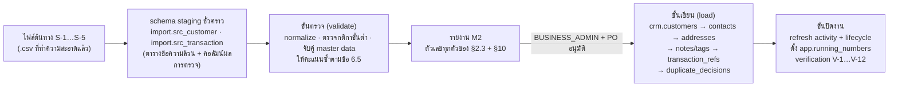
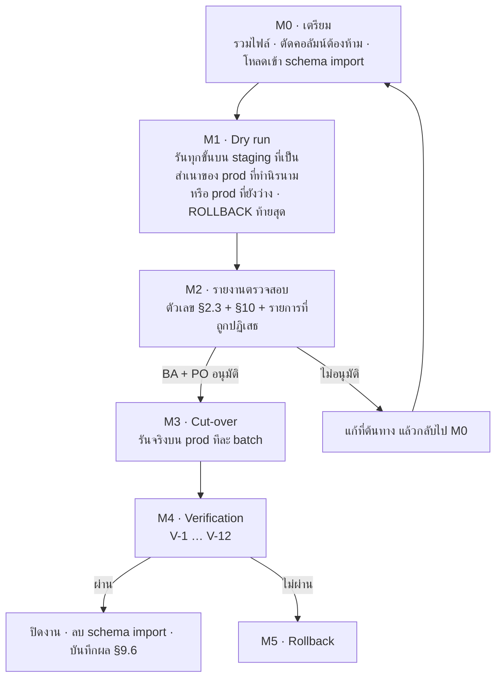

# Data Migration Plan — แผนนำเข้าข้อมูลลูกค้าเดิม · JAUN CRM · Customer 360

> เอกสารชุดที่ **16 Data Migration Plan** ตาม A45 · **ฉบับ Phase 0 · 16 ก.ย. 2569**
> ค่าทุกค่าอ้างอิง `docs/00-brief/CANONICAL.md` **v2.2** (อ้างเป็น "CANONICAL ข้อ …") โดยเฉพาะข้อ 3.1 · 3.2 · 5 · 6.1 · 6.2 · 6.3 · 6.4 · 6.5 · 6.6 · 6.7 · 6.9 · 6.10 · 9.4 · 9.5 · 10.2 · 10.3 · 12.3 · 13.0 · 14.9 · 16 D38 · 19 · ถ้าเอกสารนี้ขัดกับ CANONICAL **CANONICAL ชนะ**
> ชื่อตาราง/คอลัมน์/ฟังก์ชันยึด `supabase/migrations/0001–0011` (CANONICAL ข้อ 19.1)
> **รายละเอียดของแหล่งข้อมูลเดิมทั้งหมดเป็น "รอยืนยัน"** — CANONICAL ไม่มีข้อมูลว่าไฟล์เดิมมีคอลัมน์อะไร กี่แถว หรือจากระบบใด (Q13 · Q14 · Q15) เอกสารนี้จึงกำหนด **โครงของงาน** และ **ช่องที่ต้องกรอก** ให้ครบ
> เอกสารคู่กัน: `docs/08-delivery/roadmap.md` §6.1 (D-6 ความพร้อมของข้อมูลก่อน pilot) · `docs/08-delivery/deployment-backup-recovery.md` §4.2 · §11.4 · `docs/04-security/pdpa.md` · `docs/04-security/rls-spec.md`
> **การอ้างหัวข้อภายในเอกสารนี้ใช้ § · "ข้อ N" ที่ไม่มีชื่อเอกสารกำกับหมายถึง CANONICAL**

---

## 0. วิธีอ่านเอกสารนี้

| ประเภทข้อความ | ความหมาย |
|---|---|
| **[รอยืนยัน]** | ค่าที่ CANONICAL ไม่มี หรือต้องได้จากเจ้าของแหล่งข้อมูล · **ห้ามเดา** |
| **หมายเหตุผู้เขียน Mx** | จุดที่ CANONICAL ไม่ครอบคลุม ผู้เขียนเลือกการตีความที่สอดคล้องกับส่วนอื่นของ CANONICAL มากที่สุด · สรุปรวมใน §12 |
| SQL ในเอกสาร | **sketch** แสดงตรรกะและชื่อตาราง/คอลัมน์ที่ตรึง · ไม่ใช่ข้อความสคริปต์สุดท้าย |
| `S-1` … `S-5` | รหัสแหล่งข้อมูลเดิม (§2) |
| `M0` … `M5` | ขั้นของ runbook (§9) |
| `V-1` … `V-12` | verification query หลังนำเข้า (§9.4) |

---

## 1. ขอบเขต · หลักการ · ผู้รับผิดชอบ

### 1.1 หลักการที่ตรึงจาก CANONICAL

| # | หลักการ | ที่มา |
|---|---|---|
| 1 | **ไม่มีปุ่ม "นำเข้า" ในระบบ V1** · นำเข้าข้อมูลเดิม **ครั้งเดียวด้วยสคริปต์** ตามเอกสารนี้ | ข้อ 14.9 · D38 |
| 2 | แถวที่นำเข้ามี `created_via = 'IMPORT'` | ข้อ 6.3 · 6.2 |
| 3 | `first_seen_at` ของข้อมูลนำเข้า = **วันที่รู้จักครั้งแรกจากระบบเดิม** ไม่ใช่เวลาที่สร้างแถว | ข้อ 3.2 |
| 4 | invariant: **ไม่มีกิจกรรมใดที่ `occurred_at < customers.first_seen_at`** (มี test) | ข้อ 3.2 |
| 5 | ลูกค้าที่ขาดเบอร์ภายหลังเกิดได้จากข้อมูลนำเข้า → เป็นที่มาของ `MISSING_PHONE` | ข้อ 6.2 · 12.3 |
| 6 | **ห้ามเก็บ** เลขบัตรประชาชน วันเกิดเต็ม รายได้ รูปถ่าย หรือเอกสารใน `crm.customers` — ถ้าไฟล์เดิมมี ต้อง **ตัดทิ้งก่อนนำเข้า** | ข้อ 6.3 · 10.1 · A31 · B23 |
| 7 | งาน bulk ตั้ง `app.bulk = on` แล้ว refresh ครั้งเดียวต่อลูกค้าท้ายงาน | ข้อ 3.4 · 13.0 #7 · 19.1 #11 |
| 8 | **ไม่มีการ merge อัตโนมัติ** ระหว่างลูกค้าสองรายที่มีอยู่แล้วในระบบ · การรวมทำผ่าน `api.merge_customers` เท่านั้น | ข้อ 6.5 · 6.7 |
| 9 | เลขอ้างอิงที่ใส่มาเองไม่ถูก trigger เขียนทับ และไม่เลื่อนตัวนับ → **สคริปต์ต้องตั้ง `app.running_numbers` ให้ตรงเองท้ายงาน** | ข้อ 6.1 · 13.0 #8 |
| 10 | ระบบภายนอกอ้างลูกค้าด้วย `customer_no` (ลูกค้าที่ถูกรวมชี้ไป survivor) | Q27 |

### 1.2 สิ่งที่นำเข้าและไม่นำเข้า

| ตาราง | นำเข้า? | เหตุผล |
|---|:--:|---|
| `crm.customers` | ✓ | แกนของงานนี้ |
| `crm.customer_contacts` | ✓ | เบอร์ · LINE · อีเมล (ข้อ 6.4) |
| `crm.customer_addresses` | ✓ ถ้าแหล่งมี | ที่อยู่เต็มเป็นค่าซ่อน (ข้อ 19.1 #5) |
| `crm.customer_consents` | เฉพาะที่มี **หลักฐาน** | §11.2 — ไม่มีหลักฐาน = **ไม่สร้างแถว** |
| `crm.customer_notes` | ✓ ถ้าแหล่งมีหมายเหตุ | ต้องผ่านการกรองข้อความต้องห้าม (§4.5) |
| `crm.customer_tags` | ✓ ถ้าแหล่งมีการจัดกลุ่ม | tag ต้องมีอยู่ใน `crm.tags` และ `is_active` |
| `crm.customer_branches` | ✓ (คำนวณ) | ไม่ใส่ตรง — เกิดจาก trigger เมื่อมี transaction ref · หรือใส่ตรงเมื่อไม่มีกิจกรรม (§4.7) |
| `crm.transaction_refs` | ✓ **แนะนำ** | ประวัติการซื้อเดิม → ทำให้ `lifecycle_stage` · "ซื้อ N ครั้ง" · "ยอดซื้อสะสม" · `last_activity_at` ถูกต้อง (§4.8) |
| `crm.duplicate_decisions` | ✓ (สร้างโดยสคริปต์) | คู่ที่คะแนน ≥ 70 ที่ตัดสินไม่ได้อัตโนมัติ (§6) |
| `crm.visits` · `crm.interactions` | ✗ | ระบบเดิมไม่มีนิยาม visit ตามข้อ 3.3 · การสร้างขึ้นเองจะทำให้ `VISITS` · `CAPTURE_RATE` · `OUTCOME_COMPLETION` ย้อนหลังผิด (**หมายเหตุผู้เขียน M1**) |
| `crm.leads` · `crm.opportunities` · `crm.quotations` · `crm.tasks` | ✗ | เป็นของ Phase 2 · ระบบเดิมไม่มีสถานะตามข้อ 4.3/4.4 |
| `audit.*` | ✗ | audit เป็นบันทึกของระบบนี้ · การนำเข้าเองบันทึกเป็น audit ของตัวเอง (§3.3) |
| `core.*` · `ref.*` | ✗ (ตั้งค่าด้วยมือ) | master data ยืนยันโดย `BUSINESS_ADMIN` ก่อนนำเข้า (roadmap §6.1 D-1) |

### 1.3 ใครทำอะไร

| ขั้น | ผู้ทำ | สิทธิ์/บัญชีที่ใช้ |
|---|---|---|
| รวบรวมและทำความสะอาดไฟล์ต้นทาง | เจ้าของแหล่งข้อมูลแต่ละระบบ **[รอยืนยัน]** | นอกระบบ CRM |
| ตัดสินการจับคู่คอลัมน์และค่า master data | `BUSINESS_ADMIN` + PO | หน้า 14 `master-data` |
| รันสคริปต์นำเข้า (dry run และ cut-over) | **`BUSINESS_ADMIN`** เป็นผู้รับผิดชอบ · ปฏิบัติการทางเทคนิคโดยผู้ดูแลระบบภายใต้การกำกับ | การเชื่อมต่อฐานข้อมูลโดยตรง (role `postgres`) — **ไม่ใช่** ผ่าน PostgREST/JWT (§3.2) |
| ตรวจรายงานคุณภาพข้อมูลและตัดสิน go/no-go | `BUSINESS_ADMIN` + PO | §10 |
| ตัดสินคู่ข้อมูลซ้ำที่ค้าง | ผู้มี `customer.merge` 🔐 (ผู้ตัดสิน ≠ ผู้สร้างแถว) | `api.merge_customers` · `api.decide_duplicate` |
| อนุมัติด้าน PDPA | DPO **[รอยืนยัน Q8]** | §11 |

> CANONICAL ข้อ 8.1 ให้ `data_quality.resolve` และ `customer.*` ระดับ `G` แก่ `BUSINESS_ADMIN` และให้ BA เป็นเจ้าของงาน "master data · ผู้ใช้ · คุณภาพข้อมูล · PDPA" (ข้อ 7) จึงเป็นบทบาทที่ถูกต้องสำหรับงานนี้ · `SYSTEM_ADMIN` **ห้าม** เป็นผู้ตัดสินเนื้อหาข้อมูลลูกค้าเพราะไม่มีสิทธิ์ข้อมูลลูกค้าใด ๆ (ข้อ 7.1)

---

## 2. แหล่งข้อมูลเดิม

### 2.1 รายการแหล่ง (รายละเอียดทั้งหมด **[รอยืนยัน]**)

| รหัส | แหล่ง | รูปแบบที่คาด | สิ่งที่คาดว่าจะมี | คำถามที่ต้องตอบก่อน |
|---|---|---|---|---|
| **S-1** | ไฟล์ Excel/Google Sheet ของแต่ละสาขา | `.xlsx` / `.csv` | ชื่อ · เบอร์ · LINE · รุ่นที่ซื้อ · หมายเหตุ | มีกี่ไฟล์ · กี่แถว · คอลัมน์อะไร · ใครดูแล · มีเลขบัตรประชาชนหรือไม่ |
| **S-2** | รายชื่อเพื่อนใน LINE OA | export จาก LINE OA | display name · LINE userId · แท็บ/แท็ก | มีกี่บัญชี OA (Q15) · export ได้จริงหรือไม่ · มีชื่อจริงหรือไม่ |
| **S-3** | ระบบขายหน้าร้าน (POS) | export จากระบบ | เลขใบเสร็จ · วันที่ · ยอด · ชื่อ/เบอร์ลูกค้า · IMEI | ชื่อระบบ · มี API หรือไม่ · รูปแบบเลขใบเสร็จ (Q14) |
| **S-4** | ระบบซ่อม | export จากระบบ | เลขงานซ่อม · วันที่ · เครื่อง · ชื่อ/เบอร์ | เหมือน S-3 (Q14) |
| **S-5** | ระบบผ่อน JAUN POWER MONEY | export จากระบบ | เลขสัญญา · วันที่ · ชื่อ/เบอร์ | เหมือน S-3 · **และ Q17 (นิติบุคคลเดียวกันหรือไม่)** เพราะกระทบฐานความยินยอมและการเปิดเผยข้อมูล |

> CANONICAL ข้อ 5.7 ตรึงรหัสระบบต้นทางไว้แล้ว: `MANUAL` · `POS` · `REPAIR` · `JPM_INSTALLMENT` · `CONTRACT` · `ACCOUNTING` (`ref.source_systems`) · แหล่ง S-3/S-4/S-5 จึงจับคู่กับรหัสเหล่านี้ตอนนำเข้า `crm.transaction_refs`

### 2.2 สิ่งที่ต้องขอจากเจ้าของแหล่งข้อมูลก่อนเริ่ม (checklist)

| # | รายการ | ทำไมต้องมี |
|---|---|---|
| 1 | ไฟล์ตัวอย่าง 100 แถวของทุกแหล่ง | ใช้ทำ mapping จริงและประเมินคุณภาพ |
| 2 | พจนานุกรมคอลัมน์ของแหล่ง (ชื่อคอลัมน์ → ความหมาย → ตัวอย่างค่า) | เติม §4 ให้ครบ |
| 3 | **กุญแจของลูกค้าในระบบเดิม** (customer id / รหัสสมาชิก) | ใช้กันซ้ำในการนำเข้าและทำ idempotent (§6.2 ชั้น A) |
| 4 | วันที่รู้จักลูกค้าครั้งแรก และวันที่ติดต่อ/ซื้อครั้งล่าสุด | `first_seen_at` (ข้อ 3.2) และ `last_activity_at` (§7.3) |
| 5 | สาขาที่ลูกค้าผูกอยู่ | `first_branch_id` และ `customer_branches` (ข้อ 6.6) — ไม่มี = ผูกสาขาไม่ได้ |
| 6 | ช่องทางที่รู้จักลูกค้าครั้งแรก | `first_channel_code` → ใช้กับกราฟแหล่งที่มา (ข้อ 13.3) และกฎ `MISSING_PHONE` (ข้อ 12.3) |
| 7 | คำยืนยันว่าไฟล์ **ไม่มี**เลขบัตรประชาชน/สำเนาบัตร/รายได้/วันเกิดเต็ม หรือระบุคอลัมน์ที่ต้องตัดทิ้ง | หลักการ §1.1 #6 |
| 8 | หลักฐานการแจ้งประกาศความเป็นส่วนตัว/ความยินยอมทางการตลาดของลูกค้าเดิม (ถ้ามี) | §11.2 |
| 9 | ผู้มีอำนาจอนุมัติการส่งไฟล์ออกจากระบบเดิม | PDPA ม.28–29 · ข้อ 1.4 |

### 2.3 การประเมินแหล่ง (profiling) — ตัวเลขที่ต้องรู้ก่อนตัดสินใจ

รันบนไฟล์ต้นทางใน staging ก่อนเขียนลง `crm.*` (ผลทั้งหมดอยู่ในรายงาน `M2` · §9)

| ตัวชี้วัด | ทำไมสำคัญ | เกณฑ์ที่ต้องเทียบ |
|---|---|---|
| จำนวนแถวต่อแหล่ง · รวม · หลังตัดซ้ำในแหล่งเดียวกัน | ขนาดงานและ batch (§8) | – |
| % แถวที่มีเบอร์ที่ `app.is_valid_thai_phone` = true | `MISSING_PHONE` · `INVALID_PHONE` | ข้อ 12.3 |
| % แถวที่มี `last_name` | `INCOMPLETE_CUSTOMER` | ข้อ 12.3 |
| % แถวที่มีจังหวัด | `INCOMPLETE_CUSTOMER` | ข้อ 12.3 |
| % แถวที่มีชื่อ **หรือ** ชื่อเล่น | กติกาขั้นต่ำของการสร้างลูกค้า (ข้อ 6.2) | ต้อง 100% มิฉะนั้นตัดแถวออก |
| จำนวนเบอร์ (normalized) ที่ซ้ำกันข้ามแถว | คาดการณ์จำนวน `duplicate_decisions` | §6 · §10 |
| จำนวนแถวที่มีข้อความยาว/หมายเหตุ | ต้องกรองข้อความต้องห้าม (§4.5) | ข้อ 10.1 |
| ช่วงวันที่ของ "รู้จักครั้งแรก" และ "ติดต่อล่าสุด" | `first_seen_at` · retention clock (§11.3) | ข้อ 10.3 |

---

## 3. สถาปัตยกรรมการนำเข้า

### 3.1 ชั้นงาน



- schema `import` เป็น **ชั่วคราว** · ถูกลบทิ้งหลังจบงานและบันทึกผลแล้ว · ไม่อยู่ใน Data API และไม่มี GRANT ให้ `authenticated`
- ตารางใน `import` เก็บทุกคอลัมน์เป็น `text` ตามไฟล์ต้นทาง + คอลัมน์ผลการตรวจ (`status` · `reject_reason` · `crm_customer_id` · `dup_score` · `dup_candidate_id` · `dup_rules text[]`) เพื่อให้รันซ้ำได้และตรวจย้อนได้

### 3.2 เส้นทางการเขียน — ทำไมไม่ใช้ `api.quick_capture`

| ทางเลือก | ใช้ได้หรือไม่ | เหตุผล |
|---|:--:|---|
| `api.quick_capture` ทีละแถว | ✗ | บังคับ `first_name`/`nickname` + ช่องทางติดต่อ + **ติ๊กแจ้งประกาศความเป็นส่วนตัว** (ข้อ 6.2) — การติ๊กแทนลูกค้าเดิมที่ไม่มีหลักฐานเป็นการบันทึกเท็จ (§11.2) · ตั้ง `created_via = 'QUICK_CAPTURE'` · ตั้ง `first_seen_at` จากเวลาปัจจุบัน (ตั้งย้อนหลังไม่ได้) · คำนวณผู้สมัครซ้ำใหม่ทุกครั้งฝั่ง server (ข้อ 19.3 #2) จึงช้าเกินสำหรับหลักพันแถว |
| `INSERT` ตรงด้วย role `authenticated` | ✗ | `authenticated` **ไม่มี INSERT** บน `crm.customers` `customer_contacts` `customer_consents` (ข้อ 9.4 กติกา 6) |
| **`INSERT` ตรงด้วย role `postgres` (สคริปต์)** | ✓ | ทางเดียวที่ตั้ง `created_via = 'IMPORT'` · `first_seen_at` ย้อนหลัง · `customer_no` เองได้ ตรงตามที่ CANONICAL คาดไว้ ("นำเข้าข้อมูลเดิมด้วยสคริปต์" — COMMENT ของ `crm.customers`) |

**ผลที่ตามมาของการรันด้วย `postgres` ที่สคริปต์ต้องรับผิดชอบเอง** (เพราะ trigger เหล่านี้ทำงานเฉพาะ `current_user = 'authenticated'`):

| สิ่งที่ปกติ trigger ทำให้ | สคริปต์ต้องทำเอง | ที่มา |
|---|---|---|
| `app.trg_stamp_row` เติม `organization_id` · `created_by` · `updated_by` | **ใส่ทั้งสามคอลัมน์เองทุกแถว** (`created_by` = staff id ของ BA ผู้รับผิดชอบ) | `0010_security.sql` · ข้อ 19.2 #1 |
| `app.enforce_row_transition` ตรวจสิทธิ์/สถานะ | สคริปต์ต้องใส่ค่าที่ถูกต้องเอง (ไม่มีการตรวจให้) | ข้อ 9.4.2 |
| RLS | ไม่มีผลกับ `postgres` | ข้อ 9.4 |

สิ่งที่ **ยังทำงาน** แม้รันด้วย `postgres` และต้องเผื่อไว้: `app.trg_assign_running_number` (เมื่อไม่ใส่เลขเอง) · `app.trg_guard_restricted_text` (ปฏิเสธเลขบัตรประชาชนใน `customer_notes.body`) · `app.trg_link_customer_branch` (สร้าง `customer_branches` จาก transaction ref) · `audit.log_row_change` (ถ้าไม่เปิด `app.seed_mode`) · generated column `value_normalized` / `value_masked`

### 3.3 การตั้งค่าในทรานแซกชันของการนำเข้า

```sql
-- ต้นทรานแซกชันของทุก batch
SELECT set_config('app.bulk',        'on',                       true);   -- ข้อ 3.4 · 19.1 #11
SELECT set_config('app.actor_type',  'SYSTEM',                   true);   -- ข้อ 9.5
SELECT set_config('app.actor_label', 'SYSTEM:import_customers',  true);   -- รูปแบบเดียวกับ SYSTEM:close_stale_visits
SELECT set_config('app.audit_reason','IMPORT-{batch_id}',        true);   -- ข้อ 19.1 #9 · ห้ามมี PII
-- ห้ามตั้ง app.seed_mode: การนำเข้าเป็นข้อมูลจริง ต้องมี audit ครบ (หมายเหตุผู้เขียน M2)
```

| setting | ตั้งเป็น | ผล |
|---|---|---|
| `app.bulk` | `on` | ข้าม: คำนวณ lifecycle รายแถว · sync next-action task · `NEW → CONTACTED` อัตโนมัติ · ขั้น `QUOTATION` อัตโนมัติ · แคช `last_*`/`has_*` · การแจ้งเตือน `*_ASSIGNED` (ข้อ 19.1 #11) |
| `app.actor_type` · `app.actor_label` | `SYSTEM` · `SYSTEM:import_customers` | audit บันทึกผู้กระทำเป็นงานระบบที่ระบุชื่อได้ (ข้อ 9.5) |
| `app.audit_reason` | `IMPORT-{batch_id}` | ใช้ค้น audit ของงานนำเข้าได้ · **ห้ามมี PII** (ข้อ 19.4 #2) |
| `app.seed_mode` | **ไม่ตั้ง** | เก็บ audit ครบ — ข้อมูลจริงต้องตามรอยได้ (ต่างจาก seed ข้อ 13.0 #7 ที่เป็นข้อมูลสมมติ) |

---

## 4. ตาราง Mapping (source field → `crm` table.column → การแปลง → กฎตรวจ)

> คอลัมน์ "ฟิลด์ต้นทาง" ทุกช่องเป็น **[รอยืนยัน]** จนกว่าจะได้พจนานุกรมคอลัมน์จริง (§2.2 #2) · ชื่อที่เขียนไว้เป็นชื่อสมมติเพื่อแสดงโครง

### 4.1 `crm.customers`

| ฟิลด์ต้นทาง [รอยืนยัน] | คอลัมน์ปลายทาง | การแปลง | กฎตรวจ (ไม่ผ่าน = ปฏิเสธแถว R · เตือน W · เว้นว่าง N) |
|---|---|---|---|
| – | `id` | `gen_random_uuid()` | – |
| – | `organization_id` | id ขององค์กร `JAUN` | **R** ถ้าไม่พบ |
| `legacy_customer_no` / – | `customer_no` | §7.1 (บล็อกเลขของการนำเข้า) | **R** ถ้าซ้ำกับที่มีอยู่ · ต้องตรงรูป `^CUS-[0-9]{4}-[0-9]{6,}$` |
| `ชื่อ` | `first_name` | `btrim` · ยุบช่องว่างซ้ำ · ตัดคำนำหน้า "คุณ/นาย/นาง/นางสาว/ด.ช./ด.ญ." ที่หัวสตริง (ข้อ 3.5: "คุณ" เติมที่ UI เท่านั้น) | **R** ถ้า `first_name` และ `nickname` ว่างทั้งคู่ (ข้อ 6.2) |
| `นามสกุล` | `last_name` | `btrim` · ยุบช่องว่างซ้ำ | **W** ถ้าว่าง → เสี่ยง `INCOMPLETE_CUSTOMER` |
| `ชื่อเล่น` | `nickname` | `btrim` | – |
| – | `display_name` · `name_search` | **generated column — ห้ามเขียน** | – |
| `ประเภทลูกค้า` | `customer_type` | `INDIVIDUAL` (ค่าเริ่มต้น) หรือ `BUSINESS` | **R** ถ้าไม่อยู่ในสองค่านี้ (ข้อ 5.8) |
| `วันที่รู้จักครั้งแรก` | `first_seen_at` | §7.2 | **R** ถ้าแปลงเป็น `timestamptz` ไม่ได้และไม่มีค่าสำรอง |
| `ช่องทางที่รู้จัก` | `first_channel_code` | จับคู่กับ `ref.channels.code` (7 ค่า ข้อ 5.1) | **R** ถ้าจับคู่ไม่ได้ · **ห้ามสร้างรหัสใหม่** |
| `แหล่งที่มา` | `first_source_code` | จับคู่กับ `ref.sources.code` (ข้อ 5.2) | **N** ถ้าจับคู่ไม่ได้ (คอลัมน์ nullable) + รายงาน |
| `สาขา` | `first_branch_id` | จับคู่กับ `core.branches.code` (`JP1`–`JP4` · `JPON`) | **R** ถ้าจับคู่ไม่ได้ — ไม่มีสาขาแปลว่าผูก scope ไม่ได้ (ข้อ 8.0) |
| `ผู้ดูแล` | `owner_staff_id` | จับคู่กับ `core.staff_profiles.staff_code`/`employee_code` | **N** ถ้าจับคู่ไม่ได้ · ผู้ดูแลต้องมี assignment ในสาขานั้น มิฉะนั้น **N** + รายงาน |
| – | `lifecycle_stage` | ใส่ `'IDENTIFIED'` ตอนเขียน แล้ว **คำนวณใหม่ด้วย `app.refresh_customer_lifecycle` ท้ายงาน** (ข้อ 3.4) | – |
| – | `record_status` | `'ACTIVE'` | – |
| `จังหวัด` | `province_code` | จับคู่กับ `ref.provinces.code` (ISO 3166-2:TH · 77 จังหวัด) ด้วยชื่อไทยแบบตัดคำว่า "จังหวัด" | **N** ถ้าจับคู่ไม่ได้ + รายงาน → เสี่ยง `INCOMPLETE_CUSTOMER` |
| – | `note_summary` | **ห้ามเขียน** — ตั้งโดย trigger ของ `customer_notes` | – |
| – | `legal_hold` | `false` | เปลี่ยนภายหลังผ่าน `api.set_legal_hold` เท่านั้น |
| – | `created_via` | **`'IMPORT'`** | **R** ถ้าเป็นค่าอื่น |
| `วันที่ติดต่อล่าสุด` | `last_activity_at` | §7.3 | – |
| `ช่องทางล่าสุด` | `last_channel_code` | จับคู่ `ref.channels` | **N** ถ้าจับคู่ไม่ได้ |
| `สาขาล่าสุด` | `last_branch_id` | จับคู่ `core.branches` · ค่าเริ่มต้น = `first_branch_id` | – |
| – | `has_open_followup` · `has_new_lead` | `false` (ไม่มี task/lead ในการนำเข้า) | – |
| – | `created_at` | **เวลาที่รันการนำเข้า** (ไม่ใช่วันที่ของระบบเดิม) | – |
| – | `created_by` · `updated_by` | staff id ของ `BUSINESS_ADMIN` ผู้รับผิดชอบ (§3.2) | **R** ถ้าว่าง |

**ห้ามนำเข้าเด็ดขาด:** เลขบัตรประชาชน · สำเนาบัตร · วันเกิดเต็ม · รายได้ · รูปถ่าย · เอกสารสัญญา (ข้อ 6.3 · 10.1) — ถ้าไฟล์ต้นทางมี ให้ตัดคอลัมน์ทิ้งตั้งแต่ขั้น `M0` และบันทึกว่าตัดอะไรไปบ้าง

### 4.2 `crm.customer_contacts`

| ฟิลด์ต้นทาง [รอยืนยัน] | `contact_type` | คอลัมน์ปลายทาง | การแปลง | กฎตรวจ |
|---|---|---|---|---|
| `เบอร์โทร` | `PHONE` | `value_raw` | ใส่ค่าที่กรอกตามจริง (§5.1) | **R (ข้ามรายการติดต่อนี้)** ถ้า `app.normalize_contact` คืน NULL — คอลัมน์ `value_normalized` เป็น `NOT NULL` |
| `เบอร์โทร 2` | `PHONE` | `value_raw` | เหมือนกัน · `is_primary = false` | ถ้า normalized ชนกับแถวแรกของลูกค้าเดียวกัน → ข้าม (unique index `customer_contacts_value_active_uidx`) |
| `LINE ID` | `LINE_ID` | `value_raw` | §5.2 | ค่าที่เป็น URL (`line.me/ti/p/~xxx`) ตัดเหลือ id ก่อนใส่ **[รอยืนยันรูปแบบจริง]** |
| `LINE userId` (จาก S-2) | `LINE_USER_ID` | `value_raw` | ตามที่ LINE ส่ง (ตัดเฉพาะช่องว่าง) | `value_masked` จะเป็น `—` เสมอ (ข้อ 6.4) |
| `อีเมล` | `EMAIL` | `value_raw` | §5.3 | **W** ถ้าไม่มี `@` (เก็บได้ · `is_valid = false`) |
| `Facebook` · `Instagram` · `TikTok` | `FACEBOOK` · `INSTAGRAM` · `TIKTOK` | `value_raw` | ตัดช่องว่าง · ตัวพิมพ์เล็ก | – |
| – | `value_normalized` · `value_masked` | **generated column — ห้ามเขียน** | คำนวณจาก `app.normalize_contact` / `app.mask_contact` | – |
| – | `is_primary` | `true` สำหรับรายการแรกของแต่ละชนิดต่อลูกค้า | unique index บังคับหนึ่งรายการต่อชนิด |
| – | `is_valid` | `PHONE`: `app.is_valid_thai_phone(value_raw)` · ชนิดอื่น: `true` | `false` → เป็นที่มาของ `INVALID_PHONE` (ข้อ 12.3) |
| – | `is_active` | `true` | – |
| – | `verified_at` | **`NULL`** — ข้อมูลเดิมยังไม่ผ่านการยืนยันในระบบนี้ (**หมายเหตุผู้เขียน M3**) | มีผลกับการเลือกแถวตอน merge (ข้อ 6.7) |
| – | `organization_id` · `created_by` · `updated_by` | เหมือน §4.1 | – |

### 4.3 `crm.customer_addresses`

| ฟิลด์ต้นทาง [รอยืนยัน] | ปลายทาง | การแปลง | กฎตรวจ |
|---|---|---|---|
| `ที่อยู่` | `address_line` | `btrim` | `NOT NULL` — ไม่มีที่อยู่ = ไม่สร้างแถว |
| `ตำบล/แขวง` | `subdistrict` | `btrim` | – |
| `อำเภอ/เขต` | `district` | `btrim` | – |
| `จังหวัด` | `province_code` | จับคู่ `ref.provinces` | **N** ถ้าจับคู่ไม่ได้ |
| `รหัสไปรษณีย์` | `postal_code` | เหลือเฉพาะตัวเลข | **W** ถ้าไม่ใช่ 5 หลัก |
| – | `value_masked` | `'{district} · {จังหวัด}'` ตามข้อ 19.1 #5 | `NOT NULL` — ถ้าไม่มี district ใช้เฉพาะชื่อจังหวัด **[รอยืนยัน]** |

### 4.4 `crm.customer_consents`

**ค่าเริ่มต้นของข้อมูลนำเข้า = ไม่สร้างแถวใด ๆ** (§11.2 อธิบายเหตุผล) · สร้างแถวเฉพาะเมื่อแหล่งข้อมูลมีหลักฐานที่ระบุได้:

| กรณี | `purpose_code` | `status` | `captured_via` | `notice_version` | `evidence` (บังคับ) | `channels` |
|---|---|---|---|---|---|---|
| มีบันทึกว่าเคยแจ้งประกาศฯ แล้ว พร้อมวัน/วิธี | `PRIVACY_NOTICE` | `GRANTED` | ตามวิธีจริง (`STAFF_FORM` · `LINK_SENT` · `LINE_OA` · `WEB`) | ฉบับที่แจ้งจริง **[รอยืนยัน]** — ถ้าไม่ทราบฉบับ ให้ระบุข้อความอธิบายใน `evidence` และ **เว้น `notice_version` ว่าง** | ข้อความอ้างอิงหลักฐาน + รหัสงานนำเข้า (ห้ามมี PII เกินจำเป็น) | `{}` |
| มีบันทึกความยินยอมรับข่าวสารพร้อมช่องทางและหลักฐาน | `MARKETING` | `GRANTED` | ตามวิธีจริง | – | หลักฐาน + ข้อความยืนยันอายุ ≥ 20 ปี (ข้อ 19.4 #3) — **ไม่มีข้อความนี้ = ห้ามบันทึก GRANTED** | เฉพาะช่องทางที่มีหลักฐาน ⊆ `{LINE, SMS, PHONE, EMAIL}` |
| มีบันทึกว่าลูกค้าขอไม่รับข่าวสาร | `MARKETING` | `WITHDRAWN` | ตามวิธีจริง | – | หลักฐาน | `{}` |
| **ไม่มีหลักฐาน (กรณีส่วนใหญ่ที่คาด)** | **ไม่สร้างแถว** | – | – | – | – | – |

- `captured_at` = วันที่ตามหลักฐาน (ไม่ใช่วันนำเข้า) · `captured_by` = staff ผู้รับผิดชอบ (บังคับเมื่อ `STAFF_FORM`/`LINK_SENT` ตาม CHECK ของตาราง)
- ตารางนี้ **append-only** — การนำเข้าเพิ่มแถวได้อย่างเดียว ถอนความยินยอม = เพิ่มแถว `WITHDRAWN` (ข้อ 10.2)

### 4.5 `crm.customer_notes`

| ฟิลด์ต้นทาง [รอยืนยัน] | ปลายทาง | การแปลง | กฎตรวจ |
|---|---|---|---|
| `หมายเหตุ` | `body` | `btrim` · ตัดให้ ≤ 2,000 ตัวอักษร (ถ้ายาวกว่า → **W** และตัดพร้อมต่อท้าย "…") | CHECK: `char_length ≤ 2000` และไม่ว่าง |
| – | `branch_id` | = `customers.first_branch_id` | `NOT NULL` (ข้อ 19.1 #6) |
| – | `is_pinned` | `false` (**หมายเหตุผู้เขียน M4**: ไม่มีข้อมูลว่าโน้ตใดสำคัญ · ปักหมุดภายหลังได้) | – |
| – | `interaction_id` | `NULL` (ไม่นำเข้า interaction) | – |
| – | `created_at` | วันที่ของหมายเหตุเดิมถ้ามี · มิฉะนั้นเวลาที่นำเข้า | – |

> **trigger `app.trg_guard_restricted_text` ทำงานแม้รันด้วย `postgres`** → หมายเหตุที่มีเลข 13 หลักรูปเลขบัตรประชาชนที่ checksum ถูกต้องจะถูกปฏิเสธและทำให้ทั้ง batch ล้ม · ขั้น validate ต้องตรวจด้วย `app.contains_thai_national_id(...)` ก่อน และ **ปฏิเสธเฉพาะโน้ตนั้น** ไม่ใช่ทั้งลูกค้า

### 4.6 `crm.customer_tags`

| ฟิลด์ต้นทาง [รอยืนยัน] | ปลายทาง | การแปลง | กฎตรวจ |
|---|---|---|---|
| `กลุ่ม/แท็กของระบบเดิม` | `crm.customer_tags(customer_id, tag_id)` | จับคู่กับ `crm.tags.code` ที่ `is_active` | **N** ถ้าจับคู่ไม่ได้ + รายงาน · **ห้ามสร้าง tag ใหม่โดยสคริปต์** — tag สร้างด้วย `tag.manage` ที่หน้า 14 เท่านั้น (ข้อ 5.9) |

ค่าที่มีอยู่แล้ว (ข้อ 5.9 · ทั้งชุดติด [รอยืนยัน]): `VIP` · `INSTALLMENT` · `STUDENT` · `TRADE_IN` · `IPHONE_FAN`

### 4.7 `crm.customer_branches`

| แหล่ง | วิธีได้มา |
|---|---|
| ลูกค้าที่นำเข้า **พร้อม** `transaction_refs` | **trigger `app.trg_link_customer_branch` สร้างให้เอง** เมื่อ insert transaction ref · `linked_via = 'MANUAL_LINK'` (ENUM `crm.customer_link_via` ข้อ 4.8: "transaction ref ใช้ `MANUAL_LINK` ใน V1") · `first_linked_at` = `transacted_at` |
| ลูกค้าที่นำเข้า **ไม่มี**กิจกรรมใด ๆ | สคริปต์ `INSERT` ตรง 1 แถว: `(customer_id, first_branch_id)` · `first_linked_at = first_seen_at` · `last_activity_at = customers.last_activity_at` · `linked_via = 'CREATED'` (**หมายเหตุผู้เขียน M5**) |

> ถ้าไม่มีแถวใน `customer_branches` **และ** `first_branch_id` ก็ใช้ได้ตามข้อ 8.0 (scope ลูกค้าเทียบ "`customer_branches` หรือ `first_branch_id`") แต่การมีแถวชัดเจนทำให้ตัวกรองสาขาในหน้า 03 และดัชนี `(branch_id, customer_id)` ทำงานตรงไปตรงมา จึงเลือกใส่

### 4.8 `crm.transaction_refs` (ประวัติการซื้อ/บริการเดิม)

| ฟิลด์ต้นทาง [รอยืนยัน] | ปลายทาง | การแปลง | กฎตรวจ |
|---|---|---|---|
| `เลขใบเสร็จ/เลขงาน/เลขสัญญา` | `external_no` | `btrim` | `NOT NULL` · ไม่ว่าง · **UNIQUE คู่กับ `source_system_code`** → กันนำเข้าซ้ำโดยอัตโนมัติ |
| (ตามแหล่ง) | `source_system_code` | S-3 → `POS` · S-4 → `REPAIR` · S-5 → `JPM_INSTALLMENT` · สัญญา → `CONTRACT` (ข้อ 5.7) | **R** ถ้าไม่อยู่ใน `ref.source_systems` |
| `ประเภทรายการ` | `transaction_type_code` | จับคู่ `ref.transaction_types` 8 ค่า (ข้อ 5.7) | **R** ถ้าจับคู่ไม่ได้ · ค่าที่ `counts_as_purchase = true` (`SALE` · `TRADE_IN_SALE` · `INSTALLMENT_CONTRACT`) มีผลกับ `lifecycle_stage` และ "ซื้อ N ครั้ง" |
| `วันที่` | `transacted_at` | แปลงเป็น `timestamptz` ที่ `+07` | **R** ถ้าแปลงไม่ได้ · **R ถ้า `transacted_at < customers.first_seen_at`** (invariant ข้อ 3.2) → แก้โดยลด `first_seen_at` ลงแทน (§7.2) |
| `ยอด` | `amount` | `numeric(12,2)` | **W** ถ้าติดลบหรือว่างสำหรับประเภทที่นับเป็นการซื้อ |
| `สาขา` | `branch_id` | จับคู่ `core.branches` | `NOT NULL` · **R** ถ้าจับคู่ไม่ได้ |
| `IMEI` | `device_imei` | เหลือเฉพาะตัวเลข | CHECK: 15 หลักพอดี · ไม่ตรง → **N** (ใส่ NULL) + รายงาน |
| `Serial` | `device_serial` | `btrim` | – |
| – | `opportunity_id` | `NULL` (ไม่มี opportunity ย้อนหลัง) | – |
| `ข้อมูลอื่น` | `summary` | `jsonb` object · **ห้ามใส่ PII เกินจำเป็น** (คอลัมน์นี้ถูกล้างตอน anonymize · ข้อ 10.4) | CHECK: ต้องเป็น object |

**ทำไมแนะนำให้นำเข้า transaction ref:**

1. `lifecycle_stage` ของลูกค้าเดิมจะคำนวณเป็น `CUSTOMER`/`REPEAT` ถูกต้อง (ข้อ 3.4) แทนที่จะเป็น `IDENTIFIED` ทุกราย
2. Customer 360 แสดง "ซื้อ N ครั้ง" และ "ยอดซื้อสะสม" ได้ (ข้อ 3.3 · 6.8)
3. `last_activity_at` มีค่าจริง → นาฬิกาของระยะเก็บข้อมูล (ข้อ 10.3) เริ่มนับจากวันที่ถูกต้อง (§11.3)
4. `customer_branches` ถูกสร้างจากกิจกรรมจริง (§4.7)

**ผลข้างเคียงที่ยอมรับได้:** `analytics.customer_activity` จะมีเหตุการณ์ย้อนหลัง ทำให้ `UNIQUE_CUSTOMERS`/`BUYERS` ของ**ช่วงเวลาในอดีต**มีค่า — ถูกต้องตามนิยามข้อ 3.1 เพราะลูกค้ามีกิจกรรมจริงในช่วงนั้น · **ไม่กระทบ** `SALES`/`SALES_AMOUNT` ซึ่งนับจาก opportunity `WON` เท่านั้น (ข้อ 12.1)

### 4.9 ตารางที่ไม่นำเข้า — และสิ่งที่ต้องบอกผู้ใช้

| ตาราง | ผลที่ผู้ใช้จะเห็น | ต้องสื่อสารว่า |
|---|---|---|
| `crm.visits` | "เข้าร้าน N ครั้ง" ของลูกค้าเดิม = 0 หรือเฉพาะที่เกิดหลังเริ่มใช้ระบบ | ตัวเลขการเข้าร้านเริ่มนับจากวันเปิดใช้งาน |
| `crm.interactions` | แท็บ "ประวัติการติดต่อ" ว่างสำหรับลูกค้าเดิม | ประวัติการติดต่อเริ่มบันทึกจากวันเปิดใช้งาน |
| `crm.leads` · `crm.opportunities` | ไม่มีรายการค้างจากระบบเดิม | งานติดตามที่ค้างอยู่ต้องสร้างใหม่ในระบบ (Phase 2) |

---

## 5. การทำค่าช่องทางติดต่อให้เป็นมาตรฐาน

**กฎเดียวของทั้งระบบคือ `app.normalize_contact(contact_type, value_raw)`** (ข้อ 6.4) · สคริปต์ **ห้ามเขียนตรรกะ normalize ของตัวเอง** — ใส่เฉพาะ `value_raw` แล้วปล่อยให้ generated column คำนวณ `value_normalized`/`value_masked` จึงไม่มีทางผิดเพี้ยนจากที่ระบบใช้ค้นหา

ขั้น validate เรียกฟังก์ชันเดียวกันบนตาราง staging เพื่อ **ทำนาย** ผลก่อนเขียนจริง:

```sql
UPDATE import.src_customer s
SET phone_norm = app.normalize_contact('PHONE'::crm.contact_type, s.phone_raw),
    phone_ok   = app.is_valid_thai_phone(s.phone_raw),
    line_norm  = app.normalize_contact('LINE_ID'::crm.contact_type, s.line_raw),
    email_norm = app.normalize_contact('EMAIL'::crm.contact_type, s.email_raw);
```

### 5.1 PHONE

| กรณีในไฟล์เดิม | ผลของ `app.normalize_contact` | `is_valid` | ทำอย่างไร |
|---|---|:--:|---|
| `081-234-5678` · `0812345678` · `๐๘๑๒๓๔๕๖๗๘` | `+66812345678` | ✓ | นำเข้าปกติ |
| `02-123-4567` | `+6621234567` | ✓ | นำเข้าปกติ (เบอร์บ้าน) |
| `+66 81 234 5678` · `66812345678` · `0066812345678` | `+66812345678` | ✓ | นำเข้าปกติ |
| เบอร์ต่างประเทศ `+6512345678` | `+6512345678` | ✗ | นำเข้าได้ · ติด `INVALID_PHONE` (ข้อ 12.3) |
| `081-234-5678, 089-999-9999` (สองเบอร์ในช่องเดียว) | ตัวเลขติดกันทั้งหมด → ไม่ถูกต้อง | ✗ | **แยกเป็นสองแถวในขั้น staging ก่อน** (**W** + กฎการแยก **[รอยืนยันรูปแบบตัวคั่นจริง]**) |
| `ไม่มี` · `-` · ว่าง | `NULL` | – | ไม่สร้างแถว contact → อาจติด `MISSING_PHONE` ถ้า `first_channel_code ∈ {WALK_IN, PHONE}` |
| ตัวเลขน้อยกว่า 9 หลัก | ตัวเลขล้วน | ✗ | นำเข้าได้ · ติด `INVALID_PHONE` · **หรือ** ตัดทิ้งตามการตัดสินของ BA **[รอยืนยัน]** |

### 5.2 LINE

| ชนิด | ค่าที่ใส่ใน `value_raw` | ผล normalized | หมายเหตุ |
|---|---|---|---|
| `LINE_ID` | id ที่ผู้ใช้ตั้ง เช่น `@Somchai_J` | `somchai_j` (ตัด `@` นำหน้า · ตัวพิมพ์เล็ก · ตัดช่องว่างทุกตำแหน่ง) | ใช้ค้นแบบตรงทั้งค่าและเป็นกฎซ้ำคะแนน 100 (ข้อ 6.5) |
| `LINE_USER_ID` | userId จาก LINE OA (`U…`) | คงตัวพิมพ์เดิม | `value_masked` = `—` · เป็นกฎซ้ำคะแนน 100 เช่นกัน |
| ค่าที่เป็นลิงก์ `https://line.me/ti/p/~somchai_j` | **ตัดเหลือ `somchai_j` ในขั้น staging** | – | ถ้าใส่ลิงก์ทั้งอันจะค้นไม่เจอเพราะค้นแบบตรงทั้งค่า **[รอยืนยันรูปแบบที่พบจริง]** |
| ค่าที่เป็นชื่อที่แสดง (display name) ไม่ใช่ id | **ห้ามใส่เป็น `LINE_ID`** | – | ใส่เป็น `nickname` แทน (**หมายเหตุผู้เขียน M6**) |

### 5.3 EMAIL

- `value_raw` = ค่าที่มี · normalized = ตัดช่องว่างทุกตำแหน่ง + ตัวพิมพ์เล็ก · masked = `s***@example.com`
- **W** ถ้าไม่มี `@` (ยังนำเข้าได้ · masked จะเป็น `x***`) · ค่าซ้ำของลูกค้าคนเดียวกันถูกกันด้วย unique index

### 5.4 สรุปกฎ "เก็บ / ตัดทิ้ง / รายงาน"

| สถานการณ์ | การตัดสิน |
|---|---|
| normalize แล้วเป็น `NULL` | ไม่สร้างแถว contact นั้น (คอลัมน์ `NOT NULL`) + รายงาน |
| normalize แล้วซ้ำกับแถวอื่น **ของลูกค้าคนเดียวกัน** | เก็บแถวแรก ข้ามแถวถัดไป (unique index `WHERE is_active`) |
| normalize แล้วซ้ำกับ **ลูกค้าคนอื่น** | **เก็บทั้งสองแถว** — คนละลูกค้าใช้ค่าเดียวกันได้ (เบอร์ครอบครัว) และส่งเข้ากระบวนการข้อมูลซ้ำ §6 |
| ค่าที่ไม่ตรงรูปแบบแต่ยังเป็นข้อมูลติดต่อได้ | เก็บ · `is_valid = false` → ปรากฏในศูนย์คุณภาพข้อมูลให้คนแก้ |

---

## 6. การจัดการข้อมูลซ้ำระหว่างนำเข้า

### 6.1 คะแนนความซ้ำ (ใช้กฎเดียวกับข้อ 6.5 ทุกประการ)

| กฎ | ระดับ | คะแนน | ใช้กับการนำเข้าอย่างไร |
|---|---|---:|---|
| เบอร์โทร (normalized) ตรงกัน | สูง | **100** | เทียบ `crm.customer_contacts` ที่ `contact_type='PHONE'` และ `is_active` |
| LINE ID หรือ LINE userId ตรงกัน | สูง | **100** | เทียบ `LINE_ID` และ `LINE_USER_ID` |
| Email ตรงกัน | สูง | **90** | เทียบ `EMAIL` |
| ชื่อ+นามสกุลตรงกัน (`name_search`) และเบอร์ 4 ตัวท้ายตรงกัน | กลาง | **70** | – |
| `name_search % ชื่อที่กรอก` (threshold 0.6) และ `first_branch_id` เดียวกัน | ต่ำ | **40** | – |

- คะแนนของคู่หนึ่ง = **คะแนนสูงสุด**ของกฎที่เข้าเงื่อนไข · `matched_rules` เก็บข้อความเหตุผลบนการ์ด (ข้อ 19.1 #7)
- `crm.duplicate_decisions` มี CHECK `score >= 70` → คู่คะแนน 40 **สร้างแถวไม่ได้** ไปอยู่ในรายงานอย่างเดียว

### 6.2 ลำดับการตัดสิน 4 ชั้น

| ชั้น | เงื่อนไข | การตัดสิน | เหตุผล |
|---|---|---|---|
| **A** | สองแถวมี **กุญแจลูกค้าของระบบเดิมเดียวกัน** (ภายในแหล่งเดียวกัน) | **ยุบเป็นแถวเดียวในขั้น staging** ก่อนเขียน — รวมช่องทางติดต่อ · ใช้ `first_seen_at` ที่เก่าที่สุด · `last_activity_at` ที่ใหม่ที่สุด | ไม่ใช่การ "merge ลูกค้า" แต่เป็นการตัดแถวซ้ำของไฟล์เดียวกัน · ยังไม่มีแถวในฐานข้อมูลให้ merge |
| **B** | ข้ามแหล่ง: แถวจาก S-3 (POS) และ S-1 (Excel) ที่ **ตัวระบุเต็มตรงกันทั้งค่า** (เบอร์ normalized · LINE id · LINE userId) และ **กุญแจของระบบเดิมต่างกันหรือไม่มี** | **ยุบเป็นแถวเดียวในขั้น staging** ถ้า `BUSINESS_ADMIN` ยืนยันรายการนั้นในรายงาน `M2` · มิฉะนั้นไปชั้น C | ก่อนเขียนลงฐานข้อมูลยังไม่มี "ลูกค้าสองราย" จึงยังไม่ใช่การ merge · แต่ต้องมีคนตัดสิน เพราะเบอร์ที่ใช้ร่วมกันในครอบครัวมีจริง (`ref.duplicate_override_reasons.FAMILY_SHARED_PHONE`) |
| **C** | แถวที่กำลังนำเข้า มีคู่ในฐานข้อมูล (ลูกค้าที่มีอยู่แล้ว) ที่คะแนน **≥ 70** | **สร้างลูกค้าใหม่ + สร้างแถว `crm.duplicate_decisions` สถานะ `PENDING`** คู่กับผู้สมัครคะแนนสูงสุด 1 แถว | ตรงกับกติกาข้อ 6.5 ของการสร้างลูกค้าทุกกรณี · **ไม่มี merge อัตโนมัติ** (ข้อ 6.5) |
| **D** | คู่ที่คะแนน **40** เท่านั้น | **ไม่สร้างแถวตัดสิน** · ลงในรายงานเท่านั้น | CHECK `score >= 70` ของตาราง |

**สรุปคำตอบของคำถาม "อะไร merge อัตโนมัติ · อะไรกลายเป็น `duplicate_decisions`":**

- **"Merge อัตโนมัติ" เกิดได้เฉพาะในขั้น staging (ชั้น A และ B) ก่อนมีแถวในฐานข้อมูล** — เป็นการยุบแถวของไฟล์นำเข้า ไม่ใช่ `api.merge_customers` และไม่แตะลูกค้าที่มีอยู่
- **ทุกกรณีที่คู่เป็น "ลูกค้าที่มีอยู่แล้วในฐานข้อมูล" → ห้าม merge อัตโนมัติ** ไปเป็น `duplicate_decisions` `PENDING` เสมอ (ชั้น C) และให้ผู้มี `customer.merge` 🔐 ตัดสินผ่าน `api.merge_customers` / `api.decide_duplicate` (ข้อ 6.7)
- ชั้น B ต้องมีคนอนุมัติรายการ ไม่ใช่กฎอัตโนมัติล้วน (**หมายเหตุผู้เขียน M7**)

### 6.3 ค่าของแถว `crm.duplicate_decisions` ที่สคริปต์สร้าง

| คอลัมน์ | ค่า |
|---|---|
| `customer_id` | ลูกค้าที่ **สร้างใหม่จากการนำเข้า** (ตาราง UNIQUE `customer_id` → 1 แถวต่อลูกค้าใหม่ 1 ราย) |
| `candidate_customer_id` | ผู้สมัคร **คะแนนสูงสุด** 1 ราย |
| `score` | คะแนนสูงสุด (≥ 70) |
| `matched_rules` | ข้อความเหตุผลของกฎที่เข้าเงื่อนไข เช่น `{'เบอร์โทรตรงกัน'}` |
| `override_reason_code` | `OTHER` (`ref.duplicate_override_reasons`) |
| `override_note` | **บังคับเมื่อ `OTHER`** — `'นำเข้าข้อมูลเดิมจาก {แหล่ง} · batch {batch_id} · ยังไม่ได้ตัดสิน'` (ห้ามมี PII) |
| `status` | `PENDING` |
| `created_by` | staff id ของ `BUSINESS_ADMIN` ผู้รับผิดชอบ (`NOT NULL`) |
| `created_at` | เวลาที่รันการนำเข้า |

> **ผลกระทบที่ต้องวางแผนล่วงหน้า:** ทุกแถว `PENDING` นับเข้า `DUPLICATE_RATE` (ข้อ 12.3 · เป้า **< 2%**) และปรากฏเป็นงานค้างในศูนย์คุณภาพข้อมูล · `created_by` ของแถวเหล่านี้เป็น BA ผู้รันการนำเข้า ดังนั้นตามกติกา "ผู้ตัดสิน ≠ ผู้สร้างแถว" (ข้อ 12.3 · 6.7) **ต้องมี `BUSINESS_ADMIN` หรือผู้มี `customer.merge` อีกคนเป็นผู้ตัดสิน** — สอดคล้องกับข้อกำหนด BA ≥ 2 คน (roadmap §5)

### 6.4 สิ่งที่ห้ามทำ

| ห้าม | เหตุผล |
|---|---|
| merge ลูกค้าที่มีอยู่แล้วโดยสคริปต์ | ข้อ 6.5 "ไม่มีการ merge อัตโนมัติ" · ข้อ 6.7 merge ต้องผ่าน `api.merge_customers` พร้อม aal2 และผู้ตัดสินที่ระบุตัวได้ |
| บล็อกการสร้างลูกค้าเพราะพบผู้สมัคร | ข้อ 6.5 "ไม่บล็อกการสร้าง" |
| ยุบเบอร์ที่ซ้ำกันข้ามครอบครัวโดยอัตโนมัติ | `FAMILY_SHARED_PHONE` เป็นเหตุผลที่ระบบยอมรับ (ข้อ 5.8) |
| สร้างแถว `duplicate_decisions` ที่คะแนน < 70 | CHECK ของตาราง |
| ตั้ง `status` เป็น `MERGED`/`NOT_DUPLICATE` โดยสคริปต์ | CHECK บังคับ `decided_by`/`decided_at` และต้องเป็นการตัดสินของคน |

---

## 7. `customer_no` · `first_seen_at` · `last_activity_at` ของแถวที่นำเข้า

### 7.1 `customer_no`

CANONICAL ข้อ 6.1 ระบุว่า trigger คำนวณปีจาก `created_at` ของแถว และ **"ถ้าแถวมีเลขอยู่แล้ว (seed/import) trigger ไม่เขียนทับ"** พร้อมกับให้ผู้นำเข้าตั้ง `app.running_numbers` เอง · ข้อ 13.0 #3 แสดงแบบที่ CANONICAL คาดไว้: ลูกค้านำเข้า 8,126 รายใช้เลข **`CUS-2025-000001 … CUS-2025-008126`** (บล็อกปีก่อนปีที่ระบบเริ่มออกเลขเอง) ขณะที่ลูกค้าที่สร้างในระบบใช้ `CUS-2026-…`

**กติกาที่ใช้:**

| ข้อ | กติกา |
|---|---|
| 1 | ลูกค้าที่นำเข้าใช้ **บล็อกเลขของ "ปีก่อนปีที่เริ่มใช้งานจริง"** — ปีจริง **[รอยืนยัน]** (ถ้าเริ่มใช้งานปี 2026 → `CUS-2025-NNNNNN` ตามแบบของข้อ 13.0) |
| 2 | เรียงเลขตามลำดับ **`first_seen_at` จากเก่าไปใหม่** แล้วจึงตามกุญแจของระบบเดิม (ให้ผลเดิมทุกครั้งที่รันซ้ำ) |
| 3 | สคริปต์ `INSERT` โดยใส่ `customer_no` เอง → trigger ไม่เขียนทับและ **ไม่เลื่อนตัวนับ** |
| 4 | ท้ายงานตั้งตัวนับให้ตรง: `INSERT INTO app.running_numbers(scope_key, last_value) VALUES ('CUS:{ปีบล็อก}', {จำนวนที่นำเข้า}) ON CONFLICT (scope_key) DO UPDATE SET last_value = greatest(app.running_numbers.last_value, excluded.last_value)` |
| 5 | **ห้าม** ใช้บล็อกปีเดียวกับที่ระบบกำลังออกเลขอยู่ — จะชนกับเลขที่ `api.quick_capture` ออกให้ |

> **หมายเหตุผู้เขียน M8:** CANONICAL ไม่ได้เขียนกติกา "บล็อกปีก่อนหน้า" ไว้เป็นข้อความ แต่เป็นรูปแบบเดียวที่ทำให้ตัวอย่างในข้อ 13.0 #3 เป็นจริงและไม่ชนกับตัวนับที่ระบบใช้อยู่ · ทางเลือกอื่น (ใช้ปีของ `first_seen_at` ของแต่ละราย) จะกระจายเลขไปหลายบล็อกและต้องตั้งตัวนับหลายคีย์ — ใช้ได้เช่นกันแต่ต่างจากตัวอย่างใน CANONICAL · **ต้องให้เจ้าของโครงการเลือก**

### 7.2 `first_seen_at`

| ลำดับ | แหล่งของค่า |
|---|---|
| 1 | วันที่ "รู้จักลูกค้าครั้งแรก" จากระบบเดิม (ข้อ 3.2 "ข้อมูลนำเข้า (legacy) ใช้วันที่รู้จักครั้งแรกจากระบบเดิม") |
| 2 | ถ้าไม่มี: วันที่ของ **ธุรกรรมแรกสุด** ที่นำเข้าให้ลูกค้ารายนั้น |
| 3 | ถ้าไม่มีทั้งคู่: **[รอยืนยัน]** — ทางเลือกคือใช้วันที่นำเข้า ซึ่งจะทำให้ลูกค้าเดิมทั้งก้อนถูกนับเป็น **"ลูกค้าใหม่"** ในเดือนที่นำเข้า (`NEW_CUSTOMERS` · ข้อ 3.1) และบิดเบือนตัวเลขเดือนแรกอย่างชัดเจน (**หมายเหตุผู้เขียน M9** — ต้องตัดสินก่อน cut-over) |

กติกาบังคับ:

- เวลาแปลงเป็น `timestamptz` ด้วยเขตเวลา `+07` เสมอ · วันที่ที่ไม่มีเวลาให้ใช้ `00:00:00+07`
- **`first_seen_at` ต้อง ≤ `transacted_at` ที่น้อยที่สุดของลูกค้ารายนั้น** มิฉะนั้นผิด invariant ข้อ 3.2 → ขั้น validate ต้องลด `first_seen_at` ลงให้เท่ากับธุรกรรมแรกสุด (`app.refresh_customer_activity` ก็จะลดให้เองท้ายงาน แต่ต้องทำในขั้น validate เพื่อให้รายงานตรง)
- `first_channel_code` · `first_source_code` · `first_branch_id` ต้องเป็นของกิจกรรมแรกนั้น (ข้อ 3.2) · ถ้าลด `first_seen_at` ลงเพราะธุรกรรม ให้ใช้สาขาของธุรกรรมนั้นเป็น `first_branch_id` (ฟังก์ชัน `app.refresh_customer_activity` ทำให้เองเมื่อ `first_seen_at` ลดลง)

### 7.3 `last_activity_at`

- ใส่ค่าจาก "วันที่ติดต่อ/ซื้อครั้งล่าสุด" ของระบบเดิม
- `app.refresh_customer_activity` **คงค่าที่ใส่ไว้** เมื่อไม่มีกิจกรรมที่คำนวณได้ (`coalesce(v_last_at, c.last_activity_at)`) → ค่าที่นำเข้าไม่ถูกล้าง
- ถ้ามีการนำเข้า `transaction_refs` ค่าจะถูกปรับเป็นวันที่ธุรกรรมล่าสุดโดยอัตโนมัติ
- **ค่านี้คือนาฬิกาของระยะเก็บข้อมูล** (ข้อ 10.3: ลูกค้าที่ไม่เคยซื้อและไม่มีกิจกรรม 24 เดือนนับจาก `last_activity_at`) → §11.3

---

## 8. การแบ่ง batch และโหมด `app.bulk`

| หัวข้อ | ค่า |
|---|---|
| ขนาด batch | **1,000 ลูกค้า/ทรานแซกชัน** (**ข้อเสนอผู้เขียน** · CANONICAL ไม่ระบุ · ปรับตามเวลาที่วัดได้ในขั้น dry run) |
| ลำดับภายใน batch | `customers` → `customer_contacts` → `customer_addresses` → `customer_notes` → `customer_tags` → `customer_branches` (เฉพาะรายที่ไม่มีธุรกรรม) → `transaction_refs` → `duplicate_decisions` |
| ทรานแซกชัน | **1 batch = 1 ทรานแซกชัน** · ล้มทั้ง batch ถอยทั้ง batch · ตาราง staging บันทึกว่า batch ใดสำเร็จ |
| การรันซ้ำ (idempotent) | รันซ้ำได้เพราะ: `customers.customer_no` UNIQUE · `transaction_refs (source_system_code, external_no)` UNIQUE · `customer_contacts (customer_id, contact_type, value_normalized) WHERE is_active` UNIQUE · `duplicate_decisions (customer_id)` UNIQUE · สคริปต์ข้าม batch ที่สถานะ `DONE` |
| `app.bulk` | ตั้ง `on` ทุก batch (§3.3) |
| ปิดงาน | หลัง batch สุดท้าย: `app.refresh_customer_activity(id)` แล้ว `app.refresh_customer_lifecycle(id)` **ครั้งเดียวต่อลูกค้า** (ข้อ 3.4 · 19.1 #11) จากนั้นตั้ง `app.running_numbers` (§7.1) |

```sql
-- sketch ของการปิดงาน
DO $$
DECLARE r record;
BEGIN
    PERFORM set_config('app.bulk', 'on', true);
    FOR r IN SELECT id FROM crm.customers WHERE created_via = 'IMPORT' ORDER BY customer_no LOOP
        PERFORM app.refresh_customer_activity(r.id);
        PERFORM app.refresh_customer_lifecycle(r.id);
    END LOOP;
END $$;
```

---

## 9. Runbook การนำเข้า



### 9.1 M0 — เตรียม

1. รวบรวมไฟล์จากทุกแหล่ง · บันทึกชื่อไฟล์ · จำนวนแถว · ผู้ส่ง · วันที่ · ค่าแฮชของไฟล์
2. **ตัดคอลัมน์ต้องห้ามทิ้งก่อนนำเข้าเครื่อง** (เลขบัตรประชาชน · สำเนา · รายได้ · วันเกิดเต็ม) และบันทึกว่าตัดอะไรไป
3. แปลงทุกไฟล์เป็น UTF-8 CSV · ตรวจว่าตัวอักษรไทยไม่เพี้ยน
4. สร้าง schema `import` + ตาราง staging · โหลดไฟล์เข้าแบบ `text` ทั้งหมด
5. เก็บไฟล์ต้นทางในที่เก็บที่จำกัดสิทธิ์ · **ลบภายในระยะที่ตกลง [รอยืนยัน]** หลังงานเสร็จ

### 9.2 M1 — Dry run

รันบน **staging** (สำเนา prod ที่ผ่านขั้นตอนทำนิรนาม ตาม deployment §8 หรือฐานข้อมูลที่โหลด `seed.sql`) **ห้ามรัน dry run ด้วยไฟล์จริงบน environment ที่ไม่ใช่ prod โดยไม่ผ่านการพิจารณาของ DPO** (ข้อ 9.7 "ห้ามนำข้อมูล prod ไปใส่ dev/staging ตรง ๆ" — ไฟล์ต้นทางเป็นข้อมูลจริงเช่นกัน · **หมายเหตุผู้เขียน M10**)

1. รันขั้น validate ทั้งหมด (normalize · จับคู่ master data · ให้คะแนนซ้ำ)
2. รันขั้น load ภายใน `BEGIN … ROLLBACK` แล้วเก็บตัวเลขไว้ในตาราง staging ก่อน rollback
3. วัดเวลาต่อ batch → ปรับขนาด batch (§8)
4. ตรวจว่าไม่มี exception จาก trigger `app.trg_guard_restricted_text` (§4.5)

### 9.3 M2 — รายงานตรวจสอบ (ต้องมีก่อนขออนุมัติ)

| หมวด | สิ่งที่รายงาน |
|---|---|
| ปริมาณ | แถวต้นทางต่อแหล่ง · หลังยุบชั้น A/B · ที่จะสร้างจริง · ที่ถูกปฏิเสธ (แยกตามเหตุผล) |
| ช่องทางติดต่อ | จำนวนเบอร์ที่ valid/invalid/ไม่มี · LINE · อีเมล · แยกรายสาขา |
| ความครบของข้อมูล | % ที่ไม่มี `last_name` · ไม่มีจังหวัด · คาดการณ์จำนวน `INCOMPLETE_CUSTOMER` และ `MISSING_PHONE` |
| ข้อมูลซ้ำ | จำนวนคู่แยกตามคะแนน (100 · 90 · 70 · 40) · จำนวนแถว `duplicate_decisions` ที่จะสร้าง · **คาดการณ์ `DUPLICATE_RATE` หลังนำเข้า** |
| ความยินยอม | จำนวนที่มีหลักฐาน `PRIVACY_NOTICE` · `MARKETING` · จำนวนที่ไม่มีเลย |
| ธุรกรรม | จำนวนต่อ `source_system_code` และ `transaction_type_code` · ช่วงวันที่ · ยอดรวม |
| การจับคู่ master data | ค่าที่จับคู่ไม่ได้ทุกตัว พร้อมจำนวนแถว (ช่องทาง · แหล่งที่มา · จังหวัด · tag · ประเภทธุรกรรม) |
| เวลา | เวลาที่คาดใช้ใน cut-over |

### 9.4 M3 — Cut-over และ M4 — Verification

**ช่วงเวลา:** นอกเวลาทำการของสาขา (`business_hours` 10:00–21:00 ตาม Q4) และ **ก่อนวันเริ่ม pilot** (roadmap §6.1 D-6) · แจ้งผู้เกี่ยวข้องล่วงหน้า

ก่อนเริ่ม: ตรวจว่า PITR เปิดอยู่และจดเวลาเริ่ม (ใช้เป็นจุดถอยตาม §9.5) · ตรวจว่า `app.settings['env'] = 'prod'` และ `clock.as_of = null`

| # | Verification query (ทั้งหมดต้องผ่านก่อนปิดงาน) | ผลที่ต้องได้ |
|---|---|---|
| **V-1** | `SELECT count(*) FROM crm.customers WHERE created_via = 'IMPORT'` | = จำนวนที่รายงาน M2 ระบุ |
| **V-2** | `SELECT count(*) FROM crm.customers WHERE created_via='IMPORT' AND coalesce(first_name, nickname) IS NULL` | **0** (กติกาข้อ 6.2) |
| **V-3** | `SELECT count(*) FROM crm.customers WHERE created_via='IMPORT' AND (first_channel_code IS NULL OR first_branch_id IS NULL)` | **0** |
| **V-4** | ไม่มีธุรกรรมที่เกิดก่อน `first_seen_at`: `SELECT count(*) FROM crm.transaction_refs t JOIN crm.customers c ON c.id=t.customer_id WHERE t.transacted_at < c.first_seen_at` | **0** (invariant ข้อ 3.2) |
| **V-5** | `SELECT count(*) FROM crm.customer_contacts WHERE value_normalized IS NULL` | **0** (มี NOT NULL อยู่แล้ว · ยืนยันซ้ำ) |
| **V-6** | เบอร์ที่ค้นแบบตรงทั้งค่าเจอ: สุ่ม 20 เบอร์จากต้นทาง แล้วเรียก `api.search_customers` ด้วยบัญชีจริง | เจอครบ 20 |
| **V-7** | `SELECT count(*) FROM crm.customers WHERE created_via='IMPORT' AND lifecycle_stage='IDENTIFIED' AND EXISTS (SELECT 1 FROM crm.transaction_refs t JOIN ref.transaction_types tt ON tt.code=t.transaction_type_code WHERE t.customer_id=crm.customers.id AND tt.counts_as_purchase)` | **0** (lifecycle ถูก refresh แล้ว) |
| **V-8** | `SELECT max(right(customer_no,6)::int) FROM crm.customers WHERE customer_no LIKE 'CUS-{ปีบล็อก}-%'` เทียบกับ `app.running_numbers` คีย์ `CUS:{ปีบล็อก}` | เท่ากัน (§7.1) |
| **V-9** | `SELECT count(*) FROM crm.duplicate_decisions WHERE status='PENDING'` และคำนวณ `DUPLICATE_RATE` | ตรงกับที่คาดใน M2 · **< 2%** (§10) |
| **V-10** | คำนวณ `MISSING_REQUIRED_RATE` ตามสูตรข้อ 12.3 | **< 2%** หรือเป็นค่าที่ได้รับการยอมรับอย่างเป็นทางการ (§10) |
| **V-11** | `SELECT count(*) FROM audit.audit_logs WHERE reason LIKE 'IMPORT-%'` | > 0 และตรงกับจำนวนแถวที่คาด (audit ถูกบันทึก · §3.3) |
| **V-12** | ทดสอบด้วยบัญชีจริง: `STAFF@JP2` ต้อง **มองไม่เห็น** ลูกค้าที่นำเข้าซึ่งผูกกับ JP1 เท่านั้น | 0 แถว (ข้อ 6.6 · 8.0) |

หลัง V-1 … V-12 ผ่าน: ลบ schema `import` · ลบไฟล์ต้นทางตามกำหนด · บันทึกผลตามแบบ §9.6

### 9.5 M5 — Rollback

| สถานการณ์ | วิธีถอย | เงื่อนไข |
|---|---|---|
| ล้มระหว่าง batch | ทรานแซกชันของ batch นั้น `ROLLBACK` เอง · แก้แล้วรันต่อจาก batch ถัดไป | ปกติ |
| พบข้อผิดพลาดเป็นวงกว้าง **ก่อนเปิดใช้งาน** (ยังไม่มีผู้ใช้สร้างกิจกรรมใด ๆ) | **ทางที่แนะนำ: PITR กลับไปยังเวลาก่อนเริ่ม M3** (deployment §7) — สะอาดที่สุดเพราะย้อน audit และตัวนับด้วย | ต้องยังไม่มีข้อมูลใหม่ที่เกิดหลังจากนั้น |
| พบข้อผิดพลาดบางส่วน **ก่อนเปิดใช้งาน** และไม่ต้องการ PITR | ลบแบบเจาะจงตามลำดับย้อน dependency: `duplicate_decisions` → `transaction_refs` → `customer_branches` → `customer_tags` → `customer_notes` → `customer_addresses` → `customer_contacts` → `customers` **เฉพาะแถวที่ `created_via='IMPORT'` ของ batch นั้น** แล้วตั้ง `app.running_numbers` กลับ | ต้องรันด้วย `postgres` · ตารางเหล่านี้ไม่มี DELETE สำหรับ `authenticated` (ข้อ 9.4 กติกา 5) · `audit.audit_logs` **ลบไม่ได้** จะเหลือร่องรอยการนำเข้าไว้ ซึ่งถูกต้องแล้ว |
| พบข้อผิดพลาด **หลังเปิดใช้งาน** และมีกิจกรรมจริงผูกกับแถวที่นำเข้าแล้ว | **ห้ามลบ** — แก้รายแถวด้วยเครื่องมือปกติ (`api.save_contact` · `api.merge_customers` · ศูนย์คุณภาพข้อมูล) · ลูกค้าที่ไม่ควรมีอยู่ใช้ `api.anonymize_customer` ตามขั้นตอน PDPA เท่านั้น | ไม่มี `customer.delete` ในระบบ (A16) |

### 9.6 แบบบันทึกการนำเข้า (เก็บไว้เป็นหลักฐาน)

| หัวข้อ | ค่า |
|---|---|
| รหัสงาน (`batch_id`) | |
| วันเวลาเริ่ม/จบ (Asia/Bangkok) | |
| ผู้รับผิดชอบ (`BUSINESS_ADMIN`) · ผู้ปฏิบัติการทางเทคนิค | |
| ไฟล์ต้นทาง (ชื่อ · จำนวนแถว · ค่าแฮช · ผู้ส่ง · วันที่รับ) | |
| คอลัมน์ที่ตัดทิ้งก่อนนำเข้า | |
| จำนวนที่สร้าง แยกตาราง | |
| จำนวนที่ถูกปฏิเสธ แยกเหตุผล | |
| `DUPLICATE_RATE` · `MISSING_REQUIRED_RATE` หลังนำเข้า | |
| ผล V-1 … V-12 | |
| เวลาจุดถอย PITR ที่จดไว้ | |
| วันที่ลบไฟล์ต้นทางและ schema `import` | |
| ผู้อนุมัติ (PO · DPO ถ้ามี) | |

---

## 10. เกณฑ์คุณภาพข้อมูลที่ยอมรับได้หลังนำเข้า

ใช้เป้าหมายของ CANONICAL ข้อ 12.3 โดยตรง · ตัวหารคือ **ลูกค้า `ACTIVE` ทั้งหมด** ไม่ใช่เฉพาะที่นำเข้า

| KPI | สูตร (ข้อ 12.3) | เป้า | ความหมายกับการนำเข้า |
|---|---|---|---|
| `DUPLICATE_RATE` | `count(distinct duplicate_decisions.customer_id)` ที่ `PENDING` และลูกค้าทั้งสองรายยัง `ACTIVE` / ลูกค้า `ACTIVE` ทั้งหมด | **< 2%** | จำนวนแถว `PENDING` ที่การนำเข้าสร้างได้ต้อง **< 2% ของลูกค้า `ACTIVE` ทั้งหมดหลังนำเข้า** · ตัวอย่างสัดส่วนในชุดข้อมูลตัวอย่าง: 16 / 14,962 = 0.1% (ข้อ 13.1) |
| `MISSING_REQUIRED_RATE` | ลูกค้า `ACTIVE` ไม่ซ้ำที่ติด `MISSING_PHONE` **หรือ** `INCOMPLETE_CUSTOMER` / ลูกค้า `ACTIVE` ทั้งหมด | **< 2%** | `MISSING_PHONE` นับเฉพาะลูกค้าที่ `first_channel_code ∈ {WALK_IN, PHONE}` และไม่มี contact `PHONE` ที่ `is_active` · `INCOMPLETE_CUSTOMER` = ขาด `last_name` **และ** `province_code` **และ** ไม่มี lead/opportunity ที่ระบุ `interest_code` |
| `CAPTURE_RATE` · `OUTCOME_COMPLETION` · `FOLLOWUP_COMPLETION` | ข้อ 12.2 | ≥ 95% · ≥ 95% · ≥ 90% | **ไม่ได้รับผลจากการนำเข้า** เพราะไม่นำเข้า visit/task (§1.2) |

**สิ่งที่ต้องตัดสินก่อน cut-over ถ้า M2 บอกว่าจะไม่ผ่านเกณฑ์:**

| ทางเลือก | ผล |
|---|---|
| ทำความสะอาดที่ต้นทางแล้วนำเข้าใหม่ | ดีที่สุด · เลื่อนกำหนด |
| นำเข้าเฉพาะแถวที่ผ่านเกณฑ์ · แถวที่เหลือรอทำความสะอาด | ลูกค้าบางส่วนยังค้นไม่เจอในวันเปิดใช้งาน → เสี่ยงสร้างซ้ำหน้าร้าน (roadmap R5) |
| นำเข้าทั้งหมดและยอมรับว่าตัวเลขเกินเป้าชั่วคราว พร้อมแผนลดภายในระยะที่ตกลง | ต้องเป็นการตัดสินใจที่บันทึกไว้ของ PO + `BUSINESS_ADMIN` · ระบุกำหนดที่ต้องกลับเข้าเกณฑ์ **[รอยืนยัน]** |
| ปรับเป้า 12.3 | **ทำไม่ได้ในเอกสารนี้** — เป็นค่าใน CANONICAL ต้องแก้ที่ CANONICAL |

> `INCOMPLETE_CUSTOMER` มีเงื่อนไข "**และ**" ครบสามข้อ จึงเกิดเฉพาะกับลูกค้าที่ขาดทั้งนามสกุลและจังหวัดและไม่มีความสนใจที่ระบุ — ถ้าแหล่งข้อมูลมีอย่างน้อยหนึ่งในสามอย่างนี้ครบทุกแถว ตัวเลขนี้จะเป็น 0 · ความเสี่ยงจริงอยู่ที่ไฟล์ที่มีแต่ชื่อเล่นกับเบอร์ (เช่น S-2 จาก LINE OA)

---

## 11. ผู้รับผิดชอบและข้อพิจารณา PDPA

### 11.1 ผู้รับผิดชอบ

- **เจ้าของงาน: `BUSINESS_ADMIN`** (ข้อ 7 · 8.1 ให้ BA ดูแล "master data · ผู้ใช้ · คุณภาพข้อมูล · PDPA")
- ผู้ปฏิบัติการทางเทคนิครันคำสั่งภายใต้การกำกับของ BA · `SYSTEM_ADMIN` **ไม่มีสิทธิ์ข้อมูลลูกค้า** และห้ามเป็นผู้ตัดสินเนื้อหาข้อมูล (ข้อ 7.1)
- การตัดสินคู่ข้อมูลซ้ำที่ค้าง ต้องทำโดยผู้มี `customer.merge` 🔐 ที่ **ไม่ใช่** ผู้สร้างแถว (§6.3)
- DPO ตรวจ §11.2 · §11.3 · §11.4 ก่อน cut-over **[รอยืนยัน Q8]**

### 11.2 สถานะความยินยอมของข้อมูลที่นำเข้า

| ประเด็น | การตัดสิน | เหตุผล |
|---|---|---|
| ไม่ทราบว่าเคยแจ้งประกาศความเป็นส่วนตัวหรือไม่ | **ไม่สร้างแถว `customer_consents`** → สถานะปัจจุบันของ `PRIVACY_NOTICE` = "ไม่มีข้อมูล" (view `crm.customer_consent_current` ไม่มีแถว) | `crm.customer_consents.evidence` เป็น `NOT NULL` และข้อ 10.2 ให้บันทึก "หลักฐาน: version + ช่องทาง + ข้อความ/ลิงก์ที่ส่ง" — การสร้างแถว `GRANTED` โดยไม่มีหลักฐานคือการบันทึกเท็จ (**หมายเหตุผู้เขียน M11**) |
| `MARKETING` ของลูกค้าเดิม | **ไม่สร้างแถว** เว้นแต่มีหลักฐานพร้อมช่องทางและข้อความยืนยันอายุ (ข้อ 19.4 #3) | ผลโดยตรง: ลูกค้าที่นำเข้า **ไม่ถูกรวม**ในการส่งออกเพื่อการตลาด เพราะเหตุผลที่ `is_marketing = true` บังคับกรองเฉพาะผู้ที่ยินยอม `MARKETING` (ข้อ 8.2) — เป็นผลที่ถูกต้องตามกฎหมาย ไม่ใช่ข้อบกพร่อง |
| จะแจ้งประกาศฯ ให้ลูกค้าเดิมอย่างไร | **[รอยืนยัน DPO]** · แนวทางที่เข้ากับระบบ: บันทึกเมื่อลูกค้าติดต่อครั้งถัดไปด้วย `api.record_consent` (`captured_via = 'STAFF_FORM'` หน้าร้าน · `'LINK_SENT'` เมื่อส่งลิงก์ประกาศทางออนไลน์/โทร ตามข้อ 10.2) | ไม่ต้องแก้ระบบ · เป็นงานหน้าร้านที่ต้องอยู่ในการอบรม (roadmap §6.2) |
| ฐานทางกฎหมายของการเก็บข้อมูลเดิมไว้ในระบบใหม่ | **[รอยืนยัน DPO]** — CANONICAL ข้อ 10.2 ระบุว่า `PRIVACY_NOTICE` ใช้ฐาน "สัญญา/ประโยชน์โดยชอบด้วยกฎหมาย" ไม่ใช่ความยินยอม | เอกสารนี้ไม่ใช่คำแนะนำทางกฎหมาย (คำเตือนข้อ 10) |
| `controller_entity` ของความยินยอม | ถ้า Q17 ตอบว่า JAUNPHONE กับ JPM เป็นคนละนิติบุคคล ต้องแยก purpose `MARKETING_JAUNPHONE` / `MARKETING_JPM` (ข้อ 10.2) | **ต้องตัดสินก่อนนำเข้า** เพราะการแยกภายหลังต้องขอความยินยอมใหม่ (roadmap §8.1) |

### 11.3 นาฬิกาของระยะเก็บข้อมูล (retention clock)

| ประเภทลูกค้าที่นำเข้า | เกณฑ์ข้อ 10.3 | นับจาก |
|---|---|---|
| ไม่เคยซื้อและไม่มีกิจกรรม | 24 เดือน → anonymize (แจ้ง `BUSINESS_ADMIN` ล่วงหน้า 30 วัน) | `last_activity_at` ที่นำเข้ามา (§7.3) |
| เคยซื้อ (มี transaction ref ที่ `counts_as_purchase`) | 10 ปีนับจากธุรกรรมล่าสุด | `transacted_at` ล่าสุด |

**ผลที่ต้องรู้ล่วงหน้า:** ถ้าข้อมูลเดิมมีลูกค้าที่ไม่ได้ติดต่อมาเกิน 24 เดือนแล้ว **งาน `app.job_retention` จะจัดคิว anonymize ทันทีที่เปิดใช้งาน** · ต้องตัดสินก่อน cut-over:

| ทางเลือก | ผล |
|---|---|
| ไม่นำเข้าลูกค้าที่เกินระยะเก็บตั้งแต่แรก | สะอาดที่สุดตามหลักเก็บข้อมูลเท่าที่จำเป็น (B23) · **ข้อเสนอผู้เขียน** |
| นำเข้าแล้วปล่อยให้ระบบ anonymize ตามรอบ | ต้องอธิบายให้ผู้ใช้ทราบว่าทำไมลูกค้าบางรายกลายเป็น "ลูกค้านิรนาม" ในเดือนแรก |
| ตั้ง `legal_hold` ให้บางราย | ต้องมีเหตุผลทางกฎหมายจริง · เปลี่ยนผ่าน `api.set_legal_hold` (`dsr.manage` 🔐) เท่านั้น |

> คำตอบ **[รอยืนยัน DPO · Q8]**

### 11.4 ข้อพิจารณาอื่น

| ประเด็น | การจัดการ |
|---|---|
| ไฟล์ต้นทางเป็นข้อมูลส่วนบุคคล | เก็บในที่ที่จำกัดสิทธิ์ · เข้ารหัสระหว่างส่ง · ลบตามกำหนด **[รอยืนยัน]** · บันทึกผู้เข้าถึง |
| การส่งไฟล์ออกจากระบบเดิม | ต้องมีผู้อนุมัติและบันทึกไว้ (§2.2 #9) |
| ผู้ประมวลผลข้อมูลภายนอก | ถ้าใช้เครื่องมือแปลงไฟล์บนคลาวด์ ต้องเข้าเกณฑ์ข้อ 1.4 **[รอยืนยัน DPO]** |
| `audit.audit_logs` ของการนำเข้า | เก็บ 5 ปี (ข้อ 10.3) · ค่าคอลัมน์ `pii` ถูกบันทึกเป็น `{"masked": …, "sha256": …}` โดยอัตโนมัติ (ข้อ 9.5) |
| คำขอของเจ้าของข้อมูลเกี่ยวกับข้อมูลที่นำเข้า | ใช้เส้นทาง DSR ปกติ (ข้อ 10.4) · `api.anonymize_customer` ล้าง PII ของทุกตารางที่อ้างลูกค้ารวม `transaction_refs.summary` `device_imei` `device_serial` |
| การ anonymize หลัง restore backup | ต้องรันซ้ำตามรายการ `customer_no` ที่เก็บไว้นอกฐานข้อมูล (Q30) — รวมถึงลูกค้าที่นำเข้า |

---

## 12. หมายเหตุผู้เขียน (สรุป)

| # | จุดที่ CANONICAL ไม่ครอบคลุม | การตีความที่ใช้ | ต้องให้ใครยืนยัน |
|---|---|---|---|
| **M1** | ไม่ระบุว่าจะนำเข้า visit/interaction ย้อนหลังหรือไม่ | **ไม่นำเข้า** — ระบบเดิมไม่มีนิยาม visit ตามข้อ 3.3 และการสร้างขึ้นเองจะทำให้ `VISITS` `CAPTURE_RATE` `OUTCOME_COMPLETION` ย้อนหลังผิด (§1.2) | PO |
| **M2** | ไม่ระบุว่าการนำเข้าควรตั้ง `app.seed_mode` (ข้าม audit) หรือไม่ | **ไม่ตั้ง** — ข้อมูลจริงต้องมี audit ครบ ต่างจาก seed ที่เป็นข้อมูลสมมติ (§3.3) · ใช้ `app.actor_label = 'SYSTEM:import_customers'` ตามรูปแบบของงานระบบในข้อ 9.5 | PO · DEV-BE |
| **M3** | `customer_contacts.verified_at` ของข้อมูลนำเข้า | ตั้ง **`NULL`** — ระบบนี้ยังไม่เคยยืนยันช่องทางนั้น · มีผลกับการเลือกแถวตอน merge (ข้อ 6.7) | BUSINESS_ADMIN |
| **M4** | โน้ตที่นำเข้าควรปักหมุดหรือไม่ | `is_pinned = false` ทั้งหมด (ไม่มีข้อมูลว่าโน้ตใดสำคัญ · `note_summary` จึงว่างจนกว่าจะมีคนปักหมุด) | BUSINESS_ADMIN |
| **M5** | `linked_via` ของ `customer_branches` สำหรับลูกค้านำเข้าที่ไม่มีกิจกรรม | ใช้ `'CREATED'` (ค่าที่มีอยู่ใน `crm.customer_link_via` และตรงความหมายที่สุด) · รายที่มีธุรกรรมให้ trigger สร้างเองด้วย `'MANUAL_LINK'` ตามข้อ 4.8 | DEV-BE |
| **M6** | ค่า LINE ที่เป็น display name ไม่ใช่ id | ห้ามใส่เป็น `LINE_ID` (จะทำให้การค้นแบบตรงทั้งค่าและกฎซ้ำคะแนน 100 ผิด) · ใส่เป็น `nickname` แทน | BUSINESS_ADMIN |
| **M7** | CANONICAL ห้าม merge อัตโนมัติในเส้นทางสร้างลูกค้า แต่ไม่ได้พูดถึงการยุบแถวซ้ำ**ภายในไฟล์นำเข้า** | แยกสองเรื่อง: ยุบแถวของไฟล์ใน staging ได้ (ชั้น A · B ของ §6.2 · ชั้น B ต้องมีคนอนุมัติ) · แต่คู่กับ **ลูกค้าที่มีอยู่แล้วในฐานข้อมูล** ห้าม merge อัตโนมัติเด็ดขาด ไปเป็น `duplicate_decisions` `PENDING` | PO · BUSINESS_ADMIN |
| **M8** | กติกาเลือกปีของ `customer_no` สำหรับแถวนำเข้า | ใช้ **บล็อกปีก่อนปีที่เริ่มใช้งาน** ตามแบบของข้อ 13.0 #3 (`CUS-2025-…` เมื่อเริ่มใช้งานปี 2026) · ปีจริง **[รอยืนยัน]** · ทางเลือกอื่นคือใช้ปีของ `first_seen_at` รายคน (§7.1) | PO |
| **M9** | ไม่มีกติกาว่าจะทำอย่างไรเมื่อไม่ทราบ "วันที่รู้จักครั้งแรก" เลย | ยังไม่กำหนด — ระบุเป็น **[รอยืนยัน]** เพราะการใช้วันที่นำเข้าจะทำให้ลูกค้าเดิมทั้งก้อนถูกนับเป็น `NEW_CUSTOMERS` ของเดือนที่นำเข้า (§7.2) | PO |
| **M10** | ไม่ระบุว่าจะรัน dry run ด้วยไฟล์จริงบน environment ใด | ถือไฟล์ต้นทางเป็นข้อมูลจริง → dry run บน staging ต้องผ่านการพิจารณาของ DPO เช่นเดียวกับสำเนา prod (ข้อ 9.7 · deployment §8) | DPO |
| **M11** | ไม่ระบุสถานะความยินยอมของข้อมูลที่ไม่ทราบว่าเคยแจ้งประกาศฯ | **ไม่สร้างแถว consent** (ไม่ใช่สร้างเป็น `WITHDRAWN` และไม่ใช่ `GRANTED`) — `evidence` เป็น `NOT NULL` และตารางเป็น append-only จึงไม่มีสถานะ "ไม่ทราบ" ให้บันทึก (§11.2) | DPO |
| **M12** | ขนาด batch · ระยะเก็บไฟล์ต้นทาง · กำหนดกลับเข้าเกณฑ์คุณภาพข้อมูล | เสนอ 1,000 แถว/ทรานแซกชัน · ระยะเวลาอื่น **[รอยืนยัน]** (§8 · §9.1 · §10) | BUSINESS_ADMIN · DPO |
