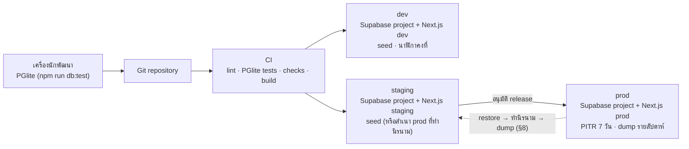
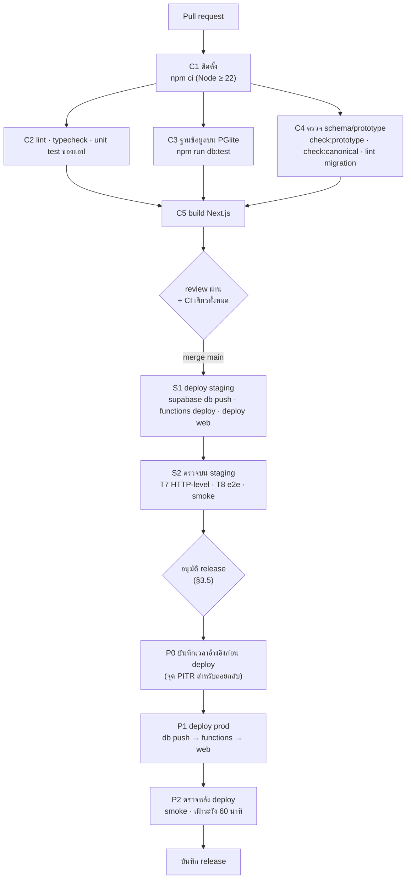
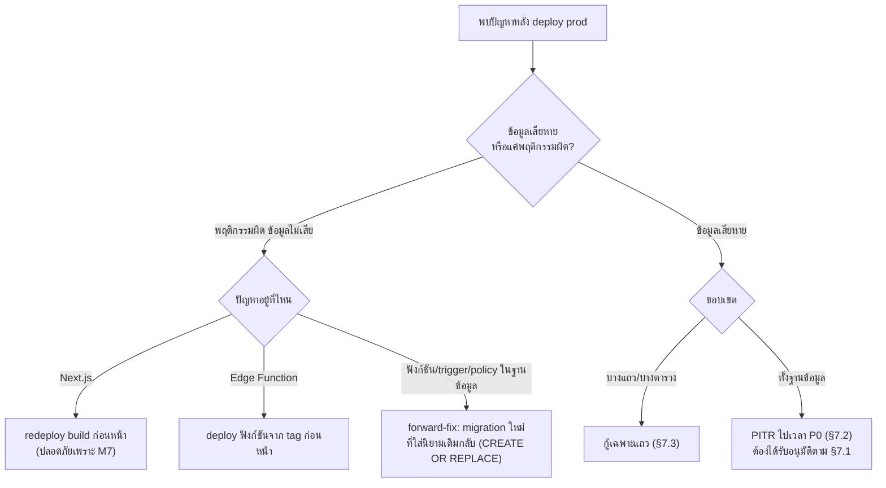
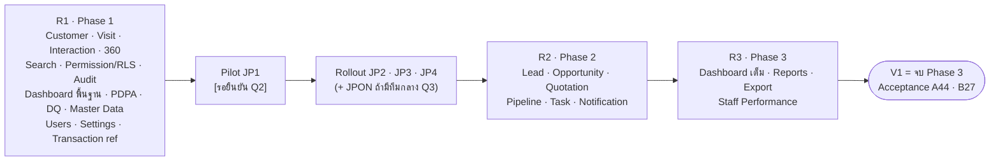
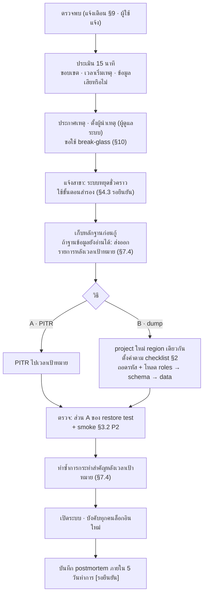
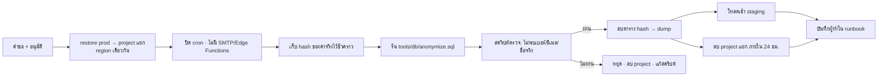

# Deployment · Backup · Recovery Plan — JAUN CRM · Customer 360

> **ฉบับ Phase 0 · 16 ก.ย. 2569** · ครอบคลุมเอกสารชุดที่ **19 Deployment Plan** และ **20 Backup / Recovery Plan** ของ A45
> อ้างอิงค่าจาก `docs/00-brief/CANONICAL.md` **v2.2** (อ้างเป็น "CANONICAL ข้อ …") โดยเฉพาะข้อ 1 · 7.2 · 9.2 · 9.6 · 9.7 · 9.8 · 10.3 · 11.2 · 14.5 · 19 และบรีฟ A35 · A36 · A43 · B20 · B24 · B26 · ชื่อ object ในฐานข้อมูลตาม `supabase/migrations/0001–0009`
> ค่าที่ CANONICAL ไม่มีเขียนว่า **"รอยืนยัน"** · ข้อตีความของผู้เขียนติดป้าย **"หมายเหตุผู้เขียน"** และสรุปไว้ใน §12 · **การอ้างหัวข้อภายในเอกสารนี้ใช้ § (เช่น §7.2) · "ข้อ N" ที่ไม่มีชื่อเอกสารกำกับหมายถึง CANONICAL**
> เอกสารคู่กัน: `docs/02-architecture/system-architecture.md` (ชิ้นส่วนระบบ · ADR) · `docs/08-delivery/roadmap.md` · `docs/08-delivery/data-migration-plan.md` · `docs/08-delivery/test-cases-uat.md` · `docs/04-security/security-design.md`

---

## 0. ขอบเขตและผู้รับผิดชอบ

### 0.1 สิ่งที่เอกสารนี้ตรึง

| หัวข้อ | ค่าจาก CANONICAL ข้อ 9.7 (ทั้งตาราง **[รอยืนยัน]**) |
|---|---|
| Environment | `dev` · `staging` · `prod` = Supabase project แยก 3 project · secret แยก · `app.settings['env']` บังคับตรง |
| ข้อมูลใน dev/staging | seed สังเคราะห์ (`supabase/seed.sql`) เท่านั้น หรือสำเนา prod ที่ผ่านขั้นตอนทำนิรนาม (§8) |
| Backup | Supabase daily backup + **PITR 7 วัน** (prod) · logical dump รายสัปดาห์ **เข้ารหัสฝั่งต้นทาง** (age/GPG) · กุญแจถือโดยคนที่ไม่ใช่ผู้ดูแล storage · storage เปิด versioning/object lock เก็บ **90 วัน** · ทบทวนรายชื่อผู้เข้าถึงทุกไตรมาส |
| Restore test | ทุกเดือน restore ไป project ทดสอบ: **(A)** ตรวจความครบของข้อมูลจริง (จำนวนแถว · เลขอ้างอิงสูงสุดก่อนเวลา T · invariant) **(B)** ล้างข้อมูลแล้วโหลด `seed.sql` รัน `acceptance.sql` + `rls_*.sql` ต้องผ่าน · ลบ project ภายใน 24 ชม. · บันทึกผล (§6) |
| เป้าหมาย | **RPO ≤ 5 นาที · RTO ≤ 4 ชม.** |
| Monitoring | แจ้งเมื่อ backup ล้มเหลว · พื้นที่ DB > 80% · error rate RPC > 2% |
| สิทธิ์ Owner/Admin ของ Supabase organization (prod) | บุคคลที่ระบุชื่อ ≤ 2 คน ใช้แบบ break-glass มีบันทึกเหตุผล **[รอยืนยัน Q25]** |

### 0.2 บทบาทในงานปฏิบัติการ (ชื่อบุคคลทั้งหมด **รอยืนยัน**)

| บทบาทปฏิบัติการ | ใคร (ตามโครงสร้าง CANONICAL) | หน้าที่ในเอกสารนี้ |
|---|---|---|
| ผู้ดูแลระบบ (IT) | ผู้ถือบทบาท `SYSTEM_ADMIN` ในแอป | ตั้งค่าเชิงเทคนิค (`settings.system`) · เฝ้าระวัง · ทำ restore test · นำ incident ด้านเทคนิค · **ไม่มีสิทธิ์ข้อมูลลูกค้าในแอป** (ข้อ 7.1) |
| ผู้ถือ Owner/Admin ของ Supabase org (prod) | ≤ 2 คนที่ระบุชื่อ (Q25) | ใช้แบบ break-glass เท่านั้น (§10) · ตั้ง secret ของ prod · เปิด PITR |
| ผู้ดูแลข้อมูลธุรกิจ | ผู้ถือบทบาท `BUSINESS_ADMIN` | ตั้งค่าเกณฑ์ธุรกิจ (`settings.business`) · รับแจ้งเตือนความปลอดภัยเชิงธุรกิจ · ตรวจผลกู้คืนเชิงข้อมูล · ยืนยันตัวตนพนักงานกับ HR |
| ผู้บริหารผู้อนุมัติ | ผู้ถือบทบาท `EXECUTIVE` | อนุมัติ go-live · อนุมัติการใช้ break-glass (ข้อเสนอ §10) · อนุมัติคำขอบทบาทสูง |
| ผู้ถือกุญแจถอดรหัส dump | บุคคลที่ **ไม่ใช่** ผู้ดูแล storage ของ dump (ข้อ 9.7) | เก็บ private key · ร่วมถอดรหัสเมื่อ restore จาก dump |
| DPO / ที่ปรึกษากฎหมาย | รอยืนยัน (Q8) | อนุมัติสำเนา prod ที่ทำนิรนาม · ประเมินเหตุละเมิดข้อมูล · ประเมินผู้ประมวลผลข้อ 1.4 |
| ทีมพัฒนา | – | เขียน migration/โค้ด · ไม่มีสิทธิ์เข้าถึง prod โดยค่าเริ่มต้น |

> ข้อห้ามร่วม: ห้ามให้ SYSTEM_ADMIN ถือบทบาทธุรกิจร่วมในบัญชีเดียว (ข้อ 7.1) · ผู้ถือกุญแจ dump ≠ ผู้ดูแล storage ของ dump (ข้อ 9.7)

---

## 1. Environments



| หัวข้อ | local | dev | staging | prod |
|---|---|---|---|---|
| ฐานข้อมูล | PGlite 0.4.1 (PG 17.5) ในหน่วยความจำ | Supabase project แยก | Supabase project แยก | Supabase project แยก |
| region | – | `ap-southeast-1` **[รอยืนยัน · ข้อ 1.4]** | `ap-southeast-1` | `ap-southeast-1` |
| `app.settings['env']` | `dev` (seed) | `"dev"` | `"staging"` | `"prod"` |
| `app.settings['clock']` | `{"as_of":"2026-09-11T10:24:00+07:00"}` | ค่าเดียวกับ seed | ค่าเดียวกับ seed เมื่อโหลด seed · `{"as_of": null}` เมื่อทดสอบเวลาจริง | `{"as_of": null}` **บังคับ** |
| ข้อมูล | seed | seed เท่านั้น | seed หรือสำเนา prod ที่ผ่าน §8 | ข้อมูลจริง (นำเข้าตาม data-migration-plan) |
| อีเมลผู้ใช้ | `@example.com` | `@example.com` | `@example.com` (สำเนา prod ถูกแปลงแล้ว) | อีเมลจริงของพนักงาน |
| ผู้ใช้ | – | ทีมพัฒนา | ทีมพัฒนา · ผู้ทดสอบ UAT | พนักงาน JAUN |
| PITR | – | ไม่ต้อง | ไม่ต้อง | **เปิด 7 วัน** |
| logical dump รายสัปดาห์ | – | ไม่ต้อง | ไม่ต้อง | **ต้อง** |
| Edge Functions | – | ครบตามข้อ 9.8 (ยกเว้น `integration-*` จนถึง Phase 4) | ครบ | ครบ |
| งานตามเวลา | – (PGlite ข้าม `*_cron.sql`) | เปิด `pg_cron` (ให้ `*_cron.sql` รันได้เหมือนกันทุก project · 5 job ตามข้อ 9.6 รันเป็น `postgres`) | เปิด | เปิด |
| bucket Storage | – | `exports` (private · ไม่มี storage policy ให้ `authenticated`) | `exports` | `exports` |
| อีเมลออก | – | ส่งไปกล่องทดสอบเท่านั้น (ผู้ให้บริการ **รอยืนยัน**) | ส่งไปกล่องทดสอบเท่านั้น | ผู้ส่งอีเมลจริง (ข้อ 1.4 รอยืนยัน) |
| Next.js hosting | `next dev` | project/สภาพแวดล้อมแยก (ผู้ให้บริการ **รอยืนยัน**) | แยก | แยก |
| URL | localhost | รอยืนยัน | รอยืนยัน | รอยืนยัน |

กติกาของ environment:

1. **ห้ามนำข้อมูล prod ไปใส่ dev/staging ตรง ๆ** (A35 · B20) · ทางเดียวคือ §8
2. secret ของแต่ละ environment แยกกันทั้งหมด (anon/publishable key · service_role · connection string ฐานข้อมูล (เฉพาะ CI และ runner ของ dump · **ไม่อยู่ใน Edge Functions และ Next.js** · ข้อ 9.8) · SMTP · VAPID · secret ของ integration) · ห้ามใช้ key ของ prod ใน preview deployment
3. preview deployment ของ Next.js ชี้ไป dev หรือ staging เท่านั้น
4. `app.settings['env']` ต้องตรงกับ project · prod ที่มี `env <> 'prod'` หรือ `clock.as_of` ไม่เป็น null คือเหตุวิกฤต (§9 AL-07)
5. แพ็กเกจ Supabase ผูกกับ organization · ถ้า prod ใช้ **Team plan** (Password Verification Attempt hook · ข้อ 9.2) staging ต้องอยู่บนแพ็กเกจที่มีฟีเจอร์เดียวกันเพื่อทดสอบ hook ได้ · การแยก organization ของ prod ออกจาก dev/staging เพื่อจำกัดผู้เข้าถึง prod **รอยืนยัน Q6 · Q25**

---

## 2. Checklist การตั้งค่าต่อ environment

สัญลักษณ์: ✓ = ต้องตั้งตามค่า · – = ไม่ใช้ · ค่าในวงเล็บเหลี่ยม = รอยืนยัน · "ตรวจ" = วิธีพิสูจน์หลังตั้ง (ผลบันทึกใน go-live checklist §11)

### 2.1 Supabase Auth (CANONICAL ข้อ 9.2)

| # | การตั้งค่า | ค่า | dev | stg | prod | แพ็กเกจ | ตรวจ |
|---|---|---|:--:|:--:|:--:|---|---|
| A1 | Allow new users to sign up | **off** (CLI `[auth] enable_signup = false`) | ✓ | ✓ | ✓ | ทุกแพ็กเกจ | เรียก `/auth/v1/signup` ต้องถูกปฏิเสธ |
| A2 | Anonymous sign-ins · Phone auth | off | ✓ | ✓ | ✓ | – | เปิดหน้า Auth providers |
| A3 | Before User Created hook | เปิด → ฟังก์ชันใน `app` ที่อนุญาตเฉพาะอีเมลที่มีแถว `core.staff_invitations` | ✓ | ✓ | ✓ | ตรวจแพ็กเกจ ณ วันตั้งค่า | สร้างผู้ใช้ด้วยอีเมลที่ไม่ได้เชิญ (รวม SSO) ต้องล้มเหลว |
| A4 | Custom Access Token hook | เปิด · ตรวจ `hd` ∈ `allowed_sso_domains` · SSO เฉพาะบัญชี `ACTIVE` · **ไม่เพิ่ม claim บทบาท** | ✓ | ✓ | ✓ | ทุกแพ็กเกจ | decode JWT ต้องไม่มีบทบาท/สิทธิ์ |
| A5 | Password Verification Attempt hook | เปิดเมื่อใช้ **Team plan** · Pro plan: ปิดและนับใน Server Action/`staff-code-login` (best-effort) · ต่อ IP ตาม `app.settings['security.login_ip_per_15min']` (20) · ถูกล็อกเกิน 3 ครั้ง/วัน → `LOCKOUT_REPEATED` | [Q6] | [Q6] | [Q6] | Team | กรอกรหัสผิดเกินเกณฑ์ต้องถูกหน่วง/ล็อก · ล็อกซ้ำครั้งที่ 4 ของวันต้องมีแจ้งเตือนถึง BUSINESS_ADMIN |
| A6 | Minimum password length | **12** | ✓ | ✓ | ✓ | – | ตั้งรหัส 11 ตัวต้องล้มเหลว |
| A7 | Leaked password protection | **on** | ✓ | ✓ | ✓ | Pro+ (ตรวจ ณ วันตั้งค่า) | ตั้งรหัสที่รั่วแล้วต้องล้มเหลว |
| A8 | Secure password change | **on** | ✓ | ✓ | ✓ | – | เปลี่ยนรหัสต้องยืนยันตัวตนซ้ำ |
| A9 | MFA TOTP | enabled (enroll + verify) · แอปเรียก enroll/challenge/verify ผ่าน Server Action เท่านั้น (cookie HttpOnly · ข้อ 19.4) | ✓ | ✓ | ✓ | – | บัญชี SUPERVISOR ที่ aal1 ได้ผลตามข้อ 13.13 "ปฏิเสธ" · ลงทะเบียน TOTP แล้วมีแถว audit `MFA_ENROLLED` (trigger บน `auth.mfa_factors`) |
| A10 | JWT expiry (access token) | **900 วินาที** (15 นาที) | ✓ | ✓ | ✓ | – | `exp − iat = 900` |
| A11 | Refresh token rotation · reuse interval | on · **10 วินาที** | ✓ | ✓ | ✓ | – | ใช้ refresh token เก่าหลัง 10 วินาทีต้องล้มเหลว |
| A12 | Session inactivity timeout · time-box | **2 ชม.** · **12 ชม.** | ✓ | ✓ | ✓ | Pro+ | session ที่ไม่ใช้ 2 ชม. refresh ไม่ได้ |
| A13 | อายุลิงก์อีเมล (Email OTP expiration · ค่าเดียวทุกประเภทลิงก์) | **3600 วินาที** (ข้อ 9.2) · คำเชิญมีอายุ **24 ชม.** ตาม `core.staff_profiles.invite_expires_at` โดย `invite-staff` ออกลิงก์ใหม่ได้ภายในกรอบนี้ · คำเชิญหมดอายุ = เชิญใหม่ (ข้อ 19.3) | ✓ | ✓ | ✓ | – | ลิงก์อายุเกิน 3600 วินาทีใช้ไม่ได้ · ออกลิงก์ใหม่ภายใน 24 ชม. ได้ · หลัง `invite_expires_at` `api.activate_self()` ปฏิเสธ |
| A14 | Site URL · Redirect URLs allowlist | URL ของแอปใน environment นั้นเท่านั้น (รวม `/auth/confirm`) [URL รอยืนยัน] | ✓ | ✓ | ✓ | – | redirect ไปโดเมนอื่นต้องถูกปฏิเสธ |
| A15 | Custom SMTP | ผู้ส่งอีเมลตามข้อ 1.4 [รอยืนยัน] · dev/staging ส่งกล่องทดสอบ | ✓ | ✓ | ✓ | – | ส่งคำเชิญทดสอบ |
| A16 | Email templates (ไทย) | คำเชิญ · รีเซ็ตรหัส · เปลี่ยนอีเมล · reauthentication · **ห้ามมีข้อมูลลูกค้า** (ข้อ 1.4) · ไม่ใช้ magic link | ✓ | ✓ | ✓ | – | อ่านเทมเพลตทุกฉบับ |
| A17 | SSO Google | เปิดเมื่อองค์กรใช้ Workspace · `app.settings['allowed_sso_domains']` = โดเมนบริษัท [Q5] | [Q5] | [Q5] | [Q5] | – | บัญชีโดเมนอื่นต้องล้มเหลว |
| A18 | SSO Microsoft | Azure **single-tenant** ขององค์กร [Q5] | [Q5] | [Q5] | [Q5] | – | บัญชี tenant อื่นต้องล้มเหลว |
| A19 | ไม่มี Workspace/M365 | ซ่อนปุ่ม SSO (ข้อ 9.2.1) | [Q5] | [Q5] | [Q5] | – | – |
| A20 | Auth rate limits (อีเมล/OTP/token) | [รอยืนยัน] · ต้องไม่ต่ำจนคำเชิญช่วงเปิดสาขาถูกบล็อก | ✓ | ✓ | ✓ | – | – |

### 2.2 Data API (PostgREST)

| # | การตั้งค่า | ค่า | dev | stg | prod | ตรวจ |
|---|---|---|:--:|:--:|:--:|---|
| D1 | Exposed schemas | **`api, crm, core, ref`** เท่านั้น (ไม่รวม `public`) | ✓ | ✓ | ✓ | เรียก `Accept-Profile: app`/`audit`/`analytics` ต้องได้ข้อผิดพลาด schema |
| D2 | Max rows | **200** [รอยืนยัน] | ✓ | ✓ | ✓ | `GET …?limit=500` คืน ≤ 200 แถว |
| D3 | GRANT ของ `anon` | ไม่มีใน schema ของระบบ (ข้อ 1.1) | ✓ | ✓ | ✓ | test T4 + เรียกด้วย anon key ต้องได้ 401/403 |
| D4 | GraphQL (`pg_graphql`) | **ข้อเสนอผู้เขียน:** ปิด/ไม่เปิดใช้ เพราะไม่ใช้งานและเป็นช่องทางเข้าที่สอง | ✓ | ✓ | ✓ | `/graphql/v1` ไม่ตอบข้อมูล |

### 2.3 Database

| # | การตั้งค่า | ค่า | dev | stg | prod | ตรวจ |
|---|---|---|:--:|:--:|:--:|---|
| B1 | PostgreSQL major version | **17** | ✓ | ✓ | ✓ | `SELECT current_setting('server_version_num')` ขึ้นต้น 17 |
| B2 | Extensions | `pg_trgm` `WITH SCHEMA extensions` · `pg_cron` + `pg_net` [รอยืนยัน ADR-12 · ข้อ 1] · ไม่ใช้ `citext` `pgcrypto` | ✓ | ✓ | ✓ | `SELECT extname, extnamespace::regnamespace FROM pg_extension` |
| B3 | `app.settings` | ครบทุกคีย์ของข้อ 11.2 ตามตาราง §2.3.1 · ค่าธุรกิจตามที่ BA ยืนยัน | ✓ | ✓ | ✓ | query §2.3.1 |
| B4 | role `audit_retention` | มีจาก migration · ใช้เฉพาะงาน retention | ✓ | ✓ | ✓ | `pg_roles` |
| B5 | owner ของ object | `postgres` ทั้งหมด (ข้อ 1.1) | ✓ | ✓ | ✓ | test T4 |
| B6 | SSL enforcement | on | ✓ | ✓ | ✓ | เชื่อมต่อแบบไม่ใช้ SSL ต้องล้มเหลว |
| B7 | Network restrictions (direct DB) | **ข้อเสนอผู้เขียน:** อนุญาตเฉพาะ IP ของ CI runner และเครื่องทำ dump · Edge Functions **ไม่ต่อฐานข้อมูลตรง** (เรียก `api.svc_*` ผ่าน PostgREST · ข้อ 9.8) จึงไม่ต้องอยู่ในรายการ | – | ✓ | ✓ | เชื่อมจาก IP อื่นต้องล้มเหลว |
| B8 | รหัสผ่าน `postgres` | สุ่มยาว · เก็บใน secret manager ของ CI และ runner ของ dump ต่อ environment เท่านั้น · หมุนเมื่อมีผู้ถือออกจากทีม | ✓ | ✓ | ✓ | – |
| B9 | Compute size | [รอยืนยัน Q6] · ประเมินจาก system-architecture §10 | ✓ | ✓ | ✓ | – |
| B10 | Daily backup | ตามแพ็กเกจ | – | – | ✓ | หน้า Backups แสดงรายการล่าสุด |
| B11 | PITR | **7 วัน** | – | – | ✓ | หน้า Backups แสดง PITR เปิด |
| B12 | pg_cron jobs | 5 job ตามข้อ 9.6: `job_close_stale_visits` `5 17 * * *` · `job_expire_quotations` `10 17 * * *` · `job_retention` `0 19 * * *` · `job_expire_exports` `15 * * * *` · `job_notifications` `*/5 * * * *` · รันในฐานะ `postgres` · สร้างจาก `*_cron.sql` เท่านั้น | ✓ | ✓ | ✓ | `SELECT jobname, schedule, command, username, active FROM cron.job` ตรงรายการ · `username = 'postgres'` |
| B13 | GRANT ของ `api.svc_*` | EXECUTE เฉพาะ `service_role` · ไม่มีให้ `authenticated`/`anon`/PUBLIC | ✓ | ✓ | ✓ | `SELECT p.proname, coalesce(r.rolname, 'PUBLIC') AS grantee FROM pg_proc p JOIN pg_namespace n ON n.oid = p.pronamespace CROSS JOIN LATERAL aclexplode(p.proacl) a LEFT JOIN pg_roles r ON r.oid = a.grantee WHERE n.nspname = 'api' AND p.proname LIKE 'svc\_%' AND a.privilege_type = 'EXECUTE'` คืนเฉพาะ `service_role` และ `postgres` · ฟังก์ชัน `svc_*` ที่ `proacl IS NULL` (สิทธิ์ค่าเริ่มต้น = PUBLIC) ถือว่าไม่ผ่าน |
| B14 | ตารางเวลา/ตัวเรียก `cron-export-cleanup` | **[รอยืนยัน ข้อ 9.6]** · ถ้าใช้ pg_cron + pg_net ต้องเก็บ secret ของตัวเรียกให้ Edge Function ตรวจ (ที่เก็บ รอยืนยัน) | ✓ | ✓ | ✓ | ไฟล์ `EXPIRED` ถูกลบภายในรอบถัดไป |

#### 2.3.1 ค่าตั้ง `app.settings` ต่อ environment (CANONICAL ข้อ 11.2 · ทั้งหมด **[รอยืนยันค่า]**)

ค่าเริ่มต้นใส่โดย migration (`0001_foundation.sql` ใส่ `env = "dev"`) · project ใหม่ตั้ง `env` ให้ตรง environment ในสคริปต์ bootstrap (§4.2 ขั้น 1 · ผ่าน review ตาม M10) · หลังจากนั้นแก้ด้วย `api.update_setting` ตาม `editable_by` เท่านั้น (ไม่แก้ด้วย SQL editor) · ตรวจทุกแถวด้วย `SELECT key, value, editable_by FROM app.settings ORDER BY key`

| key | ค่าเริ่มต้น | `editable_by` | dev | staging | prod | ตรวจ |
|---|---|---|---|---|---|---|
| `env` | `"dev"` (migration) | `settings.system` | `"dev"` | `"staging"` | `"prod"` | ตรงกับ project (AL-07) |
| `clock` | `{"as_of": null}` | `settings.system` | ค่า seed `"2026-09-11T10:24:00+07:00"` | seed หรือ null | **null บังคับ** | `app.clock()` บน prod = `now()` |
| `allowed_sso_domains` | `[]` | `settings.system` | ตามทดสอบ | ตามทดสอบ | โดเมนบริษัท [Q5] | `[]` = ซ่อนปุ่ม SSO |
| `business_hours` | `{"default":["10:00","21:00"]}` | `settings.business` | ค่าเริ่มต้น | ค่าเริ่มต้น | ตามสาขา [Q4] (คีย์รหัสสาขาทับ `default`) | – |
| `sla.followup_remind_min` · `sla.lead_unassigned_min` · `sla.lead_not_contacted_min` · `sla.visitor_waiting_min` · `sla.visit_in_service_min` | 15 · 15 · 30 · 15 · 60 | `settings.business` | ค่าเริ่มต้น | ค่าเริ่มต้น | ตาม BA [Q12] | – |
| `sla.opportunity_stale_days` · `escalation.overdue_hours` | `[7,14]` · `[24,48]` | `settings.business` | ค่าเริ่มต้น | ค่าเริ่มต้น | ตาม BA | – |
| `dq.lead_without_outcome_days` · `dq.won_without_txn_days` · `dq.visit_unrecorded_days` | 14 · 3 · 7 | `settings.business` | ค่าเริ่มต้น | ค่าเริ่มต้น | ตาม BA | – |
| `badge.new_customer_days` · `quotation.valid_days` | 30 · 7 | `settings.business` | ค่าเริ่มต้น | ค่าเริ่มต้น | ตาม BA | – |
| `notify.duplicate_digest_time` · `notify.data_missing_time` | `"18:00"` · `"09:00"` | `settings.business` | ค่าเริ่มต้น | ค่าเริ่มต้น | ตาม BA | – |
| `export.limits` · `export.link_ttl_hours` · `export.max_downloads` | ตามข้อ 8.2 (`{ROLE: {max_rows, per_day, approver_role}}` · ข้อ 19.1) · 24 · 3 | `settings.business` | ค่าเริ่มต้น | ค่าเริ่มต้น | ตาม BA [Q7 · Q23] | – |
| `security.reveal_per_hour` · `security.search_per_hour` · `security.search_miss_per_hour` · `security.link_per_day` · `security.customer_view_per_hour` | 30 · 60 · 20 · 10 · 100 | `settings.business` | ค่าเริ่มต้น | ค่าเริ่มต้น | ตาม BA | – |
| `session.shared_counter_idle_min` | 10 | `settings.business` | ค่าเริ่มต้น | ค่าเริ่มต้น | ตาม BA | – |
| **`pdpa.current_notice_version`** (ใหม่ v2.2) | `"PN-2026-01"` | `settings.business` | ค่าเริ่มต้น | ค่าเริ่มต้น | ฉบับที่ DPO อนุมัติ [Q9] | ตรงกับเลขในลิงก์ประกาศที่ใช้กับ `LINK_SENT` |
| **`security.login_ip_per_15min`** (ใหม่ v2.2) | 20 | `settings.business` | ค่าเริ่มต้น | ค่าเริ่มต้น | ตาม BA | ล็อกอินผิดจาก IP เดียวเกินค่าต้องถูกหน่วง (A5) |
| **`dsr.anonymize_per_day`** (ใหม่ v2.2) | 20 | `settings.business` | ค่าเริ่มต้น | ค่าเริ่มต้น | ตาม BA [Q8] | `api.anonymize_customer` ครั้งที่ 21 ของวันต่อผู้ใช้ถูกปฏิเสธ |

- สามคีย์ที่เพิ่มใน v2.2 ยังไม่อยู่ใน `INSERT INTO app.settings` ของ `0001_foundation.sql` → ต้องเพิ่มใน migration ถัดไปก่อน deploy staging (C3/C4 ต้องตรวจว่ามีครบทุกคีย์ของข้อ 11.2)

### 2.4 Storage

| # | การตั้งค่า | ค่า | dev | stg | prod |
|---|---|---|:--:|:--:|:--:|
| S1 | bucket ไฟล์ export | **`exports`** · private · ไม่มี bucket public (ข้อ 9.8) · ตรวจ: `SELECT id, public FROM storage.buckets` มี `exports` แถวเดียว `public = false` | ✓ | ✓ | ✓ |
| S2 | policy ของ `storage.objects` | **ไม่มี policy ใดให้ `authenticated`/`anon` สำหรับ bucket `exports`** (ข้อ 9.8) · เขียนและออก signed URL โดย `generate-export` · ลบโดย `cron-export-cleanup` (service_role ทั้งคู่) · ตรวจ: `SELECT policyname, roles, qual FROM pg_policies WHERE schemaname = 'storage' AND tablename = 'objects'` ไม่มีแถวที่อ้าง `exports` · เรียก Storage API ด้วย JWT ผู้ใช้ (list · download · createSignedUrl) ต้องล้มเหลว | ✓ | ✓ | ✓ |
| S3 | signed URL | อายุ **60 วินาที** · ออกหลัง `api.record_export_download` สำเร็จด้วย JWT ของผู้ขอเท่านั้น · ตรวจ: URL ใช้ไม่ได้หลัง 60 วินาที · `download_count` เพิ่มทุกครั้งที่ออก URL · ครั้งที่ 4 ถูกปฏิเสธ | ✓ | ✓ | ✓ |
| S4 | ขนาดไฟล์สูงสุด · MIME ที่อนุญาต | [รอยืนยัน] · ต้องรองรับ 5,000 แถว (ข้อ 8.2) และแพ็กเกจ DSR JSON/CSV (ข้อ 10.4) | ✓ | ✓ | ✓ |
| S5 | อายุไฟล์ | ไฟล์ export และแพ็กเกจ DSR ≤ 24 ชม. · ไม่แนบอีเมล (ข้อ 19.4) · ตรวจ: ไม่มี object ใน `exports` อายุเกิน 24 ชม. (เผื่อหนึ่งรอบของ `cron-export-cleanup`) · AL-08 | ✓ | ✓ | ✓ |

### 2.5 Edge Functions และ secret

ทุกฟังก์ชันแตะฐานข้อมูลผ่าน PostgREST เท่านั้น: RPC ตรวจสิทธิ์ด้วย JWT ผู้เรียก และ `api.svc_*` ด้วย service_role · **ไม่มี connection string ฐานข้อมูลใน secret ของ Edge Function** (ข้อ 9.8 · system-architecture §3.5)

| ฟังก์ชัน | verify JWT ที่ gateway | RPC ที่เรียก | secret ที่ต้องมี | dev | stg | prod |
|---|:--:|---|---|:--:|:--:|:--:|
| `invite-staff` | ✓ | `api.can_assign_role` (JWT ผู้เรียก) · `api.svc_prepare_invite` | service_role (อัตโนมัติ) | ✓ | ✓ | ✓ |
| `disable-staff` | ✓ | `api.disable_staff` (JWT ผู้เรียก) · `api.svc_finalize_disable` | service_role | ✓ | ✓ | ✓ |
| `reset-mfa` | ✓ (ต้อง `aal2`) | `api.svc_reset_mfa_authorize` | service_role · (SMTP ถ้าฟังก์ชันส่งอีเมลแจ้งอีเมลเดิมเอง) | ✓ | ✓ | ✓ |
| `staff-code-login` | ✗ (ยังไม่ล็อกอิน) · จำกัดต่อ IP `security.login_ip_per_15min` (20) | `api.svc_resolve_staff_code` | service_role | ✓ | ✓ | ✓ |
| `password-reset` | ✗ (ยังไม่ล็อกอิน) · ตอบข้อความเดียวกันเสมอ | `api.svc_resolve_staff_code` | service_role | ✓ | ✓ | ✓ |
| `generate-export` | ✓ | สร้างไฟล์: `api.svc_build_export_dataset` · `api.svc_mark_export_generated` · ดาวน์โหลด: `api.record_export_download` (JWT ผู้ขอ) แล้วออก signed URL 60 วินาที | service_role | ✓ | ✓ | ✓ (Phase 3) |
| `cron-export-cleanup` | ✗ · ตรวจ secret ของตัวเรียก [รอยืนยัน B14] | `api.svc_expired_export_files` | service_role (ลบไฟล์ใน `exports`) · secret ของตัวเรียก | ✓ | ✓ | ✓ |
| `integration-*` | ✗ · ตรวจลายเซ็นผู้ส่ง | `api.svc_*` ของ Phase 4 (ชื่อรอยืนยัน) | secret ของแต่ละระบบ | Phase 4 | Phase 4 | Phase 4 |

- ตั้ง secret ด้วย `supabase secrets set --project-ref <ref>` โดยผู้ถือสิทธิ์ของ environment นั้น · ห้ามพิมพ์ค่า secret ใน log ของ CI
- service_role key **ห้ามอยู่ใน env ของ Next.js** และมนุษย์ไม่ถือ (ข้อ 9.8) · connection string ฐานข้อมูลอยู่เฉพาะใน secret manager ของ CI (migration) และ runner ของ dump (B8) · ผู้ถือ Owner เห็นค่าได้ใน Dashboard จึงต้องหมุนเมื่อมีการใช้ break-glass ที่เปิดดูค่า (§10)
- `app.job_*` ไม่ถูกเรียกผ่าน Edge Function · รันด้วย pg_cron ในฐานะ `postgres` (B12)

### 2.6 Next.js hosting

| # | การตั้งค่า | ค่า | dev | stg | prod |
|---|---|---|:--:|:--:|:--:|
| H1 | env ที่อนุญาต | `NEXT_PUBLIC_SUPABASE_URL` · `NEXT_PUBLIC_SUPABASE_ANON_KEY` (publishable key) · ชื่อ environment | ✓ | ✓ | ✓ |
| H2 | env ที่ห้าม | service_role key · connection string ฐานข้อมูล · secret ของ Edge Functions | ✓ | ✓ | ✓ |
| H3 | Security headers | CSP แบบ strict (nonce) · `Cache-Control: no-store` บน route ที่ต้องล็อกอินและ response ข้อมูลลูกค้า · HSTS · `X-Content-Type-Options: nosniff` · `Referrer-Policy` | ✓ | ✓ | ✓ |
| H4 | Cookie | HttpOnly · Secure · SameSite=Lax · ทุกการเรียก Supabase ที่ใช้เซสชัน (รวม MFA enroll/challenge/verify และ `functions.invoke`) อยู่ฝั่ง server (ข้อ 19.4) · ตรวจ: bundle ฝั่ง client ไม่สร้าง Supabase client ที่ถือเซสชัน | ✓ | ✓ | ✓ |
| H5 | Service worker | ไม่ cache route ที่ต้องล็อกอิน · ไม่แตะ `/rest/v1` `/rpc` `/auth` (ข้อ 9.2) · logout ล้าง storage ยกเว้น `device_id` และ `login_id` ที่ "จดจำ" | ✓ | ✓ | ✓ |
| H6 | โดเมน · TLS | [รอยืนยัน] · TLS อัตโนมัติของผู้ให้บริการ | ✓ | ✓ | ✓ |
| H7 | region ของ server runtime | ใกล้ `ap-southeast-1` [รอยืนยัน ข้อ 1.4] | ✓ | ✓ | ✓ |
| H8 | log ของ hosting | ไม่เก็บ body/ข้อมูลลูกค้า · ระยะเก็บ [รอยืนยัน] | ✓ | ✓ | ✓ |
| H9 | Web Push VAPID keys | แยกต่อ environment (Phase 2) | ✓ | ✓ | ✓ |

### 2.7 การเข้าถึงแพลตฟอร์ม

| # | การตั้งค่า | ค่า |
|---|---|---|
| P1 | สมาชิก Supabase organization ของ prod | Owner/Admin ≤ 2 คนที่ระบุชื่อ (Q25) · ทีมพัฒนาไม่มีสิทธิ์ prod โดยค่าเริ่มต้น |
| P2 | MFA ของบัญชี Supabase Dashboard และ hosting | บังคับทุกบัญชีที่เข้าถึง staging/prod |
| P3 | CI token (`SUPABASE_ACCESS_TOKEN`) | แยกต่อ environment ถ้าแพลตฟอร์มรองรับ · สิทธิ์ต่ำสุดที่ deploy ได้ · หมุนทุก [รอยืนยัน] |
| P4 | storage ของ logical dump | versioning + object lock 90 วัน · ผู้ดูแล storage ≠ ผู้ถือกุญแจ · ทบทวนรายชื่อผู้เข้าถึงทุกไตรมาส (ข้อ 9.7) |

---

## 3. CI/CD Pipeline

### 3.1 ภาพรวม



### 3.2 ขั้นตอนและคำสั่ง

| ขั้น | คำสั่ง/การกระทำ | ล้มเหลวเมื่อ | หมายเหตุ |
|---|---|---|---|
| C1 | `npm ci` | lockfile ไม่ตรง | `@electric-sql/pglite` 0.4.1 ตาม `package.json` |
| C2 | lint · typecheck · unit test ของแอป Next.js | มี error | เครื่องมือเลือกใน Phase 1 [รอยืนยัน] |
| C3 | `npm run db:test` (= `node tools/db/run.mjs --seed --test --quiet`) | migration/seed ล้มเหลว หรือไฟล์ทดสอบใดล้มเหลว (exit code 1) | รวม `rls_*.sql` และ `acceptance.sql` · PGlite ข้าม `*_cron.sql` |
| C4 | `npm run check:prototype` · `npm run check:canonical` · lint migration (§3.3) | พบค่าที่ไม่ตรง CANONICAL หรือผิดกติกา migration | lint ที่ต้องคืน 0 แถว: view ใน schema ของโครงการที่ไม่มี `security_invoker` (ข้อ 19.2) · MV ใน schema ที่เปิด API · ฟังก์ชัน DEFINER ที่ไม่ `SET search_path = ''` · GRANT ให้ `anon` · `api.svc_*` ที่มี EXECUTE ให้ role อื่นนอกจาก `service_role` (B13) · RPC หน้าจอใน `api` ที่ไม่มี GRANT ให้ `authenticated` (ข้อ 19.1) · คีย์ของข้อ 11.2 ที่ไม่มีใน `app.settings` (§2.3.1) |
| C5 | `next build` | build ล้มเหลว | ตรวจว่า bundle ฝั่ง client ไม่มีสตริงของ service_role (สแกนหา `service_role`) |
| S1 | `supabase link --project-ref <staging>` → `supabase db push --dry-run` → `supabase db push` → `supabase functions deploy <ชื่อ>` (ทีละฟังก์ชันตามข้อ 9.8 รวม `cron-export-cleanup`) → deploy Next.js staging | migration ล้มเหลวบน Postgres จริง | `supabase migration list` ต้องตรงกับไฟล์ใน repo · สร้าง type: `supabase gen types typescript --project-id <staging> --schema api,crm,core,ref` แล้วเทียบกับไฟล์ที่ commit |
| S2 | T7 · T8 ตาม system-architecture §12 · ตรวจ checklist §2 ที่เกี่ยวกับการเปลี่ยนแปลงนี้ | test ใดล้มเหลว | ถ้า staging โหลด seed ต้องได้ตัวเลขข้อ 13 |
| P0 | บันทึกเวลา (Asia/Bangkok และ UTC) ก่อนเริ่ม deploy ลงบันทึก release | – | ใช้เป็นเป้าหมาย PITR ถ้าต้องกู้ (§7) |
| P1 | ลำดับเดียวกับ S1 บน prod · **ฐานข้อมูลก่อน → Edge Functions → Next.js** | – | ลำดับนี้ปลอดภัยเพราะ migration เป็นแบบ expand (§3.3) |
| P2 | smoke: ล็อกอิน (อีเมล · `ST-NNNN` · MFA) · เปิดหน้า 02/03/05/07 ด้วยบัญชีทดสอบของ prod [รอยืนยันว่ามีบัญชีทดสอบใน prod หรือไม่] · เฝ้าแจ้งเตือน §9 เป็นเวลา 60 นาที | error rate RPC > 2% · 5xx ของ Edge Functions | ถ้าล้มเหลวเข้า §3.4 |

- ผู้ที่รัน S1/P1 ได้: pipeline ด้วย token ของ environment นั้น · การรันด้วยมือบน prod ถือเป็น break-glass (§10)
- CI ของ PR ห้ามมี secret ของ staging/prod

### 3.3 กติกาของ migration

| # | กติกา | เหตุผล |
|---|---|---|
| M1 | ไฟล์ `supabase/migrations/NNNN_name.sql` เรียงตามชื่อ · แต่ละไฟล์รันในทรานแซกชันของตัวเองบน PGlite | ตรง `tools/db/run.mjs` |
| M2 | **ห้ามแก้ไฟล์ที่ถูก apply แล้ว** บน staging/prod · แก้ด้วยไฟล์ใหม่เท่านั้น (forward-only) | ประวัติใน `supabase_migrations.schema_migrations` ต้องตรง repo |
| M3 | ลำดับตาม dependency: enum/ตาราง → view `analytics.*` → helper/RLS → trigger → RPC (ข้อ 14.6) | – |
| M4 | เพิ่มค่า ENUM = ไฟล์เดี่ยวที่มีแค่ `ALTER TYPE … ADD VALUE` (ข้อ 4) | ค่าใหม่ใช้ในทรานแซกชันเดียวกับที่เพิ่มไม่ได้ |
| M5 | ไวยากรณ์ PG 17 เท่านั้น และต้องรันบน PGlite ได้ ยกเว้นไฟล์ `*_cron.sql` | C3 ต้องเป็นตัวแทน prod |
| M6 | **`*_cron.sql`:** มีเฉพาะ `cron.schedule`/`cron.unschedule` · ตั้งชื่อ job เสมอและ unschedule ชื่อเดิมก่อน schedule ใหม่ (รันซ้ำได้) · ตารางเวลาตรึงตามข้อ 9.6 (UTC): `job_close_stale_visits` `5 17 * * *` · `job_expire_quotations` `10 17 * * *` · `job_retention` `0 19 * * *` · `job_expire_exports` `15 * * * *` · `job_notifications` `*/5 * * * *` · คำสั่ง `SELECT app.job_…(app.clock())` · apply โดย role `postgres` (job จึงรันในฐานะ `postgres`) · PGlite ข้าม · `supabase db push` apply ตามลำดับชื่อไฟล์เหมือนไฟล์อื่น · ต้องเปิด `pg_cron` ในทุก Supabase project มิฉะนั้นไฟล์นี้ล้มเหลว (N7) | ข้อ 9.6 |
| M7 | **expand/contract:** release เดียวทำได้แค่ "เพิ่ม" (ตาราง · คอลัมน์ nullable · ฟังก์ชันใหม่ · ค่า enum) · การลบ/เปลี่ยนชื่อ/บังคับ NOT NULL ทำใน release ถัดไปหลังแอปเลิกใช้ของเดิม | ทำให้ถอย Next.js กลับรุ่นก่อนได้โดยไม่ต้องถอยฐานข้อมูล |
| M8 | เปลี่ยนสัญญา RPC ใน `api` = สร้างเวอร์ชันพารามิเตอร์ใหม่ (overload หรือชื่อใหม่ตาม api-spec) ก่อน แล้วค่อยถอดของเดิม | Next.js รุ่นเก่ายังเรียกอยู่ระหว่าง deploy |
| M9 | migration ที่ล็อกตารางนาน (สร้างดัชนีบนตารางใหญ่ · backfill) รัน **นอกเวลาทำการ** (`business_hours` ค่าเริ่มต้น 10:00–21:00 [รอยืนยัน Q4]) · backfill เป็นชุดและตั้ง `app.bulk = on` | กันคิวหน้าร้านค้าง |
| M10 | การแก้ข้อมูลใน prod ทำเป็นไฟล์ migration/สคริปต์ที่ผ่าน review · **ห้ามแก้ผ่าน SQL editor** นอกขั้นตอน break-glass | audit และความสามารถตรวจย้อน |
| M11 | `core.role_permissions` เปลี่ยนผ่าน migration เท่านั้น (ข้อ 7.2) · PR ต้องแนบผลกระทบต่อตาราง 8.1 และผ่าน test ข้อ 13.13 | trigger บันทึก `PERMISSION_CHANGED` |
| M12 | seed (`supabase/seed.sql`) **ห้ามรันบน prod** · `supabase db push` ต้องไม่ใช้ตัวเลือกที่โหลด seed กับ prod | seed ตั้ง `clock.as_of` และมีข้อมูลสมมติ |
| M13 | BEFORE trigger บน `customers` `visits` `interactions` `leads` `opportunities` `quotations` `tasks` ใช้ชื่อตามลำดับข้อ 9.4.2: `trg_05_running_number` → `trg_10_enforce_transition` → `trg_20_guard_text` → `trg_90_stamp_row` · ชื่อใน `0009_business_triggers.sql` ปัจจุบันยังเป็นของ v2.1 ต้องเปลี่ยนก่อน apply ครั้งแรกบน staging (หลังจากนั้นเปลี่ยนได้ด้วย migration ใหม่เท่านั้น · M2) | PostgreSQL เรียง trigger ตามชื่อ |
| M14 | ฟังก์ชันใหม่ที่ `authenticated`/`service_role` ต้องเรียกตรง ต้อง GRANT EXECUTE เองทุกตัว เพราะ `0001_foundation.sql` ถอน EXECUTE ของ PUBLIC แบบทั้งฐาน · `api.svc_*` GRANT ให้ `service_role` เท่านั้น (ข้อ 19.1 · 9.6) | กันฟังก์ชันเปิดโดยไม่ตั้งใจ |

### 3.4 นโยบายถอยกลับ (rollback)



- **ไม่มี down migration** · การถอยฐานข้อมูลทำด้วย forward-fix เสมอ ยกเว้นข้อมูลเสียหายซึ่งใช้ขั้นตอน §7
- ถอย Next.js/Edge Functions ได้ภายในไม่กี่นาทีและทำได้โดยผู้ดูแลระบบ · PITR ของทั้งฐานข้อมูลทำให้ข้อมูลหลังเวลาเป้าหมายหาย จึงต้องผ่านการตัดสินใจตาม §7.1
- บันทึกทุกการถอยกลับในบันทึก release: เวลา · สาเหตุ · วิธี · ผู้ทำ

### 3.5 การอนุมัติ release และช่วงเวลา deploy

| ประเภท release | ผู้อนุมัติ (ข้อเสนอผู้เขียน · รอยืนยัน) | ช่วงเวลา deploy prod |
|---|---|---|
| แก้บั๊ก/ปรับหน้าจอ ไม่มี migration | ผู้ดูแลระบบ (IT) | เวลาใดก็ได้ที่มีผู้เฝ้าระวัง 60 นาที |
| มี migration แบบ expand | ผู้ดูแลระบบ (IT) + หัวหน้าทีมพัฒนา | นอกเวลาทำการ |
| เปลี่ยนสิทธิ์ (`role_permissions` · policy · helper) หรือกติกา PDPA | + BUSINESS_ADMIN · (DPO ถ้ากระทบข้อ 10) | นอกเวลาทำการ |
| เปิด Phase ใหม่ให้ผู้ใช้ | + EXECUTIVE | ตามแผน roadmap |

---

## 4. แผน Release และ Pilot

### 4.1 ลำดับ release (CANONICAL ข้อ 14.5)



- migration ของ Phase 0 สร้างทุกตาราง Phase 1–3 ครบตั้งแต่ R1 (ข้อ 14.6) · release ถัดไปจึงเป็นการ **เปิดหน้าจอ/ฟีเจอร์** เป็นหลัก ไม่ใช่สร้างตารางใหม่
- วันที่ของแต่ละ release **รอยืนยัน** (roadmap.md)

### 4.2 กลไก rollout ทีละสาขา

สาขาที่ "เปิดใช้" = สาขาที่มีพนักงานได้รับ assignment · RLS จำกัดข้อมูลตาม assignment อยู่แล้ว (ข้อ 8.0) จึง **ไม่ต้องมี feature flag รายสาขา**

| ขั้น | ทำอะไร | ผู้ทำ |
|---|---|---|
| 1 | **สคริปต์ bootstrap** (ข้อ 7.2) รันครั้งเดียวต่อ environment ตาม §3.3 M10: สร้าง (ก) บัญชี EXECUTIVE คนแรก (ข) บัญชี SYSTEM_ADMIN คนแรก (ค) บัญชี `INVITED` ของ BUSINESS_ADMIN คนแรก (ยังไม่มีบทบาท BA) · ตั้ง `app.settings['env']` ให้ตรง environment (§2.3.1) · ทุกขั้นบันทึก audit (actor ของสคริปต์ตาม N3) · EXECUTIVE และ SYSTEM_ADMIN ลงทะเบียน TOTP | ผู้ดูแลระบบ (IT) + EXECUTIVE |
| 2 | SYSTEM_ADMIN ยื่นคำขอ RG ชนิด `GRANT` บทบาท `BUSINESS_ADMIN` ให้บัญชี (ค) ด้วย `api.request_role_grant` → EXECUTIVE **ยืนยันตัวตนกับ HR แทน BA** (`identity_verified_by`) และอนุมัติด้วย `api.decide_role_grant` (aal2) → BA รับคำเชิญ ตั้งรหัส ลงทะเบียน TOTP แล้ว `api.activate_self()` (ข้อ 7.2 · 7.3) · คำเชิญของ (ค) อายุ 24 ชม. → ทำขั้นนี้ให้จบภายใน 24 ชม. หลัง bootstrap มิฉะนั้นรันส่วน (ค) ของสคริปต์ซ้ำ (**หมายเหตุผู้เขียน N10**) | SYSTEM_ADMIN · EXECUTIVE · BA |
| 3 | BUSINESS_ADMIN ยืนยัน master data (ข้อ 5 ที่ติด [รอยืนยัน]) และค่า `app.settings` ข้อ 11.2 ทุกคีย์ (§2.3.1 รวม `pdpa.current_notice_version`) | BUSINESS_ADMIN |
| 4 | BUSINESS_ADMIN เชิญ `BRANCH_MANAGER` ของสาขา pilot ผ่าน `invite-staff` · ผู้จัดการตั้ง MFA | BUSINESS_ADMIN · BM |
| 5 | BRANCH_MANAGER เชิญ STAFF/SUPERVISOR ของสาขา · ตั้งทีม (`api.save_team` · `api.set_team_member`) · ลงทะเบียนอุปกรณ์ counter ด้วย `api.register_device` (`core.devices`) | BM |
| 6 | อบรม (หน้า 04 05 07 · การเปิดเบอร์ · ประกาศความเป็นส่วนตัว) | ทีมโครงการ |
| 7 | เริ่มใช้งานจริง · hypercare (§4.3) | ทุกฝ่าย |

การนำเข้าข้อมูลลูกค้าเดิม (`created_via = 'IMPORT'`) และจังหวะนำเข้าเทียบกับ pilot อยู่ใน `data-migration-plan.md`

### 4.3 Pilot JP1

| หัวข้อ | รายละเอียด |
|---|---|
| สาขา | JP1 **[รอยืนยัน Q2]** |
| เงื่อนไขเริ่ม (entry) | go-live checklist §11 ครบ · UAT ของ Phase 1 ผ่านตามชุดคำถามที่ Phase 1 ตอบได้ (D26 · test-cases-uat.md) · restore test ครั้งแรกผ่านและบันทึกแล้ว · บัญชีบทบาทที่ `requires_mfa` ลงทะเบียน TOTP ครบ · ข้อความประกาศ `PN-2026-01` ได้รับอนุมัติ (Q9) และ `app.settings['pdpa.current_notice_version']` ตรงฉบับนั้น |
| ระยะเวลา | [รอยืนยัน] |
| สิ่งที่ติดตามทุกวัน | `CAPTURE_RATE` (เป้า ≥ 95%) · `OUTCOME_COMPLETION` (เป้า ≥ 95%) · `DUPLICATE_RATE` (< 2%) · `MISSING_REQUIRED_RATE` (< 2%) (ข้อ 12.3) · จำนวน `VISIT_UNRECORDED` · ข้อผิดพลาดที่ผู้ใช้แจ้ง · error rate RPC · เหตุการณ์ล็อกบัญชี |
| hypercare | ผู้ดูแลระบบและทีมพัฒนาตอบปัญหาในเวลาทำการของสาขา · ช่องทางแจ้งปัญหา [รอยืนยัน] |
| เงื่อนไขจบ (exit) · ข้อเสนอผู้เขียน | ไม่มีข้อบกพร่องระดับวิกฤตค้าง · ตอบคำถาม Acceptance ที่ Phase 1 รับผิดชอบได้จากฐานข้อมูลจริง · `CAPTURE_RATE` และ `OUTCOME_COMPLETION` ถึงเป้าข้อ 12.3 ต่อเนื่องตามระยะที่ตกลง [รอยืนยัน] · EXECUTIVE ลงนามให้ rollout |
| ถ้าไม่ผ่าน | ขยาย pilot · แก้ตามรายการ · ไม่เปิดสาขาอื่น |
| ขั้นตอนสำรองเมื่อระบบใช้ไม่ได้ระหว่างเวลาทำการ | **รอยืนยัน** — ต้องตกลงวิธีบันทึกย้อนหลัง เพราะ `api.open_visit` บันทึกเวลาปัจจุบันและ CANONICAL ไม่มีกติกาบันทึก visit ย้อนเวลา (หมายเหตุผู้เขียน N4) |

### 4.4 Rollout สาขาที่เหลือ

- ทำขั้น 4–7 ของ §4.2 ทีละสาขาหรือพร้อมกัน (ลำดับ [รอยืนยัน]) · ตรวจแจ้งเตือน §9 และตัวเลขคุณภาพข้อมูลรายสาขาใน 2 สัปดาห์แรกของแต่ละสาขา [ระยะรอยืนยัน]
- `JPON` เปิดเมื่อยืนยันว่ามีทีมออนไลน์ส่วนกลาง (Q3)
- R2 และ R3 เปิดให้ทุกสาขาพร้อมกันหลังผ่าน UAT ของ Phase นั้น (ข้อเสนอผู้เขียน · รอยืนยัน)

---

## 5. Backup

### 5.1 ชั้นของการสำรอง (prod)

| ชั้น | กลไก | ความถี่ | เก็บ | ครอบคลุม | ใช้กับเหตุ |
|---|---|---|---|---|---|
| L1 | Supabase daily backup | ทุกวัน (ตามแพ็กเกจ) | ตามแพ็กเกจ | ฐานข้อมูลทั้งก้อน (ทุก schema รวม `auth`) | ฐานข้อมูลเสียหาย · ย้อนรายวัน |
| L2 | **PITR** | ต่อเนื่อง (WAL) | **7 วัน** | ฐานข้อมูลทั้งก้อน ณ เวลาใดก็ได้ในช่วง | ข้อมูลเสียหาย/ถูกลบผิด · migration ผิด · เป้าหมาย **RPO ≤ 5 นาที** |
| L3 | **logical dump รายสัปดาห์** เข้ารหัสฝั่งต้นทาง | สัปดาห์ละครั้ง (วัน/เวลา [รอยืนยัน] · นอกเวลาทำการ) | **90 วัน** บน storage ที่เปิด versioning + object lock | roles · schema · data | project/บัญชี Supabase ใช้ไม่ได้ · ถูกลบโดยเจตนา · ต้องการสำเนาอิสระจากผู้ให้บริการ |
| – | Git repository | ทุก commit | ถาวร | migration · seed · โค้ด · Edge Functions · runbook | สร้าง schema ใหม่ |
| – | ไฟล์ export ใน Storage | **ไม่สำรอง** | อายุ ≤ 24 ชม. โดยออกแบบ | – | ขอสร้างไฟล์ใหม่ถ้าจำเป็น |
| – | secret · การตั้งค่า Dashboard | **ไม่อยู่ในฐานข้อมูล** | – | บันทึกเป็น checklist §2 (ไม่เก็บค่า secret ในเอกสาร) | ตั้งค่าใหม่ตาม checklist เมื่อสร้าง project ใหม่ |

- ระยะเก็บ backup (PITR 7 วัน · dump 90 วัน) ต้องระบุในประกาศความเป็นส่วนตัว (ข้อ 10.3) · ข้อมูลที่ถูก anonymize แล้วยังคงอยู่ใน backup จนหมดรอบ → การกู้คืนต้องทำขั้น "ทำซ้ำการกระทำด้านความเป็นส่วนตัว" (§7.4)
- **ทะเบียนการ anonymize นอกฐานข้อมูล** (ค่าที่ใช้ไปก่อนของ Q30 **[รอยืนยัน]**): หลังทุก `CUSTOMER_ANONYMIZED` บันทึก `customer_no` + เวลา anonymize ลงที่เก็บที่อยู่นอก Supabase project (ไม่มี PII อื่น · ผู้เข้าถึงเท่ากับ storage ของ dump · ที่เก็บจริง **รอยืนยัน**) เพื่อรันซ้ำหลัง restore

### 5.2 ขั้นตอน logical dump รายสัปดาห์

ผู้รัน: งานอัตโนมัติบน runner ที่ปลอดภัย (ไม่ใช่เครื่องส่วนตัว) ที่มี IP ในรายการ B7 · credential อ่านได้จาก secret manager เท่านั้น

```bash
# ตัวอย่างขั้นตอน — ชื่อไฟล์/ที่เก็บจริงรอยืนยัน · ห้ามเขียนไฟล์ที่ไม่เข้ารหัสลงดิสก์
TS=$(date -u +%Y%m%dT%H%MZ)
supabase db dump --db-url "$PROD_DB_URL" --role-only            | age -r "$DUMP_AGE_RECIPIENT" > "roles-$TS.sql.age"
supabase db dump --db-url "$PROD_DB_URL"                         | age -r "$DUMP_AGE_RECIPIENT" > "schema-$TS.sql.age"
supabase db dump --db-url "$PROD_DB_URL" --data-only --use-copy  | age -r "$DUMP_AGE_RECIPIENT" > "data-$TS.sql.age"
sha256sum *-"$TS".sql.age > "manifest-$TS.sha256"
# อัปโหลดทั้ง 4 ไฟล์ไป storage ที่เปิด versioning + object lock (retention 90 วัน) แล้วลบไฟล์ในเครื่อง runner
```

| กติกา | รายละเอียด |
|---|---|
| การเข้ารหัส | `age` (หรือ GPG) ด้วย **public key** บน runner · **private key ไม่อยู่บน runner และไม่อยู่กับผู้ดูแล storage** (ข้อ 9.7) · มีสำเนา private key ในที่เก็บออฟไลน์ของผู้ถือกุญแจ 2 ชุด [รอยืนยันที่เก็บ] |
| ความครบถ้วน | manifest `sha256` · ขนาดไฟล์ต้องไม่ลดลงผิดปกติเทียบสัปดาห์ก่อน (เกณฑ์ [รอยืนยัน]) |
| schema ที่ต้องมี | `api` `app` `analytics` `audit` `core` `crm` `ref` `restricted` + ข้อมูลผู้ใช้ใน `auth` (บัญชีพนักงาน · MFA factor) · **ต้องพิสูจน์ใน restore test ครั้งแรกว่า dump ครอบคลุม `auth` ตามต้องการ** และปรับคำสั่งถ้าไม่ครบ |
| storage ปลายทาง | ผู้ให้บริการ/region [รอยืนยัน · ข้อ 1.4 ผู้ประมวลผล] · object lock โหมดที่ผู้ดูแลลบก่อนครบกำหนดไม่ได้ · lifecycle ลบเมื่อครบ 90 วัน |
| ผู้เข้าถึง | รายชื่อผู้อ่าน/เขียน bucket ของ dump · ทบทวนทุกไตรมาส บันทึกผลในตาราง §5.3 |
| แจ้งเตือน | งานล้มเหลว หรือไม่มีไฟล์ใหม่เกิน 8 วัน → AL-01 (§9) |

### 5.3 บันทึกประจำ

| บันทึก | ความถี่ | ช่อง |
|---|---|---|
| ผล dump | ทุกสัปดาห์ | วันที่ · เวลาเริ่ม/จบ · ขนาด 3 ไฟล์ · sha256 manifest · ผล (สำเร็จ/ล้มเหลว) · ผู้ตรวจ |
| ทบทวนผู้เข้าถึง | ทุกไตรมาส | วันที่ · รายชื่อผู้เข้าถึง Supabase org prod · รายชื่อผู้เข้าถึง storage ของ dump · ผู้ถือกุญแจ · สิ่งที่เปลี่ยน · ผู้ทบทวน |
| ตรวจ PITR เปิดอยู่ | ทุกเดือน (พร้อม restore test) | สถานะ · ช่วงเวลาที่ย้อนได้ |

---

## 6. Runbook ทดสอบการกู้คืนรายเดือน (A36 · B24)

### 6.1 หลักการ

ข้อ 9.7 ตรึง restore test เป็น 2 ส่วนบน project ทดสอบเดียวกัน: **ส่วน A** ตรวจความครบของข้อมูลจริง (จำนวนแถว · เลขอ้างอิงสูงสุดก่อนเวลา T · invariant) · **ส่วน B** ล้างข้อมูลแล้วโหลด `seed.sql` รัน `acceptance.sql` + `rls_*.sql` ต้องผ่าน (acceptance.sql assert ตัวเลขของชุดข้อมูลตัวอย่างข้อ 13 จึงรันบนข้อมูลจริงไม่ได้) · ลบ project ภายใน 24 ชม. · บันทึกผล

- สลับแหล่งกู้คืนทุกเดือน: เดือนคี่ใช้ **PITR** (เวลาเป้าหมายสุ่มในช่วง 7 วัน) · เดือนคู่ใช้ **logical dump** ล่าสุด (ทดสอบการถอดรหัสและกุญแจด้วย) — ข้อเสนอผู้เขียน
- project ทดสอบมีข้อมูลจริง → ใช้การควบคุมระดับ prod: region เดียวกัน · ผู้เข้าถึงเฉพาะผู้ทำ runbook · **ลบภายใน 24 ชม.** (ข้อ 9.7)
- จับเวลาตั้งแต่เริ่ม restore ถึงผ่านส่วน A = RTO ที่วัดได้ ต้อง ≤ 4 ชม.

### 6.2 ขั้นตอน

| # | ขั้น | คำสั่ง/การกระทำ | ผ่านเมื่อ |
|---|---|---|---|
| 1 | เตรียม | เปิดบันทึก (§6.3) · กำหนดเวลาเป้าหมาย T (PITR) หรือเวลาของ dump · query ค่าอ้างอิงจาก prod (ไม่มี PII · รันโดยผู้ดูแลระบบ): จำนวนแถวที่ `created_at < T` ของ `crm.customers` `crm.visits` `crm.interactions` `crm.leads` `crm.opportunities` `crm.tasks` `audit.audit_logs` (ตารางธุรกิจไม่มี DELETE จึงเทียบได้ตรง · ยกเว้นแถวที่งาน retention ลบหลัง T ให้บันทึกส่วนต่าง) · จำนวน `auth.users` ที่ `created_at < T` · เลขอ้างอิงสูงสุดที่ `created_at < T` ของ `customer_no` `lead_no` `opportunity_no` | มีค่าอ้างอิงครบ |
| 2 | สร้าง project ทดสอบ | project ใหม่ region เดียวกับ prod · ไม่ตั้ง SMTP · ไม่ deploy Edge Functions · ไม่ตั้ง secret ใด ๆ · ไม่ผูกโดเมน | – |
| 3 | กู้คืน | **PITR:** ใช้ฟีเจอร์กู้คืนไป project ใหม่ของ Supabase ด้วยเวลาเป้าหมาย [ตรวจว่าแพ็กเกจรองรับ · ถ้าไม่รองรับ ใช้ dump] · **dump:** ผู้ถือกุญแจถอดรหัส (`age -d -i <key>`) บนเครื่องที่ควบคุม → `psql` ตามลำดับ roles → schema → data (ตั้ง `session_replication_role = replica` ระหว่างโหลด data เพื่อไม่ให้ trigger ทำงานซ้ำ) | คำสั่งจบโดยไม่มี error |
| 4 | **ปิดผลข้างเคียงทันที** | `UPDATE cron.job SET active = false;` (หรือ `cron.unschedule` ทุก job ทั้ง 5 ของข้อ 9.6) · ตรวจว่า Auth ไม่มี SMTP · ไม่มี Edge Function (รวม `cron-export-cleanup`) | ไม่มีงานตามเวลาทำงาน · ไม่มีอีเมล/push ออก |
| 5 | ส่วน A · ความครบถ้วน | เทียบจำนวนแถวและเลขอ้างอิงสูงสุดกับค่าอ้างอิงขั้น 1 · `app.running_numbers` ต้อง ≥ เลขสูงสุดที่พบในตาราง · ตรวจ invariant: ไม่มีกิจกรรมก่อน `first_seen_at` · จำนวนแถวรายวัน (วันธุรกิจ Asia/Bangkok) ของ `crm.visits` `crm.leads` `crm.opportunities` ช่วงเดือนก่อน = ค่าเดียวกันที่ query จาก prod (query รวมที่ไม่มี PII · รันเป็น `postgres` เพราะ `api.get_kpis` ต้องมีผู้ใช้ที่มี `dashboard.view`) · จำนวน `auth.users` ที่ `created_at < T` ตรง | ตรงทุกค่า · หยุดจับเวลา RTO |
| 6 | ส่วน B · ล้างข้อมูล | ใน project ทดสอบเท่านั้น (TRUNCATE ทำได้เฉพาะ project ทิ้งหลังปิด trigger · ข้อ 19.1): ปิด trigger ของ audit ในฐานะ `postgres` — `ALTER TABLE audit.<t> DISABLE TRIGGER trg_deny_truncate` (และ `trg_deny_change`) สำหรับ `audit_logs` `access_logs` `login_events` `integration_logs` หรือ `SET session_replication_role = replica` ในเซสชันนั้น → truncate เฉพาะตารางที่ `supabase/seed.sql` เป็นผู้ใส่ข้อมูล (ข้อมูล `crm` · `core` ที่เป็นข้อมูลองค์กร/พนักงาน · `audit.*` · `app.running_numbers` · `app.rate_limit_counters` · ผู้ใช้ใน `auth.users`) · **ห้ามล้าง** ข้อมูลที่ migration ใส่ (เช่น `core.roles` `core.permissions` `core.role_permissions` · lookup ใน `ref.*` · `app.settings`) · รายการตารางที่ต้องล้างให้ระบุไว้ที่หัวไฟล์ `seed.sql` · จบด้วย `ENABLE TRIGGER` / `RESET session_replication_role` | ตารางที่ seed ใส่ว่าง · trigger กลับมาทำงาน |
| 7 | ส่วน B · โหลด seed + ทดสอบ | ตั้ง `app.settings['env'] = "staging"` ก่อน (ข้อมูลที่กู้มามี `"prod"` ซึ่งทำให้ `app.clock()` ไม่สนใจ `as_of` · ข้อ 1.2) → `psql -f supabase/seed.sql` (ตั้ง `clock.as_of` ตาม seed) → รัน `supabase/tests/acceptance.sql` และ `supabase/tests/rls_*.sql` ภายใน `BEGIN … ROLLBACK` แบบเดียวกับ `tools/db/run.mjs` (โหลด `test.*` จาก `tools/db/supabase-shim.sql` เฉพาะส่วน schema `test` — ห้ามรันส่วนที่สร้าง role/`auth` ซ้ำบน Supabase) | acceptance และ rls ผ่านทั้งหมด |
| 8 | ลบ project ทดสอบ | ลบ project · ลบไฟล์ dump ที่ถอดรหัสแล้วบนเครื่อง (ถ้ามี) | ภายใน 24 ชม. นับจากขั้น 3 |
| 9 | บันทึกและรายงาน | กรอกตาราง 6.3 · ถ้าไม่ผ่าน เปิด incident ระดับสูง (AL-06) และทำซ้ำภายใน 7 วัน [รอยืนยัน] | บันทึกครบ · ผู้ตรวจลงชื่อ |

### 6.3 แบบบันทึกผล restore test

| ช่อง | ค่า |
|---|---|
| ครั้งที่ / วันที่ทดสอบ | |
| แหล่ง (PITR เวลาเป้าหมาย / dump ไฟล์และ sha256) | |
| ผู้ทำ · ผู้ถือกุญแจ (ถ้าใช้ dump) · ผู้ตรวจ | |
| เวลาเริ่ม restore · เวลาผ่านส่วน A · **RTO ที่วัดได้** | |
| ส่วน A: จำนวนแถว/ตัวนับ/KPI ตรงหรือไม่ (แนบตารางเทียบ) | |
| ส่วน B: acceptance.sql · rls_*.sql ผ่านกี่ไฟล์ | |
| cron ถูกปิดก่อนทำงานหรือไม่ · มีอีเมล/push ออกหรือไม่ | |
| เวลาลบ project ทดสอบ | |
| ปัญหาที่พบ · การแก้ไข · วันที่ทดสอบซ้ำ | |

---

## 7. Runbook กู้คืนจากภัยพิบัติ (DR) · RPO ≤ 5 นาที · RTO ≤ 4 ชม.

### 7.1 สถานการณ์และวิธีกู้

| รหัส | สถานการณ์ | วิธีหลัก | RPO ที่คาด | RTO ที่คาด | ผู้ตัดสินใจ (ข้อเสนอผู้เขียน · รอยืนยัน) |
|---|---|---|---|---|---|
| DR-1 | ข้อมูลบางส่วนผิด/ถูกลบ (บั๊ก · migration · ผู้ใช้) โดยระบบยังทำงาน | กู้เฉพาะแถว (§7.3) — prod ไม่หยุด | 0 สำหรับข้อมูลอื่น | ตามขอบเขต | ผู้ดูแลระบบ + BUSINESS_ADMIN |
| DR-2 | ฐานข้อมูลเสียหายทั้งระบบ / ต้องย้อนทั้งฐาน | **PITR** ไปเวลาก่อนเหตุ (§7.2) | ≤ 5 นาที | ≤ 4 ชม. | EXECUTIVE (ข้อมูลหลังเวลาเป้าหมายหาย) |
| DR-3 | project/region ของ Supabase ใช้ไม่ได้เป็นเวลานาน | รอผู้ให้บริการตามหน้าสถานะ · ถ้าคาดว่าเกิน RTO → สร้าง project ใหม่จาก logical dump ล่าสุด (§7.2 ทางเลือก B) | **สูงสุด 7 วัน** (รอบ dump) — **ไม่ถึงเป้า RPO** (หมายเหตุผู้เขียน N2) | ≤ 4 ชม. หลังตัดสินใจ | EXECUTIVE · DPO (ถ้าต้องย้าย region · ข้อ 1.4) |
| DR-4 | บัญชี/project ถูกลบหรือถูกยึดโดยเจตนา | project ใหม่จาก dump ที่ object lock · หมุนทุก secret · ทบทวนสมาชิก org | สูงสุด 7 วัน | ≤ 4 ชม. หลังตัดสินใจ | EXECUTIVE |
| DR-5 | ความลับรั่ว (service_role · connection string · JWT signing key · SMTP · CI token) | หมุน secret (§7.5) · เพิกถอน session · ตรวจ `audit.*` | 0 | ≤ 4 ชม. | ผู้ดูแลระบบ · แจ้ง EXECUTIVE · DPO ประเมินเหตุละเมิด |
| DR-6 | Next.js hosting ใช้ไม่ได้ | deploy build เดิมไป environment/ผู้ให้บริการสำรอง [รอยืนยัน] · ฐานข้อมูลไม่กระทบ | 0 | ≤ 4 ชม. | ผู้ดูแลระบบ |
| DR-7 | release ทำให้ระบบใช้ไม่ได้ | §3.4 | 0 (ถ้าไม่มีข้อมูลเสีย) | < 1 ชม. เป้าหมายภายใน [รอยืนยัน] | ผู้ดูแลระบบ |

### 7.2 ขั้นตอนหลัก (DR-2 · DR-3 · DR-4)



| # | ขั้น | รายละเอียด |
|---|---|---|
| 1 | กำหนดเวลาเป้าหมาย | เวลาก่อนเหตุล่าสุดที่มั่นใจ (ใช้ P0 ของ release ถ้าเหตุมาจาก deploy) · บันทึกทั้ง Asia/Bangkok และ UTC |
| 2 | หยุดการเขียน | ปิดแอปด้วยหน้าประกาศบำรุงรักษาที่ hosting · ปิด cron (`cron.job.active = false`) ถ้าฐานข้อมูลยังเข้าได้ |
| 3 | เก็บหลักฐาน | ถ้าฐานข้อมูลยังอ่านได้ ส่งออก (ข้อมูลไม่มี PII เต็ม) รายการตาม §7.4 ที่เกิดหลังเวลาเป้าหมาย ไปที่เก็บที่ควบคุม |
| 4A | PITR | กู้คืนใน project เดิม (downtime · ข้อมูลหลังเวลาเป้าหมายหาย) หรือไป project ใหม่แล้วสลับ URL/key ของ Next.js · เลือกตามความสามารถของแพ็กเกจ [ตรวจ ณ เวลาทำ] |
| 4B | dump | สร้าง project ใหม่ → ตั้งค่า checklist §2 ครบ (Auth · Data API · extensions · Storage · Edge Functions · secret ใหม่ทั้งหมด) → ผู้ถือกุญแจถอดรหัส → โหลด → deploy Edge Functions → ชี้ Next.js ไป project ใหม่ |
| 5 | ตรวจ | invariant และจำนวนแถวตามส่วน A · `app.settings['env'] = 'prod'` · `clock.as_of` null · smoke ด้วยบัญชีจริงของผู้ดูแล · cron กลับมาเปิด **หลัง** ทำขั้น 6 |
| 6 | ทำซ้ำการกระทำสำคัญ | §7.4 |
| 7 | เปิดระบบ | เปิดแอป · refresh token ที่ออกหลังเวลาเป้าหมายใช้ไม่ได้ → ผู้ใช้ล็อกอินใหม่ · แจ้งสาขาให้บันทึกรายการที่เกิดระหว่างเหตุตามขั้นตอนสำรอง |
| 8 | ปิดเหตุ | postmortem: ลำดับเวลา · RPO/RTO ที่เกิดจริง · สาเหตุ · สิ่งที่ต้องแก้ · DPO ประเมินว่าเป็นเหตุละเมิดข้อมูลส่วนบุคคลที่ต้องแจ้งหรือไม่ |

### 7.3 กู้เฉพาะแถว (DR-1)

audit เก็บค่า PII แบบปิดบัง + hash จึงคืนค่าเดิมจาก audit ไม่ได้ (ข้อ 9.5 · system-architecture ADR-05) · ใช้ PITR ไป project แยก:

1. ระบุตาราง · เงื่อนไขแถว · เวลาเป้าหมาย จาก `audit.audit_logs` (`entity_type` `entity_id` `changed_fields` `occurred_at` `request_id`)
2. PITR ไป **project ใหม่** ที่เวลาเป้าหมาย (prod ไม่หยุด · ตรวจว่าแพ็กเกจรองรับการกู้คืนไป project ใหม่ ถ้าไม่รองรับใช้ dump ที่ใกล้ที่สุดแล้วยอมรับว่าเวลาเป้าหมายเลื่อน) · ปิด cron ทันที · ไม่ตั้ง SMTP/Edge Functions
3. ดึงแถวที่ต้องการจาก project ใหม่ (เฉพาะคอลัมน์ที่จำเป็น)
4. เขียนสคริปต์แก้ไข (UPDATE/INSERT แบบระบุ `id`) · ตรวจว่าไม่ย้อนการเปลี่ยนแปลงที่ถูกต้องซึ่งเกิดหลังเวลาเป้าหมาย · review โดยคนที่สอง
5. apply บน prod ตามกติกา §3.3 M10 (ไฟล์ที่ผ่าน review · ถ้าต้องรันด้วยมือใช้ break-glass §10) · trigger ของตารางยังทำงาน (audit · lifecycle) · สคริปต์ตั้ง `set_config('app.actor_type', 'SYSTEM', true)` · `app.actor_label` · `app.audit_reason` = เลขบันทึกเหตุ ก่อนเขียน (ข้อ 19.1) · ค่า `actor_label` ของสคริปต์ **รอยืนยัน** ใน security-design (หมายเหตุผู้เขียน N3)
6. ตรวจผลกับ BUSINESS_ADMIN · ลบ project ใหม่ภายใน 24 ชม. · บันทึกในบันทึกเหตุ

### 7.4 ทำซ้ำการกระทำสำคัญหลังเวลาเป้าหมาย (หลัง DR-2 · DR-3 · DR-4)

การย้อนฐานข้อมูลทำให้การกระทำด้านความปลอดภัยและความเป็นส่วนตัวที่เกิดหลังเวลาเป้าหมาย **หายไปด้วย** (audit ของช่วงนั้นก็อยู่ในฐานข้อมูลเดียวกัน) ต้องทำซ้ำก่อนเปิดระบบ:

| การกระทำที่ต้องทำซ้ำ | แหล่งรายชื่อ (ลำดับความน่าเชื่อถือ) | ทำซ้ำด้วย |
|---|---|---|
| ปิดใช้งานพนักงาน (`STAFF_DISABLED`) · ถอนบทบาท (`ROLE_REVOKED`) | (1) ส่งออกจาก audit ในขั้น 3 (2) log ของ Edge Function `disable-staff` (3) สอบถาม BA/BM | `api.disable_staff` + `disable-staff` · `api.revoke_role` |
| รีเซ็ต MFA (`MFA_RESET`) · เปลี่ยนรหัสผ่าน | log ของ `reset-mfa` · log ของ Auth | แจ้งผู้ใช้ตั้งใหม่ |
| ถอนความยินยอม (`CONSENT_RECORDED` สถานะ `WITHDRAWN`) · คำขอเจ้าของข้อมูล (`DSR_CREATED` · `DSR_COMPLETED`) | ส่งออกจาก audit · เอกสารคำขอที่ BA ถือ | `api.record_consent` · ดำเนินการ DSR ซ้ำ |
| ทำข้อมูลนิรนาม (`CUSTOMER_ANONYMIZED`) | (1) ทะเบียน `customer_no` + เวลา anonymize นอกฐานข้อมูล (§5.1 · Q30) (2) ส่งออกจาก audit ในขั้น 3 (3) รายการ DSR | `api.anonymize_customer` ซ้ำ **ก่อนเปิดระบบ** สำหรับทุก `customer_no` ที่ anonymize หลังเวลาเป้าหมาย |
| เลขอ้างอิงที่ออกไปแล้วหลังเวลาเป้าหมาย (เช่น `QT-` ที่ส่งให้ลูกค้าแล้ว) | ส่งออกค่าสูงสุดของ `app.running_numbers` ในขั้น 3 · อีเมล/ข้อความที่ส่งออก | ตั้ง `app.running_numbers.last_value` ให้ ≥ ค่าสูงสุดที่เคยออก เพื่อไม่ออกเลขซ้ำ |
| คำขอส่งออกที่สร้างไฟล์แล้ว | `audit.export_requests` ที่ส่งออก | ไฟล์หมดอายุ 24 ชม. อยู่แล้ว · ไม่สร้างใหม่อัตโนมัติ · ลบ object ที่ค้างใน bucket `exports` ซึ่งไม่มีแถวคำขอ `GENERATED`/`DOWNLOADED` รองรับหลังกู้คืน |

### 7.5 หมุนความลับ (DR-5 และหลัง break-glass)

| ความลับ | วิธี | ผลกระทบ |
|---|---|---|
| service_role / secret key | ออก key ใหม่ใน Dashboard → `supabase secrets set` ให้ Edge Functions → เพิกถอน key เดิม | Edge Functions ต้อง redeploy/restart |
| JWT signing key | หมุนตามกลไกของ Supabase | ทุก session ใช้ไม่ได้ · ผู้ใช้ล็อกอินใหม่ · anon/publishable key ของ Next.js อาจต้องเปลี่ยน |
| รหัสผ่าน `postgres` / connection string | เปลี่ยนรหัส → อัปเดต secret ของ CI · runner ของ dump (Edge Functions ไม่ใช้ connection string · ข้อ 9.8) | – |
| SMTP · VAPID · secret ของ integration | ออกใหม่ที่ผู้ให้บริการ → อัปเดต secret | push subscription เดิมอาจต้องลงทะเบียนใหม่ (VAPID) |
| CI token · กุญแจ `age` ของ dump | ออกใหม่ · กุญแจ dump ใหม่ใช้กับ dump ถัดไป (dump เก่ายังต้องใช้กุญแจเดิมจนครบ 90 วัน) | – |
| session ผู้ใช้ที่อาจถูกขโมย | เพิกถอน session ของผู้ใช้นั้น (ผ่าน `disable-staff` หรือ admin API ด้วย break-glass) · บังคับเปลี่ยนรหัส | – |

---

## 8. Runbook สำเนา prod แบบทำนิรนาม (CANONICAL ข้อ 9.7 · A35 · B20)

ใช้เมื่อจำเป็นต้องทดสอบกับรูปทรงข้อมูลจริง (เช่น ประสิทธิภาพ · ตรวจการนำเข้า) · ค่าเริ่มต้นของ dev/staging คือ seed



| # | ขั้น | รายละเอียด | ผ่านเมื่อ |
|---|---|---|---|
| 0 | คำขอ | วัตถุประสงค์ · ผู้ขอ · ปลายทาง (staging) · วันที่ต้องใช้ · ผู้อนุมัติ **[รอยืนยัน — เสนอ DPO หรือ BUSINESS_ADMIN]** | อนุมัติเป็นลายลักษณ์อักษร |
| 1 | restore | PITR หรือ dump ล่าสุดไป **project แยก** (ไม่ใช่ staging เอง) region เดียวกับ prod · สมาชิกเฉพาะผู้ทำ | – |
| 2 | ปิดผลข้างเคียง | `UPDATE cron.job SET active = false;` · Auth ไม่มี SMTP · ไม่ deploy Edge Functions · ไม่ตั้ง secret | ไม่มีงานรัน ไม่มีอีเมลออก |
| 3 | เก็บ hash อ้างอิง | ใน project แยกเท่านั้น: สร้างตารางชั่วคราวเก็บ `sha256(value_normalized)` ของ contact ทุกแถว · `sha256(lower(email))` ของ `auth.users` · `sha256(name_search)` ของลูกค้า | มีตาราง hash |
| 4 | ทำนิรนาม | รัน `tools/db/anonymize.sql` (truncate `audit.*` ทำได้เฉพาะ project ทิ้งหลังปิด trigger · ข้อ 19.1: `ALTER TABLE audit.<t> DISABLE TRIGGER trg_deny_truncate` ในฐานะ `postgres` หรือ `SET session_replication_role = replica`) ซึ่งตามข้อ 9.7 ต้อง: ครอบคลุม `crm.*` (คอลัมน์ที่ COMMENT ขึ้นต้น `[pii]` · ข้อ 19.1) · truncate `audit.*` (รวม `audit.login_events`) · เปลี่ยนอีเมลใน `auth.users` เป็น `@example.com` · และตาม **หมายเหตุผู้เขียน N6** ควรครอบคลุม PII ของพนักงานใน `core.staff_profiles`/`core.staff_invitations` · ลบ MFA factor · session · identity (SSO) ใน `auth` · ตั้ง `app.settings['env'] = "staging"` | สคริปต์จบไม่มี error |
| 5 | ตรวจ (ต้องได้ 0 ทุกข้อ) | (ก) contact ที่ hash ของ `value_normalized` ใหม่ตรงกับตาราง hash · (ข) `auth.users` ที่อีเมลไม่ลงท้าย `@example.com` · (ค) อีเมลใน `auth.users` ที่ hash ตรงของเดิม · (ง) ลูกค้า `ACTIVE` ที่ hash ของ `name_search` ตรงของเดิม · (จ) คอลัมน์ข้อความอิสระ (`customer_notes.body` · `interactions.summary` · `tasks.title/description` · `task_comments.body` · `next_action` · `lost_note` · `quotations.terms_note` · `transaction_refs.summary` · `notifications.title/body`) ที่ตรงรูปแบบเบอร์ไทย (`0[689]` + 8 หลัก · `0[2-7]` + 7 หลัก รวมรูปแบบมีขีด) หรืออีเมล · (ฉ) `transaction_refs.device_imei/device_serial` ที่ไม่ว่าง · (ช) แถวใน `audit.*` | ผลทุกข้อ = 0 แถว |
| 6 | ลบ hash และ dump | `DROP` ตาราง hash · `supabase db dump` (schema + data) จาก project แยก | ไฟล์ dump |
| 7 | โหลดเข้า staging | ล้าง staging → โหลด dump → ตั้ง `app.settings['clock']` ตามวัตถุประสงค์ · ตรวจ `env = 'staging'` · เปิด cron ของ staging ตามต้องการ | staging ใช้งานได้ |
| 8 | ทำลาย | ลบ project แยก **ภายใน 24 ชม.** นับจากขั้น 1 · ลบไฟล์ dump กลางทาง (ที่เก็บของ dump นี้ [รอยืนยัน]) | ยืนยันการลบ |
| 9 | บันทึก | ตาราง 8.1 | ครบทุกช่อง |

### 8.1 แบบบันทึกสำเนา prod

| ช่อง | ค่า |
|---|---|
| วันที่ · ผู้ขอ · ผู้อนุมัติ · **ผู้ทำ** | |
| แหล่ง (PITR เวลา / dump ไฟล์) · project แยก (ref) | |
| ผลตรวจขั้น 5 (ก)–(ช) | |
| ปลายทาง · เวลาโหลดเสร็จ | |
| เวลาลบ project แยก · เวลาลบไฟล์กลางทาง | |
| ปัญหาที่พบ | |

---

## 9. รายการ Monitoring และแจ้งเตือน

ช่องทางส่ง (อีเมล/แชต/โทร) และผู้รับสำรอง **รอยืนยัน** · ทุกแจ้งเตือนต้องทดสอบยิงจริงก่อน go-live (§11)

| รหัส | เงื่อนไข | เกณฑ์ | ระดับ | ผู้รับ | ทำอะไรเมื่อได้รับ | ที่มา |
|---|---|---|---|---|---|---|
| AL-01 | backup ล้มเหลว: daily · PITR · logical dump รายสัปดาห์ (หรือไม่มี dump ใหม่เกิน 8 วัน) | เกิด 1 ครั้ง | สูง | ผู้ดูแลระบบ (IT) | ตรวจสาเหตุ · รัน dump ซ้ำภายในวันเดียวกัน · ถ้า PITR ปิด → เปิดทันทีด้วย break-glass | ข้อ 9.7 |
| AL-02 | พื้นที่ฐานข้อมูล | > 80% | สูง | ผู้ดูแลระบบ | ตรวจตารางที่โต (audit · access_logs) · ตรวจงาน retention · ขยายพื้นที่/compute | ข้อ 9.7 |
| AL-03 | error rate ของ RPC (HTTP 5xx ของ `/rest/v1/rpc/*` ในหน้าต่าง 5 นาที · นิยามตาม system-architecture E11) | > 2% | สูง | ผู้ดูแลระบบ | ดู log PostgREST/Postgres ตาม `request_id` · ถ้าเริ่มหลัง deploy → §3.4 | ข้อ 9.7 |
| AL-04 | งานตามเวลาล้มเหลว หรือไม่รันตามรอบ (`cron.job_run_details` ของ 5 job ตามข้อ 9.6 · log ของ `cron-export-cleanup`) | รอบใดรอบหนึ่งล้มเหลว · `job_notifications` ไม่รันเกิน [รอยืนยัน] | กลาง | ผู้ดูแลระบบ | รันงานด้วยมือ `SELECT app.job_…(<p_as_of เดิม>)` ในฐานะ `postgres` ผ่าน break-glass (งาน idempotent) · แก้สาเหตุ | ข้อ 9.6 · ข้อเสนอผู้เขียน |
| AL-05 | Edge Function 5xx (`invite-staff` `disable-staff` `reset-mfa` `staff-code-login` `password-reset` `generate-export` `cron-export-cleanup`) · ลบไฟล์ export ไม่สำเร็จ | [รอยืนยัน] | กลาง (`disable-staff` = สูง) | ผู้ดูแลระบบ | `disable-staff` ล้มเหลว = บัญชีอาจยังล็อกอินได้ → ban ด้วย break-glass ทันที | ข้อ 7.3 · 9.8 |
| AL-06 | restore test ไม่ผ่าน หรือไม่ได้ทำเกิน 1 เดือน | เกิด 1 ครั้ง | สูง | ผู้ดูแลระบบ · EXECUTIVE | ทำซ้ำตาม §6 · แก้ขั้นตอน/สคริปต์ | ข้อ 9.7 |
| AL-07 | prod มี `app.settings['env'] <> 'prod'` หรือ `clock.as_of` ไม่เป็น null | เกิด 1 ครั้ง | วิกฤต | ผู้ดูแลระบบ · BUSINESS_ADMIN | แก้ค่าทันที · ตรวจว่า KPI/แจ้งเตือน/งานตามเวลาช่วงนั้นผิดหรือไม่ | ข้อ 1.2 · 9.7 |
| AL-08 | ไฟล์ใน bucket `exports` อายุเกิน 24 ชม. ยังไม่ถูกลบ | เกิด 1 ครั้ง | สูง | ผู้ดูแลระบบ | ตรวจ `job_expire_exports` (`15 * * * *`) และ `cron-export-cleanup` · ลบผ่าน Storage API ด้วย break-glass ถ้าจำเป็น | ข้อ 8.2 · 9.6 · 10.3 |
| AL-09 | บัญชีถูกล็อกจากการเข้าผิด (`LOCKOUT_REPEATED` แจ้งในระบบ) | เกิน 3 ครั้ง/วัน | กลาง | BUSINESS_ADMIN (in-app + email) | ติดต่อเจ้าของบัญชี · ตรวจ `audit.login_events` | ข้อ 9.2 · 11.1 |
| AL-10 | `REVEAL_LIMIT_EXCEEDED` (การเปิดดูถูกปฏิเสธแล้ว) · `SEARCH_LIMIT_EXCEEDED` (บล็อก 1 ชม.) · `CUSTOMER_VIEW_LIMIT_EXCEEDED` (แจ้งเท่านั้น) · `LINK_LIMIT_EXCEEDED` (แจ้งในระบบ) | ตาม `security.*` ข้อ 11.2 | สูง | BUSINESS_ADMIN (in-app + email · `CUSTOMER_VIEW_LIMIT_EXCEEDED` in-app) · `LINK_LIMIT_EXCEEDED` → BRANCH_MANAGER ของสาขา (in-app) | ตรวจ `audit.access_logs` ของผู้ใช้ · พิจารณาปิดใช้งาน | ข้อ 6.4–6.6 · 11.1 |
| AL-11 | มีการใช้ break-glass (ล็อกอินบัญชี Owner · เพิ่มสมาชิก/สิทธิ์ org · SQL editor บน prod) | เกิด 1 ครั้ง | สูง | EXECUTIVE · Owner อีกคน | ตรวจว่ามีบันทึกเหตุผลตาม §10 · ถ้าไม่มี = เหตุความปลอดภัย | ข้อ 9.7 · ข้อเสนอผู้เขียน (ใช้ platform audit log ถ้าแพ็กเกจมี) |
| AL-12 | มีการออก API key ใหม่ · เปลี่ยนการตั้งค่า Auth/Data API ของ prod นอก release | เกิด 1 ครั้ง | สูง | ผู้ดูแลระบบ · EXECUTIVE | เทียบกับ checklist §2 · ย้อนค่า | ข้อเสนอผู้เขียน |
| AL-13 | ทบทวนผู้เข้าถึงรายไตรมาสเลยกำหนด | เลยกำหนด 7 วัน | กลาง | ผู้ดูแลระบบ · EXECUTIVE | ทำตาม §5.3 | ข้อ 9.7 |
| AL-14 | ใบรับรอง TLS/โดเมนใกล้หมดอายุ | 30 วันก่อนหมด [รอยืนยัน] | กลาง | ผู้ดูแลระบบ | ต่ออายุ | ข้อเสนอผู้เขียน |

- แจ้งเตือนเชิงธุรกิจทั้งหมดของข้อ 11.1 (เช่น `VISITOR_WAITING_LONG` · `LEAD_UNASSIGNED`) เป็นฟีเจอร์ของระบบ ไม่อยู่ในรายการนี้ ยกเว้น AL-10 ที่มีผลด้านความปลอดภัย
- ข้อความแจ้งเตือนทุกช่องทาง **ห้ามมีข้อมูลลูกค้า** (ข้อ 1.4) · ใช้ `request_id` · ชื่อฟังก์ชัน · จำนวน

---

## 10. ขั้นตอน Break-glass

### 10.1 บัญชีและสถานะปกติ

| หัวข้อ | กติกา |
|---|---|
| ผู้ถือ Owner/Admin ของ Supabase organization (prod) | ≤ 2 คนที่ระบุชื่อ **[รอยืนยัน Q25]** · บัญชีส่วนบุคคล (ห้ามบัญชีกลาง) · MFA บังคับ |
| การใช้งานประจำ | ไม่มีใครใช้สิทธิ์ Owner ทำงานประจำ · deploy ผ่าน CI token (§3) · restore test/dump รายสัปดาห์ใช้ credential ที่อนุมัติไว้ล่วงหน้าสำหรับงานนั้นเท่านั้น |
| สิ่งที่ถือเป็น break-glass | กู้คืน PITR บน prod · หมุน secret · เปลี่ยนสมาชิก/สิทธิ์ของ org · เปิด SQL editor หรือเชื่อมต่อฐานข้อมูล prod ด้วยมือ · เปลี่ยนการตั้งค่า Auth/Data API นอก release · ban/เพิกถอน session ด้วยมือ · ดูค่า service_role key |
| ข้อจำกัดของ SQL บน prod | ทำงานเป็น `postgres` → ข้าม RLS และ `app.current_staff_id()` เป็น NULL (audit บันทึก `actor_type = 'SYSTEM'`) · ก่อนเขียนต้องตั้ง `app.actor_type` `app.actor_label` `app.audit_reason` (ข้อ 19.1 · N3) · **ห้ามแก้ข้อมูลธุรกิจด้วยมือ** ยกเว้นตาม §7.3 ขั้น 5 · **ห้ามตั้ง `app.bulk`/`app.seed_mode`** บน prod นอกสคริปต์ที่ผ่าน review · อ่านข้อมูลลูกค้าเท่าที่จำเป็นต่อเหตุเท่านั้น |

### 10.2 ขั้นตอน

| # | ขั้น | รายละเอียด |
|---|---|---|
| 1 | เปิดบันทึก | เหตุผล · เหตุการณ์/incident ที่อ้างถึง · สิ่งที่จะทำ · ระยะเวลาที่คาด · ผู้ขอ |
| 2 | อนุมัติ | **ข้อเสนอผู้เขียน:** EXECUTIVE อนุมัติ · กรณีฉุกเฉินที่ติดต่อไม่ได้ภายใน 30 นาที [รอยืนยัน] ให้ Owner อีกคนอนุมัติ และ EXECUTIVE รับรองย้อนหลังภายใน 24 ชม. |
| 3 | ดำเนินการ | มีผู้สังเกตคนที่สองเมื่อทำได้ · จดทุกการกระทำพร้อมเวลา (Asia/Bangkok) · SQL ที่รันเก็บเป็นข้อความในบันทึก (ไม่ใส่ผลลัพธ์ที่มี PII) |
| 4 | ปิด | ออกจากระบบ · ถอนสิทธิ์/สมาชิกชั่วคราว · **หมุน secret ที่ถูกเปิดดู** (§7.5) · เปิด cron กลับถ้าปิดไว้ |
| 5 | ทบทวน | ภายใน 3 วันทำการ [รอยืนยัน]: EXECUTIVE และผู้ดูแลระบบตรวจบันทึกเทียบกับ platform audit log (ถ้ามี) และ AL-11 |

### 10.3 แบบบันทึก break-glass

| ช่อง | ค่า |
|---|---|
| เลขบันทึก · วันที่ · เวลาเริ่ม/จบ | |
| ผู้ใช้สิทธิ์ · ผู้อนุมัติ · ผู้สังเกต | |
| เหตุผล · incident ที่อ้างถึง | |
| การกระทำทั้งหมด (เวลา · สิ่งที่ทำ · ผล) | |
| secret ที่ถูกเปิดดูและถูกหมุนแล้ว | |
| ผลการทบทวน · ผู้ทบทวน · วันที่ | |

---

## 11. Go-live Checklist (ก่อน pilot JP1 และทบทวนก่อนแต่ละ release ของ Phase)

ทุกข้อต้องมีหลักฐาน (ภาพหน้าจอ · ผลคำสั่ง · ลิงก์บันทึก) และผู้ตรวจลงชื่อ

### 11.1 การตัดสินใจที่ต้องได้ก่อน

- [ ] Q2 สาขา pilot · Q5 SSO · Q6 แพ็กเกจและ region · Q25 ผู้ถือ Owner ≤ 2 คน
- [ ] Q8 ระยะเวลาเก็บและผู้ทำหน้าที่ DPO · Q9 ข้อความ `PN-2026-01` · Q17 นิติบุคคล (ผลต่อ consent purpose)
- [ ] ค่าที่ติด [รอยืนยัน] ในข้อ 9.2 · 9.7 · 11.2 · 8.2 ได้รับการยืนยันจากเจ้าของโครงการ
- [ ] DPO ประเมินผู้ประมวลผลภายนอกข้อ 1.4 (Supabase · hosting Next.js · ผู้ส่งอีเมล · Web Push · storage ของ dump)
- [ ] เลือกผู้ให้บริการ hosting · ช่องทางแจ้งเตือน · ADR-12 (pg_cron หรือ scheduler ภายนอก)
- [ ] ขั้นตอนสำรองเมื่อระบบใช้ไม่ได้ (N4) ได้รับการตกลง

### 11.2 การตั้งค่า prod

- [ ] checklist §2.1–§2.7 ครบทุกแถวของคอลัมน์ prod พร้อมผล "ตรวจ"
- [ ] `supabase migration list` ของ prod ตรงกับ repo ณ commit ที่ release
- [ ] `app.settings['env'] = "prod"` · `app.settings['clock'] = {"as_of": null}` · ทุกคีย์ของข้อ 11.2 มีครบรวม `pdpa.current_notice_version` `security.login_ip_per_15min` `dsr.anonymize_per_day` (§2.3.1)
- [ ] `pg_trgm` อยู่ใน schema `extensions` · `pg_cron` ตาม ADR-12 · 5 job ตามข้อ 9.6 อยู่ใน `cron.job` ด้วยตารางเวลาและ `username = 'postgres'` ตาม B12 และรันรอบแรกสำเร็จ · ตัวเรียก `cron-export-cleanup` ตั้งแล้ว (B14)
- [ ] Edge Functions ตามข้อ 9.8 deploy แล้ว (ยกเว้น `integration-*`) รวม `cron-export-cleanup` · secret ครบ · ไม่มี connection string ฐานข้อมูลใน secret ของ Edge Function
- [ ] `api.svc_*` มี EXECUTE เฉพาะ `service_role` (B13)
- [ ] bucket `exports` private · ไม่มี storage policy ให้ `authenticated`/`anon` (S1 · S2)
- [ ] env ของ Next.js ไม่มี service_role/connection string · สแกน bundle ไม่พบ

### 11.3 ความปลอดภัยและคุณภาพ

- [ ] CI บน commit ที่ release เขียวทั้งหมด (`npm run check` · lint · build)
- [ ] T7 บน staging ผ่าน: `GET customer_contacts?select=value_raw` ถูกปฏิเสธ · schema `app`/`audit`/`analytics` เรียกไม่ได้ · anon ไม่ได้ข้อมูล · `max_rows` · `rpc/svc_*` ด้วย JWT ผู้ใช้ถูกปฏิเสธ · Edge Functions ไม่รับ actor จาก body และ audit บันทึก actor เป็นผู้เรียก · ผู้ใช้สร้าง signed URL จาก `exports` เองไม่ได้ · signed URL หมดอายุ 60 วินาที · เกิน `security.reveal_per_hour` ถูกปฏิเสธและมี `REVEAL_LIMIT_EXCEEDED` · ลิงก์อีเมลหมดอายุ 3600 วินาที
- [ ] ผลตาราง 13.13 ผ่านบน staging ด้วยบัญชีตัวอย่าง (aal1/aal2)
- [ ] `core.role_permissions` ตรงตาราง 8.1 · SYSTEM_ADMIN ไม่มีสิทธิ์ `customer.*` `visit.*` `lead.*` `opportunity.*`
- [ ] header: CSP · `Cache-Control: no-store` · cookie HttpOnly/Secure/SameSite=Lax · service worker ไม่ cache route ที่ต้องล็อกอินและไม่แตะ `/rest/v1` `/rpc` `/auth`
- [ ] ไม่มี Supabase browser client ที่ถือเซสชัน · MFA enroll/challenge/verify ทำผ่าน Server Action (ข้อ 19.4)
- [ ] logout ล้าง Cache Storage · IndexedDB · sessionStorage · localStorage (ยกเว้น `device_id` และ `login_id` ที่ "จดจำ")
- [ ] เทมเพลตอีเมลและ payload push ไม่มีข้อมูลลูกค้า

### 11.4 ข้อมูล

- [ ] prod **ไม่มีข้อมูล seed** (ไม่มีผู้ใช้ `@example.com` · ไม่มีรายการที่ระบุชื่อในข้อ 13)
- [ ] master data `ref.*` ยืนยันโดย BUSINESS_ADMIN · `crm.tags` · ค่า `app.settings` ธุรกิจ
- [ ] นำเข้าข้อมูลเดิมตาม data-migration-plan เสร็จและตรวจแล้ว · `app.running_numbers` ตั้งให้มากกว่าเลขที่นำเข้า
- [ ] query ตรวจ invariant บน prod (ไม่มีกิจกรรมก่อน `first_seen_at`) คืน 0 แถว

### 11.5 บัญชีผู้ใช้

- [ ] สคริปต์ bootstrap สร้าง EXECUTIVE คนแรก + SYSTEM_ADMIN คนแรก + บัญชี `INVITED` ของ BUSINESS_ADMIN คนแรก · บทบาท BA มอบผ่านคำขอ `RG-` ที่ EXECUTIVE อนุมัติ และ EXECUTIVE ยืนยันตัวตนกับ HR แทน BA (ข้อ 7.2 · §4.2)
- [ ] บัญชี SYSTEM_ADMIN ไม่มีบทบาทธุรกิจ · บัญชีที่ SYSTEM_ADMIN เชิญผ่านการยืนยันตัวตนกับ HR ก่อนรับบทบาทธุรกิจ
- [ ] BRANCH_MANAGER และพนักงานสาขา pilot `ACTIVE` · บทบาท `requires_mfa` ลงทะเบียน TOTP แล้ว
- [ ] อุปกรณ์ counter ลงทะเบียนใน `core.devices` · ทดสอบล็อกหน้าจอเมื่อ idle 10 นาที
- [ ] สมาชิก Supabase org prod ≤ 2 Owner/Admin ตามชื่อที่ยืนยัน · MFA ครบ

### 11.6 Backup · DR · Monitoring

- [ ] PITR 7 วันเปิด · daily backup แสดงรายการล่าสุด
- [ ] logical dump รายสัปดาห์ครั้งแรกสำเร็จ · เข้ารหัส · อยู่บน storage ที่ object lock 90 วัน · manifest sha256
- [ ] ผู้ถือกุญแจระบุชื่อ (≠ ผู้ดูแล storage) · ทดสอบถอดรหัสได้
- [ ] **restore test ครั้งแรกผ่านทั้งส่วน A และ B และบันทึกตาม §6.3** (ข้อ 9.7) · RTO ที่วัดได้ ≤ 4 ชม. · project ทดสอบถูกลบภายใน 24 ชม.
- [ ] ทะเบียน `customer_no` + เวลา anonymize นอกฐานข้อมูลพร้อมใช้ (§5.1 · Q30)
- [ ] AL-01 ถึง AL-14 ตั้งค่าแล้วและทดสอบยิงจริง · ผู้รับยืนยันว่าได้รับ
- [ ] รายชื่อติดต่อเหตุฉุกเฉิน · แบบบันทึก break-glass พร้อมใช้

### 11.7 PDPA · UAT · การอบรม

- [ ] ลิงก์ประกาศความเป็นส่วนตัว `PN-2026-01` ใช้งานได้ (สำหรับ `LINK_SENT`) · ประกาศระบุระยะเก็บ backup (PITR 7 วัน · dump 90 วัน)
- [ ] UAT ชุดคำถามของ Phase 1 ผ่านและลงนาม (test-cases-uat.md · D26)
- [ ] อบรมพนักงานสาขา pilot: รับลูกค้า · Quick Capture · การเปิดเบอร์และการบันทึก · ข้อห้ามบันทึกเลขบัตรประชาชน · รับคำขอเจ้าของข้อมูล
- [ ] ช่องทางแจ้งปัญหาและผู้ตอบในช่วง hypercare

### 11.8 อนุมัติ

- [ ] EXECUTIVE ลงนามอนุมัติ go-live · วันที่ · เวลาเริ่มใช้งาน (Asia/Bangkok)

---

## 12. หมายเหตุผู้เขียน (สรุป)

**ประเด็นที่ยังเปิด**

| รหัส | ประเด็น | การตีความที่ใช้ | ต้องตัดสินโดย |
|---|---|---|---|
| N2 | RPO ≤ 5 นาทีทำได้เฉพาะเหตุที่ PITR ใช้ได้ · ถ้า project/region/บัญชีผู้ให้บริการใช้ไม่ได้ สำเนาอิสระมีแค่ dump รายสัปดาห์ → RPO สูงสุด 7 วัน | บันทึกเป็นช่องว่างที่ยอมรับชั่วคราว · ถ้าต้องการปิดช่องว่างต้องเพิ่มความถี่ dump หรือทำสำเนาต่อเนื่องนอก Supabase (มีค่าใช้จ่าย · ผู้ประมวลผลเพิ่ม) | EXECUTIVE · DPO |
| N3 | ข้อ 19.1 ให้กลไก `app.actor_type` `app.actor_label` `app.audit_reason` แล้ว แต่ยังไม่กำหนดค่า `actor_label` สำหรับสคริปต์ bootstrap · สคริปต์แก้ข้อมูล (DR-1 · Q29) · SQL break-glass ในฐานะ `postgres` | ใช้ `actor_type = 'SYSTEM'` + `app.audit_reason` = เลขบันทึกเหตุ · ค่า `actor_label` **รอยืนยัน** · ใช้เฉพาะสคริปต์ที่ผ่าน review | security-design |
| N4 | ไม่มีกติกาบันทึก visit/interaction ย้อนเวลาเมื่อระบบใช้ไม่ได้ (`api.open_visit` ใช้เวลาปัจจุบัน) | ขั้นตอนสำรอง **รอยืนยัน** · ห้ามแก้ `started_at` ด้วย SQL | เจ้าของโครงการ · api-spec |
| N6 | ข้อ 9.7 ระบุการทำนิรนามเฉพาะ `crm.*` · `audit.*` · อีเมลใน `auth.users` แต่ `core.staff_profiles`/`core.staff_invitations` มีชื่อ เบอร์ อีเมลของพนักงาน (ไม่มีป้าย `[pii]` ใน `0002_core.sql`) และ `auth` มี factor/identity | เสนอให้ `tools/db/anonymize.sql` ครอบคลุมเพิ่ม | ผู้เขียน anonymize.sql · DPO |
| N7 | `*_cron.sql` จะล้มเหลวบน project ที่ไม่ได้เปิด `pg_cron` และข้อ 1 ยังเปิดทางเลือก scheduler ภายนอก (ADR-12) | เปิด `pg_cron` ในทุก Supabase project เพื่อให้ migration เหมือนกัน · ถ้าเลือก scheduler ภายนอกต้องแก้ข้อ 9.6 ก่อน (ตารางเวลาและ role ที่รันตรึงไว้กับ pg_cron) | เจ้าของโครงการ |
| N10 | bootstrap สร้างบัญชี `INVITED` ของ BA คนแรกซึ่งคำเชิญหมดอายุใน 24 ชม. (ข้อ 7.3) แต่คำขอ RG ต้องรอ EXECUTIVE อนุมัติ · ขณะนั้นยังไม่มีผู้มี `user.invite` ที่เชิญบัญชีสายธุรกิจใหม่ได้ (SA เชิญได้เฉพาะสาย SYSTEM_ADMIN) | ทำขั้นอนุมัติให้จบภายใน 24 ชม. หลัง bootstrap · ถ้าหมดอายุให้รันส่วนสร้างบัญชี BA ของสคริปต์ bootstrap ซ้ำ (บันทึกเหตุ) | เจ้าของโครงการ · security-design |

**ประเด็นเดิมที่ CANONICAL v2.2 ตัดสินแล้ว (เก็บไว้เพื่ออ้างย้อน)**

| รหัสเดิม | ประเด็น | ข้อตัดสิน | อยู่ที่ |
|---|---|---|---|
| N1 | restore test กับ `acceptance.sql` บนข้อมูล prod | 2 ส่วน A/B · ลบ project ภายใน 24 ชม. | ข้อ 9.7 · §6 |
| N5 | อายุลิงก์อีเมลค่าเดียว | 3600 วินาที · `invite-staff` ออกลิงก์ใหม่ภายใน 24 ชม. | ข้อ 9.2 · §2.1 A13 |
| N8 | บัญชีแรกของ SA/BA | bootstrap สร้าง EX + SA + BA (`INVITED`) · BA ผ่าน RG ที่ EX อนุมัติ · EX ยืนยันตัวตนแทน | ข้อ 7.2 · §4.2 |
| N9 | TRUNCATE `audit.*` ใน project ทิ้ง | ทำได้เฉพาะ project ทิ้งหลังปิด trigger | ข้อ 19.1 · §6.2 ขั้น 6 · §8 ขั้น 4 |
| – | Edge Function เรียก `app.*` · ลบไฟล์ export · signed URL | `api.svc_*` · `cron-export-cleanup` · bucket `exports` ไม่มี policy + `generate-export` ออก URL | ข้อ 9.6 · 9.8 · system-architecture §14 |
| – | ชื่อ bucket · ตารางเวลา `job_retention`/`job_expire_exports` | `exports` · `0 19 * * *` · `15 * * * *` | ข้อ 9.6 · 9.8 · §2.3 B12 · §2.4 |
