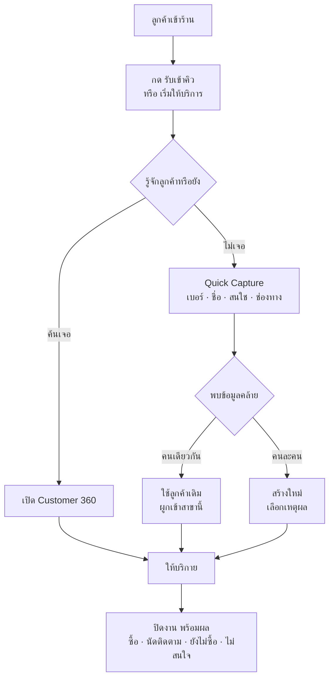

# JAUN CRM · Phase 1 Plan (อนุมัติแล้ว)

**Direction 22 ก.ย. 2569 · บันทึกลง repo 23 ก.ย. 2569** · เอกสารรีวิวรอบก่อนเริ่มพัฒนา · ฉบับออนไลน์ (ใช้คอมเมนต์ได้): https://claude.ai/code/artifact/0a39912d-fc7f-47d8-a092-fb9ff6b263ae

> **✅ อนุมัติแล้ว 23 ก.ย. 2569** — ขอบเขต Phase 1 ถูกล็อก เริ่มเขียน Frontend ได้
> จุดอ้างอิงในประวัติ git: tag `phase1-plan-approved` (Phase 1 Plan Approved / Pre-Frontend Baseline)

## Direction ที่ยืนยันแล้ว (22 ก.ย. 2569)

สามข้อนี้ปิดแล้ว ไม่เปิดอีกเว้นแต่เจ้าของโครงการสั่งเอง — ทั้งหมดตรงกับที่ออกแบบไว้ใน Phase 0 จึงไม่ต้องแก้โครงสร้าง

| เรื่อง | Direction ที่ได้รับ | ผลต่อ Phase 1 |
| --- | --- | --- |
| Login / สิทธิ์ (Q1) | ยึดระบบกลางขององค์กร ไม่ทำโครงบัญชีซ้ำ · ผู้จัดการเชิญพนักงานในสาขาตน ระบบล็อกสาขาให้อัตโนมัติ · ถ้ารายละเอียดการเชื่อมยังไม่นิ่ง ให้แยก Interface/Contract ชัดก่อน | เพิ่มชั้น Identity Contract (ส่วนที่ 6) · โค้ด CRM ไม่เรียก Supabase Auth ตรง |
| Pilot (Q2) | JAUNPHONE 1 สาขาเดียวก่อน | ล็อกขอบเขตส่วนที่ 2 และแผน Pilot ส่วนที่ 8 |
| ขอบเขตงาน Phase 1 | รับลูกค้า · Visitor · Customer Master · Customer 360 · Permission · Audit · Data Quality ให้ใช้หน้างานได้จริงก่อน · Lead/Opportunity/Follow-up ไป Phase 2 | ตรงกับ CANONICAL ข้อ 14.5 เดิม ไม่ต้องขยับ |
| BUSINESS\_ADMIN ≠ SYSTEM\_ADMIN (Q3) | คงการแยกตามที่ออกแบบ · System Admin ไม่ได้สิทธิ์ดูข้อมูลลูกค้าโดยอัตโนมัติ | มี test คุมอยู่แล้ว (rls\_08) |
| การลบ/ทำนิรนามตามคำขอ | ใช้ 2-person control · รายชื่อ BUSINESS\_ADMIN 2 คนยืนยันก่อนขึ้น Production | กระทบเฉพาะตอน go-live ไม่บล็อกการเขียนโค้ด |
| ผู้รับผิดชอบ PDPA/DPO | แยกเป็น Governance Decision ไม่บล็อก Phase 1 | งาน Phase 1 เดินต่อได้ |

**สิ่งที่ยังคงสถานะ "รอยืนยัน"** — คำถามที่เหลือใน Q1–Q30 ใช้ค่า default เดินงานไปก่อนได้ แต่เอกสารยังคงคำว่า "รอยืนยัน" ไว้ตามเดิม จะไม่เปลี่ยนเป็นข้อสรุปถาวรโดยทีมงานเอง

**หลัก 5 ข้อที่คงไว้เหมือนเดิม** — เก็บลูกค้าทุก Contact Point · Capture First–Enrich Later · Security อยู่ที่ Database/RLS · ข้อมูลส่วนบุคคลเปิดเท่าที่จำเป็น · KPI คำนวณจาก Event จริง

## ขอบเขต Phase 1

เป้าหมายเดียว: **พนักงาน JAUNPHONE 1 เลิกจดกระดาษ/Excel แล้วใช้ระบบรับลูกค้าทุกคนที่เข้าร้านได้จริง** โดยข้อมูลที่บันทึกเชื่อถือได้และตรวจสอบย้อนหลังได้

| อยู่ใน Phase 1 | เหตุผล |
| --- | --- |
| รับลูกค้า + คิวหน้าร้าน (Visit) ทุกช่องทาง | เป็นต้นทางของตัวเลข Traffic ทั้งหมด ถ้าไม่มี KPI อื่นผิดหมด |
| Quick Capture + ตรวจข้อมูลซ้ำ + ผูกลูกค้าข้ามสาขา | กันฐานข้อมูลเสียตั้งแต่วันแรก |
| Customer Master + ช่องทางติดต่อ + Tag + โน้ต | แกนกลางที่ระบบอื่นจะอ้างถึงใน Phase 4 |
| Customer 360 (ไทม์ไลน์ · การซื้อ · โน้ต · เอกสาร · ประวัติการแก้ไข) | หน้าที่พนักงานใช้จริงทุกครั้งที่ลูกค้ามา |
| ค้นหากลาง (ชื่อ · เบอร์ · LINE · Customer ID) | พนักงานต้องหาลูกค้าเจอภายในไม่กี่วินาที |
| Permission + RLS + Branch Scope เต็มรูปแบบ | เปิดใช้จริงต้องคุมตั้งแต่วันแรก เพิ่มทีหลังเสี่ยงกว่า |
| Audit + Access Log + การเปิดดูเบอร์ | เงื่อนไข PDPA และความน่าเชื่อถือของข้อมูล |
| PDPA: แจ้งประกาศ · ความยินยอมการตลาด · คำขอเจ้าของข้อมูล | เก็บข้อมูลจริงแล้วต้องมีตั้งแต่วันแรก |
| Data Quality (ซ้ำ · เบอร์หาย/ผิด · ข้อมูลไม่ครบ · visit ไม่บันทึกผล) | เห็นปัญหาตั้งแต่ pilot ก่อนขยายทุกสาขา |
| Dashboard พื้นฐาน (Visit · ลูกค้าไม่ซ้ำ · ใหม่/เก่า · Capture Rate · ช่องทาง) | ผู้จัดการสาขาต้องเห็นผลระหว่าง pilot |
| ผู้ใช้และสิทธิ์ (เชิญ · ปิดใช้งาน · มอบบทบาท) + Master Data + ตั้งค่าระบบ | ผู้จัดการต้องเพิ่มคนเองได้ |

**เลื่อนไป Phase 2** — Lead · Opportunity · Pipeline · ใบเสนอราคา · งานติดตาม/Follow-up · การแจ้งเตือน · เหตุผลที่ไม่สำเร็จ **เลื่อนไป Phase 3** — Dashboard เต็ม · รายงาน · ส่งออกข้อมูล · มิติทีม/พนักงาน/ช่องทาง **เลื่อนไป Phase 4–5** — LINE OA · Meta · POS/ซ่อม/ผ่อน · แคมเปญ · แบ่งกลุ่มลูกค้า

ฐานข้อมูลของ Phase 2–3 สร้างครบแล้วตั้งแต่ Phase 0 (ตาราง lead/opportunity/task มีอยู่) จึงไม่ต้องย้ายข้อมูลซ้ำเมื่อเปิด Phase 2

## หน้าจอที่จะทำ (12 หน้า จากทั้งหมด 19 หน้า)

ทุกหน้ามีต้นแบบที่คลิกดูได้แล้วและมี screen spec เต็ม — Phase 1 คือการเขียนของจริงต่อจากต้นแบบเหล่านี้

| # | หน้า | บทบาทที่ใช้ | สิ่งที่ต้องทำได้จริง |
| --- | --- | --- | --- |
| 01 | เข้าสู่ระบบ | ทุกคน | เข้าด้วยบัญชีกลาง · บังคับ MFA สำหรับหัวหน้าขึ้นไป · ล็อกหน้าจอเมื่อเครื่อง counter ไม่ได้ใช้ 10 นาที |
| 07 | รับลูกค้าเข้าร้าน | STAFF SV BM (OP อ่าน) | รับเข้าคิว/เริ่มให้บริการ · ระบุวัตถุประสงค์ 7 แบบ • เพื่อนรับคิวแทนกันได้ · ปิดงานพร้อมผล (ซื้อ/นัดติดตาม/ยังไม่ซื้อ/ไม่สนใช) |
| 04 | เพิ่มลูกค้า (Quick Capture) | STAFF SV BM BA | เบอร์+ชื่อ+ความสนใจ+ช่องทางก่อน · เตือนซ้ำพร้อมปุ่ม "ใช้ลูกค้าเดิม" · ติ๊กแจ้งประกาศ PDPA · ทำบนมือถือได้ |
| 03 | รายการลูกค้า | STAFF SV BM OP EX BA | ค้นชื่อ/เบอร์/LINE/Customer ID · กรองสาขาและสถานะ · เบอร์ปิดบัง กดดูแล้วบันทึก |
| 05 | Customer 360 | STAFF SV BM OP EX BA | ไทม์ไลน์ทุกช่องทาง · ตัวเลขสรุป 4 ช่อง · โน้ต · ความยินยอม · ประวัติการแก้ไข · รวมลูกค้าซ้ำ (SV ขึ้นไป) |
| 02 | หน้าหลัก (พื้นฐาน) | ทุกบทบาทที่มี dashboard.view | การ์ด Visit/ลูกค้าไม่ซ้ำ/ใหม่-เก่า/Capture Rate · ช่องทางที่มา · เลือกช่วงเวลาได้ |
| 12 | ศูนย์คุณภาพข้อมูล | STAFF SV BM OP EX BA | 5 ชนิดของ Phase 1 (ซ้ำ · ไม่มีเบอร์ · เบอร์ผิด · ข้อมูลไม่ครบ · visit ไม่บันทึกผล) · รวมลูกค้าซ้ำตาม 2-person |
| 13 | ผู้ใช้งานและสิทธิ์ | SV BM OP EX BA SA | เชิญพนักงานโดยล็อกสาขา · ปิดใช้งาน · มอบ/ถอนบทบาทตามกติกา 7.2 |
| 14 | Master Data | BA (MK เฉพาะ Tag) | แก้ค่ากลางที่เปิดให้แก้ · ค่า is\_system ปิดไว้ |
| 16 | ประวัติการใช้งาน (Audit) | EX BA SA (SA = security log) | ค้นได้ว่าใครทำอะไร เมื่อไร ค่าก่อน-หลัง (ปิดบัง PII) |
| 17 | PDPA: ความยินยอม · คำขอเจ้าของข้อมูล | BA | รับคำขอ · ยืนยันตัวตน · ส่งข้อมูลให้เจ้าของ · ทำนิรนามแบบง 2-person |
| 18 | ตั้งค่าระบบ | BA (ธุรกิจ) SA (เทคนิค) | เกณฑ์ SLA · เวลาทำการ · ค่าความปลอดภัย |

หน้า 10 (ตัวอย่างมือถือ) ใช้เป็นต้นแบบเท่านั้น งานจริงคือหน้า 02/03/04/05/07 ต้อง responsive บนมือถือใช้งานได้จริงที่หน้าร้าน

## Workflow หน้างาน

ลูกค้าเดินเข้าร้าน ถึงปิดการให้บริการ — ทุกขั้นอยู่ใน Phase 1 ทั้งหมด

| ขั้น | ใครทำ | ระบบทำอะไร | กติกาที่ต้องคุม |
| --- | --- | --- | --- |
| รับเข้าคิว | พนักงานหน้าร้าน | ออกเลขคิวของวัน สร้าง visit สถานะ รอรับบริการ | นับเป็น Traffic แม้ยังไม่รู้ชื่อ |
| เริ่มให้บริการ | พนักงานคนใดก็ได้ในสาขา | ตั้งผู้รับผิดชอบเป็นคนที่กด | เปลี่ยนได้เฉพาะ 2 ช่อง (สาขา+ผู้รับ) ห้ามแก้อย่างอื่น |
| ตรวจซ้ำ | ระบบ | ค้นทั้งองค์กรด้วยเบอร์/LINE/อีเมล คืนการ์ดย่อ | ลูกค้านอกสาขาเห็นแค่ชื่อย่อ+เบอร์ปิดบัง ไม่เห็นประวัติ |
| ผูกลูกค้าข้ามสาขา | พนักงานที่รับคิว | ผูกผ่าน `api.link_customer_to_branch` พร้อม visit อ้างอิง | บันทึก access log · เกิน 10 ครั้ง/วัน แจ้งผู้จัดการสาขา |
| ปิดงาน | พนักงานที่รับ | บังคับเลือกผล 1 ใน 7 แบบ | visit ที่ไม่ปิดถูกระบบปิดตอน 23:59 และนับเป็น "ไม่บันทึกผล" |

**เกณฑ์ความเร็วหน้างาน** — รับเข้าคิวไม่เกิน 3 วินาที · Quick Capture จนจบไม่เกิน 30 วินาที · เปิด Customer 360 ไม่เกิน 2 วินาที — ถ้าช้ากว่านี้พนักงานจะกลับไปจดกระดาษและข้อมูลจะหายไปทั้งระบบ

## Permission Matrix เฉพาะ Phase 1

ตัดมาจากตารางเต็ม 63 สิทธิ์ เหลือเฉพาะที่ใช้จริงใน Phase 1 · `O` = ของตน · `T` = ทีม · `B` = สาขา · `G` = ทั้งองค์กร · `S` = ระบบ · ล็อกกุญแจ = ต้องยืนยัน MFA

| สิทธิ์ | พนักงาน | หัวหน้าทีบ | ผจก.สาขา | ปฏิบัติการ | ผู้บริหาร | BA | SA |
| --- | --- | --- | --- | --- | --- | --- | --- |
| ดูลูกค้า / Customer 360 | B | B | B | B | G | G | – |
| สร้างลูกค้า | B | B | B | – | – | G | – |
| แก้ข้อมูลลูกค้า | O | T | B | – | – | G | – |
| เปิดดูเบอร์เต็ม (บันทึกทุกครั้ง) | B | B | B | – | G 🔐 | G 🔐 | – |
| รวมลูกค้าซ้ำ 🔐 | – | T | B | – | – | G | – |
| รับลูกค้า / เปิด visit | B | B | B | – | – | – | – |
| แก้/ปิด visit | O | T | B | – | – | G | – |
| บันทึกการติดต่อ | B | B | B | – | – | G | – |
| บันทึกความยินยอม | B | B | B | – | – | G | – |
| ดูศูนย์คุณภาพข้อมูล | O | T | B | B | G | G | – |
| แก้รายการคุณภาพข้อมูล | O | T | B | – | – | G | – |
| เชิญผู้ใช้ / แก้โปรไฟล์ | – | – | B | – | – | G | S¹ |
| ปิดใช้งานผู้ใช้ 🔐 | – | – | B | – | – | G | S¹ |
| มอบ/ถอนบทบาท 🔐 | – | – | B | – | – | G | – |
| จัดการ Master Data 🔐 | – | – | – | – | – | G | – |
| ค้น Audit ธุรกิจ | – | – | – | – | G | G | – |
| ดู log ความปลอดภัย | – | – | – | – | G | G | S |
| จัดการคำขอเจ้าของข้อมูล 🔐 | – | – | – | – | – | G | – |
| ทำข้อมูลนิรนาม 🔐 | – | – | – | – | – | G | – |
| ตั้งค่าเกณฑ์ธุรกิจ 🔐 | – | – | – | – | – | G | – |
| ตั้งค่าเทคนิค/Integration 🔐 | – | – | – | – | – | – | S |

¹ SYSTEM\_ADMIN จัดการได้เฉพาะบัญชีสาย IT ที่ไม่มีบทบาทธุรกิจ และ**ไม่มีสิทธิ์แถวข้อมูลลูกค้าเลย** (มี test คุมใน `rls_08`)

**กติกาการเชิญที่บังคับในโค้ด** — ผู้จัดการสาขาเชิญได้เฉพาะ พนักงาน และ หัวหน้าทีม ในสาขาตนเท่านั้น · สาขาถูกล็อกอัตโนมัติ · สร้างบทบาทที่เท่าหรือสูงกว่าตัวเองไม่ได้ · บทบาท EXECUTIVE/BUSINESS\_ADMIN/SYSTEM\_ADMIN ต้องผ่านคำขอและอนุมัติโดยผู้บริหารคนอื่น (two-person)

## Identity Contract — การเชื่อมระบบ Login กลาง

ข้อเสนอให้ CRM **ไม่เรียกระบบ Auth ตรง ๆ** แต่คุยผ่านสัญญา 5 ข้อนี้ ถ้าวันหนึ่งเปลี่ยนระบบกลาง แก้เฉพาะชั้นนี้ชั้นเดียว

| สัญญา | CRM ต้องการอะไร | ระบบกลางให้อะไร |
| --- | --- | --- |
| พิสูจน์ตัวตน | รู้ว่าคนที่เข้ามาคือใคร | ตัวระบุผู้ใช้ที่ไม่เปลี่ยน (`user_id`) + อีเมล + รหัสพนักงาน HR |
| ระดับการยืนยันตัวตน | รู้ว่าผ่าน MFA แล้วหรือยัง | ส่งค่าระดับ (เทียบเท่า `aal2`) มาใน token |
| องค์กร/สาขา | รู้ว่าคนนี้สังกัดสาขาไหน | รหัสสาขาที่ตรงกันทั้งสองระบบ |
| สถานะบัญชี | รู้ว่าพนักงานยังทำงานอยู่ไหม | แจ้งเมื่อพนักงานลาออก/โอนย้าย |
| การเชิญผู้ใช้ใหม่ | ส่งคำขอสร้างบัญชี | สร้างบัญชีและส่งคำเชิญให้พนักงาน |

**สิ่งที่ CRM เป็นเจ้าของเองเสมอ** — บทบาทใน CRM (8 บทบาท) · สิทธิ์ 63 ข้อ · ขอบเขตข้อมูล (OWN/TEAM/BRANCH/ORG) · การบังคับ RLS — เพราะเป็นกติกาธุรกิจของ CRM เอง ไม่ใช่ของระบบ Login

**การดำเนินงานใน Phase 1** — โค้ดทั้งหมดเรียกผ่านชั้นกลางชื่อ `app.current_staff_id()` และ `api.get_my_access()` เท่านั้น — หน้าจอและ RLS ไม่เรียก Supabase Auth โดยตรง ถ้าเปลี่ยนไปใช้ระบบกลางขององค์กร แก้เฉพาะสองฟังก์ชันนี้กับชั้นรับเซสชัน

**ทางเลือกที่ต้องตัดสินใจกับทีมระบบกลาง**

| ทางเลือก | ข้อดี | ข้อเสีย |
| --- | --- | --- |
| A. ระบบกลางเป็น Identity Provider (OIDC/SAML) | พนักงานล็อกอินทีเดียวทั้งองค์กร | ระบบกลางต้องรองรับมาตรฐานนี้ |
| B. Sync รายชื่อพนักงานเข้า CRM เป็นรอบ | ทำได้เร็ว ไม่ต้องแก้ระบบกลาง | มีช่องว่างของข้อมูล ต้องกำหนดรอบ sync |
| C. CRM ถือบัญชีเองชั่วคราว (แบบที่ Phase 0 ออกไว้) | เริ่ม Phase 1 ได้ทันที | ต้องย้ายบัญชีภายหลัง |

ข้อเสนอ: เริ่ม Phase 1 ด้วยทางเลือก C ไปก่อน (pilot สาขาเดียว ผู้ใช้ไม่กี่คน) แล้วย้ายไป A หรือ B เมื่อระบบกลางพร้อม — เพราะชั้นสัญญาถูกแยกไว้แล้ว การย้ายจึงกระทบเฉพาะหน้าเข้าสู่ระบบและหน้าผู้ใช้งาน ไม่กระทบข้อมูลลูกค้าหรือ RLS

## Acceptance Criteria ของ Phase 1

จะถือว่า Phase 1 ผ่านก็ต่อเมื่อผ่านทุกข้อ ทดสอบจากข้อมูลจริงที่สาขา JAUNPHONE 1 บันทึก ไม่ใช่ข้อมูลตัวอย่าง

| # | เกณฑ์ | วิธีวัด |
| --- | --- | --- |
| 1 | วันนี้มีคนเข้าร้านกี่คน แยก walk-in/ออนไลน์ได้ | เปิด Dashboard เทียบกับการนับมือที่หน้าร้าน 1 วัน ต่างไม่เกิน 5% |
| 2 | เดือนนี้มีลูกค้าไม่ซ้ำกี่คน ใหม่กี่ เก่ากี่ | Dashboard และ `api.get_kpis` คืนค่าตรงกัน |
| 3 | ลูกค้ามาจากช่องทางไหน | กราฟแหล่งที่มา รวมเท่าจำนวนลูกค้าไม่ซ้ำ |
| 4 | เปิดลูกค้า 1 คนแล้วเห็นทุกการติดต่อที่ผ่านมา | Customer 360 แสดงไทม์ไลน์ครบทุกช่องทางและทุกสาขา |
| 5 | พนักงานสาขาอื่นเปิดข้อมูลไม่ได้ | ทดสอบด้วยบัญชีจริงของสาขา 2 และเรียก API ตรง ต้องไม่เห็นทั้งสองทาง |
| 6 | เปิดดูเบอร์ลูกค้าถูกบันทึกทุกครั้ง | เปิดดู 3 ครั้ง ต้องเห็น 3 แวฉในหน้า Audit พร้อมชื่อผู้ดูและเวลา |
| 7 | ผู้ดูแลระบบเปิดข้อมูลลูกค้าไม่ได้ | เข้าด้วยบัญชี SYSTEM\_ADMIN แล้วค้นลูกค้า ต้องได้ 0 แถว |
| 8 | ผู้จัดการเชิญพนักงานในสาขาตนได้ | เชิญสำเร็จ และลองเชิญข้ามสาขา/บทบาทสูงกว่าต้องถูกปฏิเสธ |
| 9 | ข้อมูลซ้ำ/ไม่ครบเห็นได้และแก้ได้ | ศูนย์คุณภาพข้อมูลแสดงรายการจริง และรวมลูกค้าซ้ำได้ด้วยสองคน |
| 10 | คำขอลบข้อมูลทำได้ครบขั้นตอน | รับคำขฮ → ยืนยันตัวตน → ทำนิรนามโดย BA คนละคน โดย KPI ย้อนหลังไม่เปลี่ยน |
| 11 | ชุดทดสอบทั้งหมดผ่าน | `node tools/db/run.mjs --seed --test` ผ่าน 100% บน CI |

**คำถาม V1 ที้ Phase 1 ตอบได้แล้ว** — วันนี้มีคนเข้าร้านกี่คน · ลูกค้าไม่ซ้ำ · ใหม่/เก่า · มาจากช่องทางไหน · สนใจอะไร (ระดับรายการ) · ข้อมูลซ้ำ/ไม่ครบเท่าไร — **6 จาก 11 ข้อ**

**ที่ต้องรอ Phase 2–3** — ใครดูแล (owner ของ Lead/Opportunity) · ซื้อหรือไม่ซื้อ · ถ้าไม่ซื้อเพราะอะไร · ใครต้องติดตามต่อ · Conversion รายสาขา

## แผน Pilot JAUNPHONE 1

แบ่ง 4 ขั้น แต่ละขั้นมีเกณฑ์ผ่านก่อนไปขั้นถัดไป (วันที่จริงรอยืนยันหลังล็อกขอบเขต)

| ขั้น | ทำอะไร | ผ่านเมื่อ |
| --- | --- | --- |
| 1. เตรียม | ตั้ง Supabase 3 environment · รัน migration · สร้างบัญชีพนักงาน JP1 · ตั้งค่าเวลาทำการและ master data จริง | ผู้จัดการสาขาเข้าระบบและเชิญพนักงานได้เอง |
| 2. นำเข้าข้อมูลเก่า | นำเข้าลูกค้าเดิมของ JP1 ตามแผนย้ายข้อมูล · ตรวจซ้ำ · ออกรายงานคุณภาพ | ข้อมูลซ้ำคงเหลือ < 2% · เบอร์ผิดรูปแบบถูกแก้หมด |
| 3. ทดลองใช้ 1 สัปดาห์ | ใช้คู่กับกระดาษเดิม เปรียบตัวเลขทุกเย็น · เก็บปัญหาหน้างาน | Capture Rate ≥ 80% · บันทึกผล visit ≥ 90% · ส่วนต่างกับกระดาษ < 5% |
| 4. ใช้จริงเต็มสาขา | เลิกกระดาษ ใช้ระบบอย่างเดียว 2 สัปดาห์ | Capture Rate ≥ 90% · พนักงานทุกคนใช้ได้เอง · ไม่มี blocker ค้าง |

**แผนถอย** — ถ้าขั้น 3 หรือ 4 มีปัญหา ให้กลับไปใช้กระดาษคู่ขนานทันที ข้อมูลที่บันทึกไปแล้วยังอยู่ครบ ไม่ต้องลบทิ้ง

**การขยายหลัง pilot** — เพิ่มทีละสาขา ห่างกันอย่างน้อย 1 สัปดาห์ เพื่อให้ทีมรับมือปัญหาได้ทัน — ห้ามเปิดพร้อมกันทุกสาขา (A43 ของบรีฟ)

## ความเสี่ยงและสิ่งที่ยังรอยืนยัน

| ความเสี่ยง | ผลถ้าเกิด | วิธีรับมือ |
| --- | --- | --- |
| พนักงานไม่กดรับลูกค้าตอนยุ่ง | Capture Rate ตก ตัวเลขทุกอย่างผิด | ทำให้เร็วกว่าจดกระดาษ (≤ 3 วินาที) · ผู้จัดการเห็นตัวเลขรายคนทุกวัน |
| เชื่อมระบบ Login กลางช้ากว่าแผน | Phase 1 สะดุด | เริ่มด้วยบัญชีใน CRM ก่อน เปลี่ยนทีหลังตาม Identity Contract |
| ข้อมูลเก่าคุณภาพต่ำกว่าที่คิด | ซ้ำเยอะ เบอร์ผิดรูปแบบ | นำเข้าแบบ dry run ก่อน ดูรายงานแล้วค่อยตัดสินใจ |
| มี BUSINESS_ADMIN คนเดียวตอนขึ้น production | คำขอลบข้อมูลทำไม่ได้ (2-person) | ยืนยันรายชื่อ 2 คนก่อน go-live |
| เครื่อง counter ใช้ร่วมกัน ไม่ออกจากระบบ | บันทึกว่าผิดคน | ลงทะเบียนเครื่องเป็น shared counter → ล็อกหน้าจอใน 10 นาที |

**ยังคงสถานะ รอยืนยัน (ไม่บล็อก Phase 1)** — ผู้รับผิดชอบ PDPA/DPO · ระยะเวลาเก็บข้อมูล · เพดานการส่งออกข้อมูล · แพ็กเกจ Supabase · ระบบ POS/ซ่อม/ผ่อนที่มีอยู่ · นิติบุคคลของ JAUN POWER MONEY — ทั้งหมดใช้ค่า default ไปก่อนและคงป้าย "รอยืนยัน" ตามที่สั่ง

## ผลการตัดสินใจ (23 ก.ย. 2569)

ยืนยันครบทั้ง 5 ข้อ

- [x] **ขอบเขต Phase 1** — ยืนยันตามเอกสาร ไม่เพิ่ม Lead/Opportunity/Follow-up เข้ามา
- [x] **หน้าจอ Phase 1** — ยืนยันทั้งชุด ไม่ตัดออก (นับตามตารางได้ **12 หน้า** · เดิมพิมพ์ 11 หน้า เป็นตัวเลขคลาดเคลื่อน รายชื่อหน้าไม่เปลี่ยน) แต่ให้จัดลำดับการพัฒนา ไม่ต้องทำพร้อมกัน (ดูลำดับด้านล่าง)
- [x] **ทางเลือกการเชื่อม Login** — ทางเลือก **C** สำหรับ pilot · ยึด Identity Contract ทั้งหมด · ห้ามผูก Business Logic กับ Supabase Auth โดยตรง
- [x] **เกณฑ์ผ่าน pilot** — ยืนยันตามแผน และ**เพิ่มเป้าองค์กร Capture Rate ≥ 95%** หลังระบบและพนักงานนิ่งแล้ว
- [x] **ผู้ร่วม pilot** — JAUNPHONE 1 ตามเดิม · รายชื่อ Manager และพนักงานจะยืนยันก่อนขั้นตอนสร้าง Account/Training

### ลำดับการพัฒนาที่อนุมัติ

**ชุดที่ 1 · Core Flow หน้างาน** — เข้าสู่ระบบ (01) → รับลูกค้าเข้าร้าน (07) → Quick Capture (04) → รายการลูกค้า (03) → Customer 360 (05)

**ชุดที่ 2 · ต่อจาก Core Flow** — Dashboard (02) → ศูนย์คุณภาพข้อมูล (12) → ผู้ใช้งานและสิทธิ์ (13) → Audit (16) → PDPA (17) → Master Data (14) + ตั้งค่าระบบ (18)

### เกณฑ์ Capture Rate ที่อนุมัติ

| ช่วง | เกณฑ์ |
| --- | --- |
| ทดลองคู่กับกระดาษ (pilot ขั้น 3) | ≥ 80% |
| ใช้งานจริงเต็มสาขา (pilot ขั้น 4) | ≥ 90% |
| หลังระบบและพนักงานนิ่งแล้ว (เป้าองค์กร) | **≥ 95%** |

เกณฑ์อื่นคงเดิม: บันทึกผล visit ≥ 90% · ส่วนต่างจากการนับมือ < 5% · ไม่มี blocker ค้าง

**งานถัดไปตามที่สั่ง:** Environment Setup แล้วต่อด้วย Core Flow `รับลูกค้า + Quick Capture` — สองหน้านี้คือหัวใจของ Phase 1 ทั้งหมด

เอกสารฉบับเต็มที่ทีม Dev จะใช้จริงอยู่ใน repo: `docs/06-ux/sitemap-screen-specs.md` (สเปกทุกหน้า) · `docs/04-security/permission-matrix.md` · `docs/07-api/api-spec.md` · `docs/08-delivery/roadmap.md`

---

> บันทึกไว้ในแหล่งจริงของโครงการแล้วที่ `docs/00-brief/CANONICAL.md` ข้อ 20 — Direction จากเจ้าของโครงการ (มีผลบังคับสูงสุด)
