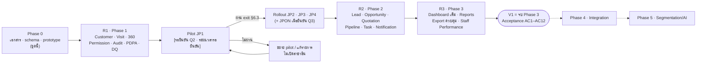

# Roadmap — แผนพัฒนาและส่งมอบ · JAUN CRM · Customer 360

> เอกสารชุดที่ **08 Roadmap** (A45 · นอกรายการ 20 ชุด แต่เป็นเอกสารกำกับลำดับงานของทั้งชุด) · **ฉบับ Phase 0 · 16 ก.ย. 2569**
> ค่าทุกค่าอ้างอิง `docs/00-brief/CANONICAL.md` **v2.2** (อ้างเป็น "CANONICAL ข้อ …") โดยเฉพาะข้อ 12.3 · 12.4 · 13 · 14.1 · 14.5 · 14.6 · 14.7 · 16 · 17 · 18 · 19 และบรีฟ A43 · A44 · A45 · B26 · B27 · ถ้าเอกสารนี้ขัดกับ CANONICAL **CANONICAL ชนะ**
> ชื่อ object ในฐานข้อมูลยึด `supabase/migrations/0001–0011` (CANONICAL ข้อ 19.1)
> **วันที่ปฏิทินทุกจุดเป็น "รอยืนยัน"** — เอกสารนี้ใช้เฉพาะลำดับสัมพัทธ์ (Sprint 1, 2, 3 … · "สัปดาห์ที่ N นับจากวันเริ่ม Phase") CANONICAL ไม่มีวันเริ่มโครงการ จึงห้ามคิดวันที่ขึ้นเอง
> เอกสารคู่กัน: `docs/08-delivery/deployment-backup-recovery.md` (§3 CI/CD · §4 Release/Pilot · §11 Go-live checklist) · `docs/08-delivery/data-migration-plan.md` · `docs/08-delivery/test-cases-uat.md` · `docs/02-architecture/system-architecture.md`
> **การอ้างหัวข้อภายในเอกสารนี้ใช้ § · "ข้อ N" ที่ไม่มีชื่อเอกสารกำกับหมายถึง CANONICAL**

---

## 0. วิธีอ่านเอกสารนี้

| ประเภทข้อความ | ความหมาย |
|---|---|
| ตัวเลข/รหัส/ชื่อหน้าจอ | มาจาก CANONICAL เท่านั้น (ข้อ 13 · 14.1 · 14.6) |
| **[รอยืนยัน]** | ค่าที่ CANONICAL ติดป้ายรอยืนยัน หรือเอกสารนี้ต้องใช้แต่ CANONICAL ไม่มี (วันที่ · จำนวนคน · ระยะเวลา · ชื่อบุคคล) |
| **หมายเหตุผู้เขียน Nx** | จุดที่ CANONICAL ไม่ครอบคลุม ผู้เขียนเลือกการตีความที่สอดคล้องกับส่วนอื่นของ CANONICAL มากที่สุด · สรุปรวมใน §10 |
| **ข้อเสนอผู้เขียน** | ข้อเสนอเชิงแผนงาน (จำนวน sprint · ลำดับงาน) ที่ไม่ขัด CANONICAL แต่ยังไม่ได้รับการยืนยัน |
| `S1` … `S12` | หมายเลข sprint สัมพัทธ์ (2 สัปดาห์/sprint · §4) ไม่ผูกกับวันที่ปฏิทิน |
| `AC1` … `AC12` | คำถาม Acceptance ของ V1 (A44 · B27) ตามรหัสใน §1.4 |
| `Q1` … `Q30` | คำถามที่ต้องให้เจ้าของโครงการยืนยัน (CANONICAL ข้อ 17) |
| `R1` … `R14` | ความเสี่ยงในทะเบียนความเสี่ยง §9 |

รหัสบทบาทที่ใช้เป็น "เจ้าของงาน" ในเอกสารนี้ = รหัสบทบาทในระบบ (CANONICAL ข้อ 7): `EXECUTIVE` · `BUSINESS_ADMIN` · `BRANCH_MANAGER` · `SUPERVISOR` · `STAFF` · `OPERATIONS` · `MARKETING` · `SYSTEM_ADMIN` · และบทบาทของทีมโครงการที่ไม่ใช่บทบาทในระบบ: **PO** (เจ้าของผลิตภัณฑ์/เจ้าของโครงการ) · **DEV-BE** · **DEV-FE** · **UX** · **QA** · **DPO** (§5)

---

## 1. ภาพรวม

### 1.1 หลักการวางแผน (ตรึงจาก CANONICAL)

1. **แบ่งงานตาม Phase 0–5 ของข้อ 14.5** ไม่สร้าง phase ใหม่และไม่ย้ายเนื้อหาข้าม phase
2. **V1 = จบ Phase 3** (ข้อ 14.5 · D26) เพราะคำถาม Acceptance (A44 · B27) ต้องใช้ข้อมูลของ Phase 2–3
3. **migration ของ Phase 0 สร้างตารางของ Phase 1–3 ครบตั้งแต่ release แรก** (ข้อ 14.6) · release ถัด ๆ ไปจึงเป็นการ **เปิดหน้าจอและฟีเจอร์** ไม่ใช่การเพิ่มตาราง → ความเสี่ยงเรื่อง migration ที่ทำลายข้อมูลอยู่ที่ R1 เท่านั้น
4. **Pilot หนึ่งสาขาก่อน (JP1 · Q2) แล้วจึง rollout** (A43 · B26 · ข้อ 14.5) · pilot ใช้ชุดคำถาม Acceptance ย่อยที่ Phase 1 ตอบได้ (D26)
5. **สิทธิ์ตรวจในฐานข้อมูลเสมอ** (ข้อ 9.1) · การ "เปิดสาขา" ทำด้วยการมอบ assignment ไม่ใช่ feature flag (deployment-backup-recovery.md §4.2) → แผน rollout ไม่ต้องรอ release ใหม่ต่อสาขา

### 1.2 ตารางสรุป Phase 0–5

| Phase | เนื้อหา (ข้อ 14.5) | หน้าจอที่ "เปิดใช้" (ข้อ 14.1) | ตารางที่เริ่มใช้งาน (ข้อ 14.6) | KPI ที่คำนวณได้ (ข้อ 12) | Acceptance ที่ปลดล็อก |
|---|---|---|---|---|---|
| **0** | Requirement · Workflow · Data Dictionary · ERD · Permission · UX/UI · prototype | prototype 19 หน้า (ไม่ใช่ระบบจริง) | สร้าง schema ของ Phase 1–3 ครบใน migration | – | – |
| **1** | Customer Master · Quick Capture · Visit/คิว · Interaction · Customer 360 · Search · Branch · Permission/RLS · Audit · Dashboard พื้นฐาน · PDPA notice/consent/DSR · Data Quality (ซ้ำ/ไม่ครบ) · Master Data · User & Permission · System Settings · Transaction ref (ผูกด้วยมือ) → **Pilot JP1** | 01 · 02 (พื้นฐาน) · 03 · 04 · 05 · 07 · 10 · 12 (ส่วนลูกค้า) · 13 · 14 · 16 · 17 · 18 | `core.*` · `ref.*` · `crm.customers` `customer_contacts` `customer_addresses` `customer_branches` `customer_notes` `tags` `customer_tags` `customer_consents` `customer_merges` `duplicate_decisions` `data_subject_requests` `visits` `interactions` `transaction_refs` `ownership_changes` `notifications` · `audit.*` · `app.settings` `running_numbers` `rate_limit_counters` | `VISITS` · `WALKIN_VISITS` · `IDENTIFIED_VISITS` · `UNIQUE_CUSTOMERS` · `NEW_CUSTOMERS` · `RETURNING_CUSTOMERS` · `OPEN_VISITS` · `CAPTURE_RATE` · `OUTCOME_COMPLETION` · `DUPLICATE_RATE` · `MISSING_REQUIRED_RATE` · แหล่งที่มาลูกค้า (ข้อ 13.3) | AC1 · AC2 · AC3 · AC4 · AC5 · AC7 (ระดับลูกค้า) · AC12 |
| **2** | Lead · Opportunity · Quotation · Pipeline · Follow-up/Task · Notification · Lost Reason · Campaign table | 06 · 08 · 11 · 19 · 12 (ส่วนงาน/lead) | `crm.leads` `lead_status_history` `opportunities` `opportunity_items` `opportunity_stage_history` `quotations` `quotation_items` `campaigns` `tasks` `task_comments` | `LEADS` · `OPPORTUNITIES` · `SALES` · `SALES_AMOUNT` · `LOST_OPPORTUNITIES` · `LOST_LEADS` · `LOST_TOTAL` · `BUYERS` · `REPEAT_BUYERS` · `OPEN_LEADS` · `OPEN_OPPORTUNITIES` · `OPEN_PIPELINE_AMOUNT` · `OPEN_FOLLOWUP_CUSTOMERS` · `TASKS_TODAY` · `TASKS_OVERDUE` · `WON_LAST_7_DAYS(_AMOUNT)` · อัตราข้อ 12.2 ทุกตัว | AC6 · AC7 (ระดับรายการ) · AC8 · AC9 · AC10 · AC11 (ข้อมูลพร้อม) |
| **3** | Dashboard เต็ม · Reports · Analytics · Export ควบคุม · Staff Performance · มิติทีม/พนักงาน/ช่องทาง | 02 (เต็ม) · 09 · 15 | ไม่มีตารางใหม่ · เพิ่ม view `analytics.*` | มิติ ทีม/พนักงาน/ช่องทาง + drill-down (ข้อ 12.4) · preset ช่วงเวลาครบข้อ 12.0 | AC11 (หน้าจอ) · **AC1–AC12 ครบ = V1** |
| **4** | LINE OA · Meta · POS/Repair/Installment/Contract integration · Campaign เต็ม · `online_conversations` · เอกสารใน `restricted` | หน้าแคมเปญเต็ม (ยังไม่มีรหัสหน้าใน 14.1) | `crm.campaign_members` · `crm.online_conversations` · `restricted.customer_documents` | `SALES_AMOUNT` เปลี่ยนฐานเป็น transaction ref จาก POS (ข้อ 12.1 D-log) | – (นอก V1) |
| **5** | Segmentation · Automation · AI · Loyalty · Win-back · ลูกค้าเก่าที่มีโอกาสซื้อซ้ำ | Customer Segments (ข้อ 14.2) | `crm.segments` | – | – (นอก V1) |

> เส้นแบ่ง "KPI ที่คำนวณได้" ≠ "KPI ที่แสดงบนหน้าจอ": ข้อ 12.4 กำหนดว่า **มิติช่วงเวลา + สาขา = Phase 1 · มิติทีม/พนักงาน/ช่องทาง + drill-down = Phase 3** และข้อ 14.7 กำหนดว่า Dashboard "พื้นฐาน" ของ Phase 1 = การ์ดลูกค้า/visit · ลูกค้าใหม่/เก่า · Capture Rate · แหล่งที่มา · KPI ของ Phase 2 จึงคำนวณได้ทันทีที่ Phase 2 ขึ้น แต่แสดงครบบน Dashboard/รายงานใน Phase 3

### 1.3 ลำดับ release

- R2 และ R3 เปิดให้ทุกสาขาพร้อมกันหลังผ่าน UAT ของ phase นั้น (**ข้อเสนอผู้เขียน** · deployment-backup-recovery.md §4.4 · รอยืนยัน)
- การนำเข้าข้อมูลลูกค้าเดิมเกิด **ก่อน** เปิดใช้งาน pilot (`data-migration-plan.md` §9 · §6.1 ของเอกสารนี้)

### 1.4 คำถาม Acceptance ของ V1 (A44 · B27)

A44 มี 11 คำถาม · B27 มี 11 คำถามโดยเพิ่ม "มีข้อมูลซ้ำหรือข้อมูลไม่ครบเท่าไร" → รวมเป็นชุดเดียว 12 ข้อ (**หมายเหตุผู้เขียน N1**: การรวมสองรายการและการให้รหัส AC เป็นของผู้เขียน CANONICAL ไม่มีรหัส)

| # | คำถาม | ตอบด้วย | Phase ที่ตอบได้ |
|---|---|---|---|
| AC1 | วันนี้มีคนเข้าร้านกี่คน | `VISITS` · `WALKIN_VISITS` preset `TODAY` (ข้อ 12.0 · 12.1) | 1 |
| AC2 | เดือนนี้มีลูกค้าไม่ซ้ำกี่คน | `UNIQUE_CUSTOMERS` preset `THIS_MONTH` / `LAST_30_DAYS` (ข้อ 3.1) | 1 (preset ครบ = 3) |
| AC3 | ลูกค้าใหม่กี่คน | `NEW_CUSTOMERS` (`first_seen_at ∈ P` · ข้อ 3.2) | 1 |
| AC4 | ลูกค้าเก่ากี่คน | `RETURNING_CUSTOMERS` | 1 |
| AC5 | ลูกค้ามาจากช่องทางไหน | `customers.first_channel_code` (ข้อ 13.3 · D3) | 1 |
| AC6 | สนใจสินค้า/บริการอะไร | ระดับรายการ: `interest_code` บน Customer 360 · การ์ด pipeline (D51) · **รายงานรวมตามความสนใจ = Phase 3 [รอยืนยัน]** | 2 (ระดับรายการ) · 3 (รายงานรวม รอยืนยัน) |
| AC7 | ใครเป็น Owner | `customers.owner_staff_id` (Phase 1) · `leads/opportunities/tasks.owner_staff_id` (Phase 2) | 1 → 2 |
| AC8 | ซื้อหรือไม่ซื้อ | เหตุการณ์การซื้อ (ข้อ 3.1) = opportunity `WON` + `transaction_refs` ที่ `counts_as_purchase` · Phase 1 มีเฉพาะฝั่ง transaction ref ที่ผูกด้วยมือ | 2 (ครบ) |
| AC9 | ถ้าไม่ซื้อ เพราะอะไร | `lost_reason_code` (ข้อ 5.5) · กราฟ 5 อันดับ + "อื่น ๆ" | 2 |
| AC10 | ใครต้อง Follow-up ต่อ | `OPEN_FOLLOWUP_CUSTOMERS` · task `FOLLOW_UP` (ข้อ 4.7) | 2 |
| AC11 | แต่ละสาขา Conversion เท่าไร | `CONV_LEAD_TO_SALE` รายสาขา (ข้อ 12.2 · 13.2) | ข้อมูลครบเมื่อจบ 2 · หน้ารายงาน = 3 |
| AC12 | มีข้อมูลซ้ำหรือข้อมูลไม่ครบเท่าไร | `DUPLICATE_RATE` · `MISSING_REQUIRED_RATE` (ข้อ 12.3) | 1 |

> ถ้ายังตอบไม่ได้ข้อใดข้อหนึ่ง ถือว่า module ที่เกี่ยวข้อง **ยังไม่ผ่าน Acceptance** (A44) · การ "ตอบได้" หมายถึงตอบจาก **ฐานข้อมูลจริง** ผ่าน `api.get_kpis` / `api.get_report` ไม่ใช่ตัวเลขที่พิมพ์ไว้ (ข้อ 13.0 กติกา 2)

---

## 2. สถานะปัจจุบันของ Phase 0

### 2.1 ส่งมอบแล้ว

| ส่วน | ไฟล์ | สถานะ |
|---|---|---|
| ข้อเท็จจริงกลาง | `docs/00-brief/CANONICAL.md` v2.2 · `REQUIREMENT.md` | ✓ |
| Requirement · Workflow | `docs/01-requirement/requirement-review.md` · `user-flows.md` | ✓ |
| สถาปัตยกรรม | `docs/02-architecture/system-architecture.md` | ✓ |
| สิทธิ์ · RLS · Security · PDPA | `docs/04-security/permission-matrix.md` · `rls-spec.md` · `security-design.md` · `pdpa.md` | ✓ |
| KPI · Notification | `docs/05-analytics/kpi-definitions.md` · `notification-rules.md` | ✓ |
| UX | `docs/06-ux/design-system.md` · `sitemap-screen-specs.md` | ✓ |
| Deployment · Backup | `docs/08-delivery/deployment-backup-recovery.md` | ✓ |
| Roadmap · Data Migration | `docs/08-delivery/roadmap.md` (เอกสารนี้) · `data-migration-plan.md` | ✓ |
| Schema | `supabase/migrations/0001–0011` (foundation · core · ref · customer · activity · sales · work · audit · business triggers · security/RLS · api) | ✓ |
| Analytics layer | `supabase/migrations/0012_analytics.sql` (view `analytics.customer_activity` · `purchase_events` · `data_quality_issues` + helper `app.kpi_*`) | ✓ (RPC `api.get_kpis`/`api.get_report` ยังไม่เปิด — §2.2) |
| Test | `supabase/tests/` 14 ไฟล์ (schema · api · rls) | ✓ ผ่านทั้งหมด |
| prototype | `prototype/` 19 หน้า + `index.html` + assets | ✓ |

### 2.2 ยังค้างเพื่อปิด Phase 0 (เข้าสู่ `S0` ใน §4)

| ส่วน | ไฟล์/object ที่ยังไม่มี | อ้างอิง |
|---|---|---|
| Data Dictionary · ERD | `docs/03-data/data-dictionary.md` · `er-diagram.md` · `schema-notes.md` | ข้อ 18 · A45 #07 #08 #09 |
| API Spec | `docs/07-api/api-spec.md` | ข้อ 18 · A45 #10 |
| Test Case · UAT | `docs/08-delivery/test-cases-uat.md` | ข้อ 18 · A45 #17 #18 |
| ชุดข้อมูลตัวอย่าง | `supabase/seed.sql` · `supabase/tests/acceptance.sql` | ข้อ 13.0 กติกา 1 · 9 |
| KPI/รายงาน | RPC ที่หน้าจอเรียก: `api.get_kpis` · `api.get_report` · `api.list_data_quality_issues` · `api.record_report_export` (view `analytics.*` มีแล้วใน `0012` · §2.1) | ข้อ 9.4.1 · 9.6 · 12 |
| งานตามเวลา | `app.job_close_stale_visits` · `app.job_notifications` · `app.job_expire_quotations` · `app.job_retention` · `app.job_expire_exports` · `supabase/migrations/*_cron.sql` | ข้อ 9.6 |
| เครื่องมือ | `tools/db/gen-seed.mjs` · `gen-data-dictionary.mjs` · `anonymize.sql` · `tools/check-prototype.mjs` · `check-canonical.mjs` | ข้อ 18 |

> งานใน §2.2 เป็นเงื่อนไขเข้า (entry) ของ Phase 1 ตาม §3.2 · งาน KPI/งานตามเวลาแบ่งไปอยู่ใน sprint ของ Phase ที่ใช้จริง (§4.2)

---

## 3. รายละเอียดรายเฟส

รูปแบบเดียวกันทุกเฟส: **ขอบเขต** (โมดูล · หน้าจอ · ตาราง · KPI) → **เงื่อนไขเข้า (entry)** → **เงื่อนไขจบ (exit)** → **Acceptance ที่ปลดล็อก** → **สิ่งที่ต้องพึ่งพา** → **ความเสี่ยงหลัก**

### 3.1 Phase 0 — เอกสาร · schema · prototype

| หัวข้อ | รายละเอียด |
|---|---|
| **ขอบเขต** | เอกสาร 20 ชุดตาม A45 (ผังไฟล์ข้อ 18) · migration ของตาราง Phase 1–3 ครบ · seed + test · prototype 19 หน้า |
| **หน้าจอ** | prototype ทุกหน้าตามข้อ 14.1 (เป็นภาพจำลอง ไม่เชื่อมฐานข้อมูล) |
| **ตาราง** | สร้างครบทุกตาราง Phase 1–3 (ข้อ 14.6) · ตาราง Phase 4–5 ยังไม่สร้าง |
| **KPI** | ตัวเลขทั้งหมดของข้อ 13 ต้อง **คำนวณได้จากแถวจริงของ seed** ผ่าน RPC ไม่ใช่ค่าสำเร็จรูป (ข้อ 13.0 กติกา 2) |
| **entry** | บรีฟ A1–A45 · B1–B27 · mockup A/B ครบ (มีแล้ว) |
| **exit** | (ก) เอกสารทั้ง 20 ชุดอยู่ครบตามผังข้อ 18 (ข) `node tools/db/run.mjs --seed --test --quiet` ผ่าน รวม `acceptance.sql` ที่ assert **ทุกตัวเลขที่พิมพ์ในข้อ 13** (ค) `tools/check-prototype.mjs` และ `check-canonical.mjs` ผ่าน (ง) PO ตรวจ prototype ครบ 19 หน้า |
| **Acceptance ที่ปลดล็อก** | – (Phase 0 ไม่มีระบบจริง) |
| **พึ่งพา** | – |
| **ความเสี่ยงหลัก** | R2 (คำถาม Q1–Q30 ยังไม่ถูกยืนยัน) · R3 (ค่าที่ติด [รอยืนยัน] ถูกนำไปใช้เป็นค่าจริง) |

### 3.2 Phase 1 — Customer · Visit · Interaction · Permission · Audit · PDPA

| หัวข้อ | รายละเอียด |
|---|---|
| **โมดูล** | Customer Master · Quick Capture · Visit/คิว · Interaction · Customer 360 · Search · Branch · Permission/RLS · Audit · Dashboard พื้นฐาน · PDPA (notice/consent/DSR) · Data Quality (ซ้ำ/ไม่ครบ) · Master Data · User & Permission · System Settings · Transaction ref ผูกด้วยมือ |
| **หน้าจอ (ข้อ 14.1)** | 01 `login` · 02 `dashboard` (พื้นฐาน) · 03 `customers` · 04 `quick-capture` · 05 `customer-360` · 07 `reception` · 10 `mobile` · 12 `data-quality` (`DUPLICATE_SUSPECTED` · `MISSING_PHONE` · `INVALID_PHONE` · `INCOMPLETE_CUSTOMER` · `VISIT_UNRECORDED` · `WON_WITHOUT_TRANSACTION`) · 13 `users` · 14 `master-data` · 16 `audit` · 17 `privacy` · 18 `settings` |
| **ตาราง (ข้อ 14.6)** | `core.organizations` `business_units` `branches` `departments` `teams` `team_members` `devices` `staff_profiles` `staff_invitations` `roles` `permissions` `role_permissions` `staff_role_assignments` `role_grant_requests` · `ref.*` ทั้ง 16 ตาราง · `crm.customers` `customer_contacts` `customer_addresses` `customer_branches` `customer_notes` `tags` `customer_tags` `customer_consents` `customer_merges` `duplicate_decisions` `data_subject_requests` `visits` `interactions` `transaction_refs` `ownership_changes` `notifications` · `audit.audit_logs` `access_logs` `login_events` `export_requests` `integration_logs` · `app.settings` `running_numbers` `rate_limit_counters` |
| **KPI (ข้อ 12)** | `VISITS` · `WALKIN_VISITS` · `IDENTIFIED_VISITS` · `UNIQUE_CUSTOMERS` · `NEW_CUSTOMERS` · `RETURNING_CUSTOMERS` · `OPEN_VISITS` · `CAPTURE_RATE` · `OUTCOME_COMPLETION` · `DUPLICATE_RATE` · `MISSING_REQUIRED_RATE` · แหล่งที่มาลูกค้าตาม `first_channel_code` · มิติ: ช่วงเวลา + สาขา เท่านั้น (ข้อ 12.4) |
| **entry** | §2.2 ปิดครบ · Q1 Q2 Q4 Q5 Q6 Q8 Q9 Q11 Q13 Q16 Q17 Q22 Q24 Q25 Q26 ได้คำตอบ (§8) · project `dev`/`staging`/`prod` พร้อมตาม deployment §2 · บัญชี bootstrap ตามข้อ 7.2 พร้อมทำ |
| **exit** | (ก) UAT ของ Phase 1 ผ่าน (`test-cases-uat.md`) (ข) `rls_*.sql` + `acceptance.sql` ผ่านบน staging (ค) ตอบ **AC1 AC2 AC3 AC4 AC5 AC12** ได้จากฐานข้อมูล staging ที่โหลด seed (ง) ผลตรวจสิทธิ์ตรงตารางข้อ 13.13 ทุกแถว (จ) go-live checklist (deployment §11) ครบ (ฉ) restore test ครั้งแรกผ่านและบันทึกแล้ว (deployment §6) (ช) การนำเข้าข้อมูลเดิมผ่าน dry run และรายงานคุณภาพข้อมูลได้รับการยอมรับ (`data-migration-plan.md` §9 · §10) |
| **Acceptance ที่ปลดล็อก** | AC1 · AC2 · AC3 · AC4 · AC5 · AC7 (ระดับลูกค้า) · AC12 |
| **พึ่งพา** | Phase 0 (schema + seed) · การยืนยัน master data ข้อ 5 ที่ติด [รอยืนยัน] · ข้อความประกาศความเป็นส่วนตัว `PN-2026-01` (Q9) · อีเมลของพนักงานทุกคน (Q24) |
| **ความเสี่ยงหลัก** | R4 (Capture Rate ต่ำกว่าเป้า 95%) · R5 (ข้อมูลนำเข้าทำให้ `MISSING_REQUIRED_RATE` เกิน 2%) · R6 (MFA ของบทบาท `requires_mfa` ทำให้ล็อกอินไม่ได้หน้างาน) · R7 (อุปกรณ์ counter ใช้ร่วมกัน) |

**สิ่งที่ Phase 1 ยัง _ไม่_ ทำ** (กันการขยายขอบเขต): ไม่มี lead/opportunity/quotation/task · ไม่มีการแจ้งเตือนที่ผูกกับ task/lead (เหลือเฉพาะการแจ้งเตือนที่ไม่ต้องใช้ตาราง Phase 2 — `VISITOR_WAITING_LONG` `VISIT_OUTCOME_MISSING` `DUPLICATE_SUSPECTED` `DATA_MISSING` `REVEAL_LIMIT_EXCEEDED` `SEARCH_LIMIT_EXCEEDED` `LINK_LIMIT_EXCEEDED` `CUSTOMER_VIEW_LIMIT_EXCEEDED` `LOCKOUT_REPEATED` `ROLE_GRANT_*` `DSR_DUE_SOON` `RETENTION_ANONYMIZE_UPCOMING` — **หมายเหตุผู้เขียน N2**: CANONICAL ไม่ได้แบ่งการแจ้งเตือนตาม phase ผู้เขียนแบ่งตามตารางที่เงื่อนไขอ้างถึง) · ไม่มีหน้า reports/exports · Dashboard แสดงเฉพาะการ์ดพื้นฐาน (ข้อ 14.7)

### 3.3 Phase 2 — Lead · Opportunity · Quotation · Task · Notification

| หัวข้อ | รายละเอียด |
|---|---|
| **โมดูล** | Lead · Opportunity · Quotation · Pipeline · Follow-up/Task · Notification · Lost Reason · ตาราง Campaign |
| **หน้าจอ** | 06 `pipeline` · 08 `tasks` · 11 `leads` · 19 `quotations` · 12 `data-quality` ส่วนที่เหลือ (`LEAD_WITHOUT_OWNER` · `LEAD_WITHOUT_OUTCOME` · `OVERDUE_FOLLOWUP`) · แท็บ "งานและโอกาสขาย" ของหน้า 05 · การ์ด pipeline บนมือถือ (ข้อ 14.4 `เพิ่มเติม`) |
| **ตาราง** | `crm.leads` `lead_status_history` `opportunities` `opportunity_items` `opportunity_stage_history` `quotations` `quotation_items` `campaigns` `tasks` `task_comments` |
| **KPI** | `LEADS` `OPPORTUNITIES` `SALES` `SALES_AMOUNT` `LOST_OPPORTUNITIES` `LOST_LEADS` `LOST_TOTAL` `BUYERS` `REPEAT_BUYERS` `OPEN_LEADS` `OPEN_OPPORTUNITIES` `OPEN_PIPELINE_AMOUNT` `OPEN_FOLLOWUP_CUSTOMERS` `TASKS_TODAY` `TASKS_OVERDUE` `WON_LAST_7_DAYS` `WON_LAST_7_DAYS_AMOUNT` · อัตราข้อ 12.2 ทั้งหมด (`LEAD_RATE` `OPPORTUNITY_RATE` `CLOSE_RATE` `LOST_RATE` `CONV_LEAD_TO_SALE` `CONV_VISIT_TO_SALE` `WALKIN_CONVERSION` `REPEAT_RATE` `LEAD_RESPONSE_MIN` `FOLLOWUP_COMPLETION`) |
| **entry** | Phase 1 rollout ครบทุกสาขาที่เปิดใช้ (§7) · Q10 Q12 Q19 Q21 Q28 Q29 ได้คำตอบ · ค่า `app.settings` กลุ่ม `sla.*` `dq.*` `quotation.valid_days` `escalation.overdue_hours` ถูกยืนยัน (ข้อ 11.2) |
| **exit** | (ก) UAT ของ Phase 2 ผ่าน (ข) ตอบ **AC6 (ระดับรายการ) AC7 AC8 AC9 AC10** ได้จากฐานข้อมูลจริง (ค) การเปลี่ยนสถานะทุกเส้นทางของข้อ 4.3 · 4.4 · 4.6 · 4.7 ถูกบังคับด้วย trigger และมี test (ง) งานตามเวลา `job_expire_quotations` · `job_notifications` · `job_close_stale_visits` ทำงานบน prod ครบรอบและมีบันทึก (จ) `FOLLOWUP_COMPLETION` มีข้อมูลพอคำนวณอย่างน้อยหนึ่งช่วง 30 วัน |
| **Acceptance ที่ปลดล็อก** | AC6 (ระดับรายการ) · AC7 (ระดับรายการ) · AC8 · AC9 · AC10 · AC11 (ข้อมูลพร้อม) |
| **พึ่งพา** | Phase 1 (ลูกค้า · visit · interaction เป็นต้นทางของ lead) · `ref.lost_reasons` ที่ยืนยันแล้ว (Q10 `COMPARING`) · การแจ้งเตือนต้องมี push (VAPID/FCM/APNs) ตั้งค่าแล้ว (ข้อ 1.4) |
| **ความเสี่ยงหลัก** | R8 (พนักงานไม่ปิดผล lead/opportunity → `LEAD_WITHOUT_OUTCOME` สะสม) · R9 (การแจ้งเตือนถี่เกินจนถูกปิด) · R10 (`next action` บังคับทำให้ปิดรายการไม่ได้) |

### 3.4 Phase 3 — Dashboard เต็ม · Reports · Export · Staff Performance (= V1)

| หัวข้อ | รายละเอียด |
|---|---|
| **โมดูล** | Dashboard ตามบทบาทครบข้อ 14.7 · รายงาน 8 รหัส (`OVERVIEW` `CUSTOMERS` `SALES` `CHANNELS` `STAFF` `BRANCHES` `LOST_REASONS` `DATA_QUALITY`) · Export ควบคุมตามข้อ 8.2 · Staff Performance · มิติทีม/พนักงาน/ช่องทาง + drill-down |
| **หน้าจอ** | 02 `dashboard` (เต็มทุกบทบาท) · 09 `reports` (7 แท็บตามข้อ 14.8) · 15 `exports` |
| **ตาราง** | ไม่มีตารางใหม่ · ใช้ view `analytics.*` ที่สร้างไว้ใน `0012_analytics.sql` (ทุก view `security_invoker = true` · ข้อ 9.4 กติกา 4) · `audit.export_requests` เริ่มใช้งานจริง |
| **KPI** | ครบข้อ 12.1–12.3 ทุกตัว · preset ครบข้อ 12.0 · `p_group_by` ∈ `NONE` `BRANCH` `TEAM` `STAFF` `CHANNEL` `STATUS` · drill-down องค์กร → สาขา → ทีม → พนักงาน → รายชื่อลูกค้า (ข้อ 12.4) |
| **entry** | Phase 2 exit ครบ · Q7 Q18 Q23 ได้คำตอบ · `export.limits` ยืนยันแล้ว (ข้อ 8.2 · 11.2) · bucket `exports` + Edge Function `generate-export` พร้อม (ข้อ 9.8) |
| **exit (= V1 Acceptance)** | (ก) **ตอบ AC1–AC12 ครบทั้ง 12 ข้อจากฐานข้อมูล prod จริง** (ข) ตัวเลขที่ `api.get_kpis`/`api.get_report` คืนตรงกับการนับตรงจากตาราง (test เปรียบเทียบ) (ค) ทุกรายงานคืนเฉพาะตัวเลขรวม ไม่มี `customer_id`/ชื่อ/เบอร์ (ข้อ 9.4.1) (ง) เส้นทางส่งออกครบ: ยื่น → อนุมัติ → สร้างไฟล์ → ดาวน์โหลด → หมดอายุ + audit ครบ (ข้อ 8.2) (จ) ผู้ที่มี scope TEAM/OWN เห็น `–` ในช่องที่ไม่มีการผูกพนักงาน (ข้อ 9.4.1) (ฉ) EXECUTIVE ลงนามรับมอบ V1 |
| **Acceptance ที่ปลดล็อก** | AC11 (หน้าจอ) · AC6 รายงานรวม [รอยืนยัน D51] · **AC1–AC12 = V1** |
| **พึ่งพา** | ข้อมูลจริงสะสมพอสำหรับช่วงเปรียบเทียบ (preset "ช่วงก่อนหน้า" ต้องมีข้อมูลย้อนหลังอย่างน้อยเท่าความยาวช่วง · **หมายเหตุผู้เขียน N3**) · Q18 (วันเริ่มสัปดาห์ · ไตรมาส) มีผลกับ preset `THIS_WEEK` `THIS_QUARTER` |
| **ความเสี่ยงหลัก** | R11 (ตัวเลขบนหน้าจอไม่ตรงกับที่ผู้บริหารเคยนับด้วยมือ) · R12 (ประสิทธิภาพของ KPI บนข้อมูลจริง) · R13 (การส่งออกข้อมูลลูกค้าเกินความจำเป็น) |

### 3.5 Phase 4 — Integration (นอก V1)

| หัวข้อ | รายละเอียด |
|---|---|
| **ขอบเขต** | LINE OA · Meta · POS / Repair / Installment / Contract integration · Campaign เต็ม (`campaign_members` + หน้าแคมเปญ) · `crm.online_conversations` · เอกสารใน schema `restricted` |
| **ตาราง** | `crm.campaign_members` · `crm.online_conversations` · `restricted.customer_documents` (ยังไม่สร้างใน Phase 0) |
| **ผลต่อของเดิม** | `SALES_AMOUNT` เปลี่ยนฐานเป็นยอดจาก transaction ref ของ POS (ข้อ 12.1) · visit ออนไลน์สร้างอัตโนมัติจาก `online_conversations` แทนการบันทึกด้วยมือ (ข้อ 3.3 ข้อย่อย 3) |
| **entry** | V1 รับมอบแล้ว · Q14 Q15 Q19 Q20 ได้คำตอบ (ชื่อระบบ · API · จำนวนบัญชี LINE OA/เพจ) · `integration.manage` และการอนุมัติของ EXECUTIVE สำหรับการส่งข้อมูลออกนอกระบบพร้อม (ข้อ 8.1) |
| **exit** | รอยืนยัน (ยังไม่อยู่ในขอบเขต Phase 0) |
| **ความเสี่ยงหลัก** | R14 (การเปลี่ยนฐาน `SALES_AMOUNT` ทำให้ตัวเลขย้อนหลังไม่ต่อเนื่อง) |

### 3.6 Phase 5 — Segmentation · Automation · AI (นอก V1)

| หัวข้อ | รายละเอียด |
|---|---|
| **ขอบเขต** | Segmentation (`crm.segments`) · Automation · AI · Loyalty · Win-back · "ลูกค้าเก่าที่มีโอกาสซื้อซ้ำ" (D13) · รายงาน cohort (ข้อ 3.1) |
| **entry** | Phase 4 ส่งมอบแล้ว · ข้อมูลพฤติกรรมสะสมพอ [รอยืนยัน] |
| **exit** | รอยืนยัน |

---

## 4. แผน Sprint ของ Phase 1–3

### 4.1 กติกาของ sprint

| หัวข้อ | ค่า |
|---|---|
| ความยาว | **2 สัปดาห์/sprint** (ข้อเสนอผู้เขียน · CANONICAL ไม่ระบุ) |
| วันที่ปฏิทิน | **[รอยืนยัน]** ทุกจุด · เอกสารนี้ใช้เฉพาะหมายเลขสัมพัทธ์ |
| จำนวน sprint | Phase 1 = 5 · Phase 2 = 4 · Phase 3 = 3 (รวม 12) **ข้อเสนอผู้เขียน** · ปรับได้เมื่อรู้ขนาดทีมจริง (§5) |
| ทุก sprint ต้องจบด้วย | migration + test ที่ `node tools/db/run.mjs --seed --test --quiet` ผ่าน · deploy ขึ้น `dev` ได้ · demo ให้ PO |
| ลำดับใน sprint | ฐานข้อมูล (migration + RLS + test) → RPC → หน้าจอ → UAT ย่อย — ห้ามทำหน้าจอก่อน RLS เพราะการตรวจสิทธิ์อยู่ในฐานข้อมูลเสมอ (ข้อ 9.1) |

### 4.2 ตาราง Sprint

**S0 — ปิด Phase 0** (ก่อน S1 · ความยาว [รอยืนยัน] ขึ้นกับขนาดทีม)

| งาน | ส่งมอบ | เจ้าของ |
|---|---|---|
| Data Dictionary · ERD · Schema notes | `docs/03-data/*` (สร้างจากฐานข้อมูลด้วย `tools/db/gen-data-dictionary.mjs`) | DEV-BE |
| API Spec | `docs/07-api/api-spec.md` | DEV-BE |
| Test Case · UAT Checklist | `docs/08-delivery/test-cases-uat.md` | QA |
| seed + acceptance | `supabase/seed.sql` · `supabase/tests/acceptance.sql` (assert ทุกตัวเลขข้อ 13) | DEV-BE |
| เครื่องมือ CI | `tools/check-prototype.mjs` · `check-canonical.mjs` · pipeline ตาม deployment §3 | DEV-BE |

**Phase 1 — S1 … S5**

| Sprint | เป้าหมาย | ส่งมอบหลัก | Definition of Done เฉพาะ |
|---|---|---|---|
| **S1** | ฐานระบบ + เข้าสู่ระบบ + ผู้ใช้/สิทธิ์ | Next.js 16 skeleton + Supabase Auth (อีเมล/รหัสผ่าน · `staff-code-login` · MFA) · หน้า 01 `login` · หน้า 13 `users` (เชิญ · เปิดใช้งาน · ปิดใช้งาน · มอบ/ถอนบทบาท · คำขอ RG) · Edge Function `invite-staff` `disable-staff` `reset-mfa` `password-reset` `staff-code-login` · `api.get_my_access` เชื่อมเมนู | ผลตรวจสิทธิ์ตามข้อ 13.13 แถว SYSTEM_ADMIN และ aal1 ถูกปฏิเสธจริงบน dev |
| **S2** | Master Data · Settings · Audit | หน้า 14 `master-data` (ทุกแท็บ รวม Tag/แคมเปญของ MARKETING) · หน้า 18 `settings` (`settings.business` / `settings.system` ตาม `editable_by`) · หน้า 16 `audit` (`api.search_audit` · `api.search_security_log`) | ทุกการแก้ master data/settings เขียน `SETTINGS_UPDATED`/audit ครบ · ค่า `app.settings` ข้อ 11.2 ครบทุกคีย์ |
| **S3** | Customer Master · Quick Capture · ตรวจซ้ำ | หน้า 04 `quick-capture` (3 แท็บ + ฟอร์มมือถือ) · `api.quick_capture` · `api.find_customer_candidates` + การ์ดผลลัพธ์ข้อ 6.5 · `api.save_contact` `api.save_address` `api.record_consent` · `crm.duplicate_decisions` | สร้างลูกค้าได้ทางเดียวผ่าน `api.quick_capture` · ค่า contact ที่ส่งกลับเป็น `value_masked` เสมอ · การสร้างซ้ำสร้างแถว `duplicate_decisions` เมื่อคะแนน ≥ 70 |
| **S4** | Visit/คิว · Interaction · Customer 360 · Search | หน้า 07 `reception` (รับเข้าคิว/เริ่มให้บริการ · คิววันนี้) · `api.open_visit` `api.close_visit` `api.link_customer_to_branch` · หน้า 05 `customer-360` ครบ 7 แท็บ · หน้า 03 `customers` + ตัวกรอง · `api.search_customers` · `api.reveal_contact`/`reveal_address` + `audit.access_logs` · `app.job_close_stale_visits` | ทุก visit ที่ไม่ใช่ `CANCELLED` มี interaction ต้นทาง 1 รายการ (ข้อ 3.3) · เปิดเบอร์เต็มได้ทางเดียวผ่าน `api.reveal_contact` และมี access log ทุกครั้ง |
| **S5** | PDPA · Data Quality · Dashboard พื้นฐาน · Merge · พร้อม pilot | หน้า 17 `privacy` (consent · DSR · anonymize) · `api.create_dsr` `api.update_dsr` `api.build_dsr_package` `api.anonymize_customer` `api.set_legal_hold` · หน้า 12 `data-quality` (6 issue ของ Phase 1) + `analytics.data_quality_issues` + `api.list_data_quality_issues` · หน้า 02 Dashboard พื้นฐาน + `api.get_kpis` (KPI ของ §3.2) · `api.merge_customers` `api.decide_duplicate` · หน้า 10 `mobile` · `app.job_retention` · `app.job_notifications` (เฉพาะรหัสของ Phase 1 · N2) | `CAPTURE_RATE` `OUTCOME_COMPLETION` `DUPLICATE_RATE` `MISSING_REQUIRED_RATE` คำนวณได้จาก seed ตรงข้อ 13.1 · anonymize แล้ว KPI ย้อนหลังไม่เปลี่ยน (ข้อ 10.4) |

**Phase 2 — S6 … S9**

| Sprint | เป้าหมาย | ส่งมอบหลัก | Definition of Done เฉพาะ |
|---|---|---|---|
| **S6** | Lead | หน้า 11 `leads` · สถานะครบข้อ 4.3 + `lead_status_history` · `api.convert_lead` · การสร้าง lead อัตโนมัติจาก `interest_types.creates_lead` · `LEAD_WITHOUT_OWNER` · `LEAD_WITHOUT_OUTCOME` บนหน้า 12 | สถานะเริ่มต้นของ lead ตัดสินจาก `ref.channels.is_live` · `NEW → CONTACTED` อัตโนมัติเมื่อมี interaction `OUTBOUND` แรก |
| **S7** | Opportunity · Pipeline | หน้า 06 `pipeline` (มุมมอง Pipeline/รายการ · ลากการ์ดตามข้อ 4.4 · D48) · `opportunity_items` + `expected_amount` · ปิด WON/LOST ผ่าน dialog บังคับ · `opportunity_stage_history` · `api.assign_owner` + `ownership_changes` | ห้ามย้อนกลับเป็น `INTERESTED` (D48) · CHECK ของ `crm.opportunities` (ข้อ 4.4) บังคับครบ · ทิศที่ไม่อนุญาตแสดง toast เหตุผล |
| **S8** | Quotation · Task/Follow-up | หน้า 19 `quotations` (drawer สร้าง/แก้ · ปุ่ม "ส่ง") · `job_expire_quotations` · หน้า 08 `tasks` (กลุ่ม "วันนี้"/"เกินกำหนด" ข้อ 4.7) · `app.trg_sync_next_action_task` · `task_comments` · `OVERDUE_FOLLOWUP` บนหน้า 12 | ทุก lead/opportunity ที่เปิดอยู่มี task `is_next_action = true` หนึ่งใบ · ส่งใบเสนอราคาแล้วเลื่อนขั้นอัตโนมัติ + สร้าง interaction `QUOTATION_SENT` |
| **S9** | Notification ครบ · ปิด Phase 2 | `crm.notifications` + กระดิ่งบนแถบบน · `app.job_notifications` ครบทุกรหัสข้อ 11.1 · push (in-app + push/email ตามช่องทางในตาราง) · `dedupe_key` ตามข้อ 11.1 · UAT Phase 2 | push/email ไม่มีชื่อ/เบอร์/ข้อมูลลูกค้า (ข้อ 1.4) · ไม่แจ้งซ้ำทุกวันเพราะ `dedupe_key` ยึดจุดยึดของรายการ |

**Phase 3 — S10 … S12**

| Sprint | เป้าหมาย | ส่งมอบหลัก | Definition of Done เฉพาะ |
|---|---|---|---|
| **S10** | Analytics layer + Dashboard เต็ม | ต่อยอด view `analytics.*` ที่มีแล้วใน `0012` (`customer_activity` · `purchase_events` · `data_quality_issues`) · `api.get_kpis` ครบ preset ข้อ 12.0 และ `p_group_by` ครบ · หน้า 02 Dashboard ครบ 4 รูปแบบบทบาทข้อ 14.7 | ทุก view `security_invoker = true` (CI ตรวจคืน 0 แถว) · ผู้มี scope TEAM/OWN ได้ `NULL` ในช่องที่ไม่มีการผูกพนักงาน |
| **S11** | Reports · Staff Performance · drill-down | หน้า 09 `reports` 7 แท็บ (ข้อ 14.8) · `api.get_report` 8 รหัส · drill-down องค์กร → สาขา → ทีม → พนักงาน → รายชื่อลูกค้า · `api.record_report_export` + ลายน้ำ | รายงานคืนเฉพาะตัวเลขรวม ไม่มี PII · `report.staff_performance` บังคับสำหรับระดับพนักงาน · MARKETING ไปได้ถึงระดับทีมเท่านั้น |
| **S12** | Export ควบคุม · ปิด V1 | หน้า 15 `exports` · `api.request_export` `api.decide_export` `api.record_export_download` · Edge Function `generate-export` + `cron-export-cleanup` · `app.job_expire_exports` · UAT V1 + รับมอบ | เพดานและผู้อนุมัติตามข้อ 8.2 · `approved_by <> requested_by` · ไฟล์ถูกลบเมื่อครบ 24 ชม. · signed URL อายุ 60 วินาที |

### 4.3 Definition of Done ร่วมทุก sprint

1. migration ใหม่ผ่าน `node tools/db/run.mjs --seed --test --quiet` และไม่แก้ไฟล์ migration ที่ deploy แล้ว (deployment §3.3)
2. ทุกฟังก์ชันใหม่: `SECURITY DEFINER` + `SET search_path = ''` + `GRANT EXECUTE` ชัดเจน (ข้อ 19.1 #2)
3. ทุกตารางใหม่มี RLS + test ครอบคลุม scope O/T/B/G ตามข้อ 8.0
4. ทุกหน้าจอใหม่: ผ่านเกณฑ์ contrast และเป้าสัมผัสข้อ 15 · ทำงานที่ 3 breakpoint · ปุ่มที่ไม่มีสิทธิ์ถูกซ่อนหรือแสดงแบบปิดพร้อมเหตุผล (ข้อ 14.1)
5. ไม่มีค่าที่ "คิดขึ้นเอง" — ค่าที่ CANONICAL ไม่มีต้องแสดง `–` หรือ "รอยืนยัน" (ข้อ 14.1)
6. ทุกการกระทำที่เปลี่ยนข้อมูลลูกค้าเขียน audit ตามข้อ 9.5 และมี test ยืนยัน

---

## 5. ทีมและทักษะที่ต้องใช้

จำนวนคนทั้งหมด **[รอยืนยัน]** — CANONICAL ไม่ระบุขนาดทีม ตารางนี้ระบุ **บทบาทและทักษะขั้นต่ำ** ที่งานในแผนต้องการ

| บทบาททีม | ทักษะที่ขาดไม่ได้ | ใช้หนักช่วง | หมายเหตุ |
|---|---|---|---|
| **PO / เจ้าของโครงการ** | ตัดสินคำถาม Q1–Q30 · ยืนยัน master data · รับมอบแต่ละ phase | ตลอด | เป็นผู้ตอบ §8 · ไม่มีคนนี้แผนเดินไม่ได้ |
| **DEV-BE** (ฐานข้อมูล/Supabase) | PostgreSQL 17 · RLS · PL/pgSQL · SECURITY DEFINER · Supabase Auth/Edge Functions · Deno | S0–S12 (หนักสุด S1–S5) | งานหลักอยู่ที่ฐานข้อมูลเพราะสิทธิ์ทุกข้อตรวจใน DB (ข้อ 9.1) |
| **DEV-FE** | Next.js 16 App Router · React 19 · TypeScript · PWA · Server Actions | S1–S12 | ต้องเข้าใจว่า UI ซ่อนปุ่มเพื่อความสะดวกเท่านั้น ไม่ใช่การตรวจสิทธิ์ (A29) |
| **UX** | ระบบดีไซน์ข้อ 15 · ภาษาไทยบนหน้าจอ · accessibility (contrast · เป้าสัมผัส) | S0–S5 หนัก · หลังจากนั้นตามต้องการ | prototype มีอยู่แล้ว งานคือแปลงเป็นหน้าจริงโดยไม่เปลี่ยนสเปก |
| **QA** | ทดสอบตามสิทธิ์ (ข้อ 13.13) · UAT กับผู้ใช้หน้าร้าน · เขียน test SQL | S0 (เขียน test case) · ทุก sprint · หนักช่วง exit ของแต่ละ phase | ต้องทดสอบด้วยบัญชีจริงของแต่ละบทบาท ไม่ใช่บัญชี superuser |
| **IT / ผู้ดูแลระบบ** (ถือบทบาท `SYSTEM_ADMIN`) | Supabase project · secret · pg_cron · monitoring · restore test | ก่อน pilot · ทุกเดือน (restore test) | **ไม่มีสิทธิ์ข้อมูลลูกค้า** (ข้อ 7.1) |
| **BUSINESS_ADMIN** (ฝั่งธุรกิจ) | master data · คุณภาพข้อมูล · PDPA · นำเข้าข้อมูล · อนุมัติส่งออก | ก่อน pilot · ตลอดการใช้งาน | เป็นผู้รันการนำเข้าข้อมูล (`data-migration-plan.md` §11) |
| **DPO / ที่ปรึกษากฎหมาย** | PDPA · ประกาศความเป็นส่วนตัว · ผู้ประมวลผลภายนอก | ก่อน pilot (Q8 · Q9) · ทบทวนราย phase | ทุกข้อที่ติด [รอยืนยัน DPO] ในข้อ 10 ต้องผ่านคนนี้ |
| **ผู้ฝึกอบรมหน้าร้าน** | เข้าใจงานหน้าร้าน JAUNPHONE · สอนใช้หน้า 04 05 07 | ก่อน pilot · ก่อนเปิดแต่ละสาขา | อาจเป็น `BRANCH_MANAGER` ของ JP1 เอง [รอยืนยัน] |

ข้อจำกัดด้านบุคคลที่มาจาก CANONICAL (ต้องมีคนพอ มิฉะนั้นเดินตามแผนไม่ได้):

| ข้อจำกัด | ต้องการ | ที่มา |
|---|---|---|
| ผู้อนุมัติคำขอบทบาทสูง ≠ ผู้ยื่น ≠ ผู้รับ | `EXECUTIVE` ≥ 1 (แนะนำ ≥ 2 เพื่อไม่ติดคอขวด) | ข้อ 7.2 |
| การลบข้อมูลตาม DSR: ผู้ยืนยันตัวตน ≠ ผู้ดำเนินการ | `BUSINESS_ADMIN` ≥ 2 | ข้อ 10.4 · Q26 |
| ผู้ตัดสินข้อมูลซ้ำ ≠ ผู้สร้างแถว `duplicate_decisions` | ผู้มี `customer.merge` ≥ 2 คนต่อสาขา (หรือ BA กลาง) | ข้อ 6.7 · 12.3 |
| คำขอส่งออก: `approved_by <> requested_by` | ผู้อนุมัติตาม `requested_as_role` ต้องมีอยู่จริง | ข้อ 8.2 |
| ห้ามปิดใช้งาน `EXECUTIVE`/`BUSINESS_ADMIN` ที่ `ACTIVE` คนสุดท้าย | ทั้งสองบทบาท ≥ 2 คน | ข้อ 7.3 #5 |
| ห้ามถือ `MARKETING` ร่วมกับ `BUSINESS_ADMIN` · ห้าม `SYSTEM_ADMIN` ร่วมกับบทบาทธุรกิจ | คนละบัญชี/คนละคน | Q22 · ข้อ 7.1 |
| ผู้ถือกุญแจถอดรหัส dump ≠ ผู้ดูแล storage ของ dump | 2 คนแยกกัน | ข้อ 9.7 |
| Owner/Admin ของ Supabase organization (prod) | ≤ 2 คนที่ระบุชื่อ | Q25 |

---

## 6. Pilot สาขา JAUNPHONE 1 (JP1)

สาขา pilot = **JP1** ตาม Q2 **[รอยืนยัน]** · ระยะเวลา **[รอยืนยัน]** · เอกสารนี้ขยายรายละเอียดของ deployment-backup-recovery.md §4.3 ในด้านการอบรม ความพร้อมของข้อมูล เกณฑ์ความสำเร็จ และการถอย

### 6.1 ความพร้อมของข้อมูลก่อน pilot (data readiness)

| # | รายการ | เกณฑ์ผ่าน | ผู้ทำ |
|---|---|---|---|
| D-1 | Master data ที่ติด [รอยืนยัน] ในข้อ 5 ถูกยืนยันครบ (`ref.sources` · `ref.product_types` · `ref.interaction_types` · `ref.transaction_types` · `ref.source_systems` · `ref.export_reasons` · tag) | ทุกค่าใน `ref.*` มี `label_th` ที่ PO ยืนยัน · ไม่มีค่าที่ทีมคิดเอง | BUSINESS_ADMIN · PO |
| D-2 | ค่า `app.settings` ครบทุกคีย์ข้อ 11.2 และตรง environment | `env = "prod"` · `clock.as_of = null` บน prod · `business_hours` ตรง Q4 · `pdpa.current_notice_version` ตรงฉบับที่อนุมัติ (Q9) | BUSINESS_ADMIN · SYSTEM_ADMIN |
| D-3 | โครงสร้างองค์กรใน `core.*` ตรงจริง | `JAUN` · `JAUNPHONE` · `JPM` · `JP1–JP4` · `JPON` (ถ้ายืนยัน Q3) · ทีม `JP1-SALES` พร้อมสมาชิก | BUSINESS_ADMIN · BRANCH_MANAGER |
| D-4 | บัญชีพนักงาน JP1 ครบและ `ACTIVE` | ทุกคนมีอีเมล (Q24) · บทบาทที่ `requires_mfa` ลงทะเบียน TOTP แล้ว · `employee_code` ตรงกับ HR (Q1) | BRANCH_MANAGER · BUSINESS_ADMIN |
| D-5 | อุปกรณ์ counter ลงทะเบียนแล้ว | `core.devices` มีแถวของทุกเครื่องที่ใช้ร่วมกัน · `is_shared_counter = true` · idle 10 นาทีล็อกจริง (ข้อ 9.2) | BRANCH_MANAGER |
| D-6 | **นำเข้าข้อมูลลูกค้าเดิม** ผ่าน dry run และ cut-over แล้ว | ตาม `data-migration-plan.md` §9 · รายงานคุณภาพข้อมูลหลังนำเข้าอยู่ในเกณฑ์ §10 ของเอกสารนั้น หรือได้รับการยอมรับอย่างเป็นทางการ | BUSINESS_ADMIN |
| D-7 | ประกาศความเป็นส่วนตัว `PN-2026-01` อนุมัติแล้วและติดที่หน้าร้าน/ลิงก์พร้อมใช้ | ข้อความฉบับจริง (Q9) · `app.settings['pdpa.current_notice_version']` ตรงฉบับนั้น | DPO · BUSINESS_ADMIN |
| D-8 | restore test ครั้งแรกผ่านและบันทึกแล้ว | deployment §6 | SYSTEM_ADMIN |

> D-6 ต้องเสร็จ **ก่อน** วันเริ่ม pilot เพราะพนักงานต้องค้นเจอลูกค้าเดิมตั้งแต่วันแรก มิฉะนั้นจะสร้างลูกค้าซ้ำจำนวนมากและ `DUPLICATE_RATE` พุ่งทันที (ความเสี่ยง R5)

### 6.2 แผนอบรม

| กลุ่ม | เนื้อหา | รูปแบบ | ก่อนเริ่มกี่วัน |
|---|---|---|---|
| `STAFF` หน้าร้าน JP1 | หน้า 07 รับลูกค้า (รับเข้าคิว vs เริ่มให้บริการ) · หน้า 04 Quick Capture 3 แท็บ + การตรวจซ้ำ · หน้า 05 Customer 360 · การเปิดเบอร์ (ทุกครั้งถูกบันทึก) · **การแจ้งประกาศความเป็นส่วนตัวก่อนติ๊ก** · การปิด visit พร้อม outcome | ลงมือทำบนเครื่อง counter ด้วย staging ที่โหลด seed | [รอยืนยัน] |
| `SUPERVISOR` · `BRANCH_MANAGER` JP1 | ทุกอย่างของ STAFF + การรับเรื่อง lead ที่ไม่มีผู้รับ · การมอบ/เปลี่ยนผู้ดูแล (`api.assign_owner` ต้องมีเหตุผล) · หน้า 12 ศูนย์คุณภาพข้อมูล · การอ่าน Dashboard สาขา · MFA | workshop | [รอยืนยัน] |
| `BUSINESS_ADMIN` | master data · settings · PDPA (consent · DSR · anonymize) · การรวมลูกค้าและการตัดสินข้อมูลซ้ำ · การนำเข้าข้อมูล · การอนุมัติส่งออก | workshop + runbook | [รอยืนยัน] |
| `EXECUTIVE` · `OPERATIONS` · `MARKETING` | การอ่านตัวเลข: ความหมายของ Visit vs ลูกค้าไม่ซ้ำ · "Conversion" สองความหมาย (D5) · funnel เป็นแบบตามช่วงเวลา ไม่ใช่ cohort (ข้อ 3.1) | สั้น · เน้นความหมายของตัวเลข | [รอยืนยัน] |
| `SYSTEM_ADMIN` | runbook ของ deployment §5–§10 (backup · restore · DR · break-glass) | ลงมือทำ restore test จริง | ก่อน D-8 |

จุดที่ต้องย้ำในการอบรมเพราะมีผลกับ KPI โดยตรง:

1. **ทุก visit ต้องปิดพร้อม outcome ในวันเดียวกัน** — ปิดไม่ทัน ระบบปิดให้เป็น `UNRECORDED` เวลา 00:05 และ **ไม่นับเป็นการบันทึกผลครบ** (ข้อ 4.1 · 4.2) กระทบ `OUTCOME_COMPLETION` (เป้า ≥ 95%)
2. **ระบุตัวตนลูกค้าให้ได้** — `CAPTURE_RATE` (เป้า ≥ 95%) วัด `IDENTIFIED_VISITS / VISITS`
3. **กดตรวจซ้ำก่อนสร้างลูกค้าใหม่เสมอ** — การกด "ยังต้องการสร้างลูกค้าใหม่" สร้างแถวรอการตัดสินและมีผลกับ `DUPLICATE_RATE`
4. **ห้ามพิมพ์เลขบัตรประชาชน/รายได้/ข้อมูลสุขภาพลงช่องโน้ต** — ระบบปฏิเสธข้อความที่มีเลขบัตรที่ checksum ถูกต้อง (ข้อ 10.1)

### 6.3 เกณฑ์ความสำเร็จของ pilot (exit)

| # | เกณฑ์ | วิธีวัด | ค่าเป้าหมาย |
|---|---|---|---|
| P-1 | ไม่มีข้อบกพร่องระดับวิกฤตค้าง | ทะเบียนข้อบกพร่อง | 0 รายการ |
| P-2 | ตอบคำถาม Acceptance ที่ Phase 1 รับผิดชอบได้จากฐานข้อมูลจริงของ JP1 | AC1 AC2 AC3 AC4 AC5 AC12 (§1.4) | ตอบได้ครบ |
| P-3 | `CAPTURE_RATE` | `api.get_kpis` preset `LAST_30_DAYS` สาขา JP1 | ≥ 95% (ข้อ 12.3) ต่อเนื่องตามระยะที่ตกลง **[รอยืนยัน]** |
| P-4 | `OUTCOME_COMPLETION` | เหมือน P-3 | ≥ 95% (ข้อ 12.3) |
| P-5 | `DUPLICATE_RATE` | เหมือน P-3 | < 2% (ข้อ 12.3) |
| P-6 | `MISSING_REQUIRED_RATE` | เหมือน P-3 | < 2% (ข้อ 12.3) |
| P-7 | จำนวน `VISIT_UNRECORDED` ต่อวัน | หน้า 12 | ลดลงต่อเนื่องจนใกล้ 0 **[เกณฑ์ตัวเลขรอยืนยัน]** |
| P-8 | error rate ของ RPC | monitoring (deployment §9) | ≤ 2% |
| P-9 | ไม่มีเหตุการณ์ด้านความเป็นส่วนตัว | `audit.access_logs` · การแจ้งเตือน `REVEAL_LIMIT_EXCEEDED` `SEARCH_LIMIT_EXCEEDED` `CUSTOMER_VIEW_LIMIT_EXCEEDED` | ไม่มีเหตุที่ต้องรายงาน DPO |
| P-10 | EXECUTIVE ลงนามให้ rollout | บันทึกการอนุมัติ | ลงนามแล้ว |

**ถ้าไม่ผ่าน:** ขยายระยะ pilot · แก้รายการที่ตก · **ไม่เปิดสาขาอื่น** (deployment §4.3)

### 6.4 แผนถอย (rollback) ของ pilot

| ระดับ | สถานการณ์ | การถอย | ผลต่อข้อมูล |
|---|---|---|---|
| **L1 · ถอยฟีเจอร์** | หน้าจอหนึ่งมีข้อบกพร่องแต่ระบบอื่นใช้ได้ | ปิดทางเข้าหน้านั้นจากเมนู (UI) · ข้อมูลยังอยู่ · ไม่ถอย migration | ไม่มี |
| **L2 · ถอยรุ่นแอป** | รุ่นใหม่ของ Next.js เสีย | deploy รุ่นก่อนหน้า (deployment §3.4) · migration **ไม่ถอย** (กติกา forward-only) | ไม่มี |
| **L3 · หยุดใช้งานชั่วคราว** | ข้อบกพร่องกระทบการให้บริการหน้าร้าน | สาขากลับไปใช้ขั้นตอนเดิมชั่วคราว · **วิธีบันทึกย้อนหลังเมื่อกลับมาใช้ระบบ = [รอยืนยัน]** เพราะ `api.open_visit` บันทึกเวลาปัจจุบันและ CANONICAL ไม่มีกติกาบันทึก visit ย้อนเวลา (**หมายเหตุผู้เขียน N4** · ตรงกับ deployment §4.3) | visit ของช่วงที่หยุดจะหายไปจาก KPI |
| **L4 · ถอยข้อมูลนำเข้า** | พบว่าข้อมูลที่นำเข้าผิดเป็นวงกว้าง | ตาม `data-migration-plan.md` §9.5 (rollback ของการนำเข้า) | ต้องทำก่อนมีกิจกรรมจริงผูกกับแถวที่นำเข้า |
| **L5 · เลิก pilot** | ความเสี่ยงด้านข้อมูลส่วนบุคคลหรือข้อบกพร่องร้ายแรง | หยุดใช้งาน · เพิกถอน session ทั้งหมด · แจ้ง DPO · ทบทวนก่อนเริ่มใหม่ | ข้อมูลคงอยู่ · ไม่มีการลบ (ไม่มี `customer.delete` ในระบบ · A16) |

> **ไม่มี "ถอย schema"**: migration เป็น forward-only (deployment §3.3) · การแก้ข้อผิดพลาดของโครงสร้างทำด้วย migration ใหม่เสมอ

### 6.5 Hypercare

- ผู้ดูแลระบบและทีมพัฒนาตอบปัญหาในเวลาทำการของสาขา (`business_hours` = 10:00–21:00 ตาม Q4) · ช่องทางแจ้งปัญหา **[รอยืนยัน]**
- ทบทวนตัวเลข P-3 … P-8 **ทุกวัน** ในช่วง pilot · สรุปรายสัปดาห์ให้ PO และ EXECUTIVE
- รายการข้อบกพร่องจัดลำดับ: กระทบข้อมูลส่วนบุคคล > กระทบการให้บริการหน้าร้าน > กระทบตัวเลข > ความสะดวก

---

## 7. Rollout สาขาที่เหลือ

| ขั้น | ทำอะไร | เงื่อนไข | ผู้ทำ |
|---|---|---|---|
| 1 | ยืนยันว่า pilot ผ่าน §6.3 ครบ | P-1 … P-10 | PO · EXECUTIVE |
| 2 | ทบทวนบทเรียนจาก pilot → ปรับคู่มือ/การอบรม/ค่า `app.settings` | รายการบทเรียนปิดครบ | ทีมโครงการ |
| 3 | ทำขั้น 4–7 ของ deployment §4.2 กับสาขาถัดไป (เชิญ BM → BM เชิญ STAFF/SUPERVISOR → ตั้งทีม → ลงทะเบียนอุปกรณ์ → อบรม → เริ่มใช้งาน) | D-1 … D-7 ของสาขานั้นครบ | BUSINESS_ADMIN · BRANCH_MANAGER |
| 4 | เฝ้าตัวเลขคุณภาพข้อมูลรายสาขา 2 สัปดาห์แรกของแต่ละสาขา | เกณฑ์เดียวกับ P-3 … P-7 | BRANCH_MANAGER · BUSINESS_ADMIN |
| 5 | เปิด `JPON` | ยืนยัน Q3 ว่ามีทีมออนไลน์ส่วนกลางจริง | PO |

- **ลำดับสาขา** JP2 → JP3 → JP4 หรือเปิดพร้อมกัน **[รอยืนยัน]** · **ข้อเสนอผู้เขียน:** เปิดทีละสาขาห่างกันอย่างน้อย 1 สัปดาห์ เพื่อให้ทีม hypercare รับไหว
- ข้อมูลลูกค้าเดิมของทุกสาขาถูกนำเข้าครั้งเดียวก่อน pilot (ไม่นำเข้าทีละสาขา) — `customer_branches` ทำให้สาขาอื่นยังไม่เห็นลูกค้าที่ไม่เคยติดต่อสาขาตน (ข้อ 6.6) จึงไม่มีข้อมูลรั่วข้ามสาขาแม้เปิดทีหลัง
- หลังทุกสาขาเปิดครบ: ทบทวนตัวเลขระดับองค์กรเทียบกับตัวเลขที่ธุรกิจเคยนับด้วยมือ (ความเสี่ยง R11) ก่อนเริ่ม Phase 2

---

## 8. Decision log — สิ่งที่ต้องยืนยันก่อนเริ่มแต่ละเฟส

ทุกแถวอ้าง Q ของ CANONICAL ข้อ 17 · คอลัมน์ "ค่าที่ใช้ไปก่อน" คือค่าที่ระบบใช้อยู่แล้วตามข้อ 17 · **ต้องยืนยันก่อนเริ่มเฟสที่ระบุ** มิฉะนั้นงานในเฟสนั้นอาจต้องทำซ้ำ

### 8.1 ต้องยืนยันก่อน **Phase 1**

| Q | ประเด็น | ค่าที่ใช้ไปก่อน | ทำไมต้องยืนยันก่อน Phase 1 | ผู้ตัดสิน |
|---|---|---|---|---|
| Q1 | ระบบ Login/สิทธิ์กลางขององค์กร · พนักงานมีรหัส HR หรือไม่ | CRM มี `core` ของตัวเอง · `employee_code` NOT NULL | กระทบการเชิญผู้ใช้ทุกคนและ partial unique index ของ `employee_code` (ข้อ 7.1) | PO · HR |
| Q2 | สาขา pilot | JP1 | เป็นฐานของ §6 ทั้งหมด | PO |
| Q4 | เวลาทำการของแต่ละสาขา | 10:00–21:00 | `business_hours` ใช้ตัดสินการแจ้งเตือนและ SLA (ข้อ 11.1) | PO |
| Q5 | Google Workspace หรือ Microsoft 365 | รองรับทั้งสองเฉพาะโดเมนที่อนุญาต | ตัดสินว่าจะแสดงปุ่ม SSO หรือซ่อน (ข้อ 9.2.1) | IT |
| Q6 | แพ็กเกจ Supabase (Pro/Team) และ region | Pro + PITR · Singapore | Team เท่านั้นที่ใช้ Password Verification Attempt hook ได้ (ข้อ 9.2) | PO · IT |
| Q8 | ระยะเวลาเก็บข้อมูลและผู้ทำหน้าที่ DPO | ตามตารางข้อ 10.3 | `app.job_retention` ทำงานจริงตั้งแต่ Phase 1 | DPO · PO |
| Q9 | ข้อความประกาศความเป็นส่วนตัว `PN-2026-01` | ต้องให้ฝ่ายกฎหมายร่าง | บังคับติ๊กทุกครั้งที่สร้างลูกค้า (ข้อ 6.2) — ไม่มีข้อความจริง = เปิดใช้งานไม่ได้ | DPO · ฝ่ายกฎหมาย |
| Q11 | Staff เติมช่องที่ว่างของลูกค้าที่ไม่ใช่ของตนได้หรือไม่ | ไม่ได้ | กระทบ scope ของ `customer.update` (ข้อ 8.1 · D15) | PO |
| Q13 | รายชื่อ sources · product types · tags · interaction types ที่ใช้จริง | ตามข้อ 5 | master data ต้องนิ่งก่อนเริ่มบันทึกข้อมูลจริง | PO · BUSINESS_ADMIN |
| Q16 | เก็บเลขบัตรประชาชนใน CRM หรือไม่ | ไม่เก็บใน V1 | กระทบ trigger `app.trg_guard_restricted_text` และ schema `restricted` | DPO · PO |
| Q17 | JAUNPHONE กับ JAUN POWER MONEY เป็นนิติบุคคลเดียวกันหรือไม่ | ถือเป็น controller เดียว | ถ้าคนละนิติบุคคลต้องแยก purpose `MARKETING_JAUNPHONE`/`MARKETING_JPM` (ข้อ 10.2) — แก้ทีหลังต้องขอความยินยอมใหม่ | DPO · PO |
| Q22 | คนเดียวถือ MARKETING + BUSINESS_ADMIN ได้หรือไม่ | ไม่อนุญาต | กระทบ trigger ตรวจบทบาทและจำนวนคนที่ต้องมี (§5) | PO |
| Q24 | พนักงานที่ไม่มีอีเมลบริษัทรับคำเชิญอย่างไร | ต้องมีอีเมล (ส่วนตัวได้) | ไม่มีอีเมล = เชิญเข้าระบบไม่ได้เลย | PO · HR |
| Q25 | ใครถือ Owner ของ Supabase organization (prod) | ≤ 2 คนที่ระบุชื่อ | เงื่อนไขของ go-live (deployment §11) | EXECUTIVE |
| Q26 | DSR ต้องมี BUSINESS_ADMIN ≥ 2 คนหรือให้ EXECUTIVE ยืนยันแทน | ต้องมี BA ≥ 2 คน | กระทบจำนวนบัญชีที่ต้องเตรียม (§5) | DPO · PO |
| Q27 | ระบบภายนอกใช้ `customer_no` หรือ uuid เป็นกุญแจ | `customer_no` | กระทบการนำเข้าและการอ้างอิงจากระบบเดิม (`data-migration-plan.md`) | IT · PO |
| Q30 | ขอบเขตการลบใน backup หลัง anonymize | เก็บรายการ `customer_no` + เวลา anonymize นอกฐานข้อมูล แล้วรันซ้ำหลัง restore | ต้องมีขั้นตอนนี้ตั้งแต่วันที่เริ่มมีข้อมูลจริง | DPO · IT |

### 8.2 ต้องยืนยันก่อน **Phase 2**

| Q | ประเด็น | ค่าที่ใช้ไปก่อน | ผลกระทบ | ผู้ตัดสิน |
|---|---|---|---|---|
| Q3 | ทีมออนไลน์ส่วนกลาง (`JPON`) มีจริงหรือแอดมินสังกัดสาขา | มี `JPON` | ตัดสินว่า lead จากช่องทางออนไลน์ตกที่สาขาใด | PO |
| Q10 | `COMPARING` เป็นเหตุผลปิดหรือสถานะติดตาม | เหตุผลปิด | อยู่ใน `ref.lost_reasons` และกราฟเหตุผลที่ไม่สำเร็จ (ข้อ 13.4) | PO |
| Q12 | SLA ตอบ Lead · รอคิว · opportunity ไม่เคลื่อนไหว | 30 · 15 · 7 | ค่า `sla.*` ตัดสินการแจ้งเตือนทั้งหมดของ Phase 2 | PO |
| Q19 | online visit เกิดเมื่อข้อความแรกของวันหรือทุกบทสนทนา | ข้อความแรกต่อช่องทางต่อวันธุรกิจ | กติกาข้อ 3.3 · กระทบ `VISITS` ของช่องทางออนไลน์ | PO |
| Q21 | นาที Lead Response นับนาทีปฏิทินหรือเวลาทำการ | นาทีปฏิทิน | สูตร `LEAD_RESPONSE_MIN` (ข้อ 12.2) | PO |
| Q28 | SUPERVISOR มอบ lead ที่ไม่มี owner ได้หรือไม่ | อนุญาต | scope T ของ `lead.assign` (ข้อ 8.0) | PO |
| Q29 | การแก้/ยกเลิก transaction ref ที่ผูกผิด | V1 เพิ่มได้อย่างเดียว · แก้ด้วยสคริปต์ BA | กระทบ `WON_WITHOUT_TRANSACTION` และยอดซื้อสะสม | PO · BUSINESS_ADMIN |

### 8.3 ต้องยืนยันก่อน **Phase 3**

| Q | ประเด็น | ค่าที่ใช้ไปก่อน | ผลกระทบ | ผู้ตัดสิน |
|---|---|---|---|---|
| Q7 | เพดานการส่งออก (ข้อ 8.2) | ตามตารางข้อ 8.2 | `export.limits` · จำนวนแถว/ครั้งต่อวัน/ผู้อนุมัติ | PO · DPO |
| Q18 | วันเริ่มสัปดาห์ · ปีบัญชี/ไตรมาส | จันทร์ · ไตรมาสปฏิทิน | preset `THIS_WEEK` · `THIS_QUARTER` (ข้อ 12.0) | PO |
| Q23 | คำขอส่งออกของ EXECUTIVE ให้ใครอนุมัติ | BUSINESS_ADMIN | `approver_role` ของ `export.limits` | PO · DPO |
| D51 | รายงานรวมตามความสนใจ (AC6) อยู่ใน Phase 3 หรือไม่ | ตอบระดับรายการใน V1 · รายงานรวม Phase 3 **[รอยืนยัน]** | ขอบเขตของหน้า 09 | PO |

### 8.4 ต้องยืนยันก่อน **Phase 4**

| Q | ประเด็น | ค่าที่ใช้ไปก่อน | ผู้ตัดสิน |
|---|---|---|---|
| Q14 | ชื่อระบบ POS/ซ่อม/ผ่อน/สัญญา · มี API หรือไม่ · รูปแบบเลขใบเสร็จ | `ref.source_systems` ตามข้อ 5.7 | IT · PO |
| Q15 | จำนวนบัญชี LINE OA / เพจ Facebook | รอยืนยัน | MARKETING · IT |
| Q20 | Phase 4 ดึงข้อความ LINE/Meta อัตโนมัติหรือไม่ | รอยืนยัน | PO · DPO |

---

## 9. ทะเบียนความเสี่ยง (Risk Register)

ระดับ: **สูง** = กระทบ go-live หรือข้อมูลส่วนบุคคล · **กลาง** = กระทบกำหนดเวลาหรือคุณภาพตัวเลข · **ต่ำ** = กระทบความสะดวก
"เจ้าของ" ใช้รหัสบทบาทตาม §0

| # | ความเสี่ยง | เฟสที่เกิด | ระดับ | สัญญาณเตือนล่วงหน้า | การลดความเสี่ยง | เจ้าของ |
|---|---|---|---|---|---|---|
| **R1** | migration ที่ deploy แล้วถูกแก้ ทำให้ prod กับ dev ไม่ตรงกัน | ทุกเฟส | สูง | CI ตรวจพบ checksum ต่าง | migration forward-only (deployment §3.3) · CI รัน PGlite ทุก PR · ห้ามแก้ไฟล์ที่ deploy แล้ว | DEV-BE · SYSTEM_ADMIN |
| **R2** | คำถาม Q1–Q30 ไม่ถูกยืนยันทันเวลา → ทีมเดาค่าเอง | 0–3 | สูง | §8 มีแถวที่ยังว่างเมื่อถึง entry ของเฟส | ทบทวน §8 ทุกต้นเฟส · ค่าที่ยังไม่ยืนยันต้องแสดง "รอยืนยัน" บนหน้าจอ ห้ามใส่ค่าสมมติ | PO |
| **R3** | ค่าที่ติด [รอยืนยัน] ถูกใช้เป็นค่าจริงบน prod โดยไม่มีใครทบทวน | 1 | สูง | go-live checklist ข้อ "การตัดสินใจที่ต้องได้ก่อน" ไม่ครบ | รายการ D-1 · D-2 ของ §6.1 · deployment §11.1 | BUSINESS_ADMIN |
| **R4** | `CAPTURE_RATE` ต่ำกว่าเป้า 95% เพราะพนักงานข้ามการระบุตัวตน | 1 | กลาง | ตัวเลขรายวันใน pilot ต่ำกว่า 90% | เน้นในการอบรม (§6.2 ข้อ 2) · ผู้จัดการดูรายวัน · ทบทวนขั้นตอนหน้าร้านถ้าตัวเลขไม่ขึ้นใน 2 สัปดาห์ | BRANCH_MANAGER |
| **R5** | ข้อมูลที่นำเข้าคุณภาพต่ำ → `MISSING_REQUIRED_RATE` หรือ `DUPLICATE_RATE` เกินเป้า | 1 | สูง | รายงาน dry run ของการนำเข้าแสดงสัดส่วนที่เกินเกณฑ์ | `data-migration-plan.md` §9 (dry run ก่อน cut-over) · §10 (เกณฑ์ยอมรับ) · ทำความสะอาดที่ต้นทางก่อนนำเข้า | BUSINESS_ADMIN |
| **R6** | บทบาทที่ `requires_mfa` ทำให้หัวหน้า/ผู้จัดการล็อกอินไม่ได้หน้างาน | 1 | กลาง | มีคำขอรีเซ็ต MFA บ่อยในสัปดาห์แรก | ลงทะเบียน TOTP ให้ครบก่อนวันเริ่ม (D-4) · มีขั้นตอน `reset-mfa` พร้อมและมีผู้มีสิทธิ์ ≥ 2 คน | BUSINESS_ADMIN · SYSTEM_ADMIN |
| **R7** | อุปกรณ์ counter ที่ใช้ร่วมกันทำให้บันทึกผิดคน | 1 | กลาง | visit/ลูกค้าถูกสร้างโดยบัญชีที่ไม่ได้อยู่หน้าเคาน์เตอร์ | `core.devices` + ล็อกหน้าจอ idle 10 นาที (ข้อ 9.2) · ซ่อน "จดจำฉันไว้" บนอุปกรณ์ counter | BRANCH_MANAGER |
| **R8** | lead/opportunity ค้างไม่ปิดผล → `LEAD_WITHOUT_OUTCOME` สะสม | 2 | กลาง | หน้า 12 แสดงจำนวนเพิ่มต่อเนื่อง | การแจ้งเตือน `LEAD_NOT_CONTACTED` · `OPPORTUNITY_STALE` + การยกระดับถึงผู้จัดการ (ข้อ 11.1) · ทบทวนรายสัปดาห์ | SUPERVISOR · BRANCH_MANAGER |
| **R9** | การแจ้งเตือนถี่เกินจนผู้ใช้ปิด/เพิกเฉย | 2 | กลาง | อัตราการอ่านแจ้งเตือนต่ำ | `dedupe_key` กันการแจ้งซ้ำ (ข้อ 11.1) · ปรับค่า `sla.*` `escalation.*` ผ่าน `settings.business` โดยไม่ต้อง deploy | BUSINESS_ADMIN |
| **R10** | กติกา "next action บังคับ" ทำให้พนักงานปิดรายการไม่ได้และเลี่ยงไปสร้างรายการใหม่ | 2 | กลาง | จำนวน lead/opportunity เปิดค้างสูงผิดปกติ | อธิบายในการอบรมว่าปิดเป็น `LOST` พร้อมเหตุผลได้เสมอ · ตรวจการใช้ `lost_reason_code` `OTHER` ที่ผิดปกติ | SUPERVISOR |
| **R11** | ตัวเลขบนระบบไม่ตรงกับที่ธุรกิจเคยนับด้วยมือ → ไม่เชื่อถือระบบ | 3 | สูง | ผู้บริหารทักท้วงตัวเลขในรอบแรก | อธิบายนิยามที่ตรึงไว้ล่วงหน้า (Visit ≠ คน · Conversion สองความหมาย D5 · funnel ตามช่วงเวลาไม่ใช่ cohort) · tooltip บนหน้าจอ · เทียบตัวเลขกับการนับตรงจากตารางใน UAT | PO · EXECUTIVE |
| **R12** | ประสิทธิภาพของ KPI/รายงานบนข้อมูลจริงช้าเกินรับได้ | 3 | กลาง | เวลาตอบของ `api.get_kpis` สูงขึ้นตามปริมาณข้อมูล | วัดเวลาตอบตั้งแต่ Phase 1 บน seed ที่มีขนาดตามข้อ 13 (ลูกค้า `ACTIVE` 14,962 · `VISITS` 3,125 ใน 30 วัน) · index บังคับข้อ 6.10 · view `analytics.*` ที่ออกแบบให้กรองด้วยสาขา/ช่วงเวลาก่อน | DEV-BE |
| **R13** | การส่งออกข้อมูลลูกค้าเกินความจำเป็น/รั่วไหล | 3 | สูง | จำนวนคำขอส่งออกหรือการเปิดเบอร์สูงผิดปกติ | เพดานและการอนุมัติข้อ 8.2 · ลายน้ำ · ไฟล์หมดอายุ 24 ชม. · แจ้งเตือน `REVEAL_LIMIT_EXCEEDED` · ทบทวน `audit.export_requests` รายเดือน | BUSINESS_ADMIN · DPO |
| **R14** | Phase 4 เปลี่ยนฐาน `SALES_AMOUNT` เป็นยอดจาก POS ทำให้ตัวเลขย้อนหลังไม่ต่อเนื่อง | 4 | กลาง | – (ทราบล่วงหน้าจากข้อ 12.1) | ประกาศจุดเปลี่ยนให้ผู้ใช้ทราบ · แสดงทั้งสองฐานในช่วงเปลี่ยนผ่าน **[รอยืนยัน]** | PO · DEV-BE |

---

## 10. หมายเหตุผู้เขียน (สรุป)

| # | จุดที่ CANONICAL ไม่ครอบคลุม | การตีความที่ใช้ | ต้องให้ใครยืนยัน |
|---|---|---|---|
| **N1** | A44 และ B27 เป็นรายการคำถามคนละชุด (11 + 11 ข้อ) และไม่มีรหัสอ้างอิง | รวมเป็นชุดเดียว 12 ข้อ `AC1–AC12` (§1.4) โดยเพิ่มข้อ "ข้อมูลซ้ำ/ไม่ครบ" ของ B27 เป็น AC12 | PO |
| **N2** | CANONICAL ไม่ได้แบ่งรายการแจ้งเตือน (ข้อ 11.1) ตาม phase | แบ่งตามตารางที่เงื่อนไขอ้างถึง: รหัสที่อ้าง `tasks`/`leads`/`opportunities`/`quotations` → Phase 2 · ที่เหลือ → Phase 1 (§3.2) | PO · DEV-BE |
| **N3** | ข้อ 12.0 กำหนดช่วงเปรียบเทียบของทุก preset แต่ไม่ระบุว่าต้องมีข้อมูลย้อนหลังเท่าใดจึงจะแสดงได้ | ถ้าช่วงก่อนหน้าไม่มีข้อมูล แสดง `–` และไม่แสดงป้ายเปลี่ยนแปลง (ตามข้อ 1.3 "ช่วงก่อนหน้าเป็น 0 หรือไม่มีค่า") · ป้ายเปรียบเทียบจึงเริ่มมีความหมายหลังใช้งานครบหนึ่งช่วง | PO |
| **N4** | ไม่มีกติกาบันทึก visit ย้อนเวลาเมื่อระบบใช้งานไม่ได้ | ยังไม่กำหนดวิธี — ระบุเป็น [รอยืนยัน] ใน §6.4 L3 (ตรงกับ deployment §4.3) · ห้ามออกแบบทางเลี่ยงเองเพราะกระทบ `VISITS` และ `OUTCOME_COMPLETION` | PO · DEV-BE |
| **N5** | จำนวนและความยาว sprint · ขนาดทีม · ลำดับสาขาใน rollout | เสนอ 2 สัปดาห์/sprint · Phase 1/2/3 = 5/4/3 sprint · เปิดสาขาทีละแห่งห่างกัน ≥ 1 สัปดาห์ (§4.1 · §7) | PO |
| **N6** | เอกสาร roadmap ไม่อยู่ในรายการ 20 ชุดของ A45 | ถือเป็นเอกสารกำกับลำดับงานของทั้งชุด วางไว้ที่ `docs/08-delivery/roadmap.md` ตามผังไฟล์ข้อ 18 ซึ่งระบุไฟล์นี้ไว้แล้ว | PO |
| **N7** | ระดับความเสี่ยงและ "สัญญาณเตือนล่วงหน้า" ใน §9 | เป็นการประเมินของผู้เขียนจากข้อบังคับที่มีใน CANONICAL (เป้า KPI ข้อ 12.3 · เพดานข้อ 8.2 · การแจ้งเตือนข้อ 11.1) ไม่ใช่ค่าที่ CANONICAL กำหนด | PO · EXECUTIVE |
