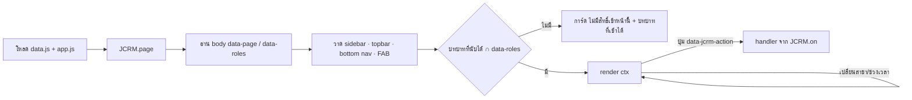

# prototype/ — คู่มือสำหรับผู้สร้างหน้าจอ (JAUN CRM · Customer 360)

> ฉบับ 16 ก.ย. 2569 · อ้างอิง `docs/00-brief/CANONICAL.md` **v2.2** · ชื่อ component/token ตาม `docs/06-ux/design-system.md` · เนื้อหาหน้าจอตาม `docs/06-ux/sitemap-screen-specs.md`
> prototype เป็น HTML/CSS/JS ล้วน เปิดจากไฟล์บนเครื่องได้ทันที ไม่มี build step ไม่มี CDN ไม่มีการเรียกเครือข่าย
> ก่อนส่งงานทุกครั้ง: `node tools/check-prototype.mjs --allow-missing` ต้องผ่าน (ครบ 19 หน้าแล้วรันแบบไม่มี flag)
> **ผู้สร้างหน้าจอห้ามแก้ไฟล์ใน `assets/`** — ถ้าต้องการ helper เพิ่ม ให้ขอผู้ดูแลชุดฐาน · ทุกอย่างที่ต้องใช้ร่วมกันอยู่ใน `JCRM.*` ตามคู่มือนี้

## สารบัญ

1. [ไฟล์ในโฟลเดอร์](#1-ไฟล์ในโฟลเดอร์) · 2. [กติกาไฟล์หน้าจอ + แม่แบบ](#2-กติกาไฟล์หน้าจอ--แม่แบบ) · 3. [ผู้ใช้ตัวอย่างและสิทธิ์](#3-ผู้ใช้ตัวอย่างและสิทธิ์) · 4. [`JCRM.page` และ ctx](#4-jcrmpage-และ-ctx) · 5. [URL และ action](#5-url-และ-action) · 6. [ข้อมูล `JCRM_DATA`](#6-ข้อมูล-jcrm_data) · 7. [ตัวเลือกข้อมูลตาม persona `JCRM.select`](#7-ตัวเลือกข้อมูลตาม-persona-jcrmselect) · 8. [ตัวจัดรูปแบบ `JCRM.fmt`](#8-ตัวจัดรูปแบบ-jcrmfmt) · 9. [Component](#9-component) · 10. [overlay และฟอร์ม](#10-overlay-และฟอร์ม) · 11. [กราฟ](#11-กราฟ) · 12. [Pipeline และ Kanban](#12-pipeline-และ-kanban) · 13. [คลาส CSS](#13-คลาส-css) · 14. [กติกาเนื้อหา](#14-กติกาเนื้อหา) · 15. [ตัวตรวจ](#15-ตัวตรวจ-toolscheck-prototypemjs) · 16. [หมายเหตุผู้เขียน](#16-หมายเหตุผู้เขียน)

## 1. ไฟล์ในโฟลเดอร์

| ไฟล์ | หน้าที่ |
|---|---|
| `index.html` | สารบัญ + ตัวสลับผู้ใช้ตัวอย่าง 14 คน (ข้อ 13.5) + การ์ดหน้าจอ 19 หน้า · `<body data-page="index" data-roles="">` |
| `01-login.html` | หน้าเข้าสู่ระบบ (สร้างเสร็จแล้ว) · `<body data-page="login" data-roles="">` · SA → `18-settings.html` · อื่น → `02-dashboard.html` |
| `assets/app.css` | token (ข้อ 15 · design-system ข้อ 6) + component ทั้งหมด · ขึ้นต้นด้วย `@import url("kanit-faces.css")` |
| `assets/kanit-faces.css` · `assets/fonts/` | ฟอนต์ Kanit self-host (ห้ามแก้) |
| `assets/data.js` | `window.JCRM_DATA` — ตัวเลขและรายการที่ระบุชื่อใน CANONICAL เท่านั้น |
| `assets/app.js` | `window.JCRM` — ข้อมูล · สิทธิ์ · โครงหน้า · ตัวจัดรูปแบบ · component · overlay/ฟอร์ม · กราฟ · Kanban · ตัวเลือกข้อมูลตาม persona |
| `../tools/check-prototype.mjs` | ตัวตรวจความสอดคล้อง (ข้อ 15) |

หน้าที่ต้องสร้างต่อ (18 หน้า): `02-dashboard` … `19-quotations` ตามตาราง CANONICAL ข้อ 14.1

## 2. กติกาไฟล์หน้าจอ + แม่แบบ

1. ชื่อไฟล์ `NN-id.html` ตามคอลัมน์ id ของข้อ 14.1
2. `<body data-page="id" data-roles="...">` — `data-roles` = **รหัสบทบาทเต็ม คั่นด้วยช่องว่าง ตามลำดับตาราง 14.1 ทุกตัวอักษร** (= `JCRM_DATA.screens[n].roles.join(" ")`) · หน้า 01 และ `index.html` ใช้ `data-roles=""`
3. ลำดับ include: `assets/app.css` → `assets/data.js` → `assets/app.js` → สคริปต์ของหน้า
4. `<style>` เฉพาะหน้าได้ แต่ **ห้ามมี hex** (ใช้ `var(--token)`) · ห้าม `style="color:#…"`
5. ห้าม URL `http(s)://` · ห้าม `fetch` · ห้ามโหลดไฟล์ภายนอก (รวมในคอมเมนต์)
6. วาดเนื้อหาลง `<div class="page" id="page">` ภายใน `<main>` — **อย่าแทนที่ `main.innerHTML`** (`JCRM.page` ใส่ป้าย "กรุณาใช้งานบนคอมพิวเตอร์" เป็นลูกของ main)
7. `render(ctx)` ต้อง idempotent (ถูกเรียกซ้ำเมื่อเปลี่ยนสาขาบนแถบบน หรือช่วงเวลาในหัวหน้า)
8. ผูกปุ่มด้วย `data-jcrm-action` + `JCRM.on()` ครั้งเดียวนอก `render` (ข้อ 5.2) — ไม่ต้อง addEventListener ใหม่ทุกครั้งที่ render

```html
<!DOCTYPE html>
<html lang="th">
<head>
<meta charset="utf-8">
<meta name="viewport" content="width=device-width, initial-scale=1">
<title>ลูกค้า · JAUN CRM</title>
<link rel="stylesheet" href="assets/app.css">
</head>
<body data-page="customers" data-roles="STAFF SUPERVISOR BRANCH_MANAGER OPERATIONS EXECUTIVE BUSINESS_ADMIN">
<div class="app" data-jcrm-app>
  <aside data-jcrm-sidebar></aside>
  <header data-jcrm-topbar></header>
  <main id="main" data-jcrm-main><div class="page" id="page"></div></main>
</div>
<script src="assets/data.js"></script>
<script src="assets/app.js"></script>
<script>
JCRM.on("open-customer", function (no) { location.href = JCRM.link("customer-360", { c: no }); });
JCRM.page({
  id: "customers",
  render: function (ctx) {
    var ui = ctx.ui, list = ctx.select.customersFor(undefined, { branch: ctx.branch });
    document.getElementById("page").innerHTML = ui.pageHeader({
      title: "ลูกค้า", lead: "ค้นหาและจัดการข้อมูลลูกค้าที่คุณเข้าถึงได้",
      actions: [
        { label: "+ เพิ่มลูกค้า", variant: "secondary", permission: "customer.create", href: ctx.link("quick-capture", { mode: "customer" }) },
        { label: "+ รับลูกค้า", variant: "accent", permission: "visit.create", href: ctx.link("quick-capture", { mode: "visit" }) }
      ]
    }) + '<div class="card card--flush" id="list"></div>';
    JCRM.table.mount("list", {
      caption: "ลูกค้า", rowKey: "customerNo", rowAction: "open-customer",
      columns: [
        { key: "customerNo", label: "รหัสลูกค้า", format: "code" },
        { key: "customerNo", label: "ชื่อลูกค้า", render: function (r) { return ui.avatar(r.displayName, "sm") + " " + JCRM.esc(JCRM.customerName(r.customerNo)); } },
        { key: "lastChannel", label: "ช่องทางล่าสุด", format: "channel", hide: "tablet" },
        { key: "customerNo", label: "สถานะ", format: "badges" },
        { key: "lastBranch", label: "สาขา", format: "branch" },
        { key: "lastActivityAt", label: "ติดต่อล่าสุด", format: "dateTime", sortable: true }
      ],
      rows: list.rows, footer: { shown: list.rows.length, total: list.total, unit: "รายการ" },
      empty: { title: "ยังไม่มีลูกค้าในสาขาของคุณ" },
      mobileCard: function (r) { return ui.listCard({ action: "open-customer", id: r.customerNo, avatar: r.displayName, title: JCRM.customerName(r.customerNo), meta: [r.customerNo], badges: ui.customerBadges(r) }); }
    });
  }
});
</script>
</body>
</html>
```



## 3. ผู้ใช้ตัวอย่างและสิทธิ์

- ผู้ใช้ปัจจุบัน `localStorage['jcrm.staff']` (ค่าเริ่มต้น `ST-0001`) · `JCRM.currentStaff()` · `JCRM.setStaff(code, { reload: true })` (ห่อ try/catch แล้ว)
- **aal:** บัญชีที่มีบทบาท `requires_mfa` ถือว่ายืนยัน TOTP แล้ว (aal2 · ข้อ 13.5) · STAFF ล้วน = aal1 · จำลอง aal1 ด้วย `JCRM.setAal("aal1")` (index มีช่องติ๊ก) — assignment ของบทบาทที่ต้อง MFA และสิทธิ์ 🔐 จะไม่ถูกนับ (ข้อ 8.0)
- `SUPERVISOR@X` นับได้เมื่อเป็นหัวหน้าทีมในสาขา X (ข้อ 7.1) · ผู้ใช้ `INVITED` ไม่มีสิทธิ์ใด
- ทุกฟังก์ชันรับ `as` = ไม่ส่ง (ผู้ใช้ปัจจุบัน) | `"ST-0046"` | `{ staffCode: "ST-0030", aal: "aal1" }`

### 3.1 `JCRM.can(permission, ctx?, as?)` — ตามข้อ 8.0

| ctx | ใช้กับ | ผ่านเมื่อ (ต่อ assignment แล้วรวม OR) |
|---|---|---|
| ไม่ส่ง | ซ่อน/แสดงทั่วไป (= `app.has_permission`) | มีสิทธิ์นี้ในบาง scope |
| `{ branch, owner, createdBy }` | แถวที่มี `branch_id` | B สาขาตรง · T สาขาตรงและ owner เป็นสมาชิกทีมที่ตนนำ (`lead.assign`/`task.assign` รวม owner ว่าง · ข้อ 8.0 v2.2) · O owner = ตน หรือ owner ว่างและ createdBy = ตน · G ทุกแถว |
| + `viaCustomer: { branches, owner }` | read-through ของ `visit/interaction/lead/opportunity/quotation/transaction.read` (**ไม่รวม task**) | ผ่านตามแถว หรืออ่านลูกค้าได้ |
| `{ customer: { branches, owner } }` | แถวลูกค้า (`JCRM.customerCtx(no)`) | B ลูกค้าเชื่อมสาขา · T/O เชื่อมสาขาและ owner ตามข้างบน · G ทุกราย |
| `{ system: true }` | บัญชี · settings · integration | S หรือ G |

### 3.2 `JCRM.access(permission, ctx?, as?)` → `{ visible, allowed, reason }` — ซ่อน vs ปิดพร้อมเหตุผล (ข้อ 14.1)

- บทบาทของบัญชี**ไม่มีสิทธิ์นั้นเลย** (ตาราง 8.1 เป็น `–`) → `visible: false` → **ซ่อน**
- มีสิทธิ์แต่แถวไม่ผ่านขอบเขต/ยังไม่ aal2 → `visible: true, allowed: false, reason` → **ปุ่มปิดพร้อมเหตุผล** · ข้อความมาตรฐาน (`D.meta.texts`): `reasonOwn` "แก้ได้เฉพาะรายการที่คุณเป็นผู้รับผิดชอบ" · `reasonTeam` "แก้ได้เฉพาะรายการของสมาชิกในทีมคุณ" · `reasonMfa` "ต้องยืนยันตัวตนสองขั้นตอน (MFA) ก่อน" · `reasonOutOfBranch` "รายการนี้อยู่นอกสาขาในสิทธิ์ของคุณ" · `reasonStatus` · `reasonLimit`
- เหตุผลเฉพาะหน้า (เช่น "บันทึกผลได้เฉพาะคิวที่คุณรับ") ส่งผ่าน `ui.permButton({ reason })`

```js
JCRM.access("customer.update", { customer: JCRM.customerCtx("CUS-2026-000297") }, "ST-0046"); // { visible: true, allowed: false, reason: "แก้ได้เฉพาะรายการที่คุณเป็นผู้รับผิดชอบ" }
JCRM.access("customer.update", undefined, { staffCode: "ST-0010", aal: "aal2" });              // { visible: false } → ซ่อน (OPERATIONS)
JCRM.scopeBranches("opportunity.read", "OWN");   // สาขาที่มีสิทธิ์ ≥ scope ที่ขอ (= app.scope_branch_ids)
JCRM.topScope("task.read");                      // "OWN" | "TEAM" | "BRANCH" | "ORGANIZATION" | "SYSTEM" | null
JCRM.canOpen("reports"); JCRM.landingFile();     // เปิดหน้าได้ไหม · "18-settings.html" สำหรับ SA
JCRM.searchVisible();                            // false เมื่อบัญชีมีเฉพาะ MARKETING/SYSTEM_ADMIN (ข้อ 14.3 v2.2)
JCRM.periodEnabled("dashboard");                 // true เฉพาะ dashboard · reports · data-quality (ข้อ 14.3 v2.2)
JCRM.canClaimQueue("JP1");                       // รับคิว WAITING ได้ไหม (visit.update scope ใดก็ได้ในสาขา · ข้อ 4.1)
```

กติกาเฉพาะหน้า (ข้อ 8.1 ท้ายตาราง): BUSINESS_ADMIN ใช้หน้า 04 ได้เฉพาะ "เพิ่มลูกค้า" · EXECUTIVE เปิดหน้า 13 เพื่อดูและอนุมัติคำขอบทบาทเท่านั้น · MARKETING เปิดหน้า 14 เฉพาะแท็บ Tag และแคมเปญ

## 4. `JCRM.page` และ ctx

```js
JCRM.page({
  id: "pipeline",            // ต้องตรง <body data-page>
  render: function (ctx) {}, // วาดเนื้อหา · เรียกซ้ำเมื่อเปลี่ยนสาขา/ช่วงเวลา
  branchPicker: true,        // ตัวเลือกสาขาบนแถบบน (แสดงเมื่อผู้ใช้มี > 1 สาขา)
  defaultBranch: "JP1",      // ไม่ต้องใส่สำหรับหน้า 06 07 08 11 12 (data.js ตั้ง multiBranchDefault = JP1 · ข้อ 14.1)
  period: false,             // ปิดตัวเลือกช่วงเวลาได้ · เปิดเองไม่ได้ (มีเฉพาะหน้า 02 09 12 · ข้อ 14.3 v2.2)
  fab: true                  // FAB "+ รับลูกค้า" แท็บเล็ต (ซ่อนบนหน้า 04 07 อัตโนมัติ · ต้องมี customer.create + visit.create)
});
```

`ctx = { pageId, screen, staff, staffCode, roles, aal, branch, branches, preset, periodEnabled, allowed, scope, can, access, select, link, param, D, fmt, ui }`

- `ctx.branch` = `"ALL"` หรือรหัสสาขา · ผู้ใช้สาขาเดียวถูกล็อก · หน้า 06 07 08 11 12 ของผู้ใช้หลายสาขาเริ่ม JP1 · หน้าอื่นเริ่มจาก `sessionStorage['jcrm.branch']` หรือ "ทุกสาขา"
- `ctx.preset` = `"LAST_30_DAYS"` (ค่าเริ่มต้น) หรือ `"TODAY"` เฉพาะหน้าที่ `ctx.periodEnabled` · ตัวเลือกช่วงเวลา **อยู่ในหัวหน้า** — หน้า 02 09 12 ต้องวาด `ui.pageHeader(...)` (ใส่ picker ให้อัตโนมัติ)
- `ctx.scope` = `JCRM.select.scope()` → `{ kind: "org"|"branch"|"team"|"own"|"none", branches, team, isEmptyScope, roles }`
- เหตุการณ์บน `document`: `jcrm:branchchange` · `jcrm:periodchange` (detail = ctx) · `jcrm:tabchange` (detail = `{ tabsId, tab }`)
- สิ่งที่ `page()` ทำให้: sidebar ตามข้อ 14.2 (ซ่อนกลุ่มที่ไม่มีหน้าเปิดได้ · หน้า 05 ไฮไลต์ "ลูกค้า") · แถบบน (ค้นหา · กระดิ่ง 13.14 พร้อมปลายทาง · ผู้ใช้/บทบาท/สาขา · ตัวเลือกสาขา) · bottom nav มือถือ + แผ่น "เพิ่มเติม" (ข้อ 14.4) · FAB แท็บเล็ต · การ์ดไม่มีสิทธิ์ · ป้าย "กรุณาใช้งานบนคอมพิวเตอร์" บนมือถือของหน้า 09 13 14 15 16 17 18
- ค้นหากลาง: ซ่อนสำหรับ MARKETING/SYSTEM_ADMIN · ส่งเมื่อกด Enter (ไม่ค้นขณะพิมพ์ · design-system ข้อ 7.8) · `/` โฟกัสช่องค้นหา · คำค้นไม่ลง URL
- ออกจากระบบ (`JCRM.logout()` · `[data-jcrm-logout]`): ลบ `jcrm.staff` `jcrm.aal` + ล้าง sessionStorage · **คง `jcrm.login_id`** (ข้อ 9.2 v2.2)

## 5. URL และ action

### 5.1 URL (sitemap-screen-specs ข้อ 1.1 · ใส่ได้เฉพาะรหัสอ้างอิง/รหัสตัวกรอง · ห้ามคำค้น เบอร์ อีเมล ชื่อ)

| หน้า | พารามิเตอร์ | ตัวอย่าง `JCRM.link(...)` |
|---|---|---|
| 04 | `mode=visit` (+ รับลูกค้า · เปิด visit) · `mode=customer` (เพิ่มลูกค้าอย่างเดียว) · `visit={visit_no}` | `JCRM.link("quick-capture", { mode: "visit" })` |
| 05 | `c={customer_no}` · `tab=` | `JCRM.link("customer-360", { c: "CUS-2026-000297" })` → `05-customer-360.html?c=CUS-2026-000297` |
| 06 | `op={opportunity_no}` · `view=board\|list` · `owner=` | `JCRM.link("pipeline", { op: "OP-2026-002998" })` |
| 08 | `group=all\|today\|overdue` | `JCRM.link("tasks", { group: "overdue" })` |
| 09 · 13 · 14 · 16 · 17 · 18 | `tab=` | `JCRM.link("users", { tab: "requests" })` |
| 11 | `lead={lead_no}` · `owner=me\|none\|ST-…` | `JCRM.link("leads", { lead: "LD-2026-007512" })` |
| 12 | `issue={issue_code}` | `JCRM.link("data-quality", { issue: "VISIT_UNRECORDED" })` |
| 15 | `ex={export_no}` | `JCRM.link("exports", { ex: "EX-2026-000031" })` |
| 19 | `qt={quotation_no}` | `JCRM.link("quotations", { qt: "QT-2026-001702" })` |

อ่านด้วย `JCRM.param("c")` — รับชื่อเดิมเป็น alias (`customer` → `c` · `opportunity` → `op` · `quotation` → `qt` · `mode=receive` → `visit` · `mode=add` → `customer`) · `JCRM.linkTarget({ screen, params })` ใช้กับ `target` ใน data.js

### 5.2 action registry

```js
JCRM.on("close-won", function (id, el, event) { /* id = data-jcrm-id */ });
ui.button({ label: "ปิดการขาย", variant: "primary", action: "close-won", id: "OP-2026-002998" });
```

- ปุ่ม/ลิงก์/แถวที่มี `data-jcrm-action="ชื่อ"` เรียก handler ที่ลงทะเบียน (ยังไม่ลงทะเบียน → console.warn) · ปุ่ม `aria-disabled="true"` ไม่เรียก handler แต่ toast เหตุผลจาก `data-tooltip`
- `select`/`input` ที่มี `data-jcrm-change="ชื่อ"` (เช่น `ui.branchSelect({ action })`) → handler(value)
- action มาตรฐานที่ component ส่ง (หน้าต้อง `JCRM.on` เอง): `queue-claim` `queue-record` `queue-menu` (id = เลขคิว) · `task-complete` (id = `ui.taskKey(row)`) · `contact-call` `contact-line` (id = customer_no · ไม่ลงทะเบียน = toast มาตรฐาน) · `openAction`/`rowAction`/`menuExtra[].action`/`bulkActions[].action` ที่หน้ากำหนดชื่อเอง (bulk: id = คีย์ที่เลือกคั่นด้วย ",")

## 6. ข้อมูล `JCRM_DATA`

| key | ข้อ | หมายเหตุ |
|---|---|---|
| `meta` | 1.2 · 9.2 · 12.0 · 14.1 · 14.3 | `now` · `periods` · `presets[].enabled` · `searchHiddenRoles` · `periodPickerScreens` · `logoutKeepKeys` · `texts` (ข้อความตรึงและข้อความมาตรฐาน UI) |
| `organization` `businessUnits` `branches` `teams` `teamMembers` | 2 · 13.5 | ชื่อทีมครบ 5 ทีม (v2.2) |
| `roles` `roleGrantRules` | 7 · 7.2 | |
| `permissions[perm][ROLE] = { scope, aal2, note? }` · `permissionMeta` · `permissionColumns` | 8.1 | |
| `screens` (`periodPicker` · `multiBranchDefault` · `desktopOnly`) `menuGroups` `mobileNav` `mobileMoreSheet` `tabletFab` | 14.1 · 14.2 · 14.3 · 14.4 | |
| `staff` `defaultPersonaByRole` `alternatePersonas` | 13.5 · 14.1 | |
| `lifecycleStages` `supplementaryBadges` (`vip` `followingUp` `newCustomer` `notContacted`) | 3.4 · 3.5 · 19.5 | `tone` = คลาส `.badge--{tone}` |
| `visitStatuses` `visitOutcomes` `leadStatuses` `opportunityStages` `opportunityMoveRules` `salesPath` `quotationStatuses` `taskStatuses` `taskTypes` `taskGroups` `taskTimeBadges` `priorities` `enums` | 4 · 4.4 v2.2 · 4.8 | `enums.*` มีป้ายไทยข้อ 4.8 v2.2 (`consentStatus` `consentCaptureVia` `duplicateStatus` `dsrStatus` `exportStatus` `roleGrantStatus` `roleGrantType` `dsrVerificationMethod` …) · `tone` ของสถานะที่ CANONICAL ไม่กำหนดสี = ข้อเสนอของ design-system ข้อ 2.5 ข |
| `channels` `sources` `interestTypes` `productTypes` `lostReasons` `interactionTypes` `transactionTypes` `sourceSystems` `provinces` `exportReasons` `duplicateOverrideReasons` `ownershipChangeReasons` `consentPurposes` `tags` | 5 · 10.2 | ใช้เป็น `ref` ของ select/radio/chips ในฟอร์ม (`{ ref: "lostReasons" }`) |
| `dataQualityIssues` `notificationTypes` (รวม 6 รหัสใหม่ v2.2) `kpiLabels` `kpiTargets` `settings` `settingValues` `exportLimits` | 8.2 · 11 · 12 | `settingValues` = ค่าที่ prototype ใช้คำนวณ (รอยืนยันค่า) |
| `population` `runningNumbers` | 13.0 | |
| `kpis.org` · `funnelStages` `funnels` · `kpis.branches/branchesTotal/branchComponents/branchPrevious/branchRates` · `kpis.sources` · `kpis.lostReasons` | 13.1–13.4 | อัตรา `{ num, den, display }` |
| `kpis.staffJP1` `kpis.teamJP1Sales` · `kpis.today` · `kpis.dataQuality` | 13.6 · 13.11 · 13.12 | |
| `kpis.current` | 12.1 · 13.1 · 13.6 · 13.9 · 13.11 | รหัส KPI "ณ ตอนนี้": `OPEN_LEADS(_BY_STATUS)` `OPEN_OPPORTUNITIES(_BY_STAGE)` `OPEN_PIPELINE_AMOUNT(_BY_STAGE)` `WON_LAST_7_DAYS(_AMOUNT)` `TASKS_TODAY` `TASKS_OVERDUE` `OPEN_VISITS` `OPEN_FOLLOWUP_CUSTOMERS` แยก `org` · `branches` · `staff` · `unassigned` · `teams` |
| `kpis.emptyScopes["ST-0050"]` | 13.13 v2.2 | คุณฝน: จำนวน 0 · KPI ไม่ผูกพนักงานและอัตรา 0/0 = `null` |
| `customers` (`branch` `owner` `lastBranch` `firstBranch` `lastActivityAt` `contacts[].full`) · `customer360["CUS-2026-000297"]` · `leads` `opportunities` `quotations` `tasks` | 13.5 · 13.7–13.10 · 13.14 | `contacts[].full` ใช้จำลอง reveal เท่านั้น |
| `customerList` · `recentCustomers["ST-0045"]` · `recentActivity` · `pipelineJP1` (priority ครบ 8 การ์ด) · `tasksKwan` · `queueJP1` `onlineVisitsJP1Today` | 13.5 v2.2 · 13.8–13.11 | |
| `notifications[staffCode]` (`target` = ปลายทาง) `ownershipChanges` `duplicateCheckDemo` `duplicateRules` `duplicatePairs` `exportRequests` `roleGrantRequests` `auditSamples` `dataSubjectRequests` | 13.14 · 6.5 | |
| `dashboards[]` (การ์ด `{ labelTh, value, display, delta, ref, kpiCode, asOf, target }` · widget `{ type, titleTh, ref }`) · `mobileHome` | 14.7 · 14.4 | |

ตัวเข้าถึง: `JCRM.screen(id)` · `role` · `staff` · `branch` · `team` · `teamsOf(staffCode)` · `customer(no)` · `ref(list, code)` · `refList(list)` · `label(list, code)` (ไม่พบ → "–") · `enumItem` · `staffName` · `branchName` · `customerName(no)` ("คุณ" + ชื่อ) · `customerCtx(noหรือobject)` · `get("recentCustomers.ST-0045")` · `find(list, key, value)` · `storage` / `session` (`get/set/remove/clear` · ห่อ try/catch)

## 7. ตัวเลือกข้อมูลตาม persona `JCRM.select`

คืนเฉพาะค่าที่ CANONICAL พิมพ์ · ค่าไม่รู้ = `null` (แสดง "–") · `sample` = options ของ `ui.sampleNote` (null = ไม่ต้องแสดง) · มี alias บน `JCRM.data` เช่น `JCRM.data.tasksFor("ST-0045")` · อาร์กิวเมนต์แรก `as` (ไม่ส่ง = ผู้ใช้ปัจจุบัน)

| ฟังก์ชัน | คืน | ใช้ในหน้า |
|---|---|---|
| `scope(as)` | `{ kind, branches, team, isEmptyScope, roles, staff }` | ทุกหน้า |
| `notificationsFor(as)` | `[{ index, code, titleTh, bodyTh, createdAt, href }]` | กระดิ่ง · 10 |
| `dashboardFor(as, { branch })` | `{ layout: "org"\|"branchManager"\|"supervisor"\|"staff"\|"none", cards, widgets, scopeTh, branch, sample, empty }` — การ์ดของสาขาอื่น/คุณคิม/คุณฝนคำนวณจากแถวที่พิมพ์ · MARKETING ไม่มี widget กิจกรรมล่าสุด · BA มีแถวคุณภาพข้อมูล | 02 · 10 |
| `kpisFor(as, { branch, preset })` | `{ kind, values: {CODE}, rates: {CODE: {num,den,display}}, growth, pp, notes }` — scope ทีม/ของตน: KPI ไม่ผูกพนักงาน = null + `notes[0]` = ข้อความขอบเขตทีม · คุณฝน = ข้อ 13.13 · preset TODAY = ข้อ 13.11 | 02 · 09 · 12 |
| `tasksFor(as, { branch, owner, group })` | `{ rows, counts: { total, today, overdue } \| null, sample, empty, showOwner }` · `null` เมื่อไม่มี `task.read` | 02 · 08 · 10 |
| `groupTasks(rows, counts)` | กลุ่ม "เกินกำหนด" → "วันนี้" สำหรับ `ui.taskList` | 08 |
| `customersFor(as, { branch, preset, lifecycle, badges, channels })` | `{ rows, total, empty, sample }` — ยอดรวมจาก 13.2 / 13.11 · มีตัวกรองสถานะ/ช่องทาง → total null | 03 · 10 |
| `recentCustomersFor(as)` | ลูกค้าของฉันล่าสุด 5 ราย (ข้อ 13.5 v2.2) `{ rows: [{ customer, customerNo, lastActivityAt }] }` | 02 STAFF · 10 |
| `recentActivityFor(as, { branch })` | กิจกรรมล่าสุด (5 แถวแรก 13.8 · BM เห็นเฉพาะสาขาตน) `{ rows: [{ customer, channel, branch, at }] }` · null สำหรับ MK/SV/ST | 02 |
| `pipelineFor(as, { branch, owner, productType })` | `{ columns (พร้อมส่ง kanban.mount), sample, empty, branch }` | 06 |
| `queueFor(as, { branch })` | `{ rows, chips: { walkIn, onlinePhone, visits, openVisits }, branch, readOnly }` | 07 |
| `leadsFor(as, { branch, status, owner })` | `{ counts: { OPEN, NEW, CONTACTED, QUALIFIED }, rows, total, sample, empty }` | 11 |
| `quotationsFor(as, { branch, status })` | `{ rows, empty, sample }` | 19 |
| `dataQualityFor(as, { branch })` | `{ targets: [{ kpi, labelTh, rate }], issues: [{ code, labelTh, count, fixPermission }], empty }` | 12 · 02 BA |
| `exportsFor(as)` | `{ mine, pending }` (ผู้อนุมัติตาม `exportLimits` · ≠ ผู้ขอ) | 15 |
| `staffListFor(as)` | พนักงานที่เห็นตาม `user.read` (T/B/G/S) | 13 |
| `customer360For(as, no)` · `timelineFor(no)` | `{ customer, detail, readable, sample }` · items ของ `ui.timeline` (ชิป visit · สถานะ · ผล · LD/OP/QT) | 05 · 10 |

```js
var t = JCRM.select.tasksFor(undefined, { branch: ctx.branch, group: JCRM.param("group") });
document.getElementById("tasks").innerHTML = !t ? "" : (t.sample ? ctx.ui.sampleNote(t.sample) : "") +
  ctx.ui.taskList({ groups: JCRM.select.groupTasks(t.rows, t.counts), showOwner: t.showOwner, empty: { title: "ไม่มีงานที่ต้องทำวันนี้" } });
```

## 8. ตัวจัดรูปแบบ `JCRM.fmt`

ปัดแบบ half away from zero ด้วยจำนวนเต็ม — **ห้าม `Math.round`/`toFixed` กับตัวเลขที่แสดง** (ตัวตรวจค้น `Math.round(`)

| ฟังก์ชัน | ตัวอย่าง |
|---|---|
| `fmt.int(3125)` | `3,125` · ลบ `−1,234` · null → `–` |
| `fmt.money(3332700)` · `fmt.money(28900.5)` · `fmt.moneyTable(1245000)` | `฿3,332,700` · `฿28,900.50` · `1,245,000` (หัวคอลัมน์ต้องมี "(บาท)") |
| `fmt.pct(215, 892)` · `fmt.rate({num,den,display})` · `fmt.pctValue(95.4)` | `24.1%` · display · `95.4%` (ขั้นแรก funnel `100.0%`) |
| `fmt.growth(3125, 2790)` · `growthInfo` | `+12%` · `−5%` · `0%` · ก่อนหน้า 0/ว่าง → `–` |
| `fmt.pp(215, 892, 182, 826)` · `ppInfo` | `+2.1 pp` |
| `fmt.meetsTarget(num, den, "CAPTURE_RATE")` | เทียบค่าที่ยังไม่ปัด |
| `fmt.showing(5, 1284)` · `fmt.showing(2, null, { unit: "รายการ" })` | `แสดง 1–5 จาก 1,284` · `แสดง 1–2 จาก – รายการ` |
| `fmt.date` · `fmt.dayMonth` · `fmt.time` · `fmt.dateTime` · `fmt.asOf()` | `11 ก.ย. 2569` · `11 ก.ย.` · `10:24 น.` · `11 ก.ย. 2569 10:24` (ในตารางไม่มี "น." · ข้อ 19.5) · `ณ 11 ก.ย. 2569 10:24 น.` |
| `fmt.rangeInclusive("2026-08-13", "2026-09-12")` · `fmt.addDays` | `13 ส.ค. – 11 ก.ย. 2569` |
| `fmt.dayKey` · `fmt.compareIso` · `fmt.minutesBetween(a, b)` | เทียบวัน · นาทีเต็ม (คิว "รอ 12 นาที") |
| `fmt.round(2.675, 2)` · `fmt.deltaDir` · `fmt.minutes(18)` · `fmt.dash` | `2.68` · `up` · `18 นาที` · `–` |

## 9. Component

ทุก `ui.*` คืน HTML string (escape ค่าให้แล้ว) · `ui.*` ที่รับ `permission` ซ่อน/ปิดตามข้อ 3.2

### 9.1 โครงหน้า · ปุ่ม · สถานะ

| ฟังก์ชัน | ผล |
|---|---|
| `ui.pageHeader({ title, lead, back: { label, href }, breadcrumb: [{ label, href }], meta, actions: [html \| ui.button opts \| permButton opts] })` | หัวหน้า + ตัวเลือกช่วงเวลา (อัตโนมัติเฉพาะหน้า 02 09 12) · ปุ่มส้มได้ ≤ 1 |
| `ui.button({ label, variant, href, action, id, icon, iconOnly, size: "sm"\|"lg", block, busy, disabledReason, attrs })` | variant ตาม design-system 7.1: **`accent` ส้ม (CTA หลักเท่านั้น)** · `primary` navy (อนุมัติ · ยืนยัน · ส่ง) · `secondary` ขอบ navy (ปุ่มรอง · ส่งออก · รับเข้าคิว) · `ghost` (ยกเลิก · ล้างตัวกรอง) · `danger` · `danger-outline` (ปฏิเสธ · ไม่สำเร็จ) · `outline` (กลาง) |
| `ui.permButton({ ...button, permission, ctx, as, reason, extra: { ok, reason } })` | ซ่อน / ปิดพร้อมเหตุผล / ปกติ · `extra` = เงื่อนไขสถานะเพิ่ม |
| `ui.state(kind, o)` | `"empty"` `"noresult"` (`clearAction`) `"error"` (`retryAction`) `"notfound"` `"locked"` (`phase`) `"desktop-only"` `"mfa"` `"sample"` `"loading"` `"noaccess"` (= C-STATE-*) · o = `{ title, text, icon, action, compact }` |
| `ui.sampleNote({ shown, total } \| { scopeTh } \| { text })` | แถบ C-STATE-SAMPLE "ข้อมูลตัวอย่างมีเฉพาะรายการที่ระบุชื่อ · แสดง k จาก N รายการ" |
| `ui.noPermission({ roles, text, inline })` · `ui.piiWarn()` · `ui.lockScreen()` · `ui.phoneFrame({ title, html, href })` | การ์ดไม่มีสิทธิ์ · C-PII-WARN ข้อ 6.9 · C-LOCK · C-PHONE-FRAME (หน้า 10) |

### 9.2 KPI · ป้าย · อื่น ๆ

| ฟังก์ชัน | ผล |
|---|---|
| `ui.kpiCard({ label, value \| display, format: "int"\|"money"\|"pct", rate, preset, asOf, period, delta, deltaNote, target: { num, den, kpi }, sub, note, href, icon, tooltip, compact })` | C-KPI · บรรทัดช่วงเวลา (preset/`ณ …`) · delta มี tooltip ช่วงเทียบอัตโนมัติ · `target` = C-KPI-TARGET (แถบ + เส้นเป้า + ผ่าน/ต่ำกว่าเป้า ด้วยค่าที่ยังไม่ปัด) · null → "–" |
| `ui.kpiFromCard(card)` · `ui.kpiGrid([html])` | การ์ดจาก `dashboards[].cards[]` / `select.dashboardFor().cards` · กริด |
| `ui.lifecycle(code)` · `ui.supplementary(keys)` · `ui.customerBadges(noหรือobj)` | ป้าย lifecycle + ป้ายเสริม ≤ 3 + `+N` (tooltip รายชื่อ) |
| `ui.status(listName, code)` · `ui.priorityBadge(code)` · `ui.priority(code)` · `ui.interestLevel(code)` · `ui.channel(code, { short })` · `ui.badge(text, tone)` | สถานะจาก `D.*`/`D.enums` (เช่น `ui.status("exportStatus", "EXPIRED")`) · ความสำคัญ (null → ไม่แสดง) · ระดับความสนใจ · ช่องทางมีจุดสี + ข้อความ |
| `ui.avatar(name, "xs"\|"sm"\|"lg", { solid })` · `ui.initials(name)` | C-AVATAR · "สมชาย ใจดี" → "สจ" · "คุณขวัญ" → "ข" |
| `ui.tabs({ id, label, tabs: [{ id, label, count, html, hidden, error }], selected, variant: "pill", param: "tab" })` | C-TABS · แท็บ hidden ไม่แสดง · `param` sync `?tab=` · ←→ Home End ย้าย · `page()` เรียก `initTabs` ให้ |
| `ui.segmented({ label, options: [{ value, label }], value, action })` | มุมมอง Pipeline/รายการ · handler(value) |
| `ui.stepper({ name, label, value, min, max, required })` · `ui.chipGroup({ name, label, ref \| options, value, multiple, required })` | C-STEPPER (− ปิดเมื่อถึงค่าต่ำสุด) · C-CHIPS (`ref: "interestTypes"` = 7 ค่า) |
| `ui.branchSelect({ id, permission, value, includeAll, action })` · `ui.presetSelect({ id, value, action })` | select สาขาในตัวกรองของหน้า (สาขาเดียว → ข้อความ) · select ช่วงเวลาในตัวกรอง (เปิดเฉพาะวันนี้/30 วันล่าสุด) |
| `ui.pagination({ shown, total, unit, pages, page, action })` · `ui.showing(n, total, opts)` | C-PAGINATION "แสดง 1–N จาก M" |

### 9.3 ตาราง · รายการ · ไทม์ไลน์ · คิว · งาน · ข้อมูลติดต่อ

| ฟังก์ชัน | ผล |
|---|---|
| `ui.table(o)` · `JCRM.table.mount(el, o)` → `{ render(patch), selected() }` | C-TABLE · `columns: [{ key, label, format, render(row), sub(row), hide: "tablet"\|"mobile", sortable, sortValue(row) }]` · format: `int` `money` `moneyTable` `rate` `pct` `date` `dateTime` `time` `dayMonth` `channel` `branch` `staff` `customer` `customerLink` `lifecycle` `badges` `priority` `status:<list>` `code` · `rowKey` `rowHref(row)` `rowAction` · `selectable` + `bulkActions` (แถบ "เลือก N รายการ") · `totalRow: { label, values }` · `footer: { shown, total, unit }` / `false` · `empty` / `emptyKind` · `sample` · `mobileCard(row)` (มือถือแสดงการ์ด) · `stickyFirst` · `compact` · `mount` เรียงคอลัมน์ `sortable` ให้ในหน่วยความจำ |
| `ui.listCard({ href \| action + id, avatar, title, meta: [], badges, side })` | การ์ดรายการมือถือ |
| `ui.timeline({ items: select.timelineFor(no), empty })` | C-TIMELINE · หัววัน · โหนดวงสีช่องทาง · `{ช่องทาง} · {ทิศทาง} · {สาขา}` · ชิป |
| `ui.queueList({ rows, branch, now, as, empty, actions(row) })` | C-QUEUE · "รอ N นาที" · เกิน `sla.visitor_waiting_min` (15) → "รอนาน" · ปุ่มมาตรฐาน รับคิว/บันทึกผล + ⋮ (action ข้อ 5.2) |
| `ui.taskList({ groups, showOwner, now, as, empty, openAction })` · `ui.taskKey(row)` | C-TASK · checkbox ทำเสร็จตาม `task.update` บนแถว · "เกินกำหนด" (danger) / "เลยเวลา" (warning) |
| `ui.contactRow({ customerNo, type, only })` · `ui.contactList(no)` | C-CONTACT · ค่าปิดบัง · ปุ่ม แสดง/ซ่อน · โทร · คัดลอก · เปิด LINE ตามชนิด · แสดงค่าเต็ม 30 วินาทีแล้วซ่อน (ซ่อนทันทีเมื่อแท็บถูกซ่อน) · toast `CONTACT_REVEALED` + purpose · เกิน `security.reveal_per_hour` (30/ชม. ในแท็บนี้) → ปฏิเสธ + toast `REVEAL_LIMIT_EXCEEDED` · ไม่มีสิทธิ์ → ไม่มีปุ่ม + caption "บทบาทของคุณดูได้เฉพาะค่าที่ปิดบัง" · EX/BA ที่ aal1 → ปุ่มปิด "ต้องยืนยันตัวตนสองขั้นตอน (MFA) ก่อน" |

## 10. overlay และฟอร์ม

| ฟังก์ชัน | ผล |
|---|---|
| `JCRM.toast(message, "success"\|"info"\|"warning"\|"danger", { title, duration, persist })` | C-TOAST มุมขวาล่าง (มือถือเหนือ bottom nav) · success/info หาย 5 วินาที · warning/danger อยู่จนปิด · ≤ 3 อัน · **ห้ามใส่เบอร์/อีเมล/LINE ID** |
| `JCRM.dialog({ title, size: "sm"\|"md"\|"lg", intro, body, fields, values, submitLabel, submitVariant, cancelLabel, ack, typeToConfirm, onSubmit(values, ctl), onCancel })` → `ctl { el, close, cancel, setBusy, setErrors, values }` | C-DIALOG สร้างด้วยโค้ด · focus trap · Esc · ตรวจฟอร์มก่อนเรียก `onSubmit` · `onSubmit` คืน `true` ปิด / `false` ค้าง / `{ errors: { field: msg } }` · `ack: true` = checkbox "ฉันเข้าใจว่าย้อนกลับไม่ได้" บังคับ · `typeToConfirm: "CUS-…"` |
| `JCRM.drawer({ title, ref, wide, body, fields, values, submitLabel, onSubmit, onCancel, dirtyCheck })` | C-DRAWER (480/640px · มือถือเต็มจอจากล่าง) · ปิดขณะแก้แล้ว → ถาม "ยกเลิกการแก้ไข?" |
| `JCRM.confirm({ title, message, confirmLabel, variant, ack, typeToConfirm, onConfirm })` | ยืนยัน (ปุ่มต้องเป็นกริยาจริง ห้าม "ตกลง") |
| `JCRM.reasonDialog({ title, ref, label, requiredMessage, noteLabel, noteRequiredWhen: "OTHER", extraFields, submitLabel, submitVariant, intro, onSubmit })` | เหตุผลบังคับจาก `ref.*` + หมายเหตุ (บังคับเมื่อ OTHER · มี C-PII-WARN) |
| `JCRM.openDialog(id)` / `closeDialog` · `openDrawer(id)` / `closeDrawer` · `openSheet` | สำหรับ markup ที่เขียนเอง (`data-jcrm-close`) |

**ฟิลด์ฟอร์ม** (`fields` ของ dialog/drawer · `JCRM.form.render/read/validate/showErrors/sync`):
`{ name, label, type, required, requiredWhen: { field, equals | in }, visibleWhen: { field, equals | in | truthy }, ref | options, placeholder, help, value, min, max, maxLength, rows, unit, piiWarn, requiredMessage, minMessage, validate(v, values), inline, readonly, width: "half" }`
type: `text` `email` `tel` `textarea` (ตัวนับ "0/2,000") `number` `money` `select` `radio` `checkbox` `checkboxes` `chips` `chipsMulti` `date` `datetime` `time` `stepper` `static` (`html`) `hidden`
ข้อความผิดค่าเริ่มต้น "เลือก{label}" / "กรอก{label}" · กล่องสรุป "กรุณาแก้ไข N ช่อง" + ลิงก์ไปช่อง · ช่อง `piiWarn`/textarea ที่มีเลขบัตรประชาชน 13 หลัก checksum ถูก → "ข้อความมีเลขที่อาจเป็นเลขบัตรประชาชน ระบบไม่อนุญาตให้บันทึก" (จำลอง trigger ข้อ 10.1 · `JCRM.form.containsThaiId`)

```js
JCRM.on("mark-lost", function (opNo) {
  JCRM.reasonDialog({ title: "บันทึกไม่สำเร็จ", ref: "lostReasons", label: "เหตุผลที่ไม่สำเร็จ", requiredMessage: "เลือกเหตุผลที่ไม่สำเร็จ",
    submitLabel: "บันทึกไม่สำเร็จ", submitVariant: "danger",
    onSubmit: function (v) { JCRM.toast("บันทึกไม่สำเร็จ " + opNo + " แล้ว (prototype)", "success"); return true; } });
});
JCRM.on("close-won", function (opNo) {
  JCRM.dialog({ title: "ปิดการขาย", fields: [
      { name: "won_amount", label: "ยอดขาย (บาท)", type: "money", required: true, value: 45900, min: 0.01, minMessage: "ยอดขายต้องมากกว่า 0" },
      { name: "won_at", label: "วันเวลาปิดการขาย", type: "datetime", required: true, value: "2026-09-11T10:24" }],
    submitLabel: "ปิดการขาย", submitVariant: "primary", onSubmit: function () { return true; } });
});
```

## 11. กราฟ

`JCRM.chart.*(elementOrId, options)` · สีเป็นชื่อ token · ทุกกราฟมีปุ่ม "ดูเป็นตาราง" (`tableToggle: false` ปิดได้) · `<svg role="img">` + `<desc>` · โดนัท/funnel มีเส้นคั่น 2px `--chart-separator` (= `#FBFBFB` · ข้อ 15 v2.2) · ข้อมูลว่าง → C-STATE-EMPTY หรือ `sample`

```js
JCRM.chart.donut("src", { title: "แหล่งที่มาลูกค้า", segments: JCRM.chart.sourceSegments(D.kpis.sources.total), centerValue: 1284, centerLabel: "ลูกค้าไม่ซ้ำ" }); // ≤ 0 ไม่แสดง · legend ชื่อ · จำนวน · % ตาม sort_order
JCRM.chart.donut("nr", { title: "ลูกค้าใหม่/ลูกค้าเก่า", segments: JCRM.chart.newReturningSegments("JP1"), centerValue: 412, centerLabel: "ลูกค้าไม่ซ้ำ" });
JCRM.chart.funnel("fn", { title: "Funnel ลูกค้า", stages: JCRM.chart.funnelStages("JP1", "kpi") });   // ขั้นแรก 100.0% · tooltip period-based บังคับ
JCRM.chart.hbar("lost", { title: "เหตุผลที่ไม่สำเร็จ", items: JCRM.chart.lostReasonItems("JP1") });      // 5 อันดับ + อื่น ๆ · สีเดียว --chart-lost · "27 · 28.1%"
JCRM.chart.hbar("walkin", { title: "ลูกค้าเข้าร้านแยกตามสาขา", items: JCRM.chart.walkinByBranchItems(ctx.preset) }); // --chart-1
JCRM.chart.bar("x", { title: "…", items: [...] }); // แท่งแนวตั้ง (สำรอง · กราฟแนวโน้มไม่อยู่ใน Phase 0 · D44)
```

## 12. Pipeline และ Kanban

**กติกา (ข้อ 4.4 v2.2 · D48 · 14.9):** ย้ายด้วยมือได้เฉพาะ **เสนอราคา → รอตัดสินใจ** · **สนใจ → เสนอราคา/รอตัดสินใจ** เมื่อมีใบเสนอราคา `sent_at` แล้ว · **ห้ามย้อนเป็นสนใจ** · รอตัดสินใจ → เสนอราคา เป็นอัตโนมัติเท่านั้น · ปิดการขาย/ไม่สำเร็จผ่าน dialog

```js
JCRM.pipeline.allowedTargets("QUOTATION");                 // ["FOLLOW_UP"]
JCRM.pipeline.allowedTargets("INTERESTED", true);          // ["QUOTATION", "FOLLOW_UP"] · ไม่ส่งค่า = ตามนิยามขั้น (สนใจ = ยังไม่เสนอราคา → [])
JCRM.pipeline.checkMove("FOLLOW_UP", "INTERESTED");        // { ok: false, reasonKey: "toInterested", reason: "ย้อนกลับไปขั้นสนใจไม่ได้", tone: "warning" }
JCRM.pipeline.canMoveCard(card, "FOLLOW_UP");              // กติกา + opportunity.update บนแถว
```

```js
var p = JCRM.select.pipelineFor(undefined, { branch: ctx.branch, owner: filterOwner });
if (p.sample) { el.insertAdjacentHTML("beforebegin", ctx.ui.sampleNote(p.sample)); }
JCRM.kanban.mount("board", {
  columns: p.columns, openAction: "open-opportunity",
  menuExtra: function (card) { return card.stage === "WON" ? [] : [
    { label: "ปิดการขาย", action: "close-won", permission: "opportunity.close" },
    { label: "ไม่สำเร็จ", action: "mark-lost", permission: "opportunity.close" }]; },
  onMove: function (card, toStage) { /* คืน false เพื่อยกเลิก */ }
});
```

- การ์ดที่ผู้ใช้ไม่มี `opportunity.update` บนแถว หรือไม่มีปลายทาง: ไม่ลากได้ (`aria-disabled`) · เมนู ⋮ มี "ดูรายละเอียด" · "ย้ายไปขั้น…" แสดงเฉพาะปลายทางที่อนุญาต (ไม่มี → รายการปิดพร้อมเหตุผล)
- ลาก/เลือกทิศที่ไม่อนุญาต → toast เหตุผลจาก `D.opportunityMoveRules.reasonsTh` · สำเร็จ → ย้ายในหน่วยความจำ ปรับ "(N รายการ)" ±1 และมูลค่า ± มูลค่าการ์ด · toast "ย้าย คุณ{ชื่อ} ไปขั้น{ขั้น}แล้ว"
- การ์ดไม่มี priority → ขอบ `--priority-unknown` (ข้อ 19.5) · 13.9 v2.2 ระบุ priority ครบ 8 การ์ด · มือถือเป็นแท็บขั้น (segmented) แสดงทีละคอลัมน์
- `JCRM.kanban.get(id)` → controller `{ render, move(cardId, stage), find, options }`

## 13. คลาส CSS

| หมวด | คลาส |
|---|---|
| โครงหน้า | `.app` `.sidebar` `.topbar` `.main` `.page` `.page-header` (`__main __title __lead __meta __actions __back`) `.breadcrumb` `.section` `.section__title` `.filter-bar` (`--panel`) `.proto-note` |
| layout | `.grid .grid-2/3/4/6` `.grid-main-side` `.grid-side-main` `.span-2` `.span-all` `.stack` `.stack-2` `.stack-6` `.row` `.row-between` `.grow` `.ml-auto` `.hide-mobile` `.hide-tablet` `.show-mobile` `.col-hide-tablet` `.col-hide-mobile` `.no-print` `.sr-only` |
| ข้อความ | `.t-h1…t-h4` `.t-sm` `.t-xs` `.t-muted` `.t-medium` `.t-semibold` `.t-danger` `.t-success` `.t-warning` `.num` `.code` `.nowrap` |
| การ์ด/KPI | `.card` `--flush` `--raised` `--accent-left` `--info-left` · `.card__header/__title/__subtitle/__footer` · `.kpi-grid` `.kpi-card` (`__period __value.is-null __sub __note`) `.kpi-target__bar/__fill/__goal` `.delta--up/down/flat` `.target--pass/fail` |
| ป้าย | `.badge--success/warning/info/danger/neutral/navy` `--lifecycle` `--supp` `--vip` `--more` `--priority` `--count` `--square` `.badge-row` `.chip` `.priority[data-priority]` `.channel-dot.has-channel[data-channel]` |
| ปุ่ม | `.btn--accent` `--primary` `--secondary` `--outline` `--ghost` `--danger` `--danger-outline` `--sm` `--lg` `--block` `[aria-busy]` `[aria-disabled]` · `.icon-btn` · `.link-btn` · `.segmented` |
| ตาราง | `.data-table` (`--cards` · `__toolbar`) > `.table-wrap` > `.table` (`--compact` `--sticky-first`) · `.table__sort[data-dir]` · `td[data-numeric]` · `tr.is-total` · `.cell-sub` · `.list-cards` > `.list-card` · `.pagination` |
| ฟอร์ม | `.form-grid` `.field` (`--error` `--inline`) `.label` `.req` `.help` `.error-text` `.warning-text` `.pii-warn` `.form-summary` `.field__counter` `.input` `.select` `.textarea` `.input-group` `.checkbox` `.radio` `.checkbox-group` `.radio-group` `.password-field` `.stepper` `.chip-group` > `.chip-option` `.fieldset` |
| แท็บ/overlay | `.tabs` `.tabs--pill` `.tab` `.tab__count` `.tabpanel` · `.scrim.scrim--dialog` > `.dialog` (`--sm --md --lg`) · `.drawer` (`--wide`) · `.sheet` · `.toast` · `.alert--warning/danger/success` · `[data-tooltip]` · `.info-dot` · `.popover` `.menu-item` |
| สถานะ | `.state` (`--card --error --compact`) `.state-bar` (`--sample --mfa --locked`) `.skeleton` `.empty-state` `.no-permission` (`--inline`) `.desktop-only-notice` `.lock-screen` `.phone-frame` |
| เฉพาะงาน | `.timeline` > `.timeline__day` `.timeline__item` > `.timeline__dot--ring[data-channel]` · `.kanban` > `.kanban__col[data-drop]` > `.kanban-card[data-priority]` · `.queue-list` > `.queue-item[data-status][data-waiting-long]` · `.task-item[data-priority]` · `.group-head` · `.contact-row[data-revealed]` · `.chart[data-view]` `.chart__table` `.chart-legend` `.legend-item--button` · `.bottom-nav` · `.fab` |

## 14. กติกาเนื้อหา

1. **ตัวเลข ชื่อ รหัส มาจาก `JCRM_DATA` / `JCRM.select` เท่านั้น** · ห้ามพิมพ์ตัวเลขใน HTML · ค่าที่ CANONICAL ไม่มีแสดง `–`
2. คำนวณบนหน้าได้เฉพาะสูตรข้อ 12 จากตัวตั้ง/ตัวหารที่พิมพ์ในข้อ 13 (`fmt.pct/growth/pp`)
3. รายการยาวแสดงแถวที่ระบุชื่อ + "แสดง 1–N จาก {ยอดรวม}" · ไม่สร้างข้อมูลเติม · ข้อมูลไม่ครบใช้ `ui.sampleNote`
4. ป้ายการ์ด **ห้าม "เดือนนี้"** (D27) · ห้ามคำ "Conversion" เดี่ยว ใช้ `D.kpiLabels` · funnel มี tooltip period-based (`chart.funnel` ใส่ให้)
5. ปุ่มส้ม (`.btn--accent`) = CTA หลัก 1 ปุ่มต่อพื้นที่ตัดสินใจ (+ รับลูกค้าทั่วระบบ) · **ห้ามส้ม** กับการลบ อนุมัติ ส่งออก ตัวกรอง นำทาง (ข้อ 15 v2.2)
6. ช่องทางติดต่อแสดงค่าปิดบังเสมอ (`ui.contactRow`) · ห้ามใส่ `contacts[].full` ลง HTML ตอนโหลด
7. ทุกสถานะมีข้อความกำกับ · เป้าสัมผัส ≥ 44px (counter ≥ 48px) · ชื่อลูกค้าเติม "คุณ" ที่ UI · ช่องข้อความอิสระใช้ `piiWarn`
8. ผู้ใช้หลายสาขา (EX BA OP) บนหน้า 06 07 08 11 12 เริ่ม JP1 · คุณฝน (JPON) เห็น empty state และ KPI ตามข้อ 13.13 (`kpisFor`)
9. ตัวเลือกช่วงเวลามีเฉพาะหัวหน้า 02 09 12 · ตัวกรองวันที่ในหน้าอื่นใช้ `ui.presetSelect`
10. KPI ขอบเขตทีม/ของตนที่ไม่ผูกพนักงานแสดง `–` + ข้อความ "ตัวเลขนี้ไม่ผูกกับพนักงาน จึงไม่แสดงสำหรับขอบเขตทีม" (`D.meta.texts.teamScopeNull`)

## 15. ตัวตรวจ `tools/check-prototype.mjs`

```
node tools/check-prototype.mjs --allow-missing   # ระหว่างสร้างหน้า
node tools/check-prototype.mjs                   # เมื่อครบ 19 หน้า
```

1 โหลด data.js/app.js ได้ไม่มี DOM · 2 หน้าจอ ↔ ข้อ 14.1 + `data-page/data-roles` ของทุกไฟล์ (หน้า 01 และ `index.html` = `""`) · 3 เมนู/มือถือ/ผู้ใช้ 13.5 · 4 hex เฉพาะ `:root` · 5 ไม่มี URL ภายนอก/network · 6 ลำดับ include · 7 ผลรวมและร้อยละ 13.1–13.12 · 8 การ์ด dashboard 14.7 · 9 `JCRM.can` = 13.13 · ตัวจัดรูปแบบ · ห้าม `Math.round` · **10 ค่า v2.2:** สีกราฟ D49 · ป้ายไทย 4.8 · ชื่อทีม · ลูกค้าล่าสุด/กิจกรรมล่าสุด 13.5 · priority 13.9 · กระดิ่งและปลายทาง 13.14 · คำขอส่งออก · คู่ซ้ำ · NULL KPI คุณฝน · `kpis.current` · แจ้งเตือน/settings ใหม่ · กติกา 4.4 · **11 พฤติกรรม app.js:** ช่วงเวลา 02/09/12 · ค้นหาซ่อน MK/SA · ตารางความจริงการย้ายขั้น · `access` · `select.*` ต่อ persona · component (โดนัท/funnel/ตาราง/ฟอร์ม)

## 16. หมายเหตุผู้เขียน

- **สีป้ายสถานะ** ที่ CANONICAL ไม่กำหนด (`visit/lead/opportunity/quotation/task status` · `staffStatus` `interestLevel`) ใช้ข้อเสนอ design-system ข้อ 2.5 ข · `exportStatus` `dsrStatus` ตาม sitemap-screen-specs หน้า 15/17 · `duplicateStatus` `consentStatus` `roleGrantStatus` เป็นข้อเสนอของ prototype (ป้ายไทยตาม 4.8 v2.2)
- **มีใบเสนอราคาแล้วหรือไม่** (ข้อ 4.4) ไม่ได้พิมพ์ต่อการ์ดในข้อ 13.9 → ใช้นิยามขั้นในตาราง 4.4 (สนใจ = ยังไม่เสนอราคา · เสนอราคา/รอตัดสินใจ = มีใบ SENT) · หน้าส่ง `card.hasSentQuotation` แทนได้
- **KPI คุณฝน (13.13):** "จำนวนเป็น 0" — ยอดเงิน (`SALES_AMOUNT` `OPEN_PIPELINE_AMOUNT` `WON_LAST_7_DAYS_AMOUNT`) ถือเป็น 0 ตาม `coalesce(sum, 0)` ของ `docs/05-analytics/kpi-definitions.md` · `LEAD_RESPONSE_MIN` = NULL (มัธยฐานของเซตว่าง)
- **กิจกรรมล่าสุดของ BRANCH_MANAGER** (13.5) พิมพ์เฉพาะคุณเจ (JP1) → ผู้จัดการสาขาอื่นกรองด้วยสาขาของตนแบบเดียวกัน
- **ช่องค้นหา** ซ่อนเมื่อ assignment ทุกแถวเป็น MARKETING/SYSTEM_ADMIN (ตามตัวอักษรข้อ 14.3) · บัญชีที่ไม่มีบทบาท (INVITED) ก็ไม่แสดง
- **กระดิ่งคุณคิม `LEAD_ASSIGNED`** ไม่มีเวลาครบกำหนด → body แสดง "คุณวิไลวรรณ สวยดี · LD-2026-007512" (ลูกค้าจาก 13.14) · รายการที่ 13.14 ไม่พิมพ์เวลา → `–`
- **URL:** ใช้ชื่อพารามิเตอร์ตาม sitemap-screen-specs (`c` `op` `qt` `mode=visit|customer`) และรับชื่อเดิมของ README ฉบับฐานเป็น alias
- ค่าที่ prototype จำลองในหน่วยความจำ (ย้ายการ์ด · อ่านแจ้งเตือน · นับการเปิดดู) ไม่เก็บถาวรและไม่เปลี่ยนตัวเลขใน data.js
